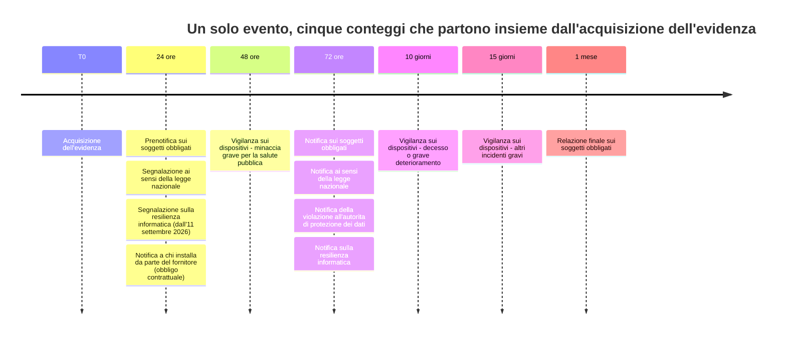
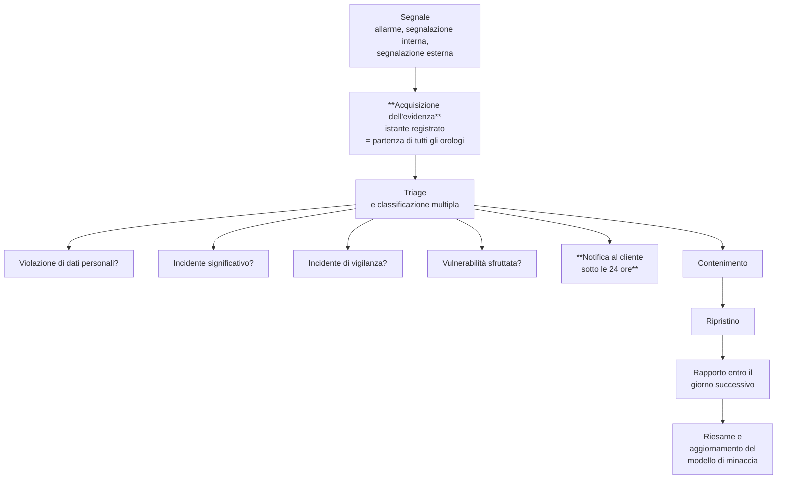

# Risposta agli incidenti

> **Presupposto di lettura.** Il quadro normativo di ciascun regime è in
> [08](./08-quadro-normativo-e-misure.md); le capacità tecniche di registrazione, esportazione e
> rilevazione su cui questo capitolo si appoggia sono in [04](./04-tracciamento.md).
>
> **Avvertenza.** Analisi tecnica, non consulenza legale. La qualificazione di un evento come
> incidente notificabile, in ciascuno dei regimi descritti, è del soggetto obbligato e va
> assunta con il supporto di un professionista abilitato.

## 1. Perché questo capitolo esiste in questa forma

Un incidente su una piattaforma sanitaria può far scattare **contemporaneamente** obblighi di
notifica appartenenti a regimi diversi, con destinatari diversi, termini diversi, contenuti
diversi e soggetti obbligati diversi. Sono orologi separati: **partono in momenti diversi,
corrono a velocità diverse e non si fermano l'uno per l'altro.**

L'errore che questo capitolo serve a prevenire non è dimenticare una notifica: è **confonderne
due**. Chi crede che «notificare entro 72 ore» sia una regola sola conclude che, avendo
notificato all'autorità di protezione dei dati, ha adempiuto; e ha invece mancato una
prenotifica di 24 ore verso un altro destinatario, che era già scaduta.

Un unico manuale operativo che orchestri gli orologi è quindi un deliverable concreto, ed è
questo capitolo.

## 2. I quattro orologi - e il quinto

### 2.1 Orologio 1 - Violazione di dati personali

| | |
|---|---|
| **Destinatario** | Autorità di controllo per la protezione dei dati |
| **Soggetto obbligato** | Il **titolare** del trattamento, che è chi installa |
| **Termine** | «Senza ingiustificato ritardo e, ove possibile, **entro 72 ore**» dal momento in cui il titolare ne è venuto a conoscenza (art. 33, par. 1, del Regolamento (UE) 2016/679) |
| **Esclusione** | Salvo che sia improbabile che la violazione presenti un rischio per i diritti e le libertà |
| **Verso l'interessato** | Comunicazione quando la violazione è suscettibile di presentare un **rischio elevato** (art. 34). L'art. 34, par. 3, lettera a), prevede che la comunicazione non sia richiesta quando il titolare ha applicato misure che rendono i dati **incomprensibili a chi non è autorizzato**, e cita espressamente la cifratura |

**Il punto che riguarda il fornitore, e va scritto senza attenuazioni.** L'art. 33, par. 2,
dispone che **il responsabile del trattamento informa il titolare senza ingiustificato ritardo**
dopo essere venuto a conoscenza della violazione. **Non esiste, per il responsabile, una soglia
di 72 ore**: la soglia di 72 ore è del titolare, verso l'autorità, e decorre dal momento in cui
**il titolare** ne è venuto a conoscenza.

Ne discende che, se il fornitore avvisa il cliente alla settantesima ora, il cliente non ha
alcun ritardo formale - il suo orologio parte in quel momento - ma ha perso ogni possibilità di
istruire la notifica in modo utile, e il fornitore ha con ogni probabilità violato il proprio
obbligo di informare «senza ingiustificato ritardo». **L'accordo sul trattamento deve quindi
fissare un termine contrattuale concreto e un canale**: il progetto adotta **sotto le 24 ore**,
e **immediatamente** per gli incidenti di gravità elevata (§4).

### 2.2 Orologio 2 - Incidenti sui soggetti obbligati alla sicurezza delle reti

| | |
|---|---|
| **Destinatario** | Struttura nazionale di risposta agli incidenti informatici |
| **Soggetto obbligato** | Il soggetto essenziale o importante, che è chi installa |
| **Termini** | **Prenotifica entro 24 ore**, **notifica entro 72 ore**, **relazione finale entro un mese** (art. 25 del d.lgs. 4 settembre 2024, n. 138) |
| **Decorrenza** | Dall'**acquisizione dell'evidenza** dell'incidente significativo (§3) |
| **Tassonomia** | Tre tipologie per i soggetti importanti, **quattro** per gli essenziali |

Le quattro tipologie di incidente significativo di base sono costruite su tre elementi -
**condizione**, **compromissione**, **oggetto della compromissione** - e sono, in sintesi:

| Tipologia | Compromissione | Oggetto | Importanti | Essenziali |
|---|---|---|:-:|:-:|
| 1 | Perdita di **riservatezza** verso l'esterno | Dati digitali | ● | ● |
| 2 | Perdita di **integrità** con impatto verso l'esterno | Dati digitali | ● | ● |
| 3 | Violazione dei **livelli di servizio attesi** | Servizi e attività | ● | ● |
| 4 | **Accesso non autorizzato o con abuso dei privilegi concessi** | Dati digitali | - | ● |

La quarta è quella che riguarda l'avversario primario di questo sistema
([01 §3.1](./01-modello-di-minaccia.md)), ed è la ragione per cui la rilevazione descritta in
[04 §7](./04-tracciamento.md) non è osservabilità ma **requisito funzionale**.

Un chiarimento dell'autorità che riguarda direttamente il fornitore in modalità di servizio
gestito: l'oggetto della compromissione può essere costituito anche da «dati digitali sui quali
il soggetto esercita il controllo anche parziale», categoria che comprende espressamente i dati
di cui non si ha la titolarità ma per il cui trattamento si ha una responsabilità in forza di
contratto - cioè **esattamente la posizione di chi gestisce i sistemi di un cliente**.

### 2.3 Orologio 3 - L'obbligo delle aziende sanitarie ai sensi della legge nazionale

| | |
|---|---|
| **Destinatario** | Autorità nazionale per la cybersicurezza |
| **Soggetto obbligato** | Amministrazioni centrali, regioni, città metropolitane, comuni sopra soglia o capoluogo, **aziende sanitarie locali**, società di trasporto pubblico |
| **Termini** | **Segnalazione** «senza ritardo e comunque entro il termine massimo di ventiquattro ore» dalla conoscenza; **notifica completa entro 72 ore** (art. 1 della legge 28 giugno 2024, n. 90) |
| **Sanzione** | In caso di reiterazione entro cinque anni, sanzione amministrativa **da 25.000 a 125.000 €** e responsabilità disciplinare |

**Perché è un orologio distinto e non una duplicazione del secondo.** Il destinatario è diverso;
l'ambito soggettivo è diverso - un'azienda sanitaria locale è quasi sempre obbligata a
entrambi; la tassonomia è diversa. Un cliente che sia insieme soggetto obbligato alla sicurezza
delle reti e azienda sanitaria locale **conta due volte**, e il prodotto deve fornirgli evidenza
utilizzabile in entrambi i formati.

### 2.4 Orologio 4 - Vigilanza sui dispositivi medici

| | |
|---|---|
| **Destinatario** | Autorità competenti degli Stati membri |
| **Soggetto obbligato** | Il **fabbricante** del dispositivo. Non è il progetto **oggi** (vincolo [V-06](../11_registri/01-vincoli-in-vigore.md#v-06)): è il **soggetto fabbricante, da costituire**, per la nostra distribuzione, e chi immette sul mercato per ogni derivata |
| **Termini** | **2 giorni** in caso di minaccia grave per la salute pubblica; **10 giorni** in caso di decesso o grave deterioramento imprevisto dello stato di salute; **15 giorni** per gli altri incidenti gravi (art. 87 del Regolamento (UE) 2017/745) |

**Perché compare in un capitolo di sicurezza.** Perché un incidente di sicurezza può **essere
anche** un incidente di vigilanza: se la compromissione ha alterato un dato clinico su cui è
stata assunta una decisione, o ha reso indisponibile un servizio di sorveglianza su cui una
persona faceva affidamento, l'evento entra in questo regime **oltre che** negli altri. La
valutazione è del fabbricante, e il progetto la abilita fornendo l'evidenza tecnica.

**Il termine più stringente dei cinque regimi è qui**: due giorni, e la valutazione che li
innesca richiede di stabilire un nesso fra l'evento tecnico e la conseguenza clinica. È il punto
in cui la tabella delle conseguenze cliniche di [01 §5](./01-modello-di-minaccia.md) smette di
essere un esercizio di modellazione e diventa uno strumento operativo di triage.

**Dichiarazione di [`Q-276`](../11_registri/02-questioni-aperte.md#q-276).** La riscrittura della riga di soggetto obbligato rende il progetto titolare di due obblighi di vigilanza che richiedono capacità tecniche non ancora progettate: la **tassonomia stabile degli eventi contati** e la **conservazione della diagnostica pari alla finestra di vigilanza**. Entrambi gli obblighi contano eventi; non si accendono a posteriori; la serie storica mancante non si ricostruisce. Con il ruolo di fabbricante, la titolarità di questa lacuna sarà nostra, e va dichiarata esplicitamente come rischio rilevante nel registro delle capacità abilitanti mancanti.

### 2.5 Il quinto - Resilienza informatica, dall'11 settembre 2026

| | |
|---|---|
| **Destinatario** | Struttura nazionale di risposta agli incidenti e agenzia europea per la cibersicurezza |
| **Soggetto obbligato** | Il **fabbricante** ai sensi del regolamento sulla resilienza informatica e, nei limiti previsti, l'amministratore fiduciario di software libero |
| **Oggetto** | **Vulnerabilità attivamente sfruttate** e **incidenti gravi** che incidono sulla sicurezza del prodotto |
| **Termini** | Segnalazione iniziale entro **24 ore**, notifica entro **72 ore**, relazione conclusiva successiva. **Il termine puntuale della relazione conclusiva non è stato verificato da `COMP` sul testo: `[NV]`** |
| **Decorrenza dell'obbligo** | **11 settembre 2026** (art. 71 del Regolamento (UE) 2024/2847) |

**Due fatti da tenere insieme.** Il primo: l'11 settembre 2026 **cade prima** del rilascio della
versione 1.0. Il secondo: **nessun obbligo sorge oggi in capo al progetto**, perché il progetto
non è un prodotto immesso sul mercato nel corso di un'attività commerciale e il titolare, in
quanto persona fisica, non può essere qualificato come amministratore fiduciario
([08 §5](./08-quadro-normativo-e-misure.md)).

Ma **l'obbligo sorge in capo a chi integra il progetto in un prodotto commerciale**, e sorge
adesso. Un integratore che riceva la notizia di una vulnerabilità attivamente sfruttata ha 24
ore, e non può rispettarle se il progetto non ha una politica di divulgazione con tempi
dichiarati e un canale funzionante ([07 §6](./07-catena-di-fornitura.md)). **La capacità di
segnalazione del progetto è quindi un requisito dell'integratore prima ancora che un obbligo
proprio.**

**Il terzo termine, che il progetto dichiara qui.** Perché quel requisito sia soddisfatto non
basta che il canale esista: serve un termine, e serve che sia **il termine del progetto verso i
propri integratori**, distinto dai due che già esistevano e che coprono altro. Il primo è la
**presa in carico di una segnalazione di vulnerabilità** - tre giorni lavorativi, dichiarati in
[`SECURITY.md`](https://github.com/fedcal/Telemedic/blob/main/SECURITY.md) - ed è un impegno verso
**chi segnala**, cioè su un flusso in entrata. Il secondo è la **notifica di un incidente
rilevato al cliente** - sotto le 24 ore, §4 e misura `RS.CO-02` di
[09 §9](./09-ripartizione-delle-responsabilita.md) - ed è contrattuale, verso **chi ha
installato**. Sono obblighi diversi per oggetto, per direzione e per destinatario, e nessuno dei
due copre l'avviso in uscita verso chi integra il progetto in un proprio prodotto.

> **Il progetto avvisa i propri integratori entro 24 ore dal momento in cui acquisisce l'evidenza**
> che una vulnerabilità del progetto è attivamente sfruttata, e **immediatamente** quando
> l'evidenza indica che lo sfruttamento è in corso su installazioni in esercizio. L'avviso è dovuto
> **indipendentemente dalla disponibilità di una correzione**: rinviarlo fino alla correzione
> toglierebbe all'integratore proprio il tempo che il suo obbligo gli concede.

Tre precisazioni ne fanno un impegno verificabile invece di una formula. **L'avviso porta
l'istante in cui il progetto ha acquisito l'evidenza**, perché il termine dell'integratore decorre
dalla conoscenza **propria** e non dalla nostra, e perché quell'istante è esso stesso un artefatto
di conformità (§3). **L'avviso porta ciò che serve a decidere, non ciò che serve ad attaccare**:
componente e versioni interessate, se lo sfruttamento è confermato, mitigazioni temporanee
disponibili, stato della correzione. E il termine è un **impegno di politica del progetto, non un
obbligo di legge**: nessun obbligo di segnalazione sorge oggi in capo al progetto, per le ragioni
appena dette, e questo termine esiste perché senza di esso l'obbligo di un terzo diventa
inadempibile.

## 3. Il termine decorre dall'acquisizione dell'evidenza

**Questa è l'informazione operativa più importante del capitolo.**

L'autorità nazionale è esplicita: «l'acquisizione dell'evidenza è tipicamente successiva al
verificarsi dell'incidente e **definisce il momento dal quale decorre il termine** per la
trasmissione della prenotifica e della notifica».

Ne discendono tre conseguenze che cambiano il modo di ragionare sui tempi.

**Prima - il prodotto che rileva prima non accorcia il termine: accorcia il ritardo.** Il
termine è sempre di 24 ore dall'evidenza. Ciò che il prodotto può fare è far sì che l'evidenza
arrivi ore o giorni prima, invece che con la segnalazione di un terzo.

**Seconda - l'evidenza si acquisisce in tre modi**, e solo uno è automatizzabile: segnalazione
di attori esterni, tipicamente la struttura nazionale di risposta; segnalazione di attori
interni, tipicamente l'utente che chiama il supporto; **analisi degli eventi rilevati dai sistemi
di monitoraggio**. Il terzo è quello su cui il prodotto può incidere, ed è la giustificazione
economica degli indicatori di [04 §7](./04-tracciamento.md).

**Terza - il momento dell'acquisizione dell'evidenza va registrato**, perché è il momento da cui
il soggetto obbligato dovrà dimostrare di aver contato. Un evento di rilevazione senza istante
preciso rende indimostrabile la tempestività, ed è un problema anche quando il soggetto è stato
tempestivo.

Ne discende un requisito che sembra formale e non lo è: **la riga di registro che attesta
l'acquisizione dell'evidenza - chi, quando, per quale via, su quale segnale - è essa stessa un
artefatto di conformità**, e va prodotta automaticamente all'attivazione di un allarme.

## 4. Gli obblighi del fornitore verso chi installa

Sono contrattuali e discendono dai requisiti dell'appendice sui requisiti di sicurezza eleggibili
delle linee guida nazionali sugli approvvigionamenti, resi obbligatori per le infrastrutture
regionali di telemedicina.

| Obbligo | Termine | Fonte |
|---|---|---|
| **Notifica immediata** al cliente in caso di rilevazione di un incidente di **gravità elevata**, con l'indicazione delle azioni da intraprendere, tramite canali concordati | Immediata | Requisito R42 |
| **Notifica di ogni incidente di sicurezza rilevato** | **Sotto le 24 ore** (termine contrattuale del progetto) | Requisito R42; presupposto dell'orologio 2 |
| **Rapporto** che descriva tipologia di attacco subito, vulnerabilità sfruttate, **sequenza temporale degli eventi** e contromisure adottate | **Entro il giorno successivo** | Requisito R43 |
| **Consegna dei log in formato aperto**, su richiesta | **Entro il giorno successivo** alla richiesta | Requisito R44 |
| **Bonifica e ripristino** dei sistemi del committente compromessi in conseguenza di una vulnerabilità dei prodotti forniti, fino allo stato di assenza di vulnerabilità | Secondo il piano concordato | Requisito R14 |
| **Monitoraggio delle correzioni** pubblicate sui componenti utilizzati, con valutazione avviata entro il giorno successivo al rilascio | Quotidiano | Requisito R45 |

**Perché il termine di notifica al cliente è sotto le 24 ore e non «entro 24 ore».** Perché il
cliente ha 24 ore **dal proprio** momento di conoscenza: se lo acquisisce alla ventitreesima ora
del fornitore, non ha violato nulla ma non ha materialmente il tempo di istruire una
prenotifica sensata. Il margine è la sostanza dell'obbligo, non un supplemento di cortesia.

**Il rapporto entro il giorno successivo non è redigibile a mano.** Richiede la sequenza
temporale degli eventi su un intervallo, ricostruita da componenti diversi con orologi
sincronizzati, esportabile e con impronta di integrità. È esattamente ciò che
[04 §6](./04-tracciamento.md) richiede, ed è la ragione per cui quel paragrafo esiste.

## 5. Il regime che dipende da un numero che il cliente sceglie

La terza tipologia di incidente significativo - violazione dei **livelli di servizio attesi** -
ha una proprietà che le altre non hanno: **la soglia la definisce il cliente**, ai sensi della
misura sul monitoraggio continuo, e l'autorità la distingue nettamente dagli accordi
contrattuali sui livelli di servizio.

L'esempio ufficiale dell'autorità è aritmetico: se il livello di servizio atteso è «disponibile
almeno il 99% del tempo su base giornaliera», un'indisponibilità superiore a **quattordici
minuti e ventiquattro secondi** in un giorno costituisce violazione, e quindi incidente
significativo notificabile. Altri esempi indicati: indisponibilità di un sito oltre trenta
minuti consecutivi; disponibilità limitata di un servizio per oltre il cinque per cento degli
utenti.

**Conseguenza di prodotto, e non è la stessa cosa delle metriche di qualità della sessione.** Le
metriche già previste - latenza, perdita di pacchetti, variazione del ritardo, banda - sono
**necessarie e non sufficienti**: misurano la qualità della singola sessione, non la
disponibilità del servizio. Serve un indicatore di **disponibilità per tenant e per servizio**,
storicizzato con granularità sufficiente a riconoscere il superamento di una soglia dell'ordine
del punto percentuale su base giornaliera, con soglie configurabili e allarme al superamento.

I livelli di servizio attesi ai sensi della misura di monitoraggio e gli accordi contrattuali
previsti dal decreto sulle infrastrutture regionali **non sono la stessa cosa**, ma il cliente
tenderà a tarare gli uni sugli altri. Definire i valori di riferimento da proporre è la
questione [Q-152](../11_registri/02-questioni-aperte.md#q-152), indirizzata all'architettura e alla roadmap.

## 6. Il processo, dal segnale alla chiusura

**Il triage è multiplo, non alternativo.** Le quattro domande si pongono tutte, sempre, e le
risposte sono indipendenti: un evento può essere insieme violazione di dati personali, incidente
significativo e incidente di vigilanza. Una lista di controllo che le presenti come alternative
produce esattamente l'errore descritto nel §1.

**Il contenimento non attende la classificazione.** Corre in parallelo: la classificazione serve
agli obblighi di notifica, il contenimento serve alle persone.

**La raccolta delle evidenze precede il contenimento dove è possibile senza aggravare il danno.**
Un contenimento che distrugga lo stato del sistema rende impossibile la ricostruzione richiesta
dalla notifica delle 72 ore. È un compromesso che va deciso prima, nella procedura, non durante.

## 7. Riesame, esercitazione e miglioramento

- **Ogni incidente produce un riesame**, con esito documentato, che aggiorna il modello di
  minaccia ([01 §8](./01-modello-di-minaccia.md)), il registro dei rischi del dispositivo e -
  quando la causa è un difetto - un requisito e una prova che ne verifichino la correzione.
- **La procedura è esercitata almeno annualmente**, con verbale. Una procedura mai esercitata
  non è una procedura: è un documento. L'esercitazione verifica anche i canali di notifica verso
  il cliente, che è la parte che si scopre rotta al primo uso reale.
- **La procedura è raccordata** con il modello di processo delle linee guida nazionali sulla
  gestione degli incidenti pubblicate a fine 2025. **Delle linee guida non si dispone ancora della
  versione completa**: una lacuna `[NV]` che `SEC` deve risolvere acquisendole prima del consolidamento della procedura.
- **Il registro delle manutenzioni, dei collaudi e dei controlli di sicurezza** effettuati
  sull'installazione è mantenuto ed esportabile: è evidenza documentale richiesta sia dalle
  specifiche di base sia dalle indicazioni nazionali sulla telemedicina.

## 8. Ciò che il prodotto deve fornire, in un elenco verificabile

| Capacità | Perché | Verifica |
|---|---|---|
| **Rilevazione** di accessi anomali e superamenti di soglia, con spinta verso il sistema di correlazione del cliente | L'evidenza deve arrivare in ore, non in giorni | Superamento indotto di ciascuna soglia; verifica dell'emissione dell'allarme |
| **Registrazione dell'istante di acquisizione dell'evidenza** | È il momento da cui contano tutti gli orologi (§3) | Presenza della riga all'attivazione dell'allarme |
| **Ricostruzione della sequenza temporale** degli eventi di una sessione, di un soggetto, di un attore o di un tenant, con orologi sincronizzati | La notifica delle 72 ore e il rapporto del giorno successivo la richiedono | Chiamata su un caso di prova: cronologia completa e ordinata |
| **Esportazione in formato aperto con impronta di integrità** del pacchetto | Deve reggere in sede ispettiva e giudiziaria | Esecuzione su volume rappresentativo, misurazione del tempo, verifica dell'impronta |
| **Integrità e non alterabilità del registro** | Un registro alterabile non prova nulla | Alterazione indotta: lo strumento rileva la rottura della catena |
| **Misurazione e storicizzazione della disponibilità** per tenant e per servizio, con soglie e allarme | La terza tipologia dipende da essa (§5) | Simulazione di indisponibilità oltre soglia |
| **Notifica al cliente sotto le 24 ore**, immediata per la gravità elevata | Il cliente ha 24 ore dal **proprio** momento di conoscenza | Clausola contrattuale presente; esercitazione documentata |
| **Modello di rapporto** con tipologia, vulnerabilità sfruttate, sequenza temporale e contromisure | Requisito R43 | Modello predisposto; esercitazione |
| **Registro delle manutenzioni e degli aggiornamenti** applicati all'installazione | Evidenza documentale richiesta | Interrogabile per periodo e per installazione |
| **Canale di divulgazione coordinata** con tempi dichiarati | L'integratore ne ha bisogno per il proprio obbligo delle 24 ore (§2.5) | Prova di invio su un caso simulato, con misurazione del tempo di riscontro |

## 9. Che cosa quest'area lascia aperto

| Riferimento | Questione | A chi |
|---|---|---|
| [Q-152](../11_registri/02-questioni-aperte.md#q-152) | Valori di riferimento dei livelli di servizio attesi da proporre, distinti dagli accordi contrattuali previsti dal decreto sulle infrastrutture regionali (§5) | Architettura, roadmap |
| `[NV]` | Acquisizione integrale delle linee guida nazionali sul processo di gestione degli incidenti e allineamento della procedura (§7) | `SEC`, `COMP` |
| `[NV]` | Termine puntuale della relazione conclusiva nel regime della resilienza informatica (§2.5) | `COMP` |
| [Q-154](../11_registri/02-questioni-aperte.md#q-154) | Se l'operatore del servizio gestito diventa soggetto obbligato in proprio, **gli orologi 2 e 3 diventano suoi**, non del solo cliente | → Committente |
| [`Q-159`](../11_registri/02-questioni-aperte.md#q-159) | Ripartizione dei ruoli fra titolare, responsabile, fabbricante e soggetto obbligato, che determina chi conta quale orologio | `COMP` |
