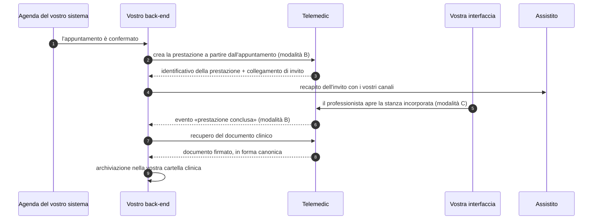
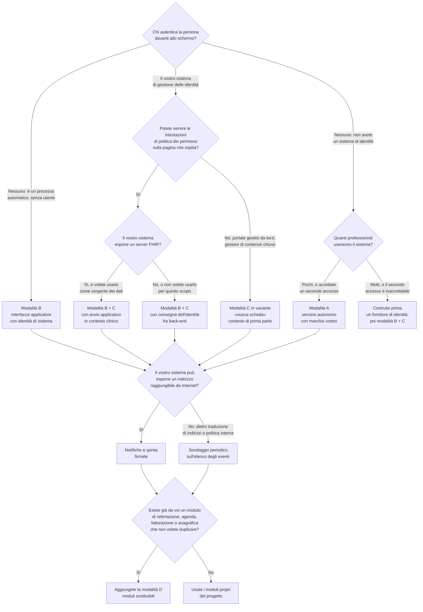

# Integrazione — indice e orientamento

> **Questa è l'area su cui si gioca l'adozione del progetto.** È scritta per chi non ha mai
> visto il codice di Telemedic e non ha intenzione di vederlo: uno sviluppatore che deve far
> parlare il proprio sistema con questo, in un tempo definito, senza sorprese a valle.

## 1. Che cosa fa questo prodotto quando lo integri

Telemedic è un componente che eroga **prestazioni di telemedicina** — televisita, teleconsulto,
teleassistenza, telemonitoraggio — dentro un sistema che esiste già. Non è un portale a cui
mandare gli utenti, non è la cartella clinica, non è l'anagrafica, non è l'agenda.

Tre affermazioni discendono direttamente dal profilo di integratore su cui il progetto è
costruito (`00_PROJECT_BRIEF.md` §6.2) e vanno lette prima di tutto il resto, perché
determinano la forma di ogni interfaccia descritta in quest'area:

1. **Non impone la propria interfaccia.** Chi integra ha già la propria, e la propria identità
   visiva. Telemedic si incorpora in bianco, dentro la vostra.
2. **Non impone la propria autenticazione.** Chi integra ha già un sistema di gestione delle
   identità. Telemedic accetta un'identità già autenticata altrove senza chiedere all'utente un
   secondo accesso.
3. **Non diventa il dato di riferimento.** Assistiti, professionisti, sedi e appuntamenti sono
   già gestiti altrove. Telemedic lavora **per riferimento**, con gli identificatori del dominio
   di chi integra, e restituisce al sistema di origine ciò che produce.

Se una di queste tre affermazioni non è vera per il vostro caso, l'integrazione è possibile lo
stesso ma sceglierete modalità diverse. L'albero decisionale del §4 serve esattamente a questo.

## 2. Che cosa quest'area non contiene

Quest'area **non ripete i fondamenti**. Dove serve una conoscenza di base, rinvia:

| Se non hai familiarità con… | Leggi prima |
|---|---|
| Che cosa distingue una televisita da un teleconsulto, e perché la distinzione cambia il modello dati | [10 §02 — Le prestazioni di telemedicina](../10_fondamenti/02-prestazioni-di-telemedicina.md) |
| Identificatori dell'assistito in Italia, dominio di attribuzione, riconciliazione, identità del professionista | [10 §04 — Identità e anagrafiche](../10_fondamenti/04-identita-e-anagrafiche.md) |
| HL7 v2, CDA, IHE, DICOM, terminologie cliniche e le loro licenze | [10 §05 — Gli standard di interoperabilità](../10_fondamenti/05-standard-di-interoperabilita.md) |
| FHIR: risorse, profili, estensioni, riferimenti, interazioni REST, ricerca | [10 §06 — FHIR da zero](../10_fondamenti/06-fhir-da-zero.md) |
| Fascicolo sanitario elettronico, infrastrutture nazionali e regionali, chi alimenta e chi consulta | [10 §07 — FSE e infrastrutture nazionali](../10_fondamenti/07-fse-e-infrastrutture-nazionali.md) |
| Perché una videochiamata è un problema difficile: attraversamento delle reti, segnalazione, degradazione | [10 §08 — WebRTC da zero](../10_fondamenti/08-webrtc-da-zero.md) |
| I protocolli uno per uno: HTTP condizionale, OAuth, PKCE, scambio di token, buste di evento, firma dei messaggi | [10 §13 — I protocolli](../10_fondamenti/13-protocolli.md) |

I capitoli che seguono presuppongono quei moduli e li citano invece di riscriverli. Dove un
concetto è ripetuto, è perché il suo uso nell'integrazione ha una forma diversa da quella
generale, e la differenza è dichiarata.

## 3. Le quattro modalità, in una pagina

Il progetto espone **quattro** modalità di integrazione, tutte e quattro supportate. Non sono
alternative: sono strati che un singolo integratore usa insieme.

| | Modalità | Che cosa integri | Chi la scrive, da voi |
|---|---|---|---|
| **A** | **Servizio autonomo** | Niente: installate Telemedic e lo usate con la sua interfaccia, con il vostro marchio e le vostre identità | Un amministratore di sistema. Nessuno sviluppo |
| **B** | **Interfacce applicative** | Il vostro back-end chiama Telemedic, e Telemedic notifica il vostro back-end | Uno sviluppatore back-end |
| **C** | **Componente incorporabile** | La stanza del consulto compare dentro la vostra interfaccia, con il vostro tema | Uno sviluppatore front-end, **più** il back-end per la consegna dell'identità |
| **D** | **Moduli sostituibili** | Spegnete un modulo di Telemedic e ci mettete il vostro: refertazione, agenda, fatturazione, risoluzione degli identificativi, destinazione dell'archiviazione | Uno sviluppatore back-end, con un impegno di manutenzione nel tempo |

Il capitolo [01 — Le quattro modalità](01-modalita-di-integrazione.md) le descrive una per una,
con **cosa comportano, cosa richiedono, cosa si ottiene** e — la parte che conta di più —
**quando ciascuna è la scelta sbagliata**.

### 3.1 Come si combinano nel caso più comune

Il percorso tipico di un gestionale sanitario in cloud, che è il profilo di riferimento del
progetto, usa **B + C insieme**, con **D** solo dove esiste già un modulo proprio:

Il punto da notare è il passo 7: **il contenuto clinico non viaggia nella notifica**. La
notifica dice che è successo qualcosa e dove trovarlo; il contenuto si rilegge con una chiamata
autenticata, sotto l'autorizzazione di chi legge. È una regola di progetto senza eccezioni, ed è
motivata nel capitolo [04 §3](04-integrazione-per-eventi.md).

## 4. Albero decisionale: quale modalità fa per te

Le domande sono in ordine: si risponde alla prima, si segue il ramo, si passa alla successiva.
La prima domanda è quella che discrimina davvero, e non è tecnica.

### 4.1 Le stesse risposte in forma di tabella

Chi preferisce una tabella a un diagramma trova qui la stessa informazione, con l'aggiunta della
colonna che conta: **quanto costa**, in termini di competenze che dovete avere in casa.

| Situazione di partenza | Modalità | Competenze richieste da voi | Trappola principale |
|---|---|---|---|
| Gestionale in cloud con proprio sistema di identità, propria interfaccia, propria agenda | **B + C**, eventualmente **D** | Back-end con crittografia asimmetrica (firma di asserzioni, custodia di chiave privata); front-end che sappia incorporare in modo sicuro | La consegna dell'identità fra back-end. È il 70 % del costo e non si può aggirare passando dal browser |
| Studio o poliambulatorio senza sistema di identità | **A**, poi eventualmente **B** | Nessuna, per partire | Il secondo accesso per gli utenti. È un costo reale, va dichiarato agli utenti invece di essere nascosto |
| Azienda sanitaria con motore di integrazione già in esercizio | **B** in variante messaggistica ospedaliera | Configurazione del motore esistente, nessuno sviluppo nuovo | La perdita informativa nella traduzione. Va misurata, non presunta |
| Ente pubblico con capitolato che impone conformità a profili di interoperabilità | **B + C** con profili dichiarati | Back-end FHIR, mutua autenticazione a livello di trasporto, esportazione delle tracce di accesso | I requisiti di conformità emergono a capitolato e costano molto se scoperti a valle |
| Applicazione per il cittadino, sviluppata da terzi | **B** con applicazione a pagina intera | Client OAuth pubblico fatto bene | La custodia del token su un dispositivo che non controllate |
| Pagatore: fondo, mutua, polizza | **B**, **profilo esclusivamente amministrativo** | Back-end | **Il pagatore non è un consultatore.** Vedi §6 e il capitolo [09](09-obblighi-di-chi-integra.md) |

## 5. Percorsi di lettura

Nessuno legge quest'area per intero. Ecco i tre percorsi che coprono i casi reali.

### 5.1 «Devo far partire una prima integrazione entro venerdì»

1. [02 — Primo avvio](02-primo-avvio.md) — prerequisiti, passi, punti in cui ci si blocca.
2. [03 — Integrazione per interfacce applicative](03-integrazione-per-api.md) §1–§4 — autenticazione fra sistemi e prima chiamata.
3. [04 — Integrazione per eventi](04-integrazione-per-eventi.md) §1–§4 — ricevere e verificare la prima notifica.
4. [10 — Domande frequenti e antipattern](10-domande-frequenti-e-antipattern.md) — leggetelo **prima** di aprire una segnalazione: contiene gli errori che ci aspettiamo.

### 5.2 «Devo decidere l'architettura di integrazione»

1. [01 — Le quattro modalità](01-modalita-di-integrazione.md), per intero, comprese le sezioni «quando è la scelta sbagliata».
2. [06 — Identità e delega](06-identita-e-delega.md), che è il capitolo con più conseguenze irreversibili.
3. [07 — Dati e sincronizzazione](07-dati-e-sincronizzazione.md), per capire chi possiede cosa.
4. [08 — Moduli sostituibili](08-moduli-sostituibili.md), per sapere cosa potete sostituire e con quali garanzie.
5. [09 — Obblighi di chi integra](09-obblighi-di-chi-integra.md), che è il capitolo più importante dell'area e va letto **prima** della firma di un contratto, non dopo.

### 5.3 «Devo capire cosa mi assumo, sul piano legale e regolatorio»

[09 — Obblighi di chi integra](09-obblighi-di-chi-integra.md), da solo, con la tabella di
ripartizione delle responsabilità. Poi, se il vostro caso lo richiede, l'area
`docs/08_compliance/`.

## 6. Tre avvertenze che non si possono rinviare

Non sono note a piè di pagina: sono condizioni di legittimità dell'uso.

### 6.1 Questo non è un dispositivo medico marcato

Il repository pubblico è **codice sorgente**, non un dispositivo medico immesso sul mercato, e
lo dichiara (decisione D17, D51). **Il progetto non appone marcatura CE e non sottoscrive
dichiarazioni di conformità** (D28, D49). Chi integra, distribuisce o mette in servizio il
software per erogare prestazioni sanitarie assume gli obblighi che ne derivano, incluso quello
di fabbricante quando ne ricorrono i presupposti.

La conseguenza operativa per voi è precisa e non aggirabile: **finché non esiste una marcatura,
il software non è utilizzabile per l'erogazione di prestazioni sanitarie su pazienti reali**
(D16). Ogni artefatto distribuito lo dichiara. Il capitolo [09](09-obblighi-di-chi-integra.md)
spiega che cosa significa per voi in concreto.

### 6.2 Il progetto non è accreditato presso la federazione delle identità

Il progetto è **conforme e verificabile** su identità digitale nazionale, **non accreditato**
(vincolo V-05, decisione D36). Il fornitore di servizi verso la federazione è **chi installa**,
non il progetto: la convenzione, l'elenco dei servizi attivi, i livelli di sicurezza dichiarati
e gli obblighi ricorrenti gravano su di voi. Il capitolo [06 §6](06-identita-e-delega.md) elenca
che cosa dovete fare e quali sono i tempi che **non** sono dichiarati da alcuna fonte.

### 6.3 Il pagatore non è un consultatore

L'art. 15, c. 4, del DM 7 settembre 2023 esclude **sempre** le compagnie di assicurazione
dall'accesso al Fascicolo sanitario elettronico, insieme a periti e datori di lavoro. Il caso
d'uso in cui una prestazione di telemedicina è **pagata** da un fondo, una mutua o una polizza
resta pienamente valido; **nessuna funzionalità documentata in quest'area può mediare l'accesso
di un assicuratore al fascicolo, né direttamente né per il tramite di un professionista.**

È un equivoco che un integratore commerciale può fare in buona fede, perché il pagatore è un
soggetto legittimo del percorso e ha bisogno di sapere che la prestazione è stata erogata. Ciò
che può ottenere è **l'esito amministrativo**, non il contenuto clinico. La trattazione completa,
con il profilo di autorizzazione ammesso, è in [09 §5](09-obblighi-di-chi-integra.md).

## 7. Convenzioni di quest'area

### 7.1 Nomi e domini negli esempi

Tutti gli esempi usano **dati sintetici** e domini riservati. Non esiste alcun riferimento a
sistemi, aziende o prodotti reali, e nessun segreto compare in chiaro.

| Ruolo | Nome negli esempi |
|---|---|
| Interfaccia applicativa e facciata FHIR del progetto | `api.telemedic.esempio.it` |
| Componente incorporabile | `embed.telemedic.esempio.it` |
| Emittente dei token e federazione | `telemedic.esempio.it/realms/<realm>` |
| Documentazione, schemi, catalogo dei problemi | `docs.telemedic.esempio.it` |
| Sistema di chi integra | `gestionale.integratore.example` |
| Fornitore di identità di chi integra | `idp.integratore.example` |
| Identificativo di tenant | `asl-nord-01`, `poliambulatorio-02` |

Gli identificativi di risorsa hanno prefisso parlante (`ses-`, `enc-`, `apt-`, `prc-`, `pz-`) e
sono **opachi**: la loro forma interna non è contratto e può cambiare
([03 §9](03-integrazione-per-api.md)).

### 7.2 Marcature

| Marcatura | Significato |
|---|---|
| Citazione con numero di RFC, di articolo o di sezione di specifica | Verificato su fonte primaria |
| *proposta di progetto* | Non è uno standard: è una scelta di Telemedic. Nomi di intestazioni, ambiti di autorizzazione ed endpoint marcati così sono decisioni, non citazioni |
| **`[NV]`** | Non verificato. Dichiara che cosa va controllato e a chi va chiesto. **Non si inventa** |

Regola redazionale vincolante, che vale anche per voi quando scriverete la vostra
documentazione interna: **nessun nome di parametro, intestazione, ambito o endpoint marcato
*proposta di progetto* va presentato come se fosse standard.** Ci sono almeno tre casi in cui
l'errore è diffuso nel settore, e quest'area li corregge esplicitamente: la chiave di
idempotenza, le intestazioni di limitazione del traffico, la firma dei messaggi
([03 §5](03-integrazione-per-api.md), [03 §7](03-integrazione-per-api.md),
[04 §5](04-integrazione-per-eventi.md)).

### 7.3 Che cosa è contratto e che cosa non lo è

È la distinzione da cui dipende la vostra manutenzione nel tempo. In sintesi:

**È contratto**, e cambia solo con dodici mesi di preavviso: percorsi, metodi, parametri e
schemi dell'interfaccia applicativa documentata; profili FHIR pubblicati e documento di
capacità; tipi di evento e schemi del loro dato; ambiti di autorizzazione; identificatori dei
tipi di problema e codici di esito; interfacce dei moduli sostituibili; protocollo di
messaggistica del componente incorporabile e insieme chiuso delle proprietà di tema.

**Non è contratto**, e può cambiare senza preavviso: endpoint marcati sperimentali; intestazioni
non documentate; ordine degli elementi negli elenchi non ordinati; forma interna degli
identificativi opachi, dei cursori e dei token; testo del campo di dettaglio degli errori, che è
leggibile da un essere umano ma non è pensato per essere analizzato da un programma; endpoint
interni e di amministrazione.

Il regime completo, con le modifiche considerate compatibili e il processo di dismissione, è in
[03 §9](03-integrazione-per-api.md).

## 8. Indice dei capitoli

| # | Capitolo | Contenuto |
|---|---|---|
| 01 | [Le quattro modalità di integrazione](01-modalita-di-integrazione.md) | Servizio autonomo, interfacce applicative, componente incorporabile, moduli sostituibili: cosa comportano, cosa richiedono, cosa si ottiene, **quando ciascuna è la scelta sbagliata** |
| 02 | [Primo avvio](02-primo-avvio.md) | Dal nulla a una prima integrazione funzionante: prerequisiti espliciti, passi in ordine, i sette punti in cui ci si blocca |
| 03 | [Integrazione per interfacce applicative](03-integrazione-per-api.md) | Autenticazione fra sistemi, contratti, paginazione, idempotenza, concorrenza, limitazione del traffico, errori, versionamento e dismissione |
| 04 | [Integrazione per eventi](04-integrazione-per-eventi.md) | Catalogo degli eventi pubblici, sottoscrizione, firma, ritentativi, ordine, deduplicazione, prova di consegna |
| 05 | [Componente incorporabile](05-componente-incorporabile.md) | Incorporamento, permessi del contesto ospitante, tema e **limiti invalicabili alla personalizzazione**, ciclo di vita |
| 06 | [Identità e delega](06-identita-e-delega.md) | Collegare la vostra identità, delega fra organizzazioni, propagazione del livello di garanzia, autenticazione **eseguita** contro **riferita**, avvio applicativo in contesto clinico |
| 07 | [Dati e sincronizzazione](07-dati-e-sincronizzazione.md) | Anagrafiche, riconciliazione, identificatori e domini di attribuzione, allineamento, conflitti e loro risoluzione |
| 08 | [Moduli sostituibili](08-moduli-sostituibili.md) | Quali componenti sono sostituibili, con quali contratti, e che cosa il progetto garantisce a chi li sostituisce |
| 09 | [Obblighi di chi integra](09-obblighi-di-chi-integra.md) | **Il documento più importante dell'area.** Regolatorio, protezione dei dati, sicurezza, terminologie, con la tabella di ripartizione delle responsabilità |
| 10 | [Domande frequenti e antipattern](10-domande-frequenti-e-antipattern.md) | Gli errori che ci aspettiamo e come evitarli |

## 9. Come segnalare un problema in questa documentazione

Se una pagina di quest'area vi ha fatto perdere tempo, è un difetto della pagina, non vostro. Le
tre cose più utili da riportare, in ordine:

1. **L'esempio che non funziona.** Un esempio che non si compila o non si esegue è peggio di
   nessun esempio. Gli esempi di codice sono verificati in integrazione continua
   ([03 §10](03-integrazione-per-api.md)): se uno fallisce da voi, o l'ambiente diverge o il
   controllo non copre quel caso, e in entrambi i casi è utile saperlo.
2. **Il punto in cui vi siete bloccati e per quanto tempo.** Il capitolo
   [02 §6](02-primo-avvio.md) elenca i punti noti; se il vostro non è nell'elenco, va aggiunto.
3. **La cosa che avete assunto e che si è rivelata falsa.** È l'informazione più preziosa,
   perché indica dove la documentazione dice qualcosa di ambiguo invece di dire qualcosa di
   sbagliato — che è più difficile da trovare.
