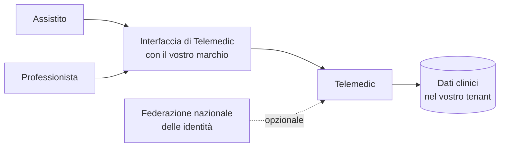
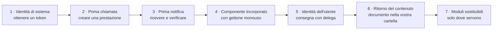

# Le quattro modalità di integrazione

Il progetto espone **quattro** modalità (decisione D4). Questo capitolo le descrive con lo stesso
schema fisso, per rendere il confronto possibile:

1. **Che cosa comporta** - che cosa cambia nel vostro sistema.
2. **Che cosa richiede** - prerequisiti tecnici, competenze, artefatti che dovete produrre.
3. **Che cosa si ottiene** - le capacità che diventano vostre.
4. **Quando è la scelta sbagliata** - le situazioni in cui va evitata, con l'alternativa.

Il punto 4 è quello per cui vale la pena leggere il capitolo. Un catalogo di raccomandazioni
indistinte non aiuta nessuno a decidere.

## 0. La domanda che discrimina davvero

Prima delle quattro modalità c'è una sola domanda architetturale, e non è tecnica:

> **Chi ha autenticato l'essere umano davanti allo schermo?**

Tutto il resto discende da lì.

| Chi autentica | Schema di identità | Schema di interfaccia | Modalità |
|---|---|---|---|
| Il vostro sistema di gestione delle identità | Consegna dell'identità fra back-end, con **delega esplicita** | Componente incorporabile in bianco | **B + C** |
| Telemedic, con le proprie identità o con la federazione nazionale | Codice di autorizzazione con prova di possesso della chiave | Interfaccia propria del progetto, con il vostro marchio | **A**, eventualmente + **B** |
| Nessuno: è un processo automatico | Credenziali di sistema con asserzione firmata | Nessuna interfaccia | **B** |
| Un sistema di cartella clinica che sa avviare applicazioni cliniche | Avvio applicativo in contesto clinico: **Telemedic è l'applicazione**, voi siete l'emittente | Applicazione avviata dal vostro sistema | **B + C**, variante di avvio |

L'ultima riga è la meno ovvia e va tenuta separata dalle altre, perché inverte i ruoli: in tutti
gli altri casi Telemedic è il servizio a cui vi rivolgete; lì è **il vostro** sistema a essere
l'autorità di autorizzazione, e Telemedic il client che chiede il permesso. Il progetto supporta
entrambi i versi, ma sono due implementazioni distinte e vanno stimate separatamente
([06 §7](06-identita-e-delega.md)).

---

## 1. Modalità A - servizio autonomo

### 1.1 Che cosa comporta

Installate Telemedic e lo usate così com'è. Gli utenti - professionisti e assistiti -
si autenticano su Telemedic. L'interfaccia è quella del progetto, con il vostro marchio,
i vostri colori, il vostro dominio.

Non scrivete codice. Configurate: tenant, marchio, ruoli, canali di recapito degli inviti,
politica di conservazione delle registrazioni, soglie di monitoraggio per assistito.

### 1.2 Che cosa richiede

| Prerequisito | Dettaglio |
|---|---|
| Un ambiente di esecuzione | Distribuzione a contenitori, con base dati relazionale, prodotto di federazione delle identità, server di inoltro per il media, archiviazione oggetti per le registrazioni. Il profilo di installazione è documentato nell'`TECH` |
| Un dominio e un certificato | Il componente serve pagine con permessi su fotocamera e microfono: **richiede connessione sicura**, senza eccezioni, anche in prova |
| Una decisione sul profilo di collocazione | Unione europea, territorio italiano, o cloud qualificato. Nessuna dipendenza obbligatoria impedisce il profilo più restrittivo (decisione D24) |
| Un amministratore | Non serve uno sviluppatore, serve qualcuno che sappia leggere una configurazione e gestire certificati e rotazioni |
| Le decisioni organizzative | Chi è il titolare del trattamento, quali sono le basi giuridiche, chi firma i referti, qual è la copertura oraria dichiarata. Vedi [09](09-obblighi-di-chi-integra.md) |

### 1.3 Che cosa si ottiene

Un servizio di telemedicina completo e funzionante **in giorni, non in settimane**: agenda,
inviti, sala d'attesa virtuale, verifica tecnica preventiva, stanza del consulto con verifica
delle chiavi, refertazione e firma, registrazione con consenso, telemonitoraggio con piani e
soglie, registro degli accessi.

È anche l'unica modalità che si può usare per **capire il prodotto prima di integrarlo**: un
ambiente in modalità A costa poco e chiarisce in un pomeriggio domande che altrimenti si
risolvono a metà di un'integrazione.

### 1.4 Quando è la scelta sbagliata

| Situazione | Perché no | Alternativa |
|---|---|---|
| I professionisti usano già quotidianamente un altro sistema | Un secondo accesso e un secondo posto in cui cercare le informazioni: la modalità A si traduce in un tasso di abbandono che nessuna funzione recupera. È il modo più affidabile di far fallire un progetto di telemedicina | **B + C** |
| L'anagrafica degli assistiti è già gestita altrove | Duplicare l'anagrafica significa creare un secondo dato di riferimento che divergerà. La divergenza fra due anagrafiche non è un difetto di dati: è un rischio clinico, perché produce fusioni e scissioni errate ([10 §04](../10_fondamenti/04-identita-e-anagrafiche.md)) | **B**, lavorando per riferimento |
| Il referto deve finire nella cartella clinica di un altro sistema | In modalità A ci finisce solo se qualcuno lo copia a mano, e ciò che si copia a mano prima o poi non si copia | **B**, con eventi e recupero del documento |
| Esiste già un modulo di refertazione o di firma con cui i professionisti hanno familiarità | Due strumenti di refertazione producono due archivi parziali | **D** |
| L'organizzazione ha un obbligo di conformità che impone profili di interoperabilità nominati a capitolato | I profili si dichiarano e si verificano sulle interfacce, non sull'interfaccia utente | **B**, con i profili richiesti |

### 1.5 Il malinteso da chiarire subito

La modalità A **non è la modalità «senza integrazione»**: è la modalità in cui l'integrazione è
**organizzativa** invece che tecnica. Restano da decidere il titolare del trattamento, la
conservazione, la firma, il flusso verso il fascicolo, la copertura oraria dichiarata. Il fatto
che non ci sia codice da scrivere non riduce di un grammo gli obblighi del capitolo
[09](09-obblighi-di-chi-integra.md).

---

## 2. Modalità B - interfacce applicative

### 2.1 Che cosa comporta

Il vostro back-end parla con Telemedic. In entrambe le direzioni: voi chiamate per far
succedere le cose, Telemedic vi notifica quando succedono.

La superficie è **doppia**, e la separazione non è cosmetica:

| | Piano clinico | Piano applicativo |
|---|---|---|
| Percorso base | `/fhir` | `/v1` |
| Tipo di contenuto | `application/fhir+json` | `application/json` |
| Contratto | Profili FHIR pubblicati + documento di capacità | Documento di interfaccia in OpenAPI 3.1 |
| Errori | Risorsa di esito dell'operazione | `application/problem+json` (RFC 9457) |
| Contiene | Assistito, professionista, prestazione, appuntamento, osservazione, documento, consenso | Sessioni media, inviti, dispositivi, marchio, notifiche, chiavi, quote, metriche |
| A chi serve | Sistemi sanitari terzi, autorità, motori di integrazione | Sviluppatori che integrano il prodotto |

**La regola di partizione**, che il progetto applica senza eccezioni:

> Se il concetto ha un equivalente clinico riconosciuto e deve poter essere consumato da un
> sistema sanitario che non conosce Telemedic → **piano clinico**.
> Se il concetto è una capacità del prodotto → **piano applicativo**.

La conseguenza pratica più utile: **le metriche di qualità della rete non sono osservazioni
cliniche.** Modellare la latenza o la perdita di pacchetti come osservazione FHIR le farebbe
finire nella cartella clinica dell'assistito. È un problema di qualità del dato e, in
prospettiva regolatoria, sposta il confine di ciò che il sistema afferma sul paziente
(vincolo [V2](../11_registri/03-vincoli-fondanti.md#v2)). Stanno sul piano applicativo, e non sono negoziabili.

### 2.2 Che cosa richiede

| Prerequisito | Perché |
|---|---|
| Un back-end che sappia custodire una chiave privata | L'autenticazione fra sistemi è **asimmetrica**: firmate un'asserzione con la vostra chiave, il progetto la verifica contro la vostra chiave pubblica pubblicata. Nessun segreto condiviso transita mai ([03 §2](03-integrazione-per-api.md)) |
| Un punto in cui pubblicare le vostre chiavi pubbliche | Un documento servito su connessione sicura, con rotazione. È il meccanismo che rende la rotazione una vostra operazione unilaterale invece di un coordinamento con noi |
| Un indirizzo raggiungibile per le notifiche, **oppure** un processo di sondaggio | Se non potete esporre nulla verso Internet, si usa il sondaggio periodico sull'elenco degli eventi. Non è un ripiego di serie B: è una modalità documentata con le stesse garanzie ([04 §9](04-integrazione-per-eventi.md)) |
| Idempotenza sul vostro lato | Le consegne sono **almeno una volta**. Un ricevente che non deduplica pubblica due referti |
| Un identificatore stabile per i vostri assistiti e professionisti, con il suo **dominio di attribuzione** | Un identificatore senza dominio è una stringa. Vedi [07 §2](07-dati-e-sincronizzazione.md) |

### 2.3 Che cosa si ottiene

Tutto. È il corollario del vincolo [V3](../11_registri/03-vincoli-fondanti.md#v3): **nessuna capacità del sistema è raggiungibile solo
dall'interfaccia utente**. Se una cosa si può fare cliccando, si può fare chiamando.

In pratica: creare una prestazione da un appuntamento esistente, generare e recapitare gli
inviti con i vostri canali, conoscere lo stato in tempo reale, recuperare il documento clinico
firmato, gestire consensi e revoche, configurare piani di telemonitoraggio e soglie, ingerire
misure, leggere le allerte, esportare il registro degli accessi, amministrare tenant, marchio,
chiavi e quote.

### 2.4 Quando è la scelta sbagliata

| Situazione | Perché no | Alternativa |
|---|---|---|
| Non avete un back-end, solo un'applicazione a pagina singola | Non esiste modo sicuro di custodire una chiave privata in un browser. Le credenziali di sistema da un browser non si fanno. Punto | **A**, oppure costruite un back-end minimo che faccia solo da custode dell'identità |
| Vi serve **solo** far comparire la stanza del consulto | Se non dovete né creare né ricevere nulla, un'intera integrazione applicativa è sproporzionata | Collegamento di invito generato in modalità **A** |
| Volete usare il piano clinico per capacità che non sono cliniche | Forzare una sessione media, una chiave di inoltro o una quota dentro una risorsa clinica produce dati non interoperabili travestiti da standard. Se il 60 % del contenuto sta in estensioni proprietarie, non è interoperabilità | Piano applicativo |
| Volete un token che duri tutto il giorno «per comodità» | Un token a vita lunga vanifica la revoca e allarga la finestra in cui una fuga è sfruttabile. In un contesto in cui il token apre l'accesso a dati sanitari, non è un compromesso accettabile | Ripetete l'ottenimento del token: è una chiamata fra back-end, non una sessione utente |
| Volete che le notifiche portino il referto | Il contenuto clinico verso un indirizzo di cui non controlliamo la sicurezza è un rischio sproporzionato, ed è vietato dalla regola di progetto | Notifica con riferimento, recupero autenticato |

---

## 3. Modalità C - componente incorporabile

### 3.1 Che cosa comporta

La stanza del consulto compare **dentro** la vostra interfaccia. Il professionista non cambia
applicazione, non fa un secondo accesso, non copia identificativi.

Non è un widget informativo: è un'applicazione che accede a **fotocamera, microfono e
condivisione dello schermo**. Questo cambia radicalmente i requisiti rispetto a un
incorporamento generico, e la maggior parte dei fallimenti di integrazione si concentra qui
([05 §2](05-componente-incorporabile.md)).

Tre varianti, in ordine di preferenza:

| Variante | Quando | Isolamento |
|---|---|---|
| **Cornice incorporata** su origine separata | Predefinita. Avete il controllo delle intestazioni della pagina ospitante | **Totale**: contesto di esecuzione separato, il token di sessione non è nella memoria della vostra applicazione |
| **Elemento personalizzato che avvolge la cornice** | Volete l'ergonomia di un tag HTML senza gestire a mano la configurazione difficile | Totale: l'isolamento resta della cornice sottostante |
| **Nuova scheda in contesto di prima parte** | Non potete servire le intestazioni di politica dei permessi: portale gestito da terzi, gestore di contenuti chiuso | Totale, e **nessun problema di delega dei permessi** |

Esiste una quarta possibilità tecnica - un componente che gira **nello stesso contesto di
esecuzione** della vostra applicazione - e il progetto la offre **solo per elementi non
clinici**: il pulsante di avvio, l'indicatore di stato, la prova dei dispositivi audio e video,
l'indicatore di qualità della rete. La ragione è nel §3.4.

### 3.2 Che cosa richiede

| Prerequisito | Dettaglio |
|---|---|
| Poter servire l'intestazione di politica dei permessi sulla pagina ospitante | Senza, il componente si carica ma **la fotocamera non si accende**. È il difetto numero uno e ha un sintomo confondente: l'audio può funzionare mentre la condivisione dello schermo no, perché sono permessi distinti |
| Un back-end che ottenga il gettone di ingresso | Il gettone che apre la sessione è **monouso, a vita brevissima, ottenuto fra back-end e consegnato senza passare per l'indirizzo della pagina**. Un token in un indirizzo è un token trapelato: gli indirizzi finiscono nella cronologia, nei registri del proxy, nell'intestazione di provenienza verso terzi e negli strumenti di monitoraggio |
| Registrazione delle origini ospitanti | Il progetto emette per ogni sessione l'elenco delle origini autorizzate a incorporare, **generato per quel tenant**. Un'origine non registrata non carica |
| Un'interfaccia che rispetti i limiti di personalizzazione | Alcuni elementi non sono tematizzabili né occultabili. Vedi §3.4 e [05 §5](05-componente-incorporabile.md) |
| Nessuna dipendenza da cookie di terze parti | L'architettura del componente **non usa cookie**, per scelta. Se la vostra integrazione ne presuppone, va ripensata: una parte rilevante degli utenti opera già oggi con i cookie di terze parti bloccati o partizionati |

### 3.3 Che cosa si ottiene

Continuità di lavoro. Il professionista resta nel proprio strumento; l'assistito riceve un
collegamento che porta a una pagina con il vostro marchio; nessuno dei due sa di stare usando
due sistemi.

E, in aggiunta, un ciclo di vita governabile: il componente comunica con la pagina ospitante con
un protocollo di messaggistica documentato e versionato - è pronto, l'utente è entrato,
la prestazione è conclusa con questo esito, l'utente ha chiesto di chiudere, serve questa
altezza ([05 §4](05-componente-incorporabile.md)).

### 3.4 Quando è la scelta sbagliata

| Situazione | Perché no | Alternativa |
|---|---|---|
| Il componente deve **fondersi** nel layout: un pulsante, un'etichetta di stato, una riga di tabella | Una cornice rettangolare con contesto separato è sproporzionata per un pulsante | Elemento personalizzato **non clinico** |
| Non potete servire le intestazioni della pagina ospitante | I permessi sul media non arrivano mai. È un blocco tecnico, non una difficoltà | **Nuova scheda**, in contesto di prima parte |
| L'ospitante è un'applicazione mobile nativa | Non c'è un documento HTML che possa delegare i permessi. La delega avviene a livello di sistema operativo | Vista web a pagina intera |
| Vorreste servire il componente **dalla vostra stessa origine**, con un proxy inverso | Sembra risolvere problemi di cookie, e ne crea di peggiori: l'isolamento fra il vostro codice e il codice del componente **cessa di esistere**, e con esso la separazione fra i vostri difetti e le sessioni cliniche | Cornice cross-origine, architettura senza cookie |
| Volete un componente in-process che gestisca la sessione clinica | Il gettone di sessione finirebbe nello stesso contesto di esecuzione della vostra applicazione: **una singola vulnerabilità di iniezione di script nel vostro sistema diventa accesso a sessioni cliniche**, e il progetto non ha alcun controllo sulla qualità del vostro codice. In un'analisi dei rischi è un rischio non mitigabile con mezzi propri | Cornice, sempre |
| Volete iniettare un foglio di stile arbitrario | Consentirlo permetterebbe di nascondere avvisi di consenso, alterare etichette cliniche, sovrapporre elementi. In un sistema la cui usabilità è oggetto di validazione, è inaccettabile | Insieme chiuso di proprietà di tema, validate |

---

## 4. Modalità D - moduli sostituibili

### 4.1 Che cosa comporta

Alcune funzioni del progetto sono **disattivabili per configurazione e sostituibili con le
vostre**. È una conseguenza diretta di come è pensato il perimetro funzionale (decisione D14):
dove esiste già un modulo dell'integratore o della regione, il sistema **si integra invece di
duplicare**.

Le sostituzioni non sono tutte dello stesso tipo, e la differenza conta:

| Tipo | Che cosa sostituite | Dove gira il vostro codice |
|---|---|---|
| **Spegnimento** | Un modulo intero (agenda, fatturazione, refertazione) viene disattivato e il flusso si appoggia al vostro, invocato per interfaccia | Da voi |
| **Punto di estensione fuori processo** | Il progetto vi chiede una decisione o una trasformazione chiamando un vostro indirizzo | Da voi |
| **Punto di estensione dentro il processo** | Il progetto carica una vostra implementazione di un'interfaccia dichiarata | **Dentro il processo del progetto** |

L'ultima riga ha una restrizione severa e va detta subito: **i punti di estensione dentro il
processo sono ammessi solo nell'installazione dedicata a un unico cliente.** In un'installazione
condivisa fra più tenant, caricare codice di terzi nel processo che serve tutti significa che un
difetto o una fuga di memoria del vostro codice impatta tutti gli altri, e che un modulo
malevolo legge i dati di tutti. Non è una precauzione: è una condizione di ammissibilità.

### 4.2 Che cosa richiede

| Prerequisito | Dettaglio |
|---|---|
| Un impegno di manutenzione nel tempo | Un'interfaccia di estensione è un contratto che vive anni. Se non sapete chi la manterrà fra due anni, non usatela |
| Dichiarazione di versione dell'interfaccia | Il vostro modulo dichiara quale versione implementa; il sistema **rifiuta l'avvio** se è incompatibile, con un messaggio esplicito. Un modulo silenziosamente incompatibile è peggio di un modulo assente |
| Comportamento definito in caso di guasto | Ogni invocazione ha scadenza, interruttore di protezione e un comportamento di ripiego dichiarato. Un modulo che va in ciclo non deve far cadere il servizio |
| Accettazione della tracciabilità | Ogni decisione presa da un vostro modulo è registrata con l'identificativo del modulo e la sua versione. È un requisito di tracciabilità, non una scelta |

### 4.3 Che cosa si ottiene

Non duplicare. È l'unico beneficio, ed è grande: un professionista che referta in due strumenti
produce due archivi parziali; due agende producono doppie prenotazioni; due sistemi di
fatturazione producono contestazioni.

Le sostituzioni previste e i loro contratti sono in [08](08-moduli-sostituibili.md).

### 4.4 Quando è la scelta sbagliata

| Situazione | Perché no | Alternativa |
|---|---|---|
| L'estensione si può fare fuori processo | Una notifica ha isolamento naturale e non vincola il ciclo di rilascio di nessuno dei due | Eventi |
| L'estensione si può fare per configurazione | Ogni cosa ottenibile con una configurazione non deve richiedere codice | Configurazione per tenant |
| Siete il **primo** a chiedere quel punto di estensione | Un punto di estensione progettato su un solo caso d'uso ha quasi sempre la forma sbagliata. Meglio due implementazioni concrete e poi l'astrazione, che un'astrazione speculativa da mantenere per anni | Chiedete l'apertura di una questione, non l'interfaccia |
| L'estensione tocca un percorso la cui sicurezza d'uso è oggetto di validazione | Codice di terzi dentro un percorso validato invalida la validazione. Non è un'opinione: è una conseguenza del regime a cui il software è sottoposto | Configurazione, o estensione **fuori** dal percorso clinico |
| Volete un punto di estensione che **modifichi i dati clinici prima della persistenza** | Renderebbe irricostruibile la provenienza del dato e cancellerebbe il confine fra ciò che ha scritto il professionista e ciò che ha scritto un programma | Punto di estensione **che può rifiutare**, mai che può trasformare |
| Volete che il vostro modulo scriva direttamente sulla base dati | Un modulo che scrive sulla base dati è una biforcazione del progetto camuffata da estensione: gli invarianti di dominio smettono di valere e nessuno se ne accorge finché non è tardi | Interfaccia applicativa |

---

## 5. Come si combinano

Le quattro modalità sono **strati**, non alternative. La tabella mostra le combinazioni reali,
con la priorità che il progetto assegna a ciascuna.

| Scenario | A | B | C | D | Note |
|---|:--:|:--:|:--:|:--:|---|
| Gestionale in cloud con proprio sistema di identità | | ● | ● | ○ | Combinazione di riferimento. **Priorità 1** |
| Studio o poliambulatorio senza sistema di identità | ● | ○ | ○ | | Si parte da A e si aggiunge B quando serve. **Priorità 2** |
| Ente pubblico con capitolato | | ● | ● | ○ | Profili di interoperabilità dichiarati, esportazione delle tracce, accessibilità verificata. **Priorità 2** |
| Azienda sanitaria con motore di integrazione | | ● | | ○ | Variante a messaggistica ospedaliera. Nessuna interfaccia incorporata: il collegamento parte dal sistema ospedaliero. **Priorità 3** |
| Applicazione per il cittadino sviluppata da terzi | | ● | ○ | | Vista a pagina intera, non cornice. **Priorità 4** |
| Pagatore | | ● | | | **Profilo amministrativo per costruzione.** Vedi [09 §5](09-obblighi-di-chi-integra.md) |

● modalità principale · ○ modalità aggiuntiva secondo il caso

### 5.1 Ordine di adozione consigliato

Non è un ordine estetico: ogni passo sblocca il successivo e ciascuno è verificabile da solo.

Il passo **5** è quello con più rischio, e il motivo è documentato: il meccanismo di consegna
dell'identità dipende da capacità del prodotto di federazione la cui disponibilità va verificata
sulla versione effettivamente adottata ([06 §3.6](06-identita-e-delega.md)). **Va prototipato
presto anche se implementato tardi**: una scoperta al passo 5 costa poco, una scoperta al
collaudo costa un rilascio.

Il passo **6** è quello che gli integratori sottovalutano di più. Far comparire la stanza del
consulto è vistoso e si fa in un pomeriggio; far tornare il documento clinico nel posto giusto,
con la firma giusta, riconciliato con l'assistito giusto, è il lavoro vero.

---

## 6. Che cosa costa mantenere ciascuna modalità

Una modalità non si sceglie per il costo di adozione ma per il costo di **possesso**. Questa
tabella è una stima di progetto, dichiarata come tale.

| Modalità | Costo di adozione | Costo ricorrente | Che cosa vi obbliga a fare quando il progetto cambia |
|---|---|---|---|
| **A** | Basso | Basso | Aggiornare l'installazione. Rileggere le note di rilascio per le modifiche di comportamento |
| **B** | Medio | **Medio** | Seguire le dismissioni annunciate con dodici mesi di preavviso; tollerare l'aggiunta di campi e di valori sconosciuti; rinnovare le chiavi |
| **C** | Medio-alto al primo tentativo, poi basso | Basso | Aggiornare l'elemento se lo usate; rivedere le origini registrate quando cambiano i vostri domini |
| **D** | Alto | **Alto** | Adeguare il vostro modulo a ogni versione maggiore dell'interfaccia; rieseguire le verifiche di sicurezza d'uso se il modulo tocca un percorso validato |

Le due righe in grassetto sono quelle su cui vale la pena essere onesti in fase di valutazione:
**B e D vi legano al ciclo di vita del progetto**. A e C molto meno.

---

## 7. Quadro riassuntivo delle scelte sbagliate

La tabella raccoglie in un punto solo tutte le controindicazioni dei paragrafi precedenti. Se
riconoscete il vostro caso in una riga, la modalità della prima colonna è quella da **non**
usare.

| Non usare | Se… | Usa invece |
|---|---|---|
| **A** | Esiste già un sistema che i professionisti usano ogni giorno; o esiste già un'anagrafica; o il referto deve confluire altrove | B, C, D |
| **A** | Vi serve conformità a profili di interoperabilità dichiarati a capitolato | B |
| **B** | Non avete un back-end in grado di custodire una chiave privata | A |
| **B** | Vi serve solo la stanza del consulto e nient'altro | A, con collegamento di invito |
| **B** (piano clinico) | Il concetto da modellare non ha equivalente clinico, o è puramente tecnico | Piano applicativo |
| **C** (cornice) | Non potete servire le intestazioni della pagina ospitante | Nuova scheda |
| **C** (cornice) | L'ospitante è un'applicazione mobile nativa | Vista a pagina intera |
| **C** (in processo) | Il componente maneggia gettoni di sessione o dati clinici | Cornice |
| **D** | L'estensione è realizzabile con configurazione o con eventi | Configurazione, eventi |
| **D** (dentro il processo) | L'installazione serve più tenant | Interfacce ed eventi |
| **D** | Il punto di estensione servirebbe a un solo integratore, e non c'è un secondo caso d'uso | Aprite una questione, non un'interfaccia |
| **D** | Il modulo dovrebbe trasformare dati clinici prima della persistenza | Punto di estensione che può solo rifiutare |

## 8. Prima di passare al capitolo successivo

Se avete scelto la modalità, il passo successivo è
[02 - Primo avvio](02-primo-avvio.md), che porta da zero a una prima integrazione funzionante e
dichiara in anticipo i punti in cui ci si blocca.

Se **non** avete scelto, la domanda che resta da risolvere è quasi sempre una di queste tre, e
ciascuna ha un capitolo dedicato:

1. «Chi possiede l'anagrafica, e che cosa succede quando le due divergono?» →
   [07 - Dati e sincronizzazione](07-dati-e-sincronizzazione.md).
2. «La nostra autenticazione può davvero propagarsi senza un secondo accesso?» →
   [06 - Identità e delega](06-identita-e-delega.md).
3. «Di che cosa rispondiamo noi e di che cosa risponde il progetto?» →
   [09 - Obblighi di chi integra](09-obblighi-di-chi-integra.md).
