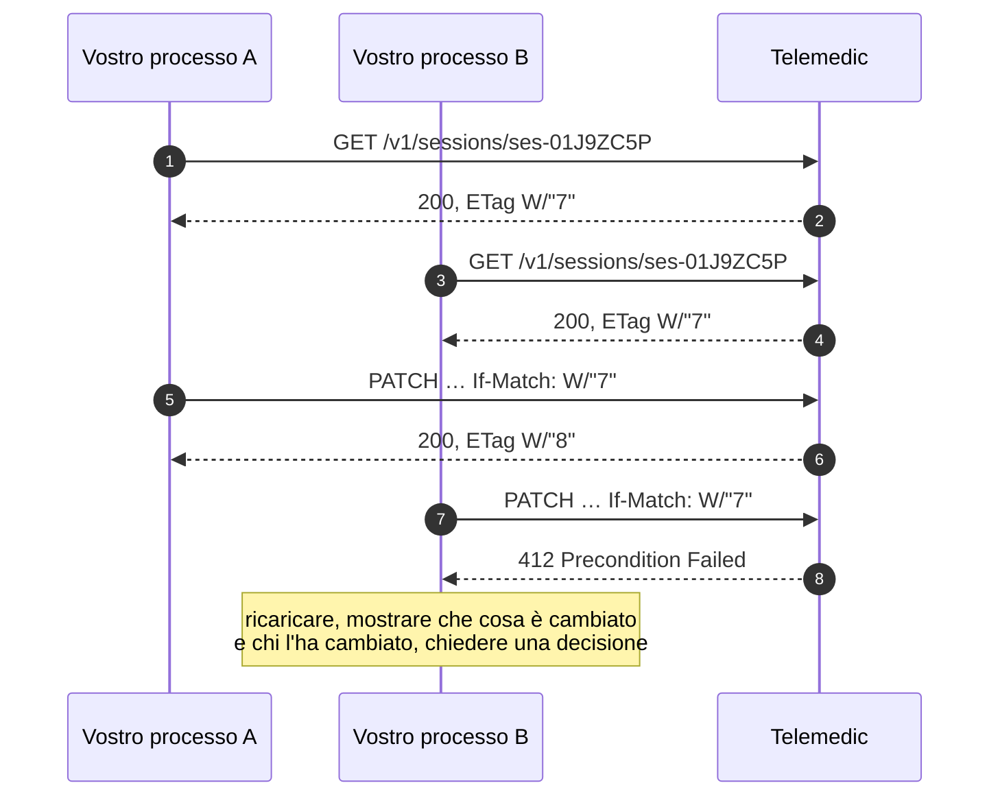

# Integrazione per interfacce applicative

Questo capitolo descrive la modalità **B**: il vostro back-end che parla con Telemedic. È la
modalità su cui poggiano tutte le altre — il componente incorporabile ha bisogno di un gettone
che si ottiene qui, i moduli sostituibili hanno bisogno di dati che passano da qui.

## 1. Due piani, una regola di partizione

La superficie è doppia e la separazione è deliberata. Il riepilogo è in
[01 §2.1](01-modalita-di-integrazione.md); qui interessano le conseguenze operative.

| | Piano clinico `/fhir` | Piano applicativo `/v1` |
|---|---|---|
| Contratto | Profili pubblicati + documento di capacità (`GET /fhir/metadata`) | Documento di interfaccia in **OpenAPI 3.1** |
| Errori | Risorsa di esito dell'operazione | `application/problem+json` — **RFC 9457** |
| Paginazione | Collegamenti nella busta di risultato | Cursore opaco firmato |
| Concorrenza | Validatore debole allineato alla versione della risorsa | Validatore sulla risorsa applicativa |
| Versionamento | La versione **è** quella di FHIR, dichiarata nel documento di capacità e nel tipo di contenuto | Versione maggiore nel percorso |
| Autorizzazione | Ambiti per tipo di risorsa | Ambiti espressi come URI |

**Non si mescolano.** Un integratore che tenta di ottenere una chiave del server di inoltro
tramite una risorsa FHIR generica sta costruendo un formato proprietario travestito da standard;
un integratore che modella un referto sul piano applicativo sta costruendo un archivio clinico
che nessun altro sistema sanitario potrà leggere.

## 2. Autenticazione fra sistemi

### 2.1 Le modalità ammesse, e quelle no

| Modalità | Stato | Quando |
|---|---|---|
| Credenziali di sistema con **asserzione firmata da chiave privata** | **Predefinita e raccomandata** | Ogni integrazione fra back-end |
| Mutua autenticazione a livello di trasporto, in aggiunta | Raccomandata per il settore pubblico e per i tenant ad alta assurance | Dove il vostro perimetro la consente e il capitolato la richiede |
| Prova di possesso legata alla chiave, sul livello applicativo | Opzione, dove la piattaforma del client la sostiene | Client con esecuzione in browser che vogliono superare il token al portatore |
| Segreto condiviso | **Ammessa solo in via transitoria e documentata**, con rotazione frequente | Integratori che non sono in grado di gestire il ciclo di vita di una chiave. È più onesto un segreto ruotato spesso che una chiave privata custodita male |
| Token statico a vita indefinita | **Non ammessa** | — |
| Credenziali dell'utente scambiate fra sistemi | **Non ammessa** | — |
| Credenziali di sistema **da un browser** | **Non ammessa, e non è una questione di configurazione** | Non esiste modo sicuro di custodire una chiave privata in un browser |

Perché l'asimmetrico è la modalità predefinita, in tre punti che valgono anche per voi:

1. **Il segreto non transita mai**, nemmeno una volta, nemmeno alla registrazione.
2. **Il progetto non custodisce materiale segreto vostro**: solo chiavi pubbliche. La
   compromissione dell'archivio dell'emittente non consente di impersonarvi.
3. **La rotazione è unilaterale**: pubblicate una nuova chiave con un identificativo diverso e
   firmate con quella. Nessun coordinamento sincrono, nessuna finestra di indisponibilità. Per un
   sistema che serve molti integratori, ciascuno con le proprie chiavi, è determinante.

### 2.2 Il documento delle chiavi pubbliche, e il suo trattamento

L'indirizzo del vostro documento di chiavi è **registrato** in fase di onboarding e legato al
vostro client. Da qui discendono due regole che il progetto applica e che vi conviene conoscere,
perché spiegano rifiuti altrimenti opachi:

- **L'indirizzo eventualmente indicato nell'intestazione di un'asserzione non viene seguito.**
  Viene confrontato con quello registrato per il vostro client: se non coincide, la richiesta è
  rifiutata. Un indirizzo arbitrario in un'intestazione firmata sarebbe una superficie di
  richiesta forzata verso risorse interne e un vettore di confusione di chiavi.
- **Il recupero è memorizzato con una durata**, con recupero forzato solo su identificativo di
  chiave sconosciuto, e con limitazione di frequenza su quel recupero. Se pubblicate una chiave
  nuova e firmate immediatamente con essa, il primo tentativo può fallire e il secondo riuscire:
  è previsto, non è un difetto. **Pubblicate prima, firmate dopo.**

### 2.3 Ambiti di autorizzazione

Due famiglie, con sintassi diverse, perché rispondono a domande diverse.

**Ambiti sul piano clinico.** Seguono la forma `{patient|user|system}/{Risorsa}.{permessi}`, con
i permessi espressi dalle lettere di creazione, lettura, aggiornamento, cancellazione e ricerca,
**nell'ordine fisso `cruds`**: `.rs` e `.cu` sono validi, `.sr` no.

```text
system/Encounter.cu
system/Composition.rs
user/Appointment.cruds
patient/Observation.rs
```

Un ambito può inoltre essere **raffinato con parametri di ricerca**, il che consente il minimo
privilegio senza inventare nomi propri:

```text
patient/Observation.rs?category=http://terminology.hl7.org/CodeSystem/observation-category|vital-signs
```

Il progetto adotta questa sintassi come nativa e **accetta anche la forma precedente**
(`.read`, `.write`, `.*`) convertendola: rifiutare le librerie datate produrrebbe attrito senza
guadagno di sicurezza, dato che la conversione è definita dalla specifica stessa.

**Ambiti sul piano applicativo.** Le capacità che non corrispondono a una risorsa clinica **non
vengono mascherate da risorsa clinica**. Sono espresse come URI (*proposta di progetto*):

```text
https://telemedic.esempio.it/scopes/session.start
https://telemedic.esempio.it/scopes/session.join
https://telemedic.esempio.it/scopes/session.metrics.read
https://telemedic.esempio.it/scopes/recording.consent.manage
https://telemedic.esempio.it/scopes/webhook.manage
https://telemedic.esempio.it/scopes/branding.manage
https://telemedic.esempio.it/scopes/tenant.admin
https://telemedic.esempio.it/scopes/audit.export
```

Forzare «avviare una sessione video» dentro `patient/Encounter.cu` sarebbe un abuso semantico e
renderebbe impossibile revocare l'una senza l'altra. La distinzione ha un effetto concreto sul
vostro lato: potete concedere a un processo di sincronizzazione notturna la creazione di
prestazioni **senza** concedergli la capacità di avviare un consulto.

### 2.4 Destinatario, revoca e la finestra che nessuno dichiara

Ogni token porta un **destinatario esplicito**, e un servizio che non si riconosce in quel
destinatario lo rifiuta. Non è formalismo: senza, un token emesso per un servizio può essere
rigirato verso un altro.

Sulla revoca c'è un punto che va detto con onestà perché la documentazione di settore lo elude
quasi sempre:

> **La revoca non è istantanea.** Un token validato localmente contro il materiale pubblico
> dell'emittente resta valido fino alla propria scadenza anche dopo essere stato revocato.
> È il motivo per cui i token clinici durano cinque minuti e non un giorno.

Per le revoche che **devono** essere immediate — un professionista disabilitato, un tenant
sospeso, una chiave compromessa — esiste un meccanismo aggiuntivo: una lista di negazione
distribuita, con durata pari alla vita massima di un token, consultata al confine. Il costo è
una verifica in più; il beneficio è che «revocato» significa revocato.

Conseguenza per voi: **non progettate flussi che presumano una revoca istantanea** senza aver
verificato che il tenant abbia quel meccanismo attivo.

## 3. Il contratto

### 3.1 Prima il contratto, poi il codice

Il documento di interfaccia è **scritto a mano ed è la fonte di verità**; le strutture del
server sono generate o verificate contro di esso in integrazione continua. L'approccio inverso —
annotazioni nel codice da cui si genera il documento — produce un contratto che cambia a ogni
ristrutturazione interna, il che è incompatibile con una politica di stabilità e con la
tracciabilità richiesta dal regime di ciclo di vita a cui il software è sottoposto.

Che cosa significa per voi: **il documento non cambia perché qualcuno ha rinominato una
classe.** Se cambia, è una decisione.

### 3.2 I controlli che il progetto esegue su sé stesso

Sono pubblici perché sono la ragione per cui potete fidarvi del contratto:

| # | Controllo | Effetto se fallisce |
|---|---|---|
| 1 | Analisi statica del documento di interfaccia: stile e regole di sicurezza | La costruzione fallisce |
| 2 | **Confronto di compatibilità** con la versione pubblicata | Una modifica non compatibile non dichiarata fa fallire la costruzione |
| 3 | Verifica delle prove di integrazione **contro** il documento | Una risposta che diverge dallo schema fa fallire la costruzione |
| 4 | **Esecuzione degli esempi della documentazione** | Un esempio che non si compila o non gira fa fallire la costruzione |
| 5 | Pubblicazione degli strumenti client solo su etichetta di versione, con firma e distinta dei componenti | Nessuna pubblicazione |

Il controllo 4 è quello che distingue una documentazione affidabile da una che invecchia: un
esempio che non funziona è peggio di nessun esempio.

### 3.3 Estratto del documento di interfaccia

```yaml
openapi: 3.1.1
jsonSchemaDialect: https://json-schema.org/draft/2020-12/schema
info:
  title: Telemedic — interfaccia applicativa
  version: "1.0.0"
  license:
    name: Apache-2.0
    identifier: Apache-2.0
servers:
  - url: https://api.telemedic.esempio.it/v1
paths:
  /sessions:
    post:
      operationId: createSession
      summary: Crea una prestazione a partire da un appuntamento già esistente
      parameters:
        - name: Idempotency-Key
          in: header
          required: true
          schema: { type: string, minLength: 16, maxLength: 128 }
          description: >
            Chiave del tentativo logico, scelta dal chiamante. Due richieste con la stessa
            chiave e lo stesso corpo producono la stessa risposta.
            Convenzione di progetto ispirata a un Internet-Draft scaduto: non è uno standard.
      requestBody:
        required: true
        content:
          application/json:
            schema: { $ref: '#/components/schemas/CreateSessionRequest' }
      responses:
        "201":
          description: Prestazione creata
          headers:
            Location: { schema: { type: string, format: uri-reference } }
            ETag:     { schema: { type: string } }
          content:
            application/json:
              schema: { $ref: '#/components/schemas/Session' }
        "409":
          description: Richiesta identica ancora in elaborazione
          content:
            application/problem+json:
              schema: { $ref: '#/components/schemas/Problem' }
        "422":
          description: Chiave di idempotenza riusata con un corpo diverso
          content:
            application/problem+json:
              schema: { $ref: '#/components/schemas/Problem' }
        "429":
          description: Quota superata
          content:
            application/problem+json:
              schema: { $ref: '#/components/schemas/Problem' }
webhooks:
  sessionCompleted:
    post:
      operationId: onSessionCompleted
      summary: Notifica di prestazione conclusa
      requestBody:
        content:
          application/json:
            schema: { $ref: '#/components/schemas/SessionCompletedData' }
      responses:
        "2XX": { description: Notifica presa in carico }
```

Due note sul frammento. Il campo delle notifiche in ingresso fa parte del documento di
interfaccia: **una sola specifica** descrive sia ciò che chiamate sia ciò che ricevete, il che
evita che le due divergano. E la descrizione della chiave di idempotenza **dichiara il proprio
stato normativo** invece di lasciar credere a una conformità che non esiste — vedi §5.

## 4. Paginazione

| Piano | Meccanismo |
|---|---|
| Applicativo | **Cursore**, predefinito. Stabile in presenza di scritture concorrenti |
| Applicativo | Scostamento numerico: **non offerto**. Degrada e produce risultati incoerenti sotto scrittura |
| Clinico | Collegamenti dentro la busta di risultato, come prescrive lo standard |

```http
GET /v1/sessions?tenant=asl-nord-01&status=completed&limit=50 HTTP/1.1
```

```json
{
  "data": [ "…" ],
  "meta": {
    "limit": 50,
    "hasMore": true,
    "nextCursor": "eyJ0IjoiMjAyNi0wOS0wMVQwOTozMFoiLCJpZCI6InNlcy0wMUo5WkI3UiJ9.sig"
  }
}
```

**Il cursore è opaco e firmato.** Non va interpretato, non va costruito, non va modificato: è
il meccanismo che impedisce a un client di scavalcare i filtri di tenant manipolando la
posizione. Un cursore alterato viene rifiutato. La sua forma interna **non è contratto** e può
cambiare.

Tre regole per il vostro client:

1. Iterate finché `hasMore` è vero, passando `nextCursor` invariato.
2. **Non conservate un cursore fra esecuzioni distanti nel tempo**: ha una validità. Per
   riprendere una sincronizzazione, si riparte da un istante, non da un cursore.
3. Non deducete il numero totale di elementi: non viene fornito, perché calcolarlo su una base
   dati sotto scrittura costa più della pagina stessa e il risultato sarebbe comunque obsoleto
   al momento della lettura.

## 5. Idempotenza

### 5.1 Lo stato della specifica, dichiarato

> **La chiave di idempotenza non è uno standard.** Il documento di riferimento è un
> Internet-Draft del gruppo di lavoro sulle interfacce HTTP, revisione **-07 del 15 ottobre
> 2025**, che risulta **scaduto e archiviato** e **non è mai stato pubblicato come RFC**.

Il progetto mantiene comunque il nome del campo, perché è la convenzione di settore più diffusa
e le vostre librerie la riconoscono: cambiarlo produrrebbe attrito senza alcun guadagno. Ma va
presentato per quello che è — **convenzione di progetto** — nella vostra documentazione, nei
contratti e nei capitolati. Dichiarare una conformità inesistente è una promessa che nessuno può
mantenere.

### 5.2 Semantica adottata

| Aspetto | Regola |
|---|---|
| Dove è obbligatoria | Su ogni richiesta di creazione o con effetti esterni: creazione di prestazione, invio del documento verso il sistema di origine, registrazione di un consenso, pubblicazione di un documento, invio di un invito |
| Chi genera la chiave | **Voi, sempre.** Una chiave generata dal server non risolve nulla: il problema è che voi non sapete se il server ha visto la richiesta |
| Ambito della chiave | La quaterna tenant, client, endpoint, chiave. La stessa chiave su due endpoint diversi è ammessa e non collide |
| Conservazione | **24 ore** (*proposta di progetto*). Oltre, la chiave scade e una nuova richiesta viene eseguita come nuova |
| Stessa chiave, stesso corpo, prima ancora in corso | `409` con indicazione di quando ritentare |
| Stessa chiave, stesso corpo, prima conclusa | La risposta memorizzata, **identica**, con l'indicazione che si tratta di una riproduzione |
| Stessa chiave, **corpo diverso** | `422` con un tipo di problema esplicito. Mai una sostituzione silenziosa |

```http
HTTP/1.1 200 OK
Idempotent-Replay: true
ETag: W/"1"
```

### 5.3 Dove non serve

Su lettura, sostituzione completa e cancellazione: sono già idempotenti per definizione del
protocollo. Aggiungerla è rumore. E su operazioni in cui **volete** effetti multipli — «invia
di nuovo l'invito» — serve un endpoint distinto con semantica esplicita, non l'assenza della
chiave.

### 5.4 Il corrispettivo sul piano clinico

Sul piano clinico esiste un meccanismo nativo e più preciso: la **creazione condizionale**, che
crea solo se una ricerca non trova nulla. È lo strumento naturale per l'ingestione ripetibile di
appuntamenti provenienti dal vostro sistema, usando il vostro identificativo esterno come
criterio.

```http
POST /fhir/Appointment HTTP/1.1
Content-Type: application/fhir+json
If-None-Exist: identifier=https://gestionale.integratore.example/sid/appuntamento|APT-9931
```

## 6. Concorrenza

### 6.1 Il problema, e perché in ambito clinico è più grave

Due professionisti aprono lo stesso documento, entrambi modificano, entrambi salvano. Senza
contromisure il secondo salvataggio sovrascrive il primo e nessuno se ne accorge: non produce
errori, produce dati sbagliati.

La strategia adottata è **ottimistica**: nessun blocco, e fallisce chi arriva con una versione
superata.



### 6.2 Le regole del progetto

1. **Su ogni risorsa clinica modificabile il validatore è obbligatorio.** Una modifica **senza**
   validatore viene rifiutata con `428 Precondition Required`, non eseguita in modo cieco. La
   motivazione supera la tecnica: consentire un aggiornamento cieco su un documento clinico è un
   rischio da registrare nell'analisi dei rischi, non una comodità da concedere.
2. **Sul piano clinico il validatore è debole** e corrisponde alla versione della risorsa
   (`W/"3"`). È così per specifica: non trattatelo come un'impronta del contenuto.
3. **`If-Match: *` non è una scorciatoia.** Significa «purché la risorsa esista», non «qualunque
   versione»: usarlo disattiva completamente la protezione.
4. **Il conflitto è un evento di interfaccia, non un errore tecnico.** Se il vostro sistema
   mostra all'utente «errore 412» state scaricando su di lui un problema che è vostro:
   conservate ciò che ha scritto, mostrate che cosa è cambiato, chiedete una decisione esplicita.

### 6.3 Che cosa non è concorrenza

La chiave di idempotenza e il validatore risolvono problemi **diversi** e vengono confusi di
continuo:

| | Chiave di idempotenza | Validatore condizionale |
|---|---|---|
| Domanda a cui risponde | «Ho già inviato questa richiesta?» | «La risorsa è cambiata da quando l'ho letta?» |
| Su quale metodo | Creazione e operazioni con effetti | Modifica e cancellazione |
| Identifica | Il **tentativo** | Il **risultato** |
| Chi lo genera | Il client | Il server |

## 7. Limitazione del traffico

### 7.1 Lo stato della specifica, di nuovo dichiarato

> La terna storica di intestazioni per limite, residuo e reimpostazione **non è mai stata uno
> standard**, ed è oggi anche **superata**. Il documento di riferimento è un Internet-Draft
> attivo, revisione **-11 del 23 maggio 2026**, che definisce **due soli campi**, entrambi campi
> strutturati: uno per la politica e uno per lo stato corrente.

```http
HTTP/1.1 200 OK
RateLimit-Policy: "sessions";q=1000;w=3600;qu="requests";pk=:dGVuYW50OmFzbC1ub3JkLTAx:
RateLimit: "sessions";r=417;t=1832
```

| Campo | Parametro | Significato |
|---|---|---|
| Politica | `q` | quota complessiva |
| | `w` | ampiezza della finestra, in secondi |
| | `qu` | unità di quota: richieste, byte di contenuto, richieste concorrenti |
| | `pk` | chiave di partizione: a che cosa si applica la quota |
| Stato | `r` | quota residua |
| | `t` | secondi alla reimpostazione |
| | `pk` | chiave di partizione |

Il progetto emette **entrambe le forme** — quella corrente e quella storica — durante il periodo
di transizione, e dichiara che **nessuna delle due è normativa**. Quando il documento diventerà
una RFC, la forma storica entrerà nel processo di dismissione del §9.

### 7.2 Politica adottata

- La quota è **per tenant e per classe di endpoint**, non per indirizzo di rete: un indirizzo di
  rete non identifica nessuno, e in una installazione multi-integratore lo condividono tutti.
- Classi distinte per scrittura clinica, lettura, avvio di sessione, amministrazione ed
  estrazione massiva. Mille letture leggere e mille estrazioni non sono lo stesso carico, ed è
  la ragione per cui esistono unità di quota diverse dalle richieste.
- Il rifiuto per quota **porta sempre** l'indicazione di quando ritentare, che è l'unico campo di
  questa famiglia effettivamente normato e che le librerie generiche rispettano.
- **Esenzioni dichiarate**: gli endpoint di verifica dello stato, il traffico di recupero dalla
  coda degli scarti (che altrimenti verrebbe strozzato proprio quando serve recuperare) e le
  operazioni marcate come urgenza clinica, che hanno un ambito dedicato e tracciamento
  rinforzato.

### 7.3 Che cosa deve fare il vostro client

1. **Rispettare l'indicazione di quando ritentare.** Ritentare subito peggiora la situazione per
   tutti, voi compresi.
2. **Rallentare prima di essere respinti**, leggendo la quota residua. È il motivo per cui le
   intestazioni esistono.
3. **Distribuire il carico.** Se avviate tremila prestazioni ogni mattina alle 7:00 in punto,
   duemila verranno respinte. Un ritardo casuale di pochi secondi risolve il problema senza
   alcuna modifica al vostro modello.

## 8. Errori

### 8.1 Piano applicativo

Formato unico: **RFC 9457**, che sostituisce il documento precedente. Se trovate citata la
specifica del 2016, il riferimento è superato.

```http
HTTP/1.1 409 Conflict
Content-Type: application/problem+json
Content-Language: it-IT
```

```json
{
  "type": "https://docs.telemedic.esempio.it/problems/session-not-startable",
  "title": "La prestazione non può essere avviata",
  "status": 409,
  "detail": "L'appuntamento indicato risulta annullato. Una prestazione può essere avviata solo da un appuntamento prenotato o con assistito presente.",
  "instance": "/v1/sessions/ses-01J9ZC5P",
  "traceId": "0f5b1c2d9a8e4b7f",
  "tenant": "asl-nord-01",
  "violations": [
    { "pointer": "#/appointment/status", "code": "invalid-state" }
  ]
}
```

Cinque regole di progetto:

1. **Il tipo è un URI stabile e risolvibile**, che porta a una pagina con causa, conseguenze e
   rimedio. È la chiave su cui il vostro codice deve ramificare. **Cambiarlo è una modifica non
   compatibile**, soggetta al processo del §9.
2. **Il titolo è costante per tipo**; la parte variabile sta nel dettaglio. Se ramificate sul
   titolo, il vostro codice si romperà alla prima traduzione.
3. **Il dettaglio non contiene mai dati clinici né identificativi diretti.** Finisce nei vostri
   registri: è un requisito, non una raccomandazione. Se vi serve sapere *quale* assistito, si
   usa un identificativo interno e la corrispondenza si risolve nei sistemi autorizzati.
4. **L'identificativo di traccia è sempre presente.** È ciò che consente all'assistenza di
   trovare l'evento senza chiedervi di riprodurre il problema.
5. **Il catalogo dei tipi è generato**, non scritto a mano: un errore non catalogato non deve
   poter essere emesso.

### 8.2 Piano clinico

Sul piano clinico l'errore è la risorsa di esito prescritta dallo standard. **Non è
un'incoerenza da sanare**: sono due interfacce con due contratti, e in ciascuna si usa il
formalismo che le compete.

```json
{
  "resourceType": "OperationOutcome",
  "issue": [
    {
      "severity": "error",
      "code": "business-rule",
      "details": {
        "coding": [
          {
            "system": "https://telemedic.esempio.it/CodeSystem/operation-outcome",
            "code": "session-not-startable"
          }
        ],
        "text": "L'appuntamento risulta annullato."
      },
      "expression": ["Appointment.status"]
    }
  ]
}
```

**I due cataloghi hanno gli stessi codici.** `session-not-startable` è lo stesso concetto su
entrambi i piani, e la corrispondenza è generata, non scritta due volte. Il vostro codice può
quindi usare un unico insieme di costanti.

### 8.3 Che cosa non fa il progetto con gli errori

- **Non restituisce mai una traccia di esecuzione** nel dettaglio.
- **Non distingue «non esiste» da «non ti è consentito»** fuori dal perimetro di autorizzazione:
  ricevete «non trovato». È deliberato, perché la distinzione sarebbe un oracolo di esistenza su
  soggetti sanitari. L'eccezione è dichiarata dove serve per la diagnostica dell'integratore.
- **Non ritorna un codice di successo su un fallimento parziale.** Un'operazione che riesce a
  metà restituisce un esito che dice quale metà.

## 9. Versionamento e dismissione

### 9.1 Strategia

| Piano | Strategia | Esempio |
|---|---|---|
| Applicativo | **Versione maggiore nel percorso** per le modifiche non compatibili | `/v1/sessions`, `/v2/sessions` |
| Applicativo | Intestazione facoltativa di **versione datata** per le aggiunte | `Telemedic-Version: 2026-11-30` |
| Clinico | **La versione è quella di FHIR**, dichiarata nel documento di capacità e nel tipo di contenuto | `application/fhir+json; fhirVersion=4.0` |

La versione datata ha una proprietà che conviene conoscere: se non la indicate, si applica **la
versione fissata al vostro client alla prima chiamata**, non l'ultima disponibile. Un client non
subisce mai un cambiamento che non ha chiesto.

Sul piano clinico **non si versiona con un numero proprio**: si dichiara la versione dello
standard supportata. Un eventuale supporto a una versione successiva userebbe percorsi base
distinti.

### 9.2 Che cosa è contratto

**Coperto dalla garanzia di stabilità**: percorsi, metodi, parametri e schemi documentati per la
versione maggiore corrente; tipi di evento e schemi del loro dato; profili clinici pubblicati e
documento di capacità; ambiti di autorizzazione documentati; tipi di problema e codici di esito;
interfacce dei moduli sostituibili; protocollo di messaggistica del componente incorporabile e
insieme chiuso delle proprietà di tema.

**Non coperto**, e va detto esplicitamente perché altrimenti si assume che lo sia: endpoint
marcati sperimentali o sotto un percorso di anteprima; intestazioni non documentate; ordine
degli elementi negli elenchi non ordinati; forma interna degli identificativi opachi, dei
cursori e dei gettoni; testo del dettaglio degli errori; endpoint interni e di amministrazione.

### 9.3 Che cosa non è una modifica non compatibile

Queste modifiche **avvengono senza preavviso** e il vostro client deve tollerarle:

- aggiunta di un campo facoltativo in una risposta;
- aggiunta di un endpoint;
- aggiunta di un valore a un insieme enumerato **dichiarato estensibile**;
- aggiunta di un tipo di evento;
- rilassamento di un vincolo di validazione.

Da cui l'istruzione, che vale la pena scrivere nel vostro codice come commento:

> **Il vostro client deve ignorare i campi sconosciuti e i valori enumerati sconosciuti.**

Senza questa regola, ogni aggiunta rompe qualcuno, e chi si rompe siete voi.

### 9.4 Il processo di dismissione

| Fase | Quando | Che cosa succede |
|---|---|---|
| 1 · Annuncio | T0 | Registro delle modifiche, comunicazione agli integratori registrati, avviso nella documentazione, **guida di migrazione pubblicata contestualmente** |
| 2 · Deprecazione | T0 → T0+12 mesi | Intestazioni di deprecazione e di dismissione su ogni risposta; collegamento alla documentazione e al successore; misurazione dell'uso per versione |
| 3 · Interruzioni programmate | T0+9 e T0+11 mesi | Finestre annunciate in cui la versione deprecata risponde «non più disponibile», per far emergere le integrazioni non migrate **quando c'è ancora tempo** |
| 4 · Dismissione | ≥ T0+12 mesi | La versione risponde definitivamente «non più disponibile», con un problema che punta alla guida di migrazione |

Le intestazioni, con lo stato corretto delle specifiche:

```http
HTTP/1.1 200 OK
Deprecation: @1788134399
Sunset: Sat, 31 Oct 2027 23:59:59 GMT
Link: <https://docs.telemedic.esempio.it/api/v1-deprecation>; rel="deprecation"; type="text/html"
Link: <https://api.telemedic.esempio.it/v2/sessions>; rel="successor-version"
```

> **Stato verificato.** L'intestazione di deprecazione è **RFC 9745**, Standards Track, marzo
> 2025, iscritta nel registro dei nomi di campo HTTP come campo permanente di tipo strutturato
> *Item*: il valore è una data espressa come intero preceduto da `@`. Chi la descrive ancora come
> Internet-Draft cita informazione superata. L'intestazione di dismissione è **RFC 8594**. Il
> vincolo fra le due è normativo: **la data di dismissione non può precedere quella di
> deprecazione**.

Regole aggiuntive:

- **almeno due versioni maggiori attive** contemporaneamente;
- **nessuna dismissione senza aver contattato** gli integratori ancora attivi su quella versione:
  la misurazione per versione serve esattamente a questo;
- la dismissione di un **ambito** o di un **tipo di evento** segue lo stesso processo;
- una vulnerabilità di sicurezza può accorciare i tempi, con un percorso di emergenza
  documentato e una finestra minima dichiarata;
- se usate un endpoint deprecato in un percorso che tocca la sicurezza del paziente, la sua
  dismissione è per noi un **cambiamento soggetto a controllo delle modifiche**, non una scelta
  di prodotto.

## 10. Estrazione massiva

Per audit, migrazione e ricerca esiste un'operazione **asincrona** di esportazione sul piano
clinico, avviata con una preferenza di risposta differita, con sondaggio su un indirizzo di
stato e risultato in file a righe JSON.

> **Versione da citare: 3.0.0**, in uso di prova dall'11 dicembre 2025. Le versioni precedenti
> sono superate. **Attenzione**: la costruzione continua della specifica presenta un manifesto
> **strutturalmente diverso** da quello pubblicato — rinomina il campo degli errori, ne aggiunge
> di nuovi e ne rimuove uno obbligatorio. Non è materiale su cui implementare, ed è esattamente
> il genere di divergenza che produce integrazioni non interoperabili.

Parametri della versione pubblicata: formato di uscita, istante iniziale, **istante finale**,
tipi di risorsa, elementi, elenco di assistiti (solo in invio), dati associati, filtro fine sui
tipi, organizzazione dell'uscita e manifesti parziali paginati. Gli ultimi tre sono novità della
versione corrente.

**Quando non usarla**: per volumi piccoli, dove una ricerca paginata basta; quando serve bassa
latenza, perché è asincrona per definizione; e quando l'esportazione riguarda dati particolari
senza una base giuridica documentata — lì il vincolo non è tecnico.

## 11. Quando non usare l'interfaccia applicativa

| Situazione | Perché | Alternativa |
|---|---|---|
| Vi serve un aggiornamento continuo dentro un'interfaccia | Sondare un endpoint ogni secondo è spreco e latenza | Canale in tempo reale dal componente incorporato |
| Vi servono metriche di qualità della rete ad alta frequenza | Non sono dati clinici e non passano dall'interfaccia clinica; il volume non è adatto a chiamate singole | Aggregazione e lettura periodica sul piano applicativo |
| Volete leggere i dati di un tenant che non è il vostro | Non esiste alcun percorso: il contesto di tenant è verificato al confine di ogni contesto | — |
| Volete un'operazione che il progetto non espone | Se la capacità esiste nell'interfaccia utente, esiste anche nell'interfaccia applicativa: se non la trovate, è un difetto di documentazione o di ricerca. Se non esiste affatto, è una richiesta di funzionalità | Segnalazione |
| Il vostro sistema parla solo messaggistica ospedaliera | Nessun protocollo web, nessuna autorizzazione applicativa | Variante a messaggistica, con mutua autenticazione di nodo |
