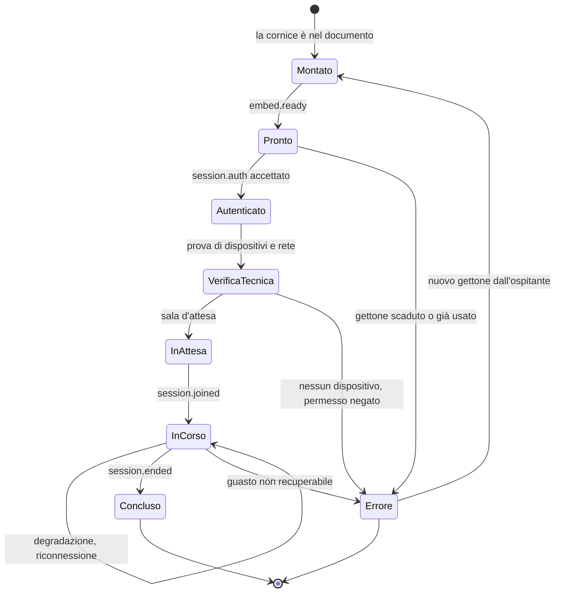

# Componente incorporabile

La modalità **C** fa comparire la stanza del consulto dentro la vostra interfaccia. Il
professionista non cambia applicazione, non fa un secondo accesso, non copia identificativi.

**Non è un widget informativo.** È un'applicazione che accede a fotocamera, microfono e
condivisione dello schermo, che gestisce un atto sanitario e che deve restare accessibile a un
assistito anziano su rete mobile. Ogni requisito di questo capitolo discende da uno di questi
tre fatti.

## 1. Le quattro varianti

| Variante | Isolamento | Quando |
|---|---|---|
| **Cornice su origine separata** | **Totale.** Contesto di esecuzione separato: il gettone di sessione non è nella memoria della vostra applicazione | Predefinita, quando controllate le intestazioni della pagina ospitante |
| **Elemento personalizzato che avvolge la cornice** | Totale: l'isolamento resta quello della cornice sottostante | Volete scrivere un tag HTML e non gestire a mano la configurazione difficile |
| **Nuova scheda** | Totale, e **nessuna delega di permessi da fare** | Non potete servire intestazioni: portale gestito da terzi, gestore di contenuti chiuso |
| **Vista a pagina intera** in applicazione mobile nativa | Totale | Ospitante nativo: non c'è un documento HTML che possa delegare permessi |

Esiste una quinta possibilità tecnica - un componente che gira **nello stesso contesto di
esecuzione** della vostra applicazione - offerta **solo per elementi non clinici**: pulsante di
avvio, indicatore di stato, prova dei dispositivi audio e video, indicatore di qualità della
rete. La motivazione è al §10.

## 2. Permessi: la causa numero uno dei fallimenti

### 2.1 La regola delle due condizioni

Perché una cornice caricata da un'origine diversa possa usare la fotocamera, **entrambe** le
condizioni devono valere:

1. la funzione dev'essere consentita nella **politica dei permessi del documento di livello
   superiore** - cioè l'intestazione servita dalla **vostra** pagina;
2. la funzione dev'essere consentita nell'**attributo della cornice**.

**L'attributo restringe, non concede.** Non può dare ciò che il livello superiore nega. Se non
servite l'intestazione, il comportamento ricade sul valore predefinito del browser, che per
fotocamera, microfono e cattura dello schermo è restrittivo: una cornice su origine diversa non
ottiene il permesso e la richiesta di accesso al media fallisce con un errore di permesso
negato.

> **L'intestazione sulla vostra pagina è necessaria, non opzionale.** Non esiste configurazione
> lato Telemedic che possa sostituirla: è una decisione che appartiene al documento ospitante,
> per costruzione del modello di sicurezza del browser.

### 2.2 Valori ammessi nelle liste di permesso

| Valore | Significato |
|---|---|
| `*` | Consentita ovunque, indipendentemente dall'origine. **Da non usare** |
| `()` | Disabilitata ovunque |
| `self` | Solo per documenti e cornici della **stessa** origine |
| `src` | **Solo nell'attributo della cornice**: consentita se l'origine caricata coincide con quella dichiarata. È il valore predefinito dell'attributo |
| `"https://origine"` | Origini specifiche, separate da spazio |

### 2.3 Configurazione corretta

Sulla pagina che ospita:

```http
Permissions-Policy: camera=(self "https://embed.telemedic.example"),
                    microphone=(self "https://embed.telemedic.example"),
                    display-capture=(self "https://embed.telemedic.example"),
                    fullscreen=(self "https://embed.telemedic.example")
```

Nel markup:

```html
<iframe
  id="telemedic-frame"
  src="https://embed.telemedic.example/room?s=ses-01J9ZC5P"
  title="Televisita - stanza del consulto"
  allow="camera 'src'; microphone 'src'; display-capture 'src'; fullscreen 'src'; autoplay 'src'"
  sandbox="allow-scripts allow-same-origin allow-forms allow-popups-to-escape-sandbox allow-storage-access-by-user-activation"
  referrerpolicy="strict-origin-when-cross-origin"></iframe>
```

### 2.4 I cinque punti che si sbagliano quasi sempre

1. **La cattura dello schermo è una funzione a sé.** Va elencata separatamente. Se la
   dimenticate, audio e video funzionano e la condivisione dello schermo no: è il sintomo più
   confondente di tutta la famiglia, perché sembra un difetto del prodotto.
2. **L'attributo senza lista esplicita equivale a «solo l'origine dichiarata».** Se la cornice
   **naviga verso un'origine diversa** dopo il caricamento - per esempio verso una schermata di
   autenticazione - **il permesso si perde**. È una delle ragioni per cui la consegna del gettone
   avviene fra back-end (§5) e la cornice **non effettua mai rinvii verso altre origini** dopo il
   caricamento.
3. **La riproduzione automatica serve** perché l'elemento video remoto parta senza un gesto
   dell'utente.
4. **Nessun permesso oltre questi.** Se il componente chiedesse geolocalizzazione o altro senza
   necessità, sarebbe un segnale negativo in una vostra verifica di sicurezza. Non lo chiede.
5. **Il rilevamento di questa condizione è possibile.** La politica dei permessi supporta la
   configurazione di una destinazione di segnalazione: in preproduzione, configurarla trasforma
   «non funziona» in una diagnosi in trenta secondi.

## 3. Isolamento

### 3.1 Quali restrizioni servono davvero

L'attributo di restrizione applica **tutte** le limitazioni se vuoto; ogni valore ne rimuove una.
La configurazione minima per un'applicazione di comunicazione in tempo reale:

| Valore | Serve? | Perché |
|---|---|---|
| Esecuzione di script | **Sì** | Senza, non c'è comunicazione in tempo reale |
| Stessa origine | **Sì** | Senza, il documento è trattato come origine opaca: niente archiviazione locale, niente accesso all'archiviazione, e in molti casi niente accesso persistente ai dispositivi |
| Moduli | Sì | Per i moduli interni: nota clinica, consenso |
| Finestre di dialogo modali | Solo se necessarie | Il componente preferisce finestre proprie a quelle del browser, per ragioni di accessibilità |
| Finestre a comparsa | **No** | Da evitare |
| Uscita dalla restrizione per le finestre aperte | Sì, se aprite collegamenti esterni | Evita che una finestra aperta erediti la restrizione |
| Scaricamenti | Solo se scaricate il documento dalla cornice | Meglio farlo scaricare dall'ospitante |
| Accesso all'archiviazione su attivazione dell'utente | **Sì** | Prerequisito, anche se l'architettura è senza cookie (§6) |
| Navigazione del documento di livello superiore | **No, mai** | Consentirebbe alla cornice di navigare la vostra pagina: è un dirottamento al contrario |

### 3.2 L'avvertenza da conoscere, e la sua inversione

La documentazione delle piattaforme web sconsiglia con forza di combinare l'esecuzione di script
con il permesso di stessa origine **quando il documento incorporato ha la stessa origine della
pagina che incorpora**, perché in quel caso il documento incorporato può rimuovere l'attributo di
restrizione dal proprio elemento, rendendo la restrizione inefficace.

Nel caso di Telemedic **la cornice è su origine diversa**, quindi la combinazione è corretta.

> **Ma l'avvertenza si applica in senso inverso se servite il componente dalla vostra stessa
> origine** con un proxy inverso - cosa che alcuni integratori faranno per aggirare problemi di
> archiviazione. In quel caso la restrizione diventa illusoria, **l'isolamento fra il vostro
> codice e la sessione clinica cessa di esistere**, e la sicurezza poggia soltanto sulla politica
> dei contenuti e sull'isolamento applicativo. È una configurazione che il progetto **non
> supporta** e che va dichiarata se adottata.

L'attributo che carica una cornice in un contesto effimero senza accesso all'archiviazione **non
è utilizzabile**: la sessione ha bisogno di uno stato proprio. Va citato solo per escluderlo,
perché è una proposta ricorrente nelle revisioni di sicurezza.

## 4. Chi può incorporare

La direttiva che dichiara quali origini possono incorporare una pagina è **generata
dinamicamente per sessione**, non statica: contiene solo le origini registrate per **quel**
tenant.

```http
Content-Security-Policy:
  default-src 'self';
  script-src 'self';
  style-src 'self' 'nonce-r4nd0m';
  img-src 'self' data: https://cdn-branding.telemedic.example;
  media-src 'self' blob:;
  connect-src 'self' https://api.telemedic.example wss://signaling.telemedic.example;
  font-src 'self';
  frame-ancestors 'self' https://gestionale.integratore.example;
  base-uri 'none';
  form-action 'self';
  object-src 'none';
  worker-src 'self' blob:;
  report-to csp-endpoint
X-Content-Type-Options: nosniff
Referrer-Policy: strict-origin-when-cross-origin
```

Quattro fatti da conoscere, perché producono guasti diagnosticati male:

1. **La direttiva degli antenati non ha ripiego sulla direttiva predefinita.** Una politica con
   sola direttiva predefinita **non** impedisce l'incorporamento.
2. **Non può essere impostata da un elemento di metadati nel documento**: solo intestazione HTTP.
3. **In caso di cornici annidate viene verificata su ciascun antenato.** Se anche uno solo non
   corrisponde, il caricamento è annullato. **Se incorporate il componente dentro un'altra
   cornice, tutte le origini della catena vanno registrate**, e va dichiarato in fase di
   onboarding.
4. **L'intestazione storica per il controllo dell'incorporamento non è sufficiente**: ammette
   solo due valori assoluti e non consente più di un'origine. Un prodotto che deve essere
   incorporabile da molti integratori diversi non è esprimibile con quella. Viene emessa al
   massimo come ripiego per programmi molto vecchi, sapendo che sarà restrittiva.

**Un unico registro di origini** alimenta la direttiva degli antenati, le origini ammesse per la
condivisione di risorse fra origini e la validazione dei messaggi (§5). Tre configurazioni
separate divergono sempre, e la divergenza si manifesta come un guasto intermittente.

Se la sessione non è associata a un tenant valido, la direttiva emessa vieta ogni
incorporamento.

## 5. Consegna del gettone e protocollo di messaggistica

### 5.1 Il gettone non passa mai per l'indirizzo

```mermaid
sequenceDiagram
    autonumber
    participant BE as Vostro back-end
    participant API as Telemedic
    participant UI as Vostra pagina
    participant FR as Cornice del componente

    BE->>API: chiedi un gettone di ingresso per questa sessione e questo attore
    API-->>BE: gettone monouso, 45 s, legato all'origine ospitante attesa
    BE-->>UI: rende la pagina con la cornice; il gettone è in memoria, non nell'indirizzo
    UI->>FR: monta la cornice (l'indirizzo contiene solo un identificativo non sensibile)
    FR-->>UI: embed.ready
    UI->>FR: session.auth con il gettone
    FR->>API: riscatta il gettone
    API-->>FR: credenziali di sessione, tenute in memoria
    FR-->>UI: session.joined
```

**Perché non nell'indirizzo.** Gli indirizzi finiscono nella cronologia del browser, nei registri
del proxy inverso, nell'intestazione di provenienza verso terzi, negli screenshot e negli
strumenti di monitoraggio degli errori. Un gettone in un indirizzo è un gettone trapelato.

Se un integratore non può eseguire codice nella pagina ospitante - accade con alcuni gestori di
contenuti - l'unico compromesso accettabile è un gettone con validità **non superiore a trenta
secondi**, monouso, legato all'origine, con tracciamento di ogni riscatto. Va richiesto
esplicitamente e resta documentato come deroga.

Le credenziali riscattate restano **in memoria**, non in archiviazione locale né di sessione: in
un contesto di terze parti sono comunque partizionate, e la persistenza aggiungerebbe superficie
di attacco senza beneficio.

### 5.2 Le sei regole non negoziabili della messaggistica

1. **Mai destinazione generica** nell'invio del messaggio. Se la cornice naviga o viene
   sostituita, il messaggio finirebbe a un'origine arbitraria.
2. **Validare sempre l'origine in ricezione**, con **confronto esatto** contro una lista.
   Mai un confronto per suffisso o per contenimento: `https://gestionale.integratore.example.attaccante.test`
   supera entrambi.
3. **Validare la struttura del messaggio con uno schema**, non con una verifica di tipo. Ciò che
   arriva da un canale di messaggistica è input non fidato a tutti gli effetti.
4. **Validare la sorgente** contro il riferimento alla finestra attesa.
5. **Nessun segreto nei messaggi**, salvo il gettone monouso dell'avvio, e solo dopo che
   l'origine è stata verificata.
6. **Spazio dei nomi del protocollo esplicito**, per non collidere con altri componenti presenti
   nella stessa pagina.

### 5.3 Formato e tipi di messaggio

```ts
interface TelemedicMessage<T = unknown> {
  readonly protocol: 'telemedic.embed.v1';  // discriminante di spazio dei nomi
  readonly id: string;                       // identificativo univoco del messaggio
  readonly replyTo?: string;                 // identificativo del messaggio a cui si risponde
  readonly type: string;
  readonly payload: T;
}
```

| Direzione | Tipo | Significato |
|---|---|---|
| componente → ospitante | `embed.ready` | Caricato, in attesa del gettone |
| ospitante → componente | `session.auth` | Consegna del gettone monouso |
| componente → ospitante | `session.joined` | L'utente è entrato nella stanza |
| componente → ospitante | `session.ended` | Prestazione conclusa, con esito e riferimenti |
| componente → ospitante | `session.error` | Errore, con tipo allineato al catalogo dei problemi ([03 §8](03-integrazione-per-api.md)) |
| componente → ospitante | `ui.resize` | Altezza richiesta |
| componente → ospitante | `ui.requestClose` | L'utente ha chiesto di chiudere |
| ospitante → componente | `ui.theme` | Aggiornamento del tema entro i limiti del §7 |
| ospitante → componente | `session.terminate` | L'ospitante chiude la sessione |
| bidirezionale | `heartbeat` | Rilevamento di un componente bloccato |

**Il protocollo e i suoi tipi sono contratto** e seguono il processo di dismissione a dodici mesi.
La versione è nello spazio dei nomi (`telemedic.embed.v1`): un cambiamento non compatibile
produce `v2`, e le due versioni convivono.

### 5.4 Dopo l'avvio, un canale dedicato

Dopo lo scambio iniziale è possibile passare a un **canale di messaggistica dedicato**: la
pagina ospitante trasferisce una porta al componente e i messaggi successivi viaggiano su
quella, **non visibili** agli altri ascoltatori della pagina. È preferibile quando la vostra
pagina ospita anche componenti di altri fornitori.

### 5.5 Quando non usare la messaggistica

- **Per trasferire dati clinici**: si usa l'interfaccia applicativa. La messaggistica attraversa
  il contesto del browser dell'utente, dove estensioni e altri script possono osservare.
- **Per autorizzare**: un messaggio non è una prova di identità. Il gettone consegnato per questo
  canale è monouso, a vita brevissima e riscattato fra back-end proprio perché il canale non è
  fidato.
- **Quando l'ospitante è un sistema di cartella clinica che implementa un protocollo standard di
  messaggistica applicativa**: lì esiste già un vocabolario normato e va preferito. Vedi
  [06 §7](06-identita-e-delega.md).

## 6. Architettura senza cookie

### 6.1 La decisione

**Il componente non usa cookie.** Le credenziali di sessione arrivano dal riscatto del gettone e
vivono in memoria; ogni chiamata porta l'autorizzazione in intestazione; il rinnovo avviene con
il gettone corrente, non con un cookie.

### 6.2 Perché

Una cornice su origine diversa è un **contesto di terze parti**. Ogni cookie impostato al suo
interno è un cookie di terze parti. Se il browser li blocca o li partiziona:

- una sessione basata su cookie **non si stabilisce**;
- un rinvio verso un emittente di identità per un accesso silenzioso **non riconosce la sessione**
  e fallisce, o costringe a un accesso interattivo che dentro una cornice è spesso a sua volta
  bloccato;
- **il comportamento varia per browser, per versione e per configurazione dell'utente**, quindi il
  difetto è intermittente e non riproducibile in laboratorio. È la classe di problemi peggiore da
  assistere.

Lo stato dell'ecosistema è in movimento e le previsioni sono state smentite più volte. Ciò che
resta vero indipendentemente dalle previsioni: una quota rilevante di utenti opera **già oggi**
in regime di cookie di terze parti bloccati o partizionati, e la quota è più alta nel settore
sanitario per la diffusione di alcune piattaforme. **Progettare assumendo che i cookie di terze
parti non funzionino è l'unica scelta difendibile.**

### 6.3 Le alternative, e perché sono state scartate

| Strategia | Valutazione |
|---|---|
| **Nessun cookie** | **Adottata.** Immune al blocco su tutti i browser; nessuna dipendenza da meccanismi di accesso all'archiviazione. Costo: il ricaricamento della cornice perde lo stato e richiede un nuovo gettone - accettabile, perché una sessione di consulto ha durata definita e l'ospitante può riemettere il gettone |
| **Cookie partizionati** | Ammessa **solo per stato non essenziale**: preferenze di dispositivo audio e video, lingua, con degradazione pulita se il cookie non c'è. La partizione per sito di primo livello è, in un prodotto multi-tenant, **funzionalmente corretta**: è esattamente l'isolamento che si desidera |
| **Richiesta esplicita di accesso all'archiviazione** | **Esclusa.** Richiede un gesto dell'utente e, in molti browser, una finestra di richiesta. In un flusso clinico in cui il professionista si aspetta che il video parta al clic, inserire una richiesta di consenso all'archiviazione è un danno di usabilità e un segnale di scarsa qualità percepita. Inoltre le regole differiscono fra browser: è una superficie di assistenza permanente |

### 6.4 Come si verifica

È un requisito architetturale, non un'intenzione: esiste una prova automatica dedicata che
esegue l'intero percorso del consulto **con tutti i cookie di terze parti bloccati**. Se quella
prova passa, l'intera classe di problemi è chiusa strutturalmente.

## 7. Tema e limiti invalicabili alla personalizzazione

### 7.1 Che cosa potete cambiare

Un insieme **chiuso e versionato** di proprietà. Solo quelle documentate sono supportate: tutto
il resto è interno e cambia senza preavviso. Senza questa regola, ogni ristrutturazione degli
stili diventerebbe una modifica non compatibile per qualcuno.

```css
:root {
  /* colore */
  --tm-color-brand:            #0b5fff;
  --tm-color-brand-contrast:   #ffffff;
  --tm-color-surface:          #ffffff;
  --tm-color-surface-variant:  #f2f4f7;
  --tm-color-on-surface:       #101828;
  --tm-color-danger:           #b42318;
  --tm-color-success:          #027a48;
  /* tipografia */
  --tm-font-family:            system-ui, -apple-system, "Segoe UI", Roboto, sans-serif;
  --tm-font-size-base:         16px;
  /* forma */
  --tm-radius-sm:              4px;
  --tm-radius-md:              8px;
  --tm-spacing-unit:           4px;
  /* marchio */
  --tm-logo-url:               url("https://cdn-branding.telemedic.example/t/asl-nord-01/logo.svg");
}
```

Tre canali di trasporto, in ordine di preferenza: **configurazione per tenant** registrata con
l'interfaccia applicativa (auditabile, validabile, non manipolabile dal browser); **indirizzo di
stile pubblicato dall'ospitante**, quando il componente è avviato da un sistema di cartella
clinica conforme; **messaggio di tema**, per la sincronizzazione dinamica come il passaggio da
chiaro a scuro.

### 7.2 I limiti invalicabili

Questa sezione non è negoziabile e non ha eccezioni per tenant, per contratto o per capitolato.

**Limite 1 - Elementi non tematizzabili né occultabili.**

| Elemento | Perché |
|---|---|
| Indicatore di **registrazione in corso** | Deve essere persistente e non occultabile per tutta la durata. Quando la registrazione è attiva, la sessione **non è più cifrata fino agli estremi**: è un'informazione che l'interessato ha diritto di avere in ogni istante |
| **Avvisi e testi di consenso** | Il testo che ha rilevanza per la sicurezza d'uso non è modificabile dall'integratore. Un consenso riformulato non è più il consenso validato |
| Esito della **verifica delle chiavi** | È ciò che rende dimostrabile la cifratura fino agli estremi, ed è un controllo di rischio tracciato. Va letto da un lettore di schermo, non veicolato dal solo colore, e comprensibile a un assistito anziano |
| **Messaggi di errore clinico** | Un errore che nasconde la propria gravità è più pericoloso dell'errore stesso |
| **Indicatore dello stato di cifratura** | Come sopra |

**Limite 2 - Nessuna iniezione di fogli di stile arbitrari.** Consentire all'integratore di
iniettare stile è un vettore di manipolazione dell'interfaccia: si possono nascondere avvisi di
consenso, alterare etichette cliniche, sovrapporre elementi, spostare un pulsante di conferma
sotto il dito che sta per premerne un altro. In un sistema la cui usabilità è oggetto di
validazione formale, è inaccettabile.

**Limite 3 - Verifica automatica del contrasto, lato server, con rifiuto.** Se configurate un
colore di marchio che produce contrasto insufficiente, **la configurazione viene rifiutata al
salvataggio**, con un errore che indica il rapporto ottenuto e quello richiesto. Non è un
avviso: è un rifiuto. L'accessibilità è un requisito funzionale, e un integratore non deve poter
degradare l'accessibilità di un sistema che la dichiara.

```json
{
  "type": "https://docs.telemedic.example/problems/contrast-ratio-insufficient",
  "title": "Contrasto insufficiente",
  "status": 422,
  "detail": "Il colore di marchio proposto produce un rapporto di contrasto di 2,7:1 sul testo normale. Il minimo richiesto è 4,5:1.",
  "instance": "/v1/tenants/asl-nord-01/branding",
  "violations": [
    { "pointer": "#/tokens/--tm-color-brand", "measured": "2.7:1", "required": "4.5:1" }
  ]
}
```

**Limite 4 - Le preferenze di sistema non sono disattivabili.** Movimento ridotto, contrasto
elevato, dimensione del carattere impostata dall'utente: il componente le rispetta sempre, e
nessuna configurazione di tema può sovrascriverle.

**Limite 5 - Validazione grammaticale di ogni valore.** Colore in una notazione ammessa,
lunghezza in un'unità ammessa, nome di carattere in un elenco consentito. Un valore di stile non
validato inserito in un blocco di stile è un vettore di iniezione. L'indirizzo del marchio
accetta **solo** connessione sicura verso host in lista consentita: un indirizzo arbitrario
sarebbe una richiesta uscente dal browser dell'assistito verso un terzo, con fuga di provenienza
e possibilità di tracciamento.

**Limite 6 - Se il tema viene applicato in linea, si usa un valore univoco per blocco**, non un
permesso generico di stile in linea nella politica dei contenuti.

### 7.3 Che cosa succede se provate ad aggirarli

Nulla di drammatico e nulla di nascosto: la configurazione viene rifiutata con un problema
esplicito, e il rifiuto è tracciato. Non esiste un percorso in cui l'aggiramento «funziona ma è
sconsigliato». Era una scelta possibile e non è stata fatta, perché una raccomandazione che si
può ignorare in un sistema validato equivale a non avere il requisito.

## 8. Ciclo di vita

### 8.1 Gli stati



### 8.2 Che cosa deve fare l'ospitante in ciascuno stato

| Stato | Vostro compito |
|---|---|
| Montato | Nulla. Non consegnate il gettone prima di `embed.ready`: andrebbe perso |
| Pronto | Consegnate il gettone **una volta** e rimuovetelo dalla memoria |
| Errore su gettone | **Chiedete un nuovo gettone al vostro back-end.** Il gettone è monouso: un ricaricamento della pagina ne richiede un altro |
| Verifica tecnica | Non nascondete e non saltate questa fase. È ciò che evita che un problema di dispositivo si scopra con l'assistito già collegato |
| In corso | Non ricaricate la cornice, non modificatene l'indirizzo, non spostatela nel DOM: staccare e riattaccare un elemento produce una distruzione e una ricostruzione |
| Concluso | Chiudete il contenitore, applicate l'esito, **non riusate la stessa cornice** per una nuova sessione |

### 8.3 Ridimensionamento

Il componente comunica l'altezza richiesta. **Limitate il valore che applicate**: un'altezza
arbitraria proveniente dal contenuto incorporato è comunque input esterno.

```js
case 'ui.resize':
  if (Number.isFinite(msg.payload?.height)) {
    frame.style.height = Math.min(Math.max(msg.payload.height, 320), 2000) + 'px';
  }
  break;
```

### 8.4 Accessibilità attraverso il confine

Il confine fra due documenti è un confine anche per il focus e per l'ordine di tabulazione. Tre
regole per la vostra pagina:

1. **La cornice ha sempre un titolo descrittivo.** È ciò che un lettore di schermo annuncia:
   «Televisita - stanza del consulto», non «iframe».
2. **Non intrappolate il focus fuori dalla cornice.** Se il vostro contenitore modale ha una
   trappola di focus, deve includere la cornice.
3. **Non nascondete la cornice con tecniche che la rendono invisibile all'albero di
   accessibilità** mantenendola attiva: un consulto che continua in un elemento nascosto è un
   problema di sicurezza d'uso, non un accorgimento di interfaccia.

### 8.5 Degradazione e riconnessione

La degradazione è gestita dal componente, non da voi: **l'audio ha sempre la precedenza sul
video**. Ciò che riguarda voi è **non interferire**: non ricaricare la cornice quando la rete
peggiora, non applicare politiche di ricaricamento automatico della pagina, non sospendere il
contesto di esecuzione con tecniche di risparmio energetico applicate alle schede in secondo
piano.

## 9. La variante con elemento personalizzato

Il pacchetto distribuito espone un elemento personalizzato che **avvolge la cornice**, non
un'applicazione che gira nel vostro contesto. È la soluzione migliore per la maggior parte degli
integratori: ergonomia di un tag HTML, isolamento della cornice.

```html
<script type="module"
        src="https://cdn.telemedic.example/elements/1.0.0/telemedic-room.js"></script>

<telemedic-room
  session-id="ses-01J9ZC5P"
  api-base="https://api.telemedic.example/v1"></telemedic-room>

<script>
  const el = document.querySelector('telemedic-room');
  el.entryToken = gettoneMonouso;          // proprietà, non attributo
  el.addEventListener('sessionEnded', (e) => onConsultoConcluso(e.detail));
</script>
```

> **Il gettone si passa come proprietà, mai come attributo.** Un attributo è visibile nel
> documento, negli screenshot, nelle istantanee del documento raccolte dagli strumenti di
> monitoraggio degli errori e negli strumenti di sviluppo.

L'elemento si occupa della configurazione difficile - restrizioni, permessi, validazione
dell'origine, messaggistica - che è esattamente il punto in cui gli integratori sbagliano. **La
documentazione dichiara esplicitamente che l'isolamento è garantito dalla cornice sottostante**,
per non lasciar credere che si tratti di un componente in processo.

Due avvertenze: se la vostra politica dei contenuti non ammette script da origini esterne, il
caricamento fallisce e serve ospitare il file voi; e la versione va **fissata**, mai lasciata
scorrere - un componente che si aggiorna da solo dentro un'applicazione validata è un rischio di
regressione non governabile.

## 10. Quando non usare l'incorporamento

| Situazione | Perché no | Alternativa |
|---|---|---|
| Il componente deve fondersi nel layout: pulsante, etichetta, riga di tabella | Una cornice rettangolare con contesto separato è sproporzionata | Elemento personalizzato **non clinico** |
| Non potete servire le intestazioni sulla pagina ospitante | I permessi sul media non arrivano mai. È un blocco, non una difficoltà | Nuova scheda |
| L'ospitante è un'applicazione mobile nativa | Non c'è un documento che possa delegare i permessi: la delega avviene a livello di sistema operativo | Vista a pagina intera |
| Servite il componente dalla vostra origine con un proxy inverso | L'isolamento cessa di esistere e la configurazione non è supportata | Cornice su origine diversa |
| Volete un componente in processo che maneggi il gettone di sessione | Il gettone sarebbe nello stesso contesto di esecuzione della vostra applicazione: **una vulnerabilità di iniezione di script nel vostro sistema diventa accesso a sessioni cliniche**, e il progetto non ha alcun controllo sulla qualità del vostro codice. In un'analisi dei rischi è un rischio non mitigabile con mezzi propri | Cornice |
| Volete nascondere l'indicatore di registrazione o riformulare il testo di consenso | Non è consentito, e il rifiuto è tracciato | - |
| L'ospitante è un sistema di cartella clinica che sa avviare applicazioni cliniche | Esiste un meccanismo standard che porta anche il contesto - quale assistito, quale contatto - senza che voi lo passiate a mano | Avvio applicativo in contesto clinico, [06 §7](06-identita-e-delega.md) |
