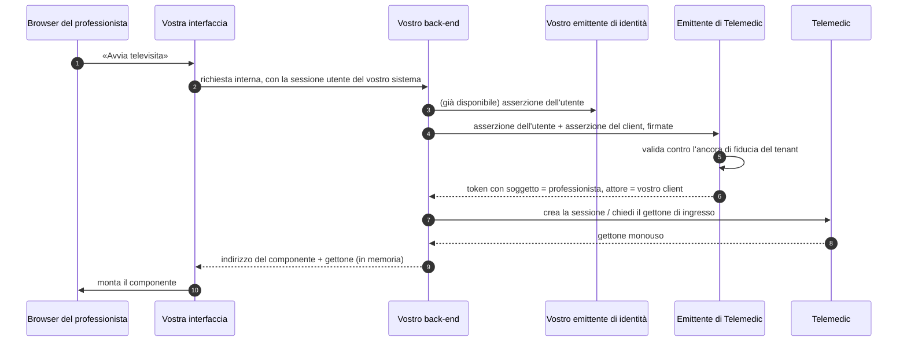

# Identità e delega

È il capitolo con le conseguenze più difficili da correggere a posteriori. Un errore
nell'interfaccia si corregge con un rilascio; un errore nel modello di identità produce un
registro degli accessi che non risponde alle domande a cui deve rispondere, e quel registro non
si ricostruisce.

## 1. Le quattro domande

Ogni chiamata che arriva a Telemedic deve rispondere a quattro domande distinte. Confonderle è
l'origine della maggior parte dei problemi di questa famiglia.

| # | Domanda | Che cosa risponde |
|---|---|---|
| 1 | **Quale sistema** sta chiamando? | L'autenticazione del client: asserzione firmata con la chiave privata dell'integratore |
| 2 | **Per conto di quale persona**? | Il soggetto del token, derivato dall'identità che il vostro sistema ha autenticato |
| 3 | **Con quale garanzia** quella persona è stata identificata? | Il livello di garanzia, e — punto centrale di questo capitolo — **da chi è stato accertato** |
| 4 | **Che cosa le è consentito fare**? | Gli ambiti concessi, più le regole di dominio del tenant |

La domanda 3 è quella che i sistemi omettono. Un registro degli accessi che sa *chi* ha letto un
dato ma non sa *chi ha garantito che fosse davvero quella persona* è un registro incompleto, e
in un contesto in cui alcune operazioni sono legate per legge a un'autenticazione forte è anche
un registro fuorviante.

## 2. Il modello di fiducia

### 2.1 L'ancora di fiducia è per tenant

Al momento dell'onboarding, per **ciascun tenant**, si registra un'ancora di fiducia verso il
vostro emittente di identità:

| Voce | Esempio sintetico | Perché |
|---|---|---|
| Emittente ammesso | `https://idp.integratore.example` | È il solo emittente di cui il tenant accetta asserzioni |
| Indirizzo del materiale di chiave pubblica | `https://idp.integratore.example/.well-known/jwks.json` | Verifica della firma. In lista consentita: non viene mai seguito un indirizzo arbitrario proveniente da un'intestazione |
| Algoritmi ammessi | `ES384`, `RS256` | Mai algoritmo assente, mai algoritmi simmetrici verificati con chiave pubblica |
| Destinatario atteso | `gestionale` | Se l'asserzione dichiara un destinatario, dev'essere quello |
| Mappatura dei campi | quale campo porta il codice fiscale, quale il ruolo, quale l'organizzazione | **Configurabile per tenant, mai cablata**: nessun integratore ha lo stesso schema |
| Livelli esterni accettati, per operazione | vedi §5.4 | Fa parte del contratto di integrazione, non del codice |

### 2.2 La regola che impedisce l'attacco più ovvio

> **Il client che presenta una richiesta è legato al tenant; il tenant è legato a un'ancora di
> fiducia. Non viene mai accettata un'asserzione il cui emittente non sia l'ancora di fiducia del
> tenant del client chiamante.**

Senza questo controllo, l'integratore A potrebbe presentare un'asserzione emessa dall'emittente
dell'integratore B e ottenere un token per un'identità che non gli appartiene. La regola sembra
ovvia scritta così; è omessa con sorprendente frequenza.

### 2.3 Che cosa viene validato, sempre

Firma; emittente; scadenza; validità iniziale; destinatario, se registrato; algoritmo in lista
consentita; identificativo univoco non già usato. E, in aggiunta a ciò che è formalmente
richiesto: **coerenza fra il tenant del client e il tenant desumibile dai campi mappati**.

## 3. Consegna dell'identità senza un secondo accesso

### 3.1 Il problema

Un professionista è autenticato nel vostro sistema. Preme «avvia televisita». Deve comparire la
stanza del consulto, dentro la vostra interfaccia, **senza schermata di accesso e senza rinvio
visibile**. Telemedic deve però sapere chi è, per quale tenant, con quali permessi, e che
l'affermazione «questo è il dott. X» proviene da un emittente fidato e non dal browser.

L'ultima condizione **esclude ogni soluzione in cui il browser trasporta un'asserzione di
identità verso Telemedic**: sarebbe manipolabile. La propagazione avviene **fra back-end**.

### 3.2 Il flusso



**Il punto cruciale sono i passi 4-6.** L'asserzione dell'utente non arriva mai al browser di
Telemedic e non compare mai in un indirizzo.

### 3.3 I due meccanismi

Il progetto documenta **due** meccanismi che risolvono lo stesso problema con vocabolari diversi.
La scelta dipende dalla versione del prodotto di federazione effettivamente installata, e questa
dipendenza va detta invece di essere nascosta.

| | **Asserzione come concessione di autorizzazione** | **Scambio di token** |
|---|---|---|
| Riferimento | RFC 7523 §2.1 | RFC 8693 |
| Tipo di concessione | `urn:ietf:params:oauth:grant-type:jwt-bearer` | `urn:ietf:params:oauth:grant-type:token-exchange` |
| L'asserzione esterna va in | `assertion` | `subject_token` |
| Modalità documentata | **Primaria** | Alternativa |
| Espressione della delega | Nel token emesso | Nel token emesso, e opzionalmente con un'asserzione dell'attore |

Esempio con lo scambio di token, che è la forma più esplicita:

```http
POST /realms/clinic/protocol/openid-connect/token HTTP/1.1
Host: telemedic.esempio.it
Content-Type: application/x-www-form-urlencoded

grant_type=urn%3Aietf%3Aparams%3Aoauth%3Agrant-type%3Atoken-exchange
&subject_token=eyJhbGciOiJFUzM4NCIsImtpZCI6ImludC0yMDI2LTA4In0…
&subject_token_type=urn%3Aietf%3Aparams%3Aoauth%3Atoken-type%3Aaccess_token
&audience=telemedic-api
&scope=https%3A%2F%2Ftelemedic.esempio.it%2Fscopes%2Fsession.start%20system%2FEncounter.cu
&requested_token_type=urn%3Aietf%3Aparams%3Aoauth%3Atoken-type%3Aaccess_token
&client_assertion_type=urn%3Aietf%3Aparams%3Aoauth%3Aclient-assertion-type%3Ajwt-bearer
&client_assertion=eyJhbGciOiJFUzM4NCIsImtpZCI6ImludC0yMDI2LTA4In0…
```

```json
{
  "access_token": "eyJhbGciOiJFUzM4NCIsImtpZCI6InRtLTIwMjYtMDgifQ…",
  "issued_token_type": "urn:ietf:params:oauth:token-type:access_token",
  "token_type": "Bearer",
  "expires_in": 300,
  "scope": "https://telemedic.esempio.it/scopes/session.start system/Encounter.cu"
}
```

### 3.4 Delega, mai impersonificazione

È la distinzione più importante del capitolo ed è normativa, non stilistica.

| | Impersonificazione | **Delega** |
|---|---|---|
| Che cosa si trasmette | Solo l'identità del soggetto | Identità del soggetto **e** dell'attore |
| Che cosa dice il token | «Sono il dott. X» | «Sono il sistema Y che agisce per conto del dott. X» |
| Che cosa registra il registro degli accessi | «Il dott. X ha fatto Z» | «Il dott. X ha fatto Z **tramite il sistema Y**» |
| Ammessa dal progetto | **No** | **Sì, sempre** |

> **Il progetto usa esclusivamente la delega.** Con l'impersonificazione, alla domanda «quale
> sistema ha agito per conto di quale persona» il registro non ha risposta. In un contesto in cui
> l'audit deve reggere davanti a una contestazione clinica o a una verifica di un'autorità, è la
> differenza fra un registro utile e uno inutile.

Il token emesso, con delega:

```json
{
  "iss": "https://telemedic.esempio.it/realms/clinic",
  "aud": "telemedic-api",
  "sub": "https://idp.integratore.example#prof-001",
  "act": {
    "sub": "gestionale-integratore-prod",
    "iss": "https://telemedic.esempio.it/realms/clinic"
  },
  "acr": "urn:telemedic:acr:asserted-by-issuer",
  "auth_source": {
    "kind": "federated-partner",
    "iss": "https://idp.integratore.example",
    "acr_asserted": "https://www.spid.gov.it/SpidL2",
    "verified_by_telemedic": false
  },
  "exp": 1787654621,
  "iat": 1787654321,
  "jti": "0f5b1c2d-9a8e-4b7f-a1c2-3d4e5f6a7b8c",
  "scope": "https://telemedic.esempio.it/scopes/session.start system/Encounter.cu",
  "tenant": "asl-nord-01",
  "fhirUser": "https://api.telemedic.esempio.it/fhir/Practitioner/prc-8812"
}
```

Note sui campi:

- **`sub` non è un identificativo inventato dal progetto**: è derivato in modo deterministico
  dall'emittente e dal soggetto dell'asserzione originale. Rispetta la regola per cui Telemedic
  non diventa il dato di riferimento, e garantisce che due omonimi di due integratori diversi non
  collidano.
- **`act` è il campo standard che esprime la delega** (RFC 8693 §4.1). La sua presenza è ciò che
  distingue delega da impersonificazione.
- **`acr`, `auth_source`, `acr_asserted`, `verified_by_telemedic` e il valore
  `urn:telemedic:acr:asserted-by-issuer`**: il primo è standard, gli altri sono **proposte di
  progetto**, registrate come estensioni proprietarie e documentate come tali. Vedi §5.

### 3.5 Lo stato del supporto, dichiarato

> **`[NV]` — Verifica sul percorso critico.** La disponibilità dello scambio di token nella
> variante *da emittente esterno a emittente interno*, e lo stato di maturità della concessione
> per asserzione, **dipendono dalla versione del prodotto di federazione adottato** e vanno
> verificate sulla versione effettivamente installata prima di dichiarare la funzione come
> disponibile in produzione. È una regola di qualità del ciclo di vita del software: **non si
> dichiara stabile una funzionalità che poggia su una funzione in anteprima.**
>
> Conseguenza pratica per voi: chiedete al vostro referente quale meccanismo è attivo
> sull'installazione con cui state integrando, invece di assumerlo. Chiedetelo **all'inizio**, non
> al collaudo.

## 4. Delega fra organizzazioni

### 4.1 Tre relazioni che si chiamano tutte «delega» e non sono la stessa cosa

| Relazione | Che cos'è | Come si rappresenta |
|---|---|---|
| **Delega tecnica** | Un sistema agisce per conto di una persona che ha autenticato | Il campo dell'attore nel token |
| **Delega organizzativa** | Un'organizzazione opera per conto di un'altra: una società di servizi che gestisce l'infrastruttura di una struttura sanitaria; un aggregatore verso la federazione | Catena di attori annidata, più un accordo scritto fra le parti |
| **Delega di accesso dell'interessato** | Un assistito autorizza un familiare o un caregiver a operare per suo conto | **Non è un fatto di identità**: è un consenso, con validità temporale, perimetro e revoca. Non passa dal token |

Le prime due sono meccanismi di autenticazione; la terza è un fatto di dominio con una propria
disciplina, e **non va rappresentata come identità**. Un caregiver che accede «come» l'assistito
produce un registro in cui non è distinguibile chi ha realmente operato: è esattamente
l'impersonificazione, con le stesse conseguenze.

### 4.2 Catena annidata

Se il vostro sistema agisce a sua volta per conto di un terzo, la catena si preserva:

```json
{
  "sub": "https://idp.integratore.example#prof-001",
  "act": {
    "sub": "gestionale-integratore-prod",
    "act": {
      "sub": "societa-di-servizi-01"
    }
  }
}
```

Il registro degli accessi conserva la catena **per intero**. La profondità ammessa è limitata e
configurata per tenant: una catena arbitrariamente lunga è un segnale di modello di fiducia mal
progettato, non una funzionalità.

### 4.3 Che cosa il progetto chiede a chi delega

1. **Un accordo scritto** fra le parti, che stabilisca chi risponde di che cosa. Vedi
   [09](09-obblighi-di-chi-integra.md).
2. **Un'identità propria dell'attore intermedio**, con chiavi proprie. Riusare le chiavi del
   delegante annulla la distinzione.
3. **La capacità di revocare un solo anello.** Se revocare l'intermediario richiede di revocare
   anche il delegante, la catena non è governabile.

## 5. Propagazione del livello di garanzia

### 5.1 La scala e la corrispondenza

I livelli dell'identità digitale nazionale corrispondono a livelli di garanzia normati a livello
internazionale:

| Livello nazionale | Corrispondenza internazionale | Fattori |
|---|---|---|
| Livello 1 | LoA2 | Fattore singolo |
| Livello 2 | LoA3 | Due fattori, non necessariamente basati su certificati |
| Livello 3 | LoA4 | Due fattori **basati su certificati digitali**, con chiavi private su dispositivo conforme |

I valori si esprimono come identificatori (`https://www.spid.gov.it/SpidL1|SpidL2|SpidL3`) e i
medesimi valori sono usati in richiesta anche verso l'altro canale nazionale. La trattazione
completa è in [10 §04 §7](../10_fondamenti/04-identita-e-anagrafiche.md).

### 5.2 Eseguita contro riferita: la distinzione che regge tutto

Il livello **non viaggia nel campo dell'attore**, e non deve: quel campo esprime **chi agisce**,
mentre il livello è una proprietà **dell'autenticazione del soggetto**. Metterlo lì sarebbe un
abuso semantico.

Il livello sta nel campo del contesto di autenticazione, **e la sua semantica cambia con la
direzione della catena**:

| Scenario | Chi ha autenticato la persona | Che cosa significa il livello nel token emesso |
|---|---|---|
| L'assistito si autentica **su Telemedic** con l'identità digitale nazionale | Telemedic, tramite la federazione | **Autoritativo**: il progetto ha eseguito o richiesto l'autenticazione |
| Il professionista è autenticato **dal vostro emittente** e l'identità arriva per consegna | Voi | **Riferito**: il progetto riporta ciò che l'asserzione dichiara, non ciò che ha verificato |

> **Copiare il livello dell'asserzione esterna nel token emesso senza qualificarlo sarebbe
> scorretto**: farebbe apparire come verificata dal progetto un'autenticazione che il progetto
> non ha eseguito.

Da cui la rappresentazione a due valori, con un marcatore esplicito:

```json
// autenticazione ESEGUITA dal progetto
{
  "acr": "https://www.spid.gov.it/SpidL2",
  "auth_source": {
    "kind": "national-federation",
    "channel": "spid",
    "acr_requested": "https://www.spid.gov.it/SpidL2",
    "acr_asserted":  "https://www.spid.gov.it/SpidL2",
    "verified_by_telemedic": true
  }
}
```

```json
// autenticazione RIFERITA da un integratore
{
  "acr": "urn:telemedic:acr:asserted-by-issuer",
  "auth_source": {
    "kind": "federated-partner",
    "iss": "https://idp.integratore.example",
    "acr_asserted": "https://www.spid.gov.it/SpidL2",
    "verified_by_telemedic": false
  }
}
```

### 5.3 La trappola verificata: richiesto contro asserito

C'è un fatto tecnico, accertato sulle regole tecniche del canale nazionale basato sul documento
d'identità elettronico, che cambia il modo corretto di implementare la propagazione:

> **L'asserzione di ritorno riporta sempre il livello più alto**, indipendentemente dal fattore
> con cui l'utente si è realmente autenticato. Un accesso con sola password e un accesso con
> carta e codice producono la stessa asserzione.

Tre conseguenze:

1. **Il livello effettivo non è desumibile dall'asserzione.** L'unica leva è **la richiesta**: si
   impone il livello nel contesto di autenticazione richiesto e ci si affida all'emittente.
2. **Il livello propagato è quello richiesto, non quello asserito**, e **entrambi** vengono
   registrati nel registro degli accessi. È l'unico modo per rispettare l'auditabilità non
   ripudiabile senza affermare il falso.
3. **L'innalzamento di livello non è verificabile dal lato del fornitore di servizi.** Se il
   servizio richiede un livello e l'utente accede con uno inferiore, il rifiuto deve venire
   dall'emittente: il fornitore non ha modo di accorgersene a posteriori.

> **`[NV]` — Verifica empirica raccomandata.** Il punto 1 discende dalle regole tecniche pubblicate
> ed è verificato su fonte primaria, ma ha conseguenze abbastanza rilevanti da meritare una
> **verifica in preproduzione** prima di dichiarare in documentazione pubblica come si propaga il
> livello di garanzia. È una verifica a costo quasi nullo e va messa sul percorso critico.

### 5.4 Le regole di autorizzazione che ne discendono

1. **Un'operazione che la normativa lega all'autenticazione forte richiede autenticazione
   eseguita.** Un livello riferito da terzi **non soddisfa** un requisito normativo che grava sul
   progetto o sul deployer. Questo vale in particolare per l'accesso al fascicolo e per gli
   accessi a infrastrutture nazionali.
2. **Un'operazione clinica interna** — avviare un consulto, redigere un documento — **può**
   accettare l'identità riferita, purché l'ancora di fiducia del tenant lo consenta
   esplicitamente e il livello riferito raggiunga la soglia configurata.
3. **La configurazione «quali livelli esterni sono accettati per quale operazione» è per
   tenant** e fa parte del contratto di integrazione, non del codice.
4. **Ogni riga del registro degli accessi porta il contesto di autenticazione, la sua origine e
   la catena di delega per intero.** È il minimo per rispondere alla domanda «quale sistema ha
   agito per conto di quale persona, con quale garanzia di identità».

Un esempio di configurazione per tenant, in forma sintetica:

| Operazione | Livello minimo | Identità riferita accettata? |
|---|---|---|
| L'assistito entra nella propria stanza di televisita | Livello 2 | Sì, se il tenant lo consente |
| L'assistito consulta il proprio storico clinico | Livello 2 | Sì, se il tenant lo consente |
| Il professionista accede a dati di **altri** soggetti | Livello 2 minimo, livello 3 configurabile | Sì |
| Accesso a un'infrastruttura nazionale che richiede autenticazione forte | Livello 2 | **No: solo eseguita** |
| Amministrazione del tenant, gestione chiavi, esportazioni massive | **Livello 3 raccomandato** | **No: solo eseguita** |

### 5.5 Il costo nascosto dell'innalzamento di livello

Questo paragrafo riguarda **chi installa**, non chi integra, ma va conosciuto perché condiziona
ciò che il tenant potrà offrirvi.

Il connettore verso i fornitori di identità nazionali configura il contesto di autenticazione
richiesto **staticamente per istanza di fornitore**. Se il livello deve variare per operazione,
servono **due istanze per ciascun fornitore** — una per livello. Il numero di fornitori si legge
da un registro nazionale e cambia nel tempo, quindi il moltiplicatore agisce su un insieme di
cardinalità variabile.

Conseguenze operative, verificate:

- il documento di metadata del fornitore di servizi contiene **un indirizzo di consumo
  dell'asserzione per ciascuna istanza configurata**: raddoppiare le istanze raddoppia gli indici
  del documento **depositato presso l'autorità**, e ogni variazione comporta un nuovo deposito.
  È costo di procedura, non di codice;
- i dati di organizzazione del documento provengono dalla **prima istanza in ordine alfabetico**:
  la convenzione di denominazione degli alias diventa un vincolo di correttezza, e va verificata
  automaticamente;
- con una comparazione di tipo «almeno», una credenziale di livello superiore **soddisfa già** la
  richiesta di livello inferiore: la seconda istanza serve solo dove occorre una semantica
  esatta o un livello strettamente superiore.

**Perimetro adottato dal progetto: due soli livelli** — livello 2 come base, livello 3 per
l'amministrazione del tenant e per le configurazioni che lo impongono. Il fattore è 2, non *n*.

> **`[NV]`.** Non è verificato se il prodotto di federazione, agendo da client verso un emittente
> esterno, **inoltri il livello richiesto** attraverso il realm di intermediazione. Se non lo
> inoltra, l'innalzamento per operazione non è ottenibile per sola configurazione e serve
> un'estensione. Da verificare empiricamente sulla versione adottata.

**Che cosa cambia per voi che integrate: nulla, sul piano dell'interfaccia.** Ciò che cambia è
che il livello che leggete è quello richiesto, non quello asserito — e che il tenant potrebbe non
avere configurato tutti i livelli che vi aspettate.

## 6. Che cosa deve fare chi installa, verso la federazione nazionale

Va detto qui perché gli integratori danno per scontato l'inverso.

> **Il progetto non è accreditato e non può esserlo.** Il fornitore di servizi verso la
> federazione è **chi eroga il servizio in rete**, cioè chi installa. Un repository di codice
> sorgente non ha «servizi attivi», non ha un sito istituzionale su cui pubblicare l'elenco dei
> servizi e non ha un identificativo di entità stabile.

L'obiettivo del progetto è un prodotto **conforme e verificabile in integrazione continua**, non
un'installazione accreditata. Che cosa resta a chi installa:

| Obbligo | Note |
|---|---|
| Stipulare la convenzione con l'autorità e comunicare l'**elenco dei servizi attivi** | Con il livello di sicurezza previsto per ciascuno e le attività ammesse per livello |
| **Motivare** le scelte di livello e la necessità degli attributi richiesti | La motivazione è un atto dovuto verso l'autorità |
| Conservare i registri per il periodo prescritto e mantenere la sincronizzazione oraria entro la tolleranza prescritta | |
| Gestire il rinnovo dei certificati e il rideposito del documento di metadata | Il documento va trattato come artefatto di rilascio versionato, con confronto automatico rispetto a quello depositato |
| Assistenza agli utenti di primo livello e notifica delle violazioni entro il termine prescritto | |

> **I tempi del procedimento di accreditamento non sono dichiarati in alcuna fonte primaria**,
> salvo alcuni termini a valle della firma. Non si può pianificare contro un termine che non
> esiste. Chi costruisce un piano di rilascio su una data di accreditamento sta costruendo su una
> stima propria, e va dichiarato come tale.

Un canale alternativo non ha questa dipendenza: l'autenticazione basata sul certificato della
tessera sanitaria non richiede alcun procedimento presso terzi ed è quindi l'unico interamente
sotto il controllo di chi installa. Non ha però un livello di garanzia dichiarato
nell'asserzione: il livello va asserito dal fornitore di servizi in base al fatto che
l'autenticazione è a due fattori su certificato digitale, ed è una **valutazione**, non un dato.

## 7. Avvio applicativo in contesto clinico

### 7.1 I due ruoli, da non confondere

Esiste un profilo standard per l'avvio di applicazioni cliniche da dentro un sistema di cartella
clinica. Il progetto lo sostiene **in entrambi i versi**, e sono due implementazioni distinte:

| Ruolo | Chi autorizza | Che cosa fa Telemedic |
|---|---|---|
| **Telemedic come applicazione avviata** | Il **vostro** sistema | Legge assistito, appuntamento e professionista dal vostro server clinico. È il verso naturale quando siete voi ad avere la cartella clinica |
| **Telemedic come autorità e server di risorse** | Telemedic | Accetta applicazioni di terze parti sulla propria interfaccia clinica. È il verso che abilita gli scenari di ente pubblico e di applicazione per il cittadino |

### 7.2 Il verso più utile agli integratori

Se avete una cartella clinica con un server clinico, l'avvio applicativo vi risparmia lavoro:
il contesto — quale assistito, quale contatto, quale appuntamento — arriva **senza che voi lo
passiate a mano** e senza che l'utente lo selezioni.

```http
GET https://embed.telemedic.esempio.it/launch
      ?iss=https%3A%2F%2Fgestionale.integratore.example%2Ffhir
      &launch=xyz123 HTTP/1.1
```

Il valore di avvio è **opaco**: non va interpretato, va rimandato indietro nella richiesta di
autorizzazione. Il progetto scopre gli indirizzi del vostro emittente da un documento di
configurazione pubblicato dal vostro server clinico.

Dalla risposta di token arrivano i parametri di contesto, e tre di essi risolvono problemi che
altrimenti richiederebbero estensioni proprietarie:

| Parametro | Che cosa risolve |
|---|---|
| Necessità dell'intestazione con i dati dell'assistito | Dichiara se il vostro sistema **mostra già** chi è l'assistito, così il componente non duplica l'intestazione |
| Indirizzo di stile pubblicato dall'ospitante | È il meccanismo **standard** di personalizzazione visiva quando l'avvio è di questo tipo. Va usato prima del canale proprietario ([05 §7.1](05-componente-incorporabile.md)) |
| Identificativo dell'organizzazione | Si mappa direttamente sul contesto di tenant |
| Contesto clinico aggiuntivo | È la sede naturale del riferimento all'appuntamento che ha originato il consulto |

Due regole di sicurezza da applicare comunque:

1. **La prova di possesso del codice di autorizzazione è obbligatoria**, con il solo metodo forte:
   il metodo debole non va sostenuto nemmeno per compatibilità.
2. **Il destinatario della richiesta di autorizzazione non è cosmetico**: impedisce che un token
   legittimo venga consegnato a un server di risorse contraffatto. Un'autorità che non lo valida
   consente a un server ostile di farsi emettere token validi per sé.

E un'avvertenza operativa: **l'indirizzo di stile punta a un documento servito da un terzo**.
Va trattato come input non fidato — recupero con scadenza, limite di dimensione, validazione
dello schema, e le stesse contromisure verso richieste indirizzate a risorse interne descritte
in [04 §4.3](04-integrazione-per-eventi.md).

### 7.3 Quando non usare questo profilo

| Situazione | Perché no | Alternativa |
|---|---|---|
| Non avete un server clinico né intendete averlo | Il profilo presuppone un server di risorse clinico come destinatario: senza, si riduce a un'autorizzazione con nomi insoliti | Consegna dell'identità fra back-end (§3) |
| Vi serve solo propagare l'identità, senza contesto clinico | Il contesto è il valore aggiunto del profilo: senza, si paga complessità a vuoto | Consegna dell'identità fra back-end |
| Comunicazione fra sistemi senza semantica clinica, per esempio una sincronizzazione amministrativa | Gli ambiti per tipo di risorsa non modellano capacità non cliniche | Credenziali di sistema con ambiti espressi come URI |
| Applicazione per il cittadino che deve restare autenticata per settimane | Un rinnovo che sopravvive alla disconnessione, su un client pubblico e in ambito sanitario, è un rischio di custodia difficile da giustificare in un'analisi dei rischi | Sessione breve con ri-autenticazione locale, oppure client con back-end proprio |

## 8. Antipattern di identità

| # | Antipattern | Perché è grave | Che cosa fare |
|---|---|---|---|
| 1 | **Passare l'asserzione dell'utente al browser** perché la inoltri a Telemedic | È manipolabile e finisce nei registri: non è un'asserzione di identità, è un'affermazione del browser | Consegna fra back-end |
| 2 | **Impersonificazione** «perché è più semplice» | Il registro perde l'informazione su quale sistema ha agito. È irrecuperabile a posteriori | Delega, sempre |
| 3 | **Copiare il livello esterno nel token emesso senza qualificarlo** | Afferma il falso: dichiara verificata dal progetto un'autenticazione altrui | Marcatore esplicito e due valori |
| 4 | **Rappresentare il caregiver come l'assistito** | È impersonificazione con una motivazione clinica. Chi ha operato diventa indistinguibile | Consenso di delega di accesso, con perimetro e revoca |
| 5 | **Un solo client per tutti gli ambienti** | Un incidente in prova diventa un incidente in produzione | Un client per ambiente, chiavi distinte |
| 6 | **Chiave privata nel repository o nell'immagine di contenitore** | È il modo più comune in cui una chiave esce | Gestore di segreti, avvio che fallisce se manca |
| 7 | **Ruolo come attributo della persona** | Il ruolo è una relazione fra persona e organizzazione **con validità temporale**. Come attributo, non si può revocare per una sola organizzazione né datare | Relazione con validità |
| 8 | **Identificare l'utente con l'indirizzo di posta elettronica** | Cambia, si riusa, e in alcuni prodotti di federazione è modificabile dall'utente stesso | Identificativo stabile dell'emittente |
| 9 | **Assumere che la revoca sia istantanea** | Un token validato localmente resta valido fino alla scadenza | Token brevi, e lista di negazione dove serve immediatezza |
| 10 | **Chiedere un attributo in più «perché potrebbe servire»** | Nei canali nazionali, chiedere un solo attributo oltre l'anagrafica di base può moltiplicare per quasi dieci il costo per accesso. Ed è comunque un principio di minimizzazione | Chiedere il minimo, motivarlo |

L'ultima riga ha un dato concreto che vale la pena conoscere quando progettate quali attributi
richiedere: nella tabella tariffaria dichiarata, il costo per accesso passa da un valore
trascurabile a un valore di ordini di grandezza superiore quando si richiede un attributo oltre
l'anagrafica di base. **La verifica della vigenza di quella tabella è a carico di chi installa**,
ma il principio di progettazione vale comunque: ogni attributo richiesto va motivato.

## 9. Riepilogo decisionale

| La vostra situazione | Meccanismo |
|---|---|
| Avete un emittente di identità con materiale di chiave pubblicabile | Consegna dell'identità fra back-end, con delega |
| Avete un emittente ma le sue asserzioni sono opache e non c'è ispezione | Chiedete al vostro emittente un'asserzione di identità firmata. Senza, non c'è nulla da validare |
| Avete una cartella clinica con server clinico | Avvio applicativo in contesto clinico, verso di voi |
| Non avete un emittente di identità | Realm proprio del progetto, con marchio per tenant. Costo dichiarato: gli utenti hanno due credenziali |
| Nessun utente coinvolto: processo automatico | Credenziali di sistema con asserzione firmata. Nessun soggetto, nessun livello di garanzia |
| Il flusso parte dal browser e non avete un back-end | Codice di autorizzazione con prova di possesso, con federazione. **Mai** consegna dell'identità dal browser |
| Il vostro sistema parla solo messaggistica ospedaliera | Nessuna identità utente sul canale: identità **di nodo**, con mutua autenticazione. Le operazioni sono attribuite al sistema, non a una persona, e va dichiarato |
