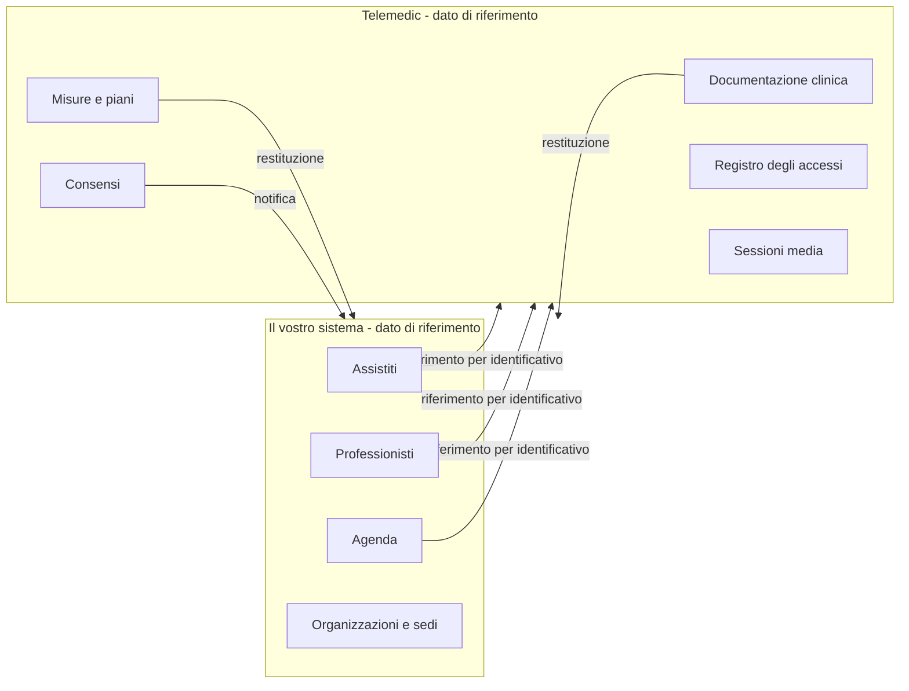
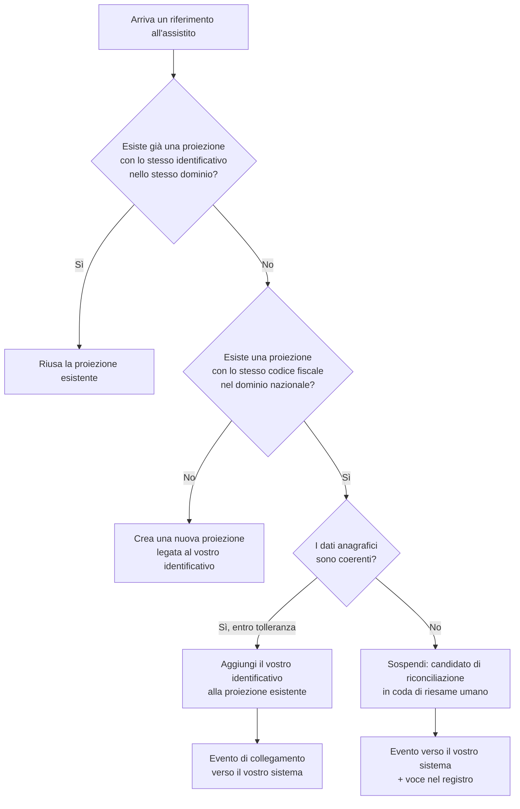

# Dati e sincronizzazione

Questo capitolo risponde a una domanda che sembra amministrativa e non lo è: **chi possiede
quale dato, e che cosa succede quando due sistemi dicono cose diverse sulla stessa persona?**

La risposta ha conseguenze cliniche. Una divergenza fra due anagrafiche non produce un difetto di
dati: produce una fusione o una scissione di identità, e sono eventi avversi. I fondamenti sono
in [10 §04 - Identità e anagrafiche](../10_fondamenti/04-identita-e-anagrafiche.md); qui si
tratta il confine fra i due sistemi.

## 1. Il principio

> **Telemedic non è il dato di riferimento.** Assistiti, professionisti, organizzazioni, sedi e
> appuntamenti sono governati dal vostro sistema. Il progetto ne conserva una **proiezione
> minima**, legata ai vostri identificativi, sufficiente a erogare la prestazione e a produrre la
> documentazione clinica.

Da cui tre corollari che valgono senza eccezioni:

1. **Nessun identificatore esterno è chiave primaria.** Il codice fiscale non è una chiave: è un
   identificatore con un dominio di attribuzione esplicito. Il progetto lo tratta come tale, e vi
   chiede di fare altrettanto.
2. **Il progetto non modifica il vostro dato di riferimento.** Non riscrive un'anagrafica, non
   corregge una data di nascita, non fonde due assistiti nel vostro sistema. Segnala e chiede.
3. **Ciò che il progetto produce - documentazione clinica, misure, consensi, tracce - è
   governato dal progetto**, e viene restituito a voi. La direzione del possesso si inverte a
   metà del flusso, ed è il punto in cui si concentrano i malintesi.



## 2. Identificatori e domini di attribuzione

### 2.1 Un identificatore senza dominio è una stringa

`PZ-889231` non identifica nessuno. `PZ-889231` **nel dominio
`https://gestionale.integratore.example/sid/assistito`** identifica una persona, in modo
verificabile e non ambiguo.

Ogni riferimento che inviate porta quindi **due** valori:

```json
{
  "system": "https://gestionale.integratore.example/sid/assistito",
  "value": "PZ-889231"
}
```

Sul piano clinico la forma è quella prescritta dallo standard:

```json
{
  "resourceType": "Patient",
  "identifier": [
    {
      "system": "https://gestionale.integratore.example/sid/assistito",
      "value": "PZ-889231"
    },
    {
      "system": "http://hl7.it/sid/codiceFiscale",
      "value": "RSSMRA80A01H501Z"
    }
  ]
}
```

### 2.2 Come dichiarare il vostro dominio

| Regola | Motivo |
|---|---|
| Un identificatore univoco, stabile e vostro | Non riusate quello di un altro, non usate un valore generico |
| **Uno per tipo di entità**: assistiti, professionisti, appuntamenti, organizzazioni | Domini distinti evitano che due valori uguali di tipi diversi collidano |
| **Non cambia mai.** Nemmeno per un cambio di dominio commerciale del vostro prodotto | Cambiarlo scinde lo storico in due, e la riconciliazione a posteriori è manuale |
| Non deve necessariamente risolvere a una pagina | È un identificatore, non un indirizzo. Che assomigli a un indirizzo web è convenzione |
| **Registratelo in fase di onboarding** | Un dominio non registrato viene rifiutato: impedisce che un errore di digitazione crei un secondo spazio dei nomi silenzioso |

L'ultima riga previene l'incidente più frequente di questa famiglia: due chiamate con due domini
leggermente diversi - con e senza barra finale, con e senza sottodominio - creano due assistiti
per la stessa persona, e nessuno se ne accorge finché lo storico non si divide.

### 2.3 Gli identificatori italiani, e la divergenza verificata

Il quadro completo - codice fiscale e sua costruzione, omocodia, casi in cui manca o cambia,
identificatori delle popolazioni non iscritte, tessera sanitaria, identificativi regionali - è in
[10 §04 §2](../10_fondamenti/04-identita-e-anagrafiche.md). Qui interessa un fatto verificato che
vi riguarda direttamente:

> **Esistono due identificatori canonici diversi per il codice fiscale nelle guide di
> implementazione italiane**, entrambi su fonte primaria: le guide di base e quella dedicata alla
> televisita usano `http://hl7.it/sid/codiceFiscale`; la guida di nucleo nazionale usa un
> identificatore diverso, nel proprio spazio dei nomi.

Il progetto dichiara conformità alla famiglia della televisita e usa quindi
**`http://hl7.it/sid/codiceFiscale`**. La conseguenza per voi è concreta: **un consumatore
allineato all'altra guida non riconoscerà l'identificatore**, e la traduzione al confine va
prevista invece di essere scoperta.

Un secondo punto verificato, che evita un errore diffuso: **il codice di tipo identificatore
generico che molti usano per il codice fiscale non esiste** nella tabella standard. Il concetto
realmente presente ha una regola di formazione che compone il prefisso con il codice del Paese a
tre lettere; il valore risultante per l'Italia **non è enumerato**, è generato dalla regola. E
**nessun profilo italiano pubblicato fissa il valore**: la scelta resta contrattuale fra voi e
noi, e va scritta nel profilo di interfaccia invece di essere assunta.

### 2.4 Che cosa il progetto conserva

Una **proiezione minima**, non un'anagrafica:

| Categoria | Che cosa serve | Che cosa non viene chiesto |
|---|---|---|
| Assistito | Identificativi con dominio, dati anagrafici minimi necessari all'identificazione durante la prestazione e alla produzione del documento, recapiti per l'invito | Storia clinica pregressa, terapie, allergie, salvo che siano oggetto della prestazione |
| Professionista | Identificativi con dominio, nome, **ruolo presso l'organizzazione con la sua validità temporale**, eventuale numero di iscrizione | Dati personali non necessari |
| Organizzazione e sede | Identificativi, denominazione | - |
| Appuntamento | Identificativo con dominio, istanti, tipo di prestazione, partecipanti | - |

**Il principio di minimizzazione non è un adempimento formale**: ogni campo che non ci mandate è
un campo che non può essere trattato in modo eccessivo, non può comparire in un registro e non
può essere oggetto di una violazione.

## 3. Riconciliazione

### 3.1 I due errori simmetrici, e perché non sono equivalenti

| Errore | Che cosa succede | Gravità |
|---|---|---|
| **Fusione errata** - due persone diverse trattate come una | Il documento clinico di una persona finisce nella storia di un'altra | **Massima.** È un evento avverso, non un difetto di dati |
| **Mancata fusione** - la stessa persona in due record | La storia si divide; un professionista vede metà delle informazioni | Grave, ma **recuperabile** |

L'asimmetria determina la politica: **in caso di dubbio non si fonde**. Una mancata fusione si
corregge; una fusione errata lascia tracce nella documentazione clinica firmata, che è
immutabile per costruzione.

### 3.2 La procedura



Tre regole:

1. **La fusione automatica esiste solo per corrispondenza esatta su un identificatore forte**,
   con dati anagrafici coerenti. Ogni altro caso genera un **candidato**, non una fusione.
2. **Il candidato va a riesame umano**, e il riesame è tracciato con chi ha deciso e su quali
   basi. Non esiste un percorso in cui una fusione avviene senza che qualcuno l'abbia decisa.
3. **La scissione è sempre possibile**, e il progetto conserva ciò che serve a eseguirla: una
   fusione che non si può disfare è una fusione irresponsabile.

### 3.3 Le sopravvenienze

Sono gli eventi che invalidano ciò che il sistema credeva. Vanno gestite, non subite.

| Sopravvenienza | Effetto | Che cosa il progetto si aspetta da voi |
|---|---|---|
| **Il codice fiscale cambia** (rettifica, acquisizione di cittadinanza, correzione di un errore anagrafico) | L'identificatore nazionale non è più quello registrato | Notificate il cambio con **entrambi** i valori, vecchio e nuovo. Il progetto conserva la catena, non sovrascrive |
| **Omocodia** | Due persone hanno diritto allo stesso codice, e a una viene attribuito un codice trasformato | Inviate il codice effettivamente attribuito. Non «normalizzate» il codice trasformato riportandolo alla forma base |
| **Da identificativo provvisorio a codice fiscale** | Una persona precedentemente identificata con un codice per popolazioni non iscritte ottiene un codice fiscale | Notificate il collegamento. È il caso in cui una fusione è **corretta** e va eseguita, ma resta soggetta a riesame |
| **Decesso** | Cambiano le operazioni ammesse e la conservazione | Notificate. Il progetto non deduce il decesso dall'assenza di attività |
| **Cambio di organizzazione del professionista** | Il ruolo cessa presso l'una e inizia presso l'altra | Notificate la **cessazione**, non solo il nuovo ruolo. Un ruolo che non cessa mai è un accesso che non si revoca mai |

L'ultima riga è quella che produce i problemi di sicurezza più duraturi: un professionista che
cambia struttura e di cui nessuno chiude il ruolo precedente mantiene un accesso legittimo dal
punto di vista del sistema.

## 4. Allineamento

### 4.1 Chi vince

La precedenza è dichiarata **per campo**, non per sistema, e configurata per tenant. Un esempio
di configurazione tipica:

| Campo | Precedenza | Motivo |
|---|---|---|
| Identificativi con dominio | **Il sistema che li ha attribuiti** | Nessuno può riscrivere un identificatore di un altro dominio |
| Nome, cognome, data di nascita | **Il vostro sistema** | Siete voi il dato di riferimento anagrafico |
| Recapiti (telefono, posta elettronica) | **Il vostro sistema**, con eccezione dichiarata | Se l'assistito aggiorna un recapito durante la prestazione, il progetto lo segnala; non lo impone |
| Stato dell'appuntamento | **Il vostro sistema** fino all'avvio, **il progetto** durante e dopo | È il punto di passaggio del possesso, ed è la fonte principale di conflitto (§5) |
| Documentazione clinica prodotta | **Il progetto** | È l'atto sanitario, prodotto qui |
| Consensi acquisiti nella prestazione | **Il progetto** | Con la loro validità temporale |
| Misure di telemonitoraggio | **Il progetto** | Sono immutabili e portano il proprio contesto |

**Scrivetela.** Una precedenza non dichiarata viene decisa a runtime da chi scrive per ultimo, ed
è il modo in cui i dati si corrompono senza che nessuno lo scelga.

### 4.2 Le tre modalità di allineamento

| Modalità | Quando | Costo |
|---|---|---|
| **A spinta all'occorrenza** | Inviate il riferimento a ogni chiamata, con i dati minimi. Il progetto aggiorna la proiezione | Nessun processo aggiuntivo. **Modalità raccomandata** |
| **A richiamo** | Il progetto interroga il vostro sistema quando gli serve un dato che non ha | Richiede che esponiate un'interfaccia di lettura. Utile se i vostri dati cambiano spesso |
| **Per evento** | Notificate al progetto i cambiamenti anagrafici rilevanti | Richiede un canale in ingresso. Utile su volumi grandi |

Le tre modalità **si combinano**: spinta per il caso normale, evento per le sopravvenienze,
richiamo per i casi in cui manca un dato.

### 4.3 Riconciliazione periodica

Indipendentemente dalla modalità, serve un confronto periodico. Non perché il meccanismo sia
inaffidabile, ma perché **l'assenza di divergenze va dimostrata, non presunta**.

Il progetto espone un'estrazione delle proiezioni per tenant, con i loro identificativi e gli
istanti di ultimo aggiornamento; voi la confrontate con il vostro dato di riferimento. Una
divergenza che compare in questo confronto e non era stata segnalata è un difetto da indagare,
non un dato da correggere in silenzio.

## 5. Conflitti e loro risoluzione

### 5.1 La matrice

| Conflitto | Sintomo | Risoluzione | Chi decide |
|---|---|---|---|
| **Appuntamento annullato da voi mentre la sessione è in corso** | L'annullamento arriva a sessione avviata | **La sessione prosegue.** L'annullamento è registrato come tentativo tardivo e notificato. Un atto sanitario in corso non si annulla per una modifica di agenda | Il progetto |
| **Riprogrammazione durante la sessione** | Nuovo istante mentre il consulto è attivo | Come sopra: la riprogrammazione si applica a una **nuova** prestazione, non a quella in corso | Il progetto |
| **Anagrafica divergente su un campo non identificativo** | Cognome diverso fra i due sistemi | Prevale il vostro; il progetto registra la divergenza e la segnala | Voi, con segnalazione |
| **Anagrafica divergente su un identificatore forte** | Codice fiscale diverso per lo stesso vostro identificativo | **Sospensione**: candidato di riconciliazione, riesame umano. Nessuna sovrascrittura automatica | Riesame umano |
| **Due vostri identificativi sullo stesso codice fiscale** | Due proiezioni collegabili | Candidato di fusione, riesame umano | Riesame umano |
| **Documento già archiviato da voi e poi sostituito** | Arriva una versione successiva | **Non sovrascrivete**: registrate la sostituzione mantenendo la catena. Il documento firmato è immutabile | Il progetto produce, voi rappresentate |
| **Consenso revocato dopo che avete già agito** | La revoca arriva a valle | La revoca ha effetto **da quando è stata espressa**, e non retroagisce sugli atti già compiuti; ma può obbligare a interrompere trattamenti in corso. Il progetto notifica; l'azione conseguente è vostra | Voi, sul vostro perimetro |
| **Modifica concorrente della stessa risorsa** | Due processi scrivono | Rifiuto per precondizione fallita, con ricarica e decisione esplicita ([03 §6](03-integrazione-per-api.md)) | Chi scrive per secondo |
| **Ruolo cessato ma sessione programmata** | Il professionista non è più abilitato | La prestazione è sospesa e segnalata. **Non si esegue con un ruolo cessato** | Il progetto |

### 5.2 Il principio che governa la matrice

> **Un atto sanitario in corso non è un record.** Le regole di precedenza dei dati non si
> applicano a una prestazione che si sta svolgendo: si applicano prima e dopo. Durante, il
> progetto protegge l'integrità dell'atto e registra i tentativi di modifica come fatti, non
> come aggiornamenti.

È la regola che sorprende di più chi arriva da integrazioni gestionali, dove l'ultimo che scrive
vince. Qui l'ultimo che scrive, se scrive durante un atto clinico, viene registrato e respinto.

## 6. Professionisti, ruoli e organizzazioni

Il modello è **persona, ruolo, organizzazione**, con il ruolo come **relazione con validità
temporale**. Non è un dettaglio accademico: è il vero controllo di accesso.

L'errore che quasi tutti commettono è modellare la **specialità come attributo della persona**.
Un professionista può esercitare specialità diverse presso organizzazioni diverse, e in tempi
diversi; come attributo della persona, l'informazione non si può datare né revocare
selettivamente.

Che cosa il progetto si aspetta da voi:

```json
{
  "practitioner": {
    "system": "https://gestionale.integratore.example/sid/professionista",
    "value": "PR-77"
  },
  "role": {
    "organization": {
      "system": "https://gestionale.integratore.example/sid/organizzazione",
      "value": "ORG-3"
    },
    "code": "cardiologia",
    "period": { "start": "2024-03-01", "end": null }
  }
}
```

E la regola operativa: **notificate la cessazione del ruolo**, non solo l'inizio del nuovo. Un
ruolo aperto senza fine è un accesso permanente.

## 7. Appuntamenti e agenda

Il progetto **non è un'agenda** e non aspira a diventarlo. L'appuntamento nasce nel vostro
sistema; il progetto lo riceve per riferimento.

Che cosa serve, in minimo:

| Campo | Obbligatorio | Note |
|---|---|---|
| Identificativo con dominio | Sì | Chiave di idempotenza naturale per l'ingestione |
| Istanti previsti | Sì | Con fuso orario esplicito. Un istante senza fuso è ambiguo due volte l'anno |
| Tipo di prestazione | Sì | Determina il profilo clinico applicato |
| Partecipanti con i loro riferimenti | Sì | Assistito, professionista, eventuale caregiver |
| Stato | Sì | Il progetto rifiuta l'avvio da uno stato incompatibile |

L'ingestione ripetibile usa la creazione condizionale del piano clinico, con il vostro
identificativo come criterio ([03 §5.4](03-integrazione-per-api.md)). È il modo corretto per una
sincronizzazione notturna che rielabora gli stessi appuntamenti senza creare duplicati.

**Che cosa il progetto non fa:** non decide la disponibilità, non risolve sovrapposizioni, non
applica regole di prenotabilità. Se avete bisogno di un'agenda, il progetto ne ha una - ed è un
modulo **disattivabile**, che si spegne quando avete la vostra
([08](08-moduli-sostituibili.md)).

## 8. Documenti

### 8.1 Immutabilità

> **Il documento clinico firmato è immutabile.** Non si modifica: si emette una versione
> successiva che sostituisce o rettifica la precedente, mantenendo la catena.

La conseguenza per il vostro sistema è netta: **dovete saper rappresentare una sostituzione**.
Sovrascrivere il documento archiviato con la nuova versione distrugge l'informazione su che cosa
era stato refertato in un dato momento - che è precisamente l'informazione che serve in una
contestazione.

| Evento | Che cosa fare nel vostro sistema |
|---|---|
| Documento redatto | **Nulla.** Non è un documento valido |
| Documento firmato | Archiviare, con riferimento e versione |
| Documento sostituito | Archiviare la nuova versione, **mantenere la precedente** e registrarne la relazione |

### 8.2 Il contenuto informativo e la sua forma

Il contenuto si modella come **dataset canonico**; le serializzazioni sono **sostituibili** e non
vanno cablate. Sul piano clinico il referto della prestazione è una **composizione dentro una
busta**, non un referto diagnostico generico: è la forma prescritta dalle guide nazionali.

La forma di referto diagnostico è mantenuta come **proiezione in sola lettura** per gli
integratori che se l'aspettano - mai come artefatto primario. Se il vostro sistema la consuma,
funziona; se dovete costruire da zero, costruite sulla forma canonica.

### 8.3 Che cosa il progetto non fa con i documenti

- **Non li invia alle infrastrutture nazionali per conto vostro.** Produce il contenuto; il
  conferimento è un flusso con obblighi, termini e responsabilità propri, che grava su chi eroga
  la prestazione.
- **Non genera contenuto clinico.** Il documento è **persistenza di contenuto redatto dal
  professionista**, non generazione autonoma di informazione clinica. È un confine
  architetturale, non una scelta di prodotto.
- **Non traduce i codici clinici per voi** oltre a ciò che il servizio di terminologie
  configurato consente. Vedi [09 §6](09-obblighi-di-chi-integra.md).

## 9. Cancellazione e diritti dell'interessato

Una richiesta dell'interessato che arriva a voi tocca anche il progetto, e viceversa. Il quadro
delle responsabilità è in [09 §3](09-obblighi-di-chi-integra.md); qui i fatti tecnici.

| Diritto | Che cosa può fare il progetto | Limite |
|---|---|---|
| Accesso | Esportazione di ciò che riguarda l'interessato, per tenant | - |
| Rettifica | Sui dati di proiezione: si applica al **vostro** dato e si riflette qui | **Non sulla documentazione clinica firmata**: si rettifica con una versione successiva, non si corregge |
| Cancellazione | Cancellazione delle proiezioni e dei dati non soggetti a obbligo di conservazione | **La documentazione clinica e le tracce di accesso hanno obblighi di conservazione propri** e non si cancellano su richiesta |
| Limitazione | Sospensione dei trattamenti non necessari | - |
| Opposizione a specifici trattamenti | Revoca dei consensi, oscuramento | L'oscuramento ha una disciplina propria che non coincide con la cancellazione |

**La conseguenza pratica più importante:** se il vostro processo di cancellazione presuppone che
tutto sparisca, è un processo che non regge. Va progettato conoscendo quali categorie hanno
obblighi di conservazione e per quanto.

## 10. Antipattern di sincronizzazione

| # | Antipattern | Conseguenza | Che cosa fare |
|---|---|---|---|
| 1 | **Inviare identificativi senza dominio** | Due spazi dei nomi che collidono, o due persone che diventano una | Sempre dominio più valore |
| 2 | **Cambiare il dominio** dopo la messa in esercizio | Lo storico si scinde e la riconciliazione diventa manuale | Il dominio non cambia mai |
| 3 | **Usare il codice fiscale come chiave primaria** | Non è univoco (omocodia), non è sempre presente, può cambiare | Chiave interna, identificatori come attributi |
| 4 | **Fondere automaticamente** su corrispondenza approssimata | Fusione errata: evento avverso | Candidato e riesame umano |
| 5 | **Normalizzare i codici trasformati per omocodia** | Si riportano due persone diverse allo stesso codice | Inviare il codice effettivamente attribuito |
| 6 | **Non notificare la cessazione dei ruoli** | Accessi permanenti a chi ha cambiato struttura | Notificare la fine, non solo l'inizio |
| 7 | **Sovrascrivere il documento archiviato** con la nuova versione | Perdita dell'informazione su che cosa era stato refertato e quando | Rappresentare la sostituzione |
| 8 | **Inviare istanti senza fuso orario** | Ambiguità di un'ora, due volte l'anno, su prestazioni programmate | Sempre fuso esplicito |
| 9 | **Usare il campo dei dati opachi per dati sanitari** | Non è cifrato campo per campo, compare nelle notifiche e può comparire in diagnostica | Solo riferimenti gestionali |
| 10 | **Sincronizzare l'intera anagrafica «per sicurezza»** | Si trattano dati di persone che non hanno alcuna prestazione. È un trattamento eccedente senza beneficio | Riferimento all'occorrenza |
| 11 | **Trattare l'assenza di aggiornamenti come conferma** | Un canale rotto è indistinguibile da un periodo senza modifiche | Riconciliazione periodica e sorveglianza del volume atteso |
