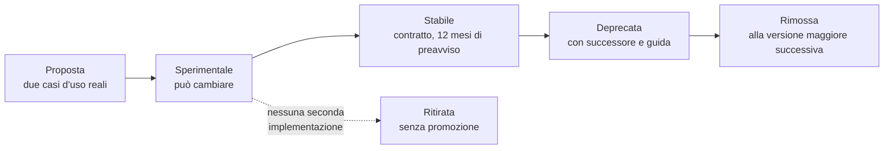

# Moduli sostituibili

## 1. Il principio

Il progetto ha moduli propri per refertazione e firma, agenda, fatturazione, recapito delle
notifiche, archiviazione delle registrazioni. **Sono disattivabili e sostituibili per
configurazione**: dove esiste già un modulo dell'integratore o dell'infrastruttura regionale, il
sistema **si integra invece di duplicare**.

Non è una concessione: è una condizione di adozione. Un professionista che referta in due
strumenti produce due archivi parziali; due agende producono doppie prenotazioni; due sistemi di
fatturazione producono contestazioni.

Ma è anche la modalità con il **costo di possesso più alto**. Questo capitolo serve a decidere
quando ne vale la pena.

## 2. La tassonomia, e la regola che la governa

| Livello | Meccanismo | Chi lo usa | Rischio |
|---|---|---|---|
| **Configurazione** | Proprietà per tenant, interruttori di funzionalità | Amministratore | Nullo |
| **Dati** | Campi opachi per tenant, estensioni sul piano clinico | Integratore, per interfaccia | Basso |
| **Presentazione** | Proprietà di tema, modelli configurabili | Integratore, per interfaccia | Basso, con validazione |
| **Eventi** | Notifiche e sondaggio | Integratore, **fuori processo** | Basso |
| **Comportamento sincrono fuori processo** | Il progetto chiama un vostro indirizzo e attende una decisione | Integratore, fuori processo | **Medio** |
| **Comportamento dentro il processo** | Il progetto carica una vostra implementazione | Chi installa in ambiente dedicato | **Alto** |
| **Biforcazione del codice** | — | Ultima risorsa | **Massimo** |

> **Regola guida: spingere l'estensibilità il più in alto possibile in questa tabella.** Ogni
> estensione ottenibile con la configurazione non deve richiedere un modulo; ogni estensione
> ottenibile con un evento non deve richiedere codice dentro il processo.

E una restrizione che non ammette eccezioni:

> **I punti di estensione dentro il processo sono ammessi solo nell'installazione dedicata a un
> unico cliente.** In un'installazione condivisa fra più tenant, caricare codice di terzi nel
> processo che serve tutti significa che un difetto o una fuga di memoria del vostro codice
> impatta tutti gli altri, e che un modulo malevolo può leggere i dati di tutti. Non è una
> precauzione: è una condizione di ammissibilità.

## 3. Catalogo dei moduli disattivabili

Per ciascuno: che cosa si spegne, che cosa resta a carico vostro, e come avviene l'integrazione.

### 3.1 Agenda e prenotazione

| | |
|---|---|
| **Che cosa si spegne** | Disponibilità, prenotazione, riprogrammazione, disdetta, promemoria |
| **Che cosa resta acceso** | Il concetto di appuntamento come **riferimento**: il progetto continua a legare la prestazione a un appuntamento del vostro dominio |
| **Che cosa resta a carico vostro** | Regole di prenotabilità, disponibilità, sovrapposizioni, promemoria |
| **Come si integra** | Ingestione dell'appuntamento con creazione condizionale; notifiche di annullamento e riprogrammazione in ingresso; eventi di esito in uscita |
| **Che cosa il progetto continua a garantire** | Che una prestazione non possa essere avviata da uno stato di appuntamento incompatibile, e che la modifica tardiva durante un atto in corso sia registrata e respinta ([07 §5](07-dati-e-sincronizzazione.md)) |

**Caso in cui non conviene spegnerlo**: se la vostra agenda non modella la prestazione a
distanza — verifica tecnica preventiva, sala d'attesa, finestra di attesa dichiarata prima di
considerare l'assistito assente — spegnendola perdete funzioni che dovrete ricostruire.

### 3.2 Refertazione e firma

| | |
|---|---|
| **Che cosa si spegne** | L'editor di refertazione e il flusso di firma propri del progetto |
| **Che cosa resta acceso** | Il **modello del documento** e le sue invarianti: immutabilità, versionamento, catena di sostituzione |
| **Che cosa resta a carico vostro** | Redazione, validazione clinica, apposizione della firma con lo strumento che usate, conservazione |
| **Come si integra** | Il progetto vi consegna il contesto clinico della prestazione; voi restituite il documento firmato con la sua forma canonica; il progetto lo lega alla prestazione e ne registra la relazione |
| **Che cosa il progetto continua a garantire** | Che il documento resti immutabile una volta acquisito, che la sostituzione mantenga la catena e che la relazione con la prestazione sia tracciata |

**Il vincolo che non si spegne.** Il documento è **persistenza di contenuto redatto dal
professionista**, non generazione autonoma di informazione clinica. Un modulo sostitutivo che
generasse contenuto clinico sposterebbe il confine di ciò che il sistema afferma sul paziente, e
questo è un cambiamento di natura, non di implementazione. Il progetto non lo consente e la
verifica è documentale, non tecnica: **è una responsabilità che ricade su di voi** ([09](09-obblighi-di-chi-integra.md)).

### 3.3 Fatturazione

| | |
|---|---|
| **Che cosa si spegne** | Tariffario, emissione, esiti amministrativi |
| **Che cosa resta acceso** | L'evento amministrativo che dichiara la prestazione liquidabile |
| **Che cosa resta a carico vostro** | Tutto il ciclo attivo |
| **Come si integra** | Evento amministrativo in uscita, con il contenuto **esclusivamente amministrativo** descritto in [04 §2.5](04-integrazione-per-eventi.md) |

> **Limite invalicabile.** Nessuna configurazione può arricchire l'evento amministrativo con
> contenuto clinico. È il corollario applicativo del fatto che **il pagatore non è un
> consultatore** ([09 §5](09-obblighi-di-chi-integra.md)).

### 3.4 Recapito delle notifiche all'assistito

| | |
|---|---|
| **Che cosa si spegne** | I canali propri di recapito degli inviti e dei promemoria |
| **Che cosa resta acceso** | La **generazione** dell'invito e il suo collegamento, con validità e monouso |
| **Che cosa resta a carico vostro** | Il recapito, con i vostri canali e i vostri consensi |
| **Come si integra** | Evento con il collegamento e il destinatario in forma indiretta; conferma di recapito in ingresso |

**Perché conviene quasi sempre spegnerlo**: il consenso ai canali di comunicazione è già gestito
da voi, e duplicarlo significa che l'assistito riceve due messaggi o nessuno.

### 3.5 Archiviazione delle registrazioni

| | |
|---|---|
| **Che cosa si spegne** | La destinazione predefinita dell'archiviazione |
| **Che cosa resta acceso** | La cifratura a riposo con chiavi per tenant, la politica di conservazione, il tracciamento di ogni accesso |
| **Che cosa resta a carico vostro** | La disponibilità, l'integrità e la collocazione dell'archivio |
| **Come si integra** | Punto di estensione dedicato alla destinazione dell'archiviazione |

**Che cosa non cambia spegnendolo**: quando la registrazione è attiva, la sessione **non è più
cifrata fino agli estremi**, l'informativa deve dichiararlo e l'interfaccia deve segnalarlo in
modo persistente. Nessun modulo sostitutivo modifica questo.

### 3.6 Catalogo delle prestazioni

| | |
|---|---|
| **Che cosa si spegne** | Il catalogo proprio |
| **Che cosa resta a carico vostro** | Il catalogo e la sua manutenzione, per tenant |
| **Come si integra** | Riferimento per codice e dominio; il progetto non interpreta il catalogo, lo referenzia |

### 3.7 Terminologie

| | |
|---|---|
| **Che cosa si configura** | Quali sistemi di codifica sono abilitati, e verso quale servizio di risoluzione |
| **Che cosa resta a carico vostro** | Le licenze dei sistemi di codifica che abilitate, **sempre** |
| **Come si integra** | Punto unico di accesso alle terminologie, con disattivazione per sistema di codifica |

> **Il sistema è pienamente funzionale senza i sistemi di codifica a licenza onerosa**, e nessun
> percorso principale può richiederli. Il costo di disattivarli è dichiarato e non nascosto:
> alcune validazioni di codice non si eseguono. **Le implicazioni di licenza sono descritte in
> [09 §6](09-obblighi-di-chi-integra.md) e sono la parte di questo capitolo con più conseguenze
> economiche.**

## 4. Catalogo dei punti di estensione

Sono **pochi e scelti**, deliberatamente. Meglio cinque punti ben scelti che venti generici:
ogni interfaccia pubblica è codice che non si può più cambiare liberamente.

| Interfaccia | Scopo | Dove può girare |
|---|---|---|
| **Risoluzione degli identificativi dell'assistito** | Risolvere un identificativo esterno verso un altro dominio: anagrafe regionale, incrocio di identificativi, logica vostra | Fuori processo o dentro |
| **Trasformazione del contenuto delle notifiche** | Adattare la busta al formato che il vostro ricevitore già consuma | Fuori processo |
| **Risoluzione del marchio** | Ottenere la configurazione visiva da una vostra sorgente | Fuori processo o dentro |
| **Regole di consenso** | Applicare regole di consenso specifiche della giurisdizione o dell'organizzazione | Dentro il processo |
| **Resa del documento** | Produrre una resa del documento in un formato locale | Dentro il processo |
| **Destinazione delle tracce** | Inviare le tracce di accesso a un vostro repository o al vostro sistema di correlazione degli eventi | Fuori processo o dentro |
| **Destinazione dell'archiviazione delle registrazioni** | Collocare i file cifrati dove volete voi | Dentro il processo |
| **Decisione preventiva** | Consentire o rifiutare un'operazione secondo una vostra regola | Fuori processo o dentro |

### 4.1 Forma di un'interfaccia

Concettualmente, ogni interfaccia dichiara: se si applica a un tenant, in quale ordine, e che
cosa restituisce. Nessun tipo interno del progetto compare nelle firme.

```java
// Modulo delle interfacce di estensione — artefatto pubblicato separatamente,
// superficie minima e stabile
public interface PatientIdentityResolver {

    /** Versione dell'interfaccia implementata. Il caricamento fallisce se incompatibile. */
    SpiVersion spiVersion();

    /** Ordine di applicazione: il valore più basso vince. */
    default int order() { return 0; }

    /** Il modulo si applica a questo tenant? */
    boolean supports(TenantId tenantId);

    /** Restituisce una decisione, non modifica stato. */
    Optional<ResolvedPatient> resolve(ExternalPatientRef ref, ResolutionContext ctx);
}
```

Due proprietà da notare, perché sono deliberate:

- **il metodo restituisce un valore, non modifica lo stato.** Un modulo che scrive sulla base dati
  è una biforcazione del progetto camuffata da estensione: gli invarianti di dominio smettono di
  valere e nessuno se ne accorge finché non è tardi;
- **nessun tipo interno nella firma.** Esporre un'entità di persistenza in un'interfaccia di
  estensione congelerebbe il modello dati del progetto per anni.

## 5. Le regole non negoziabili

1. **Superficie minima.** Ogni interfaccia è un contratto da mantenere per anni.
2. **Nessun tipo interno nelle firme.**
3. **Le estensioni non possono violare gli invarianti di dominio.** Ricevono dati e restituiscono
   decisioni.
4. **Isolamento dei guasti.** Ogni invocazione ha scadenza, interruttore di protezione e un
   comportamento di ripiego definito. Un modulo che va in ciclo non deve far cadere il servizio.
5. **Tracciabilità.** Ogni decisione presa da un'estensione è registrata con l'identificativo del
   modulo e la sua versione.
6. **Compatibilità dichiarata.** Il modulo dichiara la versione di interfaccia che implementa; il
   sistema **rifiuta di avviarsi** con un modulo incompatibile, con un messaggio esplicito. Un
   modulo silenziosamente incompatibile è peggio di un modulo assente.
7. **Nessuna estensione sui percorsi la cui sicurezza d'uso è oggetto di validazione.** Renderli
   estendibili significa invalidare la validazione.

## 6. Che cosa il progetto garantisce a chi sostituisce

Ogni garanzia è formulata in modo verificabile: se non è verificabile, non è dichiarata.

| # | Garanzia | Come si verifica |
|---|---|---|
| G1 | **L'interfaccia non cambia in modo non compatibile senza dodici mesi di preavviso**, con le stesse fasi del processo di dismissione dell'interfaccia applicativa | Registro delle modifiche, annuncio, guida di migrazione pubblicata contestualmente |
| G2 | **Un modulo con versione di interfaccia incompatibile non viene caricato in silenzio**: l'avvio fallisce con un messaggio che nomina il modulo e la versione attesa | Prova automatica dedicata: si avvia il sistema con un modulo deliberatamente incompatibile e si verifica il messaggio |
| G3 | **Il fallimento di un modulo non fa fallire l'atto clinico.** Il comportamento di ripiego è configurato per tenant e dichiarato | Prova di iniezione di guasto: modulo che solleva un'eccezione, modulo che va in ciclo, modulo che risponde oltre la scadenza |
| G4 | **Ogni decisione presa da un modulo compare nel registro** con l'identificativo del modulo e la sua versione | Ispezione del registro dopo un'esecuzione con modulo attivo |
| G5 | **Il modulo riceve solo il dato che gli serve** per la decisione richiesta, non l'intero contesto | Ispezione della firma dell'interfaccia; la superficie è dichiarata nel modulo di estensione |
| G6 | **Con un modulo attivo, il comportamento predefinito resta ricostruibile**: si disattiva il modulo e il sistema torna al proprio | Prova di disattivazione |
| G7 | **La suite di prove del progetto è eseguibile contro un modulo sostitutivo**, con il sottoinsieme che verifica il contratto dell'interfaccia | Il modulo di prove a contratto è pubblicato insieme all'interfaccia |

La garanzia **G7** è quella che vi conviene usare per prima: prima di scrivere il vostro modulo,
fate girare le prove a contratto contro un'implementazione vuota e osservate che cosa fallisce.
È la specifica eseguibile dell'interfaccia.

## 7. Che cosa il progetto non garantisce

Va detto con la stessa precisione, perché il silenzio verrebbe letto come garanzia.

| # | Non garanzia |
|---|---|
| N1 | **Non garantisce che un modulo dentro il processo sia isolato dal punto di vista della memoria.** Gira nello stesso processo: una fuga di memoria del vostro modulo è una fuga di memoria del servizio. È la ragione della restrizione all'installazione dedicata |
| N2 | **Non garantisce prestazioni** con un modulo attivo. La latenza aggiunta è vostra e va misurata da voi |
| N3 | **Non garantisce che un vostro modulo mantenga la conformità del sistema.** Se sostituite un componente in un percorso soggetto a regime regolatorio, la valutazione di conformità di quel percorso è da rifare, e non da noi |
| N4 | **Non garantisce compatibilità fra versioni maggiori del prodotto.** Un aggiornamento maggiore può richiedere un adeguamento del vostro modulo, annunciato con il preavviso di G1 |
| N5 | **Non garantisce assistenza sul vostro modulo.** Un difetto dentro il vostro codice è vostro; il progetto aiuta a stabilire da che parte del confine sta il difetto, non a ripararlo |
| N6 | **Non garantisce che una funzionalità disattivata non abbia effetti collaterali sull'esperienza d'uso.** Spegnere l'agenda propria toglie anche la verifica tecnica preventiva integrata nel suo flusso: sta a voi ricostruirla o accettarne l'assenza |

## 8. Estensioni sincrone: che cosa possono e che cosa non possono

È la forma più pericolosa di estensibilità e ha regole strette.

| Tipo | Ammesso | Semantica |
|---|---|---|
| **Decisione preventiva che può rifiutare** | **Sì** | Restituisce «consenti» oppure «rifiuta con motivo». **Non può modificare i dati** |
| **Trasformazione preventiva che modifica i dati** | **No** | Un terzo che modifica dati clinici prima della persistenza rende irricostruibile la provenienza |
| **Notifica successiva al consolidamento** | **Sì** | È un evento. Non può far fallire l'operazione |

Per la decisione preventiva verso un vostro indirizzo, i parametri sono dichiarati:

| Parametro | Valore | Nota |
|---|---|---|
| Scadenza | **2 secondi** (*proposta di progetto*) | Oltre, si applica il ripiego |
| Ripiego | `consenti` oppure `rifiuta`, **configurabile per tenant** | Predefinito `consenti`, per non bloccare atti clinici a causa di un guasto di rete. Chi sceglie `rifiuta` deve sapere che un guasto del proprio sistema **blocca prestazioni** |
| Interruttore di protezione | Sì | Dopo N fallimenti consecutivi si applica il ripiego senza chiamare |
| Contromisure verso risorse interne | Le stesse dei webhook | [04 §4.3](04-integrazione-per-eventi.md) |
| Tracciamento | Ogni invocazione, ogni esito, ogni applicazione del ripiego | Requisito, non opzione |

La scelta del ripiego è la decisione più consequenziale del paragrafo e va presa
consapevolmente: `consenti` significa che un guasto del vostro sistema fa passare operazioni che
avreste voluto bloccare; `rifiuta` significa che un guasto del vostro sistema impedisce
prestazioni sanitarie. **Nessuna delle due è la scelta giusta in astratto.**

## 9. Modelli configurabili

Documento, messaggio di invito, pagina di attesa, informativa di consenso: sono configurabili,
con regole precise.

| Regola | Motivo |
|---|---|
| **Motore senza logica**: nessun codice eseguibile nel modello | Un modello che esegue codice è un vettore di esecuzione remota e un problema di validazione |
| **Sostituzione automatica dei caratteri speciali**, contestuale al formato di destinazione | Iniezione |
| **Catalogo chiuso di variabili disponibili**, validato al salvataggio | Un modello che referenzia una variabile inesistente viene rifiutato subito, non a runtime davanti all'assistito |
| **Anteprima e versionamento**, con tracciamento di ogni modifica | Deve essere ricostruibile **quale versione ha visto un dato assistito in una data data**. È un requisito giuridico, non una comodità |
| **Il testo che ha rilevanza per la sicurezza d'uso non è modificabile** | Stesso principio dei limiti di personalizzazione del componente incorporabile ([05 §7.2](05-componente-incorporabile.md)) |

## 10. Ciclo di vita di un'interfaccia di estensione



Il ramo tratteggiato è deliberato: **un'interfaccia sperimentale che non trova una seconda
implementazione viene ritirata**, non promossa. Un punto di estensione progettato su un solo caso
d'uso ha quasi sempre la forma sbagliata, e promuoverlo significa impegnarsi per anni su una
forma che si rivelerà scomoda.

## 11. Quando non sostituire

| Situazione | Perché no | Alternativa |
|---|---|---|
| L'estensione è ottenibile con la configurazione | Non serve codice | Configurazione per tenant |
| L'estensione è ottenibile con un evento | Un evento ha isolamento naturale e non vincola il ciclo di rilascio di nessuno | Notifiche |
| Siete il **primo** a chiederla | La forma sarà quasi certamente sbagliata | Aprite una questione: due implementazioni concrete, poi l'astrazione |
| L'installazione serve più tenant e il modulo girerebbe dentro il processo | Condizione di ammissibilità non soddisfatta | Interfacce ed eventi |
| Il modulo toccherebbe un percorso la cui sicurezza d'uso è validata | Invalida la validazione | Configurazione, o estensione fuori dal percorso clinico |
| Il vostro modulo dovrebbe modificare dati clinici | Distrugge la provenienza | Decisione preventiva che può solo rifiutare |
| Non sapete chi manterrà il modulo fra due anni | Un punto di estensione è un impegno di lungo periodo, per entrambe le parti | Non crearlo |
| L'unico motivo è «vogliamo controllo» | Il controllo si ottiene con l'installazione dedicata e con la configurazione, senza assumersi il costo di un modulo | Installazione dedicata |

## 12. E se davvero serve biforcare il codice

Il progetto è distribuito con una licenza che ve lo consente, e non chiede il permesso. Ma tre
conseguenze vanno conosciute prima, non dopo:

1. **La biforcazione esce dal perimetro di ogni valutazione di conformità** condotta sul
   progetto. Quel materiale non descrive più il vostro software.
2. **Il flusso di aggiornamenti di sicurezza si interrompe.** Diventate voi responsabili di
   recepire le correzioni, e di stabilire se vi si applicano.
3. **Le garanzie del §6 decadono tutte.** Non sono garanzie sul codice: sono garanzie sul
   processo con cui il codice cambia, e quel processo non è più il vostro.

Se una biforcazione appare necessaria, quasi sempre significa che manca un punto di estensione.
**Chiedetelo**: è l'esito migliore per entrambe le parti, e una biforcazione è un fallimento di
progettazione dei punti di estensione prima che una scelta dell'integratore.
