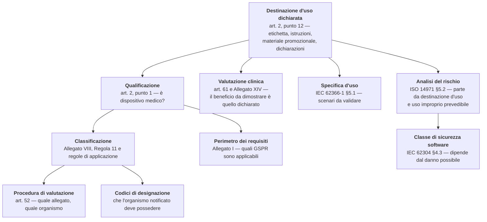

# Qualificazione e classificazione

> **Presupposto di lettura.** La definizione di dispositivo medico, l'albero di qualificazione,
> il testo della Regola 11 e la ragione per cui per un software di telemedicina la Classe I in
> pratica non esiste sono spiegati da zero in
> [10 §15 — Il quadro regolatorio da zero, §§1–2](../10_fondamenti/15-regolatorio-da-zero.md).
> **Qui non si ripete: si determina.** Questo capitolo produce la posizione del progetto, la
> motiva, ne dichiara le condizioni di validità e indica i fatti che la farebbero cadere.
>
> **Avvertenza.** Nulla di quanto segue costituisce una determinazione formale di qualificazione o
> di classificazione. Una determinazione formale è un documento controllato, riferito a una
> revisione esatta di una dichiarazione di destinazione d'uso, firmato da una persona responsabile
> del rispetto della normativa presso un fabbricante. **Il progetto non ha oggi né l'una né
> l'altra** (`D49`, come emendata da `D58`): produce la **traccia** che **il fabbricante**
> compilerà e sottoscriverà.
>
> **Chi intende esercitare quel ruolo è cambiato; che cosa il ruolo comporta, no.** Il progetto
> **intende** assumere il ruolo di fabbricante (`D58`), e **il soggetto giuridico che lo
> eserciterebbe non è ancora costituito**: la determinazione formale non è quindi un atto
> anticipabile, perché presuppone quel
> soggetto, la persona responsabile del rispetto della normativa richiesta dall'art. 15 del
> Regolamento (UE) 2017/745 e un controllo dei documenti in esercizio. Fino ad allora questo
> capitolo resta una traccia — e **la ragione per cui lo resta non è più la stessa di prima**: è
> spiegata per esteso al § 5.2.

## 1. La catena: che cosa determina che cosa

Un errore ricorrente consiste nel trattare qualificazione, classificazione, classe di sicurezza
del software e perimetro della valutazione clinica come quattro decisioni distinte, prese da
persone diverse in momenti diversi. **Sono una decisione sola**, presa una volta, e le altre tre
ne discendono meccanicamente.

Il diagramma ha una sola radice, ed è il motivo per cui `D46` colloca la destinazione d'uso fra i
documenti **retroattivamente irrecuperabili**: cambiarla dopo aver ingaggiato un organismo
notificato comporta la ripetizione di tutto ciò che sta a valle.

**Il costo dell'errore è asimmetrico, ed è utile saperlo prima.** Una destinazione d'uso **troppo
ampia** allarga tutto: più requisiti generali applicabili, più evidenza clinica da produrre, più
scenari di usabilità da validare, classe superiore. Una destinazione d'uso **troppo stretta**
rispetto a ciò che il prodotto realmente fa è **falsa**, viene rilevata al primo confronto fra il
documento e l'interfaccia utente, e produce una non conformità maggiore. Non esiste una posizione
prudente: esiste una posizione **esatta**.

La regola operativa che ne discende governa l'intero progetto e va enunciata una volta sola:
**dichiarare esattamente ciò che il prodotto fa, e progettare il prodotto perché faccia
esattamente ciò che si vuole dichiarare.** Ogni scostamento fra le due cose è un difetto, in una
direzione o nell'altra.

## 2. La posizione del progetto, in tre righe

| | |
|---|---|
| **Qualificazione** | Il progetto **dichiara una finalità medica propria**. Non tenta la strada del «mero veicolo di comunicazione», che il perimetro funzionale non consentirebbe di sostenere (`D26`) |
| **Classificazione** | **Classe IIa**, in applicazione della Regola 11, commi 1 e 2. Con organismo notificato, sistema di gestione della qualità **certificato**, valutazione clinica ai sensi dell'art. 61 e dell'Allegato XIV, procedura dell'Allegato IX (`D12`) |
| **Classe di sicurezza del software** | **B**, con elementi di classe A isolati e segregazione documentata ai sensi della clausola 5.3.5 di IEC 62304. La determinazione è nel capitolo [03 §6](./03-sistema-di-gestione-della-qualita.md) |

**E la riga che conta più delle tre precedenti:** questa posizione è **condizionata**. Regge
finché reggono le esclusioni del § 4.3, e cade — non «si indebolisce»: cade — nel momento in cui
anche una sola di esse viene contraddetta dal prodotto o dal materiale che lo descrive.

## 3. Perché il progetto non ha rincorso la Classe I

Va detto, perché è la domanda che ogni lettore tecnico pone per prima e perché la risposta è
controintuitiva.

La ragione **non** è che il prodotto sia particolarmente rischioso. Il rischio non è un criterio
di qualificazione: MDCG 2019-11 Rev.1, § 3.1, lo afferma testualmente
(«the risk of harm […] is **not a criterion** on whether the software qualifies as a medical
device»). Il rischio determina la classe, non la qualificazione.

La ragione è **aritmetica**, ed è nella matrice dell'Allegato III di MDCG 2019-11 Rev.1, che
incrocia la significatività dell'informazione con la criticità della situazione clinica e reca in
nota: «*This table does not take into account MDSW which is Class I*». Nella matrice applicata
alla sotto-regola 11a **la Classe I non compare in nessuna cella**. Ne discende una catena senza
scampatoie:

1. per essere in Classe I bisogna prima **essere un dispositivo medico**: le classi sono un
   attributo dei dispositivi, non delle categorie di software;
2. per essere un dispositivo serve una **finalità medica propria**;
3. se c'è finalità medica propria, la sotto-regola 11a «si applica generalmente a tutti i MDSW» e
   la matrice non contiene celle di Classe I: risultato minimo **IIa, con organismo notificato**;
4. se non c'è finalità medica propria, il prodotto **non è un dispositivo affatto**, e non esiste
   alcuna Classe I da autocertificare.

**Non esiste, in mezzo, una casella comoda.** La Classe I per la sotto-regola 11c esiste, ma è
popolata da software con finalità medica *non decisionale e non di monitoraggio*: i due esempi
offerti dalla linea guida sono un'applicazione che calcola lo stato di fertilità e una che assiste
persone con disturbi della comunicazione convertendo simboli in linguaggio parlato. Un canale
audio-video con acquisizione di parametri non appartiene a quella famiglia.

**C'è poi il rischio speculare, meno discusso e altrettanto reale.** Apporre una marcatura CE ai
sensi dell'MDR su un prodotto che, correttamente qualificato, non è un dispositivo, non è un
eccesso di prudenza innocuo: l'art. 20 vieta l'apposizione di marchi idonei a indurre in errore
riguardo alla marcatura, l'art. 7 vieta le dichiarazioni fuorvianti, l'art. 10, paragrafo 6,
subordina la dichiarazione di conformità alla dimostrazione di conformità **di un dispositivo**.
Un integratore potrebbe fondare la propria conformità su una marcatura non dovuta. È uno dei
motivi per cui il progetto non appone marcature e non sottoscrive dichiarazioni.

## 4. La Regola 11 applicata

### 4.1 Le tre sotto-regole e quale si applica

| Sotto-regola | Contenuto | Applicabile qui? |
|---|---|---|
| **11a** | Software destinato a fornire informazioni usate per prendere decisioni a fini diagnostici o terapeutici | **Sì.** La presentazione al professionista di parametri clinici con evidenziazione dei valori fuori intervallo è informazione usata per decisioni cliniche |
| **11b** | Software destinato a monitorare processi fisiologici | **Sì.** L'acquisizione periodica di parametri secondo un piano è monitoraggio di un processo fisiologico. La linea guida chiarisce che la sotto-regola si applica al monitoraggio di *qualunque* processo fisiologico, non dei soli parametri vitali |
| **11c** | Tutti gli altri usi | No |

Entrambe le sotto-regole applicabili conducono alla **Classe IIa**. La regola di applicazione 3.5
dell'Allegato VIII, Capo II — se più regole o sotto-regole si applicano allo stesso dispositivo,
si applicano **la regola e la sotto-regola più rigorose** — non produce quindi in questo caso un
esito diverso: due IIa restano IIa.

**Nota di metodo che l'organismo notificato verifica.** La determinazione non può fermarsi alla
Regola 11. Un software è per definizione un **dispositivo attivo** (art. 2, punto 4: «Il software
è considerato un dispositivo attivo») e ricade quindi nel perimetro delle regole 9–13, 15 e 22,
che vanno percorse tutte con esito motivato per ciascuna. Fermarsi alla Regola 11 è l'errore più
frequente e il primo rilievo dell'organismo.

### 4.2 Le due leve che tengono la IIa e non la IIb

Il testo della regola contiene due soglie di innalzamento, una per comma.

**Prima leva — comma 1.** Le decisioni fondate sull'informazione fornita dal software portano in
Classe IIb se possono causare «un grave deterioramento delle condizioni di salute di una persona o
un intervento chirurgico», e in Classe III se possono causare il decesso o un deterioramento
irreversibile. La linea guida precisa che la valutazione si fa sull'impatto di una decisione
presa **su informazione errata fornita dal software**. La leva si aziona quindi non descrivendo il
prodotto, ma descrivendo **la popolazione e il contesto**: pazienti clinicamente stabili in
percorsi programmati, con revisione periodica del professionista, non pazienti acuti o instabili.

**Seconda leva — comma 2.** Il monitoraggio di **parametri fisiologici vitali** «ove la natura
delle variazioni di detti parametri sia tale da poter creare un pericolo immediato per il
paziente» porta in Classe IIb. I parametri vitali di riferimento indicati dalla linea guida sono
respirazione, frequenza cardiaca, funzioni cerebrali, gas ematici, pressione arteriosa e
temperatura corporea — cioè **esattamente i parametri che un percorso di telemonitoraggio
cardiologico o pneumologico acquisisce**. La leva non si aziona quindi escludendo quei parametri
dal perimetro, il che renderebbe il prodotto inutile: si aziona escludendo **la modalità** —
tempo reale, pericolo immediato, sorveglianza — non l'oggetto.

**È da qui che nasce la formulazione di `D46`, e la differenza fra due frasi vale più di ogni
scelta tecnologica presa nel progetto:**

| Formulazione | Classe | Classe di sicurezza | Costo differenziale |
|---|---|---|---|
| «monitoraggio **in tempo reale** dei **parametri vitali**» | **IIb** | **C** | 12–18 mesi e un ordine di grandezza — **stima di settore, non listino** |
| «raccolta **differita** di **parametri** per la **revisione periodica** del professionista» | **IIa** | **B** | — |

La seconda formulazione è quella su cui è scritto l'intero modello di dominio (vincolo `V-144` di
`DOM`), e da cui discende il divieto, per qualunque artefatto del progetto, di usare le espressioni
«monitoraggio in tempo reale», «sorveglianza continua» o equivalenti.

### 4.3 Le quattro esclusioni che reggono la posizione

Sono le condizioni alle quali la Classe IIa regge. Vanno dichiarate nella destinazione d'uso in
modo **esplicito, verificabile e coerente con il prodotto** — cioè non basta scriverle: il
prodotto deve essere costruito perché siano vere.

| # | Esclusione | Che cosa la renderebbe falsa |
|---|---|---|
| **E1** | Il monitoraggio **in tempo reale** di parametri vitali di pazienti in condizioni critiche o instabili | Una funzione che valuti le misure all'atto della ricezione e produca un effetto immediato, invece che alla revisione programmata |
| **E2** | La **generazione di allarmi con finalità di emergenza o di soccorso** | Un canale di notifica che raggiunga un servizio di emergenza, o un'interfaccia che presenti la segnalazione come richiesta di soccorso |
| **E3** | L'uso come **unico o primario** mezzo di sorveglianza di un paziente | Un materiale commerciale che prometta la sostituzione della sorveglianza clinica; o l'assenza, nella documentazione d'uso, dell'istruzione al paziente di rivolgersi ai servizi di emergenza indipendentemente dai dati trasmessi |
| **E4** | La **generazione autonoma di informazione clinica** non redatta dal professionista | Un campo clinico precompilato, dedotto, completato o suggerito dal sistema; una soglia definita dal sistema anziché dal professionista; un punteggio calcolato |

**Le quattro esclusioni non sono equivalenti sul piano del presidio.** `E1` ed `E2` sono
architetturali: si presidiano con il modello di dominio e con la macchina a stati dell'allarme.
`E3` è comunicativa: si presidia con la revisione dei testi pubblici (vincolo `V-171`,
[01 §11](./01-inquadramento-normativo.md)). `E4` è quella che **si perde in una richiesta di
funzionalità apparentemente innocua**, ed è il tema del § 6.

## 5. La destinazione d'uso: che cosa il progetto produce, e che cosa deliberatamente non produce

`D46` assegna al progetto la produzione della bozza di destinazione d'uso (`MDR-IU-001`) e della
determinazione di qualificazione e classificazione (`MDR-CLS-001`). Vanno letti insieme a `D49`
**come emendata da `D58`**: il progetto **intende** assumere il ruolo di fabbricante, e il
soggetto che lo eserciterebbe **è ancora da costituire**; finché non esiste quel soggetto non
esiste nemmeno
l'apparato — persona responsabile del rispetto della normativa, controllo dei documenti, sistema
di gestione della qualità in esercizio — senza il quale una dichiarazione di destinazione d'uso
non è una dichiarazione. **La composizione delle due decisioni produce una tensione che va
dichiarata invece di essere smussata**, perché è reale, e `D58` **non la scioglie: ne cambia la
natura**, come il § 5.2 argomenta.

**La tensione.** L'art. 2, punto 12, dell'MDR ricava la destinazione d'uso dalle indicazioni
fornite dal fabbricante «sull'etichetta, nelle istruzioni per l'uso o **nel materiale o nelle
dichiarazioni di promozione o vendita**». Un documento intitolato «destinazione d'uso»,
pubblicato sotto il nome del progetto, è **precisamente il tipo di materiale da cui la
destinazione d'uso si ricava**. Pubblicarlo senza cautele significa fornire a un terzo l'elemento
che il progetto passa il resto della propria documentazione a negare, cioè l'esistenza di una
destinazione d'uso dichiarata da chi pubblica il codice.

**`D58` stringe questa tensione, non la allenta, e va detto senza attenuazioni.** Finché il
percorso di certificazione era attribuito a un soggetto esterno, attribuire al progetto una
destinazione d'uso dichiarata era una lettura scorretta, da respingere indicando il soggetto
altrove. Da quando il progetto dichiara che **intende assumere** il ruolo di fabbricante — pur non
avendo costituito il soggetto che lo eserciterebbe — la stessa lettura diventa **plausibile**: chi
pubblica e chi intende dichiarare coincidono nell'intenzione, e l'unica cosa che li separa è che il
soggetto formale non esiste. La distanza fra il
materiale pubblicato e una destinazione d'uso dichiarata è quindi **più corta di prima**, e le
cautele del paragrafo seguente vanno applicate con più rigore, non con meno.

**La soluzione adottata, e i suoi limiti.** Il progetto produce e pubblica il documento con tre
qualificazioni che ne cambiano la natura giuridica e che devono comparire nel documento stesso,
non in una nota:

1. **è una traccia strutturata, non una dichiarazione**: è redatta perché **il fabbricante** la
   compili, la modifichi e la sottoscriva — compilazione, modifica e sottoscrizione sono atti che
   la norma riserva a quel ruolo, e restano riservati **anche quando il ruolo sarà il nostro** —
   non perché valga come dichiarazione di chi la pubblica;
2. **il soggetto della destinazione d'uso non è il repository**, ma la **distribuzione
   identificata** che **il soggetto fabbricante, da costituire**, produrrà, con un nome e un
   numero di versione che **oggi non esistono**, perché non esiste ancora il soggetto che possa
   attribuirli;
3. **il documento è privo di firma e di approvazione**: fuori dal controllo dei documenti di un
   sistema di gestione della qualità di un fabbricante è, formalmente, materiale preparatorio —
   e **lo resta anche quando quel fabbricante sarà il progetto**, finché quel controllo dei
   documenti non è in esercizio.

**Il limite resta, e con `D58` si aggrava.** La distinzione fra **traccia** e **dichiarazione** è
una distinzione che regge se il documento è letto per intero, e non regge se è citato per estratto.
Un terzo che estragga un paragrafo della traccia e lo presenti come destinazione d'uso del progetto
compie una scorrettezza, ma il danno è comunque prodotto — e ora l'estratto è **più difendibile
dalla parte sbagliata**, perché il progetto ha dichiarato l'intenzione di assumere il ruolo di
fabbricante e il lettore non è tenuto a distinguere fra intenzione e soggetto costituito. Il
perché la traccia resti tale è al § 5.2; qui conta la conseguenza pratica, che non cambia:
**nessun estratto di questa traccia può circolare da solo**. **La questione `Q-170` porta questo
punto all'orchestrazione**: la scelta fra pubblicare la traccia integralmente, pubblicarla solo
come struttura senza il testo delle sezioni sostanziali, o consegnarla su richiesta a chi dichiara
di volerla usare, è una decisione del committente e non di quest'area.

### 5.1 Che cosa contiene la traccia

Il contenuto sostanziale è nella ricerca di riferimento del progetto e non si duplica qui. Ciò che
appartiene a questo capitolo è la **struttura minima** che **il fabbricante** deve compilare,
perché è la lista di controllo contro cui l'organismo notificato verifica la completezza:

| § | Sezione | Nota che l'organismo verifica |
|---|---|---|
| 1 | Denominazione del dispositivo | Deve essere la **distribuzione identificata**, e deve dichiarare che il codice sorgente pubblicato **non è** il dispositivo |
| 2 | Destinazione d'uso | Deve elencare le funzioni **effettivamente presenti**, non quelle desiderabili |
| 3 | Indicazione d'uso | Il contesto assistenziale: percorsi programmati, *follow-up*, pazienti **clinicamente stabili** |
| 4 | Utilizzatori previsti | Distinti per categoria, con la dichiarazione della competenza clinica presupposta nel professionista |
| 5 | Popolazione di pazienti | Con l'esclusione esplicita dei pazienti acuti, instabili o critici |
| 6 | Ambiente d'uso | Domicilio, struttura, ambulatorio, con i **requisiti minimi di connettività** dichiarati |
| 7 | Principio di funzionamento | Software su hardware generico, senza parti applicate, nessuna azione fisica, chimica o farmacologica |
| 8 | **Beneficio clinico dichiarato** | **Ogni parola aggiunta qui è evidenza in più da produrre nella valutazione clinica.** È la sezione in cui l'entusiasmo commerciale costa di più |
| 9 | Controindicazioni ed **esclusioni esplicite** | Le quattro esclusioni del § 4.3, più quelle di prodotto: nessuna interpretazione diagnostica di immagini, nessuna sostituzione della prima visita salvo decisione documentata del medico, nessun uso in ambiente sterile o in continuità di funzioni vitali |
| 10 | **Limiti d'uso e requisiti dell'ambiente operativo** | Le soglie di banda, latenza, perdita e variazione del ritardo sotto le quali il sistema segnala la degradazione e sconsiglia la prosecuzione. **Sono parte integrante della destinazione d'uso**, non un'appendice tecnica |

**Sulla sezione 10 va detta una cosa che l'area tecnica ha già fissato e che qui diventa
regolatoria.** Le soglie sono **specifica di prodotto, mai conformità** (vincolo `V-12`): nessuna
norma italiana impone valori. Ma dal momento in cui sono dichiarate nella destinazione d'uso,
diventano **prestazioni dichiarate**, e il sistema deve comportarsi come dichiarato. Dichiarare
una soglia che il prodotto non rispetta è più grave che non dichiararne alcuna. E le soglie non
sono ancora state misurate: la questione `Q-115` di `TECH` è aperta proprio su questo, e finché è
aperta **la sezione 10 non è compilabile**.

### 5.2 Perché resta una traccia, ora che il progetto intende assumere il ruolo di fabbricante

> **Prima di tutto il resto, e in questa posizione perché è la sola che conta per chi legge in
> fretta.** Il prodotto **non reca marcatura CE**, **non è coperto da alcuna dichiarazione di
> conformità** e **non è utilizzabile per l'erogazione di prestazioni sanitarie su pazienti
> reali**. Nulla di ciò che segue attenua questa riga, e chi legge «il progetto intende
> certificare» e ne conclude «allora posso usarlo» trae una conclusione **sbagliata**:
> l'intenzione non copre nessuno, non trasferisce alcun obbligo e non rende utilizzabile una
> versione non certificata. Le conseguenze di quella conclusione restano di chi la trae.

Questo paragrafo esiste perché `D58` **cambia la ragione** per cui il documento non è una
dichiarazione, e la ragione precedente, se lasciata scritta, sarebbe falsa. Non è un aggiustamento
lessicale: è il punto su cui l'intero § 5 poggia.

**La ragione vecchia, e perché non vale più.** Finché il percorso di certificazione era attribuito
a un soggetto esterno, la traccia non era una dichiarazione **per assenza di soggetto**: mancava
qualcuno che potesse dichiarare, il progetto non intendeva diventarlo, e il documento era
letteralmente indirizzato a un destinatario ignoto. Era un argomento semplice e, finché reggeva,
sufficiente. Con `D58` **non regge più**: il progetto intende costituire quel soggetto ed
esercitare quel ruolo. Continuare a scrivere «manca il soggetto perché non ci riguarda»
significherebbe scrivere una cosa che il committente ha appena smentito — ferma restando la
constatazione, che vale oggi e va ripetuta ogni volta, che **il soggetto non è costituito**.

**La ragione nuova, che è più esigente della vecchia.** Un documento non diventa una dichiarazione
perché esiste qualcuno disposto a firmarlo. Diventa una dichiarazione quando è **prodotto dentro
un sistema che ne garantisce l'identità nel tempo**: la clausola 4.2.4 di ISO 13485:2016 richiede
che i documenti siano approvati prima dell'emissione, riesaminati e riapprovati quando modificati,
identificati nello stato di revisione corrente, disponibili nei punti d'uso nella versione
applicabile e protetti dall'uso involontario di versioni superate. La clausola 4.2.5 richiede
l'equivalente per le registrazioni. Senza questi cinque attributi, ciò che si firma è una firma su
un testo, non una dichiarazione: **non è dimostrabile a quale revisione si riferisca**, e una
dichiarazione di destinazione d'uso che non si àncora a una revisione esatta è precisamente
l'oggetto che l'organismo notificato non può accettare, perché non può verificarne la
corrispondenza con il fascicolo tecnico e con il rapporto di valutazione clinica.

**In una riga: prima mancava chi. Ora manca ancora il come, e il come è la parte costosa.**

| | Prima di `D58` | Dopo `D58` |
|---|---|---|
| Perché non è una dichiarazione | Manca il **soggetto** che dichiara | Manca il **sistema di controllo dei documenti** che rende una dichiarazione tale |
| Che cosa la renderebbe tale | L'ingresso di un fabbricante terzo | Il **soggetto fabbricante, da costituire**, **più** il controllo dei documenti in esercizio, **più** la persona responsabile del rispetto della normativa |
| Chi deve produrlo | Un altro | **Noi**, una volta costituito il soggetto |
| Quando può accadere | Fuori dal controllo del progetto | Dopo passi che il progetto deve compiere, ciascuno con un proprio tempo. **Nessuna data, nessuna finestra** (`V-171`) |
| Il prodotto è più vicino all'uso clinico? | | **No.** Cambia chi intende percorrere la strada, non lo stato del prodotto |

**Il corollario che non va perso di vista.** La condizione nuova è **verificabile e a nostro
carico**, mentre quella vecchia era un'attesa. È una differenza che rende il documento *più*
oneroso, non meno: prima l'assenza di dichiarazione era un fatto esterno da registrare, ora è una
**lacuna nostra** che ha un rimedio noto — istituire il controllo dei documenti — e un costo di
omissione già dichiarato, perché un documento nato fuori dal controllo documentale **va riemesso**
e non semplicemente approvato dopo ([03 §4](./03-sistema-di-gestione-della-qualita.md), `V-174`;
[09 §5](./09-percorso-e-calendario.md), attività irrecuperabile n. 3).

**E la riga di apertura, ripetuta perché è quella che si perde.** Il prodotto **non reca marcatura
CE** e non è coperto da alcuna dichiarazione di conformità. Chi lo installa, lo integra o lo mette
in servizio assume per intero gli obblighi che ne derivano, **e il fatto che il progetto intenda
certificare non gliene trasferisce alcuno**. Nessuna data è dichiarata qui, e nessuna può esserlo:
`V-171` vieta di affermare o lasciare intendere che il prodotto sarà marcato entro un termine — è
l'unica occorrenza ammessa di quella parola, dentro l'enunciato del divieto — e una pianificazione
interna non diventa una promessa solo perché è nostra.

## 6. Il confine, con esempi presi da questo dominio

È la sezione per cui questo capitolo esiste. La linea di demarcazione è nota e sta in una frase:
**il dato attraversa il sistema conservando il proprio contenuto informativo, oppure il sistema
aggiunge significato.** Nel primo caso il software è un condotto; nel secondo produce informazione
clinica nuova, e chi produce informazione clinica fornisce informazione per decisioni cliniche.

La frase è chiara e non serve a niente da sola, perché nessuno propone mai una funzionalità
chiamata «aggiunta di significato clinico». Le funzionalità si propongono come **miglioramenti
dell'esperienza d'uso**, ed è così che il confine si attraversa senza che nessuno se ne accorga.
Quella che segue è la stessa linea, applicata a richieste concrete e realistiche di questo
dominio.

### 6.1 Dodici richieste che spostano la qualificazione

Ogni riga è formulata come la si sente formulare davvero: come una richiesta ragionevole.

| # | La richiesta, come viene formulata | Che cosa cambia davvero | Fondamento | Esito |
|---|---|---|---|---|
| **1** | «Precompiliamo il campo della soglia con l'ultimo valore usato per quel percorso, tanto il medico può cambiarlo» | La soglia cessa di essere definita dal professionista per quel paziente e diventa **proposta dal sistema**. Il medico che conferma un valore proposto non compie la stessa operazione di chi lo scrive | `E4`; vincoli `V-02` e `V-123` | Il campo resta **vuoto e obbligatorio**. I riferimenti si mostrano attribuiti, in sola lettura, con azione esplicita di copia |
| **2** | «Coloriamo di rosso i valori fuori dall'intervallo di riferimento del laboratorio» | L'intervallo di riferimento del laboratorio **non è la soglia di quel paziente**. Colorare secondo un intervallo che il sistema conosce è una qualificazione del dato compiuta dal sistema | Regola 11a; `E4` | Ammessa la sola evidenziazione rispetto alla soglia **configurata dal professionista per quell'assistito**, con l'attribuzione visibile |
| **3** | «Ordiniamo la lista dei pazienti per gravità, così il medico vede prima i più critici» | L'ordinamento **è** un giudizio: stabilisce una priorità clinica fra persone. È supporto alla decisione | Regola 11a, voce C6 della tabella di [10 §15 §2.8](../10_fondamenti/15-regolatorio-da-zero.md) | Ordinamenti ammessi: cronologico, alfabetico, per stato amministrativo, per presenza di allarmi **non ancora presi in carico** (che è un fatto, non un giudizio) |
| **4** | «Riempiamo i buchi della serie con l'ultimo valore noto, così il grafico è leggibile» | L'interpolazione **crea dati che non esistono**. E cancella l'informazione più importante che quella serie contiene: che una misura manca | Regola 11a; vincoli `V-09` e `V-148` | Il buco resta buco, ed è un'entità: l'attesa di rilevazione non soddisfatta si mostra come tale |
| **5** | «Calcoliamo la percentuale di aderenza al piano» | Dipende. Il rapporto fra misure attese e misure ricevute è **aritmetica su fatti**. Un «punteggio di aderenza» pesato, normalizzato o categorizzato in fasce è **un indice sintetico**, cioè informazione clinica nuova | Regola 11a | Ammesso il conteggio con la sua definizione esplicita e i suoi denominatori visibili; vietata la fascia di merito |
| **6** | «Nella riproduzione della registrazione aggiungiamo zoom e regolazione del contrasto» | Il miglioramento dell'immagine per la lettura clinica è **elaborazione a fini diagnostici**, non comodità di riproduzione | MDCG 2019-11 Rev.1 § 3.1; voce C3 | Fuori perimetro. La riproduzione è fedele all'originale, e lo dichiara |
| **7** | «Misuriamo la lesione sull'immagine con un righello a schermo» | Misurazione su immagine: informazione quantitativa prodotta dal sistema, con possibile **funzione di misura** ai sensi dell'art. 52 | Regola 11a e regola di applicazione 3.7; voce C4 | Fuori perimetro |
| **8** | «Suggeriamo il codice della diagnosi mentre il medico scrive» | Codifica semantica automatica del documento clinico: il sistema propone contenuto clinico | Regola 11a; voce C5 | Fuori perimetro. La ricerca testuale in un catalogo di codici, che restituisce corrispondenze senza ordinarle per pertinenza clinica, resta ricerca semplice |
| **9** | «Facciamo un riepilogo automatico della sessione da allegare al referto» | Sintesi automatica: **contenuto clinico generato dal sistema** dentro un documento clinico. E introduce, se realizzata con modelli generativi, un **secondo regime normativo** oltre a quello dei dispositivi | `E4`; Regolamento (UE) 2024/1689 | Fuori perimetro. È una delle tre funzioni «a una storia utente» di `D26` |
| **10** | «Rileviamo i volti in sessione per accertare la presenza di terzi» | Elaborazione biometrica su un flusso clinico, con un proprio regime nel quadro sulla protezione dei dati e in quello sull'intelligenza artificiale, e con un tasso di errore che ricadrebbe su un consenso | Rinuncia deliberata di `DOM`, questione `Q-145` | Fuori perimetro. La presenza di terzi è **dichiarata**, e la dichiarazione è un consenso distinto (`V-146`) |
| **11** | «Dichiariamo nella documentazione di integrazione che siamo compatibili con il dispositivo di misura *X*» | **Trappola dell'accessorio.** L'art. 2, punto 2, definisce accessorio ciò che è destinato dal fabbricante a essere usato con uno o più dispositivi medici **specifici**; la regola di applicazione 3.3 trascina il software che fa funzionare o influenza un dispositivo **nella stessa classe del dispositivo pilotato** | art. 2, punto 2; All. VIII, Capo II, 3.3 | La documentazione di integrazione resta **agnostica rispetto al dispositivo**. Una frase può importare la classe di un apparecchio di terzi |
| **12** | «Aggiungiamo la traduzione automatica dei messaggi in chat, è solo comodità» | Un errore di traduzione in un canale clinico è un errore di contenuto clinico. E la funzione è, per costruzione, un sistema di intelligenza artificiale con obblighi propri | Regola 11a; Regolamento (UE) 2024/1689 | Fuori perimetro nella versione 1.0. Il multilingua è dell'**interfaccia**, non del contenuto scritto dagli utenti |

**La riga 11 merita una nota che vale per tutta la documentazione del progetto.** La regola di
riservatezza `R0` — mai nominare aziende, marchi, prodotti commerciali — e la trappola
dell'accessorio spingono **nella stessa direzione**, per ragioni completamente diverse. È una
convergenza fortunata di cui vale la pena essere consapevoli: l'abitudine redazionale imposta per
motivi di trattativa produce, per effetto laterale, la protezione regolatoria giusta.

### 6.2 Il punto di frontiera che il progetto ha attraversato deliberatamente

Una funzione, nell'elenco delle capacità del prodotto, **sta oltre la linea**, ed è la ragione per
cui questo capitolo conclude per la qualificazione anziché contro:

> **L'evidenziazione del superamento di una soglia configurata dal professionista per il singolo
> assistito.**

Confrontare un numero con un intervallo è banale sul piano informatico. Sul piano regolatorio è il
momento in cui il sistema smette di limitarsi a mostrare un dato e comincia a **qualificarlo** come
dentro o fuori norma per quel paziente. La linea guida lo dice espressamente, all'Allegato I,
lett. d.1): «*Telemedicine that solely transfers and displays information for monitoring purposes
without interpreting data does not qualify as a medical device. Additional modules such as
thresholds alerts may qualify as a medical device if they are intended for medical purposes.*»

Il progetto ha scelto di **riconoscere questo fatto invece di aggirarlo**. La scelta opposta —
mantenere la funzione e negarne la natura — avrebbe prodotto la peggiore delle posizioni: un
prodotto che fa qualcosa e una dichiarazione che lo nega, cioè esattamente la fattispecie vietata
dall'art. 7.

## 7. Perché la posizione è fattuale e non perpetua

Una determinazione di classificazione **non è una proprietà del prodotto**: è una conclusione
riferita a una revisione esatta di una destinazione d'uso, valida finché quella revisione è
vigente e il prodotto le corrisponde. Va quindi accompagnata da due elementi che nella pratica si
dimenticano entrambi.

### 7.1 Le condizioni di validità

| Condizione | Se cade |
|---|---|
| La destinazione d'uso è quella della revisione citata | La determinazione va rifatta per la nuova revisione |
| Le quattro esclusioni del § 4.3 sono vere **nel prodotto**, non solo nel documento | La classe sale a IIb e la classe di sicurezza del software a C |
| Il materiale pubblico non contraddice la destinazione d'uso | Non conformità maggiore all'art. 7, indipendentemente dal codice |
| Nessuna funzione dell'elenco del § 6.1 è stata introdotta | Riclassificazione, con rivalutazione dell'organismo notificato |
| La popolazione di pazienti resta quella dichiarata | L'estensione a pazienti instabili sposta la valutazione del comma 1 |

### 7.2 I fatti che obbligano a riesaminare

Vanno elencati nel documento di determinazione, non lasciati al giudizio di chi lo legge. Sono
sei, e sono formulati come eventi osservabili:

1. introduzione di una funzione di **allarme** o modifica del canale di recapito di una
   segnalazione verso un servizio di emergenza;
2. introduzione di un **punteggio, indice o classificazione** calcolati dal sistema;
3. definizione di una **soglia da parte del sistema** anziché del professionista, in qualunque
   forma, precompilazione compresa;
4. **estensione della popolazione** a pazienti acuti, instabili o critici, anche solo nel materiale
   commerciale;
5. introduzione di **elaborazione dell'immagine o del suono** a fini di valutazione clinica;
6. dichiarazione di **compatibilità con un dispositivo medico specifico**.

**La differenza fra un progetto che si riclassifica e uno che scopre di essersi riclassificato è
esattamente questo elenco.** Senza, la riclassificazione avviene comunque: la si apprende
dall'organismo notificato al primo confronto fra il fascicolo e l'interfaccia.

## 8. Il perimetro dichiarato

**Questa sezione risponde alla questione `Q-01` della bacheca**, aperta dall'area della guida, che
chiedeva l'allineamento dei confini di perimetro alla dichiarazione di destinazione d'uso.

**Esito: i confini indicati sono confermati e resi vincolanti**, e appartengono al blocco `E4`.
Nessun artefatto del progetto può contenere:

| Confine | Formulazione vincolante |
|---|---|
| **Nessun giudizio interpretativo negli avvisi** | Un avviso enuncia un **fatto misurato** con la sua attribuzione: «la misura delle 08:14 è 152, la soglia impostata dal dott. *X* il giorno *Y* è 140». Non enuncia una valutazione: «valore elevato», «situazione da attenzionare», «peggioramento» |
| **Nessuna verifica di interazioni farmacologiche** | Fuori perimetro integralmente, in ogni forma, compresa la segnalazione passiva |
| **Nessuna prognosi** | Nessuna proiezione, tendenza dichiarata, previsione o stima di evoluzione. Una serie storica si mostra; non si estrapola |
| **Nessun miglioramento d'immagine** | Né in diretta né in riproduzione. La resa è fedele alla sorgente, e la preferenza di degradazione è **scelta dall'utente**, mai guidata dal contenuto clinico (questione `Q-114` di `TECH`) |

**E le sei rinunce deliberate** dichiarate da `DOM` con la questione `Q-145` — rilevazione
automatica dei volti, pesi di attendibilità applicati automaticamente, punteggi di rischio e
prognosi, interpolazione dei dati mancanti, calcolo di esiti clinici, deduzione delle soglie —
sono, dal punto di vista di quest'area, **le sei funzioni che manterrebbero il prodotto in
Classe IIa solo per fortuna**. Quest'area le conferma come confini di conformità e non come scelte
di prodotto: la loro revoca non è una decisione di roadmap, è una riclassificazione.

### 8.1 L'esecuzione locale di logica clinica

**Questa sezione risponde alla questione `Q-142`**, aperta da `DOM`.

**Esito: confermato. L'esecuzione locale di logica clinica è fuori perimetro, e la distinzione
regge.** L'Allegato 3, § 3.2, del DM 19 novembre 2025 prevede che la piattaforma consumi dal
glossario nazionale sia **terminologie** sia **linee guida, percorsi e protocolli con logica
espressa in un linguaggio di espressione clinica**. Le due capacità sono distinte e vanno
distinte:

| Capacità | Che cosa fa | Esito |
|---|---|---|
| **Consumo di terminologie** | Risolve, valida ed espande codici. Non produce informazione clinica nuova: verifica che un codice esista e a che cosa corrisponda | **Dentro il perimetro.** È il gateway terminologico |
| **Esecuzione di logica clinica espressa in un linguaggio di espressione** | Valuta condizioni su dati di un paziente e produce un esito — raccomandazione, avviso, azione suggerita | **Fuori perimetro.** È supporto alla decisione clinica: Regola 11a, voce C6 |

La scelta di `DOM` — **l'esecutore di logica è assente per costruzione, non disattivato per
configurazione** — è quella corretta anche sul piano regolatorio, e per una ragione che va detta:
un componente presente e disattivato è un componente che compare nell'architettura software, va
censito, va valutato nel rischio e va spiegato all'organismo notificato, che chiederà come si
garantisce che resti disattivato in ogni configurazione supportata. Un componente assente non
esiste. La differenza fra le due posizioni, in giornate di valutazione, non è marginale.

**Il costo va però dichiarato senza attenuanti**, perché esiste: un'infrastruttura regionale che
verifichi il consumo di tutte le risorse previste dall'Allegato 3 troverà **una capacità non
implementata**. Non è una non conformità normativa in senso proprio — il decreto disciplina le
infrastrutture regionali, non i componenti software di terzi — ma è una casella vuota in una
matrice di capitolato, e va presentata come **scelta motivata di perimetro con la sua ragione
regolatoria**, non taciuta. La ragione è difendibile e va scritta esattamente così: *implementare
quella capacità sposterebbe il prodotto nel supporto alla decisione clinica, con conseguenze sulla
classificazione che il committente non ha assunto.*

## 9. Il vincolo italiano che rende la scelta non opzionale

C'è un fatto che rende accademica gran parte della discussione precedente in una parte
significativa del mercato di riferimento, e va detto per primo a chi legge questo capitolo per
decidere.

Il **DM 21 settembre 2022**, Allegato A, Sezione 2, prescrive espressamente:

- che «la Infrastruttura regionale di telemedicina per il **servizio minimo di telemonitoraggio**
  debba essere **certificata come dispositivo medico**», con esplicito richiamo alla linea guida
  europea sulla qualificazione e classificazione del software;
- che per il telemonitoraggio avanzato di livello 2 «potrebbe essere richiesta una **classe di
  rischio superiore alla IIa**»;
- che nei teleconsulti di alcune specialità — sono citate l'istopatologia e la radiologia — il
  micro-servizio di visualizzazione dei dati clinici «unitamente a quello di refertazione
  dovranno essere **certificati come dispositivo medico**»;
- che ove nel servizio di televisita siano usati dispositivi medici, «il software e l'hardware per
  l'erogazione del servizio dovrà essere certificato come dispositivo medico **con adeguata classe
  di rischio**».

L'Accordo Stato-Regioni del 17 dicembre 2020 pone, fra le caratteristiche di base, la
«certificazione dell'hardware e/o del software, come dispositivo medico, **idonea alla tipologia di
prestazione** che si intende effettuare in telemedicina».

**`[NV]`** — le formulazioni sono riportate dalla ricerca del progetto sul testo pubblicato in
Gazzetta Ufficiale, ma **la verifica letterale sul testo ufficiale va rifatta prima di qualunque
uso contrattuale**, perché in questa materia la formulazione esatta è determinante.

**La conseguenza operativa è netta:** nel mercato pubblico italiano la richiesta di certificazione
come dispositivo medico **può arrivare dal capitolato di gara**, indipendentemente dall'esito
dell'analisi di qualificazione europea e prima di essa. Un fornitore che presentasse una
determinazione di non qualificazione, per quanto ben argomentata, si troverebbe fuori dai
requisiti di ammissione. Questo, e non l'analisi della Regola 11, è la ragione **pratica** per cui
`D26` non è una scelta reversibile.

**Lettura simmetrica, e vale come indicazione strategica.** L'esclusione dell'interpretazione
diagnostica su immagini dalla destinazione d'uso (§ 5.1, sezione 9) non è una rinuncia commerciale
gratuita: è **la scelta che mantiene la classe a IIa**. Se un giorno si vorrà entrare nel
teleconsulto radiologico o istopatologico, si tratterà di un'**estensione sostanziale** che
richiede una nuova valutazione dell'organismo notificato, non di un aggiornamento di prodotto.

## 10. Il presidio: controllo delle modifiche come misura di conformità

La qualificazione non si difende con un documento. Si difende con un **processo che impedisce a
una proposta di modifica di attraversare il confine senza che qualcuno se ne accorga**, e questo è
il vincolo `V-170`.

| Elemento del presidio | Che cosa fa | Dove vive |
|---|---|---|
| **Elenco chiuso delle funzioni fuori perimetro** | § 6.1 e § 8 di questo capitolo, più l'elenco delle nove voci di [10 §15 §2.8](../10_fondamenti/15-regolatorio-da-zero.md) | Documentazione, e riferimento obbligatorio nella guida ai contributi |
| **Revisione di perimetro sulle proposte di modifica** | Una proposta che introduca una delle funzioni elencate **non viene respinta per merito tecnico, ma per politica di perimetro**. La motivazione del rifiuto è regolatoria e va scritta come tale | Guida ai contributi, revisione obbligatoria |
| **Divieto esplicito sui componenti di intelligenza artificiale** | Nessuna funzione dichiarata oggi è un sistema di intelligenza artificiale. Introdurne una in una proposta di modifica **è un cambio di regime normativo**, non una scelta tecnica | Guida ai contributi e documento di decisione architetturale |
| **Riesame della determinazione a ogni rilascio maggiore** | Verifica che le sei condizioni del § 7.2 non si siano verificate | Procedura di rilascio |
| **Revisione regolatoria dei testi pubblici** | La destinazione d'uso si ricava anche dal materiale promozionale: un testo pubblicato senza revisione è una modifica non controllata della destinazione d'uso | Questione `Q-174` |

**L'ultima riga è quella che sorprende chi viene dal software.** Una modifica alla pagina pubblica
non passa dalla revisione del codice, non compare in una distinta di rilascio e non fa fallire
alcuna verifica automatica. **Ed è il modo più rapido, in questo dominio, di cambiare la
classificazione di un prodotto senza toccare una riga.**

## 11. La classe di sicurezza del software è una conseguenza, non una decisione parallela

Va detto qui perché è il punto in cui i due percorsi — regolatorio e ingegneristico — si toccano,
e perché trattarli separatamente è l'errore che produce due determinazioni incoerenti.

La classe di sicurezza ai sensi della clausola 4.3 di IEC 62304 dipende dal **danno possibile dopo
l'applicazione delle misure di controllo del rischio esterne al sistema software**. Con il
telemonitoraggio nel perimetro, la situazione pericolosa peggiore non è più l'interruzione del
consulto: è la **mancata o errata presentazione al professionista di un parametro fuori
intervallo**, che ritarda una decisione terapeutica. Su un paziente cardiopatico o diabetico il
danno possibile è **grave**, e in assenza di misure esterne l'esito sarebbe **classe C**.

Le misure esterne che portano a **B** sono in gran parte **le stesse esclusioni della destinazione
d'uso** di questo capitolo, più la presenza organizzativa obbligatoria del Centro servizi e del
Centro erogatore imposta dal DM 21 settembre 2022 e la revisione periodica programmata prevista
dal piano assistenziale. Ne discende un legame che va reso esplicito e che è facile perdere:

> **Le esclusioni della destinazione d'uso non sono soltanto ciò che tiene la classificazione a
> IIa. Sono anche ciò che tiene la classe di sicurezza del software a B.** Cadono insieme, e
> quando cadono il costo si somma: valutazione di conformità più onerosa **e** progettazione
> dettagliata a livello di unità con verifica di ogni unità.

La determinazione item per item, con la sua motivazione e la sua avvertenza, è nel capitolo
[03 §6](./03-sistema-di-gestione-della-qualita.md).

## 12. Che cosa questo capitolo lascia aperto

| Riferimento | Questione | A chi |
|---|---|---|
| `Q-170` | Forma di pubblicazione della traccia di destinazione d'uso: integrale, solo struttura, o consegna su richiesta. **È una decisione sul rischio di essere citati come autori di una destinazione d'uso** (§ 5) | → Committente |
| `Q-173` | Se la presentazione di parametri misurati costituisca **funzione di misura** ai sensi dell'MDR, con i requisiti metrologici dell'Allegato I che ne discendono. Dipende da un fatto che quest'area non conosce: se il sistema converta unità, arrotondi o trasformi i valori ricevuti, o li presenti come ricevuti | Dominio, funzionale |
| `Q-144` | **CHIUSA da `D55`.** La destinazione d'uso del telemonitoraggio è **congelata** sulla formulazione «raccolta differita di parametri per la revisione periodica del professionista»: Classe IIa, classe di sicurezza software B. La formulazione in tempo reale è esclusa. Ne discende un divieto permanente — nessuna funzione può essere aggiunta se sposta il sistema verso il tempo reale clinico, e la valutazione va fatta **prima** di scrivere la funzione | **RISOLTA** |
| `Q-145` | Conferma delle sei rinunce deliberate come scelte di prodotto sottoposte a controllo delle modifiche. **Quest'area le conferma come confini di conformità** e attende la conferma di prodotto | → Committente |
| `Q-115` | Le soglie dell'ambiente operativo non sono state misurate: finché non lo sono, la sezione 10 della destinazione d'uso non è compilabile (§ 5.1) | Tecnica, prodotto |
| `V-270` | **Il progetto intende assumere il ruolo di fabbricante (`D58`); il soggetto che lo eserciterebbe non è costituito.** Finché non lo è, e finché il controllo dei documenti non è in esercizio, la traccia di destinazione d'uso **non può** essere firmata né presentata come dichiarazione (§ 5.2) | Conformità, orchestrazione |
| `[NV]` | Verifica letterale sul testo ufficiale in Gazzetta Ufficiale delle prescrizioni di certificazione del DM 21 settembre 2022 (§ 9) | Conformità |
| `[NV]` | Numeri delle regole di applicazione dell'Allegato VIII, Capo II, citate al § 4.1 e § 6.1: vanno riletti sul testo consolidato prima di comparire in un documento di determinazione | Conformità |
