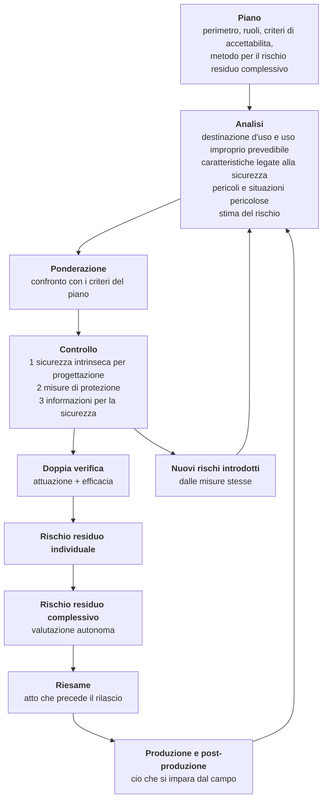
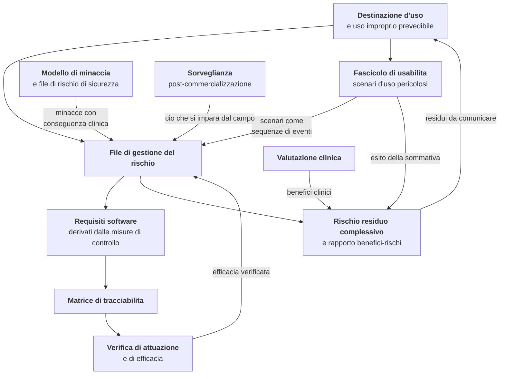

# Gestione del rischio

> **Che cosa questo capitolo non contiene.** Non contiene la spiegazione di che cosa sia un
> pericolo, una situazione pericolosa o un rischio residuo: quella sta nel modulo
> [10 - Percorsi di cura e sicurezza del paziente](../10_fondamenti/10-percorsi-di-cura-e-sicurezza.md),
> § 9.6, e nel modulo
> [15 - Regolatorio da zero](../10_fondamenti/15-regolatorio-da-zero.md), § 5.5, ed è scritta
> per chi non ha mai visto la norma. **Qui si applica.** Chi non ha letto quei due paragrafi
> troverà questo capitolo compatto fino all'incomprensibilità, e non è un difetto di questo
> capitolo.

## 1. Il punto di partenza: che cosa è obbligatorio e a carico di chi

L'**art. 10(2) del Regolamento (UE) 2017/745** impone al fabbricante di istituire, documentare,
applicare e mantenere un sistema di gestione del rischio; la **sezione 3 dell'Allegato I** ne
descrive il contenuto come processo iterativo per l'intero ciclo di vita del dispositivo.
**EN ISO 14971:2019** è la norma che descrive quel processo ed è armonizzata sotto il
regolamento.

`[NV]` - **Se il riferimento pubblicato sia `EN ISO 14971:2019` o `EN ISO 14971:2019+A11:2021`
va verificato sull'elenco consolidato della Commissione**, e la differenza non è nominalistica:
è l'emendamento A11 a contenere gli allegati che dichiarano le deviazioni fra la norma e il
regolamento (§ 3.4). La verifica è a carico di chi compila la matrice dei requisiti generali di
sicurezza e prestazione.

**La ripartizione, che vale per tutto il capitolo.** Da `D58` il progetto intende
assumere il ruolo di fabbricante, e con `D63` quell'assunzione è un **requisito di prodotto**; il
soggetto giuridico è ancora da costituire. Ai sensi di `D58`
il progetto non firma oggi il rapporto di gestione del rischio, non determina oggi l'accettabilità
del rischio residuo complessivo e non assume oggi la responsabilità del rapporto benefici/rischi.
Produce però **il materiale su cui quelle determinazioni si prenderanno**, e lo produce ora perché
una parte di esso è retroattivamente irrecuperabile. Quando il soggetto fabbricante sarà
costituito, assumerà tutti gli atti riservati al ruolo, compresa la firma del rapporto e la
determinazione di accettabilità.

| Attività | Progetto | Il fabbricante |
|---|---|---|
| Piano di gestione del rischio, criteri di accettabilità | Bozza tecnica e metodo proposto | **Approva, data e firma** |
| Identificazione di pericoli e situazioni pericolose | **Integrale** | Riesamina e integra |
| Stima e ponderazione del rischio | Proposta motivata | **Determina** |
| Progettazione e attuazione delle misure di controllo | **Integrale** | Verifica |
| Verifica dell'attuazione e dell'efficacia | **Integrale**, con prove automatiche | Verifica l'evidenza |
| Rischio residuo individuale | Proposta | **Determina** |
| Rischio residuo complessivo e rapporto benefici/rischi | Contributo tecnico | **Determina e firma** |
| Riesame prima del rilascio | Evidenze | **Atto proprio** |
| Attività di produzione e post-produzione | Capacità di prodotto | **Processo proprio** |

La riga più importante è la penultima ed è trattata al § 8: **la determinazione di accettabilità
non è delegabile** - né a un fornitore, né a un consulente, né a una tabella.

## 2. Il processo, e dove si innesta nel lavoro quotidiano

ISO 14971 descrive un processo, non un documento. Le sue attività non si svolgono in blocco a
fine progetto: si innestano in punti precisi del ciclo di sviluppo, e la loro assenza in quei
punti non è recuperabile a valle.

**Innesto nel ciclo di sviluppo del progetto.**

| Momento | Attività di gestione del rischio |
|---|---|
| Definizione di un requisito funzionale | Identificazione delle situazioni pericolose che il requisito introduce o mitiga |
| Riesame di progettazione architetturale | Verifica che le misure di livello 1 siano state considerate **prima** di quelle di livello 2 |
| Revisione fra pari di una modifica | Se la modifica tocca una misura di controllo: aggiornamento del file **prima** dell'accettazione |
| Esecuzione delle prove | Produzione dell'evidenza di attuazione e di efficacia, con esito datato |
| Valutazione formativa di usabilità | Ogni errore d'uso osservato produce una riga o la motivazione della sua assenza |
| Validazione sommativa | Ingresso obbligatorio del rischio residuo complessivo |
| Rilascio | Registro dello stato di configurazione e anomalie residue valutate |
| Esercizio | Retroazione dai dati di sorveglianza (capitolo [08](./08-sorveglianza-post-commercializzazione.md)) |

**La riga sulla revisione fra pari è quella che determina se il processo è vivo.** Un file di
rischio aggiornato in blocco due volte l'anno è un documento; un file aggiornato dentro le
richieste di modifica è un processo. La differenza è visibile nella cronologia del repository e
un valutatore la guarda.

## 3. Il piano: le quattro decisioni che vanno prese prima di scrivere una sola riga di registro

### 3.1 Il perimetro

Il perimetro del file di rischio è la **distribuzione identificata**, non il repository. È la
conseguenza diretta del modello duale di `D17`: il codice sorgente pubblicato non è un
dispositivo e non ha un file di rischio; la distribuzione ne ha uno, con una versione, un
titolare e un ciclo di vita propri.

La conseguenza operativa è che **una funzionalità presente nel repository ma disattivata nella
distribuzione va comunque analizzata**, perché è attivabile per configurazione e la
configurazione è nelle mani di chi installa. Il criterio adottato è: *tutto ciò che è
raggiungibile per configurazione supportata è nel perimetro; ciò che richiede una modifica del
codice non lo è, ed è trattato come uso anomalo*.

### 3.2 I criteri di accettabilità, e il fatto che siano una scelta

La norma **non fornisce alcuna soglia**: i criteri li stabilisce il fabbricante nel piano.
Questo significa che sono un giudizio di valore motivato, non un dato oggettivo, e che il piano
deve contenere **la motivazione della collocazione delle soglie**, non solo le soglie.

Il progetto propone criteri espressi **per classi di gravità** e non come prodotto di due numeri,
per la ragione tecnica del § 3.3.

| Classe di gravità | Descrizione nel dominio | Criterio proposto |
|---|---|---|
| **G4 - critica** | Decesso o danno permanente | Nessun rischio residuo è accettabile senza misura di livello 1 o 2 con efficacia verificata **e** dichiarazione esplicita all'utilizzatore |
| **G3 - grave** | Ricovero, intervento, deterioramento reversibile ma significativo, ritardo diagnostico su condizione tempo-dipendente | Misura di livello 1 o 2 obbligatoria; il livello 3 è ammesso **solo in aggiunta** e mai da solo |
| **G2 - moderata** | Prestazione mancata o rinviata, ripetizione dell'atto, disagio significativo | Misura di livello 2 o 3, con verifica di efficacia |
| **G1 - lieve** | Disagio, necessità di ripetere un'azione nell'interfaccia | Trattamento in ambito di qualità del prodotto, con registrazione |

### 3.3 La probabilità nel software: perché la griglia bidimensionale non regge

Per un guasto meccanico la probabilità è stimabile su base statistica. **Per un difetto software
non lo è**: il difetto o c'è o non c'è, e se c'è si manifesta ogni volta che ricorrono le
condizioni di attivazione. Attribuire una frequenza annua all'ipotesi che una funzione di
confronto contenga un errore di segno è un esercizio privo di fondamento, e produce numeri che
**sembrano dati** e non lo sono.

Il metodo adottato dal progetto, da recepire nel piano:

1. **la probabilità del difetto software non si stima** e si assume conservativamente pari a 1;
2. **si stima invece la probabilità della sequenza a valle del difetto**: quanto spesso ricorre
   la condizione di attivazione in esercizio, con quale probabilità le misure esterne
   intercettano l'errore, quale frazione dei casi arriva a una decisione clinica;
3. **la gravità governa la ponderazione**, perché è l'unica grandezza su cui esista
   un'informazione difendibile;
4. **la matrice, se adottata, è strumento di comunicazione e di ordinamento delle priorità**,
   non criterio di decisione.

`[NV]` - L'approccio è coerente con l'impianto di IEC 62304, che determina la classe di sicurezza
sul **danno possibile** e non sulla probabilità del difetto, ed è indicato come praticabile dal
rapporto tecnico che accompagna ISO 14971. **Il riferimento puntuale alla sezione di quel
rapporto va verificato sul testo**, che è a pagamento e non è stato letto: fino ad allora la
motivazione del piano poggia sull'argomento tecnico, non su una citazione.

### 3.4 «Per quanto possibile», non «fino alla cella verde»

La **sezione 2 dell'Allegato I MDR** richiede l'eliminazione o la riduzione dei rischi **per
quanto possibile** attraverso una progettazione e una fabbricazione sicure, e stabilisce che un
rischio non è accettabile per il solo fatto di rientrare nei criteri che il fabbricante si è
dato. È il punto su cui gli allegati di raccordo dell'emendamento A11 alla norma segnalano una
**deviazione**: la norma consente al fabbricante di fermarsi ai propri criteri di accettabilità,
il regolamento no.

`[NV]` - **La formulazione letterale e la numerazione della sezione dell'Allegato I vanno
verificate sul testo consolidato.** La sostanza - riduzione «per quanto possibile» senza
considerazioni economiche, e non «fino a un livello ragionevolmente praticabile» - è pacifica e
va recepita.

Ne discendono tre regole redazionali del registro, vincolanti per il progetto:

- **nessun rischio è dichiarato accettabile senza che risulti verbalizzato perché non era
  ulteriormente riducibile per progetto**, nominando le opzioni di livello 1 e 2 considerate e
  la ragione tecnica del loro scarto;
- **le considerazioni economiche non entrano** nella determinazione di accettabilità; possono
  entrare nella scelta fra due misure equivalenti per efficacia, e la distinzione va scritta;
- **la determinazione finale porta un nome e una data.**

## 4. Come è fatta una riga del registro, e perché non si scrive sui pericoli

L'errore più comune nei file di rischio dei fabbricanti piccoli è costruire il registro sui
**pericoli** invece che sulle **situazioni pericolose**. Una riga che dica «pericolo: perdita di
dati - gravità: alta - probabilità: bassa» non contiene informazione utilizzabile: non dice
quali dati, in quale circostanza, chi è esposto, quale decisione clinica ne dipende. Non
consente né di stimare né di progettare.

**Il registro del progetto ha una riga per situazione pericolosa**, e lo stesso pericolo compare
in più righe con gravità diverse a seconda della sequenza che vi conduce. Ogni riga porta i
campi seguenti, e nessuno è facoltativo:

| Campo | Contenuto |
|---|---|
| Identificativo | Stabile e mai riassegnato, come gli identificativi di requisito (`D45`) |
| **Pericolo** | Potenziale sorgente di danno |
| **Sequenza di eventi** | La catena concreta, con i suoi anelli, che porta all'esposizione |
| **Situazione pericolosa** | La circostanza in cui una persona è esposta |
| **Danno** | Lesione o danno alla salute, in termini clinici |
| **Gravità** | Classe `G1`…`G4` del § 3.2 |
| **Probabilità della sequenza a valle** | Stimata secondo il § 3.3, con la motivazione |
| **Misure di controllo** | Ciascuna con il **livello** dichiarato (§ 5) e su quale grandezza agisce |
| **Verifica di attuazione** | Riferimento alla prova che dimostra che la misura c'è |
| **Verifica di efficacia** | Riferimento alla prova che dimostra che riduce il rischio |
| **Nuovi rischi introdotti** | Obbligatorio; «nessuno» è una risposta ammessa solo se motivata |
| **Rischio residuo** | Con la motivazione dell'accettabilità o della non ulteriore riducibilità |
| **Requisiti collegati** | `RF-*`, `RNF-*`, `BR-*` che realizzano le misure |
| **Origine** | Analisi, valutazione formativa, sommativa, modello di minaccia, campo |

**Un pericolo non «si mitiga».** Si mitiga un rischio, agendo sulla probabilità della sequenza o
sulla gravità del danno. Per questo la colonna delle misure dichiara **su quale delle due
grandezze agisce**: una misura che non incide su nessuna delle due non è una misura di controllo
del rischio, per quanto sia buona ingegneria.

## 5. La gerarchia delle misure di controllo

L'ordine è vincolante e non è un elenco di opzioni equivalenti:

1. **sicurezza intrinseca per progettazione** - eliminare il pericolo o renderlo strutturalmente
   impossibile;
2. **misure di protezione nel dispositivo o nel processo** - barriere, verifiche, conferme,
   segnalazioni;
3. **informazioni per la sicurezza** - avvertenze, istruzioni per l'uso, addestramento.

Il terzo livello è il più economico e il più debole, ed è quello a cui si ricorre sotto pressione
di scadenza. **Un'avvertenza che risolve un problema risolvibile per progetto è una non
conformità**, non un compromesso: per ogni misura di livello 3 va dimostrato che i primi due non
erano praticabili.

**Regola redazionale che ne discende.** Ogni riga dichiara il livello delle proprie misure. Un
file in cui la maggioranza delle misure è di livello 3 dice, senza volerlo, che il prodotto non
è stato progettato per la sicurezza ma documentato per la sicurezza. È una delle prime cose che
un valutatore esperto conta, ed è una metrica che il progetto si impegna a pubblicare insieme al
registro.

## 6. Il registro dei rischi - esempi reali del dominio

Quanto segue **non è un esempio didattico**: sono righe costruite sul modello di dominio, sui
requisiti funzionali e sui vincoli architetturali effettivi del progetto, ed è la forma in cui il
registro `RM-FILE-001` va compilato. Gli identificativi `RM-*` usati qui sono provvisori e vanno
congelati contestualmente al piano.

### 6.1 `RM-01` - Il parametro che non arriva

| Campo | Contenuto |
|---|---|
| **Pericolo** | L'informazione clinica presentata al professionista è incompleta |
| **Sequenza di eventi** | Il dispositivo di misura, il gateway di terze parti o l'assistito cessano di trasmettere · il sistema non rappresenta l'assenza · la vista di sintesi continua a mostrare l'ultimo valore acquisito, che era nella norma · nessun evento è generato · la revisione periodica programmata cade oltre la finestra utile |
| **Situazione pericolosa** | Il professionista valuta come stabile un assistito di cui il sistema non ha alcuna informazione da giorni |
| **Danno** | Mancata intercettazione di un deterioramento, con ritardo dell'intervento |
| **Gravità** | `G3`, `G4` nelle patologie a rapido scompenso |
| **Probabilità della sequenza** | Elevata in assenza di misure: la mancata trasmissione è l'evento più frequente del telemonitoraggio, non un caso limite |

**Misure di controllo.**

| Livello | Misura | Agisce su |
|---|---|---|
| **1** | **L'attesa di rilevazione è un'entità**: l'assenza di misura è una riga che dichiara l'assenza - con finestra attesa, istante di scadenza e causa quando nota - non l'assenza di una riga. È la forma operativa del principio per cui il silenzio non è mai normalità, ed è ciò che rende l'aderenza una grandezza definita invece che un conteggio di ciò che è arrivato | Rende la sequenza strutturalmente interrompibile |
| **2** | Evento generato dal decorso della finestra, con distinzione fra **misura non attesa** e **misura non pervenuta**: sono due cose diverse e collassarle produce sia falsi allarmi sia silenzi | Probabilità |
| **2** | **Età dell'ultimo dato sempre visibile** e graficamente evidenziata in ogni vista che presenti parametri; nessuna vista di sintesi può mostrare un valore senza la sua età | Probabilità |
| **2** | **Sorveglianza del volume atteso**: un guasto della catena di acquisizione produce un silenzio collettivo che somiglia alla normalità. La rilevazione deve precedere la scadenza della prima finestra individuale | Probabilità |
| **2** | Catena di escalation con **fallimento dichiarato**: il mancato riscontro produce un evento e l'allarme resta aperto, non si chiude per decorrenza | Probabilità |
| **3** | Istruzioni per l'uso: il dispositivo non è l'unico né il principale mezzo di sorveglianza; istruzione all'assistito e al caregiver di rivolgersi all'emergenza in presenza di sintomi, indipendentemente dai dati trasmessi | Gravità del danno residuo |

**Verifica di attuazione.** Prova che alla scadenza della finestra esista una riga di attesa con
stato dichiarato; prova che ogni vista che presenta un valore presenti anche la sua età.

**Verifica di efficacia.** Prova di scenario: sospensione simulata della trasmissione, verifica
che l'evento sia generato entro la finestra, che raggiunga un destinatario **valido** e che il
mancato riscontro produca a sua volta un evento. Una prova che si fermi alla generazione
dell'evento verifica l'attuazione, non l'efficacia.

**Nuovi rischi introdotti.** L'allarme di assenza **aumenta il carico di allarmi** e contribuisce
all'affaticamento (`RM-11`). Il bilancio va fatto e documentato: si riduce un rischio di gravità
`G3` aumentandone uno di gravità `G2`-`G3` con probabilità crescente nel tempo. È esattamente il
tipo di compensazione che la valutazione del rischio residuo **complessivo** deve intercettare.

**Rischio residuo.** L'assenza è rilevata e segnalata, ma resta il tempo che intercorre fra la
scadenza della finestra e la presa in carico, e resta il caso dell'assistito che non trasmette
**perché** sta male. Il residuo è dichiarato all'utilizzatore.

### 6.2 `RM-02` - La sessione che si interrompe

| Campo | Contenuto |
|---|---|
| **Pericolo** | L'atto sanitario a distanza non si conclude |
| **Sequenza di eventi** | La rete dell'assistito degrada · il canale cade · non esiste un ripiego dichiarato né una procedura di ripresa · la prestazione risulta chiusa senza esito oppure con un esito indistinguibile dalla mancata presentazione · l'assistito non riprenota |
| **Situazione pericolosa** | Una persona inserita in un percorso di cura perde un contatto programmato e nessuno lo rileva come tale |
| **Danno** | Prestazione mancata su percorso di cura; su condizione tempo-dipendente, ritardo diagnostico o terapeutico |
| **Gravità** | `G2` in generale, `G3` su percorsi con finestre cliniche strette |

**Misure di controllo.**

| Livello | Misura | Agisce su |
|---|---|---|
| **1** | **Prestazione e sessione media sono aggregati distinti**: la caduta del canale non chiude l'atto sanitario, che può proseguire con una seconda sessione. Unirli renderebbe la caduta tecnica un evento clinico irreversibile | Rende la sequenza interrompibile |
| **1** | **Degradazione audio prima del video, sempre**: il canale utile alla continuità del colloquio è preservato per ultimo | Probabilità |
| **2** | **Esito del contatto distinto dallo stato**: mancata presentazione e fallimento tecnico condividono lo stato terminale e hanno effetti amministrativi opposti. Collassarli produce insieme un danno amministrativo all'assistito e la perdita del segnale di guasto | Probabilità |
| **2** | **Verifica tecnica preventiva** prima della sessione, con esito che condiziona l'eseguibilità e non è un semplice avviso | Probabilità |
| **2** | Superata la soglia di inidoneità del canale, il sistema **informa che le condizioni potrebbero non essere adatte** alla valutazione in corso e offre il rinvio. Le soglie sono specifica di prodotto, **mai conformità**: nessuna fonte normativa italiana le impone | Probabilità e gravità |
| **2** | **Ripiego dichiarato** e procedura di ripresa della sessione, raggiungibili senza competenze informatiche | Probabilità |
| **3** | Requisiti dell'ambiente operativo dichiarati nelle istruzioni per l'uso: banda, latenza, perdita, variazione del ritardo | Probabilità |

**Verifica di efficacia.** Prova di degradazione con perdita e latenza indotte: verifica che il
sistema degradi **audio prima del video**, che l'evento sia registrato, che l'esito prodotto sia
quello tipizzato corretto e non quello della mancata presentazione.

**Nuovi rischi introdotti.** L'avviso di inidoneità del canale, se troppo sensibile, induce
interruzioni non necessarie e assuefazione all'avviso; se troppo permissivo, non protegge. La
taratura è un compromesso con conseguenza clinica e va verbalizzata, non scelta implicitamente
nel codice.

**Rischio residuo.** La connettività dell'assistito non è governabile dal progetto. Il residuo è
dichiarato e la misura compensativa è organizzativa: esistenza di un canale alternativo presso
l'erogatore.

### 6.3 `RM-03` - L'identità sbagliata

| Campo | Contenuto |
|---|---|
| **Pericolo** | Informazione clinica associata alla persona sbagliata |
| **Sequenza di eventi** | Un identificatore esterno è riusato con lo stesso valore da due domini di attribuzione diversi · l'appartenenza al tenant non è verificata al confine · l'interfaccia mostra un solo elemento identificativo · il professionista non ha alcun segnale che glielo faccia sospettare · redige o firma il contenuto clinico |
| **Situazione pericolosa** | Il professionista valuta, in sessione, parametri o documenti di un altro assistito |
| **Danno** | Decisione clinica su dati non pertinenti **e** contenuto clinico nella cartella sbagliata: **due persone danneggiate con un solo errore** |
| **Gravità** | `G3`, `G4` in funzione della decisione assunta |

**Misure di controllo.**

| Livello | Misura | Agisce su |
|---|---|---|
| **1** | **Nessun identificatore esterno è chiave primaria.** Gli identificatori esterni vivono in una collezione qualificata dal **dominio di attribuzione**, con validità temporale; il dominio conosce un identificativo canonico interno. Un valore uguale in due domini diversi è, per costruzione, due identificatori diversi | Elimina l'anello centrale della sequenza |
| **1** | **La normalizzazione degli identificatori avviene al confine, mai nel dominio.** Un solo punto di traduzione, configurato per tenant | Elimina le traduzioni divergenti |
| **1** | **Il contesto di tenant si imposta dentro la transazione, prima di qualunque interrogazione**; in sua assenza le politiche di sicurezza a livello di riga **negano tutto**. Nessun accesso ai dati fuori da una transazione con tenant risolto | Elimina la fuga fra tenant |
| **2** | **Doppio elemento identificativo** mostrato in apertura di sessione, con conferma esplicita del professionista. La verifica è **imposta dall'interfaccia**, non lasciata all'abitudine | Probabilità |
| **2** | Attributi anagrafici **in sola lettura per l'utente federato** e riscritti a ogni accesso dalla fonte autoritativa: un'identità autenticata dalla federazione non può presentare attributi alterati dall'utente stesso (§ 9) | Probabilità |
| **3** | Istruzioni per l'uso: obbligo di verifica dell'identità in apertura di sessione | Probabilità |

**Verifica di efficacia.** Prova negativa fra tenant **su ogni punto di ingresso**, senza
eccezioni; prova di riconciliazione con dominio di attribuzione esplicito; prova che le
interfacce di modifica degli attributi rispondano con rifiuto per un utente federato. Le prove
negative - quelle che verificano che l'azione vietata **fallisca** - sono qui la sola forma
valida: una prova positiva su un caso corretto non dimostra nulla.

**Nuovi rischi introdotti.** La conferma esplicita in apertura di sessione aggiunge un passaggio
che, ripetuto molte volte al giorno, viene eseguito per inerzia. È un errore d'uso prevedibile e
va trattato nel fascicolo di usabilità (capitolo [06](./06-usabilita-e-accessibilita.md)): la
conferma deve richiedere un'azione discriminante, non un assenso indistinto.

**Rischio residuo, dichiarato senza attenuazioni.** Se l'errore di associazione è compiuto **a
monte**, nel sistema che invia l'appuntamento o l'anagrafica, il progetto **non può rilevarlo**:
riceve un identificativo formalmente corretto che punta alla persona sbagliata. La misura è
allora esclusivamente il doppio elemento identificativo e la conferma umana. È un residuo di
gravità `G3`-`G4` che va comunicato a chi integra come **obbligo di controllo a monte**, e la
questione della ripartizione di responsabilità che ne deriva è trattata al capitolo
[09](./09-percorso-e-calendario.md), § 7.

### 6.4 `RM-04` - Il dato terminologico che manca

| Campo | Contenuto |
|---|---|
| **Pericolo** | Contenuto clinico codificato in modo non risolvibile a destinazione, oppure atto clinico non registrabile |
| **Sequenza di eventi** | Un sistema di codifica è disattivato per configurazione o il servizio terminologico esterno non risponde · il codice non viene validato · il sistema (a) accetta il codice trattandolo implicitamente come valido, oppure (b) rifiuta la registrazione · nel caso (a) il documento è conferito con un codice che il ricevente non risolve; nel caso (b) il professionista non può registrare la motivazione dell'atto e la omette o la scrive in testo libero |
| **Situazione pericolosa** | Un documento clinico è disponibile a un secondo professionista in forma non interpretabile nella parte codificata, oppure un dato clinico rilevante non entra nella documentazione |
| **Danno** | Decisione clinica su informazione incompleta; perdita di informazione nella continuità assistenziale |
| **Gravità** | `G2`, `G3` quando l'informazione persa è una controindicazione o un'allergia |

**Perché questa riga esiste e non è un dettaglio implementativo.** Il progetto ha stabilito che
il sistema è **pienamente funzionale senza il sistema di codifica clinica a licenza onerosa**, e
ne ha dichiarato il costo: circa quattromila codici del vincolo sul motivo del contatto non si
validano. Quella dichiarazione non è solo una scelta di licenza: è **l'ingresso di una situazione
pericolosa nel file di rischio**, e va trattata come tale invece di restare una nota nella
politica delle terminologie.

**Misure di controllo.**

| Livello | Misura | Agisce su |
|---|---|---|
| **1** | **Nessun percorso principale richiede il sistema di codifica a licenza onerosa.** Un servizio esterno indisponibile non può bloccare un atto sanitario | Elimina il ramo (b) sul percorso principale |
| **1** | **Ogni concetto codificato porta il sistema di codifica esplicito** e conserva la rappresentazione testuale accanto al codice: l'informazione clinica non è mai portata dal solo codice | Gravità |
| **2** | **L'esito della validazione è un dato tracciato con tre stati distinti** - validato, non validabile, rifiutato - e «non validabile» **non è mai trattato come validato**. La distinzione è propagata al ricevente | Probabilità |
| **2** | **Gateway unico** verso le terminologie, con disattivazione per sistema di codifica e comportamento dichiarato in caso di indisponibilità; **nessuna cache persistita su disco** dove la licenza non consente derivati | Probabilità |
| **2** | Le interrogazioni verso il servizio terminologico esterno **non portano identificativi dell'assistito**: la sovranità si soddisfa per assenza di dato, non per collocazione | Riguarda un rischio distinto, di riservatezza |
| **3** | Documentazione a chi installa: quali sistemi di codifica sono attivi in quale regime, quale contenuto non si valida, e quali conseguenze ne derivano per l'interoperabilità | Probabilità |

**Verifica di efficacia.** Prova che con il sistema di codifica disattivato ogni caso d'uso
principale si completi; prova che un concetto non validato sia marcato come tale in uscita e non
silenziosamente accettato; prova che l'indisponibilità del servizio non produca né blocco né
falsa validazione.

**Nuovi rischi introdotti.** Un avviso di «codice non validato» che compare con frequenza produce
assuefazione e viene ignorato, esattamente come un allarme non azionabile. La misura di
protezione va progettata per essere **rara e informativa**, non ricorrente.

**Rischio residuo, dichiarato.** Con il sistema di codifica non abilitato, una parte del vincolo
sul motivo del contatto non è validabile. Il residuo è dichiarato, quantificato e comunicato a
chi installa, che è il soggetto in grado di rimuoverlo acquisendo la licenza.

### 6.5 `RM-05` - L'orario che non è affidabile

| Campo | Contenuto |
|---|---|
| **Pericolo** | La cronologia degli eventi clinici è errata |
| **Sequenza di eventi** | L'orologio del dispositivo di misura o dell'apparecchio dell'assistito è sfasato, o dichiara un fuso orario errato, o attraversa il cambio di ora legale · la misura è acquisita con un istante di rilevazione non attendibile · la valutazione della soglia e il calcolo della finestra di attesa operano su quell'istante · la serie temporale è ordinata in modo errato |
| **Situazione pericolosa** | Il professionista osserva un andamento che non è mai esistito, oppure una finestra di attesa scade prima o dopo il momento reale |
| **Danno** | Allarme non generato o generato fuori tempo; decisione clinica su un andamento inesistente; nella ricostruzione a posteriori, impossibilità di stabilire la sequenza reale degli eventi |
| **Gravità** | `G2`-`G3`; sale a `G3` quando la cronologia determina la valutazione di un andamento e non di un singolo valore |

**Perché è una riga a sé e non un dettaglio.** Il tempo, in questo sistema, è simultaneamente:
dato clinico (l'andamento), parametro di controllo (la finestra di attesa), elemento di
tracciabilità non ripudiabile (il registro degli accessi a catena di impronte) e presupposto
degli obblighi di segnalazione, che richiedono di ricostruire una sequenza temporale su
componenti diversi entro termini brevissimi. **Un orologio inaffidabile degrada
contemporaneamente quattro proprietà distinte del sistema.**

**Misure di controllo.**

| Livello | Misura | Agisce su |
|---|---|---|
| **1** | **Istante di rilevazione e istante di ricezione sono due campi distinti e obbligatori.** L'istante di ricezione è apposto dal sistema e **non è modificabile dalla sorgente**. L'identità della misura ai fini dell'idempotenza comprende l'istante di rilevazione | Rende la discrepanza rilevabile |
| **1** | Entrambi gli istanti sono conservati con **riferimento temporale esplicito e non ambiguo**; nessuna rappresentazione locale priva di fuso entra nel dominio | Elimina l'ambiguità dell'ora legale |
| **1** | **La misura è immutabile e porta con sé il proprio contesto**: strumento, metodo, istante di rilevazione, istante di ricezione, soggetto che l'ha inserita. Una correzione è una nuova versione, non una sovrascrittura | Rende la sequenza ricostruibile |
| **2** | **Lo scarto fra i due istanti è misurato**; oltre una soglia configurata la misura è marcata con **attendibilità temporale ridotta** e non è idonea alla valutazione automatica senza conferma umana | Probabilità |
| **2** | **Sincronizzazione dell'orologio dei nodi** come requisito verificato, non come assunzione: è presupposto della catena di impronte del registro e della ricostruibilità di un incidente |Probabilità |
| **2** | Uno scarto anomalo **ricorrente** da una sorgente è un segnale di guasto della catena di acquisizione, non un caso isolato: produce un evento tecnico distinto da quello clinico | Probabilità |
| **3** | Istruzioni per l'uso e istruzioni all'assistito sulla configurazione dell'ora del dispositivo | Probabilità |

**Verifica di efficacia.** Prove con orologio della sorgente deliberatamente sfasato in avanti e
indietro, attraverso il cambio di ora legale e con fuso dichiarato errato: verifica che lo scarto
sia rilevato, che la marcatura di attendibilità sia applicata, che la valutazione automatica non
proceda e che l'ordinamento della serie resti quello dell'istante di rilevazione dichiarato.

**Nuovi rischi introdotti.** La marcatura di attendibilità ridotta, se applicata con soglia
troppo stretta, sottrae misure valide alla valutazione automatica e sposta carico sull'operatore.
La soglia è configurazione, non costante di codice.

**Rischio residuo, dichiarato senza attenuazioni.** **Il progetto non controlla l'orologio del
dispositivo dell'assistito né quello di un dispositivo di misura di terzi**, e l'ora dichiarata
da una sorgente esterna non è verificabile in senso proprio: è confrontabile con l'istante di
ricezione, il che rileva lo sfasamento grande e non quello piccolo. Ne discende un limite d'uso
da dichiarare: **il sistema non è idoneo a valutazioni che dipendano dalla cronologia con
risoluzione fine** senza una sorgente temporale attendibile.

### 6.6 Altre righe già individuate, in forma sintetica

Il registro completo non si esaurisce nelle cinque righe estese. Le seguenti sono già
individuate, con l'origine dichiarata, e vanno sviluppate nella stessa forma.

| # | Situazione pericolosa | Gravità | Misura di livello più alto disponibile | Origine |
|---|---|---|---|---|
| `RM-06` | Il professionista conferma una soglia precompilata senza valutarla | `G3` | **1** - il campo soglia parte vuoto e obbligatorio; nessuna precompilazione, nemmeno con i valori del percorso o dell'ultimo piano; i riferimenti si mostrano attribuiti e in sola lettura | Analisi + fondamenti |
| `RM-07` | Uno dei partecipanti crede che la registrazione sia attiva quando non lo è, o viceversa | `G2` clinica, con conseguenza giuridica autonoma | **2** - indicatore persistente non occultabile né tematizzabile; passaggio fra modalità tracciato | Analisi + sicurezza |
| `RM-08` | Il documento clinico resta in bozza e il professionista lo crede trasmesso | `G3` | **2** - stato di trasmissione esplicito e conferma di presa in carico dal ricevente; nessuno stato intermedio ambiguo | Analisi |
| `RM-09` | Il caregiver inserisce misure attribuendole all'assistito sbagliato | `G3` | **2** - contesto del soggetto permanente e non ambiguo; conferma esplicita al cambio | Fondamenti |
| `RM-10` | Una misura corretta dall'assistito lascia in circolo il valore errato già valutato | `G2`-`G3` | **1** - la misura è immutabile e versionata; **2** - riconciliazione esplicita degli allarmi già generati | Fondamenti |
| `RM-11` | Un allarme non viene notato perché sommerso da allarmi non azionabili | `G3` | **2** - misura del valore predittivo per regola, tetto di allarmi per operatore, revisione periodica delle soglie | Fondamenti + `RM-01` |
| `RM-12` | L'assistito crede di essere sorvegliato senza interruzione e ritarda l'accesso all'emergenza | `G4` | **2** - dichiarazione persistente dello stato corrente del servizio e del canale alternativo, non occultabile; **3** - istruzioni | Fondamenti + funzionale |
| `RM-13` | Un allarme è preso in carico e mai risolto, e nessuno se ne accorge | `G3` | **1** - presa in carico e risoluzione sono transizioni distinte; **2** - sorveglianza degli allarmi presi in carico e non risolti | Fondamenti |
| `RM-14` | Un utente con lettore di schermo non individua il controllo di consenso, di registrazione o di fine sessione | `G2`-`G3` | **1** - componenti accessibili per costruzione; **2** - verifica manuale con tecnologie assistive | Usabilità e accessibilità |
| `RM-15` | Il professionista modifica il piano credendo abbia effetto immediato, mentre l'assistito vede ancora il precedente | `G3` | **2** - stato di efficacia del piano visibile a entrambi, con conferma della versione attiva | Fondamenti |
| `RM-16` | Il contenuto clinico oscurato è inferito da un canale collaterale (conteggi, numerazione, paginazione, notifiche, messaggi d'errore) | `G2` con danno da divulgazione | **1** - l'oscuramento è applicato dal motore di autorizzazione, non dai consumatori, con totali calcolati sull'insieme filtrato | Dominio + sicurezza |
| `RM-17` | Un difetto del prodotto di federazione consente all'utente di alterare i propri attributi anagrafici, di cambiare l'indirizzo di posta senza verifica o di darsi una credenziale locale | `G3`-`G4` per via di `RM-03` | **2** - controlli di configurazione con prove negative in integrazione continua | **Modello di minaccia** (§ 9) |

## 7. La doppia verifica, e i rischi introdotti dalle misure

### 7.1 Attuazione ed efficacia sono due prove diverse

È il secondo rilievo più frequente nei file di rischio dei fabbricanti piccoli. La norma richiede
**entrambe** le verifiche e sono cose diverse:

- **verifica dell'attuazione**: la misura è stata implementata come progettata. Si dimostra con
  una prova che ne accerta la presenza;
- **verifica dell'efficacia**: la misura **riduce il rischio** nella sequenza per cui è stata
  progettata. Si dimostra con una prova che riproduce la sequenza e accerta che si interrompa.

Esempio dal § 6.1. *Attuazione*: esiste una riga di attesa alla scadenza della finestra.
*Efficacia*: sospendendo la trasmissione, l'evento è generato, raggiunge un destinatario valido
entro la copertura dichiarata, e il mancato riscontro produce a sua volta un evento invece di un
silenzio. La prima prova passa anche se l'escalation è rotta; la seconda no.

**Regola di progetto.** Nel registro le due colonne sono distinte e **non possono contenere lo
stesso riferimento**. Se contengono lo stesso riferimento, una delle due verifiche non è stata
fatta.

### 7.2 Le misure introducono rischi, e la colonna è obbligatoria

Ogni misura di controllo va esaminata per i rischi che introduce. Non è una formalità: nel
dominio del telemonitoraggio è **il meccanismo principale** con cui un file di rischio ben
intenzionato peggiora il prodotto.

| Misura | Rischio introdotto | Trattamento |
|---|---|---|
| Allarme di assenza di misura (`RM-01`) | Aumento del carico di allarmi → affaticamento (`RM-11`) | Misura del valore predittivo per regola; tetto per operatore |
| Conferma di identità in apertura (`RM-03`) | Assenso per inerzia dopo molte ripetizioni | Azione discriminante, non assenso indistinto |
| Avviso di canale inidoneo (`RM-02`) | Interruzioni non necessarie e assuefazione all'avviso | Taratura verbalizzata; l'avviso non blocca, propone |
| Marcatura di attendibilità temporale (`RM-05`) | Misure valide sottratte alla valutazione automatica | Soglia configurabile, non cablata |
| Avviso di codice non validato (`RM-04`) | Assuefazione | Frequenza bassa per costruzione |
| Fallimento chiuso sulla verifica dello stato di un certificato | Negazione di servizio autoinflitta se il servizio esterno è indisponibile | Percorso alternativo dichiarato di autenticazione, mai deroga alla verifica |

**Il riepilogo di questa tabella è l'argomento centrale del rischio residuo complessivo** (§ 8):
si tratta in tutti i casi di trasferimenti di rischio, non di eliminazioni, e la somma dei
trasferimenti è una proprietà del sistema che nessuna riga del registro esprime.

## 8. Rischio residuo individuale, rischio residuo complessivo, rapporto benefici/rischi

### 8.1 Due valutazioni, non una

La norma prevede due valutazioni distinte e la loro confusione è quasi automaticamente una non
conformità maggiore:

- il **rischio residuo individuale**, valutato per ogni situazione pericolosa dopo l'attuazione
  delle misure e confrontato con i criteri del piano;
- il **rischio residuo complessivo**, valutato sul dispositivo **nel suo insieme**, con un metodo
  dichiarato nel piano, **dopo** che tutti i rischi individuali sono rientrati nei criteri.

La seconda non è la somma della prima e non è deducibile da essa. Risponde a una domanda che le
righe del registro non pongono mai: **il dispositivo, considerato come l'oggetto unico che
l'utilizzatore incontra, è accettabile?**

Le tre situazioni che la fanno emergere, tutte presenti in questo sistema:

1. **accumulo di misure di livello 3.** Dieci avvertenze sono individualmente accettabili e
   collettivamente producono un manuale che nessuno legge;
2. **interazione fra misure di controllo.** La tabella del § 7.2 è esattamente questo: sei
   trasferimenti di rischio, il cui bilancio è una proprietà del sistema;
3. **rischi che non appartengono a nessuna situazione specifica**: la complessità
   dell'interfaccia nel suo insieme, la quantità di configurazione affidata a chi installa, la
   distanza fra ciò che il prodotto fa e ciò che l'utilizzatore crede che faccia.

### 8.2 Il metodo proposto

Il progetto propone che la valutazione del rischio residuo complessivo sia condotta con **tre
ingressi indipendenti e verbalizzati**, dichiarati nel piano:

| Ingresso | Perché |
|---|---|
| Rassegna dell'insieme delle avvertenze e delle istruzioni **come oggetto unico**, con verifica di leggibilità e non contraddittorietà | È la sola verifica dell'accumulo di livello 3 |
| Esito della **validazione sommativa di usabilità** | È la sola evidenza **sperimentale** sul dispositivo come oggetto unico (capitolo [06](./06-usabilita-e-accessibilita.md)) |
| Esito della **valutazione clinica** | Fornisce il termine di paragone dei benefici (capitolo [07](./07-valutazione-clinica.md)) |

Il verbale conclude con una determinazione esplicita di accettabilità, **firmata, con data e con
la revisione esatta di ciascun ingresso**.

### 8.3 Il rapporto benefici/rischi non è redigibile dal solo gruppo tecnico

Il **rapporto benefici/rischi** è definito dall'art. 2 MDR come l'analisi di tutte le valutazioni
dei benefici e dei rischi rilevanti per l'uso del dispositivo secondo la destinazione d'uso
dichiarata. La sezione 1 dell'Allegato I impone che i rischi siano accettabili **in rapporto ai
benefici per il paziente**.

`[NV]` - la numerazione puntuale del punto dell'art. 2 e delle sezioni dell'Allegato I va
verificata sul testo consolidato.

**Il punto che ha conseguenze organizzative.** Il beneficio è un fatto **clinico**. Il numeratore
non è «il sistema funziona bene»: è «una persona ottiene un vantaggio sanitario misurabile». Ne
discende che:

1. il rapporto **richiede il dato clinico** che proviene dalla valutazione clinica e un giudizio
   clinico competente. È il punto in cui file di rischio e valutazione clinica si toccano, e un
   rapporto di gestione del rischio che non citi il rapporto di valutazione clinica - o
   viceversa - è, insieme, un rilievo;
2. **il beneficio dichiarato nella destinazione d'uso è il tetto del numeratore**: ogni parola
   aggiunta è evidenza clinica in più da produrre, ogni parola tolta abbassa il numeratore
   rendendo meno accettabili gli stessi rischi;
3. **la firma è del fabbricante**, con il concorso della persona responsabile del rispetto della
   normativa. Nessun consulente e nessun organismo la sottoscrive.

### 8.4 Il rischio residuo che il progetto dichiara oggi

Ciò che non è mitigato va dichiarato. Elenco dei residui che il progetto riconosce e **non
elimina**, con l'indicazione del soggetto che potrebbe ridurli.

| # | Rischio residuo | Chi può ridurlo |
|---|---|---|
| 1 | Un errore di associazione compiuto **a monte** dal sistema che invia anagrafica o appuntamento non è rilevabile dal progetto (`RM-03`) | **Chi integra**, con controlli a monte |
| 2 | La connettività dell'assistito non è governabile (`RM-02`) | **Chi eroga**, con canale alternativo |
| 3 | L'orologio del dispositivo dell'assistito e delle sorgenti di terzi non è controllabile (`RM-05`) | Nessuno pienamente; mitigabile con sorgenti che dichiarino un riferimento temporale attendibile |
| 4 | Con il sistema di codifica clinica onerosa non abilitato, parte del contenuto codificato non si valida (`RM-04`) | **Chi installa**, acquisendo la licenza |
| 5 | La copertura oraria reale del servizio è un fatto organizzativo del cliente (`RM-12`) | **Chi eroga** |
| 6 | La controparte può registrare la sessione con mezzi esterni: nessuna misura tecnica lo impedisce | Nessuno; va dichiarato nell'informativa |
| 7 | La sicurezza del dispositivo dell'utente non è governabile: un dispositivo compromesso vede tutto ciò che l'utente vede | **Chi eroga**, con politiche sui dispositivi |
| 8 | In modalità con registrazione la sessione **non** è cifrata fino agli estremi: è una proprietà dichiarata della modalità | Scelta dell'utilizzatore, con consenso |
| 9 | Il progetto non controlla la configurazione dell'installazione: può fornire impostazioni sicure, documentare e rilevare la deviazione, non impedirla | **Chi installa** |
| 10 | L'accumulo di misure di livello 3 e i sei trasferimenti di rischio del § 7.2 non sono eliminati ma bilanciati | Valutazione complessiva del fabbricante |

Le righe 1, 2, 5, 7 e 9 hanno una proprietà comune che va compresa: **sono residui che si
riducono con misure organizzative di un soggetto diverso dal progetto**. Comunicarli non è una
formalità difensiva, è la condizione perché quel soggetto possa agire. È il contenuto sostanziale
del materiale di accompagnamento verso chi integra e chi installa.

## 9. Il raccordo con il modello di minaccia: è un ingresso, non un sostituto

### 9.1 Due file, due domande, nessuna fusione

L'area di sicurezza produce un modello di minaccia e un file di rischio di sicurezza. **Non sono
lo stesso file di questo capitolo, e non si fondono.**

|  | **File di rischio ISO 14971** | **File di rischio di sicurezza** |
|---|---|---|
| Oggetto | **Danno alla persona** | Riservatezza, integrità, disponibilità |
| Origine dell'evento | Guasto, errore d'uso, condizione ambientale, assenza di dato | **Avversario intenzionale** |
| Grandezza stimata | Probabilità della sequenza | **Sfruttabilità**: capacità, accesso e motivazione richiesti |
| Criterio | Accettabilità **in rapporto ai benefici clinici** | Riduzione a livelli gestibili con controlli documentati |
| Effetto della mitigazione | Riduce probabilità o gravità | Aumenta il costo per l'attaccante |

Un terzo file, ancora distinto, è la valutazione d'impatto sulla protezione dei dati: riguarda i
**rischi per i diritti e le libertà degli interessati**, non il danno fisico. **I tre non vanno
fusi** - è l'errore più comune nella sanità digitale - ma vanno **collegati**, perché alcuni
scenari compaiono legittimamente in più di uno.

### 9.2 Che cosa entra, e con quale regola

**La regola è meccanica e non discrezionale.** Il modello di minaccia del progetto associa a
ciascuna minaccia una **conseguenza clinica**: le righe con conseguenza clinica non vuota sono
esattamente l'insieme che entra nel file di rischio del dispositivo, come sequenze di eventi.

Il raccordo è già scritto nell'area di sicurezza e **non va riformulato qui**: va **importato**.
Il capitolo [01 - Modello di minaccia](../06_security/01-modello-di-minaccia.md), § 5, contiene
la tabella di quindici minacce con la loro conseguenza clinica; il capitolo
[02 - Identità e accessi](../06_security/02-identita-e-accessi.md), § 7, tratta già **come rischi
di prodotto ai sensi della norma sulla gestione del rischio dei dispositivi medici** i tre
difetti del prodotto di federazione, con i controlli obbligatori e le prove che ne verificano
l'efficacia.

Corrispondenza fra le due sponde, per le minacce che generano righe:

| Minaccia (sicurezza) | Riga del file di rischio del dispositivo |
|---|---|
| Alterazione di un documento clinico firmato | Nuova riga: decisione terapeutica su dato falso, `G4` |
| Alterazione di una misura o della sua marcatura temporale | Confluisce in `RM-05` e in una riga autonoma sull'integrità |
| Perdita di un allarme o di una notifica di superamento di soglia | Confluisce in `RM-01` e `RM-13` |
| Confusione fra assistiti | Confluisce in `RM-03` |
| Fuga di dati fra tenant | Confluisce in `RM-03` per la parte di decisione su dati non pertinenti; resta autonoma per il danno da divulgazione |
| Degradazione o caduta della sessione | Confluisce in `RM-02` |
| Copertura oraria dichiarata in modo difforme dall'effettiva | Confluisce in `RM-12` |
| I tre difetti del prodotto di federazione | `RM-17`, con i controlli e le prove **già definiti** dall'area di sicurezza |
| Perdita irreversibile del materiale di chiave a riposo | Nuova riga: perdita di documentazione sanitaria |
| Compromissione della catena di costruzione | Nuova riga, con la nota che l'esito peggiore comprende tutti gli altri |

### 9.3 Perché il modello di minaccia non basta, e perché il file di rischio non lo sostituisce

**Che cosa il modello di minaccia non copre.** Non copre le situazioni pericolose **senza
avversario**: l'errore d'uso, l'assenza di dato, il guasto, l'orologio sfasato, la terminologia
mancante, la soglia precompilata. Il modello di minaccia del progetto è già stato esteso oltre la
prassi corrente - le righe sulla caduta della sessione, sulla perdita dell'allarme e sulla
copertura mal dichiarata non appartengono a un modello di minaccia standard, e la loro presenza è
un merito di quell'area - ma resta un modello costruito sugli avversari, e cinque delle sei righe
estese di questo capitolo non ne discendono.

**Che cosa il file di rischio non copre.** Non copre la sfruttabilità, il costo dell'attacco, la
superficie esposta, le catene di privilegio. Un file di rischio che tentasse di stimare la
probabilità che un avversario compia un'azione produrrebbe numeri privi di fondamento, per la
stessa ragione del § 3.3.

**La conseguenza operativa è una regola di manutenzione bidirezionale**, che va scritta nella
procedura di gestione del rischio:

1. **ogni riesame del modello di minaccia** - a ogni nuovo confine di fiducia, a ogni
   vulnerabilità rilevante su un componente del percorso principale, dopo ogni incidente,
   comunque con cadenza almeno annuale - **produce un riesame delle righe importate** nel file
   di rischio del dispositivo;
2. **ogni nuova riga del file di rischio con causa esterna intenzionale** viene proposta all'area
   di sicurezza per l'inserimento nel modello di minaccia;
3. **una divergenza fra i due file è un difetto**, e va rilevata in automatico: l'insieme delle
   minacce con conseguenza clinica e l'insieme delle righe importate devono coincidere, e il
   controllo è meccanizzabile.

## 10. Tracciabilità e automazione

Il file di rischio è il nodo centrale della documentazione regolatoria e i suoi collegamenti sono
bidirezionali e verificabili in automatico.

**Che cosa la catena di costruzione può verificare senza intervento umano:**

| Controllo | Esito in caso di violazione |
|---|---|
| Ogni riga del registro ha almeno una misura di controllo | Costruzione fallita |
| Ogni misura ha **due** riferimenti distinti: attuazione ed efficacia | Costruzione fallita |
| Ogni misura dichiara il proprio **livello** | Costruzione fallita |
| Ogni riga ha la colonna «nuovi rischi introdotti» compilata | Costruzione fallita |
| Ogni requisito citato nel registro esiste nel catalogo dei requisiti | Costruzione fallita |
| Ogni prova citata esiste ed è stata eseguita sulla versione dichiarata | Costruzione fallita |
| L'insieme delle minacce con conseguenza clinica coincide con le righe importate | Segnalazione bloccante |
| Percentuale di misure di livello 3 sul totale | Pubblicata come metrica, non bloccante |

**Il vincolo che rende possibile tutto questo è già in vigore ed è retroattivamente
irrecuperabile**: gli identificativi di requisito sono congelati e non vanno mai rinumerati. La
matrice di tracciabilità è un artefatto **generato**, non compilato a mano; una matrice compilata
a mano è, a distanza di sei mesi, un documento falso.

## 11. I dieci rilievi ricorrenti, come lista di autocontrollo

Da usare prima di considerare chiuso il file. `[NV]` - l'elenco deriva dalla letteratura di
settore sui rilievi ricorrenti, non da un documento istituzionale, ed è ordinato per frequenza
attesa.

| # | Rilievo | Dove è trattato |
|---|---|---|
| 1 | Registro costruito sui pericoli invece che sulle situazioni pericolose | § 4 |
| 2 | Verifica dell'**efficacia** assente: c'è solo quella dell'attuazione | § 7.1 |
| 3 | Rischi introdotti dalle misure non valutati | § 7.2 |
| 4 | Rischio residuo complessivo assente o pari alla somma degli individuali | § 8.1 |
| 5 | Criteri di accettabilità non motivati o introdotti **dopo** l'analisi | § 3.2 |
| 6 | File non aggiornato dopo la validazione sommativa | § 8.2 |
| 7 | Rischi di sicurezza informatica assenti dal file del dispositivo | § 9.2 |
| 8 | Misure prevalentemente di livello 3 | § 5 |
| 9 | Nessuna evidenza del riesame che precede il rilascio | § 2 |
| 10 | File non tracciabile verso requisiti e prove | § 10 |

## 12. Che cosa questo capitolo lascia aperto

1. **Gli identificativi `RM-*` non sono congelati.** Vanno assegnati e congelati contestualmente
   all'approvazione del piano, con la stessa disciplina degli identificativi di requisito. Fino
   ad allora quelli usati qui sono provvisori.
2. **La versione della norma citata nell'elenco delle norme armonizzate non è verificata**
   (§ 1). È verifica documentale a costo nullo e va fatta prima di compilare la matrice dei
   requisiti generali di sicurezza e prestazione.
3. **La numerazione puntuale delle sezioni dell'Allegato I e del punto dell'art. 2 sul rapporto
   benefici/rischi non è verificata** (§§ 3.4, 8.3).
4. **Il riferimento al rapporto tecnico che accompagna la norma, sulla trattazione della
   probabilità nel software, non è verificato** (§ 3.3): la norma è a pagamento e non è stata
   letta.
5. **La soglia di scarto temporale oltre la quale una misura è marcata con attendibilità ridotta
   non è determinata** (§ 6.5). È una soglia di prodotto, non di conformità, e va determinata
   sperimentalmente sulle sorgenti effettivamente supportate.
6. **La quantificazione del residuo terminologico** (§ 8.4, riga 4) è nota come ordine di
   grandezza - circa quattromila codici del vincolo sul motivo del contatto - e va verificata
   sulla versione della guida di implementazione effettivamente adottata.
7. **La determinazione di accettabilità del rischio residuo complessivo non è del progetto**
   (§ 1). Il progetto fornisce i tre ingressi del § 8.2 e si ferma lì.
