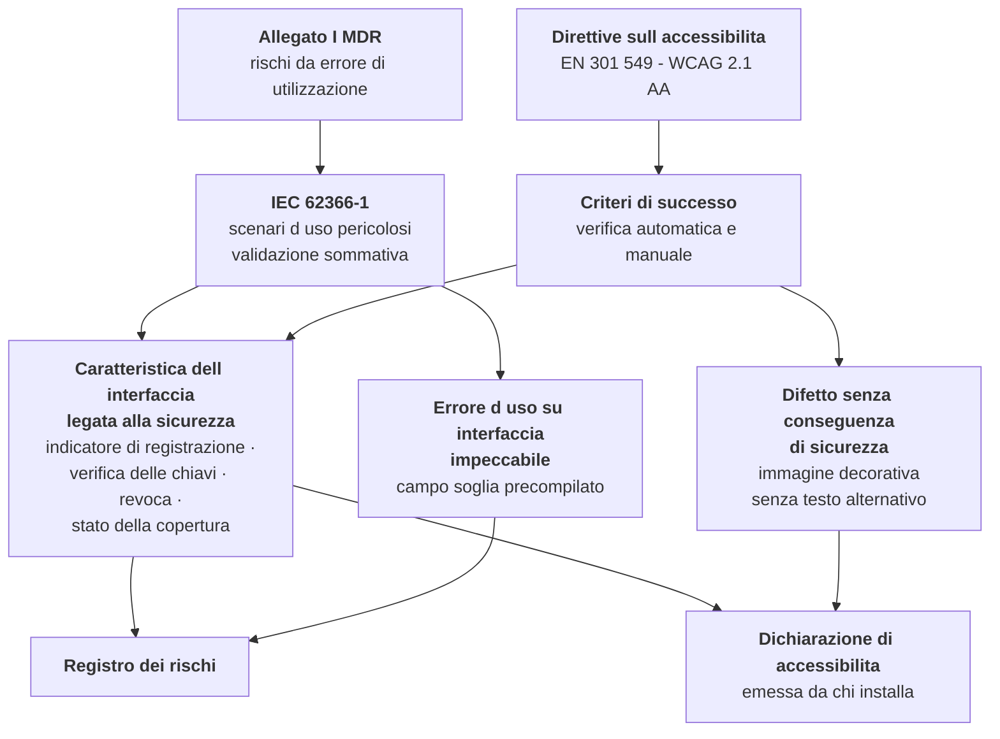

# Usabilità e accessibilità

> **Che cosa questo capitolo non contiene.** Non contiene i requisiti di accessibilità e usabilità
> del prodotto: quelli sono in
> [03 §06 — Accessibilità e usabilità](../03_functional/06-accessibilita-e-usabilita.md), con le
> due prove obbligatorie, i dieci percorsi critici, i sei profili di utente reale e la matrice di
> verifica. **Quel capitolo non va riscritto né contraddetto: qui si legge in chiave regolatoria.**
> Non contiene la mappa delle fonti sull'accessibilità, che è in
> [01 §8](./01-inquadramento-normativo.md). Non contiene la spiegazione di che cosa sia un errore
> d'uso per chi non l'ha mai incontrata, che è nel modulo
> [15 — Regolatorio da zero](../10_fondamenti/15-regolatorio-da-zero.md).

> **Avvertenza di perimetro, prima di ogni altra riga e in questa posizione perché è la sola che
> cambia le decisioni di chi legge.** **Il prodotto non reca marcatura CE**, **non è coperto da
> alcuna dichiarazione di conformità** e **non è utilizzabile per l'erogazione di prestazioni
> sanitarie su pazienti reali**. Nessun fascicolo di ingegneria dell'usabilità è firmato,
> **nessuna valutazione formativa è stata condotta con utenti reali**, **nessuna validazione
> sommativa esiste** e nessuna dichiarazione di accessibilità è stata emessa su un'installazione
> in esercizio. È lo stato di fatto da cui il capitolo parte, e nessuna riga di ciò che segue lo
> attenua.
>
> Il progetto **intende** assumere il ruolo di fabbricante (`D58`), e **il soggetto giuridico che
> lo eserciterebbe è ancora da costituire**. Ne discende la ripartizione dettagliata al § 9: le
> proprietà di accessibilità del prodotto e le valutazioni formative sono nostre e producibili
> ora; approvare il protocollo di validazione, condurre la validazione sommativa e firmare il
> fascicolo `UEF-001` sono atti che **la norma riserva al ruolo di fabbricante**, e **restano
> riservati anche quando il ruolo sarà nostro**. La distinzione non è un residuo da ripulire: è
> precisamente ciò che rende leggibile **perché quegli atti non si possono anticipare**.
>
> **E il varco che questa avvertenza potrebbe aprire, chiuso qui.** Chi legge che il progetto
> intende certificare — o che l'interfaccia è verificata sui criteri di accessibilità — e ne
> conclude «allora posso usarlo con pazienti reali» trae una conclusione **sbagliata**, e sotto
> due profili distinti. **Un'interfaccia accessibile non è un'interfaccia validata**: un requisito
> generale di sicurezza non dimostrato resta non dimostrato, e la conformità ai criteri di
> accessibilità non ne dimostra nemmeno una parte (§ 6.2). **E l'intenzione non copre nessuno**:
> non trasferisce alcun obbligo e non rende utilizzabile una versione non certificata. Chi
> installa o mette in servizio il software oggi assume per intero gli obblighi che ne derivano —
> compresa la dichiarazione di accessibilità del servizio, che grava su di lui e **non graverà
> sul progetto nemmeno quando il soggetto fabbricante sarà costituito** (§ 9, `V-273`).
>
> **Nessuna data compare in questo capitolo, e nessuna può comparirvi.** Il § 8 parla di
> sequenza e di condizioni di validità, mai di quando: il vincolo `V-171` vieta di affermare o
> lasciare intendere che il prodotto sarà marcato entro un termine — questa è l'unica occorrenza
> ammessa di quella parola — e una pianificazione interna non diventa una promessa solo perché è
> nostra. Le date del progetto stanno unicamente in
> [09](./09-percorso-e-calendario.md), e sono pianificazione interna (`D57`).

## 1. Due obblighi, una sola interfaccia

Sulla stessa schermata insistono **due obblighi con fondamenti diversi, domande diverse e
conseguenze diverse della violazione**. Trattarli come uno solo produce un difetto in entrambe le
direzioni: si dichiara conforme un'interfaccia che contiene errori d'uso pericolosi, oppure si
apre una non conformità di accessibilità su un controllo che è, in realtà, una misura di controllo
del rischio e come tale non è dichiarabile difettosa.

|  | **IEC 62366-1** | **EN 301 549 / WCAG 2.1 AA** |
|---|---|---|
| **Fondamento** | Allegato I del Regolamento (UE) 2017/745: obbligo di eliminare o ridurre i rischi connessi agli errori di utilizzazione | Direttiva (UE) 2016/2102 e legge 9 gennaio 2004, n. 4; Direttiva (UE) 2019/882 e d.lgs. 27 maggio 2022, n. 82 |
| **Domanda** | Un uso ragionevole può produrre un **danno a una persona**? | Una persona con disabilità può **usare** il servizio in modo equivalente? |
| **Oggetto** | L'interazione fra dispositivo e utilizzatore previsto | La percepibilità, l'utilizzabilità, la comprensibilità e la robustezza del contenuto e dei componenti |
| **Metrica** | Scenari d'uso pericolosi selezionati che non si verificano, o che sono intercettati, nella validazione sommativa | Criteri di successo verificati, con metodo automatico **e** manuale |
| **Chi verifica** | Utilizzatori rappresentativi, con protocollo approvato prima dell'esecuzione | Strumenti automatici più verifica con tecnologie assistive reali |
| **Esito della violazione** | Requisito generale di sicurezza **non dimostrato**: lacuna del fascicolo tecnico | Non conformità di accessibilità, con obblighi dichiarativi e sanzionatori propri |
| **Chi è obbligato** | Il **fabbricante** della distribuzione marcata | Il **fornitore del servizio in rete**, cioè chi installa, per la dichiarazione; il progetto, per le proprietà del prodotto |

**Le ultime due righe sono quelle che il progetto deve tenere ferme, e `D58` non le sposta.** Ai
sensi di `D28` e `D49`, **come emendati da `D58`**, il progetto **intende** assumere il ruolo di
fabbricante e **il soggetto giuridico che lo eserciterebbe non è ancora costituito**: oggi il
progetto **non firma il fascicolo di ingegneria dell'usabilità e non conduce la validazione
sommativa**, perché entrambi gli atti presuppongono quel ruolo e **restano riservati anche quando
il ruolo sarà nostro**.

**La riga sull'accessibilità va letta con più attenzione ancora, perché il soggetto obbligato non
è lo stesso e non lo diventerà.** L'obbligo di dichiarazione grava su **chi eroga il servizio in
rete**, cioè su chi installa; le **proprietà tecniche** dell'interfaccia — contrasto, ordine di
lettura, annunci di stato, raggiungibilità da tastiera, assenza di precompilazione sui campi a
rischio — sono invece **nel prodotto**, e né chi installa né chi integra può aggiungerle a valle.
Sono due obblighi su due soggetti, e nessuno dei due si trasferisce all'altro. La ripartizione
puntuale è al § 9.

## 2. Perché l'ingegneria dell'usabilità è un obbligo e non una buona pratica

Chi arriva dallo sviluppo legge «usabilità» come qualità del prodotto: qualcosa che si può fare
meglio o peggio senza che nulla di formale ne dipenda. In un dispositivo medico non è così.

- L'**Allegato I, Capo I**, del Regolamento (UE) 2017/745 impone di eliminare o ridurre per quanto
  possibile i rischi connessi a **possibili errori di utilizzazione**, tenendo conto delle
  conoscenze tecniche, dell'esperienza, dell'istruzione, della formazione e, ove applicabile,
  delle condizioni mediche e fisiche degli utilizzatori previsti; e di ridurre per quanto possibile
  i rischi derivanti dall'**ergonomia** e dall'ambiente d'uso previsto.
  `[NV]` — la numerazione puntuale dei punti della sezione va verificata sul testo consolidato
  prima della citazione nel fascicolo.
- **EN 62366-1:2015** con l'emendamento **A1:2020** è la norma che descrive il processo con cui si
  soddisfa quel requisito. `[NV]` — **la presenza e la formulazione esatta del riferimento
  nell'elenco delle norme armonizzate sotto il regolamento non sono verificate**: non tutte le
  norme di processo dell'era delle direttive sono state ripubblicate. La verifica è documentale, a
  costo nullo, e va fatta prima di compilare la matrice dei requisiti generali di sicurezza e
  prestazione.

**La conseguenza operativa è netta e non ammette recuperi.** Un'interfaccia non validata secondo
un processo di ingegneria dell'usabilità non è un'interfaccia perfettibile: è un requisito
generale di sicurezza **non dimostrato**. Non esiste modo di sanarla con una revisione interna a
valle, perché la validazione sommativa richiede quattro cose che si producono solo prima —
un'interfaccia congelata, un protocollo approvato, utilizzatori rappresentativi reclutati, un
rapporto — e nessuna delle quattro si fabbrica a posteriori.

## 3. L'errore d'uso è un modo di guasto

La norma definisce l'errore d'uso come **azione o omissione dell'utilizzatore che produce un
risultato diverso da quello inteso dal fabbricante o atteso dall'utilizzatore**. La scelta
lessicale della versione inglese — *use error*, non *user error* — è deliberata e sposta l'oggetto
dall'utente all'interazione.

**Non è una posizione ideologica, è una collocazione tecnica.** Nella catena di ISO 14971
l'errore d'uso occupa esattamente il posto che in un sistema hardware occupa la rottura di un
componente: è **un evento della sequenza** che porta dal pericolo alla situazione pericolosa. Un
file di rischio che tratti l'errore d'uso come causa esterna non analizzabile ha un buco nella
catena, e il buco è precisamente dove sta la classe di eventi statisticamente più frequente nei
dispositivi che presentano informazione a una persona. Il collegamento con il registro dei rischi
è al capitolo [05 §2](./05-gestione-del-rischio.md), riga «valutazione formativa di usabilità».

Tre regole operative discendono da questa collocazione, e vanno scritte nella procedura del
sistema di gestione della qualità, non lasciate alla sensibilità di chi progetta.

1. **«L'utente ha sbagliato» non è la conclusione di un'analisi: ne è l'inizio.** La domanda
   successiva è obbligatoria: che cosa, nell'interfaccia, ha reso quel comportamento ragionevole?
   Un'analisi che si ferma prima di quella domanda non ha prodotto nulla di utilizzabile.
2. **Errore d'uso e uso anomalo vanno distinti, e la distinzione va motivata.** L'uso anomalo —
   violazione intenzionale e ingiustificabile dell'uso previsto — è fuori dal perimetro della
   norma sull'usabilità ma **non è fuori dalla gestione del rischio**: si tratta con misure
   organizzative, di controllo degli accessi e informative. Classificare come «uso anomalo» un
   comportamento che una parte significativa degli utilizzatori adotta spontaneamente è un modo
   di far sparire un difetto, e viene contestato.
3. **Il registro degli errori d'uso alimenta il file di rischio in tempo reale.** Ogni valutazione
   formativa che rilevi un errore d'uso non previsto produce **una riga nel file di rischio, o la
   motivazione documentata del perché non ne produce**. Non esiste una terza possibilità, e in
   particolare non esiste il rinvio a fine progetto.

**Esempio preso da questo dominio, e non didattico.** Il campo che contiene la soglia individuale
di un piano di monitoraggio parte vuoto e obbligatorio, senza alcuna precompilazione, nemmeno con
i valori del percorso o dell'ultimo piano (vincolo `V-123` dell'area funzionale). La ragione non è
di preferenza: un campo precompilato è **accessibile in modo impeccabile** e produce
sistematicamente la conferma per inerzia di un valore che nessuno ha valutato. È la riga `RM-06`
del registro dei rischi ed è una misura di **livello 1** — sicurezza intrinseca per progettazione:
l'errore non è possibile perché non c'è nulla da confermare.

## 4. Gli otto prodotti del processo, e chi li produce

La clausola 5 di IEC 62366-1 descrive un processo che genera artefatti in sequenza, ciascuno
ingresso del successivo. Conviene vederli come otto documenti, perché è così che un organismo
notificato li chiede, e perché il confine fra ciò che il progetto produce oggi e ciò che resta
riservato al ruolo di fabbricante cade in punti diversi per ciascuno.

| # | Artefatto | Identificativo | Il progetto, oggi | Riservato al ruolo di fabbricante |
|---|---|---|---|---|
| 1 | **Specifica d'uso**: indicazione, popolazione, profilo di ciascun gruppo di utilizzatori, ambiente d'uso, principio operativo | `UE-SPEC-001` | **Bozza integrale**, ricavabile dalla destinazione d'uso e dalla documentazione funzionale | Approva e data |
| 2 | **Caratteristiche dell'interfaccia legate alla sicurezza** | `UE-SPEC-001` § 2 | **Integrale**: sono note al progetto e a nessun altro | Riesamina |
| 3 | **Pericoli e situazioni pericolose legati all'uso** | `UE-HAZ-001` | **Integrale**, con rinvio al registro dei rischi | Riesamina e integra |
| 4 | **Scenari d'uso pericolosi**, in forma narrativa | `UE-HAZ-001` § 3 | **Integrale** | Riesamina |
| 5 | **Selezione degli scenari da validare**, motivata sulla gravità | `UE-PLAN-001` § 2 | Proposta motivata | **Determina** |
| 6 | **Specifica dell'interfaccia utente**, in termini verificabili | `UE-UIS-001` | **Integrale** | Verifica |
| 7 | **Piano di validazione**: protocollo, criteri di superamento, numero e profilo dei partecipanti, ambiente, compiti | `UE-PLAN-001` | Bozza tecnica | **Approva prima dell'esecuzione** |
| 8 | **Valutazioni formative** durante lo sviluppo e **validazione sommativa** prima del rilascio | `UE-FORM-001`, `UE-SUM-001` | **Conduce le formative** | **Conduce o commissiona la sommativa e ne assume l'esito** |

L'insieme, più le tracciature verso il registro dei rischi, costituisce il **fascicolo di
ingegneria dell'usabilità** `UEF-001`. Gli identificativi appartengono allo spazio dichiarato dal
vincolo `V-172` al capitolo [03 §5](./03-sistema-di-gestione-della-qualita.md).

**Che cosa nomina la quinta colonna, ora che quel ruolo sarà nostro.** Non nomina un terzo: nomina
il **ruolo formale di fabbricante**, che il progetto **intende** assumere e il cui **soggetto
giuridico è ancora da costituire**. Approvare, datare, riesaminare, determinare, firmare e
assumere l'esito sono atti che la norma riserva a quel ruolo, e **la riserva non cade perché il
ruolo sarà nostro**: cade quando il soggetto esiste **e** il controllo dei documenti è in
esercizio, perché senza quest'ultimo ciò che si firma è una firma su un testo e non una
dichiarazione ([02 §5.2](./02-qualificazione-e-classificazione.md);
[03 §4](./03-sistema-di-gestione-della-qualita.md), `V-174`). Leggere quella colonna come «lavoro
di qualcun altro» era corretto prima di `D58` ed è scorretto ora: è **lavoro nostro non ancora
eseguibile**, che è una condizione più onerosa e non meno.

**Dove il progetto è avanti e dove è indietro, senza attenuazioni.** È avanti sugli artefatti 2,
3, 4 e 6: le caratteristiche legate alla sicurezza sono già censite come funzioni correlate alla
sicurezza in [03 §06 §6](../03_functional/06-accessibilita-e-usabilita.md), e gli scenari d'uso
pericolosi esistono in forma matura fra i moduli dei fondamenti e il registro dei rischi. È
indietro sull'artefatto 8: **non esiste alcuna valutazione formativa condotta con utenti reali**,
e la sommativa non è pianificabile finché l'interfaccia non smette di cambiare. È la sequenza che
governa la pianificazione interna del capitolo [09 §3](./09-percorso-e-calendario.md); qui non se
ne ricava alcuna data, e il ritardo sull'artefatto 8 **è nostro**, non di un soggetto a valle.

## 5. Gruppi di utilizzatori e coorti: l'errore che raddoppia il costo

Il piano di validazione richiede che **ogni gruppo distinto di utilizzatori sia coperto**. La
domanda operativa è quindi quanti gruppi esistono, e la risposta non coincide con il numero dei
profili di utente descritti dall'area funzionale.

I **sei profili** di [03 §06 §3](../03_functional/06-accessibilita-e-usabilita.md) sono insiemi di
vincoli osservabili che servono a progettare. I **gruppi di utilizzatori** ai sensi della norma
sono classi di persone che usano il dispositivo con ruolo, formazione e responsabilità diversi, e
servono a stabilire quante coorti la validazione deve reclutare. La corrispondenza è la seguente.

| Gruppo di utilizzatori | Profili funzionali che vi ricadono | Perché è un gruppo autonomo |
|---|---|---|
| **Medico** | Professionista sotto pressione di tempo | Assume l'atto sanitario, redige il documento clinico, configura la soglia individuale |
| **Professionista sanitario non medico** | Professionista sotto pressione, case manager | Prende in carico gli allarmi e opera sul piano senza redigere il referto: compiti e vincoli professionali diversi |
| **Utilizzatore laico** | Persona anziana con bassa alfabetizzazione digitale, caregiver | Nessuna formazione, nessun addestramento, nessun supporto sul posto |
| **Operatore non sanitario** | Operatore di front-office, operatore tecnico del centro servizi | La separazione fra centro servizi e centro erogatore è vincolo di autorizzazione (`V-125`): non accede al contenuto clinico e vede un'interfaccia diversa |

**Quattro gruppi significano quattro coorti**, e ogni coorte ha reclutamento, consensi,
conduzione, osservazione e analisi propri. È la variabile che determina l'ordine di grandezza del
costo della sommativa, e va fissata **prima** di chiedere un preventivo.

**L'errore che costa di più è trattare la disabilità come un quinto gruppo.** Non lo è. La
condizione di disabilità e l'età avanzata sono **caratteristiche che devono essere presenti dentro
ciascuna coorte pertinente**, non una coorte separata: esistono medici ipovedenti, infermieri con
limitazioni motorie e operatori che usano ingrandimento di sistema. Una sommativa che collochi
tutte le persone con disabilità in un'unica coorte «accessibilità» produce due difetti
simultanei — non copre i gruppi professionali nella loro composizione reale e trasforma
l'accessibilità in un adempimento separato, che è esattamente ciò che il § 6 vieta.

**Il numero di partecipanti.** IEC 62366-1 **non prescrive un numero**. La cifra di quindici
partecipanti per gruppo, largamente usata nell'industria, proviene dalla linea guida sui fattori
umani dell'autorità regolatoria statunitense e **non è un requisito dell'Unione europea**:
`[NV]`, e in nessun caso va citata come obbligo. Ciò che il piano deve motivare è il **criterio di
sufficienza adottato**, tipicamente la saturazione degli errori d'uso osservati. La numerosità
attesa è una delle domande da porre all'organismo notificato in fase di offerta, insieme al
riesame preliminare (capitolo [09 §8.3](./09-percorso-e-calendario.md)). **Porre quella domanda
presuppone il ruolo di fabbricante**: è chi ingaggia l'organismo a poterla porre, e il soggetto
che lo farebbe non è ancora costituito.

## 6. Dove i due obblighi si incontrano, e dove no

**Il nodo centrale è l'unico punto in cui i due obblighi coincidono, e il vincolo `V-175` del
§ 6.3 governa esattamente quel nodo.** I due nodi laterali sono le due direzioni in cui non
coincidono, e sono la ragione per cui nessuna delle due verifiche sostituisce l'altra.

### 6.1 Si incontrano su ogni controllo legato alla sicurezza

Gli esempi che seguono sono presi da questo prodotto e ciascuno è **simultaneamente** una non
conformità di accessibilità e un errore d'uso con conseguenza sulla sicurezza o sui diritti.

| Elemento | Difetto di accessibilità | Errore d'uso che ne discende | Riga collegata |
|---|---|---|---|
| Indicatore di registrazione in corso | Non annunciato dallo strumento di lettura assistita | Un partecipante crede che la sessione non sia registrata, o il contrario; il consenso perde il proprio oggetto | `RM-07` |
| Stringa breve di verifica delle chiavi | Veicolata dal solo colore, in violazione del criterio 1.4.1 sull'uso del colore | La verifica dell'interlocutore non viene eseguita: la misura di controllo esiste e non opera | `D22` |
| Comando di fine sessione o di revoca del consenso | Non raggiungibile da tastiera, o fuori dall'ordine di lettura | L'atto di revoca non è esercitabile da chi ne ha diritto | `RM-14` |
| Dichiarazione dello stato della copertura del servizio | Contrasto insufficiente o occultata da una personalizzazione di tema | Falsa rassicurazione: la persona crede di essere sorvegliata e ritarda l'accesso all'emergenza | `RM-12` |
| Messaggio di errore su un percorso critico | Solo codice tecnico, senza causa, conseguenza e azione | L'utilizzatore abbandona il percorso o compie l'azione sbagliata | `RNF-054` |

La riga sulla personalizzazione è quella che rende il vincolo `V-163` dell'area di integrazione un
**requisito regolatorio e non una scelta di prodotto**: le dichiarazioni obbligatorie non sono
tematizzabili né occultabili, e una configurazione di tema che degrada il contrasto è rifiutata al
salvataggio, non segnalata come avviso.

### 6.2 Non si incontrano, in due direzioni

**Un'interfaccia impeccabile sui criteri di accessibilità può contenere errori d'uso gravissimi.**
Il campo soglia precompilato del § 3 ne è la dimostrazione: rispetta ogni criterio e produce la
conferma per inerzia di un valore clinico. Nessuna verifica di accessibilità, automatica o
manuale, lo rileverebbe.

**Un difetto di accessibilità può non avere alcuna conseguenza di sicurezza.** Un'immagine
decorativa priva di testo alternativo in una pagina informativa è una non conformità reale, con i
suoi obblighi dichiarativi, e non produce alcun danno alla persona.

Ne discende che **le due verifiche non si sostituiscono, e che il soggetto esposto è diverso nei
due casi**. Chi esegue **solo la verifica di accessibilità** dichiara conforme un prodotto
pericoloso: la lacuna è un requisito generale di sicurezza non dimostrato, e ne risponde **il
fabbricante**. Chi esegue **solo la verifica di usabilità** lascia scoperto un obbligo che grava
altrove: la dichiarazione del servizio in rete è di **chi installa**, le proprietà di
accessibilità del prodotto sono del **progetto** (§ 1, ultime due righe).

**Attribuire il secondo inadempimento al fabbricante è un errore di soggetto**, e va corretto
ovunque compaia. Il fabbricante risponde del requisito generale di sicurezza non dimostrato, non
della dichiarazione di accessibilità: sono due fonti diverse, con due soggetti obbligati diversi,
e la coincidenza fra i due ruoli in una stessa organizzazione — possibile, ma non necessaria —
non li fonde.

### 6.3 La regola del collegamento bidirezionale — vincolo `V-175`

> **`V-175`.** Il fascicolo di ingegneria dell'usabilità dichiara, per **ogni caratteristica
> dell'interfaccia legata alla sicurezza**, quali criteri di accessibilità la rendono percepibile
> e azionabile; il rapporto di conformità all'accessibilità dichiara, per **ogni criterio
> verificato su quelle caratteristiche**, che è anche misura di controllo del rischio. Il
> collegamento è bidirezionale e verificabile. **Un criterio di accessibilità che copre una
> funzione legata alla sicurezza non può essere oggetto di una non conformità dichiarata.**

La seconda frase è la parte operativa. La dichiarazione di accessibilità ammette non conformità
dichiarate, e dichiararle è legittimo; ma una non conformità su un criterio che rende utilizzabile
un controllo di sicurezza **non è una non conformità dichiarabile: è un rischio d'uso non
controllato**, e va trattato come tale nel registro dei rischi. Il vincolo serve a impedire che
un adempimento di accessibilità venga usato per assorbire un difetto di sicurezza.

Conseguenza sul controllo automatico: l'elenco delle caratteristiche legate alla sicurezza e
l'elenco dei criteri oggetto di non conformità dichiarata devono avere **intersezione vuota**, e
la verifica è meccanica una volta che entrambi gli elenchi sono versionati.

### 6.4 La non conformità dichiarata, verificata contro la regola

Il progetto dichiara **una sola non conformità**, sul criterio 1.2.4 relativo ai sottotitoli in
tempo reale per i contenuti audio-video dal vivo (`D24`), con l'interprete come misura
alternativa. Applicando `V-175`:

- l'indisponibilità dei sottotitoli in tempo reale **non rende inaccessibile** alcuna delle
  caratteristiche legate alla sicurezza elencate al § 6.1, che sono tutte testuali o di stato e
  restano percepibili;
- **rende però difficoltoso** l'atto clinico stesso per una persona sorda, e questo è un rischio
  d'uso, non una non conformità: la misura alternativa — l'interprete come partecipante a pieno
  titolo, più il canale testuale sempre disponibile in sessione — è **precisamente la misura di
  controllo del rischio** che rende sostenibile la dichiarazione;
- ne discende che l'interprete **va documentato anche nel fascicolo di usabilità**, non soltanto
  nella dichiarazione di accessibilità. Se comparisse in un solo documento, la dichiarazione
  sarebbe indifendibile in una delle due sedi.

**Dipendenza da segnalare e non da scoprire.** Il limite dichiarato di partecipanti alla sessione
è rinviato in attesa di misura (`Q-111`). Se la misura dovesse escludere il terzo partecipante,
**l'interprete non sarebbe più ammissibile in sessione** e la misura alternativa cadrebbe insieme
alla dichiarabilità della non conformità. È un legame fra una decisione di ingegneria e un
adempimento di accessibilità che non è visibile da nessuno dei due lati.

## 7. Progettare prima per il dispositivo mobile, quando l'utilizzatore è chi è

Il metodo di progettazione — schermo piccolo e connessione peggiore per primi, non desktop
adattato — è già fissato dall'area funzionale e non va ripetuto qui. Quello che va detto è la sua
**qualificazione regolatoria**, che è diversa e più stringente di quella di una scelta di
prodotto.

**Il dispositivo e l'ambiente d'uso sono parte della specifica d'uso, non parametri di
prestazione.** La clausola 5 di IEC 62366-1 richiede che la specifica d'uso dichiari l'**ambiente
d'uso previsto**. Per questo prodotto l'ambiente non è un ufficio: è l'abitazione di una persona
anziana, su un apparecchio di fascia media di alcuni anni prima che qualcun altro ha configurato,
su rete mobile, spesso in condizioni di luce sfavorevoli, spesso senza nessuno accanto. Ne
discendono tre conseguenze che non sono ottimizzazioni.

1. **Il dispositivo di riferimento non è quello di chi sviluppa.** Finché non è dichiarato, la
   specifica d'uso non è completabile e il requisito `RNF-106` — nove partecipanti su dieci
   completano l'inserimento di una misura al primo tentativo, senza assistenza, su dispositivo di
   fascia bassa e rete limitata — **non è verificabile**. La scelta è di prodotto (`Q-115`); la
   conseguenza regolatoria è di questa area ed è la questione `Q-175`.
2. **La resilienza è accessibilità, non ottimizzazione.** Degradare in modo comprensibile — audio
   prima del video, avviso chiaro, ripresa della sessione, misura conservata localmente e
   trasmessa al ripristino — è ciò che rende il servizio utilizzabile da chi ha meno risorse.
   L'assenza di degrado comprensibile produce un errore d'uso: la persona conclude che la
   prestazione è avvenuta quando non lo è, o viceversa.
3. **Il numero di azioni è un requisito di sicurezza.** Un percorso di ingresso lungo non è
   scomodo: è un percorso che una parte della popolazione non completa, e la prestazione non
   erogata a chi non riesce ad accedere è un esito clinico, non un dato di conversione.

**Le tre popolazioni e ciò che ciascuna impone.** Nessuna delle tre è un caso limite; insieme sono
la popolazione normale del servizio.

| Chi | Vincolo dominante | Requisito regolatorio che ne discende |
|---|---|---|
| **Persona anziana, sola** | Una sola possibilità di riuscita prima di rinunciare e telefonare | Percorso unico senza scelte iniziali; verifica tecnica dentro il percorso e non opzionale; ripiego telefonico dichiarato **prima**, non dopo il fallimento |
| **Familiare che assiste** | Opera dal proprio dispositivo, su più di una persona, in fasce ristrette | Contesto del soggetto permanente e non ambiguo, con conferma esplicita che **nomina** il soggetto al cambio: è la misura contro `RM-09`, misura attribuita alla persona sbagliata |
| **Operatore sotto pressione** | Novanta secondi fra una prestazione e la successiva, postazione condivisa | Nessuna interruzione modale durante l'atto; azioni obbligatorie minime e nel punto giusto. **Ogni campo obbligatorio non necessario viene compilato con valori falsi**, e un dato falso è peggio di un dato assente |

L'ultima riga è la meno intuitiva e la più importante: nel dominio reale l'eccesso di campi
obbligatori **degrada la qualità del dato clinico**. Fanno eccezione i campi la cui assenza è essa
stessa un rischio — dichiarazione di erogabilità, identificazione, esito, soglia individuale — e
la lista delle eccezioni va motivata voce per voce, non allungata per prudenza.

## 8. La validazione sommativa è il vincolo di calendario

È l'attività che, sotto pressione di scadenza, viene sacrificata per prima, e non è comprimibile
per nessuna delle sue componenti.

| Condizione di validità | Conseguenza pratica |
|---|---|
| Interfaccia **congelata** nella configurazione che sarà rilasciata | Ogni modifica successiva richiede una valutazione dell'impatto e, se tocca una funzione legata alla sicurezza, una ripetizione parziale |
| **Protocollo approvato prima** dell'esecuzione | I criteri di superamento non si scelgono dopo aver visto i risultati. È un punto di decisione irreversibile del calendario |
| Partecipanti **rappresentativi**, non sostituti | Sviluppatori, colleghi e conoscenti non sono utilizzatori rappresentativi: una sommativa condotta su di essi **non è una sommativa** |
| **Ogni gruppo** coperto | Quattro gruppi, quattro coorti (§ 5) |
| Anziani e persone con disabilità **dentro le coorti** | Il reclutamento è la voce più lenta e più incerta dell'intero preventivo: **sei-dieci settimane**, e va avviato con mesi di anticipo |
| Il fallimento si **analizza**, non si ripara in corsa | Un partecipante che sbaglia produce un dato. Aggiustare l'interfaccia durante la sessione invalida la sessione |

**Le tre modalità di fallimento, in ordine di frequenza attesa.**

1. **Si esegue troppo presto**, su un'interfaccia che poi cambia, e va rifatta.
2. **Si esegue su partecipanti sbagliati**, perché il reclutamento non è partito in tempo, e il
   rapporto non è difendibile.
3. **Si scopre un errore d'uso grave** che richiede una riprogettazione, e la riprogettazione
   richiede una nuova sommativa parziale. È lo scenario che aggiunge un trimestre al percorso.

**Regola di calendario che ne discende, ed è la sola conclusione utile di questo paragrafo.** Le
valutazioni formative non sono una versione ridotta della sommativa: sono **l'unica assicurazione
contro il terzo scenario**, e vanno condotte su prototipi, anche non funzionanti, **prima** che
l'implementazione sia completa. Ogni errore d'uso scoperto in formativa risparmia una
riprogettazione e la sommativa parziale che ne discenderebbe.

**E le formative sono l'unica voce di questo capitolo che non attende nulla.** Si conducono su
prototipi, **prima** che il soggetto fabbricante sia costituito, senza organismo notificato e
senza interfaccia congelata: nessuna delle condizioni che bloccano gli altri artefatti le tocca.
Da `D58` discende che rinviarle non è più un'attesa di un soggetto a valle ma **una perdita
nostra**, e la perdita è asimmetrica — l'errore d'uso non scoperto in formativa si scopre in
sommativa, dove costa una riprogettazione e una ripetizione, oppure non si scopre affatto, e
allora lo incontra una persona.

## 9. Ripartizione: che cosa il progetto produce oggi, e quali atti restano riservati

| Attività | Il progetto, oggi | A chi resta riservato l'atto |
|---|---|---|
| Proprietà tecniche di accessibilità del prodotto | **Integrale**: non sono aggiungibili a valle | Nessuna riserva. **Chi installa** verifica sulla configurazione che ha effettivamente messo in esercizio |
| Verifica automatica bloccante in integrazione continua | **Integrale** | — |
| Verifica manuale con tecnologie assistive | **Integrale sui percorsi critici del prodotto** | **Chi integra** la ripete sulle personalizzazioni che introduce |
| Specifica d'uso, caratteristiche legate alla sicurezza, scenari pericolosi, specifica dell'interfaccia | **Bozza integrale** | **Il fabbricante** approva, data e firma |
| Selezione degli scenari da validare | Proposta motivata | **Il fabbricante determina** |
| Valutazioni formative | **Conduce e pubblica gli esiti**, ora, senza attendere la costituzione del soggetto | **Il fabbricante** le riesamina quando compone il fascicolo |
| Protocollo di validazione sommativa | Bozza tecnica | **Il fabbricante approva prima dell'esecuzione** |
| Conduzione della validazione sommativa | — | **Il fabbricante** la conduce o la commissiona, e **ne assume l'esito** |
| Fascicolo `UEF-001` consolidato | Contributi identificati, con versione, data e impronta verificabile (`V-179`) | **Il fabbricante compone e firma** |
| **Dichiarazione di accessibilità** del servizio | Modello e contenuti tecnici verificati | **Chi installa la emette**: il soggetto obbligato è chi eroga il servizio in rete, e **non è il fabbricante** |

**Come si legge la terza colonna, e perché non nomina più un terzo.** Dove dice «il fabbricante»
nomina il **ruolo formale**: il progetto **intende** assumerlo (`D58`) e **il soggetto giuridico
che lo eserciterebbe è ancora da costituire**, quindi quelle righe **non sono eseguibili oggi** —
non per una scelta di perimetro ma perché manca il soggetto che possa firmare e manca il controllo
dei documenti che rende una firma una dichiarazione
([02 §5.2](./02-qualificazione-e-classificazione.md)). Dove dice «chi installa» o «chi integra»
nomina invece soggetti **realmente distinti dal progetto**, e la loro parte **non si sposta con
`D58`**: resta la loro, oggi come prima, e nulla di ciò che il progetto intende fare gliela toglie.

**La riga sulla dichiarazione di accessibilità è quella che si sbaglia più spesso, e `D58` la
rende più facile da sbagliare.** La dichiarazione riguarda **un servizio in rete erogato da un
soggetto**, non un pacchetto software. Il progetto non può emetterla, non può emetterne una valida
«per conto di» chi installa — la personalizzazione di tema, i contenuti caricati dal tenant e
l'ambiente di installazione ne modificano l'esito — e **non potrà emetterla nemmeno quando avrà
costituito il soggetto fabbricante**: il fabbricante di un dispositivo non è, per ciò solo, il
fornitore del servizio in rete, e i due ruoli hanno fonti, presupposti e destinatari diversi.

> **`V-273`.** **La dichiarazione di accessibilità del servizio non è mai del progetto**, e non lo
> diventa per effetto di `D58`. Il soggetto obbligato è **chi eroga il servizio in rete**, cioè
> chi installa e mette in esercizio; il progetto è obbligato alle **proprietà di accessibilità del
> prodotto**, che sono cosa distinta e che nessun deployer può aggiungere a valle. Nessun
> artefatto del progetto può contenere, allegare o anticipare una dichiarazione di accessibilità
> riferita a un servizio, e nessuna riformulazione può lasciare intendere che l'assunzione del
> ruolo di fabbricante assorba quell'obbligo.

Ciò che il progetto deve fornire è **il materiale che rende la dichiarazione compilabile in un
pomeriggio invece che in un mese**: elenco dei criteri verificati con metodo e data, elenco delle
non conformità con misura alternativa, elenco dei percorsi critici coperti, versione della norma
su cui la verifica è stata condotta.

`[NV]` — la versione di EN 301 549 giuridicamente efficace è quella citata nella pubblicazione
ufficiale dell'Unione a supporto della fonte applicabile, e **non è stata verificata** in questa
documentazione (vedi [01 §8](./01-inquadramento-normativo.md)). La dichiarazione deve indicare la
versione su cui la verifica è stata effettivamente condotta, non «EN 301 549» in astratto.

## 10. Che cosa questo capitolo lascia aperto

| Riferimento | Questione | A chi |
|---|---|---|
| `Q-175` | **Il dispositivo e l'ambiente di riferimento sono parte della specifica d'uso, non un parametro di prestazione.** Finché non sono dichiarati, `UE-SPEC-001` non è completabile e `RNF-106` non è verificabile. Rilancia `Q-115` con la conseguenza regolatoria che quella questione non registrava: non è un ritardo di misura, è una lacuna del fascicolo | Prodotto, tecnica |
| `[NV]` | Presenza e formulazione del riferimento a EN 62366-1:2015+A1:2020 nell'elenco delle norme armonizzate sotto il regolamento (§ 2) | Conformità |
| `[NV]` | Numerazione puntuale dei punti dell'Allegato I sui rischi da errore di utilizzazione e da ergonomia (§ 2) | Conformità |
| `[NV]` | Versione di EN 301 549 giuridicamente efficace, e conseguente formulazione della dichiarazione (§ 9) | Conformità |
| `Q-111` | Se la misura del limite di partecipanti escludesse il terzo, la misura alternativa alla non conformità dichiarata cadrebbe (§ 6.4) | Architettura, tecnica |
| `Q-273` | **Le valutazioni formative con utenti reali sono ora un'attività nostra e non differibile (§ 8), ma non sono producibili da una persona sola.** Osservare un utilizzatore rappresentativo mentre esegue un compito richiede **soggetti distinti** da chi ha progettato l'interfaccia, esattamente come l'audit interno e il riesame del rilascio (`D54`): non è un problema di ore. Va stabilito se la funzione si acquisisce all'esterno o se l'assenza di formative si accetta come rischio dichiarato — sapendo che è il rischio che il § 8 indica come il più costoso | Prodotto, → **ORCH** |
| — | **Numerosità e composizione delle coorti della sommativa** non sono fissate e non lo saranno finché non c'è un organismo notificato con cui concordarle (§ 5), e ingaggiarlo presuppone il **soggetto fabbricante, da costituire**. Il progetto dichiara il criterio di sufficienza, non il numero | **Il fabbricante**, quando il soggetto sarà costituito |
