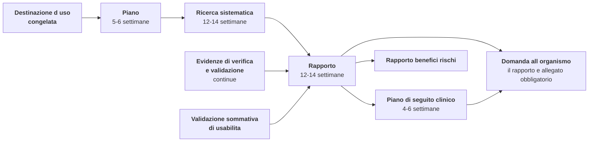

# Valutazione clinica

> **Presupposto di lettura.** La qualificazione e la destinazione d'uso da cui tutto questo
> capitolo dipende sono al capitolo
> [02 — Qualificazione e classificazione](./02-qualificazione-e-classificazione.md). Il registro
> dei rischi e il rapporto benefici/rischi, che sono a valle, sono al capitolo
> [05 — Gestione del rischio](./05-gestione-del-rischio.md). Il calendario che questo capitolo
> vincola è al capitolo [09 — Percorso e calendario](./09-percorso-e-calendario.md).
>
> **Avvertenza che governa l'intero capitolo, e va letta prima di ogni riga sull'evidenza.**
> **Il prodotto non reca marcatura CE**, **non è coperto da alcuna dichiarazione di conformità** e
> **non è utilizzabile per l'erogazione di prestazioni sanitarie su pazienti reali**. **Nessuna
> valutazione clinica è stata condotta**: non esiste un piano approvato, non esiste una ricerca
> sistematica avviata, non esiste un rapporto, e nessun beneficio clinico è ad oggi dimostrato.
> È lo stato di fatto da cui il capitolo parte, e nessuna riga di ciò che segue lo attenua.
>
> Il progetto **intende** assumere il ruolo di fabbricante (`D58`), e **il soggetto giuridico che
> lo eserciterebbe è ancora da costituire**. Ne discende una ripartizione che `D58` **non
> modifica**: redigere il rapporto di valutazione clinica, firmarlo e **determinare che l'evidenza
> sia sufficiente** sono atti che la norma riserva al ruolo di fabbricante e che presuppongono un
> valutatore qualificato con dichiarazione di assenza di conflitto di interessi. **Restano
> riservati anche quando il ruolo sarà nostro**, ed è precisamente questa riserva a rendere
> leggibile perché non si possono anticipare: l'intenzione non è il soggetto, e una firma apposta
> fuori da un controllo dei documenti in esercizio non è una dichiarazione ma una firma su un
> testo ([02 §5.2](./02-qualificazione-e-classificazione.md)).
>
> **Che cosa `D58` cambia davvero qui.** Cambia il **destinatario del lavoro preparatorio**: il
> piano in bozza, l'evidenza di validazione tecnica citabile, il dossier dello stato dell'arte e
> la strumentazione del seguito clinico non sono più il contributo a un percorso altrui ma
> **l'anticipo del nostro**. Ne discende che il ritardo su queste voci è un **ritardo nostro**, e
> che i sei-nove mesi non comprimibili del § 2 sono tempo che comincia a scorrere quando lo
> facciamo cominciare noi. Non cambia nulla, invece, sulla ripartizione tecnica del § 4.
>
> **E il varco che questa avvertenza potrebbe aprire, chiuso qui.** Chi legge che il progetto
> intende certificare — o che una parte consistente dell'evidenza tecnica è già prodotta — e ne
> conclude «allora posso usarlo con pazienti reali» trae una conclusione **sbagliata**, e questo
> capitolo è quello in cui l'errore costa di più. **L'evidenza tecnica non è evidenza clinica**:
> dimostrare che il software fa ciò che dichiara di fare non dimostra che il suo uso produca
> l'effetto atteso sulla gestione del paziente (§ 3). E l'intenzione di dimostrarlo **non copre
> nessuno, non trasferisce alcun obbligo e non rende utilizzabile una versione non certificata**:
> chi installa, integra o mette in servizio il software oggi assume per intero gli obblighi che
> ne derivano.
>
> **Nessuna data compare in questo capitolo.** Le durate delle attività sono dichiarate perché
> sono la sostanza dell'argomento — la valutazione clinica non si comprime con risorse — ma una
> durata non è un termine: il vincolo `V-171` vieta di affermare o lasciare intendere che il
> prodotto sarà marcato entro un termine, e questa è l'unica occorrenza ammessa di quella parola.
> Le date del progetto stanno unicamente in [09](./09-percorso-e-calendario.md) e sono
> pianificazione interna (`D57`).

## 1. Che cos'è, in termini esatti

La **valutazione clinica** è definita dall'**art. 2, punto 44**, del Regolamento (UE) 2017/745
come il processo sistematico e programmato inteso a produrre, raccogliere, analizzare e valutare
in modo **continuo** i dati clinici relativi a un dispositivo, allo scopo di verificarne la
sicurezza e le prestazioni, **compresi i benefici clinici**, quando è utilizzato conformemente
alla destinazione d'uso indicata dal fabbricante. L'obbligo è nell'**art. 61**; la procedura è
nell'**Allegato XIV, Parte A**.
`[NV]` — la numerazione puntuale dei punti dell'art. 2 va verificata sul testo consolidato prima
della citazione nel fascicolo.

Tre nozioni collegate vanno tenute distinte, perché un organismo notificato le distingue e la
loro confusione è un rilievo ricorrente.

| Nozione | Definizione | Che cos'è nel percorso |
|---|---|---|
| **Dati clinici** | Informazioni su sicurezza o prestazioni provenienti dall'uso del dispositivo: indagini cliniche, studi su dispositivi equivalenti, letteratura scientifica sottoposta a revisione paritaria, esperienza clinica documentata | La **materia prima** |
| **Evidenza clinica** | I dati clinici **più** i risultati della loro valutazione, in quantità e qualità sufficienti a consentire una valutazione qualificata del conseguimento del beneficio clinico dichiarato e della sicurezza | Il **prodotto** |
| **Beneficio clinico** | L'effetto positivo del dispositivo sulla salute della persona, espresso in **esiti clinici significativi e misurabili**, compresi quelli relativi alla diagnosi, o l'effetto positivo sulla **gestione del paziente** o sulla salute pubblica | Ciò che va **dimostrato** |

### 1.1 Il beneficio clinico è il punto in cui la sanità digitale si accorge di avere un problema

«Riduce i tempi di attesa», «migliora l'efficienza organizzativa», «abbatte i costi di
spostamento», «è apprezzato dagli utilizzatori»: **nessuno di questi è un beneficio clinico**.
Sono argomenti commerciali, e presentarli come beneficio clinico produce un ciclo di non
conformità sul punto centrale del rapporto.

La definizione ha tre rami, e per questo prodotto **il ramo praticabile è il secondo**: l'effetto
positivo sulla **gestione del paziente**. La formulazione che il progetto propone come bozza —
*consentire l'accesso a prestazioni programmate a persone per le quali l'accesso in presenza è
oneroso o non tempestivo, mantenendo la completezza e la tracciabilità dell'informazione clinica*
— è costruita su quel ramo, e va comunque sottoposta a verifica da un redattore clinico
qualificato prima del congelamento.

**Attenzione a una asimmetria che sfugge.** «Mantenendo la completezza dell'informazione clinica»
non è una clausola difensiva: è **un'affermazione da dimostrare**, e quindi determina una parte
dei criteri di inclusione della ricerca di letteratura e almeno una grandezza da misurare nel
seguito clinico (§ 7). Ogni parola della destinazione d'uso che afferma qualcosa costa lavoro di
evidenza. Ogni parola che non afferma nulla è inutile. Non esistono parole neutre.

## 2. Perché è il collo di bottiglia reale

Il fattore limitante dichiarato dall'intero percorso è la disponibilità dell'organismo notificato
(`D44`). Il **secondo** è la valutazione clinica, e ha una proprietà che lo rende peggiore: **non
è comprimibile con risorse**. Raddoppiare le persone non dimezza il tempo di una ricerca
sistematica, perché la sequenza — protocollo, interrogazione, selezione a due valutatori,
recupero dei testi integrali, valutazione critica, estrazione, sintesi — è **intrinsecamente
seriale** su una parte rilevante del percorso.

| Attività | Durata | Perché non si comprime |
|---|---|---|
| Piano di valutazione clinica | 5–6 settimane | Dipende dalla destinazione d'uso congelata |
| Ricerca sistematica della letteratura | 12–14 settimane | Doppia selezione, recupero dei testi integrali, valutazione critica di ciascuna fonte inclusa |
| Analisi dei dati e stesura del rapporto | 12–14 settimane | Dipende dalla ricerca **e** dagli esiti di verifica e validazione |
| Piano di seguito clinico | 4–6 settimane | Dipende dal rapporto |

**Sei-nove mesi in sequenza**, con una dipendenza a monte — la destinazione d'uso — e una a
valle — il rapporto benefici/rischi del capitolo
[05 §8](./05-gestione-del-rischio.md), che non si chiude prima.

**La catena orizzontale è seriale e non si parallelizza; i due ingressi laterali sono l'unica
parte che il progetto produce oggi.** La freccia che entra da sinistra è la dipendenza a monte
del § 2.2: soddisfatta quanto al congelamento, non ancora quanto alla revisione esterna che lo
deve seguire.

### 2.1 Tre ragioni per cui viene sistematicamente sottostimata

1. **Sembra documentale e non lo è.** Chi guarda l'elenco dei prodotti vede tre documenti e stima
   tre settimane. La ricerca sistematica è un'attività di metodo con un protocollo registrato,
   criteri di inclusione ed esclusione dichiarati **prima**, doppia selezione e valutazione
   critica di ogni fonte inclusa. Un rapporto costruito su una rassegna informale della
   letteratura viene respinto, e la riscrittura riparte dal protocollo.
2. **Non parte se la destinazione d'uso non è congelata** — condizione oggi soddisfatta
   (§ 2.2), e che va presidiata perché è reversibile per errore. Il perimetro della ricerca è
   determinato dalle affermazioni da dimostrare. Se la destinazione d'uso cambia, la ricerca **va
   rifatta, non integrata**: cambiano i criteri di inclusione, quindi cambia l'insieme dei testi
   da recuperare, quindi cambia la valutazione critica. È la ragione per cui il congelamento della
   destinazione d'uso è un punto di decisione irreversibile del calendario.
3. **Richiede una competenza che un gruppo tecnico non ha e non acquisisce in fretta.** Il
   redattore deve avere **qualifica documentabile**: l'organismo notificato chiede curriculum e
   dichiarazione di assenza di conflitto di interessi, e la struttura della qualifica del
   valutatore è essa stessa oggetto di verifica.

### 2.2 La dipendenza a monte: congelata, e non per questo soddisfatta

La formulazione della destinazione d'uso del telemonitoraggio **è congelata** (`D55`, che chiude
`Q-144`): «**raccolta differita di parametri per la revisione periodica del professionista**». È
la formulazione su cui l'intero modello di dominio è scritto (vincolo `V-144`) e mantiene la
Classe IIa e la classe di sicurezza software B. La formulazione alternativa — «monitoraggio in
tempo reale dei parametri vitali», che porterebbe in Classe IIb e classe C — è **esclusa**.

**Per la valutazione clinica la differenza non era di classe, era di corpus**, ed è la ragione per
cui il congelamento sblocca questo capitolo più di quanto sblocchi gli altri. Le stringhe di
interrogazione, i criteri di inclusione e lo stato dell'arte di riferimento sono **letteralmente
diversi** nei due casi: la letteratura sulla sorveglianza continua e quella sulla revisione
periodica sono corpora distinti, con esiti, popolazioni e disegni di studio diversi. Cambiare
formulazione dopo l'avvio non modificherebbe un paragrafo: **azzererebbe il lavoro**. Da `D55`
discende un divieto permanente che questo capitolo ha interesse diretto a presidiare — **nessuna
funzione può essere aggiunta se sposta il sistema verso il tempo reale clinico**, e la valutazione
va fatta **prima** di scrivere la funzione, non dopo.

**Che cosa resta aperto, e non è poco.** `D46` e `D55` richiedono che la destinazione d'uso
congelata sia **sottoposta a revisione esterna prima** di ingaggiare qualunque organismo
notificato. Quella revisione **non è stata condotta**. E ingaggiare l'organismo è a sua volta un
atto che presuppone il ruolo di fabbricante: il progetto **intende** assumerlo e **il soggetto
giuridico che lo eserciterebbe è ancora da costituire**. Il congelamento rende quindi avviabile la
parte **metodologica** — protocollo della ricerca, criteri di inclusione ed esclusione, dossier
dello stato dell'arte — e **non rende anticipabile** nulla di ciò che il § 4 riserva al ruolo.

**Una precisazione che questa sezione deve alla propria storia.** La versione precedente
dichiarava la destinazione d'uso non congelata e la dipendenza bloccante. Non lo è più. Chi
trovasse `Q-144` ancora elencata fra le questioni aperte in altri capitoli dell'area la legga alla
luce di `D55`: è un residuo di riformulazione, segnalato con `Q-274`, non una divergenza di
merito.

## 3. MDCG 2020-1: le tre componenti dell'evidenza per un software

**MDCG 2020-1** traduce l'impianto dell'art. 61 nel caso specifico del software e stabilisce che
l'evidenza clinica di un software dispositivo medico si articola in **tre componenti distinte,
tutte necessarie**.
`[NV]` — la revisione corrente del documento va verificata al momento dell'uso: i documenti del
gruppo di coordinamento vengono revisionati.

| Componente | Domanda a cui risponde | Come si dimostra | Posizione del progetto |
|---|---|---|---|
| **Validità dell'associazione clinica** | Esiste un'associazione riconosciuta fra l'uscita del software e la condizione clinica o lo stato fisiologico a cui si riferisce? | Letteratura, linee guida, standard clinici, dati esistenti | Componente **meno** dipendente dal prodotto: è dominio, ed è preparabile |
| **Validazione tecnica** | Il software genera l'uscita attesa a partire dagli ingressi, in modo accurato, affidabile e ripetibile? | Verifica e validazione tecnica | **Il progetto la produce in massa**: è il suo contributo più sostanzioso |
| **Validazione clinica** | L'uscita del software, usata nel contesto clinico previsto, produce l'effetto atteso sulla gestione del paziente o sull'esito? | Dati clinici: letteratura, esperienza clinica documentata, seguito clinico | **Il vuoto**: è la componente che il rapporto deve costruire e il seguito colmare |

### 3.1 La buona notizia, e la condizione perché sia tale

La seconda componente è quella su cui il progetto ha investito in modo sproporzionato rispetto
alla media: copertura di prova elevata, prove di integrazione, prove end-to-end, prove di qualità
del canale in tempo reale con simulazione di perdita e variazione del ritardo, prove di carico,
tracciabilità requisiti ↔ prove generata e non compilata (`D10`, capitolo
[03 §7](./03-sistema-di-gestione-della-qualita.md)).

**Quelle evidenze sono direttamente riusabili come componente dell'evidenza clinica** — ma solo a
una condizione, ed è una condizione di prodotto, non di redazione.

> **`V-176`.** Ogni esito di prova destinato a essere citato come evidenza — clinica o tecnica —
> deve essere prodotto in **forma citabile** e conservato come **artefatto immutabile**: versione
> esatta del software, ambiente dichiarato, data e ora, esecutore, esito, impronta di integrità.
> Un rapporto **rigenerabile ma non conservato** non è evidenza: al momento della citazione
> l'ambiente è cambiato e il risultato non è più lo stesso, e un valutatore che chiede di vedere
> l'esito citato riceve un esito diverso. Vale per la catena di integrazione continua di ogni
> area, non per la sola documentazione di conformità.

È una ragione tecnica precisa — e diversa da quella di IEC 62304 — per cui la tracciabilità va
congelata subito e le prove vanno prodotte da una catena che ne conservi l'esito. La ragione di
IEC 62304 è la ricostruibilità; questa è la **citabilità**, ed è più stringente perché il
destinatario è esterno.

### 3.2 La cattiva notizia, senza attenuazioni

La validazione clinica di un sistema di telemedicina richiede dati sull'**effetto sulla gestione
del paziente**, e la letteratura disponibile riguarda la telemedicina come **modalità di
erogazione**, non questo specifico prodotto.

Il ponte fra i due livelli — dal «la televisita in una data specialità è efficace» al «questo
software consente quella televisita con completezza e tracciabilità dell'informazione clinica» —
è **precisamente ciò che il rapporto deve costruire**, ed è l'argomento su cui l'organismo
notificato solleva i quesiti. Non esiste una scorciatoia: esiste un'argomentazione, che va scritta
bene, e la cui debolezza si paga in cicli di non conformità.

**E qui va detta senza attenuazioni la cosa che il § 3.1 rende facile fraintendere.** L'abbondanza
della seconda componente **non compensa il vuoto della terza**, e le tre componenti sono «tutte
necessarie» proprio in questo senso: nessuna quantità di copertura di prova, di prove end-to-end o
di misure di qualità del canale dimostra che l'uso del dispositivo produca l'effetto atteso sulla
gestione del paziente. Chi legge l'elenco delle evidenze tecniche prodotte e ne ricava che il
prodotto sia clinicamente validato compie **esattamente** l'inferenza che questo paragrafo
esclude: **il beneficio clinico dichiarato non è ad oggi dimostrato**, e non lo diventa perché il
progetto **intende** dimostrarlo o perché il soggetto fabbricante — **ancora da costituire** —
un giorno lo dimostrerà.

## 4. Che cosa serve concretamente, e chi lo può fare

| Prodotto | Contenuto | Il progetto, oggi | Riservato al ruolo di fabbricante |
|---|---|---|---|
| `CE-PLAN-001` **Piano di valutazione clinica** | Destinazione d'uso e affermazioni da dimostrare, stato dell'arte, parametri clinici e criteri di accettabilità, strategia dell'evidenza per ciascuna delle tre componenti, protocollo della ricerca, piano di seguito | **Bozza tecnica** con la parte di validazione tecnica già compilata | **Il fabbricante approva e assume** |
| **Dossier dello stato dell'arte** | Qual è oggi la pratica clinica di riferimento per le prestazioni nel perimetro, con le fonti: atti e accordi nazionali, linee guida di società scientifiche, letteratura | **Integralmente producibile**: non è specifico di un fabbricante, è specifico del dominio | **Il fabbricante** lo adotta o lo integra |
| **Protocollo e risultati della ricerca sistematica** | Banche dati interrogate, stringhe, date, criteri di inclusione ed esclusione, diagramma di selezione, valutazione critica di ciascuna fonte inclusa | Può **predisporre il protocollo** e l'infrastruttura documentale | **Il fabbricante esegue**, con redattore qualificato |
| **Evidenza di validazione tecnica** | Rapporti citabili, con versione, ambiente, data, esecutore, esito | **Integrale** (`V-176`) | **Il fabbricante** la riesamina e la cita |
| **Evidenza dall'ingegneria dell'usabilità** | Rapporto della validazione sommativa: è **dato clinico** ai fini della gestione del paziente da parte di un utilizzatore | Conduce le formative; contribuisce alla specifica | **Il fabbricante conduce o commissiona la sommativa** ([06 §9](./06-usabilita-e-accessibilita.md)) |
| `CE-REP-001` **Rapporto di valutazione clinica** | Sintesi e giudizio qualificato, con la determinazione che l'evidenza è **sufficiente** | — | **Solo il fabbricante**, firmato da valutatore qualificato con dichiarazione di assenza di conflitto |
| `PMCF-PLAN-001` **Piano di seguito clinico** | Che cosa si raccoglierà dal campo per colmare i vuoti di evidenza, con metodi e periodicità | Fornisce la **strumentazione** (§ 7) | **Solo il fabbricante**: è un impegno, non un'analisi |

**Come si legge la quarta colonna.** Non nomina un terzo: nomina il **ruolo formale di
fabbricante**, che il progetto **intende** assumere e il cui **soggetto giuridico è ancora da
costituire**. Le righe di quella colonna non sono eseguibili oggi — non per scelta di perimetro ma
perché manca il soggetto, e in due casi manca anche la persona: il rapporto e il piano di seguito
richiedono un **valutatore qualificato con dichiarazione di assenza di conflitto di interessi**,
figura che il progetto non ha internamente e che `D54` non consente di improvvisare. La riserva
non cade perché il ruolo sarà nostro: **cade quando il soggetto esiste, la persona è nominata e il
controllo dei documenti è in esercizio**.

### 4.1 La riga che conta: il dossier dello stato dell'arte

È la parte più laboriosa della valutazione clinica che **non dipende dal fabbricante**. Descrive
qual è la pratica clinica di riferimento — che cosa si fa oggi, con quali risultati, con quali
limiti riconosciuti — per le prestazioni nel perimetro dichiarato. È costruita su **fonti
pubbliche**: atti nazionali sulla telemedicina, accordi in sede di conferenza permanente, linee
guida di società scientifiche, letteratura sottoposta a revisione paritaria.

Ne discendono due proprietà che la rendono l'unico contributo davvero strategico del progetto
alla valutazione clinica:

1. **riduce il tempo di percorso di chiunque lo intraprenda, a partire da noi**: non contiene
   nulla di specifico di un fabbricante, quindi serve **prima di tutto al nostro percorso** — che
   con `D58` è il percorso di cui il progetto risponde — e resta riusabile da chiunque altro senza
   che questo tolga nulla a noi;
2. **si presta alla forma aperta**, perché è costruita su fonti pubbliche e non su documentazione
   riservata. È l'unica parte sostanziale della valutazione clinica di cui questo si possa dire:
   il § 6.1 mostra il caso opposto.

Il costo è però reale e va detto: richiede una competenza clinica documentabile che il progetto
oggi **non ha internamente**, e la sua produzione è un impegno di risorse, non un sottoprodotto
della documentazione. È la questione `Q-176`, indirizzata al committente.

## 5. L'esenzione dell'art. 61(10), e perché non conviene invocarla

L'**art. 61(10)** prevede che, quando la dimostrazione della conformità ai requisiti generali di
sicurezza e prestazione sulla base di dati clinici **non è considerata appropriata**, si fornisca
un'adeguata giustificazione fondata sui risultati della gestione del rischio e sulla
considerazione delle specificità dell'interazione fra dispositivo e corpo umano, delle prestazioni
cliniche previste e delle indicazioni del fabbricante. La disposizione non si applica ai
dispositivi impiantabili e di Classe III.
`[NV]` — la numerazione del paragrafo va verificata sul testo consolidato.

**È una via d'uscita apparente**, e va documentata come tale invece di essere ignorata. Tre
ragioni per non percorrerla:

1. la giustificazione deve essere **accettata dall'organismo notificato**, e per un software che
   presenta informazione clinica a un professionista l'accettazione è improbabile: l'interazione
   con la decisione clinica è precisamente ciò che fonda la qualificazione ai sensi della
   Regola 11;
2. anche se accettata, **non esonera dal seguito clinico post-commercializzazione**, che resta
   dovuto salvo motivazione autonoma;
3. una giustificazione **respinta al primo ciclo di quesiti costa più** di una valutazione clinica
   condotta bene, perché la valutazione va poi fatta comunque, ripartendo da zero, con il
   fascicolo già in valutazione e l'orologio che corre.

**Proposta del progetto:** non invocare l'art. 61(10), e **documentare nel piano la sua
considerazione e la motivazione dello scarto**. È una domanda che l'organismo notificato pone, ed
è meglio avere la risposta già scritta che improvvisarla in sede di quesiti.

## 6. L'equivalenza, e i suoi limiti

L'**Allegato XIV, Parte A**, consente di fondare la valutazione clinica sui dati clinici relativi
a un dispositivo **di cui si dimostri l'equivalenza**, purché la dimostrazione copra **tre gruppi
di caratteristiche**.

| Gruppo | Che cosa richiede | Applicabilità a un software |
|---|---|---|
| **Tecniche** | Uso in condizioni analoghe, specifiche e proprietà simili, stessi principi operativi e requisiti prestazionali critici | Richiede di conoscere **architettura e algoritmi** del dispositivo di confronto |
| **Biologiche** | Stessi materiali o sostanze a contatto con gli stessi tessuti o fluidi corporei | **Non applicabile** a un software senza parti applicate: la non applicabilità va **dichiarata con motivazione**, non omessa |
| **Cliniche** | Stessa condizione clinica, stessa gravità e stadio, stessa sede anatomica, stessa popolazione, stesso tipo di utilizzatore, prestazioni clinicamente rilevanti analoghe | Verificabile su documentazione pubblica, se il dispositivo di confronto ha una destinazione d'uso pubblicata |

### 6.1 Il limite che rende l'equivalenza quasi inutilizzabile per un software

L'Allegato XIV richiede che il fabbricante disponga di un **livello di accesso sufficiente ai dati
relativi al dispositivo con cui rivendica l'equivalenza**, per poter giustificare la
rivendicazione. Per le caratteristiche tecniche di un software questo significa **accesso
all'architettura e agli algoritmi di un prodotto altrui**.

Ne discendono tre conseguenze pratiche, e nessuna delle tre è aggirabile con la redazione.

1. **Con un dispositivo di un terzo serve un contratto** che dia accesso continuativo alla
   documentazione tecnica. Nessun operatore concorrente ha interesse a concederlo; la trattativa,
   quando esiste, richiede mesi e ha esito incerto. È l'unica attività dell'intero percorso il cui
   costo si qualifica come **incerto** e non come ordine di grandezza.
2. **L'equivalenza con un dispositivo dello stesso fabbricante** è la strada praticabile in
   generale, ma **qui non esiste**: si tratta della prima generazione.
3. **Una rivendicazione di equivalenza non sostenuta è peggio dell'assenza di equivalenza**,
   perché produce un ciclo di non conformità su un punto centrale del rapporto, e la riscrittura
   senza equivalenza richiede la ricerca di letteratura che non si era fatta — cioè aggiunge
   dodici-quattordici settimane nel momento peggiore.

**Una nota di riservatezza che vale come regola redazionale, e che `D58` non tocca.** Nessun
documento del progetto nomina prodotti, marchi, operatori commerciali o domini (`R0`).
Un'analisi di equivalenza nomina **necessariamente** un dispositivo di confronto: **non è quindi
producibile in questa documentazione, nemmeno in bozza**.

**Il limite è di perimetro, non di attribuzione, e la distinzione conta ora più di prima.** Prima
di `D58` la stessa conclusione si giustificava dicendo che l'analisi era «documento di un terzo»;
quella giustificazione è caduta insieme al terzo. La ragione vera è un'altra e regge da sola:
un'analisi di equivalenza appartiene al **fascicolo tecnico**, che vive sotto il controllo dei
documenti del fabbricante e **non nel repository pubblico**, ed è per costruzione incompatibile
con `R0`. Se mai andasse condotta, sarebbe **un documento del fabbricante** — atto riservato a un
ruolo che il progetto **intende** assumere e il cui **soggetto giuridico è ancora da costituire** —
e non comparirebbe qui nemmeno allora. Il § 6.2 spiega perché, per questo prodotto, la questione
in concreto non si pone.

> **`V-274`.** **L'analisi di equivalenza dell'Allegato XIV non entra nella documentazione
> pubblica del progetto, in nessuna forma e in nessuna fase.** Nomina necessariamente un
> dispositivo di confronto e viola `R0` per costruzione; appartiene al fascicolo tecnico sotto il
> controllo dei documenti del fabbricante. Il vincolo **non si attenua** per effetto di `D58`:
> l'assunzione del ruolo di fabbricante sposta chi redige quel documento, **non dove il documento
> vive**. Ogni riferimento a un possibile dispositivo di confronto, anche solo di categoria, va
> mantenuto generico e non identificativo.

### 6.2 Ciò che invece è utilizzabile, e va usato

**La letteratura non richiede equivalenza.** Uno studio sull'efficacia di una prestazione erogata
a distanza in una specialità è utilizzabile come dato clinico sulla **modalità di erogazione**,
con l'argomentazione esplicita del legame fra ciò che lo studio dimostra e ciò che il dispositivo
fa. È la strada normale per questo tipo di prodotto ed è esattamente la strada che richiede i
sei-nove mesi del § 2.

**Proposta del progetto:** costruire `CE-PLAN-001` **senza equivalenza**, e trattare l'equivalenza
come attività **condizionata** — da valutare solo se emergesse un candidato con documentazione
tecnica effettivamente accessibile — e non come attività pianificata. Un piano che pianifica una
trattativa il cui esito non dipende da chi la conduce non è un piano.

## 7. Il seguito clinico post-commercializzazione è un requisito di progettazione del dato

L'**Allegato XIV, Parte B**, disciplina il seguito clinico post-commercializzazione come processo
**continuo** di aggiornamento della valutazione clinica, con un **piano** — metodi, procedure,
obiettivi, razionale, riferimento alle parti pertinenti del rapporto e ai requisiti generali di
sicurezza e prestazione — e un **calendario**. L'esito è un **rapporto** che alimenta insieme la
valutazione clinica e la sorveglianza post-commercializzazione
(capitolo [08](./08-sorveglianza-post-commercializzazione.md)).

**Perché qui il piano è sostanziale e non formale.** La valutazione clinica iniziale poggerà in
misura prevalente su letteratura relativa alla modalità di erogazione e su validazione tecnica.
Il vuoto di evidenza è quindi sulla terza componente — l'effetto sulla gestione del paziente **con
questo dispositivo** — ed è precisamente il vuoto che il seguito deve colmare. Un piano che
**dichiari il vuoto** e definisca come colmarlo è difendibile; un piano generico che prometta
«raccolta di riscontri degli utilizzatori» non lo è.

### 7.1 La conseguenza di prodotto, che va presa ora e non dopo

> **`V-177`.** Le grandezze che il piano di seguito clinico si impegna a raccogliere devono
> **esistere come dati** — con definizione stabile, versionata e confrontabile fra installazioni e
> nel tempo — **prima** che il piano sia scritto. Progettare la strumentazione dopo aver scritto
> il piano significa scoprire che il dato non c'è, e un dato che non c'è non si recupera
> retroattivamente per il periodo trascorso. La definizione di ciascuna grandezza è versionata:
> cambiarla senza cambiarne il nome rende la serie storica incomparabile e vanifica il seguito
> senza che nessuno se ne accorga.

Le grandezze plausibili per questo prodotto, e ciò che ciascuna richiede al modello dati:

| Grandezza | Che cosa misura | Requisito sul dato |
|---|---|---|
| Frazione di prestazioni **concluse** rispetto a quelle avviate, per esito tipizzato | Se il dispositivo consente effettivamente l'erogazione | Gli esiti tipizzati sono valori di dominio e non codici di errore (`V-126`): la distinzione fra mancata presentazione e fallimento tecnico deve restare (`V-141`) |
| Frequenza dei **ripieghi in presenza** | Se la modalità a distanza regge il caso d'uso dichiarato | La valutazione di eseguibilità a tre esiti indipendenti deve essere registrata, non solo applicata |
| **Completezza dell'informazione clinica** trasmessa al sistema di origine | È l'affermazione contenuta nella destinazione d'uso (§ 1.1) | Stato di trasmissione esplicito con conferma di presa in carico dal ricevente: nessuno stato intermedio ambiguo (`RM-08`) |
| Frequenza di **allarmi non riscontrati** nella finestra dichiarata | Sicurezza del percorso di telemonitoraggio | L'attesa di rilevazione è un'entità (`V-148`) e la copertura oraria è dato di runtime versionato (`V-122`) |
| Frequenza di **errori di associazione** segnalati | Sicurezza dell'identificazione | Registrazione dell'atto di identificazione come evento, non come attributo |

**Nessuna di queste grandezze contiene contenuto clinico**, ed è una condizione, non una
coincidenza: il seguito clinico deve poter essere alimentato da installazioni presso terzi senza
che dati identificabili escano da quelle installazioni. È la stessa ragione per cui il vincolo
`V-150` esclude il contenuto clinico dai registri, e va conservata anche quando aumenterebbe il
valore informativo del dato.

## 8. Dove questo capitolo si salda con gli altri

| Verso | Legame | Direzione |
|---|---|---|
| [02 — Qualificazione](./02-qualificazione-e-classificazione.md) | La destinazione d'uso determina le affermazioni da dimostrare, quindi il perimetro della ricerca | **Ingresso**, congelato da `D55` (§ 2.2) |
| [05 — Gestione del rischio](./05-gestione-del-rischio.md) | Il rapporto benefici/rischi ha bisogno del termine di paragone dei benefici, che viene da qui | **Uscita** verso il § 8 di quel capitolo |
| [06 — Usabilità](./06-usabilita-e-accessibilita.md) | Il rapporto della validazione sommativa è **dato clinico** ai fini della gestione del paziente | **Ingresso** |
| [08 — Sorveglianza](./08-sorveglianza-post-commercializzazione.md) | Il seguito clinico è parte della sorveglianza e alimenta il rapporto periodico sulla sicurezza | **Bidirezionale** |
| [09 — Percorso](./09-percorso-e-calendario.md) | Sei-nove mesi non comprimibili, che collocano la sottomissione nella **pianificazione interna** del progetto (`D57`) — durate, non termini: qui non compare alcuna data | **Uscita** |

**La freccia più pericolosa è la prima**, ed è quella che si dimentica: la valutazione clinica non
è un'attività a valle della consegna del software. Se parte nel momento in cui il software è
pronto, il rapporto non esiste per altri nove mesi, e poiché è **allegato obbligatorio della
domanda**, la sottomissione slitta con esso, trascinando l'intero percorso di un trimestre pieno o
più.

## 9. Che cosa questo capitolo lascia aperto

| Riferimento | Questione | A chi |
|---|---|---|
| `Q-176` | **Se il progetto produca e pubblichi il dossier dello stato dell'arte** (§ 4.1). Con `D58` la domanda cambia di natura: non è più «se contribuire al pacchetto di un terzo» ma **se avviare ora una voce del nostro percorso** che è a tempo lungo, non comprimibile e a monte della ricerca sistematica. Si presta alla forma aperta ed è riusabile da chiunque; richiede però una competenza clinica documentabile che il progetto **non ha internamente** ed è quindi un impegno di risorse esterne, non un'estensione della documentazione | → Committente |
| `Q-275` | **La revisione esterna della destinazione d'uso congelata non è stata condotta** (§ 2.2). `D46` e `D55` la impongono **prima** di ingaggiare qualunque organismo notificato; l'ingaggio presuppone il soggetto fabbricante da costituire, ma **la revisione no** — è la sola delle due che si può commissionare ora, e rinviarla espone al rischio che il congelamento regga fino al primo confronto esterno e non oltre | → Committente |
| `Q-274` | **Residuo di riformulazione fuori dal mio perimetro**: `Q-144` risulta ancora elencata fra le questioni aperte in `02` §12 e in `09` §10, benché `D55` l'abbia chiusa congelando la destinazione d'uso del telemonitoraggio. Non è una divergenza di merito, ma un lettore che entri da quei capitoli ricava una dipendenza bloccante che non esiste più | → **ORCH** |
| `[NV]` | Numerazione puntuale dell'art. 2, punto 44, e dell'art. 61, paragrafo 10 (§§ 1, 5) | Conformità |
| `[NV]` | Revisione corrente di MDCG 2020-1 (§ 3) | Conformità |
| — | **Il rapporto di valutazione clinica non è producibile dal progetto in nessuna forma**, nemmeno in bozza: richiede un valutatore qualificato con dichiarazione di assenza di conflitto, e la firma è l'atto stesso (§ 4). L'atto **resta riservato al ruolo di fabbricante anche quando il ruolo sarà nostro** | **Il fabbricante**, con soggetto costituito e valutatore nominato |
| — | **L'analisi di equivalenza non è producibile in questa documentazione** perché nomina necessariamente un dispositivo di confronto (§ 6.1, `R0`, `V-274`). Il limite è di **perimetro della documentazione pubblica** e non si sposta con `D58` | **Il fabbricante**, nel fascicolo tecnico e mai qui |
