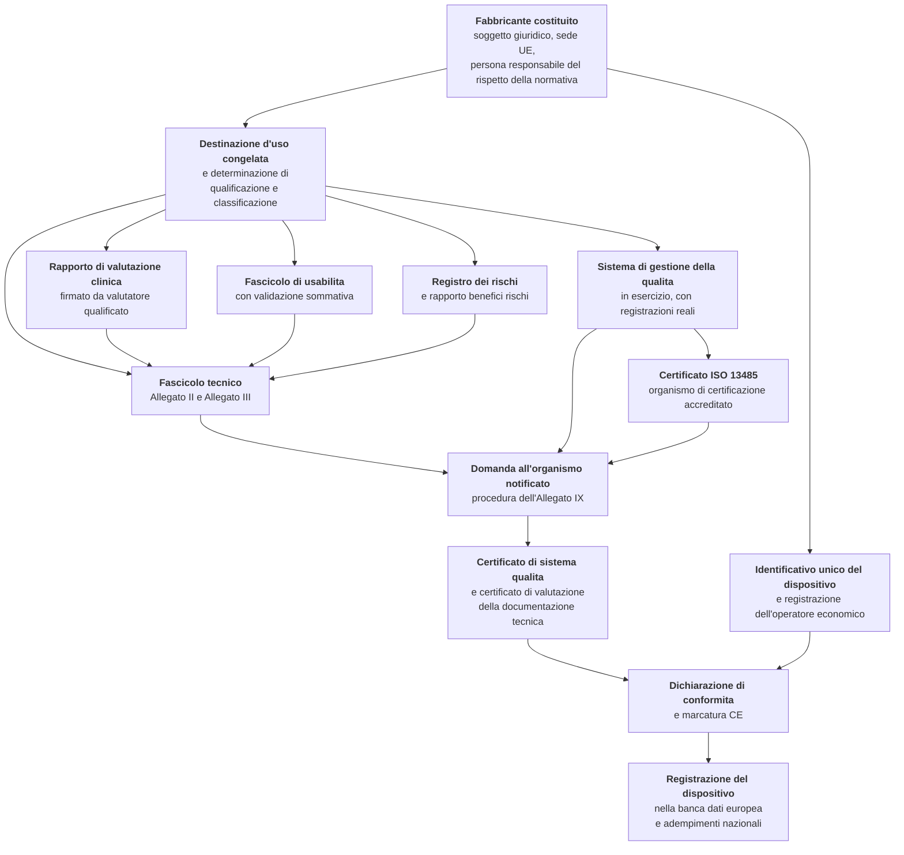
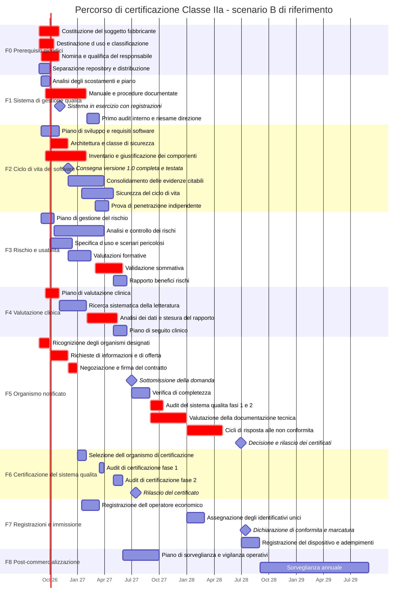

# Percorso e calendario

> **Avvertenza che governa l'intero capitolo, e va letta prima di ogni data.**
> **Questo è il calendario interno del progetto** (`D57`). Le date sono **pianificazione
> nostra**, non il percorso di un soggetto esterno e non un impegno verso alcuno.
>
> Una pianificazione interna, però, **non diventa una promessa solo perché è nostra**. Resta
> vietato — dal vincolo `V-171` e senza eccezioni — scrivere o lasciare intendere in qualunque
> luogo, documentazione, comunicazione pubblica o materiale di presentazione, **che il prodotto
> sarà marcato entro una data**. La distinzione non è formale: la destinazione d'uso di un
> dispositivo si ricava anche dal materiale pubblicato, quindi una data presentata come impegno
> produce un effetto regolatorio che una data presentata come pianificazione non produce.
>
> **Stato di fatto, invariato e da dichiarare ogni volta che serve.** Oggi il prodotto **non reca
> marcatura CE** e non è coperto da alcuna dichiarazione di conformità. Chi lo installa o lo
> immette sul mercato assume gli obblighi che ne derivano. `D57` ha cambiato **chi pianifica**,
> non che cosa il prodotto è oggi.
>
> **Il ruolo di fabbricante non è ancora costituito.** Diversi passi di questo calendario lo
> presuppongono formalmente — ingaggiare un organismo, firmare un rapporto di valutazione
> clinica, apporre la marcatura. La costituzione e la formalizzazione di quel ruolo è quindi
> essa stessa **un prerequisito interno con un proprio tempo**, ed è messa a calendario come
> tale invece di essere data per scontata o attribuita altrove.
>
> Il § 5 conserva una priorità che nessun altro paragrafo ha: le attività **retroattivamente
> irrecuperabili**, che vanno svolte ora perché la loro assenza renderebbe impossibile
> certificare in seguito — a noi come a chiunque.

## 1. Che cosa esattamente si deve ottenere

La determinazione di classificazione del progetto conclude per la **Classe IIa** riferita alla
destinazione d'uso dichiarata ([02](./02-qualificazione-e-classificazione.md)). Ne discende che il
traguardo non è un atto ma un **insieme di atti**, alcuni dei quali dipendono da soggetti terzi.

**Due cose che il diagramma rende visibili e che un elenco nasconde.**

La prima: **la destinazione d'uso è il nodo da cui dipendono quattro rami paralleli**. Cambiarla
dopo l'avvio non ritarda un ramo: li azzera tutti e quattro, perché il perimetro della ricerca
clinica, l'insieme dei pericoli, la specifica d'uso e la matrice dei requisiti generali sono tutti
scritti su di essa.

La seconda: **il certificato ISO 13485 e i certificati dell'organismo notificato non sono la
stessa cosa e non si sostituiscono**. Il regolamento richiede un sistema di gestione della qualità
conforme all'art. 10(9), che l'organismo notificato certifica ai sensi dell'Allegato IX; la
certificazione ISO 13485 è un atto distinto, rilasciato da un organismo di certificazione
accreditato, che `D12` rende obbligatoria per questo percorso. Quando lo stesso soggetto può
rilasciare entrambe, l'**audit combinato è la singola ottimizzazione più efficace dell'intero
percorso** (§ 8.3).

## 2. Il calcolo all'indietro dall'organismo notificato

Il fattore limitante **non è lo sviluppo del software**. È la disponibilità e la velocità
dell'organismo notificato, ed è un dato esterno su cui nessuna pianificazione incide.

| Dato | Valore |
|---|---|
| Tempo dall'accordo scritto al certificato — 51 % degli organismi | **13–18 mesi** |
| Idem — 31 % degli organismi | **19–24 mesi** |
| Valutazione «solo sistema qualità» | in prevalenza **6–12 mesi** |
| Valutazione «sistema qualità più prodotto», che è il caso qui | in prevalenza **13–18 mesi** |
| Tempo dal primo contatto alla firma del contratto | **meno di 2 mesi nel 66 % dei casi** |
| Divario fra domande e certificati emessi a fine 2025 | **25 978 domande contro 13 953 certificati** |
| Andamento dell'organico degli organismi 2024 → 2025 | **−8 %** personale interno, **−21 %** subappaltatori |

`[FONTI SECONDARIE]` — le cifre provengono da indagini di settore e da rilevazioni della
Commissione riportate nella ricerca del progetto; non sono state lette sulle pubblicazioni
originali e **non vanno citate come dati ufficiali** in un documento contrattuale.

**Lettura onesta di questi numeri, che è la parte utile.** Il divario fra domande e certificati non
si chiude prima del 2028 secondo la stessa analisi di settore, e l'organico degli organismi è in
contrazione per la prima volta in oltre un decennio. In questo mercato **un fabbricante nuovo, di
micro dimensione, con un dispositivo software alla prima certificazione, non è un cliente
prioritario**. Va messo in conto nella pianificazione e nella negoziazione, e ha una conseguenza
pratica immediata: la variabile più pericolosa dell'intero percorso — il **tempo di attesa prima
di essere accettati** — non è misurata da alcuna indagine pubblica e non è quindi stimabile
(§ 8.2).

**La conseguenza aritmetica.** Anche firmando un contratto entro dicembre 2026, il certificato non
arriva prima di gennaio 2028 nell'ipotesi più favorevole, e realisticamente fra giugno 2028 e
giugno 2029. È il fondamento di `D44`, e la ragione per cui la consegna della versione 1.0 al
30 novembre 2026 e la marcatura CE sono **due traguardi indipendenti** che non vanno mai
presentati come uno solo.

## 3. I tre scenari temporali

### 3.1 Scenario A — compresso

| Milestone | Data |
|---|---|
| Contratto con l'organismo firmato | 30 novembre 2026 |
| Fascicolo tecnico **completo** e sottomesso | 28 febbraio 2027 |
| Audit del sistema qualità, fasi 1 e 2 | maggio 2027 |
| Chiusura delle non conformità | settembre 2027 |
| Certificati e marcatura CE | dicembre 2027 |

**Condizioni di realizzabilità, tutte necessarie insieme:** richiesta di informazioni inviata agli
organismi entro settembre 2026; fascicolo *completo* — non «avviato» — a febbraio 2027, in
tensione diretta con la consegna del software di novembre 2026 e con la validazione sommativa di
usabilità; sistema qualità che ha già completato un ciclo di audit interno e riesame della
direzione entro aprile 2027; rapporto di valutazione clinica chiuso entro febbraio 2027; organismo
nel decile più veloce, senza non conformità maggiori.

**Probabilità bassa.** Va trattato come **obiettivo di tensione, non come piano**.

### 3.2 Scenario B — piano di riferimento

È lo scenario adottato da `D44`.

| Milestone | Data |
|---|---|
| Contratto con l'organismo firmato | **31 dicembre 2026** |
| Fascicolo tecnico completo e sottomesso | **30 giugno 2027** |
| Certificato ISO 13485 | luglio 2027 |
| Verifica di completezza superata | 31 agosto 2027 |
| Audit del sistema qualità in sito | settembre – ottobre 2027 |
| Valutazione della documentazione tecnica | settembre – dicembre 2027 |
| Cicli di risposta alle non conformità | gennaio – aprile 2028 |
| Certificati dell'Allegato IX | **giugno 2028** |
| Dichiarazione di conformità, marcatura CE, registrazione europea | **luglio – agosto 2028** |

Durata dalla firma del contratto al certificato: **diciotto mesi**, cioè il limite superiore della
fascia maggioritaria e non un'ipotesi pessimistica.

### 3.3 Scenario C — conservativo

Contratto a marzo 2027 — perché il fabbricante non è ancora costituito a dicembre 2026, oppure
perché i primi organismi contattati non accettano nuovi clienti — ventidue mesi di valutazione,
due cicli di non conformità maggiori sulla valutazione clinica: **certificati a gennaio 2029,
marcatura nel primo trimestre 2029**.

### 3.4 Il piano di riferimento in forma di calendario

### 3.5 I punti di decisione irreversibili

Sono le date oltre le quali una decisione non presa **non si recupera accelerando dopo**.

| Data | Decisione | Se non presa entro quella data |
|---|---|---|
| **30 settembre 2026** | Richiesta di informazioni inviata agli organismi | Lo scenario A decade automaticamente |
| **31 ottobre 2026** | **Destinazione d'uso congelata** | Il piano di valutazione clinica e il registro dei rischi ripartono da capo (§ 1) |
| **31 dicembre 2026** | Contratto con l'organismo firmato | Lo scenario B slitta al C |
| **31 marzo 2027** | Protocollo di validazione sommativa **approvato** | La sommativa non chiude entro giugno 2027 |
| **30 giugno 2027** | Fascicolo tecnico sottomesso | Ogni mese di ritardo è un mese sul certificato, **senza recupero** |

**La riga più insidiosa è la quarta**, perché sembra amministrativa. Il protocollo va approvato
*prima* dell'esecuzione: approvarlo dopo, o modificarlo alla luce dei primi risultati, invalida la
validazione ([06 §8](./06-usabilita-e-accessibilita.md)). Non è un ritardo di due settimane: è
un'attività di dodici-quattordici settimane da rifare.

## 4. La versione 1.0 e la marcatura sono due traguardi, non uno

Va detto esplicitamente perché è il fraintendimento più probabile di questo capitolo.

| | **Versione 1.0** | **Marcatura CE** |
|---|---|---|
| Data | **30 novembre 2026** (`D5`) | Milestone autonoma, scenario B: **luglio–agosto 2028** |
| Titolare | Il progetto | Un fabbricante, che oggi non esiste |
| Contenuto | Software completo, testato, documentato; fascicolo tecnico **avviato**; sistema qualità impostato | Certificati dell'organismo, dichiarazione di conformità, registrazione |
| Che cosa si può dire | «Non ancora marcato CE, **non utilizzabile per l'erogazione di prestazioni sanitarie su pazienti reali**» | — |

**Fino al rilascio dei certificati, nessun artefatto, messaggio, pagina o presentazione può
lasciare intendere che il prodotto sia marcato o utilizzabile su pazienti reali** (`D16`). La
destinazione d'uso si ricava anche dal materiale promozionale: un'affermazione commerciale non
allineata alla dichiarazione formale **modifica la destinazione d'uso**, e viene rilevata al primo
confronto fra il fascicolo e i canali pubblici. L'elenco delle formule vietate e delle loro
versioni ammissibili è al vincolo `V-171`.

## 5. Le attività retroattivamente irrecuperabili

Sono l'unico blocco del capitolo che **grava sul progetto oggi**, e la ragione per cui vi grava non
è di diligenza: è che la loro assenza renderebbe impossibile a **chiunque** certificare in
seguito. Sono le quattro attività di `D45`.

| # | Attività | Perché non si recupera | Costo dell'omissione |
|---|---|---|---|
| **1** | **Congelamento degli identificativi di requisito** `RF-*`, `RNF-*`, `BR-*` con registro | La tracciabilità di IEC 62304 lega requisito, architettura, unità e prova. Se gli identificativi cambiano, il legame **non si ricostruisce**: si ricostruisce solo a mano, a memoria, su un progetto che nel frattempo è cresciuto | La matrice di tracciabilità va ricompilata a mano, e una matrice compilata a mano è, a distanza di sei mesi, un **documento falso** |
| **2** | **Inventario dei componenti di terze parti e distinta dei materiali generata dalla prima catena di costruzione** | Censire i componenti a posteriori su un progetto maturo significa ricostruire quali versioni erano presenti in quali rilasci passati, e quel dato **non esiste** se non è stato prodotto allora | Da tre a cinque volte il costo, con esito incompleto |
| **3** | **Controllo dei documenti prima di produrre altri documenti** | Un documento prodotto fuori dal controllo documentale **va riemesso**: non basta approvarlo dopo, perché mancano identificativo, revisione, approvazione e storia delle modifiche | Riemissione integrale di tutto ciò che è stato prodotto prima |
| **4** | **Separazione fra repository e distribuzione, con dichiarazione pubblicata** | Ogni giorno in cui il repository è accessibile senza la dichiarazione è un giorno in cui esiste materiale pubblico che può essere letto come immissione sul mercato. **Il passato non si ripulisce** | Rischio di affermazione non lecita sull'intero periodo trascorso, e prova documentale a favore di chi contesta |

**Un'ammissione che va fatta invece di essere aggirata.** L'attività 3 è **già stata violata di
fatto**: questa documentazione è stata prodotta prima che esistesse un controllo documentale, e
non è un documento controllato. La conseguenza è già dichiarata dal vincolo `V-174`
([03 §4](./03-sistema-di-gestione-della-qualita.md)): **nessun capitolo di questa documentazione è
una procedura del sistema di gestione della qualità**, e nessuno può essere presentato come tale.
I capitoli sono **ingressi**: contengono l'analisi da cui una procedura si scrive, non la
procedura. La regola perché quegli ingressi restino utilizzabili è al § 7.2.

Le altre attività dei primi trenta giorni — costituzione del fabbricante, nomina del responsabile
del rispetto della normativa, richieste di informazioni agli organismi, avvio del piano di
valutazione clinica — **gravano su chi intende certificare**, e il progetto le documenta come
manuale operativo senza assumerle.

## 6. La sequenza minima per non pregiudicare nulla

L'ordine non è arbitrario: ogni passo è prerequisito del successivo, e invertirne due produce
lavoro da rifare.

**Perché quest'ordine e non un altro.**

1. **La dichiarazione va per prima** perché è l'unica misura la cui assenza produce danno
   *mentre* si lavora, e non al momento della certificazione. È anche l'unica che si realizza in
   un pomeriggio.
2. **Il controllo dei documenti precede la produzione di documenti** per la ragione tautologica del
   § 5: ciò che nasce fuori controllo va riemesso. Rimandarlo di un mese significa riemettere un
   mese di lavoro.
3. **Gli identificativi si congelano prima dell'inventario** perché l'inventario dei componenti si
   collega ai requisiti che ciascun componente realizza, e collegarsi a identificativi che
   cambieranno è lavoro sprecato.
4. **L'inventario precede la destinazione d'uso** solo per ragioni di attraversamento: si genera
   dalla prima catena di costruzione e non richiede decisioni, quindi non ha motivo di attendere.
5. **La destinazione d'uso viene dopo** perché richiede una revisione esterna e una decisione del
   committente, che è il passaggio più lento, e perché tutto ciò che la segue le è subordinato.

**Ciò che questa sequenza garantisce, e ciò che non garantisce.** Garantisce che nessuna delle
quattro attività irrecuperabili resti pregiudicata, cioè che chi vorrà certificare **possa
farlo**. Non garantisce alcuna data di certificazione, che dipende interamente dal § 2 e da
soggetti che il progetto non controlla.

## 7. La ripartizione di responsabilità

### 7.1 Che cosa il progetto svolge oggi e che cosa presuppone il ruolo di fabbricante

| Ambito | Il progetto, oggi | Presuppone il ruolo di fabbricante (da costituire) |
|---|---|---|
| Codice sorgente, architettura, prove, catena di costruzione | **Integrale** | Verifica sulla propria distribuzione |
| Documentazione di ciclo di vita del software | **Integrale**, come ingresso | Adotta sotto il proprio controllo documentale |
| Registro dei rischi | Identificazione, misure, verifica; proposta di stima | **Determina l'accettabilità e firma** |
| Fascicolo di usabilità | Bozza integrale, valutazioni formative | Approva il protocollo, conduce la sommativa, firma |
| Valutazione clinica | Bozza tecnica, dossier dello stato dell'arte, evidenza tecnica citabile | **Redige, valuta e firma il rapporto** |
| Fascicolo tecnico | Ingressi per la maggior parte delle sezioni | **Compone, mantiene e risponde** |
| Sistema di gestione della qualità | Pratiche di ingegneria conformi, evidenze generate | **Istituisce, certifica, esercita** |
| Organismo notificato | Prepara la documentazione richiesta | **Selezione, contratto e risposta ai quesiti** |
| Marcatura CE e dichiarazione di conformità | — | **Atto esclusivo del fabbricante**, non anticipabile né sostituibile |
| Sorveglianza e vigilanza | Capacità di prodotto e canale a monte | **Titolare degli obblighi** ([08 §8](./08-sorveglianza-post-commercializzazione.md)) |
| Responsabilità verso il paziente danneggiato | Nessuna assunta oggi; **non escludibile per contratto** se mai sorgesse | Del fabbricante e dell'operatore economico |

### 7.2 Come gli artefatti entrano nel sistema di gestione della qualità

> **`V-179`.** Gli artefatti prodotti dal progetto entrano nel sistema di gestione della qualità di
> un sistema di gestione della qualità come **ingressi identificati**, mai come documenti
> controllati: chi li acquisisce
> li **riemette sotto il proprio controllo documentale**, con proprio identificativo, propria
> revisione e propria approvazione. Perché la riemissione sia possibile e tracciabile, il progetto
> garantisce che ogni artefatto destinato al pacchetto regolatorio porti **versione, data e
> impronta di integrità verificabile**, e che l'impronta sia risolvibile a partire dal materiale
> pubblico del progetto. Un artefatto acquisito senza queste tre proprietà è un artefatto che il
> fabbricante **non può giustificare** in sede di audit, perché non può dimostrare che cosa
> esattamente abbia acquisito e quando.

È il complemento operativo di `V-174` e la ragione tecnica per cui i due vincoli esistono
insieme: il primo dice che questi capitoli **non sono** procedure, il secondo dice che cosa
occorre perché possano diventare l'ingresso di una procedura altrui.

### 7.3 I rischi che si trasferiscono a chi integra, e vanno formalizzati

Alcune righe del registro dei rischi hanno gravità elevata e **misure di controllo che stanno a
monte del prodotto**: non sono realizzabili dentro Telemedic perché dipendono dalla configurazione
dell'installazione, dall'infrastruttura di identità o dall'organizzazione del servizio. Sono
trasferimenti di rischio, non eliminazioni, e un trasferimento non formalizzato è un rischio di
nessuno.

| Categoria | Esempio | Forma della formalizzazione |
|---|---|---|
| **Controlli di configurazione a monte** | I difetti del prodotto di federazione trattati come rischi di prodotto (`RM-17`) richiedono controlli di configurazione che il deployer applica | Requisiti dell'ambiente operativo nelle istruzioni per l'uso, con **prove negative** che il deployer esegue |
| **Obblighi organizzativi** | La copertura oraria dichiarata è una misura di controllo del rischio informativa, e dipende da chi presidia il servizio | Clausola contrattuale con dichiarazione della copertura effettivamente presidiata |
| **Obblighi di segnalazione** | Il fabbricante deve conoscere gli incidenti entro un termine **inferiore** a quelli dell'art. 87 | Clausola contrattuale con termine e canale ([08 §8.2](./08-sorveglianza-post-commercializzazione.md)) |
| **Ripartizione dei ruoli** | Titolare del trattamento, fabbricante, fornitore di servizi in rete, soggetto obbligato alla sicurezza delle reti possono essere quattro soggetti distinti | Tabella di ripartizione confermata in [01 §10](./01-inquadramento-normativo.md), da assegnare **nominativamente** nel contratto |

**La regola che vale per tutte e quattro le righe.** Una responsabilità condivisa e non presidiata
è una responsabilità di nessuno: va assegnata a un soggetto nominato nel contratto, non descritta
in una pagina di documentazione. La documentazione rende la clausola scrivibile; non la
sostituisce.

## 8. Tempi non comprimibili e struttura del costo

### 8.1 Sette attività che non si riducono aggiungendo risorse

È l'elenco da tenere davanti quando si valuta una proposta di compressione del piano.

| Attività | Tempo minimo | Perché non si comprime |
|---|---|---|
| Costituzione del soggetto fabbricante | 3–8 settimane | Prerequisito interno: dipende da procedimenti amministrativi esterni, non da capacità di lavoro |
| Esercizio del sistema qualità prima dell'audit di certificazione | **≥ 4 mesi**, preferibilmente 6 | Servono **registrazioni reali** di un ciclo completo: non si producono a posteriori |
| Ricerca sistematica della letteratura | 12–14 settimane | Sequenza seriale con doppia selezione |
| Rapporto di valutazione clinica | 12–14 settimane | Dipende dalla ricerca e dalle evidenze di verifica |
| Reclutamento dei partecipanti alla validazione sommativa | 6–10 settimane | Popolazione difficile da reclutare, consensi da raccogliere |
| Valutazione della documentazione tecnica | 12–18 settimane | **Non dipende dal fabbricante** |
| Cicli di risposta alle non conformità | 2–4 cicli × 6–10 settimane | Ogni ciclo ha una coda dell'organismo |

**Somma delle sole attività a monte della sottomissione, dove la sequenza è obbligata: circa dieci
mesi.** È la ragione aritmetica per cui lo scenario A è un obiettivo di tensione — non perché
manchi la volontà, ma perché richiederebbe che sei attività non comprimibili si svolgessero
contemporaneamente senza dipendenze, e le dipendenze esistono.

### 8.2 Che cosa è stimabile e che cosa no

Il progetto adotta una regola: **non si stima ciò che ha una fonte pubblica primaria**, e non si
stima ciò che dipende da variabili non note.

**Blocco A — si legge, non si stima.** Le tariffe dell'organismo notificato sono oggetto di un
**obbligo di pubblicazione** dell'Allegato VII, sezione 1.2.8, con l'elenco dei collegamenti
mantenuto dalla Commissione. Il numero di giornate dell'audit di certificazione del sistema
qualità si calcola con tabelle pubbliche, e l'organismo è tenuto a esplicitare il calcolo
nell'offerta. Diritti e oneri di costituzione del soggetto giuridico sono tariffe pubbliche.
`[NV]` — nessun listino è stato letto in questa documentazione, e **il progetto non stima le
tariffe: rinvia alla fonte primaria**.

**Blocco B — ordine di grandezza, da confermare con preventivo.** Sono esclusivamente prestazioni
professionali: consulenza regolatoria, redazione delle procedure, audit interno commissionato,
conduzione delle valutazioni di usabilità, redazione clinica, prova di penetrazione indipendente.
Per ciascuna la variabile dominante **non è la tariffa oraria ma la quantità di lavoro**, che
dipende da quanto materiale il progetto porta già pronto — ed è la ragione economica, oltre che
regolatoria, dei §§ 5 e 7.

**Blocco C — non stimabile, e va detto invece di inventare un numero.**

| Voce | Perché non è stimabile |
|---|---|
| **Cicli di risposta alle non conformità** | Due cicli o quattro sono la stessa pianificazione con costi diversi di un fattore due |
| **Rilavorazione dopo la validazione sommativa** | Un errore d'uso grave può richiedere una riprogettazione e una nuova validazione parziale |
| **Accesso alla documentazione per l'equivalenza** | Trattativa con un terzo che non ha interesse a concederla ([07 §6](./07-valutazione-clinica.md)) |
| **Tempo di attesa prima di essere accettati** da un organismo | Non è misurato da alcuna indagine pubblica: è la variabile più pericolosa dell'intero percorso |
| **Copertura assicurativa** per responsabilità da prodotto | Premio determinato dal profilo di rischio e dal volume, per un dispositivo che non ha ancora né l'uno né l'altro |
| **Modifiche sostanziali ricorrenti** | Dipende da quante modifiche ricadranno nel terzo regime di [08 §7](./08-sorveglianza-post-commercializzazione.md) |

**Il modo corretto di trattare il blocco C è metterlo a bilancio come riserva dichiarata**, non
ometterlo. Un piano economico privo di riserva per i cicli di non conformità è un piano che assume
l'esito migliore come esito atteso.

### 8.3 Cinque regole per chiedere i preventivi

1. **Chiedere il calcolo, non il prezzo**: le giornate previste per ciascuna attività e il metodo
   con cui sono calcolate, con riferimento alla tariffa pubblicata.
2. **Chiedere impegni sui tempi delle singole fasi** — verifica di completezza, primo ciclo di
   quesiti, tempo di risposta alle repliche — e i rimedi in caso di scostamento. Un'offerta priva
   di impegni sui tempi è un'offerta su un solo asse.
3. **Chiedere un riesame preliminare a pagamento**, quando offerto: riduce i cicli di non
   conformità, che sono la voce non stimabile più pesante.
4. **Chiedere l'audit combinato** sistema qualità certificato e valutazione dell'organismo, quando
   lo stesso soggetto può rilasciare entrambi: è la singola ottimizzazione più efficace.
5. **Confrontare il totale, non la tariffa.** L'organismo più economico per giornata può essere il
   più costoso in totale se genera più cicli o ha code più lunghe. Confrontare le tariffe orarie è
   **fuorviante**, e va detto a chi lo propone.

### 8.4 I costi non finiscono con il certificato

L'errore di pianificazione economica più comune è trattare la marcatura come una spesa in conto
capitale. Apre invece un **flusso ricorrente** che dura quanto il prodotto: audit di sorveglianza
almeno annuale, audit senza preavviso non pianificabili ma da mettere a bilancio, sorveglianza e
rinnovo del certificato del sistema qualità, canone di mantenimento, rinnovo del certificato
dell'organismo alla scadenza, aggiornamento del rapporto periodico sulla sicurezza almeno ogni due
anni, aggiornamento della valutazione clinica e del seguito, disponibilità permanente del
responsabile del rispetto della normativa, sorveglianza dei componenti di terze parti, copertura
assicurativa.

**La riga strutturalmente più pesante è la valutazione delle modifiche**, perché è l'unica il cui
costo **cresce con l'attività di sviluppo**: più il prodotto è vivo, più genera valutazioni. È la
ragione economica, oltre che regolatoria, del modello a due velocità di
[08 §7](./08-sorveglianza-post-commercializzazione.md).

## 9. Le figure, e quali devono essere permanentemente disponibili

La domanda utile non è quante persone servono, ma **quali competenze devono essere permanentemente
disponibili e quali si acquistano a progetto**: è la disponibilità permanente a costare.

| Profilo | Quando serve | Interno o esterno |
|---|---|---|
| **Fabbricante** | Dal giorno zero | Interno per definizione |
| **Responsabile del rispetto della normativa** | Prima del contatto con l'organismo | Interno o esterno, con i vincoli del § 9.1 |
| **Consulente di affari regolatori** | Prerequisiti e poi continuativo a intensità variabile | Esterno, quasi sempre |
| **Responsabile qualità** | Da subito, continuativo | **Permanentemente disponibile**; la redazione iniziale si può appaltare |
| **Responsabile tecnico** | Continuativo | Interno |
| **Specialista di fattori umani** | Da ottobre a giugno, a intensità variabile | Esterno, con conduzione della sommativa appaltata |
| **Redattore clinico** | Da settembre a giugno | Esterno, con **qualifica documentabile** |
| **Specialista di sicurezza** | Continuativo per la sorveglianza, concentrato per il ciclo di vita | Misto; la prova di penetrazione **necessariamente indipendente** |

**Due avvertenze di indipendenza con effetti organizzativi immediati.** L'**audit interno non può
essere condotto da chi ha eseguito l'attività auditata**: in una struttura piccola significa, in
pratica, commissionarlo all'esterno, e non è un lusso ma una condizione di superabilità della
seconda fase. La **prova di penetrazione deve essere indipendente** da chi ha scritto il codice:
non tanto per requisito formale quanto per credibilità dell'evidenza — un rapporto prodotto
internamente, per un valutatore, non è un rapporto.

### 9.1 Il responsabile del rispetto della normativa

L'**art. 15** impone al fabbricante di disporre di almeno una persona con **competenza
specialistica** in materia di dispositivi medici, dimostrata in via alternativa da: un titolo
universitario in giurisprudenza, medicina, farmacia, ingegneria o altra disciplina scientifica
pertinente **più almeno un anno** di esperienza professionale in materia di regolamentazione o di
sistemi di gestione della qualità relativi ai dispositivi medici; **oppure quattro anni** di tale
esperienza.

**La deroga che rende praticabile il percorso per una struttura piccola.** Le **micro e piccole
imprese** non sono tenute ad avere la persona all'interno della propria organizzazione, ma devono
averla **permanentemente e continuamente a disposizione**. Sono due implicazioni: la disponibilità
va **contrattualizzata** e verificabile, e la formula esclude il rapporto occasionale a chiamata.

`[NV]` — i requisiti di qualifica e la deroga sono verificati nella sostanza; la corrispondenza con
i numeri di paragrafo dell'art. 15 va confermata sul testo consolidato.

**Le responsabilità dell'articolo** — verifica della conformità prima del rilascio, redazione e
aggiornamento della documentazione tecnica e della dichiarazione di conformità, adempimento degli
obblighi di sorveglianza e di segnalazione — **rendono questa persona il punto di compressione
dell'intero processo**. Il regolamento stabilisce inoltre che essa non subisca svantaggi
nell'organizzazione per il corretto adempimento dei propri compiti: è una tutela di indipendenza,
e ha senso solo se la persona ha autonomia reale rispetto a chi ha interesse a rilasciare.

**Avvertenza sulla reperibilità.** Le persone in possesso della qualifica sono **una risorsa
scarsa**, e la deroga per le piccole imprese ne aumenta la domanda perché consente a molte
strutture di attingere allo stesso mercato esterno. È il motivo per cui l'identificazione del
candidato appartiene ai primi trenta giorni e non alla fase di ingaggio dell'organismo.

## 10. Che cosa questo capitolo lascia aperto

| Riferimento | Questione | A chi |
|---|---|---|
| `Q-179` | **Se e come pubblicare questo calendario.** Il capitolo contiene date di certificazione riferite a un percorso di terzi. Pubblicarle senza un'avvertenza collocata **sopra** e non sotto è il modo più rapido di produrre esattamente l'affermazione vietata da `V-171`, cioè che il prodotto sarà marcato entro una data. Serve la decisione sulla forma di pubblicazione e sulla sua avvertenza, coerente con `Q-170` e `Q-174` | → Committente |
| `Q-144` | La destinazione d'uso non è congelata: è il primo punto di decisione irreversibile del § 3.5 e il nodo da cui dipendono quattro rami (§ 1) | → Committente |
| `[FONTI SECONDARIE]` | Tutte le cifre del § 2 provengono da indagini di settore non lette sulle pubblicazioni originali: non vanno citate come dati ufficiali | Conformità |
| `[NV]` | Numerazione dei paragrafi dell'art. 15; obbligo di pubblicazione delle tariffe e collegamento all'elenco mantenuto dalla Commissione (§§ 8.2, 9.1) | Conformità |
| — | **Nessuna delle date di questo capitolo è un impegno del progetto.** Il progetto ha una sola colonna nel calendario, ed è il § 5 | — |
