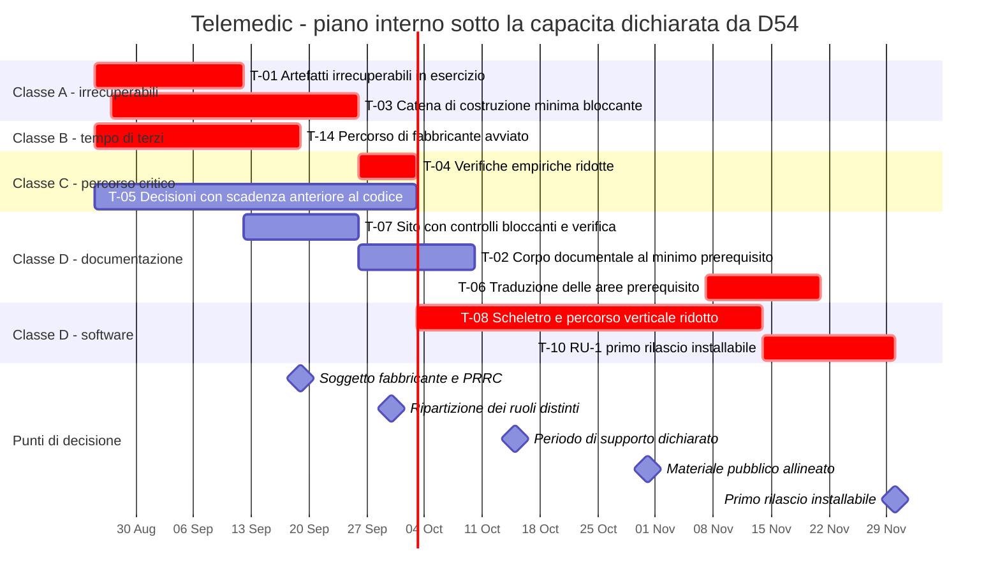

# Traguardi

## 0. Come si legge questo capitolo

Ogni traguardo ha la stessa forma, e le voci non sono decorative.

> **`T-nn` - Titolo** · *classe di attività* · *classe di enunciato* · *data*
> **Obiettivo** - che cosa esiste al termine che non esisteva prima.
> **Innesco** - l'evento al verificarsi del quale il traguardo comincia. Non «quando c'è tempo».
> **Titolare** - chi ha l'autorità di portarlo a termine. Dove non esiste, si scrive che non
> esiste.
> **Criteri di completamento** - enunciati **binari**, accertabili da chiunque con la procedura
> descritta. Nessuna percentuale, nessun avverbio.
> **Dipendenze** - che cosa deve essere vero prima.
> **Che cosa non comprende** - l'elenco è parte del traguardo, non un'appendice.
> **Rischi** - rinvio al registro di [05](./05-rischi-e-dipendenze.md).

**Le classi di attività** (`A` retroattivamente irrecuperabile, `B` a tempo di attraversamento
determinato da terzi, `C` sul percorso critico altrui, `D` comprimibile) sono definite in
[01 §2](./01-principi-e-metodo.md). **Le classi di enunciato** (`[IMPEGNO]`, `[INTENZIONE]`,
`[IPOTESI]`) sono definite in [00 §2](./00-indice.md).

> **Avvertenza sulle date, e su che cosa esse sono.** Le date di questo capitolo **non sono
> stime**: sono **allocazioni del calendario residuo** a una sequenza vincolata, sotto la
> capacità dichiarata da `D54` - un contributore unico a tempo parziale - e quantificata da `D62`
> in **dieci-venti ore a settimana**. La quantificazione rende l'aritmetica verificabile, ma non
> trasforma le allocazioni in stime: mancano ancora la cronologia di consegna su cui calibrare e
> un'unità che attraversi lavori eterogenei. Ciò che protegge la data del 30 novembre 2026 non è
> quindi una previsione di sforzo: è **l'ordine di sacrificio dell'ambito**, dichiarato in
> anticipo in [03 §6](./03-primo-rilascio-utilizzabile.md) ed eseguito dall'alto quando
> un'allocazione si rivela insufficiente ([01 §10](./01-principi-e-metodo.md), vincolo `V-282`).

> **Avvertenza sull'attribuzione.** Questa è la **pianificazione interna del progetto** (`D57`).
> Nessun traguardo è attribuito a «terzi» o a «chi certifica». Dove un passo presuppone
> formalmente il ruolo di fabbricante, il ruolo **va costituito e formalizzato** (`D58`), ed è
> esso stesso un traguardo con un proprio tempo. **Nessuna data di questo capitolo è una promessa
> di esito**: in particolare, in nessun punto si scrive che il prodotto sarà marcato entro una
> data (`V-171`, `V-280`). Oggi il prodotto **non reca marcatura CE**, non è coperto da alcuna
> dichiarazione di conformità, e chi lo installa, integra o mette in servizio assume comunque gli
> obblighi che ne derivano.

---

## 1. Il punto di partenza, misurato

La fotografia al 25 agosto 2026 è in [00 §4](./00-indice.md) e non si ripete. Ne servono qui
quattro righe, perché sono quelle da cui la sequenza discende per necessità e non per scelta.

1. **Il corpo documentale è quasi completo**: le nove aree sono scritte, comprese panoramica,
   conformità e roadmap; della guida dei fondamenti mancano due moduli su ventuno, il glossario e
   le fonti primarie.
2. **Il sito di documentazione è costruito e pubblicato**, in italiano e in inglese, e i flussi
   di verifica automatica esistono per terminologie sotto licenza, conformità redazionale,
   ricerca di segreti e distinta dei materiali del sito.
3. **La versione inglese dei documenti non esiste**: è tradotto l'involucro del sito, non il
   contenuto. `D50` la vuole integrale; `D56` stabilisce che si produce **area per area, in
   parallelo allo sviluppo**, e non più prima di esso.
4. **Non esiste una riga di codice applicativo**, né una catena di costruzione per esso.

Restano **novantasette giorni** e la capacità è quella dichiarata da `D54`. Il §2 spiega che cosa
questo comporta, e il §4 dice a quale prezzo il traguardo del 30 novembre resta in piedi.

---

## 2. La decisione del committente, e che cosa ne discende

### 2.1 Le tre decisioni che determinano questo capitolo

| # | Decisione | Effetto su questo capitolo |
|---|---|---|
| **`D53`** | Il **30 novembre 2026 resta il primo rilascio installabile**. La decisione è presa dopo che l'orchestrazione aveva esposto la tensione e raccomandato l'alternativa. Chiude `Q-180` | La data è **fissa** e non si negozia in questo documento |
| **`D54`** | Capacità dichiarata: **contributore unico, a tempo parziale**. Chiude `Q-181` | La capacità è **fissa** e non si aumenta in questo documento |
| **`D56`** | Traduzione **assistita, area per area**, con controllo di divergenza. **Emenda `D52`**: la traduzione integrale non è più prerequisito di ogni riga di codice | La sequenza «tutta la documentazione, poi il sito, poi il codice» **decade**. Restano prerequisiti non negoziabili le avvertenze pubbliche, la guida dei fondamenti e le aree di conformità e sicurezza |

### 2.2 L'unica variabile libera è l'ambito

Un piano lega tre grandezze: data, capacità, ambito. `D53` fissa la prima, `D54` la seconda.
**La terza si determina di conseguenza, e non c'è una terza via.**

> Un ambito non ridotto sotto queste due decisioni non produce più lavoro: produce **una data
> mancata in pubblico**. È l'unico esito peggiore di un ambito ridotto, perché la data mancata
> costa la credibilità di tutte le date successive, mentre l'ambito ridotto costa esattamente ciò
> che è stato tolto - e ciò che è stato tolto è scritto.

Ne discende la struttura di quest'area dopo `D53`: il capitolo
[03](./03-primo-rilascio-utilizzabile.md) contiene, al §5, l'elenco di **che cosa è stato tagliato
per rispettare la data**, con per ogni voce se il taglio è recuperabile e che cosa comporta per
chi installa; e al §6 **l'ordine in cui si taglia ancora**, se ancora servisse. Le due sezioni
sono la parte di questa roadmap che ha più valore per chi deve decidere se adottare il prodotto,
e sono la conseguenza diretta di `D53`.

### 2.3 Che cosa `D54` toglie che le ore non restituiscono

Va detto qui perché determina la forma dei traguardi che seguono, e non solo la loro durata.
Alcune registrazioni richieste dal sistema di gestione della qualità **presuppongono soggetti
distinti**: audit interno, riesame del rilascio, verifica di configurazione eseguita da chi non ha
scritto il codice, revisione esterna indipendente del codice di sicurezza critico (`D18`).

**Non sono producibili internamente, e non per mancanza di ore** ([01 §9-bis](./01-principi-e-metodo.md)).
Ne discende il vincolo `V-281`: **non entrano nel piano come attività**, perché pianificare
un'attività non producibile è il modo più efficace di farla sparire dalla vista. Entrano come
**lacune dichiarate con la data in cui nascono**, sono elencate fra i tagli irreversibili di
[03 §5](./03-primo-rilascio-utilizzabile.md), e la loro ripartizione - quale sottoinsieme si
accetta come lacuna e quale si copre acquisendo la funzione all'esterno - è decisione del
committente e resta aperta come `Q-189`.

### 2.4 Che cosa `D58` aggiunge, e perché va davanti e non in fondo

`D58` attribuisce al progetto il ruolo di fabbricante, ancora da costituire, e con esso le
attività che `D45` attribuiva a un soggetto esterno: costituzione del soggetto, nomina della
persona responsabile del rispetto della normativa, richieste di informazioni agli organismi
notificati, avvio del piano di valutazione clinica.

Sono di **classe `B`**: **poche ore e molti mesi**. È l'unico blocco di lavoro che `D54` non
penalizza, ed è quello il cui rinvio si trasferisce integralmente in fondo alla catena. Sta quindi
nella prima parte del calendario, come traguardo `T-14`, e non dopo il primo rilascio.

---

## 3. I traguardi fino al 30 novembre 2026

### `T-01` - Artefatti retroattivamente irrecuperabili in esercizio
*Classe `A`* · `[IMPEGNO]` · **12 settembre 2026**
**Innesco.** Immediato: nessuna dipendenza, e il costo di ometterlo cresce ogni giorno.
**Titolare.** Contributore unico, per la produzione. Committente per l'approvazione della
procedura.

**Obiettivo.** Rendere effettive, e non soltanto dichiarate, le attività che `D45` qualifica come
non recuperabili a posteriori. Al termine, la loro assenza non è più una lacuna che cresce ogni
giorno. **È il primo traguardo e non si sposta**: sotto `D54` la capacità piccola non rinvia le
attività di classe `A`, le rende più urgenti, perché il costo di ometterle non si paga in ritardo
ma in impossibilità.

**Criteri di completamento.**

1. Esiste una **procedura di controllo dei documenti** approvata, con: elenco dei documenti
   sottoposti a controllo, regola di identificazione e di versione, revisori nominati per
   categoria, forma dell'approvazione, regola di ritiro. La procedura è versionata nel repository
   ed è essa stessa sotto controllo.
2. La procedura dichiara **come la corrispondenza fra revisione, revisore e approvazione
   costituisce la registrazione di approvazione** nel modello «documenti come codice», ed elenca
   gli strumenti su cui si appoggia in vista della loro validazione. **Dichiara inoltre, in modo
   esplicito e non in nota, che sotto `D54` redattore e approvatore coincidono**, e che questa è
   una **lacuna dichiarata** e non una conformità: è la prima voce di `Q-189`.
3. Esiste il **registro degli identificativi di requisito** (`RF-*`, `RNF-*`, `BR-*`, `ATT-*`,
   `UC-*`, `OUT-*`, `EX-*`, `DM-*`), in **sola aggiunta**, con lo stato di ciascun identificativo
   (in vigore / ritirato) e il divieto esplicito di riuso di un identificativo ritirato.
4. Il registro è **leggibile da macchina** e ha un formato dichiarato, perché la verifica
   automatica del criterio 5 vi si appoggia.
5. Esiste il **controllo di costruzione** che fa fallire la costruzione quando una prova cita un
   identificativo assente dal registro. Il controllo è provato con un caso deliberatamente errato
   che deve far fallire.
6. Il repository pubblico contiene, e ha contenuto senza interruzione, la dichiarazione di non
   essere un dispositivo medico e la politica di distribuzione. **Già soddisfatto** al 25 agosto
   2026.
7. Esiste il **controllo di pubblicazione** che impedisce la pubblicazione di un artefatto privo
   della dichiarazione di non marcatura. Provato con un artefatto deliberatamente privo, che non
   deve essere pubblicabile.
8. Le **avvertenze pubbliche sono riallineate a `D58`**: dichiarano che il ruolo di fabbricante
   sarà assunto dal progetto e che il soggetto **è ancora da costituire**, **senza attenuare
   alcuna avvertenza esistente** - resta scritto con la stessa evidenza di prima che oggi il
   prodotto non reca marcatura CE, che non è coperto da alcuna dichiarazione di conformità e che
   chi installa o mette in servizio assume comunque gli obblighi che ne derivano. Il testo **non
   contiene alcuna data di marcatura** (`V-171`, `V-280`). Vale per la dichiarazione di non
   dispositivo medico, per la politica di distribuzione e per il richiamo in evidenza del
   documento di presentazione del repository, **in entrambe le lingue**.

**Dipendenze.** Nessuna interna. I criteri 5 e 7 sono controlli di pipeline e precedono
l'esistenza della pipeline completa di `T-03`: sono i primi due controlli che essa riceve.

**Che cosa non comprende.** Non comprende la validazione formale degli strumenti del sistema di
gestione della qualità. **Non comprende la riemissione dei documenti già prodotti fuori
controllo**: sotto `D54` non è eseguibile entro il 30 novembre 2026 ed è **dichiarata come
lacuna** ([01 §8.3](./01-principi-e-metodo.md)), con la nota che il volume da riemettere cresce
ogni giorno.

**Rischi.** `R-02` (registrazioni a ruoli distinti), `R-04` (questioni che convergono sull'area di
conformità), `R-17` (decisioni non prese), `R-28` (data ravvicinata con capacità dichiarata bassa).

---

### `T-14` - Percorso di fabbricante avviato
*Classe `B`* · `[IMPEGNO]` · **19 settembre 2026**
**Innesco.** Immediato, all'entrata in vigore di `D58`. Ogni settimana di ritardo si trasferisce
integralmente in fondo alla catena.
**Titolare.** Committente. Il contributore unico esegue le attività materiali; la costituzione del
soggetto e la nomina non sono sue.

**Obiettivo.** Avviare le quattro attività di classe `B` che `D58` attribuisce al progetto. Il
traguardo è sull'**avvio**, non sul completamento, e la distinzione è deliberata: l'avvio dipende
da noi ed è databile, il completamento dipende da procedimenti amministrativi e da code altrui e
**non è stimabile dal progetto**.

**Criteri di completamento.**

1. È **scelta e registrata la forma giuridica** del soggetto che assumerà il ruolo di fabbricante,
   ed è avviata la pratica di costituzione, con la data di avvio registrata.
2. È **definito il profilo** della persona responsabile del rispetto della normativa - requisiti
   di qualifica ed esperienza, regime di disponibilità permanente, ammissibilità della figura
   esterna nel regime delle micro e piccole imprese - ed è avviata la ricerca, con la data della
   prima richiesta registrata.
3. È **inviata la richiesta di informazioni** a ciascun organismo notificato designato per la
   categoria di dispositivo pertinente secondo l'elenco pubblicato nella banca dati europea, con
   la data di invio registrata per ciascuno e con il testo della richiesta versionato nel
   repository. La richiesta chiede **il calcolo e non il prezzo**, e chiede impegni sui tempi
   delle singole fasi.
4. Esiste la **bozza del piano di valutazione clinica**, con dichiarato il fabbisogno di
   competenza clinica documentabile che il progetto **non possiede internamente** e la forma con
   cui intende acquisirlo.
5. Nessuno dei documenti prodotti da questo traguardo contiene una data entro cui il prodotto sarà
   marcato. **La verifica è testuale ed è parte del traguardo.**

**Dipendenze.** Nessuna interna. Il criterio 3 può precedere il criterio 1: una richiesta di
informazioni si invia prima che il soggetto esista, e **conviene farlo**, perché la coda è il
vincolo effettivo. Il **contratto**, invece, richiede il soggetto costituito, ed è la ragione per
cui il criterio 1 non è rinviabile.

**Che cosa non comprende.** Non comprende la firma di alcun contratto, la sottomissione di alcun
fascicolo, l'esecuzione della valutazione clinica né l'apposizione di alcuna marcatura. Le date di
quelle attività sono in §5 e sono **pianificazione interna, non promesse**.

**Rischi.** `R-06` (tempi degli organismi notificati), `R-22` (figure specialistiche scarse),
`R-30` (ruolo di fabbricante non ancora costituito).

---

### `T-03` - Catena di costruzione minima bloccante, con distinta generata
*Classe `A`* · `[IMPEGNO]` · **26 settembre 2026**
**Innesco.** Chiusura dei criteri 3 e 4 di `T-01`, che le forniscono il registro su cui appoggiare
il primo controllo.
**Titolare.** Contributore unico.

**Obiettivo.** Esistere come catena di costruzione **prima** di esistere come software. È la
traduzione operativa del vincolo `V-182` e della prescrizione di `D45` secondo cui la distinta dei
materiali si genera dalla prima pipeline.

**La riduzione rispetto alla versione precedente di questo traguardo, dichiarata.** La versione
precedente chiedeva che **tutti** i controlli obbligatori bloccassero al primo giorno. Sotto `D54`
questo traguardo si riduce a un **sottoinsieme bloccante dichiarato**, e i restanti controlli
esistono **in sola segnalazione** con la data in cui diventano bloccanti. Il criterio di
appartenenza al sottoinsieme non è la comodità: **blocca da subito ogni controllo che presidi una
proprietà irrecuperabile o un divieto pubblico**, perché il costo di ometterlo non è un ritardo.

**Criteri di completamento.**

1. Esiste una pipeline con le **quattro fasce** previste - rapida, completa, estesa, di rilascio -
   e il criterio di collocazione di ciascun controllo è dichiarato.
2. **Bloccano da subito**, e ciascuno è provato con un caso deliberatamente non conforme che deve
   far fallire la costruzione: il controllo sulle licenze dei componenti; il controllo sulle
   terminologie a licenza vincolata, con lista di ammissione versionata; il controllo sulla
   completezza della distinta dei materiali; il controllo sui collegamenti interni; il controllo
   sugli identificativi sintetici e sull'assenza di dati reali; il controllo sui termini vietati
   che attua la regola `R0`; e i due controlli di `T-01`, sugli identificativi di requisito e
   sulla dichiarazione di non marcatura. **Un controllo che non è stato visto fallire non è un
   controllo.**
3. Il controllo di **divergenza fra le due lingue** esiste, e ha un comportamento **differenziato
   e dichiarato**, che è la traduzione operativa di `D56`: **blocca** sulle aree prerequisito -
   avvertenze pubbliche, guida dei fondamenti, conformità, sicurezza - e **segnala** sul resto del
   corpus, con un rapporto pubblicato a ogni costruzione. La differenziazione è versionata in un
   file di configurazione, non cablata.
4. I controlli non compresi nel criterio 2 esistono **in sola segnalazione**, ciascuno con la
   **data dichiarata** in cui diventa bloccante. Un controllo senza quella data non è ammesso: è
   il modo in cui una riduzione temporanea diventa permanente.
5. La **distinta dei materiali** è generata a ogni costruzione, per ogni artefatto, e non per il
   solo servizio principale.
6. Il **registro dei componenti di terze parti** è generato dalla distinta e arricchito da un file
   di annotazioni versionato; un componente presente nella distinta e assente dalle annotazioni fa
   fallire la costruzione.
7. Gli artefatti sono **firmati con materiale che non risiede nella pipeline**, e portano
   l'attestazione di provenienza.
8. Esiste la **procedura documentata di verifica a cura di chi installa**, con i comandi, ed è **eseguibile
   da chiunque**. Che sia **eseguita da chi non l'ha scritta** non è un criterio di questo
   traguardo, perché sotto `D54` non è producibile: è una lacuna dichiarata, elencata fra i tagli
   irreversibili di [03 §5](./03-primo-rilascio-utilizzabile.md).

**Dipendenze.** `T-01`, criteri 3 e 4. Il controllo sulle terminologie richiede la lista di
ammissione versionata, che è prodotto delle aree di dominio e di conformità.

**Che cosa non comprende.** Non comprende il codice applicativo: **nessuna riga di codice
applicativo precede questo traguardo** (`V-182`), con la sola eccezione del codice usa-e-getta
delle verifiche di `T-04`, dichiarato tale, residente in un'area separata e non incluso in alcun
artefatto distribuito. **Non comprende la verifica di riproducibilità della costruzione**, che è
stata spostata a `T-10` con perimetro ridotto e dichiarato ([03 §5](./03-primo-rilascio-utilizzabile.md)).

**Rischi.** `R-08` (regime di licenza di un componente), `R-12` (capacità ricorrente di
sorveglianza), `R-27` (costruzione riproducibile non ottenuta), `R-28`.

---

### `T-07` - Sito di documentazione con i controlli bloccanti attivi e la verifica registrata
*Classe `D`* · `[IMPEGNO]` · **26 settembre 2026**
**Innesco.** Immediato: il sito è già costruito e pubblicato, e ciò che resta è verifica.
**Titolare.** Contributore unico.

**Obiettivo.** Il sito esiste, è pubblicato in italiano e in inglese ed è raggiungibile. Questo
traguardo **non lo costruisce**: accerta che funzioni davvero e che i controlli che ne presidiano
le proprietà siano bloccanti.

**Criteri di completamento.**

1. **La navigazione funziona**: ogni voce di menu porta a una pagina esistente, e il controllo sui
   collegamenti interni è **bloccante** in pipeline (criterio 2 di `T-03`).
2. **La ricerca funziona** e restituisce risultati nella lingua attiva.
3. **Il cambio di lingua funziona** da ogni pagina e atterra sulla pagina corrispondente, non
   sulla radice. Dove la pagina inglese non esiste ancora, atterra su un avviso che dichiara che
   la traduzione è in corso e rinvia alla pagina italiana - **mai su un errore e mai in silenzio
   sulla radice**.
4. Il collegamento alla dichiarazione «questo repository non è un dispositivo medico» è
   **raggiungibile dal sito**, con indirizzo assoluto verso il repository. Chiude `Q-26`.
5. Ogni pagina pubblicata reca l'avvertenza di non marcatura, **in entrambe le lingue**, nel testo
   riallineato a `D58` prodotto da `T-01` criterio 8.
6. La verifica dei criteri 1, 2 e 3 è **descritta come procedura eseguibile e ripetibile**, con
   l'esito dell'ultima esecuzione registrato e datato. **Che sia eseguita da una persona che non
   ha costruito il sito non è un criterio**, perché sotto `D54` non è producibile: è una lacuna
   dichiarata.

**Dipendenze.** `T-01` criterio 8 per il testo dell'avvertenza; `T-03` criterio 2 per la
bloccanza del controllo sui collegamenti.

**Che cosa non comprende.** Non comprende la completezza della versione inglese, che è `T-06`, né
la pubblicazione degli artefatti di rilascio, che è `T-10`.

**Rischi.** `R-16` (divergenza fra le due lingue), `R-19` (materiale pubblico non allineato).

---

### `T-04` - Verifiche empiriche sul percorso critico del perimetro ridotto
*Classe `C`* · `[IMPEGNO]` · **3 ottobre 2026**
**Innesco.** Esistenza della pipeline di `T-03`, attraverso la quale le verifiche girano.
**Titolare.** Contributore unico.

**Obiettivo.** Rimuovere, con verifiche brevi e usa-e-getta, le incertezze da cui dipendono
decisioni costose o affermazioni pubbliche **nel perimetro effettivamente rilasciato**. `D18`
colloca la prima nella prima settimana di sviluppo, prima di ogni altra attività: la roadmap la
recepisce alla lettera, con l'unica precisazione che la verifica gira **attraverso** la pipeline
di `T-03`.

**La riduzione, dichiarata.** Tre delle sette verifiche precedenti riguardavano funzioni tagliate
da `RU-1` e **si rinviano con esse**: il contenitore del materiale registrato, l'assetto a nodo
singolo del broker, l'inoltro del contesto di autenticazione attraverso l'intermediazione. Il
criterio è enunciato in [01 §5.3](./01-principi-e-metodo.md): una verifica su una funzione
tagliata è essa stessa una funzione tagliata. **La regola che ciascuna presidiava resta però in
vigore**, ed è ripetuta accanto al rinvio, perché il rischio non è dimenticare la verifica: è
dimenticare il divieto insieme a essa.

**Criteri di completamento.** Ciascuna verifica produce un esito registrato - riuscita, fallita, o
riuscita con condizioni - e la conseguenza sulla progettazione è scritta.

1. **Scambio di token nel gateway con delega esplicita** (`D18`, `V-132`): è dimostrato che il
   gateway valida integralmente il token dell'integratore ed emette un token interno con il claim
   dell'attore, e che **nessuna configurazione supportata** produce un token privo di quel claim.
   Prova negativa inclusa.
2. **Token d'ingresso a uso singolo, scadenza brevissima, emesso su canale posteriore** e mai
   transitante per l'indirizzo. Dimostrato funzionante. **Nel perimetro ridotto non è un ripiego,
   è la modalità di avvio della sessione da parte dell'integratore**, perché il componente
   incorporabile è tagliato: la verifica sale quindi di rango rispetto alla versione precedente di
   questo traguardo.
3. **Difetti noti del prodotto di federazione** (`D37`): i tre difetti - alterazione degli
   attributi da parte dell'utente federato, cambio dell'indirizzo di posta senza verifica,
   impostazione di una credenziale locale - sono chiusi in configurazione **e** sorvegliati da una
   prova che fallisce se la configurazione regredisce.
4. **Isolamento di rete in uscita del nodo di relay**: la prova che tenta l'instradamento verso
   l'anello di richiamo locale, verso indirizzi privati e verso i servizi di metadati
   dell'infrastruttura **fallisce la costruzione se una qualunque richiesta riesce**.
5. Per ciascuna delle tre verifiche rinviate, il rinvio è **registrato con la regola che resta in
   vigore**: nessuna documentazione pubblica descrive l'inoltro del contesto di autenticazione
   attraverso l'intermediazione finché l'esito non è registrato; nessun materiale dichiara un
   formato unico di contenitore; nessun requisito funzionale dipende da garanzie del broker non
   verificate.

**Dipendenze.** `T-03`.

**Che cosa non comprende.** Non comprende la realizzazione definitiva dei componenti verificati.
Una verifica riuscita autorizza a progettare; non è progettazione. **Non comprende la revisione
esterna indipendente** del codice di sicurezza critico che `D18` prescrive: non è producibile sotto
`D54` ed è fra i tagli irreversibili di [03 §5](./03-primo-rilascio-utilizzabile.md).

**Rischi.** `R-13` (difetti del prodotto di federazione), `R-15` (meccanismo documentato prima di
essere verificato), `R-02`.

---

### `T-05` - Decisioni con scadenza anteriore al primo codice, chiuse
*Classe `C`* · `[INTENZIONE]` · **3 ottobre 2026**
**Innesco.** Immediato: sono decisioni che si pongono, non attività che si eseguono.
**Titolare.** Committente per le decisioni; contributore unico per la **posizione** della domanda
e per la registrazione dell'esito. La data è quella entro cui il progetto **le pone**, non quella
entro cui vengono prese: è la ragione della classe di enunciato.

**Obiettivo.** Nessuna decisione dichiarata rinviata viene presa d'ufficio in una proposta di
modifica.

**La riduzione, dichiarata.** Delle dieci voci della versione precedente, **quattro sono state
decise** dalla terza tornata (`D53`, `D54`, `D55`, `D56`) e **tre riguardano funzioni tagliate da
`RU-1`** e si rinviano con esse. Restano le voci che incidono sul perimetro effettivamente
rilasciato, più due nuove che `D58` introduce.

**Criteri di completamento.** Ciascuna voce ha un esito registrato - decisa, con il registro di
decisione architetturale corrispondente, oppure **esplicitamente confermata come aperta con la sua
conseguenza dichiarata**.

1. `C-4` / `Q-186` - **periodo di supporto dichiarato**. Senza la durata, il piano di dismissione
   non è pubblicabile e il numero di versioni maggiori da mantenere non è determinabile. **È
   prerequisito della prima distribuzione**, quindi di `T-10`, e non è rinviabile oltre.
2. `Q-110` - topologia del segnale su più istanze. È decisione strutturale con effetti su
   distribuzione e aggiornamento senza interruzione.
3. `Q-111` - limite dichiarato di partecipanti alla sessione media. Nel perimetro ridotto il
   limite è **due**, e va dichiarato come limite del rilascio e non come proprietà del prodotto.
4. `Q-145` - conferma delle sei rinunce deliberate a capacità tecniche disponibili. Con `D55` che
   congela la destinazione d'uso, la conferma di queste rinunce è ciò che la rende difendibile:
   sono le funzioni che sposterebbero il sistema verso il tempo reale clinico.
5. `Q-280` - **forma giuridica del soggetto fabbricante e profilo della persona responsabile del
   rispetto della normativa** (`D58`). È la voce di questo elenco con il tempo di attraversamento
   più lungo e il costo in ore più basso.
6. `Q-189` - **ripartizione delle registrazioni a ruoli distinti**: quale sottoinsieme si accetta
   come lacuna dichiarata e quale si copre acquisendo la funzione all'esterno. Senza questa
   decisione, `T-10` si pubblica con la lacuna dichiarata, che è l'esito predefinito e va detto in
   anticipo.
7. `Q-185` - correzione della pagina pubblica ai sensi di `D19` e `D29`. **Ogni giorno di
   esposizione è irrecuperabile**, e la sua conseguenza non si annulla decidendo dopo.

**Voci rinviate con le funzioni che governano, e la regola che resta in vigore.** `B-3` (regime di
licenza di scale e questionari) segue il calcolo dei punteggi, assente dal perimetro; la misura
cautelativa resta: **il dominio non rappresenta punteggi**. `C-1` (contesto autonomo della
rendicontazione) segue la rendicontazione; resta in vigore il divieto per cui il profilo del
pagatore è amministrativo per costruzione, **come convenzione verificata da prova e non come
confine strutturale**, e la differenza è dichiarata. `C-2` (topologia oltre due partecipanti) e
`C-3` (contenitore del materiale registrato) seguono le funzioni corrispondenti.

**Rischi.** `R-17`, `R-18`, `R-30`.

---

### `T-02` - Corpo documentale al minimo prerequisito
*Classe `D`, con una componente `A`* · `[IMPEGNO]` · **10 ottobre 2026**
**Innesco.** Chiusura di `T-01`, che fornisce il controllo dei documenti sotto cui il residuo
nasce.
**Titolare.** Contributore unico.

**Obiettivo.** Chiudere ciò che è **prerequisito** e nient'altro. La versione precedente di questo
traguardo chiedeva la chiusura integrale del corpus prima di ogni riga di codice: `D56` emenda
`D52` e rende quella sequenza non più vincolante, e `D53` la rende non più eseguibile.

**Criteri di completamento.**

1. La guida dei fondamenti contiene il **modulo di glossario**, bilingue, con i rinvii incrociati.
   È prerequisito e non voce di coda per una ragione precisa: è **lo strumento che tiene ferma la
   terminologia della traduzione**, e tradurre venti moduli senza di esso significa produrre venti
   traduzioni terminologicamente indipendenti.
2. **Zero collegamenti interni rotti** in tutto il corpus, verificato dal controllo bloccante di
   `T-03` e non a vista.
3. **Zero occorrenze di `[NV]` prive di destinatario dichiarato.** Le occorrenze con destinatario
   sono ammesse e sono elencate in un rapporto pubblicato.
4. La **bacheca inter-agenti non contiene voci `APERTA` prive di destinatario**, e ogni voce
   `APERTA` indirizzata a un'area chiusa ha almeno una nota che dichiara perché resta aperta.
5. È eseguito e registrato il **conteggio esatto delle parole** per area e per modulo. Chiude
   l'`[NV]` sul volume del corpus e determina il piano di traduzione di `T-06`.
6. È definita e versionata la **lista dei termini vietati** che alimenta il controllo della regola
   `R0`, e il controllo gira su tutto il corpus senza rilievi.
7. I rinvii testuali all'area di conformità, scritti come testo quando quell'area non esisteva,
   sono **trasformati in collegamenti**.

**Che cosa non comprende, ed è la riduzione.** Non comprende il **modulo delle fonti primarie**
della guida, che è una bibliografia ragionata: **taglio reversibile**, rinviato, con la conseguenza
dichiarata che fino ad allora ogni rinvio normativo resta citato per esteso nel testo in cui
compare. Non comprende la **riemissione sotto controllo dei documenti prodotti prima di `T-01`**,
che è dichiarata come lacuna. Non comprende la versione inglese, che è `T-06`.

**Rischi.** `R-03` (volume del corpus), `R-04`, `R-24` (priorità che si spostano), `R-28`.

---

### `T-08` - Scheletro eseguibile e percorso verticale ridotto, provato
*Classe `D`* · `[IMPEGNO]` · **14 novembre 2026**
**Innesco.** Chiusura di `T-01`, `T-03`, `T-04` e posizione registrata delle decisioni di `T-05`.
**Titolare.** Contributore unico.

**Obiettivo.** Esistere come software: la struttura dei moduli con le regole di dipendenza
verificate, il confine di autorizzazione, il contesto di tenant applicato dal motore, l'outbox, e
**un solo percorso clinico completo dall'inizio alla fine**, provato e tracciato. Il percorso è
quello di [03 §2](./03-primo-rilascio-utilizzabile.md), nella forma ridotta che il §4 di quel
capitolo dichiara.

**Criteri di completamento.**

1. La struttura dei moduli esiste e le **regole di dipendenza sono verificate automaticamente**:
   nessun contesto dipende da un altro contesto; il dominio non dipende dall'infrastruttura.
   Provato con una violazione deliberata che deve far fallire la costruzione.
2. Il **contesto di tenant è impostato dentro la transazione**, con negazione predefinita in sua
   assenza, e la proprietà è provata da una prova che **esaurisce deliberatamente il pool di
   connessioni** e verifica l'isolamento.
3. Le **prove di isolamento fra tenant** esistono e tentano attivamente l'accesso illegittimo, per
   ogni contesto e per ogni interfaccia esposta.
4. Il **registro immutabile** scrive con catena di impronte e archiviazione a privilegi disgiunti,
   e la verifica dell'integrità della catena è disponibile su richiesta e programmata. **La
   copertura è integrale**: ogni accesso a dato sanitario del percorso è registrato, e su questo
   non è ammessa alcuna riduzione ([01 §7.3](./01-principi-e-metodo.md)). L'**ancoraggio periodico
   firmato** è invece fuori dal perimetro, con la conseguenza dichiarata in
   [03 §5](./03-primo-rilascio-utilizzabile.md), dove è marcato **irreversibile per il periodo**.
5. L'**outbox transazionale** è l'unica sorgente degli eventi in uscita, e una prova verifica che
   nessuna busta contenga contenuto clinico.
6. Esiste **un percorso verticale completo per la televisita programmata a due partecipanti**,
   provato da estremo a estremo, con **matrice di tracciabilità generata** che lo collega ai
   requisiti che realizza. Il modello di dominio contiene tre prestazioni - televisita, teleconsulto,
   telemonitoraggio - e il perimetro di `RU-1` copre la sola televisita: il percorso verticale
   dimostra questa sola prestazione, e gli altri restano progettati nel dominio e nei requisiti
   senza esercizio nel codice (`S-8`).
7. Il percorso verticale soddisfa i criteri di accessibilità automatizzabili e ha superato almeno
   una **verifica manuale con tecnologia assistiva reale**, con esito registrato. **Non è una
   valutazione formativa di usabilità** e non va presentata come tale: la valutazione formativa è
   fra i tagli irreversibili di [03 §5](./03-primo-rilascio-utilizzabile.md).
8. Le prove media girano su rete simulata con **due profili** - nominale e degradato limite - e le
   asserzioni sono su fatti osservabili: suite di cifratura presente e non degenere, avviso emesso
   quando e solo quando la soglia è superata, riga corrispondente nel tracciamento. I profili
   intermedi sono un taglio reversibile dichiarato.

**Dipendenze.** `T-01`, `T-03`, `T-04`. Nessuna di esse è comprimibile.

**Che cosa non comprende.** Non è il primo rilascio installabile: non ha manuale di installazione,
non ha pacchetti di distribuzione verificati, non ha il fascicolo che accompagna il rilascio. Il
primo rilascio installabile è `T-10`.

**Rischi.** `R-20` (registro immutabile, il singolo elemento di maggiore sforzo del catalogo),
`R-28`, `R-02`.

---

### `T-06` - Traduzione delle aree prerequisito, con controllo di divergenza in esercizio
*Classe `D`, volume-dipendente* · `[IMPEGNO]` · **21 novembre 2026**
**Innesco.** Chiusura del criterio 5 di `T-02`, il conteggio esatto delle parole, che è il
moltiplicatore del lavoro.
**Titolare.** Contributore unico, con la modalità assistita di `D56`.

**Obiettivo.** Soddisfare `D50` **nella parte che `D56` dichiara non rinviabile**, e mettere in
esercizio il meccanismo che impedisce alla parte rinviata di degradare nel frattempo.

**La riduzione, dichiarata.** `D56` emenda `D52`: la traduzione integrale **non è più prerequisito
di ogni riga di codice** e procede in parallelo allo sviluppo. Questo traguardo copre quindi il
solo sottoinsieme che `D56` qualifica come non negoziabile, perché il costo della sua omissione è
irrecuperabile. Il resto è **pianificato, non bloccante**, ed è `T-09` in §5.

**Criteri di completamento.**

1. Esistono in inglese, integrali e in posizione speculare: **le avvertenze pubbliche** - non
   dispositivo medico, politica di distribuzione, richiamo in evidenza del documento di
   presentazione, avvertenza di pagina; **la guida dei fondamenti** per intero; **l'area di
   conformità**; **l'area di sicurezza**.
2. Il controllo di divergenza **blocca** su quelle aree e **non produce rilievi** su di esse.
3. Il controllo **segnala** sul resto del corpus, e il rapporto della segnalazione è pubblicato a
   ogni costruzione: la parte non tradotta è **visibile e misurata**, non implicita.
4. I **riferimenti normativi italiani restano citati nella forma originale**, con la spiegazione in
   inglese. La traduzione non è un adattamento libero, ed è verificabile a campione.
5. Le **stringhe di internazionalizzazione del progetto restano separate** dalle etichette ufficiali
   dei sistemi di codifica, in entrambe le lingue.
6. È dichiarata e versionata la **procedura di allineamento**: che cosa rende una proposta di
   modifica completa, che cosa si fa quando la traduzione ritarda, e come si distingue un'area
   prerequisito da un'area a segnalazione.

**Dipendenze.** `T-02` criterio 1, per il glossario, e criterio 5, per il conteggio. `T-03`
criterio 3, per il comportamento differenziato del controllo.

**Rischi.** `R-03`, `R-16` - la divergenza fra le due lingue su contenuto normativo resta il
rischio con impatto più alto dell'intero registro, e la riduzione di ambito di questo traguardo
**non lo attenua**: lo circoscrive alle aree in cui il controllo blocca.

---

### `T-10` - `RU-1`, primo rilascio installabile
*Classe `D`* · `[IMPEGNO]` · **30 novembre 2026**
**Innesco.** Chiusura di `T-08` e di `T-06`.
**Titolare.** Contributore unico per la produzione. **Il riesame del rilascio non ha titolare
interno**: è la lacuna di `Q-189`, dichiarata e non pianificata.

**Obiettivo.** Il primo artefatto che una struttura può installare, configurare e usare in
esercizio di prova, formazione e integrazione - **non su pazienti reali**. Il perimetro esatto, ciò
che è stato tagliato per rispettare la data e i criteri bloccanti sono il capitolo
[03](./03-primo-rilascio-utilizzabile.md).

**Criteri di completamento.** Sono i criteri di rilascio bloccanti elencati in
[03 §8](./03-primo-rilascio-utilizzabile.md), in blocco: **nessuno è derogabile e nessuno entra
nell'ordine di sacrificio dell'ambito.** A essi si aggiungono i tre criteri propri del traguardo:

1. Esiste il **manuale di installazione ed esercizio**, in italiano, con i presupposti di
   installazione in testa; **le avvertenze e i limiti d'uso sono in entrambe le lingue**.
2. Esiste il **fascicolo che accompagna il rilascio**: note di rilascio con le modifiche a impatto
   di sicurezza in testa, distinta dei materiali firmata, attestazioni di provenienza, rapporto di
   tracciabilità, elenco dei limiti dichiarati, **elenco delle lacune dichiarate con la data in cui
   ciascuna è nata**.
3. Il fascicolo dichiara, in modo non aggirabile e in entrambe le lingue, che **nessuna verifica è
   stata eseguita da un secondo soggetto** - riesame del rilascio, audit interno, verifica di
   configurazione indipendente, revisione esterna del codice di sicurezza critico - e che questa è
   una lacuna del rilascio e non una conformità.

**Perché è `[IMPEGNO]` e non `[IPOTESI]`.** Perché `D53` fissa la data e `D54` la capacità, e
l'ambito è stato ridotto di conseguenza: il traguardo è quindi un impegno **sull'ambito
dichiarato**, non sull'ambito che il progetto avrebbe voluto consegnare. Presentarlo come impegno
senza il capitolo [03 §5](./03-primo-rilascio-utilizzabile.md) accanto sarebbe una violazione di
`V-184`.

**Rischi.** `R-28` (rischio dominante), `R-02`, `R-20`, `R-24`.

---

## 4. Il 30 novembre 2026: che cosa ci sta dentro, e a quale prezzo

### 4.1 L'aritmetica, rifatta sulla decisione presa

`D53` fissa il 30 novembre 2026 come **primo rilascio installabile**. `D54` dichiara la capacità.
`D56` rimuove dalla sequenza il vincolo che collocava la traduzione integrale prima di ogni riga
di codice. Restano novantasette giorni e un contributore unico a tempo parziale.

Il calendario che ne risulta è quello del §3, e ha una proprietà che va dichiarata perché
determina come si legge tutto il resto: **non ha margine**. Nove traguardi occupano l'intero
periodo residuo, e nessuno di essi ha una riserva di tempo propria.

> Un piano senza margine non è un piano ottimistico: è un piano il cui margine sta **altrove**.
> Qui sta nell'**ambito**, ed è dichiarato in anticipo - che cosa è già stato tolto
> ([03 §5](./03-primo-rilascio-utilizzabile.md)) e in quale ordine si toglie ancora
> ([03 §6](./03-primo-rilascio-utilizzabile.md)).

### 4.2 Che cosa la decisione è costata, in una riga per famiglia

L'elenco completo, voce per voce, con la reversibilità di ciascun taglio e la conseguenza per chi
installa, è in [03 §5](./03-primo-rilascio-utilizzabile.md). Qui c'è la sintesi che serve a
leggere il calendario del §3.

| Famiglia | Che cosa è uscita | Reversibile |
|---|---|---|
| **Perimetro funzionale del rilascio** | Documentazione clinica e firma, facciata di interoperabilità, componente incorporabile, broker di eventi, gateway terminologico attivo, accesso d'emergenza, profilo su orchestratore, cruscotti, interfaccia di amministrazione | **Sì**, tutte |
| **Profondità della verifica** | Profili di rete intermedi, misura automatica della latenza da obiettivo a schermo, perimetro della verifica di riproducibilità | **Sì** |
| **Corpo documentale** | Modulo delle fonti primarie, riemissione dei documenti prodotti fuori controllo | **Sì**, con costo crescente per la seconda |
| **Traduzione** | Tutto ciò che non è area prerequisito | **Sì**, per costruzione: è il modello di `D56` |
| **Registrazioni a ruoli distinti** | Riesame del rilascio, audit interno, verifica di configurazione indipendente, revisione esterna del codice di sicurezza critico | **No** |
| **Ingegneria dell'usabilità** | Valutazione formativa con utenti rappresentativi durante lo sviluppo | **No** |
| **Registro immutabile** | Ancoraggio periodico firmato della catena | **No per il periodo**, sì per il futuro |

Le ultime tre righe sono la parte che conta, e il capitolo
[03 §5](./03-primo-rilascio-utilizzabile.md) le tratta una per una. Un taglio reversibile è una
scelta di sequenza; **un taglio irreversibile è una proprietà che il rilascio non avrà mai**, e
chi installa deve poterlo sapere prima di installare, non dopo.

### 4.3 Che cosa non cambia, in nessuna circostanza

- **Oggi il prodotto non reca marcatura CE**, non è coperto da alcuna dichiarazione di conformità,
  e **nessun artefatto distribuito è utilizzabile per l'erogazione di prestazioni sanitarie su
  pazienti reali** (`D16`). Che il progetto intenda assumere il ruolo di fabbricante (`D58`) **non
  trasferisce nulla** a chi installa oggi una versione non certificata, e lasciarlo intendere
  sarebbe più dannoso del silenzio.
- **I traguardi `T-01`, `T-03`, `T-04` e `T-14` si fanno comunque.** Sono la parte del piano che
  non si negozia: le prime tre perché il costo di ometterle non è un ritardo, la quarta perché il
  suo tempo di attraversamento non dipende da noi.
- **I criteri di rilascio bloccanti di [03 §8](./03-primo-rilascio-utilizzabile.md) non entrano
  nell'ordine di sacrificio**, e con essi l'elenco del §7.3 di
  [01](./01-principi-e-metodo.md), dove il debito non è ammesso in nessuna forma.
- Le esclusioni di perimetro di
  [`docs/03_functional/07-fuori-perimetro.md`](../03_functional/07-fuori-perimetro.md) restano in
  vigore, e la riduzione di ambito non ne tocca nessuna.

---

## 5. Oltre il 30 novembre 2026 - la pianificazione interna

Le date di questo paragrafo sono **pianificazione interna del progetto** (`D57`). Non sono
attribuite a terzi e non sono promesse di esito. **In nessun punto si scrive che il prodotto sarà
marcato entro una data** (`V-171`, `V-280`).

### `T-09` - Traduzione integrale del corpus residuo
*Classe `D`* · `[INTENZIONE]` · **2027, in parallelo allo sviluppo**
**Innesco.** Chiusura di `T-06`. **Titolare.** Contributore unico, con la modalità assistita di
`D56`.

**Obiettivo.** Estendere alla totalità del corpus ciò che `T-06` ha fatto sulle sole aree
prerequisito, portando il controllo di divergenza da «segnala» a «blocca» area per area.

**Criterio di completamento.** Per ogni area, la transizione da segnalazione a bloccanza è
**registrata con la data**, e da quel momento non è reversibile: un'area che torna a divergere fa
fallire la costruzione. Il traguardo è chiuso quando nessuna area è più in sola segnalazione.

### `T-11` - Validazione sommativa di usabilità
*Classe `B`* · `[INTENZIONE]` · **successiva al congelamento dell'interfaccia**
**Innesco.** Congelamento dell'interfaccia. **Titolare.** Committente per l'ingaggio della
competenza esterna; progetto per il protocollo.

**Obiettivo.** L'ingegneria dell'usabilità ai sensi della norma applicabile, resa obbligatoria da
`D12` e `D25`: specifica d'uso, scenari d'uso pericolosi, valutazioni formative durante lo
sviluppo, **validazione sommativa con utenti rappresentativi**, fascicolo consolidato.

**La dipendenza che `D54` rende dura.** La valutazione **formativa** non è recuperabile: si esegue
durante lo sviluppo che valuta, ed è fra i tagli irreversibili di
[03 §5](./03-primo-rilascio-utilizzabile.md). Questo traguardo copre quindi la sommativa e
**dichiara la lacuna formativa**, che è ciò che il fascicolo conterrà.

**Perché resta di classe `B`.** Perché il reclutamento di utenti rappresentativi - che comprendono
assistiti anziani e persone con disabilità, popolazione di riferimento e non caso limite - ha un
tempo di calendario proprio, con consensi da raccogliere e protocollo da approvare prima
dell'esecuzione. Non dipende dalla velocità del progetto.

### `T-12` - Pacchetto regolatorio consegnabile
*Classe `D` con componenti `A` già chiuse* · `[INTENZIONE]` · **2027**
**Innesco.** Chiusura di `Q-183` verso l'area di conformità. **Titolare.** Progetto.

**Obiettivo.** Rendere disponibile il materiale che, con `D58`, il progetto produce **per sé** nel
ruolo di fabbricante da costituire, e che resta comunque utile a chiunque integri: fascicolo
tecnico, documentazione di ciclo di vita del software, gestione del rischio, fascicolo di
ingegneria dell'usabilità, matrice di tracciabilità, distinta dei materiali firmata, dichiarazione
tecnica di deroga sulla protezione degli endpoint, ripartizione delle responsabilità completata.

**Che cosa contiene di nuovo rispetto alla versione precedente di questo traguardo.** L'elenco
delle **lacune datate**: le registrazioni non producibili sotto `D54`, ciascuna con il periodo cui
si riferisce e la ragione. È la parte che chi verifica si aspetta di trovare, e la sua assenza
sarebbe peggiore della lacuna stessa ([01 §8.2](./01-principi-e-metodo.md)).

### `T-13` - Il percorso di certificazione, come pianificazione interna
*Classe `B`* · `[INTENZIONE]` · **date di pianificazione interna, mai promesse di esito**
**Innesco.** Costituzione del soggetto fabbricante (`T-14` criterio 1, e `Q-280`).
**Titolare.** Progetto, nel ruolo di fabbricante **ancora da costituire**.

Con `D57` e `D58` questo traguardo non riporta più «traguardi di terzi»: riporta **la nostra
pianificazione**. Cambia l'attribuzione, non lo stato di fatto del prodotto.

| Passo | Riferimento temporale di pianificazione interna | Su che cosa poggia |
|---|---|---|
| Costituzione del soggetto fabbricante e nomina della persona responsabile del rispetto della normativa | **Non stimabile dal progetto**: dipende da procedimenti amministrativi e dalla disponibilità di una figura con qualifica documentabile. `[NV]` | `D58`, `Q-280` |
| Firma del contratto con un organismo notificato | Dicembre 2026 nello scenario di riferimento | `D44`, scenario B della ricerca sul percorso di certificazione |
| Certificato del sistema di gestione della qualità | Luglio 2027 nello scenario di riferimento | *ibidem* |
| Fascicolo tecnico completo e sottomesso | Giugno 2027 nello scenario di riferimento | *ibidem* |
| Certificati e conclusione della procedura di valutazione della conformità | **Giugno–agosto 2028** nello scenario di riferimento | `D44`: il 51 % degli organismi impiega 13–18 mesi dall'accordo al certificato, il 31 % impiega 19–24 mesi; l'organico degli organismi è in contrazione |

**Tre avvertenze che accompagnano questa tabella e non si separano da essa.**

1. **Sono date di pianificazione, non di esito.** Nessuna di esse autorizza a scrivere, in alcun
   materiale, che il prodotto sarà marcato entro una data (`V-171`, `V-280`). La differenza fra
   l'intenzione di certificare e la promessa di un esito datato non è formale: la seconda produce
   un effetto regolatorio che la prima non produce.
2. **Il primo passo non esiste ancora.** Finché il soggetto fabbricante non è costituito, i passi
   successivi non hanno un soggetto che possa compierli, e **la loro data non è calcolabile**. È il
   rischio `R-30`.
3. **Lo stato di fatto è invariato.** Oggi il prodotto non reca marcatura CE e non è coperto da
   alcuna dichiarazione di conformità. Chi installa, integra o mette in servizio assume gli
   obblighi che ne derivano.

### Il termine che resta di un altro soggetto

Una sola famiglia di date non è del progetto, e non lo diventa con `D57`: **il termine entro cui un
utilizzatore deve aver adottato le misure nazionali di sicurezza**. È soggettivo - decorre dalla
comunicazione di inserimento ricevuta dal singolo soggetto (`D39`) - e il fornitore non lo
conosce. Il prodotto dichiara **le evidenze e la data di disponibilità di ciascuna**, mai il
termine (`V-186`). Lo stesso vale per l'**accreditamento come fornitore di servizi** verso la
federazione nazionale delle identità, che è di chi installa (`D36`, `V-05`, `OUT-22`) e i cui tempi
**non sono dichiarati da alcuna fonte primaria**.

---

## 6. I punti di decisione irreversibili

Un punto di decisione irreversibile è una data oltre la quale **la mancata decisione è essa stessa
una decisione**, e produce una conseguenza che non si annulla decidendo dopo.

| Data | Decisione | Chi | Se non presa entro quella data |
|---|---|---|---|
| **19 settembre 2026** | Forma giuridica del soggetto fabbricante e profilo della persona responsabile del rispetto della normativa (`Q-280`, `D58`) | Committente | Il passo iniziale del §5 slitta, e con esso **integralmente** tutto ciò che vi poggia. È di classe `B`: il ritardo non si recupera lavorando di più |
| **30 settembre 2026** | Ripartizione delle registrazioni a ruoli distinti (`Q-189`) | Committente | `T-10` si pubblica con la **lacuna dichiarata**, che è l'esito predefinito. Le registrazioni relative al periodo di `RU-1` non sono producibili in seguito |
| **15 ottobre 2026** | Periodo di supporto dichiarato (`C-4`, `Q-186`) | Committente, `COMP` | Il piano di dismissione non è pubblicabile e il numero di versioni maggiori da mantenere non è determinabile. **È prerequisito di `T-10`** |
| **31 ottobre 2026** | Correzione della pagina pubblica ai sensi di `D19` e `D29` (`Q-185`) | Committente, `PROD` | Il rischio di affermazione non sostenibile prosegue e **non è recuperabile a posteriori**: un periodo di pubblicazione non si annulla |
| **31 ottobre 2026** | Formulazione della differenza fra ciò che il materiale pubblico dichiara e ciò che `RU-1` consegna (`Q-281`) | `PROD`, committente | `RU-1` viene pubblicato mentre il materiale pubblico dichiara capacità che il rilascio non contiene: è la stessa aggravante di `Q-185`, su un artefatto in più |
| **Prima di ogni ulteriore riduzione** | Esecuzione dell'ordine di sacrificio di [03 §6](./03-primo-rilascio-utilizzabile.md) | Contributore unico, con registrazione nella revisione | Una riduzione non registrata è un taglio non deciso, e la scelta di che cosa sacrificare **smette di essere leggibile** - che è precisamente ciò che `D53` obbliga a evitare |
| **Prima della documentazione pubblica del meccanismo** | Esito della verifica sull'inoltro del livello di garanzia (`B-8`, `Q-160`) | `INTEG`, `TECH` | Rettifica di documentazione pubblica su un meccanismo di sicurezza |

**Quattro punti sono decaduti** perché le decisioni sono state prese: la dichiarazione della
capacità (`D54`), la riformulazione del traguardo del 30 novembre (`D53`), la modalità di
produzione della versione inglese (`D56`) e il congelamento della destinazione d'uso del
telemonitoraggio (`D55`). Restano nel registro storico e non si riaprono.

---

## 7. Quadro d'insieme

**Come si legge il diagramma.** Le barre marcate come critiche sono quelle il cui slittamento si
trasferisce integralmente alla fine della catena. **Sono nove su dieci**, ed è la rappresentazione
grafica del fatto dichiarato al §4.1: il piano non ha margine, e il margine sta nell'ambito.

**La sovrapposizione fra `T-01` e `T-03` è voluta, e va letta bene.** La barra di `T-03` comincia il
**27 agosto** e non il 12 settembre, perché l'innesco dichiarato del traguardo è la chiusura dei
**criteri 3 e 4** di `T-01`, non di `T-01` intero, e quei due criteri sono soddisfatti dal 26 agosto
2026. Il diagramma diceva una cosa diversa dal testo del traguardo; fra i due prevale il testo,
perché è quello che enuncia l'innesco.

Sotto `D54` la sovrapposizione **non significa due traguardi eseguiti insieme**: un contributore
unico li alterna. Quello che produce è la libertà di scegliere quale avanzare quando l'altro è fermo
in attesa di un input che non dipende dal progetto - ed è l'unica forma di margine che questo piano
possa creare senza toccare l'ambito.

### 7.1 Tabella di sintesi

| # | Traguardo | Classe | Enunciato | Data | Innesco | Titolare |
|---|---|:-:|:-:|---|---|---|
| `T-01` | Artefatti retroattivamente irrecuperabili in esercizio | `A` | `[IMPEGNO]` | 12 set. 2026 | Immediato | Contributore unico |
| `T-14` | Percorso di fabbricante avviato | `B` | `[IMPEGNO]` | 19 set. 2026 | Immediato (`D58`) | Committente |
| `T-03` | Catena di costruzione minima bloccante | `A` | `[IMPEGNO]` | 26 set. 2026 | `T-01` criteri 3–4 | Contributore unico |
| `T-07` | Sito con controlli bloccanti e verifica registrata | `D` | `[IMPEGNO]` | 26 set. 2026 | Immediato | Contributore unico |
| `T-04` | Verifiche empiriche sul percorso critico ridotto | `C` | `[IMPEGNO]` | 3 ott. 2026 | `T-03` | Contributore unico |
| `T-05` | Decisioni con scadenza anteriore al primo codice | `C` | `[INTENZIONE]` | 3 ott. 2026 | Immediato | Committente |
| `T-02` | Corpo documentale al minimo prerequisito | `D` | `[IMPEGNO]` | 10 ott. 2026 | `T-01` | Contributore unico |
| `T-08` | Scheletro e percorso verticale ridotto | `D` | `[IMPEGNO]` | 14 nov. 2026 | `T-01`, `T-03`, `T-04` | Contributore unico |
| `T-06` | Traduzione delle aree prerequisito | `D` | `[IMPEGNO]` | 21 nov. 2026 | `T-02` criterio 5 | Contributore unico |
| `T-10` | **`RU-1`, primo rilascio installabile** | `D` | `[IMPEGNO]` | **30 nov. 2026** | `T-08`, `T-06` | Contributore unico; **riesame senza titolare interno** |
| `T-09` | Traduzione integrale del corpus residuo | `D` | `[INTENZIONE]` | 2027 | `T-06` | Contributore unico |
| `T-11` | Validazione sommativa di usabilità | `B` | `[INTENZIONE]` | Dopo il congelamento dell'interfaccia | Congelamento | Committente, per l'ingaggio |
| `T-12` | Pacchetto regolatorio consegnabile | `D` | `[INTENZIONE]` | 2027 | `Q-183` | Progetto |
| `T-13` | Percorso di certificazione, pianificazione interna | `B` | `[INTENZIONE]` | Vedi §5 | `T-14` criterio 1 | Progetto, nel ruolo da costituire |

---

## 8. Che cosa non è datato, e perché

L'elenco è la parte più utile del capitolo per chi deve fidarsi di questa roadmap.

| Voce | Perché non è datata | Da che cosa dipenderebbe la data |
|---|---|---|
| **Costituzione del soggetto fabbricante** (`T-14` criterio 1) | Dipende da procedimenti amministrativi esterni e dalla disponibilità di una figura con qualifica documentabile. `[NV]` | `Q-280`; i tempi non sono dichiarati da una fonte che il progetto possa citare |
| **Interoperabilità in uscita verso il fascicolo** | I modelli documentali, i codici di tipologia e i metadati di indicizzazione delle tipologie di telemedicina **non sono pubblicamente disponibili** (`Q-07`) | Disponibilità del materiale |
| **Profili di interoperabilità documentale e messaggistica ospedaliera** | Richiedono una controparte con un ambiente di prova | Disponibilità di un integratore o di un ente |
| **Conformità verificata sull'identità digitale nazionale** | Richiede ambienti di pre-produzione e credenziali di prova non sotto il controllo del progetto | Accesso agli ambienti; il lotto delle istanze multiple per fornitore di identità è quello sistematicamente sottovalutato (`D38`) |
| **Soglie di prestazione dell'interfaccia** | Il dispositivo di riferimento non è dichiarato (`Q-115`, `Q-175`), e senza dispositivo il requisito corrispondente non è verificabile | Decisione di prodotto |
| **Livelli di servizio attesi** | La soglia la sceglie il cliente; il prodotto fornisce la misura | `Q-152`, `Q-184` |
| **Termine di adeguamento alle misure nazionali di sicurezza** | Soggettivo per ciascun utilizzatore (`V-186`) | Della comunicazione ricevuta dal singolo soggetto |
| **Accreditamento come fornitore di servizi verso la federazione nazionale** | È di chi installa, e i tempi **non sono dichiarati da alcuna fonte primaria** | `D36`, `V-05`, `OUT-22` |

> **La regola che questo elenco applica.** Una data che dipende interamente da un terzo non è una
> data del progetto: è una speranza con un formato. Con `D57` la roadmap **assume la
> pianificazione** anche là dove la esegue un soggetto ancora da costituire; **non assume** ciò
> che la norma pone in capo a un altro soggetto, e non inventa durate che nessuna fonte dichiara.

---

**Prosegue in**: [03 - Primo rilascio utilizzabile](./03-primo-rilascio-utilizzabile.md), dove il
traguardo `T-10` riceve il suo perimetro esatto, l'elenco di ciò che è stato tagliato per
rispettare la data e l'ordine in cui si taglierebbe ancora; e in
[05 - Rischi e dipendenze](./05-rischi-e-dipendenze.md), dove i rischi citati in ogni traguardo
sono descritti con probabilità, impatto, indicatore anticipatore e titolare.
