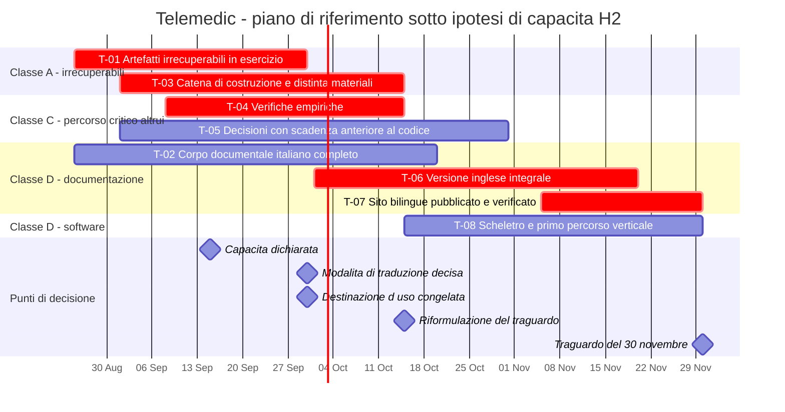

# Traguardi

## 0. Come si legge questo capitolo

Ogni traguardo ha la stessa forma, e le voci non sono decorative.

> **`T-nn` — Titolo** · *classe di attività* · *classe di enunciato* · *data sotto l'ipotesi
> dichiarata*
> **Obiettivo** — che cosa esiste al termine che non esisteva prima.
> **Criteri di completamento** — enunciati **binari**, verificabili da un terzo che non ha
> partecipato al lavoro. Nessuna percentuale, nessun avverbio.
> **Dipendenze** — che cosa deve essere vero prima.
> **Che cosa non comprende** — l'elenco è parte del traguardo, non un'appendice.
> **Rischi** — rinvio al registro di [05](./05-rischi-e-dipendenze.md).

**Le classi di attività** (`A` retroattivamente irrecuperabile, `B` a tempo di attraversamento
determinato da terzi, `C` sul percorso critico altrui, `D` comprimibile) sono definite in
[01 §2](./01-principi-e-metodo.md). **Le classi di enunciato** (`[IMPEGNO]`, `[INTENZIONE]`,
`[IPOTESI]`) sono definite in [00 §2](./00-indice.md).

> **Avvertenza sulle date.** Tutte le date interne di questo capitolo sono calcolate sotto
> l'**ipotesi di capacità `H2`** ([01 §11](./01-principi-e-metodo.md)) e **non sono impegni
> incondizionati**. La capacità effettiva non è dichiarata: è la questione `Q-181`, aperta al
> committente. La regola con cui una data si ricalcola quando l'ipotesi cambia è in
> [01 §10](./01-principi-e-metodo.md).

---

## 1. Il punto di partenza, misurato

La fotografia al 25 agosto 2026 è in [00 §4](./00-indice.md) e non si ripete. Ne servono qui tre
righe, perché sono quelle da cui la sequenza discende per necessità e non per scelta.

1. **Il corpo documentale è avanzato e incompleto**: sette aree su nove sono chiuse; mancano la
   panoramica, l'area di conformità e cinque moduli della guida dei fondamenti.
2. **La versione inglese non esiste**, e `D50` la vuole integrale, non in sintesi.
3. **Non esiste una riga di codice applicativo, né una catena di costruzione.**

A queste si aggiunge la sequenza approvata dal committente con `D52`: si completa **tutta** la
documentazione, poi si costruisce il sito con internazionalizzazione, lo si pubblica e se ne
verifica il funzionamento reale; **nessuna area si considera chiusa finché non è navigabile
online nelle due lingue.**

La conseguenza aritmetica è al §4 di questo capitolo ed è la ragione della questione `Q-180`.

---

## 2. L'ipotesi usata, e che cosa succede se è falsa

Il piano di riferimento è costruito su `H2`: **una persona in continuità sullo sviluppo, più
competenze specialistiche acquisite puntualmente all'esterno** per l'ingegneria dell'usabilità,
la verifica di sicurezza indipendente e la traduzione.

| Se l'ipotesi vera è… | Che cosa cambia |
|---|---|
| **`H1`** (una persona, nessuna competenza specialistica esterna) | I traguardi `T-01`, `T-03`, `T-04`, `T-05` **restano alle stesse date**: sono di classe `A` e `C` e vanno fatti comunque. `T-06` non si chiude. `T-07` slitta con `T-06`. `T-08` non si apre |
| **`H2`** (riferimento) | Il piano di questo capitolo |
| **`H3`** (più contributori in continuità, ruoli separati) | Diventa discutibile un primo rilascio installabile entro il 30 novembre 2026, **a condizione** che i traguardi di classe `A` siano chiusi entro settembre e che il perimetro sia quello del capitolo [03](./03-primo-rilascio-utilizzabile.md) |

La proprietà da notare è che **la riduzione di capacità non sposta i traguardi di classe `A`**.
Se li spostasse, il piano sarebbe costruito male: le attività irrecuperabili sono quelle che si
fanno **anche** quando non si riesce a fare nient'altro.

---

## 3. I traguardi fino al 30 novembre 2026

### `T-01` — Artefatti retroattivamente irrecuperabili in esercizio
*Classe `A`* · `[IMPEGNO]` · **30 settembre 2026**

**Obiettivo.** Rendere effettive, e non soltanto dichiarate, le quattro attività che `D45`
qualifica come non recuperabili a posteriori. Al termine, la loro assenza non è più una lacuna
che cresce ogni giorno.

**Criteri di completamento.**

1. Esiste una **procedura di controllo dei documenti** approvata, con: elenco dei documenti
   sottoposti a controllo, regola di identificazione e di versione, revisori nominati per
   categoria, forma dell'approvazione, regola di ritiro. La procedura è versionata nel
   repository ed è essa stessa sotto controllo.
2. La procedura dichiara **come la corrispondenza fra revisione, revisore e approvazione
   costituisce la registrazione di approvazione** nel modello «documenti come codice», ed elenca
   gli strumenti su cui si appoggia in vista della loro validazione.
3. Esiste il **registro degli identificativi di requisito** (`RF-*`, `RNF-*`, `BR-*`, `ATT-*`,
   `UC-*`, `OUT-*`, `EX-*`, `DM-*`), in **sola aggiunta**, con lo stato di ciascun identificativo
   (in vigore / ritirato) e il divieto esplicito di riuso di un identificativo ritirato.
4. Il registro è **leggibile da macchina** e ha un formato dichiarato, perché la verifica
   automatica del criterio 5 vi si appoggia.
5. Esiste il **controllo di costruzione** che fa fallire la costruzione quando una prova cita un
   identificativo assente dal registro. Il controllo è provato con un caso deliberatamente
   errato che deve far fallire.
6. Il repository pubblico contiene, e ha contenuto senza interruzione, la dichiarazione di non
   essere un dispositivo medico e la politica di distribuzione. **Già soddisfatto** al 25 agosto
   2026.
7. Esiste il **controllo di pubblicazione** che impedisce la pubblicazione di un artefatto privo
   della dichiarazione di non marcatura. Provato con un artefatto deliberatamente privo, che non
   deve essere pubblicabile.

**Dipendenze.** Nessuna interna. Il criterio 5 e il criterio 7 sono controlli di pipeline e
possono precedere l'esistenza della pipeline completa di `T-03`: sono i primi due controlli che
la pipeline riceve.

**Che cosa non comprende.** Non comprende la validazione formale degli strumenti usati nel
sistema di gestione della qualità, che appartiene al percorso di chi certifica. Non comprende la
riemissione dei documenti già prodotti fuori controllo: la riemissione è un'attività di `T-02`,
non di questo traguardo, ed è dichiarata come tale.

**Rischi.** `R-04` (area di conformità assente: la procedura di controllo dei documenti è
naturalmente sua), `R-17` (decisioni del committente non prese).

---

### `T-02` — Corpo documentale italiano completo e coerente
*Classe `D`, con una componente `A`* · `[IMPEGNO]` · **20 ottobre 2026**

**Obiettivo.** Chiudere in italiano tutto ciò che `D2`, `D35` e `D52` richiedono, in modo che il
corpus sia traducibile e pubblicabile senza rientri.

**Criteri di completamento.**

1. Esistono, con indice e frontmatter conforme, **tutte** le aree: panoramica, tecnica,
   architettura, funzionale, protocolli, dominio, sicurezza, integrazione, **conformità**,
   roadmap.
2. La guida dei fondamenti contiene i **ventuno moduli** previsti da `D35`, ciascuno con il
   proprio indice di lettura e con il glossario collegato.
3. **Zero collegamenti interni rotti** in tutto il corpus, verificato da uno strumento e non a
   vista. È il controllo `G9`, che `D52` rende bloccante prima del primo deploy.
4. **Zero occorrenze di `[NV]` prive di destinatario dichiarato.** Le occorrenze con
   destinatario sono ammesse e sono elencate in un rapporto.
5. La **bacheca inter-agenti non contiene voci `APERTA` prive di destinatario**, e ogni voce
   `APERTA` indirizzata a un'area chiusa ha almeno una nota che dichiara perché resta aperta.
6. È eseguito e registrato il **conteggio esatto delle parole** per area e per modulo. È
   condizione del traguardo successivo, perché il volume è il moltiplicatore della traduzione.
7. È definita e versionata la **lista dei termini vietati** che alimenta il controllo `G11`
   (regola `R0`), e il controllo gira su tutto il corpus senza rilievi.
8. I documenti prodotti prima di `T-01` sono stati **riemessi sotto controllo**, oppure la
   mancata riemissione è dichiarata come lacuna con la motivazione e il destinatario.

**Dipendenze.** `T-01` per il criterio 8. L'area di conformità dipende dalla chiusura di `Q-25`
(il documento di ricerca sul percorso di certificazione risulta troncato) e riceve un numero
elevato di questioni pendenti da altre aree.

**Che cosa non comprende.** Non comprende la versione inglese (`T-06`), il sito (`T-07`), né la
verifica di navigabilità online, che `D52` colloca dopo la pubblicazione.

**Rischi.** `R-03` (volume del corpus), `R-04` (area di conformità e `Q-25`), `R-05` (modelli
documentali non disponibili: l'area di conformità deve poter scrivere senza inventarli),
`R-24` (priorità che si spostano su richiesta esterna).

---

### `T-03` — Catena di costruzione operativa, con distinta dei materiali generata
*Classe `A`* · `[IMPEGNO]` · **15 ottobre 2026**

**Obiettivo.** Esistere come catena di costruzione **prima** di esistere come software. È la
traduzione operativa del vincolo `V-182` e della prescrizione di `D45` secondo cui la distinta
dei materiali si genera dalla prima pipeline.

**Criteri di completamento.**

1. Esiste una pipeline con le **quattro fasce** previste — rapida, completa, estesa, di rilascio
   — e il criterio di collocazione di ciascun controllo è dichiarato.
2. I **tredici controlli obbligatori** `G1`…`G13` esistono, **bloccano**, e ciascuno è provato
   con un caso deliberatamente non conforme che deve far fallire la costruzione. Un controllo che
   non è stato visto fallire non è un controllo.
3. La **distinta dei materiali** è generata a ogni costruzione, per ogni artefatto — servizio,
   interfaccia, immagini, pacchetti di distribuzione — e non per il solo servizio principale.
4. Il **registro dei componenti di terze parti** è generato dalla distinta e arricchito da un
   file di annotazioni versionato; il controllo `G5` fa fallire la costruzione su un componente
   presente nella distinta e assente dalle annotazioni.
5. La **costruzione è riproducibile**: due costruzioni della stessa revisione su esecutori
   diversi producono artefatti identici, e la verifica è un lavoro pianificato con esito
   conservato.
6. Gli artefatti sono **firmati con materiale che non risiede nella pipeline**, e portano
   l'attestazione di provenienza.
7. Esiste la **procedura documentata di verifica lato deployer**, con i comandi, e la procedura è
   stata eseguita almeno una volta da chi non l'ha scritta.

**Dipendenze.** I controlli `G8` (divergenza linguistica) e `G9` (collegamenti interni) hanno
senso soltanto su un corpus; sono attivi da subito e diventano bloccanti secondo la regola di
`D52`. Il controllo `G3` (terminologie) richiede la lista di ammissione versionata, che è
prodotto dell'area di dominio e di conformità.

**Che cosa non comprende.** Non comprende il codice applicativo. **Nessuna riga di codice
applicativo precede questo traguardo** (`V-182`); l'unica eccezione ammessa è il codice
usa-e-getta delle verifiche di `T-04`, che è dichiarato tale, vive in un'area separata e **non
entra in alcun artefatto distribuito**.

**Rischi.** `R-08` (regime di licenza di un componente incorporato, che il controllo `G2` deve
poter valutare), `R-12` (capacità ricorrente di sorveglianza).

---

### `T-04` — Verifiche empiriche sul percorso critico, chiuse
*Classe `C`* · `[IMPEGNO]` · **15 ottobre 2026**

**Obiettivo.** Rimuovere, con verifiche brevi e usa-e-getta, le incertezze da cui dipendono
decisioni costose o affermazioni pubbliche. `D18` colloca la prima nella prima settimana di
sviluppo, **prima di ogni altra attività**: la roadmap la recepisce alla lettera, con l'unica
precisazione che la verifica gira **attraverso** la pipeline di `T-03`, che è il primo artefatto
in assoluto.

**Criteri di completamento.** Ciascuna verifica produce un esito registrato — riuscita, fallita,
o riuscita con condizioni — e la conseguenza sulla progettazione è scritta.

1. **Scambio di token nel gateway con delega esplicita** (`D18`, `V-132`): è dimostrato che il
   gateway valida integralmente il token dell'integratore ed emette un token interno con il
   claim dell'attore, e che **nessuna configurazione supportata** produce un token privo di quel
   claim. Prova negativa inclusa.
2. **Ripiego indipendente** dello scambio: token d'ingresso a uso singolo, scadenza brevissima,
   emesso su canale posteriore e mai transitante per l'indirizzo. Dimostrato funzionante.
3. **Inoltro del contesto di autenticazione richiesto attraverso l'intermediazione** (`Q-160`,
   `B-8`): accertato se il prodotto di federazione inoltri il livello richiesto attraverso il
   realm di intermediazione. **Finché l'esito non è registrato, la documentazione pubblica non
   descrive il meccanismo.**
4. **Contenitore di registrazione** (`V-11`, `V-115`, `C-3`): accertato che il contenitore sia
   negoziabile a runtime in funzione dei codec effettivamente negoziati, e che il contenitore
   effettivo sia leggibile e registrabile nei metadati.
5. **Difetti noti del prodotto di federazione** (`D37`): i tre difetti — alterazione degli
   attributi da parte dell'utente federato, cambio dell'indirizzo di posta senza verifica,
   impostazione di una credenziale locale — sono chiusi in configurazione **e** sorvegliati da
   una prova che fallisce se la configurazione regredisce.
6. **Assetto a nodo singolo del broker**: accertate le garanzie effettivamente disponibili, e
   dichiarate. Nessun requisito funzionale dipende da garanzie non disponibili in quell'assetto.
7. **Isolamento di rete in uscita del nodo di relay**: la prova che tenta l'instradamento verso
   l'anello di richiamo locale, verso indirizzi privati e verso i servizi di metadati
   dell'infrastruttura **fallisce la costruzione se una qualunque richiesta riesce**.

**Dipendenze.** `T-03` per il criterio che le verifiche girino nella pipeline.

**Che cosa non comprende.** Non comprende la realizzazione definitiva dei componenti verificati.
Una verifica riuscita autorizza a progettare; non è progettazione.

**Rischi.** `R-15` (verifica `Q-160` non eseguita), `R-13` (difetti del prodotto di federazione),
`R-14` (doppia istanza per fornitore di identità).

---

### `T-05` — Decisioni con scadenza anteriore al primo codice, chiuse
*Classe `C`* · `[INTENZIONE]` · **31 ottobre 2026**

**Obiettivo.** Nessuna decisione dichiarata rinviata viene presa d'ufficio in una proposta di
modifica. Chiudere prima le decisioni la cui scadenza dichiarata cade prima della realizzazione.

**Criteri di completamento.** Ciascuna delle voci seguenti ha un esito registrato — decisa, con
il registro di decisione architetturale corrispondente, oppure **esplicitamente confermata come
aperta con la sua conseguenza dichiarata**.

1. `B-3` — regime di licenza di scale e questionari clinici validati. La scadenza dichiarata è
   **prima del primo motore di calcolo**; la conseguenza già assunta in via cautelativa è che il
   dominio **non rappresenta punteggi di scale**.
2. `B-8` — propagazione del livello di garanzia attraverso l'intermediazione. Confluisce in
   `T-04`, criterio 3.
3. `C-1` — contesto della rendicontazione: contesto delimitato autonomo oppure responsabilità
   distribuita. Scadenza dichiarata: prima della realizzazione dell'evento di liquidazione.
4. `C-2` — topologia della sessione oltre due partecipanti. Scadenza dichiarata: prima della
   progettazione del piano media. Non è un caso marginale: l'interprete è la misura alternativa
   dichiarata per la non conformità di accessibilità nota, e il caregiver è popolazione di
   riferimento.
5. `C-3` — contenitore del materiale registrato. Confluisce in `T-04`, criterio 4, per la parte
   di fatto; la parte di comunicazione pubblica resta del committente.
6. `C-4` — **periodo di supporto dichiarato**. È la questione `Q-186` di quest'area: senza la
   durata, il piano di dismissione non è pubblicabile e il numero di versioni maggiori da
   mantenere non è determinabile.
7. `Q-110` — topologia del segnale su più istanze. È decisione strutturale con effetti su
   distribuzione e aggiornamento senza interruzione.
8. `Q-111` — limite dichiarato di partecipanti alla sessione media. Un limite esplicito è
   preferibile a un degrado silenzioso.
9. `Q-144` — **congelamento della formulazione della destinazione d'uso del telemonitoraggio**.
   È la decisione con il costo di errore più alto dell'intero elenco (`D46`).
10. `Q-145` — conferma delle sei rinunce deliberate a capacità tecniche disponibili.

**Dipendenze.** Le voci 3, 4, 6, 9 e 10 sono decisioni del committente e non del progetto: la
data è quella entro cui il progetto **le pone**, non quella entro cui vengono prese.

**Che cosa non comprende.** Non comprende le decisioni la cui scadenza dichiarata è successiva
(`A-2`, `A-3`, `A-4`, `B-7`), che restano aperte senza costo.

**Rischi.** `R-17`, `R-18`.

---

### `T-06` — Versione inglese integrale e allineata
*Classe `D`, volume-dipendente* · `[IPOTESI]` · **20 novembre 2026, condizionata a `Q-182`**

**Obiettivo.** Soddisfare `D50`: ogni modulo della guida e ogni area esiste in italiano e in
inglese **integrali**, non in sintesi, con struttura dei file speculare.

**Criteri di completamento.**

1. Sotto `i18n/en/` esiste, per **ogni** file italiano, il file corrispondente nella posizione
   speculare.
2. Il controllo `G8` gira su tutto il corpus e **non produce rilievi**: nessun documento italiano
   risulta modificato senza il corrispondente inglese.
3. I **riferimenti normativi italiani restano citati nella forma originale**, con la spiegazione
   in inglese. La traduzione non è un adattamento libero, ed è verificabile a campione.
4. Le **stringhe di internazionalizzazione del progetto restano separate** dalle etichette
   ufficiali dei sistemi di codifica, in entrambe le lingue: nessuna traduzione di comodo di una
   denominazione ufficiale entra nel catalogo del progetto.
5. È dichiarata e versionata la **procedura di allineamento**: che cosa rende una proposta di
   modifica completa, chi verifica, che cosa si fa quando la traduzione ritarda.

**Dipendenze.** `T-02` per intero — non si traduce un corpus che cambia — e in particolare il
criterio 6 di `T-02`, il conteggio esatto delle parole.

**Perché è `[IPOTESI]` e non `[IMPEGNO]`.** Il volume del corpus italiano è dell'**ordine delle
centinaia di migliaia di parole**: i registri delle aree dichiarano conteggi fra circa ventunomila
e circa cinquantamila parole per area, su nove aree più diciassette moduli di guida. `[NV]` — il
totale esatto non è stato misurato. Con la modalità di produzione della traduzione non decisa
(`Q-182`), **la durata di questo traguardo non è stimabile** e la data indicata vale soltanto
sotto l'ipotesi che la modalità sia decisa entro settembre 2026 e che la capacità di traduzione
sia esterna e dedicata. **Se `Q-182` resta aperta oltre settembre 2026, questo traguardo non
cade nel 2026**, e con esso non cade `T-07`.

**Che cosa non comprende.** Non comprende le traduzioni in lingue ulteriori: `D3` fissa italiano
e inglese, e l'architettura di internazionalizzazione è predisposta per altre lingue senza che
esse siano un impegno.

**Rischi.** `R-03` — è il rischio dominante dell'intero piano fino al 30 novembre 2026.

---

### `T-07` — Sito di documentazione pubblicato, bilingue e verificato
*Classe `D`* · `[IPOTESI]`, dipendente da `T-06` · **30 novembre 2026**

**Obiettivo.** Soddisfare la seconda metà di `D52`: il sito esiste, è pubblicato, funziona
davvero, ed è ciò che rende un'area «chiusa».

**Criteri di completamento.**

1. Il sito è **costruito in modo riproducibile** dalla pipeline, con internazionalizzazione
   italiana come lingua predefinita e inglese come seconda lingua, a struttura speculare.
2. Il sito è **pubblicato** sul canale primario previsto da `D7`, e il canale secondario è
   configurato tramite il file di configurazione dedicato con i comandi di costruzione.
3. **La navigazione funziona**: ogni voce di menu porta a una pagina esistente; nessun
   collegamento interno rotto (`G9`, bloccante ai sensi di `D52`).
4. **La ricerca funziona** e restituisce risultati nella lingua attiva.
5. **Il cambio di lingua funziona** da ogni pagina e atterra sulla pagina corrispondente, non
   sulla radice.
6. La verifica dei criteri 3, 4 e 5 è eseguita **da una persona che non ha costruito il sito**,
   con esito registrato.
7. Il collegamento alla dichiarazione «questo repository non è un dispositivo medico» è
   **raggiungibile dal sito** — è la questione `Q-26`, che rileva che il collegamento esce dalla
   cartella della documentazione e va risolto con un indirizzo assoluto o con la duplicazione
   dentro la documentazione. **Bloccante prima del primo deploy.**
8. Ogni pagina pubblicata reca l'avvertenza di non marcatura, in entrambe le lingue.

**Dipendenze.** `T-02`, `T-06`, `T-03`. È il traguardo con il maggior numero di dipendenze del
piano ed è quindi il primo a slittare quando slitta qualcosa a monte.

**Che cosa non comprende.** Non comprende una versione del sito riservata a chi certifica, né la
pubblicazione degli artefatti di rilascio: sono attività di `T-12`.

**Rischi.** `R-03`, ereditato integralmente da `T-06`.

---

### `T-08` — Scheletro eseguibile e primo percorso verticale provato
*Classe `D`* · `[IPOTESI]`, realizzabile sotto `H3` · **30 novembre 2026**

**Obiettivo.** Esistere come software: la struttura dei moduli con le regole di dipendenza
verificate, il confine di autorizzazione, il contesto di tenant applicato dal motore, l'outbox, e
**un solo percorso clinico completo dall'inizio alla fine**, provato e tracciato.

**Criteri di completamento.**

1. La struttura dei moduli esiste e le **regole di dipendenza sono verificate automaticamente**:
   nessun contesto dipende da un altro contesto; il dominio non dipende dall'infrastruttura;
   `platform` non dipende dai contesti. Provato con una violazione deliberata che deve far
   fallire la costruzione.
2. Il **contesto di tenant è impostato dentro la transazione**, con negazione predefinita in sua
   assenza, e la proprietà è provata da una prova che **esaurisce deliberatamente il pool di
   connessioni** e verifica l'isolamento.
3. Le **prove di isolamento fra tenant** esistono e tentano attivamente l'accesso illegittimo,
   per ogni contesto e per ogni interfaccia esposta.
4. Il **registro immutabile** scrive con catena di impronte, con archiviazione a privilegi
   disgiunti, e la verifica dell'integrità della catena è disponibile su richiesta e programmata.
5. L'**outbox transazionale** è l'unica sorgente degli eventi in uscita, e una prova verifica che
   nessuna busta contenga contenuto clinico.
6. Esiste **un** percorso verticale completo, provato da estremo a estremo, con **matrice di
   tracciabilità generata** che lo collega ai requisiti che realizza.
7. Il percorso verticale soddisfa i criteri di accessibilità automatizzabili e ha superato
   almeno una **verifica manuale con tecnologia assistiva reale**, con esito registrato.
8. Le prove media girano su rete simulata, con il **profilo degradato limite** incluso, e le
   asserzioni sono su fatti osservabili — suite di cifratura presente e non degenere, avviso
   emesso quando e solo quando la soglia è superata, riga corrispondente nel tracciamento.

**Quale percorso verticale.** La scelta è motivata in [03 §2](./03-primo-rilascio-utilizzabile.md)
e non è arbitraria: è quello che attraversa il maggior numero di vincoli trasversali con il
minor numero di dipendenze esterne.

**Dipendenze.** `T-01`, `T-03`, `T-04`, `T-05` per intero. Nessuna di esse è comprimibile.

**Perché è `[IPOTESI]`.** Sotto `H2` la capacità netta è assorbita da `T-02` e dalla revisione di
`T-06`. Questo traguardo richiede `H3`, ossia una separazione di ruoli che al 25 agosto 2026 non
è dichiarata. **Sotto `H2` questo traguardo non cade il 30 novembre 2026**, e la roadmap lo dice
invece di lasciarlo intendere.

**Che cosa non comprende.** Non è il primo rilascio installabile: non ha manuale di
installazione, non ha pacchetti di distribuzione verificati da terzi, non ha il fascicolo di
conformità. Il primo rilascio installabile è il traguardo `T-10`.

**Rischi.** `R-01` (capacità non dichiarata), `R-20` (registro immutabile, dichiarato dall'area
di sicurezza come il singolo elemento di maggiore sforzo dell'intero catalogo).

---

## 4. Il 30 novembre 2026: che cosa ci sta dentro, onestamente

### 4.1 L'aritmetica

`D5` fissa per il 30 novembre 2026 «v1.0 completo, senza tagli, interamente testato»; `D16` lo
riformula in «software completo, testato e documentato, con fascicolo tecnico avviato e sistema
di gestione qualità in esercizio». Entrambe le formulazioni presuppongono che alla data esista un
software.

Al 25 agosto 2026 il software **non esiste**, e la sequenza approvata con `D52` colloca **prima
del software** il completamento dell'intera documentazione, la sua traduzione integrale, la
costruzione del sito, la sua pubblicazione e la verifica del suo funzionamento reale.

Restano novantasette giorni. Sotto l'ipotesi di riferimento `H2`, quei giorni sono sufficienti a
`T-01`, `T-02`, `T-03`, `T-04`, `T-05` e — **soltanto se `Q-182` è chiusa entro settembre** — a
`T-06` e `T-07`. Non sono sufficienti anche a `T-08`, e a maggior ragione non lo sono a `T-10`.

Questa non è una previsione pessimistica: è la conseguenza di due decisioni approvate — `D50`
sull'integralità della traduzione e `D52` sulla sequenza — applicate allo stato di fatto
misurato. **Le decisioni sono vincolanti e la roadmap non le rinegozia: ne espone la
conseguenza.**

### 4.2 Le tre opzioni, e la questione `Q-180`

La riformulazione del traguardo del 30 novembre 2026 è una decisione del committente. Le opzioni
sono tre, e ciascuna ha un costo dichiarato.

**Opzione 1 — «Fondamenta e documentazione».** Il 30 novembre 2026 consegna: il corpo documentale
completo nelle due lingue, il sito pubblicato e verificato, gli artefatti retroattivamente
irrecuperabili in esercizio, la catena di costruzione operativa con distinta dei materiali e
costruzione riproducibile, le verifiche empiriche chiuse, e — sotto `H3` — lo scheletro
eseguibile con un percorso verticale provato. **Il primo rilascio installabile diventa un
traguardo autonomo del 2027**, con la propria data calcolata sulla capacità dichiarata.
*Costo*: la data del 30 novembre cambia significato rispetto a `D5`.
*Beneficio*: è l'unica opzione che rispetta insieme `D50` e `D52` e che non contrae debito
regolatorio.
**È l'opzione raccomandata da quest'area sotto `H2`.**

**Opzione 2 — «Primo rilascio a perimetro ristretto».** Si sposta capacità dalla documentazione
al software; il corpo documentale si chiude in italiano e la traduzione integrale slitta.
*Costo*: viola `D50` alla data e rende inapplicabile `D52`, perché nessuna area può essere
dichiarata chiusa senza essere navigabile online nelle due lingue. Contrae **debito regolatorio**
nella forma più costosa, la divergenza linguistica su un contenuto normativo, che
[01 §8](./01-principi-e-metodo.md) classifica come difetto documentale in un dispositivo medico.
**Non raccomandata.**

**Opzione 3 — «`D5` invariata».** Richiede l'ipotesi `H3` con separazione dei ruoli, e richiede
che la capacità sia **dichiarata e resa disponibile entro settembre 2026**. Ogni settimana di
ritardo nella dichiarazione riduce il perimetro raggiungibile, perché i traguardi di classe `A`
e `C` non si comprimono e occupano comunque le prime settimane.
*Costo*: dipende interamente da una variabile che oggi non è nota.
**Realizzabile solo con una decisione tempestiva sulla capacità.**

Posta come questione **`Q-180`**, indirizzata al committente, insieme a `Q-181` sulla capacità e
a `Q-182` sulla traduzione. Le tre sono una sola decisione in tre parti: **non sono separabili**,
perché la risposta a `Q-180` dipende da quella a `Q-181` e `Q-182`.

### 4.3 Che cosa **non** cambia in nessuna delle tre opzioni

- Il progetto **non appone marcatura CE** e nessun artefatto è utilizzabile per l'erogazione di
  prestazioni sanitarie su pazienti reali (`D16`, `D49`, `V-06`).
- I traguardi `T-01`, `T-03` e `T-04` **si fanno comunque**, in ogni opzione e sotto ogni
  ipotesi. Sono la parte del piano che non si negozia.
- Le esclusioni di perimetro di
  [`docs/03_functional/07-fuori-perimetro.md`](../03_functional/07-fuori-perimetro.md) restano
  in vigore e nessuna opzione le tocca.

---

## 5. Oltre il 30 novembre 2026

### `T-10` — Primo rilascio installabile
*Classe `D`* · `[INTENZIONE]` · **data non determinabile prima della chiusura di `Q-181`**

**Obiettivo.** Il primo artefatto che una struttura può installare, configurare e usare in
esercizio di prova, formazione e integrazione — **non su pazienti reali**. Il perimetro esatto è
il capitolo [03](./03-primo-rilascio-utilizzabile.md).

**Criteri di completamento.** Sono i criteri di rilascio bloccanti elencati in
[03 §7](./03-primo-rilascio-utilizzabile.md), in blocco: nessuno è derogabile.

**Perché non è datato.** Perché la durata è funzione della capacità netta, che non è dichiarata,
e perché il traguardo dipende da `T-08`, che è a sua volta `[IPOTESI]`. **Dichiarare una data qui
sarebbe inventarla.** Ciò che la roadmap dichiara è la **sequenza** e i **criteri**: quando la
capacità è nota, la data si calcola con la regola di [01 §10](./01-principi-e-metodo.md).

---

### `T-11` — Validazione sommativa di usabilità
*Classe `B`* · `[INTENZIONE]` · **successiva al congelamento dell'interfaccia**

**Obiettivo.** L'ingegneria dell'usabilità ai sensi della norma applicabile, resa obbligatoria da
`D12` e da `D25`: specifica d'uso, scenari d'uso pericolosi, valutazioni formative durante lo
sviluppo, **validazione sommativa con utenti rappresentativi prima del rilascio**, fascicolo
consolidato.

**Perché è di classe `B`.** Perché richiede il reclutamento di utenti rappresentativi — che
comprendono assistiti anziani e persone con disabilità, popolazione di riferimento e non caso
limite — e perché il protocollo va approvato prima dell'esecuzione. Il tempo di attraversamento
non dipende dalla velocità del progetto.

**Dipendenza dura.** La sommativa richiede l'**interfaccia congelata**. Una sommativa condotta su
un'interfaccia che poi cambia va rifatta: è la ragione per cui non può essere anticipata e per
cui il suo protocollo va approvato molto prima della sua esecuzione.

---

### `T-12` — Pacchetto regolatorio consegnabile
*Classe `D` con componenti `A` già chiuse* · `[INTENZIONE]` · **2027**

**Obiettivo.** Rendere disponibile a chi intende certificare il materiale che `D49` pone a carico
del progetto: fascicolo tecnico, documentazione di ciclo di vita del software, gestione del
rischio, fascicolo di ingegneria dell'usabilità, matrice di tracciabilità, distinta dei materiali
firmata, dichiarazione tecnica di deroga sulla protezione degli endpoint, ripartizione delle
responsabilità completata.

**Che cosa non comprende, e va detto ogni volta.** Non comprende la costituzione di un soggetto
fabbricante, la nomina di una persona responsabile del rispetto della normativa, l'ingaggio di un
organismo di valutazione della conformità, la valutazione clinica e l'apposizione della
marcatura. Sono attività di **chi certifica** (`D28`, `D49`, `V-06`, `OUT-20`).

**Dipendenza.** Chiusura di `Q-183` verso l'area di conformità: quali evidenze sono consegnabili
e quali no.

---

### `T-13` — Traguardi che non sono del progetto
*`[IPOTESI]`* · **riportati per orientamento, mai come impegno**

Il vincolo `V-180` vieta al progetto di dichiarare date per traguardi altrui. Queste date sono
riportate perché **chi legge la roadmap deve poter collocare il proprio piano**, e sono
attribuite alla loro fonte.

| Traguardo | Di chi è | Riferimento temporale | Fonte |
|---|---|---|---|
| Firma del contratto con un organismo di valutazione della conformità | Di chi certifica | Dicembre 2026 nello scenario di riferimento | `D44`, scenario B della ricerca sul percorso di certificazione |
| Certificato del sistema di gestione della qualità | Di chi certifica | Luglio 2027 nello scenario di riferimento | *ibidem* |
| Fascicolo tecnico completo e sottomesso | Di chi certifica | Giugno 2027 nello scenario di riferimento | *ibidem* |
| Certificati e marcatura CE | Di chi certifica | **Giugno–agosto 2028** nello scenario di riferimento | `D44`: il 51 % degli organismi impiega 13–18 mesi dall'accordo al certificato, il 31 % impiega 19–24 mesi; l'organico degli organismi è in contrazione |
| Termine per l'adozione delle misure nazionali di sicurezza | Di **ciascun utilizzatore** | **Non determinabile dal fornitore**: diciotto mesi dalla comunicazione di inserimento ricevuta dal singolo soggetto | `D39`; vincolo `V-186` |
| Accreditamento presso la federazione nazionale delle identità | Di chi installa | **Non dichiarato da alcuna fonte primaria** | `D36`, `V-05`, `OUT-22` |

**Le date della prima colonna non sono impegni e non vanno citate come tali.** Sono lo scenario
di riferimento di un percorso che il progetto documenta e non conduce.

---

## 6. I punti di decisione irreversibili

Un punto di decisione irreversibile è una data oltre la quale **la mancata decisione è essa
stessa una decisione**, e produce una conseguenza che non si annulla decidendo dopo.

| Data | Decisione | Chi | Se non presa entro quella data |
|---|---|---|---|
| **15 settembre 2026** | Dichiarazione della capacità (`Q-181`) | Committente | L'opzione 3 del §4.2 decade automaticamente: i traguardi di classe `A` e `C` occupano comunque le prime settimane e il perimetro raggiungibile si riduce ogni settimana |
| **30 settembre 2026** | Modalità di produzione della versione inglese (`Q-182`) | Committente | `T-06` non cade nel 2026, e con esso `T-07`. Nessuna area può essere dichiarata chiusa ai sensi di `D52` |
| **30 settembre 2026** | Congelamento formale della destinazione d'uso del telemonitoraggio (`Q-144`) | Committente | Ogni lavoro sul contesto di telemonitoraggio resta lavoro a rischio di riscrittura integrale (`D46`) |
| **15 ottobre 2026** | Riformulazione del traguardo del 30 novembre (`Q-180`) | Committente | Il piano prosegue sull'opzione 1, che è quella che quest'area applica in assenza di decisione contraria, e la differenza rispetto a `D5` va comunicata |
| **31 ottobre 2026** | Correzione della pagina pubblica ai sensi di `D19` e `D29` (`Q-185`) | Committente, `PROD` | Il rischio di *claim* non sostenibile prosegue e **non è recuperabile a posteriori**: un periodo di pubblicazione non si annulla |
| **Prima del primo motore di calcolo** | Regime di licenza di scale e questionari (`B-3`) | `COMP` | Una funzione già scritta va rimossa |
| **Prima della prima distribuzione** | Periodo di supporto dichiarato (`C-4`, `Q-186`) | Committente, `COMP` | Il piano di dismissione non è pubblicabile e il numero di versioni maggiori da mantenere non è determinabile |
| **Prima della documentazione pubblica del meccanismo** | Esito della verifica sull'inoltro del livello di garanzia (`B-8`, `Q-160`) | `INTEG`, `TECH` | Rettifica di documentazione pubblica su un meccanismo di sicurezza |

---

## 7. Quadro d'insieme

**Come si legge il diagramma.** Le barre marcate come critiche sono quelle il cui slittamento si
trasferisce integralmente alla fine della catena. `T-08` **non** è marcata critica non perché sia
meno importante, ma perché sotto `H2` non è nel percorso: è la prima cosa che cade.

### 7.1 Tabella di sintesi

| # | Traguardo | Classe | Enunciato | Data sotto `H2` | Dipende da |
|---|---|:-:|:-:|---|---|
| `T-01` | Artefatti retroattivamente irrecuperabili in esercizio | `A` | `[IMPEGNO]` | 30 set. 2026 | — |
| `T-02` | Corpo documentale italiano completo | `D` | `[IMPEGNO]` | 20 ott. 2026 | `T-01` |
| `T-03` | Catena di costruzione con distinta dei materiali | `A` | `[IMPEGNO]` | 15 ott. 2026 | — |
| `T-04` | Verifiche empiriche sul percorso critico | `C` | `[IMPEGNO]` | 15 ott. 2026 | `T-03` |
| `T-05` | Decisioni con scadenza anteriore al primo codice | `C` | `[INTENZIONE]` | 31 ott. 2026 | Committente |
| `T-06` | Versione inglese integrale | `D` | `[IPOTESI]` | 20 nov. 2026 | `T-02`, `Q-182` |
| `T-07` | Sito bilingue pubblicato e verificato | `D` | `[IPOTESI]` | 30 nov. 2026 | `T-02`, `T-03`, `T-06` |
| `T-08` | Scheletro e primo percorso verticale | `D` | `[IPOTESI]` | 30 nov. 2026 sotto `H3` | `T-01`, `T-03`, `T-04`, `T-05` |
| `T-10` | Primo rilascio installabile | `D` | `[INTENZIONE]` | **non determinabile** | `T-08`, `Q-181` |
| `T-11` | Validazione sommativa di usabilità | `B` | `[INTENZIONE]` | successiva al congelamento dell'interfaccia | `T-10` |
| `T-12` | Pacchetto regolatorio consegnabile | `D` | `[INTENZIONE]` | 2027 | `T-10`, `Q-183` |
| `T-13` | Traguardi di terzi | — | `[IPOTESI]` | — | Non del progetto |

---

## 8. Che cosa non è datato, e perché

L'elenco è la parte più utile del capitolo per chi deve fidarsi di questa roadmap.

| Voce | Perché non è datata | Da che cosa dipenderebbe la data |
|---|---|---|
| **Primo rilascio installabile** (`T-10`) | La capacità netta non è dichiarata | `Q-181` |
| **Versione inglese** (`T-06`), con data condizionata | Volume non misurato e modalità non decisa | `Q-182` e criterio 6 di `T-02` |
| **Interoperabilità in uscita verso il fascicolo** | I modelli documentali, i codici di tipologia e i metadati di indicizzazione delle tipologie di telemedicina **non sono pubblicamente disponibili** (`Q-07`) | Disponibilità del materiale, che dipende da un terzo |
| **Profili di interoperabilità documentale e messaggistica ospedaliera** | Richiedono una controparte con un ambiente di prova | Disponibilità di un integratore o di un ente |
| **Conformità verificata sull'identità digitale nazionale** | Richiede ambienti di pre-produzione e credenziali di prova non sotto il controllo del progetto | Accesso agli ambienti; il lotto delle istanze multiple per fornitore di identità è quello sistematicamente sottovalutato (`D38`) |
| **Soglie di prestazione dell'interfaccia** | Il dispositivo di riferimento non è dichiarato (`Q-115`), e senza dispositivo il requisito corrispondente non è verificabile | Decisione di prodotto |
| **Livelli di servizio attesi** | La soglia la sceglie il cliente; il prodotto fornisce la misura | `Q-152`, `Q-184` |
| **Certificazione e marcatura** | Non è un traguardo del progetto (`V-180`) | Di chi certifica |
| **Termine di adeguamento alle misure nazionali di sicurezza** | Soggettivo per ciascun utilizzatore (`V-186`) | Della comunicazione ricevuta dal singolo soggetto |

> **La regola che questo elenco applica.** Una data che dipende interamente da un terzo non è una
> data del progetto: è una speranza con un formato. Dichiararla produrrebbe un impegno che il
> progetto non può mantenere e una rassicurazione che il lettore non può usare.

---

**Prosegue in**: [03 — Primo rilascio utilizzabile](./03-primo-rilascio-utilizzabile.md), dove il
traguardo `T-10` riceve il suo perimetro esatto, e in
[05 — Rischi e dipendenze](./05-rischi-e-dipendenze.md), dove i rischi citati in ogni traguardo
sono descritti con probabilità, impatto e risposta.
