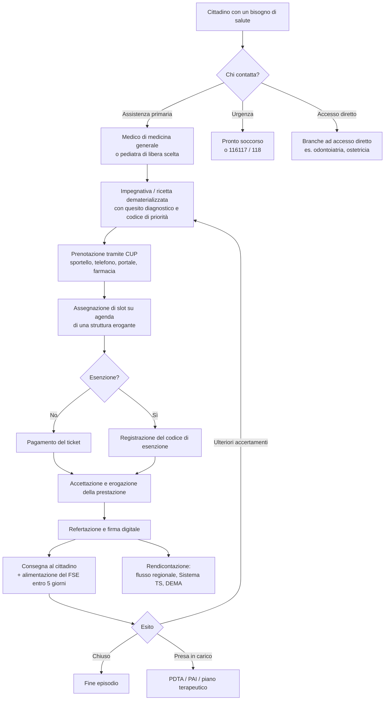

# Il sistema sanitario italiano

Questo modulo esiste per una ragione precisa. Il modello dati di Telemedic contiene entità
che a un occhio esterno sembrano ridondanti o arbitrarie: perché un professionista non è
un utente ma un `PractitionerRole`; perché la stessa persona è «assistito» in un posto e
«paziente» in un altro; perché la modalità di erogazione di una prestazione è un attributo
con codifica configurabile per Regione anziché una costante; perché esistono tre percorsi
di pagamento distinti per lo stesso identico atto clinico.

Nessuna di queste scelte nasce da preferenze architetturali. Nascono tutte dalla forma
concreta del sistema sanitario italiano. Chi scrive codice senza conoscerla produce
astrazioni che sembrano eleganti e che si rompono al primo contatto con un'installazione
reale.

Il modulo parte da zero. Se sai già cos'è una ASL puoi saltare al § 4; se non lo sai, non
saltare nulla.

---

## 1. Il Servizio sanitario nazionale: che cos'è e da dove viene

### 1.1 La norma fondativa

Il **Servizio sanitario nazionale (SSN)** è stato istituito dalla **legge 23 dicembre 1978,
n. 833**. Non è un'assicurazione, non è un ente, non è un'amministrazione: la legge lo
definisce come «*il complesso delle funzioni, delle strutture, dei servizi e delle attività
destinati alla promozione, al mantenimento ed al recupero della salute fisica e psichica di
tutta la popolazione*» (art. 1). È quindi un **sistema**, cioè un insieme di soggetti
distinti tenuti insieme da una finalità comune e da regole di finanziamento condivise.

La legge 833 attua l'**articolo 32 della Costituzione**, che qualifica la salute come
«*fondamentale diritto dell'individuo e interesse della collettività*» e garantisce «*cure
gratuite agli indigenti*». È l'unico diritto che la Costituzione italiana definisce
«fondamentale» con quell'aggettivo esplicito.

Prima del 1978 l'assistenza sanitaria in Italia era **mutualistica**: si era coperti in
quanto iscritti a una cassa mutua legata alla propria categoria lavorativa (lavoratori
dell'industria, del commercio, dell'agricoltura, dipendenti pubblici, e così via). Chi non
lavorava, o lavorava in un settore senza mutua, non era coperto. La riforma del 1978
sostituisce il criterio della **categoria professionale** con quello della **residenza**:
si ha diritto all'assistenza perché si è persone che vivono in Italia, non perché si
appartiene a un gruppo.

Questo passaggio storico non è erudizione. È la ragione per cui, nel modello dati, la
copertura sanitaria di una persona è un attributo derivato dall'anagrafe e dalla residenza,
e non un contratto individuale: in FHIR è una `Coverage` a titolarità pubblica, non una
polizza. Ed è la ragione per cui l'entità centrale delle anagrafiche pubbliche italiane si
chiama **assistito** e non «cliente».

### 1.2 I tre principi e le tre riforme

L'impianto del 1978 poggia su tre principi, ripetutamente richiamati dalla giurisprudenza
costituzionale e dai documenti di programmazione:

- **universalità** - la platea dei destinatari è l'intera popolazione residente, senza
  selezione;
- **uguaglianza** - a parità di bisogno corrisponde parità di accesso, indipendentemente da
  reddito, condizione sociale e luogo di residenza;
- **equità** - il sistema è finanziato dalla fiscalità generale in proporzione alla capacità
  contributiva, non al rischio individuale.

Su questo impianto sono intervenute tre riforme che ne hanno cambiato la struttura organizzativa
senza toccarne i principi:

1. Il **decreto legislativo 30 dicembre 1992, n. 502**, e il successivo **D.lgs. 7 dicembre
   1993, n. 517**, introducono l'**aziendalizzazione**: le vecchie Unità sanitarie locali,
   che erano strutture operative dei Comuni, diventano **aziende** dotate di personalità
   giuridica pubblica e autonomia imprenditoriale, con un direttore generale nominato dalla
   Regione. Nasce anche il sistema di **remunerazione a prestazione** (tariffe per le
   prestazioni ambulatoriali, raggruppamenti omogenei di diagnosi per i ricoveri) al posto
   del finanziamento a piè di lista.
2. Il **decreto legislativo 19 giugno 1999, n. 229** («riforma ter» o «riforma Bindi»)
   introduce l'**accreditamento istituzionale** come condizione per erogare prestazioni a
   carico del SSN, rafforza la programmazione regionale e definisce i **livelli essenziali
   di assistenza** come strumento di garanzia nazionale.
3. La **legge costituzionale 18 ottobre 2001, n. 3** riscrive il Titolo V della Costituzione
   e sposta la «tutela della salute» tra le materie di **legislazione concorrente**. È la
   riforma con le conseguenze più profonde per chi scrive software, e le vediamo subito.

---

## 2. Tre livelli di governo, e perché ne derivano ventuno sistemi

### 2.1 La ripartizione costituzionale

L'**articolo 117 della Costituzione**, nel testo vigente dopo la riforma del 2001,
distribuisce la potestà legislativa così:

- **comma 2, lettera m)** - è **competenza esclusiva dello Stato** la «*determinazione dei
  livelli essenziali delle prestazioni concernenti i diritti civili e sociali che devono
  essere garantiti su tutto il territorio nazionale*». Da qui discendono i **LEA** (§ 6);
- **comma 3** - la «*tutela della salute*» è materia di **legislazione concorrente**: allo
  Stato spetta la determinazione dei **principi fondamentali**, alle Regioni la potestà
  legislativa di dettaglio.

La conseguenza è che lo Stato dice *cosa* deve essere garantito e con quali principi, mentre
ogni Regione decide *come* organizzarsi per garantirlo. Non è una delega amministrativa: è
potestà legislativa piena entro i principi. Una Regione può istituire tipi di azienda che
altrove non esistono, può accorpare o disarticolare gli enti, può creare cataloghi di
prestazioni propri, può fissare tariffe e ticket propri entro i limiti nazionali, può
adottare regole di prescrizione e di prenotazione diverse.

### 2.2 Ventuno, non venti

Le Regioni italiane sono venti. I **sistemi sanitari regionali sono ventuno**, perché la
Regione **Trentino-Alto Adige/Südtirol** non gestisce direttamente la sanità: le competenze
sono ripartite fra le due **Province autonome di Trento e di Bolzano**, ciascuna con
ordinamento sanitario proprio. Nel lessico normativo si scrive quasi sempre «*Regioni e
Province autonome*», abbreviato in «Regioni e PP.AA.» oppure «RdA/RdE» quando il riferimento
è alla Regione di assistenza o di erogazione (§ 7.6 e modulo
[07 - FSE e infrastrutture nazionali](07-fse-e-infrastrutture-nazionali.md)).

Cinque Regioni hanno **statuto speciale** (Sicilia, Sardegna, Valle d'Aosta, Friuli-Venezia
Giulia, Trentino-Alto Adige) e finanziano la sanità in tutto o in parte con risorse proprie
anziché con il riparto del Fondo sanitario nazionale, il che aggiunge un'ulteriore
differenziazione nelle regole di spesa.

### 2.3 Le conseguenze per il software: non è un dettaglio, è il vincolo dominante

Questo è il punto che il progetto ripete in ogni documento e che va interiorizzato una volta
per tutte. La frammentazione regionale non è una complicazione marginale da gestire con
qualche `if`: **è la caratteristica strutturale del mercato in cui il software opera**, e si
manifesta almeno su queste dimensioni.

| Dimensione | Cosa varia | Effetto sul modello dati |
|---|---|---|
| **Nome e forma degli enti** | ASL, AUSL, ASP, ATS+ASST, AST, APSS, ASUR… | L'organizzazione erogante non può avere un tipo enumerato chiuso |
| **Catalogo delle prestazioni** | Ogni Regione ha un **catalogo unico regionale** che estende e rinomina il nomenclatore nazionale | Serve una doppia codifica: codice nazionale + `codCatalogoPrescr` regionale (DM 19 novembre 2025, All. 1, § 2.19) |
| **Tariffe e ticket** | Tariffa nazionale massima, quote regionali aggiuntive, esenzioni regionali | Il calcolo dell'addebito è una policy per tenant, non una formula globale |
| **Regole di prescrizione** | Quando serve l'impegnativa, quali prestazioni sono ad accesso diretto | Il gate di prescrizione è configurabile |
| **Flussi di rendicontazione** | Tracciati regionali della specialistica ambulatoriale con nomi e campi diversi | L'esportazione è un adattatore per Regione |
| **Modalità di erogazione a distanza** | La codifica del valore «telemedicina» nei flussi non è nazionale e uniforme | Attributo con codifica configurabile per Regione, **mai una costante** - vedi § 7.7 |
| **Interpretazione delle norme nazionali** | Le Regioni recepiscono gli Accordi Stato-Regioni con atti propri che li specificano e talvolta li estendono | Le regole di dominio hanno un livello nazionale e un livello di *override* regionale |

Un esempio concreto della sesta riga, documentato nella ricerca del progetto: l'Accordo
Stato-Regioni del 17 dicembre 2020 afferma che la televisita «è da intendersi limitata alle
attività di controllo di pazienti la cui diagnosi sia già stata formulata nel corso di visita
in presenza», mentre le indicazioni regionali dell'Emilia-Romagna (BUR n. 255 del 17 agosto
2021, Allegato 2) ammettono espressamente l'uso in prima visita a valle di un teleconsulto
fra medico di medicina generale e specialista. **Le due regole coesistono e sono entrambe
valide, ciascuna nel proprio territorio.** Un sistema che codifichi «la televisita non è
ammessa in prima visita» come invariante di dominio è sbagliato in Emilia-Romagna; un
sistema che la ammetta sempre è sbagliato altrove. La formulazione corretta è: regola
nazionale come predefinito, deroga regionale come configurazione tracciata.

### 2.4 La Conferenza Stato-Regioni: dove si compone il conflitto

Poiché la competenza è concorrente, esiste un organo permanente di raccordo: la **Conferenza
permanente per i rapporti tra lo Stato, le Regioni e le Province autonome di Trento e di
Bolzano**, disciplinata dal **D.lgs. 28 agosto 1997, n. 281**. Produce due tipi di atto che
è indispensabile distinguere:

- **Intesa** - atto con cui Stato e Regioni convergono su un contenuto vincolante; il suo
  mancato raggiungimento può bloccare l'adozione dell'atto statale;
- **Accordo** - atto con cui si coordinano competenze rispettive; **non è una fonte
  normativa in senso proprio**: diventa cogente nel momento in cui le Regioni lo recepiscono
  con atti propri (delibere di giunta, decreti dirigenziali, circolari).

Ogni atto ha un **numero di repertorio** nella forma `n/CSR` e una data di seduta. L'atto
più importante per questo progetto è l'**Accordo 17 dicembre 2020, rep. atti n. 215/CSR**,
«Indicazioni nazionali per l'erogazione di prestazioni in telemedicina», che contiene le
definizioni canoniche di tutte le prestazioni ed è la fonte del modulo
[02](02-prestazioni-di-telemedicina.md).

**Perché conta per il codice.** Quando un documento del progetto scrive «l'Accordo 215/CSR
2020 impone X», sta dicendo qualcosa di più debole di «il decreto ministeriale impone X»:
l'obbligo si perfeziona con il recepimento regionale, e il recepimento può aggiungere
condizioni. Nella documentazione la distinzione va sempre mantenuta.

---

## 3. Chi paga: il finanziamento in tre passaggi

Il flusso del denaro spiega quasi tutti i comportamenti del sistema, e va conosciuto perché
determina chi è il committente del software (§ 11).

1. **Dallo Stato alle Regioni.** Lo Stato determina annualmente il **Fabbisogno sanitario
   nazionale standard**, finanziato dalla fiscalità generale, e lo ripartisce fra le Regioni
   con criteri basati sulla popolazione **pesata** per fasce d'età e altri indicatori. Il
   riparto è deliberato dal CIPESS su proposta del Ministero della salute previa intesa in
   Conferenza Stato-Regioni. Le Regioni possono integrare con risorse proprie; se sforano
   senza copertura entrano in **piano di rientro**, un regime di vincoli sulla spesa che
   include il blocco del turnover e l'obbligo di aumentare le addizionali fiscali. L'elenco aggiornato delle Regioni in piano di rientro alla data odierna è oggetto di verifica continua da parte dell'area `GUIDA` `[NV]`.
2. **Dalla Regione alle aziende.** La Regione assegna a ciascuna azienda sanitaria un
   budget, in parte a **quota capitaria** (una somma per assistito residente, che finanzia
   le funzioni di tutela della popolazione) e in parte a **remunerazione delle prestazioni
   erogate** (tariffa per prestazione ambulatoriale, tariffa per ricovero secondo il sistema
   dei raggruppamenti omogenei di diagnosi). Le aziende ospedaliere e le strutture private
   accreditate sono finanziate prevalentemente col secondo meccanismo, entro **tetti di
   spesa** contrattati annualmente.
3. **Dal cittadino.** Il cittadino contribuisce con il **ticket** (§ 7.4) e, per le
   prestazioni fuori LEA o scelte in regime privato, con il pagamento integrale.

Da questo discendono due fatti controintuitivi ma decisivi:

- **Una prestazione erogata a un assistito residente in un'altra Regione genera un credito
  fra Regioni**, regolato dalla cosiddetta **mobilità sanitaria** con compensazione annuale.
  Ne discende che la **Regione di assistenza (RdA)** e la **Regione di erogazione (RdE)**
  sono due attributi distinti di ogni prestazione, e la distinzione è codificata anche nella
  normativa sul fascicolo sanitario elettronico (DM 7 settembre 2023, art. 1).
- **Una prestazione senza tariffa non genera ricavo per chi la eroga.** È il caso del
  teleconsulto (modulo [02](02-prestazioni-di-telemedicina.md), § 9): l'attività esiste,
  è normata, è obbligatoria in certi percorsi, e **non è remunerata**. Chi progetta funzioni
  di fatturazione deve sapere che alcune prestazioni sono strutturalmente a costo puro.

---

## 4. Gli enti: chi eroga materialmente le prestazioni

### 4.1 Azienda sanitaria locale

L'**azienda sanitaria locale (ASL)** è l'ente pubblico che garantisce i livelli essenziali
di assistenza alla popolazione di un **territorio** definito. Ha personalità giuridica
pubblica, autonomia organizzativa, patrimoniale e contabile, ed è retta da un **direttore
generale** nominato dalla Regione, affiancato da un direttore sanitario, un direttore
amministrativo e - dove previsto - un direttore dei servizi sociosanitari.

La ASL ha una **doppia natura** che è la fonte di molte confusioni:

- è **committente**: acquista prestazioni per i propri assistiti, dai propri presidi e da
  soggetti terzi accreditati, e ne governa l'appropriatezza;
- è **erogatore**: gestisce direttamente presidi ospedalieri, distretti, consultori,
  dipartimenti di prevenzione, servizi per le dipendenze e la salute mentale.

Al suo interno il **distretto** è l'articolazione territoriale che organizza l'assistenza
primaria e la specialistica ambulatoriale di base per un bacino di popolazione (il DM
77/2022 fissa lo standard di riferimento in circa **100.000 abitanti** per distretto,
con variazioni per densità e orografia che l'area `GUIDA` `[NV]` deve verificare
sull'Allegato 1 del decreto per il valore esatto).

**La sigla non è uniforme.** A seconda della Regione lo stesso ente si chiama ASL, AUSL
(Azienda unità sanitaria locale), ASP (Azienda sanitaria provinciale), AST (Azienda
sanitaria territoriale), APSS (Azienda provinciale per i servizi sanitari), ASUR (Azienda
sanitaria unica regionale, modello poi superato in alcune Regioni). In Lombardia il modello
introdotto dalla L.R. 23/2015 separa le **ATS** (Agenzie di tutela della salute, funzione di
committenza e programmazione) dalle **ASST** (Aziende socio-sanitarie territoriali, funzione
di erogazione): è una separazione strutturale fra i due ruoli descritti sopra, e produce
un'organizzazione che non ha equivalente altrove.

**Conseguenza diretta sul modello dati.** Il tipo di organizzazione erogante non può essere
un `enum` chiuso. In FHIR si rappresenta con `Organization` più un `Organization.type`
codificato, e il codice va risolto contro un sistema di codifica **per Regione**, non
contro una costante di progetto. Analogamente, la gerarchia
`azienda → presidio → unità operativa` è esplicitamente richiesta dal set informativo
ministeriale del referto di televisita (DM 19 novembre 2025, Allegato 1, § 2.20), che
prevede codice e descrizione per ciascuno dei tre livelli: modellare un solo livello di
organizzazione rende impossibile produrre il documento.

### 4.2 Azienda ospedaliera, azienda ospedaliero-universitaria, policlinico

L'**azienda ospedaliera (AO)** è un ospedale di rilievo nazionale o di alta specializzazione
costituito in azienda autonoma, quindi **non dipendente dalla ASL** ma direttamente dalla
Regione. Si finanzia prevalentemente con la remunerazione delle prestazioni erogate.

L'**azienda ospedaliero-universitaria (AOU)** è un ospedale integrato con una facoltà di
medicina: eroga assistenza e insieme svolge didattica e ricerca, con una governance mista
Regione-Università disciplinata dal **D.lgs. 21 dicembre 1999, n. 517**. Il termine
**policlinico universitario** indica nel linguaggio comune la stessa realtà; la forma
giuridica precisa varia (azienda ospedaliero-universitaria, azienda integrata con
l'università, policlinico a gestione diretta universitaria).

**Perché conta.** In un'AOU coesistono nello stesso luogo fisico professionisti con
inquadramenti diversi (dipendenti del servizio sanitario, docenti universitari con
attività assistenziale, specializzandi in formazione). Il **medico specializzando** è un
medico abilitato ma in formazione, che compie atti sotto tutoraggio: nel modello di
autorizzazione non è un `CLINICIAN` pieno, e la firma del referto segue regole di
controfirma. La documentazione del progetto tratta questo caso nella
[matrice dei ruoli](./16-architettura-del-progetto.md).

### 4.3 IRCCS

Gli **Istituti di ricovero e cura a carattere scientifico (IRCCS)** sono enti - pubblici o
privati - riconosciuti dal Ministero della salute per l'eccellenza clinica e per l'attività
di ricerca biomedica e organizzativo-sanitaria in una disciplina specifica. Sono disciplinati
dal **D.lgs. 16 ottobre 2003, n. 288**. Il riconoscimento è periodico e revocabile ed è
legato al mantenimento di requisiti di produzione scientifica.

Per il software un IRCCS è rilevante per due ragioni: eroga assistenza come qualunque altro
erogatore, ma **conduce anche ricerca sui dati clinici**, il che attiva basi giuridiche,
comitati etici e percorsi di pseudonimizzazione che non si applicano al normale ciclo di
cura (modulo [03 - Il dato clinico](03-il-dato-clinico.md), § 3).

### 4.4 Strutture private accreditate, autorizzate, e private pure

Questa distinzione è la più fraintesa da chi arriva dall'informatica, e determina
direttamente **chi paga** e **quali obblighi documentali scattano**. Sono tre regimi, non
due.

| Regime | Cosa significa | Chi paga la prestazione | Obblighi verso il SSN |
|---|---|---|---|
| **Autorizzata** | Ha ottenuto l'autorizzazione sanitaria all'esercizio: possiede i requisiti minimi strutturali, tecnologici e organizzativi. È il presupposto per esistere legalmente | Il cittadino, integralmente | Alimentazione del FSE (DM 7 settembre 2023, art. 12, c. 1); trasmissione delle spese al Sistema TS |
| **Accreditata** | Oltre all'autorizzazione, ha ottenuto l'accreditamento istituzionale (D.lgs. 502/1992, art. 8-*quater*): è stata riconosciuta idonea a erogare per conto del SSN | Il SSN, entro il contratto e i tetti di spesa; il cittadino paga il solo ticket | Tutti quelli della struttura pubblica per l'attività in accreditamento |
| **A contratto** | È accreditata **e** ha stipulato l'accordo contrattuale annuale con la ASL o la Regione, che fissa volumi e tetti | Come sopra, ma solo entro i volumi contrattati | Come sopra |

Il passaggio decisivo è che **accreditamento e contratto non coincidono**: una struttura può
essere accreditata e non avere contratto per l'anno in corso, oppure avere esaurito il
volume contrattato a settembre. Da quel momento la stessa prestazione, erogata dallo stesso
professionista nello stesso ambulatorio, esce dal regime pubblico e diventa privata a
pagamento. **Il regime non è una proprietà della struttura: è una proprietà dell'atto.** Nel
modello dati il regime di erogazione appartiene all'`Encounter`, non all'`Organization`.

Un vincolo ulteriore, specifico della telemedicina: l'Accordo Stato-Regioni 18 novembre 2021,
rep. atti n. 231/CSR, stabilisce che le strutture che intendono erogare teleriabilitazione a
carico del SSN devono essere **accreditate per le medesime attività in presenza**. Non
esiste un accreditamento «per la telemedicina»: la telemedicina è un canale di erogazione di
prestazioni già accreditate.

### 4.5 Il privato puro e la sanità integrativa

Fuori dal perimetro pubblico opera il **privato puro**: studi medici singoli e associati,
poliambulatori, case di cura non accreditate. Qui non c'è ticket, non c'è impegnativa, non
ci sono flussi di rendicontazione al SSN. Ci sono però obblighi che restano:

- **trasmissione delle spese sanitarie al Sistema Tessera Sanitaria** ai fini della
  dichiarazione dei redditi precompilata (art. 3, c. 3, D.lgs. 175/2014 e decreti attuativi
  del Ministero dell'economia);
- **fatturazione elettronica**, con il regime speciale che vieta la trasmissione al Sistema
  di Interscambio delle fatture contenenti dati sanitari verso persone fisiche è soggetta a disciplina che l'area `GUIDA` `[NV]` deve verificare, in quanto oggetto di proroghe annuali;
- **alimentazione del FSE**, che il DM 7 settembre 2023, art. 12, c. 1 estende alle
  «strutture sanitarie autorizzate» e agli «esercenti le professioni sanitarie, anche
  convenzionati con il SSN, quando operano in autonomia».

A questo si affianca la **sanità integrativa**: fondi sanitari, casse di assistenza,
mutue di categoria, polizze assicurative. Pagano prestazioni erogate da strutture private o
in regime di libera professione intramuraria, con logiche di **autorizzazione preventiva**,
**convenzionamento diretto** (il fondo paga la struttura) o **rimborso** (il paziente paga e
chiede il rimborso). È un mercato con un ciclo amministrativo proprio, e la ricerca del
progetto lo indica esplicitamente come uno dei contesti dove **esiste una tariffa reale per
la telemedicina**, a differenza del SSN.

### 4.6 L'intramoenia

La **libera professione intramuraria** è l'attività che un medico dipendente del SSN svolge
a pagamento, dentro le mura della struttura pubblica (o in strutture convenzionate, nella
forma «allargata»), scegliendo il professionista e i tempi. La struttura trattiene una quota,
il cittadino paga la tariffa piena. È regolata dal D.lgs. 502/1992 e dalla L. 120/2007.

Per il software è un caso limite istruttivo: **stesso medico, stessa struttura, stesso atto
clinico, regime amministrativo completamente diverso**. Se il regime di erogazione fosse
modellato come attributo del professionista o dell'organizzazione, l'intramoenia sarebbe
irrappresentabile.

---

## 5. Chi fa cosa: professioni e atti riservati

### 5.1 Perché la professione è un vincolo di dominio e non una configurazione

In quasi tutti i sistemi gestionali i permessi sono configurabili: un amministratore può
concedere a chiunque qualunque capacità. In sanità **non è così**, e questa è una delle
poche regole che il progetto codifica come invariante non aggirabile per configurazione.

La ragione è che alcune attività sono **atti riservati per legge** a una professione
determinata. La televisita, per esempio, è definita dall'Accordo 215/CSR 2020 come «*un atto
medico*»: un infermiere non può erogarla, nemmeno se un amministratore di tenant gli assegna
il permesso. Non è una questione di policy aziendale, è una questione di legittimità
dell'atto. Un sistema che consenta quella configurazione produce documentazione sanitaria
invalida.

### 5.2 Il catalogo dei professionisti

**Medico di medicina generale (MMG).** Il medico di fiducia dell'adulto, scelto
dall'assistito da un elenco e cambiabile. **Non è un dipendente della ASL**: è un
professionista in rapporto di **convenzione**, disciplinato da un **Accordo collettivo
nazionale (ACN)** e da accordi integrativi regionali e aziendali. È remunerato
prevalentemente a **quota capitaria** (una somma per assistito in carico), non a prestazione.
Gestisce l'assistenza primaria, prescrive farmaci e prestazioni specialistiche, certifica,
è il regista del percorso dell'assistito.

> **Attenzione alla collisione di sigle.** In questa documentazione «ACN» compare con due
> significati completamente diversi: **Accordo collettivo nazionale** (contratto della
> medicina convenzionata) e **Agenzia per la cybersicurezza nazionale** (modulo
> [07](07-fse-e-infrastrutture-nazionali.md), § 8). Il contesto disambigua sempre, ma nel
> codice e nei nomi delle costanti la sigla nuda va evitata.

La riforma dell'assistenza territoriale ha introdotto il **ruolo unico di assistenza
primaria**, che unifica le figure precedentemente distinte di medico a ciclo di scelta e
medico a quota oraria. La formula compare testualmente nel set informativo ministeriale del
referto di televisita, che prevede il campo «medico del ruolo unico di assistenza
primaria/PLS o Specialista» come medico prescrittore (DM 19 novembre 2025, Allegato 1,
§ 2.20). Il modello dati deve accettarla.

**Pediatra di libera scelta (PLS).** L'equivalente del MMG per la fascia pediatrica, con lo
stesso regime convenzionale. Il passaggio dal PLS al MMG avviene a un'età di soglia definita
dagli accordi, con possibilità di deroga. È un **evento anagrafico che invalida i riferimenti
esistenti**: un sistema che memorizzi il medico curante come chiave stabile produce
riferimenti pendenti al compimento dell'età di transizione.

**Specialista ambulatoriale.** Anche qui esistono due figure che il linguaggio comune
confonde: lo **specialista ambulatoriale interno**, professionista convenzionato a rapporto
orario che opera negli ambulatori della ASL, e il **medico specialista dipendente** di
un'azienda ospedaliera. Erogano le stesse prestazioni con inquadramenti, orari e regole di
firma diversi.

**Medico ospedaliero.** Dipendente dell'azienda, inquadrato in una unità operativa (il
«reparto») afferente a un dipartimento. Eroga ricoveri, prestazioni ambulatoriali,
consulenze interne, guardia.

**Infermiere.** Professione sanitaria autonoma, con proprio albo e proprio profilo
professionale (D.M. 14 settembre 1994, n. 739) e con l'abolizione del mansionario operata
dalla **legge 26 febbraio 1999, n. 42**. Compie atti professionali propri, non delegati dal
medico. Può erogare **teleassistenza**, che l'Accordo 215/CSR 2020 definisce come «*un atto
professionale di pertinenza della relativa professione sanitaria*»; **non può erogare
televisita**.

Un dato di implementazione che mostra quanto la granularità sia fine: la matrice di
visibilità documentale del DM 19 novembre 2025 (Allegato 3, § 5.2) stabilisce che il
**referto di specialistica per la televisita non è accessibile in consultazione a infermieri
e ostetriche**, mentre la relazione collaborativa del teleconsulto e la relazione
clinico-assistenziale conclusiva della teleassistenza lo sono. Questa regola non è deducibile
dai profili generali di accesso al FSE: va implementata come tale.

**Ostetrica, tecnico sanitario di radiologia medica, tecnico di neurofisiopatologia,
dietista, fisioterapista, logopedista, ortottista, terapista della neuro e psicomotricità
dell'età evolutiva, tecnico della riabilitazione psichiatrica.** Sono le professioni
sanitarie che il DM 19 novembre 2025 raggruppa in tre dei sei profili di accesso previsti
per le infrastrutture regionali di telemedicina: «professioni tecnico sanitarie» e
«professioni sanitarie assistenziali e della riabilitazione», accanto a «infermiere/ostetrica».

**Psicologo e psicoterapeuta.** Professione dell'area sanitaria con albo proprio, ricompresa
dal DM 19 novembre 2025 nel profilo «medico e altri dirigenti sanitari» insieme a odontoiatra,
farmacista, biologo, chimico e fisico. Il setting psicoterapeutico ha requisiti di
riservatezza rafforzati che il progetto traduce in una regola esplicita: per i tipi di
prestazione marcati come non registrabili, l'abilitazione alla registrazione della sessione è
rifiutata **anche a un amministratore**.

**Personale amministrativo.** Non è personale sanitario. Gestisce agende, accettazione,
documenti, incassi. La normativa è netta: accede «*limitatamente ai dati amministrativi*»
(DM 19 novembre 2025, Allegato 3, § 5.2). Nel modello di autorizzazione del progetto è
l'attore con le esclusioni strutturali più ampie: nessun accesso a referti, note cliniche,
registrazioni, chat cliniche. Vede *che* c'è un appuntamento, non *perché*.

### 5.3 Il professionista non è l'utente

Ne discende la scelta di modellazione più importante di quest'area. Una persona fisica
abilitata (`Practitioner`) può avere **N ruoli professionali** (`PractitionerRole`), uno per
ciascuna combinazione di **struttura × branca specialistica × regime**. Lo stesso cardiologo
può essere dipendente di un'azienda ospedaliera la mattina, specialista ambulatoriale
convenzionato in una ASL il pomeriggio, e libero professionista in intramoenia il giovedì.
Le tre attività hanno agende diverse, regole di firma diverse, regimi tariffari diversi e
tenant potenzialmente diversi.

**Modellare la specialità come attributo dell'utente è l'errore che rompe il multi-tenant.**
La specialità è attributo del servizio offerto (`HealthcareService`) e del ruolo
(`PractitionerRole.specialty`), mai dell'identità.

---

## 6. I LEA: cosa lo Stato garantisce ovunque

### 6.1 Definizione

I **livelli essenziali di assistenza (LEA)** sono l'insieme delle prestazioni e dei servizi
che il SSN è tenuto a garantire a tutti, gratuitamente o con partecipazione alla spesa, con
le risorse pubbliche. Sono l'attuazione dell'art. 117, c. 2, lett. m) della Costituzione:
lo Stato li determina e le Regioni sono obbligate a erogarli, potendo aggiungere prestazioni
proprie ma **mai sottrarne**.

L'atto vigente è il **D.P.C.M. 12 gennaio 2017**, «Definizione e aggiornamento dei livelli
essenziali di assistenza», che ha sostituito il D.P.C.M. 29 novembre 2001. Articola i LEA in
tre macro-livelli:

1. **Prevenzione collettiva e sanità pubblica** - sorveglianza epidemiologica, vaccinazioni,
   screening oncologici, sicurezza alimentare, salute e sicurezza sul lavoro, sanità
   veterinaria;
2. **Assistenza distrettuale** - assistenza primaria, farmaceutica, specialistica
   ambulatoriale, domiciliare, residenziale e semiresidenziale, consultori, salute mentale,
   dipendenze, riabilitazione;
3. **Assistenza ospedaliera** - pronto soccorso, ricovero ordinario e diurno, riabilitazione
   e lungodegenza, attività trasfusionale, trapianti.

### 6.2 Cosa significa «essere nei LEA»

Dire che una prestazione «è nei LEA» significa tre cose insieme:

- **è erogabile a carico pubblico**, con il solo ticket eventualmente dovuto;
- **è esigibile**: il cittadino ha titolo a ottenerla, e la Regione che non la garantisce è
  inadempiente;
- **è codificata**: compare in un **nomenclatore** con un codice, una descrizione e - per la
  specialistica ambulatoriale e la protesica - una tariffa massima nazionale.

Il rispetto dei LEA è misurato dal **Nuovo sistema di garanzia (NSG)**, un sistema di
indicatori con cui il Ministero della salute valuta annualmente ciascuna Regione secondo criteri che l'area `GUIDA` `[NV]` deve verificare, in relazione ai punteggi e alla soglia di adempienza vigenti.

### 6.3 Il nomenclatore e la vicenda delle tariffe

Il **nomenclatore tariffario** della specialistica ambulatoriale è il catalogo dei codici di
prestazione con le relative tariffe massime. La sua vicenda recente è un caso di studio
sulla volatilità del contesto normativo e va conosciuta, perché un sistema che integri la
tariffazione la incontra:

- il **DM 23 giugno 2023** definisce le tariffe delle prestazioni introdotte con i LEA del
  2017, aggiornando nomenclatori fermi al 1996 e al 1999;
- l'entrata in vigore slitta più volte; un decreto pubblicato il **25 novembre 2024** fissa
  nuove tariffe con applicazione dal **30 dicembre 2024**;
- il **TAR del Lazio annulla il DM 25 novembre 2024**, differendo però gli effetti
  dell'annullamento di 365 giorni per consentire la riadozione dell'atto. Gli estremi della sentenza (sezione, numero, data) rimangono da accertare da parte dell'area `GUIDA` `[NV]` nella ricerca normativa;
- il **D.L. 31 dicembre 2025, n. 200** (Milleproroghe), convertito con **L. 27 febbraio 2026,
  n. 26**, differisce il termine di vigenza del regime tariffario previgente, con articolo e comma da verificare da parte dell'area `GUIDA` `[NV]`;
- un nuovo decreto tariffe ottiene l'**intesa in Conferenza Stato-Regioni il 23 luglio 2026**,
  con decorrenza dichiarata dal **21 settembre 2026**, 448 prestazioni di specialistica
  ambulatoriale e 222 codici di assistenza protesica. Gli estremi di pubblicazione in Gazzetta Ufficiale sono oggetto di verifica da parte dell'area `GUIDA` `[NV]`, non accertati alla data di redazione.

**Il dato che conta per questo progetto**: né le 448 prestazioni né i 222 codici protesici
comprendono voci di telemedicina. **Non esiste, a oggi, una tariffa nazionale dedicata alla
telemedicina.** Le conseguenze economiche sono trattate nel modulo
[02](02-prestazioni-di-telemedicina.md), § 9.

Ne discende una regola di modellazione: il nomenclatore è **versionato nel tempo e variabile
per regime**. Una tabella di tariffe senza intervallo di validità rende irriproducibile la
rendicontazione storica, e la rendicontazione storica è precisamente ciò che viene contestato
in sede di controllo.

---

## 7. Il percorso reale di un cittadino

Questa sezione descrive, passo per passo, cosa accade materialmente dal momento in cui una
persona ha un problema di salute al momento in cui il sistema ha chiuso i conti su di esso.
È il percorso che il software deve saper accompagnare.

### 7.1 L'impegnativa

L'**impegnativa** - colloquialmente «ricetta rossa», dal colore del ricettario cartaceo del
SSN - è l'atto con cui un medico abilitato a prescrivere per il SSN dispone una prestazione
specialistica o un accertamento. Non è solo una prescrizione clinica: è **prescrizione più
titolo di accesso al regime pubblico**. Senza impegnativa la stessa prestazione si può
comunque ottenere, ma a pagamento integrale in regime privato.

Contiene almeno: identificativo dell'assistito, prestazioni richieste con i codici del
nomenclatore, **quesito diagnostico** (obbligatorio, codificato in ICD-9-CM nel tracciato
ministeriale del referto di televisita), **codice di priorità**, eventuale codice di
esenzione, dati del prescrittore.

Il **codice di priorità** merita una precisazione, perché è sistematicamente frainteso: non
esprime la gravità clinica del paziente, esprime **il tempo massimo entro cui la prestazione
deve essere erogata**. Le classi nazionali sono U (urgente, entro 72 ore), B (breve, entro
10 giorni), D (differibile, entro 30 giorni per le visite e 60 per gli accertamenti
diagnostici), P (programmabile, entro 120 giorni). I valori esatti vigenti sono oggetto di verifica continua da parte dell'area `GUIDA` `[NV]`, in quanto materia dei Piani nazionali e regionali di governo delle liste d'attesa.

Alcune prestazioni sono ad **accesso diretto**: non richiedono impegnativa. L'elenco varia
per Regione. Nel tracciato ministeriale la distinzione compare come campo «Tipologia Accesso»
con valori «programmata / ad accesso diretto».

### 7.2 La ricetta dematerializzata

Dal 2011 la prescrizione a carico del SSN è progressivamente passata dal supporto cartaceo a
quello elettronico. L'atto di riferimento è il **DM 2 novembre 2011** («Dematerializzazione
della ricetta medica cartacea») e i suoi allegati tecnici, richiamati esplicitamente anche
dalla normativa sulla telemedicina: il DM 19 novembre 2025, Allegato 1, § 2.18, stabilisce
che le prescrizioni di televisita, teleassistenza/teleriabilitazione e telemonitoraggio
usano il **tracciato della prescrizione specialistica ex DM 2 novembre 2011**, e le richieste
dei dispositivi di telemonitoraggio, ove necessario, quello della prescrizione farmaceutica.
**Non è stato creato alcun tracciato prescrittivo nuovo per la telemedicina.**

Il funzionamento, semplificato ma corretto:

1. il medico redige la prescrizione nel proprio applicativo;
2. l'applicativo la invia al **Sistema Tessera Sanitaria (Sistema TS)**, gestito dal
   Ministero dell'economia e delle finanze tramite la propria società informatica in house;
3. il Sistema TS restituisce un **Numero di ricetta elettronica (NRE)**, identificativo
   univoco nazionale;
4. il medico consegna al paziente un **promemoria** cartaceo o digitale che riporta l'NRE e
   il codice fiscale;
5. la struttura erogante o la farmacia recupera la prescrizione dal Sistema TS usando NRE e
   codice fiscale, e a erogazione avvenuta trasmette l'esito, «chiudendo» la ricetta.

Il flusso è comunemente indicato come **DEMA** (dematerializzazione). Durante l'emergenza
sanitaria del 2020 è stata introdotta la possibilità di comunicare l'NRE al paziente per
via telematica senza consegna del promemoria fisico, misura poi stabilizzata.

**Due errori ricorrenti nel modello dati.** Il primo: trattare l'NRE come identificativo del
paziente o dell'ordine interno. È l'**identificativo della ricetta** e va conservato come
`identifier` con un `system` dedicato. Il secondo: assumere che una ricetta corrisponda a
una prestazione. Una ricetta può contenere più prestazioni, tipicamente fino a un massimo
per ricetta se afferenti alla stessa branca. Il limite vigente va verificato da parte dell'area `GUIDA` `[NV]`.

### 7.3 La prenotazione e il CUP

Il **Centro unico di prenotazione (CUP)** è il servizio che centralizza le prenotazioni delle
prestazioni specialistiche ambulatoriali per più strutture eroganti di un territorio. Vi si
accede da sportello, telefono, portale regionale, applicazione mobile, farmacia abilitata.

Tre precisazioni che contano per il modello:

- **il CUP è un canale, non un'agenda.** La stessa agenda di un ambulatorio può essere
  alimentata da più canali con regole di visibilità diverse (quote riservate al CUP, quote
  riservate all'accesso interno, quote per il percorso di tutela). Modellare CUP e agenda
  come la stessa entità impedisce di rappresentare questa distribuzione;
- **l'agenda appartiene alla risorsa erogante, non al medico come persona**: lo stesso medico
  ha agende distinte per struttura e per branca;
- il **codice CUP** della singola prenotazione è un dato obbligatorio del referto di
  televisita nel tracciato ministeriale (DM 19 novembre 2025, Allegato 1, § 2.20). Il
  documento clinico non è producibile senza il riferimento alla prenotazione che lo ha
  originato.

Sulla telemedicina l'Accordo 215/CSR 2020 è esplicito e va citato per intero perché contiene
una regola di prodotto:

> «il sistema di prenotazione CUP dovrà assicurare la gestione delle agende garantendo la
> possibilità di prenotare sia le prestazioni erogate in modalità tradizionale che quelle a
> distanza, come una qualunque altra sede di erogazione. **La decisione rispetto alla
> modalità con cui dovrà essere erogata è dello specialista** che deve prenotare la
> prestazione, e non deve essere demandata ad un operatore di sportello.»

Due conseguenze: la modalità a distanza è modellata come **sede di erogazione**, cioè come
`Location` virtuale e non come tipo di prestazione separato; e la scelta della modalità è un
atto clinico riservato, che l'interfaccia non deve esporre all'operatore di front-office.

### 7.4 Il ticket e le esenzioni

Il **ticket** è la quota di compartecipazione alla spesa a carico dell'assistito. Non è il
prezzo della prestazione: è una frazione, con un tetto massimo, di una tariffa che il sistema
paga comunque. Si compone tipicamente di una quota commisurata alle prestazioni prescritte
entro un massimale per ricetta, più eventuali **quote fisse aggiuntive regionali** che l'area `GUIDA` `[NV]` deve mantenere aggiornate, essendo oggetto di variazione per Regione e per anno.

L'**esenzione** è il diritto a non corrispondere il ticket, in tutto o in parte. Le
categorie principali:

- **per patologia** - malattie croniche e invalidanti individuate dai LEA, malattie rare;
  ciascuna con un **codice di esenzione** che identifica la patologia e l'elenco delle
  prestazioni esentate;
- **per reddito** - combinata con l'età (minori, over 65) o con la condizione (disoccupazione,
  titolarità di pensione sociale o minima);
- **per invalidità**, per gravidanza fisiologica, per diagnosi precoce di specifici tumori,
  per condizione di vittima o di infortunato sul lavoro.

**Il punto che deve far scattare un allarme in chi progetta.** Un codice di esenzione per
patologia **rivela la patologia**. Il codice `013` non è un flag amministrativo: è
l'informazione che quella persona ha il diabete mellito. Ne discende che il dato di esenzione
è **dato relativo alla salute ai sensi dell'art. 9 GDPR** e va trattato con le medesime
tutele del referto, non con quelle dell'indirizzo di fatturazione. Il modulo
[03](03-il-dato-clinico.md) sviluppa la conseguenza; qui basti dire che collocare le
esenzioni nello schema «amministrativo» perché «servono al calcolo del ticket» è un errore
di progettazione con implicazioni legali.

### 7.5 L'erogazione e la refertazione

L'atto sanitario viene eseguito. Al termine, se si tratta di una prestazione specialistica,
il medico redige un **referto**: documento sanitario firmato che riporta l'esito e le
conclusioni dell'atto, destinato al paziente e al medico richiedente. La differenza fra
referto, relazione clinica, verbale e lettera di dimissione è trattata analiticamente nel
modulo [03](03-il-dato-clinico.md), § 5, e non va data per scontata: sono documenti con
destinatari, requisiti formali e regimi di accesso diversi.

Tre stati che vanno tenuti disaccoppiati nel modello, perché nella realtà si separano
regolarmente: **erogata**, **refertata**, **rendicontata**. Una prestazione può essere
erogata oggi, refertata fra due giorni e rendicontata a fine mese; e può essere erogata e mai
refertata (è un'anomalia, ma esiste e va rilevata).

### 7.6 La rendicontazione

Concluso l'atto, il sistema deve *dichiararlo*. La stessa prestazione alimenta più flussi,
per finalità diverse, con tracciati diversi:

| Flusso | Destinatario | Finalità |
|---|---|---|
| **Flusso regionale della specialistica ambulatoriale** (nomi variabili: ASA, SPA, …) | Regione | Remunerazione dell'erogatore, controllo dell'appropriatezza, monitoraggio LEA |
| **Flusso ex art. 50 del D.L. 269/2003, conv. L. 326/2003** | Sistema TS (MEF) | Controllo della spesa sanitaria, dichiarazione dei redditi precompilata |
| **Flusso DEMA** | Sistema TS | Chiusura della ricetta dematerializzata |
| **Alimentazione del FSE** | Infrastruttura nazionale (§ modulo [07](07-fse-e-infrastrutture-nazionali.md)) | Continuità di cura, accesso del cittadino |
| **Mobilità sanitaria** | Compensazione fra Regioni | Regolazione dei crediti per assistiti di altre Regioni |

**Ognuno di questi è un obbligo autonomo con un termine autonomo.** L'alimentazione del FSE,
per esempio, deve avvenire «*entro cinque giorni dall'erogazione della prestazione
sanitaria*» e chi la omette, la ritarda o la esegue in modo inesatto **ne risponde** (DM 7
settembre 2023, art. 12, c. 3).

### 7.7 Il buco che riguarda direttamente questo progetto

L'Accordo 215/CSR 2020 impegna a «*adeguare i flussi informativi di erogazione/rendicontazione
delle attività di specialistica ambulatoriale al fine di tenere traccia delle prestazioni in
telemedicina*» e suggerisce di estendere il campo «luogo di erogazione» - che storicamente ha
valori `A` = ambulatorio e `D` = domicilio - con un valore `T` per telemedicina.

**La ricerca del progetto non è riuscita ad accertare se e come questa estensione sia stata
recepita nei disciplinari tecnici vigenti del flusso ex art. 50 e del flusso DEMA.** La
verifica è dichiarata non risolta; rimane da accertare da parte dell'area `GUIDA` `[NV]`.

La conseguenza operativa è vincolante e va rispettata da chiunque tocchi il modello dati:
**la modalità di erogazione va esposta come attributo di dominio con codifica configurabile
per Regione, mai come costante di progetto.** Cablare `"T"` nel codice significa produrre
flussi rifiutati in tutte le Regioni che abbiano adottato una codifica diversa, e non c'è
modo di sapere oggi quante siano.

---

## 8. Il DM 77/2022 e i nuovi modelli territoriali

### 8.1 Cosa è

Il **decreto del Ministro della salute 23 maggio 2022, n. 77** - «Regolamento recante la
definizione di modelli e standard per lo sviluppo dell'assistenza territoriale nel Servizio
sanitario nazionale», pubblicato in Gazzetta Ufficiale Serie generale n. 144 del 22 giugno
2022 - è il regolamento che ridisegna l'assistenza fuori dall'ospedale. È un **regolamento**,
quindi fonte normativa con efficacia vincolante, non un documento di indirizzo.

Nasce dalla constatazione, resa evidente dalla pandemia, che un sistema sbilanciato
sull'ospedale non regge la cronicità: la maggior parte del carico assistenziale riguarda
persone con una o più malattie croniche, che hanno bisogno di continuità e prossimità, non di
episodi acuti.

### 8.2 Le nuove strutture

**Casa della comunità (CdC).** Struttura fisica, riconoscibile e ad accesso libero, in cui
opera in modo integrato un'équipe multiprofessionale: medici di medicina generale, pediatri
di libera scelta, specialisti ambulatoriali, infermieri, assistenti sociali. È il punto
unico di accesso ai servizi territoriali. Il decreto distingue CdC **hub** (con presenza
medica h24 e infermieristica h12, punto prelievi, diagnostica di base, servizi
specialistici) e CdC **spoke**, con dotazione ridotta e collegamento funzionale all'hub.
Standard di riferimento: **una CdC hub ogni 40.000-50.000 abitanti**, con valore esatto da verificare dall'area `GUIDA` `[NV]` sull'Allegato 1 del decreto.

**Ospedale di comunità (OdC).** Struttura di ricovero **a gestione prevalentemente
infermieristica**, per pazienti che necessitano di interventi sanitari a bassa intensità
clinica ma non gestibili a domicilio: post-acuzie, stabilizzazione, addestramento del
caregiver. Standard di riferimento: **20 posti letto ogni 100.000 abitanti**, da verificare da parte dell'area `GUIDA` `[NV]`. Non è
un ospedale in senso proprio e non è una residenza sanitaria assistenziale: è una struttura
intermedia con una funzione precisa.

**Centrale operativa territoriale (COT).** Servizio che coordina la presa in carico e
raccorda i diversi setting assistenziali (domicilio, strutture territoriali, ospedale) e i
soggetti coinvolti nel percorso. Standard: **una COT ogni 100.000 abitanti**, da verificare da parte dell'area `GUIDA` `[NV]`. **È il
nodo che la telemedicina serve più direttamente**: la COT è il soggetto che attiva, coordina
e monitora i percorsi a distanza.

**Centrale operativa 116117.** Numero europeo armonizzato per le cure mediche non urgenti,
che instrada verso il servizio appropriato e alleggerisce il ricorso al 118 e al pronto
soccorso.

**Infermiere di famiglia o di comunità (IFoC).** Professionista di riferimento per la
popolazione di un ambito territoriale, con funzioni di presa in carico proattiva, educazione
terapeutica e collegamento fra domicilio e servizi. Standard: **un infermiere ogni 3.000
abitanti**, da verificare da parte dell'area `GUIDA` `[NV]`. È un attore centrale del telemonitoraggio.

**Assistenza domiciliare integrata (ADI).** Erogazione di prestazioni sanitarie e
sociosanitarie al domicilio del paziente, articolata in livelli di intensità. Il PNRR fissa
l'obiettivo di prendere in carico a domicilio il **10% della popolazione ultrasessantacinquenne**.

**Unità di continuità assistenziale (UCA).** Équipe mobile che interviene su situazioni di
particolare complessità clinico-assistenziale.

### 8.3 Perché il DM 77 riguarda chi scrive il codice

Il DM 77/2022 **non detta requisiti software**. Determina però il contesto di adozione, e
lo fa in un modo che ha effetti diretti sul dominio.

La telemedicina, in questo decreto, **non è un canale alternativo alla visita in presenza**:
è una **modalità di erogazione integrata nei percorsi**. Le prestazioni a distanza si
collocano dentro un **piano assistenziale individuale (PAI)** o un **percorso
diagnostico-terapeutico assistenziale (PDTA)**, non come atti isolati. Il DM 21 settembre
2022 - l'atto tecnicamente più prescrittivo per le piattaforme di telemedicina, trattato nel
modulo [02](02-prestazioni-di-telemedicina.md) - dichiara espressamente di essere stato
redatto «*in coerenza con quanto previsto dal decreto ministeriale 23 maggio 2022, n. 77*».

Ne discendono tre conseguenze di modellazione:

1. **il contenitore del percorso è un'entità di prima classe.** Un sistema che modelli solo
   sessioni isolate non può rappresentare un ciclo di teleriabilitazione né un piano di
   telemonitoraggio. In FHIR si usano `PlanDefinition` (il modello del percorso, versionato)
   e `CarePlan` (l'istanza sul singolo paziente); confondere i due rende impossibile
   versionare il protocollo;
2. **il team è multiprofessionale**, e la teleassistenza prevede espressamente un
   micro-servizio di «gestione del gruppo multiprofessionale di cura» (DM 19 novembre 2025,
   Allegato 3, § 4.1). Un modello con un solo professionista per contatto non basta;
3. **l'appartenenza a un PAI o PDTA è una delle condizioni che rendono ammissibile la
   televisita** ai sensi dell'Accordo 215/CSR 2020. È quindi un dato che il sistema deve
   verificare e registrare prima dell'erogazione, non un'informazione descrittiva.

---

## 9. Il PNRR Missione 6 e cosa finanzia

### 9.1 Struttura

Il **Piano nazionale di ripresa e resilienza (PNRR)** è il programma con cui l'Italia
utilizza le risorse del dispositivo europeo per la ripresa e la resilienza. La **Missione 6
«Salute»** si articola in due componenti:

- **M6C1 - «Reti di prossimità, strutture intermedie e telemedicina per l'assistenza sanitaria
  territoriale»**, che finanzia l'attuazione del DM 77/2022:
  - Investimento 1.1 - Case della comunità;
  - **Investimento 1.2 - «Casa come primo luogo di cura e telemedicina»**;
  - Investimento 1.3 - Ospedali di comunità;
- **M6C2 - «Innovazione, ricerca e digitalizzazione del servizio sanitario nazionale»**, che
  contiene l'investimento sul **fascicolo sanitario elettronico** e, al sub-investimento
  1.3.2.4, la **Piattaforma nazionale per la diffusione della telemedicina**.

### 9.2 Il sub-investimento sulla telemedicina

L'investimento 1.2 vale complessivamente **4.750 milioni di euro**, ripartiti in tre linee:
presa in carico domiciliare del 10% degli ultrasessantacinquenni (sub-investimento 1.2.1,
2.970 M€), attivazione di almeno 480 Centrali operative territoriali (1.2.2, 280 M€) e
**telemedicina per il supporto dei pazienti cronici (1.2.3, 1.500 M€)**. Il dato aggiornato
sulla dotazione del 1.2.3 proviene dal dossier della Camera dei deputati AS0477 del 6
febbraio 2026: la ripartizione originaria del DM 1° aprile 2022 assegnava 1.000 M€ (250 per
la piattaforma, 750 per i servizi), poi incrementati. Gli atti di revisione che hanno prodotto l'incremento rimangono da accertare da parte dell'area `GUIDA` `[NV]`.

**Chi fa cosa**: titolarità del Ministero della salute, **AGENAS soggetto attuatore**
(DM 6 agosto 2021), con il dipartimento per la trasformazione digitale della Presidenza del
Consiglio come amministrazione coinvolta.

**Come si compra.** Questo è il punto strategicamente più importante per un progetto software.
Il **DM 30 settembre 2022** stabilisce che le Regioni presentano piani operativi ad AGENAS,
una commissione tecnica li valuta entro 30 giorni, e - testualmente - «*per ottenere il
finanziamento PNRR, le regioni e province autonome i cui piani sono stati approvati possono
attivare le soluzioni selezionate **esclusivamente attraverso le gare delle regioni
capofila***». Le Regioni capofila designate sono **Lombardia e Puglia**.

Nel perimetro PNRR, quindi, **non c'è spazio per acquisti diretti da parte della singola
ASL**. Chi vuole entrare deve farlo come componente di una soluzione presentata da un
aggiudicatario delle gare capofila.

### 9.3 I risultati e la finestra temporale

Il target europeo M6C1-9 («assistiti con strumenti di telemedicina») è stato fissato in
almeno 300.000 persone entro il quarto trimestre 2025, rivedendo al rialzo il target
originario di 200.000. Secondo la banca dati ReGiS del Ministero dell'economia, citata dal
dossier parlamentare, il target risultava conseguito con **467.479 assistiti già a settembre
2025**.

Va però letto con precisione, come segnala la ricerca del progetto: **il target conta
assistiti presi in carico, non infrastrutture regionali operative e federate**. Il conteggio
include soluzioni regionali preesistenti, non necessariamente collegate all'infrastruttura
nazionale. Alla data di redazione **non risulta un dato ufficiale, verificabile e aggiornato
sul numero di infrastrutture regionali di telemedicina effettivamente in esercizio e
agganciate all'infrastruttura nazionale**, da accertare da parte dell'area `GUIDA` `[NV]`.

### 9.4 Il dopo-PNRR

Le risorse PNRR sono in esaurimento. Il finanziamento strutturale passa alla legge di
bilancio: la **legge 30 dicembre 2025, n. 199** («Bilancio di previsione dello Stato per
l'anno finanziario 2026»), **articolo 1, commi 410-412**, assegna **20 milioni di euro per
il 2026** ad AGENAS, in qualità di Agenzia nazionale per la sanità digitale, per il
potenziamento dei servizi di telemedicina, con particolare riferimento alla fornitura di
dispositivi medici per il monitoraggio dei pazienti. Il comma 411 rinvia a un decreto
ministeriale, da adottare entro 180 giorni, l'individuazione dei dispositivi e dei
professionisti interessati: alla data di redazione **il decreto non risulta adottato**. Rimane da accertare da parte dell'area `GUIDA` `[NV]`.

> **Nota di citazione.** Diverse fonti secondarie citano questa disposizione come «art. 85».
> È errato: l'art. 85 è la numerazione del **disegno di legge**, confluito nel
> maxi-emendamento e trasfuso nell'articolo unico della legge. La citazione corretta è
> **art. 1, commi 410-412, L. 30 dicembre 2025, n. 199**.

Esiste inoltre un canale di finanziamento distinto e potenzialmente rilevante: il **DM 7
ottobre 2025**, in attuazione dell'art. 9, c. 2, del **D.lgs. 15 marzo 2024, n. 29** (riforma
dell'assistenza agli anziani non autosufficienti), individua prestazioni di telemedicina -
in particolare telemonitoraggio domiciliare - con prioritario riferimento agli
ultraottantenni affetti da almeno una patologia cronica, con **150 milioni di euro**
assegnati. Il testo integrale rimane da reperire da parte dell'area `GUIDA` `[NV]` in Gazzetta Ufficiale.

**La lettura strategica** che il progetto adotta: la finestra di adozione si è spostata dalla
fase di costruzione (2022-2025) a quella di consolidamento, sostituzione ed estensione
(2026-2028). Un software che raggiunge la maturità nel 2026 arriva nella fase giusta.

---

## 10. Tre economie, un solo software

Il progetto deve funzionare in tre contesti economici distinti. Non sono varianti dello
stesso caso: sono modelli con committente, pagatore, utente finale e obblighi diversi.

| | **Pubblico** | **Privato accreditato** | **Privato puro / integrativo** |
|---|---|---|---|
| **Chi decide l'acquisto** | Direzione strategica della ASL/AO, o Regione tramite centrale di committenza | Direzione della struttura, con vincolo di compatibilità coi sistemi regionali | Il titolare dello studio o il gestore del gestionale |
| **Chi paga la prestazione** | SSN, più ticket | SSN entro il tetto, poi il cittadino | Cittadino o fondo/assicurazione |
| **Esiste una tariffa per la telemedicina** | No a livello nazionale | No | **Sì**, liberamente determinata o convenzionata |
| **Procedura di acquisto** | Codice dei contratti pubblici; per il PNRR solo gare capofila | Contratto privato, ma con vincoli di interoperabilità regionale | Contratto privato |
| **Obblighi documentali** | Tutti: FSE, flussi, ticket, accessibilità, misure ACN | Come il pubblico per l'attività in accreditamento | FSE e Sistema TS; non i flussi di rendicontazione SSN |
| **Identità digitale** | SPID/CIE/TS-CNS obbligatori | Obbligatori per l'attività in accreditamento | Facoltativi, spesso credenziali proprie |

Le implicazioni progettuali sono precise e sono già decisioni assunte dal progetto:

- **l'alimentazione del FSE non è opzionale nemmeno nel privato puro**, perché il DM 7
  settembre 2023 include fra i soggetti obbligati anche le strutture autorizzate e i
  professionisti che operano in autonomia;
- **il calcolo dell'addebito deve supportare tre modelli** - ticket con esenzioni, tariffa
  privata, convenzione con terzo pagatore - senza che nessuno dei tre sia il caso
  «predefinito» hardcoded;
- **l'identità digitale nazionale è obbligatoria in un contesto e impraticabile in un
  altro**: un professionista di uno studio privato non accede necessariamente con SPID. Ne
  discende che l'autenticazione deve essere federabile e configurabile per tenant;
- **i moduli di refertazione, agenda e fatturazione devono essere disattivabili.** Nel
  contesto pubblico esistono già moduli regionali e il DM 21 settembre 2022 vieta
  espressamente di reimplementarli; nel privato puro spesso non esistono e vanno forniti.

---

## 11. Cosa cambia per un software che entra in questo sistema

### 11.1 Il committente non è l'utente, e l'utente non è il pagatore

In un prodotto software ordinario chi compra, chi usa e chi paga tendono a coincidere. In
sanità pubblica sono tre soggetti diversi con interessi non allineati:

- **compra** la direzione strategica dell'azienda o la centrale di committenza regionale,
  che valuta conformità, costo totale, rischio contrattuale, allineamento alla
  programmazione regionale;
- **usa** il professionista sanitario, che valuta il tempo che l'applicativo gli sottrae per
  ogni paziente;
- **subisce** il cittadino, che non ha scelto nulla e che spesso è anziano, poco
  alfabetizzato digitalmente e su rete mobile;
- **paga** il contribuente, tramite la fiscalità generale.

Il progetto ha tradotto questa asimmetria in un criterio di accettazione operativo: ogni
requisito funzionale deve poter essere completato **da un paziente anziano su smartphone in
rete mobile** e **da un professionista con la sola tastiera e uno screen reader**. Se non è
possibile, il requisito non è soddisfatto. Non è un obiettivo di qualità: è la definizione
di «fatto».

### 11.2 Le procedure di acquisto pubblico, in breve

Il **D.lgs. 31 marzo 2023, n. 36** (Codice dei contratti pubblici), come modificato dal
D.lgs. 209/2024, disciplina l'acquisto. Le soglie di rilevanza europea in vigore dal
1° gennaio 2026, fissate dai regolamenti delegati (UE) 2025/2150, 2025/2151 e 2025/2152:

| Fattispecie | Soglia |
|---|---|
| Forniture e servizi - amministrazioni **centrali** | 140.000 € |
| Forniture e servizi - amministrazioni **sub-centrali** (Regioni, ASL, enti locali) | 216.000 € |
| Concessioni | 5.404.000 € |

Una ASL è amministrazione **sub-centrale**: la soglia europea è **216.000 €**. Sotto soglia
si applica l'art. 50 (affidamento diretto fino a 140.000 € per servizi e forniture,
procedura negoziata oltre). **La maggior parte degli acquisti di moduli software sanitari da
parte di una singola azienda si colloca sotto la soglia europea.**

Restano però due vincoli che valgono sempre:

- l'**art. 68 del Codice dell'amministrazione digitale** (D.lgs. 82/2005) impone alle
  pubbliche amministrazioni una **valutazione comparativa** preventiva nell'acquisizione di
  software, con priorità al riuso e alle soluzioni a codice aperto;
- l'**art. 69** impone alle amministrazioni titolari di software sviluppato su specifiche del
  committente pubblico di renderne disponibile il codice sorgente in repository pubblico con
  licenza aperta.

Per essere valutabile in questo quadro il progetto deve avere: licenza con identificatore
SPDX (`Apache-2.0`), repository pubblico accessibile senza autenticazione, file
**[`publiccode.yml`](https://github.com/fedcal/Telemedic/blob/main/publiccode.yml)** valido nella radice, indicizzazione nel catalogo **Developers Italia**,
documentazione pubblica, dichiarazione di accessibilità producibile.

> **Precisazione necessaria e spesso omessa.** Un progetto open source di titolarità privata
> **non è «riusabile ex art. 69 CAD»**: quella fattispecie è riservata al software di cui una
> pubblica amministrazione è titolare. Il progetto può essere pubblicato e indicizzato, il
> che facilita la valutazione comparativa ex art. 68, ma affermare che sia «in riuso ex art.
> 69» è tecnicamente scorretto e va evitato in ogni documento.

### 11.3 Le tre porte d'ingresso al mercato pubblico

1. **Come componente di un aggiudicatario delle gare capofila**, nel perimetro PNRR.
2. **Come soluzione valutata comparativamente ex art. 68 CAD**, fuori dal perimetro PNRR,
   dove la ASL è libera di procedere autonomamente sotto soglia.
3. **Come «infrastruttura, applicativo o strumento diverso»** ai sensi dell'**art. 3, comma
   4, del DM 19 novembre 2025**, che consente alle Regioni di erogare telemedicina con
   soluzioni diverse da quelle delle gare capofila «*purché rispettino standard tecnici
   certificati da AGENAS e alimentino il Fascicolo Sanitario Elettronico*». È la via
   normativamente esplicita per una soluzione alternativa, ed è la più promettente per un
   progetto aperto. Resta da accertare in cosa consista operativamente il **Processo di
   Validazione** condotto dal «Gestore Soluzioni di Telemedicina» dell'infrastruttura
   nazionale rimane da accertare da parte dell'area `GUIDA` `[NV]`.

Il modulo [07](07-fse-e-infrastrutture-nazionali.md) sviluppa il terzo percorso, che è
quello su cui il progetto punta.

### 11.4 Ciò che il sistema pretende, e che altrove non esiste

Riassunto di ciò che un software sanitario deve fare **in più** rispetto a un gestionale
qualunque, con la fonte di ciascun obbligo:

| Obbligo | Fonte |
|---|---|
| Alimentare il FSE entro 5 giorni dall'erogazione, con responsabilità in caso di omissione | DM 7 settembre 2023, art. 12, c. 3 |
| Consentire l'oscuramento e impedire che l'oscuramento sia inferibile | DM 7 settembre 2023, artt. 6 e 9 |
| Autenticare con identità digitale nazionale (SPID, CIE, TS-CNS) **più** un secondo fattore OTP | DM 19 novembre 2025, All. 4, § 3; All. 3, § 5.1 |
| Tracciare ogni accesso a dato sanitario in modo non alterabile, con conservazione a 24 mesi | DM 19 novembre 2025, art. 14 e All. 4, § 6 |
| Rispettare i profili di accesso per ruolo, con esclusioni tassative | DM 7 settembre 2023, art. 15; DM 19 novembre 2025, All. 3, § 5.2 |
| Essere accessibile secondo EN 301 549 / WCAG 2.1 AA e pubblicare la dichiarazione di accessibilità | L. 9 gennaio 2004, n. 4; determinazioni AgID |
| Essere installabile su cloud qualificato ACN o su Polo strategico nazionale | DM 19 novembre 2025, All. 4, premessa; regolamento ACN n. 21007 del 27 giugno 2024 |
| Mantenere un inventario delle componenti software, librerie open source incluse (SBOM) | DM 19 novembre 2025, All. 4, § 7 |
| Garantire livelli di servizio H24 7/7 con presa in carico a 30 minuti per le criticità | DM 21 settembre 2022, All. A, Tab. 3 |
| Essere qualificato come dispositivo medico quando il perimetro funzionale lo richiede | DM 21 settembre 2022, All. A, Sez. 2; Reg. (UE) 2017/745 |

L'ultima riga è quella con l'impatto maggiore sul ciclo di sviluppo, ed è trattata nel modulo
[15 - Il quadro regolatorio da zero](15-regolatorio-da-zero.md).

---

## Cosa devi ricordare

1. **Il SSN è un sistema, non un ente.** La copertura discende dalla residenza, non da un
   contratto: per questo l'entità centrale si chiama «assistito».
2. **La competenza sulla salute è concorrente**, e da questo derivano ventuno sistemi
   regionali diversi. Cataloghi, tariffe, tracciati, nomi degli enti e persino
   l'interpretazione delle regole nazionali variano. Nessun `enum` chiuso, nessuna costante
   cablata su una codifica regionale.
3. **Accreditamento, autorizzazione e contratto sono tre cose diverse**, e il regime di
   erogazione è proprietà dell'atto, non della struttura.
4. **Alcune attività sono atti riservati per legge a una professione.** La televisita è atto
   medico; la teleassistenza è atto della professione sanitaria competente. Questo non è
   configurabile da un amministratore di tenant.
5. **Un professionista ha N ruoli professionali.** Specialità, struttura e regime sono
   attributi del ruolo, non dell'identità.
6. **Un codice di esenzione per patologia rivela la patologia**: è dato relativo alla salute
   ai sensi dell'art. 9 GDPR, non un flag amministrativo.
7. **La stessa prestazione alimenta più flussi con termini e responsabilità autonome.** Il
   FSE ha un termine di cinque giorni e una responsabilità esplicita per l'omissione.
8. **Nel perimetro PNRR non si vende a una singola ASL**: si passa dalle gare delle Regioni
   capofila. Fuori dal PNRR esiste l'art. 68 CAD; e dal 2025 esiste la terza via dell'art. 3,
   c. 4 del DM 19 novembre 2025.
9. **Non esiste una tariffa nazionale per la telemedicina.** La televisita è remunerata come
   visita di controllo, il teleconsulto non è remunerato affatto. La tariffa reale esiste nel
   privato e nella sanità integrativa.
10. **Chi compra, chi usa e chi paga sono soggetti diversi**, e il paziente non ha scelto
    nulla. Il criterio di accettazione del progetto discende da qui.

---

## Termini introdotti in questo modulo

| Termine | Definizione breve |
|---|---|
| **Accreditamento istituzionale** | Riconoscimento regionale che abilita una struttura a erogare prestazioni per conto del SSN; presuppone l'autorizzazione ed è distinto dal contratto |
| **ACN (Accordo collettivo nazionale)** | Contratto della medicina convenzionata (MMG, PLS, specialisti ambulatoriali). Da non confondere con l'Agenzia per la cybersicurezza nazionale |
| **ADI (Assistenza domiciliare integrata)** | Erogazione di prestazioni sanitarie e sociosanitarie al domicilio, articolata per livelli di intensità |
| **AGENAS** | Agenzia nazionale per i servizi sanitari regionali, anche Agenzia nazionale per la sanità digitale; soggetto attuatore del PNRR sulla telemedicina |
| **AO / AOU** | Azienda ospedaliera / Azienda ospedaliero-universitaria: ospedali costituiti in azienda autonoma, dipendenti dalla Regione e non dalla ASL |
| **ASL** | Azienda sanitaria locale: ente pubblico che garantisce i LEA a un territorio; ha natura insieme di committente e di erogatore. Denominata anche AUSL, ASP, AST, APSS, ATS/ASST |
| **Assistito** | Persona titolare del diritto all'assistenza; qualifica amministrativa, distinta dalla qualifica clinica di «paziente» |
| **Autorizzazione sanitaria** | Titolo che abilita una struttura all'esercizio; presupposto dell'accreditamento e non equivalente ad esso |
| **Branca specialistica** | Area disciplinare della prestazione; attributo del servizio offerto, non del professionista |
| **CdC (Casa della comunità)** | Struttura fisica ad accesso libero in cui opera un'équipe multiprofessionale territoriale (DM 77/2022) |
| **CIPESS** | Comitato interministeriale per la programmazione economica e lo sviluppo sostenibile; delibera il riparto del fabbisogno sanitario |
| **Codice di priorità** | Classe di urgenza (U, B, D, P) che fissa il tempo massimo di erogazione; non è la gravità clinica del paziente |
| **Conferenza Stato-Regioni** | Organo di raccordo fra Stato e Regioni; produce Intese (vincolanti) e Accordi (cogenti previo recepimento regionale) |
| **COT (Centrale operativa territoriale)** | Servizio che coordina la presa in carico fra i diversi setting assistenziali; nodo naturale della telemedicina |
| **CUP (Centro unico di prenotazione)** | Servizio che centralizza le prenotazioni per più eroganti; è un canale, non un'agenda |
| **DEMA** | Flusso della ricetta dematerializzata verso il Sistema Tessera Sanitaria |
| **Distretto** | Articolazione territoriale della ASL che organizza l'assistenza primaria e la specialistica di base |
| **Esenzione** | Diritto a non corrispondere il ticket per patologia, reddito, età, invalidità o condizione; l'esenzione per patologia è dato relativo alla salute |
| **Flusso ex art. 50** | Trasmissione al Sistema TS dei dati di prescrizione ed erogazione, ex art. 50 D.L. 269/2003 conv. L. 326/2003 |
| **IFoC (Infermiere di famiglia o di comunità)** | Professionista di riferimento per la presa in carico proattiva della popolazione di un ambito territoriale |
| **Impegnativa** | Prescrizione su ricettario SSN che dà titolo alla prestazione a carico pubblico: prescrizione **più** titolo di accesso |
| **Intramoenia** | Libera professione svolta a pagamento dal medico dipendente del SSN dentro la struttura pubblica |
| **IRCCS** | Istituto di ricovero e cura a carattere scientifico: ente riconosciuto per eccellenza clinica e attività di ricerca (D.lgs. 288/2003) |
| **LEA** | Livelli essenziali di assistenza: prestazioni che il SSN deve garantire ovunque (D.P.C.M. 12 gennaio 2017) |
| **MMG** | Medico di medicina generale: medico di fiducia dell'adulto, in convenzione e non in dipendenza, remunerato a quota capitaria |
| **Mobilità sanitaria** | Regolazione dei crediti fra Regioni per prestazioni erogate ad assistiti di altra Regione |
| **Nomenclatore tariffario** | Catalogo codificato delle prestazioni con tariffa massima; versionato nel tempo e variabile per regime |
| **NRE (Numero di ricetta elettronica)** | Identificativo univoco nazionale della ricetta dematerializzata; identifica la ricetta, non il paziente |
| **NSG (Nuovo sistema di garanzia)** | Sistema di indicatori con cui il Ministero valuta l'erogazione dei LEA da parte delle Regioni |
| **OdC (Ospedale di comunità)** | Struttura di ricovero a gestione prevalentemente infermieristica per bassa intensità clinica (DM 77/2022) |
| **PAI (Piano assistenziale individuale)** | Piano personalizzato di presa in carico; una delle condizioni di ammissibilità della televisita |
| **PDTA** | Percorso diagnostico-terapeutico assistenziale: sequenza attesa di atti per una condizione. Il modello è versionato, l'istanza è sul paziente |
| **Piano di rientro** | Regime di vincoli sulla spesa imposto alle Regioni in disavanzo sanitario |
| **PLS** | Pediatra di libera scelta: equivalente del MMG per la fascia pediatrica |
| **PNRR Missione 6** | Componente «Salute» del Piano nazionale di ripresa e resilienza; M6C1 territorio e telemedicina, M6C2 innovazione e FSE |
| **Quota capitaria** | Finanziamento commisurato al numero di assistiti in carico, alternativo alla remunerazione a prestazione |
| **RdA / RdE** | Regione di assistenza / Regione di erogazione: due attributi distinti di ogni prestazione |
| **Referto** | Documento sanitario firmato con esito e conclusioni di un atto, destinato al paziente e al richiedente |
| **Ricetta dematerializzata** | Prescrizione elettronica identificata da NRE, sostitutiva del supporto cartaceo (DM 2 novembre 2011) |
| **Ruolo unico di assistenza primaria** | Figura che unifica le precedenti articolazioni della medicina generale convenzionata |
| **Sistema TS (Sistema Tessera Sanitaria)** | Infrastruttura del MEF per ricetta elettronica, spese sanitarie e controllo della spesa; ospita anche l'infrastruttura nazionale di interoperabilità del FSE |
| **Specialista ambulatoriale interno** | Professionista convenzionato a rapporto orario che opera negli ambulatori della ASL; distinto dal medico specialista dipendente |
| **SSN (Servizio sanitario nazionale)** | Complesso di funzioni, strutture, servizi e attività destinati alla salute dell'intera popolazione (L. 833/1978) |
| **Ticket** | Quota di compartecipazione alla spesa a carico dell'assistito; non è il prezzo della prestazione |
| **UCA (Unità di continuità assistenziale)** | Équipe mobile per situazioni di elevata complessità clinico-assistenziale |
