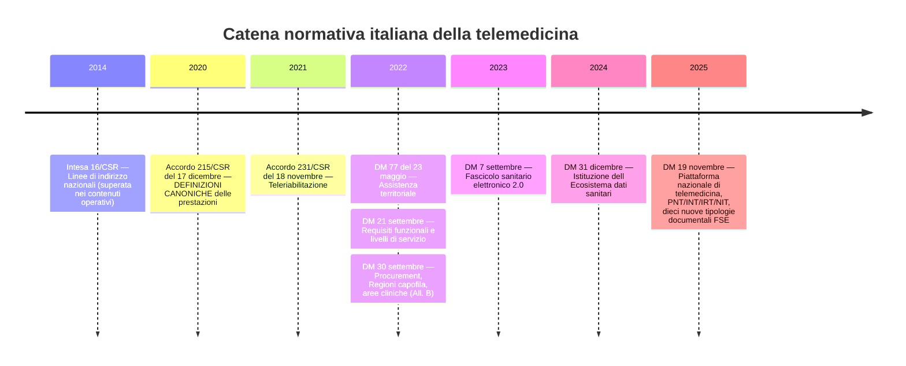
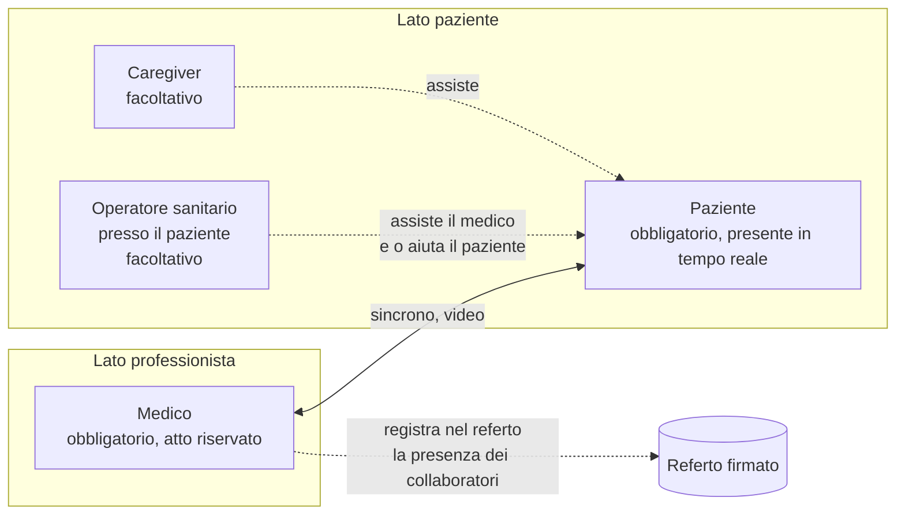
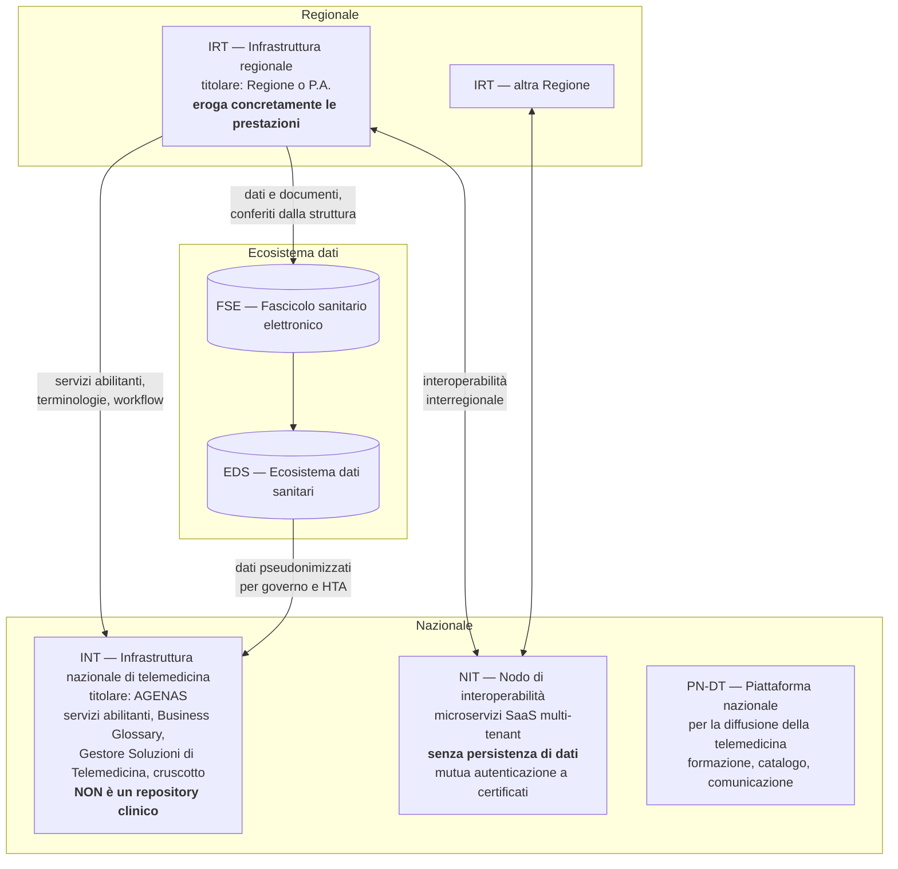

# Le prestazioni di telemedicina

Questo è il modulo più importante della guida, e la ragione è una sola: **in Italia le
prestazioni di telemedicina hanno definizioni normative, non commerciali.** Non sono nomi di
funzionalità che un prodotto può scegliere liberamente. Sono fattispecie giuridiche, ciascuna
con attori determinati, atti riservati, obblighi documentali, regole di remunerazione e
divieti espressi.

Sbagliare una definizione non produce un'imprecisione di marketing: produce un modello dati
sbagliato, documenti clinici invalidi, autorizzazioni concesse a chi non poteva compiere
l'atto, flussi di rendicontazione rifiutati e — nel caso peggiore — un atto sanitario
illegittimo.

Chi arriva dall'informatica tende a leggere «televisita» e «teleconsulto» come sinonimi
stilistici. Non lo sono. Cambiano il soggetto della prestazione, chi è presente, chi
risponde di cosa, cosa viene prodotto e chi paga. Il § 13 raccoglie gli errori più
frequenti; se hai poco tempo, leggi almeno quello e poi torna indietro.

---

## 1. Cos'è la telemedicina secondo la norma italiana

### 1.1 È un canale, non una specialità

La telemedicina è una **modalità di erogazione** di prestazioni sanitarie e sociosanitarie a
distanza, abilitata dalle tecnologie dell'informazione e della comunicazione. Non è una
disciplina clinica, non è un reparto, non è un tipo di prestazione: è il **canale** attraverso
cui si eroga una prestazione che, nella stragrande maggioranza dei casi, esiste già anche in
presenza.

Da questo discende immediatamente una conseguenza normativa che l'Accordo Stato-Regioni del
17 dicembre 2020, rep. atti n. 215/CSR, enuncia testualmente:

> «per tutte le prestazioni sanitarie erogate a distanza si applica il quadro normativo
> nazionale/regionale che regolamenta l'accesso ai diversi Livelli essenziali di Assistenza,
> il sistema di remunerazione/tariffazione vigente per l'erogazione delle medesime
> prestazioni in modalità "tradizionale", ivi incluse le norme per l'eventuale
> compartecipazione alla spesa.»

Tradotto: **non esiste un regime giuridico speciale della telemedicina**. Esiste il regime
della prestazione, che si applica anche quando la prestazione è erogata a distanza, con
l'aggiunta di alcuni obblighi specifici (§ 4.1.6).

### 1.2 Perché serve una definizione formale

Una definizione normativa serve a tre cose che un nome commerciale non fa:

- **delimita chi può fare cosa.** La televisita è definita «*un atto medico*»: da questa
  qualificazione discende che un infermiere non può erogarla, punto;
- **determina cosa viene prodotto.** La televisita in specialistica ambulatoriale «*deve
  sempre concludersi con un referto*»; il teleconsulto «*non dà luogo ad un referto a sé
  stante*». Sono due macchine a stati diverse;
- **determina se e come si paga.** La televisita è remunerata come visita di controllo; il
  teleconsulto non è remunerato affatto.

### 1.3 Cosa NON è telemedicina

L'Accordo 215/CSR 2020 esclude espressamente una fattispecie, e la esclusione è utile perché
disegna il confine per differenza:

> «**Triage telefonico**: il triage o la consulenza telefonica effettuati da medici o
> operatori sanitari verso i pazienti allo scopo di indicare il percorso
> diagnostico/terapeutico più appropriato e la necessità di eseguire la visita in tempi
> rapidi in presenza o a distanza o la possibilità di rimandarla ad un momento successivo
> assegnando un nuovo appuntamento, **non rientra tra le attività riconducibili alla
> telemedicina**.»

L'elemento discriminante non è il mezzo (il telefono) ma la **natura dell'atto**: instradare
verso il percorso appropriato non è erogare una prestazione. Sulla base dello stesso criterio
restano fuori dal perimetro, senza che la norma li nomini uno per uno:

- l'**invio del referto per posta elettronica**: è trasporto di un documento, non un atto;
  la telerefertazione è l'atto di refertare a distanza, non il canale di consegna;
- il **portale del paziente** che espone documenti già prodotti: è una funzione di accesso,
  non una prestazione;
- le **applicazioni di benessere** che raccolgono passi, sonno o battito senza un
  professionista responsabile e senza un piano: raccogliere misure non è telemonitoraggio
  (§ 4.5.4);
- la **comunicazione amministrativa** con il paziente (promemoria, disdette, istruzioni di
  accesso): resta comunicazione, e ha per giunta il vincolo di non contenere dato clinico.

---

## 2. La catena normativa: dove sta scritta ciascuna cosa

### 2.1 Quattro livelli con cogenza diversa

Il diritto italiano della telemedicina non è contenuto in una legge organica. È stratificato,
e i livelli hanno **destinatari e forza vincolante diversi**. Tenerli distinti non è
pedanteria: determina se un'affermazione della documentazione di prodotto è verificabile o è
un'esagerazione.

| Livello | Esempi | Cogenza | Destinatario |
|---|---|---|---|
| **1. Legge primaria** | Art. 12 D.L. 179/2012 conv. L. 221/2012, come novellato dall'art. 21 D.L. 4/2022 conv. L. 25/2022 | Piena | Stato, Regioni, strutture |
| **2. Atti della Conferenza Stato-Regioni** | Intesa 16/CSR 2014; **Accordo 215/CSR 2020**; Accordo 231/CSR 2021 | Si perfeziona con il recepimento regionale | Regioni e PP.AA. |
| **3. Decreti ministeriali** | DM 77/2022; **DM 21 settembre 2022**; DM 30 settembre 2022; DM 7 settembre 2023; **DM 19 novembre 2025** | Piena, ma spesso rivolta a Regioni e loro fornitori | Regioni, AGENAS, fornitori |
| **4. Regole tecniche trasversali della PA** | Codice dell'amministrazione digitale (D.lgs. 82/2005); linee guida AgID ex art. 71 CAD; determinazioni ACN; Piano triennale | Piena per le PA | Tutte le PA e i loro fornitori |

A questi si aggiungono due corpi normativi **orizzontali e pienamente vincolanti**: il
Regolamento (UE) 2016/679 (GDPR), trattato nel modulo
[03 — Il dato clinico](03-il-dato-clinico.md), e il Regolamento (UE) 2017/745 sui dispositivi
medici (MDR), trattato nel modulo
[15 — Il quadro regolatorio da zero](15-regolatorio-da-zero.md).

### 2.2 Cronologia essenziale

**Cosa impone ciascun atto a un applicativo**, in una riga:

- **Accordo 215/CSR 2020** — non parla quasi mai di software, ma **è la fonte delle
  definizioni** e quindi determina il modello di dominio. Impone: referto obbligatorio per la
  televisita; registrazione nel referto della presenza di collaboratori e della **qualità del
  collegamento**; cifratura di *tutti* i trasferimenti di voce, video, immagini e file;
  identità verificata del paziente; certificazione come dispositivo medico «*idonea alla
  tipologia di prestazione*».
- **DM 77/2022** — colloca la telemedicina dentro i percorsi territoriali. Non detta
  requisiti software, determina il contesto (modulo
  [01](01-sistema-sanitario-italiano.md), § 8).
- **DM 21 settembre 2022** — «Approvazione delle linee guida per i servizi di telemedicina —
  Requisiti funzionali e livelli di servizio», Gazzetta Ufficiale Serie generale n. 256 del
  2 novembre 2022. **È l'atto tecnicamente più prescrittivo**: architettura a micro-servizi,
  *event-driven*, containerizzata, *cloud native*, multi-tenant, *mobile first*, accessibile,
  con livelli di servizio H24 7/7.
- **DM 30 settembre 2022** — disciplina l'acquisto (Regioni capofila) e, nell'**Allegato B**,
  le aree cliniche e i requisiti clinici.
- **DM 7 settembre 2023** — fascicolo sanitario elettronico 2.0: contenuti, soggetti,
  consensi, alimentazione, consultazione (modulo
  [07](07-fse-e-infrastrutture-nazionali.md)).
- **DM 19 novembre 2025** — «Disciplina del trattamento dei dati personali nell'ambito della
  infrastruttura della Piattaforma nazionale telemedicina», Gazzetta Ufficiale Serie generale
  n. 301 del 30 dicembre 2025, atto 25A06938. Istituisce formalmente l'architettura
  nazionale, crea **dieci nuove tipologie documentali del FSE** dedicate alla telemedicina,
  e definisce misure di sicurezza estremamente prescrittive.

> **Nota di citazione.** Il titolo pubblicato in Gazzetta è «*della infrastruttura della
> Piattaforma nazionale telemedicina*», senza «di» davanti a «telemedicina». Diverse fonti,
> compresa una precedente ricerca interna al progetto, riportano il titolo con l'articolazione
> più naturale in italiano. Nelle citazioni formali va usato il titolo pubblicato.

### 2.3 Due tassonomie che non coincidono

Questo è il primo scoglio serio, e va affrontato subito perché il modello dati deve
rappresentarlo.

L'**Accordo 215/CSR 2020** elenca **cinque attività ambulatoriali** — televisita, teleconsulto,
teleconsulenza, teleassistenza, telerefertazione — più **telecontrollo** e **telemonitoraggio**
come «modalità operative».

Il **DM 21 settembre 2022** individua invece **quattro «servizi minimi»** che l'infrastruttura
regionale deve erogare:

> «I servizi minimi che l'infrastruttura regionale di telemedicina deve erogare sono i
> seguenti: **televisita; teleconsulto/teleconsulenza; telemonitoraggio; teleassistenza**.»

Le due tassonomie **non si sovrappongono**:

| Accordo 215/CSR 2020 | DM 21 settembre 2022 | Cosa cambia |
|---|---|---|
| Televisita | Televisita | Coincidono |
| Teleconsulto | Teleconsulto/teleconsulenza | **Unificati** in un solo servizio minimo |
| Teleconsulenza | Teleconsulto/teleconsulenza | **Unificati** in un solo servizio minimo |
| Teleassistenza | Teleassistenza | Coincidono |
| Telerefertazione | *(assente)* | **Scompare come servizio autonomo**: diventa il micro-servizio trasversale «refertazione e firma digitale» |
| Telemonitoraggio (modalità operativa) | Telemonitoraggio | **Promosso a servizio minimo** |
| Telecontrollo (modalità operativa) | *(non elencato fra i minimi)* | Resta modalità operativa, ma è **prestazione tariffata** |

**Il modello di dominio deve rappresentare entrambe le tassonomie e la loro mappatura.** Non
è possibile sceglierne una: la prima determina la legittimità dell'atto e la refertazione, la
seconda determina l'ammissibilità in gara e la struttura dei micro-servizi.

Esiste inoltre, dal 29 gennaio 2026, un **Glossario nazionale di Telemedicina** pubblicato da
AGENAS nel Business Glossary della Piattaforma nazionale (v. 1.0.0). Il glossario del
progetto — modulo [19](19-glossario.md) — deve allinearsi a quello, ove diverga.

---

## 3. Come leggere le schede che seguono

Ogni prestazione è descritta con la stessa griglia, perché sono precisamente queste
dimensioni a cambiare da una all'altra:

- **definizione normativa** — testuale, dalla fonte, tra virgolette;
- **attori** — chi compie l'atto;
- **chi è presente** — il paziente c'è o no; è sincrono o asincrono;
- **chi è responsabile** — di cosa risponde chi;
- **cosa viene prodotto** — quale documento, con quali requisiti;
- **cosa non può essere fatto** — i limiti espressi;
- **effetti sul modello dati** — la traduzione ingegneristica.

Le definizioni in blocco citazione sono riportate **verbatim** dall'Allegato A all'Accordo
Stato-Regioni 17 dicembre 2020, rep. atti n. 215/CSR (versione 4.4 del 27 ottobre 2020),
salvo diversa indicazione.

---

## 4. Le prestazioni, una per una

### 4.1 Televisita

#### 4.1.1 Definizione

> «È un atto medico in cui il professionista interagisce a distanza in tempo reale con il
> paziente, anche con il supporto di un *care-giver*. Tuttavia, la televisita, come previsto
> anche dal codice di deontologia medica, non può essere mai considerata il mezzo per
> condurre la relazione medico-paziente esclusivamente a distanza, né può essere considerata
> in modo automatico sostitutiva della prima visita medica in presenza. Il medico è deputato
> a decidere in quali situazioni e in che misura la televisita può essere impiegata in favore
> del paziente, utilizzando anche gli strumenti di telemedicina per le attività di
> rilevazione, o monitoraggio a distanza, dei parametri biologici e di sorveglianza clinica.
> **La televisita è da intendersi limitata alle attività di controllo di pazienti la cui
> diagnosi sia già stata formulata nel corso di visita in presenza.**»

#### 4.1.2 Attori e presenza

- **Medico** — l'atto è riservato al medico. Nessun'altra professione sanitaria può erogare
  una televisita.
- **Paziente** — presente, **in tempo reale**. La televisita è per definizione sincrona: non
  esiste una televisita asincrona.
- **Caregiver** — facoltativo; assiste, non rappresenta. Un caregiver **non può prestare
  consenso in sostituzione di un paziente capace**, in nessuna configurazione.
- **Operatore sanitario presso il paziente** — facoltativo. L'Accordo lo prevede
  espressamente: «*Durante la televisita un operatore sanitario che si trovi vicino al
  paziente può assistere il medico e/o aiutare il paziente*».

#### 4.1.3 Il vincolo sulla prima visita: la lettura esatta

Questo è il punto su cui circolano più semplificazioni errate, in entrambe le direzioni. Il
testo contiene **due affermazioni distinte con intensità diversa**:

1. la televisita **non è automaticamente sostitutiva** della prima visita in presenza;
2. la televisita **è da intendersi limitata alle attività di controllo** di pazienti già
   diagnosticati in presenza.

La seconda è più restrittiva della prima. Non si tratta però di un **divieto assoluto**: è
una **delimitazione dell'ambito ordinario**, temperata dalla clausola di responsabilità
medica («*il medico è deputato a decidere*»).

E il quadro si articola ulteriormente a livello regionale. Le Indicazioni regionali
dell'Emilia-Romagna (BUR n. 255 del 17 agosto 2021, Allegato 2) affermano che «*non se ne
esclude la possibilità di utilizzo anche nei casi in cui il paziente sia inviato per la prima
volta ad uno specialista a seguito di teleconsulto tra il MMG/PLS e lo specialista*».
**Questa apertura è regionale, non nazionale.**

> **Regola redazionale del progetto.** Scrivere «la televisita non può mai sostituire la
> prima visita» è **impreciso**. Scrivere «la televisita è ammessa in prima visita dopo
> teleconsulto» è **impreciso in senso opposto**. La formulazione corretta è stratificata:
> regola nazionale come predefinito restrittivo, deroga regionale come configurazione
> esplicita e tracciata, decisione finale in capo al medico e registrata.

#### 4.1.4 Condizioni tassative di erogabilità

Sono erogabili in televisita le prestazioni ambulatoriali che **non richiedono la completezza
dell'esame obiettivo** (tradizionalmente composto da ispezione, palpazione, percussione e
auscultazione) **e** in presenza di **almeno una** delle seguenti condizioni:

1. il paziente necessita della prestazione nell'ambito di un **PAI** (piano assistenziale
   individuale) o di un **PDTA** (percorso diagnostico-terapeutico assistenziale);
2. il paziente è inserito in un percorso di **follow-up da patologia nota**;
3. il paziente affetto da patologia nota necessita di **controllo o monitoraggio, conferma,
   aggiustamento o cambiamento della terapia in corso** (per esempio rinnovo o modifica del
   piano terapeutico);
4. il paziente necessita di **valutazione anamnestica** per la prescrizione di esami di
   diagnosi o di stadiazione di patologia nota o sospetta;
5. il paziente necessita della **verifica da parte del medico degli esiti di esami
   effettuati**, cui può seguire la prescrizione di approfondimenti o di una terapia.

**Effetto sul modello dati.** Questa è una **precondizione di dominio, non un campo
descrittivo**. Il sistema deve richiedere, prima dell'erogazione, la registrazione esplicita
di (a) assenza di necessità di esame obiettivo completo e (b) almeno una delle cinque
condizioni. La scelta è attribuita al medico, tracciata e non modificabile a posteriori.
Nella terminologia del progetto è il **gate di appropriatezza**.

A questo si aggiunge una fase ulteriore introdotta dal documento metodologico più recente:
il **Modello orientativo di erogazione della Televisita** di AGENAS (v. 1.0.25 del 16 aprile
2026) prevede una fase di «verifica di eseguibilità» articolata su tre dimensioni — **utilità
clinica**, **sicurezza clinica** e **verifica della compliance digitale del paziente**, cioè
l'accertamento della sua capacità di interagire con i sistemi digitali. Il documento è
metodologico e non normativo `[RACCOMANDATO]`, ma è di fatto atteso in sede di gara: la
«compliance digitale» va modellata come fase distinta dall'adesione informata e dal consenso
al trattamento.

#### 4.1.5 Chi è responsabile

- Il **medico** risponde dell'atto sanitario: dell'appropriatezza del canale, dell'adeguatezza
  della prestazione erogata a distanza, dell'attestazione della qualità del collegamento,
  del referto e della sua firma.
- L'**organizzazione sanitaria** risponde della dotazione tecnica. Il DM 30 settembre 2022,
  Allegato B, è testuale: «*l'organizzazione sanitaria è responsabile della corretta dotazione
  delle risorse hardware, software e di telecomunicazione e della loro conformità alle leggi,
  ai regolamenti e alle norme tecniche di riferimento in Italia*».
- Il **fornitore del software** risponde della conformità del prodotto a ciò che dichiara, e
  degli obblighi che gli derivano dalla disciplina dei dispositivi medici quando applicabile.

#### 4.1.6 Cosa viene prodotto

> «La televisita erogata nell'ambito dell'attività specialistica ambulatoriale **deve sempre
> concludersi con un referto**.»

Nel referto, oltre alle consuete informazioni, devono essere registrati:

- l'indicazione di eventuali **collaboratori partecipanti** (presenza di caregiver, presenza
  di un medico);
- la **qualità del collegamento e la conferma dell'idoneità dello stesso all'esecuzione della
  prestazione**.

Il referto va **sottoscritto digitalmente** dal medico, reso disponibile al paziente nella
modalità telematica preferita, e deve essere sempre possibile, su richiesta del paziente,
condividerlo con altri sanitari in formato digitale, «*anche attraverso il Fascicolo Sanitario
Elettronico*».

**L'obbligo non è però incondizionato.** Il DM 30 settembre 2022, Allegato B, sezione
«Modalità di erogazione», introduce due deroghe che dipendono dal *setting*:

> «La **prescrizione della televisita non è necessaria** qualora venga programmata ed erogata
> direttamente **dal MMG o dal PLS** e sono erogabili in qualsiasi tipo di PDTA.»

> «La televisita **si conclude sempre con un referto (ad eccezione nei casi in cui la
> televisita sia effettuata dal MMG/PLS)** che deve essere inviato al FSE. Tuttavia, qualora
> il paziente abbia difficoltà ad accedere al proprio FSE, su richiesta, il referto potrà
> essere inviato anche in **modalità sicura, con doppia autenticazione**.»

**Il modello di dominio deve quindi rappresentare il *setting* di erogazione come
discriminante di regole**: televisita in specialistica ambulatoriale → prescrizione
necessaria e referto obbligatorio; televisita erogata da medico di medicina generale o
pediatra di libera scelta → prescrizione non necessaria e annotazione digitale in luogo del
referto.

#### 4.1.7 L'attestazione della qualità del collegamento

Merita un paragrafo proprio perché è il requisito che collega la norma clinica
all'ingegneria del media, ed è probabilmente il punto in cui questo progetto ha il vantaggio
più difendibile.

La norma impone al medico di attestare che il collegamento fosse idoneo. Non fissa **alcuna
soglia numerica**: la ricerca condotta dal progetto su tutte le fonti nazionali si è chiusa
in senso negativo. **Non esistono, nelle fonti italiane esaminate, soglie tecniche
quantitative vincolanti per l'erogazione di prestazioni in telemedicina**: nessuna risoluzione
minima, nessun frame rate, nessuna banda in Mbps, nessuna latenza massima. Il modello
normativo italiano è **qualitativo e a responsabilità distribuita**: il giudizio di idoneità
è del medico, sul singolo atto.

La catena logica corretta, che la documentazione del progetto deve esplicitare senza
scorciatoie, è:

1. la norma impone al medico di attestare l'idoneità del collegamento;
2. l'attestazione richiede evidenza oggettiva, altrimenti è un'affermazione nuda;
3. le metriche di sessione — tempo di andata e ritorno, perdita di pacchetti, *jitter*,
   *bitrate* — **sono** quell'evidenza;
4. la soglia di allarme è **una scelta del prodotto**, configurabile per tenant, **non una
   soglia di legge**.

> **Vincolo di onestà documentale.** Il target di latenza dichiarato pubblicamente dal
> progetto non ha e non può avere natura di conformità normativa. Va presentato come
> **obiettivo ingegneristico**, non come «requisito di legge». Affermare il contrario sarebbe
> un errore verificabile da chiunque legga le fonti. Le soglie diventano invece
> normativamente rilevanti per un'altra via: come parte della **destinazione d'uso** ai fini
> della disciplina dei dispositivi medici e come input della gestione del rischio secondo la
> ISO 14971.

C'è un problema aperto in questa area, ed è meglio conoscerlo subito: il **tracciato
ministeriale del referto di televisita non prevede un campo dedicato** alla qualità del
collegamento (§ 7.2). I candidati naturali a veicolarla sono i campi «Modalità esecuzione
procedura operativa», «Strumentazione utilizzata» e «Parametri descrittivi della procedura».
La collocazione è oggetto di una decisione architetturale da documentare.

#### 4.1.8 Esiti tipizzati

L'Accordo elenca gli esiti ammissibili di una televisita, e sono **un'enumerazione di
dominio**, non un campo di testo libero:

- riscontro o meno di stabilità clinica nel quadro diagnostico noto;
- necessità o meno di accesso urgente a prestazioni diagnostico-terapeutiche, con presa in
  carico da parte dello specialista;
- richiesta di approfondimento diagnostico, con indicazione del codice di priorità in ricetta;
- prescrizione o rinnovo di piano terapeutico;
- riprogrammazione in modalità ordinaria in caso di esito insoddisfacente.

#### 4.1.9 Cosa non può essere fatto

- **Non è ammessa in urgenza/emergenza.** Il DM 30 settembre 2022, Allegato B, è esplicito:
  per il paziente in urgenza/emergenza la televisita «*non è suggeribile in quanto non deve
  costituire ragione per ritardare interventi in presenza nei casi in cui questi garantiscono
  maggiore efficacia o sicurezza rispetto all'intervento da remoto*». Il sistema **non deve
  offrire percorsi di televisita in contesti di urgenza**.
- **Non è ammessa quando serve l'esame obiettivo completo.**
- **Non sostituisce automaticamente la prima visita** (§ 4.1.3).
- **È sconsigliata a domicilio** per pazienti con patologie acute o riacutizzazioni in atto e
  per pazienti cronici fragili o disabili la cui permanenza a domicilio sia imprudente. È una
  raccomandazione `[RACCOMANDATO]`, non un divieto, ma è rilevante per la gestione del
  rischio e per la definizione della destinazione d'uso.

#### 4.1.10 Il ripiego in presenza è obbligatorio, non facoltativo

> «Qualora lo strumento di Telemedicina non permetta di mantenere inalterato il contenuto
> sostanziale della prestazione da erogare, le Aziende e gli erogatori privati sono tenuti a
> **completare la prestazione in modalità tradizionale senza ulteriori oneri a carico del SSN
> e/o utente**.»

E in caso di insufficienza del risultato «*per qualunque motivo (tecnico, legato alle
condizioni riscontrate del paziente o altro)*» scatta «*l'obbligo della riprogrammazione della
prestazione in presenza*».

Il Modello orientativo AGENAS aggiunge il presupposto operativo: «*se problemi tecnici
impediscono una comunicazione adeguata, il medico deve interrompere la televisita*» e
organizzare una visita in presenza, garantendo la prenotazione su agende digitali «*in tempi
adeguati alle necessità del paziente*».

**Effetto sul modello dati.** Il fallimento tecnico **non è una gestione dell'errore: è un
requisito funzionale**. Il sistema deve tracciare l'interruzione come esito tipizzato,
registrarne la causa, generare l'evento di riprogrammazione in presenza e agganciarlo alla
prenotazione, il tutto senza addebito ulteriore. Un `catch` che logga e mostra «connessione
persa» non soddisfa la norma.

---

### 4.2 Teleconsulto medico

#### 4.2.1 Definizione

> «È un atto medico in cui il professionista interagisce a distanza con uno o più medici per
> dialogare, anche tramite una videochiamata, riguardo la situazione clinica di un paziente,
> basandosi primariamente sulla condivisione di tutti i dati clinici, i referti, le immagini,
> gli audio-video riguardanti il caso specifico. Tutti i suddetti elementi devono essere
> condivisi per via telematica sotto forma di file digitali idonei per il lavoro che i medici
> in teleconsulto ritengono necessario per l'adeguato svolgimento di esso. Il teleconsulto tra
> professionisti **può svolgersi anche in modalità asincrona**, quando la situazione del
> paziente lo permette in sicurezza. **Quando il paziente è presente al teleconsulto, allora
> esso si svolge in tempo reale utilizzando le modalità operative analoghe a quelle di una
> televisita e si configura come una visita multidisciplinare.**»

#### 4.2.2 Attori, presenza, responsabilità

- **Attori**: **due o più medici**. L'asse della relazione è medico-medico, non
  medico-paziente.
- **Presenza del paziente**: facoltativa. Se presente, la sessione diventa in tempo reale e
  si configura come **visita multidisciplinare**.
- **Sincronia**: ammessa **anche asincrona**, quando la situazione clinica lo consente in
  sicurezza.
- **Scopo**: «*condividere le scelte mediche rispetto a un paziente da parte dei professionisti
  coinvolti*» e fornire la ***second opinion*** specialistica ove richiesto.
- **Responsabilità**: la responsabilità clinica sul paziente resta al medico che lo ha in
  carico; il consulente risponde del proprio parere.

#### 4.2.3 Cosa viene prodotto: la distinzione cruciale

> «Il teleconsulto **contribuisce alla definizione del referto** che viene redatto al termine
> della visita erogata al paziente, **ma non dà luogo ad un referto a sé stante**.»

Per anni questo passaggio è stato letto come «il teleconsulto non produce nulla». **È una
lettura errata, e il DM 19 novembre 2025 la ha smentita.** Il decreto crea una tipologia
documentale FSE autonoma — la **relazione collaborativa per il teleconsulto/teleconsulenza**,
lettera q) — con questa regola strutturale (Allegato 1, § 2.21):

> «La relazione collaborativa **viene conferita al FSE come allegato del documento di referto**
> relativo alla prestazione o all'evento principale (es. visita specialistica, ricovero,
> visita del medico del ruolo unico di assistenza primaria, etc.) redatto dal medico
> richiedente la consulenza.»

Quindi: **il teleconsulto non produce un referto autonomo, ma produce un documento FSE
autonomo per tipologia, che viene allegato al referto dell'evento principale.** Nel modello
dati sono due cose distinte: il divieto riguarda la generazione di un referto specialistico;
l'obbligo riguarda la produzione della relazione e la sua correlazione tramite `idRichiesta`.

#### 4.2.4 Non è remunerato

Il teleconsulto **non è una prestazione specialistica autonoma**: non ha voce a nomenclatore,
non prevede prescrizione a carico del SSN né compartecipazione alla spesa, e rientra
nell'attività lavorativa ordinaria del professionista. Il rapporto dell'Istituto Superiore di
Sanità (Rapporti ISTISAN 25/16) lo conferma testualmente. Alcune Province autonome avevano
istituito un codice e una tariffa propri, poi divenuti inoperanti con l'entrata in vigore del
nuovo tariffario nazionale.

**Un modello di business fondato sul volume di teleconsulti nel SSN non ha fonte di ricavo
diretta.** La documentazione commerciale del progetto non deve suggerire il contrario.

#### 4.2.5 La richiesta di teleconsulto

Il DM 19 novembre 2025 tipizza anche la **richiesta** (lettera o), con una regola di
generazione precisa:

> «La richiesta di teleconsulto **viene generata internamente alle IRT**. La piena operatività
> del servizio in caso di interoperabilità tra IRT di regioni o province autonome diverse da
> quella di assistenza è garantita dalla INT, ai sensi dell'articolo 3, comma 4.»

Il tracciato contiene elementi che il modello dati deve prevedere e che non sono ovvi:
`idRichiesta`; il codice fiscale del **medico titolare** e quello del **medico sostituto**;
la classe di priorità; una **proposta di slot temporale**; un flag «richiesta disponibilità
immediata», **compatibile solo con urgenza alta**; il **raggio di erogazione** con valori
*aziendale*, *regionale*, *nazionale*, che determina l'ampiezza della ricerca dei
professionisti disponibili; i codici di prestazione sia del **nomenclatore nazionale**
(`codProdPrest`) sia del **catalogo regionale unico** (`codCatalogoPrescr`); e i campi per
assistiti SASN (personale navigante) e per soggetti assicurati da istituzioni estere.

Infine, un campo che sintetizza in una stringa tutta la complessità delle definizioni: la
**modalità di esecuzione della procedura operativa** deve rappresentare, in forma
strutturata, la combinazione **estemporaneo | programmato** × **sincrono | asincrono** ×
**con presenza dell'assistito | senza presenza dell'assistito**.

---

### 4.3 Teleconsulenza medico-sanitaria

#### 4.3.1 Definizione

> «È un'attività sanitaria, **non necessariamente medica ma comunque specifica delle
> professioni sanitarie**, che si svolge a distanza ed è eseguita da due o più persone che
> hanno differenti responsabilità rispetto al caso specifico. Essa consiste nella richiesta di
> supporto durante lo svolgimento di attività sanitarie, a cui segue una videochiamata in cui
> il professionista sanitario interpellato fornisce all'altro, o agli altri, indicazioni per
> la presa di decisione e/o per la corretta esecuzione di azioni assistenziali rivolte al
> paziente. La teleconsulenza **può essere svolta in presenza del paziente, oppure in maniera
> differita**. In questa attività è preminente l'interazione diretta tramite la videochiamata,
> ma è sempre necessario garantire all'occorrenza la possibilità di condividere almeno tutti i
> dati clinici, i referti e le immagini riguardanti il caso specifico. **È un'attività su
> richiesta ma sempre programmata e non può essere utilizzata per surrogare le attività di
> soccorso.**»

#### 4.3.2 Le quattro differenze rispetto al teleconsulto

Sono sottili e vanno tenute a mente, perché il DM 21 settembre 2022 li unifica in un unico
servizio minimo mentre l'Accordo li distingue come atti:

1. **gli attori non sono necessariamente medici**: sono esercenti le professioni sanitarie
   con **responsabilità differenti** sul caso;
2. **l'elemento preminente è la videochiamata**, non la condivisione documentale (nel
   teleconsulto è l'opposto);
3. **è sempre programmata**, mai estemporanea;
4. c'è un **divieto espresso** di uso in surroga delle attività di soccorso.

Come il teleconsulto, non è prestazione con codifica a nomenclatore e non è remunerata.

Il divieto del punto 4 va letto insieme a un'altra regola: il DM 30 settembre 2022, Allegato
B, afferma che il teleconsulto/teleconsulenza è invece «*eseguibile anche in situazioni di
urgenza o emergenza*». Le due affermazioni non sono in contraddizione: il teleconsulto fra
professionisti può servire in urgenza, ma **non può prendere il posto del soccorso**. La
distinzione è fra supportare chi soccorre e sostituirsi al soccorso.

---

### 4.4 Teleassistenza da parte delle professioni sanitarie

#### 4.4.1 Definizione

> «(infermiere/fisioterapista/logopedista/ecc): è **un atto professionale di pertinenza della
> relativa professione sanitaria** e si basa sull'interazione a distanza tra il professionista
> e paziente/*caregiver* per mezzo di una videochiamata, alla quale si può all'occorrenza
> aggiungere la condivisione di dati, referti o immagini. Il professionista che svolge
> l'attività di teleassistenza può anche utilizzare idonee app per somministrare questionari,
> condividere immagini o video tutorial su attività specifiche. Lo scopo della teleassistenza
> è quello di agevolare il corretto svolgimento di attività assistenziali, **eseguibili
> prevalentemente a domicilio**. La teleassistenza è **prevalentemente programmata e
> ripetibile** in base a specifici programmi di accompagnamento del paziente.»

#### 4.4.2 Caratteristiche

- **Attori**: professionista sanitario **non medico**; paziente e/o caregiver.
- **Non è atto medico**, non produce referto specialistico.
- **È per definizione ripetitiva e programmata**: il contenitore naturale è un piano, non un
  contatto isolato.
- **Ha finalità assistenziale, non diagnostica.**
- Produce, ai sensi del DM 19 novembre 2025, una **relazione clinico-assistenziale conclusiva**
  (tipologia documentale FSE, lettera r).

#### 4.4.3 Un requisito software peculiare

Il DM 21 settembre 2022 impone una cosa che a prima vista sorprende:

> «È infatti necessario che il servizio di Teleassistenza sia in grado di rendere disponibile
> anche **tutte le funzionalità presenti per la televisita e per il telemonitoraggio**.»

Sul piano software la teleassistenza è quindi **un servizio ibrido che riusa le capacità
degli altri due**. Non è un modulo autonomo: è una composizione. Chi progetta i confini dei
contesti delimitati deve tenerne conto, perché una separazione troppo rigida fra televisita e
telemonitoraggio rende la teleassistenza impossibile da comporre.

Il DM 19 novembre 2025 aggiunge, fra i micro-servizi essenziali della teleassistenza, la
**gestione del gruppo multiprofessionale di cura** e il **supporto al caregiver** con canale
digitale dedicato.

---

### 4.5 Telemonitoraggio e telecontrollo

#### 4.5.1 Telecontrollo medico

> «modalità operativa della telemedicina che consente il controllo a distanza del paziente.
> Tale attività è caratterizzata da una serie cadenzata di contatti con il medico, che pone
> sotto controllo l'andamento del quadro clinico, per mezzo della videochiamata in
> associazione con la condivisione di dati clinici raccolti presso il paziente, sia prima che
> durante la videochiamata stessa.»

Il telecontrollo è **prestazione medica**, annoverata fra le prestazioni del nomenclatore
tariffario e rendicontata nei flussi della specialistica ambulatoriale. È quindi
**remunerato**, a differenza del telemonitoraggio puro.

#### 4.5.2 Telemonitoraggio

> «modalità operativa della telemedicina che permette il rilevamento e la trasmissione a
> distanza di parametri vitali e clinici in modo continuo, per mezzo di sensori che
> interagiscono con il paziente (tecnologie biomediche con o senza parti applicate).»

Il *set* di tecnologie a domicilio «*deve essere connesso costantemente al sistema software
che raccoglie i dati dei sensori, li integra se necessario con altri dati sanitari e li mette
a disposizione degli operatori del servizio di Telemedicina in base alle modalità
organizzative stabilite*».

#### 4.5.3 La regola di afferenza

> «il telemonitoraggio **non afferisce all'ambito di specialistica ambulatoriale, a meno che
> non sia affiancato dal telecontrollo medico, da una televisita o anche da una visita in
> presenza** in cui i dati registrati in continuo vengono analizzati, discussi e comunicati al
> paziente. I risultati del telemonitoraggio devono essere indicati nel referto della visita
> di controllo periodica.»

Detto altrimenti: **raccogliere dati non è una prestazione. Diventa prestazione quando un
medico li guarda dentro un atto clinico.** Questa è forse la singola frase più utile del
modulo per chi arriva dall'informatica.

#### 4.5.4 Il telemonitoraggio non è «raccogliere dati da un dispositivo»

Vale la pena esplicitarlo perché è l'errore più comune. Un servizio di telemonitoraggio
conforme comprende, secondo il DM 19 novembre 2025 (Allegato 3, § 4.1), micro-servizi
essenziali che nulla hanno a che vedere con l'ingestione:

- **definizione del percorso di cura** e **motore di workflow**;
- **validazione della qualità dei dati** ricevuti;
- **configuratore dei dispositivi medici**, con soglie di allarme, frequenza e intervalli
  critici;
- **formazione del paziente e del caregiver** all'uso;
- **gestione dei questionari**;
- **case manager**;
- **eventi e notifiche**, videoconferenza, chat.

E produce **quattro tipologie documentali FSE distinte**: il *tesserino dispositivi* firmato
digitalmente dal professionista che assegna il dispositivo, il *piano di telemonitoraggio*,
il *report delle rilevazioni*, il *report settimanale*, la *relazione finale* (§ 7.1).

Il **tesserino dispositivi** contiene, fra l'altro, l'**identificazione unica del dispositivo
(UDI)** in formato di identificazione automatica e raccolta dei dati, il numero di serie o di
lotto, nome, indirizzo e sito web del **fabbricante**, il tipo di collegamento e di
alimentazione, l'esito del **check tecnico** e i parametri di connettività, configurazione e
taratura. Non è un elenco di attributi arbitrari: è la tracciabilità di un dispositivo medico
assegnato a una persona.

Il **piano di telemonitoraggio** contiene numero di cicli, durata del ciclo, numero di
attività per ciclo, frequenza («1 ril/die», «2 ril/sett», oppure «incontinuo»), fascia oraria,
**durata prevista massima di un anno**, tipo di rilevazione («intermediato» oppure «ciclo
chiuso» con interoperabilità diretta), **soglia di allarme** e **regole** descrittive del
comportamento in caso di violazione delle soglie.

#### 4.5.5 Perché il telemonitoraggio cambia la classificazione del software

Il DM 21 settembre 2022 è esplicito:

> «Si richiede altresì, in linea con quanto riportato all'interno della *«Guidance on
> Qualification and Classification of Software in Regulation (EU) 2017/745 – MDR and
> Regulation (EU) 2017/746»*, che **la Infrastruttura regionale di telemedicina per il
> servizio minimo di telemonitoraggio debba essere certificata come dispositivo medico**.»

E per il telemonitoraggio avanzato: «*potrebbe essere richiesta una classe di rischio
superiore alla IIa*».

Questa è la ragione per cui il progetto ha assunto, come decisione vincolante, la
qualificazione come **software dispositivo medico di Classe IIa**, con Organismo Notificato e
sistema di gestione qualità certificato. L'elemento che fonda la qualificazione è la
**valutazione automatica delle soglie**: nel momento in cui il sistema confronta una misura
con una soglia e genera un'allerta, sta *interpretando* un dato clinico.

Vincolo di dominio che ne discende, e che va rispettato senza eccezioni: **la soglia e
l'allerta sono configurate dal professionista, mai dedotte dal sistema**. Il perimetro
adottato dal progetto è l'ingestione di misure da un gateway di terze parti più
l'inserimento manuale da paziente o caregiver più questionari strutturati; il progetto **non
dialoga direttamente con i dispositivi medici** e non assume responsabilità sull'accuratezza
della catena di misura hardware.

---

### 4.6 Telerefertazione

#### 4.6.1 Definizione

> «È una relazione rilasciata dal medico che ha sottoposto un paziente a un esame clinico o
> strumentale il cui contenuto è quello tipico delle refertazioni eseguite in presenza e che
> viene scritta e trasmessa per mezzo di sistemi digitali e di telecomunicazione. Il medico
> esegue e invia il telereferto in tempi idonei alle necessità cliniche del paziente e in modo
> concorde con il medico che ha richiesto l'esame clinico o strumentale.»

Modalità previste: (a) telereferto rilasciato **successivamente** all'esecuzione tradizionale
in presenza dell'esame; (b) telereferto rilasciato all'interno di un processo di
**telegestione**, in cui il medico refertante è distante dal luogo di esecuzione dell'esame e
si avvale della collaborazione del medico richiedente o di un sanitario presso il paziente,
comunicando con essi in tempo reale.

#### 4.6.2 Cosa impone al software

Tre elementi ricadono direttamente sull'implementazione:

- «*Il telereferto formalizza la telediagnosi **con firma digitale validata del medico
  responsabile dello stesso***»;
- le strutture devono «*preventivamente effettuare **prove di idoneità all'uso clinico** delle
  attrezzature, dell'hardware e software e in esercizio prove di funzionamento a intervalli
  regolari e dopo ogni intervento rilevante di manutenzione o aggiornamento*»;
- devono «*garantire la corretta archiviazione all'interno di **un sistema di
  interoperabilità** del materiale prodotto dall'esame e del referto correlato, che permetta
  al personale sanitario di richiamare e confrontare quanto eseguito in precedenza*».

Il secondo punto è un obbligo di **processo** che si traduce in artefatti: verbali di collaudo,
rapporti tecnici di dettaglio, tracciabilità degli aggiornamenti. Non è un requisito
funzionale del prodotto, è un requisito del ciclo di vita.

#### 4.6.3 Non è una prestazione a sé

«*Il referto rappresenta l'attività di completamento della prestazione specialistica*»: la
telerefertazione **non è tariffata autonomamente**.

Nel DM 21 settembre 2022 la telerefertazione non compare fra i servizi minimi: diventa il
micro-servizio **trasversale** «refertazione e firma digitale». E su questo il decreto pone un
divieto che ha impatto architetturale diretto:

> «il micro-servizio "refertazione e firma digitale" **non si deve realizzare un modulo *ad
> hoc*** per la gestione della refertazione e della firma digitale di una prestazione in
> telemedicina ma si deve prevedere **l'integrazione con il modulo regionale**, se già
> presente.»

Da qui la decisione di progetto: i moduli di refertazione, agenda e fatturazione esistono ma
sono **disattivabili e sostituibili per configurazione**. Quando esiste un modulo regionale o
dell'integratore, il sistema si integra invece di duplicare.

---

### 4.7 Teleriabilitazione

Disciplinata autonomamente dall'**Accordo Stato-Regioni 18 novembre 2021, rep. atti n.
231/CSR**, «Indicazioni nazionali per l'erogazione di prestazioni e servizi di teleriabilitazione
da parte delle professioni sanitarie».

Elementi chiave:

- le prestazioni devono essere inquadrate nel **Progetto riabilitativo individuale (PRI)**:
  non esistono sedute isolate;
- la **tariffazione è equivalente** a quella delle prestazioni in presenza;
- le strutture che intendono erogare teleriabilitazione a carico del SSN devono essere
  **accreditate per le medesime attività in presenza**;
- è richiesto il consenso del paziente alle attività proposte **e** al trattamento dei dati:
  due consensi distinti (modulo [03](03-il-dato-clinico.md), § 2).

**Effetto sul modello dati.** La teleriabilitazione ha durata pluri-sessione. Modellarla come
singolo contatto perde il ciclo: serve un contenitore (`EpisodeOfCare` o `CarePlan`) e la
misurazione dell'aderenza al programma. Produce una **relazione finale** come tipologia
documentale FSE (lettera w).

---

### 4.8 Due nozioni di confine

**Secondo parere (*second opinion*).** Valutazione indipendente richiesta a un professionista
diverso da quello che ha in carico il paziente, di norma asincrona e su documentazione. **Non
è un teleconsulto**: il richiedente può essere **il paziente stesso**, e il consulente non
entra nella presa in carico. Il DM 19 novembre 2025 lo elenca fra i micro-servizi essenziali
del teleconsulto («definizione di secondo parere»), il che indica che la piattaforma deve
supportarlo, ma la fattispecie giuridica resta distinta.

**Telecooperazione sanitaria.** Assistenza fornita da un medico a distanza a un altro
operatore impegnato **in un atto in corso**, tipicamente in emergenza-urgenza territoriale.
La sincronia è vincolante e la latenza tollerabile è molto più bassa che in televisita: gli
obiettivi di servizio non sono riusabili. La fattispecie non compare nell'elenco delle
prestazioni dell'Accordo 215/CSR 2020 e nel progetto è trattata come contesto d'uso fuori
perimetro della versione corrente. `[NV]` su una definizione normativa nazionale autonoma.

---

## 5. Tabella comparativa

| | **Televisita** | **Teleconsulto** | **Teleconsulenza** | **Teleassistenza** | **Telemonitoraggio** | **Telecontrollo** | **Telerefertazione** | **Teleriabilitazione** |
|---|---|---|---|---|---|---|---|---|
| **Chi eroga** | Medico (atto riservato) | Due o più medici | Due o più professionisti sanitari, anche non medici | Professionista sanitario non medico | Sistema + professionista responsabile | Medico | Medico refertante | Professionista della riabilitazione |
| **Paziente presente** | Sempre | Facoltativo | Facoltativo | Sempre (o caregiver) | No (misure) | Sì, in videochiamata | No | Sì |
| **Sincronia** | Sempre sincrona | Sincrona o asincrona | Sincrona o differita, sempre programmata | Sincrona | Continua/periodica | Sincrona cadenzata | Asincrona | Sincrona |
| **Produce referto autonomo** | **Sì** (salvo MMG/PLS) | **No** — ma produce relazione collaborativa allegata | **No** — come teleconsulto | No — relazione clinico-assistenziale conclusiva | No — report rilevazioni e relazione finale | Confluisce nel referto della visita | **È** il referto | Relazione finale |
| **Remunerata** | Sì, come visita di controllo | **No** | **No** | Secondo il setting | **No**, se non affiancata | **Sì**, voce a nomenclatore | No, completa la prestazione | Sì, equivalente alla presenza |
| **Prescrizione necessaria** | Sì (no se MMG/PLS) | No | No | Secondo il setting | Tracciato prescrizione specialistica; farmaceutica per i dispositivi | Sì | — | Secondo il PRI |
| **Ammessa in urgenza** | **No** | Sì | Sì, ma **mai in surroga del soccorso** | — | — | — | — | — |
| **Servizio minimo DM 21/09/2022** | Sì | Sì (unificato) | Sì (unificato) | Sì | Sì | No | No (micro-servizio trasversale) | No |
| **Tipologia documentale FSE** | lett. p) | lett. o) richiesta, q) relazione | lett. q) | lett. r) | lett. s), t), u), v), w) | — | — | lett. r), t), w) |

---

## 6. L'architettura nazionale e cosa implica per un applicativo terzo

### 6.1 I componenti

Il **DM 19 novembre 2025, art. 2**, istituisce presso AGENAS la **Piattaforma nazionale di
telemedicina (PNT)**, articolata in due componenti; l'Allegato 4, § 8, ne introduce una
terza che le ricerche precedenti non avevano individuato.

- **INT — Infrastruttura nazionale di telemedicina.** Titolarità e gestione ad **AGENAS**.
  Fornisce servizi abilitanti comuni, un modulo «Gestore Soluzioni di Telemedicina», un
  «Business Glossary» con Terminology Server, Authoring Tool e Library Repository, raccolta
  dati, motore di workflow, funzioni di governo. **Regola fondamentale**: «*La INT non
  effettua altri trattamenti di dati personali oltre a quelli previsti nel comma 5*». **Non è
  un repository clinico.** I dati clinici confluiscono direttamente in FSE ed EDS; il Garante
  per la protezione dei dati personali (parere n. 2 del 16 gennaio 2025) ha imposto questa
  scelta per evitare duplicazione e desincronizzazione.
- **IRT — Infrastrutture regionali di telemedicina.** Titolarità delle Regioni e delle
  Province autonome. **Sono le infrastrutture che erogano concretamente le prestazioni.**
- **NIT — Nodo di interoperabilità della telemedicina.** Realizzato ai sensi dell'art. 3,
  comma 4. «*Il NIT garantisce, senza meccanismi di persistenza di dati, l'interoperabilità
  delle IRT interessate […] mediante microservizi completamente automatizzati*». È il punto di
  aggancio interregionale, con requisiti tecnici puntuali: mutua autenticazione con
  certificato client, servizio OCSP e/o CRL con cambio di stato del certificato compromesso
  **entro un'ora**, API Management come unico punto di ingresso, IAM con *single sign-on*,
  PAM per gli amministratori, **divieto di sessioni multiple contemporanee con le stesse
  credenziali**.
- **PN-DT — Piattaforma nazionale per la diffusione della telemedicina.** Portale di supporto
  alla diffusione e alla formazione. La gestione è trasferita ad AGENAS entro novanta giorni
  dal collaudo (art. 17, c. 4).

### 6.2 La terza via dell'art. 3, comma 4

Questo è, per un progetto open source, il passaggio normativo più importante di tutto il
corpus.

Fino al 2025 la lettura corrente era che il canale di ingresso al mercato pubblico della
telemedicina fosse chiuso: le Regioni finanziate dal PNRR possono attivare le soluzioni
**esclusivamente attraverso le gare delle Regioni capofila** (DM 30 settembre 2022). Un
progetto alternativo poteva entrare solo come componente di un aggiudicatario, o fuori dal
perimetro PNRR.

Il **DM 19 novembre 2025, art. 3, comma 4** apre una porta esplicita:

> «Le regioni possono erogare telemedicina con **infrastrutture, applicativi o strumenti
> diversi**, purché rispettino **standard tecnici certificati da Agenas** e **alimentino il
> Fascicolo Sanitario Elettronico**.»

La certificazione degli standard è svolta dal **Gestore Soluzioni di Telemedicina (GST)**,
micro-servizio della INT che «*svolge il compito di assistere, nel **Processo di Validazione**,
gli erogatori di servizi di telemedicina che interoperano con l'ecosistema sanitario digitale
nazionale*» (Allegato 3, § 3.1).

Le due condizioni sono quindi: **standard tecnici certificati AGENAS** e **alimentazione del
FSE**. La seconda è tecnicamente definita e il progetto sa cosa comporta (modulo
[07](07-fse-e-infrastrutture-nazionali.md)). La prima **non è pubblicamente documentata**:
`[NV]` su in cosa consista operativamente il Processo di Validazione, quali siano i criteri,
la durata e gli artefatti richiesti. È una lacuna dichiarata, da colmare con richiesta
diretta ad AGENAS.

### 6.3 I micro-servizi essenziali

Il DM 19 novembre 2025, Allegato 3, § 4.1, elenca per ciascun servizio minimo i micro-servizi
**essenziali (*core*)**, precisando che l'elenco è «*a titolo esemplificativo e non
esaustivo*»:

| Servizio minimo | Micro-servizi essenziali |
|---|---|
| **Televisita** | Gestione dei questionari; motore di workflow; sistema di videoconferenza; gestione eventi e notifiche; arruolamento del paziente; messaggistica |
| **Teleconsulto** | Gestione lista di lavoro; videoconferenza; messaggistica; arruolamento del paziente; eventi e notifiche; **definizione di secondo parere** |
| **Telemonitoraggio / telecontrollo** | Definizione percorso di cura; motore di workflow; **validazione qualità dei dati**; videoconferenza; **configuratore dispositivi medici**; formazione paziente/caregiver; questionari; **case manager**; eventi e notifiche; messaggistica |
| **Teleassistenza** | Questionari; definizione percorso di cura; arruolamento; videoconferenza; motore di workflow; eventi e notifiche; **gestione del gruppo multiprofessionale di cura**; messaggistica; **supporto caregiver** |

Fra questi c'è un requisito che va evidenziato perché è spesso trascurato e ha impatto
crittografico diretto. Il decreto definisce così la messaggistica:

> «Sistema di messaggistica istantanea che consente una comunicazione asincrona o in tempo
> reale e la condivisione di file, **senza persistenza di dati e documenti**, adottando
> protocolli sicuri in termini di **crittografia end to end delle conversazioni**.»

**È un obbligo normativo esplicito di cifratura end-to-end sulla chat**, non solo sul flusso
audio-video. Chi progetta il canale dati deve saperlo dall'inizio: la chat non è un canale
accessorio con requisiti attenuati.

### 6.4 I requisiti tecnologici imposti dal DM 21 settembre 2022

Sono `[TECNICO-VINCOLANTI]` per le infrastrutture regionali e determinano l'ammissibilità di
una soluzione:

| Driver | Prescrizione |
|---|---|
| **Architettura** | Micro-servizi, con orchestrazione e gestione di immagini container |
| **Eventi** | Architettura *event-driven* con **event broker**; condivisione dati e documenti in *near real-time*; eventi «validati normalizzati e tradotti attraverso il comune modello dati interoperabile dal **Gateway FHIR**» |
| **Interoperabilità** | Standard di modellazione **FHIR**, adottato in modo incrementale a partire da un *subset* minimo |
| **Containerizzazione** | Logica di business su immagini container, per portabilità e **prevenzione del lock-in** |
| **Cloud** | Erogazione in cloud SaaS o PaaS; **multi-tenant application in Cloud**; segregazione e isolamento a livello applicativo |
| **Deployment** | Tre modelli, tutti **su territorio nazionale**: cloud pubblico criptato, privato/ibrido su licenza, privato |
| **Mobile** | Front end **mobile first**; interfacce responsive; supporto a Bluetooth e Bluetooth Low Energy, giroscopi, accelerometri |
| **Accessibilità** | Linee guida AgID di design per i servizi digitali della PA; linee guida AgID sull'accessibilità; **legge 4/2004**; **EN 301 549**; multilingua |
| **Sicurezza** | Linee guida AgID sulla sicurezza nel procurement ICT: azioni AP2, AP3, AP4 e capitolo 5 «Protezione dei dati personali» **obbligatorie** |
| **Livelli di servizio** | **H24 7/7**; presa in carico e ripristino: critica 30/60 min, alta 30/90 min, media 60 min/8 h, bassa 60 min/24 h |

Va inoltre prevista la presenza, per ogni infrastruttura regionale, di **uno o più Centri
servizi** (compiti tecnici: manutenzione, gestione account, help desk per tutti gli utenti,
distribuzione e sanificazione dei dispositivi a domicilio, gestione degli alert **tecnici**)
e di **uno o più Centri erogatore** (compiti sanitari: erogazione delle prestazioni, gestione
degli alert **sanitari**). La separazione fra i due è esplicita e si riflette nel modello di
autorizzazione: il Centro servizi ha un ruolo tecnico, non clinico.

Infine, la regola che rende l'interoperabilità un requisito e non un'aspirazione:

> «le **interfacce applicative (API) dei servizi minimi delle Infrastrutture regionali di
> telemedicina debbono essere uguali e direttamente accessibili** alle varie infrastrutture
> regionali.»

---

## 7. Le dieci tipologie documentali FSE dell'art. 7

### 7.1 L'elenco

Il **DM 19 novembre 2025, art. 7, comma 1** aggiunge all'art. 3, comma 1, del DM 7 settembre
2023 dieci nuove lettere, creando **dieci tipologie documentali del fascicolo sanitario
elettronico dedicate alla telemedicina**. Il set informativo di ciascuna è definito
nell'Allegato 1, paragrafi 2.18-2.27, pubblicato in Gazzetta Ufficiale.

| Lett. | Tipologia documentale | § Allegato 1 |
|---|---|---|
| n) | Prescrizione di televisita, teleassistenza e telemonitoraggio (tracciato DM 2 novembre 2011) | 2.18 |
| o) | **Richiesta di teleconsulto** | 2.19 |
| p) | **Referto di specialistica per la televisita** | 2.20 |
| q) | **Relazione collaborativa per il teleconsulto/teleconsulenza** | 2.21 |
| r) | Relazione clinico-assistenziale conclusiva per la teleassistenza/teleriabilitazione | 2.22 |
| s) | Tesserino dispositivi per il telemonitoraggio | 2.23 |
| t) | Piano di telemonitoraggio / teleriabilitazione e teleassistenza | 2.24 |
| u) | Report rilevazioni telemonitoraggio | 2.25 |
| v) | Report settimanale rilevazioni telemonitoraggio | 2.26 |
| w) | Relazione finale per il telemonitoraggio/teleriabilitazione | 2.27 |

Termine di messa a regime dell'integrazione dei contenuti nel FSE: **30 giugno 2026** (art. 7,
c. 3). Alla data di redazione il termine è scaduto; lo stato di attuazione regionale effettivo
non è stato accertato. `[NV]`

> **Correzione di un'ipotesi errata, documentata per trasparenza.** Fino a questa verifica la
> ricerca del progetto ipotizzava che il referto di televisita fosse veicolato come «Referto
> di Specialistica Ambulatoriale», una delle cinque tipologie storiche di documento nativo
> digitale del FSE. **L'ipotesi era sbagliata.** Il referto di televisita ha una tipologia
> documentale propria, con un set informativo proprio. Il modello dati va costruito su quello.

### 7.2 Il set informativo del referto di televisita

È il documento centrale per il perimetro del progetto e il tracciato è direttamente
traducibile in modello dati. Per gruppi:

**Assistito** — cognome, nome, codice identificativo (codice fiscale, STP, ENI o altro),
sesso, data e comune di nascita, indirizzo/CAP/comune di residenza e di domicilio, provincia,
regione e stato di residenza, recapito telefonico fisso e mobile, posta elettronica, **posta
elettronica certificata**.

**Professionisti e struttura** — cognome, nome e codice fiscale del **medico refertante**;
cognome, nome e codice fiscale del **medico firmatario**, *distinto dal refertante*; codice e
descrizione dell'**azienda sanitaria**, del **presidio** e dell'**unità operativa**; numero di
telefono dell'unità operativa, del CUP o dell'azienda; cognome, nome e codice fiscale di
**altra figura tecnica coinvolta nell'esecuzione della procedura**; cognome, nome e codice
fiscale del **medico prescrittore** («medico del ruolo unico di assistenza primaria/PLS o
Specialista»).

**Riferimenti amministrativi** — numero della ricetta medica; **data di firma del referto**;
**codice CUP** della prenotazione; **codici di identificazione degli oggetti correlati** («es.
ID PACS, Accession number, Studio DICOM»); codice nosologico; provenienza; **tipologia di
accesso** (programmata o ad accesso diretto); disciplina specialistica ambulatoriale; branca.

**Contenuto clinico** — codice del **quesito diagnostico** in **ICD-9-CM** e descrizione;
anamnesi; allergie e fonti dichiarate; precedenti esami eseguiti; **codice AIC/ATC** del
farmaco e descrizione della terapia in atto; **esame obiettivo**; codice e descrizione della
prestazione eseguita; **data e ora di inizio** e **di fine erogazione**; codice e descrizione
della **procedura operativa**; quantità; **modalità di esecuzione della procedura operativa**
(«rappresenta la declinazione pratica del come viene eseguita la procedura»); **strumentazione
utilizzata**; **parametri descrittivi della procedura**; note; confronto con precedenti esami;
**refertazione** («referto della/e prestazione/i, oggetto principale del referto»); codice e
descrizione della **diagnosi**; conclusioni; suggerimenti per il medico prescrittore;
accertamento consigliato; terapia farmacologica consigliata.

**Osservazioni di modellazione.** Tre elementi vanno sottolineati perché sono
controintuitivi:

1. **medico refertante e medico firmatario sono campi distinti.** Un modello con un solo
   «autore» non produce il documento;
2. **il tracciato non ha un campo per la qualità del collegamento**, che pure è
   obbligatoria per l'Accordo 215/CSR 2020 (§ 4.1.7). La collocazione va decisa e
   documentata: i candidati sono «modalità esecuzione procedura operativa», «strumentazione
   utilizzata» e «parametri descrittivi della procedura»;
3. **la presenza di caregiver o di altro medico** trova posto nel campo «altra figura tecnica
   coinvolta nell'esecuzione della procedura» e nelle note. Anche qui serve una scelta
   esplicita.

### 7.3 Cosa resta aperto

**Non sono stati reperiti i template CDA2 né i codici di tipologia documentale né i metadati
IHE XDS per le nuove dieci tipologie.** La ricerca ha accertato che il portale del fascicolo
dichiara pubblicata la versione 2.6.4 delle specifiche tecniche di interoperabilità, ma non è
stato possibile verificare se contenga già i template di telemedicina. `[NV]`

**Conseguenza operativa vincolante**: fino ad allora il progetto modella il contenuto
informativo dell'Allegato 1 come **dataset canonico** e tratta CDA2 come **serializzazione
sostituibile**, senza cablare un template. È la stessa disciplina già adottata per la
codifica della modalità di erogazione nei flussi (modulo
[01](01-sistema-sanitario-italiano.md), § 7.7).

Va inoltre eseguita una **analisi di copertura campo per campo** fra il set informativo
ministeriale e le Implementation Guide FHIR nazionali di HL7 Italia, che rappresentano il
referto di televisita come `Composition` dentro un `Bundle`. Le due fonti non sono
alternative: il set ministeriale è la fonte normativa, la Implementation Guide è la
rappresentazione tecnica. Il modulo [06 — FHIR da zero](06-fhir-da-zero.md) sviluppa il punto.

### 7.4 La matrice di visibilità documentale

Il DM 19 novembre 2025, Allegato 3, § 5.2, definisce **sei profili di accesso** — assistito;
medico e altri dirigenti sanitari; infermiere/ostetrica; professioni tecnico sanitarie;
professioni sanitarie assistenziali e della riabilitazione; personale amministrativo — e una
matrice di visibilità per tipologia documentale.

Il dato più significativo, perché non deducibile dai profili generali del FSE: **il referto di
specialistica per la televisita non è accessibile in consultazione a infermiere e ostetrica,
né al personale amministrativo**, mentre la relazione collaborativa del teleconsulto e la
relazione clinico-assistenziale conclusiva della teleassistenza lo sono. La **richiesta di
teleconsulto** è accessibile ai soli medici e dirigenti sanitari e all'assistito.

Questa è una regola di autorizzazione fine, da implementare come tale e da testare.

---

## 8. L'art. 12 e il vincolo di non conservazione

Questo articolo modifica un'assunzione implicita che quasi tutti fanno, e va conosciuto prima
di progettare la persistenza.

> **Art. 12** — «I dati personali relativi all'**autenticazione e all'accesso** ai servizi
> minimi di telemedicina, offerti dalla IRT, sono conservati per **dodici mesi**.» «**Le IRT
> non conservano** i dati e documenti generati ai sensi dell'art. 4, comma 4.»

E l'art. 4, comma 4, chiarisce chi conferisce:

> «Le IRT delle RdE consentono ai professionisti sanitari la generazione di dati e documenti,
> indicati all'art. 7, **che sono conferiti dalle strutture sanitarie al Fascicolo sanitario
> elettronico**.»

**Tre conseguenze**, tutte con impatto architetturale:

1. **la piattaforma di telemedicina è un produttore di documenti, non un archivio clinico.**
   Il modello di persistenza deve prevedere una modalità di esercizio «senza conservazione»
   del contenuto clinico, configurabile;
2. **il soggetto conferente è la struttura sanitaria**, non la piattaforma. La piattaforma
   genera e trasmette; la struttura conferisce e ne risponde;
3. **i log e i dati tecnici hanno regimi propri e diversi**: dodici mesi per autenticazione e
   accesso, ventiquattro mesi per i log delle operazioni (art. 14 e Allegato 4, § 6).

Ne discende una tassonomia dei dati e una politica di conservazione per classe, che il modulo
[03](03-il-dato-clinico.md), § 8, sviluppa. In particolare vanno riclassificati due elementi
che il progetto dichiara pubblicamente: la **registrazione della sessione** non è un documento
clinico ai sensi del decreto e richiede base giuridica e conservazione proprie; le **metriche
di qualità** sono dati tecnici, non clinici.

---

## 9. Tariffazione e rendicontazione

### 9.1 Il principio: equivalenza tariffaria

**Accordo 215/CSR 2020, punto 3 del dispositivo:**

> «di adeguare i flussi informativi di erogazione/rendicontazione delle attività di
> specialistica ambulatoriale al fine di tenere traccia delle prestazioni in telemedicina **la
> cui tariffazione sarà equivalente alle analoghe prestazioni erogate in presenza**.»

Non esiste una tariffa «di telemedicina»: si applica quella della prestazione corrispondente.

### 9.2 Regime per prestazione

| Prestazione | Prescrizione | Ticket | Tariffa | Flusso |
|---|---|---|---|---|
| Televisita in specialistica ambulatoriale | Sì, su ricettario SSN | Sì, se dovuto | Codice di **visita di controllo** | Flusso art. 50 + DEMA + flusso regionale |
| Televisita erogata da MMG/PLS | **No** | — | — | Annotazione digitale |
| Teleconsulto | No | No | **Nessuna voce a nomenclatore** | Registrabile in azienda, non rilevato nei flussi istituzionali |
| Teleconsulenza | No | No | **Nessuna voce a nomenclatore** | Come sopra |
| Telerefertazione | — | — | Completa la prestazione specialistica | — |
| Telecontrollo medico | Sì | Sì | Prestazione del nomenclatore | Flussi specialistica |
| Telemonitoraggio | Tracciato prescrizione specialistica; farmaceutica per i dispositivi | — | Non afferisce alla specialistica salvo affiancamento | Risultati nel referto della visita di controllo |
| Teleriabilitazione | Secondo il PRI | Secondo il PRI | **Equivalente alla presenza** | Flussi riabilitazione |

### 9.3 Lo stato attuale, senza abbellimenti

Il nuovo decreto tariffe, con intesa in Conferenza Stato-Regioni del 23 luglio 2026 e
decorrenza dichiarata dal 21 settembre 2026, comprende 448 prestazioni di specialistica
ambulatoriale e 222 codici di assistenza protesica. **Nessuna voce di telemedicina.** `[NV]`
sugli estremi di pubblicazione in Gazzetta Ufficiale, non accertati.

C'è però un elemento di segno opposto che va registrato con altrettanta precisione: il DM 19
novembre 2025, Allegato 2, istituisce presso l'Ecosistema dati sanitari un servizio di
estrazione di dati pseudonimizzati per finalità di governo **specificamente finalizzato
all'«individuazione e aggiornamento delle tariffe delle prestazioni di telemedicina»**. È il
presupposto informativo di una futura tariffazione dedicata.

> **Formulazione onesta, da usare tale e quale.** La documentazione può affermare che
> *l'infrastruttura informativa per tariffare la telemedicina è stata costruita*. **Non può
> affermare che la tariffa esista.**

### 9.4 Cosa deve saper fare il sistema

Perché l'estrazione per finalità di governo funzioni, alcune informazioni devono esistere
**come attributi strutturati** nei documenti prodotti, altrimenti il dato non è estraibile. Le
dimensioni di analisi ammesse dall'Allegato 2 comprendono: base temporale; caratteristiche
anagrafiche (sesso, classe di età, ASL di assistenza); caratteristiche sanitarie (codici di
esenzione, patologie in essere o pregresse); base distrettuale (ASL di erogazione);
**tipologia di servizio minimo erogato**; **caratteristica del regime di erogazione e
assistenza**.

Gli ultimi due sono, di fatto, attributi obbligatori di ogni documento prodotto.

---

## 10. Consenso informato e identificazione a distanza

### 10.1 Due consensi, non uno

Questo è l'errore architetturale più costoso del dominio, e il modulo
[03](03-il-dato-clinico.md), § 2, lo tratta a fondo. Qui basta la regola:

- l'**adesione informata alla prestazione in telemedicina** è un atto **clinico**: il paziente
  accetta di ricevere quella prestazione attraverso quel canale. L'Accordo 215/CSR 2020 la
  richiede espressamente: «*L'attivazione del servizio di telemedicina richiede l'adesione
  preventiva del paziente o di familiare autorizzato*», con un'informativa che copra sette
  punti (in cosa consiste la prestazione, obiettivi, vantaggi e rischi; gestione
  dell'informazione e degli accessi; strutture e professionisti coinvolti; compiti e
  responsabilità; estremi del titolare e di almeno un responsabile; modalità per rivolgersi a
  titolare e responsabile; diritti dell'assistito);
- il **consenso al trattamento dei dati personali** riguarda il trattamento, ha basi
  giuridiche proprie e — per la finalità di cura — **non è normalmente il consenso**;
- il **consenso alla registrazione della sessione** è ulteriore, specifico, per sessione e
  revocabile.

Il DM 30 settembre 2022, Allegato B, aggiunge: «*prima dell'attivazione del servizio, va
esplicitamente richiesto e ottenuto il consenso informato all'utilizzo del servizio e dei
dati*». **Unificarli in un solo flag è l'errore più costoso del dominio**: rende il consenso
al trattamento revocabile con effetto di blocco della cura, e rende l'adesione clinica
indimostrabile.

### 10.2 Identificazione ≠ autenticazione

L'Accordo 215/CSR 2020 richiede l'identità verificata del paziente. Ma:

- l'**autenticazione** certifica **chi possiede la credenziale**. Il DM 19 novembre 2025
  impone identità digitale nazionale (SPID, CIE, TS-CNS) con **livello di garanzia almeno
  L2**, e in aggiunta «*la INT e le IRT prevedono **sempre** un'autenticazione a due fattori
  con utilizzo di un codice OTP*». All'autenticazione «*sono acquisiti esclusivamente il
  codice fiscale, il nome e il cognome*»;
- l'**identificazione** certifica **chi sta davanti alla telecamera**. È una decisione del
  professionista, presa all'avvio della sessione, e va **registrata come atto**, non dedotta
  dal fatto che qualcuno abbia effettuato l'accesso.

Il modello dati deve rappresentare entrambe, distintamente. Un sistema che tratti
l'autenticazione come identificazione non può gestire il caso — tutt'altro che raro — in cui
il caregiver accede con le proprie credenziali per conto di un paziente anziano.

### 10.3 Il caregiver non rappresenta

Assistere non è rappresentare. Un caregiver può essere presente in sessione, può facilitare
l'accesso, può ricevere istruzioni; **non può prestare consenso al posto di un paziente
capace**. Per l'incapace servono i titoli di rappresentanza: tutore, amministratore di
sostegno — con poteri **delimitati dal decreto di nomina**, che possono o meno includere le
decisioni sanitarie — esercente la responsabilità genitoriale.

Il DM 30 settembre 2022, Allegato B, aggiunge indicazioni per fascia: disabili ed età
pediatrica «*solo se mediate da caregiver*»; adolescenti minorenni con «*priorità all'uso in
prima persona […] ma in presenza o con autorizzazione dell'esercente la patria potestà*».

---

## 11. Requisiti di accessibilità che discendono dalle prestazioni

Il DM 30 settembre 2022, Allegato B, sezione «Popolazione», enuncia requisiti che sono
**funzionali diretti sull'interfaccia**, non raccomandazioni generiche:

- **anziani** — «*il sistema di accesso alla videochiamata per la televisita deve essere
  fruibile in autonomia*» (o anche supportati dal caregiver);
- **bambini** — utilizzabile dall'esercente la responsabilità genitoriale «*con modalità che
  facilitino il contemporaneo accudimento del minore, specie se malato*»;
- **disabili** — utilizzabile da qualsiasi tipo di caregiver «*mentre egli prosegue ad
  accudire il disabile*»;
- **disabilità uditive** — «*occorrono sistemi di comunicazione scritta in sovrapposizione
  all'immagine video e di condivisione schermo*»;
- **cecità totale o parziale** — sistemi che facilitino l'assistenza del caregiver, lasciando
  «*la possibilità di uso di altri eventuali supporti tecnologici*».

Il quarto punto ha un effetto diretto sull'architettura del media: il canale dati per i
sottotitoli va definito e versionato nel protocollo **fin dall'inizio**, anche se il motore di
trascrizione non è presente nella prima versione. Innestare un canale dati a posteriori in un
protocollo già rilasciato costa molto di più.

---

## 12. Certificazione come dispositivo medico: dove il perimetro cambia

Il DM 21 settembre 2022 contiene tre prescrizioni espresse che spostano il confine, e vanno
conosciute da chiunque aggiunga funzionalità:

1. per il **teleconsulto istopatologico e radiologico**, dove è determinante il funzionamento
   sincrono ed equipollente del *viewer* di dati clinici, «*questo micro-servizio unitamente a
   quello di refertazione dovranno essere certificati come dispositivo medico*»;
2. «*Ove nel servizio di Televisita vengano usati dispositivi medici […] il software e
   l'hardware per l'erogazione del servizio dovrà essere certificato come dispositivo medico
   con adeguata classe di rischio*»;
3. per il **telemonitoraggio**, la certificazione dell'infrastruttura regionale è richiesta
   senza condizioni (§ 4.5.5).

Lo scenario del punto 1 non è ipotetico: l'Intesa Stato-Regioni del 21 settembre 2017, rep.
n. 158, sulla Rete nazionale dei tumori rari, richiede la presenza «*necessaria e
inderogabile*» del teleconsulto istopatologico e radiologico.

**Regola di igiene progettuale**: tre funzionalità del progetto sono «a una user story» dal
cambio di classificazione — allerta su soglia, riproduzione con miglioramento dell'immagine,
refertazione assistita. Vanno governate con controllo delle modifiche esplicito. Il modulo
[15](15-regolatorio-da-zero.md) spiega il meccanismo.

---

## 13. Errori ricorrenti di chi arriva dall'informatica

### 13.1 «Teleconsulto e televisita sono la stessa cosa con un partecipante in più»

**No.** Cambiano il soggetto della prestazione (medico-paziente contro medico-medico), la
sincronia ammessa (la televisita è sempre sincrona, il teleconsulto può essere asincrono),
ciò che viene prodotto (referto contro relazione allegata), la responsabilità e la
remunerazione. Modellarli con un unico tipo di contatto e un contatore di partecipanti
produce un sistema che non sa refertare correttamente né rendicontare.

### 13.2 «Il telemonitoraggio è raccogliere dati da un dispositivo»

**No.** L'ingestione è la parte meno regolata del servizio. Il telemonitoraggio conforme
richiede piano di cura, configurazione delle soglie da parte del professionista, validazione
della qualità dei dati, formazione del paziente, case manager, e produce cinque tipologie
documentali. E **la valutazione automatica delle soglie è precisamente l'elemento che sposta
il software in Classe IIa**.

### 13.3 «Basta un `enum` con i tipi di prestazione»

**No**, per due ragioni. La prima: esistono due tassonomie ufficiali non coincidenti (§ 2.3) e
serve la mappatura fra loro. La seconda: il tipo di prestazione non determina da solo le
regole. Le regole dipendono dalla combinazione **tipo × setting × professione × presenza del
paziente × sincronia**. La televisita erogata dal medico di medicina generale ha regole
diverse dalla televisita specialistica; il teleconsulto con paziente presente si comporta come
una televisita.

### 13.4 «La qualità del collegamento è un dettaglio di osservabilità»

**No.** È contenuto obbligatorio di un documento sanitario firmato. Le metriche non vivono
solo nel sistema di monitoraggio: devono poter essere proposte al medico, confermate da lui e
riversate nel documento. Se il sistema di metriche è progettato come telemetria operativa
pura — campionata, aggregata, con conservazione breve, senza correlazione con l'atto — non
può assolvere a questa funzione.

### 13.5 «Il consenso è un booleano»

**No**, e questo è l'errore più costoso. Sono almeno quattro oggetti distinti — adesione
alla prestazione, trattamento dei dati, registrazione, presenza di terzi — con basi giuridiche,
revocabilità, effetti e conservazione diverse. Ciascuno riferito a una **versione specifica**
del testo presentato: un consenso non riferito a un testo versionato è indimostrabile.

### 13.6 «Chi ha fatto login è il paziente»

**No.** L'autenticazione dice chi possiede la credenziale. L'identificazione del paziente è
una decisione del professionista, da registrare. Nel caso più comune del mondo reale — il
paziente anziano assistito dal figlio — le due cose divergono sistematicamente.

### 13.7 «Salviamo tutto, poi decideremo»

**No.** L'art. 12 del DM 19 novembre 2025 stabilisce che le infrastrutture regionali **non
conservano** i dati e documenti generati. Conservare per default non è prudenza: è una
violazione, ed è per giunta un'ampliamento della superficie di rischio in caso di violazione
dei dati.

### 13.8 «La registrazione della sessione è una feature come le altre»

**No.** È il dato più sensibile che il sistema produce. Ha consenso proprio, per sessione,
revocabile con effetto immediato; indicatore visivo permanente e non occultabile; cifratura a
riposo con chiavi per tenant; conservazione limitata superiormente da un massimo codificato;
divieto assoluto per i tipi di prestazione marcati come non registrabili, **anche per un
amministratore**. E, nell'architettura adottata dal progetto, comporta una conseguenza da
dichiarare all'utente: **quando la registrazione è attiva la cifratura viene terminata sul
server e la sessione non è più end-to-end**.

### 13.9 «Le soglie di qualità sono requisiti di legge»

**No.** Nessuna norma italiana fissa risoluzione, frame rate, banda o latenza. Le soglie del
progetto sono specifiche di prodotto. Presentarle come conformità normativa è un errore
verificabile da chiunque legga le fonti — e diventa un problema serio nel momento in cui
quelle stesse soglie entrano nella destinazione d'uso ai fini della disciplina dei dispositivi
medici.

### 13.10 «Se la connessione cade, mostriamo un errore»

**No.** L'interruzione tecnica è un esito clinico tipizzato che fa scattare l'obbligo di
riprogrammazione in presenza senza oneri aggiuntivi. Va tracciata, correlata all'atto e
agganciata alla prenotazione.

---

## Cosa devi ricordare

1. **Le definizioni sono normative, non commerciali.** Cambiano attori, atti riservati,
   documenti prodotti, responsabilità e remunerazione.
2. **La televisita è atto medico, sempre sincrona, con paziente presente, e si chiude con un
   referto** — salvo quando la eroga il medico di medicina generale o il pediatra di libera
   scelta.
3. **Il teleconsulto è medico-medico**, può essere asincrono, il paziente può non esserci, e
   **non produce referto autonomo ma produce una relazione collaborativa allegata** al referto
   dell'evento principale.
4. **La teleconsulenza ammette professioni non mediche con responsabilità differenti**, è
   sempre programmata e non può surrogare il soccorso.
5. **Il telemonitoraggio non è ingestione di misure**: è un servizio con piano, soglie
   configurate dal professionista, validazione, formazione e cinque documenti. Ed è ciò che
   porta il software in Classe IIa.
6. **Esistono due tassonomie ufficiali non coincidenti** — cinque prestazioni dell'Accordo
   2020 e quattro servizi minimi del DM 21 settembre 2022 — e il modello deve rappresentarle
   entrambe con la mappatura.
7. **Dal DM 19 novembre 2025 esistono dieci tipologie documentali FSE dedicate**, con set
   informativo pubblicato in Gazzetta. Template CDA2 e codici non sono ancora reperibili:
   fino ad allora, dataset canonico e serializzazione sostituibile.
8. **Le infrastrutture regionali non conservano il contenuto clinico** (art. 12). La
   piattaforma è produttore, non archivio.
9. **L'art. 3, comma 4 apre una terza via**: soluzioni diverse dalle gare capofila, purché con
   standard tecnici certificati AGENAS e alimentazione del FSE. È la porta d'ingresso del
   progetto, e il Processo di Validazione non è ancora documentato pubblicamente.
10. **Non esistono soglie tecniche di legge**, e non esiste una tariffa nazionale per la
    telemedicina. Su entrambi i punti la documentazione dice la verità, anche quando è
    scomoda.

---

## Termini introdotti in questo modulo

| Termine | Definizione breve |
|---|---|
| **Adesione informata** | Manifestazione preventiva di volontà del paziente a ricevere la prestazione in telemedicina; atto clinico distinto dal consenso al trattamento dei dati |
| **Business Glossary (PNT)** | Componente della INT con Terminology Server, Authoring Tool, Library Repository e linee di indirizzo; pubblica il Glossario nazionale di Telemedicina |
| **Centro erogatore** | Struttura con compiti sanitari: erogazione delle prestazioni e gestione degli alert sanitari |
| **Centro servizi** | Struttura con compiti tecnici: manutenzione, account, help desk, gestione dei dispositivi a domicilio, alert tecnici |
| **Compliance digitale del paziente** | Verifica della capacità del paziente di interagire con i sistemi digitali; fase distinta dall'adesione e dal consenso |
| **EDS (Ecosistema dati sanitari)** | Repository centrale istituito con DM 31 dicembre 2024, che estrae dati pseudonimizzati per governo, ricerca e HTA |
| **Gate di appropriatezza** | Precondizione registrata prima della televisita: assenza di necessità di esame obiettivo completo più almeno una delle cinque condizioni di erogabilità |
| **GST (Gestore Soluzioni di Telemedicina)** | Micro-servizio della INT che assiste il Processo di Validazione delle soluzioni terze |
| **INT (Infrastruttura nazionale di telemedicina)** | Componente nazionale a titolarità AGENAS; fornisce servizi abilitanti e **non è un repository clinico** |
| **IRT (Infrastruttura regionale di telemedicina)** | Componente a titolarità regionale che eroga concretamente le prestazioni; **non conserva** i documenti generati |
| **NIT (Nodo di interoperabilità della telemedicina)** | Componente di interoperabilità interregionale, senza persistenza, con mutua autenticazione a certificati |
| **PN-DT** | Piattaforma nazionale per la diffusione della telemedicina: portale di formazione, catalogo e comunicazione |
| **PNT (Piattaforma nazionale di telemedicina)** | Insieme di INT e IRT istituito presso AGENAS dal DM 19 novembre 2025 |
| **PRI (Progetto riabilitativo individuale)** | Contenitore obbligatorio delle prestazioni di riabilitazione, teleriabilitazione compresa |
| **Processo di Validazione** | Procedura AGENAS di certificazione degli standard tecnici per le soluzioni ex art. 3, c. 4; contenuto operativo non pubblicamente documentato |
| **Relazione collaborativa** | Documento FSE prodotto dal teleconsulto/teleconsulenza, conferito **come allegato** al referto dell'evento principale |
| **Ripiego in presenza** | Obbligo di completare o riprogrammare la prestazione in presenza, senza oneri aggiuntivi, quando il canale a distanza non consente di mantenerne il contenuto sostanziale |
| **Second opinion** | Valutazione indipendente, anche richiesta dal paziente, da parte di un professionista che non entra nella presa in carico |
| **Servizi minimi** | I quattro servizi che ogni IRT deve erogare: televisita, teleconsulto/teleconsulenza, telemonitoraggio, teleassistenza |
| **Teleassistenza** | Atto professionale di pertinenza delle professioni sanitarie non mediche, con paziente o caregiver, programmato e ripetibile |
| **Teleconsulenza medico-sanitaria** | Supporto a distanza fra professionisti con responsabilità differenti, sempre programmato, mai in surroga del soccorso |
| **Teleconsulto** | Atto medico fra due o più medici sulla situazione clinica di un paziente; sincrono o asincrono; non produce referto autonomo |
| **Telecontrollo** | Serie cadenzata di contatti medici in videochiamata con condivisione di dati clinici; prestazione **tariffata** |
| **Telecooperazione sanitaria** | Assistenza a distanza a un operatore impegnato in un atto in corso; fuori perimetro nella versione corrente |
| **Telemonitoraggio** | Rilevamento e trasmissione a distanza di parametri vitali e clinici tramite sensori, dentro un piano e con soglie configurate dal professionista |
| **Telerefertazione** | Atto di refertare a distanza un esame già acquisito, con firma digitale validata; non è il trasporto del referto |
| **Teleriabilitazione** | Erogazione a distanza di interventi riabilitativi dentro un PRI, con tariffa equivalente alla presenza (Accordo 231/CSR 2021) |
| **Televisita** | Atto medico sincrono a distanza con il paziente, limitato all'ambito di controllo, che si chiude con un referto |
| **Tesserino dispositivi** | Documento FSE firmato dal professionista che assegna un dispositivo di telemonitoraggio, con UDI, fabbricante, parametri tecnici |
| **UDI (Unique Device Identification)** | Identificazione unica del dispositivo medico, in formato leggibile automaticamente e dall'uomo |
