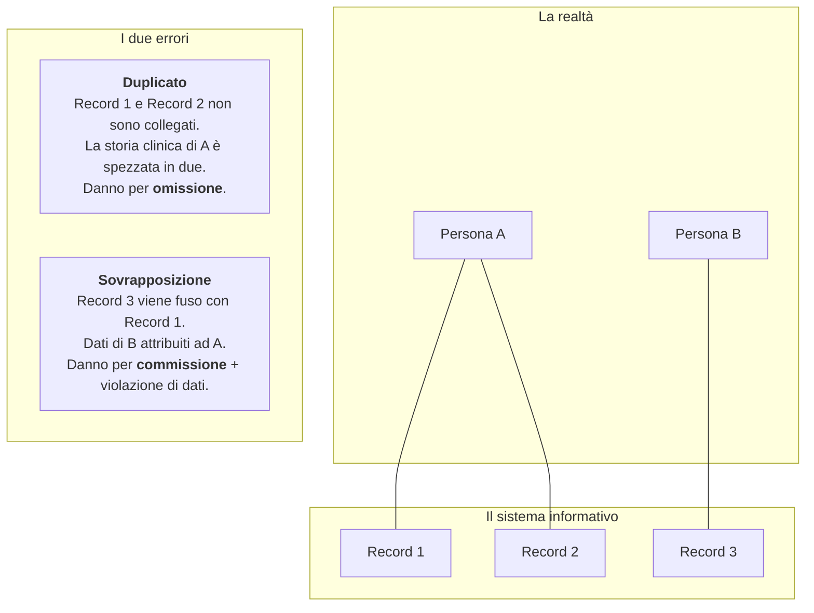
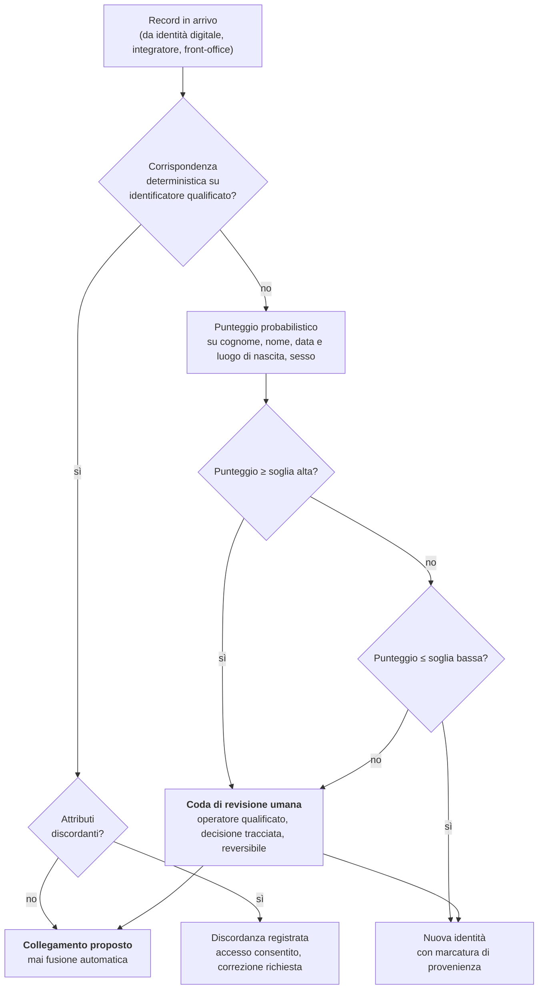
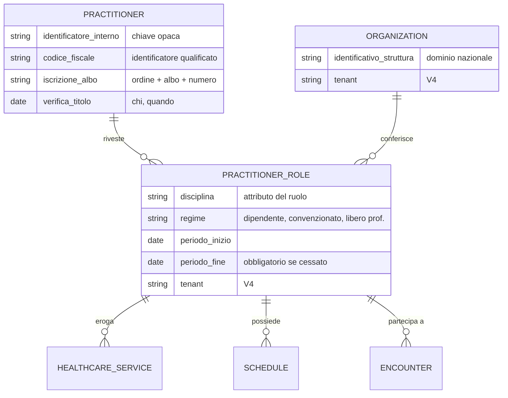
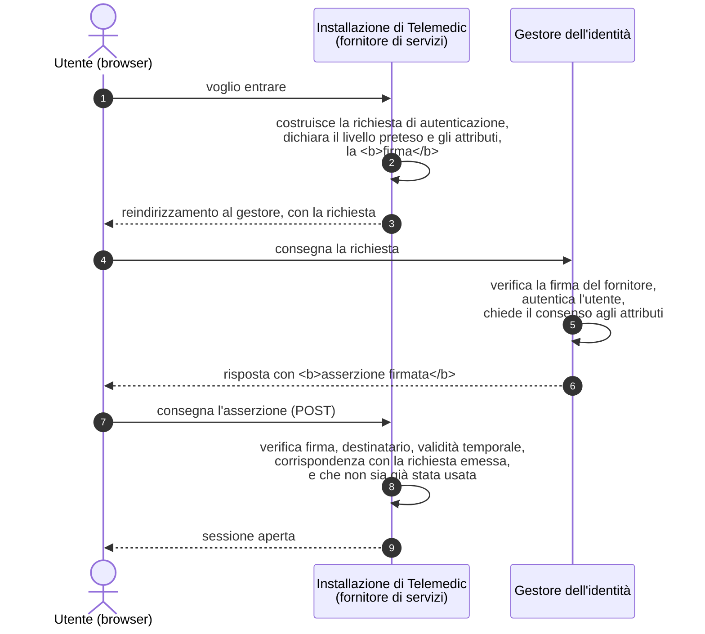
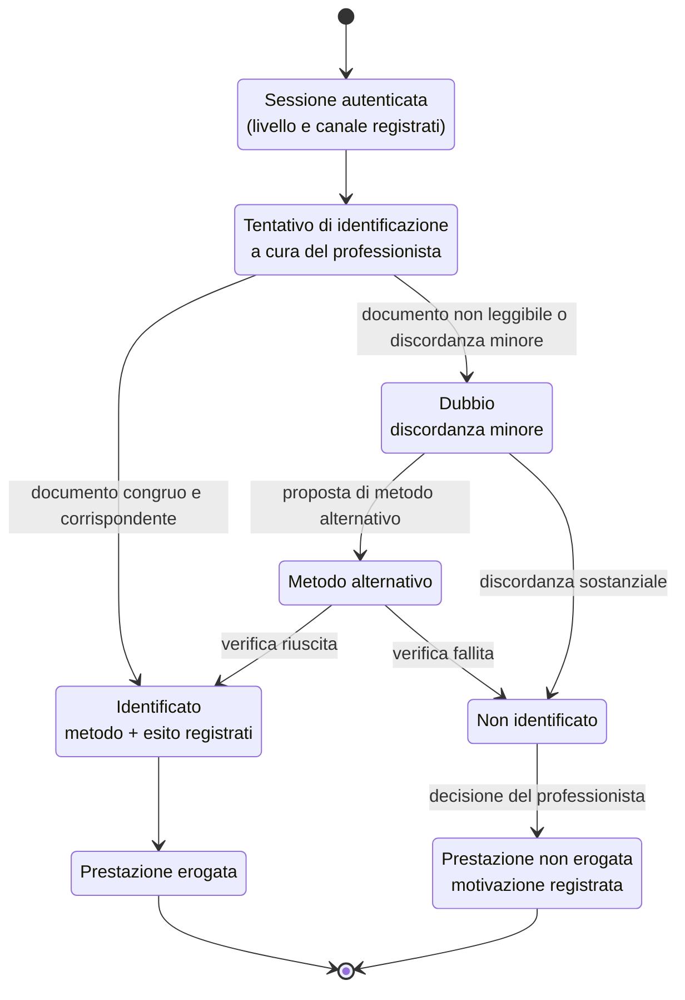
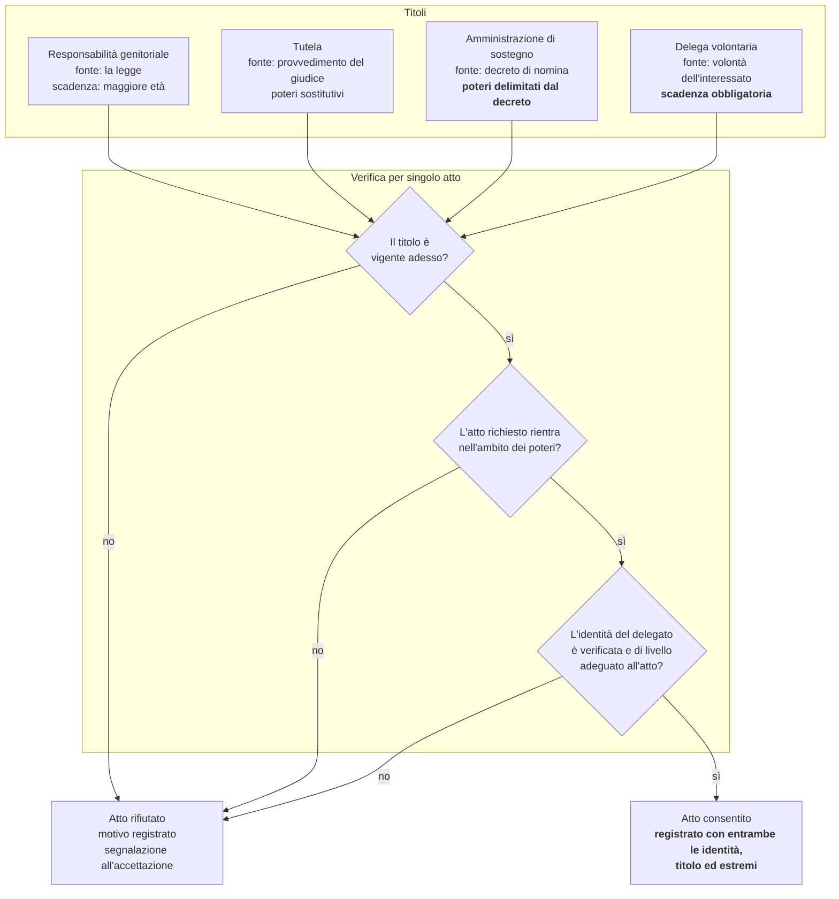

# Identità e anagrafiche

Un sistema informativo sanitario fa una cosa sola, prima di ogni altra: **attribuisce
un'informazione clinica a una persona**. Tutto il resto - la videochiamata, il referto, la
soglia di allarme, il fascicolo - poggia su quell'attribuzione. Se l'attribuzione è
sbagliata, il resto non è degradato: è pericoloso.

Questo modulo tratta il problema più sottovalutato del dominio. È sottovalutato perché
sembra risolto: «c'è il codice fiscale, usiamo quello come chiave primaria». È una frase che
in Italia si sente in quasi ogni riunione di progetto sanitario, ed è sbagliata per almeno
otto ragioni distinte, ciascuna delle quali si manifesta come un difetto di produzione
diverso. Le vedremo tutte.

Il modulo copre quattro domande, in quest'ordine:

1. **Chi è il paziente**, e come si scrive questa risposta in un identificatore
   (§§ 1–4);
2. **Chi è il professionista**, e perché la domanda giusta non è «chi è» ma «in quale veste
   sta operando adesso» (§ 5);
3. **Come si dimostra** che chi ha bussato è davvero quella persona: identità digitale,
   livelli di garanzia, protocolli (§§ 6–8);
4. **Cosa fare quando la persona non risponde di sé**: identificazione a distanza durante una
   prestazione, delega, rappresentanza legale (§§ 9–10). Chiude una sezione sui **costi e
   sulle conseguenze progettuali che ricadono su chi installa** (§ 11).

> **Rapporto con gli altri moduli.** Il modulo
> [07](07-fse-e-infrastrutture-nazionali.md), § 8, contiene una **sintesi operativa**
> dell'identità digitale, sufficiente a capire come si entra nel fascicolo sanitario
> elettronico. Qui la sviluppiamo: profili, livelli, attributi, protocolli, costi, rischi.
> Il modulo [02](02-prestazioni-di-telemedicina.md), § 10.2, enuncia in tre righe la
> distinzione fra identificazione e autenticazione: il § 9 di questo modulo la trasforma in
> un modello. Il modulo [01](01-sistema-sanitario-italiano.md), § 5, descrive le professioni
> sanitarie: il § 5 di questo modulo ne ricava il modello dati. Il dettaglio protocollare di
> SAML, OpenID Connect e TLS con autenticazione del client sta nel modulo
> [13](13-protocolli.md); qui se ne dà solo quanto serve a capire perché le scelte sono
> quelle che sono.

> **Convenzione di lettura.** `[NV]` significa «non verificato o non pubblicamente
> disponibile alla data di redazione». Il § 12 raccoglie tutti i punti così marcati, con
> l'indicazione di dove vada richiesta l'informazione mancante. Quando un'affermazione è una
> **proposta del progetto** e non una prescrizione normativa, è detto esplicitamente: la
> differenza fra «la norma stabilisce», «è prassi» e «il progetto propone» è la spina
> dorsale di questo modulo.

---

## 1. Il problema dell'identità in sanità

### 1.1 Perché la stessa persona esiste molte volte

Immagina una signora di settantaquattro anni, residente in una Regione, ricoverata per tre
giorni in un'altra durante una vacanza, seguita dal proprio medico di medicina generale,
assistita da un centro diabetologico territoriale, cliente di un poliambulatorio privato per
la fisioterapia e iscritta a un programma di telemonitoraggio cardiologico.

Quante volte esiste, come record, nei sistemi informativi che la riguardano? Almeno:

| Sistema | Identificatore con cui è conosciuta |
|---|---|
| Anagrafe della popolazione residente | dati anagrafici + codice fiscale |
| Anagrafe degli assistiti della sua Regione | codice fiscale + numero di iscrizione regionale |
| Cartella clinica dell'ospedale in cui è stata ricoverata | numero nosologico dell'episodio + identificativo paziente locale |
| Sistema del centro diabetologico | identificativo interno, forse anche un numero di cartella storico su carta |
| Gestionale del poliambulatorio privato | identificativo interno, spesso con l'anagrafica ridigitata a mano |
| Piattaforma di telemonitoraggio | identificativo interno, più l'identificativo del dispositivo |
| Fascicolo sanitario elettronico | codice fiscale come chiave, indice dei metadati presso la Regione di assistenza |

Sette rappresentazioni della stessa persona, prodotte in momenti diversi, da operatori
diversi, con regole di validazione diverse. Nessuna di esse è «la» persona: sono sette
**proiezioni**, ciascuna corretta nel proprio contesto e ciascuna potenzialmente divergente
dalle altre. Il cognome scritto con l'apostrofo in un sistema e senza nell'altro; la data di
nascita corretta in uno e trascritta con due cifre invertite nell'altro; il domicilio
aggiornato in uno e fermo a dieci anni fa nell'altro.

Questa molteplicità **non è un difetto da eliminare**. È una proprietà strutturale di un
sistema sanitario federato in cui l'assistenza è erogata da migliaia di soggetti giuridici
distinti, ciascuno titolare del trattamento per la propria parte (modulo
[07](07-fse-e-infrastrutture-nazionali.md), § 2.2). Chi progetta un software sanitario deve
partire dall'assunto che **l'identità della persona sia distribuita e non riconciliata**, e
progettare per convivere con quella condizione, non per abolirla.

Ne discende la prima regola operativa del modulo, che è anche un vincolo esplicito del
progetto (contesto di progetto, § 6.2.3): **Telemedic lavora per riferimento e non diventa
il registro anagrafico principale.** Non possiede l'identità della persona: la riceve, la
verifica e la collega.

### 1.2 I due errori simmetrici

Quando due rappresentazioni della stessa persona incontrano un sistema che deve decidere se
sono la stessa persona, gli errori possibili sono esattamente due, e sono simmetrici.

**Errore di tipo duplicato - due record, una persona.** Il sistema non riconosce che i due
record si riferiscono allo stesso individuo. È l'errore statisticamente più frequente:
nasce da un errore di trascrizione, da un cambio di cognome, da un codice fiscale digitato
al posto di un altro, da un accesso in urgenza in cui l'identità non era disponibile.

Le conseguenze cliniche sono **di omissione**: il medico non vede la terapia in corso, non
vede l'allergia documentata, non vede l'esame fatto la settimana prima e lo ripete. La
frammentazione della storia clinica è il danno, ed è un danno silenzioso - nessuno segnala
un incidente perché «mancava un'informazione che non sapevo esistesse».

**Errore di tipo sovrapposizione - un record, due persone.** Il sistema attribuisce a un
unico record dati clinici che appartengono a due individui distinti. Nasce dall'omocodia
(§ 2.2), da un codice fiscale calcolato male e coincidente con quello di un'altra persona,
da una fusione manuale eseguita in fretta, da un identificatore riusato dopo la cessazione
di un assistito.

Le conseguenze cliniche sono **di commissione**: il medico vede un'allergia che il paziente
davanti a lui non ha, o non vede quella che ha; vede un gruppo sanguigno che non è il suo;
vede una diagnosi oncologica che appartiene a un'altra persona. E vi si somma un danno
giuridico: due interessati distinti che hanno accesso reciproco ai propri dati sanitari, cioè
una violazione di dati personali di categoria particolare che si consuma a ogni consultazione.



I due errori **non sono equivalenti e non si compensano**. Un sistema di riconciliazione ha
una soglia: abbassarla riduce i duplicati e aumenta le sovrapposizioni, alzarla fa il
contrario. Non esiste una soglia che azzeri entrambi. La scelta della soglia è quindi una
**decisione di rischio clinico**, non un parametro di configurazione, e va assunta come tale:
motivata, documentata, rivalutata.

Da qui una seconda regola del progetto, dichiarata come **proposta di progetto** e non come
prescrizione normativa: **la fusione automatica di due anagrafiche non è ammessa.** Il
sistema può proporre una corrispondenza, calcolarne un punteggio, mostrarla a un operatore
qualificato; la decisione è di una persona, è registrata con il nome di chi l'ha presa, ed è
reversibile. Una fusione irreversibile eseguita automaticamente è, sul piano della gestione
del rischio, un dispositivo che prende una decisione clinica senza supervisione.

### 1.3 Perché una fusione errata è un evento avverso e non un difetto di dati

Questa è la parte che chi arriva dall'informatica tende a rifiutare, ed è quella che conta
di più.

Nella cultura ingegneristica corrente un record duplicato è un **problema di qualità del
dato**: si misura con una percentuale, si assegna a un backlog, si risolve con un job di
deduplicazione. In sanità la stessa condizione ha una qualificazione diversa, e la
differenza non è retorica.

Il modulo [10](10-percorsi-di-cura-e-sicurezza.md) tratta il rischio clinico per esteso; qui
serve fissare tre passaggi.

**Primo.** Un software che partecipa alla cura ricade nella disciplina dei dispositivi
medici. La gestione del rischio si conduce ai sensi della norma **ISO 14971**, che non chiede
«quante volte succede» ma **«che danno produce a un paziente e con quale probabilità»**. Un
errore di identità è un **pericolo** nel senso tecnico della norma: una potenziale sorgente
di danno. Va analizzato, gli va assegnata una stima di gravità e probabilità, gli vanno
associati controlli di rischio, e i controlli vanno verificati.

**Secondo.** La gravità di una sovrapposizione anagrafica non è «media». È la gravità
dell'errore terapeutico che ne può discendere, cioè potenzialmente **catastrofica**: una
trasfusione con gruppo sbagliato, una somministrazione a un allergico, un intervento sul lato
sbagliato del corpo. La norma valuta il danno possibile, non il danno medio.

**Terzo.** Ne discende una conseguenza sul processo di sviluppo, non solo sul prodotto: le
funzioni di ricerca, collegamento e fusione dell'anagrafica sono **funzioni legate alla
sicurezza** ai sensi della **IEC 62366-1** (ingegneria dell'usabilità). Vanno progettate per
prevenire l'errore d'uso, non solo per essere efficienti. Un'interfaccia che consenta di
fondere due pazienti con un doppio clic senza conferma differenziata, senza mostrare i dati
divergenti e senza registrare l'identità di chi decide, è **non conforme** - non «migliorabile».

Riassunto in una frase da ricordare: **l'anagrafica non è un modulo di supporto, è un
componente critico per la sicurezza.** Nel piano di gestione del rischio del progetto la
riconciliazione delle identità e la fusione dei record stanno accanto alla verifica delle
chiavi crittografiche della sessione, non accanto all'esportazione in CSV.

### 1.4 Il vocabolario preciso: sei parole che non sono sinonimi

Molta della confusione in questo dominio nasce dall'uso intercambiabile di parole che
significano cose diverse. Fissiamole, perché tutto il modulo le usa in senso stretto.

| Termine | Definizione operativa | Esempio |
|---|---|---|
| **Entità** | La persona reale. Non sta dentro il sistema. | La signora di § 1.1 |
| **Identità** | L'insieme delle informazioni con cui un dominio rappresenta l'entità. Un'entità ha tante identità quanti sono i domini. | «L'assistita n. 4417 della ASL X» |
| **Identificatore** | Un valore che, **dentro un dominio dichiarato**, individua un'identità. | `RSSMRA80A01H501Z` |
| **Dominio di attribuzione** | Il soggetto che assegna gli identificatori e garantisce l'unicità dentro il proprio spazio dei nomi. Senza di esso l'identificatore è una stringa. | L'Agenzia delle entrate, per il codice fiscale |
| **Attributo** | Un'informazione sull'identità che non serve a individuarla ma a descriverla. | Data di nascita, domicilio, recapito |
| **Autenticazione** | La prova che chi si presenta controlla la credenziale associata a un'identità. | L'accesso con identità digitale |
| **Identificazione** *(in senso clinico)* | L'accertamento che la persona fisicamente presente - o presente all'altro capo del video - è la persona attesa. | Il medico che guarda il documento in videochiamata (§ 9) |

Le ultime due sono le più confuse, e la confusione ha conseguenze operative gravi: il § 9 le
tratta per esteso.

### 1.5 Le cinque proprietà di un identificatore, e perché nessuno le ha tutte

Prima di guardare gli identificatori italiani conviene sapere **cosa cercare**. Un
identificatore può avere, o non avere, cinque proprietà indipendenti.

| Proprietà | Domanda a cui risponde | Se manca |
|---|---|---|
| **Unicità** | Due persone diverse possono avere lo stesso valore? | Sovrapposizione (§ 1.2) |
| **Stabilità** | Il valore resta lo stesso per tutta la vita della persona? | Duplicato al momento del cambio |
| **Universalità** | Ogni persona da assistere ne ha uno? | Popolazioni non rappresentabili |
| **Verificabilità** | Il valore si può controllare senza interrogare l'ente emittente? | Errori di digitazione silenziosi |
| **Riservatezza** | Il valore è segreto, cioè può servire da prova di identità? | Uso improprio come fattore di autenticazione |

Anticipiamo il risultato del § 2, perché è la tesi centrale: **nessuno degli identificatori
usati in sanità in Italia possiede tutte e cinque le proprietà, e il codice fiscale - quello
su cui tutti si appoggiano - ne manca almeno tre.**

---

## 2. Gli identificatori dell'assistito in Italia

### 2.1 Il codice fiscale: com'è costruito

Il **codice fiscale** è istituito dal **D.P.R. 29 settembre 1973, n. 605** («Disposizioni
relative all'anagrafe tributaria e al codice fiscale dei contribuenti»), che all'art. 6 ne
prescrive l'indicazione negli atti e nei documenti. Le regole di formazione sono fissate dal
**D.M. Ministero delle finanze 23 dicembre 1976** («Sistemi di codificazione dei soggetti da
iscrivere all'anagrafe tributaria»). L'attribuzione è dell'**Agenzia delle entrate**, che
gestisce l'anagrafe tributaria.

Il punto che sorprende chi lavora in sanità è il primo: **il codice fiscale non è un
identificatore sanitario.** È un identificatore **fiscale**, nato per l'anagrafe tributaria,
che la sanità italiana ha adottato per convenienza e che oggi è di fatto la chiave di
correlazione fra tutti i sistemi sanitari nazionali. L'adozione è consolidata e in molti casi
imposta dalla norma di settore - l'Allegato 1 al **DM 19 novembre 2025** lo prevede come
identificativo dell'assistito nel set informativo del referto di televisita - ma resta
un'adozione, non una destinazione d'uso originaria. Le anomalie che vedremo derivano quasi
tutte da questo disallineamento.

Per una persona fisica il codice è composto di **sedici caratteri alfanumerici**, così
strutturati:

| Posizioni | Contenuto | Regola |
|---|---|---|
| 1–3 | Cognome | Le prime tre consonanti nell'ordine in cui compaiono; se le consonanti sono meno di tre si aggiungono le vocali nell'ordine; se i caratteri sono meno di tre si completa con la lettera `X` |
| 4–6 | Nome | Se il nome ha **quattro o più consonanti** si prendono la **prima, la terza e la quarta**; altrimenti si applica la stessa regola del cognome |
| 7–8 | Anno di nascita | Le ultime due cifre |
| 9 | Mese di nascita | Una lettera secondo la tabella `A B C D E H L M P R S T` per i mesi da gennaio a dicembre |
| 10–11 | Giorno di nascita e sesso | Il giorno del mese per i maschi; **il giorno del mese aumentato di 40** per le femmine |
| 12–15 | Luogo di nascita | Il **codice catastale** del comune italiano (una lettera e tre cifre, il cosiddetto «codice Belfiore»); per chi è nato all'estero, un codice che inizia con `Z` seguito dal codice dello Stato |
| 16 | Carattere di controllo | Calcolato sui quindici caratteri precedenti con due tabelle di conversione distinte per le posizioni dispari e per quelle pari, sommando i valori e riducendo il totale modulo 26 |

Tre osservazioni che hanno conseguenze dirette sul codice che scriverai.

**Il codice fiscale è calcolabile.** Chiunque conosca cognome, nome, data e comune di nascita
e sesso può calcolarlo. Questa è la proprietà che lo rende comodo - e che gli toglie ogni
valore come segreto (§ 3.4).

**Il codice fiscale codifica dati personali in chiaro.** Contiene la data di nascita, il
sesso e il luogo di nascita. Non è uno pseudonimo e non lo diventa togliendo il nome: un
codice fiscale in un insieme di dati «anonimizzati» rende l'insieme identificabile. Il modulo
[03](03-il-dato-clinico.md), § 4, spiega perché questo esclude di trattarlo come dato
pseudonimizzato.

**Il carattere di controllo intercetta una parte degli errori, non tutti.** Rileva la
maggioranza degli errori di singolo carattere e delle trasposizioni di caratteri adiacenti,
ma **non rileva un codice fiscale sintatticamente valido appartenente a un'altra persona**.
La validazione del checksum è necessaria e insufficiente: è la differenza fra «questa stringa
è ben formata» e «questa stringa individua la persona che ho davanti».

### 2.2 L'omocodia: quando due persone hanno diritto allo stesso codice

Il codice fiscale è una funzione di cognome, nome, data di nascita, sesso e comune di
nascita. Nulla impedisce che due persone diverse abbiano gli stessi valori per tutte e
cinque le variabili: due omonimi nati lo stesso giorno nello stesso comune. È il fenomeno
dell'**omocodia**, e non è raro quanto sembra - è comune fra persone nate all'estero, dove
il codice del luogo di nascita è quello dello **Stato** e non del comune, riducendo
drasticamente lo spazio dei valori distinti.

La soluzione adottata dal D.M. 23 dicembre 1976 è una **sostituzione progressiva delle cifre
con lettere**. A partire dalla cifra più a destra fra le sette numeriche del codice (le
posizioni corrispondenti ad anno, giorno e codice del comune), ciascuna cifra viene sostituita
con la lettera corrispondente secondo la tabella:

```
0 → L    1 → M    2 → N    3 → P    4 → Q
5 → R    6 → S    7 → T    8 → U    9 → V
```

Il carattere di controllo viene poi ricalcolato sul codice così modificato. Se anche il
codice ottenuto risulta già attribuito, si sostituisce la cifra successiva, e così via.

**Le conseguenze per chi scrive il validatore sono quattro, e ciascuna è un difetto se
ignorata:**

1. **Un codice fiscale valido può contenere lettere nelle posizioni che «dovrebbero» essere
   numeriche.** Un'espressione regolare che pretenda cifre nelle posizioni 7-8, 10-11 e
   13-15 **rifiuterà codici fiscali legittimi**. È l'errore più diffuso in assoluto, e
   colpisce in modo sistematico le persone nate all'estero: cioè produce un difetto di
   accessibilità con effetto discriminatorio, non un fastidio.
2. **Non si può estrarre la data di nascita dal codice fiscale senza prima invertire le
   sostituzioni.** Un sistema che legga «il giorno di nascita» dalle posizioni 10-11 di un
   codice omocodico legge una lettera.
3. **Non si può usare il codice fiscale per dedurre il sesso** con affidabilità, per la
   stessa ragione. E, indipendentemente dall'omocodia, non lo si deve fare: il codice
   registra il sesso attribuito alla nascita, che può non coincidere con il genere della
   persona né con il sesso anagrafico attuale (§ 2.3).
4. **Il codice fiscale corretto e quello omocodico coesistono.** La persona può presentare
   documenti che riportano l'uno o l'altro, e in alcuni archivi storici compaiono entrambi.
   Il sistema deve poter registrare **più identificatori dello stesso tipo per la stessa
   persona**, con uno marcato come corrente.

### 2.3 I casi patologici: quando il codice fiscale cambia, manca o è provvisorio

L'ipotesi implicita «una persona, un codice fiscale, per sempre» è falsa in almeno sei modi.

**Il neonato.** Alla nascita il codice fiscale viene attribuito dall'anagrafe comunale
contestualmente alla registrazione, ma esiste una finestra - ore o giorni - in cui il neonato
esiste clinicamente e non ha ancora un identificatore nazionale. È esattamente la finestra in
cui si concentrano gli eventi clinici più critici. In quella finestra il neonato è
identificato con un **identificativo provvisorio dell'erogatore**, spesso costruito sul
cognome della madre. Il sistema deve saper reggere un paziente senza codice fiscale e deve
saper **sostituire** l'identificativo provvisorio quando quello definitivo arriva, senza
perdere i dati clinici prodotti nel frattempo.

**La rettifica.** Un codice fiscale attribuito su dati errati - data di nascita sbagliata,
cognome trascritto male all'atto di registrazione - viene **rettificato** dall'Agenzia delle
entrate. Il vecchio codice non è annullato dalla realtà: continua a comparire nei documenti
già prodotti, nelle prescrizioni già emesse, nei referti già archiviati.

**Il cambio di nome o cognome.** Cambio per provvedimento amministrativo, riconoscimento,
adozione, matrimonio nei sistemi giuridici che lo prevedono. Poiché il codice fiscale è
funzione del cognome, il cambio del cognome comporta un nuovo codice fiscale.

**La rettificazione di attribuzione di sesso.** Disciplinata dalla **legge 14 aprile 1982, n.
164**, comporta la modifica dei dati anagrafici e quindi un nuovo codice fiscale, con
cambiamento delle posizioni 10-11. Questo caso merita una nota progettuale esplicita: il
collegamento fra vecchio e nuovo codice è un'informazione **estremamente sensibile**, la cui
esposizione in un'interfaccia o in un log può costituire una rivelazione non voluta di
un'informazione relativa alla vita privata della persona. Il progetto assume come **regola di
prodotto** che la cronologia degli identificatori non sia mai esposta nelle interfacce
cliniche ordinarie, ma solo nelle funzioni di amministrazione anagrafica, tracciate e con
accesso limitato.

**Lo straniero senza codice fiscale.** Una persona presente sul territorio senza iscrizione
all'anagrafe tributaria non ha codice fiscale. Non è un caso limite: è la condizione di
milioni di transiti annui e di una parte della popolazione assistita a titolo di cura urgente
o essenziale (§ 2.4).

**Il decesso.** Il codice fiscale non viene riassegnato, ma la posizione anagrafica si
chiude. Un sistema che presuma «codice fiscale valido ⇒ persona assistibile» produce errori
al confine (§ 4.5).

### 2.4 STP ed ENI: gli identificatori delle popolazioni non iscritte

Due codici che esistono proprio perché il codice fiscale non è universale. Sono la prova
concreta che la proprietà di **universalità** manca.

**STP - Straniero Temporaneamente Presente.** La base normativa dell'assistenza è l'**art. 35
del d.lgs. 25 luglio 1998, n. 286** (Testo unico delle disposizioni concernenti la disciplina
dell'immigrazione), che garantisce ai cittadini stranieri non in regola con le norme relative
all'ingresso e al soggiorno le **cure ambulatoriali e ospedaliere urgenti o comunque
essenziali, ancorché continuative**, oltre agli interventi di medicina preventiva. Il codice
STP è lo strumento operativo con cui l'assistenza viene erogata e rendicontata mantenendo la
persona non segnalabile: **è un codice di assistenza, non un documento di identità**.

**ENI - Europeo Non Iscritto.** Riguarda i cittadini di Stati membri dell'Unione europea
presenti in Italia, privi dei requisiti per l'iscrizione al Servizio sanitario nazionale e
privi di copertura del proprio Stato. Il codice ENI ha la stessa funzione operativa del
codice STP per una popolazione diversa.

Entrambi sono codici di **sedici caratteri**, così che possano transitare nei tracciati
costruiti sul formato del codice fiscale. La composizione documentata è del tipo `STP` (o
`ENI`) seguito da un codice della struttura o dell'azienda sanitaria che lo attribuisce e da
un numero progressivo. **La composizione esatta, il numero di cifre riservate a ciascun campo
e le regole di attribuzione non sono state verificate su fonte primaria in questa
redazione.** `[NV]`

Ciò che invece va detto senza incertezze, perché è il punto che conta per il modello dati:

1. **STP ed ENI sono attribuiti localmente**, dall'azienda sanitaria o dalla struttura, non da
   un ente nazionale. Il loro dominio di attribuzione è quindi **l'ente emittente**, e due
   codici uguali emessi da due aziende diverse **sono identificatori diversi**. Trattarli come
   una chiave nazionale è un errore di modellazione che produce sovrapposizioni.
2. **Hanno una validità temporale** (tipicamente semestrale, rinnovabile), a differenza del
   codice fiscale.
3. **La stessa persona può accumularne più d'uno** nel tempo e in luoghi diversi, senza che
   esista un meccanismo nazionale di riconciliazione.
4. **La stessa persona può passare da STP a codice fiscale** quando regolarizza la propria
   posizione: la storia clinica prodotta sotto STP va collegata, non abbandonata.

Il set informativo del referto di televisita, all'Allegato 1 del **DM 19 novembre 2025**,
prevede espressamente il codice fiscale **oppure** il codice STP oppure il codice ENI come
identificativo dell'assistito. Non è quindi un caso residuale da gestire «se avanza tempo»:
è previsto dalla norma nel documento principale del dominio.

### 2.5 La tessera sanitaria e la TEAM

La **tessera sanitaria** è istituita dall'**art. 50 del D.L. 30 settembre 2003, n. 269**,
convertito con modificazioni dalla **L. 24 novembre 2003, n. 326** - la stessa norma che
istituisce l'infrastruttura del Sistema Tessera Sanitaria su cui è realizzata l'INI (modulo
[07](07-fse-e-infrastrutture-nazionali.md), § 3.1). È emessa dal Ministero dell'economia e
delle finanze e recapitata all'assistito.

Cosa contiene, e cosa **non** è:

- riporta il **codice fiscale**, in chiaro e in codice a barre. **Non introduce un
  identificatore nuovo**: è un supporto fisico che espone un identificatore esistente. Una
  ricerca «per tessera sanitaria» è, in realtà, una ricerca per codice fiscale;
- ha una **data di scadenza**, tipicamente legata alla durata dell'assistenza. La scadenza
  della tessera **non** implica la cessazione dell'assistenza né la perdita del codice
  fiscale: è la scadenza del supporto;
- sul retro riporta la **TEAM - Tessera europea di assicurazione malattia**, disciplinata dai
  **Regolamenti (CE) n. 883/2004 e n. 987/2009** sul coordinamento dei sistemi di sicurezza
  sociale. La TEAM ha un **proprio numero identificativo**, distinto dal codice fiscale, ed è
  ciò che consente l'assistenza in un altro Stato membro. Nei profili FHIR italiani è un
  identificatore a sé, con un proprio sistema (§ 3.2);
- nella versione **TS-CNS** contiene un **microchip** con i certificati della Carta Nazionale
  dei Servizi, che è la cosa che la rende uno strumento di autenticazione e non solo di
  identificazione visiva (§ 6.4). La CNS è disciplinata dal **D.P.R. 2 marzo 2004, n. 117**.

La distinzione fra «tessera sanitaria» come supporto e «TS-CNS» come strumento di
autenticazione è quella che genera più equivoci nelle specifiche funzionali. **Leggere la
tessera con un lettore di codici a barre non è autenticare nessuno**: è digitare più in fretta
un codice fiscale che chiunque può calcolare. Autenticare significa usare il microchip e il
PIN.

### 2.6 Gli identificatori regionali e il codice ANA

Ogni Regione mantiene la propria **anagrafe degli assistiti** e attribuisce un proprio numero
di identificazione. Nasce da esigenze operative precedenti alla generalizzazione del codice
fiscale e sopravvive perché è la chiave interna dei sistemi regionali: esenzioni, scelta e
revoca del medico, flussi di rendicontazione.

A livello nazionale l'**Anagrafe nazionale degli assistiti (ANA)** è prevista dall'**art.
62-*ter* del Codice dell'amministrazione digitale** (d.lgs. 7 marzo 2005, n. 82) ed è la
fonte da cui il fascicolo sanitario elettronico rileva i dati identificativi e amministrativi
dell'assistito. Nei profili FHIR italiani esiste un identificatore dedicato - lo *slice*
`codiceANA` - con sistema `urn:oid:2.16.840.1.113883.2.9.4.3.15` **[V]**.

Le proprietà da tenere presenti:

- **il numero regionale non è univoco a livello nazionale**: due Regioni possono attribuire lo
  stesso numero a persone diverse. Il dominio di attribuzione è la Regione, e va rappresentato;
- **cambia con il trasferimento di residenza**: chi si trasferisce da una Regione all'altra
  cessa in una anagrafe e nasce nell'altra, con un numero nuovo;
- **è la chiave con cui i sistemi regionali parlano fra loro**, quindi ignorarlo significa
  perdere la capacità di correlare con l'ambiente in cui l'installazione opera.

La distinzione fra **Regione di assistenza (RdA)** e **Regione di erogazione (RdE)** - trattata
nel modulo [07](07-fse-e-infrastrutture-nazionali.md), § 3.1 - è la ragione per cui gli
identificatori regionali non si possono ridurre a uno: la persona è assistita in una Regione
e curata in un'altra, e il documento prodotto deve portare entrambe le informazioni.

### 2.7 L'identificativo interno dell'erogatore

È il numero che il singolo sistema attribuisce al proprio paziente: il numero di cartella,
il codice paziente del gestionale, la chiave surrogata della base dati.

È l'identificatore con le **migliori proprietà tecniche** - unico dentro il proprio sistema,
stabile per costruzione, sempre presente - e con la **peggiore proprietà semantica**: non
significa nulla fuori dal sistema che lo ha generato. Due sistemi con lo stesso numero
paziente non stanno parlando della stessa persona.

Il vincolo del progetto (contesto, § 6.2.3) impone di **lavorare per riferimento**: quando un
gestionale sanitario di terze parti invoca Telemedic, l'identificativo che porta con sé è il
proprio, e Telemedic lo conserva **come identificatore aggiuntivo qualificato dal proprio
dominio**, non come chiave primaria propria. È l'unico modo per restituire poi il contenuto
clinico al sistema di origine senza ambiguità.

### 2.8 Quadro riassuntivo

| Identificatore | Chi lo attribuisce | Cosa identifica davvero | Quando cambia | Quando manca | Univoco a livello nazionale? |
|---|---|---|---|---|---|
| **Codice fiscale** | Agenzia delle entrate | La posizione della persona nell'anagrafe **tributaria** | Rettifica, cambio di cognome, rettificazione di sesso | Neonato nelle prime ore, straniero non iscritto, persona non identificata in urgenza | **Sì**, salvo omocodia risolta con sostituzione |
| **Codice omocodico** | Agenzia delle entrate | La stessa posizione, in forma alternativa | Coesiste con il codice base | - | Sì |
| **Codice STP** | Azienda sanitaria o struttura | Il **diritto all'assistenza urgente o essenziale** di uno straniero non in regola | Alla scadenza (rinnovo), alla regolarizzazione | Se la persona non ne ha ancora richiesto uno | **No**: dominio locale, validità temporale |
| **Codice ENI** | Azienda sanitaria o struttura | Lo stesso, per cittadini UE non iscritti | Idem | Idem | **No** |
| **Tessera sanitaria** | MEF | Il supporto fisico che espone il codice fiscale | A ogni riemissione; ha scadenza propria | Tessera scaduta, smarrita, mai ricevuta | Non è un identificatore autonomo |
| **Numero TEAM** | MEF / ente di assicurazione | Il diritto all'assistenza in un altro Stato membro | Alla riemissione | Per chi non ha diritto all'assistenza UE | Sì nel proprio dominio |
| **Numero di iscrizione regionale / codice ANA** | Regione / anagrafe nazionale degli assistiti | L'**iscrizione al servizio sanitario** di quella Regione | Trasferimento di residenza, cessazione | Fuori Regione, non iscritti | **No** per il numero regionale |
| **Identificativo interno dell'erogatore** | Il singolo sistema | Il record di quel sistema | Mai, per costruzione | Mai, per costruzione | **No** |

### 2.9 Perché nessuno di questi è una chiave primaria affidabile

Ricomponendo il quadro con la griglia del § 1.5:

| Identificatore | Unico | Stabile | Universale | Verificabile | Riservato |
|---|---|---|---|---|---|
| Codice fiscale | quasi | **no** | **no** | sì (checksum) | **no** |
| STP / ENI | **no** | **no** | **no** | **no** | **no** |
| Numero regionale | **no** | **no** | **no** | **no** | **no** |
| Identificativo interno | sì | sì | sì (nel dominio) | sì | **no** |

Da cui le regole di modellazione che il progetto adotta come **proposta di progetto**,
coerenti con il vincolo di tenant-awareness dichiarato nel contesto (V4):

1. **La chiave primaria del paziente è un identificatore interno opaco**, senza significato,
   generato dal sistema. Non è il codice fiscale, non è un numero progressivo leggibile, non
   contiene informazioni sulla persona.
2. **Tutti gli identificatori esterni sono attributi molteplici** della stessa entità, ognuno
   con **sistema**, **valore**, **periodo di validità**, **stato** (corrente, superato,
   contestato) e **origine** (chi lo ha comunicato e quando).
3. **L'unicità si vincola sulla coppia sistema + valore, per tenant**, mai sul solo valore.
4. **La ricerca è per identificatore qualificato**, mai per valore nudo. Cercare
   `RSSMRA80A01H501Z` senza dire in quale spazio dei nomi è una domanda mal posta, e produce
   risposte mal poste.
5. **Nessuna correlazione fra tenant**: due tenant che contengono la stessa persona non
   devono poterlo dedurre l'uno dall'altro. È un requisito di isolamento, e discende dal fatto
   che i due titolari del trattamento sono soggetti distinti.

---

## 3. Il codice fiscale nei sistemi informativi

### 3.1 Un identificatore senza dominio di attribuzione è una stringa

Questa sezione parte da un'affermazione che sembra pedante e che è invece la sorgente di una
classe intera di difetti di integrazione.

Considera il valore `RSSMRA80A01H501Z`. Preso da solo, non è un identificatore: è una
sequenza di sedici caratteri. Diventa un identificatore solo quando è accompagnato
dall'indicazione **di chi lo ha attribuito e in quale spazio dei nomi è unico**. Lo stesso
vale, in modo ancora più evidente, per `4417`: dentro l'anagrafe di una certa azienda
sanitaria individua una persona, fuori non individua nulla.

Gli standard di interoperabilità sanitaria hanno recepito il principio da decenni. Nel
modello di HL7 versione 2 l'identificatore del paziente nel campo `PID-3` è composto e porta
con sé l'autorità di assegnazione. In **FHIR** - lo standard su cui poggia il modello dati
del progetto, trattato nel modulo [06](06-fhir-da-zero.md) - il tipo `Identifier` ha
esattamente questa struttura:

```json
{
  "system": "http://hl7.it/sid/codiceFiscale",
  "value": "RSSMRA80A01H501Z"
}
```

`system` è un URI che **nomina il dominio di attribuzione**. Non è un indirizzo da
contattare: è un nome. Nessuno effettua una richiesta HTTP verso
`http://hl7.it/sid/codiceFiscale`; quell'URI significa «il valore che segue è un codice
fiscale attribuito dall'amministrazione finanziaria italiana». Il modulo
[05](05-standard-di-interoperabilita.md) spiega perché gli standard usano URI come nomi e
non come indirizzi.

**La conseguenza pratica.** Due sistemi che scambiano identificatori devono concordare non
solo il formato del valore, ma **la stringa esatta che nomina il dominio**. Se il produttore
scrive un URI e il consumatore ne cerca un altro, la ricerca non fallisce con un errore:
**restituisce zero risultati**, e il sistema conclude che la persona non esiste. È il
fallimento peggiore possibile - silenzioso, plausibile, e che nel dominio sanitario significa
duplicare l'anagrafica di un paziente che il sistema già conosceva.

### 3.2 La trappola verificata: due URI per lo stesso codice fiscale

E qui arriva il fatto concreto, verificato su fonte primaria, che chi implementa deve
conoscere prima di scrivere la prima riga.

**Le guide di implementazione FHIR pubblicate da HL7 Italia non usano tutte lo stesso URI per
il codice fiscale.**

| Guida di implementazione | Versione | URI usato per il codice fiscale |
|---|---|---|
| **IT Base** (profilo `Patient-it-base`) | 0.1.0 | `http://hl7.it/sid/codiceFiscale` |
| **Televisita** (profilo `PatientTelevisita`) | 0.2.0 | `http://hl7.it/sid/codiceFiscale` |
| **IT-Core** (profilo `patient-it-core`) | 0.2.0 | `http://hl7.it/fhir/itcore/CodeSystem/cs-codicefiscale` |

**[V]** - verificato sui profili pubblicati.

Sono due stringhe diverse. Per un sistema che confronti gli identificatori - e ogni sistema
lo fa, perché è così che funziona la ricerca per identificatore - **sono due domini di
attribuzione distinti**. Un `Patient` prodotto secondo la famiglia *Televisita* e cercato da
un consumatore allineato a *IT-Core* non viene trovato. Non c'è messaggio d'errore, non c'è
validazione che fallisca: il profilo è valido, il valore è corretto, il paziente risulta
inesistente.

**La raccomandazione operativa del progetto**, che è una scelta di progetto motivata e non una
prescrizione normativa:

1. **L'URI canonico da scrivere è `http://hl7.it/sid/codiceFiscale`**, perché il progetto
   dichiara conformità alla famiglia *Televisita* (contesto di progetto, D13) e quell'URI è
   quello usato tanto da *IT Base* quanto da *Televisita*.
2. **In uscita si scrive anche il secondo identificatore**, con l'URI di *IT-Core*, come
   ulteriore elemento della lista degli identificatori. È lecito: la risorsa ammette più
   identificatori e lo *slicing* dei profili è aperto. Costa nulla e rende la risorsa
   leggibile da entrambe le famiglie di consumatori.
3. **In ingresso si accettano entrambi**, normalizzandoli internamente su un unico
   identificatore canonico interno. La normalizzazione avviene al confine del sistema, in uno
   strato di adattamento, e **non** dentro il modello di dominio: è la stessa disciplina che
   il progetto applica a ogni formato esterno.
4. **La tabella degli URI ammessi è un artefatto versionato**, con un test che ne verifichi
   la completezza. Non è una costante sparsa nel codice.

Il modulo [06](06-fhir-da-zero.md) tratta la divergenza dal punto di vista del profilo FHIR e
mostra il frammento completo; qui interessa il principio generale che se ne ricava:

> **Un identificatore ha bisogno di un dominio di attribuzione, e il dominio di attribuzione
> è esso stesso un dato che può divergere fra due fonti autorevoli.** Non basta concordare
> «usiamo il codice fiscale»: bisogna concordare la stringa esatta con cui lo si nomina, e
> scriverla nel profilo di interfaccia.

Gli altri identificatori dell'assistito hanno, nei profili italiani, i propri sistemi
dedicati. I valori verificati sono:

| Identificatore | Sistema nei profili italiani |
|---|---|
| Codice fiscale (famiglia Televisita / IT Base) | `http://hl7.it/sid/codiceFiscale` **[V]** |
| Codice fiscale (IT-Core) | `http://hl7.it/fhir/itcore/CodeSystem/cs-codicefiscale` **[V]** |
| Identificativo ANPR | `http://hl7.it/sid/anpr` **[V]** |
| Codice ANA | `urn:oid:2.16.840.1.113883.2.9.4.3.15` **[V]** |
| Numero TEAM | `urn:oid:2.16.840.1.113883.2.9.4.3.7` **[V]** |
| Codice STP, codice ENI, identificativo regionale | sistema vincolato da un insieme di valori dedicato **[V]**, i cui valori puntuali non sono stati trascritti in questa redazione `[NV]` |

### 3.3 Un secondo strato: il tipo di identificatore

Oltre al sistema, gli standard prevedono un **codice di tipo** dell'identificatore, tratto da
una tabella condivisa. È l'informazione che dice «questo è un identificativo nazionale della
persona» in modo indipendente dal Paese.

Il punto verificato, e utile perché smentisce un'affermazione che circola: **il codice `NN`,
da solo, non esiste** nella tabella HL7 degli *identifier type*. Il concetto realmente
presente è `NNxxx`, dove `xxx` va sostituito con il codice ISO 3166 alfabetico a tre
caratteri del Paese. Per l'Italia il valore corretto per costruzione è quindi **`NNITA`**, che
però **non è enumerato** come concetto: è un valore generato dalla regola di formazione. **[V]**

E soprattutto: **nessun profilo italiano pubblicato fissa quale codice di tipo usare per il
codice fiscale.** L'insieme di valori di IT-Core include l'intera tabella senza selezionarne
uno. La scelta resta quindi **contrattuale con l'integratore**: va scritta nel profilo di
interfaccia, non dedotta.

### 3.4 Il codice fiscale non è un segreto, e non è una password

Va detto in modo esplicito perché l'errore è frequente e le sue conseguenze sono gravi.

Il codice fiscale è **calcolabile** da dati che non sono riservati (§ 2.1), **stampato** su
un documento che la persona esibisce continuamente, **presente** in ogni ricetta, in ogni
fattura sanitaria, in ogni modulo. Non ha in alcun senso la proprietà di riservatezza.

Ne discendono tre divieti, che il progetto assume come **regole di prodotto**:

1. **Il codice fiscale non può essere un fattore di autenticazione**, né da solo né in
   combinazione con altri dati parimenti pubblici (data di nascita, cognome). Un percorso di
   accesso «inserisci codice fiscale e data di nascita» è un percorso senza autenticazione.
2. **Il codice fiscale non può essere l'unico elemento di un collegamento profondo.** Un
   collegamento a una stanza di televisita che contenga il codice fiscale nell'indirizzo è al
   tempo stesso indovinabile e una divulgazione di dati personali negli storici del server e
   nel referente di navigazione. Il progetto usa identificatori di sessione opachi, a uso
   singolo e a scadenza breve.
3. **Il codice fiscale non è uno pseudonimo.** Sostituire nome e cognome con il codice fiscale
   non pseudonimizza nulla: il codice fiscale è un identificativo diretto. Il modulo
   [03](03-il-dato-clinico.md), § 4, tratta la distinzione fra pseudonimizzazione e
   anonimizzazione; il § 4.6 di questo modulo ne mostra le conseguenze sul modello di identità.

C'è poi un vincolo esplicito che discende dalla normativa sull'identità digitale: nel
contesto della piattaforma nazionale di telemedicina, all'atto dell'autenticazione «*sono
acquisiti esclusivamente il codice fiscale, il nome e il cognome*» (**DM 19 novembre 2025**,
Allegato 4). Il codice fiscale è quindi **il dato di correlazione fra l'identità digitale e
l'anagrafica sanitaria**: è il ponte, e la sua qualità determina la qualità del ponte. Ma
essere il ponte non lo rende una credenziale.

---

## 4. Le anagrafiche

### 4.1 Le tre anagrafi che contano, e cosa contiene ciascuna

Fino a qui abbiamo parlato di identificatori. Un'anagrafe è la cosa che li attribuisce e li
mantiene: un registro di persone con i loro attributi, con un titolare, una base giuridica e
un ciclo di aggiornamento.

**ANPR - Anagrafe nazionale della popolazione residente.** Prevista dall'**art. 62 del Codice
dell'amministrazione digitale** (d.lgs. 82/2005) e disciplinata dal **D.P.C.M. 10 novembre
2014, n. 194**, subentra alle anagrafi comunali: è la fonte autoritativa dei dati anagrafici
della popolazione residente in Italia - generalità, residenza, stato civile, cittadinanza,
composizione della famiglia anagrafica. È l'anagrafe **civile**, non sanitaria: non sa nulla
del medico di fiducia né delle esenzioni.

**ANA - Anagrafe nazionale degli assistiti.** Prevista dall'**art. 62-*ter* del CAD**, è
l'anagrafe **sanitaria**: chi è assistito, da quale Regione, con quale medico di fiducia, con
quali esenzioni. È la fonte da cui il fascicolo sanitario elettronico rileva i dati
identificativi e amministrativi dell'assistito.

**Le anagrafiche aziendali e di struttura.** Ogni azienda sanitaria, ogni ospedale, ogni
poliambulatorio, ogni gestionale ha la propria. Contengono i dati della persona **come sono
stati raccolti in quel punto di contatto**, spesso ridigitati, spesso più aggiornati
dell'anagrafe nazionale su alcuni campi (il recapito telefonico, il domicilio effettivo) e
molto meno aggiornati su altri (lo stato in vita, la residenza).

| | ANPR | ANA | Anagrafica aziendale |
|---|---|---|---|
| **Base giuridica** | art. 62 CAD; D.P.C.M. 194/2014 | art. 62-*ter* CAD | Titolarità del singolo erogatore |
| **Che cosa è autoritativa a dire** | Generalità, residenza, stato civile, cittadinanza, decesso | Iscrizione al servizio sanitario, Regione di assistenza, medico di fiducia, esenzioni | Nulla, verso l'esterno |
| **Chi la aggiorna** | I comuni | Le Regioni, alimentando il livello nazionale | Gli operatori dell'erogatore |
| **Frequenza tipica di aggiornamento presso il consumatore** | Differita | Differita | Immediata ma locale |
| **Rischio caratteristico** | Non conosce chi non è residente | Non conosce chi non è iscritto | Divergenza silenziosa da entrambe |

**Il punto che chi progetta deve interiorizzare**: nessuna delle tre è «l'anagrafica». Sono
tre viste con autorità diverse su campi diversi. La domanda giusta non è «qual è quella
giusta», ma **«per questo campo, quale fonte è autoritativa, con quale ritardo, e cosa faccio
quando divergono»**.

### 4.2 Allineamento: chi vince quando i dati divergono

Il progetto adotta come **proposta di progetto** un modello a **precedenza per campo**, non
a precedenza per fonte. Significa che non esiste una fonte che vince su tutto: esiste, per
ciascun campo, una gerarchia dichiarata.

| Campo | Fonte autoritativa | Note |
|---|---|---|
| Nome, cognome, data e luogo di nascita, sesso anagrafico | Anagrafe della popolazione residente | Per chi non vi è iscritto: il documento esibito, con registrazione della fonte |
| Codice fiscale | Anagrafe tributaria, per il tramite delle anagrafi | Con validazione di checksum e gestione dell'omocodia (§ 2.2) |
| Stato in vita | Anagrafe della popolazione residente | § 4.5 |
| Iscrizione al servizio sanitario, Regione di assistenza, medico di fiducia, esenzioni | Anagrafe degli assistiti | § 4.5 |
| Domicilio effettivo dove si svolge la prestazione | **L'assistito, a ogni sessione** | § 4.4 |
| Recapito telefonico e indirizzo di posta elettronica | Il dato raccolto dall'erogatore, confermato dall'assistito | Non è ottenibile dalle identità digitali con il set minimo di attributi (§ 6.3) |
| Identificativo interno del sistema di origine | Il sistema di origine | Mai riscritto da Telemedic |

Tre regole che rendono il modello operativo:

1. **Ogni valore porta la propria provenienza.** Non basta memorizzare «cognome = Rossi»: va
   memorizzato che quel valore proviene da una certa fonte, in una certa data, con un certo
   grado di certificazione. I profili italiani prevedono a questo scopo un'estensione di
   certificazione del dato sull'identificatore, che dichiara **chi** lo ha certificato e
   **quando**.
2. **La sovrascrittura è un evento, non un aggiornamento silenzioso.** Quando una fonte
   autoritativa modifica un valore che l'erogatore aveva raccolto diversamente, il fatto è
   registrato: valore precedente, valore nuovo, fonte, istante.
3. **Un dato divergente su un campo identificante blocca, non corregge.** Se il cognome
   proveniente dall'identità digitale non coincide con quello dell'anagrafica locale associata
   a quel codice fiscale, il sistema **non** riscrive l'anagrafica: segnala una discordanza da
   risolvere. La riscrittura automatica su discordanza è il meccanismo con cui un errore si
   propaga silenziosamente a tutti i sistemi a valle.

### 4.3 Riconciliazione: come si decide che due record sono la stessa persona

È il problema che in letteratura si chiama *record linkage* e che nei sistemi sanitari prende
il nome di **indice principale del paziente** (in inglese *master patient index*). Vale la
pena capirne la meccanica, perché è la parte in cui si concentrano i difetti descritti al
§ 1.2.

Esistono due famiglie di tecniche.

**Corrispondenza deterministica.** Si dichiara una regola: «due record sono la stessa persona
se hanno lo stesso codice fiscale». È esatta, verificabile, spiegabile e non ha soglie. Il suo
limite è che eredita tutti i difetti dell'identificatore su cui si appoggia: se il codice
fiscale manca (§ 2.3), la regola non si applica; se è digitato male, la regola dice «persone
diverse»; se c'è omocodia non risolta, dice «stessa persona» sbagliando.

**Corrispondenza probabilistica.** Si confrontano più attributi - cognome, nome, data di
nascita, luogo di nascita, sesso, indirizzo - assegnando a ciascuno un peso in funzione di
quanto sia discriminante, e si somma un punteggio di somiglianza usando confronti tolleranti
agli errori di trascrizione. Se il punteggio supera una soglia alta, i record si considerano
la stessa persona; se sta sotto una soglia bassa, persone diverse; se sta in mezzo, **il caso
va a un essere umano**.



Le scelte che il progetto assume come **proposte di progetto**, ciascuna motivata:

- **Nessuna fusione automatica, in nessun caso.** Anche una corrispondenza deterministica
  perfetta produce un *collegamento* proposto, non una fusione dei record. Il collegamento è
  un'affermazione reversibile; la fusione non lo è.
- **Il collegamento è un oggetto di dominio con una storia.** Chi lo ha creato, quando, sulla
  base di quale evidenza, chi lo ha eventualmente sciolto. Serve per rispondere alla domanda
  «perché questi due record risultano la stessa persona», che è la prima domanda che si pone
  quando qualcosa va storto.
- **Lo scioglimento di un collegamento deve essere possibile e deve essere pulito.** Una
  fusione irreversibile rende impossibile riparare l'errore di § 1.2: i dati clinici delle due
  persone restano mescolati per sempre. Il progetto conserva quindi l'appartenenza originaria
  di ogni dato clinico al record che lo ha generato.
- **La soglia è configurabile per installazione e il suo valore è dichiarato nel fascicolo di
  gestione del rischio**, con la motivazione della scelta. Non è un parametro di prestazione.
- **La coda di revisione ha un tempo massimo dichiarato.** Un record in attesa di
  riconciliazione è un record su cui la storia clinica è potenzialmente incompleta: se la coda
  non è presidiata, il controllo di rischio non esiste.

### 4.4 Il domicilio non è la residenza

Merita un paragrafo a sé perché in telemedicina è un requisito di sicurezza, non un dettaglio
amministrativo.

La **residenza** è un dato anagrafico dell'anagrafe della popolazione residente. Il
**domicilio effettivo al momento della prestazione** è dove la persona si trova mentre la
televisita è in corso, e può essere qualunque posto: casa di un familiare, luogo di vacanza,
posto di lavoro, automobile.

Se durante un consulto a distanza il paziente ha un evento acuto, il professionista deve
poter dire ai soccorsi **dove si trova la persona adesso**. Un indirizzo di residenza tratto
dall'anagrafica è, in quel momento, potenzialmente inutile e pericolosamente rassicurante.

Ne discende un requisito che il progetto assume esplicitamente: **l'indirizzo del luogo in
cui si svolge la sessione va chiesto e confermato all'inizio di ogni sessione**, e registrato
come attributo della sessione, non come aggiornamento dell'anagrafica. Sono due dati diversi
con due cicli di vita diversi.

### 4.5 Le sopravvenienze: gli eventi che invalidano ciò che il sistema credeva

Un'anagrafica non è una fotografia: è un flusso di eventi. Quattro di questi eventi hanno
conseguenze che i modelli dati sbagliano con regolarità.

**Il decesso.** È l'evento che più spesso non viene modellato affatto. Conseguenze:

- **gli appuntamenti futuri vanno sospesi**, non silenziosamente eseguiti. Un promemoria
  automatico di televisita recapitato ai familiari di una persona deceduta è un danno reale;
- **il fascicolo non si cancella subito**: l'indice è cancellato decorsi **trent'anni dalla
  data del decesso**, con verifica a periodicità annuale (**DM 7 settembre 2023**, art. 10;
  cfr. modulo [07](07-fse-e-infrastrutture-nazionali.md), § 2.6);
- **i diritti dell'interessato cambiano regime**: la disciplina dei diritti relativi ai dati
  di persone decedute segue l'**art. 2-*terdecies* del d.lgs. 30 giugno 2003, n. 196**, che
  li attribuisce a chi ha un interesse proprio, agisce a tutela dell'interessato o per ragioni
  familiari meritevoli di protezione;
- **le deleghe attive decadono.** Una delega di accesso al fascicolo concessa in vita non
  sopravvive automaticamente al decesso: il § 10 tratta il punto.

**Il trasferimento di residenza.** Cambia la Regione di assistenza, quindi il numero di
iscrizione regionale, quindi il medico di fiducia, quindi - nel fascicolo - la sede
dell'indice dei metadati: l'INI **trasferisce l'indice all'indice della nuova Regione di
assistenza** (**DM 7 settembre 2023**, art. 24). Un modello che assuma la stabilità della
sede dell'indice per tutta la vita dell'assistito è sbagliato per costruzione.

**Il cambio del medico di fiducia.** Avviene per scelta dell'assistito, per cessazione del
medico, per trasferimento. Ha una conseguenza sull'autorizzazione: il diritto di accesso del
medico di medicina generale al fascicolo dura **per tutta la durata del rapporto di
assistenza** (**DM 7 settembre 2023**, art. 15), quindi **cessa** quando il rapporto cessa. Se
il sistema ha memorizzato «questo medico può vedere questo paziente» come un permesso
persistente, ha creato un accesso che sopravvive al titolo che lo giustificava.

**Il raggiungimento della maggiore età.** Cambia il regime di rappresentanza: l'esercente la
responsabilità genitoriale perde il titolo, il diritto di accesso ai dati del figlio cessa e
il ragazzo diventa titolare pieno dei propri diritti. Comporta inoltre, sul piano
organizzativo, il passaggio dal pediatra di libera scelta al medico di medicina generale
(modulo [01](01-sistema-sanitario-italiano.md), § 5.2). È un evento che il sistema deve
**generare da solo**, sulla base della data di nascita, non attendere che qualcuno lo
comunichi.

La regola generale che ne discende, e che vale la pena isolare perché copre tutti e quattro i
casi:

> **Nessun diritto di accesso a dati sanitari va memorizzato come permesso. Va calcolato al
> momento dell'accesso, a partire da un titolo che ha una scadenza o una condizione di
> validità.** Un permesso è uno stato; un titolo è un fatto con una durata. I permessi
> sopravvivono ai fatti che li giustificano, ed è così che nascono gli accessi indebiti.

### 4.6 L'identità pseudonimizzata e i suoi limiti

La **pseudonimizzazione** - art. 4, n. 5, del **Regolamento (UE) 2016/679** - è il
trattamento dei dati personali in modo che non possano più essere attribuiti a un interessato
specifico senza l'utilizzo di informazioni aggiuntive, conservate separatamente e soggette a
misure tecniche e organizzative. Il modulo [03](03-il-dato-clinico.md), § 4, la tratta sul
piano giuridico. Qui interessa cosa significa **per il modello di identità**.

**Dove compare, concretamente, nel nostro dominio.**

- **Nell'Ecosistema dati sanitari.** Il **DM 19 novembre 2025**, Allegato 4, § 4, stabilisce
  che la pseudonimizzazione è eseguita **dall'EDS**, «*in sequenza, in modo automatico, senza
  intervento umano e 1 volta nelle 24 ore*», e impone una verifica delle regole di
  raggruppamento affinché nessun risultato sia riconducibile a un singolo individuo
  (cardinalità uno). L'infrastruttura di telemedicina **non** pseudonimizza: alimenta il
  fascicolo, e l'estrazione pseudonimizzata avviene a valle (modulo
  [07](07-fse-e-infrastrutture-nazionali.md), § 3.2).
- **Negli identificatori opachi delle identità digitali.** Il sistema pubblico di identità
  digitale prevede un attributo che è un identificativo opaco e stabile per gestore di
  identità: non è il codice fiscale e non ne è derivabile. È, tecnicamente, uno pseudonimo.

**I quattro limiti che vanno conosciuti prima di appoggiarvisi.**

**Primo - il dato pseudonimizzato resta un dato personale.** È il punto che il regolamento
dichiara e che quasi tutte le architetture rimuovono. Pseudonimizzare è una **misura di
sicurezza**, non un'uscita dal perimetro del regolamento. Un archivio pseudonimizzato ha gli
stessi obblighi di uno identificato, salvo poter ridurre il rischio residuo.

**Secondo - l'unicità dello pseudonimo è ciò che lo rende utile e ciò che lo rende
attaccabile.** Uno pseudonimo che sia stabile nel tempo permette di seguire la stessa persona
attraverso più eventi: è esattamente ciò che serve per l'analisi, ed è esattamente ciò che
consente la re-identificazione per incrocio. Bastano poche osservazioni datate e localizzate
per restringere l'insieme dei candidati a uno.

**Terzo - un dato clinico è quasi sempre identificante di per sé.** Una diagnosi rara, una
combinazione di data e struttura, una sequenza di misure: sono attributi con altissimo potere
discriminante. Rimuovere il nome non toglie identificabilità a un insieme di dati che
contiene «paziente maschio, 47 anni, malattia rara X, ricoverato in una certa provincia in
una certa settimana».

**Quarto - lo pseudonimo non è un identificatore condivisibile.** Uno pseudonimo assegnato da
un gestore di identità è unico **per quel gestore** e per quel fornitore di servizi. Due
accessi della stessa persona con due gestori diversi producono due pseudonimi diversi. Ne
discende che **lo pseudonimo non può essere la chiave con cui si riconosce l'assistito nel
sistema sanitario**: quel ruolo lo svolge il codice fiscale, con tutti i suoi limiti. Lo
pseudonimo serve a riconoscere che è **lo stesso accesso della volta scorsa dallo stesso
canale**, non che è **la stessa persona di cui parlano gli altri sistemi**.

**Ne discende la posizione del progetto**, dichiarata come proposta e non come obbligo:

1. Il nucleo del dominio lavora su una **chiave interna opaca** (§ 2.9), che è già di per sé
   uno pseudonimo interno: non contiene informazione sulla persona.
2. Gli identificatori nazionali sono attributi collegati, protetti e accessibili solo dove
   servono.
3. Gli identificativi opachi ricevuti dalle identità digitali sono conservati **come
   attributi del canale di autenticazione**, non come identità della persona.
4. **Nessuna funzionalità del progetto dichiara di produrre dati anonimi.** Se un'esportazione
   è pseudonimizzata, l'interfaccia lo dice con quella parola, e la documentazione dichiara che
   il risultato resta un dato personale.

---

## 5. L'identità del professionista sanitario

### 5.1 Perché è un problema diverso da quello del paziente

Per il paziente la domanda è «chi è questa persona». Per il professionista sanitario la
domanda è doppia, e quasi tutti i modelli dati rispondono solo alla prima:

1. **Chi è questa persona**, e ha titolo a esercitare quella professione?
2. **In quale veste sta operando adesso**: per conto di quale organizzazione, in quale
   disciplina, con quale regime, su quali pazienti?

La seconda domanda non è un raffinamento della prima. Sono due fatti indipendenti, con due
fonti autoritative diverse, due cicli di vita diversi e due conseguenze giuridiche diverse.
Il titolo a esercitare lo attribuisce un **ordine professionale**; la veste in cui si opera la
attribuisce un'**organizzazione**. Confonderle produce il difetto più costoso di quest'area,
che vedremo al § 5.4.

### 5.2 Ordini, albi e numero di iscrizione

L'esercizio delle professioni sanitarie in Italia è subordinato all'**iscrizione a un albo**
tenuto da un **ordine professionale**. L'impianto risale al **d.lgs.C.p.S. 13 settembre 1946,
n. 233** («Ricostituzione degli Ordini delle professioni sanitarie e per la disciplina
dell'esercizio delle professioni stesse») e al relativo regolamento, il **D.P.R. 5 aprile
1950, n. 221**. L'assetto è stato profondamente riformato dalla **legge 11 gennaio 2018, n.
3** (art. 4), che ha trasformato i collegi in ordini, ne ha istituiti di nuovi e ha esteso il
sistema ordinistico a tutte le professioni sanitarie riconosciute.

Tre proprietà del sistema, tutte con conseguenze sul modello dati.

**Prima: l'iscrizione è territoriale, non nazionale.** Gli ordini hanno una circoscrizione -
di norma provinciale - e ciascuno tiene il proprio albo. **Il numero di iscrizione è quindi
unico dentro l'albo di quell'ordine, non a livello nazionale.** Due professionisti iscritti a
due ordini diversi possono avere lo stesso numero. È lo stesso problema del § 3.1: un numero
di iscrizione senza l'indicazione dell'ordine che lo ha attribuito **non è un
identificatore**. Le federazioni nazionali coordinano, ma l'atto di iscrizione resta
dell'ordine territoriale.

**Seconda: l'iscrizione ha uno stato, e lo stato cambia.** Un professionista può essere
iscritto, sospeso - per provvedimento disciplinare, per morosità, per mancato adempimento di
obblighi formativi o assicurativi -, radiato, trasferito a un altro ordine, cancellato per
cessazione dell'attività. Lo stato «iscritto» **non è una proprietà permanente**: è uno stato
verificabile a una data.

**Terza: alcune professioni hanno più albi o sezioni.** Il caso più noto è quello dell'ordine
dei medici chirurghi e degli odontoiatri, che tiene due albi distinti, e la stessa persona può
essere iscritta a entrambi. Analogamente esistono albi distinti per le diverse professioni
raccolte in un unico ordine, e per gli psicologi un elenco degli abilitati all'esercizio della
psicoterapia che si aggiunge all'iscrizione all'albo. **Il numero di iscrizione va quindi
qualificato da tre elementi: ordine, albo o sezione, numero.**

**Perché la verifica del titolo è un requisito e non una cortesia.** L'esercizio di una
professione senza titolo integra il reato di **esercizio abusivo della professione**, punito
dall'**art. 348 del codice penale**, la cui disciplina è stata inasprita dalla legge 3/2018.
E c'è un aspetto che riguarda direttamente il software: il modulo
[01](01-sistema-sanitario-italiano.md), § 5.1, stabilisce che alcune prestazioni sono **atti
riservati** a una professione determinata - la televisita è definita dall'**Accordo
Stato-Regioni 17 dicembre 2020, rep. atti n. 215/CSR**, come «*un atto medico*». Un sistema
che consenta a un profilo non medico di erogare una televisita non produce un errore di
autorizzazione: **produce documentazione sanitaria invalida**.

Ne discende un requisito del progetto: il sistema registra gli **estremi di iscrizione
all'albo** del professionista, con **data della verifica** e **identità di chi l'ha
effettuata**, e segnala i profili privi di verifica. La verifica non è automatica: **il
progetto non dispone di un canale nazionale di interrogazione degli albi verificato su fonte
primaria** `[NV]`. Va quindi modellata come **attestazione tracciata dell'organizzazione**,
con periodicità di rinnovo configurabile - che è, peraltro, ciò che le organizzazioni
sanitarie già fanno in sede di accreditamento del personale.

### 5.3 Il modello: persona, ruolo, organizzazione

Lo standard FHIR separa i tre concetti in tre risorse distinte, e la separazione non è
accademica: è la traduzione tecnica di ciò che si è detto al § 5.1.

- **`Practitioner`** - la **persona fisica** e le sue qualifiche. Dati anagrafici, titoli,
  iscrizioni. Esiste una volta sola, indipendentemente da quante organizzazioni la impieghino.
- **`Organization`** - il **soggetto giuridico o l'articolazione organizzativa**: l'azienda
  sanitaria, l'ospedale, il presidio, l'unità operativa, lo studio associato.
- **`PractitionerRole`** - la **relazione fra i due**, in un periodo di tempo, con una
  disciplina, un insieme di servizi erogabili, delle sedi e delle disponibilità. La
  specifica lo definisce come ciò che documenta «*le sedi e i tipi di servizi che i
  professionisti sono in grado di fornire per un'organizzazione*»: lo **spazio di azione nel
  contesto organizzativo**, non le credenziali personali. **[V]**



### 5.4 L'errore che quasi tutti fanno: la specialità come attributo della persona

Questo è il punto centrale del paragrafo, ed è la ragione per cui vale la pena leggerlo anche
se si conosce già FHIR.

Il modello mentale spontaneo di chi progetta un sistema gestionale è: *l'utente ha un ruolo*.
Si aggiunge una colonna `ruolo` alla tabella degli utenti, si scrive `CARDIOLOGO`, e si
prosegue. Funziona finché il sistema serve un solo ospedale con un solo modo di lavorare.

In sanità italiana quel modello si rompe subito, per ragioni che il modulo
[01](01-sistema-sanitario-italiano.md), § 5.3, elenca: lo stesso cardiologo può essere
dipendente di un'azienda ospedaliera la mattina, specialista ambulatoriale convenzionato in
una azienda sanitaria locale il pomeriggio, e libero professionista in attività
intramuraria il giovedì. Tre attività con **agende diverse, regole di firma diverse, regimi
tariffari diversi, tenant potenzialmente diversi e titolari del trattamento diversi**.

Ma il difetto è più profondo del multi-tenant. **Il ruolo non è un attributo perché non è una
proprietà della persona: è una proprietà della relazione fra la persona e l'organizzazione.**
Se ne accorge chiunque provi a rispondere a queste domande con un attributo:

| Domanda | Con il ruolo come attributo | Con il ruolo come relazione |
|---|---|---|
| Da quando questo medico è cardiologo **presso questa azienda**? | non rappresentabile | periodo di validità della relazione |
| Il referto firmato tre anni fa, in quale veste è stato firmato? | si assume la veste attuale: **falso storico** | il documento riferisce il ruolo, non la persona |
| Se cessa il rapporto con un'organizzazione, cosa succede alle altre? | tutto o niente | cessa una relazione, le altre restano |
| Chi risponde di questo atto? | ambiguo | l'organizzazione della relazione, individuata |
| Lo stesso medico può avere due discipline in due strutture? | no | sì, per costruzione |

L'ultima riga della tabella centrale è quella che vale la pena tenere: **il documento clinico
non è firmato da una persona, è firmato da una persona in una veste**. Il referto riporta la
struttura, l'unità operativa, la disciplina; e la responsabilità dell'atto ricade
sull'organizzazione per conto della quale l'atto è stato compiuto - è il presupposto della
disciplina della responsabilità sanitaria della **legge 8 marzo 2017, n. 24**, che distingue la
responsabilità della struttura da quella dell'esercente la professione sanitaria.

**Regola di progetto, dichiarata come vincolante:** ogni riferimento a un professionista in un
oggetto di dominio - chi ha erogato, chi ha refertato, chi ha firmato, chi partecipa alla
sessione, chi ha accesso - **punta al ruolo, mai alla persona**. La persona è raggiungibile
dal ruolo; il contrario non è vero in modo univoco, ed è esattamente il punto in cui il
modello va protetto.

Corollario: **la disciplina non è un attributo dell'utente.** È attributo del ruolo e del
servizio offerto. Metterla sull'utente è ciò che rompe il multi-tenant e ciò che rende
impossibile ricostruire in quale veste un atto passato è stato compiuto.

### 5.5 Il ciclo di vita del ruolo, e perché è il vero controllo di accesso

Il ruolo ha una data di inizio e una data di fine. Sembra ovvio e viene omesso quasi sempre,
perché nel momento in cui si crea il ruolo la fine non si conosce.

Ma è dalla fine che dipende la sicurezza. **Il diritto di accedere ai dati di un paziente non
discende dall'essere medico: discende dall'avere in cura quel paziente, in quel momento, per
conto di quella struttura.** La normativa lo dice esplicitamente: il medico diverso dal
medico di fiducia consulta il fascicolo «*limitatamente al tempo in cui si articola il
processo di cura*», e deve dichiarare che tale processo è in atto assumendone la
responsabilità ai sensi dell'**art. 47 del D.P.R. 28 dicembre 2000, n. 445** (**DM 7
settembre 2023**, art. 15; cfr. modulo [07](07-fse-e-infrastrutture-nazionali.md), § 2.5).

Da qui la struttura a tre livelli che il progetto propone per l'autorizzazione clinica:

| Livello | Domanda | Fonte |
|---|---|---|
| **Titolo professionale** | Questa persona può compiere questo tipo di atto? | Iscrizione all'albo + riserva di legge sull'atto |
| **Veste organizzativa** | Sta operando per conto di un'organizzazione che eroga quel servizio, in questo momento? | Ruolo attivo, con periodo di validità |
| **Relazione di cura** | Ha in cura **questo** paziente, adesso, e con quale evidenza? | Contatto clinico in corso, prenotazione, presa in carico, dichiarazione tracciata |

Tutti e tre devono essere veri contemporaneamente. Il terzo è quello che i sistemi
sanitari implementano peggio, ed è quello che l'audit deve poter ricostruire: la domanda che
un'autorità pone dopo un accesso contestato non è «era un medico?», ma **«che rapporto aveva
con questo paziente il giorno in cui ha guardato la sua cartella?»**.

### 5.6 Gli attori non clinici e i principali non umani

Due categorie che il modello deve prevedere fin dall'inizio, perché aggiungerle dopo obbliga
a riscrivere l'autorizzazione.

**Il personale amministrativo** non è personale sanitario. Accede «*limitatamente ai dati
amministrativi*» (**DM 19 novembre 2025**, Allegato 3, § 5.2). Nel modello è un ruolo non
clinico: vede *che* c'è un appuntamento, non *perché*. È l'attore con le esclusioni
strutturali più ampie e, statisticamente, quello su cui si concentrano gli errori di
autorizzazione, perché è quello che gli sviluppatori trattano come «utente normale».

**I principali applicativi.** Un sistema di terze parti che invoca le interfacce del progetto
è un'identità a tutti gli effetti, ma **non è una persona**. Ha credenziali proprie, ambiti
propri, limiti di frequenza propri. La regola che il progetto adotta è netta: **le credenziali
applicative non conferiscono da sole accesso a dati clinici.** Ogni operazione clinica
richiede, oltre al principale applicativo, un **contesto utente delegante verificabile** - cioè
la rappresentazione esplicita del fatto che il sistema sta agendo *per conto di* una persona
individuata. Il § 10.4 mostra come si rappresenta e perché non va confuso con
l'impersonificazione.

---

## 6. L'identità digitale in Italia

### 6.1 Il quadro: perché tre canali e non uno

L'**art. 64 del Codice dell'amministrazione digitale** (d.lgs. 7 marzo 2005, n. 82)
disciplina il sistema pubblico per la gestione dell'identità digitale. I commi rilevanti:

| Comma | Contenuto |
|---|---|
| 2-*bis* | Istituisce il sistema pubblico di identità digitale «a cura dell'Agenzia per l'Italia digitale» |
| 2-*ter* | Il sistema è «un insieme aperto di soggetti pubblici e privati che, previo accreditamento da parte dell'AgID […] identificano gli utenti per consentire loro il compimento di attività e l'accesso ai servizi in rete» |
| 2-*quater* | «L'accesso ai servizi in rete erogati dalle pubbliche amministrazioni che richiedono identificazione informatica avviene tramite SPID […]» |
| 2-*sexies* | Rinvia al decreto del Presidente del Consiglio per il modello architetturale, l'accreditamento dei gestori e le modalità di adesione delle imprese come erogatori di servizi in rete |
| 2-*duodecies* | «La verifica dell'identità digitale con livello di garanzia almeno significativo, ai sensi dell'articolo 8, paragrafo 2, del Regolamento (UE) n. 910/2014 […] produce, nelle transazioni elettroniche o per l'accesso ai servizi in rete, gli effetti del documento di riconoscimento equipollente» |

Il comma 2-*duodecies* è il ponte fra la scala italiana e la scala europea: «livello di
garanzia almeno **significativo**» rinvia alla tripartizione *basso*, *significativo*,
*elevato* del regolamento eIDAS. Il § 7 sviluppa il punto.

Nel dominio sanitario l'obbligo dei tre canali è ribadito due volte, in termini identici:

- **DM 7 settembre 2023, art. 11, comma 1** - per l'accesso al fascicolo sanitario
  elettronico;
- **DM 19 novembre 2025, Allegato 4** - per l'accesso alla piattaforma nazionale di
  telemedicina: l'accesso avviene «*previo superamento di procedure di autenticazione
  informatica basate sui sistemi nazionali SPID, CIE e TS-CNS, sia per i cittadini che per gli
  operatori*», con in aggiunta un'**autenticazione a due fattori con codice monouso** sempre
  prevista.

Ne discende che **la tessera sanitaria non è un'opzione da valutare**: è un canale
espressamente elencato dalla norma, al pari degli altri due. Chi progetta il perimetro deve
prevederlo tutti e tre.

Va però distinto **chi è obbligato a cosa**, perché condiziona il perimetro contrattuale di
ogni installazione:

| Scenario di installazione | Fonte dell'obbligo | Canali richiesti |
|---|---|---|
| Presso una pubblica amministrazione sanitaria | art. 64, c. 2-*quater* CAD | SPID obbligatorio; CIE e TS-CNS in quanto identità ex art. 64 |
| Che alimenta o consulta il fascicolo sanitario elettronico | DM 7 settembre 2023, art. 11 | SPID, CIE, TS-CNS |
| Connessa alla piattaforma nazionale di telemedicina | DM 19 novembre 2025, All. 4 | SPID, CIE, TS-CNS + secondo fattore |
| Servizio privato per studi medici, senza collegamento al fascicolo né alla piattaforma nazionale | nessun obbligo diretto ex art. 64 | SPID e CIE **facoltativi** |

**Conseguenza architetturale diretta**: i canali di autenticazione e il livello minimo
richiesto devono essere **configurabili per installazione e per tenant**. Un'installazione
privata non deve essere costretta ad accreditarsi per usare il prodotto; un'installazione
pubblica deve poter disabilitare qualunque autenticazione locale con password.

### 6.2 SPID: come funziona, chi lo rilascia, chi lo verifica

Il **sistema pubblico di identità digitale** è una **federazione**: non esiste un unico
soggetto che rilascia le identità. Esistono più **gestori dell'identità digitale**, accreditati
dall'Agenzia per l'Italia digitale e iscritti in un registro pubblico, ciascuno dei quali
identifica il cittadino, gli rilascia una credenziale e ne attesta l'identità ai fornitori di
servizi.

Il flusso, spogliato del protocollo:

1. il cittadino, su un servizio in rete, sceglie di entrare con l'identità digitale;
2. il servizio gli mostra **l'elenco dei gestori** e il cittadino sceglie il proprio;
3. il servizio costruisce una **richiesta di autenticazione**, la firma e la invia al gestore
   scelto attraverso il browser del cittadino;
4. il gestore autentica il cittadino con i propri mezzi (password, notifica sul telefono,
   codice monouso, dispositivo crittografico) e gli mostra **quali attributi** il servizio sta
   chiedendo, chiedendone il consenso;
5. il gestore produce un'**asserzione firmata** che dichiara chi è la persona e con quale
   livello di garanzia è stata autenticata, e la rimanda al servizio attraverso il browser;
6. il servizio **verifica la firma**, verifica che l'asserzione sia destinata a lui, non
   scaduta, non già usata, e ne estrae gli attributi.

Tre elementi hanno conseguenze progettuali immediate.

**L'ordine dei gestori nella pagina di scelta deve essere casuale.** Discende dal divieto di
discriminare gli utenti in base al gestore che ha fornito l'identità, sancito dal **D.P.C.M.
24 ottobre 2014**, ed è espressamente prescritto dalle linee guida sulle interfacce
pubblicate dall'Agenzia. Non è una raccomandazione grafica: è oggetto di verifica in sede di
collaudo. Poiché i prodotti di federazione generici mostrano i gestori in ordine
deterministico, **la pagina di scelta va costruita apposta**, con randomizzazione lato server
e con il pulsante ufficiale nelle dimensioni previste.

**Con i livelli superiori al primo non esiste una sessione condivisa.** Il regolamento
attuativo del sistema stabilisce che per i livelli 2 e 3 il gestore non mantiene alcuna
sessione di autenticazione con l'utente e che ogni fornitore di servizi gestisce per proprio
conto l'eventuale sessione. Conseguenza pratica: **non esiste un accesso unico federato**, e
la disconnessione globale verso il gestore è priva di senso pratico. La durata della sessione
è interamente responsabilità del servizio, e l'interfaccia **non deve promettere all'utente
una disconnessione che non avviene**.

**Gli errori hanno codici prescritti e messaggi prescritti.** Il gestore veicola l'anomalia in
un campo strutturato del messaggio di risposta, e il fornitore di servizi ha l'obbligo di
tradurla in un messaggio all'utente **conforme alla tabella delle anomalie pubblicata
dall'Agenzia**. I testi non sono riscrivibili né arricchibili con dettagli tecnici. Va
osservato che **una parte di quei codici non sono errori applicativi**: l'utente che annulla
l'accesso, l'utente che nega il consenso agli attributi, l'utente le cui credenziali sono di
livello inferiore a quello richiesto sono esiti normali di sessione. Registrarli come errori
tecnici produce rumore; **registrarli come eventi di dominio** - in particolare l'annullamento
e il diniego di consenso, che documentano una scelta esplicita dell'interessato - è ciò che
serve al registro dei trattamenti e al fascicolo tecnico.

### 6.3 CIE: un solo gestore, meno attrito, meno attributi

La federazione basata sulla **carta d'identità elettronica** è disciplinata dal **decreto del
Ministero dell'Interno 8 settembre 2022**, il cui art. 5, comma 1, prevede che il Ministero
pubblichi le condizioni e le modalità con cui i fornitori di servizi possono integrare
l'accesso. Le condizioni sono nel manuale operativo per gli erogatori di servizi pubblici e
privati, affiancato dal manuale tecnico e dalle regole tecniche.

**Il Ministero dell'Interno è il gestore dell'identità e si avvale del Poligrafico e Zecca
dello Stato** per l'esercizio della funzione. La differenza strutturale rispetto a SPID è una
sola e cambia tutto: **il gestore è uno solo**. Non c'è un registro di gestori fra cui
l'utente sceglie, non c'è obbligo di ordine casuale, non ci sono più configurazioni da
mantenere.

I tre livelli di autenticazione previsti:

| Livello | Come si autentica il cittadino |
|---|---|
| 1 | Nome utente (numero seriale della carta, codice fiscale o indirizzo di posta) e password scelta dal cittadino |
| 2 | Credenziali di livello 1 più un codice monouso: applicazione dedicata, notifica sul telefono o scansione di un codice grafico |
| 3 | **Carta fisica** letta in prossimità (telefono con lettura senza contatto o lettore da tavolo) più **PIN** |

**Il vincolo che va progettato per tempo: gli attributi ottenibili sono quattro.** Le regole
tecniche sono esplicite: i fornitori possono richiedere soltanto l'insieme minimo di dati
previsto dal quadro europeo, cioè **nome, cognome, data di nascita e codice fiscale**.

Non si ottiene l'indirizzo di posta elettronica. Non si ottiene il recapito telefonico. Non si
ottiene il domicilio. Se il percorso di una televisita richiede un canale di contatto per il
paziente - promemoria dell'appuntamento, collegamento alla stanza, istruzioni tecniche - **quel
dato va acquisito dall'applicazione o passato dal sistema di origine, non dall'identità**. È
coerente con il vincolo di non duplicare le anagrafiche, ma va scritto esplicitamente nel
percorso di presa in carico del paziente, perché è il punto in cui il progetto tipico scopre
tardi di non avere l'indirizzo a cui scrivere.

Vantaggi operativi rispetto a SPID, che pesano nella pianificazione:

- **l'adesione avviene su un portale interamente digitale**, non per posta elettronica
  certificata;
- esiste un **ambiente di pre-produzione con carte di prova**, quindi il ciclo
  sviluppo-prova-correzione non dipende da terzi;
- il **referente tecnico può non appartenere all'organizzazione**: chi fornisce la soluzione
  può operare sul portale per conto di chi installa;
- **chi è già fornitore di servizi accreditato per SPID non ripresenta le dichiarazioni
  sostitutive** sui requisiti di onorabilità.

### 6.4 TS-CNS: nessuna federazione, un certificato e una carta

Il terzo canale è di natura completamente diversa dai primi due. Non c'è una federazione, non
c'è un gestore che risponde a una domanda: c'è un **certificato digitale** custodito nel
microchip della tessera e c'è una **infrastruttura a chiave pubblica** che lo ha emesso.

Il meccanismo è l'**autenticazione bilaterale TLS**, comunemente detta mutua autenticazione:
durante la negoziazione della connessione cifrata il server chiede un certificato al client;
il browser presenta il certificato di autenticazione contenuto nella carta, dopo che l'utente
l'ha sbloccata con il PIN; il server verifica la catena del certificato contro un magazzino di
fiducia che contiene le autorità di certificazione abilitate, ne verifica lo stato di revoca e
ne ricava l'identità del titolare.

Il magazzino di fiducia si alimenta dall'**elenco di fiducia** nazionale - la lista dei
servizi fiduciari qualificati mantenuta a livello europeo e nazionale - selezionando le sole
autorità il cui tipo di servizio è la **verifica dell'identità**. È il dettaglio tecnico meno
ovvio e più importante: è così che si distingue, dentro l'elenco nazionale, chi è autorizzato
a emettere certificati di **autenticazione della persona** da chi emette certificati di firma
o di marcatura temporale. Un certificato tecnicamente valido emesso da un'autorità non
presente nell'elenco con quel tipo di servizio **non è un'identità ai sensi dell'art. 64 CAD**,
per quanto ben formato.

**Cosa rende questo canale strategicamente diverso dagli altri due.**

- **Non richiede alcun procedimento amministrativo presso terzi.** Non c'è convenzione da
  firmare, non c'è metadata da far approvare, non c'è certificato da farsi rilasciare da
  un'autorità. È l'unico canale ex art. 64 CAD interamente sotto il controllo di chi
  implementa, e quindi **l'unico che può essere dichiarato completo senza dipendenze esterne**.
- **Non ha costo per accesso.**
- **È il canale naturale del professionista, non del paziente.** Il medico ha già il lettore
  di tessera sanitaria sulla scrivania - è una capacità ricorrente nei gestionali sanitari
  italiani; il paziente a casa quasi certamente no.

E cosa lo rende fragile:

- **richiede software sul dispositivo dell'utente** (il modulo crittografico fornito dal
  produttore della carta) e un lettore;
- **l'esperienza d'uso dipende da browser, sistema operativo e versione del modulo**;
- **non è un canale mobile**;
- **non c'è una schermata di consenso al rilascio degli attributi**, come invece avviene negli
  altri due canali: il certificato viene presentato durante la negoziazione della connessione.
  Ha conseguenze sull'informativa, che vanno gestite nel percorso e non nell'infrastruttura.

Due avvertenze progettuali che il progetto assume come **regole**, perché sono i due modi in
cui questo canale si rompe in produzione:

1. **Il certificato client non va richiesto su tutte le connessioni.** Se lo si fa, ogni
   utente - compreso chi entra con SPID - riceve dal browser una finestra di selezione del
   certificato. È un difetto grave di esperienza d'uso e, per un'utenza fragile, un ostacolo
   di accessibilità. La soluzione è un **nome di host dedicato** su cui, e solo su cui, il
   certificato è richiesto.
2. **Quando la terminazione della connessione cifrata avviene al bordo dell'infrastruttura**,
   l'informazione sul certificato viene propagata all'applicazione tramite intestazioni. È il
   punto in cui nasce la vulnerabilità classica di questo schema: **se un client può inviare
   quelle intestazioni e il bordo le inoltra, chiunque può impersonare qualunque cittadino**.
   Le intestazioni vanno **azzerate in ingresso e riscritte** dai soli valori effettivamente
   verificati, la rete interna non va considerata fidata, e l'assenza di questo comportamento
   va verificata da un **test di sicurezza automatico**, non da una revisione manuale.

Terza avvertenza, di prodotto e non tecnica: **la tessera sanitaria è praticabile per il
professionista e non per il paziente.** Va offerta come canale aggiuntivo, mai esclusivo, e
questo va scritto nella documentazione di installazione - perché un ente potrebbe
configurarla come unico canale credendo di aumentare la sicurezza, e otterrebbe invece
l'esclusione della maggior parte degli assistiti.

### 6.5 Chi rilascia, chi verifica, cosa costa

| | SPID | CIE | TS-CNS |
|---|---|---|---|
| **Chi rilascia l'identità** | Gestori privati accreditati, iscritti nel registro pubblico | **Ministero dell'Interno**, avvalendosi del Poligrafico | Le autorità di certificazione presenti nell'elenco di fiducia nazionale |
| **Chi verifica l'identità al momento dell'accesso** | Il gestore scelto dall'utente | Il gestore unico | **Il server del fornitore di servizi**, contro l'elenco di fiducia |
| **Che cosa deve fare chi eroga il servizio** | Convenzione con l'Agenzia, metadata approvato, certificato di federazione, elenco dei servizi pubblicato | Adesione sul portale di federazione, approvazione ministeriale, dati tecnici di pre-produzione e produzione | **Nulla presso terzi**: solo configurare il magazzino di fiducia e mantenerlo |
| **Attributi ottenibili** | Catalogo esteso: identificativi e secondari | **Soltanto** nome, cognome, data di nascita, codice fiscale | **Solo ciò che è nel certificato**: tipicamente codice fiscale, nome, cognome |
| **Costo per accesso** | **Sì**, a carico del fornitore di servizi, secondo una tabella di corrispettivi (§ 11.1) | **Non dichiarato** nelle fonti consultate `[NV]` | **Nessuno** |
| **Protocolli utilizzabili in produzione** | **SAML 2.0 soltanto** | **SAML 2.0 e OpenID Connect** | Autenticazione bilaterale TLS |
| **Livello effettivo desumibile dalla risposta** | **Sì** | **No** (§ 7.4) | Non esiste un livello dichiarato: va asserito dal fornitore (§ 7.5) |

### 6.6 Il chiarimento decisivo: il progetto non può essere accreditato

È la conseguenza operativa più importante di tutta la sezione, e va enunciata senza
attenuazioni perché condiziona la pianificazione, i claim pubblici e il contratto con chi
installa.

**La ragione giuridica.** Il **D.P.C.M. 24 ottobre 2014, art. 1, comma 1, lettera i)**
definisce il *fornitore di servizi* come

> «il fornitore dei servizi della società dell'informazione definiti dall'art. 2, comma 1,
> lettera a), del decreto legislativo 9 aprile 2003, n. 70, o dei servizi di
> un'amministrazione o di un ente pubblico **erogati agli utenti attraverso sistemi
> informativi accessibili in rete**. I fornitori di servizi inoltrano le richieste di
> identificazione informatica dell'utente ai gestori dell'identità digitale e ne ricevono
> l'esito.»

Il baricentro della definizione è **l'erogazione di un servizio in rete agli utenti**. Non la
proprietà del software, non la titolarità del codice sorgente: l'atto di erogare.

Lo schema di convenzione per i fornitori privati lo conferma per via degli obblighi che
impone. Il fornitore si impegna, all'art. 2, comma 1:

> «a) a comunicare ad AgID l'elenco dei servizi attivi anche nel formato metadata specificato
> nel Regolamento recante le regole tecniche SPID; tale elenco dovrà essere costantemente
> aggiornato e **pubblicato sul sito istituzionale del Service Provider** […]
> c) a comunicare ad AgID, per ciascuno dei servizi compresi nell'elenco, il **Livello di
> Sicurezza previsto** e la lista delle attività ammesse all'utente per Livello di Sicurezza».

Da questi due frammenti discende tutto:

1. **Un repository di codice sorgente non ha «servizi attivi».** Non eroga nulla a nessun
   utente: distribuisce artefatti.
2. **Non ha un «sito istituzionale» su cui pubblicare l'elenco dei servizi**, perché non è un
   soggetto giuridico che eroga.
3. **Non ha un identificativo di entità stabile**: quell'identificativo è l'indirizzo del
   servizio in rete, che esiste solo quando qualcuno installa e pubblica.
4. **Non può dichiarare il livello di sicurezza dei propri servizi**, perché la scelta del
   livello spetta a chi eroga (**D.P.C.M. 24 ottobre 2014**, art. 6, comma 4: «i fornitori di
   servizi scelgono il livello di sicurezza SPID necessario per accedere ai propri servizi»),
   e dipende dal contesto d'uso concreto.
5. **La convenzione si stipula fra AgID e un soggetto giuridico**, con un legale
   rappresentante che firma e che deve possedere requisiti soggettivi verificabili - fra cui
   l'assenza di condanne definitive per reati commessi a mezzo di sistemi informatici.

**Il soggetto accreditabile è quindi, sempre, l'operatore dell'installazione**: l'azienda
sanitaria, la clinica, il poliambulatorio, l'integratore che eroga in modalità servizio. Mai
il progetto.

C'è poi una ragione di pianificazione che rende la distinzione non solo corretta ma
necessaria: **i tempi dell'accreditamento non sono dichiarati in alcuna fonte primaria**. Non
lo sono per la verifica del metadata, non per il rilascio del certificato di federazione ai
fornitori privati, non per la controfirma della convenzione. Gli unici termini presenti sono
**a valle** della firma: l'iscrizione nel registro entro dieci giorni dalla stipula, e circa
un giorno lavorativo per il caricamento delle configurazioni presso i gestori. Tutto ciò che
sta a monte è privo di termine. **Una scadenza di prodotto che dipenda da un procedimento
amministrativo di terzi privo di termine dichiarato non è governabile; una scadenza che
dipende dalla conformità tecnica verificabile lo è.**

Da qui la formula che il progetto usa, tale e quale, in ogni documento pubblico:

> **Telemedic è un prodotto *SPID-ready*, *CIE-ready* e *TS-CNS-ready*, con conformità
> verificata in integrazione continua contro gli strumenti ufficiali di validazione. Telemedic
> non è, e non può essere, un fornitore di servizi accreditato: il fornitore di servizi è chi
> installa ed eroga.**

La ripartizione delle attività, che va riportata nel contratto con chi installa:

| Attività | Soggetto |
|---|---|
| Implementare i profili di autenticazione, superare gli strumenti ufficiali di validazione, mantenere la conformità agli avvisi tecnici, documentare la procedura di accreditamento | **Il progetto** |
| Stipulare la convenzione, federarsi presso il portale della carta d'identità elettronica, ottenere i certificati, pubblicare l'elenco dei servizi, motivare i livelli di sicurezza scelti, sostenere i corrispettivi, gestire l'assistenza di primo livello agli utenti | **Chi installa ed eroga** |
| Identificare la persona e rilasciare l'identità digitale | **I gestori dell'identità** e, per la carta d'identità elettronica, il Ministero dell'Interno |

Una nota sulla via alternativa, che va documentata per chi installa: esiste la figura del
**soggetto aggregatore**, che consente a un soggetto di aderire come **aggregato** senza
affrontare in proprio il procedimento presso l'Agenzia. Per una singola clinica o un
poliambulatorio è quasi sempre il percorso preferibile, perché azzera la variabile non
controllabile. Comporta però una dipendenza commerciale da un terzo e, in una delle due
modalità organizzative previste, il transito delle asserzioni di autenticazione
dall'infrastruttura dell'aggregatore - che è materia di valutazione d'impatto, non decisione
tecnica. Il progetto deve **rendersi utilizzabile** in quello schema, con identificativo di
entità e metadata generabili per istanza, senza assumerlo come architettura propria.

---

## 7. I livelli di garanzia

### 7.1 Che cosa sono

Un **livello di garanzia** - in inglese *level of assurance* - non misura quanto è robusta la
password. Misura **quanta fiducia si può riporre nell'affermazione «questa persona è chi dice
di essere»**, e quella fiducia dipende da due fattori distinti:

1. **come è stata verificata l'identità al momento del rilascio** della credenziale (di
   persona con documento? da remoto con video? per confronto con un'altra identità già
   verificata?);
2. **come viene dimostrato il possesso della credenziale al momento dell'accesso** (un
   fattore? due? il secondo fattore è un dispositivo crittografico?).

Un sistema che chieda una password lunghissima ma abbia rilasciato l'identità senza
verificare nulla ha un livello di garanzia basso: la credenziale è robusta, ma non si sa a chi
appartenga.

### 7.2 La scala italiana e la corrispondenza internazionale

Il regolamento attuativo del sistema pubblico di identità digitale definisce tre livelli e li
mappa **esplicitamente** sulla norma **ISO/IEC 29115**:

| Livello | ISO/IEC 29115 | Fattori richiesti | Descrizione del rischio (sintesi dal regolamento) |
|---|---|---|---|
| **Livello 1** | **LoA2** | Un fattore (password) | «rischio moderato […] applicabile nei casi in cui il danno causato da un utilizzo indebito dell'identità digitale ha un basso impatto» |
| **Livello 2** | **LoA3** | Due fattori, **non** necessariamente basati su certificati digitali | «rischio notevole […] adeguato per tutti i servizi per i quali un indebito utilizzo dell'identità digitale può provocare un danno consistente» |
| **Livello 3** | **LoA4** | Due fattori **basati su certificati digitali**, con chiavi private custodite su dispositivi conformi all'Allegato II del Regolamento (UE) n. 910/2014 | «rischio altissimo […] da associare a quei servizi che possono subire un serio e grave danno per cause imputabili ad abusi di identità» |

Attenzione allo scarto di numerazione, che è la trappola più banale e più frequente: **il
livello 1 italiano corrisponde a LoA2, non a LoA1.** La scala italiana parte dal secondo
gradino di quella internazionale.

Tecnicamente i tre livelli sono nominati da tre identificatori:

```
https://www.spid.gov.it/SpidL1
https://www.spid.gov.it/SpidL2
https://www.spid.gov.it/SpidL3
```

Sono URI con schema `https` e senza barra finale, e - punto che sorprende - **la stessa terna
è riusata dalla carta d'identità elettronica**, per esplicita scelta di agevolare chi ha già
implementato SPID. Non esistono quindi identificatori di livello propri della CIE: si usano
quelli di SPID.

Sul versante europeo, il **Regolamento (UE) n. 910/2014** (eIDAS), art. 8, par. 2, definisce
i tre livelli *basso*, *significativo* ed *elevato*. Il sistema italiano è stato notificato in
sede europea come regime di identificazione elettronica. La corrispondenza LoA3 ↔
*significativo* e LoA4 ↔ *elevato* è quella comunemente assunta, ma **la mappatura puntuale
fra la scala italiana e quella eIDAS non è enunciata testualmente nel regolamento attuativo**:
se serve una dichiarazione formale va verificata sull'atto di notifica. `[NV]`

Il collegamento che conta per il dominio sanitario resta però quello del CAD: la verifica
dell'identità digitale «con livello di garanzia almeno **significativo**» produce gli effetti
del documento di riconoscimento equipollente (art. 64, comma 2-*duodecies*). È la norma che
consente di dire che un accesso con identità digitale di livello adeguato **vale come
esibizione di un documento**.

### 7.3 Quale livello serve, e perché la risposta è scomoda

Il fornitore di servizi **sceglie** il livello (D.P.C.M. 24 ottobre 2014, art. 6, comma 4) e
deve **motivare la scelta** in sede di convenzione. Il regolamento attuativo fornisce, in
appendice e **a titolo esemplificativo**, una metodologia basata sull'impatto potenziale, e in
quella metodologia i dati che il regolamento chiama «sensibili» - categoria che oggi
corrisponde alle categorie particolari dell'art. 9 del GDPR, fra cui i dati relativi alla
salute - sono collocati al **livello 3**.

Nella prassi nazionale, però, **l'accesso del cittadino al fascicolo sanitario elettronico
avviene con il livello 2**. La contraddizione è solo apparente, e va spiegata con precisione
perché una documentazione che la semplifichi in un senso o nell'altro sarebbe scorretta:

- l'appendice è **esemplificativa**, non prescrittiva, e lo dichiara nel proprio testo;
- la stessa appendice riconosce espressamente la facoltà di ciascuna amministrazione di
  definire criteri diversi in relazione alle modalità di erogazione e ai dati resi disponibili;
- il regolamento prevede che l'Agenzia pubblichi **il livello da associare alle categorie di
  servizi omogenee**, ma **non è stato possibile reperire il documento che associa un livello
  alla categoria dei servizi sanitari** `[NV]`: va richiesto all'Agenzia;
- il livello 3 richiede al cittadino un **dispositivo crittografico**. Imporlo per accedere a
  una televisita produrrebbe un'esclusione di massa, in tensione diretta con il vincolo di
  accessibilità del progetto e con la finalità di equità del servizio;
- e c'è un argomento economico che il § 11.1 quantifica: il livello 3 costa, per utente unico
  e per anno, **quasi venti volte** il livello 2 in sola autenticazione.

C'è però un dato normativo che non ammette interpretazioni, e riguarda direttamente il nostro
dominio: il **DM 19 novembre 2025**, Allegato 4, richiede il livello **almeno L2** e in
aggiunta **sempre** un'autenticazione a due fattori con codice monouso. Il secondo fattore non
è quindi negoziabile per le installazioni collegate alla piattaforma nazionale, anche quando
il canale di identità lo fornirebbe già.

**Posizione del progetto** - *proposta di progetto*, da confermare con chi installa e con il
suo responsabile della protezione dei dati:

| Operazione | Livello minimo proposto | Motivazione |
|---|---|---|
| Accesso del paziente alla propria sessione di televisita | **L2** | Allineamento con la prassi del fascicolo; due fattori; nessun atto dispositivo su terzi |
| Consultazione dei propri referti e della propria storia | **L2** | Idem |
| Consenso alla registrazione della sessione | **L2** | Atto revocabile, non dispositivo su terzi |
| Accesso del professionista a dati di **altri** soggetti | **L2 minimo, L3 configurabile** | Qui la metodologia dell'appendice morde davvero: si accede a dati di categoria particolare di terzi |
| Amministrazione del tenant: gestione utenti, chiavi, esportazioni massive | **L3 raccomandato** | Accesso a informazioni riservate e capacità di alterare i controlli |

Il valore va **configurabile per tenant e per operazione**, mai cablato. È un requisito
funzionale che discende direttamente dal fatto che il livello lo sceglie chi eroga.

### 7.4 La trappola verificata: il livello dichiarato dalla CIE non è desumibile

Questo è il punto tecnico più importante della sezione, ed è il tipo di dettaglio che, se
scoperto tardi, obbliga a rifare la logica di autorizzazione.

Nella **richiesta** di autenticazione, il fornitore di servizi dichiara il livello che
pretende. Fin qui tutto normale. Il problema è nella **risposta**: le regole tecniche della
carta d'identità elettronica affermano che l'elemento che dichiara il contesto di
autenticazione nella risposta è

> «**sempre valorizzato con `https://www.spid.gov.it/SpidL3`** poiché la CIE fornisce un
> livello di affidabilità massimo a livello europeo, corrispondente al Livello 3 del Sistema
> Pubblico dell'Identità Digitale».

Se questa formulazione è quella corrente - e va **verificata empiricamente in
pre-produzione**, perché è a costo quasi nullo e falsifica o conferma un pezzo di
progettazione - ne discendono tre conseguenze, nessuna cosmetica:

1. **Il fornitore di servizi non può dedurre dalla risposta con quale fattore l'utente si sia
   effettivamente autenticato.** Un accesso con la sola password e un accesso con carta e PIN
   producono la stessa dichiarazione. L'unica leva è **la richiesta**.
2. **Un livello propagato meccanicamente dalla risposta è non informativo, e affermarlo
   sarebbe falso.** In un sistema in cui l'audit deve rispondere alla domanda «con quale
   garanzia è stata accertata l'identità di questa persona», è la differenza fra un registro
   utile e uno fuorviante.
3. **L'innalzamento di livello non è verificabile lato fornitore.** Se il servizio richiede L2
   e l'utente ha solo L1, il rifiuto deve venire dal gestore; il fornitore non ha modo di
   accorgersene a posteriori.

### 7.5 La soluzione: due valori, non uno

La proposta del progetto - e va detto che **è una proposta, non uno standard** - è registrare
e propagare **due valori distinti**, mai uno solo:

| Valore | Significato | A cosa serve |
|---|---|---|
| **Livello richiesto** | Il livello che il servizio ha preteso nella richiesta di autenticazione | **Alimenta la logica di autorizzazione**: è l'unico su cui si può ragionare |
| **Livello dichiarato** | Il livello che l'asserzione del gestore riporta | **Va nel registro degli accessi**, come fatto storico, senza essere interpretato |

A cui il progetto aggiunge un terzo elemento, trattato al § 10.4: un marcatore che distingue
**l'autenticazione eseguita** da Telemedic da quella **riferita da un terzo**.

Per la tessera sanitaria il problema si pone in forma diversa: **non esiste un livello
dichiarato**, perché non c'è un gestore che asserisca alcunché. Il livello va **asserito dal
fornitore di servizi** sulla base del fatto che l'autenticazione è a due fattori - possesso
della carta e conoscenza del PIN - su certificato digitale con chiave privata custodita su
dispositivo. È ragionevole trattarla come equivalente al livello 3, **ma questa è una stima di
progetto e non una mappatura normativa**: le fonti consultate non contengono un'equivalenza
dichiarata fra la carta nazionale dei servizi e i livelli del sistema pubblico di identità
digitale `[NV]`. Va documentata come scelta motivata e resa configurabile.

Infine, una conseguenza di sicurezza che discende dal far convergere tre canali sulla stessa
identità: **il canale più debole determina la sicurezza dell'account**. Ne discendono tre
regole:

- ogni canale porta il proprio livello, e **l'autorizzazione valuta il livello della sessione
  corrente**, mai il livello massimo mai raggiunto dall'utente;
- l'identità federata **non deve avere credenziali locali** (§ 11.3);
- ogni sessione registra **con quale canale** è stata aperta.

---

## 8. I protocolli, spiegati a chi non li ha mai visti

> **Perimetro di questa sezione.** Qui si spiega **perché** i protocolli sono quelli che sono
> e **come funzionano nella sostanza**. Il dettaglio - struttura dei messaggi, algoritmi di
> firma, parametri, casi di errore, considerazioni di sicurezza - sta nel modulo
> [13](13-protocolli.md). Se stai per implementare, questa sezione ti dà il modello mentale;
> il modulo 13 ti dà la specifica.

### 8.1 Il problema che tutti e tre risolvono

Tre attori, un problema:

- **l'utente**, che ha un browser;
- il **fornitore di servizi** - nel nostro caso l'installazione di Telemedic - che vuole
  sapere chi è l'utente ma **non vuole custodirne le credenziali**;
- il **gestore dell'identità**, che le credenziali le custodisce e sa come verificarle.

Il fornitore deve ottenere dal gestore un'affermazione affidabile - «questa persona è
Tizio, l'ho autenticata alle 09:12 con due fattori» - senza mai vedere la password, e senza
che l'utente debba fidarsi del fornitore. La difficoltà sta nel fatto che i due sistemi **non
si parlano direttamente**: il messaggio viaggia **attraverso il browser dell'utente**, cioè
attraverso un intermediario potenzialmente ostile.

Da questa singola circostanza discende tutto il resto: le firme digitali sui messaggi, gli
identificativi unici delle richieste, le scadenze brevissime, il vincolo che l'asserzione sia
destinata a un solo destinatario e usabile una sola volta. Sono tutte contromisure al fatto
che il postino può leggere, alterare, riusare e rigiocare la lettera.

### 8.2 SAML 2.0, e perché resta necessario per SPID

**SAML** sta per *Security Assertion Markup Language*. È uno standard pubblicato da OASIS nel
2005, basato su documenti **XML** firmati digitalmente.

Il vocabolario minimo:

| Termine | Che cos'è |
|---|---|
| **Asserzione** | Il documento firmato dal gestore che dichiara chi è l'utente, quando e come è stato autenticato, e con quali attributi |
| **Richiesta di autenticazione** | Il documento con cui il fornitore chiede al gestore di autenticare l'utente, dichiarando il livello preteso e quali attributi vuole |
| **Metadata** | Un documento che descrive un partecipante alla federazione: chi è, a quali indirizzi riceve le risposte, con quale chiave pubblica si verificano le sue firme |
| **Identificativo di entità** | Il nome univoco del partecipante nella federazione |
| **Collegamento** | Il modo in cui il messaggio viaggia: nel corpo di una richiesta POST del browser, oppure nei parametri di un indirizzo |

Il flusso, nella sostanza:



**Perché SAML e non qualcosa di più moderno?** Perché per SPID **non c'è alternativa
utilizzabile**. L'Agenzia ha pubblicato le linee guida su OpenID Connect e le ha integrate con
un avviso tecnico del 23 marzo 2023, ma **nessun gestore di identità SPID lo supporta in
produzione**. La fonte di questa affermazione è il forum ufficiale presidiato dal team SPID,
consultato il 25 agosto 2026, ed è una fonte pubblica ma **non normativa**: va riverificata
prima di qualunque decisione architetturale definitiva `[NV]`. La sua conseguenza pratica è
però netta e va assunta nel piano: **per SPID si implementa SAML 2.0**, e il supporto a
OpenID Connect si progetta come estensione futura, non come alternativa disponibile.

**La conseguenza sulla stima di lavoro, che viene sistematicamente sottovalutata**: chi
pianifica assumendo «tanto facciamo tutto in OpenID Connect come il resto del sistema»
sbaglia. SPID richiede un **secondo protocollo di federazione**, con una libreria dedicata e
con un profilo che si discosta da SAML generico in una ventina di punti. Le deviazioni non
sono cosmetiche; alcune esemplificative, per dare la misura:

- l'elemento che identifica l'emittente della richiesta deve portare un attributo aggiuntivo
  che il profilo SAML di base **non prevede** per quel formato, e le implementazioni generiche
  non lo emettono;
- un attributo che le implementazioni generiche emettono per impostazione predefinita **non
  deve essere emesso**, e i validatori sono severi;
- l'indice dell'insieme di attributi richiesti è obbligatorio nella richiesta e **deve
  coincidere** con quello dichiarato nel metadata depositato: se un aggiornamento di
  configurazione rinumera gli indici, **tutte le autenticazioni falliscono** finché il metadata
  non viene ridepositato;
- l'identificatore del soggetto nell'asserzione è **transitorio**, cioè cambia a ogni sessione:
  usarlo come chiave di identità **crea un utente nuovo a ogni accesso**. L'identità va
  ricavata dall'attributo che porta il codice fiscale. È l'errore più comune di chi integra
  SPID con un prodotto di federazione generico;
- un elemento relativo alla sessione **deve essere assente** per i livelli 2 e 3, perché per
  quei livelli non esistono sessioni condivise (§ 6.2).

Da qui una regola di prodotto: **il metadata è un artefatto di rilascio versionato**, generato
in modo riproducibile, validato con gli strumenti ufficiali e confrontato in integrazione
continua con quello depositato. Se differiscono senza una nota di rilascio che lo dichiari, la
costruzione fallisce.

### 8.3 OpenID Connect, e perché è disponibile per CIE

**OpenID Connect** è uno strato di identità costruito sopra **OAuth 2.0**. Dove SAML scambia
documenti XML firmati, OpenID Connect scambia **token in formato JSON firmati** - i cosiddetti
*JSON Web Token* - ed è nato per il web moderno e per le applicazioni mobili.

La differenza sostanziale, al di là della sintassi, è **cosa il fornitore riceve**:

| | SAML 2.0 | OpenID Connect |
|---|---|---|
| Formato | XML firmato | JSON firmato |
| Ciò che il fornitore riceve | Un'asserzione con gli attributi | Un **codice di autorizzazione** che scambia, sul canale diretto, con un **token di identità** |
| Passaggio diretto fra fornitore e gestore | Non necessario nel profilo comune | **Sì**: lo scambio del codice avviene fuori dal browser |
| Adatto a | Applicazioni web tradizionali | Web, applicazioni a pagina singola, mobile |
| Estensioni per il mobile | Complesse | Native |

Il passaggio sul canale diretto è la ragione principale per cui OpenID Connect è più robusto
in contesti mobili: il materiale sensibile non transita mai dal browser, che riceve solo un
codice a uso singolo e a vita brevissima.

**Perché è disponibile per CIE e non per SPID?** Perché il gestore è uno solo e ha potuto
attivarlo. Il manuale operativo della federazione della carta d'identità elettronica prevede
espressamente la scelta fra SAML e OpenID Connect, **in pre-produzione e in produzione**,
rinviando per il secondo alle regole tecniche redatte in conformità alle linee guida nazionali
dell'Agenzia. Per SPID la stessa scelta esiste sulla carta ma non nell'esercizio.

Le regole tecniche nazionali per OpenID Connect impongono vincoli molto più stringenti del
protocollo di base, e vanno conosciuti perché sono i punti in cui un'implementazione generica
non passa la validazione: chiavi RSA di almeno 2048 bit con raccomandazione a 4096; un elenco
tassativo di algoritmi che **devono** essere supportati e uno di algoritmi che **non devono**
esserlo - compreso, ovviamente, quello che significa «nessuna firma»; l'obbligo dello scambio
con verificatore di codice; codice di autorizzazione a uso singolo e validità di cinque
minuti; token di identità con scadenza a cinque minuti e uso singolo; token di accesso con
scadenza a quindici minuti.

### 8.4 L'autenticazione con certificato, per la tessera sanitaria

Il terzo schema non è una federazione: **non c'è nessun gestore da interrogare**. È
autenticazione diretta con crittografia a chiave pubblica.

Il modulo [12](12-crittografia-e-sicurezza.md) tratta le basi; qui serve l'essenziale. Un
**certificato digitale** è un documento che lega una **chiave pubblica** a un'identità, ed è
firmato da un'**autorità di certificazione** di cui si è deciso di fidarsi. Chi possiede la
corrispondente **chiave privata** - nel nostro caso custodita nel microchip della tessera e
utilizzabile solo dopo l'inserimento del PIN - può dimostrarlo senza rivelarla.

Nel protocollo **TLS**, quello che cifra le connessioni web, la negoziazione iniziale prevede
di norma che il **server** presenti il proprio certificato al client. Nella variante
**bilaterale** il server chiede anche al client di presentare il proprio, e verifica:

1. che il certificato sia stato emesso da un'autorità presente nel proprio **magazzino di
   fiducia**;
2. che la catena fino all'autorità radice sia integra e non scaduta;
3. che il certificato **non sia stato revocato**;
4. che il client possieda davvero la chiave privata, cosa che il protocollo dimostra facendogli
   firmare un valore della negoziazione.

Superate le quattro verifiche, il server sa **chi è il client** senza aver mai visto una
password e senza aver interrogato nessun terzo.

Il punto più delicato è il **terzo**: la verifica della revoca. Due meccanismi, con un
compromesso reale:

| Meccanismo | Vantaggio | Svantaggio |
|---|---|---|
| **Liste di revoca** scaricate periodicamente | Funziona senza dipendenze in esecuzione da terzi; nessuna informazione esce | Finestra di revoca pari al periodo di aggiornamento; le liste nazionali sono voluminose |
| **Interrogazione dello stato in linea** per ogni accesso | Stato quasi in tempo reale | Dipendenza in esecuzione dal servizio dell'autorità; **rivela all'autorità quali cittadini accedono a un servizio sanitario e quando** |

Il secondo svantaggio non è teorico: interrogare un servizio di terzi a ogni accesso a un
servizio sanitario è un trattamento di metadati che va valutato, non subìto. La posizione del
progetto - *proposta di progetto* - è: **liste di revoca come impostazione predefinita**, con
aggiornamento almeno giornaliero, coerente con il vincolo di sovranità; interrogazione in
linea **attivabile** per chi la richieda, con la valutazione d'impatto che copra esplicitamente
la comunicazione verso l'autorità; e **in ogni caso fallimento chiuso** - se lo stato di
revoca non è determinabile, l'accesso è **negato**. Una configurazione permissiva su questo
punto è una non conformità, non una scelta di disponibilità.

### 8.5 I tre schemi a confronto

| | SPID | CIE | TS-CNS |
|---|---|---|---|
| **Schema** | Federazione con reindirizzamento | Federazione con reindirizzamento | Autenticazione diretta con certificato |
| **Protocollo** | SAML 2.0 | SAML 2.0 **o** OpenID Connect | TLS bilaterale |
| **Chi asserisce l'identità** | Il gestore scelto | Il gestore unico | Nessuno: la verifica il server |
| **Dove sta la fiducia** | Nel certificato del gestore, distribuito via metadata | Idem | Nel magazzino di fiducia alimentato dall'elenco nazionale |
| **Consenso al rilascio degli attributi** | Schermata esplicita del gestore | Schermata esplicita del gestore | **Assente**: il certificato è presentato nella negoziazione |
| **Funziona da telefono** | Sì | Sì, anche con lettura senza contatto | **No**, in pratica |
| **Complessità di implementazione** | **Alta**: molti gestori, metadata aggregato, tabella delle anomalie, ordine casuale, pulsante ufficiale | **Media**: stesse regole ma un solo gestore; con OpenID Connect sensibilmente inferiore | **Media-bassa nel codice, media nell'infrastruttura**: bordo, magazzino di fiducia, revoca |

Il dettaglio protocollare - struttura dei messaggi, algoritmi ammessi, classi di attacco come
l'avvolgimento della firma XML, considerazioni sulla validazione - è nel modulo
[13](13-protocolli.md).

---

## 9. L'identificazione a distanza dell'assistito

### 9.1 Autenticazione e identificazione sono due atti diversi

Il modulo [02](02-prestazioni-di-telemedicina.md), § 10.2, enuncia la distinzione. Qui la
trasformiamo in un modello, perché è la sezione con il maggiore scarto fra ciò che i sistemi
implementano e ciò che la norma richiede.

| | Autenticazione | Identificazione |
|---|---|---|
| **Che cosa accerta** | Che chi si presenta **controlla la credenziale** associata a un'identità | Che la persona **presente all'altro capo del video** è la persona attesa |
| **Chi la compie** | Un sistema, per conto del gestore dell'identità | **Il professionista sanitario**, come atto proprio |
| **Quando** | All'ingresso nel servizio | **All'avvio della prestazione**, ogni volta |
| **Su cosa si basa** | Possesso, conoscenza, inerenza | Percezione diretta, documento, conoscenza pregressa della persona |
| **Che cosa produce** | Una sessione | **Una decisione registrata**, con un metodo e un esito |
| **Chi ne risponde** | Chi eroga il servizio, verso l'autorità | **Il professionista**, sul piano deontologico e giuridico |

**Il caso che dimostra perché non coincidono** è tutt'altro che raro: il caregiver accede con
le proprie credenziali per conto di un paziente anziano che non ha, o non sa usare,
un'identità digitale. L'autenticazione dice «è entrata la signora Bianchi»; la persona davanti
alla telecamera è il signor Rossi. Un sistema che tratti l'autenticazione come identificazione
attribuisce l'atto clinico alla persona sbagliata, e lo fa in silenzio.

Il caso inverso è altrettanto reale: il paziente ha effettuato l'accesso da solo, ma alla
telecamera si presenta un'altra persona. L'autenticazione è ineccepibile, l'identificazione
fallisce.

### 9.2 Che cosa richiede la normativa

Tre livelli di prescrizione, di forza diversa, che vanno tenuti distinti.

**Il livello dell'autenticazione informatica.** Il **DM 19 novembre 2025**, Allegato 4,
impone identità digitale nazionale con livello di garanzia almeno L2 e, in aggiunta, sempre
un'autenticazione a due fattori con codice monouso. È un requisito **sul sistema**, e ha una
verifica oggettiva.

**Il livello dell'identificazione clinica.** L'**Accordo Stato-Regioni 17 dicembre 2020,
rep. atti n. 215/CSR**, che definisce le prestazioni di telemedicina, richiede che l'identità
del paziente sia verificata. Non prescrive un metodo unico né una tecnologia: è un requisito
**sull'atto**, e la sua verifica è documentale.

**Il livello dell'equipollenza.** L'art. 64, comma 2-*duodecies*, del CAD stabilisce che la
verifica dell'identità digitale con livello almeno significativo produce «*gli effetti del
documento di riconoscimento equipollente*». È la norma che consente di dire che un accesso con
identità digitale di livello adeguato **vale come esibizione di un documento** - non che
sostituisce il giudizio del professionista sulla persona che ha davanti.

### 9.3 Che cosa non basta

Vale la pena enumerare gli errori, perché sono tutti presenti in prodotti reali.

**Non basta l'accesso al sistema.** Per la ragione del § 9.1: l'accesso attesta il controllo
di una credenziale, non la presenza di una persona.

**Non basta un collegamento univoco inviato per posta elettronica o messaggio.** Un
collegamento è un segreto trasferibile: chi lo riceve può inoltrarlo. È un ragionevole
controllo di **prenotazione**, non di identità.

**Non bastano i dati anagrafici confermati a voce.** Nome, cognome, data di nascita, codice
fiscale, indirizzo di residenza sono informazioni **non riservate** (§ 3.4). Chiunque sappia
chi è il paziente le conosce o le può calcolare.

**Non basta il riconoscimento biometrico automatico.** Oltre a essere un trattamento di dati
biometrici con una disciplina propria, sarebbe una funzione che il progetto **non deve**
implementare: il progetto non esegue rilevazioni automatiche su volti. La decisione resta
umana, e questo è anche un vincolo di separazione dal perimetro diagnostico.

**Non basta averlo fatto la volta scorsa.** L'identificazione è un atto della singola
prestazione, non uno stato dell'anagrafica.

### 9.4 Che cosa si registra come prova

Se l'identificazione è un atto del professionista, allora la sua evidenza è la registrazione
dell'atto - non una casella spuntata.

Il progetto propone di registrare, per ogni prestazione, i seguenti elementi:

| Elemento | Perché |
|---|---|
| **Chi ha identificato** | Il ruolo del professionista (§ 5.4), non la persona in astratto |
| **Quando** | Istante, riferito a una scala oraria sincronizzata |
| **Con quale metodo**, da un elenco chiuso e configurabile per installazione | «Ha spuntato una casella» non è un metodo. L'elenco tipico comprende: esibizione di documento in video, riconoscimento diretto da parte del curante che conosce la persona, presenza di un operatore presso un punto di erogazione, accesso con identità digitale di livello elevato |
| **Con quale esito**: identificato, identificato con riserva, non identificato | Il secondo e il terzo esistono e vanno gestiti |
| **La decisione conseguente**, se l'esito non è positivo | Prestazione non erogata, riprogrammata, erogata con motivazione registrata |
| **Il livello e il canale dell'autenticazione della sessione** | Il fatto tecnico, accanto al fatto clinico |

Due regole che il progetto assume:

1. **Il metodo va registrato come valore, non come booleano.** Un campo «identità verificata:
   sì» non risponde alla domanda che verrà posta a posteriori, che è «**come**».
2. **La prestazione non si può chiudere senza esito di identificazione registrato.** Non è un
   controllo di validazione dei dati: è un controllo di rischio.

E una regola su cosa **non** registrare: **il documento esibito in video non va acquisito né
conservato come immagine**, salvo che una base giuridica specifica lo richieda. Registrare che
un documento di un certo tipo è stato esibito e ritenuto congruo è ciò che serve; conservarne
la copia è un trattamento ulteriore, con una propria necessità di giustificazione e un proprio
rischio.



### 9.5 Il rapporto con il consenso

L'identificazione **precede** il consenso e ne è il presupposto: un consenso raccolto da una
persona non identificata non è riferibile a nessuno.

Vale la pena richiamare la struttura dei consensi, perché il modulo
[02](02-prestazioni-di-telemedicina.md), § 10.1, la qualifica come «l'errore architetturale
più costoso del dominio» e l'errore consiste proprio nel collassarli in uno:

| Atto | Natura | Chi lo presta | Revocabile |
|---|---|---|---|
| **Adesione informata alla prestazione in telemedicina** | Atto **clinico**: il paziente accetta di ricevere quella prestazione attraverso quel canale. Richiesta espressamente dall'Accordo 215/CSR 2020 | Il paziente capace, o chi ne ha la rappresentanza | Sì, con effetto sulla prestazione |
| **Trattamento dei dati personali per finalità di cura** | Ha basi giuridiche proprie e, per la cura, **non è normalmente il consenso** | - | - |
| **Consultazione del fascicolo da parte di terzi** | Consenso specifico, registrato nell'anagrafe nazionale dei consensi | Il paziente | Sì |
| **Registrazione della sessione** | Consenso ulteriore, **per sessione**, specifico | Il paziente | Sì, con effetto immediato |

E il legame con l'identità: **ogni atto di consenso registra chi lo ha prestato, in che
qualità e con quale evidenza di identificazione**. Quando è prestato da un terzo - il caso del
§ 10 - devono risultare **entrambe le identità**, il titolo che legittima il terzo, gli
estremi del provvedimento se ne esiste uno, e la versione esatta del testo informativo
presentato.

---

## 10. Delega e rappresentanza

### 10.1 Assistere non è rappresentare

La distinzione che va fissata prima di ogni modellazione:

- **assistere** significa aiutare la persona a compiere un atto che resta suo: accendere il
  dispositivo, leggere le istruzioni, ripetere le domande del medico. Non conferisce alcun
  potere;
- **rappresentare** significa compiere l'atto **al posto** della persona, con effetti nella
  sua sfera giuridica. Richiede un **titolo**.

Da qui la regola, che è al tempo stesso normativa e di prodotto: **un caregiver non può
prestare consenso in sostituzione di un paziente capace, in nessuna configurazione.** Non
esiste un'impostazione che lo consenta, nemmeno a un amministratore.

### 10.2 Le figure, e cosa le distingue

| Figura | Fonte del titolo | Ampiezza dei poteri | Trappola |
|---|---|---|---|
| **Esercente la responsabilità genitoriale** | La legge, per il minore | Piena sulle decisioni sanitarie, con l'obbligo di tenere conto dell'opinione del minore in ragione di età e maturità | Non coincide sempre con «il genitore che accompagna»; in caso di affidamento condiviso possono servire **due** manifestazioni di volontà `[NV]` |
| **Tutore** | Provvedimento del giudice | **Sostitutivi**: la volontà del tutore prende il posto di quella del rappresentato | Il titolo va verificato **vigente**, non solo presente |
| **Amministratore di sostegno** | **Decreto di nomina del giudice tutelare**, che ne delimita i poteri | **Delimitati dal decreto**, che può includere o non includere le decisioni sanitarie | **Trattarlo come un tutore è l'errore più frequente.** I poteri vanno registrati come **ambito** e verificati **per singolo atto** |
| **Delegato del paziente capace** | La volontà dell'interessato | Quelli che il paziente conferisce | **Senza scadenza diventa un accesso permanente non presidiato** |
| **Caregiver** | Nessun titolo giuridico | **Nessuno**: assiste, non rappresenta | Confonderlo con un delegato è il modo più diretto per creare un accesso indebito |

Il **DM 30 settembre 2022**, Allegato B, aggiunge indicazioni per fascia di popolazione: le
prestazioni per disabili ed età pediatrica sono previste «*solo se mediate da caregiver*»; per
gli adolescenti minorenni si dà «*priorità all'uso in prima persona […] ma in presenza o con
autorizzazione dell'esercente la patria potestà*». Sono indicazioni che si traducono in
percorsi distinti nell'interfaccia, non in una nota nel manuale.

Un punto specifico dell'amministrazione di sostegno merita di essere isolato, perché è la
regola che il modello dati deve poter esprimere: **l'amministratore di sostegno con poteri
limitati alla sfera patrimoniale che tenti di prestare consenso a un atto sanitario deve
essere rifiutato dal sistema**, con segnalazione dell'incompetenza a chi gestisce
l'accettazione. Un modello che rappresenti «rappresentante legale: sì/no» non può esprimerlo.

### 10.3 Come si modella una delega senza creare un buco

Una delega mal modellata è, letteralmente, un canale di accesso ai dati sanitari di una
persona concesso a un'altra. Le proprietà che la rendono sicura sono sei, e nessuna è
opzionale.

| Proprietà | Regola | Perché |
|---|---|---|
| **Soggetti espliciti** | Chi delega e chi è delegato, entrambi identità verificate | Una delega verso un'identità non verificata non è tracciabile |
| **Titolo dichiarato** | Rappresentanza legale, delega volontaria, esercizio della responsabilità genitoriale | Determina l'ampiezza e la revocabilità |
| **Ambito esplicito** | Quali dati, quali operazioni, quali prestazioni. **Mai «tutto»** | Il principio di minimizzazione non ammette deleghe generali per comodità |
| **Scadenza obbligatoria** per le deleghe volontarie | Una delega senza data di fine **non è accettata dal sistema** | È la differenza fra un permesso temporaneo e un accesso permanente |
| **Revocabilità immediata** | La revoca ha effetto sulle sessioni in corso, non solo sui nuovi accessi | Una revoca che agisce solo al prossimo accesso non è una revoca |
| **Tracciabilità dell'esercizio** | Ogni accesso esercitato in forza della delega registra **entrambe le identità** | È la domanda che l'audit deve saper riprodurre |

E due comportamenti che il sistema deve avere per costruzione:

1. **La delega scade da sola.** Non serve un intervento manuale: al giorno successivo alla
   scadenza l'accesso è negato e la delega risulta scaduta. Un meccanismo che richieda a
   qualcuno di ricordarsi di chiudere le deleghe è un meccanismo che non funziona.
2. **Il raggiungimento della maggiore età sospende gli accessi del rappresentante** (§ 4.5).
   È un evento generato dal sistema, non comunicato dall'esterno.



Il rombo **V2** è quello che quasi tutti i sistemi omettono, ed è quello che distingue un
amministratore di sostegno da un tutore.

### 10.4 Autenticazione eseguita e autenticazione riferita

Arriviamo al punto tecnicamente più sottile del modulo, che riguarda tanto la delega fra
persone quanto la delega fra sistemi.

Nel modello di integrazione del progetto esistono **due percorsi di identità distinti**, e
confonderli produce requisiti impossibili:

- **il cittadino paziente** che accede da un portale pubblico **deve** passare dall'identità
  digitale nazionale. È Telemedic - cioè l'installazione - ad aver eseguito o richiesto
  l'autenticazione;
- **il professionista che lavora dentro il gestionale di un integratore** **non deve** passare
  da un secondo accesso: la sua identità arriva già autenticata dal sistema di origine, per
  mezzo di uno scambio di token. È l'integratore ad aver autenticato la persona.

Nel secondo caso Telemedic **non ha verificato nulla**: riporta ciò che un terzo asserisce. E
qui sta il punto:

> **Copiare il livello di garanzia dichiarato dal sistema di origine dentro il proprio token,
> senza qualificarlo, sarebbe un'affermazione falsa.** Farebbe apparire come verificata da
> Telemedic un'autenticazione che Telemedic non ha eseguito.

In un sistema in cui il registro degli accessi deve rispondere alla domanda «**chi ha
garantito l'identità di questa persona**», è la differenza fra un audit utile e uno
fuorviante. La proposta del progetto è quindi di **marcare esplicitamente la differenza**:
ogni sessione porta con sé l'indicazione di quale sia stata la fonte dell'autenticazione, se
sia stata eseguita direttamente o riferita da un terzo, quale sia il terzo, e quale livello
il terzo dichiari.

Sul piano dell'autorizzazione ne discendono tre regole, che il progetto propone:

1. **Un'operazione che la normativa lega all'autenticazione forte ex art. 64 CAD** - accesso
   al fascicolo, accesso alla piattaforma nazionale - **richiede un'autenticazione eseguita**.
   Un livello riferito da un terzo non soddisfa un obbligo normativo che grava
   sull'installazione.
2. **Un'operazione clinica interna** - avviare un consulto, redigere un referto - **può**
   accettare l'identità riferita, purché la configurazione del tenant lo consenta
   esplicitamente e il livello riferito raggiunga la soglia stabilita.
3. **La configurazione «quali autenticazioni riferite sono accettate per quale operazione» è
   per tenant** e fa parte del contratto di integrazione, non del codice.

C'è infine una regola di rappresentazione che vale sia per le persone sia per i sistemi, ed è
la stessa: **la delega si rappresenta come delega, mai come impersonificazione**. Un token in
cui il sistema dell'integratore si presenta *come se fosse* il professionista è
indistinguibile da un abuso; un token in cui compaiono **entrambi** - il soggetto per conto
del quale si agisce e l'attore che agisce - è verificabile. Il formato standard per esprimerlo
esiste ed è definito dalla specifica sullo scambio di token (**RFC 8693**, § 4.1); il modulo
[13](13-protocolli.md) ne tratta il dettaglio.

Lo stesso principio, tradotto per le persone: quando un delegato accede ai dati del delegante,
il registro non deve dire «la signora Bianchi ha consultato il proprio referto». Deve dire
«la signora Bianchi, in forza della delega X, ha consultato il referto del signor Rossi».

---

## 11. Costi e conseguenze progettuali per chi installa

### 11.1 SPID si paga, e il modo in cui si chiedono gli attributi cambia il conto

Il sistema pubblico di identità digitale non è gratuito per chi eroga il servizio. I gestori
dell'identità fatturano al fornitore di servizi secondo una tabella di corrispettivi
approvata dall'Agenzia. Il modello è **a utente unico**: gli accessi effettuati da uno stesso
utente sono fatturati dal singolo gestore **una sola volta per periodo e per fornitore**,
indipendentemente dal numero di accessi. Il periodo di fatturazione è l'anno solare.

La tabella distingue **due modalità di richiesta**:

- **autenticazione**: il fornitore chiede soltanto l'identificativo dell'identità digitale e
  gli attributi **dell'anagrafica** del titolare (codice fiscale, nome, cognome, sesso, data e
  luogo di nascita);
- **registrazione**: il fornitore chiede l'identificativo e **uno o più attributi al di fuori
  dell'anagrafica**.

I valori della tabella, **al netto dell'imposta sul valore aggiunto**:

| Utenti unici per anno e per gestore | Autenticazione, credenziali di livello 1 o 2 | Registrazione, credenziali di livello 1 o 2 | Autenticazione, livello 3 | Registrazione, livello 3 |
|---|---|---|---|---|
| **0 – 1000** | **0 €** | **3,5 €** | **0 €** | **7 €** |
| **oltre 1000** | **0,4 €** | **3,5 €** | **7 €** | **7 €** |

Regole aggiuntive dichiarate nel documento: se nello stesso periodo un utente accede allo
stesso fornitore in entrambe le modalità si paga **il corrispettivo della registrazione**; se
accede con credenziali di livello 3 e con credenziali di livello inferiore si paga **il
corrispettivo di livello 3**; la gratuità dei primi mille utenti unici in modalità
autenticazione vale **per ciascuna coppia fornitore di servizi / gestore dell'identità**.

**Tre letture non ovvie, e tutte e tre hanno conseguenze sul progetto.**

**Prima: chiedere anche un solo attributo fuori dall'anagrafica moltiplica il costo per quasi
dieci.** Chiedere l'indirizzo di posta elettronica o il numero di telefono sposta ogni utente
unico da 0,4 € a 3,5 €. Su cinquantamila pazienti l'anno la differenza è dell'ordine di
centocinquantacinquemila euro annui. È il **più forte argomento economico a favore della
minimizzazione degli attributi**, e coincide con l'obbligo giuridico: la convenzione impegna
il fornitore «*a non acquisire attraverso lo SPID attributi e informazioni non necessari alla
fruizione del servizio richiesto dall'utente*». Coincidenza fortunata: qui il risparmio e la
conformità puntano nella stessa direzione.

**Conseguenza di progetto**: l'insieme minimo di attributi per una televisita è il codice
fiscale - che è la chiave di riconciliazione con l'anagrafica -, nome e cognome, più
l'identificativo opaco del gestore. Il recapito **non si chiede all'identità**: si acquisisce
nel percorso di presa in carico o arriva dal sistema di origine (§ 6.3). Chiedere il
domicilio o gli estremi del documento d'identità per una televisita è un eccesso, e sarebbe
contestabile in sede di convenzione.

**Seconda: il livello 3 costa 7 € per utente unico** anche in sola autenticazione, oltre la
soglia dei mille. Imporlo per l'accesso del paziente sarebbe economicamente proibitivo oltre
che escludente: è una conferma indipendente della scelta del livello 2 al § 7.3.

**Terza: la franchigia dei mille utenti è per coppia fornitore/gestore.** Con una decina di
gestori, un'installazione piccola può restare a costo zero fino a diverse migliaia di accessi
complessivi. È rilevante per il modello di installazione presso il singolo studio o
poliambulatorio.

> **Avvertenza sulla vigenza.** La tabella dei corrispettivi qui riportata è quella allegata
> alla determinazione dell'Agenzia, **datata 2019**. **Non è stato possibile verificare in
> questa redazione se sia tuttora la tabella vigente**, in particolare alla luce del rinnovo
> biennale delle convenzioni con i gestori annunciato l'8 ottobre 2025. `[NV]` Nessuna stima
> economica pubblica va prodotta senza aver richiesto all'Agenzia la tabella corrente.

Per la carta d'identità elettronica **non è stata reperita, nelle fonti primarie consultate,
alcuna previsione di corrispettivi** a carico dei fornitori di servizi `[NV]`. **L'assenza di
una previsione non equivale a una dichiarazione di gratuità**: il dato va richiesto al
Ministero dell'Interno. Esiste un indizio strutturale nella direzione dell'assenza di
corrispettivi - il metadata della federazione della carta non prevede la sezione con i dati di
fatturazione, che è invece obbligatoria in SPID proprio perché il fornitore viene fatturato
dai gestori - ma resta un indizio, non una fonte.

La tessera sanitaria **non ha costo per accesso**. Il costo è a carico dell'utente, ed è il
lettore.

### 11.2 Gli obblighi ricorrenti che nessuno mette in preventivo

Aderire a un canale di identità digitale non è un'attività a progetto: è un impegno
permanente. Gli obblighi che chi installa assume e che il progetto deve **rendere
tecnicamente possibili**:

| Obbligo | Fonte | Conseguenza tecnica |
|---|---|---|
| Registrare i log delle richieste di accesso e conservare per **24 mesi** le informazioni necessarie a imputare alle singole identità le operazioni effettuate | Convenzione, art. 2, c. 1, lett. h); regolamento attuativo, art. 29. Per la carta: manuale operativo, obbligo di conservare il registro degli accessi degli ultimi 24 mesi | Politica di conservazione differenziata, con cancellazione dimostrabile |
| Garantire riservatezza, inalterabilità e integrità delle tracciature, **con cifratura** e accesso riservato al personale autorizzato | Regolamento attuativo, art. 29 | Non è il versionamento delle entità: serve catena di integrità e conservazione separata |
| Apporre ai log un riferimento temporale conforme alla scala **UTC(IEN)** con scarto **non superiore a un minuto** | Convenzione, art. 2, c. 1, lett. i), che richiama il **D.M. 30 novembre 1993, n. 591** | **La sincronizzazione oraria va garantita sull'host e monitorata**, e lo scostamento esposto come metrica. Un'installazione containerizzata senza sorveglianza dell'orologio è formalmente non conforme |
| Assistenza di **primo livello** all'utente, con inoltro al gestore per il secondo | Convenzione, art. 2, c. 1, lett. l); manuale operativo della carta | È un servizio, non una casella di posta |
| Pubblicare e mantenere aggiornato l'elenco dei servizi attivi | Convenzione, art. 2, c. 1, lett. a) | Ogni nuovo servizio esposto va comunicato |
| Comunicare al Garante e all'autorità competente le violazioni di dati **entro 24 ore** dalla conoscenza | Convenzione, art. 2, c. 2, lett. a); manuale operativo della carta | Procedura, non improvvisazione |
| Rinnovare la convenzione al quinto anno, **senza rinnovo tacito** | Convenzione, art. 7, c. 1 | Va in un promemoria operativo, non nella memoria di qualcuno |
| Sorvegliare gli **avvisi tecnici** dell'Agenzia, che modificano le regole in corsa | Le regole tecniche sono un testo base modificato per avvisi successivi | **Un'implementazione conforme oggi può non esserlo fra sei mesi.** Va gestita con la stessa formalità della sorveglianza sulle vulnerabilità |
| Ripetere le verifiche sui requisiti soggettivi con la periodicità prevista | Per la carta: **almeno ogni quattro anni** | - |

L'ultima riga della tabella dei log e la penultima meritano una sottolineatura, perché sono
quelle che trasformano un requisito in codice. **La conservazione a 24 mesi si somma, non si
sostituisce, agli altri termini applicabili** - il DM 19 novembre 2025 prevede 24 mesi per i
log e 12 mesi per i dati di accesso e autenticazione. La politica di conservazione va quindi
progettata come **massimo fra le prescrizioni applicabili, per classe di dato**, con evidenza
di cancellazione.

### 11.3 I difetti dei prodotti di federazione sono rischi, non note di configurazione

Il progetto adotta un prodotto di gestione delle identità di terze parti e i connettori per
SPID e per la carta d'identità elettronica disponibili in licenza compatibile. È una scelta
sensata: sono componenti maturi, con la conformità verificata contro gli strumenti ufficiali,
usati in produzione, e la validazione copre sistematicamente la classe di attacchi che
storicamente ha compromesso le implementazioni SAML.

Ma la documentazione di quei connettori dichiara apertamente **tre problemi che non sono dei
connettori: sono del prodotto di federazione sottostante**. In ambito sanitario non sono
veniali, e vanno trattati come **rischi tracciati ai sensi di ISO 14971**, con controlli di
rischio verificati, non come note di configurazione.

| Difetto | Che cosa significa concretamente | Perché è grave qui |
|---|---|---|
| **L'utente federato può modificare i propri dati anagrafici** attraverso il portale di gestione dell'account e, anche disabilitandolo, attraverso le interfacce di amministrazione che restano invocabili | Un'identità autenticata con SPID può presentare **attributi anagrafici alterati dall'utente stesso** | Il sistema produce documentazione clinica e un registro degli accessi non ripudiabile. Un nome alterabile dall'interessato rende entrambi inaffidabili |
| **Le modifiche dell'indirizzo di posta elettronica non sono verificate**: non esiste un meccanismo di prova del possesso, e il problema è segnalato da anni senza soluzione | L'utente può dirottare su un proprio indirizzo le comunicazioni associate all'account | Le comunicazioni riguardano prestazioni sanitarie |
| **L'utente federato è anche un utente locale**: può impostarsi una password e accedere localmente mantenendo gli attributi ottenuti dalla federazione | Il canale più debole diventa il livello effettivo dell'account (§ 7.5), aggirando l'identità digitale | Rende inefficace l'obbligo di autenticazione forte ex art. 64 CAD |

Le contromisure che il progetto assume come **requisiti**, non come raccomandazioni:

1. **Nel dominio di autenticazione dedicato alla federazione la console di gestione
   dell'account è disabilitata**, la modifica del nome utente è disattivata e gli attributi
   anagrafici sono dichiarati **in sola lettura per l'utente**.
2. **Nessuna credenziale locale in quel dominio**: non esistono percorsi di
   autenticazione con nome utente e password, né diretti né via interfaccia. L'unico modo di
   autenticarsi è un canale federato o il certificato della tessera.
3. **Gli attributi anagrafici sono riscritti dalla fonte autoritativa a ogni accesso**, con
   modalità di sincronizzazione forzata.
4. **Le sessioni prive di provenienza federata sono rifiutate** dalla politica di
   autorizzazione: la provenienza è propagata come informazione della sessione ed è verificata.
5. **Tre test di sicurezza automatici**, in integrazione continua, perché sono i tre punti che
   se non testati restano silenziosamente rotti: (a) le interfacce di modifica dell'utente
   rispondono con un rifiuto per un utente federato; (b) un tentativo di accesso locale
   fallisce; (c) le intestazioni relative al certificato client iniettate dall'esterno **non
   vengono onorate** (§ 6.4).

Un quarto rischio, di natura diversa e altrettanto concreto: **il connettore SPID è
strettamente accoppiato alla versione del prodotto di federazione**. Ogni versione maggiore
richiede una versione corrispondente del connettore. Ne discende che l'aggiornamento del
prodotto di federazione **non è un aggiornamento di sicurezza indipendente**: è un evento che
coinvolge la conformità del canale di identità, e va pianificato come tale. Nella disciplina
dei dispositivi medici questi componenti sono **software di provenienza esterna** ai sensi
della **IEC 62304**, § 8.1.2: vanno censiti, giustificati e sorvegliati.

### 11.4 Le decisioni che chi installa deve prendere prima di iniziare

Un elenco operativo, che il progetto documenta per chi installa:

1. **Quali canali attivare**, in funzione dell'obbligo che grava sull'installazione (§ 6.1).
   Se non c'è collegamento al fascicolo né alla piattaforma nazionale, l'obbligo non c'è.
2. **Per SPID, quale percorso**: accreditamento diretto, adesione come soggetto aggregato di
   un aggregatore già accreditato, oppure - se l'utenza è composta solo da professionisti che
   operano dentro il gestionale di un integratore già accreditato - nessun accreditamento
   proprio e identità riferita (§ 10.4).
3. **Quale livello minimo per quale operazione** (§ 7.3), con la motivazione scritta, perché
   va comunicata all'Agenzia in sede di convenzione.
4. **Quali attributi chiedere**, sapendo che ogni attributo fuori dall'anagrafica costa
   (§ 11.1) e va giustificato.
5. **Se attivare la tessera sanitaria**, e per quale popolazione. Come canale aggiuntivo per i
   professionisti costa poco e non dipende da nessuno; come canale unico esclude i pazienti.
6. **Quale meccanismo di verifica della revoca** per i certificati, con la valutazione
   d'impatto che copra la scelta (§ 8.4).
7. **Chi presidia la coda di riconciliazione anagrafica** e con quale tempo massimo di
   giacenza (§ 4.3). Senza una risposta a questa domanda il controllo di rischio non esiste.
8. **Chi verifica i titoli professionali** e con quale periodicità (§ 5.2).

---

## 12. Riepilogo dei punti non verificati

| # | Punto | Dove | A chi va chiesto |
|---|---|---|---|
| 1 | Composizione esatta dei codici STP ed ENI: numero di caratteri per ciascun campo e regole di attribuzione | § 2.4 | Ministero della salute; in subordine, la Regione o l'azienda sanitaria di riferimento |
| 2 | Valori puntuali degli insiemi di valori che vincolano i sistemi degli identificatori STP, ENI e regionale nei profili FHIR italiani | § 3.2 | Guide di implementazione pubblicate da HL7 Italia |
| 3 | Esistenza di un canale nazionale di interrogazione degli albi professionali utilizzabile da un sistema informativo | § 5.2 | Federazioni nazionali degli ordini |
| 4 | Mappatura puntuale, su fonte testuale, fra i livelli del sistema pubblico di identità digitale e i livelli del Regolamento (UE) n. 910/2014 | § 7.2 | Agenzia per l'Italia digitale; atto di notifica del regime italiano |
| 5 | Documento che associa un livello di garanzia alla categoria dei «servizi sanitari» | § 7.3 | Agenzia per l'Italia digitale |
| 6 | Conferma che l'elemento di contesto di autenticazione restituito dalla carta d'identità elettronica sia **sempre** valorizzato al livello massimo, nella versione corrente delle regole tecniche | § 7.4 | Ministero dell'Interno / Poligrafico, **e verifica empirica in pre-produzione** |
| 7 | Equivalenza dichiarata fra la carta nazionale dei servizi e i livelli del sistema pubblico di identità digitale | § 7.5 | Agenzia per l'Italia digitale. In assenza, resta una stima di progetto |
| 8 | Stato reale del supporto a OpenID Connect da parte dei gestori SPID in produzione | § 8.2 | Agenzia per l'Italia digitale; canale pubblico presidiato dal team SPID |
| 9 | Vigenza della tabella dei corrispettivi del 2019 dopo il rinnovo delle convenzioni dell'8 ottobre 2025 | § 11.1 | Agenzia per l'Italia digitale |
| 10 | Esistenza di corrispettivi a carico dei fornitori di servizi per la federazione della carta d'identità elettronica | § 11.1 | Ministero dell'Interno - Direzione centrale per i servizi demografici |
| 11 | Disciplina puntuale della manifestazione di volontà in caso di affidamento condiviso del minore | § 10.2 | Approfondimento giuridico dedicato |

---

## Cosa devi ricordare

1. **Un identificatore senza dominio di attribuzione è una stringa.** «Codice fiscale
   `RSSMRA80A01H501Z`» non è un'informazione completa finché non si dichiara chi lo ha
   attribuito e in quale spazio dei nomi è unico. La ricerca per valore nudo è una domanda mal
   posta.
2. **Le guide di implementazione italiane non usano tutte lo stesso URI per il codice
   fiscale.** *IT Base* e *Televisita* usano `http://hl7.it/sid/codiceFiscale`, *IT-Core* usa
   `http://hl7.it/fhir/itcore/CodeSystem/cs-codicefiscale`. Sono due domini diversi: chi cerca
   con l'uno non trova ciò che è stato scritto con l'altro, **senza alcun errore**. Il progetto
   scrive il primo, emette anche il secondo e accetta entrambi in ingresso.
3. **Il codice fiscale non è una chiave primaria affidabile.** Può cambiare (rettifica, cambio
   di cognome, rettificazione di sesso), può mancare (neonati, stranieri non iscritti), può
   contenere lettere dove ci si aspettano cifre (omocodia), e **non è un segreto**: è
   calcolabile e stampato ovunque. Non può essere un fattore di autenticazione.
4. **Fondere due anagrafiche in modo errato è un evento avverso, non un difetto di dati.** Va
   analizzato ai sensi di ISO 14971 con la gravità del danno che può produrre. **Nessuna
   fusione automatica**: il sistema propone, una persona qualificata decide, la decisione è
   tracciata e reversibile.
5. **Nessun diritto di accesso a dati sanitari va memorizzato come permesso.** Va calcolato al
   momento dell'accesso a partire da un titolo che ha una durata: rapporto di assistenza,
   ruolo attivo, contatto clinico in corso, delega con scadenza. I permessi sopravvivono ai
   fatti che li giustificano, ed è così che nascono gli accessi indebiti.
6. **Il professionista non è l'utente: la sua veste è una relazione, non un attributo.** Una
   persona, N ruoli, uno per combinazione di organizzazione, disciplina e regime. Ogni
   riferimento di dominio punta al **ruolo**, mai alla persona, perché un documento clinico non
   è firmato da una persona ma da una persona **in una veste**. La disciplina sull'utente rompe
   il multi-tenant e falsifica la storia.
7. **Il progetto non può essere accreditato.** Il fornitore di servizi ex D.P.C.M. 24 ottobre
   2014, art. 1, c. 1, lett. i), è chi **eroga servizi in rete**: un repository di codice non
   ha servizi attivi, non ha un sito istituzionale su cui pubblicarne l'elenco, non ha un
   identificativo di entità stabile e non può scegliere il livello di sicurezza dei servizi
   altrui. La formula corretta è *SPID-ready*, *CIE-ready*, *TS-CNS-ready*, con conformità
   verificata in integrazione continua.
8. **SPID si usa in SAML 2.0**, perché nessun gestore supporta OpenID Connect in produzione;
   **per la carta d'identità elettronica è disponibile anche OpenID Connect**, con un solo
   gestore e un ambiente di prova; **la tessera sanitaria si realizza con mutua autenticazione
   TLS** ed è l'unico canale ex art. 64 CAD senza dipendenze da procedimenti di terzi.
9. **I livelli sono `SpidL1|L2|L3` e corrispondono a LoA2, LoA3 e LoA4 di ISO/IEC 29115** - la
   scala italiana parte dal secondo gradino. Gli stessi URI valgono per la carta. Ma
   **l'asserzione della carta dichiara sempre il livello massimo**: il livello effettivo non è
   desumibile dalla risposta. Si registrano **due valori**, il richiesto e il dichiarato, e
   solo il primo alimenta l'autorizzazione.
10. **Autenticare non è identificare.** L'autenticazione dice chi controlla la credenziale;
    l'identificazione è una **decisione del professionista** su chi ha davanti, da prendere
    all'avvio di ogni prestazione e da registrare con **metodo ed esito**, non con una casella
    spuntata. Il caso del caregiver che accede per conto di un anziano non è un caso limite: è
    la normalità.
11. **Assistere non è rappresentare, e l'amministratore di sostegno non è un tutore.** I suoi
    poteri sono delimitati dal decreto di nomina e vanno verificati **per singolo atto**. Ogni
    delega volontaria ha una **scadenza obbligatoria**, un ambito esplicito, una revoca con
    effetto immediato, e ogni esercizio registra **entrambe le identità**.
12. **L'autenticazione riferita da un terzo va marcata come tale.** Copiare nel proprio token
    il livello dichiarato dal sistema di origine, senza qualificarlo, significa affermare di
    aver verificato ciò che non si è verificato. La delega si rappresenta come delega, mai come
    impersonificazione.
13. **Chiedere un solo attributo oltre l'anagrafica porta il costo di SPID da 0,4 € a 3,5 € per
    utente unico**, e chiedere il livello 3 lo porta a 7 €. La minimizzazione degli attributi è
    insieme un obbligo di convenzione e la principale leva economica. Il recapito del paziente
    **non si chiede all'identità digitale**.
14. **I difetti noti del prodotto di federazione sono rischi da gestire, non note di
    configurazione**: l'utente federato che si altera gli attributi, che cambia indirizzo senza
    verifica e che si dà una password locale sono tre modi di svuotare l'autenticazione forte.
    Le contromisure sono requisiti, e tre di esse vanno verificate da test automatici perché
    altrimenti restano silenziosamente rotte.

---

## Termini introdotti in questo modulo

| Termine | Definizione breve |
|---|---|
| **ANA (Anagrafe nazionale degli assistiti)** | Anagrafe sanitaria ex art. 62-*ter* CAD: chi è assistito, da quale Regione, con quale medico di fiducia e con quali esenzioni |
| **ANPR (Anagrafe nazionale della popolazione residente)** | Anagrafe civile ex art. 62 CAD e D.P.C.M. 194/2014, subentrata alle anagrafi comunali; fonte autoritativa di generalità, residenza, stato civile e decesso |
| **Asserzione** | Documento firmato dal gestore dell'identità che dichiara chi è l'utente, quando e come è stato autenticato, con quali attributi |
| **Attributo** | Informazione che descrive un'identità senza individuarla; distinta dall'identificatore |
| **Autenticazione** | Prova che chi si presenta controlla la credenziale associata a un'identità. **Non** accerta chi è fisicamente presente |
| **Autenticazione bilaterale TLS** | Variante di TLS in cui anche il client presenta un certificato; è il meccanismo con cui si realizza l'accesso con TS-CNS |
| **CIE (Carta d'identità elettronica)** | Canale di identità digitale ex art. 64 CAD; gestore unico è il Ministero dell'Interno, che si avvale del Poligrafico; disponibile in SAML 2.0 e OpenID Connect |
| **Codice ANA** | Identificatore dell'assistito nell'anagrafe nazionale degli assistiti; sistema `urn:oid:2.16.840.1.113883.2.9.4.3.15` |
| **Codice Belfiore (codice catastale)** | Codice di quattro caratteri del comune o dello Stato di nascita, contenuto nelle posizioni 12-15 del codice fiscale |
| **Codice fiscale** | Identificatore **tributario** della persona fisica, ex D.P.R. 605/1973 e D.M. 23 dicembre 1976; adottato dalla sanità come chiave di correlazione, ma calcolabile, mutevole, non universale e non segreto |
| **Corrispondenza deterministica / probabilistica** | Le due famiglie di tecniche di riconciliazione: regola esatta su un identificatore, oppure punteggio di somiglianza su più attributi con soglie |
| **Dominio di attribuzione** | Il soggetto che assegna gli identificatori e ne garantisce l'unicità nel proprio spazio dei nomi; in FHIR è nominato dall'URI del campo `system` |
| **ENI (Europeo Non Iscritto)** | Codice di assistenza per cittadini dell'Unione europea presenti in Italia privi dei requisiti di iscrizione al servizio sanitario; sedici caratteri, attribuito localmente |
| **Elenco di fiducia** | Lista dei servizi fiduciari qualificati da cui si alimenta il magazzino di fiducia per la verifica dei certificati TS-CNS, filtrando le sole autorità abilitate alla verifica dell'identità |
| **Identificatore** | Valore che individua un'identità **dentro un dominio dichiarato**; senza il dominio è una stringa |
| **Identificazione (clinica)** | Accertamento, da parte del professionista, che la persona presente all'altro capo del video sia quella attesa; è un atto, si compie a ogni prestazione e si registra con metodo ed esito |
| **Identità** | Rappresentazione dell'entità dentro un dominio; un'entità ha tante identità quanti sono i domini |
| **Indice principale del paziente** | Componente che riconcilia le rappresentazioni della stessa persona provenienti da sistemi diversi |
| **ISO/IEC 29115** | Norma internazionale sui livelli di garanzia dell'identità; i livelli italiani 1, 2 e 3 corrispondono a LoA2, LoA3 e LoA4 |
| **Livello di garanzia (LoA)** | Misura della fiducia nell'affermazione «questa persona è chi dice di essere»; dipende dalla verifica all'atto del rilascio e dai fattori usati all'accesso |
| **Livello richiesto / livello dichiarato** | Il livello preteso nella richiesta di autenticazione e quello riportato nell'asserzione; vanno registrati entrambi perché per la CIE il secondo è sempre il massimo |
| **Metadata (federazione)** | Documento che descrive un partecipante alla federazione: identificativo di entità, indirizzi di risposta, chiavi pubbliche, attributi richiesti |
| **Omocodia** | Coincidenza del codice fiscale fra due persone; risolta sostituendo progressivamente le cifre con lettere secondo una tabella fissa, e ricalcolando il carattere di controllo |
| **OpenID Connect** | Strato di identità sopra OAuth 2.0, basato su token JSON firmati; disponibile in produzione per la CIE, non per SPID |
| **`Practitioner` / `PractitionerRole` / `Organization`** | Le tre risorse che separano la persona fisica, la veste in cui opera e il soggetto per conto del quale opera; il riferimento di dominio punta sempre al ruolo |
| **Pseudonimo (identità)** | Identificatore opaco che individua una persona senza rivelarne l'identità; unico per gestore e per fornitore, quindi **non condivisibile** fra sistemi |
| **RdA / RdE** | Regione di assistenza e Regione di erogazione; non coincidono sempre e vanno rappresentate entrambe |
| **SAML 2.0** | Standard di federazione basato su documenti XML firmati; è l'unico protocollo utilizzabile in produzione per SPID |
| **Soggetto aggregatore / aggregato** | Schema che consente a un soggetto di aderire a SPID attraverso un terzo già accreditato, senza affrontare in proprio il procedimento presso l'Agenzia |
| **SPID** | Sistema pubblico di identità digitale: federazione di più gestori accreditati; ordine di presentazione dei gestori obbligatoriamente casuale; con i livelli 2 e 3 non esiste sessione condivisa |
| **STP (Straniero Temporaneamente Presente)** | Codice di assistenza ex art. 35 d.lgs. 286/1998 per lo straniero non in regola con le norme sull'ingresso e il soggiorno; sedici caratteri, attribuito localmente, con validità temporale |
| **TEAM (Tessera europea di assicurazione malattia)** | Identificatore, riportato sul retro della tessera sanitaria, che attesta il diritto all'assistenza in un altro Stato membro; sistema `urn:oid:2.16.840.1.113883.2.9.4.3.7` |
| **Tessera sanitaria** | Supporto fisico ex art. 50 D.L. 269/2003 che espone il codice fiscale; **non introduce un identificatore nuovo** e leggerla con un lettore di codici a barre non è autenticare |
| **TS-CNS** | Tessera sanitaria dotata del microchip di carta nazionale dei servizi; identità ex art. 64 CAD realizzata con mutua autenticazione TLS, senza costo per accesso e senza procedimenti presso terzi |
| **Verifica della revoca** | Controllo che un certificato non sia stato revocato: liste scaricate periodicamente oppure interrogazione in linea; il progetto adotta le liste come predefinito e in ogni caso il **fallimento chiuso** |

