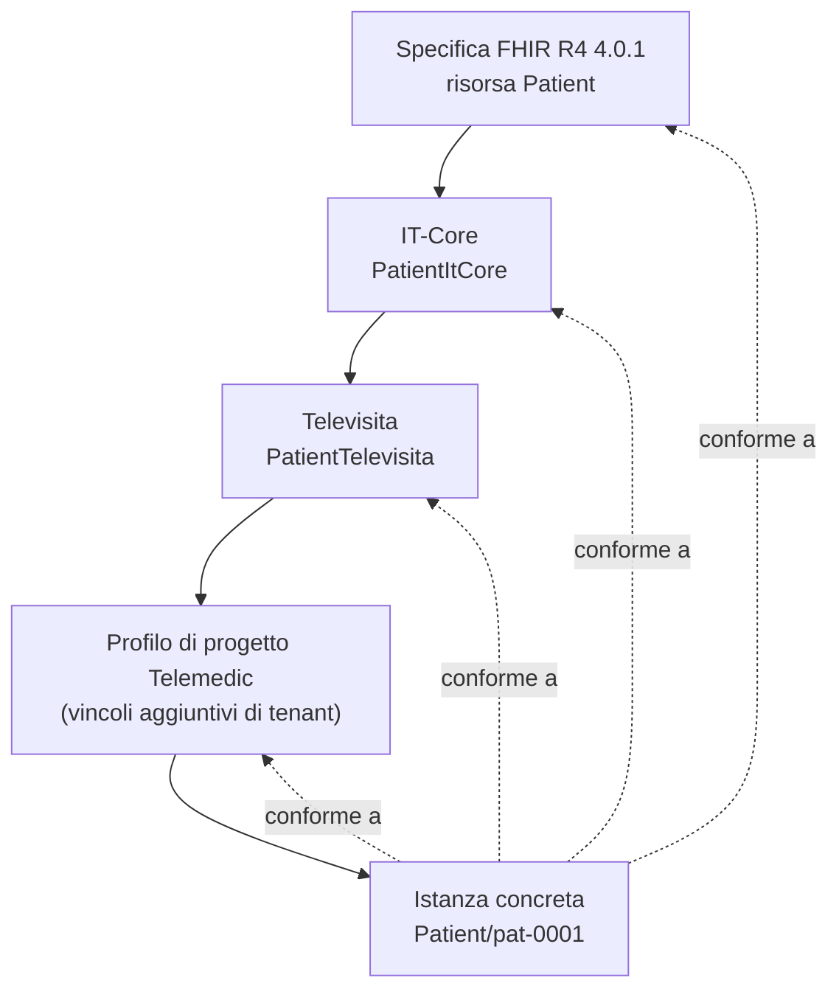
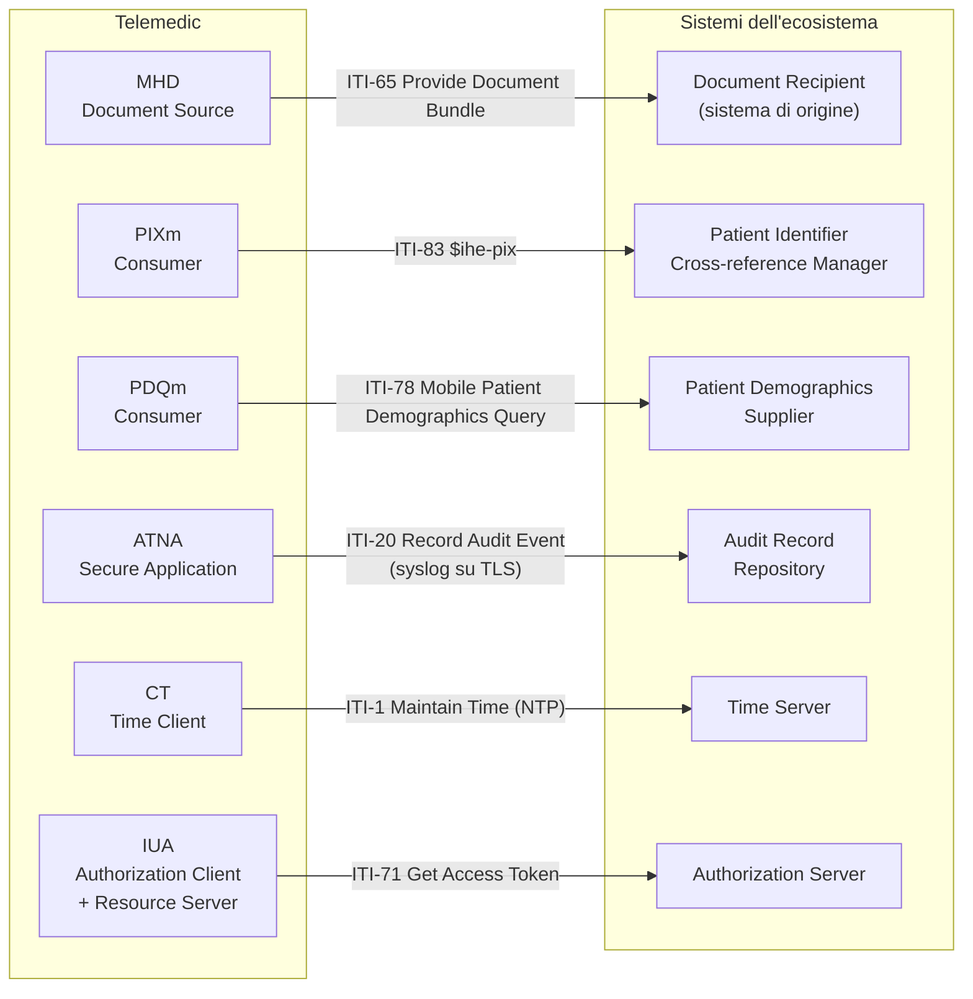

# Gli standard di interoperabilità

Questo modulo presuppone **zero** conoscenza pregressa di standard sanitari. Alla fine
dovresti saper aprire la pagina di un Implementation Guide, capire cosa stai guardando,
riconoscere se è ancora valido, e distinguere ciò che sei obbligato a fare da ciò che sei
soltanto autorizzato a fare.

Non è un modulo teorico. La sezione sulle terminologie contiene **regole operative
vincolanti**: se le violi apri un problema legale al progetto, non un difetto di stile.

---

## 1. Il problema che gli standard risolvono

### 1.1 Lo stesso paziente in tre sistemi

Immagina una signora che chiameremo Maria Bianchi, nata il 3 marzo 1958. Tutti i dati che
seguono sono **sintetici**: nessuno di essi corrisponde a una persona reale.

Maria è in cura per una fibrillazione atriale. Nel corso di sei mesi il suo percorso tocca
tre sistemi informativi diversi:

| Sistema | Come identifica Maria | Come codifica la diagnosi | Come chiama il campo |
|---|---|---|---|
| Centro Unico di Prenotazione dell'azienda sanitaria | `CUP-ASL-0034887` (numerazione interna) | `427.31` (classificazione delle malattie in uso per la rendicontazione ospedaliera) | `COD_DIAG_PRINC` |
| Gestionale del poliambulatorio privato | `PZ-2024-1187` (progressivo interno) | testo libero: «FA parossistica» | `diagnosi_note` |
| Laboratorio che esegue gli esami | `LAB-887766` (numero di accettazione) | nessuna diagnosi: solo il codice della prestazione richiesta | — |

Nessuno dei tre sistemi sta sbagliando. Ciascuno è coerente con se stesso. Il problema
nasce quando devono parlarsi, e si manifesta su **tre assi indipendenti**:

1. **Identità.** Nessuno dei tre identificatori è riconoscibile dagli altri due. Se il
   poliambulatorio invia al laboratorio «paziente PZ-2024-1187», il laboratorio non ha modo
   di sapere che è la stessa persona di `LAB-887766`. La riconciliazione avviene a mano,
   confrontando nome, cognome e data di nascita — un procedimento che sbaglia
   sistematicamente sugli omonimi, sulle date di nascita registrate male e sui cognomi
   con caratteri diacritici.
2. **Significato.** `427.31` e «FA parossistica» descrivono lo stesso fatto clinico, ma
   nessun programma può stabilirlo. Il primo è un codice di una classificazione, il secondo
   è una stringa che un medico ha battuto sulla tastiera. Un sistema che voglia contare
   quanti pazienti con fibrillazione atriale sono in carico deve poter riconoscere entrambi
   come lo stesso concetto — e non può, se non gliene viene data la regola.
3. **Struttura.** `COD_DIAG_PRINC` e `diagnosi_note` non sono lo stesso campo, non hanno
   lo stesso tipo, non hanno la stessa cardinalità e non hanno le stesse regole di
   obbligatorietà. Il mapping fra i due è codice scritto a mano, che qualcuno deve
   mantenere quando uno dei due schemi cambia.

### 1.2 Il costo dell'integrazione punto a punto

Senza standard, ogni coppia di sistemi che deve dialogare richiede un'interfaccia
dedicata. Con `n` sistemi, il numero massimo di interfacce è `n(n-1)/2`: tre sistemi ne
richiedono tre, dieci ne richiedono quarantacinque, venti ne richiedono
centonovanta. Ogni interfaccia ha un proprio formato, un proprio ciclo di manutenzione,
un proprio comportamento in caso di errore, e muore quando muore il progetto che l'ha
finanziata.

Uno standard rompe questa aritmetica: ogni sistema implementa **una** interfaccia verso lo
standard, e il numero di adattatori cresce linearmente con il numero di sistemi. Non è un
guadagno estetico: è la differenza fra un ecosistema che si può far evolvere e uno che si
può soltanto rifare.

### 1.3 Perché «usiamo tutti lo stesso database» non è una risposta

L'obiezione ingenua di chi arriva dall'informatica è: perché non centralizzare tutto in un
unico sistema? Tre risposte, tutte strutturali:

- **La sanità non ha un proprietario unico.** Un'azienda sanitaria pubblica, un
  poliambulatorio privato accreditato, un laboratorio, una farmacia e uno studio associato
  sono soggetti giuridici distinti, con titolarità del trattamento distinte, cicli di
  investimento distinti e vincoli di appalto distinti. Nessuno può imporre agli altri il
  proprio schema dati.
- **I cicli di vita non coincidono.** Un sistema di cartella clinica ospedaliera resta in
  esercizio quindici o vent'anni. Un modulo di telemedicina viene sostituito ogni tre o
  quattro. Un formato di scambio deve sopravvivere a entrambi.
- **Il dato clinico è longitudinale, l'organizzazione no.** La storia clinica di una
  persona attraversa decenni, regioni e sistemi diversi. Il dato deve poter migrare senza
  perdere significato: è precisamente ciò che uno standard semantico garantisce e che uno
  schema proprietario non garantisce.

### 1.4 Cosa deve garantire uno standard, in concreto

Uno standard di interoperabilità sanitaria è utile solo se risponde, insieme, a quattro
domande:

- **Come si identifica la stessa persona in sistemi diversi?** (identificatori con un
  *namespace* dichiarato, servizi di correlazione fra identificativi)
- **Che forma ha il messaggio o il documento?** (sintassi, struttura, cardinalità,
  obbligatorietà)
- **Che cosa significa ciascun valore?** (terminologie condivise, con codici e definizioni
  stabili)
- **Chi può fare cosa, quando, e come lo si dimostra a posteriori?** (autorizzazione,
  consenso, tracciamento)

Un formato che risolve solo la seconda domanda — e ce ne sono molti — non è uno standard
di interoperabilità: è un formato di file.

---

## 2. Chi scrive gli standard

### 2.1 Le organizzazioni di standardizzazione

Un'**organizzazione di standardizzazione** (in inglese *Standards Development
Organization*, abbreviato **SDO**) è un ente che produce specifiche tecniche attraverso un
processo di consenso fra i portatori di interesse: fornitori di software, aziende
sanitarie, enti pubblici, professionisti, ricercatori. Il consenso è la caratteristica
distintiva: nessuno «pubblica» uno standard da solo.

Le organizzazioni che contano per Telemedic sono queste.

| Organizzazione | Che cosa produce | Rilevanza per il progetto |
|---|---|---|
| **HL7 International** | Gli standard di scambio dell'informazione sanitaria: HL7 versione 2, HL7 versione 3, CDA, FHIR, e il vocabolario condiviso *HL7 Terminology* | Il modello dati del progetto è FHIR R4; il canale legacy verso gli integratori è HL7 v2 |
| **Affiliate nazionali di HL7** (in Italia **HL7 Italia**) | Adattamenti nazionali degli standard HL7: profili, guide di implementazione, terminologie locali | Le guide italiane di telemedicina (`Televisita`, `Teleconsulto`, `Teleassistenza`, `Telemonitoraggio`) e `IT-Core` sono la base normativa del modello dati di Telemedic |
| **IHE** (*Integrating the Healthcare Enterprise*) | Non nuovi standard, ma **profili di integrazione**: combinazioni precise di standard esistenti che risolvono un problema concreto | I profili MHD, PIXm, PDQm, ATNA, IUA, BALP definiscono come Telemedic pubblica documenti, correla identità, traccia gli accessi e si autorizza |
| **NEMA / DICOM** | Lo standard delle immagini biomediche e dei relativi servizi di rete | Entra in gioco quando un consulto richiede la lettura di un esame di imaging |
| **ISO/TC 215** (*Health informatics*) | Standard internazionali di informatica sanitaria (architetture, sicurezza, identificazione) | Rilevante soprattutto per il regolatorio e per la gestione della qualità |
| **CEN/TC 251** (*Health informatics*, comitato europeo) | Standard europei di informatica sanitaria, spesso adottati in parallelo con ISO | Rilevante per il contesto europeo di conformità |
| **IETF** e **W3C** | Gli standard della rete su cui tutto poggia: HTTP, TLS, OAuth, JSON, WebRTC | Sono il livello sotto: senza questi, nessuno standard sanitario funziona |

**[NV]** I mandati puntuali di ISO/TC 215 e CEN/TC 251, i loro cataloghi di standard e le
relazioni formali di adozione fra i due comitati non sono stati verificati su fonte
primaria nella fase di ricerca del progetto. Vanno accertati prima di citarli come base
normativa in documentazione regolatoria.

### 2.2 Specifica, profilo, Implementation Guide, guida nazionale

Questi quattro termini vengono usati come sinonimi nelle conversazioni informali, e non lo
sono. La differenza è la chiave per capire tutto il resto.

**Specifica (o standard di base).** È il documento che definisce il modello generale: quali
oggetti esistono, quali campi hanno, quali tipi, quali cardinalità, quali vincoli. È
volutamente **permissivo**, perché deve valere in tutti i paesi, per tutte le specialità,
per tutti i casi d'uso. Esempio: la specifica FHIR R4 definisce la risorsa `Patient` con
`name` di cardinalità `0..*` — cioè un paziente può non avere alcun nome. Sembra assurdo,
ed è invece necessario: esistono contesti clinici reali (un paziente non identificato in
pronto soccorso) in cui il nome non c'è.

**Profilo.** È una **restrizione** della specifica per un contesto specifico. Un profilo può
rendere obbligatorio ciò che era facoltativo, ridurre il numero di valori ammessi, imporre
un sistema di codifica, vietare elementi. Non può fare il contrario. Esempio: il profilo
italiano `PatientItCore` porta `identifier` a `1..*` e `name` a `1..*`: in Italia un
paziente registrato **deve** avere almeno un identificativo e almeno un nome.

**Implementation Guide** (abbreviato **IG**, in italiano *guida di implementazione*). È un
pacchetto pubblicato che contiene, insieme: un insieme coerente di profili, le estensioni
che introduce, i sistemi di codifica e gli insiemi di valori che definisce, gli esempi, le
regole di conformità, e la documentazione narrativa che spiega il caso d'uso. È l'unità di
distribuzione: si installa, si versiona, si valida contro.

**Guida di implementazione nazionale.** È un Implementation Guide prodotto da un'affiliata
nazionale per il proprio contesto giuridico e organizzativo — quello che nel gergo FHIR si
chiama **realm**. Contiene ciò che è specifico del paese: gli identificativi nazionali (in
Italia il codice fiscale, la tessera sanitaria, i codici delle strutture), le
classificazioni obbligatorie per legge, le regole di rendicontazione.

Riassunto operativo:

```text
Specifica generale        →  cosa è possibile in astratto
  Profilo                 →  cosa è ammesso in questo contesto
    Implementation Guide  →  il pacchetto che raccoglie profili, terminologie, esempi
      IG nazionale        →  il pacchetto per un ordinamento giuridico specifico
```

### 2.3 La profilazione: il concetto che spiega tutto il resto

**Profilare** significa *restringere*: prendere uno standard generale e vincolarlo fino a
renderlo verificabile in un contesto d'uso preciso. È il meccanismo che permette a uno
standard mondiale di essere utilizzabile in un ambulatorio di Bari.

Il principio ha una regola d'oro che non ammette eccezioni:

> **Un profilo può solo restringere. Non può mai allargare.**

In pratica:

- una cardinalità `0..1` può diventare `1..1` (obbligatoria) o restare `0..1`, ma una
  cardinalità `1..1` non può tornare `0..1`;
- un insieme di valori può essere ristretto a un sottoinsieme, non ampliato;
- un vincolo di formato può essere reso più severo, non più permissivo;
- un elemento può essere vietato (cardinalità `0..0`), non introdotto ex novo — per
  aggiungere informazione si usano le **estensioni**, che sono un meccanismo previsto dalla
  specifica di base proprio per questo scopo.

La ragione è di sicurezza logica: se un profilo potesse allargare, un sistema che accetta
lo standard di base non potrebbe più accettare i dati profilati, e la promessa di
interoperabilità si romperebbe. Restringendo, invece, ogni istanza conforme al profilo è
per costruzione anche conforme alla specifica di base.

Ne discende una catena di conformità che va letta dal basso verso l'alto:



Un'istanza in fondo alla catena è conforme a tutti i livelli sopra di sé. È questo che
consente a un sistema estero che conosce solo FHIR di leggere comunque un documento
italiano, sia pure senza capirne le specificità nazionali.

### 2.4 Il ciclo di vita di uno standard, e perché conta la versione

Nessuno standard nasce definitivo. Attraversa stadi di maturità, e lo stadio è
un'informazione operativa, non un dettaglio bibliografico: dice quanto puoi fidarti che il
documento non cambi sotto i tuoi piedi.

Gli stadi ricorrenti, con i nomi che incontrerai:

| Stadio | Nome ricorrente | Che cosa significa |
|---|---|---|
| Bozza | *draft* | In lavorazione. Può cambiare in qualunque momento e in qualunque parte. |
| Commento pubblico | *public comment*, *ballot*, *-comment* | Sottoposto alla comunità per osservazioni. Il contenuto cambierà. |
| Uso sperimentale | *trial use*, *STU* (*Standard for Trial Use*), *Trial Implementation* | Pubblicato e utilizzabile, ma esplicitamente soggetto a modifiche sulla base dell'esperienza d'uso. |
| Definitivo | *normative*, *Final Text* | Stabile. Le modifiche successive seguono regole di retro-compatibilità. |
| Ritirato | *retired*, *deprecated*, *withdrawn* | Non più mantenuto. |

Due esempi reali che riguardano direttamente il progetto:

- Il *Technical Framework* di IHE per il dominio ITI è in stato **Final Text**, revisione
  **20.2 dell'11 novembre 2025** **[V]**. È materiale stabile.
- Le guide italiane di telemedicina (`Televisita`, `Teleconsulto`, `Teleassistenza`,
  `Telemonitoraggio`) e `IT-Core` sono alla versione **0.2.0**, in stato **draft /
  trial-use** **[V]**. Sono materiale utilizzabile, ma **cambierà**. Chi vi si conforma
  deve fissare la versione (*pinning*) e prevedere un processo di ricontrollo.

La conseguenza pratica è la regola più importante di questo modulo:

> **Non esiste «lo standard». Esiste sempre e solo una versione precisa di uno standard, a
> una data precisa, in uno stato di maturità preciso.** Ogni volta che scrivi «FHIR R4» in
> un documento hai già commesso un'imprecisione: la versione è **4.0.1**, pubblicata il
> **30 ottobre 2019** **[V]**, e differisce da 4.0.0 negli invarianti e nelle risorse di
> conformità generate. Validatori diversi si comportano diversamente sulle due.

### 2.5 Il ruolo delle guide italiane

L'esistenza delle guide di HL7 Italia per la telemedicina è **il fatto che ha determinato
le scelte di modellazione di Telemedic**. Prima di scoprirle, la scelta naturale sarebbe
stata modellare il referto della sessione come una risorsa di tipo `DiagnosticReport`;
dopo averle lette, la scelta corretta è modellarlo come una `Composition` dentro un
`Bundle` di tipo documento, perché è così che lo modella la guida `Televisita`
(profilo `CompositionRefertoTelevisita`) **[V]**.

Questo è il punto generale: **le guide nazionali non sono un adempimento burocratico da
sbrigare alla fine, sono un vincolo di progettazione da leggere all'inizio.** Un modello
dati che le ignora va rifatto, non adattato.

---

## 3. I livelli dell'interoperabilità

Dire che «due sistemi sono interoperabili» non significa nulla finché non si specifica *a
quale livello*. La suddivisione che segue è di uso corrente nella letteratura di
informatica sanitaria e nei quadri di riferimento europei; **[NV]** la sua formulazione
puntuale e la fonte normativa esatta non sono state verificate nella fase di ricerca del
progetto, e va quindi usata come strumento didattico, non citata come definizione
normativa.

### 3.1 Interoperabilità tecnica

I due sistemi riescono a scambiarsi **bit**. È il livello dei protocolli di rete, del
trasporto, della cifratura, dell'indirizzamento.

*Esempio positivo:* il gestionale dell'integratore apre una connessione TLS verso l'API di
Telemedic sulla porta 443, la cifratura si negozia, la richiesta HTTP arriva a
destinazione.

*Esempio di fallimento:* il gestionale espone un listener del protocollo di trasporto
minimale usato da HL7 versione 2 su una porta TCP raggiungibile solo dalla rete interna
dell'ospedale, e Telemedic è in cloud. Nessun byte passa. Il problema non ha niente a che
vedere con il significato dei dati.

### 3.2 Interoperabilità sintattica

I due sistemi riescono a **decodificare la struttura** di ciò che si scambiano: sanno dove
finisce un campo e dove ne comincia un altro, sanno quali campi sono ripetuti, sanno
riconoscere un messaggio malformato.

*Esempio positivo:* il messaggio arriva come JSON conforme allo schema della risorsa
`Appointment`; il ricevente lo deserializza senza errori e sa che `participant` è un array.

*Esempio di fallimento:* il mittente invia un messaggio HL7 versione 2 in cui i separatori
di campo dichiarati nell'intestazione non corrispondono a quelli effettivamente usati nel
corpo. Il parser del ricevente spezza i campi nel punto sbagliato. I byte sono arrivati
tutti, ma la struttura è persa.

### 3.3 Interoperabilità semantica

I due sistemi **attribuiscono lo stesso significato** ai valori scambiati. È il livello
delle terminologie.

*Esempio positivo:* il campo che contiene il tipo del documento porta il codice `75496-0`
dichiarando esplicitamente il sistema di codifica `http://loinc.org`. Il ricevente,
consultando quel sistema, apprende che si tratta di una nota di telemedicina (*Telehealth
Note*) **[V]**, e può indicizzare il documento nella categoria giusta.

*Esempio di fallimento:* il campo porta il valore `TV`. Il mittente intende «televisita»;
il ricevente, che ha un proprio elenco interno, lo interpreta come «tomografia
volumetrica». Il codice è arrivato integro, la struttura è corretta, il significato è
stravolto. **È il motivo per cui un codice senza `system` dichiarato non è un dato, è
un'ambiguità.**

### 3.4 Interoperabilità organizzativa

Le due organizzazioni hanno **regole compatibili** su chi può fare cosa, con quale
autorizzazione, con quale base giuridica, con quali responsabilità e con quali tempi.

*Esempio positivo:* prima di pubblicare il referto verso il sistema di origine, Telemedic
verifica che esista un consenso valido del paziente, registra un evento di tracciamento
che dichiara la finalità della comunicazione, e il sistema ricevente accetta la
pubblicazione perché il proprio regolamento la prevede.

*Esempio di fallimento:* Telemedic è tecnicamente in grado di inviare il referto, il
formato è corretto, la codifica è condivisa — ma il regolamento del sistema ricevente
richiede che ogni documento sia firmato da un professionista identificato con un
determinato livello di garanzia dell'identità, e il flusso non lo prevede. Il documento
viene rifiutato. Nessun aggiustamento tecnico risolve il problema, perché il problema non è
tecnico.

> **La lezione per chi sviluppa:** la maggior parte dei fallimenti di integrazione che
> sembrano tecnici sono in realtà semantici o organizzativi. Prima di scrivere codice per
> un'integrazione, verifica di aver risposto alle domande di questi due livelli.

---

## 4. HL7 versione 2

### 4.1 Perché uno standard degli anni Ottanta è ancora la spina dorsale

HL7 versione 2 è il formato di messaggistica sanitaria più diffuso al mondo. È ancora
oggi il canale con cui, dentro la maggior parte degli ospedali, il sistema di accettazione
comunica al laboratorio che è arrivato un paziente, e il laboratorio comunica alla cartella
clinica che un esame è pronto.

Va conosciuto per una ragione pratica, non storica: **un integratore che oggi chiede a
Telemedic di ricevere gli appuntamenti quasi certamente li ha già disponibili in questo
formato**, e chiederà di riusarlo invece di implementare un'API nuova. La decisione D4 del
progetto lo mette esplicitamente fra le integrazioni obbligatorie.

### 4.2 Anatomia di un messaggio

Un messaggio HL7 versione 2 è testo. Ha una gerarchia di quattro livelli, delimitati da
caratteri separatori.

- **Segmento**: una riga. Ha un nome di tre caratteri (`MSH`, `PID`, `PV1`, `SCH`…) e
  termina con un carattere di ritorno a capo. Ogni segmento ha un ruolo: `MSH` è
  l'intestazione, `PID` identifica il paziente, `PV1` descrive il contatto assistenziale.
- **Campo**: la posizione dentro il segmento, separata dagli altri campi. Si nomina con
  nome del segmento più numero d'ordine: `PID-5` è il quinto campo del segmento `PID`, cioè
  il nome del paziente.
- **Componente**: la suddivisione interna di un campo. `PID-5` contiene cognome, nome,
  secondo nome, suffisso e altro, separati fra loro.
- **Sottocomponente**: l'ulteriore suddivisione di un componente.

A questi si aggiunge la **ripetizione**: un campo può contenere più valori dello stesso
tipo, separati da un carattere apposito. `PID-3` (elenco degli identificativi del paziente)
è tipicamente ripetuto.

I separatori sono questi **[V-sec]**:

| Ruolo | Carattere predefinito | Dove è dichiarato |
|---|---|---|
| Fine del segmento | ritorno a capo (`0x0D`) | fisso, non modificabile |
| Separatore di campo | `\|` | **MSH-1** — il campo contiene il carattere stesso |
| Separatore di componente | `^` | MSH-2, posizione 1 |
| Separatore di ripetizione | `~` | MSH-2, posizione 2 |
| Carattere di escape | `\` | MSH-2, posizione 3 |
| Separatore di sottocomponente | `&` | MSH-2, posizione 4 |

La conseguenza curiosa e importante: **il separatore di campo è per definizione il quarto
carattere del messaggio** **[V-sec]**, perché i primi tre sono `MSH` e il quarto è il
contenuto di `MSH-1`, che *è* il separatore. Un parser corretto non presume `|`: lo legge
dal messaggio.

Il segmento di intestazione `MSH` ha una struttura fissa **[V-sec]**:

| Campo | Nome | Cosa contiene |
|---|---|---|
| MSH-1 | Field Separator | il carattere separatore di campo |
| MSH-2 | Encoding Characters | gli altri quattro separatori, nell'ordine |
| MSH-3 / MSH-4 | Sending Application / Facility | chi invia (applicazione e struttura) |
| MSH-5 / MSH-6 | Receiving Application / Facility | chi riceve |
| MSH-7 | Date/Time of Message | data e ora del messaggio |
| MSH-9 | Message Type | tipo, evento scatenante e struttura |
| MSH-10 | Message Control ID | identificativo univoco del messaggio |
| MSH-11 | Processing ID | ambiente (produzione, test, addestramento) |
| MSH-12 | Version ID | versione dello standard usata |
| MSH-15 | Accept Acknowledgment Type | se e quando si vuole la conferma di ricezione |
| MSH-16 | Application Acknowledgment Type | se e quando si vuole la conferma di elaborazione |
| MSH-17 | Country Code | codice del paese |
| MSH-18 | Character Set | codifica dei caratteri |
| MSH-21 | Message Profile Identifier | identificativo del profilo a cui il messaggio si conforma |

### 4.3 I tipi di messaggio che contano per Telemedic

Un tipo di messaggio si identifica con una sigla di tre lettere più un **evento
scatenante** (*trigger event*): il fatto del mondo reale che provoca l'invio.

**ADT — anagrafica e contatti assistenziali.** Gli eventi rilevanti **[V-sec]**:

| Evento | Significato |
|---|---|
| `A01` | Ammissione: inizio della degenza in struttura, paziente assegnato a un letto |
| `A03` | Dimissione: fine della degenza |
| **`A04`** | **Registrazione di un paziente ambulatoriale**, senza assegnazione di letto |
| `A08` | Aggiornamento delle informazioni del paziente, in assenza di altri eventi |
| `A11` | Annullamento di un'ammissione |
| `A28` / `A31` | Inserimento / aggiornamento delle informazioni anagrafiche di una persona |

> **Errore ricorrente, da non commettere:** per una prestazione a distanza di tipo
> ambulatoriale il messaggio corretto è **`A04`, non `A01`**. Il paziente non è ricoverato e
> non ha un letto assegnato. Usare `A01` inquina i sistemi a valle con degenze inesistenti.

**SIU — programmazione degli appuntamenti.** È il tipo più rilevante per il progetto,
perché la decisione di modello dice che l'agenda nasce nel sistema dell'integratore e
Telemedic la riceve. Eventi **[V-sec]**:

| Evento | Significato |
|---|---|
| **`S12`** | Notifica di un nuovo appuntamento prenotato |
| `S13` | Riprogrammazione |
| `S14` | Modifica |
| `S15` | Annullamento |
| `S17` | Cancellazione (appuntamento inserito per errore) |
| `S23` / `S24` | Blocco / sblocco di fasce orarie |
| **`S26`** | Il paziente non si è presentato |

**MDM — notifica di documenti.** È il canale corretto per restituire il referto della
sessione a un sistema che non parla FHIR. Eventi **[V-sec]**:

| Evento | Significato |
|---|---|
| `T01` / **`T02`** | Notifica di documento originale, senza / **con contenuto** |
| `T03` / `T04` | Cambio di stato del documento, senza / con contenuto |
| `T05` / `T06` | Addendum |
| `T09` / **`T10`** | Sostituzione del documento, senza / con contenuto |
| `T11` | Annullamento |

Il segmento chiave è `TXA`, che porta i metadati del documento. Due campi contano più
degli altri **[V-sec]**: `TXA-17` (stato di completamento) e `TXA-19` (disponibilità).
I valori di `TXA-17` includono `AU` (autenticato) e **`LA` (legalmente autenticato)**: `LA`
è il segnale che il documento è definitivo e firmato. La coppia `TXA-12` (numero univoco
del documento) e `TXA-13` (numero del documento padre) è il meccanismo con cui si
esprimono le rettifiche.

**ORU — risultati.** `ORU^R01` è il messaggio con cui un servizio diagnostico trasmette
esiti. La struttura annida gruppi: paziente, ordine, osservazioni **[V-sec]**. I segmenti
che contano sono `OBR` (l'ordine e il servizio richiesto) e `OBX` (la singola osservazione,
con tipo di valore in `OBX-2`, identificativo dell'osservazione in `OBX-3`, valore in
`OBX-5`, stato in `OBX-11`).

### 4.4 Un messaggio reale, commentato riga per riga

Il messaggio che segue è un `SIU^S12` — notifica di un nuovo appuntamento — inviato dal
gestionale di una struttura a Telemedic. **Tutti i dati sono sintetici.**

```text
MSH|^~\&|GESTIONALE|STRUTTURA_A|TELEMEDIC|TENANT_A|20260914073000||SIU^S12^SIU_S12|MSG00001|P|2.5.1|||AL|NE|ITA|UNICODE UTF-8
SCH|PLC-88213|FLR-99001||||CTRL^Visita di controllo cardiologica^L|Controllo post-dimissione|AMB|30|min|^^^20260914100000^20260914103000
TQ1|1||||||20260914100000|20260914103000
PID|1||RSSMRA80A01H501U^^^MEF^NNITA||ROSSI^MARIO||19800101|M|||VIA ROMA 1^^ROMA^RM^00100^ITA^H||^PRN^PH^^^06^5551234
PV1|1|O|||||||||||||||||VIS-2026-0000123
RGS|1|A|GRP-1
AIS|1|A|CTRL^Visita di controllo cardiologica^L|20260914100000|||30|min
AIP|1|A|MED-0007^BIANCHI^ANNA^^^DR|PPRF^Medico esecutore|||20260914100000|||30|min
AIL|1|A|VROOM-8f3a^^^TENANT_A^^^^^Stanza virtuale|||20260914100000|||30|min
```

Riga per riga:

**Riga 1 — `MSH`, intestazione.** Il quarto carattere è `|`: da lì il parser deduce il
separatore di campo. `^~\&` sono gli altri quattro separatori. Segue chi invia
(`GESTIONALE` presso `STRUTTURA_A`) e chi riceve (`TELEMEDIC` presso `TENANT_A`): il
secondo elemento della coppia ricevente è il modo naturale di veicolare l'informazione di
tenant, che il vincolo V4 del progetto impone su ogni entità. `20260914073000` è la data e
ora del messaggio nel formato compatto dello standard. `SIU^S12^SIU_S12` è il tipo:
messaggio SIU, evento S12, struttura `SIU_S12`. `MSG00001` è l'identificativo univoco: è il
valore che l'ACK di ritorno citerà. `P` indica ambiente di produzione. `2.5.1` è la
versione dello standard. `AL` in MSH-15 chiede sempre la conferma di ricezione; `NE` in
MSH-16 dichiara di non volere la conferma applicativa: siamo in modalità *enhanced* con la
sola fase di accettazione. `ITA` è il codice del paese e `UNICODE UTF-8` la codifica dei
caratteri — quest'ultima non è un dettaglio, perché senza di essa i cognomi con accenti
arrivano corrotti.

**Riga 2 — `SCH`, i dati dell'appuntamento.** `PLC-88213` è l'identificativo attribuito da
chi richiede (*placer*), `FLR-99001` quello attribuito da chi eroga (*filler*). Il campo
`SCH-7` porta il codice della prestazione con la terna «codice, descrizione, sistema di
codifica»: si noti che è **il codice della visita di controllo ordinaria**, non un
ipotetico codice «televisita». È la traduzione operativa della regola nazionale di
rendicontazione: la prestazione erogata a distanza mantiene la codifica della
corrispondente prestazione in presenza **[V-sec]**; la modalità a distanza è un asse
separato. `30` e `min` sono durata e unità; l'ultimo campo porta l'intervallo temporale.

**Riga 3 — `TQ1`, tempistica strutturata.** Presente a partire dalla versione 2.5 dello
standard **[V]**: un parser scritto per la 2.3 lo scarterebbe. Ripete in forma strutturata
l'inizio e la fine.

**Riga 4 — `PID`, identificazione del paziente.** `PID-3` è l'elenco degli identificativi.
Qui c'è il codice fiscale, con l'autorità di assegnazione nel quarto componente e il tipo
di identificativo nel quinto. Il valore `NNITA` merita una nota: la tabella HL7 degli
identifier type **non contiene un codice `NN`**; contiene un concetto il cui codice è
letteralmente `NNxxx`, dove `xxx` va sostituito con il codice del paese a tre lettere —
quindi `NNITA` per l'Italia **[V]**. `NNITA` non è enumerato come concetto: è un valore
generato dalla regola di formazione. **Nessun profilo italiano pubblicato fissa quale
codice usare per il codice fiscale** **[V]**: la scelta va concordata con l'integratore e
scritta nel contratto d'interfaccia. `PID-5` è il nome, con cognome e nome separati da `^`.

**Riga 5 — `PV1`, il contatto.** `PV1-2` è la classe del paziente: `O` significa
*outpatient*, cioè ambulatoriale, ed è il valore verificato sulla tabella corrispondente
**[V]**. `PV1-19` porta il numero della visita.

**Righe 6-9 — il gruppo delle risorse.** Il gruppo è **obbligatorio e ripetibile** e deve
iniziare con `RGS` **[V]**. `AIS` descrive il servizio, `AIP` il personale (qui il medico,
con il ruolo espresso in `AIP-4`), `AIL` la risorsa di ubicazione — che nel nostro caso è
la stanza virtuale. Va osservato che nella struttura ufficiale il **gruppo del paziente è
opzionale** **[V]**: esiste un `SIU^S12` valido privo di segmento `PID`. Un consumatore che
dia per scontata la presenza del paziente non è conforme.

### 4.5 Le conferme: ACK e NACK

Un messaggio HL7 versione 2 riceve una risposta. Ne esistono due modalità **[V-sec]**.

**Modalità originale.** Il ricevente valida (tipo di messaggio accettabile, versione
compatibile, ambiente coerente); se la validazione fallisce risponde `AR`. Se passa,
l'applicazione elabora e risponde `AA` (accettato), `AE` (errore applicativo) o `AR`
(rifiuto).

**Modalità estesa.** Separa la conferma di *ricezione* da quella di *elaborazione*. La
prima fase, governata da `MSH-15`, produce `CA` (ricezione accettata), `CR` (ricezione
rifiutata) o `CE` (errore di ricezione). La seconda fase, governata da `MSH-16`, produce
in un messaggio successivo `AA`, `AE` o `AR`. I valori ammessi per `MSH-15` e `MSH-16` sono
`AL` (sempre), `NE` (mai), `ER` (solo su errore) **[V-sec]**.

Esempio di conferma di ricezione al messaggio precedente:

```text
MSH|^~\&|TELEMEDIC|TENANT_A|GESTIONALE|STRUTTURA_A|20260914073001||ACK^S12^ACK|ACK00001|P|2.5.1
MSA|CA|MSG00001
```

E in caso di errore applicativo:

```text
MSH|^~\&|TELEMEDIC|TENANT_A|GESTIONALE|STRUTTURA_A|20260914073001||ACK^S12^ACK|ACK00002|P|2.5.1
MSA|AE|MSG00001
ERR||PID^1^3|204^Unknown key identifier^HL70357|E
```

Il segmento `ERR` nella versione 2.5 dello standard ha dodici campi e **differisce
radicalmente da quello della versione 2.3**, dove esisteva un solo campo **[V]**. I campi
utili sono `ERR-2` (posizione strutturata dell'errore: segmento, occorrenza, campo),
`ERR-3` (codice di errore secondo la tabella dedicata) ed `ERR-4` (gravità: `W`
avvertimento, `I` informazione, `E` errore, `F` errore fatale) **[V]**. I codici di errore
verificati includono `101` (campo obbligatorio mancante), `102` (tipo di dato errato),
`103` (valore non presente in tabella), `204` (identificativo sconosciuto), `205`
(identificativo duplicato) e `207` (errore applicativo generico) **[V]**.

**[NV]** Le colonne di lunghezza massima e di obbligatorietà del segmento `ERR` non sono
state verificate su fonte primaria: tre estrazioni indipendenti della stessa pagina hanno
prodotto valori incompatibili. Non vanno pubblicate.

### 4.6 Il trasporto: MLLP, e perché va incapsulato in TLS

HL7 versione 2 definisce il *contenuto* del messaggio, non il modo di trasmetterlo. Il
trasporto usato in pratica è **MLLP** (*Minimal Lower Layer Protocol*), che risolve un
problema molto specifico: su una connessione TCP i byte arrivano come flusso continuo, e il
ricevente non ha modo di sapere dove finisce un messaggio e comincia il successivo. MLLP
incornicia ogni messaggio fra un byte di inizio e una coppia di byte di fine **[V-sec]**:

```text
0x0B  <payload HL7 v2>  0x1C 0x0D
```

**[V-sec]** I valori esadecimali sono confermati da due fonti indipendenti che citano la
specifica ufficiale di trasporto; il documento primario non è stato letto direttamente
nella fase di ricerca. **[NV]** La porta 6660, spesso citata come convenzionale, non
risulta essere una porta registrata per MLLP: nella pratica si usa quella concordata fra
le parti.

Ora il punto che conta davvero:

> **MLLP nudo è testo in chiaro su TCP, senza autenticazione, senza integrità, senza
> riservatezza.** Chiunque sia sul percorso di rete legge nomi, codici fiscali, diagnosi e
> può modificarli senza che nessuna delle due parti se ne accorga.

Non è un difetto di progettazione dello standard: MLLP nasce per reti ospedaliere chiuse
degli anni Ottanta, dove il modello di minaccia era diverso. È un difetto **del deployment**
usarlo così oggi. La regola vincolante per Telemedic:

1. Ogni listener MLLP è esposto **esclusivamente** dentro un canale TLS, con autenticazione
   reciproca basata su certificati X.509 — che è esattamente ciò che prescrive il profilo
   IHE di autenticazione di nodo (§6.5).
2. Mai un listener MLLP raggiungibile da rete non fidata, nemmeno «temporaneamente per il
   collaudo».
3. Il certificato del controparte va verificato, non solo presentato: una connessione TLS
   che accetta qualunque certificato non offre alcuna protezione contro un attacco attivo.

### 4.7 Il ponte verso FHIR

Esiste un Implementation Guide ufficiale che mappa i messaggi HL7 versione 2 verso le
risorse FHIR: si chiama *HL7 Version 2 to FHIR*, è alla **versione 1.0.0**, in stato
*trial use*, generato il **7 ottobre 2025**, e ha come bersaglio FHIR **R4** **[V]**.

Contiene **tredici mappature di messaggio**, tutte con stato **informativo** **[V]**:
`ADT_A01`, `ADT_A02`, `ADT_A05`, `ADT_A06`, `ADT_A09`, `ADT_A11`, `ADT_A17`, `OML_O21`,
`ORM_O01`, `VXU_V04`, `ORU_R01`, `MDM_T02`, `SIU_S12`. E **settantasette mappature di
segmento**, anch'esse informative **[V]**. Quelle rilevanti per il caso d'uso del progetto:
`SCH` verso `Appointment`, `AIS`/`AIG`/`AIL`/`AIP` verso `Appointment`, `PID` verso
`Patient`, `PV1` verso `Encounter`, `TXA` verso `DocumentReference` **[V]**.

Due avvertenze da tenere a mente:

- **Nessuna delle mappature è normativa.** Sono informative: non si può dichiarare
  «conformità» ad esse. Sono un riferimento autorevole, non un obbligo.
- **Non esiste una mappatura del segmento `ERR` verso `OperationOutcome`** **[V]**. La
  traduzione degli errori di HL7 versione 2 nel formato di errore di FHIR è a carico di chi
  implementa, senza copertura normativa. Va progettata e documentata.

---

## 5. HL7 CDA release 2

### 5.1 Che cos'è un documento clinico

Un **documento clinico** non è un file: è un oggetto con proprietà giuridiche precise. Le
proprietà che la letteratura di settore attribuisce a un documento clinico — e che ne
distinguono la natura da quella di un messaggio — sono la persistenza nel tempo, la
riferibilità a un custode responsabile, la possibilità di essere autenticato da chi ne
risponde, l'autosufficienza rispetto al contesto, l'integrità come unità inscindibile e la
leggibilità da parte di un essere umano. **[NV]** Questa formulazione non è stata verificata
sul testo della specifica CDA nella fase di ricerca del progetto: va confermata prima di
essere citata come definizione normativa.

La differenza con un messaggio è sostanziale. Un messaggio dice «è successo questo,
aggiorna i tuoi dati»: è transitorio, il suo valore si esaurisce quando è stato elaborato.
Un documento dice «io attesto che questo è avvenuto, e me ne assumo la responsabilità»:
resta, e conserva valore probatorio anche a distanza di anni.

### 5.2 Struttura: intestazione e corpo

**CDA** (*Clinical Document Architecture*) release 2 è lo standard HL7 per i documenti
clinici, espresso in XML. Un documento CDA ha due parti.

L'**intestazione** (*header*) contiene ciò che rende il documento identificabile e
opponibile: identificativo univoco del documento, tipo di documento espresso come codice,
data di creazione, paziente di riferimento, autore, custode, legale autenticatore,
eventuali destinatari, e il riferimento al contatto assistenziale che l'ha generato.

Il **corpo** (*body*) contiene il contenuto clinico, organizzato in **sezioni**. Ogni
sezione ha un codice che ne dichiara la natura (anamnesi, esame obiettivo, conclusioni…) e
un blocco narrativo destinato alla lettura umana. Le sezioni possono contenere **entry**:
rappresentazioni strutturate e codificate del medesimo contenuto, destinate
all'elaborazione automatica.

Ne discende la nozione di **livello di strutturazione**, che nel gergo di settore si
esprime così: un documento è di livello 1 quando il corpo è sostanzialmente narrativo, di
livello 2 quando le sezioni sono identificate e codificate, di livello 3 quando anche il
contenuto delle sezioni è codificato in entry elaborabili. **[NV]** Questa tripartizione è
di uso corrente ma non è stata verificata sul testo della specifica: va confermata.

### 5.3 I template

Un **template** in CDA è l'equivalente concettuale di un profilo in FHIR: un insieme di
vincoli aggiuntivi che restringono la struttura generale per un tipo di documento
specifico. Un documento dichiara i template a cui si conforma tramite un identificativo
apposito, e un validatore verifica che i vincoli siano rispettati.

Il meccanismo è lo stesso della profilazione descritta al §2.3, con una differenza pratica:
in CDA i template si annidano a più livelli (template di documento, di sezione, di entry),
e un documento reale ne dichiara tipicamente diversi.

### 5.4 Perché in Italia conta ancora moltissimo

Chi arriva da FHIR è tentato di considerare CDA una tecnologia superata. Sarebbe un errore
di valutazione, per una ragione concreta: **l'infrastruttura documentale sanitaria italiana
è costruita su documenti CDA**, e i documenti che vi si depositano devono conformarsi alle
specifiche nazionali di quella infrastruttura.

Per il progetto la questione è aperta e va gestita esplicitamente. Il quadro, per come
risulta dalle decisioni assunte:

- Un decreto del novembre 2025 ha istituito **dieci nuove tipologie documentali dedicate
  alla telemedicina**, con il relativo insieme informativo definito in Gazzetta Ufficiale.
  Il referto di televisita è una di queste tipologie, e **non** va ricondotto alla tipologia
  preesistente della specialistica ambulatoriale.
- I **template CDA e i metadati di indicizzazione** per quelle tipologie **non erano ancora
  acquisiti** al momento in cui il progetto ha assunto le proprie decisioni di modello dati.

La conseguenza operativa, che è anche una buona pratica generale:

> **Si modella il contenuto informativo come dataset canonico indipendente dal formato, e
> si tratta CDA come una serializzazione sostituibile.** Non si cabla un template che non è
> ancora stato letto. Quando i template saranno disponibili, si scriverà l'adattatore che
> proietta il dataset canonico nel formato richiesto, senza toccare il modello di dominio.

È lo stesso principio che il progetto applica alla convivenza fra versioni di FHIR: il
modello di dominio interno non parla il dialetto di nessun formato di scambio, e ogni
formato è uno strato di adattamento.

---

## 6. IHE

### 6.1 Che cosa fa IHE, e perché non è «un altro standard»

IHE non scrive standard. Prende standard esistenti — HL7, DICOM, protocolli della rete — e
specifica **come combinarli** per risolvere un problema di integrazione concreto. È la
risposta al fatto che uno standard, da solo, lascia troppe scelte aperte: due sistemi
possono entrambi «usare FHIR» e non riuscire a parlarsi, perché hanno scelto in modo
diverso su dieci punti che lo standard lasciava liberi.

Il prodotto di IHE si chiama **profilo di integrazione**, e si costruisce con tre concetti.

**Attore** (*actor*). Definizione verbatim dal *Technical Framework* del dominio ITI
**[V]**:

> *"Information systems or components of information systems that produce, manage, or act
> on information associated with operational activities in the enterprise."*

Un attore non è un sistema: è un **ruolo** che un sistema assume. Lo stesso prodotto
software può implementare più attori, e lo stesso attore può essere implementato da
prodotti diversi. Quando si dice «Telemedic implementa l'attore *Document Source*» si dice
che Telemedic sa fare ciò che quel ruolo richiede, non che Telemedic *è* quel ruolo.

**Transazione** (*transaction*). Definizione verbatim **[V]**:

> *"Interactions between actors that transfer the required information through
> standards-based messages."*

Una transazione è uno scambio specifico fra due attori, con un formato preciso, un
protocollo preciso e regole di errore precise.

**Profilo di integrazione.** La composizione di attori e transazioni che risolve un
problema. Il documento che lo descrive è organizzato in volumi: il primo dà la visione
d'insieme, i successivi descrivono le transazioni con dettaglio crescente **[V]**.

### 6.2 Come si legge la sigla di una transazione

Ogni transazione ha un identificativo nella forma `DOMINIO-numero`. Esempi:
`ITI-41`, `ITI-65`, `ITI-83`, `ITI-20`.

Il prefisso è il **dominio** IHE che ha definito la transazione. `ITI` sta per *IT
Infrastructure* ed è il dominio delle funzioni trasversali: condivisione di documenti,
gestione delle identità, tracciamento, autorizzazione, sincronizzazione del tempo. Esistono
altri domini (radiologia, cardiologia, laboratorio, sanità pubblica, farmacia), ciascuno
con la propria numerazione. **[NV]** L'elenco completo dei domini IHE e le rispettive sigle
non sono stati verificati nella fase di ricerca.

Il numero è progressivo dentro il dominio e **non ha significato semantico**: `ITI-65` non è
«più avanzato» di `ITI-41`, è semplicemente stato definito dopo. Il numero è però stabile
nel tempo: una volta assegnato, identifica quella transazione per sempre, anche attraverso
le revisioni del framework.

Quando incontri una citazione come «IHE ITI TF-2, transazione ITI-41, revisione 20.2 del
2025-11-11», la stai leggendo così: dominio *IT Infrastructure*, *Technical Framework*
volume 2, transazione numero 41, revisione 20.2 del framework, pubblicata l'11 novembre
2025.

### 6.3 I profili che Telemedic usa

#### MHD — accesso mobile ai documenti sanitari

Risolve il problema: «come pubblico un documento clinico, e come lo ritrova chi lo cerca?».
È la versione basata su FHIR REST della condivisione documentale, pensata per ambienti a
risorse limitate. Versione rilevata: **4.2.5-comment (2026-06-16)**, cioè una versione in
fase di commento pubblico, **non** testo definitivo, basata su FHIR **R4 (4.0.1)** **[V]**.

Attori **[V]**: *Document Source* (chi pubblica), *Document Recipient* (chi riceve la
pubblicazione), *Document Consumer* (chi cerca e recupera), *Document Responder* (chi
risponde alle ricerche).

Transazioni **[V]**:

| Transazione | Sigla | Che cosa fa |
|---|---|---|
| Provide Document Bundle | **ITI-65** | Pubblica un insieme di documenti con i loro metadati |
| Find Document Lists | ITI-66 | Cerca raccolte di documenti |
| Find Document References | **ITI-67** | Cerca i metadati dei documenti |
| Retrieve Document | **ITI-68** | Recupera il contenuto di un documento |
| Simplified Publish | ITI-105 | Pubblicazione semplificata |
| Generate Metadata | ITI-106 | Generazione dei metadati |

Le risorse FHIR coinvolte sono `DocumentReference`, `List`, `Binary` e `Bundle` **[V]**.

**Come Telemedic lo usa:** al termine della sessione, il referto — serializzato come
`Bundle` di tipo documento e indicizzato da un `DocumentReference` — viene pubblicato con
**ITI-65** verso il *Document Recipient* del sistema di origine. È la risposta al requisito
che il contenuto clinico confluisca nella cartella del sistema chiamante invece di restare
confinato in Telemedic.

#### PIXm — correlazione fra identificativi del paziente

Risolve il problema descritto al §1.1: la stessa persona ha identificativi diversi in
domini diversi. Versione: **3.1.0, Trial Implementation (2025-11-04)**, FHIR R4 **[V]**.

Transazioni **[V]**: *Patient Identity Feed FHIR* (**ITI-104**) e *Patient Identifier
Cross-reference Query* (**ITI-83**). Quest'ultima si invoca come operazione FHIR
`$ihe-pix` sull'endpoint `[base]/Patient/$ihe-pix`, con parametri in ingresso
`sourceIdentifier` (obbligatorio, nella forma `dominio|valore`), `targetSystem` (i domini
da cui si vogliono gli identificativi di ritorno) e `_format`; in uscita
`targetIdentifier` e `targetId` **[V]**.

**Come Telemedic lo usa:** come *consumatore*. Riceve dall'integratore un identificativo
nel dominio dell'integratore e, quando serve, chiede al sistema autoritativo la
corrispondenza con l'identificativo nazionale. Non diventa mai il registro di riferimento
delle identità.

#### PDQm — interrogazione demografica

Risolve: «ho alcuni dati anagrafici, chi è il paziente?». Versione: **3.2.0, Trial
Implementation (2025-11-04)**, FHIR R4 **[V]**.

Attori **[V]**: *Patient Demographics Consumer* e *Patient Demographics Supplier*.
Transazioni: *Mobile Patient Demographics Query* (**ITI-78**) e *Patient Demographics
Match* (**ITI-119**).

I quattordici parametri di ricerca ammessi su `Patient` in ITI-78 sono verificati **[V]**:
`_id`, `active`, `family`, `given`, `identifier`, `telecom`, `birthdate`, `address`,
`address-city`, `address-country`, `address-postalcode`, `address-state`, `gender`,
`mothersMaidenName`. Il consumatore *può* fornirli, il fornitore **deve** saperli
processare tutti, e deve supportare almeno le combinazioni `family` + `gender` e
`birthdate` + `family` **[V]**. Nota tipografica da copiare esattamente:
`mothersMaidenName` è l'unico parametro scritto in *camelCase*.

#### ATNA — tracciamento e autenticazione di nodo

Risolve: «come dimostro, a posteriori e in modo non contestabile, chi ha fatto cosa?».
È il profilo che soddisfa il vincolo di auditabilità immutabile del progetto.

Attori **[V]**: *Secure Node* (sistema che garantisce la sicurezza sull'intero stack fino
all'interfaccia utente), *Secure Application* (sicurezza a livello applicativo), *Audit
Record Repository* (raccoglie e conserva i registri), *Audit Record Forwarder* (filtra e
inoltra).

Transazioni **[V]**: *Record Audit Event* (**ITI-20**), *Authenticate Node* (**ITI-19**), e
*Maintain Time* (**ITI-1**, dal profilo *Consistent Time*, il cui raggruppamento è
obbligatorio).

Il formato del messaggio di tracciamento è quello definito dall'allegato A.5 della parte 15
dello standard DICOM **[V]** — ed è lo stesso modello informativo su cui è costruita la
risorsa FHIR `AuditEvent`, gestita congiuntamente da HL7, DICOM e IHE **[V]**. Questo
significa che Telemedic può mantenere **un unico modello di tracciamento interno**,
serializzabile sia come risorsa FHIR (per l'API) sia nel formato XML previsto da ITI-20
(per l'invio al repository dell'integratore).

Il trasporto è syslog, in due varianti **[V]**: su TLS (**raccomandata**) o su UDP. La
variante UDP porta un'avvertenza esplicita nella specifica: il trasporto può troncare i
messaggi oltre 1024 byte, e il repository deve accettare i frammenti. Per un sistema
sanitario, un registro di tracciamento troncato è un registro inutile: la variante TLS non
è una preferenza, è l'unica scelta difendibile.

Per l'autenticazione di nodo si applica il vincolo di usare TLS versione 1.2 o superiore,
con certificati X.509 e, quando il client autentica il server, la verifica del nome del
server secondo le regole dedicate **[V]**.

#### CT — tempo coerente

È il prerequisito di ATNA e sembra banale finché non lo si dimentica. Attori: *Time
Server* e *Time Client*; transazione *Maintain Time* (**ITI-1**); protocollo NTP;
accuratezza richiesta: errore mediano inferiore a un secondo **[V]**.

**Perché non è banale:** senza sincronizzazione oraria fra i nodi, i registri di
tracciamento di sistemi diversi non sono correlabili e non sono opponibili. L'intervallo
temporale di una sessione registrato da un nodo con orologio derivato non è utilizzabile in
un contenzioso. In un'installazione basata su container, la sincronizzazione oraria è
responsabilità dell'host: va documentata come requisito di installazione e verificata
all'avvio, non data per scontata.

#### IUA — autorizzazione

Risolve: «come autorizzo una chiamata fra sistemi in un contesto sanitario?». Revisione
**2.5, Trial Implementation, 18 giugno 2026** **[V]**.

Attori **[V]**: *Authorization Client*, *Authorization Server*, *Resource Server*.
Transazioni: *Get Access Token* (**ITI-71**), *Incorporate Access Token* (**ITI-72**),
*Introspect Token* (**ITI-102**), *Get Authorization Server Metadata* (**ITI-103**).

Il framework è OAuth 2.1, con due tipi di concessione profilati: *authorization code* e
*client credentials* **[V]**. I claim JWT richiesti sono `iss`, `sub`, `client_id`, `aud`,
`exp`, `scope`, `jti`; le estensioni facoltative raccolgono organizzazione, ruoli e finalità
d'uso in un oggetto dedicato **[V]**.

Un chiarimento che evita un errore di progettazione ricorrente — la specifica lo dichiara
verbatim **[V]**:

> *"IUA is not based on SMART-on-FHIR, but does strive to not conflict with that standard."*

**IUA e SMART on FHIR non sono alternative equivalenti.** SMART è la scelta per il lancio
di un'applicazione clinica dentro una cartella clinica elettronica; IUA è la scelta per
l'autorizzazione fra sistemi in un contesto IHE. Il progetto deve supportare entrambi, con
due profilazioni di token distinte sullo stesso servizio di identità.

#### BALP — schemi di base per i registri di tracciamento

È un *content profile*: non definisce attori e transazioni nuovi, definisce **come deve
essere fatta** una risorsa `AuditEvent` in casi ricorrenti. Versione **1.1.4, Trial
Implementation, 31 ottobre 2025**, su FHIR R4 **[V]**.

Definisce dieci schemi per le operazioni REST — creazione, lettura, aggiornamento,
cancellazione, ricerca, ciascuna in due varianti, con e senza paziente identificato — più
due schemi per la **comunicazione di dati a terzi** (uno dal lato di chi comunica, uno dal
lato di chi riceve) e sei schemi per l'autorizzazione **[V]**.

**Come Telemedic lo usa:** i due schemi di comunicazione a terzi sono esattamente quelli
necessari quando il referto viene restituito al sistema di origine. Restituire un referto è
una comunicazione di dati sanitari a un altro titolare, e va tracciata come tale, con
l'indicazione della finalità.

### 6.4 Il quadro d'insieme



Va letto così: ogni freccia è una transazione, ogni riquadro è un attore, e Telemedic
implementa la colonna di sinistra. Un integratore che voglia collegarsi deve implementare
almeno gli attori corrispondenti nella colonna di destra per le funzioni che gli
interessano.

### 6.5 Un profilo che il progetto evita deliberatamente

Esiste un profilo più antico per la condivisione documentale, basato su SOAP e su un
registro di metadati con un proprio modello dati **[V]**. È la generazione precedente a
MHD e copre lo stesso caso d'uso.

**Non è la scelta corretta come interfaccia primaria di un progetto nuovo del 2026**:
introduce uno stack tecnologico interamente diverso da quello del resto del sistema, con il
proprio costo di implementazione, di test e di manutenzione. MHD espone la stessa semantica
su FHIR REST, e i sistemi che parlano il protocollo più antico possono essere raggiunti
tramite un gateway di conversione. Se un integratore lo richiede, si valuta il gateway, non
la reimplementazione.

---

## 7. DICOM e DICOMweb

### 7.1 Che cos'è, in due paragrafi

**DICOM** (*Digital Imaging and Communications in Medicine*) è lo standard delle immagini
biomediche. Copre due cose insieme: il **formato** del file (che contiene i pixel e, nella
stessa struttura, i metadati clinici e tecnici — paziente, studio, serie, apparecchiatura,
parametri di acquisizione) e i **servizi di rete** per scambiarle.

Un'immagine DICOM non è un file grafico con dei metadati appiccicati: è un oggetto clinico
in cui l'immagine e il suo contesto sono inscindibili. Estrarre i pixel e salvarli come
immagine ordinaria significa perdere l'identità del paziente, i parametri di acquisizione e
la gerarchia studio-serie-istanza che consente di ritrovarli.

### 7.2 DICOMweb

**DICOMweb** è l'insieme dei servizi RESTful definiti dalla parte 18 dello standard
**[V]**. Tre servizi contano:

| Servizio | Che cosa fa |
|---|---|
| **QIDO-RS** | Cerca oggetti DICOM (*"Search for DICOM objects"*) |
| **WADO-RS** | Recupera oggetti DICOM (*"Retrieve DICOM objects"*) |
| **STOW-RS** | Memorizza oggetti DICOM (*"Store DICOM objects"*) |

Gli URI seguono una gerarchia leggibile **[V]**:

```text
GET /studies/{study}/series/{series}/instances/{instance}
GET /studies/{study}/series/{series}/instances/{instance}/metadata
GET /studies/{study}/series/{series}/instances/{instance}/rendered
GET /studies?PatientID=...
```

I tipi di contenuto supportati includono il formato nativo, una rappresentazione JSON dei
metadati e le risposte multiparte **[V]**.

### 7.3 Quando entra in gioco per Telemedic, e con quali regole

Entra in gioco in un solo scenario: **durante un consulto, un professionista deve
consultare un esame di imaging del paziente**, che è archiviato nel sistema di imaging della
struttura, non in Telemedic.

Il collegamento con FHIR passa dalla risorsa `ImagingStudy`, che descrive lo studio e ne
espone i riferimenti di rete tramite risorse `Endpoint` **[V]**. Il vocabolario dei tipi di
connessione include codici specifici per i tre servizi DICOMweb **[V]**.

Le regole che il progetto si dà, e la ragione di ciascuna:

1. **Nessuna copia dei pixel in Telemedic**, salvo necessità esplicita e motivata.
   Telemedic è un veicolo di comunicazione, non un archivio di imaging. Duplicare le
   immagini significa duplicare un archivio sanitario, con tutto ciò che ne consegue in
   termini di conservazione, sicurezza e responsabilità.
2. **Le immagini diagnostiche non transitano sul canale video.** Condividere lo schermo per
   mostrare una radiografia introduce una compressione con perdita non controllata: ciò che
   il professionista remoto vede **non è il dato diagnostico**. Se il consulto richiede
   lettura diagnostica, l'immagine va servita per via DICOMweb al visualizzatore del
   partecipante remoto. Questo è un divieto architetturale, non una raccomandazione di
   qualità.
3. **Ogni accesso genera un evento di tracciamento**, con i codici verificati del
   vocabolario DICOM per interrogazione, accesso alle istanze ed esportazione **[V]**.
4. **TLS con autenticazione reciproca** verso l'archivio, coerentemente con il profilo di
   autenticazione di nodo.

**[NV]** Le regole di autorizzazione specifiche per DICOMweb — in particolare l'uso di
token OAuth sui servizi di recupero — non sono state verificate nella fase di ricerca del
progetto.

---

## 8. Le terminologie cliniche

Questa sezione contiene le **regole più vincolanti dell'intero modulo**. Le prime due
sottosezioni spiegano i concetti; dalla §8.4 in poi sono obblighi operativi.

### 8.1 Code system, value set, binding

Tre concetti, in ordine di dipendenza.

**Code system** (*sistema di codifica*). È l'insieme dei codici possibili con il loro
significato. Ha un **URI canonico** che lo identifica in modo univoco e globale, una
versione, e per ogni codice un identificativo, una descrizione ufficiale (*display*) e
possibilmente una definizione formale. Esempi: `http://loinc.org`,
`http://snomed.info/sct`, `http://hl7.org/fhir/sid/icd-9-cm`.

Il punto che va interiorizzato: **l'URI canonico non è un indirizzo web da visitare, è un
identificatore.** Il fatto che scrivendolo nel browser non si ottenga nulla di utile, o che
il dominio sia cambiato proprietario, non lo rende sbagliato. È come un codice fiscale: non
serve a raggiungere qualcuno, serve a identificarlo. Un caso reale: il sistema di
classificazione dei farmaci mantenuto da un centro collaboratore ha migrato il proprio sito
web su un dominio diverso, ma **l'URI canonico resta quello storico e non va aggiornato**
**[V]**.

**Value set** (*insieme di valori*). È un sottoinsieme di codici, selezionato per un uso
specifico. Un value set non contiene i codici: li **seleziona**, o per enumerazione
esplicita, o per filtro (ad esempio «tutti i discendenti di questo concetto»). L'operazione
che trasforma la selezione nell'elenco effettivo si chiama **espansione** (*expansion*), e
il risultato dipende dalla versione del code system: lo stesso value set espanso oggi e
fra un anno può contenere codici diversi.

**Binding** (*legame*). È la dichiarazione, in un profilo, che un determinato elemento deve
prendere i propri valori da un determinato value set. Il binding ha una **forza**, e la
forza è ciò che stabilisce quanto sei obbligato:

| Forza | Che cosa significa in pratica |
|---|---|
| **required** | Il valore **deve** provenire dal value set. Un valore fuori dal value set rende l'istanza non conforme. |
| **extensible** | Il valore deve provenire dal value set **se il concetto che devi esprimere è presente**. Se non lo è, puoi usare un altro codice. |
| **preferred** | Il value set è la scelta raccomandata, ma un altro codice è ammesso. |
| **example** | Il value set è puramente illustrativo. Nessun vincolo. |

L'ordine di severità è: `example` < `preferred` < `extensible` < `required` **[V]**. Un
profilo può irrigidire un binding, ma **non può rilassare un binding già `required`**
**[V]**.

### 8.2 Le terminologie che contano per il progetto

**LOINC** (*Logical Observation Identifiers Names and Codes*). Identifica osservazioni,
misure e — cosa determinante per Telemedic — **tipi di documento e sezioni di documento**.
URI canonico: `http://loinc.org` **[V]**. È la terminologia su cui si regge la struttura
del referto di televisita. I codici verificati e direttamente utilizzabili **[V]**:

| Codice | Uso |
|---|---|
| **75496-0** | *Telehealth Note* — il tipo del documento di referto di televisita |
| 29299-5 | Sezione «quesito diagnostico» |
| 11329-0 | Sezione «inquadramento clinico iniziale» / «anamnesi» |
| 48765-2 | Sezione «allergie» |
| 10160-0 | Sezione «terapia farmacologica in atto» |
| 29545-1 | Sezione «esame obiettivo» |
| 30954-2 | Sezione «precedenti esami eseguiti» |
| 93126-1 | Sezione «confronto con precedenti esami» |
| **47045-0** | Sezione «referto» — **obbligatoria** nel profilo italiano |

**SNOMED CT** (*Systematized Nomenclature of Medicine — Clinical Terms*). È la terminologia
clinica più estesa e più espressiva esistente: descrive condizioni, procedure, reperti,
sostanze, strutture anatomiche, in una rete di concetti collegati da relazioni formali. URI
canonico: `http://snomed.info/sct` **[V]**. Ammette come codici gli identificativi di
concetto e le espressioni in grammatica composizionale; **gli identificativi di termine e
di descrizione non sono codici validi** **[V]**.

**ICD-9-CM, versione italiana.** È la classificazione delle malattie usata in Italia per la
codifica delle informazioni cliniche nella scheda di dimissione ospedaliera. La versione
italiana 2007 è stata resa obbligatoria da un decreto ministeriale del 18 dicembre 2008
**[V-sec]**. URI canonico internazionale: `http://hl7.org/fhir/sid/icd-9-cm` **[V]**.
**Attenzione:** la guida italiana `Televisita` definisce un **proprio** sistema di codifica
con un URI diverso **[V]**. Esistono quindi due URI concorrenti per la stessa
classificazione: vanno tenuti distinti e non mescolati, e la traduzione fra i due è
un'operazione di conformità da documentare.

**AIC** (Autorizzazione all'Immissione in Commercio). È il codice con cui in Italia si
identifica operativamente un medicinale nel contesto della prescrizione dematerializzata e
dei flussi nazionali. È la codifica primaria del farmaco per il progetto, e la scelta ha
una motivazione che non è solo di aderenza al mercato: come si vedrà alla §8.4, evita un
problema di licenza.

**Catalogo nazionale delle prestazioni.** Contiene i codici delle prestazioni erogabili.
Regola di modellazione che ne discende **[V-sec]**: le prestazioni erogabili a distanza già
presenti nel catalogo **mantengono la stessa codifica e la stessa tariffa** della
corrispondente prestazione in presenza. Non esiste — e non deve esistere — un codice di
prestazione «televisita». La televisita è un **modo di erogazione**, non una prestazione:

- **cosa** viene erogato → il codice della prestazione;
- **come** viene erogato → un asse separato del modello dati.

Confondere i due assi è l'errore di modellazione che rende un sistema di telemedicina non
rendicontabile.

**HL7 Terminology.** È il vocabolario condiviso di HL7, che raccoglie i sistemi di codifica
delle specifiche HL7 e le tabelle di HL7 versione 2 ripubblicate. È rilasciato sotto una
dedicazione al pubblico dominio **[V]**.

### 8.3 Il regime di licenza adottato dal progetto

Qui finisce la teoria. Quanto segue è **regola operativa vincolante**, discendente dalla
decisione D31 e dall'analisi condotta sui testi di licenza.

Il principio da cui tutto discende è questo. Il progetto è rilasciato sotto licenza
Apache-2.0, che concede a chi riceve il codice cinque diritti: uso, modifica, opere
derivate, sublicenza, ridistribuzione — perpetui e **irrevocabili** **[V]**. Il progetto può
concedere questi diritti **soltanto su ciò di cui detiene il titolo**. Su contenuto
terminologico di terzi non può, per la ragione più semplice che esista: non lo possiede.

Ne discende la regola strutturale:

> **Il repository contiene soltanto materiale su cui il progetto può realmente concedere i
> diritti di Apache-2.0.** Ogni altro contenuto terminologico è escluso, oppure isolato in
> una directory con licenza propria e dichiarazione esplicita che Apache-2.0 non vi si
> applica, oppure acquisito a runtime da chi installa, sotto la licenza che si è procurato.

Da qui i **quattro regimi**. Ogni terminologia ricade in uno e uno solo di essi; non
esistono vie di mezzo né eccezioni discrezionali, ed è ciò che rende la regola applicabile
in fase di revisione del codice.

| Regime | Significato | Dove va il contenuto |
|---|---|---|
| **A — coesistenza piena** | Il contenuto può stare fra i sorgenti, coperto dalla licenza del progetto | `src/main/resources/fhir/**` |
| **B — directory separata** | Il contenuto è ridistribuibile ma a condizioni diverse: sta in una directory dedicata, con licenza e attribuzione proprie | `third-party/<terminologia>/` |
| **C — acquisizione a runtime** | Il contenuto non è ridistribuibile dal progetto: il software è progettato per acquisirlo o interrogarlo al deployment | nessuna: configurazione dell'installazione |
| **D — esclusione totale** | Nessun contenuto, in nessuna forma; solo riferimento per URI e codice | nessuna |

La collocazione di ciascuna terminologia **[V]**:

| Terminologia | Regime | Perché |
|---|---|---|
| LOINC | **A**, con attribuzione obbligatoria | La licenza concede espressamente la distribuzione, per qualunque scopo commerciale e non |
| HL7 Terminology | **A** | Dedicazione al pubblico dominio |
| Sistemi di codifica del nucleo FHIR | **A** | Dedicazione al pubblico dominio |
| Catalogo nazionale delle prestazioni | **B** | Atto ufficiale dello Stato; separazione per chiarezza, non per obbligo |
| ICD-9-CM versione italiana | **B** | Atto ufficiale dello Stato; rischio residuo basso ma non nullo sulla catena a monte |
| UCUM (unità di misura) | **B**, o meglio dipendenza esterna | Ridistribuibile verbatim, ma vieta i derivati ed è **revocabile** |
| **SNOMED CT** | **C** | Vedi §8.4 |
| ICD-10 / ICD-11 | **D** | La licenza vieta le opere derivate e impone obblighi incompatibili |
| Classificazione ATC dei farmaci | **D** | *"Copying and distribution for commercial purposes is not allowed"* **[V]** |
| Terminologia controllata DICOM | **D** per il contenuto; codici per riferimento | Ridistribuzione non verificata |
| Pacchetti delle guide italiane | **C** — dipendenza risolta in fase di build | Licenza non pienamente attribuibile, contenuti di terzi ricompresi |
| Documenti IHE e documenti dello standard HL7 v2 | **D** — citazione per URL | Licenze non sublicenziabili o senza diritto di ridistribuzione |

### 8.4 SNOMED CT: le regole che un contributore deve rispettare

SNOMED CT è il caso critico e merita una trattazione a sé, perché la violazione non è un
difetto di stile: è un problema legale con un costo quantificabile.

**I fatti, verificati.**

L'Italia **non è fra i paesi Membri** dell'organizzazione che governa SNOMED CT **[V]**.
Nei paesi Membri l'accesso è gratuito e mediato da un centro nazionale; in Italia non esiste
un centro nazionale, non esiste una licenza nazionale gratuita, e **ogni singolo
utilizzatore deve procurarsi una licenza a titolo oneroso, individualmente, ogni anno**.
Le tariffe di riferimento verificate: **1.954 dollari all'anno** per un ospedale in fascia
A, **652 dollari** per uno studio, **moltiplicate per sito fisico**, e dovute **anche in
ambienti non di produzione** **[V]**.

L'accordo di licenza si perfeziona **per fatto concludente**, nel momento in cui si scarica
o si accede al contenuto. Il testo è esplicito **[V]**:

> *"By **downloading, accessing or using** any part of the International Release of SNOMED
> CT … the Licensee agrees to be bound by the terms of this License Agreement."*

Da qui discende la linea di difesa del progetto, che è pulita e allo stesso tempo fragile:

> **Se il progetto non scarica mai, non accede mai e non usa mai il contenuto di SNOMED CT,
> non diventa mai licenziatario e l'accordo non lo vincola mai.**

È fragile perché basta **un** manutentore che scarichi i file di rilascio «per fare una
prova» perché l'intero progetto diventi licenziatario, con gli obblighi conseguenti di
dichiarazione annuale, pagamento e tenuta di un registro dei sub-licenziatari.

C'è di più. Una clausola dell'accordo impone al licenziatario di garantire che il contenuto
**non sia accessibile né scaricabile se non da utenti autorizzati** **[V]**. Un repository
pubblico è l'esatto contrario di un sistema ad accesso controllato: **questa clausola, da
sola, chiude la questione.** E il divieto riguarda *"any part of it"*: non esiste una soglia
di irrilevanza.

**Le regole operative, senza eccezioni.**

*Vietato nel repository, in qualunque forma:*

- file di rilascio di SNOMED CT (qualunque formato, qualunque sottoinsieme);
- `ValueSet` con espansione popolata di codici SNOMED — un value set espanso è per
  definizione un sottoinsieme, e un sottoinsieme è un derivato ai sensi dell'accordo **[V]**;
- tabelle, file CSV o JSON, seed di database, migrazioni con codici e descrizioni SNOMED;
- mappature precalcolate fra SNOMED e altre classificazioni — sono *cross-map*, quindi
  derivati **[V]**;
- gerarchie, alberi, indici di ricerca precalcolati;
- descrizioni SNOMED tradotte in italiano — la traduzione richiede **consenso scritto
  preventivo** del titolare **[V]**;
- fixture di test contenenti risposte reali di un servizio terminologico con codici e
  descrizioni SNOMED — è il canale attraverso cui il contenuto rientra dalla porta di
  servizio;
- l'avviso di licenza SNOMED nel file `NOTICE` del progetto: sarebbe una **dichiarazione
  non veritiera**, perché il progetto non è licenziatario.

*Ammesso:*

- l'URI canonico come stringa costante: un URI è un identificatore, non contenuto;
- `ValueSet` che si compongono **per filtro**, senza espansione, con il numero minimo di
  identificativi di ancoraggio;
- riferimenti a value set SNOMED per URL canonico dentro i profili;
- il codice sorgente dei client terminologici;
- test che usano codici fittizi su un sistema di codifica di progetto.

*Negli esempi committati nel repository:* **non usare SNOMED CT**. Usare LOINC, ICD-9-CM
italiano o i sistemi di codifica nazionali. Dove un esempio debba illustrare specificamente
l'uso di SNOMED, usare un segnaposto tipografico:

```json
{
  "coding": [
    {
      "system": "http://snomed.info/sct",
      "code": "<SNOMED-CT-ConceptId>",
      "display": "<descrizione fornita dal servizio terminologico>"
    }
  ]
}
```

*Regola di comportamento, che vale per ogni manutentore:*

> **Nessuno scarica i file di rilascio di SNOMED CT, di ICD-11 o della classificazione ATC
> per finalità di sviluppo del progetto.** Il test dell'integrazione terminologica si esegue
> con doppi di test — sistemi di codifica fittizi di progetto — oppure su un'istanza fornita
> da chi detiene già la licenza.

**Il *terminology guard* in integrazione continua.** La disciplina non può reggersi sulla
buona volontà. Un controllo automatico **fa fallire la build** se, fuori dalla directory
dedicata al materiale di terzi, compare **[V]**:

1. un `ValueSet` con espansione che dichiara come sistema SNOMED CT, la classificazione dei
   farmaci ATC, ICD-11 o ICD-10;
2. una composizione che include uno di quei sistemi con un elenco di concetti non vuoto;
3. un file che corrisponde ai nomi tipici dei file di rilascio SNOMED;
4. un numero di occorrenze di identificativi SNOMED oltre soglia, in file non esplicitamente
   ammessi;
5. un pacchetto FHIR compresso committato nel repository.

Il controllo è accompagnato da un elenco di eccezioni versionato, in cui **ogni eccezione
ha una motivazione scritta e firmata**. Un'eccezione senza motivazione è un difetto, non una
scorciatoia. Per il fascicolo tecnico regolatorio, questo controllo è una misura di gestione
della configurazione e va documentato come tale **[V]**.

**L'avvertenza da non nascondere a chi installa.** Due punti che quasi tutti sbagliano:

1. **Interrogare un servizio terminologico esterno non esonera chi installa dalla licenza.**
   Nel momento in cui l'installazione **scrive** un codice SNOMED in una risorsa clinica,
   quell'installazione è un *sistema di elaborazione dati* ai sensi dell'accordo, e la
   tariffa è legata precisamente a questo **[V]**. Il servizio esterno risolve il problema
   *della distribuzione del contenuto* — che è il problema del progetto — non il problema
   *della licenza d'uso*, che è il problema di chi installa.
2. **Chi distribuisce Telemedic distribuisce un prodotto soggetto alla licenza**, anche se
   il codice non contiene un solo concetto SNOMED: la definizione include i prodotti che
   *"read or write records or other data that is encoded using SNOMED CT"* **[V]**.

**Il sistema funziona pienamente senza SNOMED CT.** Non è un ripiego, è un corollario
obbligato: con la funzione disattivata, il sistema resta operativo appoggiandosi a LOINC,
ICD-9-CM e al catalogo nazionale, che non costano nulla. Il costo va dichiarato: circa
quattromila codici di un particolare legame non si validano.

### 8.5 LOINC: la trappola delle traduzioni

LOINC è in regime A: si può ridistribuire. Ma ha una restrizione che un progetto italiano
incontra al primo giorno di lavoro sull'interfaccia utente.

La licenza concede il diritto di tradurre, ma con due condizioni **[V-sec]**: il titolare va
**notificato preventivamente**, e la traduzione risultante è un'opera derivata **i cui
diritti sono assegnati al titolare stesso**.

> **La trappola concreta.** Se il progetto pubblicasse un file con i nomi italiani dei
> codici LOINC delle sezioni del referto, starebbe producendo un'opera derivata di cui **non
> è titolare**, e che quindi **non può licenziare sotto Apache-2.0**.

La soluzione è architetturale ed è comunque la pratica corretta:

- il campo che porta la descrizione ufficiale del codice contiene **il display LOINC
  ufficiale**, in inglese;
- l'etichetta italiana visibile all'utente è una **stringa di interfaccia del progetto**,
  che vive nei file di internazionalizzazione, concettualmente e fisicamente separata dal
  display del codice;
- il testo italiano redatto dal medico o dal progetto va nell'elemento testuale del
  concetto, non nella descrizione del codice.

Questa separazione va tenuta con disciplina e formalizzata in una decisione architetturale.

**[NV]** Non è stato verificato se esista una variante linguistica italiana ufficiale di
LOINC pubblicata dal titolare. Se esiste, è la soluzione preferibile: si usa quella.

### 8.6 Il principio generale che vale oltre questi casi

Vale la pena enunciarlo come regola, perché è l'errore più costoso in questa materia:

> **Una dichiarazione di licenza apposta da un ente sul proprio Implementation Guide vincola
> i diritti *di quell'ente sul proprio contributo editoriale*. Non dispone — perché non può
> — dei diritti di terzi sul contenuto terminologico ricompreso.**

Casi reali e verificati **[V]**: un pacchetto terminologico italiano dichiara la propria
dedicazione al pubblico dominio e contiene un sistema di codifica della classificazione ATC
dei farmaci — la dedicazione **non** rende ridistribuibile quel contenuto, i cui diritti
sono di un terzo che ne vieta la distribuzione commerciale. Simmetricamente, il vocabolario
di HL7 è nel pubblico dominio **come contenitore**, e HL7 stesso avverte esplicitamente che
i concetti SNOMED, DICOM e altri che vi transitano non lo sono.

**Regola per il progetto:** prima di incorporare qualunque artefatto terminologico di terzi
— anche se dichiarato nel pubblico dominio, anche se proveniente da un ente pubblico — si
ispeziona **artefatto per artefatto** da quale sistema di codifica provengono i concetti
enumerati. La licenza del contenitore non è la risposta. La risposta è la titolarità del
contenuto.

### 8.7 La checklist di revisione

Da applicare a ogni nuovo `ValueSet` o `CodeSystem` che entra nel repository. Ogni voce si
verifica in trenta secondi.

- [ ] Da quale sistema di codifica provengono i concetti enumerati? (elencarli tutti)
- [ ] Ciascuno di quei sistemi è in regime **A** o **B**?
- [ ] Se sono presenti codici LOINC: l'elemento di copyright porta l'attribuzione richiesta?
- [ ] Se sono presenti codici LOINC: è stato verificato che nessuno porti un avviso di
      copyright di terzi?
- [ ] È presente un'espansione o un elenco esplicito di concetti con codici **SNOMED CT**,
      **ATC**, **ICD-10** o **ICD-11**? → **la modifica va respinta**
- [ ] Se il value set si compone per filtro su SNOMED: gli identificativi di ancoraggio sono
      il minimo necessario?
- [ ] È dichiarata la **versione** della terminologia di riferimento?
- [ ] Se l'artefatto proviene da un pacchetto di terzi: è stata verificata la titolarità del
      **contenuto**, e non solo la licenza dichiarata dal **contenitore**?

---

## 9. Come si legge uno standard

Questa sezione è una procedura, non una riflessione. Serve quando ti trovi davanti a un
documento che non conosci e devi decidere se e come usarlo.

### 9.1 Passo 1 — Trovare la versione vigente

Ogni artefatto pubblicato di uno standard moderno ha tre coordinate. Cercale nell'ordine.

1. **L'URL canonico.** È l'identificatore stabile dell'artefatto, indipendente da dove è
   ospitato. Ha la forma di un URI e si trova nell'intestazione della pagina o nel campo
   `url` dell'artefatto. Esempio verificato: la guida `Televisita` ha canonical
   `http://hl7.it/fhir/televisita/ImplementationGuide/televisita` **[V]**.
2. **La versione.** Numero esplicito, tipicamente nella forma `maggiore.minore.patch`. Non
   accontentarti di «R4»: la versione è `4.0.1`.
3. **La data di generazione e lo stato di maturità.** Sono in fondo alla pagina, nel piè di
   pagina generato dagli strumenti di pubblicazione. Dicono quando l'artefatto è stato
   costruito e in che stadio si trova.

Per gli artefatti pubblicati come pacchetti (il caso di FHIR), c'è una quarta coordinata: il
**nome del pacchetto e la sua versione**, nella forma `nome#versione`. È ciò che scrivi nel
file di configurazione della build, ed è ciò che rende la build riproducibile.

Quasi tutte le guide hanno una **pagina di storia** che elenca le versioni pubblicate con
le rispettive date. È il posto in cui verificare che la versione che stai usando sia
effettivamente l'ultima, o capire quanto sei indietro.

### 9.2 Passo 2 — Leggere una tabella di conformità

La pagina di un profilo presenta una tabella con una riga per elemento. Le colonne che
contano sono queste.

**Nome dell'elemento.** Con l'indentazione che ne indica l'annidamento. Un punto nel nome
(`Encounter.participant.individual`) indica il percorso.

**Cardinalità.** Nella forma `min..max`. `0..1` significa facoltativo e non ripetibile;
`1..1` obbligatorio e singolo; `0..*` facoltativo e ripetibile; `1..*` obbligatorio con
almeno un'occorrenza. **Leggila sempre prima di tutto il resto**: metà delle validazioni
fallite dipendono da un elemento obbligatorio non valorizzato.

**Tipo.** Il tipo di dato, oppure — per i riferimenti — l'elenco dei tipi di risorsa che
possono essere puntati. Quest'ultima informazione è vincolante: se un elemento ammette
riferimenti a tre tipi di risorsa, il quarto non è ammesso, e un validatore lo segnala.
Esempio verificato: in FHIR R4 l'elemento che elenca i partecipanti a un contatto
assistenziale **non può riferirsi a un paziente** **[V]** — il paziente si esprime con
l'elemento dedicato al soggetto. Modellarlo come partecipante è un errore di conformità.

**Flag.** Simboli compatti che segnalano proprietà particolari. I tre che contano:
*summary* (l'elemento compare nelle rappresentazioni sintetiche), *modifier* (l'elemento
**cambia il significato** degli altri e non può essere ignorato da chi legge), *must
support* (vedi sotto).

**Binding.** Il value set di riferimento e la sua forza (§8.1).

**Descrizione e vincoli.** Include gli **invarianti**: regole formali che l'istanza deve
rispettare, espresse in un linguaggio di espressione. Sono la seconda causa di validazioni
fallite. Esempio verificato di una risorsa clinica **[V]**: *"clinicalStatus SHALL be
present if verificationStatus is not entered-in-error and category is problem-list-item"*.
Un vincolo di questo tipo va codificato come regola di dominio nel backend, non lasciato al
validatore a runtime.

### 9.3 Passo 3 — Capire i livelli di obbligatorietà

Gli standard usano un vocabolario preciso per esprimere l'obbligatorietà, mutuato dalla
prassi delle specifiche della rete. I termini chiave, in maiuscolo nel testo originale:

| Termine | Significato |
|---|---|
| **SHALL** / **MUST** | Obbligo assoluto. Se non lo fai, non sei conforme. |
| **SHALL NOT** / **MUST NOT** | Divieto assoluto. |
| **SHOULD** | Raccomandazione forte. Puoi discostartene, ma devi avere una ragione e devi averla considerata. |
| **SHOULD NOT** | Sconsigliato, con la stessa disciplina. |
| **MAY** | Facoltativo. Nessuna implicazione se non lo fai. |

**[NV]** La definizione formale di questi termini è nelle specifiche di riferimento della
comunità Internet (RFC 2119, integrata da RFC 8174), che non sono state lette nella fase di
ricerca del progetto: la tabella riflette l'uso corrente e va confermata sul testo prima di
citarla come fonte normativa.

Un caso che merita attenzione perché è una trappola concreta: la specifica FHIR dice che i
server **dovrebbero** ignorare i parametri di ricerca che non riconoscono **[V]**. È una
raccomandazione ragionevole per l'evoluzione dello standard, ed è **un rischio di sicurezza
in un sistema multi-tenant**: un client che invia un filtro di autorizzazione scritto male
riceve silenziosamente più dati del previsto. Il progetto sceglie deliberatamente il
comportamento opposto — errore sui parametri non riconosciuti — e **lo documenta come
deviazione consapevole**. È così che si tratta un `SHOULD` da cui ci si discosta: non
ignorandolo, ma motivando.

Poi c'è **must support**, che è la sorgente di equivoci più frequente. La specifica FHIR è
esplicita **[V]**:

> *"The meaning of 'support' is not defined by the base FHIR specification."*

Cioè: il significato lo deve definire il profilo. **Un Implementation Guide che marca
elementi come «must support» senza dire cosa significhi è tecnicamente inutile**, perché
nessuno può verificare la conformità. Quando incontri un elemento marcato così, cerca nella
guida la definizione; se non c'è, è una lacuna da segnalare, e il progetto deve dichiarare
la propria interpretazione.

### 9.4 Passo 4 — Verificare che una guida non sia scaduta o difettosa

Una guida può essere formalmente pubblicata e sostanzialmente inutilizzabile. Ecco i
segnali da cercare, tutti verificabili in pochi minuti, con esempi reali riscontrati sulle
guide che il progetto usa.

**Segnale 1 — Lo stato dichiarato.** *Draft*, *trial use*, *comment* significano che il
contenuto cambierà. Non impedisce l'uso, impone il *pinning* e un processo di ricontrollo.
Le guide italiane di telemedicina sono in stato draft/trial-use alla versione 0.2.0
**[V]**; il profilo IHE per l'accesso mobile ai documenti è in una versione *comment*
**[V]**.

**Segnale 2 — La data di generazione.** Se la guida è stata generata anni fa e lo standard
di base ha avuto nel frattempo correzioni tecniche, i due potrebbero non essere più
allineati.

**Segnale 3 — Le dipendenze flottanti.** Una guida dichiara le guide da cui dipende. Se una
dipendenza è dichiarata con una versione **non fissata** — la parola `current` al posto di
un numero — la build **non è riproducibile**: compilando lo stesso codice a due mesi di
distanza puoi ottenere risultati diversi. È un caso reale: il pacchetto `Televisita`
dichiara una dipendenza flottante verso il pacchetto terminologico italiano **[V]**. Per un
progetto soggetto a obblighi di gestione della configurazione, non è un fastidio: è un
difetto. Il progetto deve fissare la versione esatta e documentarlo.

**Segnale 4 — I campi segnaposto.** Gli strumenti di pubblicazione delle guide FHIR
generano dei modelli con valori di esempio, che l'autore deve sostituire. Se non lo fa, la
guida esce con quei valori. Caso reale verificato: la guida `Televisita` 0.2.0 dichiara come
editore `Example Publisher` e come contatto un dominio di esempio, **valori del modello mai
sostituiti** **[V]**. La conseguenza non è estetica: la stessa guida dichiara anche una
licenza, e una dichiarazione di licenza che convive con un editore inesistente **non è
attribuibile a un soggetto identificato**. Non si sa chi l'abbia dichiarata.

**Segnale 5 — Le incoerenze fra nome e contenuto.** Caso reale verificato **[V]**: nella
guida `Televisita` esiste un insieme di valori il cui identificativo suggerisce le tipologie
di prescrizione, mentre il titolo e il contenuto effettivo riguardano i codici di assistenza
per cittadini stranieri, con sette voci che nulla hanno a che vedere con le ricette. Chi
implementa fidandosi del nome trova tutt'altro.

**Segnale 6 — Le informazioni mancanti che dovrebbero esserci.** Caso reale verificato
**[V]**: il sistema di codifica delle diagnosi definito nella guida `Televisita` enumera
oltre mille codici della classificazione italiana delle malattie **senza dichiarare a quale
edizione della classificazione corrispondano**, e senza dichiarazione di copyright.
L'assenza è accertata, non presunta. Il risultato è che il sistema di codifica **non è
tracciabile a un'edizione**: due implementazioni che lo usano non hanno modo di sapere se
stanno codificando con la stessa versione.

**Segnale 7 — Le dipendenze terminologiche onerose.** Una guida può dipendere da
terminologie soggette a licenza. Le guide italiane di telemedicina dichiarano SNOMED CT fra
le dipendenze, e la guida `IT-Core` riporta in piè di pagina l'avviso che gli utenti devono
procurarsi la licenza appropriata **[V]**. È corretto che lo dicano; è altrettanto corretto
che chi implementa lo sappia prima di iniziare, non dopo.

**Segnale 8 — Le divergenze fra guide della stessa famiglia.** Il caso più insidioso, ed è
il tema della sezione dedicata nel modulo successivo: due guide dello stesso ente possono
usare URI diversi per la stessa cosa. È accertato che la guida `Televisita` e la guida
`IT-Core` usano **URI diversi per il sistema di codifica del codice fiscale** **[V]**.

### 9.5 Passo 5 — Decidere cosa fare

La procedura si chiude con una decisione, che va scritta, non lasciata implicita:

1. **Quale versione uso**, fissata esattamente, e in quale file della build è dichiarata.
2. **A quali parti della guida dichiaro conformità**, e da quali mi discosto motivatamente.
   Una dichiarazione di conformità parziale e onesta vale più di una totale e falsa.
3. **Quali difetti della guida ho riscontrato**, e cosa faccio nel frattempo. I difetti
   riscontrati vanno **segnalati all'ente che pubblica la guida**: è un contributo alla
   comunità, non una contestazione, e la risposta scritta va conservata.
4. **Quando ricontrollo.** Le guide in stato trial-use cambiano con cadenza infra-annuale.
   Un promemoria calendarizzato prima del rilascio non è burocrazia: è l'unico modo per non
   scoprire il disallineamento in produzione.

---

## Cosa devi ricordare

1. **Gli standard risolvono tre problemi distinti**: identità, struttura, significato. Un
   formato che risolve solo la struttura non è uno standard di interoperabilità.
2. **L'interoperabilità ha quattro livelli** — tecnica, sintattica, semantica,
   organizzativa — e la maggior parte dei fallimenti che sembrano tecnici sono in realtà
   semantici o organizzativi.
3. **Profilare significa restringere, mai allargare.** Ogni istanza conforme a un profilo è
   per costruzione conforme anche allo standard di base. È ciò che rende possibile la catena
   specifica → guida nazionale → profilo di progetto.
4. **Non esiste «lo standard»: esiste una versione precisa, a una data precisa, in uno
   stato di maturità preciso.** Scrivere «FHIR R4» senza `4.0.1` è già un'imprecisione.
5. **HL7 versione 2 è ancora la spina dorsale operativa.** Per gli appuntamenti conta
   `SIU^S12`; per la registrazione ambulatoriale conta `ADT^A04` — **non** `A01`; per la
   restituzione di un documento conta `MDM^T02` con lo stato «legalmente autenticato».
6. **MLLP nudo è testo in chiaro senza autenticazione.** Ogni listener va incapsulato in
   TLS con autenticazione reciproca. Non esiste un «solo per il collaudo».
7. **In Italia i documenti clinici hanno una tradizione CDA che non è finita.** Il progetto
   modella il contenuto come dataset canonico e tratta il formato documentale come
   serializzazione sostituibile, perché i template dedicati alla telemedicina non erano
   ancora disponibili.
8. **IHE non scrive standard, li combina.** Attore = ruolo, transazione = scambio, profilo =
   composizione. La sigla `ITI-65` si legge: dominio *IT Infrastructure*, transazione 65.
9. **I profili IHE del progetto**: MHD per pubblicare i documenti, PIXm e PDQm per le
   identità, ATNA e BALP per il tracciamento, CT per il tempo, IUA per l'autorizzazione.
   IUA e SMART on FHIR **non sono equivalenti**: servono entrambi, per casi diversi.
10. **Le immagini diagnostiche non transitano sul canale video.** È un divieto
    architetturale: la compressione con perdita fa sì che ciò che si vede non sia il dato
    diagnostico.
11. **Un codice senza `system` dichiarato non è un dato, è un'ambiguità.**
12. **La forza del binding stabilisce quanto sei obbligato**: `example` < `preferred` <
    `extensible` < `required`. Un binding `required` non è mai rilassabile da un profilo.
13. **Le quattro regole terminologiche del contributore, non negoziabili**: (a) nessun
    contenuto SNOMED CT nel repository, in nessuna forma; (b) nessuno scarica i file di
    rilascio di SNOMED CT, ICD-11 o ATC per lavorare al progetto; (c) il controllo automatico
    in integrazione continua fa fallire la build se il contenuto rientra; (d) le traduzioni
    italiane dei display LOINC sono opere derivate del titolare e non possono stare nel
    repository — l'etichetta italiana è una stringa di interfaccia, separata dal display del
    codice.
14. **Una dichiarazione di licenza sul contenitore non dispone dei diritti di terzi sul
    contenuto.** Si verifica artefatto per artefatto la titolarità del contenuto, non la
    licenza del pacchetto.
15. **Interrogare un servizio terminologico esterno non esonera chi installa dalla licenza.**
    Il servizio esterno risolve il problema della distribuzione, non quello dell'uso.
16. **Prima di usare una guida, verifica otto segnali**: stato, data, dipendenze flottanti,
    campi segnaposto, incoerenze nome/contenuto, informazioni mancanti, dipendenze
    terminologiche onerose, divergenze fra guide della stessa famiglia. Tutti e otto hanno
    un riscontro reale nelle guide che il progetto usa.

---

## Termini introdotti in questo modulo

| Termine | Definizione breve |
|---|---|
| **SDO** (*Standards Development Organization*) | Ente che produce specifiche tecniche tramite processo di consenso fra portatori di interesse. |
| **HL7 International** | Organizzazione che produce gli standard di scambio dell'informazione sanitaria (HL7 v2, CDA, FHIR). |
| **Affiliata nazionale** | Organizzazione che adatta gli standard HL7 al contesto giuridico di un paese; in Italia, HL7 Italia. |
| **IHE** (*Integrating the Healthcare Enterprise*) | Iniziativa che non scrive standard ma definisce profili di integrazione combinando standard esistenti. |
| **DICOM** | Standard delle immagini biomediche: formato dei file e servizi di rete. |
| **DICOMweb** | Insieme dei servizi RESTful definiti da DICOM: ricerca, recupero e memorizzazione. |
| **Specifica (standard di base)** | Documento che definisce il modello generale, volutamente permissivo per valere in ogni contesto. |
| **Profilo** | Restrizione di una specifica per un contesto d'uso: può solo restringere, mai allargare. |
| **Implementation Guide (IG)** | Pacchetto pubblicato che raccoglie profili, terminologie, estensioni, esempi e regole di conformità. |
| **Guida di implementazione nazionale** | IG prodotto da un'affiliata nazionale per il proprio ordinamento. |
| **Realm** | Il contesto giuridico e organizzativo a cui una guida si riferisce (per esempio: Italia). |
| **Profilazione** | L'atto di restringere uno standard generale per renderlo verificabile in un contesto preciso. |
| **Estensione** | Meccanismo previsto dalla specifica di base per aggiungere informazione non prevista, senza violare la conformità. |
| **Pinning** | Fissare la versione esatta di una dipendenza per rendere la build riproducibile. |
| **Trial use / STU / Trial Implementation** | Stato di maturità: pubblicato e utilizzabile, ma esplicitamente soggetto a modifiche. |
| **Final Text / Normative** | Stato di maturità: stabile, con regole di retro-compatibilità sulle modifiche successive. |
| **Ballot / public comment** | Fase in cui una specifica è sottoposta alla comunità per osservazioni prima della pubblicazione. |
| **Interoperabilità tecnica** | I sistemi riescono a scambiarsi bit: rete, trasporto, cifratura. |
| **Interoperabilità sintattica** | I sistemi riescono a decodificare la struttura di ciò che si scambiano. |
| **Interoperabilità semantica** | I sistemi attribuiscono lo stesso significato ai valori scambiati. |
| **Interoperabilità organizzativa** | Le organizzazioni hanno regole compatibili su autorizzazioni, consensi e responsabilità. |
| **Segmento** (HL7 v2) | Una riga del messaggio, identificata da un nome di tre caratteri. |
| **Campo, componente, sottocomponente** (HL7 v2) | I tre livelli di suddivisione interna di un segmento. |
| **Trigger event** | Il fatto del mondo reale che provoca l'invio di un messaggio HL7 v2. |
| **ADT** | Famiglia di messaggi HL7 v2 per anagrafica e contatti assistenziali. |
| **SIU** | Famiglia di messaggi HL7 v2 per la programmazione degli appuntamenti. |
| **MDM** | Famiglia di messaggi HL7 v2 per la notifica di documenti. |
| **ORU** | Messaggio HL7 v2 per la trasmissione di risultati. |
| **ACK / NACK** | Messaggi di conferma o rifiuto in HL7 v2; modalità originale ed estesa. |
| **MLLP** (*Minimal Lower Layer Protocol*) | Protocollo di incorniciamento dei messaggi HL7 v2 su TCP; in chiaro per costruzione. |
| **CDA** (*Clinical Document Architecture*) | Standard HL7 per i documenti clinici, in XML, con intestazione e corpo. |
| **Template** (CDA) | Insieme di vincoli aggiuntivi su un documento CDA; l'equivalente di un profilo. |
| **Attore** (IHE) | Ruolo funzionale che un sistema assume in un profilo di integrazione. |
| **Transazione** (IHE) | Scambio specifico fra due attori, con formato, protocollo e regole di errore precisi. |
| **Profilo di integrazione** (IHE) | Composizione di attori e transazioni che risolve un problema di integrazione. |
| **MHD** | Profilo IHE per la pubblicazione e il recupero di documenti clinici su FHIR REST. |
| **PIXm** | Profilo IHE per la correlazione fra identificativi del paziente in domini diversi. |
| **PDQm** | Profilo IHE per l'interrogazione demografica. |
| **ATNA** | Profilo IHE per il tracciamento degli eventi e l'autenticazione di nodo. |
| **CT** (*Consistent Time*) | Profilo IHE per la sincronizzazione oraria; prerequisito di ATNA. |
| **IUA** | Profilo IHE per l'autorizzazione basata su OAuth 2.1. |
| **BALP** (*Basic Audit Log Patterns*) | Guida IHE che definisce schemi riusabili per gli eventi di tracciamento. |
| **Code system** | Insieme dei codici possibili con il loro significato, identificato da un URI canonico. |
| **URI canonico** | Identificatore globale e stabile di un artefatto o di un sistema di codifica; non è un indirizzo da visitare. |
| **Value set** | Sottoinsieme di codici selezionato per un uso specifico, per enumerazione o per filtro. |
| **Espansione** | L'operazione che trasforma la selezione di un value set nell'elenco effettivo dei codici. |
| **Binding** | Dichiarazione che un elemento prende i valori da un determinato value set. |
| **Forza del binding** | Grado di obbligatorietà: `example` < `preferred` < `extensible` < `required`. |
| **LOINC** | Terminologia per osservazioni, misure, tipi di documento e sezioni; ridistribuibile con attribuzione. |
| **SNOMED CT** | Terminologia clinica estesa; in Italia soggetta a licenza annuale onerosa, mai ridistribuibile dal progetto. |
| **ICD-9-CM** | Classificazione delle malattie usata in Italia per la codifica delle informazioni cliniche di ricovero. |
| **AIC** | Codice italiano di autorizzazione all'immissione in commercio di un medicinale. |
| **UCUM** | Codifica standard delle unità di misura; ridistribuibile verbatim, derivati vietati, licenza revocabile. |
| **HL7 Terminology** | Vocabolario condiviso di HL7, nel pubblico dominio; contiene però concetti di terzi che non lo sono. |
| **Terminology guard** | Controllo automatico in integrazione continua che fa fallire la build se rientra contenuto terminologico vietato. |
| **Must support** | Marcatura di un elemento in un profilo il cui significato **deve** essere definito dal profilo stesso. |
| **Invariante** | Regola formale che un'istanza deve rispettare, espressa in un linguaggio di espressione. |
| **Cardinalità** | Numero minimo e massimo di occorrenze ammesse per un elemento, nella forma `min..max`. |
| **SHALL / SHOULD / MAY** | Vocabolario dell'obbligatorietà: obbligo assoluto, raccomandazione forte, facoltà. |
