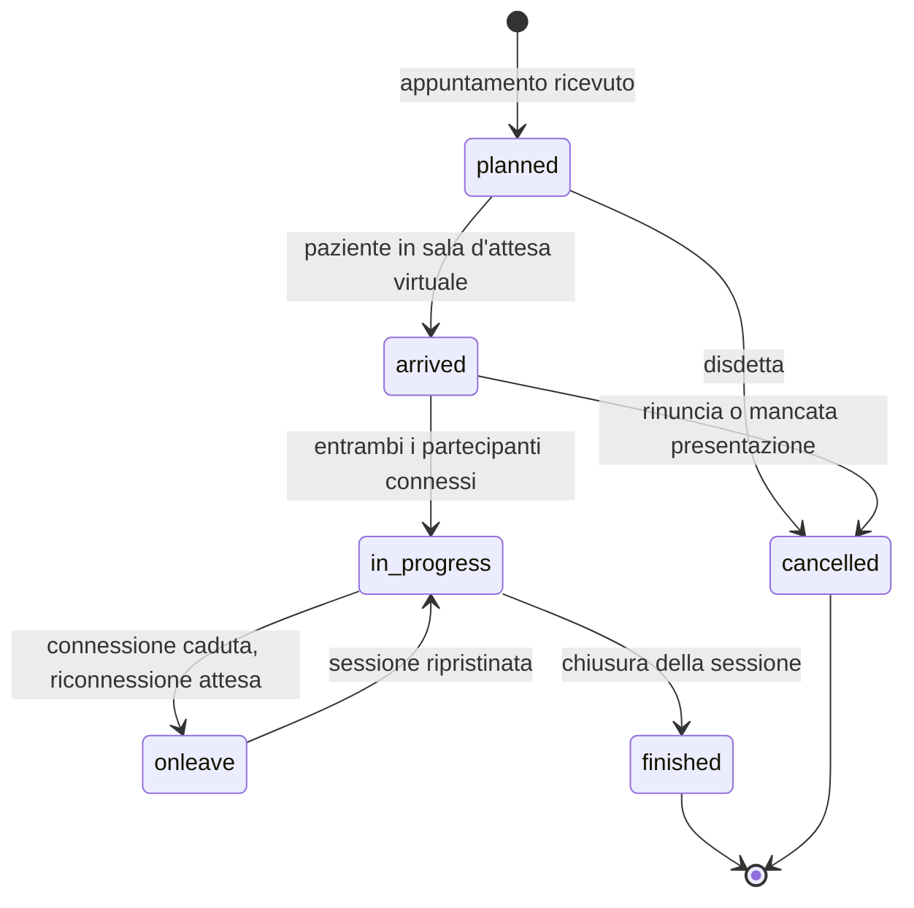

# FHIR da zero

Questo è il modulo tecnico centrale della guida. Presuppone che tu abbia letto
[il modulo sugli standard di interoperabilità](05-standard-di-interoperabilita.md) - in
particolare le sezioni sulla profilazione e sulle terminologie, perché qui vengono date per
acquisite.

Non presuppone nient'altro. Se non hai mai visto una risorsa FHIR, il §2 parte dal JSON e
lo smonta pezzo per pezzo. Se non hai mai scritto una chiamata REST, il §7 spiega anche
quella.

Tutti gli esempi contengono **esclusivamente dati sintetici**.

---

## 1. Che cos'è FHIR e perché è diverso da ciò che c'era prima

### 1.1 Il nome e l'idea

**FHIR** sta per *Fast Healthcare Interoperability Resources*. Si pronuncia come la parola
inglese *fire*. È lo standard di interoperabilità sanitaria di HL7 International sviluppato
a partire dagli anni Dieci, dopo due generazioni precedenti - HL7 versione 2, basato su
messaggi testuali con separatori, e HL7 versione 3, basato su un modello di riferimento
astratto di grande rigore formale e di notoria difficoltà di adozione.

L'idea che distingue FHIR dalle due generazioni precedenti si riassume in tre scelte.

**Prima scelta: l'unità di scambio è la *risorsa*, non il messaggio.** Una **risorsa** è un
oggetto di dominio autoconsistente, con un'identità propria, che rappresenta un concetto
clinico o amministrativo riconoscibile da un essere umano: un paziente, un appuntamento, un
contatto assistenziale, un'osservazione, un consenso, un documento. Ha un indirizzo proprio,
può essere letta, modificata e messa in relazione con altre risorse indipendentemente dal
contesto in cui è stata creata. In HL7 versione 2 il paziente esiste solo *dentro* un
messaggio ADT; in FHIR il paziente esiste, e i messaggi lo referenziano.

**Seconda scelta: il criterio dell'ottanta per cento.** Ogni risorsa contiene gli elementi
che servono nella grande maggioranza delle implementazioni reali, e non tutti gli elementi
che potrebbero servire a qualcuno. Tutto il resto si aggiunge con le **estensioni**, che
sono un meccanismo di primo livello previsto dalla specifica, non un'evasione dallo
standard. Il risultato è che una risorsa FHIR si legge in una pagina, e non in un
capitolo.

**Terza scelta: le tecnologie della rete, così come sono.** FHIR usa HTTP con la sua
semantica reale (verbi, codici di stato, header di caching e di concorrenza), JSON e XML
come formati, OAuth per l'autorizzazione. Non definisce un proprio protocollo di trasporto,
non definisce un proprio meccanismo di sessione, non definisce un proprio formato binario.
Chi sa costruire un'API REST sa già metà di FHIR.

A queste si aggiunge una quarta caratteristica, meno pubblicizzata e decisiva: **FHIR è
autodescrittivo**. La struttura delle risorse, i profili, gli insiemi di valori, i parametri
di ricerca e persino le capacità di un server sono a loro volta espressi come risorse FHIR.
Un client può interrogare un server e scoprire, in modo programmatico, che cosa quel server
sa fare.

### 1.2 Le versioni, e perché il progetto usa la 4.0.1

FHIR ha una storia di versioni che è essenziale conoscere, perché non sono compatibili fra
loro.

| Release | Versione | Data | Nota |
|---|---|---|---|
| R4 | 4.0.0 | 27 dicembre 2018 | Prima release con contenuto normativo **[V]** |
| **R4 correzione tecnica** | **4.0.1** | **30 ottobre 2019** | Correzioni agli invarianti e alle risorse di conformità generate **[V]** |
| R4B | 4.3.0 | 28 maggio 2022 | Evoluzione limitata di R4 **[V]** |
| R5 | 5.0.0 | - | Release corrente della specifica principale **[V]** |

La pagina di ogni risorsa R4 riporta in intestazione la dicitura `v4.0.1: R4 - Mixed
Normative and STU` **[V]**: significa che alcune parti della specifica sono normative
(stabili, con garanzia di retro-compatibilità) e altre sono ancora in uso sperimentale.

> **Regola del progetto:** quando Telemedic dichiara «FHIR R4» deve dichiarare **4.0.1**,
> non «R4» generico. Le versioni 4.0.0 e 4.0.1 differiscono negli invarianti, e i validatori
> si comportano diversamente sulle due.

**Perché R4 e non R5 o versioni successive.** La ragione non è tecnica ed è decisiva: **le
guide di implementazione su cui il progetto si basa poggiano su R4 4.0.1**.

- Le guide italiane di telemedicina - `Televisita`, `Teleconsulto`, `Teleassistenza`,
  `Telemonitoraggio` - e la guida `IT-Core` sono tutte su **FHIR 4.0.1** **[V]**.
- I profili IHE che il progetto implementa sono su **R4 (4.0.1)**: quello per l'accesso
  mobile ai documenti **[V]**, quello per la correlazione degli identificativi **[V]**,
  quello per l'interrogazione demografica **[V]**, la guida sugli schemi di tracciamento
  **[V]**.
- La specifica di autorizzazione per il lancio di applicazioni cliniche, nella versione
  attiva dal 1° marzo 2023, è basata su **R4** **[V]**.

Adottare R5 significherebbe non poter dichiarare conformità a nessuna di queste. Sarebbe la
scelta tecnicamente più moderna e praticamente inutilizzabile: **si sceglie la versione
dell'ecosistema in cui si deve operare, non l'ultima pubblicata.**

### 1.3 Che cosa si perde dichiarando R4, e come si compensa

Onestà intellettuale: R4 ha lacune reali per un progetto di telemedicina.

**Prima lacuna: R4 non ha un modo nativo di descrivere una sessione virtuale.** L'unico
elemento semantico disponibile è il codice che qualifica la modalità del contatto
assistenziale come «virtuale» **[V]**. Non esiste in R4 un elemento per l'indirizzo della
sessione, per il tipo di canale, per la chiave di accesso. R5 ha colmato la lacuna
introducendo un tipo di dato dedicato ai dettagli del servizio virtuale **[V]**.

La compensazione esiste ed è ufficiale: HL7 pubblica un pacchetto di **estensioni
cross-version** che espone elementi di R5 come estensioni utilizzabili in R4. Dati
verificati **[V]**:

| Dato | Valore |
|---|---|
| Pacchetto | `hl7.fhir.uv.xver-r5.r4` |
| Versione | **0.1.0**, stato STU, **livello di maturità 0** |
| URL canonico dell'estensione per il contatto assistenziale | `http://hl7.org/fhir/5.0/StructureDefinition/extension-Encounter.virtualService` |
| URL canonico dell'estensione per l'appuntamento | `http://hl7.org/fhir/5.0/StructureDefinition/extension-Appointment.virtualService` |

Attenzione a due dettagli che si sbagliano quasi sempre. Primo: l'estensione richiede una
sotto-estensione **obbligatoria** `_datatype` con valore fisso `VirtualServiceDetail`
**[V]**; senza quella l'istanza non valida. Secondo: la sotto-estensione `address` è
un'estensione **complessa**, non un valore semplice **[V]** - la sua forma esatta
nelle istanze rimane da accertare da parte dell'area `TECH` `[NV]` e va verificata risolvendo il pacchetto alla versione
fissata prima di scrivere codice.

Il livello di maturità 0 significa che l'estensione **può cambiare**. Va fissata la versione
del pacchetto e va documentato il rischio.

Struttura reale del tipo di dato in R5, verificata **[V]**:

| Elemento | Card. | Tipo |
|---|---|---|
| `channelType` | 0..1 | `Coding` |
| `address[x]` | 0..1 | `url` \| `string` \| `ContactPoint` \| `ExtendedContactDetail` |
| `additionalInfo` | 0..* | `url` |
| `maxParticipants` | 0..1 | `positiveInt` |
| `sessionKey` | 0..1 | `string` |

Il vocabolario associato a `channelType` contiene **tre soli codici, tutti riferiti a
piattaforme commerciali di videoconferenza di terze parti**, è marcato sperimentale e in
bozza, con l'avvertenza che non è pronto per l'uso in produzione, e contiene un evidente
errore redazionale nella definizione di uno dei tre codici **[V]**. La buona notizia,
verificata: **il binding è di forza `example`, non `required`** **[V]**. Una piattaforma
sovrana può quindi usare un proprio sistema di codifica senza alcun processo di
approvazione.

Nota di sicurezza da tenere presente fin da subito: `sessionKey` e l'indirizzo di una
sessione virtuale sono **credenziali di accesso a una sessione clinica**. Persisterli in
chiaro in una risorsa interrogabile è un rischio concreto. Vanno trattati come segreti a
scadenza breve.

**Seconda lacuna: il modello di sottoscrizione agli eventi di R4 è primitivo.** Se ne parla
al §6.21.

**Terza lacuna: alcune risorse cambiano fra R4 e R5.** La più insidiosa: la risorsa che in
R4 rappresenta contenuti audio, video e immagini **è stata rimossa in R5** **[V]**, e i
riferimenti ad essa sono stati sostituiti con riferimenti a `DocumentReference`. Da qui una
regola architetturale del progetto: **la registrazione video di una sessione si modella su
`DocumentReference`, mai sulla risorsa rimossa.** È l'unica scelta R4 che diventerebbe un
debito irrecuperabile alla migrazione.

**La strategia di coesistenza.** Il modello di dominio interno di Telemedic è **indipendente
dalla versione di FHIR**, e il mapping verso FHIR è uno strato di adattamento. Il documento
di capacità del server dichiara `4.0.1`; una futura esposizione R5 diventa un adattatore
aggiuntivo, non un rifacimento. La specifica prevede anche la negoziazione della versione
tramite il tipo di contenuto: `Accept: application/fhir+json; fhirVersion=4.0` **[V]**.

---

## 2. Anatomia di una risorsa

### 2.1 Il minimo indispensabile, commentato

Ecco una risorsa `Patient`. È il punto di partenza: leggila riga per riga, poi le
spiegazioni sotto.

```json
{
  "resourceType": "Patient",
  "id": "pat-0001",
  "meta": {
    "versionId": "3",
    "lastUpdated": "2026-09-14T09:12:44.118+02:00",
    "profile": [
      "http://hl7.it/fhir/televisita/StructureDefinition/PatientTelevisita"
    ]
  },
  "identifier": [
    {
      "system": "http://hl7.it/sid/codiceFiscale",
      "value": "RSSMRA80A01H501Z"
    }
  ],
  "active": true,
  "name": [
    {
      "use": "official",
      "family": "Rossi",
      "given": ["Mario"]
    }
  ],
  "telecom": [
    {
      "system": "phone",
      "value": "+390655512340",
      "use": "mobile"
    }
  ],
  "gender": "male",
  "birthDate": "1980-01-01",
  "address": [
    {
      "use": "home",
      "line": ["Via Roma 1"],
      "city": "Roma",
      "postalCode": "00100",
      "country": "IT"
    }
  ]
}
```

**`resourceType`** è obbligatorio in JSON ed è la prima cosa che un parser legge: dice di
che risorsa si tratta. Senza di esso il documento non è FHIR.

**`id`** è l'**identificatore logico** della risorsa **su quel server**. È la parte finale
dell'URL con cui la risorsa si raggiunge: `https://server.example/fhir/Patient/pat-0001`. Non
ha significato clinico, non è portabile fra server, non va mai mostrato all'utente come se
fosse un numero di cartella. Cambia se la risorsa viene copiata altrove.

**`meta`** raccoglie i metadati tecnici:

- `versionId` - il numero di versione della risorsa su quel server. Ogni modifica lo
  incrementa. È l'elemento su cui poggia il controllo di concorrenza (§7.7).
- `lastUpdated` - l'istante dell'ultima modifica.
- `profile` - l'elenco dei profili a cui la risorsa **dichiara** di conformarsi. È una
  dichiarazione, non una garanzia: solo la validazione la verifica.
- `security` e `tag` - etichette; la prima ha significato di controllo degli accessi.

**`identifier`** è l'**identificatore di business**: il numero che ha significato nel mondo
reale ed è riconoscibile fuori da quel server. È un array perché la stessa persona ha
tipicamente più identificativi. Ogni identificatore è composto almeno da un `system` - che
dichiara **in quale spazio dei nomi** il valore è univoco - e da un `value`.

> **La distinzione fra `id` e `identifier` è la prima cosa da interiorizzare.** `id` è
> «dove sta questa risorsa su questo server»; `identifier` è «chi è questa persona nel
> mondo». Confonderli produce sistemi che non riescono a riconciliare i dati fra
> installazioni diverse.

Gli altri elementi sono contenuto: nome, recapiti, genere amministrativo, data di nascita,
indirizzo. Da notare che `name` è un array (una persona può avere un nome ufficiale e uno
d'uso), che `given` è a sua volta un array (più nomi propri), e che `birthDate` è una data
senza orario, con un tipo dedicato.

### 2.2 Cardinalità e obbligatorietà

Ogni elemento di una risorsa ha una **cardinalità** nella forma `min..max`:

| Notazione | Significato |
|---|---|
| `0..1` | Facoltativo, al massimo uno. In JSON: oggetto singolo o assente. |
| `1..1` | **Obbligatorio**, esattamente uno. |
| `0..*` | Facoltativo, ripetibile. In JSON: **sempre un array**, anche con un solo elemento. |
| `1..*` | Obbligatorio, almeno uno, ripetibile. |
| `0..0` | **Vietato**. Compare solo nei profili, per proibire un elemento. |

Regola pratica di serializzazione: se la cardinalità massima è `*`, in JSON è un array; se è
`1`, è un valore singolo. Scrivere un array dove è atteso un oggetto singolo è un errore che
i validatori rilevano subito.

### 2.3 I tipi di dato che incontrerai ogni giorno

FHIR distingue **tipi primitivi** (stringhe, numeri, date, booleani, con vincoli di formato
propri) e **tipi complessi** (strutture con più elementi). Questi sono i complessi che
userai continuamente.

#### `Identifier` - un identificativo con il suo spazio dei nomi

```json
{
  "use": "official",
  "type": {
    "coding": [
      {
        "system": "http://terminology.hl7.org/CodeSystem/v2-0203",
        "code": "NNITA"
      }
    ]
  },
  "system": "http://hl7.it/sid/codiceFiscale",
  "value": "RSSMRA80A01H501Z",
  "period": { "start": "1998-03-01" },
  "assigner": { "display": "Ministero dell'economia e delle finanze" }
}
```

`system` è la parte critica: **un valore senza `system` non è un identificatore, è una
stringa**. `NNITA` come tipo merita la nota già vista nel modulo precedente: la tabella HL7
degli identifier type non contiene un codice `NN`, contiene un concetto il cui codice è
letteralmente `NNxxx` con `xxx` da sostituire con il codice del paese a tre lettere
**[V]**. `NNITA` è quindi un valore generato dalla regola, non un concetto enumerato, e
**nessun profilo italiano pubblicato fissa quale codice usare per il codice fiscale**
**[V]**: la scelta va concordata con l'integratore.

#### `HumanName` - un nome

```json
{
  "use": "official",
  "text": "Mario Rossi",
  "family": "Rossi",
  "given": ["Mario", "Giuseppe"],
  "prefix": ["Dott."]
}
```

`text` è la forma già composta per la visualizzazione; le altre parti sono la scomposizione.
Quando entrambe sono presenti, `text` prevale ai fini della presentazione. Il valore di
`use` distingue nome ufficiale, d'uso, da nubile, temporaneo, anonimo.

#### `Address` - un indirizzo

```json
{
  "use": "home",
  "type": "physical",
  "line": ["Via Giuseppe Garibaldi 12", "Scala B, interno 7"],
  "city": "Bari",
  "district": "BA",
  "postalCode": "70121",
  "country": "IT"
}
```

`line` è un array perché un indirizzo può avere più righe. `country` usa il codice del
paese.

#### `ContactPoint` - un recapito

```json
{ "system": "email", "value": "m.rossi@esempio.invalid", "use": "home", "rank": 1 }
```

`system` distingue telefono, fax, email, indirizzo web, cercapersone, altro. `rank` esprime
la preferenza: `1` è il più preferito.

#### `Period` - un intervallo temporale

```json
{ "start": "2026-09-14T10:01:03+02:00", "end": "2026-09-14T10:34:57+02:00" }
```

Entrambi gli estremi sono facoltativi: un periodo con solo `start` è un intervallo ancora
aperto. **Scrivi sempre il fuso orario.** Un istante senza fuso è ambiguo, e in un registro
di tracciamento un'ambiguità di due ore è la differenza fra un dato opponibile e uno inutile.

#### `Quantity` - una misura

```json
{
  "value": 128,
  "unit": "mmHg",
  "system": "http://unitsofmeasure.org",
  "code": "mm[Hg]"
}
```

Distinzione fondamentale: `unit` è la stringa **per l'essere umano**; `code` è l'unità
**per la macchina**, presa dal sistema di codifica dichiarato in `system`. Solo `code`
consente conversioni e confronti automatici. Scrivere `unit` senza `code` produce un dato
non elaborabile.

#### `Reference` - un puntatore a un'altra risorsa

```json
{ "reference": "Patient/pat-0001", "display": "Mario Rossi" }
```

Se ne parla diffusamente al §4. `display` è un aiuto per la lettura umana e **non è
autoritativo**: un client non deve mai fidarsene per la logica applicativa.

#### `Attachment` - un contenuto binario o un suo riferimento

```json
{
  "contentType": "application/pdf",
  "url": "https://server.example/fhir/Binary/bin-0042",
  "size": 184320,
  "hash": "3q2+7wAAAAAAAAAAAAAAAAAAAAA=",
  "title": "Referto di televisita del 14 settembre 2026",
  "creation": "2026-09-14T10:41:00+02:00"
}
```

In alternativa a `url` può contenere `data`, con il contenuto codificato in base64. Per
contenuti di dimensioni non banali, `url` è la scelta corretta: incorporare un video in una
risorsa JSON rende la risorsa inutilizzabile.

#### Elementi a scelta di tipo

Alcuni elementi ammettono più tipi alternativi. Nella documentazione si scrivono con `[x]`
finale: `value[x]`, `effective[x]`, `deceased[x]`. Nelle istanze il nome si compone
concatenando il tipo con l'iniziale maiuscola:

```json
{ "effectiveDateTime": "2026-09-14T10:20:00+02:00" }
```

oppure

```json
{ "effectivePeriod": { "start": "2026-09-14T10:00:00+02:00" } }
```

**Solo uno dei due può essere presente.** Averne due è un errore di conformità.

### 2.4 Le estensioni

Quando serve rappresentare informazione che la risorsa non prevede, si usa un'**estensione**.
Non è una violazione dello standard: è il meccanismo che lo standard prevede.

```json
{
  "resourceType": "Patient",
  "id": "pat-0002",
  "extension": [
    {
      "url": "http://hl7.it/fhir/StructureDefinition/luogoNascita",
      "valueAddress": {
        "city": "Firenze",
        "district": "FI",
        "country": "IT"
      }
    }
  ],
  "identifier": [
    { "system": "http://hl7.it/sid/codiceFiscale", "value": "VRDLGU75E41D612B" }
  ],
  "name": [{ "family": "Verdi", "given": ["Luigia"] }],
  "birthDate": "1975-05-01"
}
```

Le regole di un'estensione:

1. **`url` è obbligatorio** ed è l'URL canonico della definizione. Non è un indirizzo da
   visitare: identifica l'estensione. Un'estensione senza URL definito da qualche parte è
   inutilizzabile da chi la riceve.
2. Un'estensione ha **o** un valore (`value[x]`) **o** sotto-estensioni annidate, mai
   entrambi.
3. Le estensioni si possono applicare a qualunque elemento, non solo alla radice della
   risorsa. Sui tipi primitivi si usa la forma con l'underscore: `_birthDate`.

Esiste una variante speciale, `modifierExtension`, per il caso in cui l'informazione
aggiunta **cambia il significato** del resto della risorsa - per esempio la nega. La regola
è severa: **un sistema che non riconosce una `modifierExtension` non può processare la
risorsa**, deve rifiutarla. È un meccanismo di sicurezza: impedisce che un ricevente ignori
un'informazione che ribalta il senso del dato.

---

## 3. `CodeableConcept` e `Coding`, spiegati bene

Questa è la sezione da cui dipende la correttezza semantica di tutto il sistema.

### 3.1 La struttura

```json
{
  "coding": [
    {
      "system": "http://loinc.org",
      "version": "2.81",
      "code": "75496-0",
      "display": "Telehealth Note",
      "userSelected": true
    }
  ],
  "text": "Referto di televisita"
}
```

Un **`CodeableConcept`** rappresenta *un concetto*. Contiene:

- **`coding`** - zero o più codifiche **dello stesso concetto** in sistemi di codifica
  diversi;
- **`text`** - la rappresentazione testuale del concetto, destinata all'essere umano.

Un **`Coding`** è una singola codifica. Contiene:

- **`system`** - l'URI canonico del sistema di codifica. **È l'elemento che dà significato al
  codice.**
- **`version`** - la versione del sistema di codifica, quando il codice o la sua descrizione
  possono variare fra versioni.
- **`code`** - il simbolo, esattamente come definito nel sistema. È sensibile alle maiuscole.
- **`display`** - la descrizione ufficiale del codice **secondo quel sistema**. Non è un
  campo libero.
- **`userSelected`** - vero se è questa la codifica che l'utente ha effettivamente scelto,
  mentre le altre sono traduzioni derivate.

### 3.2 Le tre regole che si violano più spesso

**Regola 1 - `system` non è facoltativo, mai.**

```json
// SBAGLIATO
{ "coding": [{ "code": "75496-0", "display": "Telehealth Note" }] }

// CORRETTO
{ "coding": [{ "system": "http://loinc.org", "code": "75496-0", "display": "Telehealth Note" }] }
```

Nel primo caso hai scritto la stringa `75496-0`. Nel secondo hai scritto un fatto. Un
ricevente che ha un proprio elenco interno può interpretare il primo come qualunque cosa,
e lo farà.

Per alcune terminologie l'omissione del `system` non è solo un errore tecnico. La licenza
della classificazione internazionale delle malattie dell'Organizzazione mondiale della
sanità impone verbatim che l'incorporazione in un software, **nella trasmissione e nella
memorizzazione, includa codice, titolo e URI** **[V]**. Scrivere un codice senza il suo URI
è una deviazione da una **condizione della licenza**, non una svista.

**Regola 2 - `display` è la descrizione ufficiale del codice, non un'etichetta libera.**

```json
// SBAGLIATO - display "italianizzato" a piacere
{ "system": "http://loinc.org", "code": "75496-0", "display": "Nota di telemedicina" }

// CORRETTO - display ufficiale, testo italiano in text
{
  "coding": [
    { "system": "http://loinc.org", "code": "75496-0", "display": "Telehealth Note" }
  ],
  "text": "Referto di televisita"
}
```

Non è pignoleria terminologica: come spiegato nel modulo precedente, **una traduzione dei
display LOINC è un'opera derivata i cui diritti sono assegnati al titolare** **[V-sec]**, e
il progetto non ne è titolare. L'etichetta italiana visibile all'utente è una stringa di
interfaccia, che vive nei file di internazionalizzazione; il testo clinico italiano va in
`text`. **[V]**

**Regola 3 - più `coding` significano lo stesso concetto in sistemi diversi, non concetti
diversi.**

```json
// SBAGLIATO - due concetti clinici distinti nello stesso CodeableConcept
{
  "coding": [
    { "system": "http://hl7.org/fhir/sid/icd-9-cm", "code": "427.31" },
    { "system": "http://hl7.org/fhir/sid/icd-9-cm", "code": "401.9" }
  ]
}
```

Nel modello di FHIR quelle due codifiche affermano di descrivere **la stessa cosa**. Un
ricevente che ne conosce solo una la userà. Due condizioni cliniche distinte sono due
elementi separati, non due `coding` dello stesso elemento.

### 3.3 `Coding` o `CodeableConcept`?

La specifica usa `Coding` - senza involucro - dove il valore è per sua natura un singolo
codice di un singolo sistema, e non ha senso rappresentarlo in più codifiche. Esempio
verificato: l'elemento che qualifica la classe del contatto assistenziale è di tipo
`Coding`, cardinalità `1..1`, con binding *extensible* **[V]**. Non ci si mette un
`CodeableConcept`.

Al contrario, elementi come i motivi, le diagnosi, i tipi di prestazione sono
`CodeableConcept`, perché lo stesso concetto va spesso espresso in più sistemi
contemporaneamente per soddisfare riceventi diversi.

---

## 4. I riferimenti fra risorse

Una risorsa punta a un'altra tramite un elemento di tipo `Reference`. Esistono quattro modi
di farlo, e sceglierne uno sbagliato produce sistemi che funzionano in laboratorio e si
rompono in integrazione.

### 4.1 Riferimento relativo

```json
{ "subject": { "reference": "Patient/pat-0001" } }
```

Si risolve rispetto all'URL base del server che espone la risorsa. È **la forma
predefinita** e va usata per tutti i riferimenti interni allo stesso server. È anche
l'unica forma che sopravvive alla copia di un intero insieme di risorse su un altro server,
purché si copino insieme.

### 4.2 Riferimento assoluto

```json
{ "subject": { "reference": "https://anagrafe.example/fhir/Patient/98721" } }
```

Punta a una risorsa su **un altro server**. È corretto quando la risorsa sta davvero
altrove, ed è pericoloso per due ragioni: crea una dipendenza di rete a tempo di lettura, e
in un contesto multi-tenant può diventare un vettore di fuga di informazioni se il client
segue ciecamente il collegamento. Se lo usi, l'insieme dei server raggiungibili va limitato
a un elenco esplicito.

### 4.3 Riferimento logico

```json
{
  "subject": {
    "identifier": {
      "system": "http://hl7.it/sid/codiceFiscale",
      "value": "RSSMRA80A01H501Z"
    },
    "display": "Mario Rossi"
  }
}
```

Non punta a un indirizzo: punta a **un'identità nel mondo**. È la forma corretta quando il
ricevente conosce la persona ma non conosce - o non deve conoscere - l'indirizzo tecnico
della risorsa sul server di origine.

**È la forma che il progetto usa nel dialogo con gli integratori**, perché soddisfa
direttamente il vincolo di non duplicare le anagrafiche: Telemedic lavora per riferimento
sull'identificativo dell'integratore, senza diventare il registro di riferimento dei dati
anagrafici.

### 4.4 Risorsa contenuta

```json
{
  "resourceType": "Observation",
  "id": "obs-0001",
  "contained": [
    {
      "resourceType": "Device",
      "id": "dev-inline",
      "deviceName": [{ "name": "Sfigmomanometro domiciliare", "type": "user-friendly-name" }]
    }
  ],
  "status": "final",
  "code": {
    "coding": [{ "system": "http://loinc.org", "code": "8480-6", "display": "Systolic blood pressure" }]
  },
  "subject": { "reference": "Patient/pat-0001" },
  "device": { "reference": "#dev-inline" }
}
```

Una risorsa **contenuta** vive dentro un'altra e non ha esistenza autonoma: non ha un
proprio URL, non è interrogabile, non è aggiornabile separatamente. Si referenzia con `#`
seguito dall'`id` locale.

**Quando usarla:** solo quando la risorsa contenuta non ha senso fuori dal suo contenitore
e non sarà mai referenziata da altro. **Quando non usarla:** per pazienti, professionisti,
organizzazioni, dispositivi censiti. Contenere un `Patient` significa creare una copia della
persona che nessuno potrà correlare con nient'altro - l'esatto opposto dello scopo di FHIR.

**[V]** Il codice LOINC `8480-6` usato nell'esempio non è stato verificato nella fase di
ricerca del progetto, rimane da accertare da parte dell'area `TECH` `[NV]`, va confermato prima dell'uso reale.

### 4.5 Riferimenti dentro un `Bundle`

Quando più risorse viaggiano insieme in un `Bundle` e nessuna di esse è ancora stata
creata sul server - e quindi nessuna ha ancora un `id` - si usano identificatori temporanei
nella forma `urn:uuid:`:

```json
{
  "resourceType": "Bundle",
  "type": "transaction",
  "entry": [
    {
      "fullUrl": "urn:uuid:8f14e45f-ceea-467a-9f0a-5f0f6bde1c21",
      "resource": { "resourceType": "Patient", "name": [{ "family": "Rossi", "given": ["Mario"] }] },
      "request": { "method": "POST", "url": "Patient" }
    },
    {
      "fullUrl": "urn:uuid:2c1743a3-91b8-4a3c-90ee-1f4a8e1c9f77",
      "resource": {
        "resourceType": "Encounter",
        "status": "planned",
        "class": {
          "system": "http://terminology.hl7.org/CodeSystem/v3-ActCode",
          "code": "VR",
          "display": "virtual"
        },
        "subject": { "reference": "urn:uuid:8f14e45f-ceea-467a-9f0a-5f0f6bde1c21" }
      },
      "request": { "method": "POST", "url": "Encounter" }
    }
  ]
}
```

Il server, elaborando la transazione, assegna gli identificativi reali e **riscrive i
riferimenti** di conseguenza. È il meccanismo con cui si creano atomicamente insiemi di
risorse collegate.

### 4.6 Riepilogo decisionale

| Situazione | Forma da usare |
|---|---|
| Risorsa sullo stesso server | Riferimento relativo |
| Risorsa su un altro server, indirizzo noto e affidabile | Riferimento assoluto, con elenco di server ammessi |
| Il ricevente conosce l'identità ma non l'indirizzo tecnico | Riferimento logico (per `identifier`) |
| Frammento privo di esistenza autonoma | Risorsa contenuta con `#` |
| Risorse create insieme in una transazione | `urn:uuid:` più `fullUrl` |

---

## 5. Profili, estensioni, value set, code system, binding

### 5.1 `StructureDefinition`: la risorsa che definisce le risorse

Un profilo è a sua volta una risorsa FHIR, di tipo `StructureDefinition`. Ecco come si legge
il suo scheletro:

```json
{
  "resourceType": "StructureDefinition",
  "id": "EncounterTelemedic",
  "url": "https://telemedic.example/fhir/StructureDefinition/EncounterTelemedic",
  "version": "1.0.0",
  "name": "EncounterTelemedic",
  "status": "draft",
  "fhirVersion": "4.0.1",
  "kind": "resource",
  "abstract": false,
  "type": "Encounter",
  "baseDefinition": "http://hl7.it/fhir/televisita/StructureDefinition/EncounterTelevisita",
  "derivation": "constraint",
  "differential": {
    "element": [
      {
        "id": "Encounter.class",
        "path": "Encounter.class",
        "patternCoding": {
          "system": "http://terminology.hl7.org/CodeSystem/v3-ActCode",
          "code": "VR"
        }
      },
      {
        "id": "Encounter.serviceProvider",
        "path": "Encounter.serviceProvider",
        "min": 1,
        "mustSupport": true
      }
    ]
  }
}
```

Gli elementi che contano:

- **`url`** - l'URL canonico del profilo. È l'identificatore globale, quello che le istanze
  scrivono in `meta.profile`.
- **`type`** - il tipo di risorsa profilato.
- **`baseDefinition`** - il profilo o la risorsa da cui si deriva. Qui si vede la catena:
  questo profilo deriva dal profilo italiano, che deriva dalla risorsa di base.
- **`derivation`** - `constraint` se restringe, `specialization` se definisce un nuovo tipo.
- **`differential`** - **solo le differenze** rispetto alla base.
- **`snapshot`** - la struttura completa risultante, con tutti gli elementi. La specifica
  raccomanda che i profili usati nei sistemi in esercizio abbiano lo snapshot popolato
  **[V]**: senza, un validatore deve ricostruirlo risalendo la catena.

Nell'esempio, il profilo di progetto fa due cose che il profilo italiano non fa: fissa la
classe del contatto assistenziale al codice della modalità virtuale, e rende obbligatoria
l'indicazione dell'organizzazione erogante. Entrambe sono restrizioni, quindi legittime.

### 5.2 Come si legge la pagina di un profilo

La pagina generata di un profilo mostra una tabella con queste colonne, che vanno lette in
quest'ordine:

1. **Nome dell'elemento**, con l'indentazione a indicare l'annidamento.
2. **Cardinalità** - sempre per prima, dopo il nome. Metà delle validazioni fallite dipende
   da un elemento obbligatorio non valorizzato.
3. **Tipo**, e per i riferimenti l'elenco dei tipi ammessi. **È vincolante.** Esempio
   verificato che vale la pena memorizzare: in R4 l'elemento che elenca i partecipanti a un
   contatto assistenziale ammette riferimenti a professionista, ruolo del professionista e
   persona correlata, **ma non al paziente** **[V]**. Il paziente si esprime con l'elemento
   dedicato al soggetto. Modellarlo come partecipante è un errore di conformità che i
   validatori segnalano.
4. **Flag** - *summary*, *modifier*, *must support*.
5. **Binding** e sua forza.
6. **Descrizione e vincoli**, inclusi gli invarianti.

### 5.3 Lo slicing

Un elemento ripetuto può essere partizionato in **slice**: sottoinsiemi con vincoli propri.
È il meccanismo con cui un profilo dice «fra i tuoi identificatori, quello con questo
`system` è il codice fiscale, deve esserci ed è unico».

La partizione richiede un **discriminatore**: la regola con cui si stabilisce a quale slice
appartiene un'occorrenza. I tipi ammessi sono cinque **[V]**: per valore, per esistenza, per
schema, per tipo, per profilo. Il caso tipico degli identificativi italiani usa il
discriminatore per valore su `system` **[V]**.

Ogni slice deve poi vincolare l'elemento discriminante con un valore fisso, uno schema o un
binding obbligatorio **[V]**: senza, il validatore non può assegnare le occorrenze.

Esempio di differenziale che definisce due slice di identificatori:

```json
{
  "differential": {
    "element": [
      {
        "id": "Patient.identifier",
        "path": "Patient.identifier",
        "slicing": {
          "discriminator": [{ "type": "value", "path": "system" }],
          "rules": "open"
        },
        "min": 1
      },
      {
        "id": "Patient.identifier:codiceFiscale",
        "path": "Patient.identifier",
        "sliceName": "codiceFiscale",
        "min": 0,
        "max": "1",
        "patternIdentifier": { "system": "http://hl7.it/sid/codiceFiscale" }
      },
      {
        "id": "Patient.identifier:idIntegratore",
        "path": "Patient.identifier",
        "sliceName": "idIntegratore",
        "min": 0,
        "max": "*"
      }
    ]
  }
}
```

`rules: "open"` significa che sono ammesse occorrenze che non ricadono in nessuno slice -
ed è la scelta corretta qui, perché l'integratore può portare i propri identificativi.

### 5.4 Must support: il vincolo che deve essere definito

La specifica è esplicita **[V]**:

> *"The meaning of 'support' is not defined by the base FHIR specification."*

Il significato lo deve stabilire il profilo. **Un Implementation Guide che marca elementi
come «must support» senza dire cosa significhi è tecnicamente inutile.** Telemedic deve
dichiarare la propria definizione, che tipicamente è: il sistema deve saper popolare
l'elemento quando il dato esiste, e deve saperlo elaborare quando lo riceve, senza
scartarlo.

### 5.5 Value set, code system, binding

Il `CodeSystem` definisce i codici; il `ValueSet` ne seleziona un sottoinsieme; il binding
lega un elemento a un value set con una forza.

Un `ValueSet` seleziona in due modi. Per enumerazione:

```json
{
  "resourceType": "ValueSet",
  "url": "https://telemedic.example/fhir/ValueSet/sezioni-referto",
  "version": "1.0.0",
  "status": "draft",
  "copyright": "This material contains content from LOINC (http://loinc.org). LOINC is Copyright © Regenstrief Institute, Inc. and the Logical Observation Identifiers Names and Codes (LOINC) Committee and is available at no cost under the license at http://loinc.org/license. LOINC® is a registered United States trademark of Regenstrief Institute, Inc.",
  "compose": {
    "include": [
      {
        "system": "http://loinc.org",
        "version": "2.81",
        "concept": [
          { "code": "47045-0", "display": "Study report" },
          { "code": "29545-1", "display": "Physical findings" }
        ]
      }
    ]
  }
}
```

Nota l'elemento `copyright`: per un value set che include codici LOINC **l'attribuzione è
obbligatoria** **[V]**, e va scritta lì, non solo nel file di note del progetto.

Oppure per filtro, che è la forma da usare con le terminologie il cui contenuto non può
stare nel repository:

```json
{
  "compose": {
    "include": [
      {
        "system": "http://snomed.info/sct",
        "filter": [{ "property": "concept", "op": "is-a", "value": "404684003" }]
      }
    ]
  }
}
```

Questa forma **non enumera nulla**: dichiara una regola di selezione. È ammessa nel
repository perché non ridistribuisce contenuto; l'espansione effettiva la produce a runtime
un servizio terminologico configurato da chi installa. **Un value set con `expansion`
popolata da codici SNOMED non è ammesso nel repository, in nessun caso.** **[V]**

Le quattro forze di binding, in ordine di severità **[V]**: `example` < `preferred` <
`extensible` < `required`. Un profilo può irrigidire, **non può rilassare un binding già
`required`** **[V]**.

---

## 6. Le risorse che contano per Telemedic

Per ciascuna: a cosa serve, gli elementi che contano, come la usa il progetto, e le
trappole.

### 6.1 `Patient`

**A cosa serve.** Rappresenta la persona assistita.

**Elementi che contano** **[V]**: `identifier` (`0..*`), `active`, `name` (`0..*`,
`HumanName`), `telecom`, `gender` (binding *required*), `birthDate`, `address`,
`communication.language` (binding *preferred*), `generalPractitioner`,
`managingOrganization`, `link` (per collegare risorse che rappresentano la stessa persona).

**Come la usa Telemedic.** Il progetto **non è il registro di riferimento delle
anagrafiche**: lavora per riferimento sull'identificativo dell'integratore, aggiungendo gli
slice degli identificativi nazionali quando disponibili. Il profilo italiano `PatientItCore`
porta `identifier` a `1..*`, `name` a `1..*` e `birthDate` a `1..1` **[V]**: in Italia un
paziente senza almeno un identificativo, un nome e una data di nascita non è conforme.

**Trappola.** Vedi §8.4: le guide italiane divergono sull'URI del sistema di codifica del
codice fiscale.

### 6.2 `Practitioner`

**A cosa serve.** La persona fisica del professionista sanitario, con le sue qualifiche.

**Distinzione critica** **[V]**: `Practitioner` contiene i dati della persona e le sue
credenziali; **non** contiene il contesto organizzativo in cui opera.

### 6.3 `PractitionerRole`

**A cosa serve.** Il **ruolo** di un professionista presso un'organizzazione: dove opera,
quali servizi eroga, con quale specialità, in quale periodo. La specifica lo descrive come
ciò che documenta *"location and types of services that Practitioners are able to provide
for an organization"* **[V]**.

**Elementi che contano** **[V]**: `practitioner`, `organization`, `code` (il ruolo),
`specialty` (binding *preferred*), `location`, `healthcareService`, `telecom`,
`availableTime`, `period`, `endpoint`.

**Come la usa Telemedic - regola vincolante.** In un sistema multi-tenant, **il
professionista che eroga una prestazione va referenziato tramite `PractitionerRole`, non
tramite `Practitioner`**. È il ruolo - professionista X, presso organizzazione Y, con
specialità Z - a essere pertinente al tenant, non le credenziali personali. Questa scelta
discende direttamente dal vincolo di consapevolezza del tenant su ogni entità.

### 6.4 `Organization`

**A cosa serve.** L'ente: azienda sanitaria, poliambulatorio, studio associato, reparto.
Ha una gerarchia (`partOf`) che permette di rappresentare le articolazioni interne.

**Come la usa Telemedic.** È il perno del modello di tenant: l'organizzazione erogante è
l'elemento che lega il contatto assistenziale al tenant.

L'elenco puntuale degli elementi di `Organization` in R4 rimane da accertare da parte dell'area `TECH` `[NV]`
nella fase di ricerca del progetto; va letto sulla specifica prima di scrivere il profilo.

### 6.5 `Location`

**A cosa serve.** Un luogo fisico o virtuale in cui si eroga assistenza.

**Come la usa Telemedic.** Il caso interessante è la **stanza virtuale**: una `Location` può
rappresentarla, ed è il modo naturale di dare un'identità stabile a uno spazio di sessione
che non ha coordinate geografiche.

Gli elementi puntuali di `Location` in R4 e il vocabolario dei tipi di luogo rimangono da accertare da parte dell'area `TECH` `[NV]`; vanno letti sulla specifica.

### 6.6 `Appointment`

**A cosa serve.** L'appuntamento: chi, quando, per cosa, con quale stato di conferma.

**Elementi che contano** **[V]**: `identifier`, `status` (`1..1`, *required*),
`cancelationReason`, `serviceCategory`, `serviceType`, `specialty`, `appointmentType`,
`reasonCode`, `start` / `end` (`instant`), `minutesDuration`, `slot`, `comment`,
`patientInstruction`, `basedOn`, e soprattutto **`participant` (`1..*`)** con
`participant.actor`, `participant.required` e **`participant.status` (`1..1`)**.

Gli stati ammessi **[V]**: `proposed`, `pending`, `booked`, `arrived`, `fulfilled`,
`cancelled`, `noshow`, `entered-in-error`, `checked-in`, `waitlist`.

**Come la usa Telemedic.** L'agenda nasce nel sistema dell'integratore: Telemedic riceve un
appuntamento già in stato `booked` e **non gestisce** la negoziazione
`proposed → pending → booked`.

**Trappola verificata.** In R4 `Appointment` **non ha un elemento per l'indirizzo della
sessione virtuale** **[V]**. Le opzioni sono l'estensione cross-version (§1.3), un
riferimento a una risorsa `Endpoint` in `supportingInformation`, oppure il campo di
istruzioni al paziente - che però è testo libero e non elaborabile.

### 6.7 `AppointmentResponse`

**A cosa serve.** La risposta di un partecipante a un appuntamento.

**Elementi** **[V]**: `appointment` (`1..1`), `start`/`end`, `participantType`, `actor`,
`participantStatus` (`1..1`, *required*), `comment`. **Invariante:** deve essere valorizzato
almeno uno fra `participantType` e `actor` **[V]**.

**Come la usa Telemedic.** Per il caso «il paziente conferma la partecipazione alla
sessione».

### 6.8 `Schedule` e `Slot`

**A cosa servono.** `Schedule` è il calendario di disponibilità di una risorsa (un
professionista, una stanza, un servizio); `Slot` è la singola finestra prenotabile dentro
un `Schedule`.

**Come le usa Telemedic.** Solo quando l'agenda è gestita dal progetto - cioè quando il
modulo di agenda proprio è attivo. Quando l'agenda esiste già nel sistema
dell'integratore, il progetto non le popola: riceve gli appuntamenti già formati.

Gli elementi puntuali di `Schedule` e `Slot` in R4 rimangono da accertare da parte dell'area `TECH` `[NV]` nella
fase di ricerca; vanno letti sulla specifica prima di implementare.

### 6.9 `Encounter`

**A cosa serve.** Il **contatto assistenziale**: l'interazione fra un assistito e uno o più
professionisti, con la sua durata, i suoi partecipanti, il suo motivo e il suo esito
amministrativo. È la risorsa centrale del modello di sessione.

**Elementi che contano** **[V]**:

| Elemento | Card. | Tipo | Binding |
|---|---|---|---|
| `identifier` | 0..* | `Identifier` | - |
| `status` | **1..1** | `code` | *required* |
| `statusHistory` | 0..* | struttura con `status` (`1..1`) e `period` (`1..1`) | - |
| **`class`** | **1..1** | **`Coding`** | *extensible* |
| `type` | 0..* | `CodeableConcept` | *example* |
| `serviceType` | 0..1 | `CodeableConcept` | *example* |
| `subject` | 0..1 | `Reference(Patient｜Group)` | - |
| `participant.type` | 0..* | `CodeableConcept` | *extensible* |
| `participant.individual` | 0..1 | `Reference(Practitioner｜PractitionerRole｜RelatedPerson)` | - |
| `appointment` | 0..* | `Reference(Appointment)` | - |
| `period` | 0..1 | `Period` | - |
| `reasonCode` | 0..* | `CodeableConcept` | *preferred* |
| `diagnosis.condition` | 1..1 | `Reference(Condition｜Procedure)` | - |
| `location.location` | 1..1 | `Reference(Location)` | - |
| `serviceProvider` | 0..1 | `Reference(Organization)` | - |
| `partOf` | 0..1 | `Reference(Encounter)` | - |

I nove stati ammessi **[V]**: `planned`, `arrived`, `triaged`, `in-progress`, `onleave`,
`finished`, `cancelled`, `entered-in-error`, `unknown`.

**Il codice della modalità virtuale.** Il vocabolario di `class` è il sistema di codifica
delle classi di contatto di HL7 **[V]**, e il codice che denota la modalità a distanza è
**`VR`** (*virtual*), definito come **[V]**:

> *"A patient encounter where the patient and the practitioner(s) are not in the same
> physical location."*

Va notato che la definizione è deliberatamente ampia e comprende anche modalità asincrone:
`class = VR` da solo **non dice «videoconsulto in tempo reale»**. Serve una qualificazione
aggiuntiva.

**Come la usa Telemedic.** Il ciclo di vita della sessione si proietta sugli stati, e
`statusHistory` è il posto corretto in cui persistere la traiettoria:



`statusHistory` **si affianca** alle tabelle di storicizzazione del database, non le
sostituisce: la prima è la forma interoperabile, le seconde sono la garanzia interna di
immutabilità.

**Tre trappole verificate.**

1. **`participant.individual` non può referenziare `Patient`** **[V]**. Il paziente è
   `subject`.
2. **`class` è obbligatoria in R4** e diventa ripetibile e facoltativa in R5 **[V]**: chi
   scrive codice che genera `Encounter` deve valorizzarla sempre.
3. **`reasonCode` ha binding *preferred* verso un value set che include circa quattromila
   codici SNOMED** **[V]**. *Preferred* significa che un codice diverso è ammesso - ed è
   esattamente la via che il progetto percorre, perché SNOMED CT in Italia comporta una
   licenza onerosa (vedi il modulo precedente, §8.4).

### 6.10 `Composition`

**A cosa serve.** È **il referto**. Rappresenta un documento clinico strutturato in sezioni,
con un autore, un attestatore, un custode e un titolo.

**Elementi che contano** **[V]**: `identifier`, `status` (`1..1`), `type` (**`1..1`**),
`category`, `subject`, `encounter`, `date` (**`1..1`**), `author` (**`1..*`**), `title`
(**`1..1`**), `confidentiality`, `attester` (con `mode`, `time`, `party`), `custodian`,
`relatesTo`, `event`, `section`.

**Il paradigma documentale.** La specifica stabilisce **[V]**:

- un documento FHIR è un `Bundle` di tipo `document` con la `Composition` come **prima
  entry**;
- l'identità del documento è in `Bundle.identifier`, globalmente univoca e **mai riusata**;
- *"once assembled into a bundle, the document is immutable - its content can never be
  changed, and the document id can never be reused"*;
- le firme digitali si applicano al `Bundle`;
- l'operazione `$document` genera il bundle a partire dalla `Composition`.

**Come la usa Telemedic.** Il referto di televisita **è una `Composition`**, non un
`DiagnosticReport`. La ragione è duplice: la guida italiana lo modella così (profilo
`CompositionRefertoTelevisita` **[V]**), e la natura del contenuto - narrativa e redatta dal
medico - corrisponde al confine che la specifica stessa traccia **[V]**: i referti di
laboratorio, anatomia patologica e imaging usano `DiagnosticReport`; per contenuti
prevalentemente narrativi e con minore struttura di workflow *"the Composition resource
would be more appropriate"*.

Vincoli verificati del profilo italiano **[V]**: `type` fissato al codice LOINC **`75496-0`**
(*Telehealth Note*), titolo fissato al pattern «Referto di Televisita», `attester` con slice
obbligatoria in modalità `legal`, `section` con cardinalità `2..*` e la sezione «referto»
(codice LOINC `47045-0`) **obbligatoria `1..1`**.

### 6.11 `DocumentReference`

**A cosa serve.** **Metadati** su un documento, distinti dal documento stesso. La specifica
è esplicita **[V]**: *"DocumentReference is metadata describing a document"*, ed è la
risorsa tipicamente usata nei sistemi di indicizzazione documentale.

**Elementi che contano** **[V]**: `masterIdentifier`, `identifier`, `status` (`1..1`),
`docStatus`, `type` (*preferred*), `category`, `subject`, `date`, `author`, `authenticator`,
`custodian`, `relatesTo` (con `code` e `target`), `securityLabel`, **`content` (`1..*`)** con
`content.attachment` (`1..1`) e `content.format`, e il blocco `context` con `encounter`,
`event`, `period`, `facilityType`, `practiceSetting`, `sourcePatientInfo`.

**Come la usa Telemedic - due usi distinti.**

1. **Indicizzazione del referto**: dopo aver assemblato il documento, si crea un
   `DocumentReference` che lo indicizza e lo rende recuperabile. È l'aggancio verso il
   profilo IHE di pubblicazione documentale.
2. **Registrazione video della sessione**: si modella su `DocumentReference` con
   `content.attachment.contentType` valorizzato al tipo del contenitore video **negoziato a
   runtime e mai presunto** (vincolo [`V-11`](../11_registri/01-vincoli-in-vigore.md#v-11), [`04_protocols/02 §10.3`](../04_protocols/02-fhir.md)).
   **Mai** sulla
   risorsa rimossa in R5 **[V]**.

### 6.12 `DiagnosticReport`

**A cosa serve.** Il referto di un servizio diagnostico, tipicamente con un misto di
risultati atomici, interpretazione e rappresentazione formattata.

**Elementi che contano** **[V]**: `status` (`1..1`), `category`, `code` (**`1..1`**,
binding *preferred* verso codici LOINC), `subject`, `encounter`, `effective[x]`, `issued`,
`performer`, `resultsInterpreter`, `result` (riferimenti a `Observation`), `conclusion`,
`conclusionCode`, `presentedForm`.

**Come la usa Telemedic - e il vincolo che ne governa l'uso.** `DiagnosticReport` è
mantenuto come **proiezione in sola lettura**, per gli integratori che sanno consumare solo
questa risorsa. Non è mai l'artefatto primario.

Il vincolo di separazione regolatoria impone che la sua produzione sia **persistenza di
contenuto redatto dal medico**, non generazione autonoma di informazione clinica. In
concreto: `presentedForm` contiene l'allegato firmato, e `conclusion` contiene **il testo
redatto dal medico**, mai un testo generato dal sistema. Non è una preferenza stilistica:
software che *fornisce informazioni usate per decisioni diagnostiche o terapeutiche* ricade
in una classe regolatoria diversa.

### 6.13 `Observation`

**A cosa serve.** Un'osservazione: una misura, un reperto, un valore. È la risorsa più usata
di FHIR.

**Elementi che contano** **[V]**: `status` (`1..1`), `category`, `code` (**`1..1`**),
`subject`, `focus`, `encounter`, `effective[x]`, `issued`, `performer`, **`value[x]`**,
`dataAbsentReason`, `interpretation`, `note`, `bodySite`, `method`, `device`,
`referenceRange`, `hasMember`, `derivedFrom`, `component`.

**Nota critica verificata.** I tipi ammessi per `value[x]` in R4 sono **[V]**: `Quantity`,
`CodeableConcept`, `string`, `boolean`, `integer`, `Range`, `Ratio`, `SampledData`, `time`,
`dateTime`, `Period`. **Non esistono in R4 `valueAttachment` né `valueReference`**: chi
progetta la persistenza di misure deve attenersi a questo elenco.

**Come la usa Telemedic.** Due usi: le osservazioni cliniche dentro il referto, e le misure
del telemonitoraggio provenienti da un gateway di terze parti o dall'inserimento manuale del
paziente.

**Avvertenza architetturale.** Le metriche tecniche di qualità della connessione - tempo di
andata e ritorno, perdita di pacchetti, variazione del ritardo - **non sono osservazioni
cliniche** e non vanno modellate come `Observation` con il paziente come soggetto:
inquinerebbero la cartella clinica con dato tecnico. Vivono nella base di dati delle serie
temporali. Se un giorno servisse esporle in FHIR, il soggetto sarebbe un dispositivo o un
luogo, non una persona.

### 6.14 `Condition`

**A cosa serve.** Un problema, una diagnosi, una condizione clinica.

**Elementi che contano** **[V]**: `clinicalStatus` (modificatore, *required*),
`verificationStatus` (modificatore, *required*), `category` (*extensible*), `severity`,
`code`, `bodySite`, `subject` (**`1..1`**), `encounter`, `onset[x]`, `abatement[x]`,
`recordedDate`, `recorder`, `asserter`, `stage`, `evidence`, `note`.

**Tre invarianti che fanno fallire le validazioni più di ogni altra cosa** **[V]**:

1. *"Condition.clinicalStatus SHALL be present if verificationStatus is not
   entered-in-error and category is problem-list-item"*;
2. *"Condition.clinicalStatus SHALL NOT be present if verificationStatus is
   entered-in-error"*;
3. se la condizione è cessata, lo stato clinico deve essere `inactive`, `resolved` o
   `remission`.

Vanno codificati come regole di dominio nel backend, non lasciati al validatore a runtime.

### 6.15 `Consent`

**A cosa serve.** Registra un consenso: chi lo ha dato, a cosa, in che periodo, con quali
eccezioni.

**Elementi che contano** **[V]**: `status` (`1..1`, modificatore), `scope` (**`1..1`**,
modificatore, *extensible*), `category` (**`1..*`**), `patient`, `dateTime`, `performer`,
`organization`, `source[x]`, `policy`, `policyRule`, `verification`, e il blocco
`provision` con `type` (`deny`/`permit`), `period`, `actor`, `action`, `securityLabel`,
`purpose`, `data`, e la ricorsione `provision.provision`.

Il vocabolario di `scope` contiene quattro codici **[V]**: direttive anticipate, ricerca,
**riservatezza** e trattamento.

**Come lo usa Telemedic.** Il consenso alla registrazione cifrata della sessione si modella
con ambito di riservatezza, `provision.type = permit`, il periodo che delimita la
conservazione e l'azione consentita. **La revoca è una transizione a `inactive` con la
relativa risorsa di provenienza, mai una cancellazione**: un consenso cancellato non
dimostra nulla, un consenso revocato dimostra tutto.

Il contenuto dell'informativa deve dichiarare esplicitamente che, con la registrazione
attiva, la sessione **non è più cifrata da estremo a estremo**. È una conseguenza tecnica
inderogabile dell'architettura di registrazione lato server, e va detta al paziente.

### 6.16 `Questionnaire` e `QuestionnaireResponse`

**A cosa servono.** `Questionnaire` definisce un insieme strutturato di domande, con la loro
gerarchia, i tipi di risposta ammessi e le regole di visibilità condizionale.
`QuestionnaireResponse` è un insieme di risposte compilate da qualcuno, in un momento
preciso.

**Come le usa Telemedic.** Sono la base dei questionari strutturati compilati dal paziente
nel percorso di telemonitoraggio, e dei moduli di raccolta informazioni prima della
sessione. La risorsa delle risposte può essere collegata alle osservazioni tramite gli
elementi di derivazione e di appartenenza **[V]**.

Gli elementi puntuali di `Questionnaire` e `QuestionnaireResponse` in R4 e il
meccanismo di popolamento ed estrazione rimangono da accertare da parte dell'area `TECH` `[NV]` nella fase di ricerca del
progetto: vanno letti sulla specifica prima di implementare.

### 6.17 `Device`

**A cosa serve.** Un dispositivo: strumento di misura, apparecchiatura, software.

**Come lo usa Telemedic.** Nel telemonitoraggio, per identificare la sorgente di una misura.
Il perimetro del progetto è preciso: **Telemedic non dialoga direttamente con i dispositivi
medici**, riceve le misure da un gateway di terze parti. La risorsa `Device` serve a
tracciare *da dove viene* la misura, non a comandare l'apparecchio.

Gli elementi puntuali di `Device` e `DeviceMetric` in R4 rimangono da accertare da parte dell'area `TECH` `[NV]`;
vanno letti sulla specifica.

### 6.18 `AuditEvent`

**A cosa serve.** Registra **chi ha fatto cosa, quando, con quale esito**.

**Elementi che contano** **[V]**: `type` (**`1..1`**, `Coding`, *extensible*), `subtype`,
`action` (*required*), `period`, `recorded` (**`1..1`**, `instant`), `outcome`,
`purposeOfEvent`, **`agent` (`1..*`)** con `agent.who`, `agent.requestor` (**`1..1`**,
booleano), `agent.network`, `agent.purposeOfUse`, **`source` (`1..1`)** con
`source.observer` (**`1..1`**), e `entity`.

**Il fatto che rende tutto coerente** **[V]**: la specifica dichiara che la risorsa è basata
sulle definizioni di registro di tracciamento del profilo IHE dedicato, con modello
informativo derivato dall'allegato A.5 della parte 15 dello standard DICOM, ed è *"managed
collaboratively between HL7, DICOM, and IHE"*.

**Come la usa Telemedic.** Un **unico modello di tracciamento interno**, serializzabile sia
come risorsa FHIR (per l'API) sia nel formato XML previsto dalla transazione IHE (per
l'invio al repository dell'integratore). La guida IHE sugli schemi di base fornisce i
modelli concreti, inclusi i due per la comunicazione di dati a terzi **[V]** - che sono
esattamente quelli necessari quando il referto viene restituito al sistema di origine.

### 6.19 `Provenance`

**A cosa serve.** Registra **da dove viene un dato e chi lo ha prodotto**.

**Elementi che contano** **[V]**: `target` (**`1..*`**), `occurred[x]`, `recorded`
(**`1..1`**), `policy`, `location`, `reason`, `activity`, **`agent` (`1..*`)** con
`agent.who` (**`1..1`**) e `agent.onBehalfOf`, `entity` con `entity.role` (**`1..1`**,
*required*) e `entity.what` (**`1..1`**), e `signature`.

**Il confine con `AuditEvent`, verbatim dalla specifica** **[V]**:

> *"Provenance resources are prepared by the application that initiates the create/update
> etc. of the resource. An AuditEvent resource contains overlapping information, but is
> created as events occur, to track and audit the events."*

In pratica: **`Provenance` risponde a «da dove viene questo dato»**, `AuditEvent` risponde a
**«chi ha fatto cosa»**. Servono entrambe. Su ogni referto prodotto va emessa una
`Provenance` che lega il documento al ruolo del professionista che lo ha redatto, alla
sessione che lo ha originato e alla firma che lo attesta: è la catena di attribuzione
clinica richiesta dagli obblighi regolatori.

### 6.20 `Bundle`

**A cosa serve.** Un contenitore di risorse. Il tipo determina la semantica **[V]**:

| Tipo | Semantica |
|---|---|
| `document` | Documento clinico completo, con `Composition` come prima entry |
| `message` | Scambio di messaggi, con l'intestazione come prima entry |
| **`transaction`** | Più risorse elaborate come **singola operazione atomica** |
| `transaction-response` | Risposta a una transazione |
| **`batch`** | Più risorse elaborate **indipendentemente** |
| `batch-response` | Risposta a un lotto |
| `history` | Storia delle versioni |
| `searchset` | Risultati di una ricerca |
| `collection` | Raggruppamento autoconsistente |

**La differenza operativa fra `transaction` e `batch` è la più importante** **[V]**: una
transazione fallita restituisce un singolo esito di errore e **non applica nulla**; un lotto
restituisce sempre esito positivo complessivo, con gli esiti individuali dentro le singole
entry.

Elementi di `Bundle.entry` **[V]**: `fullUrl` (univoco), `resource`, `search.mode`
(`match`/`include`/`outcome`) e `search.score`, `request` (con metodo, URL e header
condizionali), `response` (con stato, posizione, etag).

### 6.21 `Subscription`

**A cosa serve.** Chiede al server di essere notificati quando accade qualcosa.

**Elementi in R4** **[V]**: `status` (`1..1`), `contact`, `end`, `reason` (**`1..1`**),
`criteria` (**`1..1`** - i criteri di ricerca che innescano la notifica), `error`,
`channel.type` (`rest-hook` | `websocket` | `email` | `sms` | `message`),
`channel.endpoint`, `channel.payload`, `channel.header`.

**I limiti dichiarati dalla specifica, da conoscere prima di progettare i webhook**
**[V]**:

1. *"search criteria are applied to the new value of the resource"* - **non c'è notifica
   quando una risorsa viene cancellata o modificata in modo da non soddisfare più i
   criteri**. Un contatto assistenziale che passa da «in corso» ad «annullato» non genera
   notifica su una sottoscrizione che filtra sui contatti in corso. È un limite strutturale,
   non un difetto di implementazione.
2. Senza payload, il server invia una notifica vuota e chi la riceve deve rifare la query.
3. **Le sottoscrizioni restano attive anche dopo la scadenza del token di accesso del client
   che le ha create**, ed ereditano le restrizioni di accesso di quel client. In un contesto
   multi-tenant è un rischio sostanziale: una sottoscrizione creata da un integratore
   continua a esportare dati dopo la revoca delle sue credenziali, se non esiste un ciclo di
   vita che la lega all'identità.
4. La specifica raccomanda esplicitamente di limitare gli endpoint ammissibili a un elenco
   controllato.

**Come la usa Telemedic.** Sottoscrizioni con elenco di endpoint ammessi e ciclo di vita
legato all'identità del client, **più** un canale di eventi proprietario per i casi che R4
non copre.

Esiste una guida ufficiale che porta su R4 il modello di sottoscrizione per argomenti di R5:
versione **1.1.0, STU, dell'11 gennaio 2023** **[V]**. Dettagli verificati che evitano tre
errori comuni:

- **Non esiste un'estensione per collegare l'argomento**: in R4 il canonical dell'argomento
  si scrive **direttamente in `Subscription.criteria`** **[V]**.
- Le estensioni realmente definite sono sette, tutte sotto lo stesso prefisso canonico:
  tipo di canale aggiuntivo, criteri di filtro, periodo di battito, conteggio massimo,
  contenuto del payload, timeout, e l'estensione sul documento di capacità per la scoperta
  degli argomenti **[V]**.
- In R4 **non esiste una risorsa di stato della sottoscrizione**: lo stato viaggia come
  risorsa `Parameters` conforme a un profilo dedicato, con i nomi dei parametri in
  *kebab-case* - quindi `event-number`, non `eventNumber` **[V]**.
- Le operazioni sono tre: `$status` (**obbligatoria**), `$events`, `$get-ws-binding-token`
  **[V]**.

### 6.22 `OperationOutcome`

**A cosa serve.** È la risorsa che veicola errori, avvertimenti e informazioni diagnostiche.
Ogni volta che qualcosa va storto in un'API FHIR, la risposta la contiene.

```json
{
  "resourceType": "OperationOutcome",
  "issue": [
    {
      "severity": "error",
      "code": "invariant",
      "details": {
        "text": "con-3: Condition.clinicalStatus SHALL NOT be present if verificationStatus is entered-in-error"
      },
      "expression": ["Condition.clinicalStatus"]
    },
    {
      "severity": "warning",
      "code": "code-invalid",
      "details": { "text": "Il codice non è stato validato: sistema di codifica non configurato" },
      "expression": ["Condition.code.coding[0]"]
    }
  ]
}
```

Ogni segnalazione ha una gravità (`fatal`, `error`, `warning`, `information`), un codice di
tipo, un testo diagnostico e - elemento prezioso - l'**espressione** che indica il punto
esatto della risorsa a cui la segnalazione si riferisce.

**Come la usa Telemedic.** Regola di progetto: ogni errore restituito dall'API porta un
`OperationOutcome` con l'espressione valorizzata. Un errore che dice «risorsa non valida»
senza dire dove costa ore a chi integra.

---

## 7. L'API REST

### 7.1 Le interazioni

FHIR definisce un insieme fisso di interazioni **[V]**:

| Interazione | Verbo | URL | Codici di stato tipici |
|---|---|---|---|
| `read` | GET | `[base]/[type]/[id]` | 200, 404, 410 |
| `vread` | GET | `[base]/[type]/[id]/_history/[vid]` | 200, 404 |
| `update` | PUT | `[base]/[type]/[id]` | 200, 201, 400, 404, 405, 409, 412, 422 |
| `patch` | PATCH | `[base]/[type]/[id]` | 200, 201, 400, 404, 405, 409, 412, 422 |
| `delete` | DELETE | `[base]/[type]/[id]` | 200, 202, 204, 404, 405, 409, 412 |
| `create` | POST | `[base]/[type]` | 201, 400, 404, 405, 422 |
| `search` | GET | `[base]/[type]?[parametri]` | 200, 401 |
| `search` (POST) | POST | `[base]/[type]/_search` | 200, 401 |
| `capabilities` | GET | `[base]/metadata` | 200, 404 |
| `transaction` / `batch` | POST | `[base]` | 200, 400, 404, 405, 409, 412, 422 |
| `history` | GET | `[base]/[type]/[id]/_history` (o a livello di tipo o di sistema) | 200 |

Ovunque sia ammesso GET è ammesso anche HEAD, con la stessa risposta senza corpo **[V]**.

Note che risparmiano tempo:

- **`vread` legge una versione specifica.** È ciò che rende dimostrabile «cosa diceva questa
  risorsa il 14 settembre alle 10:34».
- **`410 Gone`** distingue «non è mai esistita» (404) da «è stata cancellata» - informazione
  clinicamente rilevante.
- **`update` può creare**, se il server lo consente e il client conosce l'identificativo che
  vuole assegnare.

### 7.2 Le interazioni condizionali

Sono il meccanismo che rende **idempotente** l'ingestione da sistemi terzi **[V]**:

| Tipo | Verbo | Come | Semantica |
|---|---|---|---|
| Creazione condizionale | POST | header `If-None-Exist: [parametri]` | 200 se esiste già una corrispondenza, 201 se creata |
| Aggiornamento condizionale | PUT | `[base]/[type]?[parametri]` | 400 se più corrispondenze, 412 se i criteri non sono selettivi |
| Cancellazione condizionale | DELETE | `[base]/[type]?[parametri]` | il server può cancellare tutte le corrispondenze o restituire 412 |
| Modifica condizionale | PATCH | `[base]/[type]?[parametri]` | 404 se nessuna corrispondenza, 412 se multiple |

Esempio concreto: un integratore che reinvia lo stesso appuntamento non deve generare un
duplicato.

```http
POST /fhir/Appointment HTTP/1.1
Content-Type: application/fhir+json
If-None-Exist: identifier=https://gestionale.example/appuntamenti|PLC-88213
```

### 7.3 La ricerca

I tipi di parametro di ricerca sono nove **[V]**: `number`, `date`, `string` (ricerca
insensibile a maiuscole e diacritici), `token` (sintassi `sistema|codice`), `reference`,
`composite` (con `$` come separatore), `quantity`, `uri`, `special`.

I prefissi per i tipi ordinati **[V]**: `eq` (predefinito), `ne`, `gt`, `lt`, `ge`, `le`,
`sa` (inizia dopo), `eb` (finisce prima), `ap` (approssimativamente).

I modificatori **[V]**: universale `:missing`; per le stringhe `:exact` e `:contains`; per i
token `:text`, `:not`, `:above`, `:below`, `:in`, `:not-in`, `:of-type`; per i riferimenti
`:[tipo]`, `:identifier`, `:above`, `:below`; per gli URI `:above`, `:below`.

I parametri comuni a tutte le risorse **[V]**: `_id`, `_lastUpdated`, `_tag`, `_profile`,
`_security`, `_text`, `_content`, `_list`, `_has`, `_type`, `_query`.

I parametri di controllo del risultato **[V]**: `_sort`, `_count`, `_total`
(`none`/`estimate`/`accurate`), `_include`, `_revinclude`, `_contained`, `_containedType`,
`_summary` (`true`/`text`/`data`/`count`/`false`), `_elements`.

Esempi commentati:

```http
# Tutti i contatti assistenziali virtuali conclusi di un paziente, nel mese di settembre 2026,
# includendo nel risultato l'appuntamento e il ruolo del professionista
GET /fhir/Encounter?subject=Patient/pat-0001
    &class=http://terminology.hl7.org/CodeSystem/v3-ActCode|VR
    &status=finished
    &date=ge2026-09-01&date=le2026-09-30
    &_include=Encounter:appointment
    &_include=Encounter:participant
    &_sort=-date&_count=50
```

`_include` porta nel risultato le risorse **puntate** da quelle trovate. `_revinclude` fa il
contrario: porta le risorse **che puntano** a quelle trovate.

```http
# Il referto e le risorse che lo referenziano
GET /fhir/Composition?encounter=Encounter/enc-0001&_revinclude=Provenance:target
```

Il **chaining** attraversa i riferimenti, e il reverse chaining li attraversa all'indietro
**[V]**:

```http
GET /fhir/DiagnosticReport?subject:Patient.name=rossi
GET /fhir/Patient?_has:Observation:patient:code=8480-6
```

Regole di escape **[V]**: i caratteri `$`, `,` e `|` vanno preceduti da una barra rovesciata.
`param=a,b` significa «a oppure b»; `param=a\,b` significa il valore letterale «a,b».

**La trappola di sicurezza più importante di tutta l'API.** La specifica dice **[V]**:
*"Servers SHOULD ignore unknown or unsupported parameters"*, salvo che il client invii
`Prefer: handling=strict`.

È ragionevole per l'evoluzione dello standard e **pericoloso in un sistema multi-tenant**:
un client che invia un filtro di autorizzazione scritto male - un parametro che il server
non riconosce - riceve **silenziosamente più dati del previsto**. Il progetto sceglie
deliberatamente il comportamento opposto: **errore sui parametri non riconosciuti, come
comportamento predefinito del server**, e lo documenta come deviazione consapevole da una
raccomandazione della specifica.

Il server **deve** restituire i parametri effettivamente usati nel collegamento `self` del
risultato **[V]**: è ciò che consente al client di accorgersi se un filtro è stato ignorato.

Sulla **paginazione** **[V]**: le relazioni di collegamento sono `self`, `first`,
`previous`, `next`, `last`, e **i collegamenti sono opachi** - li definisce il server, il
client non deve costruirli da sé. Un client che costruisce a mano l'URL della pagina
successiva si romperà alla prima modifica dell'implementazione.

### 7.4 Le transazioni

Il `Bundle` di tipo `transaction` è il modo per creare o aggiornare atomicamente più risorse
collegate. L'esempio del §4.5 crea insieme il paziente e il contatto assistenziale.

**L'ordine di elaborazione è definito dalla specifica** **[V]**: prima le cancellazioni, poi
le creazioni, poi gli aggiornamenti e le modifiche, poi le letture, e infine la risoluzione
dei riferimenti condizionali. Sui riferimenti condizionali la regola è severa **[V]**: *"if
there are no matches, or multiple matches, the transaction fails"*.

**Regola di sicurezza del progetto:** una transazione **non può contenere entry di tenant
diversi**. Va imposto a livello di analisi del contenuto, non solo di autorizzazione: un
controllo che opera solo sul token può essere aggirato da un corpo malformato.

### 7.5 Le operazioni

Quando un'azione non si esprime con le interazioni REST - perché non è una lettura né una
scrittura di risorsa - si usa un'**operazione**, il cui nome comincia con `$` **[V]**:

```text
[base]/$[nome]                  # a livello di sistema
[base]/[tipo]/$[nome]           # a livello di tipo
[base]/[tipo]/[id]/$[nome]      # su una singola istanza
```

I parametri si passano in POST con un corpo di tipo `Parameters`; in GET solo se tutti i
parametri sono primitivi **e** l'operazione non modifica lo stato **[V]**.

L'operazione più usata è **`$validate`** **[V]**:

| Parametro | Card. | Semantica |
|---|---|---|
| `resource` | 0..1 | La risorsa da validare |
| `mode` | 0..1 | assente = schema, vincoli e terminologia; `create`; `update`; `delete`; `profile` |
| `profile` | 0..1 | Il profilo contro cui validare; il server **deve** restituire errore se non sa validare contro quel profilo |

**Il dettaglio che rompe gli SDK scritti male** **[V]**: `$validate` restituisce sempre
`OperationOutcome` con **HTTP 200 anche in presenza di errori di validazione**. Un codice
4xx o 5xx significa che è fallito il *processo* di validazione, non che la risorsa è
invalida. Un client che considera 200 come «tutto bene» accetterà risorse non conformi.

### 7.6 Il documento di capacità

Il documento di capacità (`CapabilityStatement`) è la risorsa che descrive **cosa quel
server sa fare**: quali risorse espone, quali interazioni supporta per ciascuna, quali
parametri di ricerca, quali operazioni, quali profili, quale versione di FHIR, quali formati.

Si ottiene con `GET [base]/metadata` **[V]**.

Elementi che contano **[V]**: metadati di pubblicazione, `kind`
(`instance`/`capability`/`requirements`), `instantiates`, `software`, `implementation`,
`fhirVersion`, `format`, `patchFormat`, `implementationGuide`, e il blocco `rest` con, per
ciascuna risorsa: `type`, `profile`, `supportedProfile`, `interaction`, `versioning`,
`conditionalCreate`, `conditionalUpdate`, `conditionalDelete`, `referencePolicy`,
`searchInclude`, `searchRevInclude`, `searchParam`, `operation`.

**Regola del progetto:** il documento di capacità è **generato automaticamente dal codice in
integrazione continua**, non scritto a mano. È il contratto di integrazione elaborabile
verso qualunque integratore, e soddisfa direttamente il requisito che ogni capacità del
sistema sia raggiungibile via API. Un documento scritto a mano diverge dal codice entro tre
settimane.

### 7.7 Concorrenza: ETag e `If-Match`

Il problema: due client leggono la stessa risorsa, entrambi la modificano, entrambi la
salvano. Il secondo sovrascrive il primo senza che nessuno se ne accorga. In una cartella
clinica è inaccettabile.

FHIR lo risolve con il controllo di concorrenza ottimistico **[V]**:

- il numero di versione è esposto nell'header `ETag` in forma «debole»: `ETag: W/"3"`;
- la specifica dice: *"Servers SHOULD always return an ETag header with each resource"*;
- l'aggiornamento consapevole della versione si effettua con `If-Match`;
- in caso di discordanza il server restituisce **412 Precondition Failed**;
- se il client non fornisce `If-Match`, la specifica consente al server di restituire `400`; la
  **scelta di progetto è `428 Precondition Required`** (`P-02`,
  [`04_protocols/02 §8.3`](../04_protocols/02-fhir.md)), perché dice al client che cosa manca
  invece di dirgli soltanto che ha sbagliato.

```http
GET /fhir/Encounter/enc-0001 HTTP/1.1

HTTP/1.1 200 OK
ETag: W/"3"
Last-Modified: Mon, 14 Sep 2026 08:12:44 GMT
```

```http
PUT /fhir/Encounter/enc-0001 HTTP/1.1
Content-Type: application/fhir+json
If-Match: W/"3"
```

Se nel frattempo qualcuno ha portato la risorsa alla versione 4, la risposta è `412` e il
client deve rileggere, riconciliare e riprovare. **Non è opzionale nel progetto: ogni
aggiornamento richiede `If-Match`.**

Su `create` sono obbligatori lo stato **201** e l'header
`Location: [base]/[tipo]/[id]/_history/[vid]` **[V]**.

L'header `Prefer` controlla cosa il server restituisce **[V]**: `return=minimal` (nessun
corpo), `return=representation` (la risorsa completa), `return=OperationOutcome`.

### 7.8 Gli altri codici di stato che incontrerai

**[V]**: `304` non modificato (lettura condizionale), `400` richiesta malformata, `401` non
autenticato, `403` non autorizzato, `404` non trovato, `405` metodo non consentito, `406`
formato non accettabile, `409` conflitto, `410` risorsa cancellata, `412` precondizione
fallita, `415` tipo di contenuto non supportato, **`422` entità non elaborabile** - che è il
codice della violazione di profilo o di regola di business, ed è quello che vedrai più
spesso quando un'istanza non passa la validazione.

La specifica definisce anche alcuni header di correlazione **[V]**: `X-Request-Id`,
`X-Correlation-Id`, `X-Forwarded-For`, `X-Forwarded-Host`, `X-Intermediary`. Sono i punti di
aggancio naturali per il tracciamento distribuito.

---

## 8. Le guide di implementazione italiane

### 8.1 La famiglia

HL7 Italia ha pubblicato una famiglia completa di guide FHIR per la telemedicina, tutte su
**FHIR 4.0.1** **[V]**:

| Guida | Versione | Stato |
|---|---|---|
| **Televisita** | 0.2.0 | trial-use, draft al 17 settembre 2025 |
| **Teleconsulto** | 0.2.0 | trial-use |
| **Teleassistenza** | 0.2.0 | trial-use |
| **Telemonitoraggio** | 0.2.0 | trial-use |
| **IT-Core** | 0.2.0 | trial use, draft al 30 luglio 2026 |
| Laboratory Report | 0.2.0 | trial-use |
| Taccuino personale dell'assistito | 0.2.0 | trial-use |

La guida `Televisita` dichiara FHIR R4 con compatibilità R4B e copre le quattro prestazioni
di telemedicina **[V]**.

I profili definiti nella guida `Televisita` 0.2.0 **[V]**:
`BundleRefertodiTelevisita`, `BundleRefertoDiTelevisitaTransaction`,
`CompositionRefertoTelevisita`, `EncounterTelevisita`, `AppointmentTelevisita`,
`PatientTelevisita`, `PractitionerTelevisita`, `PractitionerRoleTelevisita`,
`OrganizationT1`/`T2`/`T3`, `ObservationTelevisita`, `ObservationTelevisitaNarrative`,
`AllergyIntoleranceTelevisita`, `MedicationRequestTelevisita`, `ProcedureTelevisita`,
`ServiceRequestTelevisita`, `AddressItTelemedicina`.

La struttura del referto, verificata **[V]**:

| Sezione | Card. | Codice LOINC |
|---|---|---|
| Quesito diagnostico | 0..1 | 29299-5 |
| Inquadramento clinico iniziale | 0..1 | 11329-0 |
| ↳ anamnesi | 0..1 | 11329-0 |
| ↳ allergie | 0..* | 48765-2 |
| ↳ terapia farmacologica in atto | 0..* | 10160-0 |
| ↳ esame obiettivo | 0..1 | 29545-1 |
| Precedenti esami eseguiti | 0..1 | 30954-2 |
| Confronto con precedenti esami | 0..1 | 93126-1 |
| **Referto** | **1..1** | **47045-0** |

Gli identificativi del paziente in `IT-Core` **[V]**: codice fiscale, ANPR, codice ENI,
codice ANA, tessera europea, codice STP, e uno slice generico per gli altri.

### 8.2 Come si installano i pacchetti

Le guide FHIR si distribuiscono come **pacchetti**, identificati da `nome#versione`, e si
risolvono da un registry.

**Regola di progetto: non incorporare i pacchetti nel repository.** Vanno dichiarati come
dipendenze nella configurazione di build e risolti dal registry sulla macchina di chi
compila. La ragione è di licenza **[V]**: la dichiarazione di licenza della guida
`Televisita` **non è attribuibile a un soggetto identificato** (§8.4), e le guide includono
contenuti di terzi.

Il costo di questa scelta va dichiarato: la build richiede accesso di rete al registry, e
per la riproducibilità serve un mirror interno o una cache di integrazione continua. È il
prezzo di una catena di licenze coerente.

**Regola di configurazione: fissare le versioni esatte.** Il pacchetto `Televisita` dichiara
una dipendenza verso il pacchetto terminologico italiano con la parola `current` al posto di
un numero **[V]**: è una **versione flottante**, che rende la build non riproducibile. Per
un progetto soggetto a obblighi di gestione della configurazione non è un fastidio, è un
difetto. Il progetto fissa la versione e lo documenta.

### 8.3 Come si validano le istanze

Il flusso di validazione ha tre livelli, che rilevano cose diverse.

**Livello 1 - validazione strutturale locale.** Verifica che l'istanza sia JSON valido,
conforme allo schema della risorsa, con cardinalità e tipi rispettati. È veloce e va
eseguita a ogni salvataggio.

**Livello 2 - validazione contro i profili.** Verifica gli invarianti, gli slice, i valori
fissi, i binding. Richiede che i pacchetti dei profili siano risolti e che i profili abbiano
lo snapshot popolato. È il livello che intercetta la maggior parte degli errori reali.

**Livello 3 - validazione terminologica.** Verifica che i codici esistano nei sistemi
dichiarati e appartengano ai value set legati. Richiede un servizio terminologico.

Il livello 3 è quello con il costo dichiarato dalla politica terminologica del progetto:
con la funzione SNOMED disattivata, **i binding che dipendono da SNOMED non si validano** -
circa quattromila codici per il legame sui motivi del contatto assistenziale **[V]**. È il
prezzo più alto della prudenza sulle licenze, e va conosciuto invece che scoperto.

In integrazione continua, la validazione deve essere un **gate**: se un esempio del
repository non valida contro il profilo dichiarato, la build fallisce. Gli esempi che non
validano sono peggio di nessun esempio, perché insegnano a sbagliare.

Sul server, la validazione si invoca con `$validate` - ricordando che restituisce **200
anche in caso di errori** **[V]**.

I nomi, le versioni e le modalità di invocazione degli strumenti concreti di
validazione (validatore da riga di comando, strumento di pubblicazione delle guide) rimangono da accertare da parte dell'area `TECH` `[NV]` nella fase di ricerca del progetto: vanno fissati nella
configurazione di build.

### 8.4 I problemi noti delle guide italiane

Questa sezione non è una critica: è informazione che serve per non perdere giornate. Tutti i
punti sono verificati su fonte primaria.

**Problema 1 - Versioni flottanti.** Già descritto: la dipendenza dichiarata `current`
**[V]**.

**Problema 2 - Campi di pubblicazione segnaposto.** La guida `Televisita` 0.2.0 dichiara
come editore un valore segnaposto e come contatto un dominio di esempio: sono **i valori
predefiniti del modello dello strumento di pubblicazione, mai sostituiti** **[V]**. La
conseguenza è sostanziale e non estetica: la stessa guida dichiara anche una licenza, e una
dichiarazione di licenza che convive con un editore inesistente **non è attribuibile a un
soggetto identificato**.

**Problema 3 - La divergenza dell'URI di sistema del codice fiscale. Questa è la trappola
concreta.**

Il fatto, verificato su fonte primaria **[V]**:

| Guida | Versione | URI usato per il codice fiscale |
|---|---|---|
| IT Base (`Patient-it-base`) | 0.1.0 | `http://hl7.it/sid/codiceFiscale` |
| **Televisita** (`PatientTelevisita`) | 0.2.0 | **`http://hl7.it/sid/codiceFiscale`** |
| **IT-Core** (`patient-it-core`) | 0.2.0 | **`http://hl7.it/fhir/itcore/CodeSystem/cs-codicefiscale`** |

**Due guide dello stesso ente usano URI diversi per lo stesso identificativo.** Non è una
sfumatura: nel modello di FHIR, `system` è ciò che rende univoco un identificatore. Due
identificatori con lo stesso valore e `system` diversi sono, per la macchina, **due
identificatori diversi**.

Le conseguenze concrete, in ordine di gravità:

1. **La ricerca non trova.** Una query
   `GET /fhir/Patient?identifier=http://hl7.it/sid/codiceFiscale|RSSMRA80A01H501Z` non
   restituisce un paziente registrato con l'URI di IT-Core. Non è un errore: è il
   comportamento corretto di un motore di ricerca su token, che confronta sistema **e**
   valore.
2. **La deduplicazione fallisce.** Un'ingestione idempotente basata su creazione
   condizionale con il criterio sull'identificatore crea un duplicato invece di riconoscere
   il paziente esistente.
3. **La validazione fallisce.** Se il profilo fissa l'URI, un'istanza che ne usa un altro non
   è conforme. Un'istanza valida per `Televisita` **non è valida** per `IT-Core`, e
   viceversa.
4. **Il consumatore non riconosce.** Un sistema allineato a IT-Core che riceve un documento
   prodotto secondo `Televisita` non riconosce l'identificatore del paziente, e finisce per
   riconciliare su nome e data di nascita - cioè nel modo sbagliato.

**La regola del progetto**, motivata: poiché Telemedic dichiara conformità alla famiglia
`Televisita`, **l'URI da scrivere è `http://hl7.it/sid/codiceFiscale`** **[V]**. In aggiunta:

- la divergenza va **dichiarata esplicitamente** nella documentazione di integrazione, non
  nascosta;
- va previsto un **mapping bidirezionale** verso l'URI di IT-Core, attivabile per
  configurazione quando il consumatore è allineato a IT-Core;
- il mapping è un'operazione di conformità **documentata in una decisione architetturale**,
  non una riscrittura silenziosa;
- **mai** scrivere entrambi gli identificatori nella stessa risorsa sperando che uno dei due
  funzioni: si ottengono due identificatori dello stesso valore, e la deduplicazione a valle
  peggiora invece di migliorare;
- la questione va **sollevata con HL7 Italia**, come contributo alla comunità.

Esempio del mapping, illustrato:

```json
// Come Telemedic scrive (conformità alla famiglia Televisita)
{
  "identifier": [
    { "system": "http://hl7.it/sid/codiceFiscale", "value": "RSSMRA80A01H501Z" }
  ]
}

// Come l'adattatore proietta verso un consumatore allineato a IT-Core
{
  "identifier": [
    {
      "system": "http://hl7.it/fhir/itcore/CodeSystem/cs-codicefiscale",
      "value": "RSSMRA80A01H501Z"
    }
  ]
}
```

La proiezione avviene **nello strato di adattamento**, sul confine con il consumatore, e
non tocca il modello interno.

**Problema 4 - Il sistema di codifica delle diagnosi non dichiara l'edizione.** Il
`CodeSystem` delle diagnosi definito nella guida `Televisita` enumera oltre mille codici
della classificazione italiana delle malattie **senza dichiarare a quale edizione
corrispondano**, e senza dichiarazione di copyright **[V]**. L'assenza è accertata, non
presunta. Il risultato è che il sistema di codifica **non è tracciabile a un'edizione**.
**Il progetto non dichiara un'edizione** nella propria documentazione: dichiarare ciò che
non si può verificare è peggio che dichiarare l'incertezza.

Si aggiunge che esistono **due URI concorrenti** per la stessa classificazione: quello
internazionale della specifica FHIR e quello definito dalla guida italiana **[V]**. Vanno
tenuti distinti e mai mescolati.

**Problema 5 - Un insieme di valori il cui nome non corrisponde al contenuto.** Nella guida
`Televisita` esiste un insieme di valori il cui identificativo suggerisce le tipologie di
prescrizione, mentre il titolo mostrato e il contenuto effettivo - sette voci - riguardano i
codici di assistenza per cittadini stranieri **[V]**. Chi implementa fidandosi del nome
trova tutt'altro.

**Problema 6 - Il profilo del contatto assistenziale non fissa la classe.** Verificato
**[V]**: `EncounterTelevisita` porta `class` a `1..1` con binding *extensible*, **ma non
fissa alcun valore**. Il profilo italiano **non impone `VR`**. Poiché il binding è
estensibile e `VR` è l'unico codice del vocabolario che denoti la modalità non compresente,
`VR` è la scelta conforme e difendibile - ma è una **decisione di progetto di Telemedic**,
non una prescrizione della guida. Va formalizzata in una decisione architetturale e va
sollevata con l'ente.

**Problema 7 - Dipendenza dichiarata da SNOMED CT.** Le guide dichiarano SNOMED CT fra le
dipendenze, e la guida `IT-Core` riporta in piè di pagina l'avviso che gli utenti devono
procurarsi la licenza appropriata **[V]**. HL7 Italia riconosce il problema e lo trasferisce
all'implementatore. Telemedic fa lo stesso, con la stessa chiarezza: dichiarare conformità a
una guida che dipende da SNOMED CT in un paese non membro comporta un costo per chi
installa, e nasconderlo sarebbe scorretto.

---

## 9. Errori tipici del principiante FHIR

Dodici errori, con il codice sbagliato e quello corretto affiancati. Sono tutti errori
realmente ricorrenti, non ipotesi.

### 9.1 Il paziente modellato come partecipante

```json
// SBAGLIATO - non ammesso in R4
{
  "resourceType": "Encounter",
  "participant": [{ "individual": { "reference": "Patient/pat-0001" } }]
}

// CORRETTO
{
  "resourceType": "Encounter",
  "subject": { "reference": "Patient/pat-0001" },
  "participant": [
    {
      "type": [{
        "coding": [{
          "system": "http://terminology.hl7.org/CodeSystem/v3-ParticipationType",
          "code": "PPRF",
          "display": "primary performer"
        }]
      }],
      "individual": { "reference": "PractitionerRole/prole-0007" }
    }
  ]
}
```

`participant.individual` ammette professionista, ruolo del professionista e persona
correlata, **non paziente** **[V]**. Il codice `PPRF` con display `primary performer` è
verificato ed è incluso nel vocabolario del tipo di partecipante, insieme a `SPRF`
(secondario), `ATND` (responsabile del contatto), `CON` (consulente) e `REF` (inviante)
**[V]**.

### 9.2 Il codice senza sistema

```json
// SBAGLIATO
{ "code": { "coding": [{ "code": "75496-0" }] } }

// CORRETTO
{ "code": { "coding": [{ "system": "http://loinc.org", "code": "75496-0" }] } }
```

### 9.3 Confondere `id` e `identifier`

```json
// SBAGLIATO - il codice fiscale usato come id tecnico
{ "resourceType": "Patient", "id": "RSSMRA80A01H501Z" }

// CORRETTO
{
  "resourceType": "Patient",
  "id": "pat-0001",
  "identifier": [
    { "system": "http://hl7.it/sid/codiceFiscale", "value": "RSSMRA80A01H501Z" }
  ]
}
```

Usare un identificativo personale come `id` tecnico significa **esporlo nell'URL** di ogni
richiesta, quindi nei log dei proxy, nella cronologia del browser e nelle intestazioni di
riferimento. È un difetto di riservatezza, oltre che di modellazione.

### 9.4 Il professionista referenziato senza il suo ruolo

```json
// SBAGLIATO in contesto multi-tenant
{ "performer": [{ "reference": "Practitioner/prac-0007" }] }

// CORRETTO
{ "performer": [{ "reference": "PractitionerRole/prole-cardio-0007" }] }
```

`Practitioner` è la persona; `PractitionerRole` è la persona **presso quell'organizzazione,
con quella specialità, in quel periodo** **[V]**.

### 9.5 Il documento modellato come `DiagnosticReport`

```json
// SBAGLIATO come artefatto primario del referto di televisita
{ "resourceType": "DiagnosticReport", "conclusion": "..." }

// CORRETTO
{
  "resourceType": "Bundle",
  "type": "document",
  "identifier": { "system": "urn:ietf:rfc:3986", "value": "urn:uuid:6f9a2d1e-..." },
  "entry": [
    {
      "resource": {
        "resourceType": "Composition",
        "type": {
          "coding": [{ "system": "http://loinc.org", "code": "75496-0", "display": "Telehealth Note" }]
        },
        "title": "Referto di Televisita",
        "status": "final"
      }
    }
  ]
}
```

La prima entry del bundle documento **deve** essere la `Composition` **[V]**.

### 9.6 Il video modellato sulla risorsa rimossa in R5

```json
// SBAGLIATO - la risorsa non esiste in R5
{ "resourceType": "Media", "content": { "contentType": "video/mp4" } }

// CORRETTO
{
  "resourceType": "DocumentReference",
  "status": "current",
  "subject": { "reference": "Patient/pat-0001" },
  "context": { "encounter": [{ "reference": "Encounter/enc-0001" }] },
  "content": [
    {
      "attachment": {
        "contentType": "video/mp4",
        "url": "https://server.example/fhir/Binary/rec-0001",
        "title": "Registrazione della sessione del 14 settembre 2026"
      }
    }
  ]
}
```

### 9.7 Le metriche di rete come osservazioni cliniche

```json
// SBAGLIATO - dato tecnico nella cartella del paziente
{
  "resourceType": "Observation",
  "subject": { "reference": "Patient/pat-0001" },
  "code": { "text": "RTT medio della sessione" },
  "valueQuantity": { "value": 87, "unit": "ms" }
}
```

Le metriche di qualità della connessione non sono osservazioni cliniche. Vivono nella base
di dati delle serie temporali. Se dovessero essere esposte in FHIR, il soggetto sarebbe un
dispositivo o un luogo, mai una persona.

### 9.8 Più codici clinici distinti nello stesso concetto

Già visto al §3.2, regola 3. Due condizioni cliniche distinte sono due elementi, non due
`coding` dello stesso elemento.

### 9.9 L'aggiornamento senza controllo di versione

```http
# SBAGLIATO - sovrascrive le modifiche altrui senza accorgersene
PUT /fhir/Encounter/enc-0001

# CORRETTO
PUT /fhir/Encounter/enc-0001
If-Match: W/"3"
```

### 9.10 Il client che considera 200 come «validazione superata»

```javascript
// SBAGLIATO
const risposta = await fetch(`${base}/Encounter/$validate`, { method: 'POST', body });
if (risposta.ok) { /* si presume valida */ }

// CORRETTO
const risposta = await fetch(`${base}/Encounter/$validate`, { method: 'POST', body });
const esito = await risposta.json();
const errori = (esito.issue ?? []).filter(
  (i) => i.severity === 'error' || i.severity === 'fatal'
);
if (errori.length > 0) { /* la risorsa NON è valida, anche se lo stato HTTP è 200 */ }
```

`$validate` restituisce **200 anche in presenza di errori di validazione** **[V]**.

### 9.11 Il client che costruisce a mano l'URL della pagina successiva

```javascript
// SBAGLIATO
const successiva = `${base}/Encounter?_count=50&_offset=${offset + 50}`;

// CORRETTO
const successiva = bundle.link?.find((l) => l.relation === 'next')?.url;
```

I collegamenti di paginazione sono **opachi** e li definisce il server **[V]**.

### 9.12 La risorsa contenuta usata al posto di un riferimento

```json
// SBAGLIATO - crea una copia del paziente che nessuno potrà correlare
{
  "resourceType": "Encounter",
  "contained": [{ "resourceType": "Patient", "id": "p", "name": [{ "family": "Rossi" }] }],
  "subject": { "reference": "#p" }
}

// CORRETTO
{
  "resourceType": "Encounter",
  "subject": { "reference": "Patient/pat-0001" }
}
```

---

## Cosa devi ricordare

1. **La risorsa è l'unità di FHIR**: un oggetto di dominio autoconsistente, con identità
   propria e indirizzo proprio. Non esiste solo dentro un messaggio.
2. **La versione è `4.0.1`, non «R4».** Si sceglie R4 perché **è la versione dell'ecosistema
   su cui poggiano le guide italiane e i profili IHE che il progetto deve implementare** -
   non perché sia la più moderna.
3. **`id` è dove sta la risorsa su questo server; `identifier` è chi è la persona nel
   mondo.** Non vanno mai confusi, e un identificativo personale non va mai usato come `id`.
4. **Un `Coding` senza `system` non è un dato.** Per alcune terminologie è anche una
   deviazione da una condizione della licenza.
5. **`display` è la descrizione ufficiale del codice, non un'etichetta libera.** Il testo
   italiano va in `text` o nelle stringhe di interfaccia: le traduzioni dei display LOINC
   sono opere derivate di cui il progetto non è titolare.
6. **Più `coding` nello stesso `CodeableConcept` significano lo stesso concetto in sistemi
   diversi**, non concetti diversi.
7. **Quattro modi di referenziare**: relativo (stesso server), assoluto (altro server,
   con elenco controllato), logico (per identificativo - è la forma del dialogo con gli
   integratori), contenuto (frammento senza esistenza autonoma).
8. **Profilare significa restringere.** La cardinalità può solo stringersi, il binding può
   solo irrigidirsi, e un binding `required` non è mai rilassabile.
9. **La forza del binding dice quanto sei obbligato**: `example` < `preferred` <
   `extensible` < `required`.
10. **Must support senza definizione è inutile**: il significato lo deve stabilire il
    profilo, e Telemedic deve dichiarare il proprio.
11. **`Encounter.participant.individual` non può referenziare `Patient`.** Il paziente è
    `subject`.
12. **`Encounter.class = VR` è il codice della modalità a distanza**, ma la sua definizione
    è ampia e comprende anche modalità asincrone: da sola non dice «videoconsulto in tempo
    reale».
13. **Il referto è una `Composition` dentro un `Bundle` documento**, con il codice LOINC
    `75496-0` e la sezione «referto» obbligatoria. `DiagnosticReport` è una proiezione in
    sola lettura, mai l'artefatto primario, e la sua conclusione contiene **testo redatto dal
    medico**, mai generato.
14. **La registrazione video si modella su `DocumentReference`**, mai sulla risorsa rimossa
    in R5.
15. **`Provenance` risponde a «da dove viene»; `AuditEvent` risponde a «chi ha fatto cosa».**
    Servono entrambe, e nessuna delle due sostituisce la storicizzazione del database.
16. **Transazione ≠ lotto**: la prima è atomica e fallisce interamente, il secondo elabora le
    entry indipendentemente.
17. **La ricerca ignora silenziosamente i parametri sconosciuti**, per raccomandazione della
    specifica. Il progetto sceglie il comportamento opposto e lo documenta: in multi-tenant,
    ignorare un filtro significa restituire più dati del previsto.
18. **`$validate` restituisce 200 anche quando la risorsa è invalida.** Va gestito
    esplicitamente in ogni client.
19. **Ogni aggiornamento richiede `If-Match`.** Senza, il secondo scrittore sovrascrive il
    primo senza che nessuno se ne accorga.
20. **I collegamenti di paginazione sono opachi**: si seguono, non si costruiscono.
21. **I pacchetti delle guide italiane non si incorporano nel repository**: si dichiarano
    come dipendenze e si **fissano** a una versione esatta. Il pacchetto `Televisita`
    dichiara una dipendenza flottante: è un difetto di gestione della configurazione.
22. **La trappola del codice fiscale**: `Televisita` e IT Base usano
    `http://hl7.it/sid/codiceFiscale`, `IT-Core` usa
    `http://hl7.it/fhir/itcore/CodeSystem/cs-codicefiscale`. Sono due identificatori diversi
    per la macchina. Telemedic scrive il primo, dichiara la divergenza, prevede un mapping
    nello strato di adattamento, e non scrive mai entrambi nella stessa risorsa.
23. **Le guide italiane hanno difetti noti e verificati**: versioni flottanti, campi di
    pubblicazione segnaposto, edizione della classificazione delle diagnosi non dichiarata,
    un insieme di valori con nome incoerente rispetto al contenuto, il profilo del contatto
    assistenziale che non fissa la classe, e la dipendenza da SNOMED CT. Conoscerli evita
    giornate perse; segnalarli è un contributo.
24. **La validazione ha tre livelli** - strutturale, di profilo, terminologico - e il terzo
    è quello che paga il costo della politica sulle licenze: senza SNOMED, circa quattromila
    codici non si validano. È un costo noto, non una sorpresa.

---

## Termini introdotti in questo modulo

| Termine | Definizione breve |
|---|---|
| **FHIR** (*Fast Healthcare Interoperability Resources*) | Standard HL7 di interoperabilità sanitaria basato su risorse, REST e formati della rete. |
| **Risorsa** | Unità di scambio di FHIR: oggetto di dominio autoconsistente, con identità e indirizzo propri. |
| **`resourceType`** | Elemento obbligatorio che dichiara di che risorsa si tratta. |
| **`id` (identificatore logico)** | Identifica la risorsa **su quel server**; non ha significato clinico né portabilità. |
| **`identifier` (identificatore di business)** | Identifica l'entità **nel mondo reale**, con il proprio spazio dei nomi. |
| **`meta`** | Metadati tecnici della risorsa: versione, ultimo aggiornamento, profili dichiarati, etichette. |
| **`versionId`** | Numero di versione della risorsa sul server; base del controllo di concorrenza. |
| **Criterio dell'ottanta per cento** | Principio di FHIR: le risorse contengono gli elementi che servono alla maggior parte delle implementazioni; il resto si aggiunge con estensioni. |
| **Estensione** | Meccanismo previsto dalla specifica per aggiungere informazione non prevista, identificato da un URL canonico. |
| **`modifierExtension`** | Estensione che cambia il significato del resto della risorsa; chi non la riconosce **deve** rifiutare la risorsa. |
| **Estensione cross-version** | Estensione ufficiale che espone in R4 un elemento definito in R5. |
| **`Identifier`** | Tipo di dato: identificativo con `system`, `value`, tipo, periodo e assegnatario. |
| **`HumanName`** | Tipo di dato: nome di persona, con forma composta e scomposizione. |
| **`Address`** | Tipo di dato: indirizzo, con righe, città, provincia, CAP, paese. |
| **`ContactPoint`** | Tipo di dato: recapito (telefono, email, indirizzo web) con uso e preferenza. |
| **`Period`** | Tipo di dato: intervallo temporale con inizio e fine facoltativi. |
| **`Quantity`** | Tipo di dato: misura con valore, unità leggibile e **codice** dell'unità per la macchina. |
| **`Attachment`** | Tipo di dato: contenuto binario o suo riferimento, con tipo, dimensione, impronta e titolo. |
| **`Coding`** | Singola codifica: sistema, versione, codice, descrizione ufficiale. |
| **`CodeableConcept`** | Un concetto, espresso da zero o più codifiche più un testo per l'essere umano. |
| **`Reference`** | Puntatore a un'altra risorsa. |
| **Riferimento relativo / assoluto / logico / contenuto** | Le quattro forme di puntamento: stesso server, altro server, per identificativo, frammento interno. |
| **`contained`** | Risorsa che vive dentro un'altra, senza esistenza autonoma; si referenzia con `#`. |
| **Elemento a scelta di tipo (`[x]`)** | Elemento che ammette più tipi alternativi; nelle istanze il nome concatena il tipo. |
| **Cardinalità** | Numero minimo e massimo di occorrenze, nella forma `min..max`. |
| **`StructureDefinition`** | Risorsa che definisce una struttura: risorsa di base, profilo, estensione o tipo di dato. |
| **`differential` / `snapshot`** | Le differenze rispetto alla base / la struttura completa risultante. |
| **Slicing** | Partizione di un elemento ripetuto in sottoinsiemi con vincoli propri. |
| **Discriminatore** | Regola con cui si stabilisce a quale slice appartiene un'occorrenza. |
| **Must support** | Marcatura il cui significato deve essere definito dal profilo che la usa. |
| **Invariante** | Regola formale che l'istanza deve rispettare, espressa in un linguaggio di espressione. |
| **`ValueSet` / `CodeSystem`** | Selezione di codici / definizione dei codici e del loro significato. |
| **Espansione** | Trasformazione della selezione di un value set nell'elenco effettivo dei codici. |
| **Binding e sua forza** | Legame fra elemento e value set; forza da `example` a `required`. |
| **`Patient`, `Practitioner`, `PractitionerRole`, `Organization`, `Location`** | Le risorse anagrafiche e organizzative. |
| **`Appointment` / `AppointmentResponse`** | Appuntamento e risposta di un partecipante. |
| **`Schedule` / `Slot`** | Calendario di disponibilità e singola finestra prenotabile. |
| **`Encounter`** | Contatto assistenziale: l'interazione fra assistito e professionisti. |
| **`statusHistory`** | Traiettoria degli stati di un contatto assistenziale, con i rispettivi periodi. |
| **`VR`** | Codice della classe di contatto che denota la modalità non compresente. |
| **`Composition`** | Documento clinico strutturato in sezioni; è il referto. |
| **Bundle documento** | `Bundle` di tipo `document` con la `Composition` come prima entry; immutabile e firmabile. |
| **`DocumentReference`** | Metadati su un documento, distinti dal contenuto; ponte verso l'indicizzazione documentale. |
| **`DiagnosticReport`** | Referto di servizio diagnostico; nel progetto è proiezione in sola lettura. |
| **`Observation`** | Osservazione: misura, reperto, valore. |
| **`Condition`** | Problema o diagnosi, con stato clinico e stato di verifica. |
| **`Consent`** | Registrazione di un consenso, con ambito, periodo, azioni consentite ed eccezioni. |
| **`Questionnaire` / `QuestionnaireResponse`** | Definizione di un questionario strutturato e insieme di risposte compilate. |
| **`Device`** | Dispositivo che origina una misura. |
| **`AuditEvent`** | Registrazione di chi ha fatto cosa, quando, con quale esito. |
| **`Provenance`** | Registrazione di da dove viene un dato e chi lo ha prodotto. |
| **`Bundle`** | Contenitore di risorse; il tipo ne determina la semantica. |
| **Transazione / lotto** | Insieme atomico che fallisce interamente / insieme elaborato entry per entry. |
| **`Subscription`** | Sottoscrizione a notifiche su eventi; in R4 con limiti strutturali noti. |
| **`OperationOutcome`** | Risorsa che veicola errori, avvertimenti e informazioni diagnostiche. |
| **Interazione** | Una delle operazioni REST previste: read, vread, update, patch, delete, create, search, history, capabilities, transaction. |
| **Interazione condizionale** | Creazione, aggiornamento, cancellazione o modifica selezionata da criteri di ricerca invece che da identificativo. |
| **`If-None-Exist`** | Header della creazione condizionale; è il meccanismo di idempotenza dell'ingestione. |
| **Modificatore / prefisso** (ricerca) | Qualificatore del comportamento di un parametro / operatore di confronto sui tipi ordinati. |
| **`_include` / `_revinclude`** | Includono nel risultato le risorse puntate / le risorse che puntano a quelle trovate. |
| **Chaining / reverse chaining** | Attraversamento dei riferimenti in avanti / all'indietro nei criteri di ricerca. |
| **`Prefer: handling=strict`** | Chiede al server di segnalare errore sui parametri di ricerca non riconosciuti. |
| **Operazione (`$`)** | Azione che non si esprime con le interazioni REST; invocabile a livello di sistema, tipo o istanza. |
| **`$validate`** | Operazione di validazione; restituisce **200 anche in presenza di errori**. |
| **`CapabilityStatement`** | Documento elaborabile che descrive cosa un server sa fare. |
| **ETag / `If-Match` / 412** | Meccanismo di controllo di concorrenza ottimistico e codice di precondizione fallita. |
| **Pacchetto FHIR** | Unità di distribuzione di una guida, identificata da `nome#versione`, risolta da un registry. |
| **Versione flottante** | Dipendenza dichiarata senza numero di versione: rende la build non riproducibile. |
