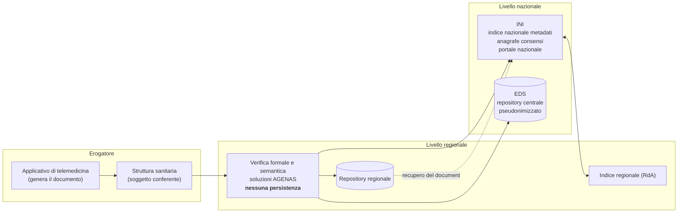
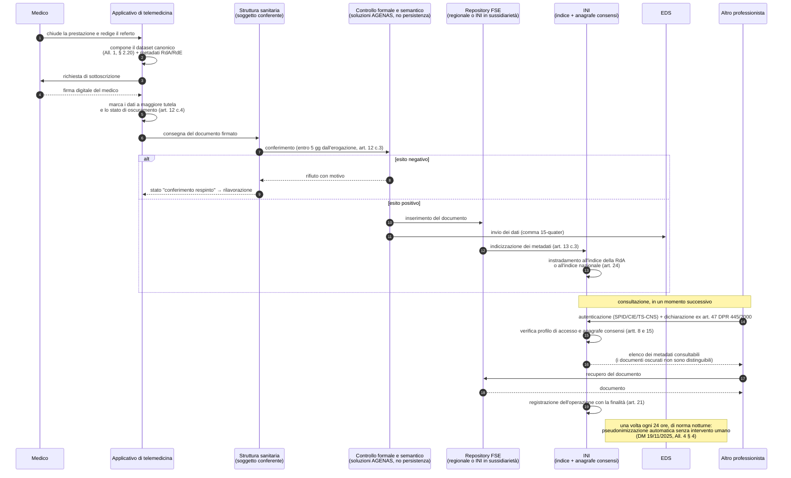
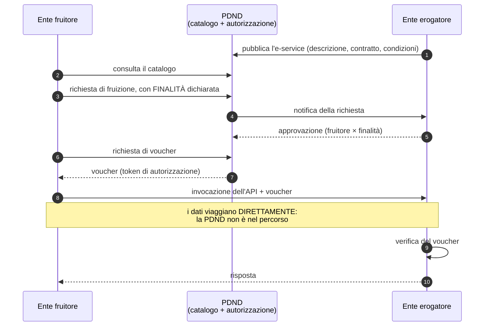

# FSE e infrastrutture nazionali

Nei moduli precedenti abbiamo stabilito **cosa** il sistema produce: prestazioni definite
dalla norma ([02](02-prestazioni-di-telemedicina.md)) e dati clinici con un regime giuridico
proprio ([03](03-il-dato-clinico.md)). Questo modulo risponde a una domanda diversa e
altrettanto concreta: **dove finiscono quei documenti, attraverso quali intermediari, con
quali interfacce e sotto la responsabilità di chi.**

È il punto in cui uno sviluppatore che non abbia mai lavorato con una pubblica
amministrazione italiana si trova davanti a un panorama che non somiglia a nulla di ciò che
conosce. Non c'è un'API centrale con una documentazione OpenAPI da leggere. Non c'è un
*vendor* con un portale sviluppatori. C'è un insieme stratificato di infrastrutture pubbliche
— alcune nazionali, alcune regionali, alcune realizzate da un ministero per conto di un altro
— con basi legali distinte, titolari del trattamento distinti e specifiche tecniche che in
parte sono pubblicate in Gazzetta Ufficiale, in parte sono su portali tecnici, e in parte
**non sono pubbliche affatto**.

Quest'ultimo punto va detto subito e senza attenuanti, perché è la ragione per cui questo
modulo contiene molti marcatori `[NV]`: **una parte non trascurabile della documentazione
tecnica necessaria a integrarsi con il fascicolo sanitario elettronico non è liberamente
consultabile.** Chi scrive questa guida non l'ha vista. Non la inventeremo: la dichiareremo
mancante ogni volta che manca, indicando dove va richiesta.

> **Convenzione di lettura.** `[NV]` significa «non verificato o non pubblicamente
> disponibile alla data di redazione». Non è una scusa: è un'indicazione operativa. Ogni
> `[NV]` di questo modulo è raccolto nel § 11, con il soggetto a cui l'informazione va
> richiesta.

---

## 1. Il modello mentale, prima dei dettagli

Prima di entrare negli acronimi conviene fissare quattro affermazioni. Sono la struttura
portante di tutto il resto e, se le si tiene ferme, il panorama smette di sembrare arbitrario.

**Prima: il fascicolo non è un database, è un indice più dei repository.** L'idea intuitiva —
«esiste un grande archivio nazionale dove finiscono tutti i referti degli italiani» — è
sbagliata. I documenti restano, in larga misura, presso chi li ha prodotti o presso il
repository della Regione competente. Ciò che è nazionale è **l'indice dei metadati** che
consente di trovarli, più l'anagrafe dei consensi che stabilisce chi può vederli.

**Seconda: chi produce il documento non coincide con chi lo indicizza, né con chi lo
conserva, né con chi lo espone al cittadino.** Sono quattro ruoli distinti, con quattro
titolari del trattamento distinti. Un errore ricorrente consiste nel modellare un unico
soggetto «il FSE» che fa tutto: produce un'architettura che non regge il primo confronto con
la realtà.

**Terza: la piattaforma di telemedicina è un produttore di documenti, non un archivio.** Lo
abbiamo già visto nel modulo [02](02-prestazioni-di-telemedicina.md), § 8: il DM 19 novembre
2025, art. 12, stabilisce che le infrastrutture regionali di telemedicina **non conservano**
i dati e i documenti generati, e l'art. 4, comma 4, stabilisce che il soggetto che li
conferisce al fascicolo è **la struttura sanitaria**. Questo modulo mostra cosa significhi
concretamente sul piano dei flussi.

**Quarta: quasi tutto ciò che segue è obbligo di chi eroga il servizio, non del software.**
Il software deve *rendere possibile* l'adempimento; l'adempimento è di un soggetto giuridico
che il progetto non è. Il § 9 traccia la linea in una tabella esplicita, ed è la sezione da
leggere se hai poco tempo.

---

## 2. Il Fascicolo sanitario elettronico

### 2.1 Cos'è, in termini giuridici prima che tecnici

Il **fascicolo sanitario elettronico (FSE)** è istituito dall'**art. 12 del D.L. 18 ottobre
2012, n. 179**, convertito con modificazioni dalla **L. 17 dicembre 2012, n. 221**, come
profondamente novellato dall'**art. 21 del D.L. 27 gennaio 2022, n. 4**, convertito con
modificazioni dalla **L. 28 marzo 2022, n. 25**. È da quest'ultima novella che si data ciò
che comunemente si chiama «FSE 2.0».

La definizione normativa lo qualifica come **l'insieme dei dati e documenti digitali di tipo
sanitario e sociosanitario generati da eventi clinici presenti e trascorsi, riguardanti
l'assistito**. Tre elementi di quella formula meritano attenzione:

- **«insieme di dati e documenti»**, non «sistema informativo». Il FSE è definito per il suo
  contenuto, non per l'infrastruttura che lo realizza. Le infrastrutture sono strumenti;
  quando cambiano, il fascicolo resta lo stesso oggetto giuridico;
- **«generati da eventi clinici»**: il fascicolo si popola per effetto di prestazioni
  effettivamente erogate. Non è un contenitore che il cittadino riempie a piacere — salvo la
  sezione che gli è espressamente riservata, il *taccuino* (§ 2.3);
- **«riguardanti l'assistito»**: il perimetro è la persona, non l'episodio né la struttura.
  È ciò che rende il fascicolo diverso da una cartella clinica, che è per definizione
  dell'episodio di ricovero e della struttura che lo ha gestito.

Gli atti attuativi che oggi lo disciplinano operativamente sono:

| Atto | Estremi | Cosa fa |
|---|---|---|
| **DM 20 maggio 2022** | Ministero della salute di concerto con MITD e MEF, GU Serie generale n. 160 dell'11 luglio 2022 | Adotta le **linee guida per l'attuazione del FSE** |
| **DM 18 maggio 2022** | Stessa GU | Integra i **dati essenziali** che compongono i documenti del FSE |
| **DM 7 settembre 2023** | GU Serie generale n. 249 del 24 ottobre 2023, atto 23A05829 | **Decreto attuativo FSE 2.0**: contenuti, soggetti, consensi, alimentazione, consultazione, sicurezza. Adottato previo parere del Garante n. 256 dell'8 giugno 2023 e sentita la Conferenza Stato-Regioni (seduta del 2 agosto 2023, rep. atti n. 187/CSR) |
| **DM 30 dicembre 2024** | GU Serie generale n. 33 del 10 febbraio 2025 | Introduce l'**art. 27-*bis***: fasi transitorie di attuazione. Parere del Garante n. 580 del 26 settembre 2024 |
| **DM 31 dicembre 2024** | GU Serie generale n. 53 del 5 marzo 2025, atto 25A01321 | **Istituisce l'Ecosistema dati sanitari (EDS)** |
| **DM 19 novembre 2025** | GU Serie generale n. 301 del 30 dicembre 2025, atto 25A06938 | Fra l'altro, **modifica il DM 7 settembre 2023** creando dieci tipologie documentali di telemedicina (art. 7) |

Il riferimento operativo da tenere aperto mentre si scrive codice è il **DM 7 settembre
2023**, come modificato. Gli altri lo integrano o lo presuppongono.

### 2.2 A chi appartiene il fascicolo

Domanda apparentemente banale, risposta stratificata — e la stratificazione ha conseguenze
dirette sul modello di autorizzazione.

Il fascicolo **riguarda** l'assistito, che ne è l'**interessato** ai sensi del GDPR e ha
diritti pieni su di esso: accesso, rettifica, oscuramento, conoscenza degli accessi altrui.
Ma l'assistito **non ne è il titolare del trattamento**. I titolari sono più d'uno, ciascuno
per il proprio trattamento:

- i **soggetti che erogano la prestazione e redigono il documento** sono titolari per la
  finalità di **cura**. L'art. 12, comma 2, del DM 7 settembre 2023 è testuale: «*I soggetti
  di cui al comma 1 che hanno in cura l'assistito o comunque gli prestano assistenza
  sanitaria, presso cui sono redatti i dati e i documenti sanitari che alimentano il FSE,
  sono titolari del trattamento per finalità di cura*»;
- le **Regioni e le Province autonome** sono titolari dei trattamenti di **verifica formale e
  semantica** e delle infrastrutture regionali (art. 13);
- il **Ministero della salute** è titolare per l'EDS (DM 31 dicembre 2024) e concorre alle
  finalità di governo;
- **AGENAS** ha la gestione operativa dell'EDS e la titolarità dell'infrastruttura nazionale
  di telemedicina;
- il **MEF, attraverso l'infrastruttura del Sistema Tessera Sanitaria**, realizza l'INI
  (§ 3.1).

**Conseguenza per chi progetta.** Non esiste un «proprietario del dato» unico da modellare.
Esiste una catena di titolarità che cambia lungo il percorso del documento, e il sistema deve
saper registrare, per ciascun documento, **chi lo ha prodotto**, **per conto di quale
struttura**, **in quale Regione** e **con quale finalità**. Il modulo
[03](03-il-dato-clinico.md), § 4, tratta i ruoli GDPR in generale; qui basti sapere che il
percorso di un documento verso il fascicolo attraversa almeno tre titolarità distinte.

### 2.3 Cosa contiene

L'**art. 3, comma 1, del DM 7 settembre 2023** elenca i contenuti, il cui dettaglio
informativo è definito nell'**Allegato A**. Il fascicolo contiene questi contenuti **anche per
prestazioni erogate al di fuori del Servizio sanitario nazionale** — punto spesso trascurato,
che estende l'obbligo di alimentazione al privato puro:

| Lett. | Contenuto |
|---|---|
| a) | Dati identificativi e amministrativi dell'assistito (esenzioni per reddito e patologia, contatti, delegati) |
| b) | **Referti**, inclusi quelli consegnati ai sensi del D.P.C.M. 8 agosto 2013 |
| c) | Verbali di pronto soccorso |
| d) | Lettere di dimissione |
| e) | **Profilo sanitario sintetico** (*patient summary*, art. 4) |
| f) | Prescrizioni specialistiche e farmaceutiche |
| g) | Cartelle cliniche |
| h) | Erogazione di farmaci a carico e non a carico del SSN |
| i) | Vaccinazioni |
| j) | Erogazione di prestazioni di assistenza specialistica |
| k) | **Taccuino personale dell'assistito** (art. 5) |
| l) | Dati delle tessere per i portatori di impianto |
| m) | Lettera di invito per screening |
| **n) – w)** | **Le dieci tipologie documentali di telemedicina** introdotte dall'art. 7 del DM 19 novembre 2025 |

Le lettere n)–w) sono trattate per esteso nel modulo
[02](02-prestazioni-di-telemedicina.md), § 7, con l'elenco completo e il set informativo del
referto di televisita. **Non le ripetiamo qui**: sono la materia prima del flusso descritto al
§ 4 di questo modulo, non il suo oggetto.

Due contenuti meritano una nota, perché hanno una natura diversa da tutti gli altri.

Il **profilo sanitario sintetico**, o *patient summary*, non è un documento prodotto da un
evento: è un documento **derivato**, redatto e aggiornato dal medico di medicina generale o
dal pediatra di libera scelta, che riassume la storia clinica rilevante dell'assistito
(patologie in atto, terapie, allergie, impianti). Serve a chi prende in carico un paziente
che non conosce, tipicamente in urgenza o fuori Regione. È anche uno dei documenti oggetto
dello scambio transfrontaliero europeo (§ 10).

Il **taccuino personale** è la sezione del fascicolo **alimentata dall'assistito**. È
l'unico contenuto in cui il cittadino scrive. Ha una conseguenza di modellazione precisa e
spesso trascurata: **i dati del taccuino non sono dati clinici certificati da un
professionista** e non possono essere trattati come tali. Un valore pressorio inserito dal
paziente e un valore misurato in ambulatorio hanno lo stesso tipo tecnico e una qualità
giuridica completamente diversa. Il modulo [06](06-fhir-da-zero.md) mostra come la
distinzione si rappresenti nel modello dati.

### 2.4 Chi lo alimenta, entro quando, con quale responsabilità

L'**art. 12 del DM 7 settembre 2023** definisce l'obbligo di alimentazione, e lo definisce in
modo molto più ampio di quanto si creda comunemente.

**Soggetti obbligati** (comma 1):

- aziende sanitarie locali, strutture sanitarie pubbliche del SSN e dei servizi
  socio-sanitari regionali, e i servizi di assistenza sanitaria al personale navigante
  (SASN);
- **strutture sanitarie accreditate**;
- **strutture sanitarie autorizzate**;
- **esercenti le professioni sanitarie, anche convenzionati con il SSN, quando operano in
  autonomia**.

L'ultima voce è quella che sorprende chi arriva dal mercato privato: **anche il singolo
professionista che opera in autonomia è soggetto obbligato**. Non è un adempimento del solo
ospedale pubblico.

**Termine** (comma 3): «*I soggetti di cui al comma 1 alimentano il FSE con i contenuti di
cui all'art. 3, **entro cinque giorni dall'erogazione della prestazione sanitaria** e sono
responsabili della mancata, intempestiva o inesatta alimentazione.*»

Cinque giorni è un vincolo di prodotto, non un obiettivo di servizio. Se il percorso di
generazione, firma e conferimento richiede un intervento manuale non presidiato, l'obbligo
non è sostenibile su volumi reali. Da qui discende un requisito che il progetto assume
esplicitamente: **il conferimento deve essere asincrono, ritentabile, osservabile e con una
coda di eccezioni lavorabile**, non una chiamata sincrona il cui fallimento si perde in un
log.

**Flag di oscuramento** (comma 4): all'atto dell'alimentazione va indicato se il dato rientra
fra i **dati a maggiore tutela dell'anonimato** (art. 6) o se su di esso è stato esercitato,
al momento dell'erogazione, il **diritto di oscuramento** (art. 9). Questo significa che
l'oscuramento **non è una funzione del fascicolo a valle**: è un attributo che accompagna il
documento **dalla nascita**. Un sistema che produca il documento e poi si preoccupi
dell'oscuramento in un secondo momento ha già sbagliato il modello.

Infine, una clausola di garanzia che vale la pena conoscere perché delimita la criticità del
componente: «*Il processo di alimentazione del FSE non pregiudica il diritto dell'assistito
all'erogazione della prestazione sanitaria*» (art. 13, comma 4). **Il conferimento al
fascicolo non può bloccare la cura.** Un'architettura in cui il fallimento del conferimento
impedisce di chiudere la prestazione è, oltre che fragile, normativamente scorretta.

### 2.5 Chi lo consulta

L'**art. 15** disciplina l'accesso per finalità di cura con un impianto per **profili**, non
per permessi individuali:

- **medico di medicina generale e pediatra di libera scelta**: per tutta la durata del
  rapporto di assistenza;
- **medico diverso**, che ha in cura l'assistito per visite, esami o ricovero:
  **limitatamente al tempo in cui si articola il processo di cura**, e — questo è il punto
  tecnicamente più interessante — «*previa dichiarazione che tale processo di cura è in atto
  al momento della consultazione del FSE e assunzione della relativa responsabilità ai sensi
  dell'art. 47 del D.P.R. 28 dicembre 2000, n. 445*»;
- **infermiere, ostetrica e farmacista**: con perimetro documentale limitato, definito
  nell'Allegato A, par. 4.1.1;
- **personale amministrativo**: solo per le informazioni amministrative.

La dichiarazione ex art. 47 del D.P.R. 445/2000 è una **dichiarazione sostitutiva di atto di
notorietà**: rendere una dichiarazione falsa ha rilevanza penale. Sul piano implementativo
questo significa che la schermata che precede l'accesso **non è un banner di conferma**: è la
raccolta di un atto giuridico, che va presentato con il testo corretto, registrato in modo non
alterabile e correlato all'accesso che ne consegue. Trattarlo come un `confirm()` è un errore
di sostanza, non di forma.

L'**art. 15, comma 4**, pone poi un'esclusione tassativa che è utile conoscere per intero,
perché delimita una superficie di abuso reale:

> «L'accesso al FSE è **sempre escluso** per i soggetti operanti in ambito sanitario che non
> perseguono finalità di cura quali **periti, compagnie di assicurazione, datori di lavoro**,
> associazioni o organizzazioni scientifiche, organismi amministrativi anche operanti in
> ambito sanitario, personale medico nell'esercizio di attività medico legale quale quella
> per l'accertamento dell'idoneità lavorativa o per il rilascio di certificazioni necessarie
> al conferimento di permessi o abilitazioni.»

Da leggere insieme al vincolo del progetto: fra i casi d'uso target figurano «mutue e
assicurazioni sanitarie». **Un'installazione al servizio di un ente assicurativo non può
avere accesso al fascicolo**, e la documentazione di prodotto non deve suggerire il
contrario. Il perimetro assicurativo riguarda la prestazione erogata da professionisti
convenzionati, non la consultazione del fascicolo dell'assistito.

Una regola trasversale chiude il quadro: «*i dati e i documenti presenti nel FSE sono sempre
consultabili, oltre che dall'assistito, dai soggetti che li hanno prodotti*» (art. 8, comma 7,
e art. 15, comma 5). **Chi ha prodotto un documento lo vede sempre**, indipendentemente dai
consensi e — secondo la lettura corrente — dall'oscuramento successivo, perché il documento
resta nei suoi sistemi di origine.

Infine l'**art. 20** disciplina l'**accesso in emergenza**: consultazione ammessa in
situazioni di emergenza sanitaria, con tracciamento rafforzato e obbligo di motivazione. È il
classico *break-glass*, e va implementato come tale: percorso distinto, motivazione
obbligatoria, notifica, revisione a posteriori.

### 2.6 Consensi, oscuramento e dati a maggiore tutela dell'anonimato

Qui si concentra la parte di disciplina che più spesso viene modellata male, e il modulo
[03](03-il-dato-clinico.md), § 2, la tratta a fondo sul piano delle basi giuridiche. Ai fini
di questo modulo interessano le **conseguenze infrastrutturali**.

**Il consenso non serve per alimentare, serve per far consultare da terzi.** È la differenza
introdotta dalla novella del 2022 ed è il cambiamento più importante di FSE 2.0 (§ 2.7).
L'art. 8 richiede un consenso «*libero, specifico, informato, inequivocabile ed esplicito*»
per la **consultazione da parte di terzi**, distinto per finalità di cura, di prevenzione e
di profilassi internazionale. Le finalità di **governo** e di **ricerca** operano invece su
dati pseudonimizzati e non richiedono quel consenso.

**L'anagrafe dei consensi è nazionale.** Non è un flag dentro l'applicativo dell'erogatore:
è una componente dell'INI (§ 3.1), interrogata al momento della consultazione. Un sistema che
tenga una propria copia del consenso e decida in autonomia sta prendendo una decisione che
non gli compete.

**L'oscuramento** (art. 9) è esercitabile in tre momenti: al momento dell'erogazione, prima
dell'alimentazione, oppure successivamente. Deve essere «*garantito l'immediato oscuramento*»
tramite funzionalità *online*. E ha una proprietà che sul piano implementativo è tutt'altro
che banale (comma 6): l'oscuramento avviene «*con modalità tali da garantire che tutti i
soggetti abilitati all'accesso **non possano venire automaticamente a conoscenza del fatto che
l'assistito ha effettuato tale scelta***».

Detto in termini ingegneristici: **l'oscuramento non può manifestarsi come un buco visibile**.
Non si può mostrare un elemento in elenco con l'etichetta «documento oscurato», né lasciare un
salto negli identificativi progressivi, né restituire un `403` distinguibile da un `404`. È un
requisito di *indistinguibilità*, e va progettato come tale — con conseguenze anche sui
messaggi di errore, sui contatori e sui *log* esposti.

Regola di propagazione (comma 7): **l'oscuramento della prescrizione determina l'oscuramento
automatico dei documenti di erogazione e dei referti correlati**. Serve quindi un grafo delle
correlazioni fra documenti, non un elenco piatto.

I **dati a maggiore tutela dell'anonimato** (art. 6) sono una categoria ulteriormente
protetta: sieropositività, interruzione volontaria di gravidanza, violenza sessuale e
pedofilia, uso di stupefacenti, sostanze psicotrope e alcol, parto in anonimato, servizi dei
consultori familiari. Sono visibili a terzi **solo previo consenso esplicito, informato e
specifico reso al soggetto erogante**; in assenza, «*l'erogatore della prestazione è
responsabile dell'eventuale mancato oscuramento del dato o documento*». E per le prestazioni
erogate in anonimato **l'alimentazione del fascicolo non è ammessa affatto**.

Sul piano del prodotto ne discende un requisito che non ammette scorciatoie: il sistema deve
consentire di **classificare il documento in questa categoria al momento della produzione** e
di impedirne il conferimento quando la prestazione è in anonimato. Non è un filtro a valle: è
una proprietà del documento.

**Registrazione delle operazioni** (art. 21). Sono registrate: alimentazione, oscuramento,
revoca dell'oscuramento, consultazione da parte del soggetto produttore, consultazione da
parte dell'assistito o del suo delegato, consultazione da parte di altro soggetto e
consultazione in emergenza — con dato o documento, tipologia di operazione, categoria di
soggetto, data e ora, e, **per le sole consultazioni, la finalità**.

**Conservazione** (art. 10). L'indice è cancellato **decorsi trent'anni dalla data del
decesso**, con verifica a periodicità annuale; stessa regola per dati e documenti, **fatta
eccezione per la cartella clinica e i documenti a essa afferenti**, che seguono il regime di
conservazione illimitata proprio della documentazione di ricovero.

### 2.7 Cosa è cambiato con FSE 2.0, e perché

«FSE 2.0» non è un numero di versione di un software: è la denominazione corrente della
riforma introdotta dall'art. 21 del D.L. 4/2022 e attuata dai decreti del 2022-2023. I
cambiamenti sostanziali sono cinque, e conviene conoscerli perché spiegano perché
l'infrastruttura ha la forma che ha.

**1. È caduto il consenso all'alimentazione.** Nel regime previgente (D.P.C.M. 29 settembre
2015, n. 178) il fascicolo si popolava **solo se il cittadino acconsentiva**. Il risultato era
un fascicolo per lo più vuoto, con tassi di adesione molto disomogenei fra Regioni e quindi
inservibile come strumento di continuità assistenziale. Con FSE 2.0 **l'alimentazione avviene
in forza di legge**; il consenso serve, come si è visto, per la **consultazione da parte di
terzi**. È il cambiamento che ha reso il fascicolo effettivamente popolato e, di conseguenza,
ha reso sensato costruirci sopra dei servizi.

**2. Le finalità sono state riordinate e distinte.** Cura, prevenzione e profilassi
internazionale da un lato; **governo** e **ricerca** dall'altro, su dati pseudonimizzati e con
un percorso separato. È la distinzione che rende possibile l'EDS (§ 3.2) senza esporre
identità.

**3. Il fascicolo è diventato nazionale nei fatti, non solo nel nome.** L'INI, l'indice
nazionale dei metadati, l'anagrafe nazionale dei consensi e il portale nazionale sono le
componenti che consentono a un assistito di Regione A di essere curato in Regione B senza che
i documenti debbano essere spostati.

**4. È comparso l'ecosistema dei dati.** Il fascicolo non è più solo un fascicolo: è la fonte
di alimentazione di un repository centrale — l'EDS — costruito per l'analisi, il monitoraggio
e la ricerca su dati pseudonimizzati.

**5. Sono state introdotte soluzioni tecnologiche nazionali per l'alimentazione.** Il comma
15-*quater* dell'art. 12 prevede che **AGENAS metta a disposizione** di Regioni e strutture,
ai sensi dell'art. 69 del Codice dell'amministrazione digitale, soluzioni con tre funzioni
precise: **controllo formale e semantico** dei documenti prodotti per alimentare il FSE,
**conversione delle informazioni nei formati standard** di cui al comma 15-*octies*, e
**invio dei dati verso l'EDS**. È un cambiamento architetturale rilevante: parte della
normalizzazione non è più a carico dell'erogatore.

**Le fasi di attuazione.** Il DM 30 dicembre 2024 ha introdotto l'art. 27-*bis*, poi
prorogato:

| Fase | Contenuto | Scadenza originaria | Scadenza prorogata |
|---|---|---|---|
| **Fase I** | Avvio | 31 marzo 2025 | **30 giugno 2025** |
| **Fase II** | Piena realizzazione del profilo sanitario sintetico; alimentazione dei dati a maggiore tutela già oscurati | 30 settembre 2025 | **31 dicembre 2025** |
| **Fase III** | Piena operatività: alimentazione entro cinque giorni, documenti erogati fuori SSN, abilitazione delle strutture private autorizzate | 31 marzo 2026 | **31 marzo 2026** (invariata) |

Alla data di redazione la Fase III è formalmente scaduta. **Lo stato di attuazione effettivo,
Regione per Regione, non è stato accertato su fonte ufficiale aggiornata.** `[NV]`

**Un dato di scala, per capire di cosa stiamo parlando.** Al 31 dicembre 2025 il portale
nazionale del fascicolo dichiarava **29 tipologie documentali** gestite e **33 tipologie di
servizi al cittadino**, con 26 milioni di consensi positivi alla consultazione, 5,9 milioni di
utenti attivi negli ultimi sessanta giorni e 140.000 medici specialisti abilitati. Non è un
progetto pilota: è un'infrastruttura in esercizio su scala nazionale.

---

## 3. Gli intermediari: INI, EDS e le infrastrutture regionali

Il fascicolo, come si è detto, è un contenuto giuridico. Le infrastrutture che lo realizzano
sono altra cosa, e sono tre livelli: **nazionale di interoperabilità** (INI), **nazionale di
analisi** (EDS), **regionale di esercizio** (i FSE regionali e, per la telemedicina, le IRT).

### 3.1 INI — Infrastruttura nazionale per l'interoperabilità

**Base legale.** L'INI è istituita dal **comma 15-*ter* dell'art. 12 del D.L. 179/2012** ed è
**realizzata dal Ministero dell'economia e delle finanze attraverso l'infrastruttura del
Sistema Tessera Sanitaria**, quella di cui all'art. 50 del D.L. 30 settembre 2003, n. 269.

Questa frase merita di essere sciolta, perché contiene un'informazione che spiazza chi arriva
da fuori: **l'infrastruttura di interoperabilità del fascicolo sanitario non è del Ministero
della salute.** È del Ministero dell'economia, e riusa la piattaforma nata per finalità
fiscali e di controllo della spesa sanitaria — la stessa che gestisce la ricetta
dematerializzata e la trasmissione delle spese sanitarie per la dichiarazione dei redditi
precompilata. Non è un'anomalia: è il riuso di un'infrastruttura che aveva già l'anagrafe
degli assistiti, la connettività con tutte le strutture e un modello di sicurezza collaudato.

**Cosa fa l'INI.** Il DM 7 settembre 2023, art. 1, ne individua le componenti:

| Componente | Base | Funzione |
|---|---|---|
| **FSE-INI** | — | Infrastruttura e servizi telematici di cui Regioni, Province autonome e Ministero della salute **si avvalgono in sussidiarietà**: chi non ha un proprio FSE regionale operativo usa quello nazionale |
| **Anagrafe consensi e revoche** | comma 15-*ter*, punto 4-*bis* | Registro nazionale dei consensi alla consultazione e delle relative revoche |
| **Indice nazionale FSE** | comma 15-*ter*, punto 4-*ter* | **Indice nazionale dei metadati dei documenti**. Per gli assistiti privi di Regione di assistenza gestisce direttamente l'indice; all'associazione di una Regione di assistenza **trasferisce l'indice dei metadati all'indice della RdA** (art. 24) |
| **Portale nazionale FSE** | comma 15-*ter*, punto 4-*quater* | Accesso *online* al fascicolo per assistito e operatori |

Il concetto chiave è **l'indice dei metadati**. L'INI non contiene i referti: contiene le
schede che dicono che esiste un referto di un certo tipo, prodotto in una certa data da una
certa struttura, e dove andarlo a prendere. È l'analogo di un catalogo di biblioteca rispetto
ai volumi sugli scaffali. Chi consulta il fascicolo di un assistito interroga l'indice, ottiene
la lista dei riferimenti, e recupera il documento dal repository che lo custodisce.

Due sigle amministrative che ricorrono ovunque e vanno sciolte:

- **RdA — Regione di assistenza**: la Regione presso cui l'assistito è iscritto al Servizio
  sanitario, quella che gli assegna il medico di medicina generale;
- **RdE — Regione di erogazione**: la Regione in cui la prestazione viene materialmente
  erogata.

Coincidono nella maggior parte dei casi, ma non sempre — ed è esattamente nella
non-coincidenza che l'infrastruttura nazionale serve a qualcosa. Un assistito lombardo curato
in Puglia genera un documento nella RdE Puglia che deve comparire nel fascicolo gestito dalla
RdA Lombardia. **Il modello dati deve portare entrambe le informazioni su ogni documento**, e
non deducibili l'una dall'altra.

### 3.2 EDS — Ecosistema dati sanitari

**Base legale.** Istituito con il **DM 31 dicembre 2024** (GU Serie generale n. 53 del 5 marzo
2025, atto 25A01321). **Titolare del trattamento: il Ministero della salute. Gestione
operativa: AGENAS.**

**Cos'è.** Un ***data repository* centrale**. A differenza dell'INI, che indicizza, l'EDS
**contiene dati**: riceve i contenuti estratti dai documenti del fascicolo, li normalizza e li
rende interrogabili. Serve alle finalità che non sono la cura del singolo: **governo**,
**programmazione**, **monitoraggio**, **valutazione delle tecnologie sanitarie** (*health
technology assessment*), **ricerca**.

**La regola che ne governa il funzionamento è la pseudonimizzazione**, e ha parametri
espliciti. Il DM 19 novembre 2025, Allegato 4, § 4, stabilisce testualmente che il processo di
pseudonimizzazione è eseguito **dall'EDS** (non dall'infrastruttura di telemedicina), «*in
sequenza, in modo automatico, senza intervento umano e 1 volta nelle 24 ore*», e che
l'aggiornamento «*viene normalmente eseguito nelle ore notturne*». Impone inoltre una verifica
delle **regole di clusterizzazione** «*al fine di garantire che nessun risultato […] possa
essere riconducibile ad un singolo individuo (**cardinalità uno**), indipendentemente dal
livello o dalla dimensione di analisi*».

Tradotto: l'EDS non restituisce mai un risultato che identifichi una persona sola, e lo
verifica come proprietà del sistema, non come buona intenzione dell'analista.

**Cosa ha aggiunto il DM 19 novembre 2025.** L'Allegato 2 integra l'Allegato A del decreto EDS
con quattro servizi dedicati alla telemedicina:

- **per la finalità di cura**, un servizio di «*consultazione dei dati e documenti relativi
  alle prestazioni di telemedicina*»: il professionista, a valle della ricerca dell'assistito,
  vede tipologia di prestazione, data, quesito diagnostico, struttura, medico specialista, e da
  lì accede ai documenti. Con un vincolo esplicito: «*il professionista deve poter visualizzare
  esclusivamente i dati estratti dai documenti che l'assistito non ha oscurato*». Gli attori
  sono il professionista, l'EDS e l'**anagrafe consensi dell'INI**;
- **per la finalità di governo**, tre servizi di estrazione di dati pseudonimizzati richiesti
  da uffici regionali, dal Ministero della salute e da AGENAS: **programmazione** delle
  prestazioni, **monitoraggio** (anche per la verifica del raggiungimento di target e
  *milestone*), **individuazione e aggiornamento delle tariffe** delle prestazioni di
  telemedicina, e **valutazione delle tecnologie sanitarie**.

Per ciascuno l'EDS esegue la stessa sequenza: identifica gli assistiti che corrispondono ai
parametri, **sostituisce all'identificativo dell'assistito lo pseudonimo**, **esclude tutti
gli elementi identificativi diretti**, estrae i dati pertinenti e li restituisce.

**Il punto che riguarda direttamente chi scrive il software.** La piattaforma di telemedicina
**non parla con l'EDS**. Alimenta il fascicolo; l'EDS estrae. Ma le dimensioni di analisi
ammesse — base temporale, caratteristiche anagrafiche (sesso, classe di età, ASL di
assistenza), caratteristiche sanitarie (codici di esenzione, patologie in essere o pregresse),
base distrettuale (ASL di erogazione), **tipologia di servizio minimo erogato**,
**caratteristica del regime di erogazione e assistenza** — **devono esistere come attributi
strutturati nei documenti prodotti**, altrimenti il dato non è estraibile. Gli ultimi due
diventano, di fatto, attributi obbligatori di ogni documento di telemedicina.

### 3.3 INI ed EDS a confronto

Confondere le due componenti è l'errore concettuale più comune. La tabella seguente le
separa lungo le dimensioni che contano.

| Dimensione | **INI** | **EDS** |
|---|---|---|
| Base legale | Comma 15-*ter*, art. 12 D.L. 179/2012 | DM 31 dicembre 2024 |
| Chi la realizza | MEF, tramite Sistema Tessera Sanitaria | Ministero della salute (titolare), AGENAS (gestione) |
| Natura | **Indice + anagrafe consensi + portale** | ***Data repository* centrale** |
| Contiene documenti? | **No**: metadati e riferimenti | **Sì**: contenuti estratti e normalizzati |
| Identificabilità | Opera su identità dell'assistito | Opera su **pseudonimi**, esclude gli identificativi diretti |
| Finalità servite | **Cura** (trovare i documenti), gestione dei consensi | **Governo, programmazione, monitoraggio, HTA, ricerca**; più il servizio di consultazione per finalità di cura introdotto dal DM 19 novembre 2025 |
| Sincronia | Interrogata al momento della consultazione | Aggiornata **una volta ogni 24 ore**, di norma notturna |
| Il progetto vi si collega? | **Indirettamente**, attraverso il percorso di alimentazione e il portale | **No**: l'EDS estrae dal FSE |

### 3.4 Il livello regionale

Sotto le due componenti nazionali stanno le infrastrutture regionali, che sono la sede in cui
quasi tutto accade materialmente. Tre elementi da conoscere.

**Il FSE regionale.** Ogni Regione o Provincia autonoma gestisce il fascicolo dei propri
assistiti, con il proprio indice e il proprio o i propri repository. Chi non dispone di
un'infrastruttura propria operativa **si avvale in sussidiarietà del FSE-INI**. La conseguenza
pratica è che **non esiste una singola interfaccia di alimentazione**: esiste il percorso
nazionale e ne esistono venti declinazioni regionali, con differenze reali di endpoint,
autenticazione, formati accettati e regole di validazione. `[NV]` sulla mappa aggiornata delle
differenze regionali, che non è pubblicata in forma consolidata e che ogni deployer deve
ricostruire per la propria Regione.

**Il ruolo delle Regioni nel controllo dei documenti.** L'art. 13 del DM 7 settembre 2023
stabilisce che **le Regioni sono titolari dei trattamenti di verifica formale e semantica** e
che devono contribuire all'alimentazione «*utilizzando le soluzioni tecniche rese disponibili
da AGENAS*». E aggiunge una precisazione che ha valore architetturale: «*le soluzioni
tecnologiche di cui al comma 1 **non prevedono meccanismi di persistenza dei dati
trattati***». Sono componenti di transito, non archivi.

**Le infrastrutture regionali di telemedicina (IRT)** sono un livello ulteriore, disciplinato
dal DM 21 settembre 2022 e dal DM 19 novembre 2025, e sono trattate nel modulo
[02](02-prestazioni-di-telemedicina.md), § 6, insieme alla INT, al NIT e alla PNT. Qui basta
fissare il raccordo, perché è la ragione per cui questo modulo esiste:

- **la IRT eroga la prestazione e consente al professionista di generare il documento**;
- **la struttura sanitaria lo conferisce al FSE** (DM 19 novembre 2025, art. 4, comma 4);
- **la IRT non lo conserva** (art. 12);
- **il FSE lo indicizza tramite INI** e ne alimenta l'**EDS**;
- **la INT non vede nulla di tutto questo**, perché non effettua trattamenti di dati personali
  oltre a quelli tassativamente previsti.

> **Avvertenza sul diagramma.** È una rappresentazione **logica** dei ruoli, ricostruita dai
> testi normativi citati. **Non è uno schema di integrazione**: gli endpoint reali, i
> protocolli di trasporto e la sequenza esatta delle chiamate dipendono dalle specifiche
> tecniche di interoperabilità e dalle declinazioni regionali, che il § 4.8 dichiara non
> integralmente verificate. `[NV]`

---

## 4. Il ciclo di vita di un documento, passo per passo

Questa sezione ricostruisce il percorso che compie un referto dal momento in cui il medico lo
chiude a quello in cui un altro professionista lo legge. Ogni passaggio è ancorato alla sua
fonte normativa. Dove la norma tace o dove la specifica tecnica non è pubblica, lo diciamo.

### 4.1 Generazione

Il documento nasce nell'applicativo dell'erogatore. Per la televisita l'Accordo Stato-Regioni
17 dicembre 2020, rep. atti n. 215/CSR, impone che la prestazione «*sia regolarmente gestita e
refertata sui sistemi informatici in uso presso l'erogatore, alla pari di una visita
specialistica erogata in modalità tradizionale, **con l'aggiunta della specifica di erogazione
in modalità a distanza***».

Il **contenuto informativo obbligatorio** del referto di televisita è quello del DM 19
novembre 2025, Allegato 1, § 2.20, ed è dettagliato nel modulo
[02](02-prestazioni-di-telemedicina.md), § 7.2. Qui interessa il fatto che il documento debba
nascere già **completo dei metadati di conferimento**, non arricchito in un secondo momento:

- identificativo dell'assistito (codice fiscale, oppure codice STP per lo straniero
  temporaneamente presente o ENI per l'europeo non iscritto — modulo
  [04](04-identita-e-anagrafiche.md));
- **Regione di assistenza e Regione di erogazione**;
- azienda sanitaria, presidio, unità operativa;
- **medico refertante e medico firmatario**, che il tracciato tiene distinti;
- tipologia documentale, data e ora di inizio e di fine erogazione;
- **classificazione fra i dati a maggiore tutela dell'anonimato** e stato di oscuramento
  eventualmente già esercitato (DM 7 settembre 2023, art. 12, comma 4).

### 4.2 Firma

Il referto va **sottoscritto digitalmente dal medico**. È un obbligo dell'Accordo 215/CSR
2020, ribadito per la telerefertazione nella forma «*firma digitale validata del medico
responsabile*».

Due precisazioni che evitano confusioni frequenti.

**La firma è del medico, non del sistema.** Un sigillo elettronico dell'organizzazione non
sostituisce la firma del professionista: la responsabilità del contenuto clinico è personale.
Il sistema può orchestrare la firma — predisporre il documento, invocare il dispositivo o il
servizio di firma remota, verificarne l'esito — ma non può firmare al posto del medico.

**Il formato documentale nazionale del fascicolo è HL7 CDA Rel. 2 («CDA2»)**, veicolato dentro
un **PDF firmato digitalmente**. È l'impostazione delle specifiche nazionali di
interoperabilità («*Affinity Domain Italia*»), pubblicate nell'area tecnica del portale del
fascicolo. La versione dichiarata come pubblicata è la **2.6.4**. **Non è stato verificato se
tale versione contenga già i template CDA2 delle dieci tipologie documentali di telemedicina.**
`[NV]`

Da questa incertezza discende una regola di progetto che va rispettata senza eccezioni,
perché protegge da una riscrittura costosa: **il contenuto informativo dell'Allegato 1 si
modella come *dataset* canonico e CDA2 si tratta come serializzazione sostituibile.** Nessun
template CDA2 va cablato nel dominio. La stessa disciplina vale per le Implementation Guide
FHIR nazionali, che rappresentano il referto di televisita come `Composition` dentro un
`Bundle`: sono la **rappresentazione tecnica**, mentre il set ministeriale è la **fonte
normativa**. Il modulo [06](06-fhir-da-zero.md) sviluppa il punto.

### 4.3 Controllo formale e semantico

Il documento non entra nel fascicolo così com'è. L'art. 13 del DM 7 settembre 2023 prevede un
passaggio di **verifica formale e semantica** di cui **la Regione è titolare del trattamento**
e che si avvale delle **soluzioni tecnologiche rese disponibili da AGENAS** ai sensi del comma
15-*quater*. Quelle soluzioni hanno tre funzioni dichiarate: controllo formale e semantico,
**conversione delle informazioni nei formati standard** del comma 15-*octies*, e **invio dei
dati verso l'EDS**.

Due proprietà di questo stadio hanno effetti diretti sull'architettura del produttore:

- **non c'è persistenza**: «*le soluzioni tecnologiche di cui al comma 1 non prevedono
  meccanismi di persistenza dei dati trattati*». È un componente di transito. Se il
  conferimento fallisce, il documento non è «da qualche parte»: è solo presso chi lo ha
  prodotto;
- **il controllo può respingere**. L'art. 13 prevede che «*in caso di esito positivo del
  controllo formale e semantico, il sistema consente di procedere alla firma, ove prevista, del
  documento per l'inserimento dello stesso nel FSE*». Esiste quindi un **esito negativo**, e va
  gestito come stato di dominio: documento prodotto, conferimento respinto, motivo,
  rilavorazione. Non come eccezione tecnica.

`[NV]` — **Non sono pubblicamente disponibili le specifiche di interfaccia delle soluzioni
tecnologiche AGENAS** (endpoint, formato dei messaggi di esito, tassonomia degli errori di
validazione). Vanno richieste ad AGENAS o alla Regione di riferimento. Il progetto non deve
inventarne una: deve prevedere un **adattatore con contratto interno stabile** e un'unica
implementazione sostituibile.

### 4.4 Firma di conferimento e indicizzazione tramite INI

Superato il controllo, il documento è inserito nel fascicolo e **indicizzato attraverso l'INI**
(art. 13, comma 3). I metadati confluiscono nell'**indice della Regione di assistenza**
oppure, per l'assistito che non ha una Regione di assistenza, nell'**indice nazionale FSE**;
all'associazione successiva di una RdA, l'INI **trasferisce l'indice dei metadati all'indice
della RdA** (art. 24).

Questo trasferimento è un dettaglio che vale la pena registrare: **l'indice si sposta, il
documento no**. Un modello che assuma la stabilità della sede dell'indice per tutta la vita
dell'assistito è sbagliato.

`[NV]` — **I metadati di indicizzazione IHE XDS e i codici di tipologia documentale
(`typeCode`, `classCode`, e la corrispondente codifica LOINC) per le dieci nuove tipologie di
telemedicina non sono stati reperiti.** Sono l'informazione che serve per costruire il
`SubmissionSet` e il `DocumentEntry`. Vanno cercati nell'area tecnica del portale del
fascicolo, nei documenti di specifica CDA2 per singola tipologia; in subordine richiesti a
Sogei o all'INI. Il modulo [05](05-standard-di-interoperabilita.md) spiega cosa siano IHE XDS,
`SubmissionSet` e `DocumentEntry`.

### 4.5 Termine e responsabilità

**Entro cinque giorni dall'erogazione** (art. 12, comma 3), con responsabilità del titolare per
alimentazione mancante, intempestiva o inesatta. Il termine decorre dall'**erogazione**, non
dalla firma né dalla disponibilità del sistema di destinazione: un'indisponibilità
dell'infrastruttura regionale non sospende il termine, quindi la coda di conferimento deve
essere durevole e con ripetizione dei tentativi.

### 4.6 Consultazione

Chi consulta segue il percorso inverso: autenticazione con identità digitale (§ 8) →
verifica del profilo di accesso e, per il medico non di fiducia, **dichiarazione ex art. 47
D.P.R. 445/2000** che il processo di cura è in atto → interrogazione dell'indice →
verifica dell'anagrafe consensi → recupero del documento dal repository → **registrazione
dell'operazione** con la finalità (art. 21).

### 4.7 Oscuramento

L'oscuramento può intervenire **prima** della produzione (il paziente lo chiede al momento
dell'erogazione: il documento nasce con il flag), oppure **dopo**, tramite le funzionalità
*online* del portale. Nel secondo caso il documento è già indicizzato e l'oscuramento agisce
sulla sua **visibilità a terzi**, non sulla sua esistenza né sulla visibilità per chi lo ha
prodotto.

Ricordando i due vincoli del § 2.6: **immediatezza** e **indistinguibilità**. L'oscuramento
della prescrizione propaga automaticamente ai documenti di erogazione e ai referti correlati.

### 4.8 Il flusso in un diagramma di sequenza

> **Cosa questo diagramma non è.** Non è un contratto di integrazione. Rappresenta la
> **sequenza dei ruoli e delle responsabilità** come ricostruita dalle fonti citate. I
> passaggi 7-12 avvengono, nella realtà, attraverso interfacce la cui specifica tecnica non è
> integralmente pubblica: **numero, ordine e granularità delle chiamate effettive possono
> differire**, e differiscono fra Regioni. `[NV]`

### 4.9 Cosa resta non verificato in questo flusso

Riassunto dei punti su cui il progetto **non deve inventare specifiche**:

| Elemento | Stato | Dove va richiesto |
|---|---|---|
| Template CDA2 delle dieci tipologie di telemedicina | `[NV]` | Area tecnica del portale del fascicolo (documenti di specifica CDA2 per tipologia); in subordine Sogei / INI |
| Codici di tipologia documentale e metadati IHE XDS delle stesse | `[NV]` | Come sopra |
| Specifiche di interfaccia delle soluzioni tecnologiche AGENAS (comma 15-*quater*) | `[NV]` | AGENAS; Regione di riferimento |
| Contenuto della versione 2.6.4 di «*Affinity Domain Italia*» rispetto alla telemedicina | `[NV]` | Portale del fascicolo, area tecnica |
| Differenze regionali di endpoint, autenticazione e validazione | `[NV]` | Ciascuna Regione, singolarmente |
| Codifica della modalità di erogazione a distanza nei flussi di rendicontazione (il valore «telemedicina» nel campo «luogo di erogazione») | `[NV]` | Specifiche tecniche del Sistema Tessera Sanitaria; disciplinari regionali del flusso di specialistica ambulatoriale |
| Contenuto operativo del **Processo di Validazione** AGENAS ex art. 3, c. 4 DM 19 novembre 2025 | `[NV]` | AGENAS |

**Conseguenza di prodotto, da tenere ferma.** Ogni voce di questa tabella è un punto di
variabilità che va isolato dietro un'interfaccia di progetto, con implementazione
configurabile per Regione e per installazione. Non è sovra-ingegnerizzazione: è la traduzione
diretta di un'incertezza documentata.

---

## 5. PDND e ModI, spiegati a chi non li ha mai visti

Questa è la sezione in cui è più facile dare per scontato qualcosa, perché chi lavora nella
pubblica amministrazione italiana usa questi due nomi come se fossero ovvi e chi viene da
fuori non ha alcun aggancio mentale a cui appoggiarli. Partiamo dal problema, non
dall'acronimo.

### 5.1 Il problema

Immagina due enti pubblici italiani. Il primo — poniamo un'azienda sanitaria — ha bisogno di
sapere se una certa persona è iscritta al Servizio sanitario in quella Regione. Il secondo —
poniamo l'ente che gestisce quell'anagrafe — ha il dato.

Nel mondo privato la soluzione è banale: si concorda un'API, ci si scambia una chiave, si
scrive un contratto. Nel settore pubblico questa strada, moltiplicata per ventimila enti,
produce due patologie ben note: **una proliferazione di integrazioni bilaterali**
incontrollabile (ogni coppia di enti negozia la propria), e **l'assenza di una traccia
verificabile** di chi ha chiesto cosa a chi, con quale base giuridica e per quale finalità.
Quest'ultimo punto non è burocrazia: quando i dati sono dati sanitari, la tracciabilità della
finalità di accesso è un requisito del GDPR, non un capriccio.

Le due risposte italiane a questo problema sono **il ModI** — che dice *come* si costruisce
un'interfaccia fra amministrazioni — e **la PDND** — che dice *chi può chiamare cosa, e come
lo si dimostra*.

### 5.2 ModI — il Modello di Interoperabilità

**Cos'è.** Un insieme di regole tecniche che stabiliscono come le pubbliche amministrazioni
espongono e consumano interfacce applicative. Non è un software, non è un prodotto, non è
un'infrastruttura: è **una specifica**, come lo è uno standard.

**Chi lo scrive e con quale forza.** È definito dalle **Linee guida sull'interoperabilità
tecnica delle Pubbliche Amministrazioni** e dalle **Linee guida «Tecnologie e standard per la
sicurezza dell'interoperabilità tramite API dei sistemi informatici»**, adottate da AgID con
la **Determinazione n. 547 del 1° ottobre 2021**, ai sensi dell'**art. 71 del Codice
dell'amministrazione digitale** e nel rispetto della procedura di notifica della Direttiva
(UE) 2015/1535. Sono **vincolanti per le pubbliche amministrazioni**, e il DM 21 settembre
2022 le richiama espressamente fra le norme che le infrastrutture regionali di telemedicina
devono rispettare.

**Cosa contiene, in sostanza.** Il ModI individua **pattern e profili di interoperabilità**:
modalità tecniche condivise che **l'erogatore** e il **fruitore** di un servizio implementano
per rendere interoperabili i rispettivi sistemi. Si articolano su tre assi:

- **pattern di interazione** — la forma della conversazione: richiesta/risposta sincrona,
  interazione bloccante o non bloccante, notifica di eventi (*push* o *pull*). Serve a evitare
  che ogni ente reinventi la propria semantica di chiamata;
- **pattern di sicurezza** — dove sta la fiducia: sul canale (autenticazione dei sistemi con
  certificati, TLS mutuo) oppure **sul messaggio** (il singolo messaggio è firmato e la firma
  è verificabile indipendentemente dal canale che lo ha trasportato). La distinzione è
  importante: la sicurezza a livello di messaggio sopravvive ai *proxy* intermedi e produce
  una prova opponibile a posteriori, cosa che la sicurezza di canale non fa;
- **pattern di tracciatura** — come si dimostra, dopo, che una certa chiamata è avvenuta, da
  parte di chi e con quali dati.

**Perché a un progetto open source questo interessa.** Se l'installazione è presso una
pubblica amministrazione e le API del sistema sono esposte verso altre pubbliche
amministrazioni, **devono essere descritte e realizzate secondo i pattern ModI**. Non è una
scelta stilistica dell'integratore: è un requisito di conformità che ricade sull'ente e che
l'ente scarica, contrattualmente, sul fornitore.

### 5.3 PDND — Piattaforma Digitale Nazionale Dati

**Base legale.** Art. 50-*ter* del Codice dell'amministrazione digitale. **Linee guida
sull'infrastruttura tecnologica della Piattaforma Digitale Nazionale Dati per
l'interoperabilità dei sistemi informativi e delle basi di dati**, adottate con
**Determinazione AgID n. 627/2021** e **aggiornate a maggio 2025** (versione 2).
**Vincolanti.**

**Cos'è in una frase.** La PDND è **un catalogo di servizi applicativi più un'autorità che
rilascia le autorizzazioni a usarli**.

**Cosa non è, ed è la fonte di quasi tutti i fraintendimenti.** La PDND **non è un proxy**.
**Non trasporta i dati.** Non c'è un'istanza centrale attraverso cui passano le chiamate. Se
l'ente A chiama l'API dell'ente B, quella chiamata va **direttamente da A a B**. La PDND
interviene prima, per stabilire che A è autorizzata, e resta fuori dal flusso dei dati.

Chi arriva da architetture aziendali tende a immaginarla come un *API gateway* nazionale. Non
lo è, e il fraintendimento produce stime di latenza e di disponibilità completamente sbagliate.

**Il vocabolario, termine per termine.**

| Termine | Significato |
|---|---|
| **E-service** | Il servizio applicativo pubblicato. Le linee guida lo definiscono: «*un e-service è un servizio erogato via Internet o attraverso una rete privata mediante un processo digitale che coinvolge erogatori e fruitori*»; gli e-service sono «*una particolare categoria di servizi di rete basati su application programming interface (API)*». In pratica: **una API, con la sua descrizione, il suo contratto e le sue condizioni d'uso** |
| **Ente erogatore** | Chi **pubblica** l'e-service sul catalogo. È titolare del dato e resta il soggetto che risponde alla chiamata |
| **Ente fruitore** | Chi **richiede di poter usare** l'e-service e poi lo invoca |
| **Finalità** | La ragione dichiarata per cui il fruitore vuole accedere. **Non è un campo descrittivo**: è l'elemento su cui l'erogatore decide se concedere l'accesso, ed è ciò che rende la catena verificabile a posteriori. Un fruitore può avere più finalità distinte sullo stesso e-service, ciascuna con la propria autorizzazione |
| **Voucher** | Il **token di autorizzazione** rilasciato dalla PDND al fruitore, a fruizione approvata. È ciò che il fruitore presenta all'erogatore per dimostrare di essere autorizzato |

**Il flusso, passo per passo.**

1. **L'erogatore pubblica l'e-service** sul catalogo della PDND: descrizione, interfaccia,
   versione, requisiti di accesso, base giuridica.
2. **Il fruitore trova l'e-service nel catalogo e richiede l'iscrizione**, dichiarando la
   propria **finalità**.
3. **L'erogatore valuta e approva** (o rifiuta). L'approvazione è per la coppia
   fruitore × finalità, non generica.
4. **A fruizione approvata, il fruitore chiede alla PDND un voucher.** Lo ottiene presentando
   una prova crittografica della propria identità di ente.
5. **Il fruitore invoca l'API direttamente presso l'erogatore**, allegando il voucher.
6. **L'erogatore verifica il voucher** e, se valido, risponde. La PDND non ha visto i dati.

**Il rapporto fra PDND e ModI.** Sono complementari e spesso confusi. Il **ModI** dice *come
si scrive e si protegge* l'interfaccia; la **PDND** dice *chi è autorizzato a chiamarla e come
lo dimostra*. Un e-service pubblicato su PDND è realizzato secondo i pattern ModI: l'uno non
sostituisce l'altro.

### 5.4 Cosa significa concretamente per questo progetto

Tre affermazioni, di cui la terza è la più importante.

**Prima: la PDND non è un requisito per erogare una prestazione di telemedicina.** Una
televisita fra un medico e un paziente non passa dalla PDND. Il canale della PDND riguarda lo
scambio di dati **fra amministrazioni**.

**Seconda: diventa un requisito quando l'installazione espone dati verso altre
amministrazioni.** Se un'azienda sanitaria che ha installato il sistema deve esporre — per
esempio — un e-service sullo stato di una prestazione o sulla disponibilità di agende verso
un'altra amministrazione, quella pubblicazione avviene su PDND. Il DM 19 novembre 2025,
Allegato 3, § 2, elenca del resto la **PDND** fra i sistemi centrali con cui la Piattaforma
nazionale di telemedicina garantisce integrazione, insieme a SPID/CIE, FSE nazionale, ANA
(anagrafe nazionale degli assistiti), PagoPA, Sistema Tessera Sanitaria e anagrafe nazionale
dei consensi.

**Terza, e decisiva: l'ente erogatore e l'ente fruitore sono soggetti giuridici, non
software.** La PDND registra amministrazioni, non prodotti. **Il progetto non può essere né
erogatore né fruitore**: può fornire l'implementazione tecnica che consente a chi installa di
esserlo. È esattamente lo stesso principio che vale per SPID (§ 8) e che ritorna nella tabella
del § 9.

`[NV]` — **Le specifiche operative di dettaglio della PDND** (formato esatto del voucher, la
sua durata, gli algoritmi ammessi, la procedura di *onboarding* dell'ente, gli ambienti di
collaudo) **non sono state verificate in questa guida.** Sono documentate nelle linee guida
AgID v2 di maggio 2025 e nella documentazione tecnica della piattaforma, e vanno lette
direttamente prima di scrivere codice. Il progetto **non deve derivare da questa pagina alcuna
assunzione implementativa** su PDND.

---

## 6. Chi sono gli attori istituzionali e cosa fa ciascuno

L'ecosistema è affollato e i nomi si somigliano. Questa sezione li separa per **funzione**,
che è l'unico criterio utile quando si deve capire a chi chiedere una cosa.

### 6.1 La mappa

| Soggetto | Cosa è | Cosa fa nel nostro perimetro |
|---|---|---|
| **Ministero della salute** | Amministrazione centrale | Titolare del trattamento per l'**EDS**; adotta i decreti su FSE, telemedicina, tariffe; è l'autorità di indirizzo del sistema sanitario |
| **AGENAS** | Agenzia nazionale per i servizi sanitari regionali; per l'art. 12, comma 15-*undecies*, D.L. 179/2012 anche **Agenzia nazionale per la sanità digitale (ASD)** | Titolare e gestore della **INT**; gestione operativa dell'**EDS**; rende disponibili le **soluzioni tecnologiche** di controllo e conversione (comma 15-*quater*); pubblica il **Business Glossary** e i modelli orientativi; svolge, tramite il **Gestore Soluzioni di Telemedicina**, il **Processo di Validazione** delle soluzioni terze |
| **MEF — Sistema Tessera Sanitaria** | Ministero dell'economia e delle finanze; infrastruttura ex art. 50 D.L. 269/2003, gestita tecnicamente da Sogei | **Realizza l'INI**; gestisce la ricetta dematerializzata e il flusso delle spese sanitarie |
| **AgID** | Agenzia per l'Italia digitale | Regole tecniche trasversali ex **art. 71 CAD**: **ModI**, **PDND**, accessibilità, riuso del software, documenti informatici. Gestisce la **federazione SPID** e il **Registro SPID**; adotta il **Piano triennale per l'informatica nella PA** |
| **ACN** | Agenzia per la cybersicurezza nazionale | Dal **19 gennaio 2023** ha assunto da AgID la **qualificazione dei servizi e delle infrastrutture cloud per la PA**; emana le determinazioni sulle misure di sicurezza **NIS2**; ospita il **CSIRT Italia** per la notifica degli incidenti |
| **PSN — Polo Strategico Nazionale** | Infrastruttura realizzata nell'ambito del PNRR (M1C1) | Ospita **dati e servizi critici e strategici** delle PA su *data center* localizzati sul territorio nazionale |
| **Regioni e Province autonome** | Enti titolari dell'organizzazione sanitaria | Titolari dei **FSE regionali** e delle **IRT**; titolari del trattamento di verifica formale e semantica; acquistano le soluzioni |
| **Ministero dell'Interno** | Amministrazione centrale | **Gestore dell'identità digitale CIE**, avvalendosi del Poligrafico e Zecca dello Stato |
| **Garante per la protezione dei dati personali** | Autorità indipendente | Rende i pareri obbligatori sugli schemi di decreto in materia di FSE, EDS e telemedicina; i suoi pareri hanno **modificato in modo sostanziale** l'architettura (§ 6.2) |

### 6.2 Un esempio di quanto pesi il Garante

Vale la pena mostrarlo con un caso concreto, perché smentisce l'idea che l'autorità di
protezione dei dati intervenga solo sui testi delle informative.

Il **parere del Garante n. 2 del 16 gennaio 2025** (doc-web 10105743) sullo schema del decreto
sulla Piattaforma nazionale di telemedicina ha imposto che **la INT non sia un repository
clinico**: i dati clinici confluiscono direttamente in FSE ed EDS, non nella infrastruttura
nazionale di telemedicina, proprio per evitare duplicazione e desincronizzazione. Da lì
discendono, nel decreto adottato, l'estrazione dei dati **al massimo una volta ogni 24 ore**
con cancellazione entro 24 ore dall'estrazione, la pseudonimizzazione automatica **senza
intervento umano**, la conservazione dei *log* per **24 mesi** e dei dati di accesso e
autenticazione per **12 mesi**, e il principio per cui i diritti di accesso, rettifica e
oscuramento si esercitano **sui documenti del FSE**, non sulla piattaforma di telemedicina.

**Un parere ha determinato la topologia dei dati di un'infrastruttura nazionale.** Chi
progetta in questo dominio deve leggere i pareri del Garante come si leggono le specifiche
tecniche, perché è lì che spesso sta la ragione di scelte architetturali altrimenti
inspiegabili.

### 6.3 Cosa significa «qualificare», e chi qualifica cosa

La parola «qualificazione» ricorre continuamente e designa **quattro procedimenti diversi**,
con autorità diverse, oggetti diversi ed effetti diversi. Confonderli produce affermazioni di
conformità false. Le separiamo.

**1. Qualificazione dei servizi e delle infrastrutture cloud — autorità: ACN.**
L'oggetto **non è il software applicativo**: sono i **servizi cloud** (SaaS, PaaS, IaaS) e le
**infrastrutture** che li ospitano. Gli atti di riferimento sono la **Determinazione ACN n.
306 del 18 gennaio 2022** (metodologia di **classificazione dei dati e dei servizi** delle PA
in **strategici**, **critici** e **ordinari**), la **Determinazione ACN n. 307 del 18 gennaio
2022** (regolamento di qualificazione) e il **Decreto direttoriale ACN n. 21007/24 del 27
giugno 2024**, nuovo regolamento unificato applicabile dal 1° agosto 2024. I livelli sono
**QC1–QC4** per i servizi e **QI1–QI4** per le infrastrutture; il livello richiesto discende
dalla classificazione dei dati.

Questa qualificazione **non è ottenibile da un progetto software**: la ottiene un fornitore di
servizi cloud, per un servizio che eroga. Il DM 19 novembre 2025, Allegato 4, richiama
espressamente il regolamento ACN 21007/24 come vincolo per la Piattaforma nazionale di
telemedicina. Il dato sanitario di un'azienda sanitaria ricade con altissima probabilità nella
classe **critici**, con quanto ne consegue in termini di livello di qualificazione richiesto e
di residenza dei dati.

**2. Accreditamento come fornitore di servizi SPID — autorità: AgID.** Riguarda il soggetto
che **eroga servizi in rete**. Se ne parla al § 8: **il progetto non può esserne destinatario**.

**3. Certificazione degli standard tecnici delle soluzioni di telemedicina — autorità:
AGENAS.** Il DM 19 novembre 2025, art. 3, comma 4, ammette che «*le regioni possono erogare
telemedicina con infrastrutture, applicativi o strumenti diversi, purché rispettino standard
tecnici certificati da Agenas e alimentino il Fascicolo Sanitario Elettronico*». La funzione è
svolta dal **Gestore Soluzioni di Telemedicina** della INT, che assiste gli erogatori nel
**Processo di Validazione**. È la porta d'ingresso più interessante per una soluzione
alternativa a quelle delle gare capofila, e il modulo
[02](02-prestazioni-di-telemedicina.md), § 6.2, ne discute la portata strategica. **In cosa
consista operativamente il Processo di Validazione non è pubblicamente documentato.** `[NV]`

**4. Valutazione della conformità come dispositivo medico — autorità: un Organismo
Notificato.** È tutt'altra cosa: riguarda la sicurezza e le prestazioni del dispositivo ai
sensi del Regolamento (UE) 2017/745, non l'idoneità all'uso nella pubblica amministrazione. È
trattata nel modulo [15](15-regolatorio-da-zero.md).

> **Regola redazionale del progetto.** Nessun documento può usare «qualificato» senza dire
> **da chi**, **per cosa** e **ai sensi di quale atto**. «Telemedic è qualificato» è
> un'affermazione priva di significato e, nel contesto italiano, potenzialmente ingannevole.

---

## 7. Dove devono stare i dati, e con quali protezioni

Collegarsi alle infrastrutture nazionali non è solo una questione di formati: comporta
requisiti su **dove gira il software** e su **come è protetto**. Sono requisiti che ricadono
sull'installazione, ma che il prodotto deve rendere possibili — e che un prodotto progettato
male rende impossibili.

### 7.1 La residenza dei dati è a due livelli, non uno

È un punto in cui la semplificazione è frequente e sbagliata.

- Il **DM 21 settembre 2022** ammette per le infrastrutture regionali di telemedicina tre
  modelli di *deployment*, tutti qualificati «**su territorio nazionale**»: cloud pubblico
  criptato, privato o ibrido su licenza, privato;
- il **DM 19 novembre 2025, Allegato 4, § 8**, per il **NIT** — il nodo di interoperabilità
  interregionale — prescrive invece infrastrutture «*residenti sul territorio **UE***».

**Le due formulazioni non coincidono e non vanno appiattite.** Il vincolo corretto è: **almeno
UE per il nodo di interoperabilità, nazionale per le infrastrutture regionali e per la
piattaforma nazionale**, con l'ulteriore stretta che deriva dalla classificazione ACN dei dati
sanitari come «critici».

Ne discende la scelta del progetto di documentare **tre profili di *deployment*** — Unione
europea, territorio italiano, cloud qualificato ACN o Polo Strategico Nazionale — e il vincolo
architetturale che ne è il presupposto: **nessuna dipendenza di esecuzione può impedire il
profilo più restrittivo**. In concreto: nessun servizio gestito esterno obbligatorio, server
di *relay* per il media installabile in proprio, base dati e archivio oggetti installabili
localmente. È esattamente ciò che rende praticabile il modello di distribuzione
containerizzato descritto nel modulo [17](17-ambiente-di-sviluppo.md).

### 7.2 Le misure di sicurezza non sono generiche

Chi si aspetta una clausola di stile del tipo «adottare misure adeguate» resterà sorpreso: il
DM 19 novembre 2025, Allegato 4, elenca **decine di misure con il nome della tecnologia**.
Fra le altre: cifratura dei dati a riposo e in transito con algoritmi robusti allo stato
dell'arte; **cifratura dell'infrastruttura**; **isolamento logico della rete con
microsegmentazione**; **virtual patching** infrastrutturale e applicativo; **moduli di
sicurezza hardware (HSM)** per la gestione delle chiavi; sistemi di rilevamento e prevenzione
delle intrusioni su ogni nodo di accesso alla rete; ***firewall* applicativo web** e sicurezza
delle API; **cifratura trasparente della base dati**; *hardening* dei sistemi operativi;
sistemi di correlazione degli eventi e di risposta automatizzata; ***threat intelligence***;
**gestione privilegiata degli accessi amministrativi**; e — punto che riguarda direttamente un
progetto open source — la «*conservazione dell'inventario delle componenti software in uso
comprensive delle librerie di terzi e/o open source*», cioè la **distinta base del software
(SBOM)**.

**La SBOM non è quindi una buona pratica del progetto: è conformità normativa italiana.**

Due ulteriori regole meritano di essere conosciute perché hanno effetti sull'esperienza
d'uso e sull'architettura di sessione:

- «*la INT e le IRT prevedono **sempre** un'autenticazione a due fattori con utilizzo di un
  codice OTP*», **in aggiunta** all'identità digitale, con **livello di garanzia almeno L2**
  (Allegato 4, § 3; Allegato 3, § 5.1). All'autenticazione «*sono acquisiti esclusivamente il
  codice fiscale, il nome e il cognome*»;
- «*L'infrastruttura IAM **non permette a nessun utente di effettuare accessi multipli
  contemporanei** utilizzando le proprie credenziali*» (Allegato 4, § 8). È un vincolo di
  sessione singola, che va progettato e non aggirato.

Il modulo [12](12-crittografia-e-sicurezza.md) sviluppa il catalogo completo e la sua traduzione in
requisiti verificabili.

### 7.3 Una nota sulla tracciabilità delle fonti

Vale la pena registrare un'anomalia, perché un contributore la incontrerà prima o poi e
merita di sapere che non è un errore di lettura.

L'Allegato 4, § 7, impone a **tutte** le infrastrutture regionali di telemedicina — «*ivi
incluse quelle che non sono state parte della suddetta procedura*» — le misure di sicurezza
previste dal **capitolo 5 del capitolato tecnico di una specifica gara regionale**. Un decreto
ministeriale, cioè, rende cogente per l'intero territorio nazionale un documento **di gara**,
non pubblicato in Gazzetta Ufficiale. **Quel capitolo non è stato reperito** nelle ricerche
condotte dal progetto. `[NV]`

Non è un caso isolato: il DM 21 settembre 2022 rinvia a sua volta, per i requisiti funzionali
dei micro-servizi, a documenti metodologici pubblicati da AGENAS in allegato a un avviso del
2022, anch'essi non reperiti — sebbene il DM 19 novembre 2025, Allegato 3, ne abbia
normativizzato in Gazzetta gran parte del contenuto. **È un rischio di tracciabilità dei
requisiti da dichiarare nella documentazione di conformità**, non da nascondere: un requisito
che non si può leggere è un requisito che non si può dimostrare di aver soddisfatto.

---

## 8. L'identità digitale come porta d'accesso

Tutto ciò che si è descritto finora presuppone che qualcuno sia entrato, e che si sappia con
certezza chi è. In Italia il «come si entra» non è una scelta di prodotto: è stabilito dalla
legge.

Questa sezione è una **sintesi operativa**. La trattazione estesa — profili SAML e OIDC,
metadata, attributi, livelli di garanzia, codici di anomalia, integrazione con il gestore
delle identità, tessera sanitaria e mutua autenticazione TLS — è nel modulo
[04 — Identità e anagrafiche](04-identita-e-anagrafiche.md).

### 8.1 La regola di base

L'**art. 64 del Codice dell'amministrazione digitale** (D.lgs. 7 marzo 2005, n. 82)
disciplina il sistema pubblico per la gestione dell'identità digitale. Il comma 2-*quater*
stabilisce che «*l'accesso ai servizi in rete erogati dalle pubbliche amministrazioni che
richiedono identificazione informatica avviene tramite SPID*», e i canali riconosciuti sono
**SPID**, **CIE** (carta d'identità elettronica) e **TS-CNS** (tessera sanitaria — carta
nazionale dei servizi).

Nel nostro dominio l'obbligo è ribadito due volte, in termini identici:

- **DM 7 settembre 2023, art. 11, comma 1** — per l'accesso al fascicolo sanitario
  elettronico;
- **DM 19 novembre 2025, Allegato 4, § 3** — per l'accesso alla Piattaforma nazionale di
  telemedicina: «*L'accesso ai dati avviene previo superamento di procedure di autenticazione
  informatica basate sui sistemi nazionali **SPID, CIE e TS-CNS**, sia per i cittadini che per
  gli operatori*».

**TS-CNS non è quindi un'opzione**: è espressamente elencata dalla norma, al pari degli altri
due canali.

### 8.2 I tre canali in sintesi

| Canale | Cos'è | Protocollo utilizzabile in produzione | Chi lo usa realisticamente |
|---|---|---|---|
| **SPID** | Sistema pubblico di identità digitale: federazione di più gestori di identità accreditati da AgID | **SAML2**. Le linee guida su OpenID Connect esistono e sono integrate dall'Avviso AgID n. 41 v.2 del 23 marzo 2023, **ma nessun gestore di identità SPID lo supporta in produzione**: la fonte è il forum ufficiale presidiato dal team SPID, consultata il 25 agosto 2026, **da riverificare** | Cittadini, in massa |
| **CIE** | Carta d'identità elettronica; il gestore dell'identità è il **Ministero dell'Interno**, che si avvale del Poligrafico | **SAML2 e OIDC**, entrambi operativi in pre-produzione e in produzione | Cittadini; percorso a minor attrito perché il gestore di identità è **uno solo** |
| **TS-CNS** | Tessera sanitaria con microchip di carta nazionale dei servizi; tecnicamente e normativamente equivalente alla CNS | **Mutua autenticazione TLS**: il browser presenta il certificato della carta, sbloccata con PIN, e il server ne valida la catena contro l'elenco di fiducia nazionale | **Professionisti sanitari**, che hanno già il lettore sulla scrivania. Non è un canale mobile |

**Il livello di garanzia.** Gli identificatori `https://www.spid.gov.it/SpidL1`, `SpidL2` e
`SpidL3` corrispondono ai livelli **LoA2**, **LoA3** e **LoA4** della norma ISO/IEC 29115. Gli
stessi identificatori sono riusati da CIE. Per il nostro dominio la norma richiede **almeno
L2**, con l'aggiunta obbligatoria del secondo fattore OTP vista al § 7.2.

### 8.3 Il punto che cambia la pianificazione: il progetto non può essere accreditato

Questa è la conseguenza operativa più importante di tutta la sezione, e va scritta senza
ambiguità.

Il **DPCM 24 ottobre 2014, art. 1, comma 1, lettera i)**, definisce il *fornitore di servizi*
come chi eroga «*servizi della società dell'informazione […] o dei servizi di
un'amministrazione o di un ente pubblico erogati agli utenti attraverso sistemi informativi
accessibili in rete*». Lo schema di Convenzione per i fornitori privati, all'art. 2, comma 1,
obbliga il fornitore «*a comunicare ad AgID l'elenco dei servizi attivi anche nel formato
metadata […] costantemente aggiornato e pubblicato sul sito istituzionale del Service
Provider*» e a comunicare, per ciascun servizio, il livello di sicurezza previsto.

**Un repository di codice sorgente non ha «servizi attivi», non ha un «sito istituzionale» su
cui pubblicare l'elenco e non ha un identificativo di entità stabile.** Il soggetto
accreditabile è **l'operatore dell'installazione**: l'azienda sanitaria, la clinica,
l'integratore, chi eroga il servizio in rete.

Da qui la posizione del progetto, che sostituisce la formulazione originaria e va usata tale e
quale in ogni documento pubblico:

> **Telemedic è un prodotto *SPID-ready*, *CIE-ready* e *TS-CNS-ready*, verificabile in
> integrazione continua contro gli strumenti ufficiali di validazione. Telemedic non è, e non
> può essere, un fornitore di servizi accreditato: il fornitore di servizi è chi installa ed
> eroga.**

C'è anche una ragione di pianificazione, non solo di correttezza. **I tempi
dell'accreditamento SPID non sono dichiarati in alcuna fonte primaria**: esistono solo termini
a valle della firma della convenzione — iscrizione nel Registro SPID entro dieci giorni dalla
stipula — mentre il tempo che intercorre fra l'invio del metadata ad AgID e la controfirma
**non è normato**. Una scadenza di prodotto che dipenda da un procedimento amministrativo di
terzi privo di termine dichiarato non è governabile. Una scadenza che dipende dalla conformità
tecnica verificabile lo è.

### 8.4 Chi fa cosa, in tre righe

| Attività | Soggetto |
|---|---|
| Implementare i profili SAML2 (SPID), SAML2/OIDC (CIE) e la mutua autenticazione TLS (TS-CNS); superare gli strumenti ufficiali di validazione in integrazione continua; documentare la procedura | **Il progetto** |
| Stipulare la convenzione con AgID, federarsi presso il portale CIE, ottenere i certificati, pubblicare l'elenco dei servizi, sostenere i corrispettivi verso i gestori di identità | **Chi installa** |
| Identificare la persona e rilasciare l'identità | **I gestori di identità** e, per la CIE, il Ministero dell'Interno |

---

## 9. Cosa deve fare il progetto, cosa resta a chi installa

Questa è la tabella che chiude il modulo dal punto di vista pratico. Serve a due scopi opposti
e ugualmente importanti: impedire al progetto di promettere ciò che non può mantenere, e
impedire a chi installa di credere che il prodotto lo sollevi da obblighi che restano suoi.

Il criterio di ripartizione è uno solo, e discende da quanto visto nei §§ 5.4, 6.3 e 8.3:
**gli obblighi giuridici ricadono su soggetti giuridici; il software fornisce la capacità
tecnica di adempiervi.**

| Sta al **progetto** (capacità di prodotto, verificabile in integrazione continua) | Sta a **chi installa ed eroga** (obbligo giuridico del soggetto) |
|---|---|
| Generare le tipologie documentali di telemedicina secondo il set informativo dell'Allegato 1 al DM 19 novembre 2025, come **dataset canonico** | **Conferire** i documenti al fascicolo: il soggetto conferente è la **struttura sanitaria** (art. 4, c. 4) ed è responsabile dell'alimentazione mancante, intempestiva o inesatta (art. 12, c. 3) |
| Orchestrare la **firma digitale del medico** e verificarne l'esito | Dotare i professionisti dei **dispositivi o servizi di firma**, e rispondere della validità dei certificati |
| Esporre un **adattatore di conferimento** con contratto interno stabile e implementazioni sostituibili per Regione | Configurare gli **endpoint reali** della propria Regione, ottenere le credenziali e le abilitazioni, mantenere l'integrazione nel tempo |
| Marcare, alla produzione, i **dati a maggiore tutela dell'anonimato** e lo stato di **oscuramento** già esercitato | Raccogliere la volontà dell'assistito, gestire l'oscuramento successivo tramite le funzionalità del fascicolo, rispondere del mancato oscuramento (art. 6) |
| Implementare i **profili di accesso e la matrice di visibilità documentale** previsti dagli atti, con configurabilità per installazione | **Assegnare i profili** alle persone reali, gestire il ciclo di vita delle abilitazioni e le verifiche periodiche |
| Raccogliere e registrare in modo non alterabile la **dichiarazione ex art. 47 D.P.R. 445/2000** del medico non di fiducia | Formare i professionisti e vigilare sull'uso corretto della dichiarazione |
| Implementare **SPID (SAML2)**, **CIE (SAML2/OIDC)**, **TS-CNS (mutua autenticazione TLS)** e il **secondo fattore OTP**; superare gli strumenti ufficiali di validazione | **Accreditarsi** come fornitore di servizi presso AgID, **federarsi** presso il portale CIE, ottenere i certificati, sostenere i corrispettivi |
| Registrare le operazioni previste dall'art. 21 del DM 7 settembre 2023 e dall'art. 14 del DM 19 novembre 2025, con **catena di integrità** e conservazione separata | Conservare i registri per i **termini di legge** (24 mesi per i *log*, 12 mesi per i dati di accesso e autenticazione), dimostrarne l'integrità, esibirli su richiesta |
| Consentire il **deployment sui tre profili** (UE, Italia, cloud qualificato o PSN) senza dipendenze di esecuzione che li impediscano | **Scegliere e contrattualizzare** l'infrastruttura, ottenere o verificare la **qualificazione ACN** del servizio cloud, classificare i dati ai sensi della Det. ACN 306/2022 |
| Produrre la **distinta base del software (SBOM)** e mantenerla aggiornata a ogni rilascio | Conservare l'inventario delle componenti in uso nella propria installazione e reagire alle segnalazioni di vulnerabilità |
| Implementare le API secondo i **pattern ModI** quando l'installazione le espone verso altre amministrazioni | **Pubblicare l'e-service su PDND**, dichiarare la finalità, valutare e approvare le fruizioni: sono atti di un ente, non di un software |
| Fornire la **documentazione di conformità** e la scheda dei dati che il cliente deve dichiarare alle autorità | **Rendere le dichiarazioni** alle autorità (fornitori rilevanti, notifiche di incidente, dichiarazione di accessibilità) |
| Dichiarare con precisione ciò che il prodotto **non** fa e i punti non verificati | Verificare il codice, valutare il rischio residuo e assumere gli obblighi che derivano dalla messa in servizio |

**Due precisazioni che non vanno perse.**

La prima: il progetto è **codice sorgente open source, non un dispositivo medico immesso sul
mercato**, e lo dichiara in modo inequivocabile. Chi integra, distribuisce o mette in servizio
verifica il codice e assume gli obblighi che ne derivano. Il modulo
[15](15-regolatorio-da-zero.md) spiega perché questa distinzione non è una clausola di
esonero, e quali limiti abbia.

La seconda: **fino a quando la marcatura CE non è ottenuta**, ogni artefatto distribuito
dichiara che il software non è marcato CE e non è utilizzabile per l'erogazione di prestazioni
sanitarie su pazienti reali. Nessuna riga di documentazione può lasciare intendere il
contrario.

---

## 10. EHDS — cosa cambierà, e quando

Tutto ciò che si è descritto è italiano. Sopra c'è un livello europeo che entra in vigore per
gradi ed è opportuno conoscere adesso, perché incide su decisioni di modello dati che si
prendono oggi.

### 10.1 Il regolamento

Il **Regolamento (UE) 2025/327** istituisce lo **Spazio europeo dei dati sanitari** (*European
Health Data Space*, EHDS). È **entrato in vigore il 26 marzo 2025** ed è **applicabile in via
generale dal 26 marzo 2027**, con numerose disposizioni ad applicazione differita.

Interessano due assi.

**L'uso primario** — l'accesso della persona ai propri dati sanitari e la loro circolazione
per la cura in tutta l'Unione. È il proseguimento naturale dell'infrastruttura di scambio
transfrontaliero già esistente. In Italia il capitolo è finanziato dall'**art. 1, commi
405-406, della legge 30 dicembre 2025, n. 199**, dedicato ai «*servizi di scambio
transfrontaliero per le ricette mediche elettroniche, il profilo sanitario sintetico, i
documenti clinici originali, i referti di laboratorio, le schede di dimissione ospedaliera e i
referti di diagnostica per immagini*». L'elenco è, di fatto, il perimetro delle **categorie
prioritarie** di dati che dovranno circolare.

**L'uso secondario** — l'accesso ai dati sanitari, in forma non identificativa, per ricerca,
innovazione, politiche pubbliche e attività regolatorie, attraverso organismi nazionali
dedicati. È la ragione per cui l'EDS italiano, con la sua architettura pseudonimizzata,
è coerente con la direzione europea: la struttura nazionale è stata costruita per potersi
agganciare.

### 10.2 Il capo III: i sistemi di cartelle cliniche elettroniche

È la parte che tocca direttamente un prodotto software, e la meno nota.

Il **capo III** introduce un regime di conformità per i **sistemi di cartelle cliniche
elettroniche** («sistemi EHR») fondato su **due componenti software armonizzate obbligatorie**
— una di **interoperabilità**, una di **registrazione** — con obbligo per il fabbricante di
redigere **documentazione tecnica**, emettere una **dichiarazione di conformità UE** e apporre
la **marcatura CE**, secondo la logica del nuovo quadro legislativo europeo ma **senza
organismo notificato** per la generalità dei casi.

Le date di applicazione del capo III sono differite rispetto a quella generale: **dal 26 marzo
2029** per i sistemi EHR in generale e **dal 26 marzo 2031** per i sistemi di cui all'art. 26,
paragrafo 2. **La mappatura puntuale delle date per ciascuna disposizione va confermata sulle
disposizioni finali del regolamento: le fonti secondarie consultate riportano dati
parzialmente divergenti.** `[NV]`

### 10.3 Perché riguarda questo progetto anche se non è una cartella clinica

La definizione europea di sistema EHR guarda alla **finalità**: archiviare, intermediare,
esportare, importare, convertire, modificare o visualizzare dati sanitari elettronici
personali appartenenti alle **categorie prioritarie**. Una piattaforma di telemedicina che
produce referti, li converte in formati di interoperabilità e li scambia con il sistema di un
integratore compie diverse di quelle operazioni.

**La valutazione del progetto — dichiarata come tale e non come certezza — è che Telemedic
ricadrà con elevata probabilità nell'ambito del capo III**, e che ciò potrebbe comportare una
marcatura CE ai sensi dell'EHDS **anche indipendentemente dalla disciplina dei dispositivi
medici**. `[NV]` sulla conclusione, che richiede la lettura diretta delle definizioni
dell'art. 2 e del capo III.

Va inoltre conosciuto il raccordo con il regolamento sui dispositivi medici, che la guida
europea sulla qualificazione del software riporta testualmente: se si dichiara
l'interoperabilità fra un software dispositivo medico e un sistema EHR ai sensi dell'EHDS, il
fabbricante deve garantire la conformità **a entrambi** i corpi normativi. I casi previsti sono
tre: il sistema EHR è esso stesso un dispositivo; un suo modulo lo è; un dispositivo **dichiara
interoperabilità** con un sistema EHR.

### 10.4 Cosa se ne fa oggi chi scrive codice

L'orizzonte 2027-2031 è compatibile con una prima versione a fine 2026, ma tre conseguenze
sono immediate:

1. **il modello dati va progettato oggi sulle categorie prioritarie europee** — profilo
   sanitario sintetico, prescrizione elettronica, referti di laboratorio, referti di
   diagnostica per immagini, lettere di dimissione — e sui formati di scambio europei, basati
   su HL7 FHIR e sui profili IHE (modulo [05](05-standard-di-interoperabilita.md));
2. **la posizione del progetto rispetto all'EHDS va dichiarata esplicitamente** nella
   documentazione, come la stessa guida europea richiede quando chiede di indicare se il
   prodotto o i suoi moduli ricadano sotto il regolamento sui dispositivi medici **oppure sotto
   altra legislazione applicabile**;
3. **la componente di registrazione e la componente di interoperabilità vanno tenute presenti
   come vincoli architetturali futuri**: una separazione netta fra la produzione del contenuto
   clinico e la sua serializzazione — già imposta dall'incertezza sui template CDA2 (§ 4.2) —
   è la stessa che servirà per l'EHDS.

---

## 11. Riepilogo dei punti non verificati

Tutti i `[NV]` di questo modulo, con il soggetto a cui l'informazione va richiesta.

| # | Punto non verificato | A chi va chiesto |
|---|---|---|
| 1 | Template CDA2 delle dieci tipologie documentali di telemedicina | Area tecnica del portale del fascicolo; in subordine Sogei / INI |
| 2 | Codici di tipologia documentale (`typeCode`, `classCode`, codifica LOINC) e metadati IHE XDS delle stesse | Come sopra |
| 3 | Se la versione 2.6.4 di «*Affinity Domain Italia*» contenga già i template di telemedicina | Portale del fascicolo, area tecnica |
| 4 | Specifiche di interfaccia delle soluzioni tecnologiche AGENAS ex comma 15-*quater* (endpoint, formato degli esiti, tassonomia degli errori) | AGENAS; Regione di riferimento |
| 5 | Mappa consolidata delle differenze regionali di alimentazione e consultazione | Ciascuna Regione, singolarmente |
| 6 | Codifica della modalità di erogazione a distanza nei flussi di rendicontazione | Specifiche tecniche del Sistema Tessera Sanitaria; disciplinari regionali di specialistica ambulatoriale |
| 7 | Contenuto operativo del **Processo di Validazione** AGENAS ex art. 3, c. 4 DM 19 novembre 2025 | AGENAS |
| 8 | Capitolo 5 del capitolato tecnico richiamato dall'Allegato 4, § 7, reso cogente per tutte le IRT | Centrale di committenza regionale che ha gestito la procedura; atti della gara |
| 9 | Indicazioni metodologiche AGENAS del 2022 richiamate *per relationem* dal DM 21 settembre 2022 | AGENAS, anche tramite accesso civico generalizzato ex art. 5, c. 2, D.lgs. 33/2013 |
| 10 | Specifiche operative di dettaglio della PDND (voucher, durata, algoritmi, *onboarding*, ambienti di collaudo) | Linee guida AgID PDND v2, maggio 2025, e documentazione tecnica della piattaforma |
| 11 | Stato di attuazione effettivo della Fase III del FSE, Regione per Regione, ad agosto 2026 | Ministero della salute; singole Regioni; relazione annuale di AGENAS quale Agenzia nazionale per la sanità digitale |
| 12 | Mappatura puntuale delle date di applicazione del capo III dell'EHDS | Disposizioni finali del Regolamento (UE) 2025/327 |
| 13 | Documento AgID che associa il livello di garanzia SPID alla categoria «servizi sanitari» | AgID |
| 14 | Se e per quanto resti vera l'indisponibilità di OpenID Connect presso i gestori di identità SPID in produzione | AgID; forum ufficiale SPID |

**Regola vincolante.** Nessuno di questi punti può essere colmato con una supposizione scritta
come se fosse un fatto. Se una decisione implementativa ne dipende, la decisione va presa con
un **adattatore configurabile** e documentata come tale.

---

## Cosa devi ricordare

1. **Il fascicolo sanitario elettronico non è un archivio unico: è un indice nazionale più dei
   repository.** Ciò che viaggia sono i metadati; i documenti restano dove sono stati prodotti
   o presso il repository della Regione competente.
2. **INI ed EDS non sono la stessa cosa.** L'**INI** — realizzata dal Ministero
   dell'economia attraverso il Sistema Tessera Sanitaria — indicizza i metadati, ospita
   l'anagrafe dei consensi e il portale nazionale. L'**EDS** — titolare il Ministero della
   salute, gestione AGENAS — è un repository centrale che opera su **pseudonimi**, aggiornato
   una volta ogni 24 ore, per finalità di governo, monitoraggio, HTA e ricerca.
3. **Con FSE 2.0 è caduto il consenso all'alimentazione.** Si alimenta per legge, entro
   **cinque giorni** dall'erogazione; il consenso serve per la **consultazione da parte di
   terzi**. È il cambiamento che ha reso il fascicolo effettivamente popolato.
4. **L'oscuramento nasce con il documento, non si applica dopo**, e deve essere
   **indistinguibile**: nessun elemento dell'interfaccia, del conteggio o dei codici di errore
   può rivelare che l'assistito ha oscurato qualcosa.
5. **La piattaforma produce, la struttura conferisce, la IRT non conserva.** Sono tre
   soggetti e tre responsabilità diverse, e il modello di persistenza deve rifletterlo.
6. **La PDND non è un proxy.** È un catalogo di e-service più un'autorità che rilascia
   **voucher** sulla base di una **finalità** dichiarata; i dati viaggiano direttamente fra
   ente fruitore ed ente erogatore. Il **ModI** dice come si costruisce l'interfaccia, la PDND
   chi può usarla.
7. **«Qualificare» designa quattro procedimenti diversi**: qualificazione cloud (ACN),
   accreditamento come fornitore di servizi (AgID), certificazione degli standard tecnici delle
   soluzioni di telemedicina (AGENAS), valutazione della conformità come dispositivo medico
   (organismo notificato). Non usare mai la parola senza dire da chi e per cosa.
8. **Il progetto non può essere accreditato per SPID**, perché il fornitore di servizi è chi
   eroga il servizio in rete. La formula corretta è *SPID-ready, CIE-ready, TS-CNS-ready*, con
   conformità verificata in integrazione continua. **SPID si usa in SAML2**; **per CIE è
   disponibile anche OIDC**; **TS-CNS si realizza con mutua autenticazione TLS**.
9. **La residenza dei dati è a due livelli** — territorio nazionale per le infrastrutture
   regionali e la piattaforma nazionale, almeno UE per il nodo di interoperabilità — e nessuna
   dipendenza di esecuzione può impedire il profilo più restrittivo.
10. **Una parte della documentazione tecnica che serve non è pubblica.** Template CDA2, codici
    documentali, metadati IHE, interfacce delle soluzioni AGENAS, contenuto del Processo di
    Validazione: sono elencati al § 11 con il destinatario della richiesta. Fino ad allora si
    modella un **dataset canonico** e si tratta ogni serializzazione come **sostituibile**.
11. **L'EHDS arriverà**, con il capo III applicabile dal 2029 per i sistemi di cartelle
    cliniche elettroniche. Il progetto potrebbe ricadervi pur non essendo un dispositivo
    medico: è una valutazione dichiarata, non una certezza, e va verificata sul testo.

---

## Termini introdotti in questo modulo

| Termine | Definizione breve |
|---|---|
| **ACN (Agenzia per la cybersicurezza nazionale)** | Autorità che dal 19 gennaio 2023 qualifica servizi e infrastrutture cloud per la PA ed emana le misure di sicurezza NIS2; ospita il CSIRT Italia |
| **AgID (Agenzia per l'Italia digitale)** | Autorità delle regole tecniche trasversali ex art. 71 CAD: ModI, PDND, accessibilità, riuso; gestisce la federazione e il Registro SPID |
| **AGENAS** | Agenzia nazionale per i servizi sanitari regionali, anche Agenzia nazionale per la sanità digitale; gestisce INT ed EDS, fornisce le soluzioni di controllo e conversione, svolge il Processo di Validazione |
| **Affinity Domain Italia** | Documento di specifiche tecniche nazionali per l'interoperabilità fra i sistemi regionali di FSE; versione dichiarata pubblicata: 2.6.4 |
| **Anagrafe consensi e revoche** | Componente dell'INI che registra i consensi alla consultazione del fascicolo e le loro revoche |
| **ANA (Anagrafe nazionale degli assistiti)** | Anagrafe ex art. 62-*ter* CAD da cui il FSE rileva i dati identificativi e amministrativi dell'assistito |
| **CAD (Codice dell'amministrazione digitale)** | D.lgs. 7 marzo 2005, n. 82; contiene fra l'altro l'art. 50-*ter* (PDND), l'art. 64 (identità digitale), gli artt. 68-69 (riuso), l'art. 71 (regole tecniche) |
| **CDA2 (HL7 Clinical Document Architecture Rel. 2)** | Standard documentale nazionale del FSE, veicolato dentro un PDF firmato digitalmente |
| **CIE (Carta d'identità elettronica)** | Canale di identità digitale ex art. 64 CAD; gestore dell'identità è il Ministero dell'Interno; disponibile in SAML2 **e** OIDC |
| **Categorie prioritarie (EHDS)** | Insiemi di dati sanitari che devono circolare nello Spazio europeo dei dati sanitari: profilo sanitario sintetico, prescrizione elettronica, referti di laboratorio e di diagnostica per immagini, lettere di dimissione |
| **Dati a maggiore tutela dell'anonimato** | Categoria dell'art. 6 DM 7 settembre 2023 (sieropositività, IVG, violenza sessuale, stupefacenti, parto in anonimato, consultori): visibili a terzi solo con consenso esplicito reso all'erogante |
| **E-service** | Servizio applicativo basato su API pubblicato sul catalogo della PDND da un ente erogatore |
| **EDS (Ecosistema dati sanitari)** | Repository centrale istituito con DM 31 dicembre 2024; titolare il Ministero della salute, gestione AGENAS; opera su pseudonimi con aggiornamento ogni 24 ore |
| **EHDS (Spazio europeo dei dati sanitari)** | Regolamento (UE) 2025/327; uso primario e secondario dei dati sanitari; il capo III disciplina i sistemi di cartelle cliniche elettroniche |
| **Ente erogatore / ente fruitore** | Nella PDND, chi pubblica un e-service e chi ne chiede la fruizione: sono **soggetti giuridici**, non software |
| **Finalità (PDND)** | Ragione dichiarata di accesso a un e-service; elemento su cui l'erogatore approva e su cui la catena è verificabile a posteriori |
| **FSE (Fascicolo sanitario elettronico)** | Insieme dei dati e documenti digitali sanitari e sociosanitari generati da eventi clinici riguardanti l'assistito, ex art. 12 D.L. 179/2012 |
| **FSE 2.0** | Denominazione corrente della riforma introdotta dall'art. 21 del D.L. 4/2022: alimentazione per legge, finalità distinte, componenti nazionali, EDS, soluzioni tecnologiche AGENAS |
| **Indice nazionale FSE** | Componente dell'INI che indicizza i metadati dei documenti; trasferisce l'indice all'indice della RdA quando questa viene associata |
| **INI (Infrastruttura nazionale per l'interoperabilità)** | Componente nazionale del sistema FSE, realizzata dal MEF attraverso il Sistema Tessera Sanitaria; comprende indice, anagrafe consensi e portale nazionale |
| **ModI (Modello di Interoperabilità)** | Regole tecniche AgID (Det. 547/2021) sui pattern di interazione, sicurezza e tracciatura delle API delle pubbliche amministrazioni |
| **PDND (Piattaforma Digitale Nazionale Dati)** | Catalogo di e-service e autorità di autorizzazione ex art. 50-*ter* CAD; rilascia voucher, **non trasporta i dati** |
| **Portale nazionale FSE** | Componente dell'INI che espone il fascicolo *online* ad assistito e operatori |
| **Profilo sanitario sintetico (*patient summary*)** | Documento derivato, redatto e aggiornato dal medico di fiducia, che riassume la storia clinica rilevante dell'assistito |
| **PSN (Polo Strategico Nazionale)** | Infrastruttura PNRR che ospita dati e servizi critici e strategici delle PA su *data center* nazionali |
| **QC1–QC4 / QI1–QI4** | Livelli di qualificazione ACN, rispettivamente dei servizi cloud e delle infrastrutture che li ospitano |
| **RdA / RdE** | Regione di assistenza (dove l'assistito è iscritto) e Regione di erogazione (dove la prestazione è erogata); vanno rappresentate entrambe |
| **SBOM (*Software Bill of Materials*)** | Distinta base delle componenti software, librerie di terzi e open source comprese; imposta come misura di sicurezza dall'Allegato 4 al DM 19 novembre 2025 |
| **Soluzioni tecnologiche AGENAS** | Componenti ex comma 15-*quater* per il controllo formale e semantico, la conversione nei formati standard e l'invio all'EDS; **senza persistenza dei dati trattati** |
| **SPID** | Sistema pubblico di identità digitale: federazione di più gestori accreditati da AgID; in produzione utilizzabile in **SAML2** |
| **Sistema Tessera Sanitaria** | Infrastruttura del MEF ex art. 50 D.L. 269/2003 su cui è realizzata l'INI; gestisce anche ricetta dematerializzata e spese sanitarie |
| **Taccuino personale dell'assistito** | Sezione del fascicolo alimentata dal cittadino; i suoi contenuti **non sono dati clinici certificati da un professionista** |
| **TS-CNS** | Tessera sanitaria con microchip di carta nazionale dei servizi; identità ex art. 64 CAD realizzata con **mutua autenticazione TLS** |
| **Voucher (PDND)** | Token di autorizzazione rilasciato dalla PDND al fruitore, presentato all'erogatore per dimostrare l'autorizzazione |

