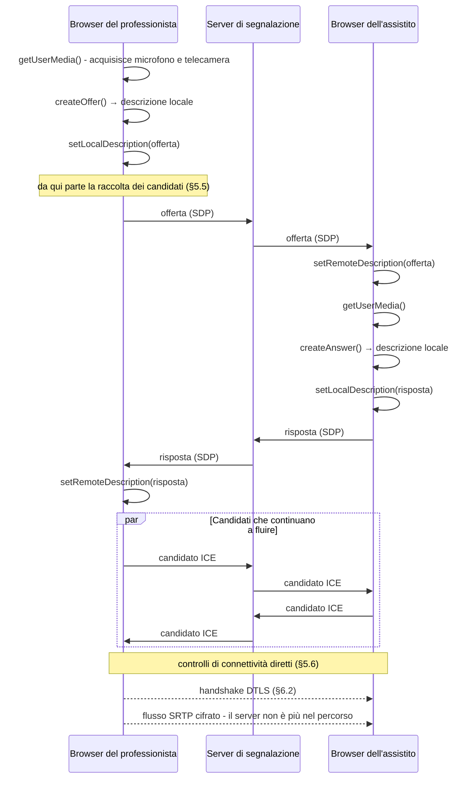
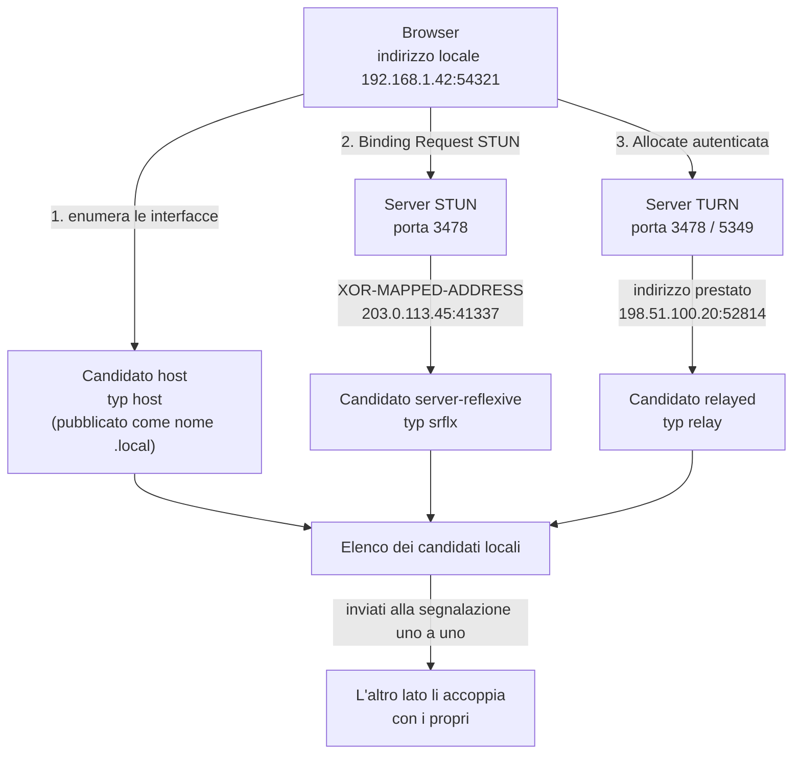
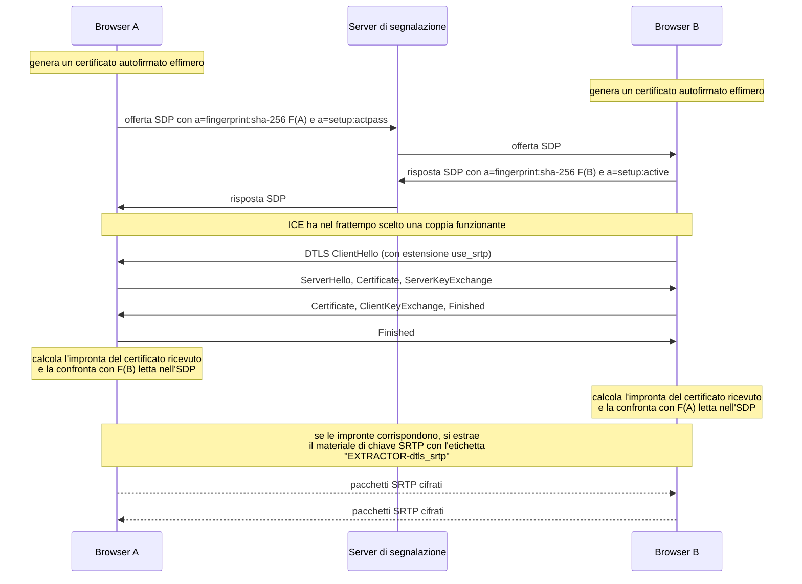
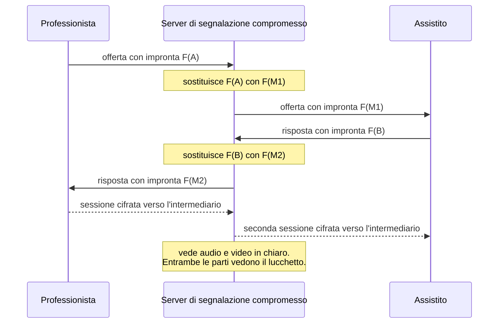
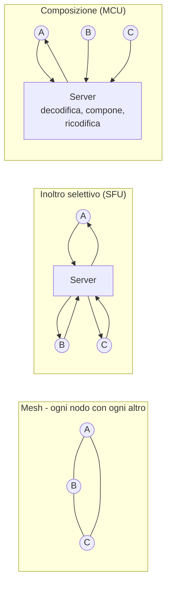

# WebRTC da zero

Questo è il modulo più tecnico della guida ed è anche quello che descrive la parte del
sistema in cui gli errori si pagano più cari: il trasporto del flusso audio e video fra il
professionista sanitario e l'assistito.

**Prerequisiti: sapere che cos'è un indirizzo IP.** Nient'altro. Ogni altro concetto di
rete - porta, protocollo di trasporto, traduzione degli indirizzi, cifratura del flusso -
viene costruito qui dentro, in ordine.

Il modulo procede in un ordine preciso e non è pensato per essere letto a salti nella prima
lettura: **prima il problema, poi le fondamenta di rete, poi lo standard, poi le scelte del
progetto.** Chi salta direttamente alla configurazione del server di relay finisce per
copiare righe di cui non conosce la ragione, ed è esattamente il modo in cui si introduce
una vulnerabilità in questa area.

Convenzioni: ogni affermazione tecnica cita il documento normativo con numero e sezione.
Ciò che non è stato verificato su fonte primaria è marcato `[NV]`. Tutti gli esempi
contengono esclusivamente dati sintetici e indirizzi di documentazione; **nessun segreto
reale compare in questa guida**, solo segnaposto di variabili d'ambiente.

Il modello di minaccia complessivo del sistema, gli obblighi di tracciamento e la gestione
dell'identità sono trattati nel [modulo su crittografia e sicurezza](12-crittografia-e-sicurezza.md); ogni
sigla e ogni termine introdotti qui sono ripresi nel
[glossario](./19-glossario.md).

---

## 1. Perché una videochiamata è un problema difficile

### 1.1 Il web è costruito su un'assunzione che qui non vale

Tutto ciò che sai del web poggia su una struttura asimmetrica: da una parte un **server**,
che ha un indirizzo pubblico stabile, sta acceso, aspetta; dall'altra un **client**, che
non ha bisogno di essere raggiungibile perché è sempre lui a iniziare la conversazione. Il
browser apre la connessione, chiede, riceve, chiude. Il server non chiama mai per primo.

In una videochiamata questa struttura non esiste. Ci sono due dispositivi, entrambi
**client**, entrambi dietro un router domestico o aziendale, entrambi **non raggiungibili
dall'esterno**, che devono scambiarsi un flusso continuo e bidirezionale. Nessuno dei due è
un server. Nessuno dei due, da solo, sa nemmeno qual è il proprio indirizzo così come lo
vede il resto di Internet.

Il problema, formulato senza gergo, è questo:

> Due macchine che non sanno il proprio indirizzo pubblico, che non possono ricevere
> connessioni non sollecitate, e che non hanno alcun canale di comunicazione diretto fra
> loro, devono stabilire un flusso audio e video continuo, cifrato, e abbastanza rapido da
> non rompere una conversazione umana.

Ognuno di questi cinque vincoli genera un pezzo dell'architettura che segue.

### 1.2 Il vincolo temporale è il più duro, e viene dalla fisiologia

La conversazione umana funziona a turni. Un parlante finisce la frase, l'altro comincia. Lo
scambio dei turni avviene su una scala di tempo che non è negoziabile perché non è tecnica:
è cognitiva. Quando il ritardo cresce, i due interlocutori cominciano a sovrapporsi, poi si
interrompono a vicenda, poi rallentano artificialmente per compensare, e infine la
conversazione perde naturalezza in un modo che le persone attribuiscono all'interlocutore e
non alla linea.

La Raccomandazione **ITU-T G.114** (*One-way transmission time*) è il documento che
quantifica questo fenomeno per la telefonia. Contenuti verificati:

- Un ritardo a senso unico fra **150 e 400 ms** è accettabile *«provided that
  Administrations are aware of the transmission time impact on the transmission quality of
  user applications»*.
- Oltre **400 ms** è considerato inaccettabile per la pianificazione generale di rete,
  salvo casi eccezionali.
- Avvertenza decisiva: i compiti **altamente interattivi** - *«many voice calls,
  interactive data applications, video conferencing»* - *«can be affected by much lower
  delays»*. Anche in assenza totale di eco, *«10% or more of the speakers may experience
  difficulty due to a delay of 400 ms»*.

La lettura corrente della tabella classica di G.114: **0–150 ms** accettabile per la
maggior parte delle applicazioni; **150–400 ms** accettabile purché si sappia cosa comporta;
oltre 400 ms la conversazione è compromessa.

In un consulto clinico questo non è un problema estetico. Un professionista che chiede
«sente dolore quando premo qui?» e riceve la risposta con mezzo secondo di ritardo non sa
se il ritardo è della linea o dell'assistito. Il ritardo diventa **rumore diagnostico**.

### 1.3 Perché TCP non basta

**TCP** (*Transmission Control Protocol*) è il protocollo di trasporto su cui poggiano il
web, la posta elettronica e quasi tutto il resto. Offre tre garanzie: i byte arrivano
tutti, arrivano nell'ordine in cui sono partiti, e non arrivano più in fretta di quanto la
rete regga.

Per un flusso in tempo reale, la prima e la seconda garanzia sono **dannose**.

Immagina un pacchetto che contiene 20 millisecondi di audio e che si perde per strada. TCP
se ne accorge, lo ritrasmette e - questo è il punto - **trattiene tutti i pacchetti
successivi già arrivati** finché il buco non è colmato, perché deve consegnarli in ordine.
Il fenomeno si chiama **head-of-line blocking** (blocco di testa coda). Il risultato è che
una singola perdita produce una pausa udibile lunga almeno un tempo di andata e ritorno, e
tutti i frammenti di audio arrivati nel frattempo vengono consegnati **in ritardo**, cioè
inutili.

Per il media in tempo reale la regola è rovesciata:

> **Un dato in ritardo è peggio di un dato perso.** Un frammento audio mancante si
> maschera; un frammento audio in ritardo occupa banda, ritarda tutto il resto e non serve
> comunque, perché il momento in cui andava riprodotto è passato.

Ci sono altre due ragioni.

**Il controllo di congestione di TCP è progettato per il throughput, non per la latenza.**
TCP riempie le code dei router intermedi finché non si perde qualcosa, poi rallenta. Le
code piene sono ritardo puro: è il fenomeno noto come *bufferbloat*. Un protocollo real-time
ha bisogno di accorgersi che la coda sta crescendo **prima** che i pacchetti si perdano,
cosa che TCP per costruzione non fa.

**Aprire una connessione TCP costa un round trip prima ancora di parlare** (il *three-way
handshake*), più uno o due per la cifratura. Su un percorso già lungo è tempo speso.

### 1.4 Perché HTTP non basta

**HTTP** (*HyperText Transfer Protocol*) aggiunge a TCP un modello a **richiesta e
risposta**: il client chiede, il server risponde. Anche nelle versioni che tengono la
connessione aperta, l'iniziativa resta del client. Il server non può inviare qualcosa a un
client che non ha chiesto nulla - e in una videochiamata l'altro interlocutore parla quando
vuole lui.

HTTP resta però **indispensabile** per un pezzo del problema: prima che i due dispositivi
possano parlarsi direttamente, devono **scambiarsi le informazioni necessarie a trovarsi**.
Quello scambio passa per un server che entrambi possono raggiungere, e quel server parla
HTTP (o WebSocket, che nasce da una richiesta HTTP). Torneremo su questo al §4: si chiama
**segnalazione**, ed è la parte che WebRTC deliberatamente **non** standardizza.

### 1.5 La quantità di dati

Un consulto video a definizione media produce, in modo continuo e in entrambe le direzioni,
un flusso dell'ordine del megabit al secondo. Non sono raffiche separate da pause come il
traffico web: è un rubinetto aperto per venti minuti. Questo cambia tre cose.

1. **La banda in salita conta più di quella in discesa.** Le linee domestiche italiane sono
   spesso asimmetriche: molta banda per scaricare, poca per caricare. Una videochiamata usa
   le due direzioni in modo simmetrico. Il collo di bottiglia è quasi sempre la salita.
2. **La rete cambia mentre la usi.** Un ascensore, un altro dispositivo che comincia a
   scaricare, una cella mobile che si congestiona: il flusso deve adattarsi in corsa, non
   scegliere una qualità all'inizio e tenerla.
3. **La CPU conta.** Comprimere video in tempo reale è costoso. Su uno smartphone di fascia
   bassa il limite non è la rete: è il processore e la batteria.

### 1.6 L'elenco dei problemi da risolvere

Riassumendo, prima di poter mostrare un solo fotogramma bisogna aver risolto:

| # | Problema | Dove viene affrontato |
|---|---|---|
| 1 | Ottenere audio e video dal dispositivo | §3.3 |
| 2 | Scoprire il proprio indirizzo pubblico | §5.2 |
| 3 | Attraversare la traduzione degli indirizzi su entrambi i lati | §5 |
| 4 | Scegliere il percorso migliore fra quelli possibili | §5.4 |
| 5 | Scambiarsi le capacità tecniche e le chiavi | §4 |
| 6 | Cifrare il flusso e autenticare l'interlocutore | §6 |
| 7 | Comprimere audio e video in modo compatibile fra i due lati | §7 |
| 8 | Adattarsi alla banda disponibile momento per momento | §8 |
| 9 | Recuperare o mascherare le perdite senza aggiungere ritardo | §8.4 |
| 10 | Misurare che tutto questo stia funzionando | §9 |

WebRTC risolve, direttamente o per rinvio ad altri standard, i punti da 1 a 10 **tranne il
punto 5**, che lascia all'applicazione. Questa singola eccezione è la ragione per cui il
progetto ha un server di segnalazione proprio, ed è anche il punto debole del modello di
sicurezza (§6.4).

---

## 2. Le fondamenta di rete che servono

### 2.1 Indirizzo, porta, socket, cinquina

Un **indirizzo IP** identifica un'interfaccia di rete. Da solo non basta: su una macchina
girano molti programmi, e il sistema operativo deve sapere a quale consegnare un pacchetto
che arriva. Serve un secondo numero, la **porta**, intero da 0 a 65535.

La coppia indirizzo + porta si chiama **endpoint**. Una comunicazione è identificata da una
**cinquina** (*five-tuple*): protocollo, indirizzo di origine, porta di origine, indirizzo
di destinazione, porta di destinazione. Questo concetto tornerà continuamente: la
traduzione degli indirizzi, il relay e le regole dei firewall ragionano tutti in termini di
cinquine.

Due fatti che servono più avanti:

- Gli indirizzi IPv4 pubblici sono esauriti. Per questo esistono gli **spazi privati**
  definiti da **RFC 1918** - `10.0.0.0/8`, `172.16.0.0/12`, `192.168.0.0/16` - che ogni rete
  domestica o aziendale usa internamente e che **non sono instradabili su Internet**.
- **IPv6** risolve il problema alla radice con uno spazio di indirizzi enormemente più
  ampio, ma la sua diffusione è disomogenea: un sistema che vuole funzionare ovunque deve
  gestire entrambe le famiglie di indirizzi, e il codice che confronta indirizzi IPv6 è
  storicamente la fonte di una intera famiglia di vulnerabilità (§11.4).

### 2.2 UDP contro TCP

**UDP** (*User Datagram Protocol*) è il protocollo di trasporto minimo: prende un blocco di
byte, gli mette davanti porta di origine, porta di destinazione, lunghezza e checksum, e lo
consegna alla rete. Nient'altro. Nessuna connessione, nessuna conferma, nessun ordine,
nessun controllo di congestione.

| Caratteristica | TCP | UDP |
|---|---|---|
| Connessione preliminare | sì (tre messaggi) | no |
| Consegna garantita | sì | no |
| Ordine garantito | sì | no |
| Ritrasmissione automatica | sì | no |
| Controllo di congestione | sì, integrato | **no: lo deve fare l'applicazione** |
| Blocco di testa coda | sì | no |
| Adatto al media in tempo reale | no | **sì** |

L'ultima riga della tabella è quella che conta: **UDP non fa nulla, ed è precisamente
questo che serve.** Un'applicazione real-time vuole decidere da sé cosa ritrasmettere, cosa
abbandonare e quanto rallentare. Su TCP quelle decisioni sono già state prese, male, dal
sistema operativo.

C'è però un prezzo, e va detto subito: **tutto ciò che TCP fa gratis, WebRTC deve rifarlo a
mano**, in una forma adatta al tempo reale. Il recupero delle perdite (§8.4), il controllo
della congestione (§8.3), l'ordinamento (il *jitter buffer*, §8.2) e persino la
verifica che il percorso sia ancora vivo (i *consent check* di ICE, §5.6) sono tutti
meccanismi che esistono perché sotto c'è UDP.

### 2.3 Che cos'è il NAT

**NAT** sta per *Network Address Translation*, traduzione degli indirizzi di rete. È ciò che
permette a decine di dispositivi di una casa o di un ospedale di condividere un solo
indirizzo IPv4 pubblico.

Il meccanismo, spogliato di ogni complicazione:

1. Un dispositivo interno con indirizzo privato `192.168.1.42` invia un pacchetto dalla
   porta `50000` verso un server pubblico.
2. Il router riscrive il pacchetto: origine `203.0.113.7:41337`, dove `203.0.113.7` è il suo
   unico indirizzo pubblico e `41337` una porta che sceglie lui.
3. Il router **annota in una tabella** la corrispondenza fra
   `192.168.1.42:50000` e `203.0.113.7:41337`.
4. Quando arriva una risposta verso `203.0.113.7:41337`, il router consulta la tabella e la
   inoltra a `192.168.1.42:50000`.

Tre conseguenze, tutte cruciali.

**Prima: il dispositivo interno non conosce il proprio indirizzo pubblico.** La riscrittura
avviene nel router; il dispositivo vede solo `192.168.1.42`. Se scrivesse quell'indirizzo
dentro un messaggio dicendo «contattami qui», sarebbe inutilizzabile dall'esterno. Da qui
nasce STUN (§5.2).

**Seconda: la voce nella tabella nasce solo per traffico uscente.** Un pacchetto che arriva
da fuori senza una voce corrispondente viene scartato: il router non sa a chi darlo. Ecco
perché nessuno dei due dispositivi è raggiungibile per primo.

**Terza: la voce nella tabella scade.** Se nessun pacchetto la attraversa per un certo
tempo, il router la cancella e la porta pubblica torna disponibile per altri. Da qui nasce
l'esigenza di traffico di mantenimento periodico.

### 2.4 I tipi di NAT, e perché quello «simmetrico» è il caso peggiore

Non tutti i NAT si comportano allo stesso modo. La terminologia corretta è quella di
**RFC 4787** (*NAT Behavioral Requirements for Unicast UDP*), che separa due comportamenti
indipendenti: come si crea la **corrispondenza** (*mapping*) e come si **filtra** il
traffico in ingresso.

**Comportamento della corrispondenza** - a parità di indirizzo e porta interni, la porta
pubblica assegnata è la stessa per tutte le destinazioni, oppure cambia?

| Comportamento (RFC 4787) | Descrizione | Nome colloquiale |
|---|---|---|
| **Endpoint-Independent Mapping** | Stessa porta pubblica verso qualunque destinazione | «cono» |
| **Address-Dependent Mapping** | Porta pubblica diversa per ogni indirizzo di destinazione | - |
| **Address and Port-Dependent Mapping** | Porta pubblica diversa per ogni coppia indirizzo+porta di destinazione | **«simmetrico»** |

**Comportamento del filtraggio** - chi può usare una corrispondenza già aperta per entrare?

| Comportamento | Descrizione |
|---|---|
| **Endpoint-Independent Filtering** | Chiunque, purché la corrispondenza esista |
| **Address-Dependent Filtering** | Solo l'indirizzo a cui si è già scritto |
| **Address and Port-Dependent Filtering** | Solo la coppia indirizzo+porta a cui si è già scritto |

RFC 4787 raccomanda l'*Endpoint-Independent Mapping* proprio perché è quello che rende
possibile l'attraversamento; ma la raccomandazione non è un obbligo e molte
apparecchiature non la rispettano.

**Perché il NAT a corrispondenza dipendente da indirizzo e porta rovina tutto.** La
strategia per attraversare un NAT è: chiedo a un server pubblico quale indirizzo e porta
vede arrivare da me, comunico quella coppia all'altro interlocutore, lui ci manda i
pacchetti. Funziona solo se **la porta pubblica che il router usa verso il server è la
stessa che userà verso l'interlocutore**. Con un NAT simmetrico non lo è: il router apre una
porta nuova per ogni destinazione, e la coppia scoperta interrogando il server è già
scaduta di significato nel momento in cui viene comunicata.

Se **entrambi** gli interlocutori sono dietro un NAT simmetrico, **nessun percorso diretto
è possibile**. Non c'è astuzia che tenga: serve un intermediario che riceva e reinoltri i
pacchetti. È il **relay**, ed è il motivo per cui esiste TURN (§5.3). **RFC 8835 §3.4** cita
esattamente questo scenario come motivazione dell'obbligo di supportare TURN.

### 2.5 CGNAT, cioè il NAT dell'operatore

Da alcuni anni gli operatori mobili - e in parte quelli fissi - non assegnano più un
indirizzo IPv4 pubblico a ciascun cliente. Applicano un secondo strato di traduzione dentro
la propria rete: è il **CGNAT** (*Carrier-Grade NAT*). Il cliente riceve un indirizzo dello
spazio riservato **`100.64.0.0/10`** definito da **RFC 6598**, che non è né privato in senso
RFC 1918 né pubblico.

Conseguenze pratiche per una televisita:

- Il dispositivo dell'assistito è dietro **due** livelli di traduzione: il proprio router e
  quello dell'operatore.
- Il comportamento del CGNAT è tipicamente il meno favorevole, perché deve massimizzare il
  riuso delle porte fra migliaia di clienti.
- **L'assistito tipico di una televisita è su rete mobile.** Non è un caso limite: è il caso
  centrale. Il vincolo D25 del progetto - progettare a partire dallo schermo piccolo e dalla
  connessione peggiore - è la traduzione organizzativa di questo fatto tecnico.

### 2.6 Firewall aziendali e ospedalieri

Il NAT non è l'unico ostacolo. Nelle reti gestite si aggiungono politiche esplicite:

- **UDP uscente bloccato del tutto.** È una configurazione comune nelle reti sanitarie e
  bancarie, motivata dalla difficoltà di ispezionare traffico senza connessione. Effetto:
  nessun percorso diretto, e neppure il relay funziona se parla solo UDP. Rimedio: il relay
  deve poter essere raggiunto anche su **TCP sulla porta 443 con TLS**, che è il traffico
  che nessuna rete blocca.
- **Solo le porte 80 e 443 in uscita.** Variante della precedente.
- **Proxy con ispezione del traffico cifrato.** Il proxy termina la sessione TLS e la
  riapre: funziona per il web, non per un flusso che deve restare cifrato punto a punto.
- **Isolamento dei client sui punti di accesso senza fili** (*client isolation*). Due
  dispositivi sulla stessa rete Wi-Fi non possono parlarsi direttamente. È attivo per
  impostazione predefinita su quasi tutte le reti Wi-Fi aziendali e ospedaliere.

L'ultimo punto produce un effetto controintuitivo che vale la pena fissare:

> **Il consulto in cui il professionista e l'assistito sono nello stesso edificio è spesso
> il più difficile da instradare**, non il più facile. Con l'isolamento dei client attivo, i
> due dispositivi non si vedono localmente e il traffico esce sulla rete pubblica per
> rientrare - quando non finisce direttamente sul relay.

### 2.7 L'offuscamento degli indirizzi locali

Un dettaglio che confonde chi guarda i registri per la prima volta. Per impedire alle pagine
web di raccogliere gli indirizzi IP privati degli utenti - un vettore reale di
riconoscimento del dispositivo - i browser **non pubblicano più gli indirizzi delle
interfacce locali**. Al loro posto pubblicano un nome nella forma
`<identificativo casuale>.local`, risolvibile solo sulla rete locale tramite **mDNS**
(*multicast DNS*, risoluzione dei nomi via messaggi multicast sulla porta UDP 5353).

Il documento che descrive la procedura è `draft-ietf-mmusic-mdns-ice-candidates`, un
**Internet-Draft scaduto** (pubblicato il 5 dicembre 2021, scaduto l'8 giugno 2022) **mai
diventato RFC**. È un caso in cui il comportamento è universale nei browser ma il documento
non è normativo: va detto così, senza spacciarlo per standard.

Tre conseguenze operative:

1. Se mDNS è bloccato - e lo è, di regola, sulle reti Wi-Fi con isolamento dei client - la
   coppia di percorsi locali non si forma e si finisce sul relay per una connessione che
   poteva restare su uno switch.
2. **I registri del server di segnalazione vedranno nomi `.local`, non indirizzi.** Ogni
   analisi di rete costruita su quegli indirizzi è inutile: le misure vanno prese dal
   browser (§9), non dai messaggi di segnalazione.
3. **Effetto collaterale positivo sulla riservatezza**: gli indirizzi privati dei
   dispositivi clinici non finiscono nei registri del progetto. È un elemento da valorizzare
   nella valutazione d'impatto sulla protezione dei dati, perché riduce la quantità di dati
   personali trattati.

---

## 3. Che cos'è WebRTC

### 3.1 Non è una specifica: sono due corpi normativi

**WebRTC** sta per *Web Real-Time Communication*. Non è un prodotto, non è una libreria, non
è un protocollo: è **l'insieme delle specifiche che un browser deve implementare** per
poter stabilire una sessione audio, video e dati in tempo reale con un altro browser.

Le specifiche vengono da due organismi diversi che si presuppongono a vicenda.

- Il **W3C** (*World Wide Web Consortium*) definisce **l'interfaccia di programmazione**
  esposta al codice JavaScript della pagina: *WebRTC: Real-Time Communication in Browsers*,
  **W3C Recommendation del 13 marzo 2025**. È una raccomandazione stabile che continua però
  a incorporare *candidate amendments*: la superficie dell'interfaccia non è congelata.
- L'**IETF** (*Internet Engineering Task Force*) definisce **i protocolli sul filo**, cioè
  che cosa viaggia effettivamente nei pacchetti. Il documento di coordinamento è
  **RFC 8825** - *Overview: Real-Time Protocols for Browser-Based Applications*.

RFC 8825 non definisce alcun protocollo: **elenca quali altre specifiche un'implementazione
deve rispettare** per potersi dire WebRTC. È un *applicability statement*, e la sua
struttura (§1–§12) copre il trasporto dati (§4), il framing e la messa in sicurezza (§5), i
formati (§6) e la gestione della connessione (§7).

La costellazione normativa IETF, con il ruolo di ciascun documento:

| RFC | Titolo | Che cosa stabilisce |
|---|---|---|
| **8825** | Overview: Real-Time Protocols for Browser-Based Applications | Punto di coordinamento; elenca gli altri |
| **8826** | Security Considerations for WebRTC | Modello di minaccia |
| **8827** | WebRTC Security Architecture | Requisiti crittografici e di identità |
| **8829** | JavaScript Session Establishment Protocol (JSEP) | Semantica di offerta e risposta lato interfaccia |
| **8831** | WebRTC Data Channels | Requisiti dei canali dati |
| **8832** | WebRTC Data Channel Establishment Protocol (DCEP) | Protocollo di apertura dei canali dati |
| **8834** | Media Transport and Use of RTP in WebRTC | Profilo RTP obbligatorio |
| **8835** | Transports for WebRTC | ICE, TURN, multiplazione, SCTP su DTLS |
| **8836** | Congestion Control Requirements for Interactive Real-Time Media | Requisiti, **non** l'algoritmo |
| **8837** | DSCP Packet Markings for WebRTC QoS | Marcature di priorità nei pacchetti |
| **8854** | WebRTC Forward Error Correction Requirements | Correzione d'errore audio e video |
| **8864** | Negotiation Data Channels Using SDP | Negoziazione dei canali dati |

> **Nota di correzione, perché l'errore è diffuso.** RFC 8826 e RFC 8827 vengono spesso
> citati invertiti. La numerazione corretta è: **8826 = Security Considerations**
> (le minacce), **8827 = Security Architecture** (l'architettura). Analogamente, non vanno
> più citati come riferimento vivo RFC 5245 (sostituito da **RFC 8445** per ICE), RFC 5389
> (sostituito da **RFC 8489** per STUN) e RFC 5766 (sostituito da **RFC 8656** per TURN, che
> obsoleta anche RFC 6156, cfr. RFC 8656 §24 e §25).

### 3.2 Che cosa WebRTC comprende

Tre famiglie di funzionalità, esposte da tre gruppi di interfacce.

**L'acquisizione del media.** Ottenere audio e video dai dispositivi dell'utente. Attenzione
a un punto che si sbaglia spesso: `MediaStream`, `MediaStreamTrack` e la funzione
`getUserMedia()` **non appartengono alla specifica WebRTC**. Sono definiti da *Media Capture
and Streams*, una specifica W3C distinta. Ne consegue che i vincoli su risoluzione, frequenza
dei fotogrammi e selezione del dispositivo (`MediaTrackConstraints`) sono governati da
quella specifica, non da WebRTC. È una distinzione che conta quando si scrivono requisiti
tracciabili.

**Il trasporto.** L'interfaccia centrale è `RTCPeerConnection`, che rappresenta la sessione
verso l'altro dispositivo. Attorno a essa: `RTCRtpSender`, `RTCRtpReceiver`,
`RTCRtpTransceiver` per i flussi, `RTCDtlsTransport` e `RTCIceTransport` per il trasporto
sottostante, `RTCCertificate` per il certificato di sessione.

**Il canale dati.** `RTCDataChannel` trasporta dati arbitrari fra i due dispositivi, con la
stessa cifratura e lo stesso percorso del media. Gira su **SCTP incapsulato in DTLS
incapsulato in ICE** - **RFC 8835 §3.5**: *«WebRTC endpoints MUST support SCTP over DTLS over
ICE»*, con l'estensione I-DATA di RFC 8260 obbligatoria. Per il progetto è il canale
naturale per i segnali di controllo in banda (silenziamento, richiesta di ripetizione), per
il trasporto dei sottotitoli (§10.4) e per qualunque metadato che **non deve transitare per
il server di segnalazione**.

La configurazione di una `RTCPeerConnection` ha esattamente sei membri:

```javascript
const pc = new RTCPeerConnection({
  iceServers: [/* elenco dei server STUN/TURN */],  // predefinito: []
  iceTransportPolicy: "all",     // "all" | "relay"
  bundlePolicy: "balanced",      // "balanced" | "max-compat" | "max-bundle"
  rtcpMuxPolicy: "require",      // "require"
  certificates: [],              // certificati riusabili
  iceCandidatePoolSize: 0,
});
```

Due membri hanno una rilevanza diretta per il progetto:

- **`iceTransportPolicy: "relay"`** scarta tutti i percorsi che non passano dal relay. È il
  modo canonico per **verificare in integrazione continua** che il percorso attraverso il
  relay funzioni (§13.4).
- **`certificates`** permette di riusare un certificato generato con
  `RTCPeerConnection.generateCertificate()`. Per impostazione predefinita il browser genera
  un certificato autofirmato effimero per ogni connessione - fatto che ha conseguenze dirette
  sul modello di sicurezza (§6.3).

### 3.3 Che cosa WebRTC NON comprende

**La segnalazione non è nello standard.** Non esiste un protocollo WebRTC per il modo in cui
i due dispositivi si scambiano le informazioni preliminari. Non è una dimenticanza: è una
scelta di progetto dichiarata.

**RFC 8829 (JSEP) §1.1** motiva così: *«different applications may prefer to use different
protocols, such as the existing SIP call signaling protocol, or something custom to the
particular application»*, e *«the JSEP implementation is almost entirely divorced from the
core signaling flow, which is instead handled by the JavaScript»*.

**RFC 8825** lo ribadisce dal lato architetturale: *«The choice of protocols for
client-server and inter-server signaling, and the definition of the translation between
them, are outside the scope of the WebRTC protocol suite described in this document.»*

WebRTC inoltre **non comprende**:

- **la gestione delle stanze**, degli inviti, delle rubriche, dello stato di presenza;
- **l'autenticazione degli utenti**: non sa chi sono le persone, sa solo che due
  connessioni si sono agganciate;
- **la registrazione della sessione** su file (esiste una specifica W3C distinta,
  *MediaStream Recording*, §12);
- **l'algoritmo di controllo della congestione**: RFC 8836 ne definisce i *requisiti*, e
  RFC 8834 afferma esplicitamente che *«at the time of this writing, there is no standard
  congestion control algorithm that can be used for interactive media applications such as
  WebRTC's flows»*;
- **la distribuzione a più di due partecipanti**: ogni `RTCPeerConnection` collega due
  estremità, punto. Le conferenze si costruiscono componendo più connessioni o introducendo
  un server (§10).

> **La conseguenza che va assorbita prima di ogni altra.** Poiché la segnalazione non è
> standardizzata, **non è nemmeno protetta dal protocollo**. L'intera catena di fiducia
> della cifratura del media dipende dall'integrità di un canale che WebRTC non specifica.
> Il server di segnalazione di Telemedic non è un componente accessorio: è **il punto di
> ancoraggio della fiducia dell'intera sessione**, e va progettato, documentato e sottoposto
> ad analisi delle minacce come tale. Se ne riparla per esteso al §6.4.

---

## 4. La segnalazione e il modello offerta/risposta

### 4.1 L'idea: due descrizioni che si incontrano

Prima di poter scambiare un solo fotogramma, i due dispositivi devono accordarsi su una
lunga lista di cose: quali codec sanno usare, con quali parametri, chi manda e chi riceve,
quali indirizzi provare, quali chiavi usare. Il modello che regola questo accordo è
**offerta e risposta** (*offer/answer*), definito da **RFC 3264** - *An Offer/Answer Model
with the Session Description Protocol*.

Il meccanismo è asimmetrico e semplice:

1. Un lato - **l'offerente** - produce una descrizione che elenca tutto ciò che **sa e
   vuole** fare.
2. L'altro lato - **il rispondente** - riceve quella descrizione e produce una risposta che,
   voce per voce, **accetta, restringe o rifiuta**. Non può aggiungere nulla che non fosse
   nell'offerta.
3. Entrambi applicano localmente le due descrizioni. A quel punto sanno esattamente cosa
   faranno.

Il formato di quelle descrizioni è **SDP** (*Session Description Protocol*), definito da
**RFC 8866**, che obsoleta RFC 4566.

### 4.2 La macchina a stati, e chi la muove

**RFC 8829 (JSEP)** definisce come tutto questo appare al codice JavaScript. Il browser
espone una macchina a stati (§3.2, Figura 2) con gli stati `stable`, `have-local-offer`,
`have-remote-offer`, `have-local-pranswer`, `have-remote-pranswer`, `closed`, e quattro
metodi che la muovono: `createOffer()` (§4.1.8), `createAnswer()` (§4.1.9),
`setLocalDescription()` (§4.1.11), `setRemoteDescription()` (§4.1.12), con il ritorno allo
stato precedente descritto in §4.1.10.2.

**Il browser produce e consuma i blocchi SDP. Il trasporto di quei blocchi è interamente
responsabilità dell'applicazione.** Nel progetto quel trasporto è una connessione WebSocket
verso il server di segnalazione.



Due osservazioni sul diagramma, entrambe importanti:

- **Il server di segnalazione esce dal percorso una volta stabilita la sessione.** Il media
  non lo attraversa mai. Se il server cade a chiamata avviata, il flusso **prosegue**; ciò
  che si perde è la possibilità di rinegoziare, di scambiare nuovi candidati e di chiudere
  in modo ordinato.
- **I candidati continuano a fluire dopo l'offerta.** Questo si chiama *trickle* ed è
  trattato al §5.7.

### 4.3 Un SDP reale, commentato riga per riga

Quello che segue è un esempio realistico e **sintetico** di offerta prodotta da un browser
per una sessione con audio e video. È stato accorciato dove la ripetizione non aggiunge
nulla, ed è commentato integralmente. Non contiene alcun dato reale.

```sdp
v=0
o=- 4611731400430051336 2 IN IP4 127.0.0.1
s=-
t=0 0
a=group:BUNDLE 0 1
a=extmap-allow-mixed
a=msid-semantic: WMS 6f1b2c3d-0000-4000-8000-000000000001
```

- **`v=0`** - versione del formato SDP. È sempre `0`; non è mai cambiata (RFC 8866 §5.1).
- **`o=`** - riga di origine: nome utente (`-`, cioè assente), identificativo di sessione,
  numero di versione della sessione, tipo di rete, tipo di indirizzo, indirizzo. **Il
  `127.0.0.1` non è un errore**: nel contesto WebRTC questa riga non è usata per instradare
  nulla, e i browser vi scrivono un valore segnaposto. Non provare a dedurne l'indirizzo
  dell'interlocutore.
- **`s=-`** - nome della sessione, assente.
- **`t=0 0`** - tempo di inizio e fine: zero e zero significa «sessione permanente, senza
  orario».
- **`a=group:BUNDLE 0 1`** - dichiara che le sezioni identificate da `0` e `1` (audio e
  video) viaggeranno **sulla stessa connessione**. È il meccanismo BUNDLE di **RFC 8843**
  §5. Il primo identificativo del gruppo è il *BUNDLE-tag* dell'offerente e la sua sezione
  porta indirizzo e porta usati per tutto il gruppo (§2).
- **`a=extmap-allow-mixed`** - consente di mescolare le due forme di estensione
  dell'intestazione RTP (una e due byte) definite da RFC 8285.
- **`a=msid-semantic`** - dichiara la semantica degli identificativi dei flussi media.

> **Perché BUNDLE è un fatto architetturale e non un dettaglio.** BUNDLE **richiede** la
> multiplazione di RTP e RTCP sulla stessa porta all'interno del gruppo (RFC 8843 §9.3) e
> comporta **un solo trasporto ICE e una sola associazione DTLS** per l'intero gruppo
> (§10–§11). In pratica: audio, video e canale dati condividono **una** porta, **un**
> handshake di cifratura, **una** allocazione sul relay. Tutto il dimensionamento del server
> di relay (§11.6) poggia su questo.

Segue la sezione audio.

```sdp
m=audio 9 UDP/TLS/RTP/SAVPF 111 63 9 0 8 110 126
c=IN IP4 0.0.0.0
a=rtcp:9 IN IP4 0.0.0.0
```

- **`m=audio`** - apre una *sezione media*. `9` è la porta: è un **segnaposto** convenzionale
  (la porta reale arriva dai candidati ICE, §5.1); il valore `0` avrebbe invece il
  significato normativo di «questa sezione è rifiutata» (RFC 3264).
- **`UDP/TLS/RTP/SAVPF`** - il profilo di trasporto. Si legge da destra: **AVPF** è il
  profilo RTP con retroazione audiovisiva (RFC 4585), la **S** iniziale sta per *secure*
  (SRTP), il tutto incapsulato in TLS su UDP. **RFC 8834** è categorico: *«WebRTC endpoints
  MUST NOT send packets using the basic RTP/AVP profile or the RTP/AVPF profile; they MUST
  employ the full RTP/SAVPF profile»*. **Non esiste WebRTC in chiaro.**
- **`111 63 9 0 8 110 126`** - l'elenco dei *payload type*, cioè i codec offerti, **in ordine
  di preferenza decrescente**. Sono numeri; il significato di ciascuno è definito più sotto
  dalle righe `a=rtpmap`.
- **`c=IN IP4 0.0.0.0`** - indirizzo di connessione, anch'esso segnaposto.
- **`a=rtcp:9`** - porta per il canale di controllo, ugualmente segnaposto.

```sdp
a=ice-ufrag:4ZcD
a=ice-pwd:by0Bp1IFDpZ0Y0Bx0j0RB4dR
a=ice-options:trickle
```

- **`a=ice-ufrag`** e **`a=ice-pwd`** - nome utente frammentario e password per i controlli
  di connettività ICE. Sintassi definita da **RFC 8839 §5.4**: da 4 a 256 caratteri per il
  primo, da 22 a 256 per la seconda. **Servono a due cose insieme**: identificare a quale
  sessione appartiene un pacchetto di controllo che arriva, e autenticarlo. Cambiarli è ciò
  che costituisce un **riavvio di ICE** (§5.8).
- **`a=ice-options:trickle`** - dichiara che l'agente sa gestire i candidati che arrivano
  dopo l'offerta (RFC 8838 §3; l'opzione è registrata in §19).

```sdp
a=fingerprint:sha-256 8F:2B:C1:44:9A:D0:7E:5B:03:6C:E2:11:AF:58:90:7D:
 22:64:B8:0E:F3:19:AC:47:D5:6A:12:38:CB:70:E4:95
a=setup:actpass
a=mid:0
a=sendrecv
a=rtcp-mux
```

- **`a=fingerprint`** - **questa riga è il cardine dell'intero modello di sicurezza.**
  Contiene l'impronta crittografica (qui SHA-256) del certificato che questo lato userà
  nell'handshake DTLS. Sintassi definita da **RFC 8122 §5**. È la riga che lega la sessione
  segnalata alla sessione cifrata: ci torniamo al §6.3.
- **`a=setup:actpass`** - chi farà il client e chi il server nell'handshake DTLS.
  **RFC 8842** definisce i valori `actpass`, `active`, `passive`, `holdconn`. L'offerente
  dichiara `actpass` («decidi tu»); il rispondente sceglie e dichiara `active` o `passive`.
- **`a=mid:0`** - l'identificativo di questa sezione, quello richiamato in
  `a=group:BUNDLE 0 1`.
- **`a=sendrecv`** - questa sezione invia **e** riceve. Le alternative sono `sendonly`,
  `recvonly`, `inactive`. In un consulto ordinario è `sendrecv` su entrambi i lati.
- **`a=rtcp-mux`** - dati e controllo sulla stessa porta (RFC 5761). Obbligatorio dentro un
  gruppo BUNDLE.

```sdp
a=rtpmap:111 opus/48000/2
a=rtcp-fb:111 transport-cc
a=fmtp:111 minptime=10;useinbandfec=1
a=rtpmap:63 red/48000/2
a=fmtp:63 111/111
a=rtpmap:0 PCMU/8000
a=rtpmap:8 PCMA/8000
```

- **`a=rtpmap:111 opus/48000/2`** - il payload type `111` è **Opus**, con frequenza di
  campionamento 48000 Hz e due canali. **RFC 7587** impone che questi due valori siano
  **sempre `48000/2`**, indipendentemente dal contenuto reale: il `/2` indica la *capacità*
  di trasportare stereo, non che il flusso sia stereo.
- **`a=rtcp-fb:111 transport-cc`** - dichiara di volere la retroazione di controllo della
  congestione a livello di trasporto (§8.3).
- **`a=fmtp:111 ...`** - parametri specifici del formato. `useinbandfec=1` attiva la
  correzione d'errore incorporata in Opus (RFC 7587 §6.1), **raccomandata da RFC 8854 §4.1**.
  Nota di precisione: **`minptime` non è definito da RFC 7587** benché compaia negli SDP
  generati da molte implementazioni; è un parametro fuori specifica e non va citato come
  standard.
- **`a=rtpmap:63 red/48000/2`** e **`a=fmtp:63 111/111`** - codifica ridondante (RFC 2198):
  ogni pacchetto porta anche una copia del precedente. `111/111` dichiara che sia il blocco
  primario sia quello ridondante sono Opus.
- **`a=rtpmap:0 PCMU/8000`** e **`a=rtpmap:8 PCMA/8000`** - **G.711** nelle sue due varianti
  (legge µ e legge A). Sono i codec del telefono: qualità limitata a banda stretta, ma
  presenti ovunque e necessari per interoperare con apparati non-browser. **RFC 7874** li
  rende obbligatori insieme a Opus.

Segue la sezione video, con la stessa struttura.

```sdp
m=video 9 UDP/TLS/RTP/SAVPF 96 97 102 103 45 46
c=IN IP4 0.0.0.0
a=ice-ufrag:4ZcD
a=ice-pwd:by0Bp1IFDpZ0Y0Bx0j0RB4dR
a=fingerprint:sha-256 8F:2B:C1:44:9A:D0:7E:5B:03:6C:E2:11:AF:58:90:7D:
 22:64:B8:0E:F3:19:AC:47:D5:6A:12:38:CB:70:E4:95
a=setup:actpass
a=mid:1
a=sendrecv
a=rtcp-mux
a=rtpmap:96 VP8/90000
a=rtcp-fb:96 goog-remb
a=rtcp-fb:96 transport-cc
a=rtcp-fb:96 ccm fir
a=rtcp-fb:96 nack
a=rtcp-fb:96 nack pli
a=rtpmap:97 rtx/90000
a=fmtp:97 apt=96
a=rtpmap:102 H264/90000
a=fmtp:102 level-asymmetry-allowed=1;packetization-mode=1;profile-level-id=42001f
a=rtpmap:45 AV1/90000
```

- **`a=ice-ufrag` e `a=fingerprint` sono ripetuti identici** rispetto alla sezione audio:
  è la firma di BUNDLE. Una sola credenziale ICE, un solo certificato, una sola connessione.
- **`a=rtpmap:96 VP8/90000`** - VP8. La frequenza di riferimento del video in RTP è sempre
  90000 Hz, per convenzione storica.
- **Le quattro righe `a=rtcp-fb`** dichiarano i meccanismi di recupero che questo lato sa
  usare (§8.4): `nack` per chiedere la ritrasmissione di un pacchetto (RFC 4585), `nack pli`
  per segnalare la perdita di un'immagine, `ccm fir` per chiedere un fotogramma completo
  (RFC 5104), `transport-cc` per la retroazione di congestione. `goog-remb` è un meccanismo
  precedente, ormai residuale.
- **`a=rtpmap:97 rtx/90000` con `a=fmtp:97 apt=96`** - il flusso di **ritrasmissione**
  (RFC 4588) associato al payload type `96`. Le ritrasmissioni viaggiano su un flusso
  separato per non alterare la numerazione del flusso principale.
- **`a=rtpmap:102 H264/90000` con il suo `fmtp`** - H.264. `profile-level-id=42001f`
  identifica **Constrained Baseline Profile Level 3.1**; `packetization-mode=1` è la modalità
  di impacchettamento che **RFC 7742 §6.2** dichiara obbligatoria (*«Packetization-mode 1
  MUST be supported»*).
- **`a=rtpmap:45 AV1/90000`** - AV1, quando il browser lo supporta.

Chiudono la sezione le righe che identificano il flusso:

```sdp
a=ssrc:3735928559 cname:Zt9x0PqLmN1sVe4K
a=ssrc:3735928559 msid:6f1b2c3d-0000-4000-8000-000000000001 video-track-0
```

- **`a=ssrc`** - il *synchronization source*, identificativo numerico del flusso RTP.
- **`cname`** - nome canonico che lega fra loro i flussi appartenenti alla stessa
  provenienza (RFC 3550), necessario per sincronizzare audio e video.

> **Regola operativa per il progetto.** L'SDP contiene, in chiaro, informazioni sensibili:
> le impronte dei certificati, le credenziali ICE, gli identificativi dei flussi e - quando
> l'offuscamento mDNS non si applica - indirizzi di rete. **L'SDP completo non va registrato
> nei log applicativi.** Nell'audit vanno registrati l'esito della negoziazione, i codec
> effettivamente selezionati e le impronte, come prova documentale; non il blocco integrale.

### 4.4 La collisione delle offerte

Se entrambi i lati decidono di rinegoziare nello stesso istante - succede davvero: il
professionista attiva la condivisione dello schermo mentre l'assistito riattiva la
telecamera - si produce una **collisione** (*glare*): entrambi entrano nello stato
`have-local-offer` e nessuno dei due può applicare l'offerta dell'altro.

La soluzione canonica assegna a uno dei due il ruolo di **cortese** (*polite*) e all'altro
quello di **scortese** (*impolite*). In caso di collisione, il cortese annulla la propria
offerta e accetta quella dell'altro; lo scortese ignora l'offerta ricevuta e tiene la
propria. Il pattern si chiama **negoziazione perfetta** ed è fondato su
`setLocalDescription()` chiamato **senza argomenti** (che sceglie da sé se produrre
un'offerta o una risposta, in base allo stato) e sull'annullamento implicito operato da
`setRemoteDescription()`.

Tre regole che il progetto adotta:

1. **Il ruolo è assegnato dal server di segnalazione, non negoziato dai client.** Nel
   progetto: **cortese l'assistito, scortese il professionista**. Motivazione clinica, non
   tecnica: in caso di collisione prevale la configurazione voluta da chi conduce il
   consulto.
2. **Si testa la variabile applicativa «sto producendo un'offerta», non `signalingState`**,
   perché quest'ultimo è aggiornato in modo asincrono e la finestra di corsa esiste davvero.
3. Con più di due partecipanti (§10.2) il ruolo si assegna con una regola deterministica e
   priva di ambiguità: ordinamento lessicografico degli identificativi di partecipante.

### 4.5 Il trasporto della segnalazione, e un requisito che si dimentica

Il progetto trasporta la segnalazione su **WebSocket** (RFC 6455) con un protocollo
applicativo JSON versionato e validato a schema. Le alternative - livelli di messaggistica
sovrastanti, ripieghi su trasporti HTTP multi-richiesta, o l'adozione di un protocollo di
telefonia - aggiungono complessità o vincoli di affinità di sessione senza beneficio in una
sessione a due.

C'è un requisito normativo che va rispettato e che si scopre tardi se non lo si legge prima.
**RFC 8838 §9** stabilisce che il protocollo che trasporta i candidati deve consegnarli
*«exactly once and in the same order it was conveyed»*. Tradotto: la coda dei candidati per
ciascuna sessione deve essere **ordinata e affidabile**. Un meccanismo di diffusione
«pubblica e dimentica» fra più nodi del server non lo garantisce, e il difetto che ne
deriva è intermittente e difficilissimo da diagnosticare. La scelta di come distribuire lo
stato di sessione fra più nodi è quindi vincolata da questa riga di RFC, e va registrata
come decisione architetturale.

---

## 5. ICE, STUN e TURN: come i due dispositivi si trovano

### 5.1 L'idea di ICE: non scegliere, provare tutto

**ICE** sta per *Interactive Connectivity Establishment* ed è definito da **RFC 8445**, che
sostituisce RFC 5245. Il profilo che descrive come ICE si esprime dentro l'SDP è
**RFC 8839**.

L'intuizione di ICE è di una semplicità disarmante e va capita bene, perché tutto il resto
ne discende:

> Poiché nessuno può sapere in anticipo quale percorso funzionerà - dipende da due NAT, due
> firewall, due operatori e dalla fortuna - **non si sceglie: si raccolgono tutti i percorsi
> plausibili, si provano tutti contemporaneamente, e si tiene quello che funziona meglio.**

Ogni percorso plausibile parte da un **candidato**: una coppia indirizzo/porta a cui questo
dispositivo può, in qualche modo, essere raggiunto. In SDP un candidato ha questa forma
(sintassi di RFC 8839 §5.1):

```
a=candidate:<foundation> <component-id> <transport> <priority> <indirizzo> <porta> typ <tipo> [raddr <indirizzo-relativo>] [rport <porta-relativa>]
```

Esempi realistici e sintetici:

```sdp
a=candidate:1 1 udp 2122260223 8b7c1e4a-0000-4000-8000-000000000001.local 54321 typ host generation 0
a=candidate:2 1 udp 1686052607 203.0.113.45 41337 typ srflx raddr 0.0.0.0 rport 0 generation 0
a=candidate:3 1 udp 41885439 198.51.100.20 52814 typ relay raddr 203.0.113.45 rport 41337 generation 0
```

Si leggono così: il primo è un indirizzo locale (offuscato in `.local`, §2.7); il secondo è
l'indirizzo pubblico visto da fuori; il terzo è un indirizzo prestato da un server di relay.

### 5.2 I quattro tipi di candidato

Definizioni verbatim da **RFC 8445 §2.1** e §4:

| Tipo | Definizione (RFC 8445) | Sigla SDP | Chi lo fornisce |
|---|---|---|---|
| **Host** | *«A candidate obtained by binding to a specific port from an IP address on the host.»* | `host` | Il sistema operativo |
| **Server-reflexive** | *«A candidate whose IP address and port are a binding allocated by a NAT for an ICE agent after it sends a packet through the NAT to a server, such as a STUN server.»* | `srflx` | Un server STUN |
| **Peer-reflexive** | *«…after it sends a packet through the NAT to its peer.»* | `prflx` | Si scopre durante i controlli |
| **Relayed** | *«A candidate obtained from a relay server, such as a TURN server.»* | `relay` | Un server TURN |

In italiano piano:

- **Host**: «questo è il mio indirizzo sulla rete locale». Funziona se i due dispositivi
  sono sulla stessa rete e l'isolamento dei client non lo impedisce.
- **Server-reflexive**: «questo è l'indirizzo con cui il mondo mi vede». Lo si scopre
  chiedendolo a un server esterno. Funziona se il NAT ha corrispondenza indipendente dalla
  destinazione (§2.4).
- **Peer-reflexive**: un indirizzo che nessuno aveva previsto e che emerge perché un
  pacchetto di controllo è arrivato da lì. Non si annuncia: si scopre.
- **Relayed**: «mandami i pacchetti a questo indirizzo, che è di un server che poi me li
  gira». È l'ultima risorsa, e costa (§5.9).

### 5.3 STUN e TURN: due protocolli, un server

**STUN** (*Session Traversal Utilities for NAT*, **RFC 8489**, obsoleta RFC 5389) è il
protocollo con cui si chiede a un server esterno: «che indirizzo e che porta vedi arrivare
da me?». Il server risponde con l'attributo **`XOR-MAPPED-ADDRESS`**. Da qui esce il
candidato *server-reflexive*.

STUN fornisce anche il meccanismo di autenticazione (a credenziale a lungo termine) che TURN
riusa, gli attributi di integrità `MESSAGE-INTEGRITY` (HMAC-SHA1) e
`MESSAGE-INTEGRITY-SHA256`, e l'attributo `FINGERPRINT` (CRC-32 con XOR `0x5354554e`).

> Il `FINGERPRINT` non è un dettaglio: è ciò che permette di distinguere, **sulla stessa
> porta UDP**, un pacchetto STUN da un pacchetto DTLS da un pacchetto SRTP. La disciplina è
> codificata in **RFC 7983**, aggiornata da **RFC 9443**. È il motivo tecnico per cui BUNDLE
> e la multiplazione RTP/RTCP possono convivere su un'unica porta.

**TURN** (*Traversal Using Relays around NAT*, **RFC 8656**, obsoleta RFC 5766 e RFC 6156) è
il protocollo con cui si chiede a un server: «prestami un indirizzo tuo, ricevi lì i
pacchetti destinati a me e giramerli». Elementi verificati della struttura:

- **Allocazione** (§6, §7): il server riserva un indirizzo e una porta per quel client, con
  una scadenza. È la risorsa costosa.
- **Permesso** (§9, §10): l'allocazione accetta traffico **solo dagli indirizzi IP
  esplicitamente autorizzati** dal client con `CreatePermission`. Durata **5 minuti**,
  rinnovabile. Il permesso è **per indirizzo, non per porta**.
- **Legame di canale** (§12): associa un numero di canale a un indirizzo, riducendo
  l'intestazione di ogni pacchetto a soli **4 byte** anziché l'intestazione STUN completa.
  Durata **10 minuti**.
- **Indicazioni Send/Data** (§11): la modalità più costosa, con circa 36 byte di
  intestazione per pacchetto.
- **Trasporti fra client e server** (§3.1): UDP, TCP, TLS su TCP, DTLS su UDP. **Il relay
  verso l'interlocutore resta UDP** in questa specifica.

Nella pratica **lo stesso server risponde a entrambi i protocolli**, sulla stessa porta.
Quando si dice «server STUN/TURN» si parla di un solo processo.

### 5.4 La raccolta dei candidati, illustrata



Il browser esegue i tre passi **in parallelo** e per **ciascuna** interfaccia di rete
disponibile: una macchina con Wi-Fi e cavo produce candidati per entrambe, e uno smartphone
con Wi-Fi e rete mobile pure. Sono facilmente sei o otto candidati per lato.

### 5.5 Priorità, accoppiamento e controlli

**La priorità di un candidato** si calcola con la formula di **RFC 8445 §5.1.2.1**:

```
priorità = (2^24) × (preferenza di tipo)
         + (2^8)  × (preferenza locale)
         + (2^0)  × (256 − identificativo di componente)
```

I valori raccomandati per la *preferenza di tipo* sono: **host = 126, peer-reflexive = 110,
server-reflexive = 100, relayed = 0**.

> **Quello zero è il fatto architetturale più importante di tutto il paragrafo.** Il relay
> ha la priorità più bassa possibile: **ICE lo usa solo se nient'altro funziona**. Ne
> discende una precisazione che il progetto deve fare nella propria comunicazione: il
> «ripiego sul relay quando la connessione diretta fallisce» **non è una funzionalità
> implementata da Telemedic**, è il comportamento nativo di ICE. La funzionalità reale del
> progetto è *fornire credenziali valide per un relay affidabile*, non «implementare il
> ripiego».

La **fondazione** (*foundation*, §4 e §5.1.1.3) è un'etichetta condivisa dai candidati che
hanno stesso tipo, stesso indirizzo di base, stesso server e stesso trasporto. Serve al
cosiddetto *algoritmo di congelamento*: si sblocca un solo candidato per fondazione alla
volta, per non saturare la rete di controlli simultanei.

**L'accoppiamento.** Ricevuti i candidati dell'altro lato, ciascun agente costruisce una
**lista di controllo** (§6.1.2) accoppiando ogni candidato locale con ogni candidato remoto
della stessa componente e della stessa famiglia di indirizzi. Le coppie si ordinano per
priorità, si eliminano quelle ridondanti, e la lista è **limitata per impostazione
predefinita a 100 coppie**. Gli indirizzi IPv6 locali al collegamento si accoppiano solo
fra loro.

La priorità di una coppia (§6.1.2.3):

```
priorità della coppia = 2^32 × MIN(G,D) + 2 × MAX(G,D) + (G > D ? 1 : 0)
```

dove `G` è la priorità del candidato dell'agente **controllante** e `D` quella dell'agente
**controllato**.

**I controlli di connettività.** Per ogni coppia, l'agente invia una richiesta STUN Binding
verso il candidato remoto, autenticata con le credenziali `ice-ufrag`/`ice-pwd` scambiate
nell'SDP. Se torna una risposta valida, la coppia funziona. Gli stati di una coppia (§6.1.2.6)
sono `Frozen`, `Waiting`, `In-Progress`, `Succeeded`, `Failed`; quelli della lista (§6.1.2.1)
`Running`, `Completed`, `Failed`.

Il controllo di connettività ha un effetto secondario prezioso: **apre il passaggio nel NAT
in entrambe le direzioni**. Mentre A prova a raggiungere B, il pacchetto uscente crea nel
NAT di A la voce che permetterà al pacchetto di B di entrare. È il meccanismo noto come
*hole punching*, e i candidati *peer-reflexive* nascono esattamente qui.

**La nomina.** Quando una coppia funziona, l'agente controllante la designa come definitiva
inviando una richiesta STUN con l'attributo **`USE-CANDIDATE`**. RFC 8445 §2.3 e §4
specificano la sola **nomina regolare**; la *nomina aggressiva* di RFC 5245 è **deprecata**.
Se in prova di interoperabilità si osserva un cambio di percorso a metà negoziazione, è
quasi sempre un'implementazione datata che la usa ancora.

**I ruoli** (§6.1.1): fra due agenti completi è controllante chi ha iniziato. Esiste una
modalità ridotta, **ICE-lite** (§2.5, §5.2), in cui l'agente usa solo candidati locali e non
esegue controlli: è il modello di un server con indirizzo pubblico. **RFC 8835 §3.4 la vieta
esplicitamente ai browser**: *«The implementation MUST be a full ICE implementation, not
ICE-Lite.»*

### 5.6 Mantenere viva la connessione

Stabilita la coppia, il lavoro di ICE non finisce. Due meccanismi restano attivi:

- **Il mantenimento delle voci nel NAT.** Le tabelle di traduzione scadono (§2.3): serve
  traffico periodico. Con il media in corso il traffico c'è già; nei momenti di silenzio,
  no.
- **I controlli di consenso.** L'agente continua a inviare richieste periodiche per
  verificare che l'altro lato sia ancora lì e ancora d'accordo a ricevere. Se smettono di
  ricevere risposta, il percorso è dichiarato fallito. È il meccanismo che permette al
  browser di accorgersi che la rete è caduta **prima** che l'utente lo noti dal video
  congelato. La statistica corrispondente si chiama `consentRequestsSent` (§9.2).

### 5.7 Trickle ICE: partire prima di aver finito

Senza accorgimenti, l'offerta non può partire finché la raccolta dei candidati non è
completa: bisognerebbe aspettare la risposta più lenta fra STUN e TURN, cioè centinaia di
millisecondi o secondi. Su una televisita quel tempo è tutto tempo in cui l'assistito guarda
una schermata di attesa e si chiede se ha sbagliato qualcosa.

**RFC 8838** (*Trickle ICE*, Standards Track, gennaio 2021) risolve il problema: l'offerta
parte subito con i candidati che si hanno, e gli altri fluiscono man mano. Regole verificate:

- **§9** - dopo aver scoperto un candidato l'agente ne verifica la ridondanza e lo invia; il
  trasporto **deve** consegnare i candidati *«exactly once and in the same order it was
  conveyed»* (già discusso al §4.5).
- **§10** - *«A Trickle ICE agent MUST NOT pair a local candidate until it has been trickled
  to the remote party»*.
- **§13** - esiste un'indicazione esplicita di **fine dei candidati**, che **deve**
  specificare a quale generazione appartiene (la coppia `ufrag`/`pwd`). Dopo averla inviata
  non si possono inviare altri candidati di quella generazione.
- **§16** - **mezzo trickle**: l'iniziatore raccoglie una generazione completa prima
  dell'offerta iniziale e solo il rispondente usa il trickle. È il ripiego per interoperare
  con agenti che non lo supportano.

Nel browser il segnale di fine raccolta è l'evento con candidato nullo, oppure lo stato di
raccolta `complete`. **La traduzione di quel segnale nell'indicazione formale di fine
candidati è a carico dell'applicazione**, cioè del protocollo di segnalazione del progetto.

### 5.8 Il riavvio di ICE

Quando la rete cambia sotto i piedi - l'assistito passa dal Wi-Fi alla rete mobile uscendo
di casa, oppure l'indirizzo pubblico cambia - i candidati raccolti diventano obsoleti e la
connessione muore. Il **riavvio di ICE** è la procedura che rifà la raccolta e la selezione
**senza rifare la sessione**: si generano nuovi `ice-ufrag` e `ice-pwd`, si rinegozia, e la
nuova coppia sostituisce la vecchia.

Due cose che vanno fissate perché vengono confuse continuamente:

1. **Il riavvio di ICE NON rifà l'handshake DTLS.** Cambia il percorso di rete; le chiavi di
   cifratura restano quelle. Non è una rotazione delle chiavi (§6.5).
2. **Il riavvio di ICE richiede la segnalazione.** Se il server di segnalazione è
   irraggiungibile in quel momento, il riavvio non può avvenire e la chiamata cade. È la
   ragione per cui la resilienza della connessione WebSocket è un requisito di continuità
   clinica, non un dettaglio infrastrutturale.

### 5.9 Quando serve il relay, e perché costa

Il relay serve quando nessuna coppia diretta funziona. Gli scenari, in ordine di frequenza
reale in Italia:

1. **Entrambi i lati dietro NAT con corrispondenza dipendente da indirizzo e porta** (§2.4).
   Tipico con CGNAT mobile su un lato e rete aziendale sull'altro.
2. **UDP bloccato in uscita** su una delle due reti (§2.6). Qui serve il relay **su TCP/TLS
   sulla porta 443**, l'unico che passa.
3. **Isolamento dei client** che impedisce anche il percorso locale (§2.6).

**Perché costa.** Il relay non è un instradatore: **riceve ogni pacchetto e lo rispedisce**.
Per una sessione con bitrate `B` per direzione, con **una sola** allocazione di relay:

- flusso A→B: il relay riceve `B` e trasmette `B`;
- flusso B→A: il relay riceve `B` e trasmette `B`.

Totale movimentato: **2B in ingresso + 2B in uscita = 4B**. Se **entrambi** i lati usano un
candidato relayed - possibile con due reti ostili - il traffico **raddoppia ancora**, a `8B`.

Con un video a definizione media intorno a 1,5 Mbit/s per direzione più audio, e un
sovraccarico di intestazioni dell'ordine del 10 % `[NV]` sulla percentuale esatta:

| Scenario | Traffico aggregato sul relay per sessione |
|---|---|
| Definizione media, una allocazione di relay | ~6,8 Mbit/s `[NV]` |
| Definizione media, entrambi i lati sul relay | ~13,6 Mbit/s `[NV]` |
| Solo audio | ~0,18 Mbit/s `[NV]` |

Ne discende un fatto che va detto senza attenuazioni: **cento consulti in definizione media
tutti instradati sul relay saturano un collegamento da un gigabit al secondo.** Il
dimensionamento va fatto sul caso avverso, non sulla media.

**Quale quota di sessioni finisce sul relay?** Le cifre di settore comunemente riportate
oscillano fra il 5 % e il 20 %, ma **`[NV]`**: non sono verificate su fonte primaria e non
vanno citate. Il progetto la misura sul proprio traffico leggendo il tipo del candidato
selezionato (§9.4), e pubblica il proprio dato.

### 5.10 La conseguenza sulla parola «peer-to-peer»

Se una quota non trascurabile dei consulti passa dal relay, la sessione **non è
topologicamente punto a punto**. Resta **cifrata da estremo a estremo**, perché il relay non
possiede le chiavi (§6.6), ma il percorso non è diretto.

La formulazione corretta, che il progetto adotta ai sensi della decisione D19, è: **«cifrato
end-to-end, instradato direttamente quando la rete lo consente»**. Non «peer-to-peer».
Sembra una sfumatura ed è invece la differenza fra un'affermazione verificabile e una
smentibile da chiunque legga una statistica di sessione.

---

## 6. La sicurezza del media

### 6.1 La pila, in un colpo d'occhio

| Livello | Standard | Che cosa fa |
|---|---|---|
| Accordo sulle chiavi | **DTLS 1.2 (RFC 6347)** / **DTLS 1.3 (RFC 9147)** | Autentica i due estremi e deriva un segreto condiviso |
| Estrazione delle chiavi | **DTLS-SRTP (RFC 5764)** | Ricava dal segreto DTLS il materiale di chiave per SRTP |
| Protezione del media | **SRTP (RFC 3711)** + **AES-GCM (RFC 7714)** | Cifra e autentica ogni pacchetto RTP e RTCP |
| Legame con l'identità | **RFC 8122** (`a=fingerprint`), **RFC 8842** (`a=setup`) | Lega il certificato usato alla sessione segnalata |
| Obbligo | **RFC 8827 §6.5** | *«All media channels MUST be secured via SRTP and SRTCP»* |

**RFC 8827 §6.5** impone come minimo il supporto di **DTLS 1.2** con la suite
`TLS_ECDHE_ECDSA_WITH_AES_128_GCM_SHA256`.

**DTLS** (*Datagram Transport Layer Security*) è, in sostanza, TLS adattato a un trasporto
che perde e riordina i pacchetti: aggiunge numeri di sequenza espliciti, ritrasmissione dei
messaggi di handshake e frammentazione propria.

**SRTP** (*Secure Real-time Transport Protocol*) è il formato che protegge i pacchetti
media veri e propri. È progettato per il tempo reale: cifra il **carico utile** lasciando in
chiaro l'intestazione RTP (necessaria agli instradatori e ai meccanismi di recupero), e la
perdita di un pacchetto non impedisce di decifrare i successivi.

### 6.2 L'handshake, passo per passo



**Come si estraggono le chiavi.** **RFC 5764 §4.1** definisce l'estensione TLS `use_srtp`,
con cui i due lati negoziano l'uso di SRTP e la lista dei profili di protezione; §4.1.1 ne
specifica la struttura. **RFC 5764 §4.2** stabilisce che il materiale di chiave si estrae
dal segreto principale DTLS con l'*exporter* TLS usando l'etichetta
**`"EXTRACTOR-dtls_srtp"`**. Ne derivano chiave e sale distinti per il lato client e per il
lato server, che entrano nella funzione di derivazione standard di SRTP (RFC 3711 §4.3).

**I profili di protezione registrati**, con i valori verificati:

| Profilo | Valore | Origine |
|---|---|---|
| `SRTP_AES128_CM_HMAC_SHA1_80` | `{0x00, 0x01}` | RFC 5764 §4.1.2 |
| `SRTP_AES128_CM_HMAC_SHA1_32` | `{0x00, 0x02}` | RFC 5764 §4.1.2 |
| `SRTP_NULL_HMAC_SHA1_80` | `{0x00, 0x05}` | RFC 5764 §4.1.2 |
| `SRTP_NULL_HMAC_SHA1_32` | `{0x00, 0x06}` | RFC 5764 §4.1.2 |
| `SRTP_AEAD_AES_128_GCM` | `{0x00, 0x07}` | RFC 7714 §14.2 |
| `SRTP_AEAD_AES_256_GCM` | `{0x00, 0x08}` | RFC 7714 §14.2 |

Due osservazioni obbligatorie.

**I profili `SRTP_NULL_*` non cifrano affatto: autenticano soltanto.** Un estremo che li
negozia trasmette media in chiaro. Devono essere rifiutati, e **la loro assenza va
verificata a runtime** leggendo la statistica `srtpCipher` (§9.2). Un controllo automatico
che fa fallire la costruzione se `srtpCipher` contiene `NULL` è una misura di controllo del
rischio ai sensi di ISO 14971 concreta e a costo praticamente nullo.

**AES-GCM (RFC 7714) è preferibile ad AES in modalità contatore con HMAC-SHA1**: è cifratura
autenticata, ha un tag di 16 ottetti ed elimina SHA-1 dal percorso del media. Nel browser la
preferenza non è direttamente controllabile dall'interfaccia, ma è **osservabile**.

**Sulla versione di DTLS**: verificato che la libreria crittografica di uno dei due maggiori
motori ha **DTLS 1.3 come versione massima predefinita**, e che Firefox ha abilitato DTLS 1.3
per WebRTC su rilascio e beta a partire dalla versione **127**. Il milestone esatto dell'altro
motore principale e lo stato di Safari/WebKit sono **`[NV]`**. Conseguenza operativa: **il
progetto non dichiara una versione DTLS, la misura per sessione** leggendo `tlsVersion` e la
registra nell'audit. Qualunque affermazione statica sarebbe falsa per una parte del parco
installato.

### 6.3 L'impronta del certificato: che cosa garantisce davvero

Il certificato DTLS di un browser è **autofirmato ed effimero**: non esiste alcuna autorità
di certificazione, nessuna catena di fiducia, nessuna revoca. Non serve a dire *chi* sei.

Serve a un'altra cosa, e la fa bene: **RFC 8122** (che obsoleta RFC 4572) definisce
l'attributo che lega quel certificato alla sessione segnalata. Sintassi verificata (§5):

```
fingerprint-attribute = "fingerprint" ":" hash-func SP fingerprint
hash-func             = "sha-1" / "sha-224" / "sha-256" / "sha-384" / "sha-512" /
                        "md5" / "md2" / token
fingerprint           = 2UHEX *(":" 2UHEX)
```

`md2` e `md5` sono deprecati e **MUST NOT** essere usati; RFC 8122 innalza la funzione
preferita da SHA-1 a **SHA-256**.

Il meccanismo: A scrive nell'SDP l'impronta del proprio certificato. B, completato
l'handshake, calcola l'impronta del certificato che ha effettivamente ricevuto e la
confronta. Se coincidono, B ha la certezza che il DTLS è stato negoziato **con la stessa
entità che ha prodotto quell'SDP**.

Detto in termini di garanzie:

| Il meccanismo garantisce | Il meccanismo NON garantisce |
|---|---|
| Che il flusso cifrato provenga da chi ha prodotto quell'SDP | Che chi ha prodotto quell'SDP sia la persona attesa |
| Che nessuno lungo il percorso di rete possa decifrare | Che nessuno **a monte della segnalazione** abbia sostituito l'impronta |
| Che il relay veda solo byte opachi | Che il dispositivo dell'interlocutore non sia compromesso |

### 6.4 L'attacco dell'intermediario nella segnalazione

Qui arriva il punto scomodo, e il progetto ha deciso di dirlo esplicitamente invece di
lasciarlo scoprire a un revisore.

**RFC 8122 §7**: *«It is the responsibility of the encapsulating protocol to ensure the
integrity of the SDP security descriptions»*. Senza protezione dell'integrità dell'SDP, il
meccanismo dell'impronta è equivalente a quello di SSH: sicuro dopo il primo contatto,
vulnerabile **al** primo contatto.

**RFC 8827 §9.1** è ancora più diretto: *«Even if HTTPS is used, the signaling server can
potentially mount a man-in-the-middle attack unless implementations have some mechanism for
independently verifying keys.»*

Tradotto senza attenuazioni:

> **Il server di segnalazione, se compromesso o malevolo, può sostituire le impronte nei due
> SDP e inserirsi come intermediario sul flusso media, senza che né il professionista né
> l'assistito se ne accorgano.** TLS fra browser e server non lo impedisce: TLS protegge il
> canale **verso** il server, non **dal** server.



Entrambe le parti vedrebbero una sessione perfettamente cifrata. L'indicatore di sicurezza
del browser sarebbe verde. **Nessun controllo automatico può accorgersene**, perché il
canale su cui si dovrebbe verificare è lo stesso che è stato compromesso.

### 6.5 La contromisura che lo standard prevedeva, e che non esiste

WebRTC aveva previsto una risposta. **RFC 8827 §7** definisce un attributo SDP `a=identity`
che porta un'asserzione firmata da un fornitore di identità terzo, legata
crittograficamente all'impronta (§7.4): il browser verifica l'asserzione **fuori dal
controllo del servizio di chiamata**. La specifica dell'interfaccia corrispondente è
*Identity for WebRTC 1.0* del W3C.

**Quella strada è chiusa, ed è stato verificato.**

- La specifica W3C è ferma allo stadio di **Candidate Recommendation del 27 settembre
  2018**. Prevedeva l'avanzamento *«no earlier than 31 December 2018»*; **non è mai
  avvenuto**. Nel repository della specifica **non esiste un solo commit sostanziale dal
  2021**: solo manutenzione della catena di strumenti e allineamento editoriale.
- Sul supporto nei browser, dati verificati dalla base di compatibilità di riferimento: i
  membri `setIdentityProvider()`, `getIdentityAssertion()`, `peerIdentity` e `idpLoginUrl`
  sono implementati **da Firefox e da nessun altro** (dalla versione 40, cioè dal 2015). Un
  motore li aveva nella propria implementazione storica e **li ha persi** nel passaggio al
  motore condiviso. Gli altri due motori principali **non li hanno mai implementati**.

Un meccanismo di verifica che funziona solo se **entrambi** gli interlocutori usano lo
stesso browser - in un servizio rivolto al pubblico, dove l'assistito usa il browser che ha
sul telefono - equivale a un meccanismo che non funziona.

C'è un secondo argomento, indipendente e altrettanto dirimente per questo progetto: anche
ipotizzando un supporto universale, quell'interfaccia richiederebbe **un fornitore di
identità terzo** che ospita lo script di verifica. Introdurlo significherebbe creare una
dipendenza di esecuzione da un soggetto esterno - in tensione diretta con il vincolo di
sovranità del dato del progetto (V1) - e **spostare il punto di ancoraggio della fiducia dal
server di segnalazione al fornitore di identità, senza eliminarlo**.

### 6.6 La Short Authentication String, e perché è obbligatoria

**Se l'unica cosa che manca è un canale di verifica che il server non controlla, e i due
interlocutori si stanno già parlando in audio e video - quel canale esiste già.**

La **Short Authentication String** (SAS, «stringa di autenticazione breve») è un codice
breve **derivato in modo deterministico dalle due impronte dei certificati**, mostrato
identico ai due lati. I due partecipanti se lo leggono **a voce**, e se coincide sanno che
nessuno si è inserito in mezzo: un intermediario, avendo dovuto sostituire almeno una delle
due impronte, produrrebbe necessariamente due codici diversi.

È il modello adottato storicamente da ZRTP, e per una televisita è particolarmente adatto:
i due partecipanti sono già in comunicazione vocale e possono confrontare quattro parole in
cinque secondi.

**La decisione D22 del progetto la rende obbligatoria per impostazione predefinita.** Le
ragioni, in ordine:

1. **È l'unica contromisura disponibile.** L'alternativa prevista dallo standard non esiste
   in pratica (§6.5). Non è una fra due strade: è l'unica.
2. **Trasforma un'affermazione in una dimostrazione.** Senza SAS, dire «cifratura da estremo
   a estremo» significa «fidatevi di chi gestisce il server». Con la SAS, la proprietà è
   **verificata dagli utenti**, non asserita dall'operatore.
3. **È un controllo di rischio tracciabile.** Ai sensi di ISO 14971 è una misura di
   controllo con una verifica associata, registrabile nell'audit della sessione. Vale nel
   fascicolo tecnico, non solo nella pagina di marketing.

**Come funziona per gli utenti**, con i vincoli di accessibilità che D22 impone come
vincolanti:

- Il codice compare **a entrambi**, in un punto fisso e prevedibile dell'interfaccia,
  all'avvio della sessione.
- È **leggibile da uno screen reader**: quindi parole pronunciabili o cifre, mai un pattern
  grafico soltanto.
- **Non è mai veicolato dal solo colore** (criterio WCAG 1.4.1).
- È **comprensibile a una persona anziana o poco alfabetizzata digitalmente**: il testo che
  lo accompagna chiede di leggere il codice ad alta voce e di confermare che l'altro senta
  lo stesso, non parla di certificati né di impronte.
- Esiste una **procedura definita in caso di mancata corrispondenza**: la sessione va
  interrotta, l'evento va registrato nell'audit e va offerto un canale alternativo. Un
  avviso che l'utente può ignorare con un clic non è un controllo di rischio.

### 6.7 Che cosa la cifratura non fa: quattro casi

**Caso A - percorso diretto.** Il media viaggia fra i due browser. Le chiavi esistono solo
lì. Nessun terzo può decifrare. L'affermazione di cifratura da estremo a estremo è corretta,
**condizionata all'integrità della segnalazione** (§6.4).

**Caso B - attraverso il relay.** Va detto con chiarezza perché è il punto su cui c'è più
confusione:

> **Il relay inoltra il carico utile UDP senza interpretarlo. Non partecipa all'handshake
> DTLS, non possiede il materiale di chiave, non può decifrare SRTP.** Vede gli indirizzi IP
> dei due estremi, il volume, la temporizzazione e la dimensione dei pacchetti, la durata
> della sessione. **Non vede** audio, video, né i dati del canale dati.

Quindi **passare dal relay non rompe la cifratura da estremo a estremo**.

Il relay vede però **metadati**, e i metadati di una televisita sono dati personali. In
ambito sanitario **il solo fatto che una persona abbia avuto un consulto con uno specialista
di una determinata struttura è già un dato relativo alla salute** ai sensi dell'art. 9 del
Regolamento generale sulla protezione dei dati. Il relay va quindi trattato come sistema che
tratta dati personali: registrazione minimizzata, conservazione breve e documentata,
inserimento nel registro dei trattamenti, e collocazione nell'Unione europea per il vincolo
V1.

**Caso C - attraverso un server che compone i flussi.** Un server di inoltro selettivo o di
composizione **termina la cifratura**: esegue un handshake proprio con ciascun partecipante,
decifra ciò che arriva e ricifra ciò che riparte. **Ha il media in chiaro.** Ne discendono
le due modalità del progetto descritte al §10.4.

**Caso D - dispositivo compromesso.** Fuori dalla portata di qualunque protocollo. Il
browser ha il media in chiaro per definizione: deve mostrarlo. Un'estensione malevola o un
programma di cattura dello schermo vanificano tutto. Va scritto nell'analisi delle minacce,
non nascosto.

### 6.8 Non esiste rotazione delle chiavi dentro una sessione

Questa è la parte in cui il progetto corregge una propria affermazione pubblica, ed è stata
verificata su fonte primaria.

**Che cosa è vero.** Ogni `RTCPeerConnection` esegue un handshake DTLS proprio, con
certificati generati per quell'istanza. Le chiavi SRTP sono diverse a ogni sessione e non
c'è riuso. In questo senso il materiale crittografico è nuovo per ogni consulto.

**Che cosa non è vero: la rotazione *durante* la sessione.**

- La **rinegoziazione DTLS 1.2** non è supportata dalle implementazioni dei browser.
- **DTLS 1.3 (RFC 9147)** introduce il messaggio `KeyUpdate`, ma **non risolve il problema**.
  Il documento IETF che affronta esattamente questo tema - `draft-ietf-tls-extended-key-update`,
  Internet-Draft attivo del gruppo di lavoro TLS, versione **-13 del 4 luglio 2026** - lo
  dichiara nella propria motivazione: *«The TLS 1.3 Key Schedule derives the exporter_secret
  from the main secret. This exporter_secret is static for the lifetime of the connection and
  **is not updated by a standard key update**.»* Poiché le chiavi SRTP si estraggono **una
  sola volta** dall'exporter con l'etichetta `"EXTRACTOR-dtls_srtp"` (RFC 5764 §4.2), un
  `KeyUpdate` non le rigenera.
- **Il riavvio di ICE non rifà l'handshake DTLS** (§5.8). Cambia percorso, non chiavi.

Il meccanismo che renderebbe possibile la rotazione **è un Internet-Draft in lavorazione, non
uno standard, e non è implementato in alcun browser**.

**È una debolezza?** No, ed è importante dirlo con precisione. **RFC 3711 §9.2** stabilisce
limiti di vita della chiave principale legati al numero di pacchetti protetti - per AES in
modalità contatore l'ordine di grandezza è 2⁴⁸ pacchetti SRTP e 2³¹ SRTCP. Un consulto
medico non si avvicina neppure lontanamente a quei limiti. **L'assenza di rotazione intra
sessione non è una vulnerabilità: è una funzionalità che non esiste e che quindi non va
rivendicata.**

La formulazione che il progetto adotta, ai sensi della decisione D19, è:

> *«Ogni sessione utilizza materiale crittografico generato ex novo tramite handshake DTLS,
> con certificati effimeri per connessione. Non avviene riutilizzo di chiavi fra sessioni.»*

Il termine «rotazione delle chiavi» è eliminato dal materiale pubblico, perché suggerisce
una rotazione periodica che WebRTC non offre.

### 6.9 Che cosa il progetto può affermare con onestà

Mettendo insieme i paragrafi precedenti, la formulazione difendibile - anche davanti a un
revisore di un fascicolo tecnico - è questa:

> *Il media è protetto con SRTP (RFC 3711) usando suite di cifratura autenticata basate su
> AES-GCM (RFC 7714), con chiavi negoziate via DTLS (RFC 6347 / RFC 9147) secondo DTLS-SRTP
> (RFC 5764). La cifratura è eseguita dalle librerie crittografiche del browser
> dell'utente: il progetto non ne controlla la provenienza. La suite effettivamente
> negoziata, la versione del protocollo e il ruolo DTLS sono osservati e registrati per ogni
> sessione. L'identità dell'interlocutore è verificata dagli utenti stessi tramite una
> stringa di autenticazione breve confrontata a voce, che è l'unico meccanismo che rende la
> proprietà di cifratura da estremo a estremo dimostrabile e non semplicemente asserita.*

Ed è **più forte** di un'affermazione assoluta, perché ogni sua parte è verificabile.

Nota su una rivendicazione che il progetto ha ritirato: qualsiasi riferimento a validazioni
crittografiche di programmi federali extraeuropei è stato rimosso ai sensi della decisione
D19, per tre ragioni cumulative - quei programmi validano **moduli**, non algoritmi; il
modulo che cifra è quello del browser dell'utente, fuori dal controllo del progetto; e
invocare una validazione extraeuropea contraddice il posizionamento di sovranità del dato.
I riferimenti coerenti sono invece ETSI TS 119 312, i meccanismi crittografici concordati in
ambito SOG-IS e le linee guida nazionali in materia.

---

## 7. I codec

### 7.1 Che cos'è un codec e perché la scelta non è libera

Un **codec** (da *coder-decoder*) è l'algoritmo che comprime il segnale prima di spedirlo e
lo ricostruisce all'arrivo. Video non compresso a definizione media significa centinaia di
megabit al secondo: senza compressione non esisterebbe alcuna videochiamata.

Nel tempo reale la compressione ha vincoli che nel video registrato non esistono:

- **Non si può guardare avanti.** Un compressore di film può analizzare i fotogrammi
  successivi per comprimere meglio; qui i fotogrammi successivi non esistono ancora. In
  particolare i cosiddetti *fotogrammi B*, che si riferiscono anche al futuro, **non si
  usano**: introdurrebbero ritardo.
- **Il tempo di codifica entra nel bilancio della latenza.** Un algoritmo che comprime meglio
  ma impiega 60 ms peggiora la conversazione.
- **La perdita si propaga.** Se un fotogramma va perso e i successivi vi fanno riferimento,
  l'immagine resta rotta finché non arriva un fotogramma completo.

### 7.2 Audio

**RFC 7874** stabilisce i codec audio obbligatori per WebRTC: **Opus** e **G.711**.

**Opus** (**RFC 6716**, formato di trasporto in **RFC 7587**) è il codec di riferimento. Ha
tre caratteristiche che contano clinicamente:

- **Correzione d'errore incorporata** (`useinbandfec=1`): ogni pacchetto porta una versione
  a bassa fedeltà del precedente, così una perdita isolata si recupera **senza chiedere
  nulla e senza attendere un tempo di andata e ritorno**. Costa un incremento di bitrate
  dell'ordine del 10–30 % `[NV]` sulla cifra esatta. **RFC 8854 §4.1 lo raccomanda
  esplicitamente**, e il progetto lo attiva: l'intelligibilità della voce dell'assistito è
  funzionalmente critica.
- **Trasmissione discontinua** (`usedtx=1`): sospende l'invio durante il silenzio. Risparmia
  banda in modo sostanziale, **ma** introduce artefatti sull'attacco della parola e, in un
  consulto, **i rumori non vocali possono avere valore clinico** - respiro affannoso, tosse,
  sibili, tremore della voce. **Il progetto la disattiva per impostazione predefinita**, e
  documenta la scelta come clinica, non come ottimizzazione.
- **Mascheramento delle perdite**: sempre attivo, intrinseco al decodificatore, senza
  parametri da negoziare.

I parametri negoziabili verificati su **RFC 7587 §6.1**:

| Parametro | Intervallo | Predefinito |
|---|---|---|
| `maxplaybackrate` | 8000–48000 Hz | - |
| `sprop-maxcapturerate` | 8000–48000 Hz | - |
| `maxaveragebitrate` | 6000–510000 bit/s | - |
| `stereo` / `sprop-stereo` | `0` \| `1` | `0` |
| `cbr` | `0` \| `1` | `0` |
| `useinbandfec` | `0` \| `1` | `0` |
| `usedtx` | `0` \| `1` | `0` |
| `ptime` / `maxptime` | millisecondi | `20` / `120` |

**G.711** (le due varianti `PCMU` e `PCMA` viste nell'SDP del §4.3) è il codec della
telefonia tradizionale: 64 kbit/s, banda limitata a 3,4 kHz, nessuna compressione degna di
questo nome. È obbligatorio non perché sia buono, ma perché è **l'unico linguaggio comune con
il mondo telefonico**: se un giorno il progetto deve interoperare con un centralino o con un
apparato di videoconferenza tradizionale, quello è il terreno d'incontro.

> **Attenzione specifica al dominio, da girare a chi si occupa di conformità.** Il percorso
> audio del browser applica per impostazione predefinita **cancellazione dell'eco**,
> **soppressione del rumore** e **controllo automatico del guadagno**. Questi algoritmi sono
> ottimizzati per la voce e **possono sopprimere o distorcere i segnali non vocali**. Per
> specialità in cui il suono ha valore semeiologico la disattivazione va offerta e
> documentata - ma se il suono viene usato per una valutazione diagnostica si entra nel
> perimetro della regola 11 del regolamento sui dispositivi medici, che è precisamente il
> confine che il vincolo V2 impone di rendere esplicito.

### 7.3 Video

**RFC 7742** (*WebRTC Video Processing and Codec Requirements*) §5, testo verbatim:

> *«WebRTC Browsers MUST implement the VP8 video codec as described in [RFC6386] and H.264
> Constrained Baseline as described in [H264].»*

Per H.264 (§6.2) è obbligatorio il **Constrained Baseline Profile Level 1.2**, raccomandato
ma non obbligatorio il **Constrained High Profile Level 1.3**; il formato di trasporto è
quello di RFC 6184 e **la modalità di impacchettamento 1 deve essere supportata**. Per VP8
(§6.1) il formato di trasporto è quello di RFC 7741.

| Codec | Standard | Brevetti | Valutazione |
|---|---|---|---|
| **VP8** | RFC 6386; trasporto RFC 7741 | Dichiarato esente da royalty | Obbligatorio. Base sicura, efficienza inferiore ai successori. |
| **VP9** | Specifica di progetto aperta | Dichiarato esente da royalty | Migliore efficienza di VP8 `[NV]` sulla percentuale; supporto ampio ma non universale; supporta nativamente la codifica a strati. |
| **H.264** | ITU-T H.264 / ISO 14496-10; trasporto RFC 6184 | **Coperto da un consorzio di brevetti**, con costi e condizioni di licenza | Obbligatorio, quindi presente ovunque, e con **accelerazione hardware quasi universale**. Sui dispositivi mobili significa meno batteria e meno ritardo di codifica: in una televisita da smartphone è spesso la scelta migliore in pratica. |
| **AV1** | AOMedia; formato di trasporto non ancora RFC | Dichiarato esente da royalty | Efficienza superiore, ma **la codifica software in tempo reale costa molta CPU** e l'accelerazione hardware in codifica è ancora rara. |

**Stato di AV1, verificato**: la codifica AV1 per WebRTC è presente in uno dei motori
principali dal 2021, e in Firefox è **attiva per impostazione predefinita dalla versione 136**
(invio e ricezione, anche in modalità a più flussi). Lo stato su Safari e iOS è **`[NV]`**:
non è stata trovata una nota di rilascio che lo dichiari per WebRTC, e le cifre di adozione
reperibili provengono da fonti commerciali e **non vanno citate**.

> **Regola del progetto sui codec: non forzare, misurare.** Nella versione 1.0 non si impone
> alcuna preferenza. Si lascia negoziare l'SDP e si **misura** con le statistiche quale
> codec viene realmente usato nel parco installato, correlando l'identificativo del codec
> nelle statistiche di flusso con il tipo MIME dichiarato. Le decisioni sulla preferenza si
> prendono sui dati, non sulle tabelle di efficienza teorica. Con due motori su tre capaci
> di AV1, quella quota è **osservabile fin dalla versione 1.0**.

### 7.4 Interoperabilità: browser e non-browser

Fra browser l'interoperabilità è garantita dai codec obbligatori: due estremi qualsiasi
troveranno sempre almeno Opus per l'audio e almeno uno fra VP8 e H.264 per il video. Non è
un caso: è precisamente lo scopo dell'obbligatorietà.

Con estremi non-browser - un apparato di videoconferenza, un centralino, un dispositivo
embedded - le insidie sono tre:

1. **Il profilo H.264 può non coincidere.** Molti apparati usano profili più ricchi del
   Constrained Baseline. La negoziazione dovrebbe risolverlo, ma implementazioni datate
   dichiarano profili che non supportano davvero.
2. **La modalità di impacchettamento può differire**: la modalità 0 (un'unità per pacchetto)
   è ancora usata da apparati vecchi, mentre WebRTC richiede la modalità 1.
3. **La suite di cifratura può non essere negoziabile.** Alcuni apparati supportano solo il
   vecchio meccanismo di scambio chiavi in SDP, incompatibile con DTLS-SRTP.

Nella pratica, l'interoperabilità con il mondo non-browser richiede quasi sempre un
componente intermedio che traduce - e quel componente **vede il media in chiaro**, con tutte
le conseguenze del §6.7 caso C.

---

## 8. Qualità e controllo della congestione

### 8.1 Le quattro grandezze che descrivono un percorso

| Grandezza | Che cos'è | Effetto percepito |
|---|---|---|
| **Ritardo** (*latency*) | Tempo perché un pacchetto vada da un capo all'altro | Sovrapposizione delle voci, conversazione innaturale |
| **Tempo di andata e ritorno** (RTT) | Ritardo di andata più quello di ritorno | Determina quanto costa chiedere una ritrasmissione |
| **Jitter** | Variabilità del ritardo fra pacchetti consecutivi | Audio scattoso se non compensato |
| **Perdita** (*packet loss*) | Frazione dei pacchetti che non arriva | Buchi nell'audio, immagine congelata o a blocchi |

Il **jitter** merita una spiegazione, perché è quello che si capisce peggio. I pacchetti
audio partono a intervalli regolari - uno ogni 20 millisecondi. Se arrivassero altrettanto
regolari basterebbe riprodurli. Ma la rete li ritarda in modo diverso l'uno dall'altro: uno
impiega 30 ms, il successivo 55, quello dopo 28. Se si riproducesse ciascun pacchetto appena
arriva, il risultato sarebbe irregolare e sgradevole.

C'è poi una distinzione che i numeri aggregati nascondono e che è clinicamente rilevante:
**una perdita del 5 % distribuita uniformemente e una perdita del 5 % concentrata in due
raffiche da 300 millisecondi hanno effetti completamente diversi.** La prima è quasi
impercettibile con la correzione d'errore attiva; la seconda produce due interruzioni
udibili. La misura di qualità del progetto deve catturare questa **irregolarità**, non solo
la media.

### 8.2 Il jitter buffer, e perché la latenza cresce apposta

La soluzione al jitter è un **jitter buffer**: una piccola coda in ricezione che accumula i
pacchetti e li consegna al decodificatore a intervalli regolari, assorbendo l'irregolarità.

Il compromesso è netto e non aggirabile:

- **Buffer piccolo** → poca latenza aggiunta, ma i pacchetti in ritardo arrivano quando è
  troppo tardi e vengono scartati: **perdita apparente più alta**.
- **Buffer grande** → nessun pacchetto scartato, ma **latenza aggiunta maggiore**.

L'implementazione di riferimento nei browser adatta dinamicamente la dimensione del buffer
alla distribuzione del jitter osservato, allungando e accorciando l'audio con tecniche che
l'orecchio non percepisce.

> **Il jitter buffer è tipicamente il singolo contributo maggiore alla latenza percepita, e
> cresce deliberatamente quando la rete peggiora.** Ne discende una conseguenza che va detta
> chiaramente: **un obiettivo rigido di latenza è in tensione diretta con la qualità
> audio.** Chi impone al sistema di restare sotto una soglia fissa gli sta chiedendo di
> scartare pacchetti.

Esiste **una** leva applicativa su questo contributo: l'attributo `jitterBufferTarget` di
`RTCRtpReceiver`, **verificato** come presente nell'interfaccia principale della
Recommendation W3C e supportato dai tre motori principali (Chrome 124, Firefox 115,
Safari 27), con stato `standard_track` e non sperimentale. Consente di suggerire un obiettivo
di ritardo del buffer. Va usata con cognizione: **abbassarla riduce la latenza e aumenta la
perdita audio sotto jitter elevato**. È un compromesso clinico, e come tale va documentato
nel file di gestione dei rischi, non deciso in silenzio da chi scrive il codice.

Il bilancio complessivo del ritardo, dalla telecamera al display remoto - tutti valori
**`[NV]`**, ordini di grandezza da sostituire con misure proprie:

| Stadio | Contributo tipico |
|---|---|
| Acquisizione (esposizione, driver, buffer) | 10–40 ms |
| Elaborazione preliminare (eco, rumore, guadagno, scalatura) | 5–15 ms |
| Codifica video | 5–30 ms |
| Impacchettamento e pila del sistema operativo | 1–5 ms |
| **Rete, senso unico** | 5–20 ms in fibra nazionale; 20–60 ms su mobile; il relay aggiunge una tratta |
| **Jitter buffer** | **20–100 ms** |
| Decodifica | 5–20 ms |
| Composizione e sincronizzazione con lo schermo | 8–33 ms |
| **Totale dalla telecamera al display** | **~60–260 ms** in condizioni buone; **150–400 ms** in condizioni reali |

Da questa tabella discende la posizione del progetto sull'obiettivo di latenza, ai sensi
della decisione D19: **l'obiettivo si dichiara come metrica misurata, registrata e
notificata, non come promessa.** Va inoltre dichiarato **quale** latenza si sta misurando -
tempo di andata e ritorno di rete, latenza a senso unico, latenza bocca-orecchio, o latenza
dalla telecamera al display - perché le quattro differiscono di un ordine di grandezza e
citarne una senza qualificarla non significa nulla.

### 8.3 Il controllo della congestione e la retroazione sul trasporto

Poiché sotto c'è UDP, **nessuno rallenta al posto dell'applicazione**. Se i due estremi
inviassero sempre alla massima qualità, riempirebbero le code dei router intermedi, la
latenza esploderebbe e la sessione collasserebbe.

Il meccanismo, in astratto: il ricevente comunica al mittente **quando è arrivato ciascun
pacchetto**; il mittente confronta i tempi di arrivo con i tempi di partenza e, se lo scarto
cresce in modo sistematico, deduce che una coda si sta riempiendo **prima ancora che si
perda un pacchetto**, e riduce il bitrate. È esattamente ciò che TCP non fa (§1.3).

Lo stato normativo di questa parte va detto con precisione, perché è sorprendente:

- **RFC 8836** definisce i **requisiti**, non l'algoritmo.
- **RFC 8834** afferma che **non esiste un algoritmo standard** utilizzabile per il media
  interattivo, e impone come minimo l'*interruttore di sicurezza* RTP di **RFC 8083**.
- L'algoritmo effettivamente usato dai browser è descritto in un Internet-Draft **mai
  diventato RFC**.
- Il meccanismo di retroazione su cui poggia - la numerazione di sequenza **estesa a tutti i
  pacchetti della connessione**, che compare in SDP come `a=rtcp-fb:* transport-cc` - è
  definito in un Internet-Draft **individuale, scaduto il 21 aprile 2016**, mai adottato dal
  gruppo di lavoro. Il documento porta la nota *«not endorsed by the IETF»*.
- **Lo standard vero esiste**: **RFC 8888** (*RTP Control Protocol Feedback for Congestion
  Control*, Proposed Standard, gennaio 2021). Usa formato 11 sul tipo di pacchetto 205 e
  riporta, per ciascun pacchetto, un bit di ricezione, due bit di notifica esplicita della
  congestione e uno scarto di tempo d'arrivo a 13 bit, fino a 16 384 numeri di sequenza per
  blocco. A differenza del meccanismo di fatto, mantiene il riscontro **per flusso**, il che
  *«enables differential rate control and repair for audio and video flows»*. Il documento
  non riporta informazioni sull'adozione nei browser.

> **Il punto di onestà tecnica.** L'algoritmo su cui poggia la qualità di ogni sessione
> WebRTC del pianeta è descritto da bozze mai standardizzate, una delle quali scaduta da
> dieci anni. Questo ha una conseguenza diretta sulla comunicazione del progetto: **il
> «bitrate adattivo» non è codice di Telemedic.** È il controllo di congestione dentro il
> browser. Il progetto lo **configura** e lo **osserva**; non lo implementa. Rivendicarlo
> come funzionalità propria significherebbe rivendicare lavoro non svolto.

Ciò che il progetto può fare davvero è imporre un **tetto** al bitrate in uscita e dichiarare
la **preferenza di degrado**, ottenendo i parametri del mittente, modificandoli e
riapplicandoli. Nota importante di ordine: bisogna sempre **leggere prima** i parametri
correnti, perché l'identificativo di transazione che si ottiene è l'unico che
l'implementazione accetterà in scrittura.

**La preferenza di degrado è una decisione clinica prima che tecnica.** I valori normativi
sono quattro e - dato verificato - **non sono definiti dalla Recommendation WebRTC** bensì
dalla specifica *MediaStreamTrack Content Hints* (W3C **Working Draft** del 19 settembre
2025):

| Valore | Definizione verbatim | Quando serve |
|---|---|---|
| `maintain-framerate` | *«Degrade resolution in order to maintain framerate.»* | Valutazione del movimento: andatura, tremore, escursione articolare; e la mimica facciale, che a pochi fotogrammi al secondo si perde |
| `maintain-resolution` | *«Degrade framerate in order to maintain resolution.»* | Lesioni cutanee, lettura di un documento o di un tracciato mostrato in video |
| `balanced` | *«Degrade a balance of framerate and resolution.»* | Predefinito in assenza di informazione |
| `maintain-framerate-and-resolution` | *«Maintain framerate and resolution regardless of video quality… MAY drop frames before encoding.»* | Semanticamente il più interessante per la telemedicina, e il **meno probabilmente implementato**, essendo il più recente |

Due avvertenze operative. La prima: trattandosi di un Working Draft, l'attributo va
impostato in modo difensivo e **riletto** dopo l'impostazione per verificare che
l'implementazione l'abbia accettato, mai dato per esistente. La seconda, di conformità: se
il sistema **adatta la qualità video in funzione di una finalità diagnostica dichiarata** si
avvicina alla soglia della regola 11 del regolamento sui dispositivi medici. La formulazione
difendibile è che si tratta di una **preferenza di visualizzazione scelta dall'utente**, non
di un adattamento automatico guidato dal contenuto clinico. È una questione da risolvere con
chi si occupa di conformità, non da decidere in un file di configurazione.

### 8.4 Recuperare le perdite senza aggiungere ritardo

Ci sono due famiglie di rimedi, ed esiste un compromesso netto fra loro.

**Rimedio reattivo - si chiede la ritrasmissione.** Il ricevente si accorge di un buco nella
numerazione e chiede al mittente di rispedire il pacchetto (`NACK`, RFC 4585); il mittente
lo rispedisce su un flusso di ritrasmissione separato (`RTX`, RFC 4588). Costa **un tempo di
andata e ritorno** e funziona solo se quel tempo sta dentro il budget del jitter buffer.

**Rimedio proattivo - si manda informazione ridondante.** Si aggiunge in anticipo materiale
che permette di ricostruire ciò che manca, **senza chiedere nulla**: la correzione d'errore
incorporata di Opus (§7.2), la codifica ridondante di RFC 2198, o un flusso di correzione
separato per il video. Costa banda **sempre**, anche quando non c'è alcuna perdita.

**RFC 8854** stabilisce i requisiti, verbatim verificati:

- Audio (§4.1): per Opus *«use of the built-in Opus FEC mechanism is RECOMMENDED»*; per
  codec a bitrate variabile diversi da Opus è raccomandata la codifica ridondante; un flusso
  di correzione separato è *«NOT RECOMMENDED»* per l'audio, per eccesso di sovraccarico.
- Video (§5.1): *«use of a separate FEC stream with the Flexible FEC RTP payload format is
  RECOMMENDED»* (RFC 8627).
- §7: le implementazioni *«MUST be able to receive and make use of the relevant FEC formats
  for their supported audio codecs»*.

**Quando la perdita è troppo estesa** e il decodificatore ha perso il riferimento, non resta
che chiedere un fotogramma completo: indicazione di perdita d'immagine (`PLI`, RFC 4585,
tipo 206 formato 1) o richiesta esplicita di fotogramma intra (`FIR`, RFC 5104, tipo 206
formato 4). **Un fotogramma completo è costoso** - dell'ordine di 5–10 volte un fotogramma
differenziale `[NV]` - e una raffica di richieste può innescare una spirale: congestione →
perdita → richiesta → fotogramma pesante → più congestione. Le implementazioni limitano la
frequenza di queste richieste proprio per questo.

Regola pratica: **su percorsi con tempo di andata e ritorno alto o con perdita a raffiche, i
rimedi proattivi vincono; su percorsi rapidi con perdita sporadica vincono quelli reattivi.**
Il browser sceglie da sé in base alle proprie stime; l'applicazione ha leve limitate.

Un meccanismo a costo quasi nullo che vale la pena valutare è la **scalabilità puramente
temporale** su un solo strato spaziale (identificatori `L1T2` o `L1T3` nella specifica W3C
sulla codifica a strati, Working Draft del 17 agosto 2024). Non richiede codifiche
aggiuntive: struttura semplicemente i riferimenti fra fotogrammi in modo gerarchico, così
che la perdita di un fotogramma dello strato superiore non propaghi l'errore. È una difesa
contro il congelamento dell'immagine il cui effetto va misurato sul contatore dei
congelamenti, non assunto.

Va invece esclusa nella versione 1.0 la codifica a più flussi simultanei: esiste per servire
riceventi eterogenei da un unico mittente, e in una sessione a due il ricevente è uno solo.
Sprecherebbe banda in salita codificando strati che nessuno consuma.

### 8.5 Perché l'audio viene prima del video

Quando la banda non basta per entrambi, **il progetto sacrifica il video e protegge
l'audio**. Non è un'ottimizzazione tecnica: è una scelta clinica, e va motivata come tale.

1. **La conversazione è il veicolo primario della prestazione.** In una televisita
   l'anamnesi, la domanda, la risposta, il consenso, l'istruzione terapeutica passano dalla
   voce. Un video congelato con audio intelligibile consente di completare la prestazione;
   un video fluido con audio a scatti no.
2. **La sicurezza dell'assistito dipende dalla comprensione.** Un dosaggio capito male è un
   evento avverso. La perdita di intelligibilità dell'audio è un rischio **clinico**
   registrabile nell'analisi dei rischi, non un disagio.
3. **L'audio costa una frazione del video.** Proteggere l'audio è quasi gratis: qualche
   decina di kilobit al secondo contro qualche megabit.
4. **È accessibilità, non ottimizzazione.** Il vincolo D25 del progetto lo dice
   esplicitamente: degradare in modo comprensibile - audio prima del video, avvisi chiari,
   ripresa della sessione - **è parte dell'accessibilità reale**. Chi ha una connessione
   scadente non è un caso limite: è una parte della popolazione di riferimento.

La conseguenza in interfaccia è altrettanto importante: quando il video viene sacrificato,
**il sistema lo dice**, in modo comprensibile e annunciato anche alle tecnologie assistive.
Un degrado silenzioso induce l'utente a pensare che l'interlocutore si sia disconnesso, o
peggio che il sistema non funzioni.

---

## 9. Misurare la qualità

### 9.1 Dove stanno i numeri

Il browser espone un'unica fonte: il metodo `getStats()` di `RTCPeerConnection`, che
restituisce una mappa di oggetti tipizzati, ciascuno con un identificativo, un istante e un
tipo, collegati fra loro da riferimenti reciproci.

La specifica si chiama ***Identifiers for WebRTC's Statistics API*** del W3C - stato
verificato: **Candidate Recommendation Draft del 25 settembre 2025**. Va citata con questo
titolo esatto.

**Nessuna misura utile viene dal server.** Il server di segnalazione vede la negoziazione, il
relay vede byte opachi: la qualità percepita esiste solo nei due browser. Chiunque proponga
di dedurre la qualità di una sessione dai registri del server sta proponendo di misurare la
temperatura guardando il termometro spento.

### 9.2 Le metriche che contano, e dove stanno davvero

Questa è l'area in cui si sbaglia di più, quindi vale la pena essere precisi su quale
dizionario contiene cosa. Membri **verificati** sulla specifica:

**`inbound-rtp`** - ciò che *io* ricevo dall'altro:
`jitter`, `packetsLost`, `framesPerSecond`, `freezeCount`, `totalFreezesDuration`,
`pauseCount`, `nackCount`, `firCount`, `pliCount`, `framesDropped`, `totalInterFrameDelay`,
`jitterBufferDelay`, `jitterBufferEmittedCount`.

**Non** contiene: `roundTripTime`, `qualityLimitationReason`, `availableOutgoingBitrate`,
`fractionLost`.

**`outbound-rtp`** - ciò che *io* invio:
`qualityLimitationReason`, `qualityLimitationDurations`, `nackCount`, `firCount`,
`pliCount`, `retransmittedPacketsSent`, `framesPerSecond`, `framesEncoded`.

**Non** contiene: `roundTripTime`, `jitter`, `packetsLost`, `freezeCount`.

**`remote-inbound-rtp`** - ciò che *l'altro* osserva ricevendo il **mio** flusso, riportato
via il canale di controllo RTCP: `roundTripTime`, `totalRoundTripTime`, `fractionLost`, più
`jitter` e `packetsLost` ereditati.

> **È questo il dizionario che scioglie l'equivoco più diffuso.** Il tempo di andata e
> ritorno **non** sta in `outbound-rtp`. Sta in `remote-inbound-rtp`, ed è quindi la vera
> misura della qualità **percepita dall'altra parte** - l'unica che conti in un consulto,
> perché nessuno si lamenta di come sente sé stesso.

**`candidate-pair`** - la coppia di percorsi in uso: `state`, `nominated`, `packetsSent`,
`packetsReceived`, `bytesSent`, `bytesReceived`, `totalRoundTripTime`,
`currentRoundTripTime`, `availableOutgoingBitrate`, `availableIncomingBitrate`,
`requestsSent`, `responsesReceived`, `consentRequestsSent`, `packetsDiscardedOnSend`,
`bytesDiscardedOnSend`.

**`transport`** - lo stato della cifratura: `dtlsState`, `srtpCipher`, `dtlsCipher`,
`tlsVersion`, `selectedCandidatePairId`, `dtlsRole`.

> **Questi ultimi sono la prova documentale della cifratura effettiva.** Registrarli per ogni
> sessione trasforma un'affermazione di sicurezza in un fatto verificabile a posteriori.
> Devono finire **nell'audit**, non solo fra le metriche operative.

### 9.3 Come si campiona senza fare danni

`getStats()` costruisce un rapporto completo a ogni invocazione, e il costo cresce con il
numero di flussi. Cinque regole:

1. **Una volta al secondo basta.** Sotto si perdono i transitori, sopra il costo cresce senza
   guadagno informativo. Gli strumenti diagnostici dei browser campionano a questa frequenza.
2. **Restringere quando possibile**: la variante che accetta una singola traccia produce un
   rapporto più piccolo.
3. **Non spedire un campione al secondo al server.** Aggregare in finestre di 10–30 secondi
   con minimo, media, novantacinquesimo percentile e massimo, e spedire il riassunto. Gli
   **eventi** - cambio della causa di limitazione della qualità, superamento di soglia,
   congelamento - si spediscono invece subito.
4. **I contatori sono cumulativi.** `packetsLost`, `bytesReceived`, `totalFreezesDuration`,
   `jitterBufferDelay` crescono in modo monotono: **vanno differenziati fra campioni
   consecutivi**. Rappresentare graficamente il valore grezzo e concludere che «la qualità
   peggiora sempre» è l'errore più comune in assoluto di questa area.
5. **Le medie si calcolano come rapporti fra differenze.** Il ritardo medio del jitter buffer
   è la differenza di `jitterBufferDelay` divisa per la differenza di
   `jitterBufferEmittedCount` - secondi per campione emesso - non il valore assoluto diviso
   per qualcosa.

### 9.4 Che cosa si può dedurre, e che cosa no

**Si può dedurre**, con buona affidabilità:

- **se la sessione passa dal relay**: si legge la coppia selezionata, si risolvono i due
  identificativi di candidato e si guarda il tipo (`host`, `srflx`, `prflx`, `relay`). Se uno
  dei due è `relay`, la sessione è instradata. Questa dimensione va associata a ogni sessione
  nelle metriche, perché una sessione instradata ha un profilo di latenza diverso e va
  confrontata **con il proprio gruppo**, non con le sessioni dirette;
- **che cosa limita la qualità in uscita**: la causa di limitazione distingue banda, CPU e
  altro. Se la causa è la CPU, la rete è innocente e nessun intervento infrastrutturale
  servirà;
- **quale cifratura è stata realmente usata**, dal dizionario di trasporto;
- **quanto è instabile il percorso**, dalla frequenza dei congelamenti e dalla varianza della
  perdita fra campioni.

**Non si può dedurre:**

- **la latenza percepita dalla telecamera al display.** Nessuna statistica la contiene. Il
  tempo di andata e ritorno è una componente, e nemmeno la maggiore. Misurarla richiede un
  esperimento dedicato (§13.1);
- **la qualità soggettiva.** Non esiste una funzione dalle statistiche alla soddisfazione;
- **la causa a monte di un problema di rete.** Le statistiche dicono che i pacchetti si
  perdono, non dove;
- **che cosa succede sul dispositivo dell'altro**, se non per la parte che l'altro riferisce
  via RTCP.

### 9.5 Sui punteggi sintetici, e su una tentazione da evitare

È allettante convertire tutto in un unico numero da 1 a 5. Esiste una tradizione in questo
senso: l'**E-model** della Raccomandazione **ITU-T G.107** produce un fattore `R` da 0 a 100
come `R = R0 − Is − Id − Ie-eff + A`, convertibile in un punteggio di opinione media secondo
la formula dell'Annex B.

**Quattro ragioni per non pubblicare un punteggio di questo tipo:**

1. **G.107 è un modello di pianificazione di reti telefoniche a banda stretta**, non un
   modello di misura di una sessione WebRTC.
2. **I coefficienti di degrado per Opus non sono standardizzati** nella tabella dell'Appendice
   I di ITU-T G.113, che copre codec telefonici di generazione precedente `[NV]` sul fatto
   che siano stati aggiunti in revisioni recenti. Chi calcola un punteggio «Opus» con
   l'E-model sta usando i coefficienti di un altro codec o un valore inventato.
3. Esistono varianti a banda larga e a banda piena (G.107.1 e G.107.2), più appropriate, ma
   **`[NV]`** sulla loro copertura effettiva di Opus.
4. **Per il video non esiste nulla di paragonabile applicabile al tempo reale.** I modelli
   ITU-T P.1203 e P.1204 riguardano lo streaming adattivo su HTTP, con assunzioni - segmenti,
   riempimento del buffer, interruzioni - che qui non valgono.

**La posizione del progetto**: pubblicare un **indice di qualità della sessione proprietario,
trasparente e documentato**, con la formula esposta e la dichiarazione esplicita che **non è
un punteggio ITU-T**. Costruito come **minimo** delle dimensioni e non come media, perché la
qualità percepita è dominata dalla dimensione peggiore: un audio perfetto non compensa un
video congelato.

### 9.6 Le soglie sono specifica di prodotto, non conformità

Questo va detto senza ambiguità, perché è il genere di affermazione che viene ripetuta a
catena finché qualcuno la scambia per un obbligo.

> **Nessuna soglia tecnica di risoluzione, frequenza dei fotogrammi o latenza è imposta alla
> telemedicina dalla normativa italiana, per quanto risulta dalla ricerca condotta.** `[NV]`
> sull'esistenza di requisiti tecnici minimi nelle indicazioni nazionali per l'erogazione di
> prestazioni in telemedicina: la verifica non è stata completata, e se tali requisiti
> esistessero **prevarrebbero** su qualunque valore proposto qui.

I valori obiettivo del progetto sono quindi **specifica di prodotto**: scelte ingegneristiche
motivate, verificabili e modificabili, non adempimenti. Vanno presentati come tali in ogni
documento. La proposta ingegneristica, esplicitamente **non normativa**:

| Dimensione | Buono | Degradato (avviso) | Inadeguato (allerta) |
|---|---|---|---|
| Tempo di andata e ritorno | < 150 ms | 150–300 ms | > 300 ms |
| Perdita audio sulla finestra | < 1 % | 1–3 % | > 3 % |
| Perdita video sulla finestra | < 2 % | 2–5 % | > 5 % |
| Jitter audio | < 30 ms | 30–60 ms | > 60 ms |
| Congelamento video (frazione della finestra) | < 1 % | 1–5 % | > 5 % |
| Fotogrammi al secondo ricevuti | ≥ 20 | 10–20 | < 10 |

**La conseguenza clinica delle soglie va progettata, non solo misurata.** Al superamento
della soglia «inadeguato» il sistema **informa il professionista** che le condizioni tecniche
potrebbero non essere adatte alla valutazione in corso e offre l'opzione di rinviare, e
**registra l'evento nell'audit**. È una misura di controllo del rischio ai sensi di ISO
14971, ed è probabilmente l'elemento di questo modulo con maggiore rilevanza per il fascicolo
tecnico.

### 9.7 Diagnosticare una chiamata andata male

Il percorso di diagnosi, in ordine. Ogni passo esclude una classe di cause.

1. **La sessione si è stabilita?** Se lo stato di connessione non è mai arrivato a
   `connected`, il problema è in ICE o nella segnalazione, non nel media. Si guardano i
   candidati raccolti dai due lati: se un lato non ha prodotto candidati `relay`, le
   credenziali del relay erano assenti, scadute o rifiutate.
2. **Quale coppia è stata scelta?** Se è `relay`–`relay` e ci si aspettava una connessione
   diretta, si indaga sulla rete. Se è `host`–`host` e la qualità è pessima, il problema non è
   la rete: è il dispositivo.
3. **I byte scorrono?** Uno stato `connected` con zero byte ricevuti significa che il
   percorso di controllo funziona e quello dati no: quasi sempre un firewall che lascia
   passare i pacchetti di controllo e blocca il resto.
4. **Qual è la causa della limitazione in uscita?** Se è la CPU, si guarda l'hardware. Se è
   la banda, si guarda la banda disponibile stimata.
5. **La perdita è uniforme o a raffiche?** Si guarda la varianza fra campioni consecutivi.
   Uniforme suggerisce un collegamento saturo; a raffiche suggerisce interferenza radio o
   passaggi fra celle.
6. **Il ritardo del jitter buffer è cresciuto?** Se sì, il sistema ha barattato latenza
   contro perdita: la rete era instabile, e la sensazione di «ritardo» riferita dall'utente è
   reale e ha una causa precisa.
7. **La cifratura era quella attesa?** Si controllano suite e versione registrate. È anche il
   controllo che intercetta i casi patologici del §6.2.

Gli strumenti diagnostici interni dei browser - raggiungibili da un indirizzo interno
dedicato - mostrano tutte queste grandezze in tempo reale ed esportano un riepilogo completo
degli eventi della connessione. **Quel riepilogo è archiviabile come allegato a una
segnalazione di problema**, ed è materiale utile per la sorveglianza post-commercializzazione.

Regola che il progetto adotta: **registrare lato applicazione ogni transizione di stato**
della connessione, di ICE, della segnalazione e della raccolta dei candidati, con il proprio
istante, e conservarla come parte dell'audit di sessione. Diventa tracciabilità non
ripudiabile del comportamento tecnico, accanto a quella dell'esito clinico.

---

## 10. Le topologie

### 10.1 Le tre forme, e i loro costi



**Mesh (a maglia).** Ogni partecipante invia il proprio flusso a ogni altro. Con `N`
partecipanti: `N−1` invii e `N−1` ricezioni per nodo, `N(N−1)/2` connessioni totali, e -
punto spesso ignorato - **`N−1` codifiche parallele** se le condizioni verso i vari
interlocutori differiscono.

| Partecipanti | Connessioni | Codifiche per nodo | Banda in salita richiesta | Praticabilità |
|---|---|---|---|---|
| 2 | 1 | 1 | 1× | Ottimale sotto ogni profilo |
| 3 | 3 | 2 | ~2× | Sostenibile su fibra e su mobile decente |
| 4 | 6 | 3 | ~3× | Problematico su linea asimmetrica o mobile congestionato |
| ≥5 | ≥10 | ≥4 | ≥4× | Praticamente inutilizzabile |

Il limite non è la banda in discesa: è **la banda in salita, che è asimmetrica, e la CPU di
codifica**.

**Proprietà di sicurezza: cifratura da estremo a estremo nativa su ogni collegamento.**
Nessun intermediario ha il media.

**Inoltro selettivo.** Ogni partecipante invia **un solo** flusso al server, che lo inoltra
selettivamente agli altri. Banda in salita costante indipendentemente dal numero di
partecipanti, banda in discesa proporzionale. Scala a decine di partecipanti, con CPU server
contenuta perché nel caso base non ricodifica nulla. **Ma termina la cifratura: vede il media
in chiaro.**

**Composizione.** Il server decodifica tutti i flussi, li compone in un unico mosaico e
ricodifica. La banda in discesa torna costante - un solo flusso - il che è ideale per
dispositivi deboli e per l'interoperabilità con apparati tradizionali. Costa **moltissima
CPU per sessione** e aggiunge **decine di millisecondi** di latenza fra decodifica,
composizione e ricodifica. Nessuna proprietà di cifratura da estremo a estremo, e il layout è
imposto dal server.

### 10.2 La scelta del progetto

**Per il consulto a due, la topologia diretta è inequivocabilmente corretta.** Non esiste
alcun argomento a favore di un server intermedio per due partecipanti: aggiungerebbe latenza,
costo infrastrutturale e **distruggerebbe la proprietà su cui poggia l'intero
posizionamento**.

**Per il terzo partecipante - interprete della lingua dei segni, caregiver, secondo
specialista - la risposta è mesh a tre, non un server.** Le ragioni:

1. **A tre la mesh è tecnicamente sostenibile.** Due invii e due ricezioni per nodo. Va
   verificata sul campo, non assunta.
2. **Preserva la cifratura da estremo a estremo.** Introdurre un server per un terzo
   partecipante significherebbe riscrivere la comunicazione sulla sicurezza, rifare la
   valutazione d'impatto e affrontare la domanda «e allora il server vede il video
   dell'assistito?». Il costo di narrativa supera quello tecnico.
3. **Per il caso dell'interprete è persino preferibile**: nessuna infrastruttura aggiuntiva,
   nessun ulteriore punto di guasto singolo.

**Il limite va dichiarato e applicato dal codice**: fino a tre partecipanti in mesh. Oltre,
serve una decisione architetturale nuova con implicazioni di sicurezza documentate. **Un
limite dichiarato è ingegneria; un degrado silenzioso è un difetto.**

Sul piano implementativo, la mesh a tre richiede: `N−1` connessioni per client; assegnazione
deterministica dei ruoli di negoziazione per **ogni coppia**; suddivisione del budget di
banda in salita fra i destinatari; e - dettaglio che sfugge - l'aggregazione delle metriche
su `N−1` connessioni, dove **la qualità della sessione è il minimo, non la media**, delle
qualità per collegamento.

### 10.3 Se un giorno servisse un server intermedio

La cifratura da estremo a estremo si recupererebbe solo aggiungendo un livello di protezione
**sopra** SRTP, cioè cifrando i fotogrammi prima che entrino nel trasporto.

Lo standard esiste: **RFC 9605 - Secure Frame (SFrame)**, *Lightweight Authenticated
Encryption for Real-Time Media*, **Standards Track, agosto 2024**. Fornisce cifratura e
autenticazione dei fotogrammi in modo che i server intermedi possano accedere ai metadati ma
non al contenuto. Opera su **fotogrammi interi** anziché su singoli pacchetti, il che lo
rende più efficiente in banda. Definisce cinque suite di cifratura (§4.5), un'intestazione a
lunghezza variabile con identificativo di chiave e contatore (§4.3), e la compatibilità con
l'inoltro selettivo, il multiflusso e la codifica a strati (§6.1).

L'alternativa è **RFC 8723 - Double Encryption Procedures for SRTP**: due trasformazioni
annidate, una interna da estremo a estremo e una esterna fra un salto e l'altro. §4 stabilisce
che il distributore può modificare **solo tre campi** dell'intestazione RTP - tipo di carico,
numero di sequenza e bit marcatore - mentre tutti gli altri *«MUST remain unmodified»*.

**Il punto onesto**, che chiude ogni discussione affrettata: **RFC 9605 §5 non definisce lo
scambio delle chiavi.** Testualmente, *«Applications bear responsibility for provisioning
keys and managing rotation»*. Il problema difficile della cifratura da estremo a estremo in
conferenza non è cifrare i fotogrammi: è **distribuire e ruotare le chiavi senza fidarsi del
server**. Chi dice «abbiamo la cifratura da estremo a estremo perché trasformiamo i
fotogrammi» ha risolto la parte facile.

Per la versione 1.0 nulla di tutto questo serve, perché non c'è alcun server intermedio. Va
però documentato come percorso evolutivo, perché il giorno in cui entra un terzo partecipante
la domanda arriverà da un responsabile della protezione dei dati o da un cliente ospedaliero.

### 10.4 Il conflitto fra registrazione lato server e cifratura da estremo a estremo

Qui c'è un fatto che non ammette scorciatoie.

> **Registrare una chiamata cifrata da estremo a estremo richiede, per definizione, che
> qualcuno con accesso al chiaro la scriva su disco.** Le uniche entità che hanno il chiaro
> sono i due browser. Non esiste modo di aggirarlo.

Ne discendono due sole possibilità:

- **Registrazione sul dispositivo**: preserva la cifratura da estremo a estremo, ma dipende
  dalla CPU e dalla continuità del dispositivo dell'utente, e produce una registrazione in
  cui l'audio locale e il video remoto sono sfasati della latenza di rete.
- **Registrazione sul server**: affidabile, sincronizzata, indipendente dal dispositivo, con
  formato e cifratura a riposo governati centralmente - **ma richiede un componente che
  completi un proprio handshake e decifri il flusso. La sessione non è più cifrata da estremo
  a estremo.**

**La decisione D23 del progetto sceglie la registrazione lato server, e ne dichiara le
conseguenze invece di nasconderle.** L'architettura risultante ha **due modalità distinte**:

| | Modalità predefinita | Modalità con registrazione |
|---|---|---|
| Percorso del media | Diretto quando la rete lo consente, altrimenti tramite relay | Attraverso il componente di registrazione |
| Cifratura | Da estremo a estremo; il relay non ha le chiavi | **Terminata sul server** |
| Verifica dell'interlocutore | Stringa di autenticazione breve (§6.6) | La SAS verifica il tratto fino al server, non fino all'interlocutore |
| Attivazione | Predefinita | **Solo con consenso esplicito dell'assistito** |

Gli obblighi che ne derivano sono vincolanti e non negoziabili:

1. **L'informativa di consenso dichiara esplicitamente che la sessione non è più cifrata da
   estremo a estremo.** Non «la sessione sarà registrata»: anche il modello di sicurezza
   cambia, e questo è ciò che l'assistito ha diritto di sapere.
2. **L'interfaccia segnala lo stato di registrazione in modo persistente e non occultabile**
   per tutta la durata, su **entrambi** i lati. Persistente significa che non scompare dopo
   qualche secondo; non occultabile significa che non si può chiudere. E, per il criterio
   WCAG 1.4.1, **non può essere veicolato dal solo colore**: serve testo, e un annuncio alle
   tecnologie assistive quando lo stato cambia.
3. **Il passaggio fra le due modalità è tracciato nell'audit**, con istante, attore e
   riferimento al consenso.
4. **Il file è cifrato a riposo** con chiavi per organizzazione, con periodo di conservazione
   configurabile e con la distruzione della chiave come meccanismo di cancellazione.

Questa è la parte in cui l'onestà architetturale costa qualcosa e la si paga volentieri:
sarebbe più comodo dichiarare «cifrato da estremo a estremo» senza qualificazioni e
registrare comunque. Sarebbe falso, e verificabile come tale da chiunque leggesse le
statistiche di trasporto di una sessione registrata.

---

## 11. Il server di relay

### 11.1 A che cosa serve, in una riga

Il progetto usa **coturn**, un'implementazione open source di STUN e TURN. Fa due cose:
risponde alle domande «che indirizzo vedi arrivare da me?» (STUN, §5.3) e presta un proprio
indirizzo per instradare i pacchetti quando nessun percorso diretto funziona (TURN, §5.3).

Il vincolo di sovranità del dato (V1) impone che sia **ospitato dal progetto o dal
distributore, nell'Unione europea**. Nessun servizio gestito di terzi.

### 11.2 Autenticazione a credenziali temporanee

Un server di relay è, per definizione, **un proxy UDP autenticato che inoltra byte
arbitrari verso un indirizzo scelto dal client**. Chi ne ottiene una credenziale può farci
transitare traffico. Questo rende la gestione delle credenziali una questione di sicurezza,
non di configurazione.

**Perché le credenziali statiche sono inaccettabili.** Le credenziali del relay **devono
essere consegnate al browser**, quindi al client, quindi all'utente. Una credenziale statica
è, per costruzione, **pubblica**: chiunque apra gli strumenti di sviluppo la legge e la
riusa per far transitare traffico arbitrario, con il costo di banda a carico
dell'operatore e la responsabilità legale del traffico instradato.

**La soluzione: credenziali a scadenza breve, derivate da un segreto condiviso.** Il
meccanismo, verificato sulla documentazione del progetto upstream:

- `username` = `<istante di scadenza>:<identificativo>`
- `password` = `base64(hmac(username, segreto condiviso))`

Il backend emette la credenziale, il server di relay la verifica ricalcolando l'HMAC con lo
stesso segreto. **Nessun database di utenti, nessuno stato condiviso**: qualunque nodo può
validare qualunque credenziale.

Quattro regole non negoziabili su questo meccanismo:

1. **L'endpoint che emette la credenziale è autenticato, autorizzato e limitato in
   frequenza.** Deve verificare che il richiedente sia effettivamente parte di quel consulto.
   Altrimenti è un distributore automatico di accessi al relay.
2. **La durata è breve** - l'ordine di grandezza corretto è fra cinque minuti e un'ora.
3. **L'identificativo dentro la credenziale è opaco.** Finisce nei registri del server di
   relay in chiaro: **non deve mai essere un identificativo dell'assistito né del
   professionista**, ma un identificativo di sessione non correlabile senza accesso alla base
   dati del progetto. È un requisito di minimizzazione, non una preferenza.
4. **Il segreto condiviso viene da un gestore di segreti**, mai dal sorgente. Negli esempi di
   questa guida compare esclusivamente come segnaposto di variabile d'ambiente.

Due precisazioni di onestà normativa, entrambe verificate:

- **Questo meccanismo non è uno standard IETF.** Deriva da un Internet-Draft individuale
  scaduto. Lo standard vero sarebbe RFC 7635 (autorizzazione di terza parte tramite token).
  Il meccanismo qui descritto è però l'unico con supporto universale nei browser e nel
  server: si adotta, e **lo si documenta per ciò che è - una convenzione di fatto**.
- **L'algoritmo di hash sottostante all'HMAC** è genericamente indicato come `hmac(...)`
  nella documentazione del server: `[NV]` che sia SHA-1. Il modo corretto di risolvere il
  dubbio non è una citazione documentale ma **un test di integrazione**: emettere una
  credenziale con l'implementazione del progetto, tentare un'allocazione reale contro il
  server effettivamente distribuito, e far fallire la costruzione se l'autenticazione non
  riesce. Verifica il comportamento della versione in produzione, che è ciò che conta.

Capacità operativa rilevante, verificata: il server accetta **più segreti condivisi
contemporaneamente**. È il meccanismo che permette di **ruotare il segreto senza
interruzione di servizio**: si aggiunge il nuovo, si fa emettere al backend con il nuovo, si
rimuove il vecchio dopo la scadenza della durata massima.

### 11.3 La versione minima è 4.17.2, e non è negoziabile

Dato verificato sul repository upstream al 25 agosto 2026: la versione corrente è **4.17.2**,
pubblicata l'**8 agosto 2026**. Nei sette mesi precedenti sono state pubblicate **quattordici
release**, cinque delle quali nel solo mese di agosto 2026.

**La versione minima ammessa dal progetto è 4.17.2.** Non è una preferenza: versioni
precedenti restano esposte a difetti corretti dopo, alcuni di gravità elevata - fra cui uno
di gravità 9,8 su 10 nella decodifica di un token di autorizzazione, corretto in 4.10.0.

Tre cambi di comportamento predefinito introdotti nella 4.17.0 vanno conosciuti, perché
rompono configurazioni scritte per versioni precedenti:

1. **I listener DTLS sono ora opzionali**: *«The server no longer starts DTLS listeners
   unless `--dtls` is given.»* Per il progetto è la configurazione voluta - i browser usano
   il relay su TCP con TLS, non su DTLS - e non attivarli elimina un'intera superficie
   d'attacco.
2. **Il nonce senza stato è attivo per impostazione predefinita**, con chiave di firma
   **generata per processo**. In un'architettura a più nodi indipendenti questo significa che
   ogni richiesta che atterra su un nodo diverso costa al client un giro supplementare di
   riautenticazione. **Il segreto per il nonce senza stato va quindi configurato identico su
   tutti i nodi**: è un requisito, non un'ottimizzazione.
3. **Il formato dei registri è cambiato** (istante ISO-8601 al millisecondo, un record per
   riga). Qualunque analizzatore scritto per versioni precedenti va aggiornato.

**Regola permanente**: a ogni aggiornamento di versione minore, la configurazione e l'elenco
dei difetti noti vanno ri-verificati sulle banche dati di vulnerabilità e sull'aiuto in linea
della versione effettivamente distribuita, e l'esito va registrato nel fascicolo di
sorveglianza post-commercializzazione. Il server di relay è un componente di terze parti
censito formalmente ai sensi di IEC 62304 §8.1.2, non una dipendenza qualsiasi.

### 11.4 La regola che conta: l'isolamento di rete in uscita è la difesa primaria

Questa è la parte più importante del paragrafo, ed è quella che nella pratica viene
sistematicamente sbagliata.

**Il meccanismo dell'attacco.** Un server di relay inoltra byte verso un indirizzo **scelto
dal client**. Se non si restringono le destinazioni, chiunque ottenga una credenziale valida
- e nel progetto la ottiene **ogni assistito autenticato**, per costruzione - può:

- raggiungere l'indirizzo di loopback del server stesso e parlare con servizi che si
  credevano non esposti;
- scansionare la rete interna dell'operatore;
- raggiungere gli endpoint di metadati dei fornitori di infrastruttura, classica scala verso
  credenziali di amministrazione;
- usare l'infrastruttura come punto di rimbalzo verso terzi, con l'indirizzo del progetto in
  testa ai registri della vittima.

È **falsificazione di richieste lato server a livello di trasporto**, non applicativo.

**Che cosa dice lo standard.** **RFC 8656 §21** tratta la sicurezza ma **non impone**
restrizioni sul relay verso loopback o reti private. §7.2 si limita a dire che *«the TURN
server application knows, through some means not specified here, that other applications
running on the same host as the TURN server application will not be impacted»*; §21.2.2
menziona le liste di indirizzi vietati come considerazione di firewall, **delegando
all'operatore**. La difesa è responsabilità di chi distribuisce, non del protocollo.

**Il dato verificato, che decide la strategia.** Il pattern non è teorico: ha **sei
vulnerabilità distinte** censite in otto anni, **quattro delle quali negli ultimi otto
mesi**:

| Meccanismo del bypass | Corretto in |
|---|---|
| Configurazione predefinita che consentiva il relay verso loopback | 4.5.0.9 |
| Indirizzo di destinazione `0.0.0.0` (e le forme IPv6 equivalenti) | 4.5.2 |
| Forma IPv4 mappata in IPv6 che aggira **le regole esplicite** di divieto | 4.9.0 |
| Forma IPv4 mappata in IPv6 che aggira **la protezione predefinita** del loopback | 4.13.0 |
| Forme IPv6 alternative instradabili verso IPv4 (6to4, NAT64) non normalizzate | 4.13.1 |
| Confronto degli indirizzi IPv6 byte per byte anziché numericamente: un intervallo **non allineato a un prefisso** viene aggirato | 4.16.0 |

Sono **quattro aggiramenti in otto mesi**, tutti dovuti a difetti di normalizzazione o di
confronto degli indirizzi IPv6.

> **La conclusione operativa, che è la regola non negoziabile di questo modulo.**
>
> **La lista degli indirizzi vietati è una difesa in profondità, non la difesa primaria.**
> È stata aggirata quattro volte in otto mesi. **L'unica difesa che ha retto a tutte e sei le
> vulnerabilità è l'isolamento di rete in uscita**, perché non dipende dalla correttezza del
> parsing del server.

Le quattro misure che discendono da questo fatto, e che nessuna riga di configurazione può
sostituire:

1. **Isolamento di rete in uscita.** Il nodo di relay in zona demilitarizzata, **senza alcuna
   rotta verso la rete interna**. Regole di uscita a livello di rete: consentito solo il
   traffico verso Internet pubblico; negato tutto il resto, **incluso il traffico verso sé
   stesso e verso il proprio indirizzo pubblico**.
2. **Nessun servizio co-locato.** Nessuna base dati, nessun agente di gestione in ascolto su
   loopback, nessun endpoint di metadati raggiungibile.
3. **Test di sicurezza in integrazione continua.** Con una credenziale valida, tentare la
   creazione di un permesso verso l'indirizzo di loopback, verso la sua forma IPv4 mappata in
   IPv6, verso l'endpoint di metadati, verso indirizzi privati, **verso l'indirizzo pubblico
   del nodo stesso** e **verso un indirizzo dentro un intervallo IPv6 non allineato a un
   prefisso**; far fallire la costruzione se una qualunque di esse riceve risposta di
   successo. È una misura di controllo del rischio tracciabile.
4. **Allarmi sui registri, non sulle metriche.** Fatto verificato: **l'esportatore di
   metriche del server non espone alcun contatore dei permessi negati**. Il segnale
   d'attacco - un picco di richieste di permesso respinte, cioè una scansione della rete
   interna - **va estratto dai registri applicativi**. Le metriche utili in affiancamento
   sono il numero di allocazioni correnti (per la saturazione) e il contatore delle risposte
   di autenticazione soppresse (per l'attività di riflessione).

### 11.5 Le regole di configurazione, spiegate

Non riproduciamo qui il file completo, che vive nella documentazione operativa. Interessano
i **principi**, perché sono ciò che va capito prima di toccare quel file.

**Primo principio: il comportamento predefinito è «consenti».** Testo verbatim della
documentazione del server: *«If there is no rule for an address, then it is allowed»*. Non
esiste un interruttore globale di «nega tutto per impostazione predefinita»: **il divieto
predefinito va costruito enumerando gli intervalli**. Una riga dimenticata significa relay
consentito.

**Secondo principio: le regole permissive prevalgono sempre su quelle di divieto.** Sempre
verbatim: *«If there is an 'allowed' rule that fits the address then it is allowed - no
matter what»*. Ne consegue che **in un profilo sanitario non si usano affatto regole
permissive**: una sola riga annullerebbe tutti i divieti.

**Terzo principio: gli intervalli IPv6 vanno allineati a un prefisso.** È la mitigazione
raccomandata dall'avviso di sicurezza sul confronto byte per byte: confini arbitrari fra un
minimo e un massimo sono precisamente ciò che quel difetto sbagliava.

Che cosa va vietato, per categoria: gli spazi privati e non instradabili IPv4; **l'indirizzo
pubblico del nodo stesso** (altrimenti il relay raggiunge i propri servizi rientrando
dall'esterno); la forma IPv4 mappata in IPv6; i prefissi IPv6 speciali, compresi 6to4 e
NAT64 che si sono dimostrati vettori reali.

Che cosa va **attivato**: il divieto dei peer multicast; il divieto del relay verso
destinazioni TCP, che WebRTC non usa ed è esattamente il percorso su cui è avvenuto uno dei
bypass; la limitazione di frequenza delle risposte di autenticazione non riuscita, che
*«mitigates reflection and amplification attacks»*; il nonce a vita limitata.

Che cosa **non va mai attivato**: il permesso ai peer di loopback, la cui documentazione dice
testualmente *«Allow it only for testing in a development environment!»*; l'opzione di relay
lato server, documentata come *«NON-STANDARD AND DANGEROUS OPTION»*; l'interfaccia web di
amministrazione, che ha precedenti di iniezione di script e di iniezione SQL; la
redirezione per la gestione automatica dei certificati, che ha un precedente di divulgazione
di memoria **prima dell'autenticazione**; il meccanismo di mobilità della sessione, che ha
raccolto tre vulnerabilità in due mesi e non porta alcun beneficio a un consulto a due.

**Due trappole di unità e di ambiente:**

- I limiti di banda del server hanno nomi che suggeriscono i bit ma sono espressi in **byte
  al secondo**, e si applicano **per direzione**. Verificato verbatim: *«Max bytes-per-second
  bandwidth a TURN session is allowed to handle (input and output network streams are treated
  separately)»*. Chi legge «bps» come «bit per secondo» sbaglia il dimensionamento di un
  fattore otto.
- **L'intervallo di porte di relay non si può mappare porta per porta in un contenitore.**
  Sono oltre sedicimila porte: la mappatura individuale è impraticabile. L'unica
  configurazione sana è la modalità di rete condivisa con l'host, e va scritta nel file di
  composizione con il commento che spiega perché.

Esempio della sola parte che serve al codice applicativo - nessun segreto reale, solo
segnaposto:

```yaml
# Frammento di configurazione dell'applicazione.
# I due valori provengono dal gestore di segreti, mai dal sorgente
# e mai dal repository.
telemedic:
  media:
    turn:
      urls:
        - "turn:turn.telemedic.example:3478?transport=udp"
        - "turns:turn.telemedic.example:5349?transport=tcp"   # per le reti che bloccano UDP
      static-auth-secret: ${TURN_STATIC_AUTH_SECRET}
      stateless-nonce-secret: ${TURN_STATELESS_NONCE_SECRET}
      credential-ttl: PT10M
```

### 11.6 Alta disponibilità: la ridondanza la fa ICE

Formulazione corretta e ancorabile, da usare al posto di affermazioni assolute: **la
documentazione upstream offre tre soli schemi di scalabilità - risoluzione dei nomi con
record di servizio, redirezione verso un server alternativo, bilanciatore di carico di rete
- tutti di distribuzione delle nuove richieste; nessuna fonte documenta la replica dello
stato delle allocazioni fra nodi.** Un'allocazione vive nel processo che l'ha creata e non è
ricostruibile altrove.

Ne discende l'architettura corretta, che è anche la più semplice: **N nodi indipendenti,
stesso dominio di autenticazione, stesso segreto condiviso, stesso segreto per il nonce senza
stato, tutti annunciati al client nell'elenco dei server**. ICE alloca in parallelo su più
server e sceglie la coppia migliore: **la ridondanza la fa ICE, non il relay**. Nessun
cluster, nessuna affinità di sessione, nessun indirizzamento anycast - che per un protocollo
con stato su UDP è particolarmente sbagliato, perché un cambio di rotta sposta i pacchetti su
un nodo che non ha l'allocazione.

Il costo è che ogni client apre più allocazioni; si contiene con la quota per credenziale.

---

## 12. La registrazione

### 12.1 Contenitore, codec, formato: tre cose diverse

Confusione ricorrente. Un file video ha tre livelli indipendenti:

- il **codec video** (VP8, VP9, H.264, AV1) e il **codec audio** (Opus, AAC) - come sono
  compressi i due flussi;
- il **contenitore** (MP4, WebM) - come i due flussi sono intrecciati in un unico file
  insieme a indice, tempi e metadati;
- la **cifratura a riposo** - che nel progetto è applicata **sopra** il file, con chiavi per
  organizzazione.

Il contenitore non implica il codec e viceversa. Il fatto che il browser sappia **decodificare**
un formato non implica che sappia **produrlo**: sono percorsi software diversi.

### 12.2 La trappola verificata: il contenitore diverge fra browser

L'interfaccia che produce un file da un flusso è definita dalla specifica W3C *MediaStream
Recording*. Il supporto dei contenitori è stato **verificato browser per browser**, e il
quadro è meno rassicurante di quanto si assuma comunemente:

| Motore | `video/mp4` in registrazione | `video/webm` in registrazione |
|---|---|---|
| Chrome, Edge e derivati (desktop e Android) | **Sì**, dalla versione 126, attivo per impostazione predefinita (H.264 + AAC) | Sì |
| Chrome su iOS | **No** | `[NV]` |
| Safari e Safari iOS | **Sì**, dall'introduzione dell'interfaccia (H.264 + AAC) | **Sì, ma solo dalla versione 18.4** |
| Firefox e Firefox Android | **No.** Segnalazione aperta senza risoluzione; commento del produttore: *«We don't support an mp4 muxer.»* | Sì |

> **Nessuno dei due contenitori è universale.** MP4 manca su Firefox; WebM manca sulle
> versioni di Safari precedenti alla 18.4.

**La regola del progetto discende direttamente da questo dato: il contenitore si negozia a
runtime e non si assume mai.** Si interroga l'implementazione con la funzione di verifica del
supporto, si sceglie il primo formato supportato da una lista di preferenza, e **si registra
il contenitore effettivamente usato nei metadati della registrazione**, esattamente come si
registra la suite di cifratura effettivamente negoziata per la sessione.

```javascript
/**
 * Sceglie il contenitore di registrazione supportato dall'implementazione.
 * Non assume MAI un formato: il supporto diverge fra motori (vedi tabella).
 * Restituisce il tipo MIME scelto, da registrare nei metadati della sessione.
 */
function selezionaContenitoreRegistrazione() {
  const preferenze = [
    "video/mp4;codecs=avc1,mp4a.40.2",
    "video/webm;codecs=vp9,opus",
    "video/webm;codecs=vp8,opus",
    "video/webm",
    "video/mp4",
  ];

  const scelto = preferenze.find((tipo) => MediaRecorder.isTypeSupported(tipo));
  if (!scelto) {
    // Errore esplicito e comprensibile: mai un fallimento silenzioso.
    throw new Error(
      "Nessun contenitore di registrazione supportato da questo browser"
    );
  }
  return scelto;
}
```

**Conseguenza sulla comunicazione pubblica**: qualunque affermazione che dichiari un unico
formato senza qualificazioni va corretta. La formulazione verificabile è *«registrazione in
contenitore standard, MP4 o WebM secondo il browser, con il formato effettivo registrato nei
metadati, cifrata a riposo»*.

Va inoltre escluso il rimescolamento del contenitore lato server come rimedio: **non si può
rimescolare un contenuto cifrato senza decifrarlo**, e reintrodurre una decifratura per
convertire un formato vanificherebbe la ragione stessa della cifratura a riposo.

### 12.3 Le altre insidie della registrazione

Anche risolto il contenitore, restano quattro problemi che vanno affrontati in progettazione
e non scoperti in produzione.

1. **La composizione dei flussi.** L'interfaccia di registrazione registra **un** flusso. Per
   catturare professionista e assistito insieme bisogna comporli, e la composizione costa
   CPU **in aggiunta** alla codifica e decodifica della chiamata in corso. Su hardware
   modesto è un rischio concreto di causare proprio il degrado che il sistema deve evitare.
   Se la registrazione avviene sul dispositivo, va misurata su hardware di riferimento basso
   e disattivata automaticamente - informando l'utente - quando la causa di limitazione della
   qualità indica in modo persistente la CPU.
2. **La sincronizzazione.** Registrando la composizione locale, il video remoto è già sfasato
   rispetto all'audio locale della latenza di rete. Non è correggibile a valle senza i tempi
   di riferimento del trasporto, che l'interfaccia di registrazione non espone. È uno dei
   motivi per cui D23 sceglie la registrazione lato server.
3. **L'affidabilità.** Se il browser si chiude o la scheda si blocca, la registrazione sul
   dispositivo si perde. Il caricamento incrementale a blocchi limita il danno ma non lo
   elimina; e se il professionista chiude il portatile a fine consulto prima che il
   caricamento finisca, quella registrazione non esiste più.
4. **La conservazione.** Cifratura a riposo con chiavi per organizzazione, periodo di
   conservazione configurabile, e **cancellazione crittografica** - la distruzione della
   chiave - come meccanismo di cancellazione effettiva.

---

## 13. Come si prova tutto questo in locale

### 13.1 Sostituire telecamera e microfono con sorgenti deterministiche

Testare una videochiamata con la webcam vera è impossibile in integrazione continua e
inaffidabile sul portatile: l'inquadratura cambia, la luce cambia, il risultato non è
riproducibile. I browser offrono modi per sostituire i dispositivi con sorgenti sintetiche.

Opzioni **verificate sul codice sorgente del motore Chromium**, con i commenti originali:

| Opzione | Effetto |
|---|---|
| `--use-fake-device-for-media-stream` | *«Use fake device for Media Stream to replace actual camera and microphone.»* |
| `--use-file-for-fake-video-capture=<file>` | *«Use an .y4m file to play as the webcam.»* |
| `--use-file-for-fake-audio-capture=<file>` | *«Play a .wav file as the microphone.»* Sintassi `<percorso>%noloop` per fermarsi a fine file |
| `--auto-accept-camera-and-microphone-capture` | *«Bypasses the dialog prompting the user for permission to capture cameras and microphones… this flag does NOT affect screen-capture.»* |
| `--use-fake-ui-for-media-stream` | Stessa cosa, **ma accetta anche la cattura dello schermo**. Il commento upstream stesso raccomanda di preferire l'opzione precedente |

**Tre fatti operativi che si scoprono altrimenti solo perdendo una giornata:**

1. **L'opzione corretta è quella che non tocca la cattura dello schermo.** L'altra
   auto-accetterebbe anche la condivisione dello schermo, e un test che verifica il flusso di
   consenso alla condivisione - «mostro il referto all'assistito» è un caso d'uso reale del
   progetto - produrrebbe **falsi positivi**.
2. **Formati: Y4M per il video, WAV per l'audio.** Non sono intercambiabili.
3. **La riproduzione di un file audio richiede la disattivazione dell'elaborazione audio**
   (eco, rumore, guadagno), altrimenti il file viene riprodotto distorto, e va combinata con
   l'opzione di dispositivo sintetico. Entrambi i vincoli sono dichiarati nel commento
   upstream.

Su **Firefox**, le preferenze equivalenti verificate sono `media.navigator.streams.fake` e
`media.navigator.permission.disabled`, entrambe booleane e predefinite a falso. Preferenze
contigue utili al test di qualità: numero predefinito di fotogrammi al secondo, dimensione
massima del fotogramma, frequenza del tono audio sintetico, attivazione della correzione
d'errore audio.

> **Asimmetria da conoscere prima di progettare la suite di test.** **Firefox non ha alcun
> equivalente della riproduzione da file.** La preferenza di flusso sintetico produce un
> segnale generato dal browser - barre colorate e un tono - non riproduce un file scelto
> dallo sviluppatore. **Conseguenza concreta: la misura automatica della latenza dalla
> telecamera al display basata su un file con un contatore di tempo impresso è realizzabile
> solo sul motore Chromium.** Su Firefox serve una strategia alternativa - per esempio
> disegnare il contatore su un elemento grafico e catturarne il flusso - oppure va dichiarata
> una copertura ridotta.

**L'idea del test di latenza, per completezza**: si prepara un file video contenente un
contatore di tempo leggibile a schermo; il lato ricevente cattura i fotogrammi, ne legge il
contatore e lo confronta con il proprio orologio. È l'unico modo di ottenere una misura
**oggettiva** della latenza percepita, cioè esattamente il numero che il progetto dichiara e
che senza questo esperimento non misurerebbe.

### 13.2 Simulare reti degradate

Lo strumento corretto su Linux è la disciplina di accodamento del kernel con l'emulatore di
rete, applicabile anche dentro un contenitore:

```bash
# Aggiunge 80 ms di ritardo con 20 ms di variabilità, 3 % di perdita e riordino
sudo tc qdisc add dev eth0 root netem \
    delay 80ms 20ms distribution normal \
    loss 3% \
    reorder 1% 50%

# Limite di banda: emulatore e limitatore in cascata
sudo tc qdisc add dev eth0 root handle 1: tbf rate 1mbit burst 32kbit latency 400ms
sudo tc qdisc add dev eth0 parent 1:1 handle 10: netem delay 80ms 20ms loss 3%

# Rimozione
sudo tc qdisc del dev eth0 root
```

Profili da definire **una volta sola** come costanti condivise e riusare in tutta la suite,
così che i risultati siano confrontabili fra esecuzioni:

| Profilo | Ritardo | Variabilità | Perdita | Banda | Scenario |
|---|---|---|---|---|---|
| `fibra` | 10 ms | 2 ms | 0,1 % | 100 Mbit/s | Fibra domestica |
| `misto` | 25 ms | 8 ms | 0,5 % | 20/3 Mbit/s | Linea asimmetrica |
| `mobile` | 50 ms | 25 ms | 2 % | 8/2 Mbit/s | Rete mobile in movimento |
| `mobile_congestionato` | 120 ms | 60 ms | 6 % | 2/0,5 Mbit/s | Cella affollata |
| `wifi_ospedaliero` | 30 ms | 40 ms | 3 % | 10/10 Mbit/s | Wi-Fi aziendale affollato |
| `degradato` | 250 ms | 100 ms | 10 % | 1/0,3 Mbit/s | Caso peggiore accettabile |

Il profilo `degradato` **non serve a verificare che il sistema funzioni bene**: serve a
verificare che **degradi con grazia e lo dica all'utente** (§8.5, §9.6).

> **Equivoco da smontare subito.** La limitazione di banda offerta dagli strumenti di
> sviluppo del browser agisce sul livello HTTP e **non tocca il traffico UDP di WebRTC**.
> Non è utilizzabile per questi test. Va scritto nella documentazione di collaudo, perché è
> un errore che fa perdere tempo a chiunque lo commetta.

### 13.3 Simulare il NAT

Due approcci, complementari.

**Il primo, veloce**: forzare l'uso del relay impostando la politica di trasporto ICE su
`relay`. Il browser scarta tutti i candidati che non sono `relay`; se la sessione si
stabilisce comunque, il percorso attraverso il relay funziona. Verifica da fare: **entrambi**
i tipi di candidato della coppia selezionata devono valere `relay`. Gira su ogni proposta di
modifica.

**Il secondo, realistico**: in un ambiente a contenitori, si collocano i due client in reti
separate e si bloccano i pacchetti UDP diretti fra loro, lasciando aperto solo il percorso
verso il relay. Verifica il comportamento **reale** di ICE, non un percorso forzato. È un
test di integrazione notturno, non da eseguire a ogni modifica.

**Entrambi vanno implementati.** Il primo dice che il relay è raggiungibile e configurato;
solo il secondo dice che ICE si comporta come atteso quando non ha scelta.

### 13.4 Verificare il relay

Tre verifiche distinte, che rispondono a tre domande diverse:

1. **La credenziale funziona?** Emetterne una con il codice del progetto e tentare
   un'allocazione reale contro il server distribuito. Fa fallire la costruzione se
   l'autenticazione non riesce. Risolve anche il dubbio del §11.2 sull'algoritmo di hash, in
   modo definitivo e senza citazioni.
2. **Il percorso attraverso il relay funziona?** Il test del §13.3.
3. **Il relay è confinato?** Il test di sicurezza del §11.4, punto 3. Con una credenziale
   valida, tentare di creare permessi verso loopback, verso la sua forma IPv4 mappata in
   IPv6, verso l'endpoint di metadati, verso indirizzi privati, verso l'indirizzo pubblico
   del nodo e verso un indirizzo dentro un intervallo IPv6 non allineato a un prefisso.
   **Ogni successo fa fallire la costruzione.** Questo test è collegato al file di gestione
   dei rischi: non è un test come gli altri.

### 13.5 Cosa guardare quando non funziona

In ordine, dal più probabile al meno probabile:

1. **La segnalazione arriva?** Se i messaggi non transitano, non c'è WebRTC di cui parlare.
   Si guarda la connessione WebSocket prima di ogni altra cosa.
2. **L'offerta contiene sezioni media?** Un'offerta senza sezioni significa che
   l'acquisizione da telecamera e microfono è fallita - permessi negati, dispositivo
   occupato, contesto non sicuro. **WebRTC richiede un contesto sicuro**: su HTTP semplice,
   `getUserMedia()` non funziona, e in sviluppo locale l'unica origine trattata come sicura è
   quella di loopback.
3. **I candidati vengono prodotti?** Se ne compare solo uno di tipo `host`, il server STUN e
   TURN non è raggiungibile o le credenziali sono scadute.
4. **I candidati vengono consegnati all'altro lato, in ordine e una volta sola?** È il
   requisito di RFC 8838 §9 (§4.5). Un difetto qui produce sessioni che si stabiliscono «a
   volte».
5. **Le impronte corrispondono?** Un handshake che fallisce con impronte discordi significa
   che qualcosa ha alterato l'SDP lungo il percorso - o, molto più spesso, che il codice ha
   applicato due descrizioni appartenenti a negoziazioni diverse.
6. **Lo stato della connessione arriva a `connected` ma i byte restano a zero?** Firewall che
   lascia passare il controllo e blocca i dati.
7. **Gli strumenti diagnostici interni del browser** mostrano il resto: sono la fonte di
   verità, non i registri applicativi.

---

## 14. Errori tipici di chi tocca questa area per la prima volta

**1. Credere che il server di segnalazione «gestisca la chiamata».** Non la gestisce: mette
in contatto due estremità e poi esce dal percorso. Se cade a chiamata avviata, il flusso
prosegue; quello che si perde è la rinegoziazione, il riavvio di ICE e la chiusura ordinata.

**2. Rivendicare il ripiego sul relay come funzionalità propria.** È il comportamento nativo
di ICE, dovuto alla preferenza di tipo pari a zero (§5.5). Ciò che il progetto fa davvero è
fornire credenziali valide per un relay affidabile.

**3. Dire «peer-to-peer» quando si intende «cifrato da estremo a estremo».** Sono due
proprietà indipendenti. Una sessione instradata dal relay non è punto a punto **ed è** cifrata
da estremo a estremo (§6.7 caso B).

**4. Credere che il relay possa vedere il contenuto.** Non può: non partecipa all'handshake e
non ha le chiavi. Vede metadati, che sono comunque dati personali in ambito sanitario.

**5. Confondere il riavvio di ICE con una rotazione delle chiavi.** Il primo cambia il
percorso di rete, non le chiavi (§5.8). E la rotazione dentro la sessione **non esiste**
(§6.8).

**6. Considerare la lista degli indirizzi vietati sul relay come la difesa.** È difesa in
profondità. È stata aggirata quattro volte in otto mesi. **La difesa è l'isolamento di rete
in uscita** (§11.4).

**7. Rappresentare graficamente i contatori cumulativi senza differenziarli.** `packetsLost`
cresce sempre: rappresentarlo grezzo produce un grafico che dice sempre «peggiora» e non
significa nulla (§9.3).

**8. Cercare il tempo di andata e ritorno nelle statistiche del flusso in uscita.** Non è lì.
È in `remote-inbound-rtp`, perché è ciò che l'altro osserva ricevendo il nostro flusso
(§9.2).

**9. Usare la limitazione di banda degli strumenti di sviluppo per simulare una rete
scadente.** Agisce su HTTP, non sul traffico UDP di WebRTC (§13.2).

**10. Assumere il contenitore della registrazione.** Diverge fra motori, e nessuno dei due
contenitori principali è universale (§12.2). Va negoziato a runtime e registrato nei
metadati.

**11. Scrivere l'identificativo dell'assistito dentro la credenziale del relay.** Finisce nei
registri del server in chiaro (§11.2). Serve un identificativo opaco di sessione.

**12. Registrare l'SDP integrale nei log applicativi.** Contiene impronte, credenziali ICE e
identificativi di flusso (§4.3). Nell'audit vanno l'esito e le impronte, non il blocco.

**13. Trattare la latenza come un obiettivo rigido.** Il jitter buffer **cresce apposta**
quando la rete peggiora, ed è il contributo maggiore (§8.2). Imporre una soglia fissa
significa chiedere al sistema di scartare pacchetti.

**14. Dedurre la latenza percepita dal tempo di andata e ritorno.** È una componente, e
nemmeno la maggiore (§8.2). Misurarla richiede un esperimento dedicato.

**15. Presentare le soglie di qualità come conformità normativa.** Sono specifica di
prodotto (§9.6). Presentarle come obbligo è un'affermazione non sostenibile.

**16. Dimenticare che WebRTC richiede un contesto sicuro.** Su HTTP semplice l'acquisizione
dei dispositivi non funziona, e il messaggio d'errore non lo dice in modo evidente.

**17. Provare a mappare l'intervallo di porte del relay in un contenitore, porta per
porta.** Sono oltre sedicimila regole (§11.5).

**18. Testare la sessione con due schede dello stesso browser sullo stesso computer e
concludere che funziona.** Quel test non esercita né il NAT, né il relay, né la banda in
salita, né la codifica su hardware modesto. Non dimostra quasi nulla.

**19. Progettare l'interfaccia della stringa di autenticazione come un avviso ignorabile.**
Se si può chiudere con un clic senza confrontarla, non è un controllo di rischio: è
decorazione (§6.6).

**20. Considerare la degradazione della qualità un problema di ottimizzazione.** È un
problema di accessibilità e, quando riguarda l'intelligibilità dell'audio, di sicurezza
dell'assistito (§8.5).

---

## Cosa devi ricordare

1. **Il web presuppone un server raggiungibile; una videochiamata non ne ha nessuno.** Tutto
   ciò che segue nasce da qui.
2. **Il vincolo temporale viene dalla fisiologia, non dalla tecnica.** ITU-T G.114: entro
   150 ms nessuno se ne accorge; oltre 400 ms la conversazione è compromessa, e le
   applicazioni molto interattive soffrono già prima.
3. **Un dato in ritardo è peggio di un dato perso.** È la ragione per cui si usa UDP e non
   TCP: le garanzie di TCP sono dannose per il tempo reale.
4. **Il NAT rende irraggiungibili entrambi gli estremi**, e quello a corrispondenza
   dipendente da indirizzo e porta rende il percorso diretto **impossibile** se è su
   entrambi i lati. Su rete mobile italiana, con doppio livello di traduzione
   dell'operatore, è lo scenario ordinario.
5. **Il consulto in cui i due sono nello stesso edificio è spesso il più difficile da
   instradare**, per via dell'isolamento dei client sulle reti Wi-Fi gestite.
6. **WebRTC è due corpi normativi**: l'interfaccia del W3C e i protocolli dell'IETF,
   coordinati da RFC 8825.
7. **La segnalazione non è nello standard, per scelta dichiarata** (RFC 8829 §1.1). È una
   scelta del progetto - e, non essendo specificata, **non è nemmeno protetta**.
8. **Il server di segnalazione è il punto di ancoraggio della fiducia dell'intera sessione**,
   non un componente accessorio.
9. **ICE non sceglie: raccoglie tutti i percorsi plausibili, li prova tutti e tiene il
   migliore.** Il relay ha preferenza di tipo **zero**: viene usato solo se nient'altro
   funziona.
10. **Il ripiego sul relay non è codice del progetto**: è il comportamento nativo di ICE.
11. **Trickle ICE fa partire l'offerta prima che la raccolta sia finita**, e impone al
    trasporto la consegna **una volta sola e in ordine** (RFC 8838 §9). È un requisito diretto
    sul server di segnalazione.
12. **Il riavvio di ICE cambia il percorso, non le chiavi**, e richiede la segnalazione:
    senza WebSocket non si recupera un cambio di rete.
13. **DTLS-SRTP protegge il media, e l'impronta nell'SDP lega il certificato alla sessione
    segnalata.** Garantisce che il flusso venga da chi ha prodotto quell'SDP - **non** che
    quell'SDP sia autentico.
14. **Il server di segnalazione può eseguire un attacco dell'intermediario** (RFC 8827 §9.1)
    e nessun controllo automatico può accorgersene.
15. **L'alternativa prevista dallo standard non esiste in pratica**: l'interfaccia di
    verifica dell'identità è implementata da **un solo browser** e la sua specifica è ferma
    alla Candidate Recommendation del **27 settembre 2018**, senza commit sostanziali dal
    2021.
16. **La stringa di autenticazione breve non è una fra due strade: è l'unica.** Per questo il
    progetto la rende obbligatoria per impostazione predefinita, leggibile da screen reader,
    mai veicolata dal solo colore, con una procedura definita in caso di mancata
    corrispondenza.
17. **Non esiste rotazione delle chiavi SRTP dentro una sessione.** Verificato:
    l'`exporter_secret` di TLS 1.3 *«is static for the lifetime of the connection and is not
    updated by a standard key update»*. Non è una debolezza - RFC 3711 §9.2 mostra che i
    limiti di vita della chiave sono irraggiungibili in un consulto - ma **non va
    rivendicata**.
18. **Il relay non può decifrare nulla**, ma vede metadati che in ambito sanitario sono già
    dati relativi alla salute.
19. **I codec obbligatori sono Opus e G.711 per l'audio, VP8 e H.264 Constrained Baseline per
    il video.** Nella versione 1.0 non si forza alcuna preferenza: si misura quale codec viene
    realmente negoziato e si decide sui dati.
20. **Il controllo della congestione non è codice del progetto**: sta nel browser, e poggia
    su bozze mai standardizzate, una delle quali scaduta nel 2016. Il progetto lo configura e
    lo osserva.
21. **Il jitter buffer è il contributo maggiore alla latenza percepita e cresce apposta
    quando la rete peggiora.** Un obiettivo rigido di latenza è in tensione diretta con la
    qualità audio.
22. **L'audio viene prima del video, ed è una scelta clinica.** L'intelligibilità della voce
    è il veicolo della prestazione e un dosaggio capito male è un evento avverso.
23. **Il tempo di andata e ritorno sta in `remote-inbound-rtp`**, non nelle statistiche del
    flusso in uscita: è ciò che l'altro osserva, ed è l'unica misura che conti.
24. **I contatori sono cumulativi e vanno differenziati.** È l'errore più comune di questa
    area.
25. **Nessuna soglia tecnica è imposta alla telemedicina dalla normativa italiana**, per
    quanto emerso dalla ricerca. I valori obiettivo del progetto sono **specifica di
    prodotto**, non conformità, e vanno presentati come tali. `[NV]` sull'eventuale esistenza
    di requisiti minimi nelle indicazioni nazionali: se esistessero, prevarrebbero.
26. **Registrare `srtpCipher`, `dtlsCipher`, `tlsVersion` e il tipo dei candidati per ogni
    sessione** trasforma un'affermazione di sicurezza in un fatto auditabile.
27. **Per due partecipanti la topologia diretta è l'unica sensata; per tre si usa la mesh, e
    il limite di tre è dichiarato e applicato dal codice.**
28. **Registrazione lato server e cifratura da estremo a estremo sono incompatibili.** Il
    progetto lo risolve con **due modalità distinte**, dichiarate nel consenso e segnalate in
    modo persistente e non occultabile nell'interfaccia.
29. **La versione minima del server di relay è 4.17.2**, con quattordici release in sette
    mesi alle spalle: la cadenza di aggiornamento è un obbligo quantificato, non una buona
    pratica.
30. **La lista degli indirizzi vietati sul relay è difesa in profondità, non la difesa
    primaria.** È stata aggirata **quattro volte in otto mesi** per difetti di
    canonicalizzazione IPv6. **L'unica difesa che ha retto a tutte e sei le vulnerabilità è
    l'isolamento di rete in uscita.**
31. **Il contenitore della registrazione diverge fra browser** e nessuno dei due è
    universale: va negoziato a runtime e registrato nei metadati, mai assunto.
32. **Il test con due schede dello stesso browser sullo stesso computer non dimostra quasi
    nulla.** Servono dispositivi finti deterministici, reti degradate riproducibili e
    verifica esplicita del percorso attraverso il relay.

---

## Termini introdotti in questo modulo

| Termine | Definizione breve |
|---|---|
| **WebRTC** (*Web Real-Time Communication*) | Insieme di specifiche W3C e IETF che consentono a un browser di stabilire una sessione audio, video e dati in tempo reale con un altro estremo. |
| **UDP** (*User Datagram Protocol*) | Protocollo di trasporto minimo: nessuna connessione, nessuna conferma, nessun ordine. È ciò che serve al tempo reale. |
| **TCP** (*Transmission Control Protocol*) | Protocollo di trasporto affidabile e ordinato; le sue garanzie sono dannose per il media in tempo reale. |
| **Blocco di testa coda** (*head-of-line blocking*) | Ritardo di tutti i dati successivi causato dall'attesa di un dato perso che precede. |
| **Porta** | Numero da 0 a 65535 che identifica il programma destinatario su una macchina. |
| **Cinquina** (*five-tuple*) | Protocollo, indirizzo e porta di origine, indirizzo e porta di destinazione: identifica una comunicazione. |
| **NAT** (*Network Address Translation*) | Traduzione degli indirizzi che permette a più dispositivi di condividere un indirizzo pubblico; rende irraggiungibili gli host interni. |
| **NAT simmetrico** | Traduzione con corrispondenza dipendente da indirizzo e porta di destinazione (RFC 4787): rende impossibile il percorso diretto se presente su entrambi i lati. |
| **CGNAT** (*Carrier-Grade NAT*) | Secondo livello di traduzione dentro la rete dell'operatore; indirizzi nello spazio `100.64.0.0/10` (RFC 6598). |
| **Isolamento dei client** | Politica dei punti di accesso Wi-Fi che impedisce a due dispositivi della stessa rete di parlarsi direttamente. |
| **mDNS** (*multicast DNS*) | Risoluzione dei nomi sulla rete locale; usata dai browser per offuscare gli indirizzi privati nei candidati. |
| **Segnalazione** (*signaling*) | Scambio preliminare fra i due estremi delle descrizioni di sessione e dei candidati. **Non è standardizzata da WebRTC.** |
| **SDP** (*Session Description Protocol*) | Formato testuale che descrive una sessione media: codec, parametri, indirizzi, impronte (RFC 8866). |
| **Offerta / risposta** (*offer/answer*) | Modello di negoziazione: uno propone tutto ciò che sa fare, l'altro accetta, restringe o rifiuta (RFC 3264). |
| **JSEP** | *JavaScript Session Establishment Protocol* (RFC 8829): come offerta e risposta appaiono all'interfaccia del browser. |
| **BUNDLE** | Meccanismo che fa condividere a audio, video e dati una sola connessione, un solo handshake, una sola allocazione di relay (RFC 8843). |
| **Sezione media** (`m=`) | Blocco dell'SDP che descrive un flusso: tipo, codec offerti, direzione, attributi. |
| **`a=fingerprint`** | Attributo SDP con l'impronta del certificato DTLS; lega il flusso cifrato alla sessione segnalata (RFC 8122). |
| **`a=setup`** | Attributo SDP che assegna i ruoli client e server nell'handshake DTLS (RFC 8842). |
| **Collisione delle offerte** (*glare*) | Due offerte simultanee; si risolve con i ruoli cortese e scortese. |
| **Negoziazione perfetta** | Schema che risolve la collisione senza corse, usando `setLocalDescription()` senza argomenti. |
| **ICE** (*Interactive Connectivity Establishment*) | Procedura che raccoglie tutti i percorsi plausibili, li prova e sceglie il migliore (RFC 8445). |
| **Candidato** | Coppia indirizzo/porta a cui un estremo può essere raggiunto. |
| **Candidato host** | Indirizzo di un'interfaccia locale del dispositivo. |
| **Candidato server-reflexive** (`srflx`) | Indirizzo pubblico scoperto interrogando un server STUN. |
| **Candidato peer-reflexive** (`prflx`) | Indirizzo scoperto durante i controlli, non annunciato in anticipo. |
| **Candidato relayed** (`relay`) | Indirizzo prestato da un server TURN; preferenza di tipo **zero**. |
| **Fondazione** (*foundation*) | Etichetta condivisa da candidati omogenei; regola l'ordine dei controlli. |
| **Controllo di connettività** | Richiesta STUN autenticata inviata su una coppia di candidati per verificarne il funzionamento. |
| **Nomina** | Designazione della coppia definitiva da parte dell'agente controllante, con l'attributo `USE-CANDIDATE`. |
| **Controllo di consenso** | Verifica periodica che l'altro estremo sia ancora presente e consenziente. |
| **STUN** (*Session Traversal Utilities for NAT*) | Protocollo per scoprire il proprio indirizzo pubblico (RFC 8489). |
| **TURN** (*Traversal Using Relays around NAT*) | Protocollo per farsi prestare un indirizzo da un server che inoltra i pacchetti (RFC 8656). |
| **Allocazione** | Indirizzo e porta riservati da un server di relay per un client, con scadenza. |
| **Permesso** (*permission*) | Autorizzazione, per indirizzo, a inviare traffico verso un'allocazione; durata 5 minuti. |
| **Legame di canale** (*channel bind*) | Associazione fra un numero di canale e un indirizzo, che riduce l'intestazione a 4 byte; durata 10 minuti. |
| **Trickle ICE** | Invio dei candidati man mano che si scoprono, invece di attendere la fine della raccolta (RFC 8838). |
| **Riavvio di ICE** | Nuova raccolta e selezione dei percorsi senza rifare la sessione; **non** rigenera le chiavi. |
| **DTLS** (*Datagram Transport Layer Security*) | TLS adattato a un trasporto che perde e riordina i pacchetti (RFC 6347, RFC 9147). |
| **SRTP** (*Secure Real-time Transport Protocol*) | Formato che cifra e autentica i pacchetti media (RFC 3711). |
| **DTLS-SRTP** | Meccanismo che estrae le chiavi SRTP dal segreto DTLS con l'etichetta `EXTRACTOR-dtls_srtp` (RFC 5764). |
| **Profilo di protezione** | Suite di cifratura SRTP negoziata; i profili `NULL` **non cifrano** e vanno rifiutati. |
| **Attacco dell'intermediario** (*man in the middle*) | Sostituzione delle impronte da parte del server di segnalazione, che si inserisce fra i due estremi. |
| **SAS** (*Short Authentication String*) | Codice breve derivato dalle due impronte, confrontato a voce dai partecipanti; unico meccanismo di verifica indipendente disponibile. |
| **`KeyUpdate`** | Messaggio DTLS 1.3 che aggiorna le chiavi del livello record ma **non** il segreto di esportazione, quindi non le chiavi SRTP. |
| **Codec** | Algoritmo di compressione e decompressione del segnale. |
| **Opus** | Codec audio di riferimento per WebRTC (RFC 6716; trasporto RFC 7587). |
| **Correzione d'errore incorporata** (`useinbandfec`) | Meccanismo di Opus che include nel pacchetto una copia a bassa fedeltà del precedente. |
| **Trasmissione discontinua** (`usedtx`) | Sospensione dell'invio durante il silenzio; disattivata dal progetto per ragioni cliniche. |
| **G.711** | Codec audio telefonico obbligatorio (`PCMU`, `PCMA`); serve all'interoperabilità con il mondo non-browser. |
| **VP8 / VP9 / H.264 / AV1** | Codec video; VP8 e H.264 Constrained Baseline sono obbligatori (RFC 7742 §5). |
| **Jitter** | Variabilità del ritardo fra pacchetti consecutivi. |
| **Jitter buffer** | Coda in ricezione che assorbe la variabilità aggiungendo latenza; contributo dominante al ritardo percepito. |
| **RTT** (*Round Trip Time*) | Tempo di andata e ritorno; si legge in `remote-inbound-rtp`, non nelle statistiche in uscita. |
| **Controllo della congestione** | Adattamento del bitrate alle condizioni della rete; non è codice del progetto, sta nel browser. |
| **Retroazione sul trasporto** (`transport-cc`) | Riscontro dei tempi d'arrivo per tutti i pacchetti della connessione; deriva da una bozza scaduta nel 2016. |
| **Preferenza di degrado** | Scelta fra sacrificare risoluzione o fluidità; definita da *MediaStreamTrack Content Hints*, non dalla Recommendation WebRTC. |
| **`NACK` / `RTX`** | Richiesta di ritrasmissione e flusso di ritrasmissione (RFC 4585, RFC 4588). |
| **`PLI` / `FIR`** | Segnalazione di perdita d'immagine e richiesta di fotogramma completo (RFC 4585, RFC 5104). |
| **Fotogramma completo** (*keyframe*) | Fotogramma autosufficiente, molto più pesante di uno differenziale; una raffica di richieste può innescare una spirale di congestione. |
| **Correzione d'errore in avanti** (*FEC*) | Ridondanza inviata preventivamente: costa banda sempre, ma non costa un giro di rete (RFC 8854). |
| **Mesh** | Topologia in cui ogni partecipante invia a ogni altro; preserva la cifratura da estremo a estremo, non scala oltre tre. |
| **Inoltro selettivo** (*SFU*) | Server che riceve un flusso da ciascuno e lo inoltra; **termina la cifratura**. |
| **Composizione** (*MCU*) | Server che decodifica, compone e ricodifica; massima latenza e massimo costo di CPU. |
| **SFrame** | Cifratura autenticata dei fotogrammi sopra SRTP (RFC 9605); **non definisce la gestione delle chiavi**. |
| **Contenitore** | Formato di file che intreccia i flussi audio e video (MP4, WebM); **il supporto diverge fra browser**. |
| **Contesto sicuro** | Requisito del browser senza il quale l'acquisizione di telecamera e microfono non funziona. |
| **Emulatore di rete** (*netem*) | Strumento del kernel Linux per introdurre ritardo, variabilità, perdita e riordino nei test. |
| **Falsificazione di richieste a livello di trasporto** | Uso improprio del relay per raggiungere destinazioni interne; sei vulnerabilità note, quattro aggiramenti in otto mesi. |
| **Isolamento di rete in uscita** | Assenza di rotte dal nodo di relay verso la rete interna e verso sé stesso: **la difesa primaria**, non le liste di indirizzi vietati. |
| **Credenziale temporanea** | Credenziale del relay a scadenza breve derivata via HMAC da un segreto condiviso; sostituisce le credenziali statiche, che sono per costruzione pubbliche. |


