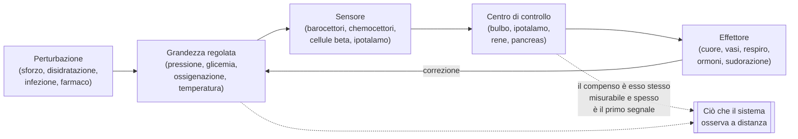
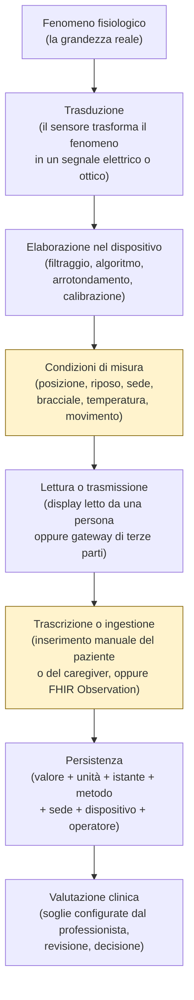
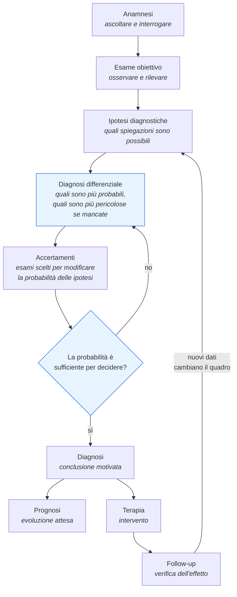

# Il corpo, i parametri, il ragionamento clinico

:::warning Avviso vincolante - natura di questo modulo

**Questo modulo è formazione tecnica per chi sviluppa. Non è materiale clinico e non è una
guida alla pratica medica.**

Non insegna a valutare un paziente, non insegna a riconoscere una malattia, non contiene
raccomandazioni cliniche e non può essere usato per assumere decisioni su una persona reale.
Insegna il minimo di teoria clinica necessario a **non sbagliare il modello dati, le unità di
misura, l'aggregazione temporale e la semantica degli allarmi** di un sistema che trasporta
misure fisiologiche.

Tutti i valori numerici citati sono **indicativi e didattici**. Variano per fonte, popolazione,
età, sesso, quota altimetrica, comorbilità, terapia in corso e metodo di misura. **Il progetto
non cabla soglie cliniche nel codice**: ogni soglia è configurazione clinica sotto
responsabilità del professionista, come impone il perimetro adottato per il telemonitoraggio
(vedi [02 - Le prestazioni di telemedicina](02-prestazioni-di-telemedicina.md), § 4.5.5). Un
numero che compare in questo testo è un esempio didattico, mai un valore predefinito di
prodotto.

:::

Questo è il modulo che chi arriva dall'informatica è più tentato di saltare. È anche quello che
paga di più, perché la classe di difetti che previene non è visibile nei test: sono difetti che
producono numeri plausibili e sbagliati.

Il modulo presuppone [02 - Le prestazioni di telemedicina](02-prestazioni-di-telemedicina.md),
perché usa il vocabolario delle prestazioni senza ridefinirlo, e si legge prima di
[10 - Percorsi di cura e sicurezza del paziente](10-percorsi-di-cura-e-sicurezza.md), che
tratta punteggi, triage e rischio clinico. La rappresentazione tecnica delle misure in FHIR è
nel modulo [06 - FHIR da zero](06-fhir-da-zero.md); qui si spiega **cosa** si sta
rappresentando, non come.

---

## 1. Perché uno sviluppatore deve sapere queste cose

Non per cultura generale. Perché senza queste nozioni si scrivono difetti di una categoria
particolare: il codice compila, i test passano, l'interfaccia mostra un numero, e il numero è
clinicamente falso. Nessun *linter* li intercetta. Seguono sei difetti reali, ciascuno con la
nozione clinica che lo avrebbe evitato.

### 1.1 Difetto: la saturazione trattata come numero puro

Un cruscotto mostra la saturazione periferica di ossigeno come percentuale, con una barra di
avanzamento colorata da 0 a 100 e una scala lineare. Sembra ragionevole: è una percentuale.

Non lo è. La saturazione dell'emoglobina non è lineare rispetto alla quantità di ossigeno
disciolto nel sangue: il legame fra le due grandezze è descritto da una curva sigmoide (§ 2.3.3).
Nella parte alta della curva servono variazioni enormi di ossigeno per muovere la saturazione di
un punto; nella parte bassa un singolo punto di saturazione corrisponde a un crollo consistente.
Ne discendono tre conseguenze di interfaccia e di modello:

- **la parte di scala sotto una certa soglia non è mai un valore "basso": è un valore diverso in
  natura.** Una barra lineare che si colora gradualmente comunica una falsa proporzionalità;
- **la differenza fra due misure vicine non ha lo stesso significato a seconda di dove cade.**
  Una variazione di due punti in zona alta e la stessa variazione in zona bassa non sono
  confrontabili, e quindi non sono sommabili né mediabili come se lo fossero;
- **la precisione dichiarata dello strumento è dello stesso ordine di grandezza delle
  variazioni che interessano.** Un display che mostra decimali su una grandezza il cui errore
  tipico è di alcuni punti percentuali inventa informazione che non esiste.

### 1.2 Difetto: l'unità di misura convertita male

La glicemia si esprime in due unità di uso corrente: milligrammi per decilitro e millimoli per
litro. Il fattore di conversione è circa 18 (§ 3.6.3). Un valore di 5,5 in una unità e un valore
di 5,5 nell'altra descrivono due situazioni cliniche incompatibili.

Il difetto tipico non è la conversione sbagliata: è **la conversione assente**. Un campo
numerico senza unità, alimentato da due sorgenti che usano convenzioni diverse - un dispositivo
domiciliare e un referto di laboratorio - produce una serie temporale in cui i valori sono
mescolati. Nessun controllo di dominio se ne accorge, perché entrambi i valori sono numeri
positivi e finiti.

Lo stesso vale per la temperatura (gradi Celsius o Fahrenheit), per il peso (chilogrammi o
libbre), per l'altezza, per l'emoglobina glicata (percentuale secondo una convenzione,
millimoli per mole secondo un'altra: § 3.6.6). La regola è una sola e non ammette eccezioni:
**nessun valore fisiologico esiste nel sistema senza la sua unità, e l'unità è codificata, non
una stringa libera.** Lo standard di riferimento per la codifica delle unità è UCUM, collocato
dal progetto nel regime B della policy terminologica.

### 1.3 Difetto: la media aritmetica su una serie che non ammette medie

Un riepilogo mensile mostra «pressione media del mese: 128/79». Il paziente ha misurato tre
volte al mattino per venti giorni e una volta alla sera per due giorni. La media è aritmeticamente
corretta e clinicamente priva di senso, per tre ragioni distinte:

1. **il campionamento non è uniforme**: le misure mattutine sono venti volte più numerose di
   quelle serali, quindi la "media del mese" è in realtà la media del mattino;
2. **la grandezza ha un ritmo circadiano** (§ 4.2): mediare valori presi in momenti diversi
   della giornata cancella proprio l'informazione che si cercava;
3. **le misure ravvicinate non sono indipendenti**: tre misure a un minuto di distanza non sono
   tre osservazioni, sono una osservazione ripetuta. Contarle tre volte pesa arbitrariamente
   quel momento.

Aggravante frequente: la media nasconde gli estremi, ed è agli estremi che sta l'informazione
clinica. Due pazienti con la stessa media possono avere andamenti opposti - uno stabile, uno con
oscillazioni ampie - e la variabilità è essa stessa un dato.

### 1.4 Difetto: l'allarme su valore isolato

Un piano di telemonitoraggio configura una soglia. Il paziente misura, il valore la supera, il
sistema genera un'allerta. È il comportamento che quasi tutti implementano per primo, ed è
quello che rende il servizio inutilizzabile nel giro di due settimane.

Un valore isolato fuori intervallo, in quasi tutte le grandezze fisiologiche, è più
probabilmente un **errore di misura** che un evento clinico: bracciale mal posizionato, dito
freddo, paziente che ha appena camminato, bilancia su tappeto, sensore mal aderente. La
proporzione fra veri e falsi positivi dipende dalla prevalenza dell'evento nella popolazione
monitorata, ed è precisamente il calcolo del § 5.5 - quello che gli informatici sbagliano più
spesso.

L'effetto pratico di un sistema che allerta su valore isolato non è un eccesso di sicurezza: è
la **desensibilizzazione all'allarme**, cioè la progressiva perdita di attenzione di chi riceve
segnali per lo più falsi. È un rischio nel senso proprio della ISO 14971, e va trattato come tale
nel modulo [10](10-percorsi-di-cura-e-sicurezza.md). Il progetto non decide la regola -
persistenza, numero di misure consecutive, finestra temporale, obbligo di conferma - perché la
regola è configurazione clinica; deve però **rendere esprimibili** regole che non siano soglie
istantanee, altrimenti il professionista non ha alternativa.

### 1.5 Difetto: l'intervallo di riferimento applicato alla popolazione sbagliata

Un intervallo di riferimento non è una proprietà della grandezza: è una proprietà **della
grandezza in una popolazione, misurata con un metodo, in un contesto**. Applicarlo fuori da quel
contesto produce classificazioni sistematicamente errate.

- La frequenza cardiaca "normale" di un neonato è largamente sopra quella di un adulto. Un
  sistema che applica l'intervallo dell'adulto a un lattante segnala patologico ciò che è
  fisiologico.
- La frequenza respiratoria segue la stessa logica, con una dipendenza dall'età ancora più
  marcata.
- La saturazione considerata accettabile in una persona con broncopneumopatia cronica avanzata
  è più bassa di quella di una persona sana, e correggerla aggressivamente può essere dannoso.
  Un intervallo unico per tutti genererebbe allarmi continui su una popolazione intera.
- I valori di riferimento della pressione in gravidanza, quelli in dialisi, quelli in un
  paziente con terapia che rallenta la frequenza cardiaca hanno logiche proprie.
- La saturazione attesa cambia con la **quota altimetrica**: a mille metri di altitudine la
  pressione parziale di ossigeno nell'aria è inferiore e la saturazione di riposo di una
  persona sana è più bassa che al livello del mare.

Conseguenza di modello: **l'intervallo di riferimento è un dato appartenente alla misura, non
una costante globale**. Va portato con la misura, con la sua fonte, o non va portato affatto. È
la stessa disciplina che il § 8.3 descrive per il laboratorio.

### 1.6 Difetto: il valore senza il suo contesto di misura

Il numero «140» come pressione sistolica non è un dato clinico. Diventa un dato clinico quando
porta con sé: quale braccio, in quale posizione, dopo quanti minuti di riposo, con quale
misuratore, con quale bracciale, in quale momento della giornata, prima o dopo l'assunzione
della terapia, alla prima o alla terza misurazione della sequenza.

Non è pedanteria documentale: ciascuno di questi elementi sposta il valore di una quantità
paragonabile o superiore alla differenza fra "normale" e "da trattare". Un modello dati che
rappresenta la misura come coppia (istante, valore) ha già perso, e il recupero a posteriori è
impossibile perché quei metadati non sono ricostruibili.

### 1.7 Cosa questo modulo non fa

Non insegna a fare diagnosi, non fornisce criteri clinici applicabili, non sostituisce
formazione sanitaria e non abilita nessuno a valutare un paziente. Serve a rendere lo
sviluppatore capace di:

- riconoscere quando una scelta implementativa apparentemente neutra distrugge informazione
  clinica;
- porre al clinico la domanda giusta invece di dedurre da sé la regola;
- leggere un requisito funzionale del catalogo e capire perché è formulato così;
- non inventare mai una soglia, una conversione o un'aggregazione.

L'ultimo punto è la regola operativa che riassume l'intero modulo: **in questo progetto la
conoscenza clinica serve a sapere cosa non si può decidere da soli.**

---

## 2. Anatomia e fisiologia essenziali

Questa sezione copre solo ciò che il progetto misura, rappresenta o rischia di rappresentare
male. Non è un compendio: è la quantità di fisiologia che rende comprensibili i parametri del
§ 3 e le trappole del § 4.

### 2.1 Il principio che tiene insieme tutto: omeostasi e compenso

Il corpo umano mantiene costanti alcune grandezze - temperatura interna, concentrazione di
glucosio nel sangue, pH, volume di liquidi, pressione di perfusione degli organi - entro
intervalli stretti, nonostante le condizioni esterne cambino continuamente. Questo mantenimento
attivo si chiama **omeostasi**.

Il meccanismo è quasi sempre una **retroazione negativa**: un sensore rileva lo scostamento da
un valore obiettivo, un centro di controllo lo confronta con quel valore, un effettore agisce per
ridurlo. È lo stesso schema di un regolatore in un sistema di controllo, con tre differenze che
contano per chi scrive software clinico.



**Prima differenza: la grandezza misurata può essere normale proprio perché il compenso sta
funzionando.** Un paziente che perde sangue mantiene la pressione arteriosa quasi invariata per
un tempo lungo, aumentando frequenza cardiaca e resistenza dei vasi. La pressione è "normale" e
la situazione è grave. Quando la pressione finalmente scende, il compenso ha ceduto. Ne discende
una regola di lettura che vale per l'intero modulo: **un parametro normale non è una prova di
assenza di problema, e il valore più informativo è spesso quello del compenso, non quello della
grandezza regolata.**

**Seconda differenza: i compensi hanno costanti di tempo diverse fra loro.** La risposta
nervosa agisce in secondi, quella ormonale in minuti od ore, quella renale in ore o giorni.
Questo significa che una serie temporale di parametri vitali contiene sovrapposti fenomeni con
scale temporali che differiscono di ordini di grandezza, e che una finestra di aggregazione
scelta senza saperlo cancella l'uno o l'altro.

**Terza differenza: il valore obiettivo non è universale né fisso.** Cambia con l'età, con la
malattia cronica, con la terapia, con l'adattamento (per esempio all'altitudine o
all'allenamento). È la ragione fisiologica del difetto del § 1.5.

Due termini che ricorrono e che vanno fissati subito:

- **compenso**: l'insieme delle risposte che mantengono la grandezza entro l'intervallo utile
  nonostante la perturbazione;
- **scompenso**: la condizione in cui i meccanismi di compenso non bastano più e la grandezza
  esce dall'intervallo. Non è sinonimo di "malattia": è la fase in cui la malattia diventa
  visibile nei parametri.

### 2.2 Apparato cardiocircolatorio

#### 2.2.1 Cosa fa

Trasporta ossigeno, anidride carbonica, nutrienti, ormoni, calore e cellule del sistema
immunitario. È una pompa (il cuore) collegata a una rete di condotti a calibro variabile (i vasi)
riempita di un fluido (il sangue).

Il cuore ha quattro cavità: due **atri** (che ricevono) e due **ventricoli** (che espellono). Il
circuito è doppio e in serie:

- **circolo polmonare** - il ventricolo destro spinge il sangue povero di ossigeno nei polmoni,
  dove si carica di ossigeno e cede anidride carbonica;
- **circolo sistemico** - il ventricolo sinistro spinge il sangue ricco di ossigeno a tutti gli
  organi.

Il fatto che i due circoli siano in serie ha una conseguenza pratica costante: **un problema a
valle si ripercuote a monte**. Se il ventricolo sinistro non riesce a espellere abbastanza, il
sangue ristagna a monte, cioè nei polmoni, e ne deriva difficoltà respiratoria. Se il ventricolo
destro non ce la fa, il ristagno è nelle vene sistemiche, e ne derivano gonfiore alle gambe e
aumento di peso da ritenzione di liquidi. È il motivo per cui **il peso corporeo è un parametro
cardiologico**, cosa che sorprende chi lo considera un dato antropometrico (§ 3.7).

#### 2.2.2 Le grandezze e come si legano

La grandezza che conta davvero per gli organi non è misurabile a distanza: è la **perfusione**,
cioè quanto sangue arriva effettivamente ai tessuti. Ciò che si misura sono grandezze correlate.

- **Gittata sistolica** - volume espulso dal ventricolo a ogni battito.
- **Portata cardiaca** - volume espulso al minuto. È il prodotto di gittata sistolica per
  frequenza cardiaca. Da qui una relazione che spiega molti andamenti osservati nel
  telemonitoraggio: **se la gittata cala, la frequenza sale per mantenere la portata.** La
  tachicardia è spesso un compenso, non una malattia in sé.
- **Resistenze periferiche** - opposizione dei vasi al flusso, regolata dal calibro delle
  arteriole.
- **Pressione arteriosa** - approssimativamente il prodotto di portata cardiaca per resistenze
  periferiche. È l'identità da tenere a mente perché smonta l'idea che la pressione misuri la
  forza del cuore: una pressione normale è compatibile con una portata bassa e resistenze alte,
  cioè con una situazione peggiore di una pressione un po' più bassa con vasi dilatati.

Il cuore si contrae seguendo un impulso elettrico che nasce in un gruppo di cellule dell'atrio
destro (**nodo seno-atriale**), si propaga agli atri, passa attraverso un ritardatore (**nodo
atrio-ventricolare**) e raggiunge i ventricoli. Questa attività elettrica è ciò che registra un
elettrocardiogramma; la contrazione meccanica che ne consegue è ciò che genera il polso.
**Elettrico e meccanico non coincidono sempre**: esistono condizioni in cui un impulso elettrico
non produce una contrazione efficace, e quindi un battito contato dall'elettrocardiogramma non
corrisponde a un polso percepibile alla periferia (§ 3.2.4).

#### 2.2.3 Cosa succede quando si scompensa

Lo **scompenso cardiaco** è la condizione in cui il cuore non riesce a garantire una portata
adeguata alle richieste dell'organismo, o ci riesce solo a prezzo di pressioni di riempimento
elevate. È una delle condizioni croniche più rappresentate nei programmi di telemonitoraggio,
per una ragione precisa: **il peggioramento è preceduto da giorni di ritenzione di liquidi**, e
la ritenzione è misurabile con una bilancia prima che il paziente si accorga di stare peggio.
Nel vocabolario del progetto è l'esempio canonico di parametro che vale per la sua **tendenza**,
non per il suo valore assoluto (§ 4.1).

Le altre condizioni cardiocircolatorie rilevanti per il perimetro:

- **ipertensione arteriosa** - pressione stabilmente elevata; il danno è d'organo e silenzioso
  per anni, quindi il valore singolo conta poco e la serie conta molto;
- **fibrillazione atriale** - attività elettrica atriale caotica; produce un polso irregolare e
  **degrada l'affidabilità dei misuratori automatici di pressione** (§ 3.1.5);
- **cardiopatia ischemica** - insufficiente apporto di sangue al muscolo cardiaco stesso.

### 2.3 Apparato respiratorio

#### 2.3.1 Cosa fa

Assicura due scambi opposti: fa entrare ossigeno nel sangue e fa uscire anidride carbonica.
Sono due funzioni distinte, e distinguerle è essenziale perché **un ossimetro misura solo la
prima**.

L'aria entra attraverso le vie aeree fino agli **alveoli**, minuscole sacche circondate da
capillari. Lì avviene la diffusione dei gas attraverso una membrana sottilissima. Il movimento
dell'aria è prodotto dal diaframma e dai muscoli intercostali.

#### 2.3.2 Le grandezze

- **Frequenza respiratoria** - atti respiratori al minuto.
- **Volume corrente** - aria mossa a ogni atto.
- **Ventilazione al minuto** - prodotto dei due. Anche qui vale la relazione di compenso: chi ha
  volumi ridotti aumenta la frequenza.
- **Pressione parziale di ossigeno nel sangue arterioso** - quantità di ossigeno disciolto,
  misurabile solo con un prelievo arterioso, non a distanza.
- **Saturazione di ossigeno dell'emoglobina** - percentuale di siti di legame dell'emoglobina
  occupati da ossigeno. È la grandezza che l'ossimetro stima (§ 3.3).
- **Pressione parziale di anidride carbonica** - indice di quanto la ventilazione stia
  eliminando anidride carbonica. **Non è stimabile con un ossimetro.**

#### 2.3.3 La curva di dissociazione, e perché cambia il modo di disegnare un'interfaccia

Il legame fra ossigeno disciolto nel sangue e saturazione dell'emoglobina non è proporzionale:
ha una forma a S. Nella parte alta la curva è quasi piatta, in quella centrale è ripida.

Le conseguenze operative sono tre, e sono la ragione del difetto del § 1.1:

1. **nella zona alta la saturazione è poco sensibile**: un peggioramento reale degli scambi
   respiratori può non muoverla affatto. Una saturazione "buona" non esclude un problema
   respiratorio in corso;
2. **nella zona ripida piccole variazioni di saturazione corrispondono a variazioni grandi di
   ossigeno**: qui la stessa differenza numerica ha un peso clinico completamente diverso;
3. **la curva si sposta** con temperatura, pH, anidride carbonica e altri fattori: la relazione
   fra saturazione e ossigeno non è nemmeno stabile nello stesso paziente.

Ne discende la regola di rappresentazione adottata dal progetto: **la saturazione non si
rappresenta con una scala lineare continua da 0 a 100 e non si media come una percentuale
qualsiasi.** Se un'aggregazione è necessaria, il minimo osservato e il tempo trascorso sotto un
livello configurato sono grandezze più difendibili della media.

Un secondo punto, controintuitivo: **l'ossigeno e l'anidride carbonica possono divergere.** Una
persona può avere saturazione accettabile e al tempo stesso una ventilazione insufficiente che
accumula anidride carbonica. Un sistema che mostra solo la saturazione mostra metà del
problema, e va progettato sapendolo.

#### 2.3.4 Cosa succede quando si scompensa

- **Insufficienza respiratoria** - incapacità di mantenere scambi adeguati. Può riguardare solo
  l'ossigenazione o anche l'eliminazione di anidride carbonica.
- **Broncopneumopatia cronica ostruttiva** - ostruzione cronica al flusso aereo, tipicamente con
  riacutizzazioni. È la popolazione in cui l'intervallo di riferimento della saturazione va
  personalizzato (§ 1.5).
- **Asma** - ostruzione reversibile e variabile.
- **Polmonite, edema polmonare, embolia polmonare** - condizioni acute con presentazioni
  parzialmente sovrapponibili, che è precisamente il tema della diagnosi differenziale (§ 5.2).

### 2.4 Sistema nervoso

#### 2.4.1 Cosa fa

Raccoglie informazioni, le elabora e produce risposte. Si divide in **sistema nervoso centrale**
(encefalo e midollo spinale) e **periferico** (nervi). Dal punto di vista funzionale, la parte
che interessa direttamente il progetto è il **sistema nervoso autonomo**: la porzione che
regola le funzioni non volontarie.

Ha due componenti con effetti largamente opposti:

- **simpatico** - prepara alla reazione: aumenta frequenza cardiaca e forza di contrazione,
  restringe alcuni vasi, dilata le vie aeree, aumenta la sudorazione, mobilita glucosio;
- **parasimpatico** - prevale a riposo: rallenta la frequenza cardiaca, favorisce digestione e
  recupero.

**Questo è il motivo fisiologico per cui quasi ogni parametro vitale è influenzato dallo stato
emotivo e dall'attività recente del paziente.** Una misurazione presa subito dopo essere saliti
in casa, dopo una discussione o durante l'ansia dell'attesa di una televisita non è la stessa
misurazione presa a riposo. Non è un difetto del paziente: è fisiologia, e va assorbita dalla
procedura di misura, non corretta a posteriori dal software.

#### 2.4.2 Le grandezze rappresentate dal progetto

Il sistema non misura funzione nervosa in senso stretto, ma rappresenta due famiglie di dati che
la riguardano:

- lo **stato di coscienza**, valutato con scale, e più in generale i punteggi clinici trattati
  nel modulo [10](10-percorsi-di-cura-e-sicurezza.md);
- il **dolore**, che è per definizione un dato riferito dal paziente (§ 5.1) e si rappresenta
  con scale di autovalutazione.

Va detto esplicitamente perché è una fonte ricorrente di errori di modellazione: **una scala di
dolore da 0 a 10 non è una misura fisica.** È un ordinamento soggettivo. Non ammette medie fra
pazienti, i suoi intervalli non sono uguali fra loro, e confrontare il 6 di una persona con il 6
di un'altra non ha significato. Confrontare il 6 di oggi con il 4 di ieri **nella stessa
persona** invece ne ha.

#### 2.4.3 Cosa succede quando si scompensa

Ictus, crisi epilettiche, stati confusionali, decadimento cognitivo. Rilevante per il progetto
soprattutto per due ragioni indirette: il **decadimento cognitivo** incide sulla capacità del
paziente di usare gli strumenti digitali e di eseguire correttamente una misura - è la ragione
clinica dietro il requisito di verifica della capacità del paziente di interagire con i sistemi
digitali - e i **disturbi dell'attenzione o della vigilanza** rendono inaffidabile
l'autocompilazione dei questionari.

### 2.5 Sistema endocrino

#### 2.5.1 Cosa fa

Regola funzioni lente e diffuse tramite **ormoni**, messaggeri chimici rilasciati nel sangue da
ghiandole e attivi su organi distanti. Rispetto al sistema nervoso agisce con costanti di tempo
più lunghe e con effetti più duraturi.

#### 2.5.2 La regolazione del glucosio, che è ciò che il progetto misura

Il glucosio nel sangue è la fonte di energia immediata delle cellule e la sua concentrazione è
mantenuta entro un intervallo stretto da due ormoni prodotti dal pancreas con effetti opposti:

- **insulina** - abbassa la glicemia facendo entrare il glucosio nelle cellule e favorendone il
  deposito. Viene rilasciata quando la glicemia sale, tipicamente dopo un pasto;
- **glucagone** - alza la glicemia mobilitando le riserve, quando la glicemia scende.

Il **diabete mellito** è la condizione in cui questa regolazione fallisce. Le due forme
principali hanno meccanismi diversi - assenza di produzione di insulina in un caso, ridotta
efficacia dell'insulina prodotta nell'altro - e questo cambia radicalmente la struttura dei dati
raccolti: nel primo caso servono più misure al giorno, correlate ai pasti e alle dosi di
insulina, mentre nel secondo il monitoraggio può essere molto meno fitto.

Due nozioni indispensabili per non sbagliare il modello dati:

- **la glicemia dipende in modo decisivo dal rapporto temporale con il pasto.** Un valore "a
  digiuno" e un valore "due ore dopo il pasto" non sono lo stesso parametro con timestamp
  diversi: sono **due parametri diversi**, con intervalli di riferimento diversi e codici
  diversi. Confonderli è uno degli errori più comuni e più insidiosi, perché entrambi sono
  numeri plausibili;
- **l'ipoglicemia è pericolosa quanto e più dell'iperglicemia, ma su una scala di tempo
  molto più breve.** Una glicemia troppo bassa può diventare un'emergenza in minuti, mentre il
  danno dell'iperglicemia cronica si misura in anni. Ne discende che un sistema che tratta la
  glicemia con un'unica logica di soglia simmetrica ha già sbagliato l'asimmetria del rischio.

#### 2.5.3 Altri assi ormonali che compaiono nei dati

- **tiroide** - regola il metabolismo di base; influenza frequenza cardiaca, temperatura, peso.
  Una disfunzione tiroidea può spiegare alterazioni di parametri apparentemente cardiologici;
- **surrene** - produce cortisolo, che ha un marcato ritmo circadiano ed è uno dei responsabili
  fisiologici delle variazioni giornaliere di pressione e glicemia (§ 4.2);
- **ipofisi** - coordina gli altri assi.

### 2.6 Apparato renale

#### 2.6.1 Cosa fa

I reni filtrano il sangue e producono urina, ma ridurli a un filtro è fuorviante. Regolano:

- il **volume dei liquidi** dell'organismo, e quindi indirettamente la pressione arteriosa;
- la **concentrazione degli elettroliti** (sodio, potassio e altri), il cui squilibrio ha
  effetti diretti sul cuore;
- l'**equilibrio acido-base**;
- l'**eliminazione dei prodotti di scarto** e di molti farmaci;
- la produzione di ormoni che regolano pressione e formazione dei globuli rossi.

Il punto che collega il rene a tutto il resto: **il rene è insieme causa e vittima della
pressione arteriosa.** Una pressione alta danneggia il rene; un rene danneggiato fa salire la
pressione. È un anello di retroazione positiva, cioè che si autoalimenta, ed è la ragione per cui
molti percorsi di cura trattano insieme cuore e rene.

#### 2.6.2 Le grandezze

La funzione renale non si misura a distanza. Si stima da esami di laboratorio, principalmente
dalla concentrazione di alcune sostanze di scarto nel sangue e da un indice di filtrazione
calcolato con formule che dipendono da età, sesso e altre variabili. Ciò che il progetto tratta
è dunque il **referto**, non la misura (§ 8).

Due grandezze rilevanti sono però osservabili a domicilio: il **peso** (variazioni rapide
riflettono liquidi, non massa: § 3.7.4) e la **pressione arteriosa**.

#### 2.6.3 Cosa succede quando si scompensa

L'**insufficienza renale** può essere acuta o cronica. Nel paziente in **dialisi** compaiono
concetti che un modello dati ingenuo non prevede: il **peso secco**, cioè il peso obiettivo dopo
la rimozione dei liquidi in eccesso, rispetto al quale si valuta lo scostamento; il fatto che il
peso vada letto in relazione alla seduta dialitica (prima o dopo); il fatto che la pressione vada
misurata su un braccio determinato, perché sull'altro può essere presente un accesso vascolare
che ne vieta la compressione. Sono esempi tipici di **regole che il software non può dedurre e
deve poter ricevere per configurazione**.

### 2.7 Come si intrecciano: un esempio integrato

Vale la pena percorrere un caso didattico, perché mostra come i parametri di apparati diversi si
muovano insieme e perché il valore isolato dica poco.

Una persona con scompenso cardiaco cronico accumula liquidi nell'arco di alcuni giorni. La
sequenza tipica dei segnali osservabili a distanza è:

1. il **peso** sale gradualmente: è il primo segnale, ed è misurabile prima che la persona
   percepisca qualcosa;
2. compare o peggiora il **gonfiore** alle caviglie: segno visibile, ma di apprezzamento
   soggettivo attraverso uno schermo (§ 6.2);
3. la **frequenza cardiaca** aumenta come compenso alla ridotta gittata;
4. la **frequenza respiratoria** aumenta per il ristagno nei polmoni; il paziente riferisce
   affanno prima sotto sforzo, poi da sdraiato;
5. la **saturazione** scende - ed è tardi, perché la curva del § 2.3.3 la mantiene alta finché
   può;
6. la **pressione** può salire, restare stabile o scendere a seconda della fase e della terapia:
   non è un indicatore univoco.

Tre insegnamenti per chi progetta:

- **l'ordine dei segnali conta più dei valori.** Un sistema che tratta i parametri come flussi
  indipendenti perde la correlazione, che è il dato clinico;
- **il parametro più precoce è il più banale.** Il peso, misurato con una bilancia da bagno, ha
  più valore predittivo in questa condizione della saturazione misurata con un dispositivo più
  sofisticato;
- **la saturazione arriva tardi.** Costruire il servizio intorno al parametro più
  "tecnologicamente interessante" è un errore di priorità.

---

## 3. I parametri vitali, uno per uno

### 3.0 Come leggere le schede

Ogni parametro è descritto con la stessa griglia, perché sono esattamente queste dimensioni a
determinare il modello dati:

- **cosa misura fisicamente** - la grandezza reale, non il nome commerciale del sensore;
- **come si misura** - il metodo, perché metodi diversi producono valori non intercambiabili;
- **unità di misura** - con il codice UCUM, che è la forma in cui l'unità entra nel sistema;
- **intervalli di riferimento e loro dipendenza dal contesto** - sempre indicativi, mai cablati;
- **fonti di errore** - l'elenco delle ragioni per cui un valore può essere sbagliato pur
  essendo plausibile;
- **cosa rende un valore clinicamente significativo**;
- **perché il singolo valore quasi mai basta**.

Prima delle schede, la catena che porta da un fenomeno fisico a un record nel database. Ogni
anello introduce errore, e ogni anello va rappresentato se si vuole poter spiegare un valore a
posteriori.



I due anelli evidenziati sono quelli che il progetto non controlla e che introducono la maggior
parte dell'errore: **le condizioni di misura** e **la trascrizione**. Il perimetro adottato -
ingestione da gateway di terze parti, inserimento manuale, questionari - implica che il progetto
**non risponde dell'accuratezza della catena hardware**, ma deve rendere ricostruibile ciò che è
successo: chi ha inserito il valore, con quale dispositivo dichiarato, in quali condizioni
dichiarate.

### 3.1 Pressione arteriosa

#### 3.1.1 Cosa misura fisicamente

La forza esercitata dal sangue sulla parete delle arterie. Non è un numero solo: durante ogni
ciclo cardiaco la pressione oscilla fra un massimo e un minimo, e da questi due valori se ne
derivano altri due.

- **Pressione sistolica** - il valore massimo, raggiunto durante la contrazione del ventricolo
  sinistro (*sistole*).
- **Pressione diastolica** - il valore minimo, durante il rilasciamento (*diastole*).
- **Pressione differenziale** (in inglese *pulse pressure*) - la differenza fra sistolica e
  diastolica. Riflette in buona parte la rigidità delle grandi arterie e il volume espulso a ogni
  battito. È un valore **derivato**, non misurato.
- **Pressione arteriosa media** - il valore medio nel tempo lungo un ciclo cardiaco, che è la
  grandezza fisicamente più vicina alla pressione di perfusione degli organi. Poiché il ciclo non
  è simmetrico (la diastole dura più della sistole), non è la media aritmetica dei due valori: si
  approssima con formule del tipo *diastolica + un terzo della differenziale*. Il dettaglio è
  rilevante per il software perché **è una formula, non una misura**, e la formula usata va
  dichiarata.

#### 3.1.2 Come si misura

Due metodi non invasivi, che non danno gli stessi numeri.

- **Auscultatorio** - un bracciale gonfiato comprime l'arteria del braccio; sgonfiando
  lentamente, un operatore ascolta con lo stetoscopio la comparsa e la scomparsa di rumori
  caratteristici e legge i due valori su un manometro. È il metodo storico di riferimento e
  **richiede un operatore addestrato**: non è eseguibile dal paziente da solo, e non è eseguibile
  attraverso uno schermo.
- **Oscillometrico** - un bracciale automatico rileva le oscillazioni di pressione trasmesse dal
  vaso e **calcola** i valori con un algoritmo proprietario. È il metodo di quasi tutti i
  misuratori domiciliari. Punto essenziale: l'apparecchio oscillometrico **misura direttamente
  una grandezza vicina alla pressione media e deriva sistolica e diastolica per stima**. Ne
  discende che i risultati dipendono dall'algoritmo del singolo modello e che due apparecchi
  diversi sullo stesso braccio possono differire.

Esistono inoltre la **misurazione ambulatoriale nelle ventiquattro ore**, con un dispositivo che
misura automaticamente a intervalli programmati anche di notte, e l'**automisurazione
domiciliare** secondo schemi definiti. Entrambe producono **serie**, non valori: è la forma in
cui la pressione ha davvero significato clinico.

#### 3.1.3 Unità

Millimetri di mercurio. Codice UCUM: `mm[Hg]`. Le parentesi quadre non sono un refuso: fanno
parte della sintassi UCUM per le unità non metriche. Un sistema che scrive `mmHg` come stringa
libera non è interoperabile.

**La pressione non è un numero: è una struttura.** In FHIR si rappresenta come `Observation` con
componenti distinti per sistolica e diastolica, non come stringa «120/80». Una stringa non è
confrontabile, non è aggregabile e non ha unità.

#### 3.1.4 Intervalli di riferimento e dipendenza dal contesto

I valori di riferimento comunemente citati per l'adulto sano si collocano attorno a 120/80 mm[Hg]; questa cifra va verificata dall'area `GUIDA` dei fondamenti ed è didattica e non utilizzabile come regola. `[NV]` Le ragioni per cui non lo è:

- le soglie diagnostiche di ipertensione **differiscono a seconda della linea guida** adottata e
  sono state riviste più volte, in direzioni diverse, da società scientifiche diverse;
- **la soglia dipende dal metodo**: i valori di riferimento per la misurazione in ambulatorio,
  per l'automisurazione a domicilio e per il monitoraggio nelle ventiquattro ore sono **diversi
  fra loro**, e più bassi per i metodi domiciliari e ambulatoriali. Confrontare un valore
  domiciliare con una soglia ambulatoriale è un errore metodologico, non un'approssimazione;
- l'obiettivo terapeutico è **individuale**: dipende da età, danno d'organo, diabete, malattia
  renale, gravidanza, tolleranza ai farmaci;
- in età pediatrica i riferimenti sono espressi in **percentili per età, sesso e statura**, non
  in valori assoluti. Un sistema che applica soglie da adulto a un bambino produce
  classificazioni prive di senso.

> **Regola di progetto.** Nessuna di queste soglie compare nel codice. Il piano di monitoraggio
> porta la propria configurazione, definita dal professionista, con la propria fonte dichiarata e
> il proprio contesto di applicabilità.

#### 3.1.5 Fonti di errore

Questa lista è deliberatamente lunga, perché ogni voce sposta il valore di una quantità
paragonabile alla differenza fra le categorie cliniche.

- **Bracciale di misura sbagliata.** Un bracciale troppo piccolo per la circonferenza del braccio
  sovrastima; uno troppo grande sottostima. È l'errore singolo più frequente
  nell'automisurazione, ed è invisibile nel dato.
- **Posizione del braccio.** Il braccio va sostenuto all'altezza del cuore. Più in basso
  sovrastima, più in alto sottostima, per effetto della colonna idrostatica.
- **Postura.** Seduto, con schiena appoggiata, piedi a terra non incrociati. Gambe accavallate,
  schiena non sostenuta e vescica piena alterano il valore.
- **Riposo insufficiente.** Servono alcuni minuti di riposo prima della misura. Una misura presa
  immediatamente dopo attività fisica, dopo aver parlato o durante una conversazione è
  sistematicamente più alta.
- **Parlare durante la misura.** Alza il valore.
- **Fumo, caffeina, pasto recente.**
- **Effetto camice bianco** - pressione più alta in presenza del personale sanitario che a
  domicilio. Ha un corrispettivo in telemedicina che non è stato oggetto di quantificazione
  affidabile: l'effetto di essere osservati attraverso una videocamera durante la misura, che l'area `GUIDA` deve quantificare. `[NV]`
- **Ipertensione mascherata** - il fenomeno opposto: valori normali in ambulatorio ed elevati a
  domicilio. È la ragione principale per cui l'automisurazione ha valore autonomo e non è un
  ripiego.
- **Differenza fra le due braccia.** Può essere fisiologica entro un certo margine e patologica
  oltre. Conseguenza operativa: **il braccio usato è un dato**, e le misure su braccia diverse non
  vanno inserite nella stessa serie senza qualificarle.
- **Aritmia.** In presenza di battito irregolare - tipicamente la fibrillazione atriale - gli
  apparecchi oscillometrici perdono affidabilità, perché l'algoritmo assume una certa regolarità
  del segnale. Molti dispositivi segnalano l'irregolarità: **quella segnalazione è un dato da
  conservare**, non un messaggio da mostrare e scartare.
- **Prima misura più alta delle successive.** È il motivo per cui i protocolli di automisurazione
  chiedono più misure consecutive con un intervallo e prescrivono come combinarle. La regola di
  combinazione **è del protocollo clinico**, non del software.
- **Trascrizione.** Il paziente legge il display e digita. Inversioni di cifre, scambio fra
  sistolica e diastolica, confusione con il valore di frequenza cardiaca mostrato nello stesso
  display.

#### 3.1.6 Cosa rende un valore significativo, e perché uno solo non basta

La pressione è la grandezza fisiologica con la **variabilità intrinseca più alta fra quelle
trattate qui**: varia da battito a battito, nell'arco della giornata, con la stagione, con lo
stato emotivo. Da questo discende un principio che il modello dati deve incorporare: **la
diagnosi e il controllo dell'ipertensione si fondano su serie di misure prese in condizioni
standardizzate, non su valori isolati.**

Le grandezze davvero informative sono quindi di secondo livello: la media di un ciclo di
automisurazione condotto secondo un protocollo definito, la variabilità, la differenza fra
mattino e sera, il comportamento notturno, la proporzione di misure entro l'obiettivo
individuale. Tutte richiedono che il momento e le condizioni della misura siano dati di prima
classe.

Esiste una sola eccezione alla regola «un valore isolato non basta»: i valori **estremi**, in cui
l'entità dello scostamento rende improbabile l'errore di misura e la situazione richiede
attenzione immediata a prescindere dalla serie. Quale sia questa soglia è una decisione clinica,
configurata nel piano, e il progetto si limita a rendere esprimibile la distinzione fra una
regola di tendenza e una regola di valore estremo.

### 3.2 Frequenza cardiaca

#### 3.2.1 Cosa misura fisicamente

Il numero di cicli cardiaci per unità di tempo. Attenzione a una distinzione che il linguaggio
comune cancella:

- **frequenza cardiaca** - battiti elettrici o meccanici del cuore al minuto;
- **frequenza del polso** - pulsazioni percepibili in periferia al minuto.

Coincidono nella maggior parte dei casi, ma **non sempre**: se alcune contrazioni sono troppo
deboli per generare un'onda pulsatile percepibile, il polso è più lento della frequenza cardiaca.
Questa differenza si chiama **deficit di polso** e si osserva tipicamente nella fibrillazione
atriale. Poiché quasi tutti i dispositivi domiciliari misurano il **polso**, il dato che arriva
al sistema è la frequenza del polso anche quando l'etichetta dice «frequenza cardiaca».

#### 3.2.2 Come si misura

- **Palpazione manuale** - conteggio su un'arteria periferica per un tempo definito. Semplice,
  e l'unico metodo che permette di apprezzare **la regolarità e l'ampiezza** oltre alla
  frequenza.
- **Ossimetria a impulsi** - quasi tutti gli ossimetri restituiscono anche la frequenza del
  polso, ricavata dalla componente pulsatile del segnale ottico.
- **Misuratore automatico di pressione** - restituisce la frequenza rilevata durante la misura.
- **Elettrocardiogramma** - misura l'attività elettrica; è l'unico metodo che descrive il
  **ritmo** e non solo la frequenza.
- **Sensori indossabili** - fotopletismografia al polso o al dito. Precisione fortemente
  dipendente dal movimento, dall'aderenza e dalla perfusione.

**Metodi diversi non producono lo stesso dato**, e la differenza non è solo di accuratezza: è di
significato. Un valore da elettrocardiogramma e un valore da fotopletismografia al polso durante
il movimento non appartengono alla stessa serie.

#### 3.2.3 Unità

Battiti al minuto. Codice UCUM: `/min`. La forma testuale «bpm» è una etichetta di
visualizzazione, non un'unità codificata.

#### 3.2.4 Intervalli di riferimento e contesto

Per l'adulto a riposo si cita comunemente un intervallo attorno a 60–100 battiti al minuto; questo intervallo va verificato dall'area `GUIDA` dei fondamenti. `[NV]` Le dipendenze dal contesto sono più forti che in quasi ogni altro parametro:

- **l'età** cambia tutto: il neonato ha frequenze molto più elevate, e i riferimenti pediatrici
  scendono progressivamente con la crescita;
- **l'allenamento**: in una persona molto allenata una frequenza a riposo sotto il limite
  inferiore dell'intervallo dell'adulto medio è attesa, non patologica;
- **la terapia**: alcune classi di farmaci cardiologici riducono deliberatamente la frequenza. In
  un paziente in terapia il valore atteso è più basso, e - punto meno ovvio - **l'aumento
  compensatorio in caso di peggioramento è attenuato**, quindi il segnale che ci si aspetterebbe
  può non comparire;
- **la febbre** aumenta la frequenza;
- **lo stato emotivo e l'attività recente** (§ 2.4.1);
- **il dispositivo impiantato**: in presenza di uno stimolatore cardiaco la frequenza può essere
  determinata dal dispositivo e non dal cuore.

#### 3.2.5 Fonti di errore

- **Movimento** durante la misura, in particolare con sensori ottici.
- **Perfusione periferica scarsa** - mani fredde, vasocostrizione: il segnale ottico si degrada e
  l'algoritmo può agganciare artefatti.
- **Aritmie** - un battito irregolare rende ambiguo il concetto stesso di "frequenza" su una
  finestra breve.
- **Conteggio su tempo breve moltiplicato** - contare per quindici secondi e moltiplicare per
  quattro amplifica per quattro l'errore di conteggio ed è particolarmente inadatto in presenza
  di irregolarità.
- **Doppio conteggio o dimezzamento** - alcuni algoritmi possono agganciare l'armonica sbagliata
  del segnale, restituendo il doppio o la metà del valore reale. Sono valori plausibili: nessun
  controllo di intervallo li intercetta.

#### 3.2.6 Perché il singolo valore non basta

Perché la frequenza cardiaca è, fra i parametri considerati, il più **reattivo**: risponde in
secondi a stimoli banali. Il suo significato sta nella relazione con lo stato del paziente in
quel momento (a riposo? dopo sforzo? febbrile?) e nella **tendenza**: un aumento stabile della
frequenza a riposo nell'arco di giorni è informazione, una misura alta subito dopo aver salito
le scale non lo è.

Va inoltre notato che la **regolarità** del battito è, in molte situazioni, più informativa della
frequenza, e che quasi nessun dispositivo domiciliare la trasmette in forma strutturata. Se il
dispositivo espone un indicatore di battito irregolare, **quell'indicatore è un dato clinico da
persistere**, con la stessa dignità del numero.

### 3.3 Saturazione periferica di ossigeno

#### 3.3.1 Cosa misura fisicamente

La percentuale di **siti di legame dell'emoglobina occupati da ossigeno**, stimata in modo non
invasivo attraverso un tessuto periferico. Tre precisazioni che cambiano il modo di scrivere
codice:

- **non misura quanto ossigeno c'è nel sangue in valore assoluto.** Una persona con poca
  emoglobina può avere una saturazione perfetta e un trasporto di ossigeno insufficiente;
- **non misura la respirazione.** Non dice nulla sull'eliminazione dell'anidride carbonica
  (§ 2.3.3);
- **è una stima**, non una misura diretta. La grandezza di riferimento è la saturazione misurata
  su sangue arterioso in laboratorio; il valore periferico ne è un'approssimazione, con un errore
  che i fabbricanti dichiarano e che è dell'ordine di alcuni punti percentuali; il valore
  numerico esatto, che dipende dal dispositivo e dal contesto, va confermato dall'area `TECH`. `[NV]`

Il metodo si basa sul fatto che l'emoglobina legata all'ossigeno e quella non legata assorbono
in modo diverso la luce rossa e infrarossa; il dispositivo illumina il tessuto, misura
l'assorbimento e isola la **componente pulsatile** del segnale, che assume provenire dal sangue
arterioso. Tutte le fonti di errore del § 3.3.4 derivano dalla violazione di una di queste
assunzioni.

#### 3.3.2 Come si misura

Ossimetro a impulsi applicato al dito, al lobo dell'orecchio o, nei neonati, al piede. Sono i
dispositivi domiciliari più diffusi dopo il misuratore di pressione, e la loro accuratezza varia
enormemente fra prodotti certificati come dispositivi medici e prodotti di consumo.

#### 3.3.3 Unità

Percentuale. Codice UCUM: `%`. **Da non rappresentare come frazione fra 0 e 1**: la convenzione
clinica è 0–100 e un'inversione di convenzione è un difetto che passa i test e non passa la
revisione clinica.

Da distinguere anche il **codice** della grandezza: esiste una differenza fra saturazione
misurata su sangue arterioso e saturazione stimata con ossimetria a impulsi, e le due hanno
codici diversi. Usare il codice sbagliato significa dichiarare di aver fatto un prelievo
arterioso che non è avvenuto.

#### 3.3.4 Fonti di errore

- **Perfusione periferica scarsa** - freddo, vasocostrizione, ipotensione. Il segnale pulsatile
  si riduce e la stima si degrada. Molti dispositivi espongono un **indice di perfusione**: è un
  indicatore di qualità del dato e, se disponibile, va conservato.
- **Movimento** - genera componenti pulsatili spurie.
- **Smalto per unghie, unghie artificiali, sporco** - alterano l'assorbimento ottico.
- **Luce ambientale intensa** che raggiunge il sensore.
- **Emoglobine anomale.** In presenza di monossido di carbonio, l'emoglobina legata al monossido
  assorbe la luce in modo simile a quella ossigenata: **l'ossimetro può leggere una saturazione
  elevata mentre il trasporto di ossigeno è gravemente compromesso.** È il caso in cui un valore
  rassicurante è la manifestazione del problema.
- **Pigmentazione cutanea.** La letteratura scientifica ha documentato differenze sistematiche
  di accuratezza dell'ossimetria in relazione al colore della pelle, con tendenza a sovrastimare
  la saturazione nelle persone con pigmentazione più scura. Il progetto registra il fatto senza
  quantificarlo; l'entità, che dipende da dispositivo e popolazione, va stabilita dall'area `GUIDA`. `[NV]` La conseguenza
  progettuale è però indipendente dalla quantificazione - **è una fonte di iniquità di sistema
  che va dichiarata nella documentazione destinata al professionista e considerata nella
  gestione del rischio**, non un dettaglio tecnico.
- **Sede di misura** - dito, orecchio e piede hanno tempi di risposta e affidabilità diversi.
- **Ossigeno supplementare in corso.** Una saturazione va letta **insieme all'informazione se il
  paziente stia ricevendo ossigeno e a quale flusso**. La stessa cifra con e senza ossigeno
  descrive due situazioni diversissime. Questo è un caso da manuale di **dato che non ha
  significato senza il suo qualificatore**: il modello dati deve prevederlo, non aggiungerlo
  dopo.

#### 3.3.5 Perché il singolo valore non basta

Per la forma della curva (§ 2.3.3), che rende il parametro poco sensibile finché il compenso
regge e poi rapidamente informativo; per la variabilità della misura; e perché la grandezza
clinicamente rilevante è spesso **la saturazione durante uno sforzo definito** o **la
persistenza sotto un livello nel tempo**, non il valore a riposo. Le aggregazioni difendibili
sono il minimo osservato in una finestra e il tempo trascorso sotto un livello configurato; la
media è quasi sempre priva di significato.

### 3.4 Frequenza respiratoria

#### 3.4.1 Cosa misura fisicamente

Il numero di atti respiratori completi (una inspirazione più una espirazione) al minuto.

#### 3.4.2 Come si misura

Osservazione e conteggio dei movimenti del torace per un intervallo di tempo - idealmente un
minuto intero - **preferibilmente senza che il paziente sappia di essere osservato**, perché la
respirazione è sotto controllo parziale volontario e la consapevolezza la altera. È l'unico
parametro di questa sezione la cui misura corretta richiede che il soggetto **non collabori**
consapevolmente.

Ne discende una conseguenza notevole per la telemedicina: chiedere al paziente «conta i tuoi
atti respiratori» produce un valore sistematicamente distorto. Il conteggio da parte di un
caregiver o del professionista mentre osserva in video è più difendibile, ma richiede
inquadratura e illuminazione adeguate e una durata di osservazione che la videochiamata
raramente concede (§ 6.5).

Esistono dispositivi che la derivano da altri segnali, ma il progetto non dialoga direttamente
con i dispositivi e riceve il valore già calcolato: **il metodo dichiarato dal gateway è quindi
un dato indispensabile**.

#### 3.4.3 Unità

Atti al minuto. Codice UCUM: `/min` - la stessa unità della frequenza cardiaca, il che rende
**il codice della grandezza l'unico discriminante**. Un modello che si affidi all'unità per
distinguere i due parametri confonde due serie completamente diverse.

#### 3.4.4 Intervalli e contesto

Per l'adulto a riposo si cita un intervallo attorno a 12–20 atti al minuto; questo intervallo va verificato dall'area `GUIDA`. `[NV]` La dipendenza
dall'età è ancora più marcata che per la frequenza cardiaca: i valori pediatrici sono nettamente
più alti e scendono con l'età. Febbre, dolore, ansia, sforzo, alterazioni metaboliche e
condizioni respiratorie la aumentano; alcune sostanze la deprimono.

#### 3.4.5 Perché conta più di quanto sembri

È il parametro **meno misurato e più trascurato**, ed è al tempo stesso quello a cui la
letteratura sui punteggi di allerta precoce attribuisce peso rilevante nell'identificazione del
peggioramento clinico. Il modulo [10](10-percorsi-di-cura-e-sicurezza.md) tratta i punteggi in
dettaglio; qui basta la conseguenza progettuale: **se l'interfaccia rende scomodo inserire la
frequenza respiratoria, il campo resterà vuoto**, e resterà vuoto proprio il dato che serviva.
Il costo di attrito di un campo, in questo dominio, si misura in dati mancanti.

#### 3.4.6 Fonti di errore

Consapevolezza di essere osservati; conteggio su intervallo breve moltiplicato; respiro
irregolare, che rende la frequenza media poco rappresentativa; parlato durante l'osservazione;
in video, inquadratura che non comprende il torace, illuminazione insufficiente, frame rate
ridotto dalla compressione (§ 6.5).

### 3.5 Temperatura corporea

#### 3.5.1 Cosa misura fisicamente

La temperatura del corpo. Ma **quale** temperatura: quella interna, cioè degli organi profondi,
è la grandezza fisiologicamente regolata; ciò che si misura è la temperatura di una **sede
accessibile**, che ne è un'approssimazione con un errore sistematico dipendente dalla sede.

#### 3.5.2 Come si misura, e perché la sede è parte del dato

Le sedi di uso corrente - ascellare, orale, timpanica, rettale, temporale - danno valori
**sistematicamente diversi fra loro**, con la sede ascellare tipicamente più bassa e quella
rettale tipicamente più alta rispetto all'orale. L'entità esatta degli scarti varia per fonte e
per metodo; questa variabilità va documentata dall'area `GUIDA`. `[NV]`

Conseguenza inderogabile: **una serie temporale di temperature con sedi diverse e non
qualificate è priva di significato.** Se il paziente misura in ascella al mattino e con un
termometro a infrarossi sulla fronte alla sera, la variazione osservata può essere interamente
artefatto. La sede è un componente obbligatorio della misura, non un'annotazione facoltativa.

I termometri a infrarossi senza contatto, molto diffusi, sono i più sensibili alle condizioni
ambientali: distanza, angolo, sudorazione, esposizione recente al sole o al freddo, correnti
d'aria.

#### 3.5.3 Unità

Gradi Celsius. Codice UCUM: `Cel` - **non** `°C` come stringa. I gradi Fahrenheit esistono e
sono usati in altre convenzioni: la conversione è affine, non moltiplicativa, quindi un errore di
conversione produce valori plausibili invece che assurdi. È esattamente il difetto del § 1.2.

#### 3.5.4 Intervalli e contesto

Il valore comunemente citato come riferimento è attorno a 36,5–37,5 °C in sede orale; questo intervallo va verificato dall'area `GUIDA`. `[NV]` Ma
la nozione di «temperatura normale» è meno solida di quanto si creda: varia per individuo, per
sede, per ora del giorno (con un minimo notturno e un massimo nel tardo pomeriggio: § 4.2), per
fase del ciclo mestruale, per età. Nella persona anziana la risposta febbrile può essere
attenuata o assente **anche in presenza di infezione grave**: un sistema che tratta l'assenza di
febbre come rassicurazione applica un ragionamento sbagliato a una popolazione che è invece
quella tipica del telemonitoraggio.

La soglia che definisce la «febbre» varia per fonte e per sede: è configurazione clinica.

#### 3.5.5 Perché il singolo valore non basta

Perché la temperatura ha un ritmo circadiano marcato, perché la sede introduce uno scarto
sistematico e perché ciò che informa è **l'andamento**: la comparsa, la persistenza,
l'oscillazione e la risposta alla terapia. Una singola misura è interpretabile solo se si sa
sede, ora e se il paziente ha assunto farmaci che abbassano la temperatura - ed è il caso più
frequente in cui un valore normale nasconde una situazione anormale.

### 3.6 Glicemia

#### 3.6.1 Cosa misura fisicamente

La concentrazione di glucosio in un campione. **In quale campione** è la prima domanda, e non è
un dettaglio.

- **Sangue capillare** - la goccia ottenuta pungendo un polpastrello, misurata con un
  glucometro.
- **Plasma venoso** - il campione del laboratorio, ottenuto con un prelievo da vena.
- **Liquido interstiziale** - quello misurato dai sensori a monitoraggio continuo, che non
  misurano il sangue.

I tre campioni **non danno lo stesso valore**. La maggior parte dei glucometri domiciliari è
calibrata per restituire un valore **equivalente al plasma** anche misurando sangue capillare,
ma la calibrazione dichiarata dal dispositivo è un dato: dispositivi diversi possono non essere
confrontabili.

#### 3.6.2 Come si misura

- **Glucometro capillare** - puntura, striscia reattiva, lettura in pochi secondi. Il valore
  dipende dal lotto delle strisce, dalla loro conservazione, dalla scadenza e dalla temperatura
  ambiente.
- **Laboratorio** - su prelievo venoso, con metodi di riferimento.
- **Monitoraggio continuo del glucosio** - un sensore sottocutaneo campiona il liquido
  interstiziale a intervalli molto ravvicinati e produce una serie fitta. Due proprietà da
  conoscere: c'è un **ritardo fisiologico** fra glicemia ematica e interstiziale, dell'ordine di
  alcuni minuti, che si manifesta soprattutto quando il valore cambia rapidamente; e
  l'accuratezza si esprime con indici propri, non con una singola cifra di errore.

#### 3.6.3 Unità, e la conversione che va fatta bene

Due unità in uso: **milligrammi per decilitro** (`mg/dL`) e **millimoli per litro** (`mmol/L`).
Il fattore di conversione per il glucosio è circa **18,0** - più precisamente il rapporto
determinato dalla massa molare del glucosio; il valore esatto da usare va confermato dall'area `GUIDA`, che va fissato in
un unico punto del codice e non ripetuto. `[NV]`

Poiché gli ordini di grandezza dei valori nelle due unità non si sovrappongono, in questo caso
specifico l'errore di unità produce valori **assurdi** e quindi rilevabili. È l'eccezione, non la
regola, e non giustifica l'assenza dell'unità: la stessa fiducia applicata all'emoglobina glicata
o alla temperatura produce disastri silenziosi.

#### 3.6.4 Il contesto temporale è parte dell'identità del parametro

Va ripetuto perché è la trappola principale (§ 2.5.2): «glicemia a digiuno», «glicemia due ore
dopo il pasto», «glicemia casuale» e «glicemia prima di coricarsi» **non sono lo stesso parametro
con timestamp diversi**. Hanno intervalli di riferimento diversi, significati diversi e codici
diversi. Un modello che li fonde in una serie unica produce grafici che sembrano informativi e
non lo sono.

Analogamente, in un paziente in terapia insulinica il valore ha significato solo se correlato a
pasto e dose: la misura da sola è metà del dato.

#### 3.6.5 Fonti di errore

- Strisce reattive scadute o conservate male; lotto non corrispondente.
- Mani non lavate: residui di zucchero sul polpastrello alterano il valore verso l'alto in modo
  anche marcato.
- Prima goccia usata invece della seconda, secondo le istruzioni del dispositivo.
- Temperatura ambiente estrema; altitudine.
- Disidratazione, alterazioni dell'ematocrito, alcune sostanze interferenti.
- Per il monitoraggio continuo: ritardo nelle fasi di variazione rapida, compressione del sensore
  durante il sonno, periodo iniziale dopo l'inserimento.

#### 3.6.6 Emoglobina glicata: due unità e due convenzioni

È un esame di laboratorio che riflette la media dell'esposizione al glucosio nei mesi precedenti,
citato qui perché è il caso in cui la conversione di unità è più insidiosa. Si esprime in
**percentuale** secondo una convenzione e in **millimoli per mole** secondo un'altra. I valori
numerici sono di ordini di grandezza diversi, ma esistono referti che riportano entrambi, e la
relazione fra le due è affine, non proporzionale; i coefficienti esatti vanno stabiliti dall'area `GUIDA`. `[NV]`

Regola: **si conserva il valore con la sua unità come è stato refertato**, e la conversione, se
serve, è una funzione esplicita, tracciabile e reversibile - mai una normalizzazione silenziosa
in ingresso.

### 3.7 Peso corporeo

#### 3.7.1 Cosa misura fisicamente

La massa corporea. È il parametro apparentemente più banale e, in alcuni percorsi di cura, il più
informativo (§ 2.7).

#### 3.7.2 Come si misura

Bilancia. Le condizioni contano più di quanto sembri: stessa bilancia, stesso momento della
giornata (tipicamente al mattino), dopo la minzione, prima di colazione, con abbigliamento
comparabile, su superficie rigida - una bilancia su tappeto può leggere in modo non ripetibile.

#### 3.7.3 Unità

Chilogrammi. Codice UCUM: `kg`. Le libbre esistono in altre convenzioni: la conversione è
moltiplicativa e un errore produce valori plausibili. Difetto del § 1.2.

#### 3.7.4 Perché una variazione rapida non è variazione di massa

Nell'arco di ore o pochi giorni la massa dei tessuti non cambia in modo apprezzabile. **Una
variazione rapida di peso è variazione di acqua corporea.** Questo è il fondamento clinico
dell'uso del peso nel telemonitoraggio dello scompenso cardiaco e nel paziente con malattia
renale: la bilancia diventa uno strumento per stimare il bilancio dei liquidi.

Ne discendono due conseguenze di modellazione:

- **la grandezza rilevante è la variazione rispetto a un riferimento, non il valore assoluto.** Il
  riferimento può essere un peso obiettivo definito dal clinico - il **peso secco** nel paziente
  in dialisi - o il peso di un giorno indice. Il modello deve poter rappresentare il riferimento
  e la sua storia, perché il riferimento stesso viene aggiornato dal clinico;
- **la finestra temporale della variazione è parte della regola.** Criteri del tipo «aumento di
  una certa quantità in un certo numero di giorni» ricorrono nei piani di telemonitoraggio dello
  scompenso; l'area `GUIDA` deve ricercare una fonte normativa italiana che fissi i valori, che restano
  configurazione clinica del piano. `[NV]`

Va aggiunto un caso che il software deve gestire senza inventare: **una variazione rapida può
anche essere un errore di misura** (bilancia diversa, vestiti, scarpe). La distinzione fra
segnale ed errore la fa il clinico, e il sistema deve rendere ricostruibile il contesto.

#### 3.7.5 Grandezze derivate

L'**indice di massa corporea** si calcola dal peso e dall'altezza. È un valore derivato, e ciò
comporta due obblighi: va **ricalcolato** quando cambia una delle due grandezze, e va marcato
come derivato, non come misurato. Un indice memorizzato come se fosse una misura diventa
silenziosamente incoerente con i suoi ingredienti.

L'indice ha inoltre limiti noti - non distingue massa muscolare da massa grassa, ha
interpretazioni diverse per età e composizione corporea - che la documentazione destinata al
professionista deve riportare senza addolcirli.

### 3.8 Tabella riepilogativa

:::caution Sui codici LOINC di questa tabella

**Nessuno dei codici riportati è stato verificato dal progetto contro un rilascio LOINC
pinnato.** Sono i codici comunemente citati nella documentazione dello standard e nei profili
FHIR per i segni vitali, riportati qui a fini didattici. `[NV]` La verifica puntuale, con dichiarazione della versione LOINC adottata e attribuzione richiesta dalla licenza, deve essere richiesta all'area `PROTO`: è un'attività separata. LOINC è collocato nel regime A della policy terminologica del progetto - coesistenza piena nei sorgenti con attribuzione. Si ricorda inoltre che **le traduzioni italiane di LOINC sono derivati assegnati all'ente che lo mantiene**: le stringhe di interfaccia del progetto vanno tenute architetturalmente separate dal campo di visualizzazione del codice.

:::

| Parametro | Cosa misura | Unità (UCUM) | LOINC `[NV]` | Trappola principale |
|---|---|---|---|---|
| Pressione sistolica | Pressione massima nel ciclo cardiaco | `mm[Hg]` | 8480-6 | Non è un numero isolato: fa parte di una struttura con la diastolica; il metodo e il braccio cambiano il valore |
| Pressione diastolica | Pressione minima nel ciclo cardiaco | `mm[Hg]` | 8462-4 | Come sopra; nei misuratori oscillometrici è **derivata da un algoritmo**, non misurata |
| Pannello pressorio | Contenitore delle due componenti | - | 85354-9 | Rappresentare la pressione come stringa «120/80» rende il dato inutilizzabile |
| Pressione arteriosa media | Media temporale nel ciclo | `mm[Hg]` | 8478-0 | **È una formula**: la formula usata va dichiarata; non è la media aritmetica di sistolica e diastolica |
| Pressione differenziale | Sistolica meno diastolica | `mm[Hg]` | (da verificare da `PROTO`) `[NV]` | Valore derivato: va ricalcolato, mai memorizzato come misura indipendente |
| Frequenza cardiaca | Cicli cardiaci al minuto | `/min` | 8867-4 | Stessa unità della frequenza respiratoria: il codice è l'unico discriminante. Quasi sempre è in realtà frequenza **del polso** |
| Saturazione periferica di ossigeno | Percentuale di emoglobina ossigenata, stimata otticamente | `%` | 59408-5 (ossimetria) / 2708-6 (sangue arterioso) | Scala non lineare; non media; codice diverso da quello del prelievo arterioso; priva di significato senza il dato sull'ossigeno supplementare |
| Frequenza respiratoria | Atti respiratori al minuto | `/min` | 9279-1 | La consapevolezza di essere osservati altera la misura; campo che resta vuoto se l'inserimento è scomodo |
| Temperatura corporea | Temperatura di una sede accessibile | `Cel` | 8310-5 | **La sede è parte del dato**; serie con sedi miste sono prive di significato; conversione Fahrenheit affine |
| Glicemia (sangue) | Concentrazione di glucosio | `mg/dL` o `mmol/L` | 2339-0 (sangue), 2345-7 (siero o plasma), 15074-8 (moli su volume) | Il rapporto con il pasto **cambia il parametro**, non solo il momento; campione capillare, venoso e interstiziale non sono equivalenti |
| Emoglobina glicata | Esposizione media al glucosio nei mesi precedenti | `%` o `mmol/mol` | 4548-4 | Due convenzioni con relazione affine: mai normalizzare silenziosamente |
| Peso corporeo | Massa corporea | `kg` | 29463-7 | Variazione rapida = liquidi, non massa; la grandezza utile è lo scostamento da un riferimento clinico |
| Altezza | Statura | `cm` | 8302-2 | Nell'adulto cambia poco ma non è costante; nel bambino è un parametro dinamico e va nei percentili |
| Indice di massa corporea | Peso su altezza al quadrato | `kg/m2` | 39156-5 | Valore **derivato**: ricalcolare, non memorizzare come misura |

### 3.9 Cosa deve accompagnare ogni misura

Riassunto operativo delle sezioni precedenti. Una misura, per essere clinicamente utilizzabile,
porta con sé almeno:

| Attributo | Perché è obbligatorio |
|---|---|
| **Valore** | - |
| **Unità codificata** | § 1.2 |
| **Codice della grandezza** | Distingue parametri che condividono l'unità (§ 3.4.3) e varianti che condividono il nome (§ 3.6.4) |
| **Istante della misura** | Distinto dall'istante di inserimento e da quello di ricezione (§ 4.4) |
| **Fuso orario e riferimento locale** | Un ritmo circadiano si legge sull'ora locale del paziente, non su UTC (§ 4.4) |
| **Chi ha eseguito e chi ha inserito** | Paziente, caregiver, professionista: cambia l'affidabilità e cambia la responsabilità |
| **Metodo e sede** | Auscultatorio o oscillometrico; braccio destro o sinistro; ascellare o timpanica |
| **Dispositivo dichiarato** | Identificazione del dispositivo e, quando disponibile, il suo identificativo univoco |
| **Condizioni dichiarate** | Riposo, posizione, digiuno, ossigeno supplementare, prima o dopo terapia |
| **Indicatori di qualità del dispositivo** | Indice di perfusione, segnalazione di battito irregolare, avvisi di errore |
| **Stato della misura** | Preliminare, definitiva, corretta, annullata - con la storia delle correzioni |

Nessuno di questi attributi è recuperabile a posteriori. È la ragione per cui vanno previsti
prima della prima riga di codice di ingestione, e non aggiunti quando il clinico chiede perché
un valore è strano.

---

## 4. Il tempo nel dato clinico

Un dato clinico è quasi sempre un punto di una traiettoria. Trattarlo come un valore scalare
significa buttare via la dimensione che porta l'informazione. Questa sezione raccoglie le
proprietà temporali che il software deve rispettare.

### 4.1 Valore puntuale contro andamento

Le domande cliniche non hanno quasi mai la forma «quanto vale ora?». Hanno la forma:

- **sta migliorando o peggiorando?** - direzione;
- **quanto rapidamente?** - velocità di variazione;
- **è stabile o oscilla?** - variabilità;
- **è tornato al suo valore abituale dopo l'evento?** - recupero;
- **quanto tempo ha passato fuori dall'obiettivo?** - esposizione cumulata.

Nessuna di queste è calcolabile su un singolo punto, e tre di esse non sono calcolabili nemmeno
su una media. Ne segue una linea guida di prodotto: **l'unità di visualizzazione predefinita di
un parametro fisiologico è la serie, non il numero.** Un cruscotto che mostra l'ultimo valore in
grande e la serie in piccolo comunica la gerarchia sbagliata.

Il termine **tendenza** merita una definizione, perché nel linguaggio comune è vago e nel
software deve essere preciso. Nel dominio clinico una tendenza è una **variazione consistente
nella stessa direzione su una finestra temporale definita, che eccede la variabilità attesa del
parametro in quel paziente**. Contiene quindi tre parametri che qualcuno deve fissare: la
finestra, la soglia di consistenza e la variabilità di riferimento. Nessuno dei tre è deducibile
dal dato: sono configurazione clinica. Un sistema che dichiara «tendenza in peggioramento» senza
esporre i tre parametri sta emettendo un giudizio non verificabile - e, nel perimetro
regolatorio del progetto, sta interpretando.

### 4.2 Variabilità circadiana

Molte grandezze fisiologiche oscillano con periodo di circa ventiquattro ore, guidate da un
orologio interno sincronizzato principalmente dalla luce. Non si tratta di rumore: è
**struttura**.

- La **temperatura corporea** ha tipicamente un minimo nelle ore notturne e un massimo nel tardo
  pomeriggio.
- La **pressione arteriosa** segue in molte persone un profilo con valori più bassi durante il
  sonno e una risalita al risveglio. L'entità e la presenza stessa di questo profilo sono
  informazione clinica: la sua **assenza** è di per sé un dato.
- La **frequenza cardiaca** è più bassa durante il sonno.
- La **glicemia** risente dei pasti e degli ormoni con ritmo proprio.

Tre conseguenze dirette per il software:

1. **confrontare due misure prese a ore diverse è confrontare due grandezze diverse.** Un
   confronto fra la misura di stamattina e quella di ieri sera non è un confronto temporale
   pulito;
2. **la finestra di aggregazione va allineata alla fase, non all'orologio del server.** Una media
   giornaliera calcolata da mezzanotte a mezzanotte taglia il ritmo in un punto arbitrario;
3. **il piano di monitoraggio prescrive spesso una fascia oraria** - le rilevazioni «del
   mattino», «della sera» - e quella fascia è un attributo della misura, non un filtro
   dell'interrogazione. Il tracciato del piano di telemonitoraggio previsto dalla normativa
   nazionale contiene infatti la fascia oraria come campo strutturato (vedi
   [02](02-prestazioni-di-telemedicina.md), § 4.5.4).

Esistono ritmi con periodi diversi che il sistema può incontrare: il **ciclo mestruale**, che
influenza temperatura e altri parametri; la **stagionalità** della pressione; la cadenza delle
sedute di **dialisi**, che scandisce il peso con periodo di alcuni giorni. Un'aggregazione
settimanale su un paziente dializzato tre volte a settimana produce risultati dominati dalla
posizione delle sedute nella settimana.

### 4.3 Perché una media aritmetica può essere priva di senso

La media è l'aggregazione più facile da implementare e la più facile da sbagliare. Le condizioni
sotto cui una media di misure fisiologiche è interpretabile sono quattro, e vanno verificate
tutte:

1. **le osservazioni sono comparabili** - stesso metodo, stessa sede, stesso contesto, stessa
   variante del parametro (§ 3.6.4);
2. **il campionamento è bilanciato rispetto alla struttura del fenomeno** - se il parametro ha
   un ritmo, servono misure distribuite sul ritmo, non concentrate in una fase (§ 1.3);
3. **le osservazioni sono sufficientemente indipendenti** - misure ravvicinate della stessa
   sequenza sono una sola osservazione ripetuta;
4. **la media è la statistica che risponde alla domanda** - che è raro. La domanda clinica è più
   spesso il minimo, il massimo, il tempo trascorso oltre un limite, la proporzione di misure
   entro l'obiettivo, la variabilità.

Casi in cui la media è particolarmente ingannevole:

- **saturazione di ossigeno** - la non linearità della curva (§ 2.3.3) rende la media una
  grandezza senza corrispettivo fisiologico. Se un paziente passa metà del tempo a un valore
  molto basso e metà a un valore alto, la media è un numero che non descrive nessuno dei due
  stati e nasconde precisamente quello pericoloso;
- **glicemia** - un paziente con oscillazioni ampie fra valori bassi e alti può avere la stessa
  media di un paziente stabile. La media nasconde le ipoglicemie, che sono l'evento acuto
  (§ 2.5.2). È la ragione per cui gli indicatori clinicamente affermati per il monitoraggio
  continuo sono basati sul **tempo trascorso entro un intervallo** e sulla variabilità, non
  sulla media;
- **pressione** - § 1.3;
- **scale di dolore o di sintomo** - sono ordinali, non cardinali: la media aritmetica di
  un'ordinale non è definita in senso proprio (§ 2.4.2);
- **peso** - mediare pesi presi in condizioni diverse cancella la variazione, che è il segnale.

**Regola operativa del progetto**: nessuna aggregazione di misure fisiologiche è predefinita nel
codice. L'aggregazione è specificata insieme al parametro, dichiarata all'utente («media di 3
misure mattutine su 7 giorni, sede braccio sinistro») e mai presentata come «il valore» del
periodo.

### 4.4 Il momento della misura è un dato quanto il valore

Un sistema di telemonitoraggio ha almeno **quattro istanti diversi** per lo stesso record, e
confonderli produce difetti che si manifestano solo in condizioni rare - cioè in produzione.

| Istante | Cosa rappresenta | Chi lo genera |
|---|---|---|
| **Istante della misura** | Quando il fenomeno è stato osservato | Il dispositivo o la persona che misura |
| **Istante di inserimento** | Quando il valore è stato digitato o trasmesso | L'applicazione |
| **Istante di ricezione** | Quando il sistema lo ha acquisito | Il gateway o l'endpoint |
| **Istante di registrazione** | Quando è stato reso persistente e disponibile | La base dati |

Perché la distinzione è necessaria, con casi reali:

- **inserimento differito.** Il paziente misura al mattino e inserisce alla sera. Se il sistema
  usa l'istante di inserimento, la misura del mattino compare nella fascia serale e la
  valutazione per fascia oraria si sposta in blocco;
- **ritardo del gateway.** Un dispositivo memorizza le misure e le trasmette in blocco quando si
  riconnette. Arrivano quindi molte misure con lo stesso istante di ricezione e istanti di misura
  distribuiti su giorni;
- **ordine di arrivo diverso dall'ordine di misura.** Non si può assumere che i dati arrivino in
  ordine cronologico. Un'implementazione che aggiorna «l'ultimo valore» in base all'ordine di
  arrivo mostrerà un valore vecchio come corrente;
- **correzioni.** Il paziente si accorge di aver digitato male e corregge. La misura originale
  non sparisce: cambia stato, e la storia resta. Questo si intreccia con il requisito di
  auditabilità immutabile del progetto;
- **orologio del dispositivo sbagliato.** È frequente, specie dopo un cambio di batteria. La
  differenza fra istante di misura dichiarato e istante di ricezione è quindi anche un
  **indicatore di qualità del dato**.

Due regole sul fuso orario, che vengono sbagliate quasi sempre:

- **si conserva l'istante assoluto e, separatamente, il riferimento locale.** Conservare solo
  l'istante in tempo universale coordinato rende impossibile ricostruire se una misura fosse «del
  mattino» per il paziente, e la fase circadiana si legge sull'ora locale (§ 4.2);
- **il cambio fra ora solare e ora legale crea un'ora ripetuta e un'ora inesistente.** Una
  finestra di aggregazione ingenua produrrà, due volte l'anno, un giorno di venticinque ore e uno
  di ventitré. Nel contesto di un piano di monitoraggio con conteggio di aderenza, questo si
  traduce in rilevazioni contate due volte o mancanti.

Infine, un punto di semantica del dominio: **l'assenza di una misura è un dato.** In un piano che
prescrive una rilevazione al giorno, il giorno senza rilevazione porta informazione - sul
paziente, sull'aderenza, sul dispositivo. Un modello che rappresenta solo le misure presenti non
può esprimere l'aderenza, che è una delle grandezze che il piano di telemonitoraggio richiede.
L'assenza va quindi derivata dal confronto fra le rilevazioni attese, definite nel piano, e
quelle ricevute - ed è un altro caso in cui il piano è la fonte, e il codice non deve indovinare.

---

## 5. Il ragionamento clinico

Questa sezione descrive come un professionista arriva da un insieme di osservazioni a una
decisione. Serve per due motivi: permette di capire perché il modello dati ha la forma che ha, e
introduce il concetto di probabilità diagnostica, che è quello che l'informatica sbaglia più
spesso e con le conseguenze più costose.

### 5.1 Segno e sintomo non sono la stessa cosa

- **Sintomo** - manifestazione **riferita dal paziente**, non osservabile direttamente da altri:
  dolore, nausea, affanno, prurito, stanchezza, vertigine. È un dato soggettivo, e la sua
  soggettività non lo rende meno reale né meno importante: è spesso il dato che orienta tutto il
  resto.
- **Segno** - manifestazione **rilevabile dall'osservatore**: un gonfiore, un colorito alterato,
  un rumore all'auscultazione, una temperatura misurata, un'asimmetria.

La distinzione ha conseguenze dirette:

1. **la fonte del dato è parte del dato.** Un sintomo ha come fonte il paziente; un segno ha come
   fonte il professionista che lo ha rilevato. Il modello deve rappresentare l'autore
   dell'osservazione;
2. **il valore probatorio è diverso.** Un questionario auto-compilato dal paziente raccoglie
   sintomi ed è un documento distinto dall'anamnesi raccolta e validata dal medico. Nel modello di
   dominio del progetto la distinzione è esplicita: la risposta a un questionario **non ha valore
   di anamnesi finché il professionista non la valida**;
3. **in telemedicina il rapporto fra le due categorie si sbilancia.** A distanza i sintomi
   arrivano quasi integri; i segni arrivano parzialmente, filtrati e distorti (§ 6). È la ragione
   strutturale dei limiti normativi della televisita, non una limitazione tecnologica temporanea.

Un terzo termine, spesso usato a sproposito: **sindrome** è un insieme di segni e sintomi che
ricorrono insieme. Non è una diagnosi eziologica: dice che c'è un quadro riconoscibile, non che se
ne conosca la causa.

### 5.2 Il percorso, passo per passo



**Anamnesi** - la raccolta della storia. Non è un modulo da compilare: è un'intervista guidata in
cui l'ordine e la formulazione delle domande dipendono dalle risposte precedenti. Si articola per
tradizione in anamnesi familiare (malattie dei consanguinei), fisiologica (nascita, sviluppo,
abitudini di vita, per la donna la storia ostetrica), patologica remota (malattie e interventi
passati) e patologica prossima (la storia del problema attuale). A questa si aggiungono la
**terapia in atto** e le **allergie**, che sono le due informazioni la cui assenza produce più
danni.

Conseguenza per il software: **un questionario strutturato non sostituisce l'anamnesi**, la
prepara. Rendere obbligatoria la compilazione di ogni campo di un modulo anamnestico è un errore
di progettazione: costringe a inventare risposte, e una risposta inventata è peggio di una
mancante perché è indistinguibile da una vera.

**Esame obiettivo** - la rilevazione diretta dei segni. È il § 6, ed è il punto in cui la
telemedicina perde di più.

**Ipotesi diagnostica** - l'insieme delle spiegazioni compatibili con quanto raccolto.

**Diagnosi differenziale** - il confronto sistematico fra le ipotesi. Contiene un criterio che
sorprende chi ragiona per massima verosimiglianza: **non si ordinano le ipotesi solo per
probabilità, ma anche per gravità delle conseguenze se vengono mancate.** Un'ipotesi poco
probabile ma pericolosa e trattabile viene esclusa attivamente prima di una più probabile e
benigna. È un ragionamento di teoria della decisione, con costi asimmetrici, e non di semplice
inferenza.

**Accertamenti** - gli esami. Il punto che il § 5.4 sviluppa: un esame non serve a «sapere se c'è
la malattia», serve a **spostare la probabilità** di un'ipotesi abbastanza da cambiare la
decisione. Un esame che non cambierebbe la condotta qualunque sia il risultato non va richiesto:
è il principio di appropriatezza.

**Diagnosi** - la conclusione motivata. Ha gradi: può essere definita, presunta, provvisoria, di
esclusione. Cade in un sistema di classificazione codificato quando deve essere registrata.

**Prognosi** - la previsione dell'evoluzione. È una **distribuzione di probabilità**, non una
data. Va rappresentata come tale, e in nessun caso il sistema deve calcolarla.

**Terapia** - l'intervento, farmacologico o non farmacologico (§ 7).

**Follow-up** - la verifica nel tempo, che è precisamente ciò che la telemedicina fa meglio: è la
ragione per cui la televisita è normativamente collocata nel controllo di pazienti già
diagnosticati.

### 5.3 Sospetto diagnostico e diagnosi

Sono due oggetti **giuridicamente e clinicamente distinti**, e la confusione fra i due nel
modello dati è un difetto grave.

- Il **sospetto diagnostico** (o quesito diagnostico) è ciò che motiva un accertamento. Compare
  come campo obbligatorio nella richiesta di prestazione e nel tracciato del referto, dove è
  codificato secondo il sistema di classificazione adottato a livello nazionale.
- La **diagnosi** è la conclusione. Ha un autore che se ne assume la responsabilità, una data e
  un livello di certezza.

Che siano distinti significa che devono avere **entità, codici, autori e cicli di vita diversi**.
Il sospetto può essere formulato da un medico e la diagnosi da un altro; il sospetto può essere
smentito senza che questo costituisca un errore; la diagnosi può essere rivista.

Un sistema che colloca sospetto e diagnosi nello stesso campo produce due danni: rende
impossibile ricostruire il ragionamento e, cosa più seria, può far apparire come diagnosi
formulata ciò che era solo un'ipotesi di lavoro - con conseguenze sulla persona che possono
durare anni, dato che il documento finisce nel fascicolo sanitario.

### 5.4 Il clinico ragiona per probabilità

Nessun esame dice «malattia presente» o «malattia assente». Ogni esame **modifica la probabilità
che la malattia sia presente**. Le grandezze che descrivono questa modifica sono quattro, e vanno
tenute rigorosamente distinte perché due appartengono al test e due appartengono al risultato.

Si consideri una popolazione in cui è nota la condizione reale di ciascuno (per confronto con un
riferimento) e si applichi un test. Ogni persona cade in una di quattro caselle:

|  | Malattia presente | Malattia assente |
|---|---|---|
| **Test positivo** | Vero positivo (VP) | Falso positivo (FP) |
| **Test negativo** | Falso negativo (FN) | Vero negativo (VN) |

**Proprietà del test** - non dipendono da quanto la malattia sia frequente:

- **Sensibilità** = VP / (VP + FN). La quota di **malati** che il test riconosce. Un test molto
  sensibile, se negativo, tende a escludere.
- **Specificità** = VN / (VN + FP). La quota di **sani** che il test riconosce come tali. Un test
  molto specifico, se positivo, tende a confermare.

**Proprietà del risultato in una popolazione** - dipendono in modo decisivo dalla frequenza della
malattia:

- **Valore predittivo positivo** = VP / (VP + FP). Dato un risultato positivo, la probabilità che
  la malattia ci sia davvero.
- **Valore predittivo negativo** = VN / (VN + FN). Dato un risultato negativo, la probabilità che
  la malattia non ci sia.

E la grandezza che lega le due coppie:

- **Prevalenza** - la proporzione di persone con la malattia nella popolazione a cui il test
  viene applicato. Non è una proprietà universale della malattia: è una proprietà **della
  popolazione testata**. La prevalenza di una condizione fra chi si presenta in un ambulatorio
  specialistico per quel problema è ordini di grandezza superiore a quella nella popolazione
  generale.

**L'errore che l'informatica commette quasi sempre** è trattare sensibilità e valore predittivo
come sinonimi, cioè leggere «test sensibile al 90%» come «se è positivo, c'è il 90% di
probabilità che sia vero». Sono affermazioni diverse, e la seconda può essere clamorosamente
falsa.

### 5.5 L'esempio numerico, svolto

Test con **sensibilità 90%** e **specificità 95%**. Numeri fissi, proprietà del test.

#### Scenario A - screening in popolazione generale, prevalenza 1%

Su 10.000 persone: 100 malate, 9.900 sane.

- Veri positivi: 90% di 100 = **90**
- Falsi negativi: 100 − 90 = **10**
- Falsi positivi: 5% di 9.900 = **495**
- Veri negativi: 9.900 − 495 = **9.405**

|  | Malattia presente | Malattia assente | Totale |
|---|---|---|---|
| **Test positivo** | 90 | 495 | 585 |
| **Test negativo** | 10 | 9.405 | 9.415 |
| **Totale** | 100 | 9.900 | 10.000 |

- **Valore predittivo positivo** = 90 / 585 = **15,4%**
- **Valore predittivo negativo** = 9.405 / 9.415 = **99,9%**

Lettura: **di 585 persone che ricevono un risultato positivo, meno di 100 hanno davvero la
malattia. Circa cinque su sei sono falsi allarmi**, pur con un test dalle prestazioni ottime.

#### Scenario B - stesso test, ambulatorio specialistico, prevalenza 30%

Su 10.000 persone: 3.000 malate, 7.000 sane.

- Veri positivi: 90% di 3.000 = **2.700**
- Falsi negativi: **300**
- Falsi positivi: 5% di 7.000 = **350**
- Veri negativi: **6.650**

|  | Malattia presente | Malattia assente | Totale |
|---|---|---|---|
| **Test positivo** | 2.700 | 350 | 3.050 |
| **Test negativo** | 300 | 6.650 | 6.950 |
| **Totale** | 3.000 | 7.000 | 10.000 |

- **Valore predittivo positivo** = 2.700 / 3.050 = **88,5%**
- **Valore predittivo negativo** = 6.650 / 6.950 = **95,7%**

#### Il punto

**Lo stesso identico test, con le stesse identiche prestazioni, ha valore predittivo positivo del
15,4% in un contesto e dell'88,5% in un altro.** Non è cambiato nulla nel test: è cambiata la
popolazione. E si noti l'effetto simmetrico: il valore predittivo negativo, quasi perfetto nello
scenario A, peggiora sensibilmente nello scenario B.

Chi volesse la formulazione compatta può usare i **rapporti di verosimiglianza**, che sono anche
essi proprietà del solo test:

- rapporto di verosimiglianza positivo = sensibilità / (1 − specificità) = 0,90 / 0,05 = **18**
- rapporto di verosimiglianza negativo = (1 − sensibilità) / specificità = 0,10 / 0,95 = **0,105**

Si applicano alle **quote** (rapporto fra probabilità di evento e probabilità di non evento):
quota a posteriori = quota a priori × rapporto di verosimiglianza. Nello scenario A la quota a
priori è 0,01 / 0,99 = 0,0101; moltiplicata per 18 dà 0,182, che riconvertita in probabilità è
0,182 / 1,182 = **15,4%**. Coincide con il calcolo per caselle, come deve.

### 5.6 Perché questo è decisivo per il codice di questo progetto

Il ragionamento del § 5.5 non riguarda solo gli esami di laboratorio. **Riguarda ogni regola di
allarme che il sistema esegue.** Una soglia su un parametro vitale è un test diagnostico: ha una
sensibilità, una specificità e un valore predittivo che dipende da quanto è frequente l'evento
nella popolazione monitorata.

Nel telemonitoraggio l'evento che si vuole intercettare - il peggioramento che richiede un
intervento - è **raro** su base giornaliera. Quindi si è nello scenario A, e una regola di soglia
istantanea produrrà in larga maggioranza falsi allarmi. Le conseguenze sono tre:

1. **desensibilizzazione all'allarme** (§ 1.4): chi riceve prevalentemente falsi segnali smette
   di reagire, e il segnale vero viene perso. È un rischio da gestire ai sensi della ISO 14971,
   con misure di controllo documentate;
2. **carico sul servizio**: ogni allerta consuma tempo di un professionista, e il servizio si
   dimensiona sul numero di allerte, non sul numero di pazienti;
3. **danno al paziente**: un falso allarme genera ansia, accessi non necessari, accertamenti
   inutili e i loro rischi.

Le risposte progettuali possibili - persistenza su più misure, combinazione di parametri,
richiesta di conferma, filtro sulla qualità del dato prima della valutazione, soglie
personalizzate sul singolo paziente - **sono tutte decisioni cliniche**. Il vincolo del progetto è
netto: la soglia e la regola sono configurate dal professionista, mai dedotte dal sistema. Il
compito del software è **rendere esprimibili regole non banali** e **rendere misurabile la
proporzione di allerte confermate**, perché senza quella misura nessuno può sapere se il servizio
sta funzionando.

Un ultimo corollario, che è una regola redazionale di interfaccia: **il sistema non scrive mai
«valore anomalo», «probabile peggioramento», «paziente a rischio».** Scrive che una misura ha
superato una soglia configurata, indicando quale soglia, chi l'ha configurata e quando. La
differenza fra le due formulazioni è la differenza fra registrare e interpretare, ed è il confine
su cui poggia l'intera qualificazione regolatoria del progetto.

---

## 6. Cosa si perde a distanza

Questa sezione risponde alla domanda che ogni sviluppatore di telemedicina si pone prima o poi:
«se il video è abbastanza buono, cosa manca davvero?». La risposta è che manca una parte
strutturale dell'atto clinico, e che nessun miglioramento del video la restituisce.

### 6.1 I quattro tempi dell'esame obiettivo

L'esame obiettivo è la rilevazione diretta dei segni da parte del professionista. Si articola per
tradizione in quattro manovre, eseguite in quest'ordine.

**Ispezione** - guardare. Colorito della cute e delle mucose, respiro, postura, deambulazione,
espressione, gonfiori, lesioni, medicazioni, asimmetrie, stato di nutrizione, stato di
coscienza apparente.

**Palpazione** - toccare. Consistenza, temperatura e umidità della cute; dolore evocato dalla
pressione e sua localizzazione precisa; margini e mobilità di un organo o di una tumefazione;
presenza di gonfiore che lascia l'impronta alla pressione; polsi periferici; tono muscolare;
resistenza della parete addominale.

**Percussione** - colpire con le dita una superficie corporea e ascoltare il suono prodotto, che
cambia a seconda che sotto ci sia aria, liquido o tessuto solido. Serve a delimitare organi e a
rilevare raccolte di liquido o di aria dove non dovrebbero esserci.

**Auscultazione** - ascoltare con lo stetoscopio i suoni interni: toni e soffi cardiaci, rumori
respiratori normali e patologici, rumori intestinali, soffi vascolari.

A queste si aggiungono le **manovre semeiologiche** specifiche: movimenti passivi e attivi,
prove di forza, valutazione dei riflessi, prove di equilibrio, test provocativi articolari.

### 6.2 Cosa sopravvive alla distanza e cosa no

| Manovra | In televisita | Note |
|---|---|---|
| **Ispezione** | Parzialmente possibile | È l'unica manovra parzialmente trasferibile, ed è comunque **degradata** dalle distorsioni del § 6.5. Il colorito è il segno più compromesso, ed è anche uno dei più informativi |
| **Palpazione** | **Impossibile per il medico** | Il professionista può solo istruire una terza persona presente e ricevere una descrizione verbale: un dato di secondo ordine, non un segno rilevato |
| **Percussione** | **Impossibile** | Richiede contatto e ascolto ravvicinato del suono prodotto, che nessun canale audio compresso trasporta |
| **Auscultazione** | **Impossibile con il microfono ordinario** | § 6.5. Esistono stetoscopi digitali con trasmissione, ma sono **dispositivi propri**, con una propria catena di misura e una propria qualificazione: sono fuori dal perimetro del progetto, che non dialoga direttamente con i dispositivi |
| **Manovre e prove** | Molto limitate | Alcune prove funzionali osservabili (deambulazione, movimento attivo di un arto) sono possibili se l'inquadratura e lo spazio lo consentono; tutto ciò che richiede la mano dell'esaminatore no |
| **Misure strumentali** | Possibili in modo indiretto | Solo se il paziente o il caregiver dispone dello strumento, sa usarlo e riporta correttamente il valore. È la catena del § 3.0, con i due anelli deboli evidenziati |
| **Odore** | Impossibile | Alcuni odori sono segni clinici riconosciuti. Nessuna telemedicina li trasporta |

**È da questa tabella, non da una scelta di prudenza normativa arbitraria, che discende il
vincolo sulla prima visita** (§ 6.4).

### 6.3 Il caregiver: cosa può fare e cosa no

Il **caregiver** - la persona che assiste stabilmente il paziente - è la principale risorsa per
recuperare parte di ciò che si perde, ed è anche la principale fonte di ambiguità del modello di
dominio.

**Può**: preparare il collegamento e assistere tecnicamente; posizionare la telecamera e
l'illuminazione; eseguire una misura strumentale su istruzione; mostrare una parte del corpo,
una lesione, una medicazione; riferire osservazioni; annotare ciò che il professionista dice;
somministrare o aiutare nella terapia secondo le indicazioni ricevute; essere destinatario di
istruzioni.

**Non può**: sostituire l'esame obiettivo. Una palpazione eseguita da un non professionista su
istruzione verbale **non è una palpazione**: è un'osservazione riferita, che ha valore di sintomo
riportato, non di segno rilevato. La distinzione del § 5.1 è qui operativa e va conservata nel
modello: l'autore dell'osservazione determina che tipo di dato sia.

**Non può, sul piano giuridico**: rappresentare il paziente. Assistere non è rappresentare. Un
caregiver non presta consenso al posto di un paziente capace, in nessuna configurazione. Per il
paziente incapace servono i titoli di rappresentanza, con poteri delimitati dall'atto di nomina.
Il punto è trattato in [02](02-prestazioni-di-telemedicina.md), § 10.3.

Un'ultima conseguenza, spesso trascurata: la presenza del caregiver **cambia il contenuto della
sessione**. Ci sono cose che un paziente non dice davanti a un familiare. Un sistema che non
consente al professionista di chiedere un momento a due, o che non registra chi era presente,
toglie al clinico uno strumento che in presenza ha per default.

### 6.4 Perché la normativa limita la prima visita

Il vincolo normativo - la televisita «*è da intendersi limitata alle attività di controllo di
pazienti la cui diagnosi sia già stata formulata nel corso di visita in presenza*» - non è
diffidenza verso la tecnologia. È la conseguenza diretta dei §§ 5.2 e 6.2, e la logica è la
seguente.

Alla **prima valutazione** di un problema nuovo, la probabilità a priori delle ipotesi è ampia e
poco strutturata: potenzialmente tutto è in gioco, comprese le ipotesi rare e pericolose che la
diagnosi differenziale impone di escludere attivamente. In questa fase l'esame obiettivo è lo
strumento che restringe drasticamente il campo, ed è proprio lo strumento che manca.

In un **controllo** di patologia nota la situazione è rovesciata: la diagnosi è formulata, il
quadro atteso è definito, e la domanda è più stretta - la situazione è stabile? La terapia
funziona? Ci sono elementi nuovi? La probabilità a priori è concentrata, e il valore
dell'informazione che l'esame obiettivo aggiungerebbe è minore. È lo stesso ragionamento del
§ 5.5 applicato all'atto anziché all'esame.

Ne discendono conseguenze di prodotto, che il modulo [02](02-prestazioni-di-telemedicina.md)
tratta sul piano normativo e che qui si leggono sul piano clinico:

- la registrazione preventiva della verifica che la prestazione **non richieda la completezza
  dell'esame obiettivo** è un gate reale, non un campo formale;
- l'**interruzione e il ripiego in presenza** quando il canale non consente di mantenere il
  contenuto della prestazione sono un esito clinico legittimo e obbligatorio, e vanno modellati
  come tali;
- la **decisione resta del medico**. Il sistema fornisce le evidenze - comprese le metriche di
  qualità della sessione - e non emette giudizi di idoneità.

### 6.5 Le distorsioni introdotte dal canale

Anche la parte di esame obiettivo che sopravvive - l'ispezione - arriva alterata. Le alterazioni
non sono casuali: sono conseguenze prevedibili di scelte tecniche, e conoscerle è ciò che
distingue un requisito sensato da un claim di marketing. Il funzionamento del trasporto è nel
modulo [08 - WebRTC da zero](08-webrtc-da-zero.md); qui interessa il loro effetto clinico.

**Compressione con perdita.** I codificatori video eliminano l'informazione che l'occhio nota
meno. Ciò che l'occhio nota meno è spesso ciò che il clinico cerca: variazioni di colore poco
contrastate, dettagli fini e a basso contrasto, texture superficiali. La compressione è ottimizzata
per la percezione di una scena naturale, non per la valutazione di una cute.

**Sottocampionamento del colore.** La maggior parte delle configurazioni video codifica la
luminanza a piena risoluzione e le componenti di colore a risoluzione ridotta. Il canale
sacrificato è precisamente quello che trasporta l'informazione su pallore, colorito bluastro,
ittero, arrossamento e la loro distribuzione. Un contorno netto sopravvive; una sfumatura di
colore su un'area estesa no.

**Bilanciamento del bianco e correzione automatica.** La telecamera adatta continuamente colore
ed esposizione alla scena. La conseguenza è che **il colore della pelle mostrato dipende
dall'illuminazione dell'ambiente, dal resto dell'inquadratura e dall'algoritmo della telecamera**,
e cambia se il paziente si sposta o se qualcuno accende una luce. Nessun giudizio sul colorito è
riproducibile in queste condizioni, a meno di procedure di riferimento cromatico che il progetto
non prevede.

**Illuminazione.** Luce insufficiente costringe il sensore ad aumentare la sensibilità, il che
introduce rumore; la riduzione del rumore, applicata a valle, cancella i dettagli fini. Luce da
dietro rende il viso scuro. Luce a temperatura di colore calda o fredda sposta l'apparenza della
pelle. Nessuno di questi effetti è correggibile a posteriori senza inventare informazione - e
inventarla, in questo dominio, ha un nome tecnico: **miglioramento dell'immagine**, ed è una
delle funzionalità che sposterebbero la classificazione regolatoria del software.

**Riduzione adattiva della qualità.** Quando la rete degrada, il flusso video riduce risoluzione,
frequenza dei fotogrammi o entrambe. La conseguenza clinica è duplice: si perde dettaglio
spaziale, e - cosa meno intuitiva - **si perde il movimento fine**. Un tremore, la frequenza di
un respiro, un'asimmetria del movimento facciale, un'andatura instabile sono segni **temporali**:
sopravvivono solo se la frequenza dei fotogrammi è sufficiente. Un fermo immagine ad alta
risoluzione non li contiene.

**Riduzione del rumore temporale.** Molti codificatori e molte pipeline attenuano le variazioni
minime fra fotogrammi consecutivi, interpretandole come rumore. Un tremore di piccola ampiezza è,
per l'algoritmo, indistinguibile dal rumore.

**Assenza di riferimento di scala.** In una immagine non si può misurare. La dimensione apparente
di una lesione dipende da distanza e obiettivo. Ogni valutazione dimensionale a distanza richiede
un riferimento metrico nella scena, e questo è un requisito procedurale che qualcuno deve
imporre.

**Il canale audio.** È il punto meno noto e più importante. I codificatori audio delle
comunicazioni in tempo reale sono ottimizzati per la **voce**: applicano soppressione del rumore,
cancellazione dell'eco e controllo automatico del guadagno, e allocano i bit alle bande in cui
sta l'intelligibilità del parlato. Tutti e tre i meccanismi sono progettati per **eliminare**
proprio i suoni non vocali. Un rumore respiratorio, un sibilo, un tono cardiaco - che stanno in
buona parte a frequenze basse e hanno ampiezza modesta - sono esattamente ciò che il soppressore
di rumore rimuove. **Ne segue che non si ausculta attraverso il microfono di uno smartphone, e
non è una questione di qualità del microfono: è la catena di elaborazione che rimuove il segnale
per progetto.** `[NV]` I limiti di banda esatti vanno richiesti all'area `TECH` (dipendono
dal codificatore e dalla configurazione); il punto qualitativo non dipende dalle cifre.

**Lo schermo del professionista.** Non è calibrato, ha un profilo colore ignoto, una luminosità
regolata a piacere e sta in un ambiente con illuminazione arbitraria. L'ultimo anello della
catena di trasmissione del colore è quindi anch'esso indeterminato.

Da tutto questo discende la formulazione che il progetto adotta e che va usata tale e quale: **la
qualità del collegamento si dichiara come misura tecnica verificabile - risoluzione, frequenza
dei fotogrammi, continuità, ritardo, perdita di pacchetti - e non come adeguatezza diagnostica.**
L'adeguatezza dell'atto è un giudizio del medico, che la norma gli attribuisce e che il sistema
non può assumersi. Il punto normativo è in [02](02-prestazioni-di-telemedicina.md), § 4.1.7.

---

## 7. Farmaci, terapie e prescrizioni

### 7.1 Principio attivo e nome commerciale

Un farmaco ha due identità e confonderle è la prima causa di errore nella riconciliazione
terapeutica.

- Il **principio attivo** è la sostanza responsabile dell'effetto. Ha un nome comune
  internazionale, stabile e non proprietario.
- Il **medicinale** è il prodotto immesso in commercio: contiene uno o più principi attivi in una
  determinata forma, dose e confezione, e ha un nome scelto dal titolare dell'autorizzazione.

Le conseguenze di modellazione sono tre e sono tutte controintuitive per chi arriva
dall'informatica.

1. **Il medesimo principio attivo esiste in molti prodotti diversi.** Un paziente che assume due
   prodotti diversi contenenti lo stesso principio attivo assume una dose doppia senza saperlo. È
   una delle situazioni che la riconciliazione terapeutica esiste per intercettare, e richiede che
   il sistema **conosca il legame prodotto → principio attivo**, non solo il nome del prodotto.
2. **Prodotti con nomi molto simili possono contenere principi attivi diversi**, e prodotti con
   lo stesso nome commerciale possono esistere in formulazioni diverse. La somiglianza di nome e
   di aspetto è un fattore di rischio riconosciuto nella sicurezza delle cure, e la
   presentazione a schermo dei nomi dei farmaci è quindi un problema di **progettazione
   dell'interfaccia con implicazioni di sicurezza**, non di estetica: è precisamente il tipo di
   errore d'uso che l'ingegneria dell'usabilità richiesta dalla normativa sui dispositivi medici
   deve individuare e mitigare.
3. **La forma farmaceutica e la via di somministrazione fanno parte dell'identità.** Lo stesso
   principio attivo per bocca, per via iniettiva o applicato sulla pelle non è lo stesso
   trattamento.

### 7.2 Come si codifica un farmaco, e perché è delicato

Esistono più sistemi di codifica, con proprietà e regimi di licenza diversi. Il progetto ha
adottato una policy esplicita, per una ragione che vale la pena spiegare perché è tipica del
dominio: **la codifica clinica è quasi sempre un problema di licenza prima che un problema
tecnico.**

- La **classificazione anatomico-terapeutico-chimica** è il sistema internazionale che organizza i
  principi attivi per organo bersaglio e meccanismo. Ha una struttura gerarchica utile per
  ragionare su classi di farmaci. **Il progetto non ne distribuisce il contenuto**: i termini
  d'uso dell'ente che la mantiene sono incompatibili con la licenza del progetto. Resta
  utilizzabile l'identificatore canonico come riferimento, che è un identificatore e non un
  indirizzo da cui scaricare.
- In Italia la codifica operativa del medicinale confezionato è l'**autorizzazione all'immissione
  in commercio**, che identifica la singola confezione. È il codice che compare nelle
  prescrizioni e nei tracciati nazionali, ed è disponibile senza vincoli di licenza
  problematici.
- Il tracciato del referto di televisita previsto dalla normativa richiede **entrambi** i codici
  per la terapia in atto (vedi [02](02-prestazioni-di-telemedicina.md), § 7.2): il modello dati
  deve prevederli come attributi distinti e non alternativi.

Regola generale che il progetto applica a ogni terminologia: **una dichiarazione di licenza
apposta su un pacchetto di specifiche non dispone dei diritti di terzi sul contenuto che vi è
ricompreso.** La verifica si fa artefatto per artefatto.

### 7.3 Posologia

La **posologia** è la specificazione di come il farmaco va assunto. Non è una stringa. Contiene
almeno:

| Elemento | Esempio didattico | Trappola |
|---|---|---|
| **Dose** | quantità per singola somministrazione | Va distinta dal **dosaggio** del prodotto, che è la quantità di principio attivo per unità. «Una compressa» non è una dose finché non si sa il dosaggio |
| **Unità** | massa, volume, unità internazionali, unità di forma | Alcuni farmaci si dosano in unità biologiche non convertibili in massa |
| **Frequenza** | quante volte in quale periodo | «Tre volte al giorno» e «ogni otto ore» non sono equivalenti |
| **Via di somministrazione** | orale, sottocutanea, topica… | Cambia il farmaco, non solo il gesto |
| **Momento** | rispetto ai pasti, all'ora, al sonno | Per alcuni farmaci determina l'efficacia |
| **Durata** | continuativa, a termine, al bisogno | «Al bisogno» richiede la condizione e la dose massima nel periodo |
| **Condizioni** | sospensione, aggiustamento, dose massima | Sono regole, non note |

Un modello che rappresenta la posologia come testo libero rende impossibile: calcolare
l'esposizione, verificare la coerenza, generare promemoria corretti, misurare l'aderenza,
esportare in formato interoperabile. Un modello che la rappresenta come struttura rigida senza
possibilità di testo libero rende impossibile esprimere gli schemi reali, che sono spesso
condizionali e a dosi variabili. Servono entrambe le forme, con il testo che resta **normativo
per l'utente** e la struttura che serve al calcolo.

### 7.4 Aderenza terapeutica

L'**aderenza** è la misura di quanto il comportamento reale del paziente corrisponda a quanto
concordato: assumere il farmaco, alla dose, nei tempi, per la durata prevista. È una delle
grandezze che il telemonitoraggio misura, e va trattata con due cautele.

**Prima cautela: si misura per approssimazione.** Ciò che il sistema osserva è la
**dichiarazione** del paziente, o la conferma di un promemoria, o un dato di consumo. Nessuno di
questi è l'assunzione. La distanza fra la grandezza misurata e la grandezza di interesse va
dichiarata nell'interfaccia, altrimenti un numero costruito su auto-dichiarazioni viene letto
come una misura.

**Seconda cautela: è una grandezza sensibile nel rapporto di cura.** Presentata male diventa un
giudizio sul paziente. Le ragioni della non aderenza sono in larga parte comprensibili e
correggibili - effetti indesiderati, costo, complessità dello schema, difficoltà di
comprensione, dimenticanza, convinzioni sulla malattia - e un sistema che la rappresenta solo
come percentuale perde l'informazione utile, che è il **perché**.

Un termine adiacente da fissare: la **riconciliazione terapeutica** è il confronto sistematico
fra ciò che il paziente sta effettivamente assumendo e ciò che risulta prescritto, tipicamente
condotto nei passaggi di setting. È il momento in cui emergono le duplicazioni del § 7.1.

### 7.5 Interazioni

Due o più farmaci assunti insieme possono modificare reciprocamente il proprio effetto,
aumentandolo o riducendolo, oppure sommare effetti indesiderati. Le interazioni riguardano anche
alimenti, integratori e prodotti da banco - che i pazienti tipicamente non menzionano quando si
chiede «quali farmaci prende», perché non li considerano farmaci. La domanda va quindi formulata
diversamente, ed è un requisito di progettazione del questionario, non un dettaglio di
formulazione.

**Vincolo di perimetro assoluto.** Un sistema che **verifica** le interazioni e segnala un
rischio sta fornendo informazione destinata a decisioni terapeutiche. È una funzione che sposta
la classificazione regolatoria del software e che **non appartiene al perimetro dichiarato del
progetto**. Telemedic **rappresenta e trasporta** la terapia in atto; **non la controlla, non la
valuta, non genera avvisi clinici su di essa**. Se un integratore ha un motore di verifica delle
interazioni, il progetto gli fornisce i dati; non ne implementa uno proprio, e la documentazione
non deve mai suggerire il contrario.

### 7.6 La prescrizione non è un solo oggetto

In italiano «prescrizione» copre almeno tre cose diverse:

- la **prescrizione di un farmaco**;
- la **prescrizione di una prestazione** (una visita, un esame);
- il **piano terapeutico**, che non è una prescrizione ma un documento specialistico che
  **abilita** prescrizioni successive fatte da altri.

Sono tre entità con attori, cicli di vita e regole diverse, e negli standard di interoperabilità
corrispondono a risorse distinte. Un unico tipo interno che le rappresenti tutte produce campi
nulli e regole condizionali fragili. Il vocabolario completo del dominio, con le trappole
semantiche di ciascun termine, è nel modulo [19 - Glossario](19-glossario.md).

---

## 8. Esami e referti

### 8.1 Tre famiglie con proprietà diverse

| Famiglia | Cosa produce | Forma del risultato | Proprietà per il software |
|---|---|---|---|
| **Laboratorio** | Analisi su campioni biologici (sangue, urine, altri liquidi, tessuti) | Prevalentemente **valori numerici con unità**, più risultati qualitativi e descrittivi | È l'unica famiglia in cui il risultato è direttamente rappresentabile come dato strutturato; ogni valore porta con sé l'intervallo di riferimento **del laboratorio che lo ha prodotto** (§ 8.3) |
| **Diagnostica per immagini** | Immagini di strutture interne ottenute con radiazioni, campi magnetici, ultrasuoni | Un insieme di immagini **più** un referto testuale interpretativo | Il dato primario è l'immagine, che ha un formato e un ecosistema propri; il referto è **l'interpretazione** e non è deducibile dall'immagine |
| **Diagnostica strumentale** | Registrazione dell'attività funzionale di un organo | Un tracciato o una serie di misure **più** un referto | Come sopra: tracciato e interpretazione sono oggetti distinti con autori e responsabilità distinte |

Conseguenza trasversale: **il risultato grezzo e il referto sono due entità separate.** Il primo
è prodotto dallo strumento, il secondo è redatto e firmato da un professionista che se ne assume
la responsabilità. Un modello che li fonde perde la responsabilità professionale, che è ciò che
rende il referto un documento sanitario invece che un tabulato.

### 8.2 Come si legge un referto

Un referto ha una struttura ricorrente, indipendentemente dalla disciplina:

1. **intestazione** - chi lo ha prodotto, dove, quando, per chi;
2. **quesito diagnostico o motivo dell'esame** - perché l'esame è stato richiesto, e chi lo ha
   richiesto (§ 5.3);
3. **tecnica di esecuzione** - come è stato eseguito, con quale strumentazione, con quali
   eventuali sostanze somministrate;
4. **descrizione** - ciò che è stato osservato, in linguaggio descrittivo e il più possibile
   neutro;
5. **conclusioni** - l'interpretazione, che è la parte a cui il richiedente guarda per prima;
6. **confronto con precedenti** - spesso la parte più informativa (§ 4.1);
7. **suggerimenti** - eventuali indicazioni per il richiedente;
8. **firma** del professionista responsabile.

Due punti che chi non ha mai letto un referto tende a sbagliare:

- **descrizione e conclusioni non coincidono, e non si contraddicono per errore.** Una descrizione
  può elencare reperti che le conclusioni giudicano privi di significato. Troncare un referto alle
  conclusioni per farlo stare in una scheda è una perdita di informazione, non una sintesi;
- **il linguaggio del referto è deliberatamente graduato.** Espressioni come «compatibile con»,
  «non si può escludere», «suggestivo di», «riferibile a» esprimono livelli di certezza diversi e
  scelti. Non sono cautele stilistiche: sono il modo in cui la probabilità del § 5.4 viene
  comunicata. Qualunque elaborazione automatica che le appiattisca - un estrattore di parole
  chiave, un riassunto, una classificazione - **cambia il significato clinico del documento**.

### 8.3 L'intervallo di riferimento è del laboratorio, non della grandezza

È il punto tecnicamente più importante di questa sezione. L'intervallo di riferimento riportato
accanto a un valore di laboratorio è specifico:

- **del metodo analitico** impiegato da quel laboratorio, che può differire da quello di un altro;
- **della strumentazione** e dei reagenti;
- **della popolazione di riferimento** su cui l'intervallo è stato costruito;
- **della segmentazione** applicata: molti intervalli sono distinti per sesso, età, e in alcuni
  casi per stato fisiologico.

Da cui la regola operativa: **l'intervallo di riferimento viaggia con il risultato.** Non si
memorizza in una tabella di sistema, non si applica per confronto a valori provenienti da fonti
diverse, non si usa per colorare un valore proveniente da un altro laboratorio. Il modello dati
lo rappresenta come attributo della singola osservazione.

Corollario meno ovvio: **due valori dello stesso analita provenienti da laboratori diversi non
sono sempre confrontabili nel tempo.** Se un paziente cambia laboratorio, un andamento apparente
può essere un cambio di metodo. Un grafico che unisce i due punti con una linea afferma una cosa
che non è stata verificata. La provenienza va conservata e, dove serve, mostrata.

Va infine ricordato il fondamento statistico: un intervallo di riferimento è tipicamente costruito
in modo da comprendere la maggior parte, non la totalità, dei soggetti di riferimento sani. Ne
segue che **una quota di persone sane cade fuori intervallo per costruzione**, e che se si
eseguono molti esami contemporaneamente la probabilità che almeno uno risulti fuori intervallo in
una persona sana diventa alta. È lo stesso ragionamento del § 5.5 in altra veste, ed è il motivo
per cui «un valore fuori intervallo» non equivale a «un problema».

### 8.4 Valore critico

Un **valore critico** (in inglese *critical value* o *panic value*) è un risultato che indica una
condizione potenzialmente pericolosa per la vita e che richiede una **comunicazione immediata e
verificata** al medico responsabile del paziente, indipendentemente dall'orario e dai canali
ordinari di consegna del referto.

Tre proprietà che il software deve rispettare:

1. **non è semplicemente un valore molto fuori intervallo**: la lista dei valori critici è
   definita dal laboratorio, spesso in accordo con i clinici, ed è specifica per analita e
   contesto. È **configurazione**, non una regola derivabile dagli intervalli di riferimento;
2. **richiede la conferma di ricezione da parte di una persona.** Un'ottima notifica asincrona non
   soddisfa il requisito: serve la tracciabilità di chi ha ricevuto, quando, e che ha capito. Un
   sistema che tratta la comunicazione di un valore critico come una notifica qualsiasi non
   assolve la funzione;
3. **il percorso è distinto da quello ordinario**, ed è per definizione un percorso di eccezione
   che va progettato, tracciato e testato come tale.

Il progetto non genera valori critici e non li deduce: li **riceve** dalla sorgente che li
qualifica come tali, e ne garantisce l'instradamento e la tracciabilità. È lo stesso principio
del § 5.6 applicato a un contesto diverso.

### 8.5 Perché tutto questo ricade sul progetto

Perché il referto di televisita, secondo il tracciato nazionale, contiene esplicitamente il
confronto con precedenti esami e i risultati degli accertamenti; perché il telemonitoraggio
produce report di rilevazioni che sono documenti sanitari; e perché la condivisione di referti
durante la sessione è una funzione dichiarata del sistema. Un sistema che tratta un referto come
un allegato binario perde tutto quanto sopra; un sistema che lo tratta come dato strutturato
senza rispettare le regole di questa sezione lo corrompe.

---

## 9. La terminologia medica

Il vocabolario clinico sembra arbitrario e non lo è. È in larga parte composto per agglutinazione
di elementi di origine greca e latina, con regole abbastanza regolari da permettere di
**decodificare parole mai viste**. Questa sezione insegna il metodo, non il glossario: il
glossario è il modulo [19](19-glossario.md).

### 9.1 Come è costruita una parola

Uno schema quasi sempre valido:

```
[prefisso] + radice [+ vocale di collegamento + radice] + [suffisso]
```

- la **radice** indica l'organo, il tessuto o la sostanza;
- il **prefisso** modifica in senso di quantità, posizione, tempo, negazione;
- il **suffisso** indica la natura del fatto: condizione, procedura, misura, infiammazione.

Esempi svolti, che conviene percorrere lentamente perché il metodo si acquisisce così:

- **cardio-** (cuore) + **-megalia** (ingrandimento) → ingrandimento del cuore;
- **tachi-** (rapido) + **-cardia** (condizione del cuore) → frequenza cardiaca elevata;
- **bradi-** (lento) + **-cardia** → frequenza cardiaca bassa;
- **ipo-** (sotto) + **-glic-** (glucosio) + **-emia** (nel sangue) → glucosio basso nel sangue;
- **iper-** (sopra) + **-tens-** (pressione) + **-ione** → pressione elevata;
- **dis-** (difficoltà) + **-pnea** (respiro) → difficoltà a respirare;
- **a-** (assenza) + **-pnea** → assenza di respiro;
- **nefro-** (rene) + **-patia** (malattia) → malattia del rene;
- **epato-** (fegato) + **-megalia** → ingrandimento del fegato;
- **bronc(o)-** (bronco) + **-scopia** (osservare) → osservazione dei bronchi con uno strumento;
- **elettro-** + **cardio-** + **-gramma** (tracciato) → tracciato dell'attività elettrica del
  cuore.

Il metodo funziona anche al contrario: incontrando **splenomegalia** si riconosce **spleno-**
(milza) e **-megalia**, e si ottiene il significato senza dizionario.

### 9.2 Prefissi frequenti

| Prefisso | Significato | Esempio |
|---|---|---|
| **a-, an-** | assenza, mancanza | anemia (letteralmente «assenza di sangue»; la definizione clinica è un'altra: carenza di emoglobina o di globuli rossi) |
| **dis-** | difficoltà, alterazione | dispnea, disfagia |
| **iper-** | eccesso, sopra | ipertensione, iperglicemia |
| **ipo-** | difetto, sotto | ipotensione, ipossia |
| **tachi-** | rapido | tachicardia, tachipnea |
| **bradi-** | lento | bradicardia |
| **poli-** | molto, molti | poliuria (urinare molto) |
| **oligo-** | poco | oliguria (urinare poco) |
| **peri-** | attorno | pericardio (attorno al cuore) |
| **endo-** | dentro | endocardio |
| **epi-** | sopra | epidermide |
| **sub-, sotto-** | sotto | sublinguale, sottocutaneo |
| **inter-** | fra | intercostale |
| **intra-** | dentro | intravenoso |
| **extra-** | fuori | extrasistole |
| **pre-** | prima | prenatale |
| **post-** | dopo | postoperatorio |
| **anti-** | contro | antipiretico (contro la febbre) |
| **eu-** | normale, buono | eupnea (respiro normale) |
| **mal-** | cattivo, anomalo | malassorbimento |
| **neo-** | nuovo | neoplasia (nuova formazione) |
| **auto-** | proprio, da sé | autoimmune |
| **iso-** | uguale | isotonico |
| **emi-** | metà | emiparesi |

### 9.3 Radici frequenti

| Radice | Riferimento | Esempio |
|---|---|---|
| **cardi(o)-** | cuore | cardiopatia |
| **angi(o)-**, **vas(o)-** | vaso sanguigno | angiografia, vasodilatazione |
| **em(o)-, emat(o)-** | sangue | ematoma, emostasi |
| **pneum(o)-, pulmo-** | polmone, aria | pneumotorace, polmonare |
| **bronc(o)-** | bronco | broncospasmo |
| **rin(o)-** | naso | rinite |
| **laring(o)-** | laringe | laringite |
| **gastr(o)-** | stomaco | gastrite |
| **enter(o)-** | intestino | enterite |
| **epat(o)-** | fegato | epatite |
| **nefr(o)-, ren-** | rene | nefropatia, insufficienza renale |
| **cist(o)-** | vescica, sacca | cistite |
| **neur(o)-** | nervo, sistema nervoso | neuropatia |
| **encefal(o)-** | encefalo | encefalite |
| **mi(o)-** | muscolo | miocardio, miopatia |
| **oste(o)-** | osso | osteoporosi |
| **artr(o)-** | articolazione | artrite |
| **derm(o)-, dermat(o)-** | pelle | intradermico, dermatite |
| **oftalm(o)-, ocul(o)-** | occhio | oftalmologia, oculare |
| **ot(o)-** | orecchio | otite |
| **tir(o)-** | tiroide | tiroidite |
| **glic(o)-, gluc(o)-** | zucchero, glucosio | glicemia, gluconeogenesi |
| **lip(o)-** | grasso | lipolisi |
| **piel(o)-** | pelvi renale | pielonefrite |
| **col(e)-, colecist-** | bile, cistifellea | colestasi, colecistite |
| **oss(i)-** | ossigeno | ossimetria, ipossia |
| **term(o)-** | temperatura | termometro, ipotermia |
| **tens-, press-** | pressione | ipertensione, pressorio |

### 9.4 Suffissi frequenti

| Suffisso | Significato | Esempio |
|---|---|---|
| **-ite** | infiammazione | bronchite, artrite |
| **-osi** | condizione, processo non infiammatorio, spesso degenerativo | artrosi, fibrosi |
| **-patia** | malattia generica | nefropatia, cardiopatia |
| **-emia** | presenza nel sangue | iperglicemia, batteriemia |
| **-uria** | presenza nelle urine, o condizione urinaria | ematuria, poliuria |
| **-pnea** | respiro | apnea, dispnea |
| **-algia**, **-dinia** | dolore | mialgia, cardialgia |
| **-megalia** | ingrandimento | epatomegalia |
| **-scopia** | osservazione diretta con strumento | endoscopia |
| **-grafia** | tecnica che produce un'immagine o un tracciato | radiografia, ecografia |
| **-gramma** | l'immagine o il tracciato prodotto | elettrocardiogramma |
| **-metria** | misurazione | spirometria, ossimetria |
| **-tomia** | incisione | laparotomia |
| **-ectomia** | asportazione | appendicectomia |
| **-stomia** | creazione di un'apertura | colostomia |
| **-plastica** | riparazione, rimodellamento | angioplastica |
| **-genesi** | origine, formazione | patogenesi |
| **-lisi** | scioglimento, distruzione | emolisi, dialisi |
| **-penia** | carenza | leucopenia |
| **-citosi** | aumento di cellule | leucocitosi |
| **-plegia** | paralisi | emiplegia |
| **-paresi** | debolezza, paralisi parziale | emiparesi |
| **-fagia** | deglutizione | disfagia |
| **-stasi** | arresto, ristagno | emostasi, colestasi |

Due avvertenze finali sul metodo:

- **la decodifica dà il significato letterale, non la definizione clinica.** «Ipertensione» si
  decodifica come «pressione elevata», ma la definizione clinica di ipertensione arteriosa
  comprende soglie, metodo di misura, ripetizione e contesto (§ 3.1.4). La costruzione della
  parola è una porta d'ingresso, non una definizione;
- **esistono termini che sfuggono allo schema**, di origine eponimica (dal nome di chi li ha
  descritti) o di formazione irregolare. Nessuna regola morfologica li copre, e vanno cercati.

### 9.5 Sigle di uso frequente

Le sigle sono il maggiore ostacolo alla leggibilità della documentazione clinica e una fonte di
ambiguità reale: la stessa sigla ha significati diversi in specialità diverse. La regola
redazionale di questa guida - ogni sigla sciolta alla prima occorrenza - nasce da qui, e vale
anche per messaggi di interfaccia, nomi di campo ed etichette.

| Sigla | Scioglimento | Nota |
|---|---|---|
| **PA** | Pressione arteriosa | In altri contesti significa altro: sciogliere sempre |
| **FC** | Frequenza cardiaca | - |
| **FR** | Frequenza respiratoria | Da non confondere con FC: le due sigle differiscono di una lettera e le unità sono identiche |
| **SpO₂** | Saturazione periferica di ossigeno | La «p» sta per periferica, misurata con ossimetria |
| **SaO₂** | Saturazione arteriosa di ossigeno | Misurata su sangue arterioso: **non** è la stessa grandezza |
| **TC** | Temperatura corporea | Ma anche «tomografia computerizzata»: ambiguità reale |
| **EO** | Esame obiettivo | - |
| **APR / APP** | Anamnesi patologica remota / prossima | - |
| **DD** | Diagnosi differenziale | - |
| **ECG** | Elettrocardiogramma | - |
| **BMI**, in italiano anche **IMC** | Indice di massa corporea (dall'inglese *body mass index*) | Valore derivato. È l'unica sigla di questa tabella la cui forma corrente in italiano è quella inglese; la sigla italiana `IMC` circola comunque nella documentazione e va riconosciuta |
| **HbA1c** | Emoglobina glicata | Due unità e due convenzioni (§ 3.6.6) |
| **BPCO** | Broncopneumopatia cronica ostruttiva | Popolazione con riferimenti di saturazione propri |
| **IMA** | Infarto miocardico acuto | - |
| **FA** | Fibrillazione atriale | Degrada la misura oscillometrica della pressione |
| **TAO** | Terapia anticoagulante orale | - |
| **PAI** | Piano assistenziale individuale | Contesto organizzativo, non clinico |
| **PDTA** | Percorso diagnostico-terapeutico assistenziale | - |
| **PRI** | Progetto riabilitativo individuale | - |
| **MMG / PLS** | Medico di medicina generale / pediatra di libera scelta | Modulo [01](01-sistema-sanitario-italiano.md) |
| **UDI** | Identificazione unica del dispositivo | Modulo [02](02-prestazioni-di-telemedicina.md) |
| **LOINC** | Sistema di codifica di osservazioni e misure di laboratorio e cliniche | § 3.8 |
| **UCUM** | Codifica unificata delle unità di misura | § 1.2 |

---

## Cosa devi ricordare

1. **Un parametro vitale non è un numero.** È un valore con unità codificata, codice della
   grandezza, istante, sede, metodo, dispositivo, operatore, condizioni e indicatori di qualità.
   Tutto ciò che non viene raccolto al momento non è recuperabile.
2. **Un parametro normale non prova l'assenza di problema.** Il compenso mantiene le grandezze
   regolate entro l'intervallo finché può; il segnale precoce sta spesso nel compenso (frequenza
   cardiaca, frequenza respiratoria, peso), non nella grandezza regolata.
3. **La saturazione non è una percentuale come le altre.** Curva sigmoide, poco sensibile in alto,
   priva di significato senza il dato sull'ossigeno supplementare, priva di significato se
   mediata.
4. **Le unità sono obbligatorie e codificate.** Le conversioni affine - temperatura, emoglobina
   glicata - producono valori plausibili quando sbagliate, e sono le più pericolose.
5. **Il momento della misura è un dato quanto il valore.** Quattro istanti distinti, ora locale
   conservata accanto all'istante assoluto, arrivo fuori ordine come caso normale, assenza di
   misura come informazione.
6. **La media aritmetica su una serie clinica è quasi sempre sbagliata**, e nasconde proprio ciò
   che interessa. Nessuna aggregazione è predefinita nel codice: si dichiara, insieme al
   parametro, all'utente.
7. **Segno e sintomo sono dati diversi con fonti diverse.** A distanza i sintomi arrivano quasi
   integri, i segni arrivano filtrati. È la ragione clinica del vincolo normativo sulla prima
   visita.
8. **Sospetto diagnostico e diagnosi sono entità distinte**, con autori, codici e cicli di vita
   diversi. Fonderle produce documenti che affermano più di quanto il clinico abbia concluso.
9. **Il valore predittivo dipende dalla prevalenza.** Lo stesso test con sensibilità 90% e
   specificità 95% ha valore predittivo positivo del 15,4% a prevalenza 1% e dell'88,5% a
   prevalenza 30%. Vale identicamente per ogni regola di allarme.
10. **Una soglia istantanea su un evento raro produce quasi solo falsi allarmi**, e la
    desensibilizzazione che ne segue è un rischio da gestire, non un fastidio.
11. **Palpazione, percussione e auscultazione non attraversano lo schermo.** L'ispezione lo
    attraversa degradata: sottocampionamento del colore, bilanciamento automatico, riduzione
    adattiva della qualità, soppressione del rumore audio che elimina proprio i suoni non vocali.
12. **Il caregiver assiste, non rappresenta, e non sostituisce l'esame obiettivo.** Ciò che
    riferisce è osservazione riportata, non segno rilevato.
13. **L'intervallo di riferimento appartiene alla misura, non alla grandezza**, ed è specifico del
    laboratorio, del metodo e della popolazione. Non si applica per confronto a valori di altra
    provenienza.
14. **Il progetto non cabla soglie cliniche, non valuta interazioni fra farmaci, non calcola
    prognosi, non deduce allerte.** Registra, trasporta, struttura e rende ricostruibile. Il
    giudizio è del professionista, e questo confine è ciò su cui poggia l'intera qualificazione
    regolatoria.
15. **Le parole mediche si decodificano.** Prefisso, radice, suffisso danno il significato
    letterale; la definizione clinica resta un'altra cosa e va cercata.

---

## Termini introdotti in questo modulo

| Termine | Definizione breve |
|---|---|
| **Aderenza terapeutica** | Corrispondenza fra il comportamento reale del paziente e lo schema terapeutico concordato; si misura solo per approssimazione |
| **Anamnesi** | Raccolta guidata della storia clinica del paziente, articolata in familiare, fisiologica, patologica remota e prossima |
| **Auscultazione** | Ascolto dei suoni interni con lo stetoscopio; non trasferibile attraverso il canale audio ordinario |
| **Compenso** | Insieme delle risposte fisiologiche che mantengono una grandezza regolata entro l'intervallo utile nonostante una perturbazione |
| **Curva di dissociazione dell'emoglobina** | Relazione sigmoide fra ossigeno disciolto nel sangue e saturazione dell'emoglobina; rende la saturazione poco sensibile nella zona alta |
| **Deficit di polso** | Differenza fra frequenza cardiaca e frequenza del polso, quando alcune contrazioni non generano un'onda pulsatile percepibile |
| **Desensibilizzazione all'allarme** | Perdita progressiva di attenzione di chi riceve segnali in prevalenza falsi; rischio da gestire nel senso della ISO 14971 |
| **Diagnosi** | Conclusione motivata su quale condizione spieghi il quadro; ha autore, data e grado di certezza |
| **Diagnosi differenziale** | Confronto sistematico fra le ipotesi, ordinate non solo per probabilità ma anche per gravità delle conseguenze se mancate |
| **Esame obiettivo** | Rilevazione diretta dei segni da parte del professionista, articolata in ispezione, palpazione, percussione e auscultazione |
| **Follow-up** | Verifica nel tempo dell'evoluzione e dell'effetto del trattamento |
| **Glicemia a digiuno / post-prandiale** | Varianti distinte del parametro glicemia, con codici e intervalli di riferimento propri; non sono la stessa grandezza in momenti diversi |
| **Indice di perfusione** | Indicatore di qualità del segnale esposto da alcuni ossimetri; misura l'ampiezza della componente pulsatile |
| **Intervallo di riferimento** | Intervallo di valori atteso in una popolazione di riferimento, con un metodo e in un contesto determinati; appartiene alla misura, non alla grandezza |
| **Ipoglicemia** | Glucosio nel sangue al di sotto del livello utile; evento acuto con scala temporale di minuti, asimmetrico rispetto all'iperglicemia |
| **Ispezione** | Osservazione visiva del paziente; unica manovra dell'esame obiettivo parzialmente trasferibile a distanza, e comunque degradata |
| **Omeostasi** | Mantenimento attivo di alcune grandezze fisiologiche entro intervalli stretti mediante retroazione negativa |
| **Palpazione** | Rilevazione mediante tatto; impossibile per il professionista a distanza |
| **Percussione** | Rilevazione mediante il suono prodotto colpendo una superficie corporea; impossibile a distanza |
| **Peso secco** | Peso obiettivo del paziente in dialisi dopo la rimozione dei liquidi in eccesso; riferimento rispetto al quale si valuta lo scostamento |
| **Portata cardiaca** | Volume di sangue espulso dal cuore al minuto; prodotto di gittata sistolica e frequenza cardiaca |
| **Posologia** | Specificazione strutturata di dose, unità, frequenza, via, momento, durata e condizioni di assunzione |
| **Prefisso, radice, suffisso** | Elementi di composizione del lessico medico; permettono di decodificare il significato letterale di termini mai visti |
| **Pressione arteriosa media** | Media temporale della pressione nel ciclo cardiaco; nei sistemi informativi è **una formula dichiarata**, non una misura |
| **Pressione differenziale** | Differenza fra pressione sistolica e diastolica; valore derivato |
| **Prevalenza** | Proporzione di soggetti con la condizione nella popolazione testata; proprietà della popolazione, non della malattia |
| **Principio attivo** | Sostanza responsabile dell'effetto del farmaco; distinta dal nome del medicinale in commercio |
| **Prognosi** | Previsione dell'evoluzione, che è una distribuzione di probabilità e non una data |
| **Rapporto di verosimiglianza** | Fattore per cui un risultato di test moltiplica la quota a priori di malattia; proprietà del solo test |
| **Riconciliazione terapeutica** | Confronto sistematico fra ciò che il paziente assume davvero e ciò che risulta prescritto |
| **Scompenso** | Condizione in cui i meccanismi di compenso non bastano più e la grandezza regolata esce dall'intervallo |
| **Segno** | Manifestazione rilevabile dall'osservatore; ha come fonte il professionista |
| **Sensibilità** | Quota di malati che il test riconosce; proprietà del test, indipendente dalla prevalenza |
| **Sindrome** | Insieme di segni e sintomi che ricorrono insieme; non è una diagnosi di causa |
| **Sintomo** | Manifestazione riferita dal paziente e non osservabile direttamente; ha come fonte il paziente |
| **Sospetto diagnostico** | Ipotesi che motiva un accertamento; entità distinta dalla diagnosi, con autore e ciclo di vita propri |
| **Specificità** | Quota di sani che il test riconosce come tali; proprietà del test |
| **Tendenza** | Variazione consistente nella stessa direzione su una finestra definita, oltre la variabilità attesa; richiede tre parametri di configurazione clinica |
| **UCUM** | Sistema di codifica unificata delle unità di misura; forma in cui l'unità entra nel modello dati |
| **Valore critico** | Risultato che indica una condizione potenzialmente pericolosa per la vita e richiede comunicazione immediata e verificata; definito dalla sorgente, non dedotto |
| **Valore predittivo negativo** | Probabilità che la condizione sia assente dato un risultato negativo; dipende dalla prevalenza |
| **Valore predittivo positivo** | Probabilità che la condizione sia presente dato un risultato positivo; dipende dalla prevalenza |
| **Variabilità circadiana** | Oscillazione di periodo approssimativamente giornaliero di molte grandezze fisiologiche; è struttura, non rumore |

