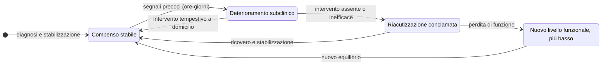
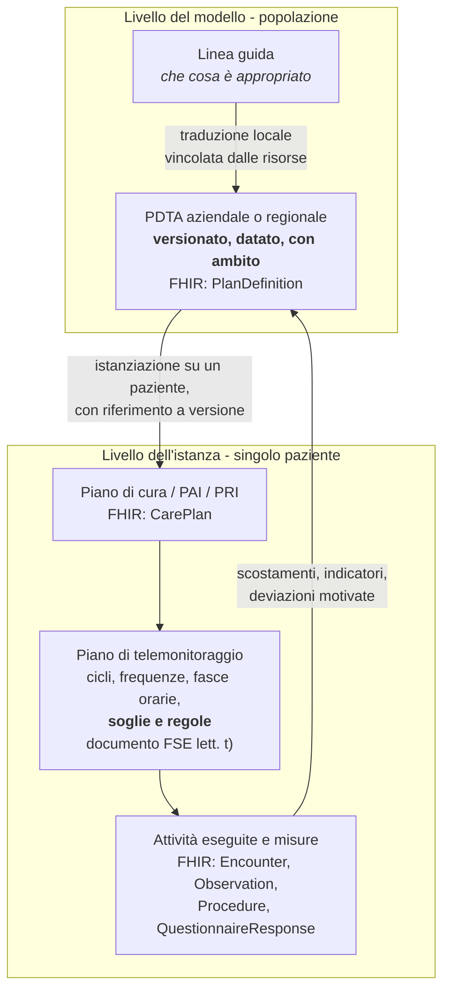
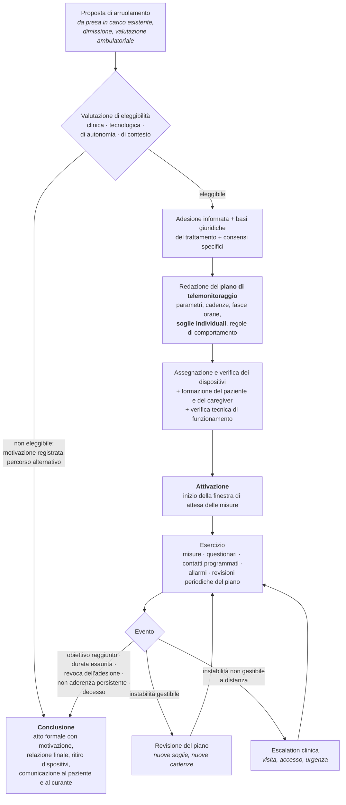
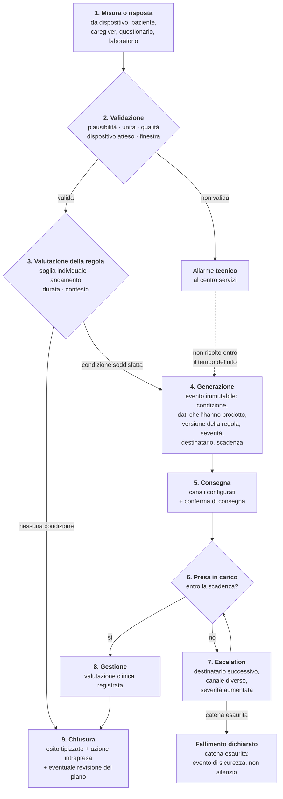
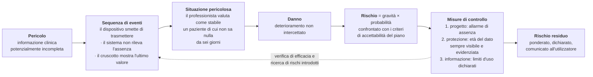

# Percorsi di cura e sicurezza del paziente

> **Avviso.** Questo è **materiale di formazione tecnica per chi sviluppa software**. Non è
> materiale clinico, non è una guida alla pratica medica, non è un protocollo assistenziale e
> non può essere usato per prendere, orientare o giustificare decisioni su persone reali. Le
> semplificazioni che seguono sono deliberate e servono a rendere comprensibile a un
> informatico *perché* certe scelte di progettazione sono obbligate. Un clinico che legga
> queste pagine le troverà ridotte all'osso: è voluto, e il suo contributo più utile è
> segnalare dove la riduzione ha prodotto un'imprecisione.
>
> **Nessun valore, soglia, punteggio o intervallo riportato in questo modulo ha natura
> prescrittiva.** Dove compaiono cifre, sono esempi didattici marcati come tali. Ciò che non è
> stato verificato su fonte primaria nel corso della redazione è marcato `[NV]`.

---

## 0. Che cosa risolve questo modulo

Chi arriva dall'informatica affronta il telemonitoraggio con un modello mentale preciso e
sbagliato: *un dispositivo produce misure, un servizio le ingerisce, una regola le confronta
con una soglia, un canale notifica qualcuno*. È il modello di un sistema di monitoraggio
infrastrutturale - CPU, memoria, latenza - trapiantato su un corpo umano. Funziona finché non
succede nulla, e fallisce esattamente nel momento in cui serve.

Fallisce per ragioni che non sono tecniche:

- **la soglia non è una costante**, perché lo stesso valore è normale per una persona e
  allarmante per un'altra, e per la stessa persona in due momenti diversi;
- **l'assenza di misura non è assenza di informazione**: è una delle informazioni più
  importanti che il sistema possa produrre, e trattarla come silenzio è una scelta con
  conseguenze cliniche;
- **notificare non è essere ascoltati**: un allarme che nessuno prende in carico entro un
  tempo definito non è un allarme, è un registro;
- **un allarme che suona troppo spesso smette di essere un allarme**, e questo non è un
  problema di esperienza utente ma un meccanismo documentato di produzione del danno;
- **calcolare un punteggio a partire da dati clinici** non è una funzione di utilità: è
  precisamente l'atto che qualifica il software come dispositivo medico e ne determina la
  classe di rischio.

Il modulo [09 - Il corpo, i parametri, il ragionamento clinico](09-fondamenti-clinici.md)
spiega *che cosa* si misura e come si ragiona su una misura isolata. Questo modulo spiega
*come si organizza la cura nel tempo* e *come si sbaglia in medicina*: le due conoscenze che
trasformano un'ingestione di dati in un servizio di telemonitoraggio, e un difetto di
usabilità in un rischio clinico.

L'organizzazione del sistema sanitario italiano - chi eroga, chi paga, quali strutture
territoriali esistono - è trattata nel modulo
[01 - Il sistema sanitario italiano](01-sistema-sanitario-italiano.md). Le definizioni
normative delle prestazioni - televisita, teleconsulto, telemonitoraggio, telecontrollo - sono
nel modulo [02 - Le prestazioni di telemedicina](02-prestazioni-di-telemedicina.md). Qui non
si ripetono: si rinvia.

---

## 1. Acuto e cronico: due modi di ammalarsi, due modi di curare

### 1.1 La malattia acuta

Una malattia **acuta** ha un inizio identificabile, un decorso relativamente breve e un esito
definito: guarigione, cronicizzazione o morte. Una polmonite, una frattura, un'appendicite,
un infarto miocardico. Il modello di cura corrispondente è **episodico**: il paziente entra in
contatto con il sistema, viene diagnosticato, trattato, dimesso, e il contatto si chiude.

Questo modello ha una proprietà che l'informatica riconosce immediatamente: è una
**transazione**. Ha un inizio, una fine, un esito, e la maggior parte dell'informazione
rilevante è contenuta dentro i suoi confini. Non a caso i sistemi informativi ospedalieri
storici sono costruiti attorno al **ricovero** e all'**accesso ambulatoriale**: unità di
lavoro discrete, contabilizzabili, chiudibili.

### 1.2 La malattia cronica

Una malattia **cronica** non ha una fine. Ha un momento di diagnosi - spesso arbitrario,
perché la condizione preesisteva alla sua individuazione - e da lì in avanti accompagna la
persona per il resto della vita. Diabete, ipertensione arteriosa, broncopneumopatia cronica
ostruttiva, scompenso cardiaco, insufficienza renale cronica, artrite reumatoide, molte
malattie neurologiche degenerative.

Le proprietà che contano per chi progetta software sono cinque.

**Non si guarisce, si controlla.** L'obiettivo terapeutico non è l'eliminazione della malattia
ma il mantenimento della persona in una condizione di **compenso**: la malattia c'è, i suoi
effetti sono contenuti entro limiti tollerabili, la funzione e la qualità di vita sono
preservate. Il successo non è un evento, è uno stato che dura.

**Il decorso è una traiettoria, non una sequenza di episodi.** Il valore clinico di una misura
sta quasi sempre nel suo **andamento**, non nel suo livello. Un peso corporeo di 78 kg non
significa nulla; 78 kg in una persona che tre giorni fa ne pesava 75 significa qualcosa di
molto preciso in un paziente con scompenso cardiaco. Un sistema che conserva l'ultimo valore e
sovrascrive i precedenti ha distrutto l'informazione clinica mantenendo il dato.

**L'evento acuto è dentro la cronicità, non fuori.** Una malattia cronica alterna periodi di
stabilità a **riacutizzazioni** (o esacerbazioni, o scompensi): peggioramenti rapidi che
possono richiedere un accesso in ospedale. La riacutizzazione è il principale determinante di
costo e di mortalità, e nella maggior parte dei casi **è preceduta da giorni di segnali
misurabili**. È l'intera ragione economica e clinica del telemonitoraggio: anticipare la
riacutizzazione di quarantotto ore può significare un aggiustamento di terapia a domicilio
invece di un ricovero.

**Il paziente è il principale attore della propria cura.** In una malattia acuta il paziente
subisce il trattamento; in una cronica lo esegue. Assume farmaci ogni giorno, misura
parametri, riconosce sintomi, decide quando chiamare. Questa capacità si chiama
**autogestione** (*self-management*), si insegna, e la si chiama **educazione terapeutica**.
Ne consegue che l'interfaccia rivolta al paziente **non è un accessorio del sistema clinico:
è uno strumento clinico**. Un modulo di inserimento manuale delle misure mal progettato non
produce cattiva esperienza utente, produce dati errati su cui qualcuno prenderà decisioni.

**La cura è multiprofessionale e distribuita.** Un paziente cronico non ha un medico: ha un
medico di medicina generale, uno o più specialisti, un infermiere di riferimento, spesso un
farmacista, spesso un caregiver, e attraversa più organizzazioni. Nessuno di questi soggetti
vede l'intero quadro. È la ragione strutturale per cui l'interoperabilità in sanità non è una
funzione di comodo (moduli [05](05-standard-di-interoperabilita.md),
[06](06-fhir-da-zero.md) e [07](07-fse-e-infrastrutture-nazionali.md)).

### 1.3 Multimorbilità, fragilità, complessità

Tre nozioni che si confondono e che il modello dati deve tenere distinte.

La **multimorbilità** è la coesistenza di due o più condizioni croniche nella stessa persona.
Non è la somma delle malattie: è una condizione a sé, perché le terapie interagiscono, gli
obiettivi terapeutici entrano in conflitto (abbassare la pressione fa bene al rene e può far
cadere un anziano) e i percorsi di cura, scritti ciascuno per una singola patologia, si
sovrappongono in modo incoerente.

La **fragilità** è una condizione di ridotta riserva funzionale: la persona fragile risponde a
uno stress modesto - un'infezione banale, un cambio di terapia, un ricovero breve - con un
peggioramento sproporzionato e spesso non reversibile. Non coincide con l'età né con la
malattia: esistono ottantenni non fragili e sessantenni fragili.

La **complessità assistenziale** aggiunge le dimensioni non cliniche: isolamento sociale,
condizione economica, condizione abitativa, capacità cognitiva, presenza o assenza di un
caregiver, alfabetizzazione sanitaria e digitale. È la dimensione che determina se un percorso
a distanza è realizzabile per quella persona, e va valutata **prima** dell'arruolamento
(§ 4.2).

> **Conseguenza progettuale immediata.** Un modello che rappresenta «la patologia del paziente»
> come attributo singolo non regge il dominio. Le condizioni sono N, ciascuna con la propria
> data di insorgenza, il proprio stato di attività e il proprio percorso; e le dimensioni non
> cliniche sono attributi della **persona nel suo contesto**, non della malattia. In FHIR R4 le
> condizioni sono risorse `Condition` distinte; nulla in questo dominio è un `enum` sul
> paziente.

### 1.4 Perché il sistema sanitario si è riorganizzato attorno alla cronicità

La ragione è demografica e aritmetica. Una popolazione che invecchia sposta il carico
assistenziale dagli episodi acuti alla gestione continuativa: la quota maggioritaria della
spesa sanitaria e della domanda di assistenza riguarda persone con una o più condizioni
croniche. Un sistema costruito attorno all'ospedale - cioè attorno all'episodio acuto - non
regge quel carico, perché usa la risorsa più costosa che possiede (il posto letto per acuti)
per un problema che quella risorsa non risolve: il posto letto stabilizza una riacutizzazione,
non gestisce una traiettoria.

La risposta organizzativa italiana è il **decreto del Ministro della salute 23 maggio 2022,
n. 77**, che ridisegna l'assistenza territoriale: Case della comunità, Ospedali di comunità,
Centrali operative territoriali, infermiere di famiglia o di comunità, assistenza domiciliare
integrata. Struttura, standard e conseguenze sono descritti nel modulo
[01, § 8](01-sistema-sanitario-italiano.md). Qui conta un solo punto, ed è quello che collega
il decreto a questo modulo:

> **In quel disegno la telemedicina non è un canale alternativo alla visita: è una modalità di
> erogazione collocata dentro un percorso.** Le prestazioni a distanza vivono dentro un piano
> assistenziale individuale o un percorso diagnostico-terapeutico assistenziale, non come atti
> isolati.

Da qui discende tutto il resto di questo modulo. Se la prestazione a distanza è un nodo di un
percorso, allora il percorso è un'entità di prima classe del modello dati (§ 3), l'ingresso
nel percorso è un atto formale (§ 4), il percorso definisce che cosa si misura e quando (§ 2 e
§ 7), e la mancata esecuzione di ciò che il percorso prevede è essa stessa un fatto clinico da
rilevare (§ 8).

### 1.5 La traiettoria: stabilità, riacutizzazione, declino

Un modello mentale sufficiente per chi scrive codice, con la consapevolezza che è una
semplificazione grossolana di una realtà molto più variabile:

Tre osservazioni che il diagramma rende evidenti.

**La finestra utile è nello stato di deterioramento subclinico**, quello in cui la persona non
si sente ancora male ma alcuni parametri hanno già iniziato a muoversi. È una finestra di ore
o giorni a seconda della patologia. Un sistema che campiona una volta a settimana non può
intercettarla; un sistema che campiona ogni giorno può, se qualcuno guarda il dato entro un
tempo compatibile.

**Il ritorno al compenso dopo una riacutizzazione non è un ritorno al punto di partenza.**
Ogni evento acuto tende a lasciare la persona su un livello funzionale più basso. È il motivo
per cui prevenire una riacutizzazione vale molto più che trattarla bene.

**La transizione più pericolosa è la dimissione dall'ospedale.** Il periodo immediatamente
successivo a un ricovero concentra un rischio elevato di riammissione. È il momento in cui il
telemonitoraggio ha il senso più difendibile, ed è anche il momento in cui la terapia è appena
cambiata e il paziente è meno in grado di gestirla.

### 1.6 Che cosa cambia, per il software, fra acuto e cronico

| Dimensione | Modello acuto | Modello cronico |
|---|---|---|
| Unità di lavoro | il contatto (`Encounter`) | il percorso (`CarePlan` / `EpisodeOfCare`) |
| Ciclo di vita | apri, esegui, chiudi | apri, e resta aperto per anni |
| Valore del dato | il valore assoluto | l'andamento nel tempo e lo scostamento dalla base individuale |
| Attore principale | il professionista | il paziente, sostenuto dal team |
| Assenza di dato | irrilevante | **è un dato** (§ 8) |
| Errore tipico | dato sbagliato | dato mancante, dato non guardato, dato guardato troppo tardi |
| Confine organizzativo | una struttura | più strutture e più professioni |
| Modello di persistenza | stato corrente | **serie storica**, con il tempo come dimensione di prima classe |

L'ultima riga è la ragione per cui il progetto adotta una base dati orientata alle serie
temporali per le misure: non è un'ottimizzazione, è una conseguenza del dominio.

---

## 2. Le patologie bersaglio del telemonitoraggio, e che cosa si misura in ciascuna

### 2.1 Il criterio: perché non tutte le malattie croniche sono monitorabili a distanza

Una condizione è un bersaglio realistico del telemonitoraggio quando soddisfa **tutte e
quattro** le seguenti proprietà. Se una manca, il servizio produce dati e non produce salute.

1. **Esiste un parametro misurabile a domicilio** con strumenti utilizzabili da un non
   professionista, il cui valore cambia *prima* che la persona stia male.
2. **Il deterioramento ha una latenza sufficiente**: fra il primo segnale misurabile e l'evento
   acuto passa un tempo compatibile con l'organizzazione del servizio. Se la latenza è di
   minuti, il telemonitoraggio non è lo strumento: lo è il sistema di emergenza.
3. **Esiste un'azione efficace** che il team può intraprendere a distanza o in tempi brevi:
   modificare un dosaggio, anticipare una visita, prescrivere un accertamento. Un allarme che
   non corrisponde ad alcuna azione possibile è rumore, e per giunta genera ansia nel paziente.
4. **Il paziente o il caregiver sono in grado di eseguire la misura** in modo sufficientemente
   costante e corretto. Questa è una proprietà della persona, non della malattia, e si valuta
   in fase di arruolamento (§ 4.2).

Il quarto criterio è quello che il progetto tende a sottovalutare, perché è l'unico che non
dipende dalla tecnologia. È anche quello che decide se il servizio funziona.

### 2.2 Scompenso cardiaco

**Che cos'è, in due righe utili a un informatico.** Il cuore non riesce a spingere in circolo
una quantità di sangue adeguata alle richieste dell'organismo. Il corpo compensa trattenendo
liquidi; i liquidi si accumulano nei polmoni e negli arti inferiori; l'accumulo peggiora la
funzione respiratoria e cardiaca. La riacutizzazione - lo *scompenso acuto* - è tipicamente
una crisi di congestione, e la congestione **si costruisce nell'arco di giorni**.

**Che cosa si misura, e perché.**

| Parametro | Perché proprio questo |
|---|---|
| **Peso corporeo**, quotidiano, a digiuno, con la stessa bilancia | È il proxy più diretto della ritenzione di liquidi: un aumento rapido di peso, in assenza di variazioni alimentari, è **acqua**, non tessuto. È la misura per cui il telemonitoraggio dello scompenso esiste. Richiede però condizioni di misura standardizzate: stessa ora, stessa bilancia, stesso abbigliamento. Senza standardizzazione, il rumore supera il segnale |
| **Pressione arteriosa** | Orienta l'aggiustamento della terapia e intercetta sia l'ipotensione da farmaco sia l'ipertensione che aggrava il carico sul cuore |
| **Frequenza cardiaca** e regolarità del ritmo | Le aritmie sono causa e conseguenza di scompenso |
| **Saturazione periferica di ossigeno** | Indice indiretto di congestione polmonare |
| **Sintomi riferiti**, raccolti con questionario strutturato: affanno a riposo o da sforzo, numero di cuscini per dormire, gonfiore alle caviglie, affaticamento | Il sintomo spesso precede o accompagna la misura, e talvolta è l'unico segnale disponibile. Va raccolto in forma strutturata (`QuestionnaireResponse`), non come testo libero, altrimenti non è confrontabile nel tempo |
| **Aderenza alla terapia** e all'apporto di liquidi e sale | La causa più frequente di riacutizzazione non è il peggioramento della malattia: è l'interruzione o l'errore terapeutico |

**Che cosa il sistema non può dedurre.** Un aumento di peso può essere congestione, può essere
un errore di misura, può essere un pasto abbondante, può essere una bilancia diversa. Il
sistema rileva lo scostamento e lo sottopone a valutazione; **non conclude**.

### 2.3 Broncopneumopatia cronica ostruttiva

**Che cos'è.** Una limitazione persistente del flusso d'aria nelle vie aeree, non
completamente reversibile, tipicamente conseguente a esposizione prolungata al fumo di tabacco
o a inquinanti. Il decorso è puntellato da **esacerbazioni**: peggioramenti acuti della
sintomatologia respiratoria, spesso su base infettiva, che richiedono modifica della terapia e
che possono portare a insufficienza respiratoria.

**Che cosa si misura, e perché.**

| Parametro | Perché proprio questo |
|---|---|
| **Saturazione periferica di ossigeno** | Misura non invasiva della quantità di ossigeno trasportata dal sangue. È il parametro cardine, ed è anche il parametro su cui si commette l'errore di soglia più grave descritto al § 7.10 |
| **Frequenza respiratoria** | Aumenta precocemente nel deterioramento respiratorio, spesso prima della saturazione. È anche il parametro più difficile da autorilevare correttamente |
| **Sintomi strutturati**: variazione della tosse, colore e quantità dell'espettorato, affanno, uso del farmaco al bisogno | L'esacerbazione è definita clinicamente su base sintomatologica prima che strumentale |
| **Numero di erogazioni del broncodilatatore al bisogno** | Proxy di aderenza e di instabilità: l'aumento del ricorso al farmaco di soccorso precede l'esacerbazione |
| **Frequenza cardiaca** | Aumenta nel distress respiratorio |
| **Temperatura corporea** | Orienta verso l'origine infettiva |

**Che cosa il sistema non può dedurre.** Una saturazione bassa può essere ipossiemia vera,
oppure mani fredde, smalto sulle unghie, movimento, posizionamento errato del sensore, o
perfusione periferica ridotta. Il modulo [09](09-fondamenti-clinici.md) tratta i limiti di
misura; qui basta la conseguenza progettuale: **ogni misura va accompagnata dai suoi metadati
di qualità** e da un canale per dichiarare che la misura non è attendibile.

### 2.4 Diabete mellito

**Che cos'è.** Un'alterazione della regolazione del glucosio nel sangue, per carenza di
insulina o per resistenza dei tessuti alla sua azione. Il danno si produce su due scale
temporali diverse, e questo è il punto che interessa a chi progetta: **acutamente**, per valori
troppo bassi (ipoglicemia, che può portare a perdita di coscienza nell'arco di minuti) o
troppo alti con complicanze metaboliche; **cronicamente**, per l'esposizione prolungata a
valori elevati, che danneggia rene, retina, nervi e vasi nell'arco di anni.

**Che cosa si misura, e perché.**

| Parametro | Perché proprio questo |
|---|---|
| **Glicemia capillare** o **monitoraggio continuo del glucosio** | La glicemia capillare è un punto nel tempo; il monitoraggio continuo produce una serie densa (decine o centinaia di valori al giorno) con metriche derivate come il tempo trascorso entro l'intervallo obiettivo. Le due sorgenti **non sono lo stesso dato** e non vanno mescolate in un'unica serie senza qualificarne la provenienza e il metodo |
| **Emoglobina glicata** | Indicatore dell'esposizione media al glucosio nei mesi precedenti. **Non è misurabile a domicilio**: proviene dal laboratorio ed entra nel sistema per integrazione, non per ingestione da dispositivo |
| **Peso, pressione, profilo lipidico** | Il diabete si gestisce insieme al rischio cardiovascolare complessivo, non isolatamente |
| **Ispezione del piede** | La perdita di sensibilità rende invisibili al paziente lesioni che evolvono gravemente. È una valutazione che a distanza si fa con immagini e questionari strutturati, con tutti i limiti del caso |
| **Dose di insulina somministrata, pasti, attività fisica** | Senza il contesto, un valore di glicemia è quasi inutilizzabile: lo stesso numero significa cose opposte prima o dopo un pasto |

**Il punto critico per l'architettura.** Il diabete è l'unica delle cinque condizioni in cui
esiste una **emergenza a latenza di minuti** (l'ipoglicemia grave). Un servizio di
telemonitoraggio a revisione periodica **non è il canale adeguato** per quell'evento, e il
sistema deve dirlo esplicitamente al paziente, non lasciarlo dedurre (§ 6.5). È anche la
condizione in cui la tentazione di suggerire un dosaggio è più forte: farlo sposta il software
in una classe di rischio superiore e cambia l'intero percorso regolatorio (modulo
[15](15-regolatorio-da-zero.md)).

### 2.5 Ipertensione arteriosa

**Che cos'è.** Una pressione del sangue nelle arterie stabilmente più alta di quanto sia
compatibile con la protezione a lungo termine di cuore, cervello e rene. È quasi sempre
asintomatica: il paziente non «sente» la pressione alta, e questa è la ragione per cui
l'aderenza terapeutica nell'ipertensione è strutturalmente bassa.

**Che cosa si misura, e perché.**

| Parametro | Perché proprio questo |
|---|---|
| **Pressione arteriosa sistolica e diastolica**, misurata a domicilio secondo un protocollo (posizione, riposo preliminare, braccio, numero di misurazioni consecutive, orari) | La misurazione domiciliare ha valore proprio, **diverso** da quella in ambulatorio: elimina l'effetto da camice bianco e produce una media su più rilevazioni. Il dato clinicamente utile è la **media delle misurazioni di un periodo**, non la singola rilevazione |
| **Frequenza cardiaca**, rilevata insieme alla pressione | Orienta la scelta della classe di farmaco e intercetta le aritmie |
| **Aderenza alla terapia** | Prima causa di apparente inefficacia del trattamento |
| **Sintomi di allarme**: cefalea intensa e improvvisa, disturbi visivi, deficit neurologici focali, dolore toracico | Non servono a monitorare l'ipertensione: servono a riconoscere che si è usciti dal perimetro del monitoraggio ed è necessaria l'urgenza (§ 6.4) |

**Il punto critico per l'architettura.** L'ipertensione è la condizione in cui la
**visualizzazione al paziente di ogni singolo valore** produce più danno che beneficio: la
variabilità fisiologica fra due misurazioni consecutive è ampia, e mostrare ogni oscillazione
con un semaforo rosso o verde genera ansia, misurazioni ripetute compulsive e chiamate
improprie. Il modo in cui il dato viene restituito al paziente **è una decisione clinica**, non
una scelta di interfaccia, e va configurata dal professionista.

### 2.6 Insufficienza renale cronica

**Che cos'è.** Una riduzione progressiva e irreversibile della capacità del rene di filtrare il
sangue, eliminare scorie e regolare acqua ed elettroliti. È stadiata su una misura di funzione
calcolata a partire da un esame di laboratorio. Nelle fasi avanzate richiede terapia
sostitutiva: dialisi o trapianto.

**Che cosa si misura, e perché.**

| Parametro | Perché proprio questo |
|---|---|
| **Pressione arteriosa** | È insieme causa e conseguenza del danno renale; il controllo pressorio è il principale strumento per rallentare la progressione |
| **Peso corporeo** e stima del bilancio dei liquidi | Il rene che non elimina produce sovraccarico di liquidi, con le stesse conseguenze descritte per lo scompenso |
| **Diuresi** (quantità di urina prodotta), quando rilevabile | Indicatore diretto di funzione, ma difficile da autorilevare con accuratezza |
| **Esami di laboratorio**: creatinina, elettroliti, emoglobina | Non domiciliari: entrano per integrazione. La **potassiemia** è il parametro con il potenziale di danno acuto più alto, e non è telemonitorabile |
| **Parametri della dialisi peritoneale domiciliare**, quando presente | È il caso in cui il domicilio ospita una terapia, non solo una misura: cambia il profilo di rischio e i requisiti di continuità del servizio |

**Il punto critico per l'architettura.** In questa condizione la parte più pericolosa del
quadro clinico **non è misurabile a casa**. Il sistema deve rappresentare esplicitamente il
fatto che ciò che monitora è un sottoinsieme del quadro, e che un profilo «tutto verde» sui
parametri domiciliari **non significa stabilità clinica**. È il caso più chiaro in cui una
cruscotto rassicurante è un rischio: si chiama *falsa rassicurazione* ed è uno scenario d'uso
pericoloso da inserire nel file di rischio (§ 9.8).

### 2.7 Tabella di sintesi

| Condizione | Parametri domiciliari tipici | Segnale precoce di deterioramento | Latenza tipica del deterioramento | Ciò che sfugge al monitoraggio domiciliare |
|---|---|---|---|---|
| Scompenso cardiaco | peso, pressione, frequenza cardiaca, saturazione, sintomi | incremento ponderale rapido, affanno crescente | giorni `[NV]` | aritmie intermittenti, funzione renale |
| Broncopneumopatia cronica ostruttiva | saturazione, frequenza respiratoria, sintomi, uso del farmaco al bisogno | aumento della tosse e dell'espettorato, incremento del farmaco al bisogno | giorni `[NV]` | scambi gassosi reali (richiedono emogasanalisi) |
| Diabete | glicemia o monitoraggio continuo, contesto (pasti, insulina), peso | oscillazioni, ipoglicemie ricorrenti | **minuti** per l'ipoglicemia; anni per le complicanze | emoglobina glicata, complicanze d'organo |
| Ipertensione | pressione, frequenza cardiaca, aderenza | media pressoria in salita su più rilevazioni | settimane-mesi | danno d'organo, eventi cerebrovascolari acuti |
| Insufficienza renale cronica | pressione, peso, diuresi, parametri dialitici | sovraccarico di liquidi | giorni-settimane `[NV]` | **potassiemia**, funzione renale, anemia |

> `[NV]` Le latenze indicate sono ordini di grandezza a fini didattici, ricavati dalla logica
> fisiopatologica e non da fonti primarie verificate nel corso di questa redazione. Non vanno
> usate per dimensionare finestre di allarme: quelle sono decisioni cliniche del piano di
> monitoraggio (§ 7.9).

### 2.8 Quattro conseguenze progettuali che discendono già da qui

1. **Il catalogo dei parametri è configurazione, non codice.** Cinque condizioni producono
   insiemi di parametri diversi e parzialmente sovrapposti; un paziente multimorbido li combina
   in modi non prevedibili a priori. L'unità osservabile è il singolo parametro con la sua
   codifica, non un profilo per patologia.
2. **Le condizioni di misura sono parte della misura.** Ora, posizione, dispositivo, braccio,
   prima o dopo il pasto, a digiuno o no. Un valore senza le sue condizioni non è confrontabile
   con sé stesso nel tempo. In FHIR queste informazioni hanno una collocazione precisa e non
   sono note testuali.
3. **La provenienza cambia il significato.** Misura da dispositivo, inserimento manuale del
   paziente, inserimento del caregiver, dato di laboratorio importato, risposta a questionario:
   cinque sorgenti con affidabilità diverse, che devono restare distinguibili per sempre. Una
   colonna `value` senza `source` è un difetto strutturale.
4. **Il sistema conosce meno di quanto sembri.** Ciò che non è monitorato deve essere
   dichiarato, non taciuto: l'interfaccia clinica deve rendere evidente il perimetro del piano,
   perché un professionista che guarda una schermata verde sotto pressione di tempo conclude
   naturalmente che va tutto bene.

---

## 3. PDTA, piano di cura, piano assistenziale individuale

### 3.1 Che cos'è un PDTA

**PDTA** sta per **percorso diagnostico terapeutico assistenziale**. È un documento che
descrive, per una determinata condizione clinica e in un determinato contesto organizzativo,
**la sequenza attesa degli atti** che compongono la presa in carico: chi valuta il paziente,
con quali criteri lo si include, quali accertamenti si eseguono e con quale cadenza, quali
professionisti intervengono e in quale ordine, quali sono i punti di decisione, quali sono i
criteri di uscita, e con quali indicatori si misura se il percorso funziona.

Le tre lettere non sono ridondanti e sciogliere la sigla serve a capire il perimetro:

- **diagnostico** - la parte di accertamento: che cosa si fa per stabilire la condizione e per
  stadiarla;
- **terapeutico** - la parte di trattamento: farmaci, procedure, interventi;
- **assistenziale** - la parte di presa in carico continuativa: educazione, follow-up,
  supporto, coordinamento. È la parte che in un modello ospedalocentrico non esisteva ed è
  quella dentro cui vive la telemedicina.

Un PDTA **non è una linea guida**. La distinzione è sostanziale e va tenuta ferma nel modello
dati:

| | Linea guida | PDTA |
|---|---|---|
| Origine | società scientifiche, istituti nazionali, gruppi di lavoro internazionali | l'organizzazione che eroga: Regione, azienda sanitaria, rete di strutture |
| Oggetto | che cosa è appropriato fare, sulla base delle prove disponibili | come *questa* organizzazione realizza ciò che è appropriato, con le risorse che ha |
| Ambito | tendenzialmente universale | **locale**: dipende dalle strutture, dal personale, dai servizi effettivamente disponibili |
| Forma | raccomandazioni graduate per forza e qualità della prova | sequenza di attività, responsabilità, tempi e criteri |
| Effetto sul sistema informativo | nessuno diretto | **determina che cosa il sistema deve poter rappresentare** |

Un PDTA è quindi la traduzione locale, organizzativamente vincolata, di ciò che le linee guida
dicono in astratto. Due aziende della stessa Regione possono avere PDTA diversi per la stessa
patologia perché una ha un ambulatorio dedicato e l'altra no.

### 3.2 Chi lo scrive e con quale forza

Il PDTA viene redatto da un gruppo di lavoro multiprofessionale - specialisti della branca,
medici di medicina generale, infermieri, farmacisti, professionisti della riabilitazione,
direzione sanitaria, spesso rappresentanti dei pazienti - e viene **adottato con un atto
formale** dell'organizzazione: una deliberazione regionale, una delibera aziendale, un
provvedimento del direttore sanitario.

Da questo discendono tre proprietà che il software deve rispettare.

**È versionato e datato.** Un PDTA ha una data di adozione, una versione, e prima o poi una
revisione. Un paziente arruolato sotto la versione 2 deve poter essere descritto, anche anni
dopo, in termini di quella versione: se il sistema conserva solo il percorso corrente, la
ricostruzione a posteriori di ciò che era previsto per quel paziente è impossibile. È un
requisito di tracciabilità clinica prima che di conformità.

**Ha un ambito di validità.** Vale per una Regione, per un'azienda, per una rete, e ha una
data di decorrenza. L'ambito è un attributo del percorso, non del paziente.

**Non è auto-applicativo.** Il PDTA descrive il percorso atteso; il singolo paziente può
legittimamente deviarne, perché la clinica reale non è mai identica al modello. La **deviazione
motivata è la norma, non l'eccezione**, e un sistema che la impedisce o che la rende costosa
da registrare produce due effetti, entrambi dannosi: i professionisti aggirano il sistema, e la
documentazione perde il motivo per cui si è deviato - che è esattamente l'informazione clinica
più preziosa.

### 3.3 Come è strutturato

La struttura ricorrente, indipendentemente dalla patologia, è composta da elementi che hanno
tutti una controparte nel modello dati:

1. **Popolazione target e criteri di inclusione ed esclusione** - chi entra nel percorso e chi
   no. Sono predicati valutabili, non descrizioni.
2. **Nodi del percorso** - le attività previste: valutazioni, accertamenti, contatti,
   interventi educativi. Ciascuna con un attore, una cadenza attesa e un esito atteso.
3. **Punti di decisione** - i momenti in cui il percorso si biforca in base a un esito. È qui
   che un percorso si distingue da una lista di attività.
4. **Responsabilità** - chi fa che cosa. Include tipicamente l'individuazione di un
   professionista di riferimento per la continuità (§ 4.5).
5. **Tempi e finestre** - entro quanto ciascuna attività deve avvenire dopo l'evento che la
   innesca. Sono i vincoli che generano i solleciti e i mancati adempimenti.
6. **Criteri di transizione e di uscita** - quando il paziente passa a un altro percorso,
   quando esce, quando si conclude.
7. **Indicatori** - di processo (quante delle attività previste sono state eseguite nei tempi)
   e di esito (che cosa è successo ai pazienti). Servono a valutare il percorso, non il
   paziente.

### 3.4 Perché varia per Regione e per azienda

La ragione è costituzionale prima che organizzativa: la tutela della salute è materia di
legislazione concorrente, e l'organizzazione dei servizi sanitari è competenza regionale. Il
modulo [01, § 2](01-sistema-sanitario-italiano.md) spiega perché in Italia non esiste «un»
sistema sanitario ma ventuno, e perché questo è il vincolo dominante per qualunque software
sanitario nazionale.

Applicato ai percorsi, significa che per la stessa patologia coesistono legittimamente:

- criteri di ingresso diversi;
- cadenze di follow-up diverse;
- professionisti diversi nel medesimo ruolo (in una Regione il caso è seguito dallo
  specialista, in un'altra dall'infermiere di famiglia con supervisione);
- documenti prodotti diversi;
- parametri monitorati diversi, con periodicità diverse;
- soglie di allerta diverse.

**Nessuna di queste varianti è un errore da normalizzare.** Sono configurazioni legittime dello
stesso dominio. Un prodotto che ne cabla una sola non è «opinionato»: è inutilizzabile fuori dal
contesto per cui è stato scritto.

### 3.5 Piano di cura, PAI, PRI, piano di telemonitoraggio: quattro cose distinte

Sono termini che circolano come sinonimi e non lo sono. Confonderli produce un modello dati che
non riesce a rappresentare un paziente reale.

| Termine | Che cos'è | Ambito | Chi lo redige |
|---|---|---|---|
| **PDTA** | il **modello** del percorso per una condizione, in un'organizzazione | popolazione | gruppo di lavoro, adottato con atto formale |
| **Piano di cura** | l'**istanza** sul singolo paziente: che cosa si è deciso di fare per lui, con quali obiettivi e con quale calendario | individuale | il professionista o l'équipe che lo ha in carico |
| **PAI - piano assistenziale individuale** | il piano della presa in carico **integrata** di un paziente, tipicamente complesso o in assistenza domiciliare, redatto da un'équipe multiprofessionale; comprende la dimensione sanitaria e quella sociale | individuale | unità di valutazione multidimensionale / équipe |
| **PRI - progetto riabilitativo individuale** | il contenitore obbligatorio delle prestazioni di riabilitazione, teleriabilitazione compresa (modulo [02, § 4.7](02-prestazioni-di-telemedicina.md)) | individuale | professionista della riabilitazione, con il medico |
| **Piano di telemonitoraggio** | il documento che definisce *operativamente* il monitoraggio a distanza: cicli, durata, attività per ciclo, frequenza delle rilevazioni, fascia oraria, tipo di rilevazione, **soglie di allarme** e **regole di comportamento** in caso di violazione | individuale | il professionista responsabile |

L'ultimo è quello che tocca direttamente il codice. Il modulo
[02, § 4.5.4](02-prestazioni-di-telemedicina.md) ne riporta il contenuto informativo così come
lo definisce il **DM 19 novembre 2025** (Allegato 1, § 2.24): numero di cicli, durata del
ciclo, numero di attività per ciclo, frequenza espressa in forma codificata, fascia oraria,
durata prevista massima di un anno, tipo di rilevazione (intermediato oppure a ciclo chiuso),
soglia di allarme e regole descrittive del comportamento in caso di violazione delle soglie.

**Il piano di telemonitoraggio è, di fatto, la configurazione runtime del motore di allarme,
scritta da un clinico e firmata digitalmente.** Questa frase è il ponte fra tutto ciò che
precede e il § 7: le soglie non sono un file di configurazione del sistema, sono il contenuto
di un documento sanitario individuale.

### 3.6 Modello e istanza: la distinzione da cui dipende tutto il resto

Le regole che discendono dal diagramma, e che vanno rispettate senza eccezioni:

1. **Il modello e l'istanza sono entità diverse.** In FHIR R4 sono `PlanDefinition` e
   `CarePlan`. Fonderli rende impossibile versionare il protocollo e ricostruire che cosa era
   previsto al momento di una decisione.
2. **L'istanza porta il riferimento alla versione del modello** da cui è nata. Non al modello:
   alla versione.
3. **La deviazione è rappresentabile e motivabile.** Il piano di cura può discostarsi dal
   percorso; lo scostamento è un fatto da registrare con la sua motivazione, non un errore di
   validazione.
4. **Il ritorno di informazione dall'istanza al modello è una funzione, non un effetto
   collaterale.** Gli indicatori del percorso si calcolano sulle istanze; senza quel ritorno il
   PDTA non è valutabile e la direzione sanitaria non ha strumenti per correggerlo.

### 3.7 Che cosa comporta per un software che deve supportarne più d'uno

Il requisito è: **supportare N percorsi senza cablarne nessuno**. Operativamente significa
sette cose.

1. **Nessun percorso nel codice.** Nessuna classe `PdtaScompenso`, nessun `switch` sulla
   patologia, nessuna costante di frequenza. Il percorso è un **dato**, caricato,
   validato e versionato come un dato.
2. **Un linguaggio di descrizione del percorso** sufficientemente espressivo da rappresentare
   attività, cadenze, punti di decisione, responsabilità e criteri, e sufficientemente
   ristretto da non diventare un linguaggio di programmazione arbitrario eseguito in
   produzione. Il confine è delicato: un motore troppo potente diventa una superficie di
   attacco e un oggetto impossibile da validare ai fini regolatori.
3. **Versionamento con immutabilità.** Una versione pubblicata non si modifica: si supera con
   una nuova versione. Le istanze in corso restano agganciate alla versione con cui sono nate,
   e l'eventuale migrazione a una versione successiva è un atto esplicito, deciso da un
   professionista e tracciato.
4. **Ambito e tenancy.** Ogni percorso appartiene a un tenant e a un ambito organizzativo
   (vincolo **V4** del progetto). Il catalogo dei percorsi di un tenant non è visibile agli
   altri, e un percorso «nazionale» che valga per tutti è una configurazione, non un
   presupposto.
5. **Validazione al caricamento, non all'esecuzione.** Un percorso incoerente - un nodo
   irraggiungibile, una cadenza senza unità, una soglia senza parametro, un ciclo infinito -
   deve essere rifiutato al momento della pubblicazione, con un messaggio comprensibile a chi
   lo ha redatto, non fallire quando un paziente ci passa dentro.
6. **Nessuna soglia nel percorso di popolazione.** Il PDTA può indicare intervalli di
   riferimento e regole generali, ma la soglia che governa l'allarme di un paziente è nel
   **suo** piano (§ 7.9). Il percorso propone; il piano individuale dispone.
7. **Tracciabilità del perché.** Per ogni attività eseguita deve essere ricostruibile da quale
   nodo del percorso derivava, e per ogni attività non eseguita deve essere ricostruibile se
   era prevista e non è avvenuta (§ 8).

> **L'errore che si paga più caro.** Modellare il percorso come una macchina a stati cablata
> con i nomi delle fasi di un PDTA reale. Funziona benissimo con il primo cliente, richiede una
> nuova versione del software per il secondo, e diventa ingestibile al terzo. In un dominio in
> cui ogni Regione e ogni azienda possono avere il proprio percorso, la configurabilità del
> percorso non è una funzione avanzata: è il prodotto.

---

## 4. Presa in carico e arruolamento

### 4.1 Presa in carico non significa «avere un appuntamento»

La **presa in carico** è l'assunzione formale di responsabilità clinica continuativa su un
problema di salute da parte di una struttura o di un professionista. Ha tre proprietà che la
distinguono da un contatto:

- **è continuativa**: non si esaurisce con l'atto, dura finché non viene formalmente conclusa;
- **è responsabilizzante**: individua qualcuno che risponde della continuità, non solo
  dell'esecuzione del singolo atto;
- **è formale**: nasce con un atto e finisce con un atto, entrambi tracciati.

Il contenitore naturale nel modello dati è l'**episodio di cura** (`EpisodeOfCare` in FHIR),
distinto sia dalla cartella clinica (che è il repository) sia dal percorso (che è il
protocollo). La presa in carico è inoltre una delle condizioni che rendono ammissibile la
televisita, e quindi non è un'informazione descrittiva ma una **precondizione verificabile**
(modulo [02, § 4.1.4](02-prestazioni-di-telemedicina.md)).

L'**arruolamento** è il caso particolare della presa in carico in un servizio strutturato di
telemedicina, tipicamente di telemonitoraggio. Precede l'agenda: un paziente arruolato non ha
necessariamente appuntamenti, ma ha un piano, ha un team e ha un'attesa di misure.

### 4.2 Chi decide, e con quali criteri

La decisione di arruolare un paziente in telemonitoraggio è **una decisione clinica**, assunta
da un professionista abilitato nell'ambito della presa in carico. Non è una decisione
amministrativa, non è un'iscrizione a un servizio, non può essere una funzione di
auto-registrazione del paziente. Un sistema che consenta a un paziente di «attivare il
telemonitoraggio» senza un atto professionale a monte non sta offrendo un servizio: sta
producendo dati senza destinatario responsabile.

I criteri di eleggibilità sono di quattro nature, e devono essere **tutti** soddisfatti.

**Criteri clinici.** La condizione rientra fra quelle per cui il percorso prevede il
monitoraggio; il paziente è nella fase di malattia in cui il monitoraggio è utile; non ci sono
condizioni concomitanti che lo rendano inefficace o pericoloso. È il criterio più ovvio ed è
l'unico che il software non deve mai valutare da sé.

**Criteri tecnologici.** Esiste al domicilio una connettività sufficiente e stabile; i
dispositivi previsti dal piano sono disponibili, funzionanti, tarati e assegnati (in Italia con
un documento dedicato, il *tesserino dispositivi*, che riporta l'identificativo unico del
dispositivo e il fabbricante - modulo
[02, § 4.5.4](02-prestazioni-di-telemedicina.md)); esiste un dispositivo di accesso
all'interfaccia; esiste un'alimentazione affidabile.

**Criteri di autonomia e di competenza.** Il paziente o il caregiver sono in grado di eseguire
la misura correttamente, di riconoscere i sintomi rilevanti, di usare l'interfaccia, di
rispondere a una chiamata. Comprende la valutazione della capacità cognitiva, sensoriale e
motoria, e l'alfabetizzazione digitale. Il **Modello orientativo AGENAS** per la televisita
chiama questa dimensione *verifica della compliance digitale dell'assistito* e la colloca come
fase distinta dall'adesione informata e dal consenso al trattamento (modulo
[02, § 4.1.4](02-prestazioni-di-telemedicina.md)).

**Criteri di contesto.** Presenza e affidabilità di un caregiver quando necessario; condizione
abitativa; distanza dai servizi; capacità di raggiungere un presidio in caso di necessità.
Sono criteri che appartengono alla complessità assistenziale (§ 1.3) e che decidono se il
percorso a distanza è realizzabile, indipendentemente dal fatto che sia clinicamente indicato.

> **Distinzione da non perdere.** L'**eleggibilità** è la verifica che *questo paziente* possa
> ricevere *quella prestazione* in *quel canale*: è una valutazione clinico-organizzativa. Il
> **diritto amministrativo alla prestazione** - esenzione, copertura, titolo di accesso - è
> tutt'altro, si valuta altrove e con altri dati. Sono due controlli distinti che il linguaggio
> corrente confonde e che il modello dati non deve confondere.

### 4.3 I consensi: quali e perché sono più d'uno

L'arruolamento richiede manifestazioni di volontà distinte, con basi giuridiche, revocabilità
ed effetti diversi. Il modulo [03 - Il dato clinico](03-il-dato-clinico.md) le tratta a fondo e
il modulo [02, § 10](02-prestazioni-di-telemedicina.md) ne riassume la disciplina di settore.
Qui basta la mappa e la ragione per cui unificarle è l'errore più costoso del dominio:

| Manifestazione | Natura | Effetto della revoca |
|---|---|---|
| **Adesione informata alla prestazione in telemedicina** | atto clinico: il paziente accetta di ricevere *quella* prestazione attraverso *quel* canale | il percorso a distanza si interrompe e va riorganizzato in presenza |
| **Consenso o altra base giuridica per il trattamento dei dati** | atto privacy, con basi giuridiche proprie; per la finalità di cura tipicamente **non è il consenso** | se fosse consenso, la revoca bloccherebbe la cura: è precisamente il motivo per cui non lo si usa dove non serve |
| **Consenso alla registrazione della sessione** | ulteriore, specifico, **per sessione**, revocabile | cessa la registrazione, con effetto immediato e tracciato |
| **Consenso alla presenza di terzi** (interprete, discente, caregiver) | specifico per sessione e per soggetto | il terzo non è ammesso |
| **Adesione all'assegnazione del dispositivo** | riconoscimento della consegna, degli obblighi di custodia e delle istruzioni ricevute | restituzione del dispositivo |

Ciascuna di queste manifestazioni è valida **solo rispetto alla versione del testo informativo
vigente al momento**: un consenso non riferito a un testo versionato è indimostrabile.

### 4.4 Chi segue e chi risponde

Un servizio di telemonitoraggio senza risposta non è un servizio. La domanda operativa - *chi
guarda i dati, chi risponde all'allarme, entro quanto* - ha una risposta organizzativa che il
software deve rappresentare, non presupporre.

Le figure ricorrenti:

- **il professionista responsabile del piano**, che lo redige, ne fissa le soglie e ne risponde
  clinicamente. Tipicamente il medico specialista o il medico di medicina generale a seconda
  del percorso;
- **il case manager**, figura di coordinamento della presa in carico - frequentemente un
  infermiere - che è il punto di contatto continuativo del paziente, sorveglia l'andamento,
  esegue i contatti programmati e attiva chi serve. È elencato fra i micro-servizi essenziali
  del telemonitoraggio dal DM 19 novembre 2025 (modulo
  [02, § 6.3](02-prestazioni-di-telemedicina.md));
- **il centro erogatore**, con compiti sanitari, che gestisce gli **alert sanitari**;
- **il centro servizi**, con compiti tecnici - manutenzione, account, help desk, distribuzione
  e sanificazione dei dispositivi - che gestisce gli **alert tecnici**.

L'ultima distinzione è normativa e non organizzativa a discrezione: il DM 21 settembre 2022
separa i due centri e attribuisce a ciascuno una categoria di allarmi (modulo
[02, § 6.4](02-prestazioni-di-telemedicina.md)). **Si riflette direttamente nel modello di
autorizzazione**: chi gestisce gli allarmi tecnici non deve poter accedere al contenuto
clinico, e chi gestisce gli allarmi sanitari non deve dipendere dal turno tecnico per essere
raggiunto. È anche la ragione per cui la classificazione tecnico/clinico di un allarme deve
essere un attributo dell'allarme e non un'inferenza fatta al momento della notifica (§ 7.5).

### 4.5 La copertura oraria dichiarata è un requisito di sicurezza

Questo paragrafo enuncia il punto più importante della sezione.

Un servizio di telemonitoraggio dichiara una **copertura**: le fasce orarie e i giorni in cui
esiste qualcuno che guarda i dati e risponde agli allarmi, e i tempi entro cui risponde. Il
DM 21 settembre 2022 pone per le infrastrutture regionali livelli di servizio **H24 7/7** con
tempi di presa in carico e ripristino graduati per severità (modulo
[02, § 6.4](02-prestazioni-di-telemedicina.md)).

La tentazione, per chi arriva dal software commerciale, è leggere la copertura come un
parametro di listino: più copertura, più costo, più valore. **In un servizio clinico non è
così, e la ragione è strutturale.**

Nel momento in cui un paziente viene arruolato, gli si dice - esplicitamente o
implicitamente - che qualcuno guarderà i suoi dati. Da quel momento il paziente **modifica il
proprio comportamento**: attribuisce al servizio una funzione di sorveglianza, e in una certa
misura smette di essere l'unico sorvegliante di sé stesso. Questo fenomeno ha un nome, si
chiama **falsa rassicurazione**, ed è la ragione per cui la copertura è un elemento di
sicurezza:

- se la copertura è **dichiarata correttamente**, il paziente sa che di notte deve rivolgersi
  altrove e lo fa. Il servizio ha ridotto il rischio;
- se la copertura è **dichiarata in modo ambiguo** - o non dichiarata affatto, che è la stessa
  cosa - il paziente attende una risposta che non arriverà, e ritarda l'accesso al canale
  corretto. **Il servizio ha aumentato il rischio rispetto alla situazione in cui non
  esisteva.**

Un servizio di telemonitoraggio mal dichiarato è quindi più pericoloso dell'assenza di
servizio. È un caso da manuale di **pericolo introdotto dal dispositivo** ai sensi di
ISO 14971 (§ 9.6), e la misura di controllo non è tecnologica: è informativa, e va progettata
con lo stesso rigore di una misura tecnica.

Le conseguenze progettuali sono precise:

1. **La copertura è un attributo configurato del servizio**, per tenant e per percorso, con
   fasce orarie, giorni, festivi e tempi di riscontro attesi. Non è una costante, non è
   documentazione, non è una frase nel contratto: è un dato che il sistema conosce.
2. **La copertura è visibile al paziente e al caregiver**, in ogni momento e non solo in fase
   di adesione, con lo **stato corrente** («in questo momento il servizio è attivo / non è
   attivo») e con l'indicazione esplicita del canale alternativo.
3. **Il sistema conosce i propri orari e si comporta di conseguenza.** Se una misura fuori
   soglia arriva fuori copertura, l'allarme non può essere generato, notificato e considerato
   gestito: deve essere accodato con una politica dichiarata, e il paziente deve ricevere una
   risposta immediata che gli dica che cosa fare adesso.
4. **La modifica della copertura è un atto tracciato**, con effetto dichiarato sui pazienti già
   arruolati. Ridurre la copertura di un servizio attivo, senza informare gli arruolati, è un
   evento di sicurezza.
5. **Fuori copertura non significa che il sistema non fa nulla.** Significa che il sistema non
   promette una valutazione professionale. Continua a raccogliere, a registrare, a informare il
   paziente sul canale corretto, e a rendere disponibile il quadro alla riapertura.

> **Formula da usare, e da non annacquare.** «Il servizio non sostituisce il sistema di
> emergenza. Fuori dagli orari indicati i dati non vengono valutati da un professionista. In
> caso di malessere rivolgersi a [canale]». È un messaggio informativo, che ai sensi di
> ISO 14971 è una **misura di controllo del rischio del terzo livello** - quindi la più debole
> della gerarchia (§ 9.6) - e proprio per questo va scritta, verificata con utenti reali e
> resa impossibile da non vedere.

### 4.6 Il ciclo completo

Tre punti del diagramma meritano attenzione perché sono quelli che i sistemi reali
implementano male.

**L'attivazione è un istante preciso**, non uno stato implicito. Da quel momento comincia a
correre l'attesa di misure, e quindi la possibilità di rilevare un'assenza (§ 8). Un paziente
«creato» ma non attivato non genera assenze; un paziente attivato senza dispositivo consegnato
genera un flusso di falsi allarmi di assenza al primo giorno.

**La revisione del piano è un evento di prima classe**, non una modifica di un record. Cambiare
una soglia significa produrre una nuova versione del piano, con autore, data, motivazione ed
efficacia. Un `UPDATE` su una colonna `threshold` distrugge l'informazione che serve a
ricostruire, sei mesi dopo, perché un allarme non è scattato.

**La conclusione è un atto**, con una motivazione tipizzata. Un percorso che si spegne perché
smette di arrivare qualcosa non è concluso: è abbandonato, che è la peggiore delle condizioni
possibili, perché nessuno se ne sta occupando e nessuno sa che nessuno se ne sta occupando.

---

## 5. Scale e punteggi

### 5.1 Che cosa sono e perché esistono

Una **scala clinica** è uno strumento che trasforma osservazioni - misure, segni, sintomi,
risposte del paziente, valutazioni dell'operatore - in un **valore ordinale o numerico**
confrontabile. Un **punteggio** (*score*) è il risultato di quella trasformazione.

Esistono per quattro ragioni, tutte pertinenti a chi progetta software.

**Rendono comunicabile un giudizio.** «Il paziente è messo male» non è trasferibile fra turni,
fra reparti, fra professioni. Un punteggio sì, purché entrambi gli interlocutori usino la
stessa scala nella stessa versione.

**Rendono confrontabile un paziente con sé stesso nel tempo.** È l'uso più prezioso in
cronicità: la variazione del punteggio è spesso più informativa del suo valore.

**Standardizzano l'osservazione.** Una scala costringe a guardare tutte le dimensioni che
prevede, anche quelle che l'operatore, sotto pressione, avrebbe trascurato. È un antidoto
all'errore di omissione.

**Innescano azioni organizzative.** Molte scale sono legate a un protocollo: al superamento di
un valore corrisponde una frequenza di rivalutazione, un livello di sorveglianza, la
chiamata di una figura. È qui che una scala smette di essere una misura e diventa una regola -
ed è esattamente il punto in cui il software che la calcola diventa un dispositivo medico
(§ 5.7).

### 5.2 Le proprietà di una scala, e perché nessuna di esse è opzionale

| Proprietà | Che cosa significa | Perché il software se ne deve occupare |
|---|---|---|
| **Validazione** | la scala è stata studiata su una popolazione e ne è stata dimostrata la capacità di misurare ciò che dichiara | una scala «ispirata a» una scala validata **non è** quella scala e non ne eredita le proprietà |
| **Popolazione di riferimento** | adulti, bambini, gravidanza, anziani, pazienti con specifiche condizioni | applicare una scala fuori dalla sua popolazione produce un numero privo di significato ma dall'aspetto autorevole |
| **Versione** | le scale vengono riviste; versioni diverse hanno item, pesi e interpretazioni diversi | il punteggio senza la versione della scala **non è interpretabile** |
| **Dominio degli item** | ciascun item ha valori ammessi, spesso non lineari | la validazione degli item è un requisito, non una comodità |
| **Regola di calcolo** | come si combinano gli item; che cosa si fa con i mancanti | il trattamento del dato mancante è la prima causa di punteggio errato (§ 5.6) |
| **Regola di interpretazione** | quali fasce di punteggio corrispondono a quali categorie | è la parte che più spesso varia per protocollo locale e che quindi **non va cablata** |
| **Chi la somministra** | autosomministrata dal paziente, oppure eterosomministrata da un professionista | cambia il valore probatorio e le autorizzazioni, e in alcuni casi cambia la scala stessa |
| **Licenza** | molte scale sono opere protette, con condizioni d'uso | è un vincolo reale sul contenuto distribuibile nel repository: si veda la policy terminologica del progetto |

L'ultima riga non è un dettaglio legale. Il progetto adotta una policy a regimi differenziati
per le terminologie e i contenuti di terzi (decisioni D31-D34 del progetto): **una scala non
può essere inclusa nei sorgenti senza aver verificato la licenza primaria**, e alcune vanno
trattate come contenuto acquisito da chi installa anziché distribuito. Chi implementa una scala
apre una questione di licenza prima ancora che di codice.

### 5.3 Primo esempio: una scala di allerta precoce

Le **scale di allerta precoce** (*early warning scores*) sono nate per un problema molto
concreto: nei reparti ospedalieri, il deterioramento clinico di un paziente è quasi sempre
preceduto da alterazioni dei parametri vitali nelle ore che precedono l'evento grave, e quelle
alterazioni venivano regolarmente rilevate e non riconosciute come insieme. La scala aggrega
più parametri vitali in un unico numero e lega quel numero a una frequenza di rivalutazione e a
un livello di risposta.

La più diffusa in ambito anglosassone è il **National Early Warning Score** nella sua seconda
edizione (**NEWS2**), pubblicato dal Royal College of Physicians del Regno Unito. La sua
struttura, che è ciò che interessa qui:

- prende un insieme di parametri vitali di base - tipicamente frequenza respiratoria,
  saturazione di ossigeno, pressione arteriosa sistolica, frequenza cardiaca, livello di
  coscienza e temperatura;
- assegna a ciascun parametro un punteggio parziale in base alla fascia in cui cade il valore,
  con punteggio nullo nella fascia di normalità e crescente allontanandosi da essa **in
  entrambe le direzioni**;
- somma i punteggi parziali;
- aggiunge un elemento che ha valore di modificatore: se il paziente riceve ossigeno
  supplementare, il punteggio è più alto a parità di saturazione, perché la stessa saturazione
  ottenuta con l'ossigeno è una condizione peggiore;
- **prevede una scala di saturazione alternativa** per i pazienti con insufficienza
  respiratoria cronica ipercapnica, il cui obiettivo di saturazione è più basso di quello della
  popolazione generale;
- lega il punteggio totale a una risposta organizzativa graduata: frequenza di rivalutazione,
  chi va allertato, entro quanto.

> `[NV]` **Non sono riportati in questo modulo i valori di soglia degli item, i pesi, i cut-off
> del punteggio totale né i livelli di risposta di NEWS2**, perché non sono stati verificati su
> fonte primaria nel corso di questa redazione e perché riportarli in un documento formativo
> tecnico creerebbe l'esatto rischio che il modulo intende prevenire: che qualcuno li copi in
> una costante. Chi deve implementarli parte dalla pubblicazione originale del Royal College of
> Physicians e dalla verifica della relativa licenza d'uso.

Due elementi di questa struttura sono lezioni progettuali generali.

**L'esistenza di una scala alternativa per una sottopopolazione** dimostra sul campo che
«normale» non è una proprietà del parametro ma della coppia parametro-paziente. È lo stesso
principio che al § 7.10 rende inaccettabile una soglia predefinita di saturazione.

**Il modificatore sull'ossigeno supplementare** dimostra che il punteggio dipende da un dato di
contesto che non è una misura. Un motore che calcola punteggi solo su serie di misure non può
implementare correttamente scale di questo tipo: gli servono anche gli stati del paziente e le
terapie in corso.

**Un'avvertenza sull'uso a distanza.** Le scale di allerta precoce sono state sviluppate e
validate per l'uso **in ambiente ospedaliero**, con parametri rilevati da professionisti su un
paziente osservato direttamente. Il loro trasferimento al domicilio, con misure autorilevate e
parametri parzialmente mancanti (il livello di coscienza non è autovalutabile per definizione),
**non è automaticamente valido**: è una modifica dell'uso previsto della scala e va trattata
come tale nella valutazione clinica e nel file di rischio.

### 5.4 Secondo esempio: una scala del dolore

Il dolore è un sintomo soggettivo: non esiste uno strumento che lo misuri dall'esterno. La
misura è quindi, per costruzione, il **riferito del paziente**, e la scala serve a renderlo
confrontabile.

**Scala numerica verbale.** Al paziente si chiede di quantificare l'intensità del dolore su una
scala da 0 a 10, dove 0 corrisponde all'assenza di dolore e 10 al peggior dolore
immaginabile. È la scala più usata perché è somministrabile a voce, anche al telefono, e non
richiede supporti. È anche la più esposta a interpretazioni divergenti: 10 non ha lo stesso
significato per due persone diverse.

**Scala analogica visiva.** Il paziente indica un punto su un segmento continuo i cui estremi
sono definiti verbalmente; la misura è la distanza dall'estremo di sinistra. Richiede un
supporto grafico e una capacità di astrazione maggiore.

**Scale osservazionali per pazienti che non possono riferire.** Persone con grave deficit
cognitivo, pazienti non collaboranti, bambini molto piccoli. In questi casi il punteggio deriva
dall'osservazione di comportamenti - espressione del volto, vocalizzazione, postura, movimenti
corporei, consolabilità - da parte di un operatore addestrato o di un caregiver istruito. Sono
scale **eterosomministrate**, con proprietà diverse dalle autosomministrate. `[NV]` sui nomi,
sulle versioni e sui cut-off delle singole scale osservazionali.

**Il punto che conta per il progetto.** La scala del dolore è il caso in cui la distinzione fra
autosomministrato ed eterosomministrato ha effetti immediati sul modello dati:

- **chi ha risposto** è un attributo obbligatorio della risposta, non un metadato accessorio.
  «7» detto dal paziente e «7» stimato dalla figlia sono due dati diversi;
- **la scala usata** deve essere registrata insieme al valore. Un `pain_score = 7` senza
  l'indicazione della scala e della sua versione è un numero senza unità di misura;
- **la variazione conta più del livello**, come per quasi tutto in cronicità;
- **il dolore che cambia carattere** - nuovo, diverso, in una nuova sede, associato ad altri
  sintomi - è un segnale d'allarme e non una variazione di punteggio (§ 6.4). Una scala misura
  l'intensità di un dolore noto; non riconosce un dolore nuovo.

### 5.5 Terzo esempio: una scala di autonomia funzionale

Misura quanto una persona è in grado di fare da sé. In un paziente cronico, e specialmente
anziano, l'autonomia funzionale è spesso un predittore di esito più forte della diagnosi: due
persone con la stessa malattia e diverso livello di autonomia hanno prognosi e bisogni
assistenziali profondamente diversi.

Le famiglie principali:

- **Attività di base della vita quotidiana** (*ADL - activities of daily living*): lavarsi,
  vestirsi, usare il bagno, spostarsi, controllo degli sfinteri, alimentarsi. Sono le funzioni
  la cui perdita rende necessaria l'assistenza diretta di una persona.
- **Attività strumentali della vita quotidiana** (*IADL - instrumental activities of daily
  living*): usare il telefono, fare la spesa, preparare i pasti, gestire la casa, usare i
  mezzi di trasporto, **gestire i farmaci**, gestire il denaro. Si perdono prima delle attività
  di base, e la loro valutazione è quindi più sensibile nelle fasi iniziali.
- **Indici di autonomia con punteggio graduato**, che assegnano a ciascuna funzione un
  punteggio in base al grado di indipendenza anziché a una risposta binaria, ottenendo una
  misura più fine dell'evoluzione.

`[NV]` su denominazioni ufficiali, item esatti, pesi e fasce interpretative delle singole scale
di questa famiglia.

**Perché è direttamente rilevante per il telemonitoraggio.** Fra le attività strumentali ce ne
sono due che sono precondizioni del servizio: **gestire i farmaci** e **usare il telefono**.
Una persona che non è autonoma in queste due funzioni non può essere arruolata senza un
caregiver, e il livello di autonomia condiziona il piano più di quanto lo condizioni la
patologia. La valutazione dell'autonomia è quindi parte della valutazione di eleggibilità
(§ 4.2), e la sua **variazione nel tempo** è essa stessa un esito da monitorare: un paziente
che perde autonomia mentre i suoi parametri restano stabili sta peggiorando.

### 5.6 Gli errori di implementazione che si ripetono ovunque

1. **Il dato mancante trattato come zero.** In quasi tutte le scale lo zero è il valore di
   normalità. Un item non rilevato che entra nella somma come zero produce un punteggio
   *rassicurante* costruito sull'ignoranza. La regola corretta è definita dalla scala: alcune
   ammettono l'imputazione, altre dichiarano il punteggio non calcolabile. Un punteggio
   parziale deve essere marcato come tale e non deve mai apparire come un punteggio pieno.
2. **L'arrotondamento e il tipo numerico.** Punteggi calcolati in virgola mobile, arrotondati
   in modo diverso in due punti del sistema, che producono due valori differenti per lo stesso
   paziente nella stessa schermata. Nelle scale a punteggio intero, l'aritmetica intera è
   l'unica scelta difendibile.
3. **L'unità di misura implicita.** Un parametro espresso in unità diverse dalla sorgente
   rispetto a quelle attese dalla scala produce un punteggio errato senza alcun errore visibile.
   Le unità devono essere esplicite e verificate a ogni confine di sistema, non presupposte.
4. **La versione non registrata.** Il punteggio va persistito insieme all'identificativo e alla
   versione della scala che lo ha prodotto, altrimenti l'aggiornamento della scala rende
   incoerente l'intera storia clinica.
5. **La soglia interpretativa cablata.** Le fasce di interpretazione variano per protocollo
   locale con la stessa frequenza dei PDTA. Cablarle riproduce l'errore del § 3.7.
6. **Il ricalcolo retroattivo silenzioso.** Se la regola cambia, i punteggi storici non si
   ricalcolano: il punteggio registrato è ciò che il clinico ha visto quando ha deciso.
   Ricalcolare a posteriori riscrive la storia e rende indifendibile qualunque ricostruzione.
7. **Il punteggio esposto senza i suoi item.** Un numero senza il dettaglio degli item che lo
   compongono non è verificabile dal clinico ed è, in pratica, inutilizzabile in una decisione.

### 5.7 Calcolare un punteggio è ciò che rende un software un dispositivo medico

Questo paragrafo è il collegamento fra il modulo clinico e il modulo regolatorio, e va letto
riga per riga.

Un software che **raccoglie** un dato clinico, lo **conserva**, lo **trasmette** e lo
**visualizza** senza modificarlo svolge una funzione di archiviazione e comunicazione. Un
software che **combina** dati clinici secondo una regola per produrre una nuova informazione -
un punteggio, una categoria di rischio, un allarme - sta compiendo un'operazione di
**interpretazione**, e l'informazione che produce è destinata a essere usata per decisioni
diagnostiche o terapeutiche.

È precisamente questa distinzione che governa la qualificazione come dispositivo medico ai
sensi del **Regolamento (UE) 2017/745** e la classificazione ai sensi della **Regola 11**
dell'Allegato VIII. Il modulo [15 - Il quadro regolatorio da zero](15-regolatorio-da-zero.md)
sviluppa il meccanismo, l'albero decisionale della guida MDCG 2019-11 e le conseguenze.

Per il progetto Telemedic la questione non è aperta: la decisione **D26** stabilisce che il
sistema dichiara una finalità medica propria e accetta la classificazione in **Classe IIa**,
con Organismo Notificato e sistema di gestione qualità certificato, e individua nella
**valutazione automatica delle soglie del telemonitoraggio** l'elemento che fonda la
qualificazione. La stessa decisione elenca **tre funzionalità che sono «a una user story»** da
un ulteriore innalzamento di classe - l'allerta su soglia, la riproduzione con miglioramento
dell'immagine, la refertazione assistita - e impone di governarle con controllo delle modifiche
esplicito.

Le regole operative che ne discendono, e che valgono per qualunque punteggio il sistema
calcoli:

1. **Un punteggio è un artefatto regolatorio.** Aggiungere il calcolo di una scala non è
   aggiungere una funzione: è modificare il dispositivo, e richiede la valutazione dell'impatto
   sulla classificazione, sulla destinazione d'uso e sul file di rischio prima che sul backlog.
2. **La destinazione d'uso è il documento più costoso da sbagliare** (decisione **D46** del
   progetto): la differenza fra «monitoraggio in tempo reale dei parametri vitali» e «raccolta
   differita di parametri per la revisione periodica del professionista» sposta la
   classificazione e la classe di sicurezza del software. Il modo in cui un punteggio viene
   presentato all'utente - proposta da confermare oppure conclusione - è parte di quella
   dichiarazione.
3. **Il calcolo deve essere tracciabile per intero.** Per ogni punteggio persistito devono
   essere ricostruibili: identificativo e versione della scala; valore di ciascun item;
   provenienza di ciascun item; item mancanti e trattamento applicato; regola di calcolo e sua
   versione; istante del calcolo; identità dell'agente che lo ha eseguito; regola
   interpretativa applicata. Non è telemetria: è documentazione di un atto.
4. **Il calcolo deve essere deterministico e riproducibile.** Dati gli stessi ingressi e la
   stessa versione della regola, il risultato è identico. Nessuna dipendenza dall'orologio,
   dall'ordine di arrivo o dallo stato del processo.
5. **Il calcolo è verificato con vettori di prova versionati**, derivati dalla pubblicazione
   originale della scala, e i test sono parte della matrice di tracciabilità requisiti-test
   richiesta da IEC 62304.
6. **Il punteggio è sempre attribuito a chi lo ha validato, non al sistema che lo ha
   calcolato.** Il sistema propone; la responsabilità clinica resta di una persona, e questa
   attribuzione deve essere visibile nel documento e nell'audit.

---

## 6. Triage, urgenza e segnali d'allarme

### 6.1 Che cos'è il triage

Il **triage** è il processo con cui, in una situazione in cui la domanda supera la capacità di
risposta immediata, si stabilisce **l'ordine in cui le persone vengono valutate**. Non è una
diagnosi, non è una prognosi, non è una misura di gravità clinica in senso assoluto: è
l'assegnazione di una **priorità temporale**.

Il concetto nasce in medicina d'emergenza ed è controintuitivo per chi arriva da altri domini:
il triage non ottimizza l'attesa media, e non serve la coda in ordine di arrivo. Ordina in base
al **rischio di deterioramento nell'attesa**. Una persona che sta molto male ma il cui esito
non cambia se attende trenta minuti può legittimamente essere valutata dopo una persona
apparentemente meno grave il cui quadro peggiora rapidamente.

### 6.2 La struttura per codici

Il triage si esprime con un **codice di priorità** su una scala ordinale. Il modello italiano
di riferimento per il triage intraospedaliero è a **cinque livelli**, introdotto dalle Linee di
indirizzo nazionali sul triage intraospedaliero oggetto dell'Accordo Stato-Regioni del 1º
agosto 2019 `[NV]` sugli estremi esatti dell'atto, sulle denominazioni ufficiali dei livelli e
sui tempi massimi di attesa associati a ciascuno, non verificati su fonte primaria in questa
redazione.

La struttura generale, comune a tutti i sistemi a cinque livelli:

| Livello | Significato operativo |
|---|---|
| 1 - massima priorità | funzione vitale compromessa; accesso immediato |
| 2 | rischio elevato di compromissione a breve; accesso molto rapido |
| 3 | condizione stabile con potenziale evolutività; attesa contenuta |
| 4 | condizione stabile senza rischio evolutivo; attesa prolungata accettabile |
| 5 - minima priorità | problema non urgente, gestibile in altro setting |

Tre proprietà di questo strumento hanno conseguenze dirette sul software.

**Il codice è rivalutabile.** Chi attende non è congelato: se le condizioni cambiano, il codice
cambia. Un modello che tratti la priorità come attributo immutabile assegnato all'ingresso è
sbagliato; la priorità è una serie di valutazioni datate, ciascuna con il suo autore.

**Il codice è assegnato da un professionista abilitato**, sulla base di una valutazione che
comprende elementi non digitalizzabili - l'aspetto della persona, il colorito, il modo in cui
respira, il modo in cui parla. Gli strumenti informatici di supporto al triage esistono, ma la
decisione resta umana e va registrata come decisione umana.

**Il codice di triage non è il codice di priorità della prestazione.** Sono due oggetti diversi
con lo stesso nome colloquiale: il primo ordina l'accesso immediato in una struttura di
emergenza; il secondo - quello che compare su una prescrizione e determina il tempo massimo di
erogazione di una visita o di un esame - appartiene al mondo della programmazione ambulatoriale
ed è descritto nel modulo [01, § 7](01-sistema-sanitario-italiano.md). Modellarli con lo stesso
tipo produce confusione permanente.

### 6.3 Il teletriage e il confine da non superare

L'**Accordo Stato-Regioni 17 dicembre 2020, rep. atti n. 215/CSR** esclude espressamente dal
perimetro della telemedicina il *triage telefonico*, e la motivazione è illuminante: instradare
verso il percorso appropriato **non è erogare una prestazione** (modulo
[02, § 1.3](02-prestazioni-di-telemedicina.md)).

Questa esclusione va letta insieme al vincolo di dominio **V2** del progetto: se il sistema
**calcola** la priorità anziché **registrarla**, entra nel perimetro dell'interpretazione
clinica. La formulazione corretta della funzione è quindi: Telemedic registra l'esito della
valutazione deciso dal professionista, con la sua motivazione e la sua ora, e non lo deduce.

### 6.4 I segnali d'allarme

Un **segnale d'allarme** (in letteratura anglosassone *red flag*) è un elemento clinico -
sintomo, segno o combinazione - la cui presenza indica che il quadro potrebbe **non essere**
quello che sembra, e che potrebbe trattarsi di una condizione grave e tempo-dipendente.

Ha proprietà che lo rendono diverso da un valore fuori soglia, e queste proprietà governano il
modo in cui va rappresentato nel software.

**Non è quantitativo.** Non è «un parametro sopra un limite», è la presenza di una
caratteristica: un dolore che si irradia in un certo modo, un sintomo comparso improvvisamente,
un deficit neurologico focale, un sintomo che compare in una circostanza inattesa. Nel modello
dati è una **risposta a un item strutturato**, non una misura.

**È altamente sensibile e poco specifico**, per costruzione. È progettato per non lasciarsi
sfuggire il caso grave, accettando di allarmarsi spesso a vuoto. La sua interpretazione
statistica è al § 7.2: un segnale d'allarme è, nel linguaggio della teoria della decisione,
uno strumento tarato per minimizzare i falsi negativi al prezzo di molti falsi positivi. Questa
è una scelta corretta *per un evento raro e catastrofico*, ed è la ragione per cui i segnali
d'allarme non devono essere «ottimizzati» per ridurre le attivazioni improprie: quella
ottimizzazione ne distrugge la funzione.

**Interrompe il percorso invece di generare un evento nel percorso.** Un valore fuori soglia
produce una valutazione dentro il servizio; un segnale d'allarme produce l'**uscita dal
servizio** verso un canale a latenza minore. È la differenza fra un'anomalia e una condizione
di terminazione.

**È indipendente dal canale che lo rileva.** Può emergere da un questionario, da una frase
scritta in chat, da qualcosa che il paziente dice durante una televisita, da un dato inserito
dal caregiver. Il sistema deve poterlo intercettare da più punti d'ingresso con la stessa
conseguenza.

`[NV]` **Questo modulo non elenca segnali d'allarme specifici per patologia.** Non perché non
esistano - sono contenuto standard delle linee guida e dei materiali di educazione terapeutica
- ma perché il loro elenco è contenuto clinico che appartiene al percorso e al piano, redatto e
firmato da un professionista, non a un documento tecnico. Il sistema li **configura**, non li
**contiene**.

### 6.5 Perché un sistema di telemedicina deve saper dire «questo non è il canale giusto»

È il requisito di sicurezza più importante del modulo, e discende direttamente da due fatti già
stabiliti.

Il primo è normativo: la televisita **non è ammessa in urgenza o emergenza**. Il DM 30 settembre
2022, Allegato B, è esplicito nel dire che non deve costituire ragione per ritardare interventi
in presenza (modulo [02, § 4.1.9](02-prestazioni-di-telemedicina.md)). La teleconsulenza fra
professionisti ha un divieto espresso di uso in surroga delle attività di soccorso (modulo
[02, § 4.3.2](02-prestazioni-di-telemedicina.md)).

Il secondo è di rischio, ed è quello enunciato al § 4.5: un servizio che il paziente percepisce
come sorveglianza, e che non lo è nel momento in cui serve, **produce ritardo**. Il danno non è
causato da ciò che il sistema fa, è causato da ciò che il paziente non fa perché si fida del
sistema. Nel linguaggio di ISO 14971 (§ 9.6) questa è una situazione pericolosa a tutti gli
effetti, e la sua misura di controllo va progettata.

Il requisito, formulato in modo verificabile: **in ogni punto in cui un paziente può descrivere
il proprio stato, il sistema deve poter riconoscere che quel punto non è adeguato e reindirizzare
verso il canale corretto, in modo immediato, inequivocabile e prima di qualunque altra
interazione.**

### 6.6 Come lo fa senza fare diagnosi

Questa è la parte che va progettata con la massima attenzione, perché è dove il confine
regolatorio e il confine clinico coincidono.

**Ciò che il sistema fa:**

1. **Presenta item configurati dal professionista** dentro il piano o il percorso. Gli item
   sono formulati in modo comprensibile a un laico e sono stati redatti da un clinico.
2. **Riconosce che la risposta corrisponde a un item marcato come «uscita dal canale»**. È un
   confronto su un item strutturato, non un'inferenza.
3. **Interrompe il flusso e mostra un'istruzione di instradamento**: quale canale usare, con
   quale numero, con quale urgenza. Il testo è configurato, non generato.
4. **Registra l'evento**: che cosa è stato mostrato, quando, a chi, e che cosa ha fatto
   l'utente dopo. Questo record è insieme documentazione clinica e prova di aver adempiuto.
5. **Notifica il team** secondo le regole del piano, senza però far dipendere l'istruzione al
   paziente dal fatto che il team risponda.

**Ciò che il sistema non fa, e non deve poter fare:**

- **non formula ipotesi diagnostiche** né le mostra al paziente. «I tuoi sintomi potrebbero
  indicare X» è una diagnosi, e ha per giunta effetti psicologici significativi;
- **non stima probabilità cliniche** né gradua l'urgenza con un algoritmo proprio. Assegnare
  autonomamente un codice di priorità è precisamente ciò che il § 6.3 esclude;
- **non decide di non allarmare** sulla base di altri dati. «La saturazione è normale, quindi
  il dolore toracico riferito non conta» è un ragionamento clinico, ed è per giunta
  sbagliato;
- **non sostituisce l'istruzione con un contatto**. Dire «un operatore ti richiamerà» al posto
  di «chiama il numero di emergenza» introduce una dipendenza che, fuori copertura o sotto
  carico, si traduce in ritardo.

**La differenza fra instradamento e valutazione**, in una riga: l'instradamento risponde alla
domanda *«questo canale è adeguato?»*, la valutazione risponde alla domanda *«che cosa ha
questa persona?»*. La prima è una proprietà del servizio, e il servizio la può conoscere. La
seconda è un atto clinico riservato.

Va aggiunto un elemento organizzativo che il sistema deve conoscere: in Italia il numero unico
europeo per l'emergenza è il **112**, mentre per le cure mediche non urgenti esiste il numero
europeo armonizzato **116117**, previsto dal DM 77/2022 fra i servizi territoriali (modulo
[01, § 8.2](01-sistema-sanitario-italiano.md)). Il canale corretto verso cui instradare
**non è sempre l'emergenza**, e la scelta fra i canali è configurazione del servizio, per
territorio e per orario, non un valore cablato.

---

## 7. Allarmi e soglie: la teoria che manca a chi arriva dall'informatica

### 7.1 Che cos'è un allarme clinico

Un **allarme clinico** è un segnale che comunica a un professionista che la condizione di un
paziente richiede attenzione entro un tempo definito. Ha quattro componenti obbligatorie, e
l'assenza di una qualunque di esse lo rende inefficace:

1. **una condizione** che lo genera - verificabile e ricostruibile a posteriori;
2. **un destinatario** - una persona o un ruolo, individuabile *in quel momento*;
3. **un tempo di riscontro atteso** - entro quanto qualcuno deve prenderlo in carico;
4. **una conseguenza in caso di mancato riscontro** - che cosa succede se nessuno risponde.

La quarta è quella che manca praticamente sempre nelle prime implementazioni, ed è quella che
distingue un allarme da una notifica. **Un allarme senza escalation non è un allarme: è un
registro con un suono.**

### 7.2 Sensibilità, specificità e la trappola del valore predittivo

Le due proprietà fondamentali di qualunque test - e un allarme *è* un test - sono:

- **sensibilità**: fra tutti i casi in cui la condizione è realmente presente, la quota in cui
  il test risulta positivo. Alta sensibilità significa pochi **falsi negativi**: pochi eventi
  reali sfuggono;
- **specificità**: fra tutti i casi in cui la condizione è realmente assente, la quota in cui
  il test risulta negativo. Alta specificità significa pochi **falsi positivi**: pochi allarmi
  a vuoto.

Le due grandezze sono in tensione. Abbassare la soglia di allarme aumenta la sensibilità e
riduce la specificità; alzarla fa l'opposto. **Non esiste una configurazione che le massimizzi
entrambe**: esiste una scelta, e la scelta dipende dalle conseguenze relative dei due tipi di
errore. Per un evento raro e catastrofico si privilegia la sensibilità; per un evento frequente
e benigno si privilegia la specificità.

Ma la grandezza che determina il comportamento reale del clinico non è nessuna delle due. È il
**valore predittivo positivo**: dato un allarme, qual è la probabilità che l'evento sia
realmente in corso. E il valore predittivo positivo dipende dalla **prevalenza** dell'evento
nella popolazione monitorata.

Un esempio aritmetico, con numeri **inventati a scopo didattico** e privi di qualunque
riferimento clinico:

> Un servizio monitora 1.000 pazienti. L'evento che si vuole intercettare si verifica in 10 di
> loro nel periodo considerato (prevalenza dell'1%). L'allarme ha sensibilità del 90% e
> specificità del 90% - valori che in un contesto ingegneristico sarebbero considerati ottimi.
>
> - Veri positivi: 90% di 10 = **9**.
> - Falsi positivi: 10% di 990 = **99**.
> - Allarmi totali: 108, di cui reali 9.
> - **Valore predittivo positivo: 9 / 108 ≈ 8%.**
>
> Il clinico che riceve questo allarme sa, per esperienza diretta e senza aver mai calcolato
> nulla, che **novantadue volte su cento non c'è niente**.

Questo calcolo è la spiegazione quantitativa di un fenomeno che altrimenti si scambia per
negligenza. Il professionista che «ignora gli allarmi» non sta violando un protocollo: sta
rispondendo razionalmente a uno strumento con un valore predittivo dell'8%. La responsabilità
del comportamento è del sistema che genera l'allarme, non di chi lo riceve.

Tre conseguenze progettuali immediate:

1. **La qualità di un motore di allarme non si misura in allarmi generati**, si misura in
   allarmi che hanno cambiato un'azione. Occorre misurare l'esito degli allarmi, e non è una
   metrica di prodotto opzionale: è l'indicatore di sicurezza principale del servizio.
2. **La personalizzazione della soglia è il principale strumento per aumentare il valore
   predittivo** senza perdere sensibilità: una soglia calibrata sul singolo paziente riduce i
   falsi positivi generati dalla variabilità fra individui.
3. **La prevalenza cambia con la popolazione arruolata.** Un motore configurato su pazienti
   instabili si comporta in modo completamente diverso su una popolazione stabile. Le stesse
   regole, la stessa soglia, un altro servizio.

### 7.3 L'affaticamento da allarme

L'**affaticamento da allarme** (*alarm fatigue*) è la desensibilizzazione progressiva di un
operatore esposto a un numero elevato di allarmi, la maggior parte dei quali non richiede
azione. Le manifestazioni sono ricorrenti e documentate: ritardo crescente nella risposta,
silenziamento sistematico, disattivazione o innalzamento delle soglie oltre limiti ragionevoli,
riduzione del volume sonoro, e infine **mancata percezione dell'allarme rilevante**.

Non è una debolezza individuale: è un effetto prevedibile dell'esposizione, ed è per questo che
va trattato come un problema di progettazione. Gli elementi noti in letteratura, riportati qui
come indicazione di ordine di grandezza e non come dati verificati:

- la **grande maggioranza degli allarmi** generati dai sistemi di monitoraggio in ambito
  ospedaliero non corrisponde a una condizione che richieda intervento; le stime pubblicate si
  collocano in un intervallo molto ampio, generalmente ben oltre l'80% `[NV]` sui valori
  puntuali e sulle fonti primarie;
- l'affaticamento da allarme è stato oggetto di uno specifico avviso della **Joint Commission**
  dedicato alla sicurezza degli allarmi dei dispositivi medici `[NV]` sugli estremi esatti del
  documento;
- i **pericoli legati agli allarmi** compaiono stabilmente nelle graduatorie annuali dei rischi
  tecnologici sanitari pubblicate da organismi indipendenti `[NV]` sui riferimenti puntuali.

**Il punto che conta non richiede alcuna cifra**: un allarme che suona spesso a vuoto riduce la
capacità di risposta all'allarme che conta. Aggiungere un allarme non è mai un'operazione a
costo zero, perché degrada tutti gli altri. Ogni nuovo allarme sottrae attenzione a quelli
esistenti, e questa sottrazione è un rischio da valutare formalmente (§ 9).

**Conseguenza di progetto, formulata come regola:** l'introduzione di una nuova categoria di
allarme richiede la dimostrazione che esiste un'azione conseguente, che il destinatario è
individuato, e che il carico complessivo di allarmi per destinatario resta entro un limite
dichiarato. Un tetto configurabile al numero di allarmi per operatore per turno non è una
limitazione arbitraria: è una misura di controllo del rischio.

### 7.4 Allarme tecnico e allarme clinico

Sono due oggetti distinti, con destinatari distinti, tempi distinti e conseguenze distinte. La
distinzione, come si è visto al § 4.4, è imposta dalla separazione fra centro servizi e centro
erogatore.

| | **Allarme tecnico** | **Allarme clinico** |
|---|---|---|
| Che cosa segnala | il sistema di misura o di trasmissione non funziona | la condizione del paziente richiede attenzione |
| Esempi | dispositivo non associato, batteria esaurita, connettività assente, taratura scaduta, misura fuori dall'intervallo tecnicamente possibile, formato non valido | valore fuori dalla soglia individuale, andamento in peggioramento, risposta a questionario che indica deterioramento |
| Destinatario | centro servizi, ruolo tecnico | centro erogatore, ruolo clinico |
| Accesso al contenuto clinico | **nessuno** | necessario |
| Tempo di riscontro | secondo i livelli di servizio tecnici | secondo il piano clinico |
| Conseguenza tipica | intervento tecnico, sostituzione, assistenza al paziente | valutazione clinica, contatto, modifica di terapia, escalation |

Due trappole ricorrenti.

**Un allarme tecnico prolungato diventa un problema clinico.** Un dispositivo guasto per un
giorno è un incidente tecnico; per due settimane è un paziente non monitorato che il servizio
crede monitorato. Deve quindi esistere una **regola di conversione**: un allarme tecnico non
risolto entro un tempo definito genera un allarme clinico di assenza di dato (§ 8), perché il
fatto rilevante non è più il guasto ma la mancanza di sorveglianza.

**La classificazione è un attributo dell'allarme, non un'inferenza a valle.** Va determinata
alla generazione, insieme alla severità e al destinatario, e va persistita. Dedurla al momento
della notifica significa che due componenti diversi possono dedurla diversamente.

### 7.5 Anatomia di un allarme: le fasi e i punti in cui si rompe

I punti in cui le implementazioni reali si rompono, in ordine di frequenza:

1. **Fra 4 e 5**: l'allarme è generato ma la consegna fallisce silenziosamente. Notifica non
   recapitata, indirizzo non più valido, dispositivo spento. Senza **conferma di consegna per
   canale** il sistema crede di aver avvisato e non ha avvisato.
2. **Fra 5 e 6**: nessuna scadenza definita, quindi nessun modo di sapere che il riscontro non
   è arrivato. È il difetto strutturale più comune.
3. **In 6**: la presa in carico coincide con l'apertura della schermata. Un allarme «visto» non
   è un allarme preso in carico: la conferma deve essere un atto deliberato e attribuito a una
   persona identificata (§ 7.6).
4. **In 7**: l'escalation esiste ma punta a un ruolo che fuori orario non è coperto, oppure
   allo stesso destinatario che non ha risposto. Una catena di escalation che non termina in un
   fallimento dichiarato è una catena che gira a vuoto.
5. **In 9**: la chiusura non registra l'esito. Senza esito tipizzato non si può calcolare il
   valore predittivo del § 7.2, e quindi non si può migliorare la configurazione.
6. **Ovunque**: l'allarme è mutabile. Se lo stato dell'allarme è una colonna aggiornata sul
   posto, la sequenza degli eventi è perduta. L'allarme è una **serie di eventi immutabili**;
   lo stato corrente è una proiezione.

### 7.6 Presa in carico e mancato riscontro

La **presa in carico** dell'allarme - in inglese *acknowledgement* - è l'atto con cui una
persona identificata dichiara di aver ricevuto l'allarme e di occuparsene. Deve avere quattro
proprietà:

- **essere un atto deliberato**, distinto dalla visualizzazione. La visualizzazione è un fatto
  tecnico, la presa in carico è un'assunzione di responsabilità;
- **essere attribuita a una persona**, non a un ruolo, a un turno o a una postazione;
- **essere datata con precisione**, perché il tempo intercorso è l'indicatore di sicurezza
  primario del servizio;
- **non chiudere l'allarme.** Presa in carico e risoluzione sono due transizioni distinte: un
  allarme preso in carico e mai risolto è una condizione anomala da rilevare, e se coincidesse
  con la chiusura sarebbe invisibile.

Il **mancato riscontro** è la condizione in cui la scadenza è trascorsa senza presa in carico.
Non è un caso limite: è una delle condizioni operative più frequenti, e va progettata come tale.

1. **La scadenza è un attributo dell'allarme al momento della generazione**, derivata dalla
   severità e dal piano, non un timeout globale del sistema.
2. **Il superamento della scadenza è a sua volta un evento**, persistito e osservabile, non un
   ramo del codice.
3. **L'esaurimento della catena di escalation produce un fallimento dichiarato**, non una
   chiusura automatica. Un sistema che chiude gli allarmi non riscontrati «per scadenza»
   cancella l'unica traccia del fatto che nessuno ha risposto.
4. **Il tasso di mancato riscontro è un indicatore di sicurezza**, riportato alla direzione del
   servizio, non una metrica tecnica sepolta in un cruscotto di sistema.
5. **Silenziare non è prendere in carico.** Se l'interfaccia offre un modo per far smettere il
   segnale senza assumersi l'allarme, quel modo verrà usato: la sospensione temporanea deve
   avere una durata massima, essere attribuita e riattivare automaticamente l'allarme.

### 7.7 Escalation

L'**escalation** è la regola che stabilisce che cosa succede quando un allarme non viene preso
in carico entro la scadenza. Le dimensioni lungo cui può muoversi sono quattro, e sono
ortogonali:

- **destinatario**: dal case manager al medico responsabile, dal turno al reperibile;
- **canale**: dalla notifica applicativa al messaggio, dalla chiamata automatica alla chiamata
  di un operatore;
- **severità**: l'allarme aumenta di livello, cambiando le regole a valle;
- **perimetro**: dal singolo professionista al servizio, dal servizio alla struttura.

Requisiti che rendono l'escalation reale e non decorativa:

1. **La catena è configurata per tenant, per percorso e per severità**, e conosce le fasce
   orarie: un destinatario fuori copertura non è un destinatario valido, e la catena deve
   saltarlo o instradare verso il canale attivo.
2. **La catena è finita e termina in modo dichiarato.** L'ultimo anello non è «riprova»: è la
   dichiarazione che il servizio non è riuscito a gestire l'allarme, che è un'informazione
   preziosa e va trattata come tale.
3. **Ogni passaggio è persistito** con istante, destinatario, canale ed esito della consegna.
4. **La catena è verificabile a freddo**: deve esistere un modo per eseguirne una prova senza
   generare un allarme clinico reale, e la prova va eseguita periodicamente. Una catena di
   escalation mai provata è, statisticamente, una catena rotta.
5. **L'escalation non può dipendere da un unico componente.** Se il canale di notifica è
   indisponibile, l'assenza di consegna deve essere rilevata e trattata: un'escalation che si
   interrompe silenziosamente quando cade un servizio esterno riproduce esattamente il problema
   che doveva risolvere.

### 7.8 Soppressione, raggruppamento, isteresi: strumenti utili e pericolosi

Le tecniche che riducono il rumore sono necessarie - senza di esse l'affaticamento da allarme è
garantito - ma ciascuna introduce un rischio che va dichiarato.

| Tecnica | A che cosa serve | Rischio introdotto | Requisito che ne discende |
|---|---|---|---|
| **Isteresi** - soglie diverse per attivare e per rientrare | evita l'oscillazione attorno al valore limite | ritarda il rientro, e con soglie mal poste può ritardare la riattivazione | entrambe le soglie sono configurate e visibili al clinico |
| **Persistenza** - la condizione deve durare N rilevazioni o N minuti | filtra i valori spuri | ritarda la generazione di un tempo pari alla finestra | il ritardo introdotto è dichiarato ed è un parametro del piano |
| **Raggruppamento** - più allarmi correlati in una sola notifica | riduce il carico | un allarme grave può nascondersi dentro un gruppo di allarmi banali | il raggruppamento non abbassa mai la severità: il gruppo eredita la severità massima |
| **Soppressione dei duplicati** | evita la ripetizione della stessa condizione | una condizione che persiste smette di essere segnalata e sembra risolta | la persistenza della condizione resta rappresentata nello stato e va ripresentata al cambio di destinatario o di turno |
| **Sospensione temporanea** | consente di gestire una condizione nota | l'allarme non torna | durata massima codificata, riattivazione automatica, attribuzione e tracciamento |
| **Finestra di silenzio notturno** | rispetta il riposo | una condizione grave non viene segnalata | applicabile solo alle severità basse, mai a quelle alte, e la regola è dichiarata al paziente |

**Regola generale:** ogni tecnica di riduzione del rumore è una modifica del comportamento di
sicurezza del dispositivo. Va configurata da un clinico, dichiarata, tracciata, e valutata nel
file di rischio con il ritardo che introduce. Nessuna di queste tecniche può essere una
costante decisa da chi scrive il codice.

### 7.9 Le soglie sono configurazione clinica per paziente, non costanti di codice

Questo è il punto su cui il modulo non ammette gradazioni, ed è il vincolo **V2** del progetto
nella sua formulazione operativa: **la soglia e l'allerta sono configurate dal professionista,
mai dedotte dal sistema** (decisione **D21**).

Le ragioni sono quattro, e sono cumulative.

**Prima ragione - clinica.** La normalità è individuale. Lo stesso valore di saturazione, di
pressione, di frequenza cardiaca o di peso è adeguato per una persona e inaccettabile per
un'altra, in funzione della patologia, dello stadio, delle terapie in corso, dell'età e della
storia. Il valore clinicamente utile in cronicità è spesso lo **scostamento dal valore abituale
di quella persona**, non un intervallo di popolazione.

**Seconda ragione - organizzativa.** La soglia determina il carico di lavoro del servizio. Una
soglia stretta genera allarmi che qualcuno deve gestire; se quel qualcuno non esiste, la soglia
non è configurabile in astratto ma solo in rapporto alla capacità di risposta dichiarata
(§ 4.5). È una decisione che appartiene a chi organizza il servizio, non a chi scrive il
motore.

**Terza ragione - regolatoria.** La soglia è contenuto del **piano di telemonitoraggio**, che è
un documento sanitario individuale, redatto e firmato da un professionista, con un contenuto
informativo definito dal DM 19 novembre 2025 (§ 3.5). Una soglia nel codice sorgente è una
parte di un documento sanitario scritta da uno sviluppatore.

**Quarta ragione - di responsabilità.** Se la soglia è del sistema, il sistema ha deciso. Se la
soglia è del professionista, il professionista ha deciso e il sistema ha eseguito. È la
differenza fra un dispositivo che supporta una decisione e un dispositivo che la assume, e ha
conseguenze sulla classificazione, sulla valutazione clinica e sulla responsabilità.

**Requisiti operativi che ne discendono:**

1. Nessun valore di soglia in una costante, in un file di configurazione dell'applicazione, in
   una migrazione di schema o in un valore predefinito di colonna.
2. La soglia è un'entità versionata, con: parametro, operatore di confronto, valore, unità,
   finestra temporale, condizioni di applicabilità, severità risultante, destinatario, autore,
   istante di efficacia, motivazione.
3. La modifica di una soglia produce una nuova versione. Il valore precedente resta
   interrogabile per sempre: senza di esso non si può ricostruire perché un allarme non è
   scattato in una certa data.
4. Le soglie hanno **limiti di ammissibilità codificati** entro cui il professionista può
   muoversi. Non è una contraddizione con quanto precede: il limite non stabilisce la soglia,
   impedisce l'errore materiale di digitazione. Un tentativo fuori limite viene rifiutato con
   un messaggio che indica l'intervallo ammesso, e il rifiuto è tracciato.
5. Un piano senza soglie configurate è un piano non attivabile, e il sistema deve dirlo con
   chiarezza al momento dell'attivazione. Non esiste un ripiego implicito su valori predefiniti.
6. Le soglie sono visibili al professionista nella schermata in cui guarda i dati, non solo in
   quella in cui le ha impostate.

### 7.10 Perché un valore predefinito «ragionevole» può essere clinicamente sbagliato

L'obiezione naturale è: *va bene, la soglia è configurabile, ma mettiamo un valore predefinito
ragionevole per non lasciare il campo vuoto*. È una scelta che sembra prudente e non lo è, per
tre motivi.

**Primo: un valore predefinito viene accettato.** È l'effetto meglio documentato di tutta
l'interazione uomo-macchina. Un valore proposto dal sistema viene confermato dalla maggior
parte degli utenti, specialmente sotto pressione di tempo. Proporre una soglia equivale, nella
pratica, a stabilirla - con l'aggravante che la responsabilità appare formalmente di chi ha
confermato.

**Secondo: esistono popolazioni per cui il valore «normale» è pericoloso.** Il caso più noto e
più istruttivo riguarda la saturazione di ossigeno. Nella popolazione generale un obiettivo di
saturazione elevato è corretto. In una parte dei pazienti con insufficienza respiratoria
cronica ipercapnica l'obiettivo è **deliberatamente più basso**, perché somministrare ossigeno
fino a raggiungere valori «normali» può peggiorare la ritenzione di anidride carbonica. La
scala di allerta precoce citata al § 5.3 arriva a prevedere una **scala di punteggio
alternativa** proprio per questa sottopopolazione: lo strumento riconosce esplicitamente che la
soglia di popolazione è inapplicabile a un sottogruppo identificabile. `[NV]` su valori
numerici, criteri di identificazione della sottopopolazione e riferimenti alle linee guida
respiratorie.

Esempi analoghi si ripetono in tutte e cinque le condizioni del § 2:

- nell'anziano fragile, un obiettivo pressorio troppo aggressivo aumenta il rischio di cadute e
  di ipoperfusione;
- nello scompenso, il valore di peso che deve far scattare l'allarme è definito come
  **variazione rispetto al peso di riferimento individuale**, e quel riferimento è una
  determinazione clinica personale;
- nel diabete, gli obiettivi glicemici sono deliberatamente diversi per età, durata di
  malattia, rischio di ipoglicemia e aspettativa di vita;
- nell'insufficienza renale avanzata, i valori «normali» di alcuni parametri non sono
  raggiungibili né desiderabili.

**Terzo: un valore predefinito è una dichiarazione clinica non firmata.** Se il sistema propone
una soglia, quel valore proviene da qualcuno: da una linea guida - quale, in quale versione,
per quale popolazione? - oppure da nessuno. Nel primo caso servono la fonte e la sua licenza;
nel secondo il sistema sta producendo contenuto clinico anonimo, che è precisamente ciò che il
progetto non fa.

> **La forma corretta.** Il campo soglia parte **vuoto e obbligatorio**. Il sistema può mostrare
> accanto, in sola lettura e chiaramente attribuiti, i valori indicati dal percorso adottato
> dall'organizzazione - con citazione della fonte e della versione - e può offrire un'azione
> esplicita di copia. Ciò che il sistema non fa è **precompilare**. La differenza fra «mostrare
> un riferimento attribuito» e «precompilare un campo» è invisibile a chi scrive il codice e
> decisiva per chi ne risponde.

### 7.11 Il registro delle soglie e degli allarmi

Riassunto dei requisiti di persistenza, perché sono la parte più facile da sbagliare in modo
irreversibile:

| Oggetto | Requisito |
|---|---|
| Soglia | versionata e immutabile; ogni versione con autore, motivazione, efficacia temporale |
| Regola di valutazione | versionata; l'allarme registra la versione che lo ha prodotto |
| Allarme | sequenza di eventi immutabili; lo stato è una proiezione, mai una colonna aggiornata |
| Dati che hanno prodotto l'allarme | riferiti puntualmente, non ricostruiti a posteriori con un'interrogazione per intervallo |
| Consegna | per canale, con esito e istante |
| Presa in carico | persona identificata, istante, distinta dalla risoluzione |
| Escalation | ogni passaggio, con esito |
| Chiusura | esito tipizzato, azione intrapresa, eventuale collegamento alla revisione del piano |
| Configurazione della copertura | versionata, perché determina se un mancato riscontro era atteso o anomalo |

Tutto questo ricade sotto il vincolo **V5** del progetto - auditabilità immutabile - con
l'avvertenza registrata nella decisione **D42**: il versionamento delle entità **non è**
immutabilità, e la non alterabilità richiede catena di impronte e conservazione separata dal
sistema che genera gli eventi.

---

## 8. Aderenza e mancata trasmissione: il silenzio come informazione clinica

### 8.1 Che cos'è l'aderenza

L'**aderenza** è la misura in cui il comportamento della persona corrisponde a quanto concordato
nel piano di cura: assumere i farmaci prescritti nei modi e nei tempi indicati, eseguire le
misure previste, rispettare le indicazioni su dieta, attività e stili di vita, presentarsi ai
controlli.

Tre precisazioni che cambiano il modo di progettare.

**Aderenza non è obbedienza.** Il termine ha sostituito «compliance» proprio per segnalare che
il piano è concordato, non imposto: una non aderenza può essere una scelta legittima, o può
segnalare che il piano non è sostenibile per quella persona. Un'interfaccia che tratta il
paziente non aderente come inadempiente ottiene meno aderenza, non più.

**La non aderenza è la regola, non l'eccezione.** Nelle terapie croniche di lunga durata la
quota di pazienti che non aderisce pienamente è molto elevata, e cresce con la durata, con il
numero di farmaci e con l'assenza di sintomi. Un sistema progettato assumendo che il paziente
esegua ciò che il piano prevede è un sistema progettato per un caso che non è quello prevalente.

**La non aderenza è la prima causa di apparente peggioramento clinico.** Prima di concludere
che una terapia non funziona, il clinico verifica che sia stata assunta. Un sistema che
raccoglie misure senza raccogliere informazioni sull'aderenza fornisce metà del quadro, e la
metà mancante è quella che spiega la maggior parte dei casi.

### 8.2 L'assenza di dato è essa stessa un dato

Questo è il principio che ordina l'intera sezione, e va enunciato senza attenuanti.

> In un servizio di telemonitoraggio, **la mancata trasmissione di una misura attesa è un
> evento clinico**, con la stessa dignità informativa di una misura fuori soglia. Non è un
> vuoto nella serie, non è un problema di qualità dei dati, non è un caso da ignorare: è un
> fatto che qualcuno deve valutare.

La ragione è che le cause dell'assenza comprendono, con probabilità non trascurabile,
**esattamente ciò che il servizio esiste per intercettare**. Un paziente con scompenso che non
si pesa da quattro giorni può non pesarsi perché è in vacanza, oppure perché è troppo
affaticato per alzarsi e salire su una bilancia. La seconda ipotesi è il motivo per cui il
servizio è stato attivato.

Un sistema di monitoraggio infrastrutturale, di fronte a una serie che si interrompe, conclude
che non ci sono anomalie: nessuna misura, nessun superamento di soglia, nessun allarme. In un
servizio clinico questo comportamento è un difetto di sicurezza, ed è il difetto più frequente
dei prodotti di telemonitoraggio realizzati da chi arriva dall'informatica.

**Formulazione operativa:** ogni parametro del piano ha una **finestra di attesa**; il decorso
della finestra senza misura genera un evento; l'evento entra nella catena del § 7.5 come
qualunque altro allarme, con destinatario, scadenza ed escalation.

### 8.3 La tassonomia del silenzio

Le cause della mancata trasmissione sono molte, e la distinzione fra loro determina chi deve
intervenire. Distinguerle è, in gran parte, un problema tecnico risolvibile.

| Categoria | Esempi | Chi interviene | Distinguibile? |
|---|---|---|---|
| **Guasto o esaurimento del dispositivo** | batteria scarica, dispositivo rotto, sensore consumato | centro servizi | sì, se il dispositivo riporta il proprio stato |
| **Perdita di connettività** | rete domestica assente, gateway scollegato, associazione persa | centro servizi | sì, con segnale di presenza periodico |
| **Guasto della catena di ingestione** | integrazione interrotta, code bloccate, credenziali scadute presso il fornitore del gateway | gestore della piattaforma | sì, ed è obbligatorio: è un guasto che riguarda **tutti** i pazienti insieme |
| **Errore d'uso** | procedura di misura eseguita in modo non valido, dispositivo non acceso, misura non confermata | centro servizi e team clinico | in parte, se l'interfaccia registra i tentativi falliti |
| **Assenza o impedimento della persona** | viaggio, ricovero, cambio di domicilio, indisponibilità del caregiver | team clinico | solo se dichiarata: serve un modo semplice per il paziente di dichiarare l'assenza |
| **Abbandono** | il paziente ha smesso, per stanchezza, sfiducia, complessità o effetti collaterali | team clinico | per esclusione, ed è il motivo per cui l'esclusione va fatta |
| **Peggioramento clinico** | la persona non riesce più a eseguire la misura | team clinico, **con urgenza** | **no**: è la categoria residua, ed è la ragione dell'intera sezione |

> **«Errore d'uso» non significa «colpa dell'utente».** La riga qui sopra elenca *sintomi*, e il
> nome della categoria è quello della norma sull'ingegneria dell'usabilità, dove significa
> l'opposto di ciò che il linguaggio comune suggerisce: un errore d'uso è **un difetto di
> progettazione dell'interfaccia** che si manifesta nel comportamento di chi la usa. Se una
> persona non conferma la misura, la domanda corretta non è perché non l'abbia fatto, ma perché
> l'interfaccia abbia reso possibile non farlo. Il modulo
> [15 - Regolatorio da zero](./15-regolatorio-da-zero.md) tratta la nozione per esteso, ed è
> quella che vale.

L'ultima riga è il punto. **L'ultima categoria non è distinguibile con mezzi tecnici**, e quindi
la strategia corretta è **eliminare tutte le altre**: più il sistema è capace di riconoscere le
cause tecniche e dichiarate, più il silenzio residuo è informativo. Ogni causa tecnica che il
sistema non sa riconoscere diluisce il segnale clinico e produce contatti a vuoto, che a loro
volta generano affaticamento (§ 7.3).

### 8.4 Come si distingue un paziente che sta bene da un dispositivo scarico

Le tecniche, in ordine di efficacia.

1. **Segnale di presenza periodico** (*heartbeat*) indipendente dalla misura. Se il dispositivo
   o il gateway segnalano la propria vitalità a cadenza regolare, l'assenza di misura con
   presenza attiva è un'informazione diversa dall'assenza di entrambe. Distingue in un colpo
   solo la categoria tecnica dalle altre.
2. **Telemetria di stato del dispositivo**: livello di batteria, stato di connessione, esito
   dell'autodiagnostica, data dell'ultima taratura. Va acquisita e conservata come dato
   tecnico, con una finalità e una conservazione proprie, distinte da quelle del dato clinico.
3. **Registrazione dei tentativi falliti.** Una misura iniziata e non completata è
   un'informazione preziosa e viene quasi sempre buttata via. Distingue l'errore d'uso
   dall'assenza della persona.
4. **Dichiarazione di indisponibilità da parte del paziente.** Un'azione a un tocco («sarò
   assente fino al…») sposta il caso dalla categoria residua a una categoria dichiarata,
   riducendo drasticamente il rumore. Va progettata come funzione di prima classe
   dell'interfaccia paziente, non come modulo nascosto.
5. **Correlazione con il canale amministrativo.** Un paziente ricoverato non trasmette perché è
   in ospedale: se il sistema può conoscere quel fatto per integrazione, la sua assenza è
   spiegata. È l'esempio migliore del perché l'interoperabilità riduce il rumore clinico.
6. **Contatto proattivo.** Quando tutte le distinzioni tecniche sono state esaurite e il
   silenzio resta inspiegato, l'unica risposta è **chiamare la persona**. Questo è il motivo
   per cui un servizio di telemonitoraggio richiede persone e non solo software, e va detto con
   chiarezza a chi lo acquista.

**Una regola trasversale che vale in tutti e sei i casi:** il sistema deve distinguere fra
*misura non pervenuta* e *misura non attesa*. Un paziente il cui piano prevede due rilevazioni
a settimana non è silente il martedì. La finestra di attesa deriva dal piano, con la sua
frequenza codificata e la sua fascia oraria - che sono, come si è visto al § 3.5, esattamente
gli attributi che il piano di telemonitoraggio contiene.

### 8.5 Il guasto sistemico è il caso peggiore

Esiste una categoria di silenzio la cui gravità supera tutte le altre: **il silenzio simultaneo
di molti pazienti** causato da un guasto della piattaforma. Una coda bloccata, un'integrazione
interrotta, un certificato scaduto presso il fornitore del gateway di misure.

È il caso peggiore per tre ragioni:

- riguarda **tutti** i pazienti insieme, quindi il danno potenziale è moltiplicato;
- è **invisibile per costruzione** se il sistema non lo cerca attivamente: non arriva nulla, e
  «non arriva nulla» è indistinguibile dalla normalità in un sistema mal progettato;
- genera, in assenza di rilevazione, un numero enorme di allarmi di assenza individuali che
  saturano il servizio e ne distruggono la capacità di risposta proprio nel momento in cui i
  dati mancano.

I requisiti che ne discendono sono tre e sono non negoziabili:

1. **Sorveglianza del volume atteso.** Il sistema conosce quante misure si aspetta in una
   finestra e rileva lo scostamento aggregato. È un allarme di piattaforma, con destinatario
   tecnico e severità massima.
2. **Soppressione degli allarmi individuali durante un guasto sistemico riconosciuto**, con
   dichiarazione esplicita: gli allarmi individuali non sono cancellati, sono qualificati come
   non valutabili per indisponibilità della sorgente, e vanno rivalutati al ripristino.
3. **Comunicazione al servizio clinico**, non solo al team tecnico. Se la piattaforma non
   raccoglie, il servizio clinico deve saperlo *mentre accade*, perché è quello il momento in
   cui deve decidere se attivare un canale alternativo per i pazienti più instabili.

### 8.6 Dato in ritardo, fuori ordine, duplicato, corretto

Quattro condizioni che il dominio produce normalmente e che vanno progettate, non subite.

**Dato in ritardo.** Una misura eseguita ieri e trasmessa oggi. Il sistema deve distinguere
sempre l'**istante della misura** dall'**istante della ricezione**: sono due campi distinti, e
confonderli produce serie temporali sbagliate e allarmi generati sul giorno sbagliato. Una
misura arrivata in ritardo può inoltre chiudere un allarme di assenza già generato: la
riconciliazione è un requisito, non un caso limite.

**Dato fuori ordine.** L'ordine di arrivo non è l'ordine cronologico. Le regole di valutazione
devono operare su una serie ordinata per istante di misura, e la ricezione di un dato più
vecchio dell'ultimo valutato deve poter innescare una **rivalutazione**, con la consapevolezza
che una rivalutazione che genera un allarme su un fatto di tre giorni prima ha un valore
clinico limitato e va segnalata come tale.

**Dato duplicato.** La stessa misura ritrasmessa. Serve un criterio di identità della misura -
dispositivo, parametro, istante, valore - e un comportamento idempotente. Un duplicato che
genera un secondo allarme identico è, per il destinatario, un difetto di affidabilità che
riduce la fiducia nell'intero sistema.

**Dato corretto o ritirato.** Il paziente inserisce 8,5 invece di 85, se ne accorge e corregge.
La correzione **non cancella** l'originale: produce una nuova versione con lo stato del
precedente marcato come sostituito, e mantiene la traccia di ciò che il sistema ha valutato
quando ha valutato. Se sull'originale era stato generato un allarme, quell'allarme non
scompare: viene chiuso con esito «dato corretto», e resta nella storia.

### 8.7 Perché il silenzio non può essere trattato come normalità

Riassunto della sezione in cinque affermazioni, ciascuna verificabile su un'implementazione:

1. **Ogni parametro del piano ha una finestra di attesa**, derivata dal piano e non da una
   costante.
2. **Il decorso della finestra senza misura genera un evento**, che entra nella catena degli
   allarmi con destinatario, scadenza ed escalation.
3. **Il sistema massimizza la propria capacità di spiegare il silenzio** con mezzi tecnici e
   dichiarativi, perché ogni causa riconosciuta rende più informativo il silenzio residuo.
4. **Il silenzio inspiegato produce un contatto umano**, non un ulteriore tentativo automatico.
5. **Il silenzio collettivo è un guasto della piattaforma fino a prova contraria**, e va
   rilevato prima che diventi un'onda di allarmi individuali.

---

## 9. La sicurezza del paziente

### 9.1 Che cos'è il rischio clinico

Il **rischio clinico** è la probabilità che un paziente subisca un danno **come conseguenza
delle cure ricevute**, e non della malattia per cui è stato curato. È una nozione
controintuitiva per chi non frequenta il dominio: il sistema sanitario è, in una parte non
trascurabile dei casi, la causa del danno che si vuole evitare.

La disciplina che se ne occupa si chiama **gestione del rischio clinico** o **sicurezza delle
cure**, ed è un'attività strutturata delle organizzazioni sanitarie, con figure dedicate,
procedure di segnalazione, sistemi di analisi e obblighi di trasparenza. Il suo assunto
fondativo è che **gli errori in sanità non sono principalmente il prodotto di incompetenza o
negligenza individuale, ma di sistemi progettati in modo da renderli possibili**. È lo stesso
assunto della sicurezza in aviazione e nell'industria di processo, ed è arrivato in medicina
più tardi.

Per chi scrive software la conseguenza è diretta: **il software è parte del sistema**. Una
schermata ambigua, una conferma mancante, un elenco ordinato male, un'unità di misura implicita
non sono difetti di usabilità: sono condizioni che rendono possibile un errore, e come tali si
misurano e si trattano.

### 9.2 Evento avverso, quasi evento, evento sentinella

Tre nozioni che vanno tenute distinte, perché hanno destini organizzativi diversi.

| Termine | Definizione operativa | Che cosa comporta |
|---|---|---|
| **Evento avverso** | un danno subito dal paziente causato dalla gestione sanitaria e non dalla sua condizione clinica | analisi, segnalazione secondo le procedure dell'organizzazione, azioni correttive |
| **Quasi evento** (*near miss*) | un evento che avrebbe potuto causare un danno ma non lo ha causato, per intercettazione o per caso | **è la fonte di apprendimento più preziosa**: stessa dinamica, nessun danno, nessuna pressione difensiva |
| **Evento sentinella** | evento avverso di particolare gravità, potenzialmente indicativo di un grave malfunzionamento del sistema, tale da richiedere un'indagine immediata | avvia un'indagine strutturata e, nell'ordinamento italiano, un obbligo di segnalazione secondo il sistema nazionale di riferimento `[NV]` sugli estremi normativi e sull'elenco ufficiale degli eventi |

**Il quasi evento è la categoria che il software può moltiplicare.** Un sistema che registra i
tentativi bloccati - la firma rifiutata perché il documento non era completo, l'allarme non
consegnato e riconsegnato per escalation, il valore fuori limite rifiutato in fase di
configurazione, il paziente sbagliato individuato prima della sessione - sta producendo un
flusso continuo di quasi eventi. Se quel flusso viene conservato e analizzato, il servizio
migliora; se viene scartato perché «non è successo niente», si butta via l'unica sorgente di
informazione a costo zero che il sistema possiede.

### 9.3 Perché l'errore non è dell'individuo

Il modello concettuale più usato in sicurezza descrive le difese di un sistema come una serie di
barriere, ciascuna con delle falle. Un danno si produce quando le falle di tutte le barriere si
allineano lungo la traiettoria di un evento. Le falle sono di due tipi:

- **errori attivi**, commessi da chi opera in prima linea, con effetto immediato e visibile;
- **condizioni latenti**, introdotte a monte da decisioni di progettazione, organizzazione,
  dotazione o configurazione, che restano innocue per anni e diventano letali quando incontrano
  la circostanza giusta.

**Il software produce quasi esclusivamente condizioni latenti.** Chi scrive il codice non
commette l'errore: costruisce l'ambiente in cui l'errore diventa possibile, probabile o
inevitabile. Due elenchi affiancati in ordine alfabetico con nomi simili, una conferma che
compare sempre e quindi non viene letta, un valore predefinito accettato per inerzia (§ 7.10),
un allarme fra centinaia di allarmi identici: sono tutte condizioni latenti introdotte a tavolino.

Questo spiega perché la domanda giusta, davanti a un incidente, non è *«chi ha sbagliato?»* ma
*«perché il sistema ha reso ragionevole quel comportamento?»*.

### 9.4 L'analisi delle cause profonde

L'**analisi delle cause profonde** (*root cause analysis*) è il metodo strutturato con cui si
indaga un evento avverso per individuare le cause di sistema che lo hanno reso possibile,
anziché fermarsi al comportamento immediato che lo ha innescato.

Procede a ritroso lungo la catena degli eventi, e a ogni anello si domanda perché quell'anello
esistesse, finché non si raggiungono cause su cui è possibile agire strutturalmente. Il
criterio di terminazione è pratico: si è arrivati abbastanza a fondo quando la correzione
individuata **impedisce il ripetersi dell'evento anche con persone diverse**. «Formazione al
personale» e «richiamo all'attenzione» sono i due esiti che segnalano che l'analisi si è
fermata troppo presto, perché non modificano il sistema.

Accanto all'analisi retrospettiva esiste quella **prospettica** - l'analisi dei modi di guasto
e dei loro effetti - che esamina un processo *prima* che accada qualcosa, individua i punti in
cui può fallire, ne stima gravità, probabilità e rilevabilità, e ne ordina la priorità di
correzione. È la controparte metodologica dell'analisi del rischio di ISO 14971 nel mondo
organizzativo sanitario, e i due esercizi si alimentano a vicenda.

### 9.5 La cultura della segnalazione è non punitiva, e la ragione è tecnica

Un sistema di sicurezza si nutre di segnalazioni. Se le segnalazioni producono conseguenze per
chi le fa, le segnalazioni si fermano - e l'organizzazione, priva di dati, conclude che i
problemi sono diminuiti. È la dinamica più documentata e più prevedibile della sicurezza
organizzativa.

Per questo i sistemi di segnalazione sono progettati come **non punitivi**: la segnalazione di
un evento o di un quasi evento non è un'ammissione di colpa e non innesca procedimenti
disciplinari. La formula corrente è **cultura giusta** (*just culture*), che distingue l'errore
umano - trattato con la riprogettazione del sistema - dal comportamento a rischio - trattato con
il supporto e la correzione - dalla violazione consapevole e ingiustificata delle regole, che
resta sanzionabile. Non è impunità: è la separazione fra apprendimento e sanzione.

**Traduzione per chi progetta software**, perché questa cultura ha requisiti tecnici precisi:

1. **Deve esistere un canale di segnalazione dentro il prodotto**, raggiungibile dal punto in
   cui il problema si manifesta, in pochi passaggi. Un modulo separato da compilare a fine turno
   non riceve segnalazioni.
2. **Il canale non deve essere confuso con l'assistenza tecnica.** Sono flussi diversi, con
   destinatari e finalità diverse, anche quando l'evento nasce da un difetto tecnico.
3. **La segnalazione deve poter essere fatta senza colpevolizzare nessuno**, e i dati raccolti
   devono essere sufficienti all'analisi senza costruire un dossier sul segnalante.
4. **Il flusso di segnalazione del prodotto e la vigilanza sui dispositivi medici sono cose
   diverse ma comunicanti.** Un fabbricante ha obblighi propri di sorveglianza
   post-commercializzazione e di segnalazione degli incidenti gravi alle autorità; il modulo
   [15](15-regolatorio-da-zero.md) ne tratta il perimetro. Il canale interno alimenta quel
   processo, non lo sostituisce.
5. **Il tempo di risposta al segnalante è la variabile che determina se il canale sopravvive.**
   Un canale da cui non torna mai nulla smette di essere usato entro poche settimane.

### 9.6 ISO 14971 spiegata a chi non l'ha mai vista

**ISO 14971:2019** è la norma internazionale sull'applicazione della gestione del rischio ai
dispositivi medici. Per il progetto è obbligatoria per effetto della decisione **D12/D26**: la
qualificazione come dispositivo medico di Classe IIa la rende parte del percorso di conformità,
insieme a IEC 62304 per il ciclo di vita del software e a IEC 62366-1 per l'usabilità.

Il suo vocabolario è preciso e non intercambiabile. Impararlo è la parte più utile di questa
sezione, perché la maggior parte delle discussioni confuse sul rischio nasce dall'uso della
parola «rischio» per indicare cinque cose diverse.

| Termine | Definizione | Esempio nel dominio di Telemedic |
|---|---|---|
| **Pericolo** (*hazard*) | potenziale sorgente di danno | l'informazione clinica presentata al professionista può essere incompleta |
| **Sequenza di eventi** | la catena di circostanze che porta il pericolo a esporre qualcuno | il dispositivo smette di trasmettere; il sistema non rileva l'assenza; il cruscotto continua a mostrare l'ultimo valore, che era normale |
| **Situazione pericolosa** | la circostanza in cui persone, beni o ambiente sono esposti a uno o più pericoli | il professionista guarda un cruscotto che gli dice che il paziente è stabile, mentre in realtà il sistema non sa nulla di lui da sei giorni |
| **Danno** (*harm*) | lesione fisica o danno alla salute delle persone | mancata intercettazione di un deterioramento, con ricovero o esito peggiore |
| **Gravità** (*severity*) | misura delle conseguenze possibili del danno | dalla necessità di riprogrammare un contatto fino al danno permanente |
| **Probabilità** | probabilità che il danno si verifichi | frequenza stimata della sequenza, per paziente per anno |
| **Rischio** | combinazione di probabilità e gravità | il valore che si confronta con i criteri di accettabilità |
| **Misura di controllo** | ciò che si introduce per ridurre il rischio | rilevazione dell'assenza di dato ed evidenza esplicita dell'età dell'ultima misura sul cruscotto |
| **Rischio residuo** | il rischio che rimane dopo le misure di controllo | l'assenza è rilevata, ma se il paziente è nella categoria residua del § 8.3 resta il ritardo del contatto |

L'ultima freccia tratteggiata è la parte che si dimentica sempre: **ogni misura di controllo va
verificata per efficacia e va esaminata per i nuovi rischi che introduce**. L'allarme di assenza
riduce il rischio di sorveglianza mancata e aumenta il carico di allarmi, quindi contribuisce
all'affaticamento del § 7.3. Il bilancio va fatto e documentato, non presunto.

Il processo, nella struttura della norma: pianificazione con i criteri di accettabilità;
**analisi** (destinazione d'uso e uso ragionevolmente prevedibile, identificazione delle
caratteristiche legate alla sicurezza, identificazione dei pericoli e delle situazioni
pericolose, stima del rischio); **ponderazione**; **controllo**; valutazione del **rischio
residuo complessivo**; **riesame**; e attività di **produzione e post-produzione**, che
riportano nel file di rischio ciò che si impara dal campo.

Due avvertenze che il progetto ha già registrato nella propria ricerca.

**La gerarchia delle misure di controllo è vincolante e ordinata**: (a) sicurezza intrinseca per
progettazione; (b) misure di protezione nel dispositivo o nel processo; (c) informazioni per la
sicurezza ed eventuale addestramento. Non si può saltare al terzo livello perché è il più
economico. Un avviso nella documentazione è la misura più debole, e va usato solo per ciò che
non è eliminabile per progetto - come nel caso della dichiarazione di copertura oraria del
§ 4.5, dove il rischio è per costruzione informativo.

**ISO 14971 riguarda il danno alle persone, non il rischio per i diritti e le libertà degli
interessati ai sensi dell'art. 35 del GDPR.** Sono due valutazioni distinte, con metodi e
criteri diversi, che **non vanno fuse** - è l'errore più comune nei progetti di sanità digitale
- ma vanno **collegate**, perché una violazione di riservatezza può produrre un danno alla
persona e alcuni scenari compaiono legittimamente in entrambi i file. Il modulo
[03 - Il dato clinico](03-il-dato-clinico.md) tratta il versante privacy.

### 9.7 IEC 62366-1: che cos'è un errore d'uso

**IEC 62366-1** è la norma sull'**ingegneria dell'usabilità** applicata ai dispositivi medici.
Per il progetto è obbligatoria per la stessa ragione di ISO 14971, ed è richiamata dal vincolo
trasversale **D25/V6** che rende usabilità, accessibilità e progettazione mobile first requisiti
di tutto il sistema.

La definizione che conta è questa, e va letta con attenzione perché ribalta il senso comune:

> Un **errore d'uso** (*use error*) è un'azione o un'omissione dell'utente che produce un
> risultato diverso da quello inteso dal fabbricante o atteso dall'utente. **Non implica alcuna
> colpa dell'utente.**

La scelta terminologica è deliberata: la norma usa *use error* e non *user error* proprio per
spostare l'attenzione dalla persona all'interazione. Un errore d'uso è un **difetto del
dispositivo che si manifesta attraverso il comportamento dell'utente**.

| | **Errore d'uso** (perimetro della norma) | **Uso anomalo** (*abnormal use*) |
|---|---|---|
| Definizione | l'utente agisce come è ragionevole aspettarsi, dato ciò che l'interfaccia gli comunica, e ottiene un risultato sbagliato | violazione intenzionale e ingiustificabile dell'uso previsto, al di là di ciò che il fabbricante può ragionevolmente prevenire |
| Responsabilità | **del progetto** | dell'utilizzatore, ma va comunque considerato nella gestione del rischio |
| Trattamento | riprogettazione dell'interfaccia, misure di protezione | misure organizzative, informazioni, controlli di accesso |
| Esempio | il medico conferma una soglia precompilata perché il sistema gliela ha proposta come se fosse la scelta ovvia | un operatore condivide le proprie credenziali per aggirare un controllo |

**La conseguenza pratica per un gruppo di sviluppo** è che l'espressione «l'utente ha sbagliato»
non è, in questo dominio, una spiegazione ammissibile in un'analisi. È l'inizio dell'analisi:
si domanda che cosa nell'interfaccia ha reso quel comportamento ragionevole.

Il processo richiesto dalla norma, in sintesi: **specifica d'uso** (chi sono gli utilizzatori,
in quale ambiente, su quali pazienti); identificazione delle **funzioni correlate alla
sicurezza**; identificazione dei **pericoli legati all'uso** e delle situazioni pericolose;
descrizione degli **scenari d'uso pericolosi**; selezione degli scenari da validare;
**specifica dell'interfaccia**; piano di validazione; **valutazione formativa** durante lo
sviluppo; **validazione sommativa** con **utenti rappresentativi** prima del rilascio. L'insieme
degli artefatti costituisce il **file di ingegneria dell'usabilità**.

Due punti su cui il progetto ha già preso posizione e che vanno ricordati a chi contribuisce.

**Gli utenti rappresentativi comprendono pazienti anziani e persone con disabilità**: non sono
un caso limite, sono la popolazione di riferimento. Una validazione sommativa condotta su
sviluppatori e colleghi non è una validazione.

**La conformità WCAG 2.1 AA, nel quadro di questa norma, è anche una misura di controllo del
rischio d'uso**, non solo un adempimento di accessibilità, e come tale va documentata nel file
di usabilità con collegamento incrociato al file di rischio.

### 9.8 Scenari d'uso pericolosi propri del telemonitoraggio

Il progetto dispone già di un elenco di scenari relativi alla sessione video - paziente
sbagliato, stato di registrazione mal percepito, qualità degradata non riconosciuta, referto
creduto trasmesso, accesso fallito, controllo non individuabile da screen reader. Il
telemonitoraggio ne aggiunge una famiglia propria, che discende direttamente dai paragrafi
precedenti e che va inserita nel file di usabilità e nel file di rischio.

| # | Scenario d'uso pericoloso | Meccanismo | Contromisura di progetto |
|---|---|---|---|
| **T1** | Il professionista interpreta un cruscotto «tutto verde» come stabilità clinica, mentre i dati sono vecchi | l'età del dato non è percepita; l'assenza non è distinta dalla normalità | età dell'ultimo dato sempre visibile e graficamente evidenziata; allarme di assenza (§ 8) |
| **T2** | Il professionista conferma una soglia precompilata senza valutarla | il valore predefinito è accettato per inerzia | nessuna precompilazione; campo vuoto obbligatorio; riferimenti attribuiti in sola lettura (§ 7.10) |
| **T3** | Un allarme non viene notato perché sommerso da allarmi non azionabili | affaticamento da allarme | misura del valore predittivo per regola; tetto di allarmi per operatore; revisione periodica delle soglie |
| **T4** | Il paziente crede di essere sorvegliato h24 e ritarda l'accesso all'emergenza | copertura non dichiarata o ambigua | dichiarazione persistente dello stato del servizio e del canale alternativo (§ 4.5) |
| **T5** | Il paziente inserisce un valore in un'unità o con un formato diverso da quello atteso | campo numerico senza unità visibile, tastiera inadatta, separatore decimale | unità sempre visibile; validazione di plausibilità con conferma esplicita; formato locale corretto |
| **T6** | Il caregiver inserisce misure attribuendole al paziente sbagliato | un caregiver assiste più persone dallo stesso dispositivo | contesto del paziente permanente e non ambiguo; conferma esplicita al cambio di soggetto |
| **T7** | Una misura corretta dal paziente lascia in circolo il valore errato già valutato | la correzione non riconcilia gli allarmi già generati | versione della misura con stato del precedente; riconciliazione esplicita degli allarmi (§ 8.6) |
| **T8** | Il professionista modifica il piano credendo che abbia effetto immediato, mentre il paziente vede ancora il precedente | assenza di propagazione o di conferma dell'avvenuta presa in carico sul lato paziente | stato di efficacia del piano visibile a entrambi; conferma della versione attiva sul dispositivo |
| **T9** | Un allarme è preso in carico e mai risolto, e nessuno se ne accorge | presa in carico e risoluzione confuse | transizioni distinte; sorveglianza degli allarmi presi in carico e non risolti (§ 7.6) |
| **T10** | Un guasto della catena di ingestione passa inosservato per giorni | il silenzio collettivo somiglia alla normalità | sorveglianza del volume atteso e allarme di piattaforma (§ 8.5) |

Nessuno di questi scenari è un difetto di codice nel senso corrente: sono tutti **decisioni di
progettazione** che si possono prendere bene o male, e che vanno prese consapevolmente e
documentate.

---

## 10. Che cosa comporta tutto questo per chi scrive codice

Elenco operativo delle conseguenze progettuali che discendono da questo modulo. Ciascuna è
formulata in modo da poter essere verificata su un'implementazione: se non è possibile
dimostrarla, non è soddisfatta. Le voci in **grassetto** sono divieti assoluti.

### 10.1 Percorsi e piani

1. **Nessun percorso di cura nel codice.** Il PDTA è un dato versionato, caricato, validato e
   pubblicato; non una classe, non uno `switch`, non una macchina a stati cablata.
2. Modello e istanza sono entità distinte e collegate per **versione**, non per identificativo
   di modello.
3. Il piano individuale è **immutabile per versione**: ogni modifica produce una nuova
   versione con autore, motivazione e istante di efficacia.
4. La deviazione dal percorso è rappresentabile e motivabile. Un sistema che la impedisce viene
   aggirato, e con esso si perde la motivazione della deviazione.
5. Il catalogo dei percorsi è per tenant e per ambito organizzativo (V4). Nessun percorso è
   globale per costruzione.
6. Un percorso incoerente è rifiutato alla pubblicazione, con un messaggio comprensibile a chi
   lo ha redatto, non al momento in cui un paziente ci passa dentro.

### 10.2 Presa in carico e servizio

7. L'arruolamento è un atto professionale tracciato. **Nessuna auto-attivazione del
   telemonitoraggio da parte del paziente.**
8. L'attivazione è un istante preciso: da lì decorrono le finestre di attesa.
9. La conclusione del percorso è un atto con motivazione tipizzata. **Nessun percorso può
   estinguersi per inattività.**
10. La **copertura oraria del servizio è un dato configurato, versionato e visibile**, con lo
    stato corrente e il canale alternativo, non una frase nel contratto.
11. Ogni consenso e ogni adesione sono riferiti alla **versione** del testo informativo
    vigente. **Nessun consenso booleano.**
12. La separazione fra ruolo tecnico e ruolo clinico si riflette nelle autorizzazioni: chi
    gestisce gli allarmi tecnici **non accede al contenuto clinico**.

### 10.3 Misure e serie

13. **Nessuna sovrascrittura di una misura.** Le serie sono append-only; le correzioni sono
    nuove versioni con stato del precedente.
14. Istante della misura e istante della ricezione sono campi distinti e obbligatori.
15. Provenienza, dispositivo, unità di misura e condizioni di rilevazione sono parte della
    misura, non metadati facoltativi.
16. Ogni misura porta un indicatore di qualità o attendibilità, e il paziente deve poter
    dichiarare che una misura non è valida.
17. L'ingestione è idempotente su un criterio di identità dichiarato; un duplicato non genera
    un secondo allarme.
18. Il dato fuori ordine innesca rivalutazione, e la rivalutazione tardiva è segnalata come
    tale.

### 10.4 Punteggi e scale

19. **Nessun punteggio senza tracciabilità completa del calcolo**: versione della scala, valore
    e provenienza di ciascun item, item mancanti e trattamento applicato, versione della regola,
    istante, agente, regola interpretativa.
20. **Nessun item mancante trattato come zero.** Un punteggio parziale è marcato come tale e
    non appare mai come punteggio pieno.
21. Aritmetica intera per i punteggi interi; unità esplicite verificate a ogni confine.
22. **Nessun ricalcolo retroattivo silenzioso.** Il punteggio storico è ciò che il clinico ha
    visto quando ha deciso.
23. Le fasce interpretative sono configurazione, non costanti.
24. Il punteggio è sempre attribuito alla persona che lo ha validato, mai al sistema.
25. Prima di introdurre un nuovo punteggio si valuta l'impatto su classificazione, destinazione
    d'uso e file di rischio. È un cambiamento del dispositivo, non una funzione.

### 10.5 Soglie e allarmi

26. **Nessuna soglia clinica cablata**, in nessuna forma: costante, configurazione applicativa,
    migrazione, valore predefinito di colonna, valore suggerito in un modulo.
27. **Nessun campo soglia precompilato.** I riferimenti si mostrano attribuiti e in sola
    lettura, con azione esplicita di copia.
28. Le soglie hanno limiti di ammissibilità codificati contro l'errore materiale; il rifiuto è
    tracciato.
29. **Nessun allarme senza destinatario, scadenza ed escalation.** Un allarme privo di uno dei
    tre non è un allarme.
30. **Nessuna catena di escalation infinita**: termina in un fallimento dichiarato, mai in una
    chiusura automatica.
31. La consegna di ogni notifica è confermata per canale; l'assenza di conferma è a sua volta
    un evento.
32. Presa in carico e risoluzione sono transizioni distinte, entrambe attribuite a una persona
    identificata.
33. La classificazione tecnico/clinico, la severità e il destinatario sono determinati alla
    generazione e persistiti; mai dedotti alla notifica.
34. Un allarme tecnico non risolto entro un tempo definito **si converte** in allarme clinico
    di assenza di sorveglianza.
35. Ogni tecnica di riduzione del rumore - isteresi, persistenza, raggruppamento, soppressione,
    sospensione, silenzio notturno - è configurata da un clinico, dichiarata, tracciata e
    valutata nel file di rischio con il ritardo che introduce.
36. Il raggruppamento eredita la severità massima del gruppo. **Mai la media, mai la prima.**
37. La catena di escalation è provabile a freddo, e la prova è periodica.
38. Il tasso di mancato riscontro e l'esito degli allarmi sono indicatori di sicurezza esposti
    alla direzione del servizio.

### 10.6 Silenzio e aderenza

39. **Nessun silenzio trattato come normalità.** Ogni parametro del piano ha una finestra di
    attesa e il suo decorso genera un evento.
40. Il sistema distingue *misura non pervenuta* da *misura non attesa*: la finestra deriva dal
    piano.
41. Segnale di presenza indipendente dalla misura, telemetria di stato del dispositivo e
    registrazione dei tentativi falliti sono requisiti, non funzioni avanzate.
42. Esiste un'azione a un tocco con cui il paziente dichiara un'indisponibilità programmata.
43. **Il silenzio collettivo è un guasto di piattaforma fino a prova contraria**: sorveglianza
    del volume atteso, allarme tecnico di severità massima, qualificazione degli allarmi
    individuali come non valutabili, comunicazione immediata al servizio clinico.
44. Il silenzio inspiegato produce un contatto umano, non un ulteriore tentativo automatico.

### 10.7 Confine clinico e regolatorio

45. **Il sistema non formula diagnosi, non stima probabilità cliniche e non assegna
    autonomamente codici di priorità.** Registra ciò che il professionista decide.
46. L'instradamento («questo canale non è adeguato») è una proprietà del servizio ed è
    ammesso; la valutazione («che cosa ha questa persona») è un atto riservato.
47. I testi di instradamento, i canali e i numeri sono configurazione per territorio e per
    orario, non costanti.
48. Gli item che innescano l'uscita dal canale sono redatti da un clinico e marcati nel piano;
    il sistema li riconosce, non li inferisce.
49. Le tre funzionalità sotto controllo delle modifiche - allerta su soglia, riproduzione con
    miglioramento dell'immagine, refertazione assistita - non si toccano senza valutazione di
    impatto regolatorio (decisione **D26**).

### 10.8 Sicurezza, tracciabilità, processo

50. Ogni evento rilevante è **immutabile**; lo stato corrente è una proiezione. Il versionamento
    delle entità non è immutabilità (decisione **D42**).
51. Ogni entità, evento e riga di audit porta l'identificativo di tenant (V4).
52. Esiste un canale di segnalazione dentro il prodotto, distinto dall'assistenza tecnica, con
    un tempo di risposta al segnalante.
53. I quasi eventi - tentativi bloccati, rifiuti di validazione, escalation riuscite - sono
    conservati e analizzati, non scartati.
54. Ogni requisito che discende da questo modulo porta un identificativo stabile e non viene
    mai rinumerato: la tracciabilità richiesta da IEC 62304 non si ricostruisce a posteriori
    (decisione **D45**).
55. Ogni misura di controllo del rischio è verificata per efficacia **e** esaminata per i rischi
    che introduce.
56. La gerarchia dei controlli si rispetta nell'ordine: progetto, protezione, informazione.
    **L'avviso nella documentazione non è un sostituto della progettazione.**
57. La validazione sommativa di usabilità si esegue con utenti rappresentativi reali, pazienti
    anziani e persone con disabilità compresi. Se non viene svolta, va dichiarato che non è
    stata svolta.
58. Nessuna delle capacità descritte in questo modulo è raggiungibile dalla sola interfaccia:
    tutte hanno un'API documentata (V3).

---

## Cosa devi ricordare

1. **La cronicità è una traiettoria, non una sequenza di episodi.** Il valore clinico sta
   nell'andamento e nello scostamento dal valore abituale della persona, non nel livello
   assoluto. Un modello che conserva l'ultimo valore ha distrutto l'informazione.
2. **Il telemonitoraggio ha senso per le condizioni che soddisfano quattro criteri
   contemporaneamente**: esiste un parametro precoce misurabile a casa, la latenza del
   deterioramento è compatibile con l'organizzazione, esiste un'azione efficace, e la persona è
   in grado di eseguire la misura. Se manca il quarto, il servizio produce dati e non produce
   salute.
3. **Il PDTA è un dato, non codice.** Varia per Regione e per azienda per ragioni
   costituzionali, e ogni variante è legittima. Modello e istanza sono entità distinte,
   collegate per versione.
4. **Il piano di telemonitoraggio è la configurazione del motore di allarme, scritta da un
   clinico e firmata.** Le soglie stanno lì, non nel codice.
5. **La copertura oraria dichiarata è un requisito di sicurezza**, non una scelta commerciale:
   un servizio percepito come sorveglianza e non disponibile quando serve produce ritardo, ed è
   più pericoloso dell'assenza di servizio.
6. **Calcolare un punteggio a partire da dati clinici è precisamente ciò che rende un software
   un dispositivo medico.** Ogni punteggio richiede tracciabilità completa del calcolo e
   attribuzione a chi lo valida.
7. **Il sistema deve saper dire «questo non è il canale giusto»**, e deve saperlo dire senza
   fare diagnosi: instradare non è valutare.
8. **Un allarme senza destinatario, scadenza ed escalation non è un allarme.** E un allarme che
   suona spesso a vuoto degrada tutti gli altri: l'affaticamento da allarme è un meccanismo di
   produzione del danno, non un fastidio.
9. **Il valore predittivo di un allarme dipende dalla prevalenza**, non dalla sua sensibilità.
   Un allarme con sensibilità e specificità del 90% su un evento all'1% ha ragione otto volte su
   cento, e il clinico che lo ignora si sta comportando razionalmente.
10. **Un valore predefinito «ragionevole» viene accettato**, e per alcune popolazioni è
    pericoloso. Il campo soglia parte vuoto e obbligatorio; i riferimenti si mostrano
    attribuiti, non precompilati.
11. **L'assenza di dato è un dato.** La strategia corretta non è indovinare la causa del
    silenzio ma eliminare tutte le cause tecniche riconoscibili, perché il silenzio residuo è
    proprio ciò che il servizio esiste per intercettare.
12. **Il silenzio collettivo è un guasto di piattaforma** finché non è dimostrato il contrario,
    ed è il caso peggiore perché è invisibile per costruzione.
13. **Un errore d'uso non è un errore dell'utente**: è un difetto del dispositivo che si
    manifesta attraverso il comportamento di una persona. «L'utente ha sbagliato» non è una
    spiegazione, è l'inizio dell'analisi.
14. **La catena è pericolo → sequenza di eventi → situazione pericolosa → danno**, e il rischio
    è la combinazione di gravità e probabilità. Le misure di controllo hanno una gerarchia
    obbligata, e l'avviso nella documentazione è la più debole.
15. **Il software produce condizioni latenti**, non errori attivi. Chi scrive il codice non
    commette l'errore: costruisce l'ambiente in cui diventa possibile.

---

## Termini introdotti in questo modulo

| Termine | Definizione breve |
|---|---|
| **Acuto (evento, malattia)** | Condizione con inizio identificabile, decorso breve ed esito definito; modello di cura episodico |
| **Aderenza** | Misura in cui il comportamento della persona corrisponde a quanto concordato nel piano di cura; non è obbedienza e la sua assenza è un dato clinico |
| **Affaticamento da allarme** (*alarm fatigue*) | Desensibilizzazione progressiva dell'operatore esposto a un numero elevato di allarmi non azionabili; meccanismo documentato di produzione del danno |
| **Allarme clinico** | Segnale che comunica che la condizione di un paziente richiede attenzione entro un tempo definito; richiede condizione, destinatario, scadenza ed escalation |
| **Allarme tecnico** | Segnale che il sistema di misura o di trasmissione non funziona; destinatario tecnico, nessun accesso al contenuto clinico |
| **Analisi delle cause profonde** (*root cause analysis*) | Metodo retrospettivo che risale dalla dinamica dell'evento alle cause di sistema su cui è possibile agire |
| **Arruolamento** | Presa in carico formale in un servizio strutturato di telemedicina; precede l'agenda ed è un atto professionale |
| **Attività di base della vita quotidiana (ADL)** | Funzioni la cui perdita rende necessaria l'assistenza diretta: igiene, vestirsi, spostarsi, alimentarsi, continenza |
| **Attività strumentali della vita quotidiana (IADL)** | Funzioni più complesse che si perdono per prime: telefono, spesa, pasti, trasporti, **gestione dei farmaci**, denaro |
| **Case manager** | Figura di coordinamento continuativo della presa in carico, punto di contatto del paziente; micro-servizio essenziale del telemonitoraggio |
| **Complessità assistenziale** | Insieme delle dimensioni non cliniche - sociali, abitative, cognitive, di alfabetizzazione - che determinano la realizzabilità di un percorso a distanza |
| **Condizione latente** | Falla introdotta a monte da decisioni di progettazione o organizzazione, innocua finché non incontra la circostanza che la attiva |
| **Copertura del servizio** | Fasce orarie e giorni in cui esiste una risposta professionale agli allarmi, con i relativi tempi; è un requisito di sicurezza e un dato configurato |
| **Cronico (malattia)** | Condizione che non si risolve e si accompagna alla persona; si controlla, non si guarisce |
| **Cultura giusta** (*just culture*) | Modello che distingue errore umano, comportamento a rischio e violazione consapevole, separando apprendimento e sanzione |
| **Danno** (*harm*, ISO 14971) | Lesione fisica o danno alla salute delle persone |
| **Errore d'uso** (*use error*, IEC 62366-1) | Azione o omissione dell'utente che produce un risultato diverso da quello inteso; **non implica colpa dell'utente** |
| **Escalation** | Regola che stabilisce che cosa accade quando un allarme non è preso in carico entro la scadenza; finita e terminante in un fallimento dichiarato |
| **Evento avverso** | Danno subito dal paziente causato dalla gestione sanitaria e non dalla sua condizione clinica |
| **Evento sentinella** | Evento avverso di particolare gravità, indicativo di un malfunzionamento del sistema, che richiede indagine immediata |
| **Falsa rassicurazione** | Riduzione della vigilanza della persona indotta dall'esistenza di un servizio che essa percepisce come sorveglianza |
| **Finestra di attesa** | Intervallo, derivato dal piano, entro cui una misura è attesa; il suo decorso senza misura è un evento clinico |
| **Fragilità** | Ridotta riserva funzionale: risposta sproporzionata e spesso non reversibile a uno stress modesto |
| **Isteresi (di un allarme)** | Uso di soglie diverse per l'attivazione e per il rientro, per evitare l'oscillazione |
| **Multimorbilità** | Coesistenza di due o più condizioni croniche; condizione a sé, non somma delle malattie |
| **Pericolo** (*hazard*, ISO 14971) | Potenziale sorgente di danno |
| **Piano assistenziale individuale (PAI)** | Piano della presa in carico integrata, sanitaria e sociale, redatto da un'équipe multiprofessionale |
| **Piano di cura** | Istanza del percorso sul singolo paziente: obiettivi, attività, calendario |
| **Piano di telemonitoraggio** | Documento individuale che definisce cicli, frequenze, fasce orarie, **soglie e regole di comportamento**; tipologia documentale FSE lett. t) |
| **Presa in carico** | Assunzione formale di responsabilità clinica continuativa su un problema di salute |
| **Quasi evento** (*near miss*) | Evento che avrebbe potuto causare un danno e non lo ha causato; la fonte di apprendimento più preziosa |
| **Riacutizzazione / esacerbazione** | Peggioramento rapido di una condizione cronica; principale determinante di ricovero, spesso preceduto da segnali misurabili |
| **Rischio** (ISO 14971) | Combinazione di probabilità di occorrenza del danno e sua gravità |
| **Rischio clinico** | Probabilità che un paziente subisca un danno come conseguenza delle cure ricevute |
| **Rischio residuo** | Rischio che permane dopo l'applicazione delle misure di controllo; va ponderato, dichiarato e comunicato |
| **Scala clinica** | Strumento che trasforma osservazioni in un valore confrontabile; ha validazione, popolazione, versione e licenza |
| **Scala di allerta precoce** | Scala che aggrega parametri vitali in un punteggio legato a una frequenza di rivalutazione e a un livello di risposta |
| **Segnale d'allarme** (*red flag*) | Elemento clinico la cui presenza impone di uscire dal canale a distanza; altamente sensibile e poco specifico per costruzione |
| **Sensibilità** | Quota di casi realmente positivi correttamente individuati; alta sensibilità significa pochi falsi negativi |
| **Situazione pericolosa** (ISO 14971) | Circostanza in cui persone, beni o ambiente sono esposti a uno o più pericoli |
| **Specificità** | Quota di casi realmente negativi correttamente esclusi; alta specificità significa pochi falsi positivi |
| **Triage** | Processo di assegnazione della priorità temporale di valutazione in base al rischio di deterioramento nell'attesa; in Italia a cinque livelli `[NV]` |
| **Uso anomalo** (*abnormal use*, IEC 62366-1) | Violazione intenzionale e ingiustificabile dell'uso previsto; fuori dal perimetro della norma, dentro quello della gestione del rischio |
| **Valore predittivo positivo** | Probabilità che, dato un allarme, l'evento sia realmente in corso; dipende dalla prevalenza e non dalla sola sensibilità |

---
