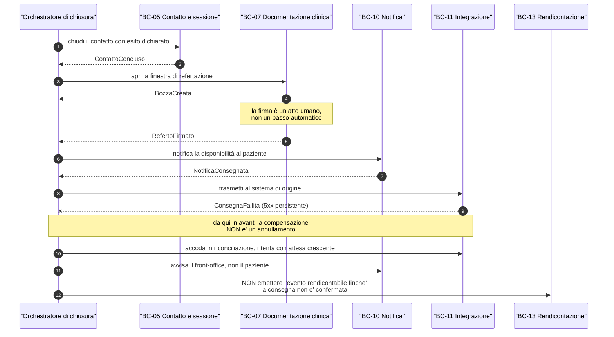
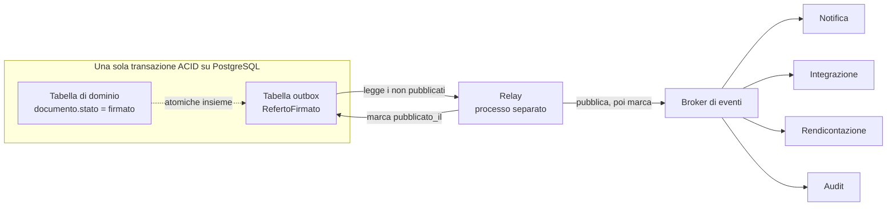
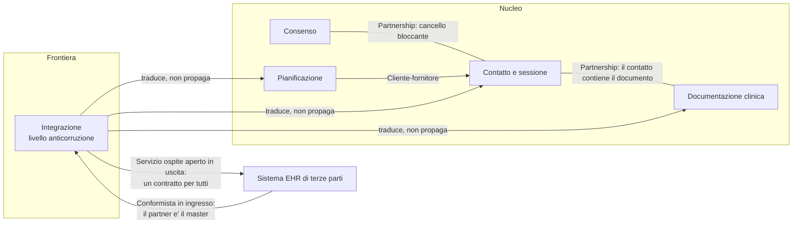
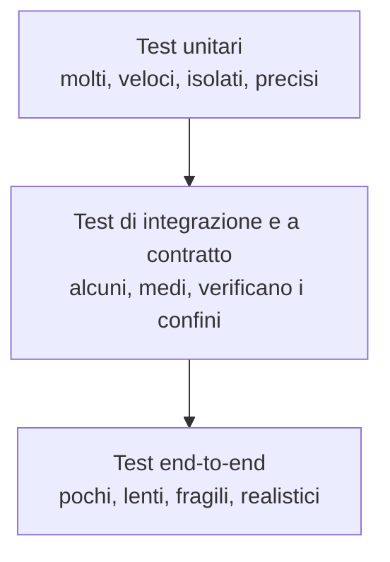

# Fondamenti informatici

Questo modulo è il simmetrico del [blocco C](09-fondamenti-clinici.md): là si spiega a un
informatico cosa succede nel corpo di un paziente, qui si spiega a un clinico — o a chi
viene da uno sviluppo applicativo lineare — cosa succede dentro un sistema fatto di pezzi
che parlano fra loro attraverso una rete.

Non presuppone nulla. Non presuppone che tu sappia cos'è una transazione, cos'è un broker,
cosa significa «consistenza finale». Presuppone soltanto che tu abbia letto
[il modulo sulle prestazioni di telemedicina](02-prestazioni-di-telemedicina.md) e
[quello sul dato clinico](03-il-dato-clinico.md), perché gli esempi di questo modulo sono
presi da lì: una prenotazione, un consenso, un referto firmato, una misura di
telemonitoraggio.

Questa è una scelta deliberata. La letteratura sui sistemi distribuiti insegna con carrelli
della spesa e trasferimenti bancari. Sono esempi che non servono qui: un carrello si può
svuotare, un bonifico si può stornare, un referto firmato e depositato nel fascicolo
sanitario di un cittadino **non si annulla**. Le proprietà di questo dominio sono diverse, e
la teoria va riletta attraverso di esse, non applicata meccanicamente.

Tutti gli esempi contengono **esclusivamente dati sintetici**.

Convenzione di questo modulo: le affermazioni marcate **`[NV]`** non sono state verificate su
fonte primaria durante la stesura e vanno confermate prima di trasformarle in codice o in
requisito. Le decisioni del progetto sono citate con il loro identificativo (`D15`, `V4`…)
e si trovano nel *context pack* del progetto.

---

## 1. Perché la telemedicina è un sistema distribuito

### 1.1 Cosa cambia rispetto a un'applicazione monolitica

Un'**applicazione monolitica** è un solo programma, in esecuzione in un solo processo, che
scrive su una sola base di dati. Ha una proprietà preziosissima che di solito nessuno nota,
perché è invisibile finché c'è: quando una parte del programma chiama un'altra parte del
programma, o la chiamata riesce, o fallisce con un errore, e in entrambi i casi il chiamante
lo sa. Non esiste una terza possibilità.

Un **sistema distribuito** è un insieme di programmi in esecuzione su macchine diverse, che
si coordinano scambiandosi messaggi su una rete. La terza possibilità esiste: la chiamata
può **non dare risposta**. Il chiamante resta con un'incertezza che nessun meccanismo
tecnico può eliminare — non sa se l'altra parte non ha ricevuto la richiesta, se l'ha
ricevuta ed è morta prima di eseguirla, se l'ha eseguita ed è morta prima di rispondere, o
se l'ha eseguita e la risposta si è persa in rete. Sono quattro stati del mondo con
conseguenze cliniche molto diverse e un unico sintomo osservabile: il silenzio.

Telemedic non è distribuito per scelta architetturale: lo è **per costituzione del
problema**. Anche nella sua installazione più piccola — un solo nodo, tutto in Docker
Compose — il sistema comprende necessariamente:

- il browser del paziente, tipicamente su rete mobile, con un ciclo di vita che il server non
  controlla (l'utente chiude la scheda, il telefono va in standby, il sistema operativo
  uccide la pagina in background);
- il browser del professionista, su un'altra rete, con un altro orologio;
- il flusso audio-video che, quando la rete lo consente, viaggia **direttamente fra i due
  browser** senza passare dal server (WebRTC, vedi [modulo 08](08-webrtc-da-zero.md)): il
  server non vede il media e quindi non può sapere per osservazione diretta se la
  comunicazione clinica sta funzionando;
- il servizio di relay usato quando il collegamento diretto fallisce, che è un'altra macchina
  con un'altra disponibilità;
- il sistema di identità digitale, che è di un terzo (un fornitore di identità nazionale) e
  può essere lento o indisponibile senza che il progetto possa farci nulla;
- il gestionale sanitario dell'integratore, che possiede l'anagrafica e l'agenda e che
  Telemedic interroga senza esserne il proprietario;
- il repository documentale nazionale o regionale verso cui il referto viene trasmesso;
- il servizio di firma e di marca temporale.

Sette confini di rete nel percorso di **una singola televisita**. Ognuno di essi è un punto
in cui la terza possibilità si manifesta.

### 1.2 Le otto fallacie del calcolo distribuito

Peter Deutsch formulò alla Sun Microsystems, alla fine degli anni Novanta, un elenco di
assunzioni che ogni programmatore inesperto di sistemi distribuiti fa senza accorgersene, e
che sono tutte false; James Gosling aggiunse l'ottava. L'elenco circola come «le otto
fallacie del calcolo distribuito». **`[NV]`** la paternità esatta e la data di prima
formulazione non sono state verificate su fonte primaria durante la stesura di questo modulo;
il contenuto tecnico, invece, è ampiamente riscontrabile nell'esperienza operativa.

Le riprendiamo una per una con l'esempio del dominio che le smentisce.

**Prima: la rete è affidabile.** È falso. Il paziente in televisita è su rete mobile in
movimento; passa da una cella all'altra, entra in ascensore, attraversa una galleria. Il
progetto lo mette a requisito: `RNF-009` chiede il ripristino del flusso entro otto secondi
al 95° percentile *dal ritorno della connettività*, il che presuppone che la connettività se
ne vada regolarmente. Un'architettura che tratta la disconnessione come eccezione produce, a
ogni caduta di rete, un contatto clinico fantasma: è esattamente il difetto che la regola di
dominio `BR-030` vieta separando lo stato del contatto dallo stato della sessione media.

**Seconda: la latenza è zero.** È falso, e in questo dominio è falso in modo vincolante. Il
progetto dichiara una latenza mediana di andata e ritorno inferiore a 200 ms sul flusso media
(`RNF-001`). Duecento millisecondi non sono zero: sono la soglia oltre la quale una
conversazione umana comincia a produrre sovrapposizioni di turno, la sensazione di
interruzione reciproca e, in un colloquio psicologico o in una valutazione neurologica, una
distorsione della relazione che ha rilievo clinico. La latenza è un **budget da spendere**
(§11.6), non un dettaglio da trascurare.

**Terza: la banda è infinita.** È falso. `RNF-008` fissa un profilo predefinito a 1,2 Mbit/s
per direzione e una modalità a banda ridotta a 350 kbit/s. Il vincolo `V6` (mobile first)
impone di progettare per la connessione peggiore, non per quella dell'ufficio dello
sviluppatore.

**Quarta: la rete è sicura.** È falso, e il progetto non solo lo assume ma ne fa un requisito
verificabile: il media è cifrato fra i due estremi e la verifica delle chiavi avviene con una
stringa breve di autenticazione confrontata a voce dai due interlocutori (`D22`). L'idea che
«siamo dentro la rete aziendale, quindi possiamo fidarci» è la premessa di quasi tutte le
compromissioni laterali.

**Quinta: la topologia non cambia.** È falso. Gli indirizzi di rete dei partecipanti cambiano
durante la sessione — il telefono passa da rete mobile a Wi-Fi domestico e viceversa — e
l'intero meccanismo di raccolta e scambio dei candidati di connessione di WebRTC esiste
perché la topologia è mutevole e sconosciuta a priori.

**Sesta: c'è un solo amministratore.** È falso e in questo dominio è vistosamente falso.
L'identità digitale del cittadino è amministrata da un fornitore terzo, il fascicolo
sanitario da una regione, la cartella clinica dall'integratore, l'installazione da un centro
servizi che — secondo le indicazioni nazionali — è un soggetto **distinto** dal centro
erogatore. Nessuno può ordinare a tutti gli altri di riavviare.

**Settima: il costo di trasporto è zero.** È falso in due sensi. In senso computazionale,
serializzare un `Bundle` FHIR, firmarlo, cifrarlo, trasmetterlo e validarlo costa CPU e
memoria misurabili. In senso letterale ed economico, alcune chiamate hanno una tariffa: il
progetto documenta che chiedere al fornitore di identità **un solo attributo oltre
l'anagrafica di base** porta il costo per accesso da 0,4 € a 3,5 € (`D38`). È il caso raro in
cui una scelta di progettazione dei dati ha un prezzo unitario stampato in un decreto.

**Ottava: la rete è omogenea.** È falso. Nel percorso di un referto convivono almeno tre
famiglie tecnologiche: FHIR R4 su HTTP verso l'integratore moderno, messaggistica HL7 v2 su
un protocollo di trasporto a delimitatori verso il motore di integrazione di un ospedale, e
documenti strutturati con metadati verso il repository documentale. Il modulo
[13](13-protocolli.md) le cataloga una per una.

### 1.3 Il guasto parziale: la proprietà che cambia tutto

Il concetto operativamente più importante di questa sezione è il **guasto parziale**
(*partial failure*): in un sistema distribuito, una parte può essere guasta mentre il resto
funziona, e chi funziona può non sapere che l'altra è guasta.

Esempio del dominio, concreto. Il medico preme «concludi e firma». Il sistema deve, in
sequenza logica: chiudere il contatto, marcare il documento come firmato, notificare il
paziente che il referto è disponibile, trasmettere il documento al gestionale
dell'integratore, emettere l'evento rendicontabile, scrivere l'audit. Sei effetti su
componenti diversi. In un monolite sarebbero sei righe dentro una transazione. Qui, la
notifica può fallire perché il gateway di posta è saturo; la trasmissione può fallire perché
il gestionale è in manutenzione; l'audit **non può fallire**, perché il requisito `RF-196`
stabilisce che il fallimento della scrittura di audit fa fallire l'operazione applicativa.

Da cui la domanda che ricorrerà in tutto il modulo, ed è la domanda ingegneristica centrale
di questo progetto: **quali effetti devono essere atomici fra loro, e quali possono essere
soltanto eventuali?** Non è una domanda tecnica. È una domanda clinica e giuridica a cui la
tecnica dà una risposta.

### 1.4 L'ordine dei messaggi non è garantito

Ultima proprietà controintuitiva. Se un componente invia due messaggi, A e B, in quest'ordine,
il destinatario può riceverli nell'ordine B, A. Le cause sono banali: percorsi di rete
diversi, un ritentativo su A che ne ritarda la consegna, due lavoratori concorrenti che
prendono in carico i due messaggi e finiscono in tempi diversi.

Nel dominio: l'evento `SessioneAvviata` e l'evento `ContattoConcluso` riguardano lo stesso
contatto. Se il consumatore li riceve invertiti e li applica ingenuamente, il contatto risulta
«in corso» per sempre — e a quel punto un cruscotto di direzione sanitaria mostra sessioni
aperte da giorni, un rapporto di rendicontazione conta prestazioni mai chiuse, e il
professionista riceve un sollecito di refertazione per un atto che ha già refertato.

La ricerca di progetto `R5` affronta il problema in modo esplicito e prescrive di dichiarare
la non-garanzia nel contratto: «nessuna garanzia di ordine globale», con la contromisura di
un numero di sequenza monotono per aggregato che consente al ricevente di **scartare gli
eventi vecchi** anziché applicarli. Questo è il modello mentale corretto: non si costruisce
un ordine globale (costa moltissimo e riduce la disponibilità), si rende il consumatore
insensibile all'ordine.

---

## 2. Consistenza e disponibilità

### 2.1 Cos'è la consistenza

Il termine «consistenza» è usato in informatica con almeno tre significati diversi, e
confonderli è la prima causa di discussioni sterili in fase di progettazione.

1. La **consistenza transazionale**, la C di ACID (§3.1): una transazione porta la base di
   dati da uno stato valido a un altro stato valido, rispettando i vincoli dichiarati. È una
   proprietà del *modello dei dati*.
2. La **consistenza di replica**: quando lo stesso dato esiste in più copie, che rapporto c'è
   fra le copie? È una proprietà del *sistema di memorizzazione*.
3. La **consistenza come modello di visibilità**: cosa può osservare un lettore rispetto a
   ciò che uno scrittore ha scritto. È una proprietà del *contratto verso l'applicazione*.

Qui parliamo del terzo significato, che è quello che determina il comportamento osservabile
dal medico e dal paziente.

La forma più forte utile in pratica si chiama **linearizzabilità**: il sistema si comporta
come se esistesse una sola copia del dato e ogni operazione avvenisse in un istante preciso
compreso fra la sua richiesta e la sua risposta. Conseguenza pratica: se la firma del referto
è stata confermata al medico alle 10:12:03, chiunque legga dopo le 10:12:03 vede il referto
firmato. Nessuno può vedere lo stato precedente.

All'estremo opposto c'è la **consistenza finale** (*eventual consistency*): se si smette di
scrivere, prima o poi tutte le copie convergono allo stesso valore. «Prima o poi» non è
quantificato dalla definizione. Nel frattempo, letture diverse possono restituire valori
diversi.

Fra i due estremi esiste una gerarchia di modelli intermedi. I due che contano per questo
progetto sono la **lettura delle proprie scritture** (*read your writes*: chi ha scritto vede
almeno la propria scrittura, anche se gli altri non ancora) e la **consistenza monotona in
lettura** (chi ha visto un valore non vedrà mai più un valore precedente). Sono garanzie
deboli, ma sono esattamente quelle che rendono un'interfaccia non-frustrante: un medico che
salva una bozza e ricaricando la pagina non la trova più ha perso fiducia nel sistema, e la
fiducia in ambito clinico non si recupera.

### 2.2 Il teorema CAP, e soprattutto cosa non dice

Il **teorema CAP** — congetturato da Eric Brewer nel 2000 e dimostrato formalmente da Gilbert
e Lynch nel 2002 **`[NV]`** (attribuzione e date non verificate su fonte primaria in questa
stesura) — afferma che un sistema distribuito che replica dati non può garantire
contemporaneamente tutte e tre le proprietà seguenti:

- **C**onsistenza, nel senso di linearizzabilità;
- **A**vailability, cioè disponibilità: ogni richiesta a un nodo non guasto riceve una
  risposta;
- **P**artition tolerance: il sistema continua a funzionare anche quando la rete si spezza in
  parti che non si parlano.

Ecco i fraintendimenti da correggere, perché sono diffusi e producono decisioni sbagliate.

**Non è vero che «si scelgono due su tre».** La partizione di rete non è una scelta
architetturale: è un evento che accade. Nessuno decide di non tollerare le partizioni; si
decide soltanto **come comportarsi quando accadono**. La scelta reale è binaria e si applica
solo durante la partizione: rispondere comunque, rischiando di rispondere con un dato
obsoleto (si privilegia A), oppure rifiutare di rispondere finché la partizione non si chiude
(si privilegia C).

**Non è vero che CAP dica qualcosa sul comportamento normale.** Il teorema parla solo del
regime di partizione. Un modello più utile in progettazione è **PACELC**, formulato da Daniel
Abadi **`[NV]`**: *if Partition, then A or C; Else, then L or C* — cioè, quando la rete
funziona, resta comunque un compromesso fra **latenza** e consistenza. Ogni garanzia di
consistenza più forte si paga con round-trip aggiuntivi. In un sistema con un budget di
latenza di 200 ms questo non è un dettaglio accademico.

**Non è vero che la C di CAP sia la C di ACID.** Sono due nozioni diverse che condividono la
lettera. La C di ACID è il rispetto dei vincoli di integrità; la C di CAP è la
linearizzabilità.

**Non è vero che CAP dica alcunché su un sistema non replicato.** Una singola base di dati
PostgreSQL non è soggetta al compromesso CAP fra i suoi dati: è soggetta a un compromesso
molto più semplice, «se è giù, è giù». Il teorema diventa rilevante quando si introducono
repliche, cluster o servizi indipendenti che detengono ciascuno un pezzo di verità.

### 2.3 La domanda concreta: cosa tollera la consistenza finale in questo dominio

Il modo utile di usare la teoria è capovolgerla: non «che sistema costruiamo», ma «quali dati
del nostro dominio ammettono di essere osservati in stati diversi da osservatori diversi, e
per quanto tempo».

| Dato del dominio | Modello richiesto | Perché |
|---|---|---|
| Referto firmato | Forte, non negoziabile | `BR-044`: un documento firmato è immutabile. Se due lettori vedessero due versioni, la firma non proverebbe più nulla e verrebbe meno il valore probatorio del documento |
| Consenso alla registrazione | Forte, bloccante | `BR-071`: nessuna registrazione senza consenso vigente. La revoca ha effetto immediato (`BC-06`). Una finestra di inconsistenza di due secondi qui significa due secondi di registrazione illecita |
| Esito della verifica dei consensi obbligatori prima dell'avvio | Forte | `RF-114`: la sessione non può avviarsi senza consensi verificati. È un cancello, e un cancello che a volte è aperto non è un cancello |
| Capienza dello slot di agenda | Forte all'interno del tenant | `BR-020`: la somma delle prenotazioni su uno slot non supera la capienza. Se due operatori prenotano contemporaneamente l'ultimo posto, l'overbooking involontario è un difetto, non una funzione (`BR-023`) |
| Voce di audit | Forte, con fallimento propagato | `RF-196`: se l'audit non si scrive, l'operazione fallisce |
| Stato del contatto (`Encounter`) | Forte per le transizioni, finale per la propagazione | La transizione è decisa da un solo aggregato; la sua propagazione a notifiche, rendicontazione e cruscotti può essere eventuale |
| Contatore delle sessioni erogate nel mese | Finale | Nessuno prende una decisione clinica su un contatore. Un cruscotto in ritardo di trenta secondi non danneggia nessuno |
| Metriche di qualità del canale (ritardo, perdita di pacchetti, jitter) | Finale | Sono serie temporali campionate: la loro semantica è già statistica, l'inconsistenza istantanea è irrilevante |
| Copia della risorsa anagrafica letta dal gestionale dell'integratore | Finale per costruzione | Telemedic **non è** il master (§6.2.3 del brief): sta leggendo la copia di un dato che vive altrove. Pretendere consistenza forte su un dato di cui non si è proprietari è una contraddizione |
| Referto trasmesso al repository documentale | Finale, con riconciliazione | La trasmissione può fallire e ritentare; ciò che deve essere forte è la **conoscenza locale** dello stato della trasmissione, non l'atto in sé |
| Proiezione in sola lettura `DiagnosticReport` per gli integratori (`D13`) | Finale | È per definizione una proiezione: se fosse forte, sarebbe un secondo master |

Il criterio che emerge, ed è generalizzabile: **richiede consistenza forte tutto ciò che è un
cancello o una prova**. Un cancello è una verifica che autorizza o vieta un atto (consenso,
capienza, abilitazione professionale). Una prova è un artefatto che dovrà reggere una
contestazione a distanza di anni (firma, audit, evidenza di consenso). Tollera la consistenza
finale tutto ciò che è **derivato, aggregato o informativo**.

C'è una conseguenza architetturale importante e spesso ignorata: se un dato richiede
consistenza forte, **deve stare in un solo posto**. Non si ottiene consistenza forte
replicando un dato in tre servizi e sperando che restino allineati; si ottiene decidendo chi è
il proprietario e facendo in modo che tutti gli altri lo **chiedano** invece di copiarlo. È lo
stesso principio che in §7 prende il nome di aggregato.

---

## 3. Transazioni

### 3.1 ACID, una lettera alla volta

Una **transazione** è un raggruppamento di operazioni sulla base di dati che il sistema tratta
come un'unità indivisibile. L'acronimo **ACID** ne descrive le quattro proprietà. Le
spieghiamo con lo stesso esempio: il medico appone la firma sul referto, e questo comporta
scrivere la nuova versione del documento, cambiarne lo stato da *bozza* a *firmato*, e
registrare l'evidenza di firma.

**A — Atomicità.** O avvengono tutte e tre le scritture, o nessuna. Non esiste lo stato
intermedio «documento firmato ma senza evidenza di firma». È una garanzia sul *fallimento*,
non sul successo: l'atomicità dice che un mezzo lavoro non resta a terra.

**C — Consistenza.** Al termine della transazione tutti i vincoli dichiarati sulla base dati
sono soddisfatti: la chiave esterna verso il contatto esiste, il campo obbligatorio
dell'identificativo di tenant è valorizzato (`V4`), lo stato appartiene all'insieme di valori
ammessi. Nota che la C dipende da come *tu* hai dichiarato i vincoli: la base di dati fa
rispettare le regole che le hai dato, non le regole del dominio che ti sei tenuto in testa.

**I — Isolamento.** Se due transazioni girano nello stesso momento, ciascuna si comporta —
entro i limiti del livello di isolamento scelto — come se fosse sola. È la proprietà più
sottile e quella su cui si sbaglia di più, perché il livello di isolamento predefinito di
quasi tutti i motori **non** è quello che dà la garanzia intuitiva.

**D — Durabilità.** Una volta confermata, la transazione sopravvive a un crollo del processo o
a un'interruzione dell'alimentazione. In pratica significa che il motore ha scritto e
sincronizzato su supporto persistente prima di rispondere «fatto». Ed è qui che la durabilità
incontra il punto di ripristino di §13: *durabile su quale copia?* Se il nodo con il disco
prende fuoco, la durabilità locale non salva nulla — serve una replica.

### 3.2 I livelli di isolamento e le anomalie che ammettono

Lo standard SQL definisce quattro livelli di isolamento, definendoli **per le anomalie che
vietano**. È un modo di definire negativo e va letto con attenzione: un livello non promette
correttezza, promette solo di escludere certi fenomeni.

Le anomalie classiche:

- **Lettura sporca** (*dirty read*): una transazione legge dati scritti da un'altra
  transazione non ancora confermata, che potrebbe poi essere annullata. Nel dominio: il
  cruscotto legge un referto «firmato» da una transazione che poi fallisce; il referto non
  esiste, ma qualcuno lo ha visto.
- **Lettura non ripetibile** (*non-repeatable read*): la stessa riga, letta due volte nella
  stessa transazione, restituisce valori diversi perché nel frattempo qualcuno l'ha
  modificata e confermata. Nel dominio: si verifica il consenso all'inizio della procedura,
  si eseguono altri controlli, si rilegge il consenso e nel frattempo il paziente l'ha
  revocato.
- **Lettura fantasma** (*phantom read*): la stessa interrogazione con la stessa condizione
  restituisce un insieme di righe diverso, perché ne sono state inserite di nuove. Nel
  dominio: si contano le prenotazioni sullo slot per verificare la capienza, e fra il conteggio
  e l'inserimento un'altra transazione ha inserito la propria prenotazione.
- **Anomalia di scrittura obliqua** (*write skew*): due transazioni leggono un insieme comune,
  prendono ciascuna una decisione corretta rispetto a ciò che ha letto, e scrivono su righe
  diverse producendo uno stato globale che viola un vincolo che nessuna delle due ha violato
  singolarmente. È l'anomalia più insidiosa perché non è né una lettura sporca né un fantasma.

| Livello | Lettura sporca | Lettura non ripetibile | Fantasma | Scrittura obliqua |
|---|---|---|---|---|
| Read uncommitted | possibile | possibile | possibile | possibile |
| Read committed | esclusa | possibile | possibile | possibile |
| Repeatable read | esclusa | esclusa | possibile secondo lo standard | possibile |
| Serializable | esclusa | esclusa | esclusa | esclusa |

Due precisazioni operative che valgono più della tabella.

**Il livello predefinito di PostgreSQL è *read committed*.** Significa che, salvo che tu non
faccia qualcosa di esplicito, le tue transazioni ammettono letture non ripetibili e fantasmi.
**`[NV]`** il comportamento esatto del livello *repeatable read* in PostgreSQL — che è
implementato come *snapshot isolation* e in pratica esclude anche i fantasmi, pur ammettendo
la scrittura obliqua — va verificato sulla documentazione della versione effettivamente
adottata prima di farne affidamento in un requisito.

**La scrittura obliqua è il modo in cui l'overbooking involontario entra nel sistema.** Ecco
l'esempio del dominio nella sua forma esatta. Due operatori di front-office prenotano
contemporaneamente sull'ultimo posto libero di uno slot con capienza 1.

```sql
-- Transazione A e transazione B, in parallelo, a livello read committed
BEGIN;
SELECT count(*) FROM appuntamento WHERE slot_id = 'slot-0042';  -- entrambe leggono 0
-- entrambe concludono: "c'è posto"
INSERT INTO appuntamento (id, slot_id, paziente_ref, tenant_id)
VALUES (gen_random_uuid(), 'slot-0042', 'ext:pz-000117', 'tenant-demo');
COMMIT;
```

Nessuna delle due transazioni ha letto dati sporchi, nessuna ha violato un vincolo che
vedeva. Il risultato è due appuntamenti su uno slot da uno. La regola `BR-020` è violata e
`BR-023` qualifica questo esito come **difetto**, non come funzione.

Le tre contromisure corrette, in ordine di preferenza:

1. **Rendere il vincolo esprimibile alla base dati.** Se la capienza è 1, un indice univoco su
   `slot_id` risolve il problema definitivamente: una delle due transazioni fallisce con
   violazione di unicità, e l'applicazione traduce l'errore in un messaggio comprensibile. È la
   soluzione migliore perché non dipende dalla disciplina di chi scrive il codice.
2. **Serializzare esplicitamente sull'aggregato.** Bloccare la riga dello slot
   (`SELECT ... FOR UPDATE` sulla riga di `slot`) prima di contare. La chiave è che il blocco
   sia sulla **radice dell'aggregato** (§7.4), non sulle righe figlie: si blocca ciò che
   esiste, non ciò che potrebbe esistere.
3. **Alzare il livello a *serializable*** e gestire il fallimento di serializzazione con un
   ritentativo. Corretto, ma va progettato: a livello serializable le transazioni **falliscono
   legittimamente** e il codice applicativo deve saperle rigiocare, il che richiede che siano
   idempotenti (§6).

Il criterio generale: **una regola di dominio invariante non si difende con una lettura
seguita da una scrittura.** Si difende con un vincolo, con un blocco sulla radice
dell'aggregato, o con una transazione serializzabile. Le tre opzioni hanno costi diversi; la
lettura-e-poi-scrittura ha il costo peggiore, perché sembra funzionare in sviluppo e fallisce
in produzione sotto carico, dove la finestra fra lettura e scrittura si allarga.

### 3.3 Le transazioni distribuite, e perché si evitano

Se una transazione è così utile, perché non estenderla a più servizi? Il meccanismo classico
esiste e si chiama **commit a due fasi** (*two-phase commit*, 2PC): un coordinatore chiede a
tutti i partecipanti «sei pronto a confermare?», raccoglie i sì, e poi ordina a tutti di
confermare.

Ha tre difetti che, sommati, lo rendono inadatto a questo progetto.

**Il coordinatore è un punto di blocco.** Se il coordinatore muore fra la fase di preparazione
e la fase di conferma, i partecipanti restano **in dubbio**: hanno promesso di poter
confermare, quindi trattengono i blocchi sulle righe interessate, e non possono né confermare
né annullare finché il coordinatore non torna. Nel dominio, questo significa uno slot di agenda
bloccato, o un documento inaccessibile, per un tempo indeterminato.

**La disponibilità è il prodotto delle disponibilità.** Una transazione che coinvolge cinque
partecipanti al 99,9 % ciascuno ha una disponibilità teorica del 99,5 %: peggiore di ciascuno
dei suoi componenti. Aggiungere un partecipante peggiora tutti.

**Molti dei partecipanti non sono transazionabili.** È il punto decisivo, e non è tecnico: un
repository documentale nazionale, un fornitore di identità digitale, un gateway di messaggi
verso i pazienti, un servizio di marca temporale **non offrono** una fase di preparazione.
Non si può chiedere a un'infrastruttura nazionale di trattenere una transazione mentre noi
decidiamo. E soprattutto: **un atto sanitario compiuto nel mondo reale non è annullabile**.
Se il paziente ha visto il referto, l'ha visto.

Il progetto adotta quindi la strada opposta, ed è codificata in `D15`: transazione locale
sulla base dati **più** pubblicazione affidabile di un evento tramite outbox (§5). L'unica
transazione ACID è quella che coinvolge un solo archivio; tutto ciò che è oltre il confine
del servizio è coordinato con una saga.

### 3.4 La saga: coordinamento senza transazione globale

Una **saga** è una sequenza di transazioni locali. Ogni passo confermato è visibile
immediatamente; se un passo successivo fallisce, i passi già eseguiti vengono neutralizzati
non annullandoli, ma eseguendo per ciascuno una **transazione di compensazione** che ne
contrasta gli effetti. Il concetto è stato introdotto da Hector Garcia-Molina e Kenneth Salem
in un articolo del 1987 **`[NV]`** (riferimento bibliografico esatto non verificato in questa
stesura).

Esistono due stili di orchestrazione.

- **Coreografia**: nessun coordinatore. Ogni servizio reagisce agli eventi degli altri. È
  leggera e disaccoppiata, ma il flusso complessivo non è scritto da nessuna parte: per capire
  cosa succede bisogna leggere tutti i servizi. Diventa rapidamente ingestibile oltre i tre o
  quattro passi.
- **Orchestrazione**: esiste un componente che conosce la sequenza, emette i comandi, riceve
  gli esiti e decide se proseguire o compensare. Costa un componente in più ma rende il flusso
  **leggibile, testabile e tracciabile**. In un progetto che deve dimostrare a un valutatore
  esterno come si comporta il sistema in caso di guasto (ciclo di vita del software secondo
  `RNF-077`), la leggibilità del flusso non è un lusso.

Il progetto adotta l'orchestrazione per i flussi clinici critici. **`[NV]`** la scelta
specifica del meccanismo di orchestrazione (motore di workflow dedicato, macchina a stati
persistita in tabella, componente applicativo) non è oggetto di una decisione approvata al
momento della stesura e va formalizzata in un registro di decisione architetturale.

### 3.5 Perché una compensazione clinica non è un annullamento

Questo è il punto in cui la letteratura generalista sui sistemi distribuiti smette di essere
utile e il dominio deve riscrivere la regola.

Nell'esempio canonico dei manuali, la compensazione di «addebita 100 €» è «accredita 100 €», e
al termine il mondo è come se nulla fosse accaduto. **Nel dominio clinico questo non succede
quasi mai**, per tre ragioni distinte.

**Prima ragione: l'atto è stato percepito da un essere umano.** Se il sistema ha notificato al
paziente «il suo referto è disponibile» e poi si scopre che il documento era errato, non
esiste alcuna operazione che disfaccia la lettura. La compensazione corretta non è cancellare
la notifica: è **inviarne una seconda** che rettifica, con un testo che un paziente
comprenda, e registrare entrambe.

**Seconda ragione: l'ordinamento impone che la traccia resti.** Un documento sanitario firmato
è immutabile (`BR-044`) e l'audit è a sola aggiunta (`BC-12`, invariante i). Cancellare un
referto errato dal sistema significherebbe distruggere la prova che è esistito, che è stato
consultato e che è stato corretto. Il modello corretto è quello che il dominio usa da prima
dell'informatica: il documento sbagliato resta, viene marcato come **sostituito**, e un nuovo
documento ne dichiara la rettifica e il motivo. Il contesto della documentazione clinica lo
prevede esplicitamente con l'evento `RefertoRettificato` e con lo stato `sostituito` fra i
valori di `DocumentState`.

**Terza ragione: il destinatario può essere fuori dal nostro controllo.** Se il documento è
già stato trasmesso al repository documentale regionale o nazionale, non esiste una nostra
operazione che lo tolga da lì. Esiste soltanto la procedura di rettifica prevista da quel
sistema, che è un flusso a sé, con tempi propri, e che va **modellato come passo della saga**,
non presupposto istantaneo.

Ne derivano quattro regole di progettazione valide per tutte le saghe di questo progetto.

1. **Ogni passo deve dichiarare la propria compensazione al momento in cui viene progettato,
   non quando serve.** Se non esiste una compensazione, il passo va spostato più avanti nella
   sequenza — i passi irreversibili si eseguono per ultimi. Trasmettere il referto al
   repository nazionale prima di aver verificato la firma è un errore di ordinamento della
   saga, non un caso limite.
2. **La compensazione è un atto positivo tracciato, non una cancellazione.** Produce un nuovo
   evento, una nuova riga di audit, e un motivo (`AmendmentReason`).
3. **La compensazione può a sua volta fallire**, e il suo fallimento deve essere visibile a un
   essere umano. `ConsegnaFallita` è un evento di dominio con un consumatore che è una **coda
   di riconciliazione visibile al front-office**, non un messaggio in un registro che nessuno
   legge.
4. **Alcuni passi non hanno compensazione e vanno quindi resi condizionati.** La registrazione
   audio-video di una sessione non si «de-registra»: il progetto lo risolve non permettendo che
   la registrazione inizi senza un consenso vigente verificato in modo sincrono e forte
   (`BR-071`). Dove la compensazione non esiste, si sposta il costo sul cancello a monte.

Il diagramma seguente mostra la saga di chiusura di una televisita, con i passi compensabili e
il punto oltre il quale la compensazione cambia natura.



Si noti l'ultimo passo: la rendicontazione **non** viene compensata dopo, viene **rinviata**
prima. È l'applicazione della regola 1: quando un passo è difficile da compensare, lo si
sposta in fondo alla sequenza.

---

## 4. Architettura a eventi

### 4.1 Comando ed evento sono due cose diverse

Sono i due tipi di messaggio che un sistema si scambia, e confonderli produce architetture
che sembrano a eventi ma sono accoppiate come chiamate dirette.

Un **comando** esprime un'intenzione: *fai questa cosa*. Ha un destinatario preciso, è al
tempo verbale imperativo, può essere **rifiutato**, e chi lo invia si aspetta un esito.
`AvviaRegistrazione`, `AmmettiPazienteInSessione`, `TrasmettiDocumentoAlSistemaDiOrigine` sono
comandi.

Un **evento** constata un fatto avvenuto: *questa cosa è successa*. Non ha un destinatario
designato, è al passato, **non può essere rifiutato** — è già accaduto — e chi lo emette non
sa e non deve sapere chi lo consumerà. `SessioneAvviata`, `RefertoFirmato`,
`ConsensoRevocato`, `SogliaSuperata` sono eventi.

La distinzione ha una conseguenza pratica immediata sull'accoppiamento. Se il contesto della
sessione emette il comando `InviaNotificaAlPaziente`, sa che esiste un servizio di notifica e
ne conosce il contratto: ogni cambiamento del destinatario lo tocca. Se invece emette l'evento
`ContattoConcluso`, non sa nulla dei suoi consumatori: la notifica, la rendicontazione,
l'audit e l'integrazione si iscrivono e si disiscrivono senza che il produttore cambi di una
riga. Il catalogo degli eventi di dominio del progetto (`R6` §8.4) è costruito così: un
produttore, molti consumatori dichiarati.

Il criterio di scelta, formulato come domanda: **se domani aggiungiamo un consumatore, il
produttore deve cambiare?** Se sì, hai scritto un comando travestito da evento.

Errore speculare, altrettanto frequente: chiamare `PazienteDaNotificare` un evento. Non è un
fatto, è un ordine con il participio. Il nome corretto del fatto è
`PazienteEntratoInLobby`, e la decisione di notificare appartiene al consumatore.

### 4.2 Produttore, consumatore, e cosa c'è in mezzo

Nella forma più semplice il produttore chiama direttamente il consumatore. Funziona finché i
consumatori sono uno e finché sono sempre disponibili. Appena i consumatori diventano
quattro, e uno di essi è lento, il produttore paga la lentezza di tutti — e il medico che ha
premuto «concludi» aspetta che il sistema di rendicontazione risponda prima di vedere la
schermata successiva. È inaccettabile e, sotto il vincolo di latenza del progetto, misurabile.

Fra produttore e consumatori si mette quindi un **broker di messaggi**: un componente
intermedio che accetta il messaggio dal produttore, lo conserva, e lo mette a disposizione dei
consumatori con i loro tempi. Il produttore è libero non appena il broker ha accettato.

Il progetto adotta **Apache Kafka** (`D15`). Kafka non è una coda tradizionale: è un **log
distribuito**, e la differenza è sostanziale.

### 4.3 Il log degli eventi

Un **log** in questo senso non è il file di diagnostica di §12: è una sequenza di record
**ordinata, immutabile e a sola aggiunta**. Ogni record ha una posizione numerica progressiva
detta **offset**. I record non vengono rimossi quando un consumatore li legge: restano per un
periodo di conservazione configurato, e ciascun consumatore tiene traccia di **fino a dove è
arrivato**.

Le conseguenze sono tre e sono tutte rilevanti per questo dominio.

**Più consumatori indipendenti leggono lo stesso flusso senza disturbarsi.** L'evento
`RefertoFirmato` viene letto dalla notifica, dall'integrazione, dalla rendicontazione e
dall'audit; ciascuno ha la propria posizione. In una coda classica, il primo che legge
consuma il messaggio e gli altri non lo vedono.

**Si può rileggere il passato.** Un difetto nel consumatore di rendicontazione, corretto
oggi, si rimedia riportando indietro la posizione di quel solo consumatore e rigiocando gli
eventi degli ultimi giorni. Nessun altro consumatore se ne accorge. È una capacità operativa
che vale molto in un sistema che deve dimostrare la correttezza dei propri conteggi.

**Il ritardo di un consumatore è misurabile.** La differenza fra l'offset dell'ultimo record
scritto e l'offset raggiunto dal consumatore si chiama **lag**, ed è la metrica di saturazione
più onesta di un sistema a eventi (§11.4): dice, in numero di eventi, quanto il consumatore è
indietro.

### 4.4 Partizionamento e ordinamento

Un flusso di eventi (in Kafka, un *topic*) è suddiviso in **partizioni**. La regola
fondamentale, e va imparata a memoria perché tutto il resto ne discende:

> L'ordine è garantito **dentro** una partizione, e **non** fra partizioni diverse.

La partizione di destinazione di un evento è scelta in base a una **chiave di
partizionamento**. Da qui la decisione di progettazione più importante di un'architettura a
eventi: **quale chiave?**

Nel dominio, la scelta corretta è quasi sempre **l'identificativo della radice di aggregato a
cui l'evento si riferisce**.

| Flusso di eventi | Chiave di partizionamento | Conseguenza |
|---|---|---|
| Ciclo di vita del contatto | identificativo dell'`Encounter` | tutti gli eventi dello stesso contatto sono ordinati fra loro; contatti diversi procedono in parallelo |
| Documentazione clinica | identificativo del documento | bozza, firma, rettifica dello stesso documento arrivano in ordine |
| Consensi | identificativo del paziente nel tenant | prestazione e revoca dello stesso paziente non si scavalcano |
| Telemetria di qualità | identificativo della sessione media | i campioni della stessa sessione restano in sequenza |
| Eventi verso l'integratore | identificativo del tenant, **oppure** dell'aggregato | vedi avvertenza sotto |

Due errori ricorrenti, entrambi con conseguenze visibili.

**Chiave troppo grossa.** Partizionare per tenant sembra allineato al vincolo `V4`, ma mette
tutti gli eventi di una ASL grande in una sola partizione: il parallelismo massimo di quel
tenant diventa uno, e un evento lento blocca tutti gli altri eventi di quel tenant. La
capacità di isolamento fra tenant si ottiene con quote e circuiti, non con la chiave di
partizione.

**Chiave troppo fine, o assente.** Se `SessioneAvviata` e `ContattoConcluso` finiscono in
partizioni diverse perché la chiave è casuale, si ricade nel problema di §1.4: il consumatore
li riceve invertiti. La contromisura è quella già indicata — numero di sequenza per aggregato
e scarto degli eventi vecchi — ma è una toppa: se l'aggregato è lo stesso, la chiave giusta
esiste e va usata.

Va detto con chiarezza che **il partizionamento non è gratis**: sceglierlo per aggregato
significa che il numero di partizioni determina il parallelismo massimo, e che aumentare le
partizioni a posteriori **cambia la funzione di assegnazione** e quindi può spezzare l'ordine
degli aggregati in transito. **`[NV]`** il comportamento esatto del riassegnamento in
aumento di partizioni per la versione di Kafka adottata va verificato sulla documentazione
prima di pianificare un ridimensionamento in esercizio.

### 4.5 Gruppi di consumatori

Un **gruppo di consumatori** è un insieme di processi che collaborano a leggere lo stesso
flusso: il broker assegna a ciascun membro un sottoinsieme disgiunto delle partizioni, così
che ogni evento sia elaborato da **un solo** membro del gruppo. Aggiungere un processo al
gruppo aumenta il parallelismo, fino al numero di partizioni. Gruppi diversi ricevono
ciascuno tutti gli eventi.

Nel dominio: `notifica`, `integrazione`, `rendicontazione`, `audit` sono quattro **gruppi**
distinti sullo stesso flusso di eventi del contatto; ciascun gruppo può avere tre processi che
si dividono le partizioni.

Tre trappole operative.

**Il ribilanciamento.** Quando un membro entra o esce dal gruppo, il broker riassegna le
partizioni. Durante la riassegnazione l'elaborazione si ferma. Un consumatore che impiega
troppo a elaborare un singolo evento viene ritenuto morto ed espulso, provocando un
ribilanciamento, che rallenta ancora, che provoca un'altra espulsione: è il ciclo di
ribilanciamento perpetuo, e si riconosce perché il *lag* cresce senza che il carico sia
cresciuto. Contromisura: elaborazione breve, lavoro pesante spostato altrove, parametri di
sessione coerenti con il tempo di elaborazione reale.

**Il momento della conferma della posizione.** Se il consumatore conferma la posizione *prima*
di aver elaborato, un crollo perde l'evento (consegna *al più una volta*). Se conferma *dopo*,
un crollo lo rielabora (consegna *almeno una volta*). Non esiste una terza opzione, e la
scelta corretta per questo dominio è sempre la seconda, con consumatori idempotenti (§6).

**L'evento avvelenato.** Un evento che fa fallire sistematicamente il consumatore blocca la
sua partizione per sempre. Serve una politica esplicita: numero massimo di tentativi, poi
spostamento in un flusso di eventi non elaborabili con notifica a un essere umano. Un evento
clinico che finisce lì **non va scartato silenziosamente**: `ConsegnaFallita` deve emergere in
una coda di riconciliazione visibile.

### 4.6 Cosa risolve il broker, e cosa non risolve

Risolve: il disaccoppiamento fra produttore e consumatori; l'assorbimento dei picchi (il
broker fa da cuscinetto fra un produttore veloce e un consumatore lento); la resistenza
all'indisponibilità temporanea di un consumatore; la possibilità di aggiungere consumatori
senza toccare il produttore; la rigiocabilità.

Non risolve: la consistenza fra la base di dati e il flusso di eventi (è il problema di §5, e
il broker da solo lo **peggiora**); l'ordinamento globale; la consegna esattamente una volta
verso il mondo esterno (§6.1); la complessità operativa, che aumenta — ed è la ragione per cui
`D15` prescrive, per l'installazione presso il cliente, un assetto a nodo singolo in modalità
senza coordinatore esterno, e prescrive che l'astrazione di pubblicazione resti **dietro
un'interfaccia di progetto**, in modo che il codice di dominio non sia incastrato nel broker.

Quest'ultimo punto merita enfasi: il dominio deve dire «è successo questo», non «pubblica su
questo argomento con questa chiave». La traduzione appartiene all'infrastruttura. È lo stesso
principio del livello anticorruzione di §7.8, applicato in uscita.

---

## 5. La doppia scrittura e l'outbox transazionale

### 5.1 Il problema, nella sua forma esatta

Riprendiamo l'operazione più semplice possibile: il medico firma il referto. Il sistema deve
fare due cose:

1. scrivere sulla base di dati che il documento è firmato;
2. pubblicare sul broker l'evento `RefertoFirmato`, perché notifica, integrazione,
   rendicontazione e audit se ne accorgano.

Sono due sistemi diversi. Non esiste una transazione che li comprenda entrambi — e anche se
esistesse (2PC), §3.3 spiega perché non la vogliamo. Quindi le scritture avvengono in
sequenza, e **fra le due c'è una finestra**. È la **doppia scrittura** (*dual write*): il
difetto architetturale più comune e più sottovalutato dei sistemi a eventi.

Cosa può andare storto, in modo esaustivo:

```java
// SBAGLIATO — non fare questo. Illustrazione del difetto.
@Transactional
public void firma(DocumentoId id, EvidenzaFirma evidenza) {
    var documento = repository.carica(id);
    documento.applicaFirma(evidenza);      // (1) scrittura sulla base dati
    repository.salva(documento);
    broker.pubblica(new RefertoFirmato(id)); // (2) scrittura sul broker
}
```

**Caso A — il processo muore fra (1) e (2).** La base dati, alla conferma della transazione,
contiene il referto firmato. L'evento non è mai stato pubblicato. Risultato: il paziente non
riceve la notifica, il gestionale dell'integratore non riceve il documento, l'evento
rendicontabile non esiste. Il dato è corretto e il mondo attorno non lo sa. Questo è un
**evento perso**, ed è la modalità di guasto peggiore perché è **silenziosa**: nessun errore,
nessun avviso, nessuna traccia. Si scopre settimane dopo, quando un paziente telefona
chiedendo un referto che il sistema mostra come consegnato.

**Caso B — la pubblicazione (2) riesce ma la transazione (1) viene annullata.** Se la
pubblicazione avviene dentro il blocco transazionale, come nell'esempio, e la conferma della
transazione fallisce dopo (violazione di vincolo, conflitto di serializzazione, perdita della
connessione al database), l'evento è già partito. Risultato: la notifica raggiunge il paziente
per un referto che nella base dati è ancora una bozza, e l'integratore chiede un documento
che non esiste. Questo è un **evento fantasma**.

**Caso C — la pubblicazione è lenta.** Se il broker impiega tre secondi a rispondere, la
transazione sulla base dati resta aperta per tre secondi, trattenendo blocchi sulle righe. Un
rallentamento del broker si trasforma in contesa sulla base dati e, a cascata, in saturazione
del pool di connessioni. È il meccanismo con cui un guasto isolato si propaga.

Nessun ordine delle due operazioni elimina il problema: scrivendo prima sul broker si ottiene
il caso B garantito; scrivendo prima sulla base dati si ottiene il caso A. **La doppia
scrittura non si risolve riordinando: si risolve eliminando la seconda scrittura.**

### 5.2 L'outbox transazionale

L'idea è semplice e per questo robusta: **non pubblicare l'evento; scriverlo su una tabella
della stessa base di dati, dentro la stessa transazione del dato di dominio.** Un processo
separato — il **relay** — legge la tabella e pubblica sul broker.

La tabella si chiama **outbox**, «posta in uscita».

```sql
CREATE TABLE evento_outbox (
    id              uuid        PRIMARY KEY,
    tenant_id       text        NOT NULL,
    aggregato_tipo  text        NOT NULL,     -- 'Encounter', 'ClinicalDocument', ...
    aggregato_id    text        NOT NULL,     -- chiave di partizionamento (§4.4)
    tipo_evento     text        NOT NULL,     -- 'RefertoFirmato'
    versione_schema int         NOT NULL,     -- versionamento del contratto (§10.2)
    occorso_il      timestamptz NOT NULL,     -- tempo di dominio (§8.4)
    payload         jsonb       NOT NULL,     -- riferimenti, MAI contenuto clinico
    pubblicato_il   timestamptz NULL,
    tentativi       int         NOT NULL DEFAULT 0
);

CREATE INDEX ON evento_outbox (pubblicato_il) WHERE pubblicato_il IS NULL;
```

E la scrittura diventa una sola:

```java
@Transactional
public void firma(DocumentoId id, EvidenzaFirma evidenza) {
    var documento = repository.carica(id);
    documento.applicaFirma(evidenza);
    repository.salva(documento);
    outbox.accoda(EventoDiDominio.di(documento, "RefertoFirmato"));  // stessa transazione
}
```

Se la transazione fallisce, falliscono entrambe le scritture: nessun evento fantasma. Se la
transazione riesce, l'evento è **durevolmente registrato**: il relay lo pubblicherà, prima o
poi, anche se il broker è spento in questo momento. Nessun evento perso.



### 5.3 Come funziona il relay

Due implementazioni possibili, con proprietà diverse.

**Interrogazione periodica** (*polling*). Il relay interroga la tabella cercando le righe con
`pubblicato_il IS NULL`, ordinate per chiave, prende un lotto, pubblica, marca. Semplice, senza
dipendenze aggiuntive, facile da capire e da provare. Costo: un'interrogazione ogni pochi
decimi di secondo e una latenza di pubblicazione pari all'intervallo. Punto delicato: se più
istanze del relay girano insieme, serve un blocco — `SELECT ... FOR UPDATE SKIP LOCKED` è il
costrutto che permette a più lavoratori di prendere lotti disgiunti senza bloccarsi a vicenda.

**Cattura delle modifiche** (*change data capture*). Il relay legge il registro di replica
della base dati e ne estrae le inserzioni sulla tabella outbox. Latenza molto più bassa,
nessun carico di interrogazione, ma introduce un componente infrastrutturale in più da
installare, aggiornare, sorvegliare e censire come componente software di terze parti — con
tutti gli obblighi che questo comporta nel regime del progetto. **`[NV]`** la scelta fra le
due modalità non è oggetto di una decisione approvata al momento della stesura; il criterio
ragionevole è adottare l'interrogazione periodica come modalità predefinita, per contenere il
peso operativo dell'installazione presso il cliente, e la cattura delle modifiche come
opzione per gli assetti a volume elevato.

### 5.4 Quali garanzie dà l'outbox, e quali no

Questa sezione è la ragione per cui l'outbox va spiegata per intero e non citata come formula.

**Dà: nessun evento perso.** Se il dato è stato scritto, l'evento è nella tabella, e il relay
prima o poi lo pubblica.

**Dà: nessun evento fantasma.** Se il dato non è stato scritto, l'evento non è nella tabella.

**Dà: ordine per aggregato all'interno della tabella.** Se le righe sono lette in ordine di
inserimento e pubblicate con la chiave di partizionamento dell'aggregato (§4.4), l'ordine
relativo degli eventi dello stesso aggregato è preservato.

**Dà: disaccoppiamento del guasto.** Il broker può essere spento per ore; le operazioni
cliniche continuano, l'outbox cresce, e alla riaccensione il relay recupera. Questo è ciò che
rende il sistema utilizzabile in un'installazione ospedaliera dove l'infrastruttura non è
sempre disponibile.

**Non dà: la consegna esattamente una volta.** È la garanzia che nessuno ha e che tutti
credono di avere. Il relay pubblica, e poi marca la riga come pubblicata: se muore fra le due
operazioni, alla ripartenza ripubblica lo stesso evento. **L'outbox è
intrinsecamente *almeno una volta*.** Il consumatore deve essere idempotente. Non è un
difetto da correggere: è una proprietà da accettare e su cui progettare (§6).

**Non dà: latenza bassa.** Fra la conferma della transazione e la disponibilità dell'evento
sul broker passa il tempo del relay. Con l'interrogazione periodica sono decine o centinaia di
millisecondi. Per un flusso a bassa latenza come lo scambio di candidati di connessione WebRTC
questo è inaccettabile — e infatti quel flusso **non passa dall'outbox**: passa da un canale
diretto. L'outbox è per gli eventi di dominio, non per il segnalamento in tempo reale. È una
distinzione che va tenuta ferma, perché la tentazione di far passare tutto dal broker è forte
e produce sistemi lenti.

**Non dà: l'ordine globale fra aggregati diversi.** Vale quanto detto in §4.4.

**Non dà: la garanzia che il consumatore abbia elaborato.** L'outbox garantisce la
pubblicazione, non l'effetto. Se serve sapere che il gestionale dell'integratore ha
effettivamente ricevuto il referto, serve una **conferma di ritorno** e uno stato di
riconciliazione, che è esattamente ciò che il contesto di integrazione modella con
`OutboundDelivery` e gli eventi `ConsegnaFallita` / `ConsegnaRiconciliata`.

**Non dà: l'esenzione dalla pulizia.** La tabella outbox cresce indefinitamente se nessuno la
pota. Serve un processo di eliminazione delle righe pubblicate oltre una finestra di
sicurezza, e la finestra va scelta lunga abbastanza da permettere una ripubblicazione manuale
dopo un incidente. Una tabella outbox che cresce senza limite degrada le prestazioni della
base dati di produzione, ed è un modo poco elegante di causare un'indisponibilità clinica.

Un'ultima regola, che discende dalla minimizzazione dei dati e non dalla teoria dei sistemi
distribuiti: **il payload dell'outbox non contiene contenuto clinico**. Contiene riferimenti.
La ricerca `R5` lo prescrive per le notifiche verso l'esterno con tre motivazioni convergenti
— minimizzazione, riduzione del danno in caso di destinatario mal configurato, allineamento al
modello a soli identificativi delle sottoscrizioni FHIR — e la stessa regola vale a maggior
ragione per una tabella che resta nella base dati e per un broker che conserva i messaggi per
giorni.

---

## 6. Consegna e idempotenza

### 6.1 Le tre semantiche di consegna, e perché una non esiste

Quando un messaggio attraversa una rete, le garanzie possibili sono tre.

**Al più una volta** (*at-most-once*). Si invia e non si ritenta. Il messaggio arriva zero o
una volta. Semplice, e accettabile solo per dati la cui perdita non ha conseguenze: un
campione di telemetria di qualità in mezzo a migliaia, un aggiornamento di presenza in
interfaccia. **Mai** per un evento clinico. Un `RefertoFirmato` perso è un referto che non
raggiunge il paziente.

**Almeno una volta** (*at-least-once*). Si ritenta finché non si riceve conferma. Il messaggio
arriva una o più volte. È la semantica che il progetto adotta per tutti gli eventi di dominio
e che la ricerca `R5` prescrive di **dichiarare esplicitamente nel contratto** delle notifiche
verso l'integratore.

**Esattamente una volta** (*exactly-once*). È l'oggetto del fraintendimento più costoso di
questa disciplina, e va smontato con precisione.

Il problema non è di ingegneria, è logico. Mittente e destinatario comunicano su un canale che
può perdere messaggi. Il mittente invia; non riceve conferma. Ha due opzioni: ritentare
(rischiando il duplicato, se la conferma si era persa) o non ritentare (rischiando la perdita,
se era la richiesta a essersi persa). **Non esiste un protocollo che eviti entrambi i rischi**,
perché il mittente non può distinguere i due casi con nessun numero finito di messaggi. È il
contenuto del problema dei due generali, la cui impossibilità è dimostrata.

Cosa vendono allora i sistemi che dichiarano «exactly-once»? Due cose diverse, entrambe
legittime, nessuna delle quali è ciò che il nome suggerisce.

- **Elaborazione esattamente una volta *all'interno* del sistema**: se lettura del messaggio,
  aggiornamento dello stato e scrittura del risultato avvengono nella stessa transazione del
  broker, l'effetto interno è unico anche in presenza di duplicati di trasporto. Kafka lo offre
  per flussi che restano dentro Kafka. **`[NV]`** i limiti esatti di questa garanzia nella
  versione adottata e nell'assetto a nodo singolo previsto da `D15` vanno verificati sulla
  documentazione prima di farne affidamento.
- **Deduplicazione al ricevente**: il ricevente riconosce di aver già visto quel messaggio e
  non ripete l'effetto. È *almeno una volta* più idempotenza, e produce un risultato
  osservabile equivalente all'esattamente-una-volta.

**Nel momento in cui l'effetto esce dal sistema — un messaggio al telefono del paziente, una
chiamata al repository documentale, un addebito — non esiste alcuna garanzia di
esattamente-una-volta.** Quello che esiste è la seconda opzione: rendere il duplicato
innocuo.

Formula da ricordare: **effetto unico = consegna almeno una volta + idempotenza del
ricevente**.

### 6.2 Idempotenza

Un'operazione è **idempotente** se eseguirla più volte con gli stessi argomenti produce lo
stesso stato finale di eseguirla una volta sola. Non significa «restituisce lo stesso valore»:
significa «non aggiunge effetti».

Alcune operazioni sono idempotenti per natura: assegnare un valore
(`documento.stato = 'firmato'`), cancellare per chiave, impostare una data di conclusione.
Altre non lo sono per natura: incrementare un contatore, aggiungere un elemento a una lista,
inviare un messaggio.

Nel dominio, la classificazione è istruttiva e va fatta esplicitamente:

| Operazione | Idempotente per natura? | Come si rende sicura |
|---|---|---|
| Marcare il contatto come concluso con un esito | Sì | nessun intervento; la seconda esecuzione non cambia nulla |
| Registrare l'evidenza di consenso versione *n* per un paziente | Sì, con chiave naturale | vincolo di unicità su (paziente, tipo, versione informativa) |
| Creare un appuntamento | **No** | chiave di idempotenza fornita dal chiamante (§6.3) |
| Incrementare il conteggio delle sessioni erogate | **No** | non incrementare: **contare** dagli eventi con identificativo univoco |
| Inviare il messaggio «il suo referto è disponibile» | **No, e senza compensazione** | deduplicazione lato invio, con chiave di deduplica persistita |
| Trasmettere il documento al repository documentale | Dipende dal destinatario | idealmente il destinatario accetta un identificativo di documento e riconosce il duplicato; se non lo fa, serve una tabella di trasmissioni locali |
| Aggiungere una riga di audit | **No** per natura, ma **deve** restare a sola aggiunta | identificativo dell'evento come chiave; la riscrittura della stessa chiave è ignorata, mai sovrascritta |
| Avviare la registrazione della sessione | **No** | comando con identificativo di richiesta; la seconda esecuzione restituisce lo stato corrente, non avvia una seconda registrazione |

La riga sul contatore merita un commento, perché è il modello mentale che salva più bug.
`contatore = contatore + 1` non è idempotente e non lo diventerà mai. La soluzione non è
proteggerlo con blocchi: è **non memorizzare il contatore**. Si memorizzano i fatti — le
sessioni erogate, ciascuna con il proprio identificativo — e il conteggio si deriva. Un fatto
registrato due volte con la stessa chiave è un fatto solo. È lo stesso principio dell'evento
come sorgente della verità.

### 6.3 Chiave di idempotenza e deduplicazione

La **chiave di idempotenza** è un identificativo generato **dal chiamante** che identifica
l'*intenzione*, non il tentativo. Se il chiamante ritenta la stessa intenzione, riusa la stessa
chiave; il servizio riconosce di aver già eseguito e restituisce l'esito precedente senza
rieseguire.

Il progetto la espone sull'API applicativa con il campo `Idempotency-Key`, allineato a un
documento di lavoro IETF che **non è ancora uno standard pubblicato** — e la ricerca `R5`
prescrive di dichiararlo come tale nella documentazione pubblica, non come standard.

```http
POST /v1/sessions HTTP/1.1
Host: telemedic.example
Authorization: Bearer <token>
Idempotency-Key: 01J9ZC7Y4Q7K9V0R2M4T8N1B3D
Content-Type: application/json

{
  "tenantId": "tenant-demo",
  "appointment": { "system": "urn:example:agenda", "value": "apt-0000931" },
  "modality": "televisita"
}
```

Le regole di implementazione che rendono il meccanismo effettivamente corretto, e che sono
quasi sempre incomplete nelle implementazioni ingenue:

1. **La chiave è per chiamante e per operazione.** La stessa chiave presentata da un altro
   integratore, o su un altro endpoint, è un'altra cosa. La chiave di deduplica memorizzata è
   la tripla (identificativo del client, operazione, chiave).
2. **Si memorizza anche l'esito, non solo il fatto di aver eseguito.** Il ritentativo deve
   ricevere la stessa risposta della prima volta, compreso il corpo. Rispondere «già fatto»
   senza dire cosa è stato fatto costringe il chiamante a un'ulteriore interrogazione, e in
   caso di rete instabile a un ciclo.
3. **Si memorizza l'impronta della richiesta.** Se arriva la stessa chiave con un corpo
   diverso, non è un ritentativo: è un errore del chiamante, e va rifiutato con un conflitto
   esplicito. Altrimenti un difetto nel chiamante — chiave riusata per due prenotazioni
   diverse — si trasforma silenziosamente in una prenotazione mancante.
4. **Serve una gestione della concorrenza.** Due ritentativi in parallelo, entrambi con la
   stessa chiave, arrivano prima che il primo abbia finito. Serve una riga di prenotazione
   della chiave inserita in modo atomico all'inizio: il secondo trova la riga e attende, o
   riceve un codice che gli dice di ritentare più tardi.
5. **La finestra di validità è finita e dichiarata.** Ventiquattro ore, sette giorni: la scelta
   è di progetto, ma va scritta nel contratto, perché il chiamante deve sapere per quanto tempo
   il ritentativo è sicuro.
6. **Non si mette su operazioni già idempotenti.** Su `GET`, `PUT` e `DELETE` la semantica HTTP
   è già idempotente: aggiungere la chiave è rumore.

Sul lato eventi, la deduplicazione funziona allo stesso modo ma la chiave è l'identificativo
dell'evento, generato dal produttore. Il consumatore mantiene una tabella delle chiavi già
elaborate, con una finestra almeno pari alla finestra massima di ritentativo. La ricerca `R5`
lo prescrive per le notifiche verso l'integratore, con la precisazione importante che **la
rigiocatura di un evento dalla coda dei non consegnati riusa lo stesso identificativo**,
proprio perché la deduplicazione del ricevente continui a funzionare.

Il modo migliore di ottenere la deduplicazione è però **non aggiungere una tabella**: se
l'effetto dell'evento è una scrittura su una riga la cui chiave naturale deriva
dall'identificativo dell'evento, la deduplicazione è il vincolo di unicità della base dati.
Meno codice, nessuna finestra da gestire.

### 6.4 Effetti collaterali non idempotenti

Ci sono operazioni la cui ripetizione produce un danno che nessuna chiave elimina, perché
l'effetto è già uscito dal sistema.

- **Il messaggio al paziente.** Due messaggi identici a distanza di secondi non sono un
  incidente grave, ma sono un segnale di malfunzionamento visibile all'utente più fragile del
  sistema. Peggio: due messaggi *diversi* per lo stesso fatto, generati da due elaborazioni con
  esiti diversi, sono una comunicazione contraddittoria a un paziente.
- **La trasmissione del documento al repository documentale.** Un documento depositato due
  volte crea un duplicato nel fascicolo di un cittadino, che va rimosso con la procedura di
  rettifica di quel sistema, non con una nostra cancellazione.
- **La chiamata al fornitore di identità con richiesta di attributi.** Ha un costo unitario
  (`D38`). Ritentare per errore è denaro speso.
- **L'avvio della registrazione.** Due registrazioni della stessa sessione raddoppiano
  l'esposizione di un dato particolarmente delicato e raddoppiano la superficie di retention.

La regola di progettazione è: **isolare l'effetto non idempotente dietro un cancello di
deduplica proprio, il più vicino possibile all'effetto**. Il cancello del servizio di notifica
deve stare nel servizio di notifica, non nel produttore dell'evento; è l'unico punto che vede
tutti i cammini che portano all'invio.

### 6.5 Ritentativi, attesa esponenziale, jitter

Il ritentativo è la contromisura elementare al guasto transitorio. Fatto male, è il modo più
efficace di trasformare un guasto piccolo in un'indisponibilità totale.

**Ritentativo immediato in ciclo stretto**: il chiamante ritenta subito, mille volte al
secondo. Il servizio in difficoltà riceve mille volte il carico normale e non si riprende più.
Il ritentativo ha causato il guasto che voleva mitigare.

**Attesa esponenziale** (*exponential backoff*): l'intervallo fra i tentativi raddoppia ogni
volta, fino a un tetto. Il carico sul servizio in difficoltà decresce rapidamente e gli lascia
spazio per riprendersi.

**Jitter**: un termine casuale aggiunto all'intervallo. È **obbligatorio, non ornamentale**.
Senza jitter, mille chiamanti che hanno fallito nello stesso istante ritentano tutti nello
stesso istante successivo: si forma un'onda sincronizzata che ricolpisce il servizio appena si
è ripreso, lo riabbatte, e si autoperpetua. Nel dominio: se l'endpoint di un integratore resta
indisponibile per cinque minuti, alla riattivazione riceve in un colpo solo tutti gli eventi
accumulati di tutti i suoi tenant. È una negazione di servizio involontaria contro un partner.

La formula prescritta dalla ricerca `R5` per le consegne verso l'esterno:

```
attesa(n) = min( base * 2^(n-1), tetto ) * (0,5 + casuale(0; 0,5))
base = 5 s,  tetto = 6 h,  tentativi = 12   ->   copertura ≈ 72 h
```

Altrettanto importante è **quando non ritentare**. Un ritentativo su un errore permanente è
carico sprecato e ritarda la scoperta del problema.

| Esito | Ritentare? |
|---|---|
| Errore di rete, scadenza del tempo, `408`, `429`, `5xx` | Sì |
| `2xx` | No: è riuscito |
| `410` (risorsa non più esistente) | No: disattivare l'endpoint e segnalare |
| Altri `4xx` | No: è un errore permanente del ricevente; segnalare, non insistere |
| `429` e `503` con indicazione di attesa | Sì, rispettando l'attesa indicata se maggiore di quella calcolata |

Regola aggiuntiva spesso dimenticata: **non ritentare a più livelli contemporaneamente**. Se
il client HTTP ritenta tre volte, il servizio che lo usa ritenta tre volte, e la coda ritenta
tre volte, un singolo evento produce ventisette chiamate. L'amplificazione del ritentativo è
moltiplicativa lungo la catena, e va concentrata in **un solo strato**, dichiarato.

### 6.6 Interruttore automatico e paratie

**Interruttore automatico** (*circuit breaker*). Se un servizio a valle fallisce con
continuità, non ha senso continuare a interrogarlo: si spreca capacità propria, si mantiene il
carico su chi è in difficoltà, e si fa attendere l'utente per un fallimento certo.
L'interruttore osserva l'esito delle chiamate e, superata una soglia di fallimento, **si apre**:
le chiamate successive falliscono immediatamente, senza toccare la rete. Dopo un intervallo
passa in uno stato di prova in cui lascia passare poche chiamate; se riescono, si richiude.

Tre stati, e vanno tutti implementati: chiuso (traffico normale), aperto (fallimento
immediato), semiaperto (verifica cauta). Un interruttore che passa direttamente da aperto a
chiuso scarica di colpo tutto il traffico accumulato sul servizio appena tornato, e lo
riabbatte.

Nel dominio, l'interruttore è per **endpoint di webhook e per tenant**, non globale: l'endpoint
guasto di un integratore non deve consumare la capacità di consegna degli altri. È il
corollario diretto del vincolo `V4` applicato alla capacità, e la ricerca `R5` lo formula come
*isolamento del rumore fra tenant*.

**Paratie** (*bulkheads*). Il nome viene dalle compartimentazioni stagne dello scafo di una
nave: una falla allaga un compartimento, non l'imbarcazione. In software, significa assegnare
risorse **separate e limitate** a categorie diverse di lavoro, così che l'esaurimento di una
non tocchi le altre.

Esempio del dominio che chiarisce il concetto meglio di qualunque definizione. Il sistema ha
un unico pool di connessioni alla base dati con cinquanta connessioni. Un rapporto di
rendicontazione su tredici mesi di dati, lanciato da un amministratore, occupa quaranta
connessioni per due minuti. Nel frattempo, dieci pazienti provano a entrare nella sala
d'attesa virtuale e non ci riescono: un'operazione di reportistica ha impedito l'accesso a un
atto sanitario. La paratia consiste nel dare al lavoro analitico un pool proprio, piccolo e
separato, e nel riservare al percorso clinico una quota che nessun altro può erodere.

Le paratie che questo sistema richiede, come minimo: separazione fra percorso clinico
sincrono e lavoro asincrono; separazione fra consegna verso l'esterno ed elaborazione interna;
separazione delle risorse per tenant nelle operazioni costose; separazione fra interrogazioni
di lettura analitica e transazioni operative.

### 6.7 Timeout e la loro gerarchia

Un **timeout** è il tempo oltre il quale si smette di attendere. È il meccanismo che trasforma
la terza possibilità di §1.1 — il silenzio — in un evento gestibile.

L'errore da cui partire: **il timeout predefinito di quasi tutti i client è troppo lungo o
assente**. Un client HTTP senza timeout, di fronte a un server che accetta la connessione e non
risponde mai, attende indefinitamente tenendo occupato un thread. Cento richieste così
esauriscono il pool, e il servizio smette di rispondere a tutti — non perché sia guasto, ma
perché sta aspettando.

La regola che governa tutto il resto: **il timeout di chi chiama deve essere maggiore del
timeout di chi è chiamato, e la somma lungo la catena deve stare dentro il budget dell'utente.**

Se questa gerarchia è violata, si ottiene il comportamento peggiore possibile: il chiamante
rinuncia mentre il chiamato sta ancora lavorando; il lavoro viene completato e il suo esito
buttato; il chiamante ritenta e fa ripartire lo stesso lavoro. Il sistema consuma il doppio
delle risorse e l'utente vede un errore.

Esempio numerico coerente con i requisiti del progetto, per il percorso «il paziente entra
nella sala d'attesa virtuale», con budget percepito dall'utente di 3 secondi:

| Livello | Timeout | Nota |
|---|---|---|
| Interfaccia del paziente verso il gateway | 3 000 ms | è il budget percepito; oltre, si mostra un messaggio comprensibile con azione suggerita (`RNF-054`) |
| Gateway verso il servizio di sessione | 2 500 ms | lascia 500 ms al gateway per fallire in modo pulito |
| Servizio di sessione verso il servizio dei consensi | 800 ms | verifica bloccante; se scade, l'ingresso è negato con motivo esplicito, mai concesso in modo permissivo |
| Servizio di sessione verso la base dati | 500 ms | oltre questa soglia c'è contesa, non lentezza normale |
| Servizio di sessione verso il servizio anagrafico dell'integratore | 700 ms, non bloccante | se scade, si procede con i dati minimi già disponibili |

Due precisazioni finali, entrambe fonti frequenti di guasto.

**Il timeout di connessione e il timeout di lettura sono due cose diverse.** Il primo limita il
tempo per stabilire la connessione, il secondo il tempo per ricevere i dati. Impostare solo il
primo lascia scoperto il caso più comune: il server accetta e poi tace.

**Un cancello che scade non si apre.** La verifica dei consensi che va in timeout **non**
autorizza l'ingresso. Il ripiego permissivo (*fail-open*) è accettabile per un servizio
accessorio — l'arricchimento anagrafico, il calcolo di una statistica — ed è vietato per una
verifica di sicurezza o di liceità. `RF-114` non ammette eccezioni per lentezza di rete.

---

## 7. Domain-Driven Design

Il *Domain-Driven Design* — «progettazione guidata dal dominio», formulato da Eric Evans in un
libro del 2003 **`[NV]`** — non è un insieme di tecniche di codifica. È una tesi: **in un
sistema complesso, la difficoltà principale non è tecnica ma di comprensione del dominio**, e
il codice deve essere organizzato in modo da rendere quella comprensione esplicita e
verificabile da chi il dominio lo conosce.

In questo progetto la tesi è più forte del solito, perché chi conosce il dominio — il medico,
l'infermiere, il responsabile della protezione dei dati — **deve poter leggere il modello e
dire dove sbaglia**. È esattamente ciò che il [percorso di lettura per clinici](00-come-usare-questa-guida.md)
chiede. Un modello che si può discutere solo fra sviluppatori è un modello che nessun clinico
correggerà mai.

### 7.1 Linguaggio ubiquo

Il **linguaggio ubiquo** (*ubiquitous language*) è un vocabolario unico, condiviso fra
esperti del dominio e sviluppatori, usato **ovunque**: nelle conversazioni, nei requisiti, nei
nomi delle classi, nelle colonne delle tabelle, negli endpoint, nei messaggi di interfaccia e
nei nomi degli eventi. Non è un glossario da consultare: è la regola secondo cui, se una cosa
si chiama in un modo nella riunione, si chiama nello stesso modo nel codice.

La ragione per cui questo importa qui più che altrove è che il dominio sanitario italiano è
**pieno di parole che sembrano sinonimi e non lo sono**, e ogni confusione produce un difetto
strutturale, non un refuso.

- **Assistito** è una qualifica amministrativa; **paziente** è una qualifica clinica. La stessa
  persona può essere assistito senza essere paziente. Un solo concetto per entrambi produce un
  modello in cui non si può rappresentare chi ha diritto all'assistenza ma non ha episodi
  aperti.
- **Prestazione** in italiano copre tre cose che in FHIR sono risorse distinte: la richiesta,
  l'esecuzione, l'addebito. Un unico oggetto «Prestazione» è, secondo la ricerca `R6`,
  «l'errore di modellazione più frequente in questo dominio».
- **Contatto** in italiano corrente significa anche «recapito telefonico». Nel codice si usa
  `Encounter`, mai `Contact`, per non collidere con l'elemento `Patient.contact` di FHIR.
- **Ticket** significa sia compartecipazione alla spesa sia segnalazione di assistenza. Nel
  codice: `CoPayment` contro `SupportTicket`.
- **Teleassistenza** è un atto professionale sanitario; **assistenza tecnica** è il supporto
  all'utente. Nel codice: `TeleAssistanceEncounter` contro `TechnicalSupportTicket`.
- **Consenso informato all'atto sanitario** e **consenso al trattamento dei dati** hanno base
  giuridica, revocabilità ed effetti diversi. Unificarli in un solo campo booleano è,
  testualmente, «l'errore più costoso del dominio» (`BR-060`).

Il glossario del [modulo 19](19-glossario.md) e il capitolo sul linguaggio ubiquo della ricerca
`R6` non sono documentazione accessoria: sono **la sorgente da cui derivano i nomi**. Un nome
di classe che non compare lì è un nome inventato, e va discusso prima di essere scritto.

### 7.2 Contesto delimitato

Un **contesto delimitato** (*bounded context*) è una porzione del sistema entro la quale un
modello e il suo linguaggio sono coerenti e validi. Fuori da quel confine, le stesse parole
possono significare altro, e va bene: il confine esiste proprio per permetterlo.

Il criterio con cui il progetto ha tracciato i confini non è tecnico. La ricerca `R6` individua
**tre linee di frattura** osservabili nel dominio.

**Frattura di linguaggio.** «Sessione» significa tre cose diverse: per il medico è l'atto, per
l'infrastruttura è la connessione media, per l'amministrazione è l'unità rendicontabile. Dove
la stessa parola cambia significato, **passa un confine**.

**Frattura di ritmo di cambiamento.** La refertazione cambia quando cambia la normativa
sanitaria; la telemetria cambia quando evolvono i protocolli media. Ritmi diversi, rilasci
diversi, contesti diversi.

**Frattura di regime di protezione.** Contenuto clinico, evidenze di consenso, registrazioni
audio-video e registro degli accessi hanno regimi di accesso e conservazione incompatibili.
Tenerli nello stesso contesto costringerebbe ad applicare a tutti il regime più severo,
rendendo il sistema inutilizzabile — un amministratore non potrebbe leggere un registro degli
accessi senza toccare contenuto clinico.

Questa terza frattura è specifica del dominio sanitario e non compare nella letteratura
generalista. Vale la pena esplicitarla: **i confini fra contesti in questo progetto sono anche
confini di autorizzazione e di conservazione**, non solo di modello.

Il progetto ne conta tredici, elencati nella ricerca `R6` §8.2 e riassunti nel
[modulo sull'architettura](16-architettura-del-progetto.md).

### 7.3 Entità e oggetto valore

Un'**entità** ha un'identità che persiste attraverso i cambiamenti dei suoi attributi. Un
paziente che cambia cognome, indirizzo e recapito resta lo stesso paziente. Due entità con gli
stessi attributi sono comunque due entità diverse, se hanno identificativi diversi.

Un **oggetto valore** (*value object*) non ha identità: è definito interamente dai suoi
attributi, è **immutabile**, e due oggetti valore con gli stessi attributi sono
intercambiabili. Cambiarlo significa sostituirlo.

Nel dominio, la classificazione è già fatta e vale la pena leggerla per capire il criterio:

| Concetto | Tipo | Perché |
|---|---|---|
| `PatientRecord` | Entità | ha un'identità propria nel tenant, sopravvive ai cambiamenti dei dati |
| `Encounter` | Entità | è l'atto, ha un'identità che il referto e l'audit referenziano |
| `ClinicalDocument` | Entità | ha versioni; l'identità del documento sopravvive alla rettifica |
| `TenantId` | Oggetto valore | è un valore; non ha ciclo di vita proprio |
| `ExternalIdentifier` (sistema + valore) | Oggetto valore | la coppia **è** l'informazione; non ha senso «modificare» il sistema di un identificativo |
| `SignatureEvidence` | Oggetto valore | è immutabile per costruzione: un'evidenza di firma che si può modificare non è un'evidenza |
| `QualitySample` (ritardo, perdita, jitter, istante) | Oggetto valore | è una misura; non si aggiorna, se ne prende un'altra |
| `LevelOfAssurance` | Oggetto valore | è un livello, non un oggetto con storia |
| `RetentionPolicy` | Oggetto valore | è una configurazione; cambiarla significa sostituirla e versionarla |

Il vantaggio pratico degli oggetti valore, in un progetto con la regola di immutabilità
dichiarata negli standard di codifica, è che **eliminano un'intera categoria di difetti**: un
oggetto valore condiviso fra due parti del sistema non può essere modificato da una all'insaputa
dell'altra. `ConsentEvidence` — dichiarante, istante, canale, testo — deve essere un oggetto
valore per una ragione che non è di eleganza: se fosse modificabile, l'evidenza di consenso
non proverebbe nulla in una contestazione.

### 7.4 Aggregato e invariante

Un **aggregato** è un gruppo di entità e oggetti valore trattato come **una sola unità di
consistenza**. Una delle entità è la **radice** (*aggregate root*): è l'unico punto di accesso
dall'esterno, e gli oggetti interni si raggiungono solo attraverso di essa.

Un'**invariante** è una condizione che deve essere vera **in ogni istante osservabile**, non
solo alla fine. «La somma delle prenotazioni su uno slot non supera la capienza» è
un'invariante. «Un documento firmato è immutabile» è un'invariante. «Un consenso è sempre
riferito a una versione immutabile di testo» è un'invariante.

Il collegamento fra i due concetti è la regola di progettazione più utile del DDD, e va
enunciata con precisione:

> **Il confine dell'aggregato è il confine entro cui un'invariante può essere garantita in una
> sola transazione.** Ciò che deve essere vero istantaneamente sta dentro lo stesso aggregato;
> ciò che può essere vero eventualmente sta in aggregati diversi, coordinati da eventi.

Da qui discendono tre regole pratiche.

1. **Una transazione modifica un solo aggregato.** Se serve modificarne due, uno dei due lo
   fa in reazione a un evento del primo, e l'invariante fra i due è finale, non forte. Se
   quell'invariante *deve* essere forte, allora i due aggregati sono in realtà uno solo e il
   confine è tracciato male.
2. **Gli aggregati si riferiscono l'un l'altro per identificativo, mai per riferimento
   diretto.** `Encounter` non contiene l'oggetto `PatientRecord`: contiene il suo
   identificativo. Questo impedisce meccanicamente di modificarne due nella stessa
   transazione, e rende esplicito che l'altro aggregato potrebbe essere in uno stato che non
   conosciamo.
3. **Aggregati piccoli.** Un aggregato grande è un collo di bottiglia di concorrenza: se
   `Tenant` contenesse tutti i suoi appuntamenti, ogni prenotazione bloccherebbe l'intero
   tenant. Un aggregato va grande quanto la sua invariante più larga, e non un byte di più.

### 7.5 Il caso decisivo: perché sessione media e incontro clinico sono aggregati distinti

Questa è la scelta di modellazione più importante del progetto ed è il modo migliore per
capire cos'è davvero un aggregato. La ricerca `R6` la enuncia così: `Encounter` e
`MediaSession` sono **due radici di aggregato distinte, collegate solo per identificativo**.

Le due entità hanno proprietà radicalmente diverse.

| | `Encounter` (contatto clinico) | `MediaSession` (sessione media) |
|---|---|---|
| Natura | Atto sanitario documentato | Collegamento tecnico fra due estremi |
| Durata | Ore o giorni: dalla prenotazione alla rendicontazione | Minuti, spesso secondi |
| Cardinalità | Uno per atto | **Molti per contatto**: ogni caduta e riconnessione ne crea una nuova |
| Ritmo di cambiamento | Cambia con la normativa sanitaria | Cambia con i protocolli media |
| Conservazione | Anni, secondo gli obblighi documentali | Giorni, telemetria tecnica |
| Regime di accesso | Contenuto clinico | Dato tecnico, senza identificatori diretti del paziente (`RF-165`) |
| Chi decide le transizioni | Un professionista | Il motore di connessione |

Cosa andrebbe storto unendoli in un solo aggregato. Non è un esercizio teorico: ognuno di
questi effetti è un difetto reale e osservabile.

**Ogni caduta di rete produrrebbe un contatto fantasma.** Se il contatto è la sessione, e la
sessione termina quando cade la connessione, allora un paziente in ascensore chiude un atto
sanitario. Alla riconnessione ne comincerebbe un altro. Una televisita di venti minuti su rete
mobile scadente diventerebbe sei contatti, sei righe da refertare, sei prestazioni da
rendicontare. La regola `BR-030` esiste per vietarlo, e la ricerca lo dice esplicitamente: «se
`Encounter` e sessione sono la stessa entità, ogni disconnessione crea un contatto fantasma».

**Lo stato clinico dipenderebbe da un evento tecnico.** L'esito di un atto sanitario verrebbe
determinato dal motore di connessione. La regola `BR-032` richiede l'opposto: il contatto non
passa a concluso senza un **esito dichiarato da un professionista**. Un sistema in cui la rete
decide l'esito clinico è un sistema che attribuisce a un componente tecnico una decisione
riservata a una persona — ed è, sotto il regime dei dispositivi medici, esattamente il tipo di
confusione che il vincolo `V2` impone di rendere esplicita e di evitare.

**Il regime di protezione più severo si estenderebbe alla telemetria.** Se la sessione media è
dentro l'aggregato del contatto, i campioni di qualità diventano parte di un aggregato che
contiene contenuto clinico. Il requisito `RNF-075` (zero contenuti clinici nei sistemi di
osservabilità) e `RF-165` (nessun identificatore diretto del paziente nei campioni)
diventerebbero impossibili da rispettare senza contorsioni. La terza frattura di §7.2 è
proprio questa.

**La concorrenza collasserebbe.** I campioni di qualità arrivano a frequenza alta. Se ogni
campione modificasse l'aggregato del contatto, ogni campione prenderebbe un blocco sulla riga
del contatto, in contesa con le operazioni cliniche. La sessione media sarebbe la sorgente di
un problema di prestazioni per la refertazione.

**Le retention sarebbero incompatibili.** Il contatto va conservato per anni; la telemetria
disaggregata per novanta giorni (`RNF-076`). Un aggregato unico obbligherebbe a conservare la
telemetria per anni o a cancellare parti di un aggregato clinico, entrambe sbagliate.

**Il ripiego telefonico diventerebbe irrappresentabile.** Se il canale video fallisce e il
contatto prosegue in fonia, l'atto continua mentre la sessione media non esiste più. Con un
solo aggregato, l'atto sarebbe finito. Con due, il contatto resta in corso e la sessione media
è semplicemente terminata: è la rappresentazione corretta di ciò che è realmente successo
nella stanza.

Formulato come principio generale, riutilizzabile: **due cose che hanno cicli di vita,
cardinalità, ritmi di cambiamento e regimi di conservazione diversi non appartengono allo
stesso aggregato, anche se nell'uso comune si chiamano con la stessa parola.**

### 7.6 Evento di dominio

Un **evento di dominio** è un fatto rilevante per il dominio, espresso nel linguaggio ubiquo,
emesso da un aggregato quando il suo stato cambia in modo che interessa qualcun altro. Le
caratteristiche che lo distinguono da un messaggio tecnico:

- **è al passato** e non è rifiutabile (§4.1);
- **è nominato nel linguaggio del dominio**, non in quello dell'infrastruttura:
  `RefertoFirmato`, non `DocumentTableUpdated`;
- **appartiene al dominio, non all'infrastruttura**: il fatto che sia poi pubblicato su un
  broker è un dettaglio di trasporto, ed è la ragione per cui `D15` prescrive di tenere la
  pubblicazione dietro un'interfaccia di progetto;
- **è versionato**, perché il suo schema è un contratto verso consumatori che non controlliamo
  (§10.2). Il contesto di audit riceve un *linguaggio pubblicato* proprio per questo: gli
  eventi di audit devono essere leggibili a distanza di anni da chi verifica.

Attenzione a un errore ricorrente: **l'evento non è la copia della riga di tabella.** Un
evento che trasporta l'intero stato dell'aggregato accoppia i consumatori alla struttura
interna del produttore, e a quel punto ogni modifica del modello interno è una modifica
incompatibile del contratto. L'evento trasporta il **fatto** e gli identificativi necessari a
recuperare il resto.

### 7.7 Mappa dei contesti

La **mappa dei contesti** (*context map*) descrive le relazioni fra i contesti delimitati, e
soprattutto **chi ha potere su chi**. È il documento che rende visibile un fatto che altrimenti
resta implicito: due contesti non si limitano a scambiarsi dati, hanno un rapporto di forza
nella negoziazione del contratto.

I tipi di relazione usati dal progetto, con la loro definizione operativa e un esempio:

| Relazione | Significato | Esempio nel progetto |
|---|---|---|
| **Conformista** (*conformist*) | Il valle accetta il modello del monte senza negoziare | Il contesto di identità accetta lo schema imposto dal fornitore di identità digitale nazionale; il contesto documentale accetta il formato di firma imposto dal servizio di firma |
| **Cliente-fornitore** (*customer-supplier*) | Il valle è un cliente le cui esigenze il monte considera nella pianificazione | La sessione consuma l'appuntamento prodotto dalla pianificazione |
| **Partnership** | I due contesti evolvono insieme, si coordinano nei rilasci | Consenso e sessione: il consenso non è un servizio consumato opportunisticamente, è una **condizione bloccante che condiziona l'esistenza dell'atto** |
| **Linguaggio pubblicato** (*published language*) | Il monte pubblica un contratto stabile e versionato per tutti | La configurazione verso i contesti che la consumano; gli eventi di dominio verso l'audit |
| **Servizio ospite aperto** (*open host service*) | Il monte espone un servizio pensato per molti consumatori, non per uno | Il rapporto tecnico di qualità verso la sessione; l'API pubblicata verso tutti gli integratori |
| **Livello anticorruzione** (*anticorruption layer*) | Il valle traduce il modello esterno nel proprio, e impedisce che l'esterno lo contamini | Il contesto di integrazione verso tutto il nucleo |

Il livello anticorruzione merita una spiegazione a sé, perché è ciò che rende possibile il
requisito «multi-integratore per costruzione» (§6.2.6 del brief). La sua funzione è dichiarata
come invariante del contesto di integrazione: **nessuna struttura dei formati esterni entra
nei contesti di dominio**. Senza di esso, il primo integratore che si collega impone al nucleo
la forma dei propri dati, il secondo ne impone un'altra, e il dominio si riempie di campi
condizionali che valgono per un partner e non per gli altri. Con esso, il nucleo ha un solo
modello e la traduzione è confinata in una frontiera sostituibile.

La relazione con il gestionale sanitario di terze parti è **doppia**, e questo è il punto che
va capito bene: **conformista in ingresso** — il partner è il master di anagrafica e agenda,
il suo modello non si negozia — e **servizio ospite aperto in uscita** — Telemedic pubblica un
contratto unico, uguale per tutti. È la posizione corretta per un componente che non è mai il
punto di ingresso dell'utente né il master dei dati.



### 7.8 Cosa non è il DDD

Tre chiarimenti che risparmiano discussioni.

**Non è un'architettura a microservizi.** I contesti delimitati sono confini di modello; se
diventino processi separati è una decisione ortogonale, che dipende da requisiti di
scalabilità, rilascio e organizzazione del lavoro. Un monolite ben modularizzato con confini
di contesto rispettati è preferibile a tredici servizi che si chiamano a vicenda in modo
sincrono. Il progetto lo rende verificabile: `RNF-065` richiede **zero dipendenze dirette fra
contesti che violino la mappa**, con verifica automatica delle regole di dipendenza. È il
confine che conta, non il processo.

**Non è un insieme obbligatorio di strati.** Repository, servizio applicativo, fabbrica sono
strumenti; se un contesto è semplice — la configurazione, la rendicontazione di supporto — un
modello elaborato è costo puro.

**Non si applica uniformemente.** L'impegno di modellazione va concentrato sul **nucleo del
dominio**: contatto, consenso, documento, pianificazione. Sui sottodomini generici — identità,
configurazione, audit — la scelta corretta è usare soluzioni esistenti e non modellare
finemente ciò che non è distintivo.

---

## 8. Modellazione del tempo e dei dati

### 8.1 Dato immutabile contro dato mutabile

Un dato **mutabile** viene aggiornato sul posto: la riga cambia, il valore precedente sparisce.
Un dato **immutabile** non cambia mai: un cambiamento produce un nuovo record, e il vecchio
resta.

Il modello mutabile è più semplice e più compatto. Ha un difetto che in questo dominio è
squalificante: **distrugge la storia**. Alla domanda «cosa vedeva il medico alle 10:12 del 14
marzo, quando ha preso quella decisione?», un modello mutabile non sa rispondere.

La scelta non è ideologica e non è uniforme. Il criterio:

| Categoria | Modello | Motivazione |
|---|---|---|
| Documento clinico firmato | Immutabile, assoluto | `BR-044`; la firma copre un contenuto preciso, se il contenuto cambia la firma non prova più nulla |
| Evidenza di consenso | Immutabile | deve reggere una contestazione a distanza di anni |
| Voce di audit | Immutabile a sola aggiunta | `BC-12`, invariante i |
| Evento di dominio | Immutabile | un fatto accaduto non si modifica |
| Campione di telemetria | Immutabile | è una misura in un istante |
| Testo dell'informativa | Immutabile e versionato | `BR-061`: il consenso è valido solo rispetto alla versione vigente in quel momento |
| Recapito del paziente | Mutabile, con storia degli usi | il recapito corrente serve per contattare; la storia serve per sapere dove è stata inviata una notifica |
| Configurazione del tenant | Mutabile, versionata | serve sapere quale configurazione era attiva quando è avvenuto un fatto |
| Stato del contatto | Mutabile con storia delle transizioni | lo stato corrente è utile; la storia delle transizioni è obbligatoria per la ricostruzione |

C'è una trappola specifica del dominio che vale la pena isolare. Se il testo dell'informativa
è mutabile, e qualcuno lo corregge — anche solo per un refuso — **tutti i consensi già
prestati diventano indimostrabili**, perché non esiste più il testo a cui si riferivano.
`BR-061` non è una raffinatezza giuridica: è un vincolo di immutabilità con conseguenze
tecniche precise, e si soddisfa versionando il modello di informativa come aggregato a sé
(`NoticeTemplate`, radice versionata) e facendo puntare l'evidenza di consenso alla versione,
non al modello.

### 8.2 Versionamento e storicizzazione

**Versionare** significa che un'entità ha una successione di stati, ciascuno identificato e
recuperabile. **Storicizzare** significa che ogni stato porta l'intervallo di validità in cui
è stato quello corrente.

I tre schemi che si incontrano:

- **Nessuna storia**: solo lo stato corrente. Adeguato solo per dati derivabili e ricalcolabili.
- **Tabella di storia affiancata**: la tabella principale contiene lo stato corrente, una
  tabella parallela le versioni precedenti. È il modello del versionamento automatico delle
  entità che il progetto adotta per l'audit applicativo. Comodo, ma con un limite che va
  dichiarato: come stabilisce `D42`, **il versionamento automatico delle entità versiona, non
  rende immutabile**. Chi ha accesso in scrittura alla base dati può alterare anche le tabelle
  di storia. Per il registro degli accessi il progetto richiede quindi **catena di impronte
  crittografiche e conservazione separata dal sistema che genera gli eventi**, e lo qualifica
  come lo sforzo maggiore dell'intero catalogo di sicurezza.
- **Tabella a sola aggiunta con intervallo di validità**: nessun aggiornamento, solo
  inserimenti; lo stato corrente è la riga con validità aperta. È il modello per informative,
  configurazioni e nomenclatori.

L'esempio del nomenclatore tariffario è illuminante e viene dal dominio: il catalogo delle
prestazioni con le relative tariffe **è versionato nel tempo e variabile per regime**. Una
tabella senza validità temporale rende irriproducibile la rendicontazione storica: si perde la
capacità di rispondere a «quanto costava questa prestazione in quel trimestre», che è
esattamente la domanda che arriva in sede di controllo.

### 8.3 Dato bitemporale: quando è accaduto contro quando lo abbiamo saputo

Un dato è **bitemporale** quando porta **due assi temporali indipendenti**:

- il **tempo di validità** (*valid time*): quando il fatto è vero nel mondo;
- il **tempo di sistema** (*transaction time*): quando il sistema ne è venuto a conoscenza.

In molti domini la distinzione è un raffinamento. In clinica **non è teoria**, ed è la ragione
per cui questa sezione esiste.

Esempi del dominio, tutti realistici.

**La misura di telemonitoraggio.** Il paziente misura la pressione alle 8:00. Il dispositivo è
scollegato dalla rete; il gateway di terze parti trasmette alle 14:30. Il sistema riceve alle
14:30 un fatto vero dalle 8:00. Se si registra un solo istante, si perde un'informazione
clinicamente rilevante: **il ritardo con cui il dato è diventato disponibile al
professionista**. Se un'allerta su soglia scatta alle 14:30 per un valore delle 8:00, il
professionista deve saperlo — cambia completamente il significato dell'allerta e la reazione
appropriata.

**La correzione retroattiva.** Il medico rettifica un referto: il valore corretto era vero
dall'inizio, ma il sistema lo sa da adesso. Alla domanda «cosa mostrava il sistema martedì
scorso?» si risponde solo con l'asse del tempo di sistema. Alla domanda «qual era il valore
corretto martedì scorso?» si risponde solo con l'asse del tempo di validità. Sono due domande
diverse, ed entrambe vengono poste in sede di indagine.

**La revoca del consenso.** Il paziente revoca alle 15:00 dichiarando che intendeva revocare
dal giorno precedente. Il fatto giuridico e il fatto di sistema hanno istanti diversi, e la
verifica di liceità di ciò che è stato fatto nel mezzo dipende da quale asse si usa. Il
progetto risolve stabilendo che **la revoca ha effetto immediato** — cioè privilegiando il
tempo di sistema per l'efficacia — ma la registrazione deve conservare entrambi gli istanti,
altrimenti la ricostruzione è impossibile.

**Il dato anagrafico ricevuto dall'integratore.** Il paziente ha cambiato recapito il 3 marzo;
il gestionale ce lo comunica il 20 marzo. Le notifiche inviate fra il 3 e il 20 sono andate al
recapito vecchio, e questo va poter essere ricostruito.

Da cui la regola di progettazione: **ogni fatto clinico registrato porta almeno due istanti**,
con nomi distinti e non intercambiabili.

```json
{
  "resourceType": "Observation",
  "id": "obs-sintetico-0001",
  "status": "final",
  "effectiveDateTime": "2026-03-14T08:00:00+01:00",
  "issued": "2026-03-14T14:30:12+01:00",
  "_nota": "effectiveDateTime = quando il fatto e' vero; issued = quando il sistema lo sa"
}
```

FHIR distingue nativamente i due assi con `effective[x]` e `issued` sulle osservazioni. È una
delle ragioni per cui adottare uno standard di dominio maturo evita di reinventare male una
soluzione: il problema bitemporale è già codificato nella struttura delle risorse.

Due errori operativi da evitare, entrambi frequenti:

- **Usare l'istante di inserimento in tabella come tempo del fatto.** È l'errore che rende un
  telemonitoraggio inutilizzabile: tutte le misure risultano prese al momento della
  sincronizzazione, e la sequenza temporale reale è persa.
- **Mostrare un solo istante nell'interfaccia clinica senza dire quale.** Una data senza
  qualificazione, accanto a un valore di pressione, è ambigua in un modo che può indurre una
  decisione sbagliata. `RNF-057` chiede zero rappresentazioni ambigue di data; è un requisito
  di internazionalizzazione, ma qui diventa un requisito di sicurezza d'uso.

### 8.4 Serie temporali

Una **serie temporale** è una successione di misure dello stesso fenomeno nel tempo. Il
progetto ne produce in quantità: ritardo di andata e ritorno, perdita di pacchetti, jitter,
bitrate, campionati durante ogni sessione (`BC-09`).

Perché richiedono strutture dedicate e non una tabella normale. Le serie temporali hanno un
profilo d'uso che nessuna tabella relazionale generica serve bene:

- **scritture quasi esclusivamente in coda**, con istanti crescenti, in volume elevato e
  costante;
- **nessun aggiornamento**: i punti non si modificano;
- **letture quasi sempre per intervallo temporale**, spesso aggregate (media, percentile,
  massimo per minuto), quasi mai per singolo punto;
- **valore che decade con l'età**: il campione di ieri interessa al dettaglio, quello di sei
  mesi fa interessa solo aggregato;
- **cardinalità elevata di serie distinte**: una serie per sessione, per metrica, per
  direzione.

Da cui le tecniche che una base dati per serie temporali fornisce e che altrimenti vanno
scritte a mano: partizionamento automatico per intervallo temporale, in modo che l'eliminazione
dei dati vecchi sia la rimozione di una partizione anziché una cancellazione riga per riga;
compressione dei dati storici; aggregati continui precalcolati; politiche di conservazione
differenziate.

Il progetto usa **TimescaleDB**, estensione di PostgreSQL, e i requisiti di conservazione sono
espliciti: telemetria disaggregata per novanta giorni, aggregata per tredici mesi, con
applicazione automatica (`RNF-076`), su un volume di riferimento di almeno cinquemila sessioni
al giorno per tredici mesi con interrogazioni entro i limiti di latenza sulle viste aggregate
(`RNF-014`).

Due vincoli di dominio che si sovrappongono alla tecnica e che non vanno persi di vista: i
campioni **non contengono identificatori diretti del paziente** (`RF-165`), e la telemetria
**non produce valutazioni cliniche** (`BC-09`, invariante iii, sotto il vincolo `V2`). Una
serie temporale di qualità del canale non è una serie temporale di parametri vitali, e il
sistema non deve confonderle: hanno regimi di protezione, finalità e implicazioni regolatorie
del tutto diversi.

### 8.5 Fusi orari, ora legale, orologi

Il tempo civile è uno degli argomenti in cui l'intuizione sbaglia sistematicamente. Le regole
che seguono sono poche e non ammettono eccezioni.

**Memorizzare in un istante assoluto, presentare nel fuso dell'utente.** L'istante assoluto è
un punto sulla linea del tempo universale; il fuso è una funzione di presentazione. Un
appuntamento memorizzato come «14:30» senza fuso è ambiguo appena il paziente e il medico
sono in due località diverse, il che accade regolarmente — un paziente all'estero, un
professionista che refertata da un'altra sede.

**L'ora legale crea istanti che non esistono e istanti che esistono due volte.** L'ultima
domenica di marzo, nel fuso italiano, le 02:30 non esistono: l'orologio salta da 02:00 a
03:00. L'ultima domenica di ottobre, le 02:30 esistono due volte. Un'agenda che genera slot
ricorrenti alle 02:30 produrrà, in quei due giorni, uno slot inesistente e uno slot doppio.
**`[NV]`** il comportamento specifico della libreria di gestione delle date adottata su queste due
condizioni va verificato con prove dedicate, non assunto.

**Il fuso non è uno scostamento.** «+01:00» è uno scostamento; «Europe/Rome» è un fuso, cioè
una regola che nel tempo cambia scostamento. Per un evento **futuro** ricorrente va
memorizzato il fuso, non lo scostamento: se si memorizza «+01:00», l'appuntamento di giugno si
sposterà di un'ora. Per un evento **passato** va memorizzato l'istante assoluto: il fatto è
avvenuto in un istante, e le regole di fuso non possono retroattivamente spostarlo.

**Le regole dei fusi cambiano.** I governi modificano le regole dell'ora legale, e le
modifiche sono distribuite come aggiornamenti del database dei fusi orari. Un'immagine di
container che non aggiorna quel database produce, mesi dopo, appuntamenti sbagliati di un'ora
in un paese che ha cambiato regola. Va trattato come dipendenza da mantenere, non come
costante.

**Gli orologi delle macchine non sono sincronizzati.** Anche con sincronizzazione attiva, la
deriva fra due macchine è nell'ordine dei millisecondi o delle decine di millisecondi; senza,
può essere di minuti. Le conseguenze nel dominio sono concrete e già presenti nel progetto: la
verifica delle firme delle notifiche verso l'integratore rifiuta i messaggi con scostamento
temporale superiore a trecento secondi, e la ricerca `R5` annota che fuori finestra si è «in
replay o in deriva di orologio» — cioè, un orologio sbagliato di sei minuti su un server
dell'integratore rende **tutte** le consegne non verificabili. Allo stesso modo, i token di
autenticazione hanno scadenze di pochi minuti: una deriva di orologio li rende invalidi o
prolunga la loro validità oltre l'intenzione.

**Non usare l'orologio per ordinare eventi provenienti da macchine diverse.** Due eventi con
istanti a distanza di dieci millisecondi possono essere arrivati nell'ordine opposto a quello
suggerito dai loro istanti, semplicemente perché i due orologi divergono. Ordinare eventi
clinici per istante di macchina è un errore che produce ricostruzioni sbagliate proprio quando
servono, cioè in un'indagine post-incidente.

### 8.6 Orologi logici

Poiché l'orologio fisico non è affidabile per l'ordinamento, si usa un **orologio logico**: un
contatore che non misura il tempo ma cattura la **relazione di precedenza causale**.

Il modello di base è il contatore di Lamport **`[NV]`** (formulato da Leslie Lamport in un
articolo del 1978; riferimento non verificato in questa stesura): ogni processo tiene un
contatore, lo incrementa a ogni evento locale, lo allega a ogni messaggio inviato, e alla
ricezione lo porta al massimo fra il proprio e quello ricevuto, più uno. La proprietà che ne
deriva: se un evento A ha causato un evento B, allora il contatore di A è minore di quello di
B. **L'inverso non vale**: due eventi con contatori diversi possono essere concorrenti. I
vettori di contatori (*vector clock*) risolvono anche questo, al costo di una dimensione
proporzionale al numero di partecipanti.

Nel progetto, gli orologi logici compaiono in tre forme, e conviene riconoscerle come tali:

1. **La posizione nel log degli eventi** (§4.3) è un contatore monotono per partizione: dà
   ordine totale dentro la partizione, e per costruzione della chiave dà ordine totale per
   aggregato.
2. **Il numero di sequenza per aggregato** che la ricerca `R5` propone di allegare a ogni
   evento verso l'integratore serve esattamente a questo: il ricevente scarta gli eventi con
   sequenza inferiore a quella già applicata. È il modo di rendere irrilevante l'ordine di
   arrivo senza pagare il costo di code ordinate.
3. **Il numero di versione dell'entità** usato nel controllo di concorrenza ottimistico — chi
   scrive dichiara la versione che ha letto, e la scrittura fallisce se nel frattempo la
   versione è cambiata. In HTTP questo si esprime con l'etichetta di entità e la condizione di
   corrispondenza, che il progetto usa sia sul piano applicativo sia su quello FHIR.

Il terzo caso ha una traduzione clinica diretta: due medici aprono la stessa bozza di referto;
il secondo salva; il primo salva sopra e cancella il lavoro del secondo. Il controllo di
concorrenza ottimistico trasforma questo scenario silenzioso in un errore esplicito — «il
documento è stato modificato da un altro utente» — che l'interfaccia può gestire mostrando le
differenze. È un caso in cui un meccanismo di sistemi distribuiti previene un danno clinico.

---

## 9. Multi-tenancy

### 9.1 Cos'è un tenant, e cosa non è

Un **tenant** è un confine di isolamento logico dei dati e della configurazione. Nel progetto è
un vincolo architetturale esplicito: `V4` stabilisce che **ogni entità di dominio, ogni evento
e ogni riga di audit portano l'identificativo di tenant**.

La prima cosa da chiarire è ciò che un tenant **non** è, perché la ricerca `R6` segnala che
quattro concetti coincidono nei casi semplici e divergono in quelli reali:

- il **tenant** è il confine tecnico di isolamento;
- l'**organizzazione** è il soggetto giuridico;
- la **struttura erogante** è chi eroga materialmente la prestazione, e un tenant può
  contenerne più di una;
- l'**integratore** non è un utente ma un *principal* applicativo, con proprie chiavi, propri
  webhook, propri limiti di frequenza e proprio branding.

Modellarli come un solo campo funziona per il primo cliente e si rompe al secondo. Il caso che
lo rompe è banale: un'azienda sanitaria che è un tenant, contiene sei presidi che sono
strutture eroganti distinte con codici di rendicontazione propri, e si collega attraverso due
integratori diversi.

C'è poi un fatto di dominio che riguarda direttamente il modello dati: **nel modello
multi-tenant il paziente non è globale**. La stessa persona fisica è entità distinta per
tenant, riconciliata soltanto tramite identificativi esterni, e `RF-023` vieta la correlazione
fra tenant. Non è una scelta di comodità: due titolari del trattamento autonomi non possono
condividere un'anagrafica, e la possibilità stessa di correlare due tenant sarebbe un difetto
di conformità.

### 9.2 I tre modelli di isolamento

| | Basi dati separate | Schemi separati | Righe separate con sicurezza a livello di riga |
|---|---|---|---|
| Isolamento dei dati | Massimo: confine del motore | Alto: confine dello schema | Dipende da una politica; il confine è logico |
| Costo per tenant | Alto: ogni base dati ha una sua occupazione minima | Medio | Basso: risorse condivise |
| Numero di tenant sostenibile | Decine | Centinaia | Migliaia |
| Migrazioni di schema | N esecuzioni, N possibilità di fallimento parziale | N esecuzioni sullo stesso motore | **Una sola** |
| Ripristino di un singolo tenant | Banale: si ripristina la sua base dati | Fattibile con esportazione dello schema | **Difficile**: le sue righe sono mescolate a quelle degli altri |
| Personalizzazione dello schema | Piena | Piena | Nessuna |
| Rumore fra tenant | Assente | Parziale | Presente: serve gestione delle quote |
| Conseguenza di un difetto di autorizzazione | Confinata al tenant | Confinata al tenant | **Potenzialmente su tutti i tenant** |
| Chiusura e cancellazione di un tenant | Si elimina la base dati | Si elimina lo schema | Cancellazione massiva con verifica |

La **sicurezza a livello di riga** (*row level security*) è il meccanismo con cui il motore
della base dati applica automaticamente un filtro a ogni interrogazione su una tabella,
sulla base di una variabile di sessione. Il punto cruciale — e la ragione per cui è
qualitativamente diversa dal «mettere `WHERE tenant_id = ?` ovunque» — è che il filtro è
applicato **dal motore**, non dal codice applicativo: una query che dimentica la condizione non
restituisce i dati degli altri tenant, restituisce zero righe.

```sql
ALTER TABLE encounter ENABLE ROW LEVEL SECURITY;
ALTER TABLE encounter FORCE ROW LEVEL SECURITY;   -- vale anche per il proprietario

CREATE POLICY isolamento_tenant ON encounter
  USING (tenant_id = current_setting('app.tenant_id', true));
```

Restano però due punti che nessuna politica risolve da sola e che vanno presidiati:

- **chi imposta la variabile di sessione, e può essere aggirato?** Se l'applicazione si collega
  con un utente che possiede l'attributo di superamento delle politiche, la sicurezza a livello
  di riga è disattivata di fatto. L'utente applicativo non deve avere quell'attributo, e
  l'aggiunta di `FORCE` serve proprio a impedire che il proprietario della tabella eluda la
  regola;
- **l'impostazione deve essere legata al ciclo di vita della connessione**, non a quello della
  richiesta. Con un pool di connessioni, una connessione restituita al pool con la variabile
  ancora impostata dal tenant precedente è una fuga di dati. Il reset va garantito, e va
  **provato con un test dedicato**, non assunto.

### 9.3 La scelta del progetto

`D8` prescrive un **doppio modello**: servizio multi-tenant con isolamento tramite sicurezza a
livello di riga o schema per tenant, e installazione presso il cliente a tenant singolo. Il
requisito che ne discende è che l'architettura sia **consapevole del tenant fin dall'origine**.

Questa è la parte che va capita e che spesso viene sottovalutata: **la multi-tenancy non è
retrofittabile**. Aggiungere un identificativo di tenant a un sistema che non ce l'ha
significa toccare ogni tabella, ogni indice, ogni query, ogni evento, ogni riga di audit, ogni
chiave di cache e ogni chiave di partizione — e soprattutto significa non avere alcun modo di
provare che non ne sia rimasta fuori una. Farlo il primo giorno costa poco; farlo al secondo
anno costa quanto una riscrittura, con l'aggravante che ogni omissione è una violazione di dati
sanitari.

Il requisito `RNF-059` — ambiente completo funzionante da configurazione dichiarativa in
trenta minuti, senza passaggi manuali non documentati — vincola ulteriormente: **il modello di
isolamento non può richiedere operazioni manuali per creare un tenant**.

### 9.4 Perché in sanità l'isolamento non è un dettaglio operativo

Altrove, una fuga di dati fra tenant è un incidente commerciale grave. Qui è qualcosa di
diverso, e le ragioni sono cumulative.

**I dati sono di categoria particolare.** Il dato sanitario è dato particolare ai sensi
dell'art. 9 del regolamento europeo sulla protezione dei dati. E il perimetro è più largo di
quanto sembri: la ricerca `R6` osserva che **anche il solo fatto di avere un appuntamento con
una certa branca specialistica è dato sulla salute**. Un elenco di appuntamenti senza contenuto
clinico, trapelato fra tenant, è comunque una violazione di dati sanitari. Gli oggetti
«amministrativi» non sono neutri.

**Ogni tenant è tipicamente un titolare del trattamento autonomo.** Non si tratta di due
clienti dello stesso servizio: si tratta di due soggetti che rispondono ciascuno per proprio
conto, e la piattaforma è responsabile del trattamento per entrambi. Una comunicazione di dati
fra i due non è un difetto tecnico: è una comunicazione di dati a un terzo priva di base
giuridica.

**La correlazione è vietata a monte.** `RF-023` non vieta soltanto di mostrare i dati
dell'altro tenant: vieta la correlazione. Significa che nemmeno una funzione interna può,
partendo dal codice fiscale, scoprire che la stessa persona è paziente in due tenant. È un
vincolo più forte del semplice controllo di accesso e va verificato sul modello dati, non solo
sull'autorizzazione.

**Le chiavi crittografiche sono per tenant.** `RF-188` e `RNF-027` richiedono chiavi per
tenant, mai condivise, per i dati a riposo e per le registrazioni. Il modello di isolamento
deve quindi supportare una gerarchia di chiavi per tenant, il che ha conseguenze su cache,
backup, ripristino e rotazione.

**Il ripristino selettivo è un requisito, non un'eventualità.** Un tenant chiede il ripristino
al giorno prima, oppure recede e chiede la cancellazione. Con basi dati separate è
un'operazione; con righe condivise è un progetto. Va deciso prima, non quando arriva la
richiesta.

**L'isolamento della capacità è parte dell'isolamento.** Un tenant che genera dieci volte il
traffico degli altri non deve degradare il servizio a nessuno. È il motivo per cui gli
interruttori automatici e le quote sono per tenant (§6.6), e per cui gli aggregati di
rendicontazione hanno una soglia di cardinalità minima (`BR-090`) — un aggregato calcolato su
tre pazienti è, di fatto, un dato individuale.

---

## 10. API e contratti

### 10.1 Cos'è un contratto

Un **contratto** è la promessa che un componente fa a chi lo usa: quali operazioni esistono,
quali dati accettano, quali restituiscono, quali errori possono produrre, quali garanzie
valgono. Comprende sempre più di quanto sia scritto nello schema: comprende la **semantica**
(cosa significa un campo), le **garanzie di consegna** (§6.1), l'**ordinamento**, la
**latenza attesa**, i **limiti di frequenza**, e le **non-garanzie** dichiarate.

La parte più trascurata è l'ultima. Un contratto che non dichiara ciò che **non** garantisce
verrà interpretato dal chiamante nel modo più favorevole, e la sua interpretazione diventerà
un vincolo di fatto. La ricerca `R5` lo applica letteralmente alle notifiche verso
l'integratore, prescrivendo di dichiarare esplicitamente nel contratto: consegna almeno una
volta e non esattamente una volta, e nessuna garanzia di ordine globale.

C'è poi una regola che vale in tutti i sistemi ma che qui è particolarmente severa: **una volta
che un comportamento è osservabile, qualcuno ci farà affidamento**. Se l'API restituisce gli
appuntamenti ordinati per data anche senza averlo promesso, un integratore costruirà la propria
interfaccia su quell'ordine, e il giorno in cui si cambierà indice sulla tabella si romperà
qualcosa in una sala d'attesa. Ciò che non si vuole garantire va reso esplicitamente
non-garantito, e possibilmente **variato deliberatamente** perché nessuno ci si appoggi.

Nel progetto la superficie di contratto è ampia per costruzione, perché `V3` impone che ogni
capacità del sistema sia raggiungibile da un sistema terzo: API applicativa, API FHIR,
notifiche in uscita, componente incorporabile con il suo protocollo di messaggi, kit di
sviluppo, messaggistica sanitaria di generazione precedente, schema degli eventi. Sette
famiglie di contratti, ciascuna con il proprio ciclo di vita.

### 10.2 Versionamento e retrocompatibilità

Una modifica è **retrocompatibile** (all'indietro) se un client scritto per la versione
precedente continua a funzionare con la nuova. È **compatibile in avanti** se un client scritto
per la nuova versione funziona con dati prodotti dalla vecchia — proprietà meno famosa e
altrettanto necessaria negli eventi, dove produttore e consumatore si aggiornano in momenti
diversi.

La classificazione operativa:

| Modifica | Compatibile all'indietro? |
|---|---|
| Aggiungere un campo facoltativo alla risposta | Sì, **se** i client tollerano campi ignoti |
| Aggiungere un campo obbligatorio alla richiesta | **No** |
| Aggiungere un campo facoltativo alla richiesta, con predefinito | Sì |
| Rimuovere un campo dalla risposta | **No** |
| Rinominare un campo | **No** (è rimozione più aggiunta) |
| Restringere un intervallo o una lunghezza ammessa | **No** |
| Allargare un intervallo ammesso | Sì in ingresso, **no** in uscita: il client potrebbe non gestire i nuovi valori |
| Aggiungere un valore a un'enumerazione restituita | **No** in pratica: i client che verificano esaustivamente falliscono |
| Cambiare il tipo di un campo | **No** |
| Cambiare il significato di un campo mantenendone il nome | **No**, ed è il caso peggiore perché nessun controllo automatico lo rileva |
| Aggiungere un nuovo tipo di evento | Sì, se i consumatori ignorano i tipi ignoti |
| Rendere più stringente una validazione | **No** |

La regola pratica che discende dalla prima e dall'ultima riga: **la tolleranza va progettata
in entrambe le direzioni**. Chi produce aggiunge in modo conservativo; chi consuma ignora ciò
che non conosce anziché fallire. Un consumatore che rifiuta un messaggio perché contiene un
campo che non si aspetta rende impossibile qualunque evoluzione dello schema.

L'ultima riga — cambiare il significato mantenendo il nome — merita l'esempio del dominio.
Supponiamo che il campo `durata` di una sessione sia stato prodotto, nella prima versione,
come tempo fra l'ammissione e la conclusione, e che si decida di renderlo il tempo di
connessione media effettiva escludendo le interruzioni. Lo schema non cambia, la validazione
passa, nessuna verifica automatica segnala nulla, e la rendicontazione di tutti gli
integratori cambia silenziosamente. È il motivo per cui la semantica dei campi appartiene al
contratto tanto quanto il tipo, e per cui il linguaggio ubiquo (§7.1) è anche uno strumento di
stabilità dei contratti.

Le strategie di versionamento in uso, con i rispettivi difetti:

- **Versione nel percorso** (`/v1/sessions`): esplicita, banale da instradare, facile da
  documentare; produce duplicazione quando le versioni coesistono a lungo. È la scelta del
  progetto per l'API applicativa.
- **Versione nel tipo di contenuto negoziato**: elegante e conforme alla semantica del
  protocollo, ma più difficile da usare e da diagnosticare per un integratore di fascia
  piccola.
- **Versione a livello di campo, con addizioni conservative**: nessuna versione dichiarata, si
  aggiunge e non si toglie mai. È la strategia di FHIR e degli eventi.
- **Versione dell'evento nel messaggio**: un campo di versione dello schema in ogni evento (è
  la colonna `versione_schema` della tabella outbox di §5.2), che permette al consumatore di
  scegliere come interpretarlo.

Nota specifica per gli standard di dominio: le guide di implementazione italiane su cui il
modello dati si basa sono, al momento della stesura, in stato di bozza. `D13` ne trae la
conseguenza corretta: serve una **politica di fissaggio delle versioni** e un processo di
ricontrollo. Un contratto costruito su una specifica che può cambiare va trattato come
dipendenza mobile, con un punto fisso dichiarato.

### 10.3 Evoluzione senza rottura e deprecazione

Il meccanismo per cambiare un contratto senza romperlo si chiama **espandi e contrai**, e ha
tre fasi che vanno eseguite nell'ordine:

1. **Espandi.** Si aggiunge il nuovo campo, il nuovo endpoint, il nuovo tipo di evento. Il
   vecchio continua a funzionare. Entrambi sono prodotti e accettati. La produzione doppia è
   un costo temporaneo accettabile.
2. **Migra.** Si accompagnano i consumatori sul nuovo. Serve **osservabilità dell'uso**: senza
   sapere chi usa ancora il vecchio, la fase successiva è un salto nel buio. Un contatore per
   client e per campo deprecato è ciò che rende la migrazione una decisione informata anziché
   una scommessa.
3. **Contrai.** Si rimuove il vecchio, ma solo quando l'uso è a zero o quando il periodo
   annunciato è scaduto e i pochi rimasti sono stati avvisati individualmente.

La **deprecazione** è l'annuncio che qualcosa verrà rimosso. Perché sia efficace deve avere
quattro elementi, e la mancanza di uno solo la rende inutile: cosa è deprecato, da quando, con
cosa va sostituito, entro quando sparirà. Un avviso di deprecazione senza data di rimozione
non produce alcuna migrazione.

Il progetto ha già un caso concreto di deprecazione da gestire: nell'ecosistema di
autorizzazione delle applicazioni cliniche, il meccanismo storico di scoperta degli endpoint
attraverso il documento di capacità è **deprecato** a favore di un documento di configurazione
dedicato. La ricerca `R5` prescrive di pubblicare entrambi, con il nuovo come fonte di verità
e il vecchio emesso per compatibilità con client datati **e marcato come deprecato nella
documentazione**. È l'esempio esatto della fase 2.

Nota di conformità che vale la pena tenere presente: `RNF-083` richiede che ogni rilascio
pubblichi note di rilascio, istruzioni di aggiornamento, **modifiche incompatibili** e impatto
sulla conformità. In un progetto con obblighi regolatori, un cambiamento di contratto non è
solo un problema di integrazione: è un elemento di gestione della configurazione.

### 10.4 Sincrono contro asincrono, interrogazione contro sottoscrizione

Sono due assi indipendenti che vengono spesso confusi.

**Sincrono contro asincrono** riguarda l'attesa: nel primo caso il chiamante attende l'esito
prima di proseguire, nel secondo riceve subito una presa in carico e l'esito arriva dopo.

**Interrogazione contro sottoscrizione** riguarda l'iniziativa: nel primo caso è il
consumatore a chiedere periodicamente se c'è qualcosa di nuovo, nel secondo è il produttore a
comunicare quando qualcosa accade.

Le combinazioni utili, con l'esempio del dominio che le giustifica:

| Modalità | Quando è la scelta giusta | Esempio |
|---|---|---|
| Sincrono | L'esito serve per la decisione immediata dell'utente, e il tempo è breve e limitato | Verifica dei consensi prima dell'ammissione: è un cancello, deve rispondere ora |
| Asincrono con presa in carico | L'operazione è lunga o dipende da terzi non controllati | Trasmissione del documento al repository documentale: si risponde «accettato» e si comunica l'esito dopo |
| Interrogazione | Il consumatore non è raggiungibile, o preferisce controllare il proprio ritmo | Un motore di integrazione dietro un firewall che non accetta connessioni entranti |
| Sottoscrizione | L'evento è raro e la tempestività conta | Fine sessione: interrogare ogni dieci secondi mille sessioni per scoprire che una è finita è spreco puro |

L'errore più costoso è **usare il sincrono per attraversare un confine di cui non si controlla
la disponibilità**. Se la conclusione della sessione attende in modo sincrono la conferma del
gestionale dell'integratore, allora l'indisponibilità del gestionale impedisce di concludere un
atto sanitario. La forma corretta è: si conclude, si registra, si emette l'evento, si consegna
in modo affidabile con ritentativi, e si espone all'operatore una coda di riconciliazione.

Va detto anche il rovescio, perché l'asincrono ha un costo che spesso non viene contato:
**l'asincrono sposta la complessità sull'utente**. Se il referto viene trasmesso in modo
asincrono, qualcuno deve poter rispondere alla domanda «è arrivato?». Serve uno stato
consultabile, serve un'interfaccia che lo mostri, serve una procedura per ciò che resta
bloccato. Un'operazione asincrona senza stato osservabile è peggiore di una sincrona lenta,
perché il fallimento è invisibile.

### 10.5 Paginazione e i suoi tranelli

La **paginazione** è la restituzione di un insieme grande a pezzi. Sembra banale ed è una
fonte inesauribile di difetti sottili.

**Il tranello dello scorrimento per posizione.** La forma `?offset=200&limit=50` chiede al
motore di calcolare le prime duecentocinquanta righe e scartarne duecento: il costo cresce
con la profondità, e alla pagina duecento la richiesta è lenta per costruzione. Peggio: se
mentre l'utente scorre qualcuno inserisce una riga in testa, **una riga viene mostrata due
volte e un'altra non viene mostrata mai**. In un elenco di pazienti in attesa, una riga
saltata è una persona non vista.

La contromisura è la **paginazione per cursore**: si restituisce un riferimento opaco alla
posizione raggiunta, e la pagina successiva riparte da lì con una condizione di ordinamento
stabile. Il cursore va costruito su una chiave **totale** — istante più identificativo, non
solo istante, perché due righe possono condividere l'istante — e va trattato come opaco dal
client, altrimenti diventa un contratto implicito.

**Il tranello del conteggio totale.** Restituire «risultati 1-50 di 12 483» richiede un
conteggio completo, che su tabelle grandi con filtri costa più della pagina stessa. Va reso
facoltativo, oppure approssimato dichiarandolo tale.

**Il tranello della paginazione a stato.** Un cursore che tiene aperto uno stato sul server —
un cursore di base dati, una copia del risultato — è una risorsa per client che nessuno
libera se il client sparisce. Il cursore deve essere **senza stato**: contenere ciò che serve
per ripartire, non un riferimento a qualcosa di vivo sul server.

**Il tranello dell'interazione con l'autorizzazione.** Se il filtro di autorizzazione è
applicato **dopo** la paginazione, una pagina di cinquanta risultati può restituirne tre, e
l'utente conclude che non ci sia altro. Il filtro va applicato prima, dentro l'interrogazione —
ed è un altro argomento a favore della sicurezza a livello di riga (§9.2), che lo garantisce
per costruzione.

**Il tranello dell'oscuramento.** È specifico del dominio ed è il più serio. `BR-064` richiede
che l'oscuramento di un documento sia **anche l'oscuramento dell'oscuramento**: l'esistenza del
documento oscurato non deve essere inferibile da buchi nella numerazione o da conteggi. Ne
segue che una paginazione che filtra i documenti oscurati **dopo** aver calcolato numeri di
pagina o totali rivela la loro esistenza. La regola: i totali e i confini di pagina si
calcolano sull'insieme **già filtrato**.

### 10.6 Il costo nascosto delle interfacce troppo generiche

C'è una tentazione ricorrente: invece di esporre operazioni specifiche, esporre un meccanismo
generale — un endpoint di ricerca con un linguaggio di interrogazione arbitrario, un endpoint
che accetta qualunque risorsa, un linguaggio di query che lascia al client scegliere cosa
chiedere. Sembra la scelta più flessibile e più elegante, e comporta cinque costi che si
manifestano tutti dopo.

**Il contratto diventa illimitato.** Se il client può comporre qualunque interrogazione, ogni
combinazione è parte del contratto. Non si può più cambiare un indice, denormalizzare, spostare
un dato, senza il rischio di rompere qualcuno. Con dieci operazioni specifiche si sa cosa si
promette; con un linguaggio di interrogazione generale non lo si sa.

**Il costo di esecuzione diventa imprevedibile.** Il client può scrivere l'interrogazione che
scandisce l'intera tabella, e lo farà — non per malizia, ma perché non ha visibilità sugli
indici. Il budget di latenza di `RNF-003` non è difendibile su una superficie di
interrogazione arbitraria, perché non c'è modo di ragionare sul caso peggiore.

**L'autorizzazione diventa difficile e fragile.** Autorizzare «leggi il referto X» è
verificabile. Autorizzare «esegui questa interrogazione» richiede di analizzare
l'interrogazione e decidere se ciò che restituirà è ammesso — un problema che in generale non
si risolve bene. In un dominio con oscuramento selettivo per documento e per soggetto, questo
è un rischio di divulgazione, non una scomodità.

**L'audit perde significato.** `V5` richiede che ogni accesso a dato sanitario sia tracciato in
modo non ripudiabile. Registrare «il dottor X ha eseguito questa interrogazione» è molto meno
utile, in un'indagine, di «il dottor X ha letto il referto Y del paziente Z». La ricostruzione
di chi ha visto cosa, che è la domanda a cui l'audit deve rispondere, diventa un lavoro di
interpretazione.

**Il linguaggio ubiquo si dissolve.** Un endpoint generico non parla il linguaggio del
dominio: parla il linguaggio della persistenza. `POST /entities` non dice nulla; `POST
/v1/sessions/{id}/admit-patient` dice esattamente cosa succede, ed è verificabile da chi il
dominio lo conosce.

Questo non significa che ogni genericità sia sbagliata. FHIR **è** un'interfaccia generica, e
il progetto la espone. La differenza è che FHIR è generica **entro un modello di dominio
chiuso e standardizzato**: i tipi di risorsa sono un insieme finito, i parametri di ricerca
sono dichiarati risorsa per risorsa e verificabili, e il documento di capacità dichiara
esattamente cosa il server supporta. È genericità **delimitata**, non arbitraria — e va
comunque governata restringendo i parametri di ricerca supportati a quelli che si sanno servire
entro il budget di latenza.

La regola operativa: **esporre operazioni che corrispondono a intenzioni del dominio**, e
riservare le interfacce generiche ai casi in cui uno standard le definisce e le delimita.

---

## 11. Prestazioni e capacità

### 11.1 Latenza e produttività non sono la stessa cosa

**Latenza** è il tempo che intercorre fra la richiesta e la risposta per **una singola**
operazione. **Produttività** (*throughput*) è il numero di operazioni completate per unità di
tempo.

Non sono correlate nel modo intuitivo, e i due esempi seguenti lo chiariscono. Un sistema che
elabora una richiesta alla volta in 10 ms ha produttività di 100 al secondo. Un sistema che ne
elabora cento in parallelo, ciascuna in 50 ms, ha latenza cinque volte peggiore e produttività
venti volte migliore. Aumentare il parallelismo aumenta la produttività e, oltre un certo
punto, **peggiora la latenza**, perché le richieste cominciano ad attendersi a vicenda sulle
risorse condivise.

Nel progetto i due requisiti convivono e vanno letti insieme: latenza mediana del flusso media
sotto i 200 ms (`RNF-001`) e almeno cinquecento sessioni concorrenti a due partecipanti
sull'assetto di riferimento (`RNF-010`) **con i requisiti di latenza rispettati**. La seconda
frase è la parte che conta: una prova di carico che raggiunge il numero di sessioni ma sfora la
latenza non ha dimostrato la capacità, ha dimostrato il punto di rottura.

### 11.2 I percentili, e perché la media mente

Una latenza media di 120 ms non dice quasi nulla di utile. Le ragioni sono tre.

**La distribuzione delle latenze non è simmetrica.** Ha una coda destra lunga: la maggior parte
delle richieste è veloce, alcune sono molto lente. La media, tirata dalla coda, non descrive né
il caso tipico né il caso cattivo.

**La media nasconde il numero di utenti colpiti.** Media 120 ms può significare «tutti a 120
ms» oppure «il 95 % a 50 ms e il 5 % a 1,5 s». Nel secondo caso, su mille pazienti che entrano
in sala d'attesa, cinquanta hanno un'esperienza pessima. La media dice che va bene.

**Chi è lento è spesso chi ha più dati.** Le richieste lente non sono casuali: appartengono
sistematicamente agli utenti con più contatti, ai tenant più grandi, ai pazienti con più
documenti. Cioè agli utenti più importanti. La media li diluisce fra migliaia di richieste
banali.

Il **percentile** risponde alla domanda giusta. Il 95° percentile è il valore sotto il quale
cadono il 95 % delle osservazioni: dire «p95 = 300 ms» significa che una richiesta su venti
impiega più di 300 ms. Il progetto specifica quasi tutti i requisiti prestazionali in
percentili — p95 e p99 sulle API di lettura e scrittura, p95 e p99 sul tempo di instaurazione
della sessione, p95 sul tempo di ripresa dopo caduta di rete — e questo è il modo corretto di
scrivere un requisito prestazionale.

Tre precisazioni tecniche che evitano errori di misura.

**I percentili non si sommano e non si mediano.** Il p99 di un servizio composto da due
chiamate in sequenza **non** è la somma dei due p99. E la media dei p99 di dieci istanze non è
il p99 del sistema: per aggregare correttamente servono istogrammi, non valori già calcolati.

**Il percentile va misurato dove lo sente l'utente.** Il p95 misurato lato server esclude il
tempo di rete del paziente su rete mobile, che è precisamente la parte peggiore.

**A percentili alti serve un'attenzione sul metodo.** Il p99,9 di un servizio che riceve mille
richieste al minuto è calcolato su una richiesta al minuto: è rumore. E un generatore di carico
che attende la risposta prima di inviare la richiesta successiva **non misura** i ritardi di
attesa in coda, perché smette di generare carico proprio quando il sistema rallenta — un
fenomeno noto come omissione coordinata, che fa apparire buoni i sistemi saturi. **`[NV]`** il
comportamento specifico degli strumenti di prova di carico adottati rispetto a questo fenomeno
va verificato prima di considerare valide le misure.

Un fatto poco intuitivo e importante per il progetto: **con più chiamate a valle, il caso
peggiore diventa il caso normale**. Se una schermata clinica richiede dieci chiamate
indipendenti e ciascuna ha p99 = 500 ms, la probabilità che almeno una superi i 500 ms è circa
il 10 %. Il p99 delle singole chiamate è diventato il p90 della schermata. È l'argomento
quantitativo contro le interfacce che fanno molte chiamate fini, e a favore di un'unica
chiamata che restituisce ciò che serve.

### 11.3 La legge di Little

È l'unica formula di questo modulo, e vale la pena impararla perché lega tre grandezze che
altrimenti si discutono a intuito:

```
L = λ × W
```

- **L** = numero medio di elementi nel sistema (richieste in corso, sessioni attive, pazienti
  in attesa);
- **λ** = tasso medio di arrivo (richieste al secondo);
- **W** = tempo medio di permanenza nel sistema.

La legge è dimostrata da John Little **`[NV]`** (1961; riferimento non verificato in questa
stesura) e ha una proprietà notevole: **non dipende dalla distribuzione degli arrivi né dalla
disciplina della coda**. Vale per qualunque sistema stabile.

Tre usi pratici nel dominio.

**Dimensionare la concorrenza.** Se arrivano 40 richieste al secondo e ciascuna dura mediamente
250 ms, ci sono in media 10 richieste contemporanee nel sistema. Se il pool di thread ne
consente 8, si sta accumulando coda. Questo è il calcolo che va fatto **prima** di scegliere la
dimensione di un pool, non dopo aver visto le prime scadenze di tempo.

**Dimensionare le connessioni alla base dati.** Se ogni richiesta usa una connessione per 40 ms
e ne arrivano 200 al secondo, servono 8 connessioni contemporanee in media — e il picco è
molto più alto della media. Un pool sottodimensionato aggiunge attesa; uno sovradimensionato
sposta la contesa dentro il motore, che è peggio, perché la coda diventa invisibile
all'applicazione.

**Prevedere l'attesa in sala.** Se un ambulatorio virtuale ammette 12 pazienti l'ora e ciascuna
televisita dura 20 minuti, ci sono in media 4 pazienti simultaneamente in carico. Se i
professionisti in servizio sono 3, la coda cresce e il tempo di permanenza — cioè l'attesa
percepita dal paziente — aumenta senza limite. La legge di Little si applica alle persone
esattamente come ai pacchetti, e questo è il calcolo che dovrebbe precedere la configurazione
di un'agenda.

### 11.4 Code e saturazione

Una **coda** si forma ogni volta che il tasso di arrivo supera, anche solo temporaneamente, la
capacità di servizio. Le code sono utili: assorbono i picchi. Diventano pericolose quando sono
**illimitate**.

Il comportamento chiave della teoria delle code, che va conosciuto anche senza la matematica:
**il tempo di attesa non cresce linearmente con l'utilizzo, cresce in modo iperbolico**.
Approssimativamente, l'attesa è proporzionale a `ρ / (1 - ρ)`, dove `ρ` è il fattore di
utilizzo. Le conseguenze numeriche:

| Utilizzo | Attesa relativa |
|---|---|
| 50 % | 1,0 |
| 70 % | 2,3 |
| 80 % | 4,0 |
| 90 % | 9,0 |
| 95 % | 19,0 |
| 99 % | 99,0 |

Passare dal 50 % al 90 % di utilizzo di un componente non raddoppia l'attesa: la moltiplica per
nove. È la ragione per cui **un sistema che deve rispettare un limite di latenza non si può
far girare vicino alla saturazione**, e per cui la prova di resistenza del progetto è definita
al 70 % della capacità (`RNF-016`), non al 95 %.

Il pericolo delle **code illimitate** merita un paragrafo a sé. Una coda senza limite non
rifiuta mai: accetta, e il tempo di attesa cresce. Il risultato osservabile è che il sistema
«non dà errori» ma risponde dopo trenta secondi. Nel frattempo il chiamante è andato in
timeout, ha ritentato, e la sua richiesta originale è ancora in coda: il sistema sta lavorando
su richieste **di cui nessuno attende più la risposta**. È il collasso da coda, e si riconosce
da questo sintomo: il carico in ingresso cresce mentre il lavoro utile completato scende.

Le contromisure, in ordine:

1. **Code limitate.** Superata la dimensione, si rifiuta subito con un errore esplicito.
   Rifiutare in fretta è un servizio migliore che accettare e non rispondere: il paziente vede
   un messaggio comprensibile con un'azione suggerita, invece di una rotella che gira.
2. **Scadenza del lavoro in coda.** Ogni elemento porta un termine oltre il quale non ha più
   senso servirlo, perché il chiamante ha già rinunciato. Scartarlo libera capacità per lavoro
   utile.
3. **Rigetto del carico con priorità.** Non tutto il traffico ha lo stesso valore: sotto
   sovraccarico si protegge l'ingresso in sessione e si rifiuta l'esportazione di un rapporto.
   `RNF-011` lo mette a requisito: al 150 % della capacità nominale il sistema **rifiuta nuove
   sessioni con messaggio esplicito senza degradare quelle in corso** oltre il 15 % delle
   metriche di qualità. Il criterio è chiaro: una sessione clinica in corso vale più di una che
   deve iniziare.

### 11.5 Contropressione

La **contropressione** (*backpressure*) è il meccanismo con cui un componente lento comunica a
chi lo alimenta di rallentare, invece di accumulare silenziosamente.

Senza contropressione, il produttore veloce riempie la memoria del consumatore lento fino
all'esaurimento, e il consumatore muore. Alla ripartenza trova ancora più arretrato, e muore
di nuovo. È un guasto a ciclo.

Le forme che assume nel progetto:

- **Nel flusso media**: il protocollo di trasporto in tempo reale prevede rapporti di ricezione
  che segnalano la perdita di pacchetti, e il mittente riduce il bitrate. È contropressione
  applicata alla qualità video, ed è il motivo per cui una connessione che peggiora produce
  un'immagine più sfocata invece di un blocco.
- **Nel consumo dal broker**: il consumatore controlla quanti record chiedere per volta. Se
  elabora lentamente, chiede meno. Il *lag* cresce, il che è visibile e allarmabile, ma nulla
  si perde: è il modo corretto di essere in ritardo.
- **Verso gli integratori**: limiti di frequenza dichiarati nel contratto, con la risposta
  standard di richiesta eccessiva e l'indicazione di quando ritentare. Comunicare il limite è
  contropressione esplicita.
- **In ingresso sull'API**: quote per tenant e per client, che impediscono a un integratore di
  consumare la capacità degli altri.

Il principio generale, e vale la pena enunciarlo perché è controintuitivo: **la contropressione
è un servizio che si rende al chiamante**, non una scortesia. Un sistema che accetta tutto e
poi non risponde ha spostato il problema sul chiamante senza dirglielo. Un sistema che dice
«sono al limite, riprova fra trenta secondi» consente al chiamante di comportarsi in modo
sensato.

### 11.6 Il bilancio di latenza di un'interazione in tempo reale

Il **bilancio di latenza** è la scomposizione del tempo totale ammesso nelle sue componenti, in
modo che ogni componente abbia un limite proprio e verificabile.

Il requisito `RNF-001` fissa un ritardo mediano di andata e ritorno sotto i 200 ms, con p95
sotto 350 ms su percorso diretto entro la stessa area geografica. Vediamo dove va quel tempo,
in un'andata (metà del percorso di andata e ritorno).

| Componente | Ordine di grandezza | Note |
|---|---|---|
| Cattura e codifica audio-video sul dispositivo del paziente | decine di ms | dipende dal dispositivo e dal codec; su hardware modesto è la voce più variabile |
| Accodamento in uscita e attesa di rete | variabile | è la voce che esplode in condizioni di congestione |
| Propagazione sulla rete | ~1 ms ogni 100 km, moltiplicato per il fattore del mezzo | non comprimibile: è la velocità della luce nella fibra |
| Attraversamento del relay, quando il percorso diretto non è disponibile | somma di due tratte più elaborazione | è il motivo per cui il ripiego su relay **peggiora** la latenza, e per cui il progetto ne misura la quota (`RNF-013`, quota massima 30 % in condizioni nominali) |
| Ricezione, riordino, cuscinetto anti-jitter | decine di ms | il cuscinetto **aggiunge** latenza deliberatamente per assorbire la variabilità: è un compromesso, non uno spreco |
| Decodifica e presentazione | decine di ms | |

Tre osservazioni che discendono da questa tabella.

**La distanza geografica è un vincolo fisico, non un problema di ottimizzazione.** La
propagazione non si riduce con codice migliore. È una delle ragioni tecniche per cui la
sovranità del dato (`V1`, `D24`) e la latenza non sono in conflitto: tenere i componenti vicini
agli utenti è insieme un requisito di conformità e un requisito prestazionale.

**Il cuscinetto anti-jitter è un compromesso esplicito.** Più è grande, più assorbe la
variabilità della rete e meno si sentono i vuoti audio; ma aggiunge latenza a ogni pacchetto.
Non c'è una scelta giusta in assoluto: c'è una scelta giusta per il tipo di prestazione. La
ricerca `R6` lo segnala per la telecooperazione sanitaria, dove la sincronia è vincolante e la
latenza tollerabile è molto più bassa che in televisita: **non si riusano gli stessi obiettivi
di servizio per prestazioni diverse**.

**Il budget del segnalamento è separato da quello del media.** `RNF-005` fissa lo scambio di
candidati e la risposta a p95 sotto 150 ms lato server, e `RNF-002` fissa il tempo
dall'ammissione al primo fotogramma a p95 sotto 5 secondi. Sono tre budget distinti — avvio,
segnalamento, media in regime — e vanno misurati separatamente, perché un problema su uno dei
tre si diagnostica solo se non è mescolato agli altri.

Infine, una nota che collega questa sezione al dominio clinico. La latenza in televisita non è
un parametro di comfort. Sopra una certa soglia si perde la capacità di cogliere le
sovrapposizioni di turno, le pause, le esitazioni — che in una valutazione psichiatrica o
neurologica sono **segno clinico**. Ecco perché il progetto tratta la latenza come metrica
misurata, registrata e notificata (`D19`) e non come promessa commerciale: è un parametro che
concorre alla qualità dell'atto, e come tale va documentato per ogni singola sessione.

---

## 12. Osservabilità

### 12.1 Osservabilità non è monitoraggio

Il **monitoraggio** risponde a domande che si sapevano in anticipo: la CPU è sopra soglia? il
servizio risponde? Si costruisce un cruscotto per ciascuna domanda nota.

L'**osservabilità** è la proprietà di poter rispondere a domande **che non erano state
previste**, a partire da ciò che il sistema emette. «Perché la sessione di ieri alle 15:42 ha
perso il video per undici secondi dopo che il paziente è passato da Wi-Fi a rete mobile?» non
è una domanda che si prevede: è una domanda che arriva.

Il progetto la mette a requisito in una forma insolitamente concreta: `RNF-074` richiede la
**ricostruzione completa della cronologia tecnica di una sessione in dieci minuti a partire dal
suo identificativo**. È il criterio di accettazione dell'osservabilità di questo sistema, ed è
molto più stringente di «abbiamo i log».

### 12.2 I tre segnali

**Registri** (*log*). Record testuali o strutturati di eventi discreti. Alta ricchezza di
dettaglio, alto costo per volume, difficili da aggregare se non strutturati. Rispondono a «cosa
è successo esattamente in questo caso».

**Metriche.** Valori numerici aggregati nel tempo — contatori, misuratori, istogrammi. Costo
basso e costante rispetto al volume di traffico, aggregazione naturale, ma **perdita del caso
singolo**. Rispondono a «come si comporta il sistema nel complesso».

**Tracce.** La rappresentazione del percorso di una singola richiesta attraverso tutti i
componenti che ha attraversato, con la durata di ciascun segmento. Rispondono a «dove è andato
il tempo di questa richiesta».

Ciascuno risponde a domande che gli altri non sanno affrontare, e nessuno dei tre è
sostituibile. Il progetto li richiede tutti: tracciamento distribuito con identificativo di
correlazione propagato sul 100 % delle richieste e presente in ogni registro (`RNF-070`),
registri strutturati con livello, contesto di tenant pseudonimizzato e identificativo di
correlazione (`RNF-071`), metriche su latenza, errori, saturazione e traffico per ogni servizio
(`RNF-072`).

Quelle quattro metriche non sono un elenco casuale: latenza, traffico, errori e saturazione
sono il quartetto minimo che descrive lo stato di un servizio. Latenza dice quanto è lento,
traffico quanto è carico, errori quanto sbaglia, saturazione quanto è vicino al limite. Un
servizio osservato solo su latenza ed errori è cieco proprio sulla dimensione che precede il
collasso (§11.4).

### 12.3 Correlazione

La **correlazione** è ciò che trasforma tre flussi separati in una capacità di indagine. Si
realizza con un identificativo generato al primo punto d'ingresso e **propagato invariato**
attraverso ogni chiamata, ogni messaggio, ogni riga di registro.

Nel dominio, la catena da tenere insieme è lunga: la richiesta dell'interfaccia del paziente,
la chiamata al gateway, il servizio di sessione, la verifica dei consensi, la scrittura sulla
base dati, la riga di outbox, la pubblicazione sul broker, il consumo da parte della notifica,
la consegna al gestionale dell'integratore. Nove passaggi, sei componenti, due confini di
organizzazione. Senza un identificativo comune, ricostruire un caso significa incrociare istanti
di macchine con orologi diversi (§8.5), che è precisamente il metodo che non funziona.

Due punti spesso trascurati.

**La correlazione deve attraversare il confine asincrono.** L'identificativo va scritto
nell'evento, altrimenti la catena si interrompe esattamente dove è più difficile ricostruirla.
La riga di outbox lo deve portare.

**Servono due identificativi, non uno.** Quello **tecnico** della richiesta, che vive minuti, e
quello **di dominio** dell'aggregato — l'identificativo del contatto, della sessione media —
che vive per tutta la vita dell'atto. `RNF-074` chiede la ricostruzione «a partire dal suo
identificativo»: è il secondo. Il primo serve per una richiesta, il secondo per un caso
clinico.

### 12.4 Cosa non si può registrare

Questa è la sezione che distingue l'osservabilità di questo progetto da quella di qualunque
altro sistema, e le regole sono vincolanti, non consigli.

`RNF-075` è categorico: **zero contenuti clinici nei sistemi di osservabilità**, con verifica
automatica dei campi trasmessi. `RNF-038` richiede **zero identificatori diretti di paziente
nei registri applicativi**, con analisi campionaria automatica. `RNF-037` richiede zero
strumenti di tracciamento di terze parti nell'interfaccia clinica. La ragione è la stessa che
governa tutto il modulo: i sistemi di osservabilità hanno un regime di accesso, di
conservazione e spesso di collocazione fisica **diverso** da quello dei dati clinici — sono
consultati da chi opera, non da chi cura — e un dato sanitario che finisce lì è un dato
sanitario fuori dal suo regime di protezione.

Cosa non può comparire, in concreto:

- nome, cognome, data di nascita, codice fiscale, recapiti del paziente;
- contenuto del referto, della bozza, della chat, dell'anamnesi, delle annotazioni;
- valori di parametri clinici e misure di telemonitoraggio;
- l'identificativo esterno con cui l'integratore identifica il paziente;
- il motivo del contatto, la branca specialistica, il codice di esenzione — perché, come già
  osservato in §9.4, **anche il solo fatto di avere un appuntamento con una certa branca è dato
  sulla salute**;
- il contenuto dei messaggi verso il paziente;
- credenziali, token, chiavi, segreti dei webhook, e in particolare il riferimento di
  autorizzazione del canale di messaggi con l'ospitante, che la ricerca `R5` prescrive di **non
  registrare mai** e di non mettere mai in un indirizzo.

Cosa può comparire, ed è sufficiente per indagare:

- l'identificativo tecnico del contatto e della sessione media, che sono pseudonimi interni;
- l'identificativo di tenant, pseudonimizzato come richiede `RNF-071`;
- l'identificativo pseudonimo del soggetto che ha agito, per l'attribuzione;
- il tipo di operazione, l'esito, il codice di errore, le durate;
- le metriche tecniche di qualità del canale, che per costruzione non contengono identificatori
  diretti (`RF-165`);
- i riferimenti alle risorse, non il loro contenuto — la stessa scelta fatta per il payload
  degli eventi (§5.4).

Il modello mentale corretto: **il registro contiene puntatori, non contenuti**. Chi indaga e ha
titolo per farlo risolve il puntatore nel sistema clinico, dove l'accesso è a sua volta
tracciato. Chi non ha titolo, dal registro non ricava nulla.

Va anche detto con chiarezza che **il registro di diagnostica non è il registro degli
accessi**. Sono due cose con finalità, regime e destinatari diversi: il primo serve a
diagnosticare guasti ed è tecnico; il secondo è il tracciamento non ripudiabile degli accessi
a dato sanitario richiesto da `V5`, vive in un archivio separato con controllo di accesso
indipendente dai ruoli operativi (`RNF-042`), è a sola aggiunta, e la sua **lettura è a sua
volta registrata** (`BR-094`). Usare il registro di diagnostica come registro degli accessi è
un errore di conformità; usare il registro degli accessi come strumento di diagnosi è un errore
di riservatezza.

### 12.5 Livelli di severità

I livelli servono a una cosa sola: permettere di filtrare. Se usati a caso, non permettono
nulla. La disciplina proposta, con l'esempio del dominio:

| Livello | Significato operativo | Esempio |
|---|---|---|
| **ERROR** | Qualcosa è fallito e qualcuno deve intervenire; ogni occorrenza è potenzialmente un incidente | Fallimento della scrittura di audit (che fa fallire l'operazione, `RF-196`); esaurimento dei tentativi di consegna verso l'integratore |
| **WARN** | Anomalia gestita dal sistema, che però indica un degrado o preannuncia un problema | Ripiego su relay perché il percorso diretto non si è stabilito; ritentativo riuscito al terzo tentativo; interruttore automatico aperto su un endpoint |
| **INFO** | Evento significativo del ciclo di vita, atteso e a bassa frequenza | Sessione avviata, sessione conclusa, referto firmato, tenant creato |
| **DEBUG** | Dettaglio utile in diagnosi, disattivato in esercizio | Stati intermedi della negoziazione della connessione |
| **TRACE** | Dettaglio finissimo, mai attivo in esercizio | Contenuto dei messaggi di segnalamento |

Due regole che rendono i livelli effettivamente utili.

**ERROR significa «qualcuno deve guardare».** Un sistema che emette diecimila ERROR al giorno
non ha diecimila problemi: ha un livello ERROR privo di significato, e nessuno lo guarderà più
il giorno in cui ce ne sarà uno vero. Un errore atteso — la validazione di un campo fallita
perché l'utente ha sbagliato — non è un ERROR: è il funzionamento normale.

**Il livello attivabile a caldo su un sottoinsieme.** Alzare il dettaglio in esercizio per
diagnosticare un caso non deve richiedere un riavvio, e deve poter essere ristretto a un
componente o a un identificativo di correlazione, non applicato a tutto il sistema — che
produrrebbe un volume ingestibile e un rischio di divulgazione.

### 12.6 Cosa rende un registro utile a un'indagine post-incidente

Il criterio di verifica è pratico: **un registro è utile se qualcuno che non c'era e non
conosce il codice può ricostruire cosa è successo**. Da questo discendono sette proprietà, e le
prime tre sono quelle che mancano più spesso.

1. **Contesto, non solo esito.** «Consegna fallita» è inutile. «Consegna dell'evento *X* di
   tipo *Y* per il tenant *Z* verso l'endpoint *E*, tentativo 4 di 12, esito: connessione
   scaduta dopo 10 000 ms, prossimo tentativo fra 640 s» consente di decidere senza aprire il
   codice.
2. **La causa, per intero.** Registrare il messaggio dell'eccezione senza la catena delle cause
   sottostanti perde l'informazione che serve. La catena va registrata; il testo dell'eccezione
   da solo quasi mai basta.
3. **Assenza di dati sanitari, senza perdere la capacità diagnostica.** È il vincolo di §12.4,
   e si soddisfa con i riferimenti: «documento `doc-8842` del contatto `enc-77213`» consente
   l'indagine, «referto di Mario Rossi» no.
4. **Struttura, non prosa.** Campi nominati e interrogabili. Un messaggio che concatena valori
   in una frase non si può filtrare, e un'indagine è fatta di filtri.
5. **Correlazione presente.** Vedi §12.3. Una riga senza identificativo di correlazione è un
   frammento.
6. **Istante affidabile e qualificato.** Istante in formato assoluto con fuso esplicito, con la
   consapevolezza che gli orologi divergono (§8.5) e che l'ordine si ricostruisce con la
   correlazione e le sequenze, non con gli istanti.
7. **Conservazione adeguata all'indagine.** `RNF-043` richiede la capacità di ricostruire
   ambito e soggetti coinvolti in una violazione **entro ventiquattro ore dalla rilevazione**.
   Una violazione può essere rilevata settimane dopo essere avvenuta: se la conservazione dei
   registri è di sette giorni, quel requisito non è soddisfacibile.

Va infine notato che `RNF-073` chiede la rilevazione automatica degli incidenti che impattano
gli obiettivi di servizio entro cinque minuti, verificata con **esercitazioni di guasto
controllato**. È il punto in cui l'osservabilità smette di essere una raccolta di dati e
diventa una capacità provata — e si collega direttamente alla sezione successiva.

---

## 13. Affidabilità

### 13.1 Modalità di guasto

Una **modalità di guasto** (*failure mode*) è un modo specifico in cui un componente può
smettere di funzionare. Elencarle esplicitamente è la premessa di ogni progettazione
resiliente, ed è anche un obbligo sostanziale in un progetto che deve produrre un'analisi dei
rischi con misure di controllo tracciate su requisiti (`RNF-078`).

Le modalità, in ordine crescente di difficoltà di gestione:

**Il guasto netto** (*crash*). Il componente si ferma. È la modalità **più facile**, perché è
osservabile: il controllo di prontezza fallisce, il traffico viene deviato, l'operatore vede.

**Il guasto per omissione.** Il componente risponde ad alcune richieste e non ad altre, senza
schema apparente. I controlli di stato passano perché usano un percorso semplice; gli utenti
vedono errori intermittenti. Si diagnostica solo con misure sui percentili alti, non sulla
media (§11.2).

**Il guasto per lentezza.** Il componente risponde, ma dieci volte più lentamente. È **la
modalità peggiore**, perché non è un guasto per nessun controllo automatico: il sistema è
«su», e nel frattempo satura i pool di chi lo chiama, riempie le code, e provoca un collasso a
monte. È la ragione per cui esistono i timeout (§6.7) e gli interruttori automatici (§6.6):
sono i meccanismi che **trasformano la lentezza in un guasto netto**, che è gestibile.

**Il guasto bizantino.** Il componente risponde, ma risponde male: dati corrotti, valori
plausibili ma errati. Nel dominio è la modalità più pericolosa in assoluto, perché un valore
clinico plausibile ma sbagliato non allarma nessuno. Le contromisure sono la validazione ai
confini — mai fidarsi di dati esterni, nemmeno di una risposta di un sistema partner — e la
firma dei messaggi, che protegge dall'alterazione ma non dall'errore alla fonte.

**Il guasto correlato.** Molti componenti falliscono insieme perché condividono una dipendenza:
lo stesso servizio di configurazione, lo stesso certificato scaduto, la stessa zona di
alimentazione. La ridondanza non protegge da ciò che è condiviso, e questa è la ragione per
cui `RNF-025` richiede **almeno due relay indipendenti per area geografica servita**, con la
perdita di uno che non deve aumentare il tasso di fallimento oltre l'1 %. La parola importante
è *indipendenti*.

**Il guasto a cascata.** Un guasto locale provoca il guasto dei vicini, che provocano il
guasto dei loro vicini. Il meccanismo tipico: A rallenta, B accumula richieste in attesa su A
ed esaurisce i thread, C che chiama B va in timeout, ritenta, e aggiunge carico. Paratie,
timeout, interruttori e code limitate esistono tutti per interrompere questa catena.

**Il guasto da ripristino.** Il sistema torna su e cade di nuovo, perché tutti i client
ritentano contemporaneamente. È il caso in cui manca il jitter (§6.5) o in cui l'interruttore
passa da aperto a chiuso senza fase di prova.

### 13.2 Degradazione controllata e ripiego

La **degradazione controllata** è la capacità di continuare a fornire un servizio ridotto ma
utile quando qualcosa non funziona, invece di fallire in blocco.

Nel progetto non è una raffinatezza: `D25` la qualifica come **requisito di accessibilità**.
«Banda scarsa, rete intermittente, dispositivo modesto: degradare in modo comprensibile —
audio prima del video, avvisi chiari, ripresa della sessione — è parte dell'accessibilità
reale, non dell'ottimizzazione». La gerarchia di degradazione è quindi una decisione clinica e
di accessibilità, non tecnica.

La scala del canale media, dalla migliore alla peggiore:

1. video ad alta definizione con audio;
2. video a definizione ridotta con audio;
3. **solo audio** — che per moltissime prestazioni è ancora un atto clinicamente valido;
4. **ripiego telefonico** — ma con un'avvertenza di dominio decisiva: non è la stessa
   prestazione. La degradazione del canale **può cambiare l'ammissibilità e la refertabilità
   dell'atto** (`BR-034`). Non è un dettaglio da nascondere all'utente: è un fatto che il
   professionista deve conoscere per decidere;
5. **riprogrammazione o dirottamento in presenza** — che la ricerca `R6` qualifica come **esito
   clinico legittimo, non fallimento del sistema**, da misurare come indicatore anziché
   nascondere.

Un **ripiego** (*fallback*) è il comportamento alternativo quando la via principale non è
disponibile. Le regole che ne governano l'uso:

- **Il ripiego deve essere provato.** Un percorso alternativo mai esercitato non funziona
  quando serve: è la stessa logica del ripristino non provato di §13.4. Il progetto lo mette a
  requisito con una prova di guasto controllato sui relay (`RNF-025`).
- **Il ripiego deve essere visibile.** Se il sistema sta funzionando in modo degradato,
  l'utente deve saperlo. Un professionista che non sa di essere in modalità solo audio potrebbe
  attribuire all'assenza di reperti visivi un significato che non ha.
- **Il ripiego non deve mai allentare un controllo di sicurezza o di liceità.** Vale la regola
  di §6.7: un cancello che scade non si apre. Il ripiego riguarda la funzionalità, mai
  l'autorizzazione, mai il consenso.
- **Il ripiego non tecnologico va previsto.** `D25` richiede un ripiego telefonico e nessun
  passaggio obbligato che presupponga competenze informatiche. Per una parte reale della
  popolazione, il ripiego migliore è una persona che chiama.

### 13.3 Punto di ripristino e tempo di ripristino

Sono le due grandezze che quantificano cosa si è disposti a perdere e per quanto si è disposti
a stare fermi. Vanno definite prima dell'incidente, perché durante non c'è tempo per
discuterle.

**Punto di ripristino** (*Recovery Point Objective*): la quantità massima di dati che si
accetta di perdere, espressa come intervallo di tempo. Un punto di ripristino di quindici
minuti significa che, nel caso peggiore, si perdono gli ultimi quindici minuti di lavoro.

**Tempo di ripristino** (*Recovery Time Objective*): il tempo massimo entro cui il servizio
deve essere di nuovo disponibile.

Il progetto li fissa in modo esplicito e differenziato, e la differenziazione è il punto
interessante. `RNF-021`: ripristino del servizio entro **quattro ore** dalla dichiarazione di
disastro. `RNF-022`: perdita massima di **quindici minuti** per i dati transazionali, e
**zero** per i documenti firmati.

Quello zero non è retorica: è un requisito con conseguenze architetturali dirette. Significa
che la conferma della firma non può essere restituita al medico prima che il documento sia
durevole in modo replicato, il che comporta una replica sincrona per quella categoria di dati e
una latenza di scrittura più alta. È un caso da manuale di requisito di affidabilità che
determina un'architettura: **non si ottiene un punto di ripristino nullo con una copia di
sicurezza notturna**, per definizione.

Da notare anche la simmetria con §2.3: le stesse categorie di dato che richiedono consistenza
forte — le prove — richiedono punto di ripristino nullo. Non è una coincidenza: entrambe le
proprietà discendono dal fatto che quel dato deve reggere una contestazione.

E va distinta una cosa che nel dominio ha nomi diversi e regimi diversi: **la copia di sicurezza
non è la conservazione a norma**. Il glossario del progetto lo dice in una riga che vale la
pena riportare: «il backup protegge dalla perdita, la conservazione dalla contestazione». Sono
due processi distinti, con obblighi distinti, e uno non sostituisce l'altro.

### 13.4 Un ripristino mai provato non esiste

È l'affermazione più importante di questa sezione, e va presa alla lettera.

Una copia di sicurezza non è una proprietà del sistema di copia: è una proprietà del sistema di
**ripristino**. Finché nessuno ha ripristinato quella copia in un ambiente pulito e verificato
che i dati siano corretti, non si sa se la copia sia valida. Non è pessimismo: i modi in cui
una copia di sicurezza risulta inutile al momento del bisogno sono numerosi e tutti banali.

- Il processo di copia gira e riporta successo, ma da mesi esclude una tabella aggiunta dopo la
  sua configurazione.
- La copia è cifrata e la chiave è custodita **nel sistema che si è perso**.
- La copia è coerente per singolo file ma non transazionalmente coerente fra le tabelle,
  perché è stata presa senza un punto di coerenza.
- La copia contiene i dati ma non le migrazioni di schema necessarie a leggerli con la versione
  corrente dell'applicazione.
- Il ripristino richiede quattordici ore su un tempo di ripristino di quattro.
- La procedura è documentata da una persona che non lavora più al progetto e contiene un
  passaggio che non funziona più.
- La copia esiste, è valida, ed è nello stesso luogo fisico di ciò che è andato perso.

Il progetto lo tratta come requisito verificabile, non come buona pratica: `RNF-021` richiede
un'**esercitazione documentata almeno semestrale**, `RNF-022` la verifica su un ripristino di
prova, `RNF-043` un'esercitazione annuale sulla capacità di ricostruire ambito e soggetti di
una violazione, `RNF-073` un'esercitazione di guasto controllato per la rilevazione degli
incidenti.

Il criterio con cui un'esercitazione è valida, e sono cinque condizioni tutte necessarie:

1. Si parte **soltanto** dagli artefatti conservati, senza toccare il sistema originale.
2. La esegue qualcuno che **non** l'ha progettata, seguendo la procedura scritta. Se la
   procedura non basta, il difetto è nella procedura.
3. Si misura il tempo effettivo e lo si confronta con il tempo di ripristino dichiarato.
4. Si verifica l'**integrità dei dati**, non solo l'avvio del servizio: un sistema che parte
   con dati troncati ha superato un controllo inutile.
5. Si registrano gli scostamenti e si aggiorna la procedura. Un'esercitazione che non produce
   modifiche alla procedura, la prima volta, è quasi sempre un'esercitazione condotta male.

Estensione naturale, e conseguenza di `D24`: se il sistema deve poter girare in profili di
distribuzione con vincoli di collocazione, allora **anche la collocazione delle copie fa parte
del vincolo**. Una copia di sicurezza fuori dal perimetro dichiarato è una violazione del
vincolo `V1` tanto quanto una dipendenza di esercizio, e con l'aggravante di essere meno
visibile.

---

## 14. Qualità del software

### 14.1 Cosa rende un test utile

Un test non è utile perché esiste, e la copertura non è la misura della sua utilità. Un test è
utile se ha **tutte** e cinque queste proprietà.

1. **Fallisce quando il comportamento è sbagliato.** Sembra ovvio; non lo è. Un test che
   verifica che un metodo sia stato chiamato non verifica che abbia fatto la cosa giusta. La
   prova pratica: introdurre deliberatamente il difetto e controllare che il test se ne
   accorga. Un test che non è mai stato visto fallire non ha dimostrato nulla.
2. **Non fallisce quando il comportamento è giusto.** Un test che fallisce a intermittenza
   viene rieseguito finché passa, poi disabilitato, poi cancellato. Ma prima di essere
   cancellato ha fatto un danno peggiore: ha insegnato alla squadra che una catena rossa non
   significa niente.
3. **Verifica il comportamento, non l'implementazione.** Un test legato alla struttura interna
   fallisce a ogni ristrutturazione senza che nulla sia rotto. Diventa un ostacolo al
   miglioramento del codice, che è l'opposto di ciò per cui esiste.
4. **Dice cosa è rotto quando fallisce.** Il nome del test e il messaggio di errore devono
   consentire di capire il problema senza aprire il debugger.
5. **Verifica qualcosa che vale la pena verificare.** Un test su un accessore banale consuma
   tempo di esecuzione e attenzione senza proteggere nulla.

In questo progetto si aggiunge un sesto criterio che altrove non esiste: **un test deve poter
essere collegato al requisito che verifica**. `RNF-069` richiede il 100 % dei requisiti
collegati ad almeno un elemento di progettazione e un caso di test, con verifica automatica.

### 14.2 La piramide dei test

La **piramide** descrive la proporzione desiderabile fra tipi di test, in base al rapporto fra
costo di esecuzione e manutenzione e capacità di individuare il difetto.



**Test unitari.** Verificano una funzione o una classe in isolamento. Millisecondi, nessuna
infrastruttura, indicano esattamente cosa è rotto. Sono il posto giusto per le **invarianti di
aggregato** (§7.4): che un documento firmato rifiuti la modifica, che uno slot rifiuti la
prenotazione oltre capienza, che un consenso revocato non risulti vigente. Queste sono le
regole del dominio, e devono essere verificate dove sono espresse.

**Test di integrazione.** Verificano che due o più componenti reali collaborino: il servizio
con la base dati vera, il consumatore con il broker vero. Sono il posto giusto per ciò che i
test unitari non possono verificare per costruzione: che le politiche di sicurezza a livello di
riga isolino davvero i tenant (§9.2), che l'outbox e la transazione siano davvero atomiche
(§5.2), che la migrazione di schema si applichi e si possa rientrare (`RNF-063`), che la
connessione restituita al pool non conservi il tenant precedente.

**Test end-to-end.** Percorrono il sistema completo come farebbe un utente. Sono gli unici che
verificano che il sistema **funzioni davvero**, e sono anche i più costosi e i più fragili
(§14.4).

La forma a piramide non è un dogma estetico: discende dal fatto che il costo di
localizzazione del difetto cresce con l'ampiezza del test. Un test unitario che fallisce
indica una funzione; un test end-to-end che fallisce indica che qualcosa, da qualche parte, non
va.

Il progetto fissa la soglia a **≥ 80 % di copertura di riga e ramo, bloccante** (`RNF-064`).
Va detto cosa significa e cosa non significa: la copertura misura quale codice è stato
**eseguito** durante i test, non quale comportamento è stato **verificato**. Un test che
esegue una funzione senza asserire nulla la copre al 100 %. La copertura è un indicatore utile
per trovare il codice **non** testato; è privo di significato come misura di qualità.

### 14.3 Prove a contratto

Il problema che risolvono: i test di integrazione richiedono l'altro sistema, che spesso non è
disponibile — perché è di un terzo, perché è lento, perché non ha un ambiente di prova. La
soluzione ingenua è simularlo con una finzione scritta a mano; e la finzione, silenziosamente,
diverge dalla realtà. Il giorno in cui il sistema vero cambia, tutti i test passano e la
produzione si rompe.

Una **prova a contratto** (*contract test*) verifica che due parti concordino sul contratto,
provandole separatamente contro una descrizione condivisa dello stesso.

Il meccanismo, nella forma guidata dal consumatore: il consumatore dichiara cosa si aspetta;
da questa dichiarazione si genera un contratto; il produttore esegue un test che verifica di
soddisfarlo. Nessuno dei due deve essere in esecuzione contemporaneamente all'altro, ma la
divergenza viene individuata alla prima esecuzione della catena di verifica.

Nel progetto le prove a contratto sono più necessarie che altrove, e su tre confini distinti.

**Verso l'integratore.** Il contratto delle notifiche in uscita — struttura dell'evento, campi,
firma, intestazioni — è consumato da sistemi che non controlliamo e che non possiamo mettere in
una catena di verifica. Una prova a contratto è l'unico modo di sapere che una modifica è
incompatibile **prima** che lo scopra un partner in esercizio.

**Verso lo standard di dominio.** La conformità ai profili FHIR non è una prova a contratto in
senso stretto: è una **validazione contro un profilo**, e va eseguita nella catena di verifica
su istanze sintetiche rappresentative. `D13` ne rende evidente l'urgenza: le guide sono in stato
di bozza, quindi il contratto **cambierà**, e serve un meccanismo automatico che segnali quando
il fissaggio di versione va rivisto.

**Fra contesti delimitati interni.** `RNF-065` richiede zero dipendenze dirette fra contesti
che violino la mappa, con verifica automatica delle regole di dipendenza. È una prova di
architettura, ed è la forma più economica di prova a contratto che esista: verifica che i
confini di §7.7 siano rispettati dal codice e non solo dal disegno.

### 14.4 Prove end-to-end e la loro fragilità

Sono indispensabili e sono un problema, e conviene dire entrambe le cose.

Sono indispensabili perché alcune proprietà **non esistono** al di sotto del livello end-to-end.
Che un paziente anziano riesca a entrare in sessione in tre azioni (`RNF-051`); che il percorso
critico sia completabile con la sola tastiera e uno screen reader (`RNF-045`, `RNF-046`); che
la sessione video si stabilisca davvero con dispositivi media simulati e che il ripiego su
relay funzioni quando il percorso diretto è bloccato (`D10`). Nessun test unitario può
avvicinarsi a queste domande.

Sono fragili perché falliscono per ragioni che non sono difetti: temporizzazione, animazioni,
dati residui, ordine di esecuzione, disponibilità di un servizio esterno, lentezza della
macchina di verifica. Ogni fallimento non-difetto erode la fiducia nella catena, e una catena
di cui non ci si fida è una catena disattivata.

Le contromisure che funzionano, in ordine di efficacia:

1. **Attesa su condizione, mai su tempo.** Attendere che un elemento sia presente e
   interagibile, non attendere due secondi. L'attesa a tempo fisso è la prima causa di
   intermittenza.
2. **Isolamento dei dati per esecuzione.** Ogni esecuzione crea i propri tenant, pazienti e
   appuntamenti sintetici, e non riusa quelli di prima. I test che condividono dati falliscono
   in parallelo e passano in sequenza, il che è il tipo di difetto più costoso da diagnosticare.
3. **Selettori stabili.** Attributi dedicati alla verifica, non testo dell'interfaccia — che
   cambia con la traduzione — né posizione nell'albero — che cambia con la grafica.
4. **Controllo dell'ambiente.** Dispositivi media simulati, condizioni di rete emulate in modo
   deterministico, orologio controllabile. Una prova di ripresa dopo caduta di rete che dipende
   dalla rete reale della macchina di verifica non è una prova.
5. **Pochi, e sui percorsi che contano.** Il criterio di selezione è il costo del fallimento in
   esercizio, e nel progetto è già scritto: i percorsi critici sono accesso, verifica tecnica,
   sala d'attesa, sessione, referto (`RNF-044`).
6. **Tolleranza zero per l'intermittenza.** Un test intermittente si corregge o si rimuove
   entro un termine breve. Non si «riesegue e vediamo».

### 14.5 Dati sintetici

Regola non negoziabile della guida e del progetto: **nessun dato reale** in documentazione,
codice, test, esempi e immagini.

Non è solo una regola di conformità. Un ambiente di prova con dati reali di pazienti è, a tutti
gli effetti, un trattamento di dati sanitari con una superficie di accesso larghissima —
sviluppatori, sistemi di integrazione continua, copie locali, registri di esecuzione. La
generazione sintetica è la soluzione, non l'anonimizzazione di dati reali: la
ri-identificazione a partire da dati sanitari «anonimizzati» è un problema noto, e in un
insieme piccolo, con date, codici di prestazione e area geografica, è spesso banale.

Cosa deve avere un buon generatore di dati sintetici per questo progetto:

- **realismo strutturale**: codici fiscali sintetici formalmente validi ma non attribuibili,
  identificativi con la forma giusta, riferimenti coerenti fra risorse;
- **copertura dei casi limite**, che è la parte che i generatori improvvisati non hanno: minori
  con esercente la responsabilità genitoriale, pazienti privi di codice fiscale, casi di
  amministrazione di sostegno con poteri delimitati, omonimie, identificativi esterni di sistemi
  diversi che collidono;
- **volume**, per le prove di capacità: `RNF-014` richiede una prova con dati sintetici a
  volume pieno, cinquemila sessioni al giorno per tredici mesi;
- **riproducibilità**: stesso seme, stesso insieme di dati, così che un fallimento sia
  riproducibile;
- **varietà linguistica e di accessibilità**: nomi lunghi, caratteri non latini, testi che
  mandano a capo — perché `RNF-047` chiede nessuna perdita di funzione con ingrandimento al
  200 %, e un dato di prova sempre corto non lo mette mai alla prova.

### 14.6 Prove di carico

Le prove di carico non sono una sola cosa. Quattro tipi con obiettivi diversi:

- **prova di carico**: si verifica il comportamento al carico atteso. Risponde a «reggiamo il
  traffico previsto rispettando i limiti di latenza?»;
- **prova di sforzo**: si aumenta il carico fino alla rottura, per **conoscere dove si rompe e
  come**. `RNF-011` la specifica al 150 % della capacità nominale, con il criterio già visto:
  rifiuto esplicito delle nuove sessioni senza degradare quelle in corso oltre il 15 %;
- **prova di resistenza**: carico costante e prolungato per far emergere i difetti che si
  manifestano solo nel tempo — perdite di memoria, crescita di tabelle, esaurimento di
  descrittori. `RNF-016` la definisce a 72 ore al 70 % della capacità, con crescita della
  memoria entro il 5 % e degrado entro il 10 %;
- **prova di picco**: aumento improvviso, per verificare la reazione a un evento concentrato —
  che nel dominio è realistico: un'agenda con molte televisite alle nove del mattino produce
  una raffica di ingressi in sala d'attesa in pochi minuti.

Le condizioni perché una prova di carico dica qualcosa di vero, e sono tutte disattese di
frequente:

**Assetto dichiarato.** `RNF-010` parla di «assetto di riferimento documentato»: una misura
senza la descrizione dell'assetto non è confrontabile con nulla, nemmeno con sé stessa fra due
mesi.

**Profilo di carico rappresentativo.** Mille richieste identiche allo stesso endpoint non
misurano niente di utile. Serve la mescolanza reale: ingressi in sala d'attesa, avvii di
sessione, campioni di telemetria, letture di documenti, chiamate degli integratori.

**Dati a volume pieno.** Un'interrogazione su mille righe è veloce a prescindere. Le prestazioni
si misurano sul volume di esercizio, e i piani di esecuzione cambiano con il volume.

**Misura corretta dei percentili.** Vedi §11.2, compresa l'avvertenza sull'omissione coordinata.

**Rete emulata.** `RNF-001` specifica la prova di carico «con rete emulata», `RNF-008` la
misura «con limitazione di banda», `RNF-006` la misura «su rete mobile lenta emulata e
dispositivo di fascia bassa». Misurare su rete locale a banda larga con una macchina potente
non dice nulla sull'esperienza del paziente reale, che è la sola che conta.

### 14.7 Perché la tracciabilità requisito → prova non è burocrazia

Nella maggior parte dei progetti la tracciabilità è un adempimento. Qui non lo è, per tre
ragioni distinte e cumulative.

**Prima ragione: è la condizione di certificabilità, ed è retroattivamente irrecuperabile.** Il
software di dispositivo medico richiede di dimostrare che ogni requisito è stato progettato,
implementato e verificato. `D45` è esplicito sul punto cruciale: il congelamento degli
identificativi di requisito va fatto **ora**, perché «la tracciabilità non si ricostruisce». Un
progetto che arriva alla certificazione con requisiti rinumerati e senza collegamenti ai test
non ha un problema documentale: ha un problema che **rende impossibile a chiunque** certificare
in seguito. È per questo che le conseguenze di `D12` stabiliscono che gli identificativi
prodotti in fase di ricerca **non vanno mai rinumerati**.

**Seconda ragione: è ciò che rende possibile valutare l'impatto di una modifica.** Con la
tracciabilità in piedi, la domanda «se cambio questo comportamento, cosa devo riverificare?»
ha una risposta calcolabile. Senza, ha come risposta «tutto» oppure «non lo so», e nessuna
delle due è compatibile con rilasci frequenti. È il motivo per cui la tracciabilità, che sembra
un costo, è in realtà **ciò che consente di andare veloci in un dominio regolato**: senza,
ogni modifica richiede una riverifica completa.

**Terza ragione: la gestione del rischio ne dipende.** `RNF-078` richiede misure di controllo
del rischio **tracciate su requisiti** e verifica della loro efficacia. Una misura di controllo
di un rischio clinico che non è collegata a un requisito e a un test è una misura che nessuno
sa se funziona. Nel dominio, questa è la differenza fra «abbiamo previsto che il consenso sia
verificato prima della registrazione» e «possiamo dimostrare che il consenso è verificato prima
della registrazione».

Il progetto lo rende automatico e verificabile: `RF-205` e `RNF-069` richiedono la verifica
automatica della copertura della tracciabilità. Il modello è a catena:

```
Regola di dominio (BR-071)
  -> Requisito funzionale (RF-139: nessuna registrazione senza consenso vigente)
    -> Elemento di progettazione (invariante dell'aggregato RecordingAsset)
      -> Codice (verifica bloccante all'avvio della registrazione)
        -> Test unitario (l'invariante rifiuta l'avvio senza consenso)
        -> Test di integrazione (la revoca in corso di sessione interrompe la registrazione)
        -> Test end-to-end (il percorso completo con consenso negato)
          -> Misura di controllo del rischio nell'analisi ISO 14971
```

Ogni anello mancante è un punto in cui, in sede di verifica esterna, non si può dimostrare
nulla. E vale la pena chiudere con l'osservazione che rende il tutto meno astratto: il
destinatario finale di questa catena non è un valutatore. È il paziente che scopre di essere
stato registrato senza averlo consentito, e la catena è ciò che permette di dire — con
evidenza, non con un'affermazione — che non è potuto accadere.

---

## Cosa devi ricordare

1. **Il guasto parziale è la proprietà che definisce un sistema distribuito.** Una chiamata può
   non dare risposta, e il chiamante non può sapere se l'altra parte ha eseguito. Ogni scelta
   di questo modulo discende da qui.
2. **La domanda ingegneristica centrale è: cosa deve essere atomico e cosa può essere
   eventuale.** Richiedono consistenza forte i **cancelli** (consenso, capienza, abilitazione)
   e le **prove** (firma, audit, evidenza). Tollera la consistenza finale tutto ciò che è
   derivato, aggregato o informativo.
3. **CAP non dice che si scelgono due proprietà su tre.** La partizione accade; si sceglie solo
   come comportarsi quando accade. E anche fuori dalla partizione resta il compromesso fra
   latenza e consistenza.
4. **Le transazioni distribuite si evitano.** Non per gusto architetturale: perché molti
   partecipanti non sono transazionabili, e perché un atto sanitario compiuto nel mondo reale
   non si annulla.
5. **Una compensazione clinica non è un annullamento.** Il referto sbagliato non si cancella:
   resta, viene marcato come sostituito, e un nuovo documento lo rettifica con un motivo. I
   passi irreversibili vanno per ultimi nella saga.
6. **La doppia scrittura è un difetto, e l'outbox è la sua cura.** Un'unica transazione scrive
   il dato e l'evento; un relay pubblica. Nessun evento perso, nessun evento fantasma — e
   consegna **almeno una volta**, mai esattamente una volta.
7. **L'esattamente-una-volta, come lo si immagina, non esiste.** L'effetto unico si ottiene
   così: consegna almeno una volta più idempotenza del ricevente. Non c'è altra strada.
8. **Il ritentativo senza attesa esponenziale e senza jitter è un'arma puntata sui propri
   partner.** E i timeout hanno una gerarchia: chi chiama attende più di chi è chiamato, e un
   cancello che scade non si apre.
9. **`Encounter` e `MediaSession` sono aggregati distinti.** Unirli produrrebbe contatti
   fantasma a ogni caduta di rete, farebbe decidere alla rete l'esito clinico e renderebbe
   impossibile il ripiego telefonico. Il criterio generale: cicli di vita, cardinalità, ritmi e
   conservazioni diversi significano aggregati diversi, anche quando la parola è la stessa.
10. **In clinica il tempo ha due assi.** Quando il fatto è vero e quando il sistema lo ha
    saputo. Registrarne uno solo rende un telemonitoraggio inutilizzabile e una ricostruzione
    impossibile.
11. **La multi-tenancy non è retrofittabile**, e in sanità l'isolamento non è un dettaglio
    operativo: ogni tenant è titolare autonomo, e anche il solo appuntamento con una branca
    specialistica è dato sulla salute.
12. **Un contratto comprende ciò che non garantisce.** Va dichiarato, altrimenti verrà
    interpretato nel modo più favorevole al chiamante e diventerà un vincolo di fatto.
13. **La media mente.** I requisiti prestazionali si scrivono in percentili, si misurano dove
    l'utente li sente, e non si sommano. E l'attesa in coda cresce in modo iperbolico con
    l'utilizzo: dal 50 % al 90 % non raddoppia, si moltiplica per nove.
14. **Nei sistemi di osservabilità non entra dato clinico.** Il registro contiene puntatori,
    non contenuti. E il registro di diagnostica non è il registro degli accessi: hanno finalità,
    regimi e destinatari diversi.
15. **La lentezza è una modalità di guasto peggiore del crollo**, perché nessun controllo
    automatico la vede. Timeout e interruttori esistono per trasformarla in un guasto netto.
16. **Un ripristino mai provato non esiste.** Vale per le copie di sicurezza e vale per i
    ripieghi. Il progetto lo mette a requisito con esercitazioni periodiche e documentate.
17. **La tracciabilità requisito → prova è ciò che consente di andare veloci in un dominio
    regolato**, e non è ricostruibile a posteriori. Il suo destinatario finale non è un
    valutatore: è il paziente.

---

## Termini introdotti in questo modulo

| Termine (IT) | Inglese | Definizione operativa |
|---|---|---|
| Aggregato | Aggregate | Gruppo di entità e oggetti valore trattato come una sola unità di consistenza, con una radice come unico punto di accesso. La formulazione canonica del progetto — «insieme di oggetti che devono cambiare **insieme** in una sola transazione per mantenere vera una regola» — è nel modulo [16](./16-architettura-del-progetto.md): dice la stessa cosa mettendo in primo piano la regola invece della struttura, ed è quella da citare |
| Almeno una volta | At-least-once | Garanzia di consegna per cui un messaggio arriva una o più volte; richiede un ricevente idempotente |
| Al più una volta | At-most-once | Garanzia di consegna senza ritentativi: il messaggio arriva zero o una volta |
| Attesa esponenziale | Exponential backoff | Strategia di ritentativo in cui l'intervallo raddoppia a ogni tentativo fino a un tetto |
| Bitemporale | Bitemporal | Modellazione con due assi temporali indipendenti: quando il fatto è vero e quando il sistema lo ha saputo |
| Cattura delle modifiche | Change data capture | Estrazione delle variazioni di una base dati dal suo registro di replica |
| Chiave di idempotenza | Idempotency key | Identificativo generato dal chiamante che identifica l'intenzione, non il tentativo, e consente di riconoscere i ritentativi |
| Chiave di partizionamento | Partition key | Valore che determina in quale partizione di un log finisce un evento; ne determina l'ordinamento relativo |
| Commit a due fasi | Two-phase commit (2PC) | Protocollo di transazione distribuita con fase di preparazione e fase di conferma; evitato nel progetto |
| Compensazione | Compensating transaction | Transazione che contrasta gli effetti di un passo precedente di una saga; in clinica è una rettifica tracciata, non un annullamento |
| Consistenza finale | Eventual consistency | Garanzia per cui, cessate le scritture, tutte le copie convergono, senza limite dichiarato sul quando |
| Consistenza forte | Strong consistency | Modello in cui ogni lettura successiva a una scrittura confermata osserva quella scrittura |
| Contesto delimitato | Bounded context | Porzione del sistema entro la quale un modello e il suo linguaggio sono coerenti e validi |
| Contropressione | Backpressure | Meccanismo con cui un componente lento comunica a chi lo alimenta di rallentare |
| Correlazione | Correlation | Propagazione di un identificativo comune attraverso tutti i componenti coinvolti in una richiesta |
| Doppia scrittura | Dual write | Difetto per cui si scrive su due sistemi senza atomicità, producendo eventi persi o fantasma |
| Entità | Entity | Oggetto con identità che persiste attraverso i cambiamenti dei suoi attributi |
| Esattamente una volta | Exactly-once | Garanzia di consegna che non è ottenibile end-to-end; si approssima con almeno-una-volta più idempotenza |
| Evento di dominio | Domain event | Fatto rilevante per il dominio, al passato, non rifiutabile, nominato nel linguaggio ubiquo |
| Fallacie del calcolo distribuito | Fallacies of distributed computing | Le otto assunzioni implicite e false su rete, latenza, banda, sicurezza, topologia, amministrazione, costo e omogeneità |
| Gruppo di consumatori | Consumer group | Insieme di processi che si dividono le partizioni di un flusso, così che ogni evento sia elaborato da un solo membro |
| Guasto parziale | Partial failure | Situazione in cui una parte del sistema è guasta e il resto può non saperlo |
| Idempotenza | Idempotence | Proprietà di un'operazione che, ripetuta con gli stessi argomenti, non aggiunge effetti |
| Interruttore automatico | Circuit breaker | Componente che smette di chiamare un servizio in fallimento continuo e riprova in modo cauto |
| Invariante | Invariant | Condizione che deve essere vera in ogni istante osservabile |
| Jitter (ritentativi) | Jitter | Termine casuale aggiunto all'intervallo di attesa per evitare raffiche sincronizzate |
| Latenza | Latency | Tempo fra richiesta e risposta di una singola operazione |
| Legge di Little | Little's law | `L = λ × W`: elementi nel sistema uguale tasso di arrivo per tempo di permanenza |
| Linguaggio ubiquo | Ubiquitous language | Vocabolario unico condiviso fra esperti del dominio e sviluppatori, usato ovunque |
| Livello anticorruzione | Anticorruption layer | Strato che traduce il modello esterno nel modello interno e impedisce la contaminazione |
| Livello di isolamento | Isolation level | Grado di separazione fra transazioni concorrenti, definito per le anomalie che esclude |
| Log degli eventi | Event log | Sequenza ordinata, immutabile e a sola aggiunta di record, con posizione progressiva |
| Mappa dei contesti | Context map | Descrizione delle relazioni e dei rapporti di forza fra contesti delimitati |
| Modalità di guasto | Failure mode | Modo specifico in cui un componente può smettere di funzionare |
| Oggetto valore | Value object | Oggetto immutabile senza identità, definito interamente dai suoi attributi |
| Omissione coordinata | Coordinated omission | Difetto di misura per cui un generatore di carico smette di generare quando il sistema rallenta, sottostimando le attese |
| Orologio logico | Logical clock | Contatore che cattura la precedenza causale fra eventi, indipendente dall'orologio fisico |
| Osservabilità | Observability | Capacità di rispondere a domande non previste a partire da ciò che il sistema emette |
| Outbox transazionale | Transactional outbox | Tabella su cui l'evento è scritto nella stessa transazione del dato, e da cui un relay pubblica |
| PACELC | PACELC | Estensione di CAP: in partizione, disponibilità o consistenza; altrimenti, latenza o consistenza |
| Paginazione per cursore | Cursor pagination | Paginazione basata su un riferimento opaco alla posizione raggiunta, stabile rispetto alle inserzioni |
| Paratia | Bulkhead | Assegnazione di risorse separate e limitate a categorie diverse di lavoro, per contenere i guasti |
| Percentile | Percentile | Valore sotto il quale cade una data frazione delle osservazioni |
| Prova a contratto | Contract test | Prova che verifica che produttore e consumatore concordino sul contratto, senza eseguirli insieme |
| Punto di ripristino | Recovery Point Objective (RPO) | Quantità massima di dati che si accetta di perdere, espressa in tempo |
| Radice di aggregato | Aggregate root | Entità che è l'unico punto di accesso a un aggregato dall'esterno |
| Relay dell'outbox | Outbox relay | Processo separato che legge la tabella outbox e pubblica gli eventi sul broker |
| Ripiego | Fallback | Comportamento alternativo quando la via principale non è disponibile |
| Ritardo del consumatore | Consumer lag | Differenza fra l'ultimo record scritto e la posizione raggiunta dal consumatore |
| Saga | Saga | Sequenza di transazioni locali con compensazioni, alternativa alla transazione distribuita |
| Scrittura obliqua | Write skew | Anomalia in cui due transazioni corrette singolarmente producono uno stato globale non valido |
| Serie temporale | Time series | Successione di misure dello stesso fenomeno nel tempo, con profilo d'uso proprio |
| Sicurezza a livello di riga | Row Level Security (RLS) | Filtro applicato dal motore della base dati a ogni interrogazione, sulla base del contesto di sessione |
| Tempo di ripristino | Recovery Time Objective (RTO) | Tempo massimo entro cui il servizio deve tornare disponibile |
| Tempo di sistema | Transaction time | Istante in cui il sistema è venuto a conoscenza di un fatto |
| Tempo di validità | Valid time | Istante o intervallo in cui un fatto è vero nel mondo |
| Tenant | Tenant | Confine di isolamento logico dei dati e della configurazione |
| Timeout | Timeout | Tempo oltre il quale si smette di attendere una risposta |
| Traccia | Trace | Rappresentazione del percorso di una singola richiesta attraverso i componenti attraversati |
| Tracciabilità | Traceability | Catena verificabile da regola di dominio a requisito, progettazione, codice, prova e misura di rischio |
| Versionamento | Versioning | Successione identificata e recuperabile degli stati di un'entità o di un contratto |

---

## Dove continuare

- [12 — Crittografia e sicurezza](12-crittografia-e-sicurezza.md): la teoria delle misure di
  protezione, dalle firme alle catene di impronte richieste da `D42`.
- [13 — I protocolli, uno per uno](13-protocolli.md): dove i concetti di questo modulo
  diventano protocolli concreti.
- [14 — I flussi funzionali](14-flussi-funzionali.md): i percorsi end-to-end in cui saga,
  outbox, idempotenza e ripieghi si vedono all'opera.
- [16 — L'architettura del progetto](16-architettura-del-progetto.md): la mappa dei contesti
  delimitati con i loro confini reali.
- [19 — Glossario](19-glossario.md): i termini di questo modulo insieme a quelli clinici e
  normativi.
