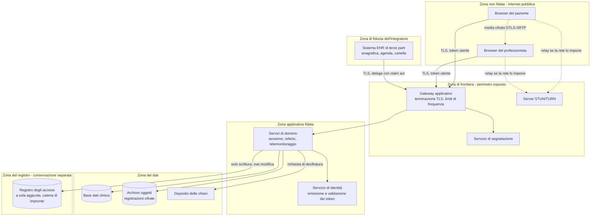
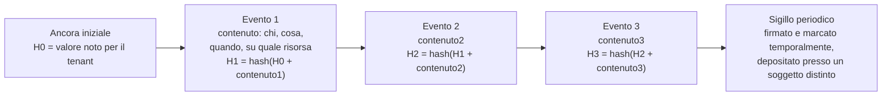
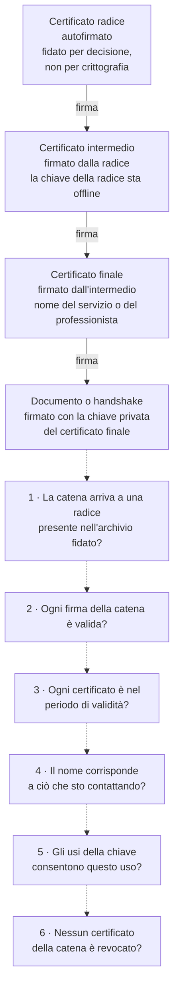
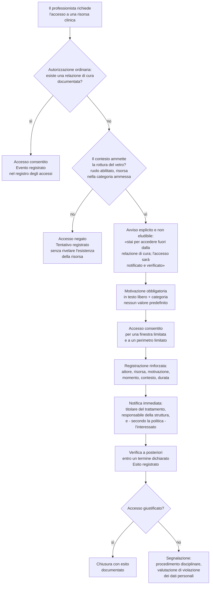
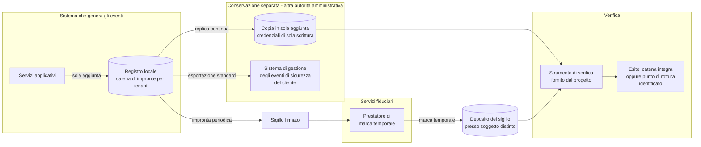

# Crittografia e sicurezza

La maggior parte dei documenti di sicurezza di un progetto software è un elenco di misure:
cifra qui, ruota là, imponi il secondo fattore. Un elenco di misure è utile a chi ha già in
testa il modello che le giustifica, ed è inutile - anzi, dannoso - a chi non ce l'ha, perché
produce l'illusione che applicare la misura equivalga a ottenere la proprietà. Non è così.
Si può cifrare un disco e non proteggere nulla. Si può imporre un secondo fattore e lasciare
aperta la strada principale. Si può firmare un documento e non essere in grado di dimostrare
nulla in giudizio.

Questo modulo fa il percorso inverso. Prima le **proprietà**: cosa si vuole ottenere, con
quale definizione precisa, contro quale avversario. Poi gli **strumenti** che le realizzano:
crittografia simmetrica, asimmetrica, funzioni di hash, firma, infrastruttura a chiave
pubblica. Poi il punto in cui gli strumenti si applicano a un sistema reale: identità,
autorizzazione, tracciabilità. Solo alla fine il **quadro normativo**, che è la ragione per
cui alcune di queste scelte, in questo dominio, non sono opinabili.

Non presuppone nulla. Chi arriva dalla clinica troverà spiegato da zero cosa sia una chiave;
chi arriva dall'informatica troverà spiegato perché in sanità il registro di chi ha guardato
una cartella pesa quanto la cifratura del disco su cui sta.

**Tre avvertenze prima di cominciare.**

1. **Questo modulo non contiene ricette.** Dove indica un algoritmo o un parametro, dichiara
   la fonte. Dove la fonte non è stata verificata, lo marca con `[NV]`. La ragione è che le
   ricette crittografiche invecchiano - un parametro adeguato nel 2015 può non esserlo nel
   2026 - e un documento che le cristallizza produce sistemi obsoleti che si credono sicuri.
   I riferimenti di elezione del progetto per la scelta dei meccanismi e delle dimensioni
   delle chiavi sono **ETSI TS 119 312**, i meccanismi crittografici concordati in ambito
   **SOG-IS** e le indicazioni **AgID-ACN**, per effetto della decisione **D19**.
2. **Non copre il tempo reale.** DTLS-SRTP, ICE, STUN, TURN e la stringa di autenticazione
   breve confrontata a voce sono trattati per esteso in
   [08 - WebRTC da zero](08-webrtc-da-zero.md), che ne è la fonte. Qui compaiono come esempi
   applicativi, con rinvio.
3. **Non copre i protocolli.** TLS, OAuth 2.0, OpenID Connect, SAML 2 e la loro meccanica
   stanno in [13 - I protocolli, uno per uno](13-protocolli.md). Qui si spiega la teoria che
   quei protocolli usano; là si spiega come la usano.

E un rinvio che vale per tutto il modulo: **la disciplina del dato sanitario - art. 9 GDPR,
base giuridica, consenso, ruoli privacy, oscuramento, conservazione - sta in
[03 - Il dato clinico](03-il-dato-clinico.md)**. Qui non si ripete: si assume, e si parla di
come si realizza tecnicamente.

---

## 1. Cosa vuol dire «sicuro»

«Sicuro» non è un aggettivo binario e non è una proprietà del software. È un insieme di
proprietà distinte, ciascuna definita rispetto a un avversario e a un contesto. Un sistema può
avere una di queste proprietà in misura eccellente e un'altra in misura nulla, e la
combinazione è ciò che determina se è adeguato al suo scopo.

Le proprietà sono sei. Le prime tre formano la triade classica, che il **Regolamento (UE)
2016/679** (**GDPR**, *General Data Protection Regulation*) richiama testualmente all'art. 32,
par. 1, lett. b), imponendo «la capacità di assicurare su base permanente la riservatezza,
l'integrità, la disponibilità e la resilienza dei sistemi e dei servizi di trattamento». Le
altre tre sono ciò che distingue un sistema sanitario da un sistema informativo qualunque.

### 1.1 Riservatezza

**Definizione.** L'informazione è accessibile soltanto a chi è autorizzato ad accedervi.

**Nel dominio.** Il referto di una televisita psichiatrica non deve essere leggibile
dall'amministratore di sistema che gestisce la base dati, né dal collega dermatologo della
stessa struttura, né dal tecnico del fornitore che interviene su un incidente, né da chi
intercetta il traffico sulla rete dell'ospedale.

**Cosa la viola, in ordine di frequenza reale.** Non l'intercettazione del traffico - che è
l'attacco che tutti immaginano e quasi nessuno subisce, perché il trasporto cifrato è
universale - ma: un'autorizzazione applicativa scritta male che lascia leggere una risorsa di
un altro tenant; un log di diagnostica che stampa il corpo di una richiesta contenente un
codice fiscale; un messaggio d'errore che rivela l'esistenza di un paziente; un backup non
cifrato copiato su una postazione di lavoro; un accesso legittimo per credenziali ma
illegittimo per scopo.

Quest'ultimo caso merita di essere isolato, perché è il più frequente in sanità e il meno
coperto dalle misure tecniche ordinarie: **il professionista che apre la cartella di una
persona che conosce, senza che quella persona sia sua paziente**. Nessuna cifratura lo
impedisce, nessun secondo fattore lo impedisce, nessun firewall lo impedisce. Lo impediscono
soltanto un modello di autorizzazione ancorato alla **relazione di cura** (§ 8.5) e un
registro degli accessi che rende l'atto visibile e contestabile (§ 9).

### 1.2 Integrità

**Definizione.** L'informazione non è alterata, né accidentalmente né dolosamente, se non da
chi è autorizzato e nei modi previsti; e ogni alterazione non autorizzata è **rilevabile**.

La seconda metà della definizione è la parte che si dimentica. Impedire ogni alterazione è
spesso impossibile: chi ha accesso in scrittura alla base dati può scrivere. Ciò che si può
sempre ottenere è che l'alterazione **lasci una traccia che non si può cancellare senza
lasciarne un'altra**. È il principio su cui poggiano le catene di hash (§ 5.6) e il registro
degli accessi (§ 9).

**Nel dominio.** Il valore di pressione arteriosa che il paziente ha inserito nel piano di
telemonitoraggio era 180/110 o 108/70? La soglia di allerta configurata dal cardiologo era 140
o 160? Il referto che il paziente ha scaricato è quello che il medico ha firmato o una
versione modificata dopo? L'ordine cronologico degli eventi di una sessione è quello reale o è
stato riscritto?

**Perché qui l'integrità pesa più della riservatezza.** L'intuizione comune, formata su
domini come quello finanziario o quello delle comunicazioni personali, mette la riservatezza
al primo posto. In sanità l'ordine si inverte, per una ragione strutturale: **la violazione
della riservatezza produce un danno grave ma non modifica la decisione clinica; la violazione
dell'integrità la modifica**.

Se un dato sanitario viene divulgato, il paziente subisce un danno - stigma, discriminazione,
perdita di opportunità - che è reale e che il diritto protegge con particolare intensità. Ma
il medico continua a decidere sulla base di informazioni corrette. Se invece un dato sanitario
viene alterato, il medico decide sulla base di un'informazione falsa, e l'esito può essere una
terapia sbagliata, un mancato intervento, un danno permanente. La gestione del rischio ai
sensi di **ISO 14971:2019** classifica il primo scenario come grave e il secondo come critico
o catastrofico, perché il criterio di severità è il **danno alla persona** (`harm`), non il
danno informativo - e lo scenario «decisione clinica presa su informazione errata o attribuita
al paziente sbagliato» è, nella matrice di rischio proposta per questo progetto, di severità
**S4**, immediatamente sotto il danno permanente o il decesso.

Ne discende una regola di progettazione che va contro l'istinto: **quando una misura di
riservatezza e una misura di integrità entrano in conflitto, l'integrità vince**, e la
riservatezza si ottiene altrimenti. Un esempio concreto è il registro degli accessi: renderlo
manipolabile per «proteggere la privacy degli operatori» sarebbe una scelta che sacrifica
l'integrità a una riservatezza mal posta.

### 1.3 Disponibilità

**Definizione.** L'informazione e il servizio sono accessibili quando servono, a chi ne ha
diritto, nei tempi richiesti dall'uso.

**Nel dominio.** Una televisita che non parte è una prestazione sanitaria non erogata. Se il
paziente è un cardiopatico cronico in un programma di telemonitoraggio e il sistema non
riceve le sue misure per tre giorni, il programma di sorveglianza si è interrotto senza che
nessuno se ne accorga - ed è uno scenario di rischio clinico, non un disservizio.

**Perché la disponibilità è un requisito di sicurezza e non di ingegneria delle prestazioni.**
Perché un avversario può attaccarla direttamente (esaurimento delle risorse, cifratura
estorsiva dei dati) e perché il diritto la tratta come tale: l'art. 32, par. 1, lett. c) GDPR
impone «la capacità di ripristinare tempestivamente la disponibilità e l'accesso dei dati
personali in caso di incidente fisico o tecnico», e il **d.lgs. 4 settembre 2024, n. 138**
(recepimento della direttiva NIS2) fa della «violazione dei livelli di servizio attesi» una
tipologia autonoma di **incidente significativo** notificabile all'autorità - la tipologia
**IS-3** degli Allegati 3 e 4 della **Determinazione ACN n. 379907 del 19 dicembre 2025**.

Un dato quantitativo che chiarisce la portata dell'obbligo: l'esempio ufficiale di ACN nella
*Guida alla lettura* delle specifiche di base indica che, se il livello di servizio atteso
dichiarato è «disponibile almeno il 99% del tempo su base giornaliera», un'indisponibilità
superiore a **14 minuti e 24 secondi in un giorno** costituisce incidente significativo e fa
scattare l'obbligo di pre-notifica entro 24 ore. Questo è il motivo per cui il progetto deve
misurare e storicizzare la propria disponibilità per tenant e per servizio con quella
granularità (requisito **SEC-037** del catalogo di sicurezza): non per esibire un numero in un
cruscotto, ma perché senza quel numero il cliente non sa se è in obbligo di notifica.

### 1.4 Autenticità

**Definizione.** L'informazione proviene effettivamente dalla fonte che dichiara, e l'entità
con cui si interagisce è effettivamente quella che dichiara di essere.

Autenticità e integrità sono spesso confuse perché gli stessi strumenti crittografici le
forniscono insieme. Sono però proprietà distinte: un messaggio può essere integro - non
alterato dopo l'invio - e non autentico, se chi l'ha inviato non è chi dice di essere. Un
messaggio integro proveniente da un impostore è integro e falso.

**Nel dominio.** La sessione video a cui il paziente si collega è davvero condotta dal suo
medico, o da qualcuno che ne ha preso il posto? La misura di glicemia arrivata via API dal
gateway di telemonitoraggio è davvero stata prodotta da quel gateway? Il webhook che comunica
la chiusura di un appuntamento arriva davvero dal sistema dell'integratore? Il referto firmato
è davvero stato firmato da quel professionista, con quel certificato, in quel momento?

**Il caso più delicato di questo progetto.** In una sessione WebRTC, l'handshake DTLS
garantisce che il canale sia cifrato con la controparte che ha presentato una certa impronta
di certificato; **non garantisce che quella controparte sia la persona attesa**, perché
l'impronta arriva attraverso il canale di segnalazione, e chi controlla la segnalazione può
sostituirla. È esattamente il motivo per cui la decisione **D22** rende obbligatoria per
impostazione predefinita la **stringa di autenticazione breve** confrontata a voce dai due
interlocutori: è l'unico meccanismo che trasforma l'autenticità da asserzione in verifica. La
meccanica sta in [08 § 6.4–6.6](08-webrtc-da-zero.md); qui basti il principio: **la cifratura
senza autenticazione dell'interlocutore protegge il canale verso un ignoto**.

### 1.5 Non ripudio

**Definizione.** Chi ha compiuto un atto non può negare, davanti a un terzo, di averlo
compiuto.

È la proprietà che distingue una misura tecnica da una prova. L'integrità e l'autenticità sono
verificabili **dalle parti**; il non ripudio deve essere verificabile **da un terzo che non si
fida di nessuna delle due**: un giudice, un'autorità di controllo, un organismo notificato.

**Perché richiede la crittografia asimmetrica.** Con la sola crittografia simmetrica, mittente
e destinatario condividono la stessa chiave: entrambi possono produrre un messaggio autentico,
quindi nessuno dei due può dimostrare a un terzo che l'ha prodotto l'altro. La firma digitale
(§ 6) risolve questo problema perché la chiave con cui si firma è nota soltanto al firmatario.

**Nel dominio.** Il medico ha firmato il referto: non può sostenere di non averlo fatto, e la
struttura non può sostenere di averlo fatto al posto suo. L'assistito ha prestato il consenso
alla registrazione della sessione: la struttura può dimostrarlo. L'operatore ha eseguito un
accesso in **rottura del vetro** (§ 8.7) alle 3 del mattino: non può sostenere che non è
avvenuto.

**Attenzione a una confusione ricorrente.** TLS non produce non ripudio. Protegge il canale,
autentica il server (e opzionalmente il client), garantisce integrità e riservatezza del
transito - ma non lascia alcuna prova opponibile a un terzo su chi ha inviato cosa. Per il non
ripudio servono firme **sui messaggi o sui documenti**, non sul canale.

E una seconda confusione, più insidiosa: **la firma elettronica non è tutta uguale**. Il
Regolamento (UE) n. 910/2014 (**eIDAS**), come modificato dal Regolamento (UE) 2024/1183,
distingue firma elettronica semplice, avanzata e qualificata, e **soltanto la qualificata ha
per legge l'effetto giuridico equivalente alla firma autografa** (art. 25, par. 2 eIDAS). La
tabella completa e il suo effetto sui referti stanno in
[03 § 7.1](03-il-dato-clinico.md); qui interessa la conseguenza tecnica: **il livello di firma
determina il livello di non ripudio ottenibile, e va scelto in funzione della contestazione
che si vuole poter reggere**, non della comodità implementativa.

### 1.6 Tracciabilità

> **Attenzione a una collisione di nomi che attraversa questa stessa guida.** «Tracciabilità»
> ha **due significati distinti e non intercambiabili**, e usarli senza accorgersene è un modo
> rapido per fraintendersi in una discussione tecnica.
>
> - **Tracciabilità degli accessi** - il significato di questa sezione: ricostruire *a
>   posteriori* chi ha fatto cosa. È una proprietà di sicurezza, e il suo strumento è il
>   registro degli accessi.
> - **Tracciabilità dei requisiti** - il significato usato nei moduli
>   [11](11-fondamenti-informatici.md) e [17](17-ambiente-di-sviluppo.md) e in tutta l'area
>   di conformità: la catena che lega un requisito alla progettazione, alla realizzazione e alla
>   prova che lo verifica. È una proprietà di processo, richiesta dalla norma sul ciclo di vita
>   del software, e **non si ricostruisce a posteriori** - è questo che la rende una delle
>   attività retroattivamente irrecuperabili.
>
> Quando il contesto non è ovvio, questa guida usa la forma estesa. Il
> [glossario](19-glossario.md) riporta entrambe le voci.

**Definizione.** Ogni operazione rilevante è registrata in modo che si possa ricostruire, a
posteriori, chi ha fatto cosa, quando, su quale dato e in quale contesto.

È la proprietà meno crittografica delle sei e la più decisiva in sanità. Le altre cinque
riguardano ciò che il sistema impedisce; la tracciabilità riguarda ciò che il sistema
**rende visibile** quando l'impedimento non c'è o non ha funzionato.

**Perché in sanità pesa quanto la riservatezza.** Perché nel modello di accesso sanitario la
maggior parte degli accessi è **legittima per credenziali e potenzialmente illegittima per
scopo**. Un professionista abilitato ha titolo ad accedere a molte cartelle; quali di queste
riguardino pazienti effettivamente in cura da lui è una circostanza che il sistema, in molti
casi, non può accertare in anticipo con certezza. Il controllo preventivo può ridurre
l'insieme, non azzerarlo - e se lo azzerasse bloccherebbe la cura in emergenza.

Ne discende il modello: **si consente più di quanto si vorrebbe, e si registra tutto in modo
non ripudiabile e non alterabile**. È esattamente il vincolo **V5** del progetto, ed è la
ragione per cui l'obbligo di tracciabilità compare in tutte le fonti applicabili
contemporaneamente: art. 5, par. 2 GDPR (responsabilizzazione), misure `PR.PS-04` e `DE.CM-01`
delle specifiche di base ACN, requisito R30 delle linee guida AgID sulla sicurezza nel
procurement ICT, misura ABSC 3.5.1 della Circolare AgID 2/2017, Allegato I Parte I del
**Regolamento (UE) 2024/2847** (*Cyber Resilience Act*), e - sul versante dei termini di
conservazione - l'Allegato 4 del **DM 19 novembre 2025**, che fissa in ventiquattro mesi la
conservazione dei log delle operazioni.

**La conseguenza architetturale, che è lo sforzo maggiore dell'intero catalogo di sicurezza.**
Un registro degli accessi che il gestore del sistema può modificare non prova nulla contro il
gestore del sistema. Poiché il gestore del sistema è, in molti scenari, esattamente il soggetto
la cui condotta si vuole poter contestare, il registro deve essere costruito in modo da essere
verificabile **contro chi lo ospita**. È la decisione **D42**, ed è trattata al § 9.

### 1.7 Le sei proprietà, in una tabella

| Proprietà | Domanda a cui risponde | Meccanismo primario | Esempio di violazione nel dominio |
|---|---|---|---|
| **Riservatezza** | Chi può leggere? | Cifratura, controllo degli accessi, minimizzazione | Un professionista legge la cartella di un conoscente non suo paziente |
| **Integrità** | Il dato è quello originale? | Cifratura autenticata, firma, catene di hash | Una soglia di allerta del telemonitoraggio viene alterata |
| **Disponibilità** | È accessibile quando serve? | Ridondanza, backup verificati, resilienza | La sessione non parte all'orario dell'appuntamento |
| **Autenticità** | Chi lo dice è chi dice di essere? | Firma, certificati, verifica delle chiavi | Un terzo si sostituisce al medico nella sessione video |
| **Non ripudio** | Si può provare a un terzo? | Firma digitale con chiave privata esclusiva, marca temporale | Il firmatario nega di aver validato un referto |
| **Tracciabilità** | Chi ha fatto cosa, quando? | Registro a sola aggiunta con catena di impronte e conservazione separata | Nessuna evidenza di chi ha consultato un dossier |

### 1.8 Le proprietà che nessuna di queste copre

Tre esigenze reali del dominio non rientrano in nessuna delle sei, e vanno nominate perché
altrimenti si finisce per pretendere che una cifratura le risolva.

**La riservatezza dei metadati.** Cifrare il contenuto di una comunicazione non nasconde che
la comunicazione è avvenuta, fra chi, quando e per quanto. In telemedicina il metadato **è**
dato sanitario per inferenza: sapere che un assistito ha avuto tre sessioni con un servizio di
psichiatria nell'ultimo mese rivela informazioni sulla sua salute anche senza conoscerne una
sola parola. Il modulo [03 § 1.2](03-il-dato-clinico.md) lo argomenta per esteso. La
conseguenza tecnica è che i metadati vanno **minimizzati e sottoposti a conservazione breve**,
non soltanto cifrati.

**La resistenza alla coercizione.** Nessun meccanismo crittografico protegge da un utente
autorizzato che agisce sotto costrizione, o da un amministratore che viene obbligato a
consegnare le chiavi. Si mitiga con la separazione dei compiti (§ 8.6) e con il controllo
duale, non con la crittografia.

**La correttezza del dato in ingresso.** Un valore di pressione autenticato, integro,
firmato e tracciato può essere semplicemente sbagliato, perché il paziente ha digitato male o
perché lo sfigmomanometro è tarato male. La sicurezza informatica garantisce che il dato
arrivi come è partito; non garantisce che sia partito giusto. È il motivo per cui la decisione
**D21** stabilisce che il progetto non si assume responsabilità sull'accuratezza della catena
di misura hardware, e per cui soglie e allerte sono configurate dal professionista e mai
dedotte dal sistema (vincolo **V2**).

---

## 2. Modellare le minacce

### 2.1 Cos'è un modello di minaccia

Un **modello di minaccia** (*threat model*) è la descrizione strutturata di ciò contro cui un
sistema si difende. Non è un elenco di attacchi né una lista di controlli: è un documento che
risponde a quattro domande, in quest'ordine.

1. **Cosa stiamo costruendo?** Quali componenti esistono, quali dati trattano, come
   comunicano fra loro, dove passano i confini di responsabilità.
2. **Cosa può andare storto?** Quali minacce si applicano a ciascun elemento del sistema,
   dato un avversario con certe capacità.
3. **Cosa facciamo al riguardo?** Quali controlli mitigano quali minacce, e quale rischio
   residuo resta.
4. **Abbiamo fatto un buon lavoro?** Come verifichiamo che i controlli funzionino davvero.

La proprietà che rende il modello di minaccia diverso da una checklist è che è **relativo al
sistema specifico**. Una checklist dice «usa TLS»; un modello di minaccia dice «il canale fra
il gateway e il servizio di refertazione attraversa un confine di fiducia e trasporta
contenuto clinico non firmato, quindi un avversario con accesso alla rete interna può
alterarlo senza che nessuno se ne accorga; mitigazione: mTLS più firma applicativa sul
messaggio; verifica: test di integrazione che rigetta un messaggio con firma non valida».

**Perché è un obbligo e non una buona pratica, in questo progetto.** La decisione **D10**
impone un modello di minaccia **STRIDE** come parte del testing di sicurezza. La norma
**EN IEC 81001-5-1:2022** - *Health software and health IT systems safety, effectiveness and
security - Part 5-1: Security - Activities in the product life cycle* - richiede la
modellazione delle minacce come attività di processo del ciclo di vita, e la guida
**MDCG 2019-16 rev. 1** della Commissione europea la presuppone nel processo di gestione del
rischio di cibersicurezza raccordato con **ISO 14971**. Il requisito verificabile
corrispondente è **SEC-049**: il modello esiste, è datato, e ogni minaccia rilevante ha almeno
un requisito e un test associati.

> **Nota di stato.** Lo stato di armonizzazione di EN IEC 81001-5-1:2022 sotto MDR non è
> accertato su fonte primaria in questo progetto: `[NV]`. La norma resta comunque il
> riferimento tecnico di elezione per dimostrare lo «stato dell'arte» richiesto dall'Allegato I
> del Regolamento (UE) 2017/745, indipendentemente dalla presunzione di conformità.

### 2.2 STRIDE: sei categorie, una per proprietà

**STRIDE** è un acronimo che elenca sei categorie di minaccia. Ciascuna è la negazione di una
proprietà di sicurezza, il che rende il metodo sistematico: per ogni elemento del sistema si
scorrono le sei categorie e si chiede se quella minaccia si applica.

| Categoria | In italiano | Nega la proprietà | Esempio in questo sistema |
|---|---|---|---|
| **S**poofing | Sostituzione di identità | Autenticità | Un terzo si presenta come il professionista nella segnalazione della sessione |
| **T**ampering | Manomissione | Integrità | Alterazione di una riga della tabella di audit da parte di chi ha accesso alla base dati |
| **R**epudiation | Ripudio | Non ripudio | Il firmatario nega di aver validato quel referto; il sistema non ha prova opponibile |
| **I**nformation disclosure | Divulgazione | Riservatezza | Una risposta API restituisce risorse di un tenant diverso da quello del chiamante |
| **D**enial of service | Interruzione | Disponibilità | Esaurimento delle porte di relay del server TURN, che impedisce l'avvio delle sessioni |
| **E**levation of privilege | Elevazione di privilegio | Autorizzazione | Un utente con ruolo di segreteria ottiene la capacità di leggere il contenuto clinico |

STRIDE non è l'unico metodo, e non è il migliore per tutti gli scopi: è quello che si applica
meglio a un diagramma di flusso dei dati, ed è quello adottato dal progetto. Ne esistono altri
orientati all'attaccante (alberi di attacco) o al valore protetto (analisi centrata sugli
asset); usarne uno non esclude gli altri.

### 2.3 Attore, capacità, motivazione

Una minaccia senza un attore è un'astrazione. Il modello di minaccia va ancorato ad avversari
**realistici**, descritti da tre attributi.

- **Capacità**: cosa può fare tecnicamente. Osservare il traffico? Modificarlo? Eseguire
  codice su una macchina? Ottenere credenziali valide? Compromettere una dipendenza?
- **Posizione**: da dove agisce. Internet pubblica, rete dell'organizzazione, dentro il
  perimetro applicativo, dentro la catena di fornitura.
- **Motivazione**: perché lo fa. Determina la persistenza, il costo che è disposto a
  sostenere e il bersaglio che sceglie.

L'errore da evitare è modellare soltanto l'avversario spettacolare - l'attaccante statale con
risorse illimitate - perché contro di lui nessuna misura proporzionata funziona e la
conclusione operativa è la paralisi. Il modello utile è quello che descrive gli avversari che
si presentano davvero, in ordine di probabilità decrescente.

### 2.4 Gli avversari realistici di questo sistema

**A1 - L'attaccante esterno opportunista.** Non ha alcun interesse specifico per la sanità:
scansiona Internet in cerca di servizi esposti con vulnerabilità note o credenziali
predefinite. È l'avversario più frequente in assoluto e il più facile da respingere. Capacità:
strumenti automatici pubblici, exploit di vulnerabilità note, riuso di credenziali trapelate.
Contromisure: assenza di credenziali predefinite e di servizi non necessari esposti (requisito
**SEC-055**, «sicuro per impostazione predefinita»), aggiornamenti tempestivi, blocco
dell'utenza dopo tentativi falliti (**SEC-015**), secondo fattore obbligatorio sulle utenze
amministrative (**SEC-012**).

**A2 - L'attaccante esterno mirato.** Ha scelto il bersaglio. In sanità la motivazione tipica
è economica: estorsione tramite cifratura dei dati e minaccia di pubblicazione, che nel
settore sanitario funziona particolarmente bene perché la pressione a ripristinare il servizio
è massima e il valore ricattatorio del dato è alto. Capacità: ricognizione, phishing mirato
verso il personale, sfruttamento di vulnerabilità recenti, movimento laterale. Contromisure:
segmentazione, privilegio minimo, backup cifrati con copia non raggiungibile dal sistema
compromesso e test di ripristino verificati - che è precisamente il profilo rinforzato della
misura `PR.DS-11` per i soggetti essenziali.

**A3 - L'insider curioso.** È un utente legittimo dell'organizzazione che accede a dati a cui
non ha titolo per lo scopo per cui vi accede. Non è un attaccante nel senso tecnico: non
elude alcun controllo, usa le proprie credenziali, non lascia tracce anomale sulla rete. È il
caso che il diritto della protezione dei dati tratta con maggiore severità nel dominio
sanitario, ed è quello contro cui la crittografia è quasi inerme. Contromisure: autorizzazione
ancorata alla relazione di cura, rottura del vetro con motivazione obbligatoria e notifica
(§ 8.7), registro degli accessi con indicatori quali-quantitativi - che è esattamente ciò che
la misura `DE.CM-01` delle specifiche di base ACN richiede quando chiede di definire parametri
come «il superamento di una soglia per le interrogazioni di una banca dati da parte di un
singolo utente» o «l'accesso di un amministratore di sistema al di fuori dell'orario di
servizio», e che la tipologia di incidente **IS-4** - riservata ai soggetti essenziali - rende
notificabile all'autorità.

**A4 - Il professionista che accede a un caso che non gli compete.** È una variante di A3 che
merita trattazione separata perché la sua legittimità è **graduata, non binaria**. Un medico
di guardia che apre la cartella di un paziente che non ha mai visto può essere: (a) un
curioso; (b) un collega chiamato in consulenza informale; (c) il professionista che sta per
prendere in carico quel paziente e non ha ancora un incarico formalizzato nel sistema; (d) chi
sta gestendo un'emergenza. Il sistema, nel momento dell'accesso, non è in grado di distinguere
questi quattro casi. Ne discende il modello a due stadi: **si consente l'accesso, si obbliga a
dichiararne il motivo, si registra in modo non ripudiabile, si notifica, e si verifica dopo**.
Un sistema che pretende di decidere prima o blocca la cura o lascia passare tutto.

**A5 - L'amministratore di sistema.** Ha, per definizione del proprio ruolo, i privilegi
tecnici che consentono di leggere e alterare qualunque cosa: contenuto delle basi dati, file
di configurazione, chiavi, log. È l'avversario che rende inutile gran parte delle difese
applicative e che obbliga a progettare la tracciabilità **contro il custode del sistema**. La
figura è disciplinata anche sul piano giuridico - il modulo [03 § 3.4](03-il-dato-clinico.md)
tratta la designazione individuale, il tracciamento e la verifica periodica degli
amministratori di sistema. Contromisure tecniche: separazione dei compiti, catena di impronte
dell'audit con **conservazione presso un soggetto o un sistema distinto** (§ 9.4), cifratura a
livello di campo con chiavi non accessibili all'amministratore della base dati (§ 7.4),
controllo duale sulle operazioni più sensibili.

**A6 - Il tenant vicino.** In un'installazione multi-tenant, ogni altro cliente della stessa
installazione è un avversario potenziale. Non perché lo sia in intenzione, ma perché la
distanza fra lui e i dati altrui è una sola riga di codice sbagliata. La perdita di dati
attraverso il confine di tenant è, nella matrice di rischio del progetto, uno dei due scenari
di severità **S4** da tenere sotto controllo assoluto. Contromisura strutturale: l'isolamento
imposto **a livello di persistenza** - sicurezza a livello di riga o schema dedicato - e non
soltanto a livello applicativo (requisito **SEC-018**, vincolo **V4**), più un test di accesso
trasversale negativo su ogni endpoint dell'interfaccia.

**A7 - Il fornitore compromesso e la catena di fornitura.** L'avversario non attacca il
sistema: attacca una delle sue dipendenze, o lo strumento con cui il sistema viene costruito.
Una libreria di terze parti con un contributo malevolo, un'immagine di base alterata, una
credenziale della pipeline di integrazione continua sottratta, una chiave di firma degli
artefatti compromessa. È l'avversario contro cui le difese di runtime non fanno nulla, perché
il codice malevolo arriva **dentro** l'artefatto legittimo, firmato dal legittimo firmatario.
È anche l'avversario che il diritto europeo ha deciso di prendere di petto: l'art. 24, comma
2, lett. d) e comma 3 del d.lgs. 138/2024 impone al soggetto NIS di valutare «le specifiche
vulnerabilità di ciascun fornitore diretto» e «la qualità complessiva dei prodotti e le
pratiche di cybersicurezza dei fornitori, comprese le procedure di sviluppo sicuro». Il § 11
tratta le contromisure.

**A8 - L'integratore.** Non è un avversario in senso proprio: è una controparte legittima che
però sta **fuori dal confine di fiducia del progetto**. Riceve deleghe, presenta identità
federate, invoca l'interfaccia per conto dei propri utenti. Se il suo sistema è compromesso, o
se semplicemente sbaglia, le sue asserzioni diventano false. Da qui la regola della decisione
**D18**: la delega è **sempre rappresentata con il claim `act`** di RFC 8693 § 4.1, **mai con
l'impersonificazione**, perché il registro deve poter distinguere «Tizio ha agito» da «il
sistema X ha agito per conto di Tizio». E da qui la regola della decisione **D38**: il livello
di garanzia dell'autenticazione va qualificato con un marcatore che distingua
**l'autenticazione eseguita dal progetto** da quella **riferita dall'integratore**. Sono due
affermazioni con valore probatorio diverso e non vanno confuse in un unico campo.

**A9 - L'utente stesso.** Il paziente che concede l'accesso al proprio dispositivo a un
familiare, che riusa una password, che clicca su un collegamento in un messaggio che sembra
provenire dalla struttura. Non è malevolo: è la condizione ordinaria. Contromisure: percorsi
brevi e reversibili, autenticazione forte tramite identità digitale nazionale, messaggi che
non chiedono mai credenziali, e - per il vincolo **V6** - la consapevolezza che una misura di
sicurezza che l'utente reale non riesce a eseguire è una misura che non esiste.

### 2.5 Superficie di attacco

La **superficie di attacco** è l'insieme dei punti in cui un avversario può interagire con il
sistema. Si riduce in tre modi, in ordine di efficacia: **eliminando** funzionalità non
necessarie, **restringendo** l'accesso a quelle necessarie, **irrobustendo** ciò che resta.
L'ordine conta: una funzionalità rimossa non ha vulnerabilità.

Per questo sistema, la superficie si compone almeno di:

| Superficie | Chi la raggiunge | Rischio caratteristico |
|---|---|---|
| Interfaccia web paziente e professionista | Internet pubblica | Attacchi al browser, sessioni rubate, phishing |
| Interfaccia applicativa REST e FHIR | Integratori autenticati | Autorizzazione difettosa, accesso trasversale fra tenant, enumerazione |
| Canale di segnalazione della sessione | Internet pubblica, autenticato | Sostituzione dell'interlocutore, esaurimento risorse |
| Server di relay STUN/TURN | Internet pubblica | Abuso come relay verso reti interne, esaurimento delle porte |
| Webhook in uscita | Rete verso l'integratore | Richieste falsificate in ingresso se non firmate; esfiltrazione se l'endpoint è alterabile |
| Endpoint di ingestione delle misure | Gateway di telemonitoraggio | Iniezione di misure false, ripetizione di messaggi |
| Interfacce di amministrazione | Rete di gestione | Elevazione di privilegio, accesso remoto non tracciato |
| Catena di costruzione (dipendenze, CI, registro immagini) | Chi contribuisce, chi pubblica | Codice malevolo dentro l'artefatto legittimo |
| Basi dati, oggetti archiviati, backup | Amministratori, processi interni | Lettura diretta, alterazione, esfiltrazione di copie |

Va notato che la superficie **cambia con la configurazione**. L'attivazione della registrazione
lato server (decisione **D23**) introduce un componente che termina la cifratura e che quindi
vede il media in chiaro: è una superficie che nella modalità predefinita non esiste. Il modello
di minaccia deve quindi essere **per modalità operativa**, non unico.

### 2.6 Fiducia e confini di fiducia

**Fidarsi di un componente**, in questo contesto, non è un giudizio morale: significa che se
quel componente si comporta in modo scorretto, la proprietà di sicurezza cade e il sistema non
se ne accorge. Il **confine di fiducia** è la linea che separa due zone in cui le assunzioni
sono diverse: attraversandola, un dato passa da «già validato e attribuito» a «da validare e
da attribuire», o viceversa.

La regola operativa che ne discende è una sola e vale sempre: **ogni volta che un dato
attraversa un confine di fiducia entrando, va validato; ogni volta che lo attraversa uscendo,
va autorizzato**. Le validazioni interne al confine sono difese in profondità; quelle sul
confine sono obbligatorie.

Cinque letture del diagramma che vale la pena esplicitare.

1. **Il browser non è mai fidato.** Nemmeno quello del professionista, nemmeno su una rete
   ospedaliera. Qualunque controllo eseguito soltanto nell'interfaccia è un suggerimento di
   usabilità, non una misura di sicurezza. Se una regola conta, deve essere applicata anche
   dal lato server - e siccome il vincolo **V3** impone che ogni capacità sia raggiungibile da
   un sistema terzo tramite interfaccia documentata, il lato server è comunque l'unico punto
   di applicazione possibile.
2. **L'integratore è in una zona propria.** Non è pubblico come un browser né fidato come un
   servizio interno: è una controparte autenticata le cui asserzioni sull'identità dei suoi
   utenti vanno accettate **qualificandole come riferite** (decisione D38).
3. **Il server di relay sta sulla frontiera e vede più di quanto sembri.** Non vede il
   contenuto del media, che resta cifrato da estremo a estremo, ma vede gli indirizzi IP di
   entrambe le parti - che sono dati personali e che possono rivelare la posizione. È il
   motivo per cui il vincolo **V1** ne impone l'autogestione nell'Unione: è una misura ai
   sensi dell'art. 32 GDPR, non soltanto una scelta di sovranità.
4. **Il media non attraversa la zona applicativa** nella modalità predefinita. È la ragione
   per cui la modalità con registrazione (D23) è architetturalmente un'altra cosa, e va
   trattata come tale nel modello di minaccia.
5. **La freccia verso il registro è a senso unico e non ha ritorno.** Il servizio applicativo
   può scrivere e non può modificare. Se questa freccia fosse bidirezionale, l'intera proprietà
   di tracciabilità cadrebbe: § 9.

### 2.7 Da minaccia a requisito a test

Un modello di minaccia che non produce requisiti verificabili è un esercizio. La catena che lo
rende utile è: **minaccia → controllo → requisito identificato → test che lo verifica**. La
decisione **D45** rende gli identificativi di requisito (`RF-*`, `RNF-*`, `BR-*`) immutabili
proprio perché questa catena, ai fini di **IEC 62304**, deve restare tracciabile nel tempo e
non è ricostruibile a posteriori.

Esempio completo su un caso reale del progetto:

| Passo | Contenuto |
|---|---|
| **Minaccia** | Spoofing: un terzo che controlla il canale di segnalazione sostituisce l'impronta del certificato DTLS e si interpone nella sessione |
| **Attore** | A2 (esterno mirato) o A5 (amministratore del servizio di segnalazione) |
| **Perché il controllo ordinario non basta** | L'handshake DTLS autentica la chiave, non la persona; l'impronta arriva dal canale che l'avversario controlla |
| **Controllo** | Confronto vocale di una stringa breve derivata dalle impronte di entrambe le parti |
| **Requisito** | Stringa di autenticazione breve obbligatoria per impostazione predefinita, leggibile da screen reader, mai veicolata dal solo colore, con procedura definita in caso di mancata corrispondenza (decisione **D22**) |
| **Test** | Sessione di prova con impronta sostituita: le due stringhe devono differire; test di accessibilità con tecnologia assistiva reale |
| **Rischio residuo** | I due interlocutori possono omettere il confronto; si mitiga con l'obbligo per impostazione predefinita e con la registrazione dell'avvenuto confronto |

Si noti l'ultima riga: **il rischio residuo si dichiara**. Un modello di minaccia che conclude
«mitigato» su ogni riga è un modello che non è stato fatto. La dichiarazione del rischio
residuo è anche un obbligo formale: ISO 14971:2019 richiede la valutazione del rischio residuo
complessivo, e le specifiche di base ACN, quando ammettono una deroga «fatte salve motivate e
documentate ragioni normative o tecniche», impongono di descrivere il rischio residuo nel
piano di trattamento del rischio (misura `ID.RA-06`, punto 2).

---

## 3. Crittografia simmetrica

### 3.1 Il problema che risolve, e il vocabolario minimo

La crittografia simmetrica risolve un problema solo: **due parti che condividono già un
segreto vogliono scambiarsi messaggi che un terzo non possa leggere né alterare**.

Il vocabolario, sciolto una volta per tutte:

- **Testo in chiaro** (*plaintext*): il messaggio originale.
- **Testo cifrato** (*ciphertext*): il messaggio trasformato, che a un osservatore appare
  indistinguibile da una sequenza casuale.
- **Chiave**: il segreto che determina la trasformazione. Nella crittografia **simmetrica** la
  stessa chiave cifra e decifra, da cui il nome.
- **Cifrario** (*cipher*): l'algoritmo che esegue la trasformazione.

Il **principio di Kerckhoffs**, formulato nel 1883 e mai smentito, stabilisce che la sicurezza
di un sistema crittografico deve dipendere **soltanto dalla segretezza della chiave**, non
dalla segretezza dell'algoritmo. Ne discende la regola pratica più importante di tutto questo
modulo: **non si inventano algoritmi crittografici, non si implementano algoritmi
crittografici, non si «adattano» algoritmi crittografici**. Si usano implementazioni
pubbliche, sottoposte a scrutinio, mantenute. Un algoritmo segreto è un algoritmo non
analizzato, e un algoritmo non analizzato è rotto: semplicemente, non lo si sa ancora.

### 3.2 Cifrari a blocchi e cifrari a flusso

Un **cifrario a blocchi** (*block cipher*) trasforma blocchi di dimensione fissa - tipicamente
128 bit - in blocchi cifrati della stessa dimensione, sotto il controllo della chiave. È una
permutazione: a chiave fissata, la corrispondenza fra blocco in chiaro e blocco cifrato è
biunivoca. Il cifrario a blocchi di riferimento è **AES** (*Advanced Encryption Standard*),
adottato dopo una competizione pubblica pluriennale.

Un **cifrario a flusso** (*stream cipher*) genera invece, a partire dalla chiave, una sequenza
pseudocasuale di lunghezza arbitraria - il **flusso di chiave** - che viene combinata con il
testo in chiaro bit a bit tramite l'operazione di or esclusivo. Cifratura e decifratura sono la
stessa operazione. È efficiente e adatto a dati di lunghezza non nota in anticipo, e ha una
proprietà pericolosa che vedremo al § 3.5.

La distinzione, in pratica, si è attenuata: le modalità operative moderne usano un cifrario a
blocchi **come se fosse** un generatore di flusso di chiave. Ciò che conta oggi non è tanto la
famiglia del cifrario quanto la **modalità operativa** con cui viene usato.

### 3.3 Le modalità operative, e perché la scelta è tutto

Un cifrario a blocchi da solo cifra 16 byte. Per cifrare un referto da 40 kilobyte serve una
**modalità operativa** (*mode of operation*): la regola con cui si concatenano le invocazioni
del cifrario.

La modalità più ingenua, chiamata storicamente **ECB** (*Electronic Codebook*), cifra ogni
blocco indipendentemente con la stessa chiave. Il difetto è immediato e catastrofico: **blocchi
in chiaro uguali producono blocchi cifrati uguali**. Su un dato strutturato - un file di
immagine, un record con campi ripetuti, un flusso con intestazioni fisse - la struttura del
testo in chiaro rimane visibile nel testo cifrato. Non è un difetto teorico: è il motivo per
cui ECB non va usata mai, in nessun contesto, nemmeno per un singolo blocco.

Le modalità successive - a concatenazione di blocchi, a contatore - risolvono il problema
introducendo un valore variabile per ogni cifratura, e ottengono la proprietà desiderata:
**due cifrature dello stesso testo in chiaro con la stessa chiave producono testi cifrati
diversi**. Ma nessuna di queste modalità, da sola, fornisce **integrità**: un avversario che
non può leggere il testo cifrato può comunque modificarlo, e in alcune modalità può farlo in
modo mirato, ribaltando bit noti in posizioni note del testo in chiaro senza conoscerlo.

Questo porta al punto centrale.

### 3.4 La cifratura autenticata è il minimo, non un'opzione

Una **cifratura autenticata con dati associati** - abbreviata **AEAD**, *Authenticated
Encryption with Associated Data* - è una costruzione che fornisce contemporaneamente
riservatezza e integrità, e che consente di legare al testo cifrato dei **dati associati** che
restano in chiaro ma di cui si garantisce l'integrità e l'associazione. L'interfaccia astratta
di un AEAD è definita da **RFC 5116**; le costruzioni AEAD di riferimento sono AES in modalità
Galois/Counter (**AES-GCM**) e le costruzioni basate su ChaCha20 e Poly1305.

Perché è il minimo. Perché la storia della crittografia applicata degli ultimi vent'anni è, in
larghissima parte, la storia di sistemi che cifravano correttamente e non autenticavano, e che
venivano rotti sfruttando l'assenza di integrità: attacchi che usano il comportamento del
destinatario davanti a un testo cifrato malformato per estrarre, un bit alla volta, il testo in
chiaro. La lezione è consolidata in una regola: **non esiste un caso in cui sia corretto
cifrare senza autenticare**. Se qualcuno propone di farlo per prestazioni, la risposta è che le
costruzioni AEAD moderne sono accelerate in hardware e il costo è trascurabile.

**A cosa servono i dati associati.** Sono la parte del messaggio che deve restare leggibile -
un'intestazione di instradamento, un identificativo di tenant, un numero di versione dello
schema - ma che non deve poter essere cambiata senza invalidare il messaggio. Nel dominio:
cifrando una registrazione di sessione, l'identificativo del tenant e quello della sessione
sono candidati naturali a essere dati associati, perché così un file cifrato non può essere
spostato da una sessione all'altra o da un tenant all'altro senza che la decifratura fallisca.
È una difesa contro l'attacco di confusione, spesso trascurata.

**Nel progetto.** Il media della sessione è protetto con SRTP usando suite di cifratura
autenticata basate su AES-GCM (**RFC 7714**), con chiavi negoziate via DTLS secondo DTLS-SRTP
(**RFC 5764**). La meccanica e i suoi limiti stanno in
[08 § 6](08-webrtc-da-zero.md).

### 3.5 Vettore di inizializzazione, e il disastro del riuso

Il valore variabile che rende diverse due cifrature dello stesso testo si chiama **vettore di
inizializzazione** (*initialization vector*, IV) o **nonce** - *number used once*, «numero
usato una volta sola». Il nome contiene già il requisito.

**Che cosa deve essere.** Non deve essere segreto: viaggia in chiaro accanto al testo cifrato.
Deve essere **unico per ogni cifratura eseguita con la stessa chiave**. In alcune modalità deve
anche essere **imprevedibile**; in altre basta che sia unico, e un contatore va bene.

**Cosa succede se si riusa.** Le conseguenze dipendono dalla modalità, ma nelle costruzioni a
contatore - cioè in quasi tutte quelle in uso, AES-GCM compresa - sono catastrofiche e non
graduali:

1. **Perdita immediata di riservatezza relativa.** Con lo stesso nonce e la stessa chiave si
   genera lo stesso flusso di chiave. Un avversario che ottiene due testi cifrati prodotti così
   può combinarli e ottenere l'or esclusivo dei due testi in chiaro, eliminando del tutto la
   chiave dall'equazione. Su testi con struttura nota - e un referto o un messaggio protocollare
   ha struttura notissima - questo equivale a leggerli entrambi.
2. **Perdita totale di integrità.** In AES-GCM, il riuso del nonce consente il recupero della
   **chiave di autenticazione**, che è derivata deterministicamente dalla chiave di cifratura.
   Recuperata quella, l'avversario può **falsificare messaggi validi a piacere**. Non è più un
   problema di riservatezza di due messaggi: è la compromissione della proprietà di autenticità
   per tutti i messaggi futuri sotto quella chiave.

Non esiste un modo di «riusare un po'» un nonce. È la ragione per cui le costruzioni AEAD
hanno un **limite al numero di messaggi cifrabili sotto una singola chiave**, oltre il quale la
chiave va sostituita: il limite dipende dalla dimensione del nonce e dalla strategia con cui lo
si genera. `[NV]` sui valori numerici puntuali, che vanno letti sulla specifica della
costruzione adottata e non su una sintesi.

**Le tre strategie corrette**, in ordine di preferenza:

- **Contatore per chiave**, con stato persistito in modo atomico. Semplice e sicuro finché il
  contatore non può regredire. Il caso in cui regredisce è quello che uccide: ripristino da uno
  snapshot, replica di un processo, clonazione di una macchina virtuale. Se il contatore vive
  in memoria e il processo viene clonato, due istanze producono gli stessi nonce.
- **Nonce casuale con spazio sufficientemente ampio**, accettando una probabilità di collisione
  trascurabile ma non nulla, e imponendo un limite al numero di cifrature per chiave.
- **Costruzioni resistenti al riuso del nonce**, che degradano in modo controllato invece di
  collassare. Esistono e sono standardizzate; l'adozione va decisa esplicitamente e non
  implicitamente.

**La regola pratica per chi contribuisce a questo progetto:** non generare mai un nonce a mano.
Usare l'interfaccia di alto livello della libreria crittografica, che lo gestisce internamente.
Se il codice che stai scrivendo contiene la parola «nonce» o «IV», fermati: quasi certamente
stai usando un livello di astrazione troppo basso per il problema che hai.

### 3.6 La gestione delle chiavi è il problema vero

L'algoritmo è la parte facile e risolta. **La gestione delle chiavi è la parte in cui i sistemi
reali falliscono**, e non ha una soluzione universale: ha un insieme di requisiti che vanno
soddisfatti esplicitamente.

**Generazione.** Una chiave deve provenire da un generatore di numeri pseudocasuali
**crittograficamente sicuro**, cioè da una primitiva progettata per essere imprevedibile anche
a chi conosce parte dell'output. Il generatore ordinario di un linguaggio di programmazione -
quello che si usa per mescolare una lista - **non lo è**, ed è uno degli errori più frequenti
in assoluto. In Java la classe da usare è `SecureRandom`; nell'ambiente del browser
l'interfaccia `crypto.getRandomValues`. La differenza non è di qualità statistica: è che il
generatore ordinario ha uno stato ricostruibile da poche osservazioni.

**Derivazione.** Da una chiave si derivano chiavi diverse per scopi diversi, tramite una
**funzione di derivazione di chiave** (*key derivation function*, KDF). La costruzione
standardizzata di riferimento è **HKDF** (**RFC 5869**), basata su HMAC (§ 5.5). Il principio
che rende la derivazione necessaria si chiama **separazione dei domini**: la chiave che cifra
i backup non deve essere la stessa che cifra le registrazioni, anche se entrambe derivano
dalla stessa radice, perché la compromissione di un uso non deve estendersi agli altri. La
derivazione include un'etichetta di contesto proprio a questo scopo.

**Conservazione.** Una chiave conservata accanto al dato che protegge non protegge nulla. La
gerarchia usuale è a due livelli: una **chiave di cifratura dei dati** (*data encryption key*),
che cifra il dato ed è conservata cifrata accanto ad esso, e una **chiave di cifratura delle
chiavi** (*key encryption key*), custodita in un sistema separato - un deposito delle chiavi,
un modulo hardware, un servizio dedicato - che non espone mai la chiave ma esegue le operazioni
di avvolgimento e svolgimento. Il vantaggio operativo è che ruotare la chiave di livello
superiore non richiede di ricifrare i dati.

Il requisito **SEC-023** del catalogo lo enuncia in termini verificabili: i dati sanitari e le
registrazioni sono cifrati a riposo, la gestione delle chiavi è documentata e **le chiavi sono
separabili dal dato**. La verifica è l'ispezione dello storage: nessun contenuto clinico
leggibile senza chiave.

**Rotazione.** Ruotare una chiave significa smettere di usarla per nuove cifrature e
sostituirla con una nuova. Non significa necessariamente ricifrare tutto lo storico: la
strategia usuale è mantenere le chiavi vecchie **per la sola decifratura**, con un
identificativo di versione della chiave memorizzato accanto a ciascun dato cifrato. Questo
identificativo è un requisito di progettazione che va previsto dal primo giorno, perché
aggiungerlo dopo significa non sapere quale chiave si applica a quale dato.

Sulla frequenza di rotazione la letteratura è meno perentoria di quanto si creda: la rotazione
periodica «per igiene» ha benefici limitati, mentre la rotazione **su evento** - sospetto di
compromissione, cessazione di un amministratore, dismissione di un componente - è quella che
conta. `[NV]` su qualunque periodicità numerica raccomandata: non è ricavabile dalle fonti
consultate in questo progetto e va fissata nella politica di gestione delle chiavi con
motivazione esplicita.

**Distruzione.** La cancellazione di una chiave è il modo più efficace per rendere
irrecuperabile un dato cifrato, ed è la tecnica che rende praticabile la cancellazione da
supporti su cui la cancellazione fisica non è possibile - backup su nastro, repliche
geografiche, archivi immutabili. È il meccanismo che il requisito **SEC-025** presuppone quando
chiede la rimozione sicura e permanente dei dati di un tenant con verifica sui backup e sulle
repliche. Cifratura per tenant con chiave distinta significa che dismettere un tenant è
un'operazione atomica sulla chiave, non una campagna di cancellazioni distribuite.

**Cosa non è mai accettabile.** Chiavi nel codice sorgente. Chiavi nella cronologia del
repository, anche se rimosse dal codice attuale. Chiavi nei file di configurazione versionati.
Chiavi nelle variabili d'ambiente di un'immagine di container pubblicata. Chiavi nei log,
anche a livello di diagnostica, anche parziali. Chiavi passate come argomenti da riga di
comando, che sono visibili nell'elenco dei processi. Il § 11.5 tratta la gestione dei segreti;
qui basti la regola: **se un segreto è entrato in un repository, è compromesso e va ruotato,
anche se il repository è privato, anche se il commit è stato riscritto**.

---

## 4. Crittografia asimmetrica

### 4.1 L'idea, e il problema che risolve

La crittografia simmetrica presuppone che le due parti condividano già un segreto. Ma come
fanno a condividerlo, se l'unico canale che hanno è quello che l'avversario ascolta? È il
**problema della distribuzione delle chiavi**, e per millenni non ha avuto soluzione: si
risolveva fisicamente, con un corriere.

La crittografia **asimmetrica**, o **a chiave pubblica**, lo risolve con un'idea che negli anni
Settanta era controintuitiva: **due chiavi matematicamente legate, di cui una si può
pubblicare**. Ciò che una chiave fa, soltanto l'altra disfa; e dalla chiave pubblica non è
computazionalmente possibile ricavare la privata.

- La **chiave pubblica** si distribuisce liberamente. Non è un segreto, ma la sua **autenticità**
  è critica: se un avversario riesce a farmi credere che la sua chiave pubblica sia quella del
  mio interlocutore, ha vinto. È il problema che la PKI risolve (§ 6).
- La **chiave privata** non lascia mai il suo detentore. Se lascia il detentore, tutte le
  proprietà cadono, retroattivamente per la firma e prospetticamente per la cifratura.

### 4.2 Cifrare e firmare sono due operazioni diverse

Questa distinzione è la fonte di metà delle confusioni sulla crittografia asimmetrica, e va
fissata con precisione.

| | Cifratura asimmetrica | Firma digitale |
|---|---|---|
| **Obiettivo** | Riservatezza verso un destinatario | Autenticità, integrità, non ripudio verso chiunque |
| **Chi usa la chiave pubblica** | Il **mittente**, per cifrare | Il **verificatore**, per verificare |
| **Chi usa la chiave privata** | Il **destinatario**, per decifrare | Il **firmatario**, per firmare |
| **Chi può eseguire l'operazione** | Chiunque conosca la chiave pubblica | Soltanto il detentore della chiave privata |
| **Chi può verificarne l'esito** | Soltanto il detentore della chiave privata | Chiunque conosca la chiave pubblica |

La formula mnemonica «firmare è cifrare con la chiave privata» è diffusa, comoda ed **errata**.
Non è così che funzionano gli schemi di firma moderni, che sono costruzioni autonome con
formattazione e passaggi propri; e prendere quella formula alla lettera porta a implementare
firme insicure. Le due operazioni vanno tenute concettualmente separate, e in pratica **si usano
chiavi diverse per scopi diversi**: una coppia per cifrare, una per firmare, mai la stessa per
entrambi.

### 4.3 Perché non si cifra un referto con RSA

La crittografia asimmetrica è **lenta** - ordini di grandezza più lenta della simmetrica - e
opera su input di dimensione limitata. Non si cifra un documento con essa. Si usa la
**cifratura ibrida**: si genera una chiave simmetrica effimera, si cifra il documento con
quella, si cifra la chiave simmetrica con la chiave pubblica del destinatario, e si spedisce la
coppia. Il destinatario decifra la chiave con la propria chiave privata e con essa il
documento. È ciò che fanno, sotto il cofano, tutti i sistemi di cifratura di file e di posta.

Lo stesso principio spiega la struttura di TLS: la parte asimmetrica dell'handshake serve a
concordare un segreto e ad autenticare il server; il traffico vero e proprio viaggia protetto
con crittografia simmetrica autenticata.

### 4.4 Lo scambio di chiavi e la segretezza in avanti

Uno **scambio di chiavi** è un protocollo con cui due parti che non condividono nulla arrivano
a condividere un segreto, senza che il segreto transiti sul canale. Nella costruzione di
Diffie-Hellman ciascuna parte genera una coppia di chiavi, si scambiano le pubbliche, e ognuna
combina la propria privata con la pubblica dell'altra ottenendo **lo stesso valore**, che
l'osservatore non può calcolare pur avendo visto entrambe le pubbliche.

La proprietà che rende questa costruzione decisiva è la **segretezza in avanti** (*forward
secrecy*): se le coppie di chiavi usate nello scambio sono **effimere**, generate per quella
sola sessione e distrutte alla fine, allora la compromissione futura della chiave privata di
lungo termine del server **non consente di decifrare le sessioni passate**, nemmeno se
l'avversario le ha registrate integralmente. In TLS 1.3 la segretezza in avanti è obbligatoria;
[13 § 2.5](13-protocolli.md) ne descrive la meccanica.

Perché conta in questo dominio: significa che un avversario che oggi registra traffico cifrato
e domani ottiene la chiave del server non ottiene i consulti di oggi. In assenza di segretezza
in avanti, ogni sessione registrata è una bomba a orologeria.

Lo scambio di chiavi grezzo, però, è **anonimo**: garantisce un segreto condiviso con
*qualcuno*, non con il destinatario voluto. Senza autenticazione delle chiavi pubbliche
scambiate, un avversario attivo può eseguire due scambi - uno con ciascuna parte - e
interporsi. È l'attacco dell'intermediario, ed è il motivo per cui ogni scambio di chiavi utile
è **autenticato**: da un certificato (§ 6), da una chiave pre-condivisa, o da una verifica
fuori banda come la stringa di autenticazione breve del § 1.4.

### 4.5 Curve ellittiche, in sintesi onesta

I primi sistemi a chiave pubblica poggiano sulla difficoltà di fattorizzare numeri interi
grandi (RSA) o di calcolare logaritmi discreti in gruppi moltiplicativi. I sistemi su **curve
ellittiche** poggiano sulla difficoltà del logaritmo discreto in un gruppo diverso - i punti di
una curva ellittica su un campo finito - e hanno una proprietà pratica decisiva: **a parità di
sicurezza stimata, le chiavi sono molto più corte**, il che riduce banda, memoria e costo
computazionale.

Cosa serve sapere per lavorare qui:

- Le curve non sono intercambiabili né tutte equivalenti. Alcune sono standardizzate e
  ampiamente implementate; altre sono progettate per essere resistenti a errori di
  implementazione. La scelta della curva non è un dettaglio di configurazione: è una decisione
  con una fonte.
- **Non si implementano curve.** Le operazioni su curva sono notoriamente soggette ad attacchi
  a canale laterale - analisi dei tempi di esecuzione, del consumo - che estraggono la chiave
  privata da un'implementazione corretta ma non a tempo costante.
- La **fonte del progetto** per la scelta dei meccanismi, delle curve e delle dimensioni delle
  chiavi è **ETSI TS 119 312**, integrata dai meccanismi concordati in ambito **SOG-IS** e dalle
  indicazioni **AgID-ACN**, per effetto della decisione **D19**. Questo modulo non pubblica una
  tabella propria di parametri, e nessun documento del progetto dovrebbe farlo: cristallizzare
  parametri in una guida significa garantirne l'obsolescenza.

### 4.6 Le dimensioni delle chiavi invecchiano

Un punto che chi non ha mai studiato crittografia trova sorprendente: **la robustezza di una
chiave non è una proprietà assoluta, ma una funzione del tempo**. Cresce la potenza di calcolo
disponibile, migliorano gli algoritmi di attacco, e una dimensione di chiave che oggi è
adeguata fra dieci anni non lo sarà. Le raccomandazioni sulle dimensioni sono quindi sempre
**datate e con orizzonte dichiarato**: «adeguato fino al 20xx», non «sicuro».

Tre conseguenze pratiche di progettazione, che valgono a prescindere dai numeri.

1. **Agilità crittografica.** Il sistema deve poter cambiare algoritmo e dimensione di chiave
   senza riscrittura. In pratica: l'identificativo dell'algoritmo e la versione della chiave
   sono memorizzati **accanto a ogni dato cifrato o firmato**, e il codice di decifratura e
   verifica sa gestire più versioni contemporaneamente. Un formato di dato cifrato che non
   contiene l'identificativo dell'algoritmo è un formato che non si potrà migrare.
2. **La firma ha un problema in più della cifratura.** Un dato cifrato con un algoritmo
   indebolito si ricifra. Una firma apposta anni fa con un algoritmo poi indebolito **non si
   rifà**, perché il firmatario può non essere più disponibile e perché rifarla oggi
   cambierebbe la data. La soluzione è la **marca temporale** (§ 6.6), che attesta che la firma
   esisteva quando l'algoritmo era ancora considerato robusto. È il motivo per cui un referto
   destinato a essere conservato per decenni richiede una marca temporale, non soltanto una
   firma.
3. **La conservazione lunga cambia i requisiti.** Nel dominio sanitario i termini di
   conservazione si misurano in decenni - il modulo [03 § 7.3](03-il-dato-clinico.md) riporta,
   fra gli altri, i trent'anni dal decesso previsti per l'indice e i documenti del Fascicolo
   Sanitario Elettronico dal DM 7 settembre 2023. Su quell'orizzonte, l'obsolescenza
   crittografica non è ipotetica: è certa.

### 4.7 La minaccia quantistica, senza allarmismo

Un calcolatore quantistico sufficientemente grande e stabile romperebbe i sistemi a chiave
pubblica oggi in uso - fattorizzazione e logaritmo discreto, quindi RSA, Diffie-Hellman e
curve ellittiche - mentre indebolirebbe soltanto in misura gestibile la crittografia
simmetrica e le funzioni di hash, che si difendono aumentando le dimensioni.

Cosa si può dire onestamente, allo stato:

- **Un calcolatore quantistico crittograficamente rilevante non esiste oggi**, e le stime sulla
  sua disponibilità futura hanno un'incertezza tale da renderle inutilizzabili come base di
  pianificazione puntuale.
- **Esistono algoritmi post-quantistici standardizzati** e i protocolli di trasporto stanno
  adottando modalità **ibride**, che combinano uno scambio classico e uno post-quantistico in
  modo che la sicurezza regga finché almeno uno dei due regge. È la strategia prudente:
  nessuna delle due famiglie viene abbandonata.
- **La minaccia rilevante oggi si chiama «raccogli ora, decifra dopo»**: un avversario registra
  oggi traffico cifrato che non sa leggere, nell'attesa di poterlo leggere fra quindici anni.
  Contro dati la cui sensibilità svanisce in giorni non è un problema; contro **dati sanitari,
  la cui sensibilità dura quanto la vita dell'interessato e oltre**, lo è.

**Cosa deve fare questo progetto, in concreto.** Non adottare oggi crittografia post-quantistica
per il proprio conto: sarebbe una scelta senza fonte e senza maturità implementativa. Ma
garantire l'**agilità crittografica** del § 4.6, così che l'adozione sia una migrazione di
configurazione e non una riscrittura. E per il traffico protetto da TLS, seguire l'evoluzione
delle librerie e delle indicazioni ETSI/SOG-IS/AgID-ACN, che è dove la migrazione arriverà
per prima. `[NV]` su qualunque data, algoritmo puntuale o scadenza di migrazione: le fonti
consultate in questo progetto non le forniscono, e vanno lette sui documenti primari
aggiornati al momento della decisione.

---

## 5. Funzioni di hash

### 5.1 Cosa sono

Una **funzione di hash crittografica** trasforma un input di lunghezza arbitraria in un output
di lunghezza fissa - tipicamente 256 o 512 bit - chiamato **digest**, **impronta** o
**riassunto**. È deterministica: lo stesso input produce sempre lo stesso digest. Non usa
chiavi. Non è invertibile per costruzione, semplicemente perché comprime informazione.

Le proprietà che la rendono **crittografica** sono tre, e sono progressivamente più forti.

1. **Resistenza alla preimmagine.** Dato un digest, non è computazionalmente fattibile trovare
   un input che lo produca. È la proprietà che consente di pubblicare l'impronta di un
   documento senza rivelarne il contenuto.
2. **Resistenza alla seconda preimmagine.** Dato un input, non è fattibile trovarne un altro
   con lo stesso digest. È la proprietà che consente di usare l'impronta come identificativo di
   un contenuto specifico.
3. **Resistenza alle collisioni.** Non è fattibile trovare **una qualsiasi coppia** di input
   distinti con lo stesso digest. È la più forte delle tre, ed è quella che cade per prima.

A queste si aggiunge una proprietà pratica, l'**effetto valanga**: cambiare un solo bit
dell'input cambia in media metà dei bit del digest. Impronte di documenti quasi identici non si
somigliano.

### 5.2 Perché le collisioni contano più di quanto sembri

Una collisione - due documenti diversi con la stessa impronta - sembra una curiosità
matematica. Diventa un attacco quando l'impronta è usata **al posto** del documento, che è
esattamente ciò che accade nella firma digitale: non si firma il documento, si firma la sua
impronta (§ 6.1).

Se un avversario può costruire due documenti con la stessa impronta - un referto benigno e uno
alterato - può far firmare il primo e presentare il secondo con la firma del primo. La firma
verificherà correttamente, perché verifica l'impronta, e le due impronte sono uguali. Il non
ripudio è distrutto.

La difesa non è concettuale ma pratica: **usare una funzione di hash per cui la costruzione di
collisioni non è nota**. Le funzioni per cui lo è vanno abbandonate per ogni uso in cui la
resistenza alle collisioni conta - firma, catene di hash, identificatori di contenuto - anche
se restano formalmente utilizzabili per usi che dipendono solo dalla prima preimmagine. La
regola pratica per chi contribuisce è più semplice: **non si usano funzioni deprecate, in
nessun contesto**, perché il contesto cambia e nessuno rilegge il codice per verificare che
l'uso sia rimasto innocuo. Le funzioni da usare, e la loro obsolescenza nel tempo, seguono
**ETSI TS 119 312** e le indicazioni AgID-ACN (decisione **D19**), non l'abitudine.

### 5.3 L'hash delle password è un problema diverso

Qui l'intuizione tradisce quasi tutti. Una funzione di hash crittografica ordinaria è
progettata per essere **veloce**. La velocità è una virtù quando si verifica l'integrità di un
file da un gigabyte, ed è un **difetto catastrofico** quando si protegge una password.

Il motivo. Le password non sono casuali: sono scelte da persone, e l'insieme delle password
plausibili è enormemente più piccolo dell'insieme delle stringhe possibili. Un avversario che
ottiene un archivio di digest non tenta di invertire la funzione: **prova le password
plausibili in ordine di probabilità** e confronta i digest. Se la funzione è veloce, con
hardware specializzato ne prova miliardi al secondo, e le password ordinarie cadono in tempi
che si misurano in minuti.

**La contromisura è rendere il calcolo deliberatamente costoso.** Le funzioni progettate per
questo scopo - le funzioni di derivazione di chiave da password - hanno parametri di costo
regolabili lungo tre assi:

- **costo in tempo**, cioè il numero di iterazioni;
- **costo in memoria**, cioè la quantità di memoria che il calcolo richiede: è il parametro che
  neutralizza l'hardware specializzato, che ha molte unità di calcolo e poca memoria per unità;
- **parallelismo**, cioè quante unità di calcolo il singolo hash impegna.

La costruzione moderna di riferimento è **Argon2**, standardizzata in **RFC 9106**, nella
variante progettata per resistere sia agli attacchi con hardware dedicato sia a quelli a canale
laterale. Restano in uso costruzioni più antiche basate su iterazione di HMAC o su
consumo di memoria; sono accettabili con parametri adeguati, ma non sono la scelta di
riferimento per un sistema nuovo.

`[NV]` sui **valori numerici dei parametri di costo**: non sono ricavabili dalle fonti
consultate in questo progetto e dipendono dall'hardware su cui gira il verificatore. Il metodo
corretto è misurare sul proprio hardware e scegliere i parametri più alti compatibili con un
tempo di verifica accettabile, ridiscutendoli periodicamente; il valore va in configurazione,
non nel codice, e va memorizzato **accanto a ogni digest** così che i parametri possano
crescere senza invalidare gli hash esistenti.

**Nota importante sull'ambito.** In questo progetto la verifica delle password degli utenti
finali è, nella configurazione di riferimento, delegata al prodotto di federazione delle
identità e - per gli utenti che accedono con identità digitale nazionale - non avviene affatto
localmente. Questo non rende il paragrafo irrilevante: restano le credenziali di servizio,
quelle degli amministratori locali e i casi di installazione senza federazione. E resta una
trappola nota, segnalata dalla decisione **D37** come rischio ai sensi di ISO 14971: nella
configurazione predefinita del prodotto di federazione adottato, **un utente federato può
darsi una password locale**, aprendo un canale di accesso che scavalca il livello di garanzia
dell'identità digitale. È un difetto di configurazione da trattare come rischio, non come nota
a piè di pagina.

### 5.4 Il sale, e cosa non è

Il **sale** (*salt*) è un valore **casuale, unico per ogni password, non segreto**, che viene
concatenato alla password prima dell'hash e memorizzato in chiaro accanto al digest.

Cosa risolve, precisamente: senza sale, due utenti con la stessa password hanno lo stesso
digest - il che rivela già un'informazione - e soprattutto un avversario può precalcolare una
volta sola una tabella di digest e usarla contro **tutti** gli archivi del mondo. Con un sale
unico per utente, ogni password va attaccata singolarmente e il precalcolo non è riutilizzabile.

Cosa **non** risolve: il sale non rallenta l'attacco a una singola password. Se l'avversario
vuole la password di un utente specifico, il sale gli costa una tabella in più, non un attacco
più lento. **La lentezza la dà il parametro di costo, non il sale.** Servono entrambi, e sono
misure contro avversari diversi.

Va distinto da un terzo elemento, il **pepe** (*pepper*): un valore segreto, uguale per tutti,
conservato **fuori dalla base dati** - in un deposito delle chiavi o nella configurazione del
servizio. Il suo scopo è che chi ottiene un dump della base dati, ma non il segreto
applicativo, non possa attaccare affatto. È una difesa in profondità, non un sostituto del
sale.

### 5.5 HMAC: l'autenticazione con chiave condivisa

Una funzione di hash non usa chiavi, quindi da sola **non autentica nulla**: chiunque può
ricalcolare l'impronta di un messaggio che ha modificato. Pubblicare un'impronta accanto a un
messaggio, sullo stesso canale, non protegge da un avversario attivo.

Il **codice di autenticazione del messaggio** (*message authentication code*, MAC) risolve
questo: è un valore calcolato su un messaggio **e su una chiave segreta condivisa**, tale che
solo chi conosce la chiave può produrlo e verificarlo. **HMAC** - *Hash-based MAC*,
specificato in **RFC 2104** - è la costruzione standard che ottiene un MAC a partire da una
funzione di hash, in un modo che resta sicuro anche con funzioni di hash che hanno debolezze
strutturali note. Il motivo per cui esiste una costruzione dedicata invece della concatenazione
ingenua di chiave e messaggio è che quella ingenua è vulnerabile: con molte funzioni di hash,
chi conosce l'impronta di un messaggio può calcolare l'impronta di quel messaggio esteso, senza
conoscere la chiave.

**Cosa HMAC dà e cosa non dà.** Dà **integrità e autenticità fra le parti che condividono la
chiave**. Non dà **non ripudio**, perché entrambe le parti possono produrlo: davanti a un
terzo, nessuna delle due può dimostrare che sia stata l'altra. Per il non ripudio serve la
firma asimmetrica.

**Usi concreti in questo sistema.**

- **Firma dei webhook in uscita.** L'integratore che riceve una notifica deve poter verificare
  che provenga davvero dall'installazione e non da un terzo che ne conosce l'indirizzo. La
  firma HMAC del corpo con un segreto condiviso per integratore è la costruzione usuale; va
  accompagnata da una marca temporale dentro il payload firmato e da una finestra di
  accettazione, altrimenti resta vulnerabile alla ripetizione di un messaggio catturato.
- **Credenziali temporanee del server di relay.** Il meccanismo con cui il server TURN accetta
  credenziali a scadenza generate dal servizio applicativo è basato su HMAC; la meccanica sta
  in [08 § 11.2](08-webrtc-da-zero.md).
- **Derivazione di chiavi**, tramite HKDF (§ 3.6).
- **Anelli della catena di impronte del registro degli accessi**, quando si vuole che la catena
  non sia semplicemente ricalcolabile da chi possiede i dati (§ 5.6).

**Una regola implementativa che sembra pedanteria e non lo è.** Il confronto fra il MAC
calcolato e quello ricevuto va eseguito con una funzione di confronto **a tempo costante**, non
con l'operatore di uguaglianza ordinario. Il confronto ordinario si ferma al primo byte
diverso, e la differenza di tempo fra un confronto che si ferma al primo byte e uno che si
ferma al decimo è misurabile: consente a un avversario di indovinare il MAC un byte alla volta.
Le librerie crittografiche forniscono la funzione apposita; usarla non è opzionale.

### 5.6 Catene di hash: la base di un registro immutabile

Qui le funzioni di hash smettono di essere uno strumento ausiliario e diventano il meccanismo
centrale di una delle proprietà più importanti del progetto.

**Il problema.** Si vuole un registro di eventi tale che, se qualcuno ne altera, cancella o
riordina anche una sola riga, l'alterazione sia **rilevabile** - anche se chi altera ha pieni
privilegi sulla base dati che ospita il registro.

**L'idea.** Ogni riga del registro contiene, oltre al proprio contenuto, **l'impronta della
riga precedente**. L'impronta di ogni riga si calcola sul contenuto della riga **e**
sull'impronta della precedente. Ne risulta una catena in cui ogni anello dipende da tutti
quelli che lo precedono.

**Perché funziona.** Chi altera il contenuto dell'evento 2 cambia il suo hash, quindi
l'impronta memorizzata nell'evento 3 non corrisponde più: la catena si rompe in un punto
preciso e verificabile. Chi cancella l'evento 2 spezza il collegamento fra l'1 e il 3. Chi
riordina gli eventi produce impronte che non tornano.

**Perché da sola non basta.** Chi ha pieni privilegi può alterare l'evento 2 **e ricalcolare
tutti gli hash successivi**. La catena è internamente coerente e l'alterazione è invisibile.
Questa è la ragione per cui una catena di impronte conservata **soltanto** nel sistema che la
genera non prova nulla contro il gestore di quel sistema - che è esattamente l'avversario A5
del § 2.4.

**Le tre costruzioni che chiudono il buco**, in ordine di robustezza crescente:

1. **Sigillo periodico depositato altrove.** A intervalli regolari si prende l'impronta
   corrente della catena, la si firma con una chiave la cui privata non è accessibile
   all'amministratore del sistema, la si sottopone a **marca temporale** di un prestatore di
   servizi fiduciari, e la si deposita presso un soggetto o un sistema distinto. Chi vuole
   riscrivere il passato deve riscrivere anche i sigilli, che non controlla. È la costruzione
   con il miglior rapporto fra costo e beneficio, e ha un effetto giuridico rilevante: la marca
   temporale è opponibile a terzi, la data di sistema no ([03 § 7.2](03-il-dato-clinico.md)).
2. **Scrittura in continuo verso un sistema di conservazione separato**, con credenziali di
   sola aggiunta e con un percorso di rete a senso unico. Il sistema che genera gli eventi non
   ha alcun privilegio che gli consenta di modificarli una volta scritti.
3. **Anelli calcolati con HMAC sotto una chiave custodita fuori dal sistema**, così che
   ricalcolare la catena non sia possibile a chi possiede soltanto i dati. Si combina con le
   precedenti.

**Perché questo è il punto più costoso del catalogo di sicurezza del progetto.** Perché la
decisione **D42** stabilisce esplicitamente che il versionamento delle entità **non è** un
registro immutabile, e che il vincolo **V5**, il requisito R30 delle linee guida AgID sul
procurement ICT, la misura ABSC 3.5.1 della Circolare AgID 2/2017 e il requisito `PR.PS-04`
delle specifiche di base ACN richiedono catena di impronte **e** conservazione separata dal sistema
che genera gli eventi. La decisione lo qualifica come «lo sforzo maggiore dell'intero catalogo
di sicurezza», da pianificare come tale e non come configurazione. Il § 9 lo tratta per esteso.

**Nota terminologica, per sgombrare il campo.** Una catena di impronte **non** è una blockchain.
Una blockchain aggiunge a questa struttura un meccanismo di consenso distribuito fra parti che
non si fidano l'una dell'altra, che qui non serve: le parti sono note, il custode è
identificato, e il problema è la non alterabilità verso un terzo, non l'accordo fra pari.
Introdurre un registro distribuito per risolvere questo problema significa aggiungere un ordine
di grandezza di complessità operativa e regolatoria per una proprietà che una catena firmata e
marcata temporalmente fornisce già.

---

## 6. Firma digitale e infrastruttura a chiave pubblica

### 6.1 Come funziona una firma, in concreto

Firmare significa produrre, a partire da un documento e da una chiave privata, un valore che
chiunque possa verificare con la corrispondente chiave pubblica, e che nessuno possa produrre
senza la privata.

Il procedimento, in tre passaggi:

1. Si calcola l'**impronta** del documento con una funzione di hash (§ 5). Si firma l'impronta,
   non il documento, per due ragioni: le operazioni asimmetriche sono lente e limitate nella
   dimensione dell'input, e l'impronta è un rappresentante fedele del documento - purché la
   funzione di hash resista alle collisioni, che è il motivo per cui il § 5.2 conta.
2. Si applica all'impronta lo **schema di firma** con la chiave privata, ottenendo il valore
   di firma.
3. Si trasmette il documento con la firma. Il verificatore ricalcola l'impronta, applica
   l'operazione di verifica con la chiave pubblica e ottiene un esito binario.

**Cosa una firma valida dimostra**: che il documento non è stato modificato dopo la firma, e
che chi l'ha prodotta possedeva quella chiave privata.

**Cosa non dimostra**: che chi possedeva la chiave privata sia la persona che ci si aspetta.
Questo è il salto che la crittografia da sola non compie, e che richiede l'infrastruttura del
paragrafo seguente.

### 6.2 Il problema che la PKI risolve

Una chiave pubblica è una sequenza di byte. Non dice a chi appartiene. Se ricevo un documento
firmato con una chiave e verifico correttamente la firma, ho dimostrato che chi ha firmato
possedeva quella chiave - il che è privo di valore se non so a chi appartiene la chiave.

Un **certificato** risolve questo legame: è un documento elettronico che associa una **chiave
pubblica** a un'**identità**, ed è **firmato da un'entità terza** che attesta l'associazione.
Il formato standard è **X.509**, il cui profilo per Internet è definito in **RFC 5280**. Un
certificato contiene almeno: la chiave pubblica; l'identità del titolare (persona, servizio,
nome di dominio); l'identità dell'emittente; un periodo di validità con inizio e fine; gli usi
consentiti della chiave; e la firma dell'emittente su tutto quanto precede.

L'entità che emette certificati è l'**autorità di certificazione** (*certification authority*,
CA). Il complesso di autorità, politiche, procedure, formati e software che rendono operativo
questo meccanismo si chiama **infrastruttura a chiave pubblica** (*public key infrastructure*,
PKI).

### 6.3 La catena di fiducia

Se un certificato è credibile perché firmato da una CA, cosa rende credibile la CA? Un altro
certificato, firmato da una CA superiore. La ricorsione termina in una **radice di fiducia**
(*trust anchor*): un certificato **autofirmato**, la cui credibilità non deriva dalla
crittografia ma da una **decisione**: il fatto che sia stato preinstallato nell'archivio dei
certificati fidati del sistema operativo, del browser o dell'applicazione.

I sei controlli del diagramma **vanno eseguiti tutti**, e nella pratica se ne dimenticano
regolarmente due.

- **Il controllo 4, la verifica del nome.** Validare la catena e non verificare che il nome nel
  certificato corrisponda al servizio che si sta contattando è un errore ricorrente nelle
  librerie di basso livello: il risultato è che qualunque certificato valido emesso da
  qualunque CA fidata è accettato per qualunque servizio. Il modulo
  [13 § 2.5](13-protocolli.md) lo elenca fra gli errori tipici di TLS.
- **Il controllo 6, la revoca.** Trattato al § 6.5.

Va aggiunto un punto di realismo che nessun diagramma mostra: **la fiducia in una CA è una
fiducia totale**. Ogni CA nell'archivio fidato del sistema può emettere un certificato valido
per qualunque nome. La sicurezza del sistema è quindi pari a quella della CA meno affidabile
fra quelle di cui ci si fida - e gli archivi di fiducia dei sistemi operativi contengono
centinaia di radici. Le contromisure a questo problema strutturale sono la **trasparenza dei
certificati**, cioè registri pubblici e verificabili di tutti i certificati emessi (**RFC 6962**,
aggiornato da **RFC 9162**), che rendono rilevabile l'emissione anomala, e - per le
comunicazioni fra componenti sotto controllo comune - la restrizione dell'archivio di fiducia a
una CA propria, che è la scelta corretta per il traffico interno e per l'autenticazione
reciproca fra servizi.

### 6.4 Certificati per servizi e certificati per persone

Sono due mondi con problemi diversi, e confonderli produce errori architetturali.

| | Certificato di servizio | Certificato personale |
|---|---|---|
| **Identifica** | Un nome di dominio o un servizio | Una persona fisica o giuridica |
| **Chi lo emette** | CA pubbliche o CA interna dell'organizzazione | Prestatori di servizi fiduciari qualificati, per la firma qualificata |
| **Durata tipica** | Breve, con rinnovo automatizzato | Più lunga, con procedure di identificazione della persona |
| **Dove sta la chiave privata** | Sul server, protetta dal sistema operativo o da un modulo dedicato | Su un dispositivo qualificato di creazione della firma, o presso un prestatore in modalità remota |
| **Uso nel progetto** | TLS, autenticazione reciproca fra servizi, firma degli artefatti | Firma del referto, autenticazione forte del cittadino con tessera sanitaria |

Il secondo caso porta con sé un requisito che il primo non ha: l'identificazione della persona
al momento del rilascio. È la parte non tecnica della PKI, ed è quella che ne determina il
valore probatorio.

### 6.5 La revoca, e perché è il punto debole

Un certificato ha una data di scadenza, ma può diventare inaffidabile prima: la chiave privata
è stata compromessa, la persona ha cambiato ruolo, il servizio è stato dismesso. La **revoca**
è la dichiarazione dell'emittente che quel certificato non è più valido.

Il problema strutturale: **un certificato revocato resta crittograficamente valido**. Le firme
verificano, la catena regge, le date sono buone. L'unica differenza è un'informazione che sta
altrove, e che il verificatore deve andare a cercare.

I due meccanismi standard sono le **liste di revoca** (RFC 5280), scaricate periodicamente, e
l'interrogazione puntuale online (**OCSP**, **RFC 6960**), che chiede all'emittente lo stato di
un singolo certificato.

Entrambi hanno lo stesso difetto e obbligano alla stessa decisione: **cosa fare quando il
servizio di revoca non risponde?**

- **Fallire in chiusura** - rifiutare la connessione - è sicuro e rende la disponibilità del
  sistema dipendente da quella di un servizio esterno che non si controlla. In un contesto
  sanitario, dove una televisita che non parte è una prestazione non erogata, non è una scelta
  neutra.
- **Fallire in apertura** - procedere ugualmente - mantiene la disponibilità e rende la revoca
  inefficace contro un avversario in grado di bloccare le interrogazioni, che è esattamente
  l'avversario contro cui serve.

Non c'è una risposta giusta in assoluto; c'è l'obbligo di **prendere la decisione
esplicitamente, per ciascun contesto, e documentarla**. Le mitigazioni pratiche sono la
**pinzatura** della risposta di revoca, in cui il server presenta esso stesso una prova recente
del proprio stato risparmiando al client l'interrogazione, e la **durata breve** dei
certificati, che riduce la finestra in cui la revoca conta.

### 6.6 La marca temporale

Una firma dice *chi* e *cosa*. Non dice *quando*: la data che il firmatario inserisce nel
documento è un'affermazione del firmatario, non una prova.

La **marca temporale** (*time-stamp*) è l'attestazione, rilasciata da un prestatore di servizi
fiduciari, che un certo documento - in pratica, una certa impronta - esisteva in quella forma
in quell'istante. Il protocollo standard è definito da **RFC 3161**. Il prestatore riceve
l'impronta, non il documento: non vede il contenuto, e questo la rende utilizzabile anche su
dati sanitari.

Serve a due cose distinte:

1. **Datare un fatto in modo opponibile a terzi.** Il modulo
   [03 § 7.2](03-il-dato-clinico.md) lo dice senza ambiguità: un campo `created_at` scritto
   dall'applicazione è un dato che il gestore dell'applicazione può alterare, e non è opponibile.
2. **Estendere la validità di una firma oltre la scadenza del certificato e oltre
   l'obsolescenza dell'algoritmo.** È il punto del § 4.6: senza marca temporale, alla scadenza
   del certificato la verifica diventa problematica, perché non si può stabilire se la firma sia
   stata apposta quando il certificato era valido. Per la conservazione decennale è la
   differenza fra un documento verificabile e uno che non lo è più.

Ed è anche il meccanismo che chiude la catena di impronte del registro degli accessi (§ 5.6): il
sigillo periodico non è soltanto firmato, è marcato temporalmente, perché ciò che si vuole
dimostrare è che quella sequenza di eventi esisteva in quella forma **a quella data**.

### 6.7 Firma avanzata, qualificata, digitale: il quadro italiano

Il **Regolamento (UE) n. 910/2014** (**eIDAS**), come modificato dal **Regolamento (UE)
2024/1183**, distingue tre livelli di firma elettronica. Il modulo
[03 § 7.1](03-il-dato-clinico.md) ne riporta la tabella completa; qui interessa **cosa cambia
sul piano probatorio** e perché la scelta ricade su un tecnico e non solo su un giurista.

- La **firma elettronica semplice** (FES) non può essere rifiutata soltanto perché è
  elettronica, ma il suo valore è liberamente valutabile dal giudice. In pratica: se
  contestata, va provata con altri mezzi.
- La **firma elettronica avanzata** (FEA) è connessa unicamente al firmatario, ne consente
  l'identificazione, è creata con mezzi sotto il suo controllo esclusivo ed è collegata ai dati
  in modo da rilevare ogni modifica successiva. Ha valore rafforzato, ma **non è equiparata per
  legge all'autografa**: chi la invoca deve poter dimostrare che quelle quattro caratteristiche
  erano soddisfatte, il che significa che l'onere probatorio ricade in larga misura su chi ha
  costruito il sistema.
- La **firma elettronica qualificata** (FEQ) è una FEA creata con un dispositivo qualificato di
  creazione della firma e basata su un **certificato qualificato**. L'art. 25, par. 2 eIDAS le
  attribuisce **effetto giuridico equivalente a quello della firma autografa**. Nell'ordinamento
  italiano il **Codice dell'amministrazione digitale** (D.lgs. 7 marzo 2005, n. 82) completa il
  quadro: l'art. 20 disciplina il valore probatorio del documento informatico, l'art. 21 gli
  effetti delle firme, e il documento sottoscritto con firma elettronica qualificata o digitale
  ha l'efficacia probatoria dell'art. **2702 del codice civile** - cioè fa piena prova, fino a
  querela di falso, della provenienza delle dichiarazioni da chi l'ha sottoscritto.

La **firma digitale** è, nel diritto italiano, la specie di firma qualificata basata su un
sistema di chiavi asimmetriche. Nel linguaggio comune «firma digitale» si usa per qualunque
firma crittografica: nella documentazione di questo progetto **non si usa in senso generico**,
perché è un termine con una definizione normativa precisa.

**Cosa cambia per un referto.** Il modulo [03 § 7.1](03-il-dato-clinico.md) riporta che
l'Accordo Stato-Regioni del 17 dicembre 2020 (rep. 215/CSR) richiede la «sottoscrizione
digitale» e, per la telerefertazione, la «firma digitale validata del medico responsabile». La
stessa fonte marca `[NV]` l'individuazione puntuale del livello richiesto dall'ordinamento per
ciascuna tipologia documentale sanitaria: la scelta va documentata come decisione motivata e
non assunta implicitamente. Ciò che il progetto può affermare senza incertezze è la
conseguenza architetturale:

1. **La firma è un atto della persona, non del sistema.** Un sistema che firma «per conto del
   medico» con una chiave che il sistema custodisce non produce firma qualificata e non produce
   non ripudio: produce un'attestazione della struttura. Può essere legittimo, ma va chiamato
   con il suo nome.
2. **Firma, validazione clinica e marca temporale sono tre eventi distinti** e vanno modellati
   come tali ([03 § 7.2](03-il-dato-clinico.md)).
3. **I formati contano.** Le firme si applicano in formati normalizzati - PAdES per i PDF,
   CAdES per file generici, XAdES per XML - e la scelta del formato determina cosa un
   verificatore terzo riesce a fare senza software proprietario.
4. **Una bozza non firmata non è un referto.** Il confine fra i due stati è un evento di
   dominio con conseguenze giuridiche, non un attributo booleano di comodo.

---

## 7. Cifratura in transito e a riposo

### 7.1 Due misure, due minacce diverse

«Cifratura in transito» e «cifratura a riposo» compaiono insieme in ogni capitolato e in ogni
questionario di sicurezza, tanto che si finisce per trattarle come due caselle da spuntare.
Sono invece due misure contro **minacce diverse**, che si sovrappongono poco e che lasciano
scoperto lo stesso punto.

**La cifratura in transito** protegge i dati mentre attraversano una rete. Contro chi osserva o
altera il traffico: un altro dispositivo sulla stessa rete, un apparato intermedio compromesso,
un operatore, un avversario che ha ottenuto la posizione di intermediario. Non protegge da
nulla che accada prima dell'invio o dopo la ricezione.

**La cifratura a riposo** protegge i dati mentre sono memorizzati. Contro chi ottiene il
supporto o una copia del contenuto senza passare per il sistema: il disco sostituito, il nastro
di backup smarrito, l'immagine di macchina virtuale copiata, il file di archivio esfiltrato,
il dispositivo dismesso senza cancellazione sicura. Non protegge da chi accede attraverso il
sistema con credenziali valide, perché per costui il sistema decifra.

**Il punto scoperto da entrambe: i dati sono in chiaro durante l'elaborazione.** Nel momento in
cui il servizio applicativo esegue una regola su un referto, quel referto è in memoria, in
chiaro. Chi ha accesso al processo - chi può leggere la memoria, chi può ottenere un dump,
chi può iniettare codice - lo vede. Esistono tecnologie per ridurre questa finestra (calcolo in
ambienti isolati, cifratura omomorfa), ma non sono a maturità e portata utilizzabili per un
sistema di questo tipo. **La conseguenza corretta non è cercare una soluzione crittografica, è
riconoscere che la difesa in quel punto è di natura diversa**: controllo degli accessi ai
sistemi, separazione dei compiti, tracciabilità, sicurezza della catena di costruzione.

**Nel quadro normativo entrambe sono obbligatorie e citate distintamente.** L'art. 32, par. 1,
lett. a) GDPR nomina la cifratura fra le misure adeguate. Le specifiche di base ACN le
distinguono in due misure diverse: `PR.DS-01` per i dati a riposo e `PR.DS-02` per i dati in
transito, entrambe ricondotte dalla *Guida alla lettura* all'elemento h) dell'art. 24, comma 2,
del d.lgs. 138/2024 («politiche e procedure relative all'uso della crittografia e, ove
opportuno, della cifratura»). L'Allegato I, Parte I del **Cyber Resilience Act** richiede la
protezione della riservatezza dei dati «mediante cifratura in transito e a riposo secondo lo
stato dell'arte». La Circolare AgID 2/2017 le colloca nella classe ABSC 13, e le linee guida
AgID sul procurement ICT nei requisiti R13, R24 e R36. Nel dominio, l'**Accordo Stato-Regioni
del 17 dicembre 2020, rep. 215/CSR** è particolarmente perentorio: **tutti** i trasferimenti di
voce, video, immagini e file devono essere crittografati.

### 7.2 Cifratura in transito: cosa protegge davvero

Il meccanismo è TLS per tutto ciò che è richiesta-risposta e messaggistica, e DTLS-SRTP per il
media in tempo reale. La meccanica sta in [13 § 2.5](13-protocolli.md) e in
[08 § 6](08-webrtc-da-zero.md). Qui interessano i limiti, che sono quattro e vengono sempre
sottovalutati.

**Primo: protegge il canale, non i capi del canale.** Un'interfaccia che espone dati di un
altro tenant li espone cifrati perfettamente. TLS non ha alcuna opinione sul contenuto.

**Secondo: non nasconde i metadati.** Un osservatore della rete vede gli indirizzi IP, i tempi,
i volumi, la durata, e - nella negoziazione TLS - il nome del servizio contattato, che viaggia
in chiaro nell'estensione di indicazione del nome del server. Sa quindi **che** un certo
indirizzo ha contattato un servizio di telemedicina, per quanto tempo, con quale profilo di
traffico. Nel dominio sanitario questo è già informazione rilevante.

**Terzo: si interrompe a ogni terminazione.** Un bilanciatore o un gateway che termina TLS
decifra e ricifra. Il dato è in chiaro dentro quel componente. Questo è normale e spesso
necessario, ma va **saputo e mappato**: ogni punto di terminazione è un punto in cui il dato è
leggibile, e va incluso nel modello di minaccia e nell'inventario dei flussi.

**Quarto: vale solo se il client verifica.** Un client che accetta qualunque certificato ha la
cifratura e non ha l'autenticazione: è indifeso davanti a un intermediario attivo. È l'errore
introdotto «per far funzionare il collaudo» che poi arriva in produzione, ed è la ragione per
cui il progetto lo tratta come difetto bloccante e non come nota di configurazione.

**Il caso particolare del media.** Il modulo 08 lo tratta per esteso; qui va ricordata soltanto
la conseguenza architetturale della decisione **D23**: quando la registrazione lato server è
attiva, la cifratura viene terminata sul server e **la sessione non è più da estremo a
estremo**. L'informativa di consenso deve dichiararlo esplicitamente, l'interfaccia deve
segnalare lo stato di registrazione in modo persistente e non occultabile, e il passaggio fra
le due modalità è tracciato nel registro. Non è una sfumatura di comunicazione: è la differenza
fra un'affermazione vera e una falsa.

### 7.3 Cifratura a riposo: tre livelli, tre protezioni diverse

«Cifrato a riposo» non individua una misura, ne individua tre, con proprietà molto diverse.

**Cifratura di volume o di disco.** Cifra l'intero supporto sotto il file system. È trasparente
a tutto ciò che sta sopra e ha costo di adozione quasi nullo.

*Contro cosa protegge*: la sottrazione fisica del supporto, la sua dismissione senza
cancellazione, la copia grezza dell'immagine di una macchina.

*Contro cosa non protegge*: **nulla di ciò che accade a sistema acceso**. A macchina avviata il
volume è montato e decifrato: chiunque abbia accesso al file system legge i file in chiaro.
Poiché il furto fisico di un disco da un centro dati non è, realisticamente, la minaccia
principale di questo sistema, la cifratura di volume è **necessaria e ampiamente insufficiente**.
Il difetto tipico è considerarla la risposta alla casella «cifratura a riposo» del questionario
e fermarsi lì.

**Cifratura a livello di base dati, di tabella o di colonna.** Il motore della base dati cifra
i file dei dati, o determinate colonne, con chiavi che gestisce esso stesso o che riceve da un
deposito esterno.

*Contro cosa protegge*: la lettura dei file della base dati e dei suoi backup fuori dal motore.

*Contro cosa non protegge*: chi si connette al motore con credenziali valide, perché il motore
decifra per lui. Se chi custodisce le chiavi è l'amministratore della base dati, la protezione
verso l'avversario A5 è nulla.

**Cifratura a livello di campo, applicativa.** L'applicazione cifra il valore **prima** di
consegnarlo alla persistenza e lo decifra dopo averlo riletto. La base dati vede byte opachi.

*Contro cosa protegge*: tutto quanto sopra, **più** l'amministratore della base dati, più la
copia del dump, più - se le chiavi sono per tenant e custodite separatamente - la fuoriuscita
attraverso il confine di tenant.

*Cosa costa*, e il costo è reale e va messo in conto in fase di progettazione:

- **si perde la ricerca**. Su un campo cifrato non si eseguono confronti di ordine, ricerche
  parziali, ordinamenti. L'uguaglianza esatta si recupera con costruzioni deterministiche, che
  però reintroducono la perdita di informazione del § 3.3 (valori uguali producono cifrati
  uguali, quindi le frequenze restano visibili). Non è una scelta neutra;
- **si perdono i vincoli di integrità referenziale** su quei campi;
- **aumenta la complessità della migrazione e della rotazione delle chiavi**;
- **la gestione delle chiavi diventa parte del dominio applicativo**, con tutto ciò che il § 3.6
  comporta.

**La regola di scelta.** Non si cifra tutto a livello di campo: si cifrano i campi per cui la
minaccia specifica lo giustifica, e per il resto si usano i livelli inferiori. Il criterio è il
modello di minaccia, non l'esaustività. Cifrare a livello di campo l'identificativo tecnico di
una riga non protegge nulla e rompe il sistema; cifrare a livello di campo il contenuto di una
nota clinica libera protegge esattamente ciò che va protetto.

### 7.4 Il caso delle registrazioni e degli oggetti archiviati

Le registrazioni delle sessioni sono il dato più sensibile che il sistema possa produrre e
l'unico che esiste come oggetto autonomo di grandi dimensioni. Le regole che ne discendono
sono chiuse da due decisioni e da un requisito:

- esistono **solo con consenso esplicito** del paziente, documentato, e la loro presenza
  cambia il regime di cifratura della sessione (**D23**);
- sono **cifrate a riposo con chiavi per tenant** e hanno **conservazione configurabile** con
  cancellazione automatica alla scadenza (**D23**, requisito **SEC-024**);
- la cancellazione effettiva si ottiene, in pratica, **distruggendo la chiave** (§ 3.6), che è
  l'unico modo di rendere irrecuperabile un oggetto replicato in copie di cui non si controlla
  la cancellazione fisica.

Va aggiunto un punto che si trascura: **l'identificativo dell'oggetto archiviato non deve
essere indovinabile**. Un archivio di oggetti con nomi prevedibili, esposto anche solo a un
avversario che ha ottenuto un indirizzo firmato temporaneo, consente l'enumerazione. Gli
identificativi vanno generati con un generatore crittograficamente sicuro, e l'accesso va
autorizzato dal servizio applicativo a ogni richiesta, non delegato alla segretezza del nome.

### 7.5 La cifratura da estremo a estremo, e cosa comporta rinunciarvi

**Da estremo a estremo** (*end-to-end*) significa che i dati sono cifrati sul dispositivo del
mittente e decifrati solo su quello del destinatario, e che **nessun componente intermedio,
compreso il server del servizio, possiede le chiavi**. È una proprietà qualitativamente diversa
dalla cifratura in transito: quest'ultima protegge da chi sta fuori dal sistema, la prima
protegge **anche dal sistema stesso**.

**Cosa si guadagna.** La compromissione del server non espone il contenuto. L'amministratore
non può leggere. Un'ordinanza rivolta al gestore non produce contenuto, perché il gestore non
ce l'ha. In un'architettura di sovranità del dato è la proprietà più forte che si possa offrire.

**Cosa si perde, e va detto senza attenuazioni.** Tutto ciò che richiede al server di vedere il
contenuto:

- **la registrazione lato server**, che la decisione **D23** ha scelto per garantirne
  l'affidabilità indipendentemente dal dispositivo e dal carico del paziente;
- **qualunque elaborazione del contenuto** eseguita centralmente: trascrizione, sottotitolazione
  automatica, analisi della qualità sul contenuto, moderazione;
- **il recupero in caso di perdita delle chiavi da parte dell'utente**, che senza deposito
  fiduciario è definitivo;
- **la comodità dell'accesso multi-dispositivo**, che richiede meccanismi di sincronizzazione
  delle chiavi con problemi propri.

**La posizione del progetto, che è una scelta esplicita e dichiarata.** L'architettura è a due
modalità (**D23**): la modalità predefinita è cifrata da estremo a estremo, con media instradato
direttamente quando la rete lo consente e con la stringa di autenticazione breve a rendere la
proprietà **dimostrabile e non semplicemente asserita** (**D22**); la modalità con registrazione,
attivabile solo con consenso esplicito del paziente, **non è da estremo a estremo** e lo
dichiara. La decisione **D19** impone che la comunicazione pubblica rispecchi questa
condizionalità, non la nasconda.

**Perché questa onestà è tecnicamente rilevante e non solo etica.** Perché un'affermazione di
cifratura da estremo a estremo che non regge in tutte le configurazioni è, per un'autorità di
controllo o per un revisore di fascicolo tecnico, una dichiarazione non veritiera sulle misure
di sicurezza - con conseguenze ben maggiori dell'assenza della proprietà. Il modulo
[08 § 6.9](08-webrtc-da-zero.md) riporta la formulazione difendibile, che è più forte di
un'affermazione assoluta proprio perché ogni sua parte è verificabile.

### 7.6 Dove i dati sono in chiaro comunque: l'inventario onesto

Un esercizio utile, e che va rifatto a ogni cambiamento architetturale, è enumerare i punti in
cui il dato clinico esiste in chiaro. Per questo sistema, nella modalità predefinita:

| Punto | Perché è in chiaro | Difesa applicabile |
|---|---|---|
| Browser del paziente e del professionista | È il capo della comunicazione | Sicurezza del dispositivo, sessione a scadenza breve, nessuna persistenza locale non necessaria |
| Memoria dei servizi applicativi durante l'elaborazione | Il codice deve leggere il dato | Controllo degli accessi ai sistemi, separazione dei compiti, sicurezza della catena di costruzione |
| Punti di terminazione TLS (gateway, bilanciatore) | Il traffico va instradato e ispezionato | Mappatura nell'inventario dei flussi, minimizzazione dei punti, cifratura anche del tratto interno |
| Motore della base dati, per i campi non cifrati applicativamente | Serve interrogabilità | Cifratura a livello di campo dove la minaccia lo giustifica; controllo degli accessi al motore |
| Componente di registrazione, quando attivo | Deve produrre il file | Modalità esplicita, consenso, segnalazione persistente, tracciamento del cambio di modalità |
| Log applicativi, se scritti male | Errore di programmazione | Regola di redazione dei log (§ 9.2), verifica automatica in integrazione continua |

L'ultima riga è quella che produce più incidenti reali. Un log di diagnostica che stampa il
corpo di una richiesta vanifica in una riga tutta la cifratura del sistema, e lo fa in un
componente - il sistema di raccolta dei log - che tipicamente ha controlli di accesso più
deboli, conservazione più lunga e una distribuzione più ampia rispetto alla base dati clinica.

---

## 8. Identità, autenticazione, autorizzazione

### 8.1 Tre parole che non sono sinonimi

- **Identificazione**: dichiarare chi si è. È un'affermazione, priva di prova.
- **Autenticazione**: dimostrare che la dichiarazione è vera.
- **Autorizzazione**: stabilire cosa quel soggetto, così autenticato, può fare su una certa
  risorsa in un certo contesto.

Sono tre passaggi distinti che falliscono in modi diversi, e la confusione fra il secondo e il
terzo è la causa della maggior parte delle vulnerabilità applicative reali. Un sistema può
autenticare in modo impeccabile - secondo fattore, identità digitale nazionale, certificato su
smart card - e poi lasciare che un utente autenticato legga la risorsa di un altro cambiando un
identificativo nell'indirizzo. **L'autenticazione forte non compensa l'autorizzazione debole**;
anzi, la maschera, perché produce fiducia nel soggetto autenticato.

La regola operativa che ne discende: **l'autorizzazione si verifica a ogni richiesta, sulla
risorsa specifica, sul lato server**. Non all'ingresso, non nella costruzione del menu, non
nella schermata. Il vincolo **V3** - nessuna funzionalità raggiungibile solo dall'interfaccia -
rende questa regola inevitabile: se ogni capacità è invocabile da un sistema terzo, non esiste
alcun controllo lato interfaccia che possa essere considerato una difesa.

### 8.2 I fattori di autenticazione

Un **fattore** è una categoria di prova. Ce ne sono tre:

- **qualcosa che sai**: password, codice personale, risposta a una domanda;
- **qualcosa che hai**: un dispositivo, una smart card, una chiave di sicurezza;
- **qualcosa che sei**: un tratto biometrico.

L'autenticazione è **a più fattori** quando combina categorie **diverse**. Due password non
sono due fattori. Una password e una domanda di sicurezza non sono due fattori: sono due cose
che si sanno, e la seconda è tipicamente più debole della prima perché la risposta è spesso
pubblica o indovinabile.

Ciascuna categoria ha un modo caratteristico di fallire:

- **ciò che sai** viene riusato su più servizi, indovinato, sottratto con inganno, o trapelato
  da una violazione altrui;
- **ciò che hai** viene rubato, smarrito, clonato quando il canale è debole - è il caso dei
  codici inviati via messaggio testuale, esposti alla sottrazione del numero telefonico - o
  raggirato con l'affaticamento da notifiche, in cui l'utente approva per stanchezza una
  richiesta che non ha originato;
- **ciò che sei** non è revocabile. Una password compromessa si cambia; un'impronta digitale
  no. Per questo la biometria è appropriata come **sblocco locale di un fattore di possesso** -
  è il dispositivo che verifica l'utente e poi usa la propria chiave - e non come credenziale
  trasmessa a un servizio remoto. La distinzione ha anche rilevanza giuridica: il dato
  biometrico è categoria particolare ai sensi dell'art. 9 GDPR.

**La difesa più forte non è il secondo fattore in sé: è il legame con l'origine.** Un secondo
fattore basato su un codice numerico che l'utente digita è vulnerabile all'inganno in tempo
reale - un sito falso lo raccoglie e lo rigioca subito. I meccanismi in cui la prova è legata
crittograficamente al dominio che l'ha richiesta non lo sono, perché la firma prodotta per il
sito falso non vale per quello vero. È una differenza qualitativa, non incrementale.

**Nel progetto.** Il requisito **SEC-012** impone che il sistema supporti l'autenticazione a
più fattori su tutte le utenze e la **imponga obbligatoriamente** per le utenze con privilegi
amministrativi e per l'accesso remoto; la verifica è funzionale - deve essere impossibile
completare un accesso amministrativo senza secondo fattore. Le fonti che convergono su questo
punto sono quattro: la misura `PR.AA-03`, punto 2 delle specifiche di base ACN; la misura ABSC
5.6.1 della Circolare AgID 2/2017; l'art. 24, comma 2, lett. l) del d.lgs. 138/2024, che nomina
espressamente «soluzioni di autenticazione a più fattori o di autenticazione continua»;
l'Allegato I, Parte I del Cyber Resilience Act.

Per il cittadino e per il professionista, il canale di autenticazione forte di riferimento è
l'identità digitale nazionale ai sensi dell'**art. 64 del CAD**: **SPID in SAML 2, CIE in
OpenID Connect** per effetto della decisione **D37**, e **TS-CNS**, che la decisione **D36**
qualifica come obbligatorio e non opzionale, essendo l'unico canale privo di dipendenze
esterne. Il livello di garanzia dell'autenticazione non è un dettaglio: la decisione **D38** lo
colloca nel claim `acr`, con un marcatore proprio del progetto che distingue l'autenticazione
eseguita da quella riferita dall'integratore, e chiarisce che **non viaggia nel claim `act`**,
il quale esprime la delega e non il livello. La meccanica dei protocolli sta in
[13](13-protocolli.md); l'anagrafica dell'identità in
[04 - Identità e anagrafiche](04-identita-e-anagrafiche.md).

### 8.3 La sessione: il punto in cui l'autenticazione si conserva

Autenticare a ogni richiesta con la credenziale primaria non è praticabile. Si autentica una
volta e si emette un **artefatto di sessione** - un cookie, un token - che le richieste
successive presentano. Questo artefatto **vale quanto la credenziale**: chi lo ruba entra.

Le proprietà che deve avere non sono negoziabili.

- **Imprevedibilità.** Generato da un generatore crittograficamente sicuro (§ 3.6), non da un
  contatore, non da un identificativo utente trasformato.
- **Scadenza.** Assoluta e per inattività, con durate diverse per contesto: la sessione di un
  professionista su una postazione condivisa in reparto non può avere la stessa durata di
  quella di un paziente sul proprio telefono.
- **Revocabilità.** Deve esistere un modo di invalidare una sessione **prima** della sua
  scadenza naturale, e deve funzionare immediatamente. È il punto in cui i token autoconsistenti
  - quelli che il server valida senza consultare uno stato - mostrano il loro limite: senza un
  elenco di revoca o senza una durata brevissima con rinnovo, un token rubato resta valido fino
  alla scadenza. Il requisito **SEC-017** chiede che la revoca delle autorizzazioni al variare
  del rapporto (trasferimento, cessazione) sia effettiva **entro il termine dichiarato**: se il
  termine dichiarato è la durata del token, va dichiarato quello e non un valore ottimistico.
- **Rigenerazione al cambio di livello di privilegio.** All'autenticazione, all'elevazione, al
  passaggio in rottura del vetro: un identificativo di sessione ottenuto prima
  dell'autenticazione non deve sopravvivere ad essa.
- **Vincolo al contesto.** Un token che vale ovunque è più utile a chi lo ruba che a chi lo
  possiede legittimamente. Legarlo al destinatario previsto, al canale o al certificato del
  client riduce drasticamente il valore del furto.

### 8.4 Autorizzazione basata sui ruoli

Il **controllo degli accessi basato sui ruoli** (*role-based access control*, RBAC) introduce
un livello intermedio: i permessi non si assegnano alle persone ma ai **ruoli**, e alle persone
si assegnano i ruoli. Semplifica enormemente l'amministrazione - un nuovo cardiologo eredita
un insieme di permessi già definito - e rende verificabile il modello, perché i ruoli sono
pochi e i permessi per ruolo sono elencabili.

Il limite è strutturale e in sanità è decisivo: **il ruolo non dipende dalla risorsa**. Dire
che un utente ha ruolo «medico» non dice se quel medico abbia titolo ad accedere alla cartella
di **quel** paziente. Se si prova a risolvere il problema dentro il modello dei ruoli si
ottiene un'esplosione - «cardiologo del reparto X in turno di guardia con incarico sul paziente
Y» non è un ruolo, è una condizione - e il modello diventa ingestibile.

### 8.5 Autorizzazione basata sugli attributi, e la relazione di cura

Il **controllo degli accessi basato sugli attributi** (*attribute-based access control*, ABAC)
decide valutando una regola su quattro insiemi di attributi:

- del **soggetto**: ruolo, specialità, organizzazione, livello di garanzia dell'autenticazione,
  incarichi in corso;
- della **risorsa**: tipo di documento, tenant, paziente cui si riferisce, livello di
  riservatezza, stato di oscuramento;
- dell'**azione**: lettura, scrittura, esportazione, stampa, condivisione;
- del **contesto**: momento, canale, provenienza, presenza di un'emergenza dichiarata,
  esistenza di un consenso valido.

Nel dominio sanitario l'attributo che porta quasi tutto il peso è la **relazione di cura**: il
legame documentato fra quel professionista e quel paziente, che nasce da un incarico, da un
appuntamento, da una presa in carico, da un episodio in corso. È l'unico modo di rispondere
alla domanda «questo medico può leggere questa cartella?» senza né bloccare la cura né aprire
tutto.

Il modello che funziona è **ibrido**: RBAC per i permessi grossolani - chi può usare quali
funzionalità - e ABAC per l'accesso alla singola risorsa clinica. Il primo si amministra, il
secondo si valuta.

**Tre implicazioni progettuali che vanno previste dall'inizio.**

1. **La relazione di cura è un'entità di dominio**, con inizio, fine, origine e tracciabilità,
   non un flag calcolato al volo. Deve poter essere esibita a posteriori per giustificare
   l'accesso.
2. **La decisione di autorizzazione va registrata insieme alla sua motivazione.** Sapere che
   l'accesso è stato consentito non basta: serve sapere **in forza di quale attributo**, perché
   è l'unica informazione che rende verificabile a distanza di mesi se il modello ha funzionato.
3. **L'oscuramento entra qui.** Il modulo [03 § 8](03-il-dato-clinico.md) stabilisce che
   l'oscuramento deve nascondere sé stesso: non basta negare l'accesso, l'esistenza stessa del
   documento oscurato non deve essere inferibile da conteggi, buchi nella numerazione,
   notifiche o messaggi di errore differenziati. È un requisito che ricade **sul motore di
   autorizzazione e sulla forma delle risposte**, non su una funzione di filtro applicata alla
   fine.

### 8.6 Privilegio minimo e separazione dei compiti

**Privilegio minimo**: ogni soggetto - persona, servizio, processo - dispone dei soli permessi
necessari a svolgere il proprio compito, per il solo tempo necessario. È il principio che
limita il danno di ogni compromissione: un componente compromesso può fare soltanto ciò che
poteva fare prima.

Cosa significa in pratica, al di là dell'enunciato:

- **utenze applicative distinte per servizio**, ciascuna con i propri permessi sulla
  persistenza, invece di un'unica utenza onnipotente condivisa;
- **nessuna operazione ordinaria eseguita con un'utenza amministrativa**, che è il requisito
  **SEC-014**: la separazione fra utenze privilegiate e non privilegiate deve essere completa,
  e va verificata con test di elevazione di privilegio;
- **privilegi temporanei ed elevazione esplicita**, invece di privilegi permanenti;
- **nessuna utenza anonima o condivisa**, che è il requisito **SEC-011**: tutte le utenze,
  comprese quelle amministrative e quelle di accesso remoto, sono censite, approvate e
  individuali. La verifica è l'assenza, nell'elenco esportato, di utenze prive di titolare
  nominativo. Un'utenza condivisa distrugge il non ripudio: se tre persone conoscono la stessa
  credenziale, nessuna delle tre può essere chiamata a rispondere di ciò che è stato fatto con
  essa.

**Separazione dei compiti**: nessun singolo soggetto può portare a termine da solo
un'operazione critica. Chi sviluppa non pubblica in esercizio; chi amministra il sistema non
amministra il registro degli accessi; chi custodisce le chiavi non amministra la base dati che
esse proteggono; chi approva un accesso in emergenza non è chi lo ha richiesto.

È il controllo che rende difficile l'abuso da parte di chi ha privilegi legittimi, ed è la sola
difesa **strutturale** contro l'avversario A5 del § 2.4. Ha un costo operativo reale - richiede
più persone e più procedure - e per questo va applicato dove serve: chiavi, registro degli
accessi, pubblicazione degli artefatti, gestione delle utenze privilegiate.

### 8.7 La rottura del vetro

**Cos'è.** La **rottura del vetro** (*break-glass*) è la procedura che consente a un
professionista di accedere a dati clinici **superando il controllo di autorizzazione ordinario**,
dichiarandone il motivo, sotto tracciamento rinforzato e con verifica successiva.

**Perché in sanità è un requisito e non un'eccezione.** Perché un sistema di autorizzazione che
non lo prevede fallisce in uno dei due modi possibili, entrambi inaccettabili.

- Se è **restrittivo**, prima o poi nega un accesso necessario a curare una persona in
  pericolo: il paziente incosciente portato in un pronto soccorso dove nessuno ha un incarico
  formale su di lui, il consulto urgente notturno, il medico sostituto la cui abilitazione non è
  ancora propagata. Il danno è clinico e immediato.
- Se è **permissivo**, per evitare quel rischio si concedono a tutti permessi ampi, e la
  proprietà di riservatezza svanisce.

La rottura del vetro è la costruzione che scioglie il dilemma: **l'accesso in emergenza è
consentito, ma è costoso, visibile e verificabile**. Non è una scappatoia tollerata: è un
controllo progettato, disciplinato, e richiesto dalla letteratura di settore -
**ISO 27799:2016**, che è l'interpretazione sanitaria dei controlli di ISO/IEC 27002, tratta
espressamente la gestione degli accessi in emergenza fra i requisiti specifici del dominio.

**Come deve essere costruito.**

**I sette requisiti che rendono la costruzione valida**, e la cui assenza la trasforma in una
scorciatoia:

1. **Non è silenziosa.** L'utente sa, in modo esplicito e non eludibile, che sta uscendo dal
   percorso ordinario. Un accesso in emergenza indistinguibile da uno ordinario non è una
   rottura del vetro: è un permesso.
2. **La motivazione è obbligatoria e libera.** Un menu a tendina con quattro voci produce
   quattro voci selezionate a caso. La motivazione va scritta, e la sua qualità è essa stessa
   un indicatore.
3. **È limitata nel tempo e nel perimetro.** Apre l'accesso a quella risorsa o a quel paziente,
   per una finestra definita, non uno stato di privilegio permanente.
4. **È registrata in modo rinforzato**, nel registro immutabile del § 9, con tutti gli
   attributi della decisione.
5. **Notifica immediatamente** i soggetti definiti dalla politica della struttura. La notifica
   è ciò che rende l'atto costoso e quindi raro.
6. **È verificata a posteriori entro un termine dichiarato**, e l'esito della verifica è
   anch'esso registrato. Una rottura del vetro mai verificata è un permesso con un modulo da
   compilare.
7. **Non è disponibile a tutti.** L'insieme dei ruoli che possono invocarla, e quello delle
   categorie di dati su cui è invocabile, sono configurazioni della struttura - e vanno
   coordinate con i limiti che il modulo [03 § 8.3](03-il-dato-clinico.md) descrive per le
   categorie a maggiore tutela dell'anonimato, dove la disciplina è più stringente.

**Nota per chi progetta l'interfaccia.** Il vincolo **V6** vale anche qui: l'avviso deve essere
comprensibile, accessibile da tecnologia assistiva, e non veicolato dal solo colore. Una
schermata di rottura del vetro che un professionista sotto pressione non capisce produce
accessi non consapevoli, che sono il difetto peggiore fra tutti quelli possibili.

---

## 9. Il registro degli accessi

### 9.1 Che cos'è, e cosa non è

Il **registro degli accessi** - o registro di tracciabilità, o *audit trail* - è la sequenza
degli eventi che documentano chi ha fatto cosa, quando, su quale dato e con quale esito. È la
realizzazione tecnica della proprietà di tracciabilità del § 1.6 e del vincolo **V5** del
progetto.

Va tenuto distinto da tre cose con cui viene regolarmente confuso.

- **Non è il log applicativo.** Il log applicativo serve a diagnosticare il funzionamento del
  software; il registro degli accessi serve a documentare il trattamento del dato. Hanno
  contenuto, formato, destinatari, conservazione e requisiti di integrità diversi. Un registro
  degli accessi ricavato per estrazione da log testuali di diagnostica è un registro che non
  regge nessuna verifica.
- **Non è il registro degli eventi di dominio.** Gli eventi di dominio descrivono ciò che è
  accaduto al modello; il registro degli accessi descrive **chi vi ha acceduto**, comprese le
  sole letture, che non producono alcun evento di dominio. In un sistema sanitario la lettura è
  l'atto più importante da tracciare, ed è quello che un modello a eventi di dominio non cattura
  per costruzione.
- **Non è il versionamento delle entità.** È la decisione **D42**, e merita il paragrafo che
  segue.

### 9.2 Cosa registrare, e cosa non registrare

**Cosa deve contenere un evento del registro.** Il minimo che consenta di rispondere a una
contestazione senza ulteriori indagini:

| Attributo | Perché |
|---|---|
| **Chi** - identificativo nominativo dell'attore, non l'utenza applicativa | Senza attore nominativo non c'è responsabilità; le utenze condivise distruggono questa proprietà (§ 8.6) |
| **Per conto di chi** - l'eventuale delegante, con il claim `act` | Distingue «Tizio ha agito» da «il sistema X ha agito per Tizio» (D18) |
| **Cosa** - l'azione, in un vocabolario chiuso e versionato | Un'azione descritta in testo libero non è aggregabile né confrontabile nel tempo |
| **Su quale risorsa** - tipo e identificativo, più il paziente cui si riferisce | Senza il riferimento al paziente non si può rispondere a «chi ha letto la mia cartella?» |
| **Quando** - momento con fuso e precisione dichiarati, da orologio sincronizzato | Requisito **SEC-034**: senza sincronizzazione gli eventi di componenti diversi non sono ordinabili |
| **Da dove** - provenienza, canale, applicazione chiamante | Serve a distinguere l'accesso da rete interna da quello remoto |
| **Con quale esito** - consentito, negato, parziale | I dinieghi sono l'informazione più utile per rilevare un abuso in corso |
| **In forza di cosa** - la motivazione dell'autorizzazione, e in emergenza la motivazione dichiarata | § 8.5, punto 2 |
| **Tenant** | Vincolo **V4**: ogni riga di audit porta l'identificativo di tenant |
| **Anello della catena** - impronta dell'evento precedente | § 5.6 |

**Cosa non deve contenere, mai.** Questa parte è più importante della precedente, perché un
registro mal costruito diventa esso stesso il peggior archivio di dati sanitari del sistema:
conservato più a lungo, replicato più ampiamente, protetto peggio, e consultato da personale
tecnico che non ha titolo sul contenuto clinico.

- **Il contenuto clinico.** Si registra *che* il referto è stato letto, non il referto. Si
  registra *che* il campo è stato modificato, non il valore prima e dopo - se serve, il valore
  sta nel dato versionato, con i suoi controlli di accesso, non nel registro.
- **Credenziali, token, chiavi, impronte biometriche**, nemmeno parziali, nemmeno oscurate a
  metà. Un token oscurato a metà è un token dimezzato, non un token protetto.
- **Corpi di richiesta e di risposta** in forma grezza. È il modo più frequente in cui il dato
  clinico finisce nel registro: nessuno lo decide, accade attivando la diagnostica di una
  libreria.
- **Parametri di query e frammenti di indirizzo** che contengano identificativi diretti.
- **Dati personali eccedenti** rispetto allo scopo del registro. Il principio di minimizzazione
  dell'art. 5, par. 1, lett. c) GDPR si applica al registro esattamente come a ogni altro
  trattamento. Il modulo [03 § 4.4](03-il-dato-clinico.md) contiene la regola sui log.

**Il conflitto da governare, e come si risolve.** Registrare troppo poco rende il registro
inutile; registrare troppo lo rende un archivio clinico ombra. Il criterio che scioglie il nodo
è: **il registro contiene i riferimenti, non i contenuti**. Un evento del registro deve
consentire di ricostruire l'atto e di risalire al dato attraverso i normali controlli di
accesso, non di sostituirsi ad esso.

### 9.3 Perché il versionamento delle entità non è un registro immutabile

Molti sistemi risolvono la tracciabilità con un meccanismo di **versionamento delle entità**:
a ogni modifica, lo strumento di persistenza scrive una copia dello stato precedente in tabelle
parallele. È utile, risolve problemi reali, ed è la scelta dichiarata dallo stack del progetto.
**Non è un registro immutabile**, per tre ragioni cumulative.

1. **Versiona, non rende immutabile.** Le tabelle di versione sono tabelle ordinarie della
   stessa base dati. **Chi ha accesso in scrittura alla base dati può alterarle**, esattamente
   come altera le tabelle applicative. È l'enunciato testuale della decisione **D42**, ed è la
   ragione per cui il meccanismo non oppone nulla all'avversario A5 del § 2.4 - che è
   precisamente l'avversario contro cui il registro serve.
2. **Traccia le scritture, non le letture.** Una modifica produce una versione; **una
   consultazione non produce nulla**. In un dossier sanitario l'atto da tracciare per eccellenza
   è la consultazione: il professionista che apre la cartella di un conoscente non scrive niente.
   Un sistema che traccia solo le scritture non vede l'abuso più frequente del dominio.
3. **Non ha una prova di completezza.** Anche ammettendo che nessuna riga sia stata alterata,
   non esiste un modo di dimostrare che **nessuna riga sia stata cancellata**. Senza un
   collegamento fra le righe, la rimozione di una riga lascia un insieme perfettamente coerente.

Le fonti che impongono di andare oltre sono quattro e concordano: il vincolo **V5** del
progetto; il requisito **R30** delle linee guida AgID sulla sicurezza nel procurement ICT; la
misura **ABSC 3.5.1** della Circolare AgID 18 aprile 2017, n. 2/2017; il requisito `PR.PS-04`
delle specifiche di base ACN adottate con la **Determinazione ACN n. 379907 del 19 dicembre
2025**. La decisione **D42** ne trae la conclusione operativa: servono **catena di impronte e
conservazione separata dal sistema che genera gli eventi**, ed è «lo sforzo maggiore
dell'intero catalogo di sicurezza», da pianificare come tale.

Va detto con precisione **cosa resta** al versionamento delle entità, perché il punto non è
abbandonarlo: resta la ricostruzione dello stato storico del dato, che è un'esigenza clinica
autonoma - sapere quale era il valore della soglia di allerta il giorno in cui l'allerta non è
scattata. Sono due funzioni diverse che convivono. Il difetto è **spacciare l'una per l'altra**
nella documentazione di conformità.

### 9.4 Come si costruisce: catena di impronte e conservazione separata

L'architettura che colma le tre carenze del § 9.3 e soddisfa le quattro fonti che vi sono
elencate è composta da quattro elementi.

**Primo: scrittura in sola aggiunta.** Il registro non ha operazioni di modifica né di
cancellazione. Non «non le usiamo»: **non esistono**, né nel codice né nei permessi concessi
all'utenza applicativa sulla persistenza. Un'utenza che possiede il permesso di modifica su una
tabella di registro è una vulnerabilità, indipendentemente da come il codice si comporta.

**Secondo: catena di impronte.** Ogni evento contiene l'impronta del precedente, secondo la
costruzione del § 5.6. La catena è **per tenant**, con un'ancora iniziale nota, così che
l'isolamento del vincolo V4 valga anche qui e la verifica di un tenant non richieda di leggere
gli eventi di un altro.

**Terzo: conservazione separata.** Gli eventi sono replicati, in continuo o a lotti, verso un
sistema di conservazione **distinto da quello che li genera**, raggiungibile con credenziali di
sola aggiunta e attraverso un percorso di rete che non consenta al produttore alcuna operazione
di modifica. La separazione può essere: un archivio con conservazione immutabile per un periodo
definito, un'installazione gestita da un'unità organizzativa distinta, o il sistema di raccolta
degli eventi di sicurezza del cliente. Il requisito **SEC-032** prevede infatti l'esportazione
verso un sistema esterno di gestione degli eventi di sicurezza in formato standard, in modalità
attiva, **senza necessità di accesso diretto alla base dati**: quella stessa via è il canale
naturale della conservazione separata.

**Quarto: sigillo periodico firmato e marcato temporalmente.** A intervalli definiti, l'impronta
corrente della catena viene firmata con una chiave la cui privata non è nella disponibilità
dell'amministratore del sistema, sottoposta a marca temporale ai sensi di RFC 3161 (§ 6.6) e
depositata. Il sigillo è ciò che rende la catena opponibile: senza, chi controlla il sistema può
riscrivere tutto coerentemente.

**Un problema pratico che va risolto in fase di progettazione e non dopo: la concorrenza.** Una
catena di impronte è intrinsecamente sequenziale - per calcolare l'anello *n* serve l'anello *n−1* -
mentre un sistema che serve molte richieste in parallelo produce eventi contemporaneamente.
Le strategie sono tre, con compromessi diversi: **serializzare** la scrittura del registro
attraverso un componente unico per tenant, il che è semplice e introduce un collo di bottiglia;
**partizionare** le catene per tenant e per periodo, riducendo la contesa e moltiplicando le
ancore da custodire; **incatenare a lotti**, calcolando l'anello su un insieme di eventi di una
finestra temporale invece che su ciascuno, il che riduce la granularità della rilevazione a
quella del lotto. La scelta va fatta e documentata: nessuna delle tre è gratuita, e scoprirlo
in esercizio significa riprogettare.

### 9.5 Come si dimostra a un'autorità che non è stato alterato

Questa è la domanda che l'intera costruzione deve saper reggere, e va posta nella forma in cui
arriva davvero: un'autorità di controllo, un organismo notificato o un consulente tecnico
d'ufficio chiede di dimostrare che il registro esibito è quello prodotto all'epoca dei fatti.

La risposta si compone di cinque elementi, che vanno **preparati prima**, perché nessuno di
essi si costruisce a posteriori.

1. **Lo strumento di verifica.** Il progetto fornisce un programma che, dato l'insieme degli
   eventi e le ancore, ricalcola la catena e restituisce un esito binario **e**, in caso di
   rottura, **il punto esatto** in cui la catena si interrompe. È il requisito **SEC-033**, la
   cui verifica è esattamente questa: alterare una riga e constatare che lo strumento rileva la
   rottura. Lo strumento deve poter essere eseguito da un terzo, sui dati esportati, **senza
   accesso al sistema in esercizio**: se richiede il sistema, dimostra soltanto che il sistema
   concorda con sé stesso.
2. **I sigilli firmati e marcati temporalmente**, depositati presso un soggetto distinto, che
   ancorano la catena a istanti certi e opponibili. Sono l'elemento che sposta la prova dal
   piano dell'affermazione a quello dell'opponibilità.
3. **L'esportazione in formato aperto con impronta di integrità del pacchetto.** Il requisito
   **SEC-036** chiede l'esportazione in CSV, TXT o JSON con impronta del pacchetto esportato,
   entro un termine documentato e comunque **entro il giorno successivo alla richiesta** - un
   termine che discende dal requisito R44 delle linee guida AgID sul procurement ICT. Un
   registro che si consulta solo attraverso l'interfaccia del produttore non è esibibile.
4. **La ricostruzione cronologica su interrogazione.** Il requisito **SEC-035** chiede che il
   sistema ricostruisca da interfaccia applicativa la cronologia completa degli eventi relativi
   a una sessione, a un utente o a un tenant su un intervallo arbitrario. È il presupposto
   pratico dell'art. 25 del d.lgs. 138/2024 e del requisito R43 AgID: senza, la notifica di
   incidente entro 24 ore non è materialmente redigibile.
5. **La documentazione del processo.** Chi custodisce le ancore, con quale procedura, con quale
   separazione dei compiti, con quale periodicità di sigillo, con quale conservazione. Una
   catena tecnicamente perfetta le cui ancore sono custodite dallo stesso amministratore che
   potrebbe alterare i dati non dimostra nulla, e la debolezza sta nel processo, non nel codice.

**I termini di conservazione.** Il requisito **SEC-041** li fissa su fonte: **ventiquattro
mesi** per i log di tracciabilità e **dodici mesi** per i dati di accesso e autenticazione, ai
sensi dell'**Allegato 4 del DM 19 novembre 2025** e del parere del Garante per la protezione
dei dati personali n. 2 del 16 gennaio 2025. La conservazione è **un massimo oltre che un
minimo**: alla scadenza i dati vanno cancellati, e una conservazione dichiarata e non applicata
equivale, in sede di verifica, all'assenza di conservazione - come il modulo
[03 § 7.3](03-il-dato-clinico.md) osserva a proposito di tutte le politiche di conservazione.

### 9.6 Il registro come strumento di rilevazione

Un registro serve a ricostruire il passato, ma il suo valore aumenta enormemente se serve anche
a **rilevare il presente**. Le specifiche di base ACN lo richiedono espressamente: la misura
`DE.CM-01` impone di definire **parametri quali-quantitativi** il cui superamento identifichi
un accesso anomalo, e la *Guida alla lettura* ne fornisce due esempi che sembrano scritti per
questo dominio - un indicatore quantitativo, «il superamento di una soglia per le interrogazioni
di una banca dati da parte di un singolo utente», e uno qualitativo, «l'accesso di un
amministratore di sistema al di fuori dell'orario di servizio». Il superamento configura la
tipologia di incidente **IS-4**, notificabile dai soggetti essenziali.

Ne discendono i requisiti **SEC-020** e **SEC-031**: il registro deve essere **interrogabile per
attore e per unità di tempo**, con marcatura temporale che consenta di riconoscere gli accessi
fuori dall'orario di servizio, e il sistema deve **rilevare e segnalare automaticamente**
tentativi di accesso falliti oltre soglia, accessi fuori orario da utenze amministrative,
superamento delle soglie di interrogazione dei dati clinici per singolo utente e variazioni non
autorizzate della configurazione. La verifica è per induzione: si supera deliberatamente
ciascuna soglia e si constata l'emissione dell'allarme.

**Un'osservazione sul valore probatorio dell'ordine temporale.** Il momento di ciascun evento è
attestato dall'orologio del componente che lo produce, che è alterabile. La catena di impronte
attesta l'**ordine** degli eventi, che è una proprietà più forte e più difficile da falsificare;
i sigilli marcati temporalmente ancorano quell'ordine a istanti certi. Le tre cose insieme -
orologi sincronizzati, catena, sigilli - producono una cronologia difendibile; nessuna delle tre
da sola ci riesce.

---

## 10. Il quadro normativo, spiegato

Questo paragrafo non è una rassegna. Serve a rispondere a tre domande che ricorrono in ogni
discussione tecnica del progetto: **quale norma impone questa misura**, **a chi impone
l'obbligo**, e **cosa deve produrre il progetto perché chi ha l'obbligo possa adempiere**.

Va premessa la distinzione che rende comprensibile tutto il resto. In questo ecosistema
coesistono **tre soggetti con obblighi diversi**:

- **il progetto**, cioè chi produce e pubblica il codice sorgente sotto licenza Apache-2.0.
  Non è un dispositivo medico e lo dichiara (**D28**, **D51**);
- **chi installa e utilizza** - l'azienda sanitaria, la clinica, l'integratore che eroga il
  servizio. È il titolare del trattamento, è il soggetto NIS, è chi notifica gli incidenti;
- **il soggetto fabbricante, da costituire, che immette sul mercato** il dispositivo medico, assumendo il ruolo di
  fabbricante ai sensi del Regolamento (UE) 2017/745.

La decisione **D63** del 26 agosto 2026 riorienta il punto: il progetto intende assumere il ruolo
di fabbricante e produrrà il pacchetto regolatorio - fascicolo tecnico, documentazione di ciclo
di vita IEC 62304, gestione del rischio ISO 14971, file di ingegneria dell'usabilità
IEC 62366-1 - e il soggetto fabbricante, **una volta costituito, ingaggerà organismi notificati, condurrà la
valutazione clinica e apporrà la marcatura CE**. La decisione **D63**
autorizza il percorso; i compiti che restano a carico del progetto fino a quel momento e quelli
che assumerà il soggetto fabbricante sono dettagliati dal piano di recepimento in
`.telemedic/piani/D63-recepimento-del-ruolo-di-fabbricante.md`.

### 10.1 GDPR: l'art. 32 e cosa richiede davvero

Il **Regolamento (UE) 2016/679** disciplina il trattamento dei dati personali. Il modulo
[03](03-il-dato-clinico.md) ne tratta la parte sostanziale - categoria particolare, base
giuridica, ruoli, consenso, conservazione, oscuramento, valutazione d'impatto, violazioni - e
qui non si ripete. Interessa l'**art. 32**, che è la norma sulle misure di sicurezza.

L'art. 32, par. 1 impone misure «adeguate al rischio», e ne elenca quattro a titolo
esemplificativo:

- lett. a) **la pseudonimizzazione e la cifratura** dei dati personali;
- lett. b) la capacità di assicurare **su base permanente** la riservatezza, l'integrità, la
  disponibilità e la resilienza dei sistemi e dei servizi;
- lett. c) la capacità di **ripristinare tempestivamente** disponibilità e accesso in caso di
  incidente fisico o tecnico;
- lett. d) una **procedura per testare, verificare e valutare regolarmente** l'efficacia delle
  misure.

Tre punti che si fraintendono regolarmente.

**Primo: l'elenco è esemplificativo, non tassativo.** Adottare le quattro misure elencate non
produce conformità automatica; la norma richiede l'adeguatezza al rischio, che va valutata e
documentata. La lett. d) rende inoltre la conformità un **processo verificato periodicamente**,
non uno stato raggiunto una volta.

**Secondo: il par. 2 individua le minacce di riferimento** - distruzione, perdita, modifica,
divulgazione non autorizzata o accesso, «in modo accidentale o illegale». Si noti che la
**modifica** e la **distruzione** precedono la divulgazione: l'ordine del testo conferma la
lettura del § 1.2 di questo modulo.

**Terzo: l'obbligo è del titolare e del responsabile, non del produttore del software.** Il
progetto non è né l'uno né l'altro. È tipicamente **responsabile del trattamento ai sensi
dell'art. 28** chi eroga il servizio, ed è a lui che l'art. 32 si rivolge. Il requisito
**SEC-005** ne trae la conseguenza: il progetto rende disponibile un modello di accordo ai sensi
dell'art. 28 con allegato tecnico delle misure ex art. 32 e ripartizione esplicita delle
responsabilità, **senza esoneri generali di responsabilità**.

Va aggiunto il collegamento con l'**art. 25**, protezione dei dati fin dalla progettazione e per
impostazione predefinita, perché è quello che tocca direttamente chi scrive il codice: il
requisito **SEC-030** chiede al progetto di documentare come le scelte architetturali la
realizzano, **con collegamento puntuale scelta → rischio mitigato**. Non un capitolo di
principi: una tabella tracciabile verso il registro dei rischi.

E il collegamento con gli **artt. 33–34** sulle violazioni: il titolare notifica all'autorità di
controllo entro 72 ore; **il responsabile informa il titolare «senza ingiustificato ritardo»**,
senza soglia oraria di legge - motivo per cui l'accordo ex art. 28 deve fissarne una
contrattuale. Il requisito **SEC-038** la colloca **sotto le 24 ore**, e immediata per gli
incidenti gravi, perché è il termine che consente al cliente di rispettare il proprio.

### 10.2 NIS2 in Italia: il termine è soggettivo

La direttiva NIS2 è recepita in Italia dal **d.lgs. 4 settembre 2024, n. 138**, in vigore dal
16 ottobre 2024. Impone a determinati soggetti - fra cui i prestatori di assistenza sanitaria,
quindi gli utilizzatori tipici di questo sistema - obblighi di governance (art. 23), misure di
gestione dei rischi (art. 24) e notifica degli incidenti significativi (art. 25: **pre-notifica
entro 24 ore, notifica entro 72 ore, relazione finale entro un mese**).

**Il punto che va corretto rispetto a quanto si legge comunemente.** La decisione **D39** lo
enuncia senza margini: **il termine per l'adozione delle misure non è una data unica**. La
regola è **diciotto mesi dalla ricezione della comunicazione di inserimento** nell'elenco dei
soggetti NIS, ai sensi dell'art. 3, comma 1 della **Determinazione ACN n. 379907 del 19 dicembre
2025** - quindi **un termine diverso per ciascun cliente**. La data del 31 ottobre 2026, che
circola come scadenza generale, è soltanto il limite esterno della prima ondata. La
determinazione si applica dal **15 gennaio 2026** e sostituisce la n. 164179 del 14 aprile 2025.
La **Determinazione ACN n. 127434 del 13 aprile 2026** porta i soggetti inseriti nel 2026 a
misure entro il **31 luglio 2027** e notifiche dal **1° gennaio 2027**.

**Conseguenza di prodotto**, ed è una conseguenza di progettazione e non di comunicazione: la
conformità va **parametrizzata sul termine del singolo utilizzatore**, non su una data cablata
nella pianificazione.

**Le misure.** Le specifiche di base ACN, adottate come Allegati 1–4 della Determinazione
379907/2025, contano **37 misure con 87 requisiti per i soggetti importanti** e **43 misure con
116 requisiti per i soggetti essenziali** - dato confermato dalla *Guida alla lettura* ufficiale,
§ 2.1. Ogni misura ha un codice della forma `XX.YY-NN` derivato dal Framework nazionale per la
cybersecurity e la data protection, edizione 2025.

Le misure che questo modulo tocca direttamente: `PR.DS-01` e `PR.DS-02` (cifratura a riposo e in
transito, § 7), `PR.AA-01`, `PR.AA-03`, `PR.AA-05`, `PR.AA-06` (identità e accessi, § 8),
`PR.PS-04` e `DE.CM-01` (tracciabilità e rilevazione, § 9), `ID.RA-08`, `PR.PS-01`, `PR.PS-02`,
`PR.PS-03`, `PR.PS-06` (sviluppo sicuro e vulnerabilità, § 11), `GV.SC-01`, `GV.SC-02`,
`GV.SC-04`, `GV.SC-05`, `GV.SC-07` (catena di fornitura, § 11).

**Un rilievo che vale la pena isolare.** L'elemento l) dell'art. 24, comma 2 del decreto è
l'unico che nomina espressamente le «**comunicazioni vocali, video e testuali protette**», ed è
attuato dalle misure `PR.AA-03`, `PR.DS-02` e `PR.IR-03`. Per un soggetto sanitario essenziale,
una piattaforma di consulto video cifrato **è il mezzo con cui quella misura viene attuata**:
è il punto in cui la funzione del prodotto e un obbligo di legge del cliente coincidono.

**Chi ha l'obbligo.** Il soggetto NIS, cioè l'utilizzatore. **Non il progetto** - che, secondo
l'analisi di riferimento, quasi certamente non è soggetto NIS in proprio. Ma l'art. 24, comma 2,
lett. d) e comma 3 impongono al cliente di valutare «le specifiche vulnerabilità di ciascun
fornitore diretto» e «la qualità complessiva dei prodotti e le pratiche di cybersicurezza dei
fornitori, **comprese le procedure di sviluppo sicuro**». Il fornitore che non fornisce distinta
dei materiali software, politica di divulgazione, esportazione forense e documentazione di
sviluppo sicuro **non è meno competitivo: è inutilizzabile**, perché impedisce al cliente di
chiudere le proprie evidenze documentali.

**E un obbligo che rende la sovranità del dato un campo di modulo.** La decisione **D40** lo
registra: l'art. 18 della **Determinazione ACN n. 127437 del 13 aprile 2026** obbliga il soggetto
NIS a dichiarare nominativamente ad ACN i propri «fornitori rilevanti», con ragione sociale,
codice fiscale, **Paese della sede legale**, codici CPV e criterio di rilevanza. Il vincolo
**V1** cessa così di essere un argomento e diventa **un dato che il cliente deve comunicare a
un'autorità**. Gli estremi dell'art. 18 sono `[NV]` sul testo: ricostruiti da fonti secondarie
qualificate concordanti e dalla comunicazione istituzionale.

### 10.3 Il Cyber Resilience Act: l'esclusione è per prodotto, non per progetto

Il **Regolamento (UE) 2024/2847** - regolamento sulla ciberresilienza, in sigla **CRA** - impone
requisiti orizzontali di cibersicurezza ai prodotti con elementi digitali immessi sul mercato
dell'Unione. È entrato in vigore il 10 dicembre 2024, con applicazione scaglionata: **art. 14
(segnalazione delle vulnerabilità attivamente sfruttate e degli incidenti gravi) dall'11
settembre 2026**, resto del regolamento dall'11 dicembre 2027 (art. 71).

**L'art. 2, par. 2 esclude dal CRA i prodotti cui si applica l'MDR.** Ed è qui che si annida
l'errore che la decisione **D41** corregge: **l'esclusione è per prodotto, non per progetto**.

| Artefatto | Regime |
|---|---|
| Il dispositivo medico marcato CE ai sensi dell'MDR | **Fuori dal CRA** (art. 2, par. 2); i requisiti di cibersicurezza arrivano dall'Allegato I MDR |
| Kit di sviluppo, componente incorporabile, immagini di distribuzione e pacchetti di installazione **non coperti dalla marcatura** | **Potenzialmente dentro il CRA**, se immessi sul mercato nel corso di un'attività commerciale |
| Il prodotto commerciale dell'integratore che incorpora il progetto | **Dentro il CRA**, salvo che sia esso stesso dispositivo medico; l'integratore è fabbricante di ciò che immette sul mercato |

Ne discende il requisito **SEC-006**: il progetto documenta, **per ciascun artefatto
distribuito**, se è coperto dalla marcatura CE e quindi escluso dal CRA. La decisione **D27**
sceglie la via che assorbe l'incertezza - **conformità CRA piena, senza invocare esenzioni** -
ma la tabella artefatto → regime resta necessaria per la matrice di conformità e per la
documentazione all'integratore.

**Il regime dell'open source, spiegato correttamente.** Il CRA non esenta «l'open source» in
quanto tale: esenta **ciò che non è immesso sul mercato nel corso di un'attività commerciale**.
Non costituiscono attività commerciale lo sviluppo e la messa a disposizione senza corrispettivo,
le donazioni che non eccedano i costi, il recupero dei costi, il contributo occasionale a
progetti altrui. **Costituiscono** attività commerciale: richiedere un prezzo per il prodotto o
per il supporto tecnico oltre il recupero dei costi effettivi; fornire una piattaforma
attraverso cui si monetizzano altri servizi; usare dati personali per ragioni diverse dal
miglioramento di sicurezza, compatibilità e interoperabilità.

La figura del **custode di software open source** (*open-source software steward*, art. 3, punto
14 e art. 24) è una **persona giuridica** - mai una persona fisica - che fornisce sostegno
sistematico e continuativo allo sviluppo di prodotti open source destinati ad attività
commerciali. I suoi obblighi sono deliberatamente più leggeri di quelli del fabbricante:
politica di cibersicurezza documentata, cooperazione con le autorità di vigilanza del mercato,
applicazione dell'art. 14 nei limiti indicati. Non è soggetto alle sanzioni e non appone la
marcatura CE.

**E una regola che va scritta dove gli integratori la leggono.** La licenza Apache-2.0 **non
trasferisce obblighi regolatori**. Nessuna clausola di esclusione di garanzia sposta sul
ricevente la responsabilità del CRA, dell'MDR o del GDPR. Chi integra il progetto in un prodotto
commerciale è fabbricante *ex lege*, indipendentemente da quanto scritto nella licenza. Va
aggiunta l'avvertenza della decisione **D28**: la **Direttiva (UE) 2024/2853** vieta all'art. 15
l'esclusione contrattuale della responsabilità verso il danneggiato, e all'art. 10 presume la
difettosità in caso di non conformità a requisiti obbligatori di sicurezza dell'Unione - le
clausole di esclusione di garanzia e limitazione di responsabilità di Apache-2.0 valgono fra le
parti, **non verso il paziente**.

**I requisiti sostanziali del CRA che toccano il codice.** L'Allegato I, Parte I chiede fra
l'altro: immissione sul mercato **senza vulnerabilità note sfruttabili**; **configurazione sicura
per impostazione predefinita** con possibilità di ripristino allo stato di fabbrica;
aggiornamenti di sicurezza automatici con meccanismo di rinuncia chiaro; protezione dell'accesso
mediante autenticazione e gestione delle identità; **protezione della riservatezza mediante
cifratura in transito e a riposo secondo lo stato dell'arte**; minimizzazione dei dati;
resilienza agli attacchi di interruzione del servizio; **registrazione e monitoraggio delle
attività rilevanti per la sicurezza**; possibilità per gli utenti di **rimuovere in modo sicuro e
permanente** dati e impostazioni. La Parte II riguarda il trattamento delle vulnerabilità ed è
trattata al § 11.

### 10.4 MDR: la cibersicurezza come requisito di dispositivo

Per l'artefatto che diventa dispositivo medico, i requisiti di cibersicurezza arrivano dal
**Regolamento (UE) 2017/745**, Allegato I:

- il **§ 17.2** richiede che il software sia sviluppato e fabbricato **conformemente allo stato
  dell'arte**, tenendo conto dei principi del ciclo di vita dello sviluppo, della gestione dei
  rischi **compresa la sicurezza delle informazioni**, della verifica e della convalida;
- il **§ 17.4** richiede che i fabbricanti stabiliscano **requisiti minimi relativi
  all'hardware, alle caratteristiche delle reti informatiche e alle misure di sicurezza
  informatica**, compresa la protezione contro l'accesso non autorizzato, necessari per far
  funzionare il software come previsto.

`[NV]` sulla numerazione puntuale 17.1–17.4 dell'Allegato I: la ricerca di riferimento del
progetto la riporta come non confermata su testo primario, pur essendo la numerazione
comunemente citata.

La guida **MDCG 2019-16 rev. 1** della Commissione europea spiega come soddisfare quei requisiti:
processo di gestione del rischio di cibersicurezza distinto ma raccordato con **ISO 14971**,
approccio di sicurezza fin dalla progettazione e per impostazione predefinita, sicurezza lungo
tutto il ciclo di vita, sorveglianza post-commercializzazione e risposta agli incidenti. La norma
di processo è **EN IEC 81001-5-1:2022**, con l'avvertenza sullo stato di armonizzazione già
segnalata al § 2.1.

**Il punto che vale la pena fissare**: questi requisiti sono **orientati al processo**, non alla
soluzione. Non prescrivono algoritmi né configurazioni: prescrivono che esista un ciclo di vita
di sviluppo sicuro documentato, integrato nel sistema di gestione della qualità, con modellazione
delle minacce, requisiti di sicurezza, verifica, gestione dei componenti di terze parti e
gestione delle vulnerabilità dopo il rilascio. È il motivo per cui **un solo processo li
soddisfa tutti** - CRA, NIS2 e MDR - e progettarli separatamente sarebbe l'errore da evitare.

### 10.5 Il conflitto riconosciuto fra sicurezza e certificazione

C'è un punto in cui i due regimi entrano in collisione, e l'autorità nazionale lo riconosce
espressamente.

La misura `DE.CM-09` delle specifiche di base ACN richiede la presenza di sistemi di protezione
degli endpoint per il rilevamento del codice malevolo. La *Guida alla lettura*, § 2.3.3, osserva:

> «Tale requisito potrebbe tuttavia non essere applicabile nel caso di *endpoint* come, ad
> esempio, **i dispositivi medici per i quali un'eventuale installazione dei sistemi di
> protezione ne potrebbe invalidare la certificazione**.»

**Cosa significa in pratica.** Il cliente che utilizza un dispositivo medico marcato CE può
derogare a `DE.CM-09` invocando la clausola «fatte salve motivate e documentate ragioni
normative o tecniche». Ma la deroga **non è gratuita**: obbliga ad adottare **misure di
mitigazione compensative** e a descrivere il rischio residuo nel piano di trattamento del rischio
(misura `ID.RA-06`, punto 2).

**Chi deve produrre le misure compensative.** La decisione **D43** è netta: **il fornitore**, non
il cliente. Il requisito **SEC-010** ne definisce il contenuto - una dichiarazione tecnica che
(a) individui i componenti la cui alterazione invaliderebbe la marcatura CE, (b) elenchi le
misure compensative disponibili nativamente (irrobustimento del contenitore, file system in sola
lettura, verifica dell'integrità delle immagini, monitoraggio esterno del comportamento del
processo, segmentazione di rete), (c) definisca la configurazione supportata di anti-malware
sull'host. **Senza questo documento il cliente non può chiudere la deroga**, e quindi non può
dimostrare la propria conformità.

È l'esempio più chiaro di una regola generale di questo dominio: **un obbligo che grava sul
cliente diventa un requisito di prodotto quando solo il fornitore dispone dell'informazione
necessaria ad adempierlo.**

### 10.6 Chi ha quale obbligo: la tabella

| Adempimento | Progetto | Chi installa e utilizza | Il soggetto fabbricante, da costituire |
|---|:-:|:-:|:-:|
| Misure di sicurezza ex art. 32 GDPR | Fornisce le capacità e le documenta | **Obbligato** come titolare o responsabile | - |
| Accordo ex art. 28 GDPR | Fornisce il modello (**SEC-005**) | **Obbligato** a stipularlo | - |
| Valutazione d'impatto sulla protezione dei dati | Fornisce gli elementi tecnici | **Obbligato** | - |
| Notifica di violazione all'autorità (72 h) | Fornisce l'evidenza e notifica al cliente entro 24 h (**SEC-038**) | **Obbligato** | - |
| Misure NIS2 (37 o 43, secondo la categoria) | Fornisce fascicolo pre-compilato e matrice RACI (**SEC-001**, **SEC-002**) | **Obbligato**, entro il proprio termine soggettivo | - |
| Notifica di incidente significativo (24 h / 72 h / 1 mese) | Fornisce rilevazione, cronologia ed esportazione | **Obbligato** | - |
| Dichiarazione dei fornitori rilevanti ad ACN | È il soggetto dichiarato; pubblica i dati (**SEC-007**) | **Obbligato** | - |
| Deroga a `DE.CM-09` con misure compensative | **Produce la dichiarazione tecnica** (**SEC-010**) | Adotta la deroga e la documenta | - |
| Requisiti essenziali CRA, Allegato I | Li adotta volontariamente in pieno (**D27**) | - | **Obbligato** per ciò che immette sul mercato non coperto da MDR |
| Segnalazione ex art. 14 CRA (dall'11 settembre 2026) | Solo se diventa custode o fabbricante | - | **Obbligato** come fabbricante |
| Distinta dei materiali software | **Produce e pubblica** (**SEC-043**) | La usa per il proprio piano vulnerabilità | La include nella documentazione tecnica |
| Fascicolo tecnico, IEC 62304, ISO 14971, IEC 62366-1 | **Produce e pubblica il pacchetto** (**D49**) | - | Lo assume, lo completa, se ne assume la responsabilità |
| Marcatura CE e dichiarazione di conformità | **Mai** (**D28**, **D49**) | - | **Obbligato** |
| Valutazione clinica | **Mai** (**D49**) | - | **Obbligato** |
| Conservazione dei log per 24 mesi | Fornisce la capacità e la configurazione | **Obbligato** ad applicarla | - |

La lettura trasversale della tabella è il messaggio: **il progetto non ha quasi mai l'obbligo, e
ha quasi sempre il monopolio dell'informazione necessaria ad adempierlo**. È questo che rende la
documentazione di sicurezza un deliverable di prodotto e non un adempimento accessorio.

---

## 11. La sicurezza nel ciclo di sviluppo

### 11.1 Perché non si aggiunge alla fine

Un controllo di sicurezza applicato dopo che l'architettura è fissata può soltanto filtrare,
non correggere. Se il modello di autorizzazione non prevede la relazione di cura, nessun
apparato di rete la introdurrà; se il registro non ha una catena di impronte dal primo evento
scritto, non gliela si aggiunge dopo per gli eventi già scritti; se le dipendenze non sono
censite da subito, censirle a posteriori costa - secondo la decisione **D45** - **tre-cinque
volte tanto**.

Da qui la classificazione della decisione **D45** in due gruppi: le attività **retroattivamente
irrecuperabili**, che vanno fatte subito a prescindere da chi assumerà il ruolo di fabbricante, e le altre. Fra le
prime, due riguardano direttamente questo modulo: il **congelamento degli identificativi di
requisito** con registro, perché la tracciabilità richiesta da IEC 62304 non si ricostruisce; e
l'**inventario dei componenti di terze parti con distinta dei materiali generata dalla prima
pipeline**.

### 11.2 Componenti di terze parti: SOUP e classificazione

Ogni dipendenza esterna è codice che entra nel prodotto e di cui non si controlla lo sviluppo.
Nel vocabolario della norma **IEC 62304** si chiama **SOUP** - *Software Of Unknown Provenance*,
software di provenienza non nota: un componente software già sviluppato e disponibile in
generale, non sviluppato per essere incorporato nel dispositivo medico, o per il quale non è
disponibile una documentazione adeguata del processo di sviluppo.

Per effetto della classificazione del progetto come software dispositivo medico, **la gestione
dei SOUP è un obbligo formale, non una buona pratica**. Il requisito **SEC-051** ne definisce il
contenuto: elenco, versione, **motivo dell'inclusione**, valutazione del rischio, criteri di
aggiornamento - e coerenza con la distinta dei materiali.

Il criterio di classificazione che serve, in pratica, ordina le dipendenze per **impatto in caso
di compromissione**, non per popolarità:

| Classe | Criterio | Trattamento |
|---|---|---|
| **Critica** | Esegue operazioni crittografiche, tratta credenziali, applica autorizzazioni, elabora contenuto clinico | Revisione esplicita, versione fissata, aggiornamento sorvegliato, alternativa individuata |
| **Elevata** | Ha accesso alla rete o alla persistenza, elabora input non fidato | Sorveglianza automatica delle vulnerabilità, aggiornamento tempestivo |
| **Ordinaria** | Utilità interne senza accesso a dati o rete | Sorveglianza automatica, aggiornamento periodico |
| **Di sviluppo** | Presente solo negli strumenti di costruzione e di test | Non entra nel prodotto, ma **entra nella catena di costruzione**: va trattata come superficie di attacco (§ 11.6) |

L'ultima riga è quella che si sottovaluta: una dipendenza di sviluppo compromessa non finisce
nell'artefatto, ma può alterare l'artefatto mentre viene costruito, il che è peggio.

### 11.3 La distinta dei materiali software è un obbligo normativo

La **distinta dei materiali software** - *software bill of materials*, **SBOM** - è l'elenco
leggibile automaticamente dei componenti che compongono un artefatto, con versione, origine e
licenza. Non è documentazione: è **un obbligo di legge**.

L'**Allegato I, Parte II, punto 1 del Cyber Resilience Act** impone al fabbricante di
identificare e documentare le vulnerabilità e i componenti contenuti nel prodotto, «elaborando
una distinta base del software in un formato comunemente utilizzato e leggibile automaticamente,
che copra **almeno le dipendenze di primo livello** del prodotto».

Tre precisazioni che evitano altrettanti fraintendimenti.

1. **Il minimo di legge sono le dipendenze di primo livello**, non l'albero transitivo completo.
   Una distinta generata dagli strumenti di costruzione del progetto soddisfa e supera quel
   minimo, perché l'albero transitivo lo si ottiene comunque.
2. **La distinta non deve necessariamente essere pubblicata**: il CRA la richiede come parte
   della documentazione tecnica, da rendere disponibile alle autorità di vigilanza su richiesta
   motivata. Pubblicarla è però la scelta razionale per un progetto che vuole essere integrabile,
   perché è il documento che ogni integratore chiederà per la propria verifica preventiva.
3. **Non è la sola fonte che la impone.** Convergono su di essa: le misure `ID.AM-02` e
   `ID.RA-08` delle specifiche di base ACN; la misura ABSC 2.1.1 della Circolare AgID 2/2017; il
   requisito R33 delle linee guida AgID sul procurement ICT; la gestione dei SOUP di
   EN IEC 81001-5-1 e IEC 62304; e l'art. 24, comma 3 del d.lgs. 138/2024, che impone al cliente
   di valutare la qualità dei prodotti dei fornitori. Il requisito di progetto è **SEC-043**:
   distinta in formato **CycloneDX**, pubblicata per ogni rilascio, validabile contro lo schema.

**Il complemento che rende la distinta utile: la dichiarazione di esposizione.** Una distinta
produce un elenco di vulnerabilità note delle dipendenze, la maggior parte delle quali non è
sfruttabile nel contesto specifico - perché il codice vulnerabile non viene mai invocato, o
perché una configurazione lo neutralizza. Senza una dichiarazione esplicita, l'integratore si
trova a dover rimediare vulnerabilità irrilevanti, e il costo di questa attività è ciò che fa
respingere un componente in fase di valutazione. Il **VEX** - *Vulnerability Exploitability
eXchange* - è il documento che dichiara, per ciascuna vulnerabilità nota delle dipendenze, se sia
effettivamente sfruttabile nel prodotto. È il requisito **SEC-044**.

> **Nota di metodo.** Questo modulo **non cita identificativi di vulnerabilità specifici**.
> Citare un identificativo che non si è letto sulla fonte è un errore che si propaga nella
> documentazione e che invecchia male. Gli identificativi vivono negli avvisi di sicurezza e
> nella dichiarazione di esposizione, aggiornati a ogni rilascio, non in una guida formativa.

### 11.4 Gestione delle vulnerabilità e divulgazione coordinata

**Il ciclo.** Una vulnerabilità viene scoperta - da uno strumento automatico, da un ricercatore
esterno, da un utente, da un avviso su una dipendenza. Va **valutata** (è applicabile? con quale
impatto nel contesto reale?), **corretta**, **rilasciata**, **comunicata**. Ognuno di questi
passaggi ha un termine dichiarato, e la dichiarazione dei termini è essa stessa un requisito.

Il requisito **SEC-052** fissa la parte in ingresso: il progetto **monitora la pubblicazione di
aggiornamenti e correzioni relativi alle proprie dipendenze e avvia la valutazione entro il
giorno successivo al rilascio**, dichiarando il termine di correzione in funzione della gravità -
requisito R45 delle linee guida AgID, misure ABSC 4.7.1, 4.8.1 e 4.8.2, Allegato I Parte II
punto 2 del CRA.

**La divulgazione coordinata.** È la procedura con cui chi scopre una vulnerabilità la comunica
a chi può correggerla, concordando una finestra prima della pubblicazione. Non è cortesia: è
l'unico assetto in cui la scoperta produce una correzione invece di un incidente. Il requisito
**SEC-045** richiede un file `SECURITY.md` con politica di divulgazione coordinata, **canale di
contatto dedicato, tempi di riscontro e di rimedio dichiarati**. Vanno aggiunti, perché sono ciò
che determina se i ricercatori la useranno: una chiave pubblica per la comunicazione riservata,
una finestra di embargo esplicita, e una clausola di **porto sicuro** che dichiari che il
progetto non intraprenderà azioni contro chi segnala in buona fede rispettando la procedura.

**La pubblicazione delle correzioni.** L'Allegato I, Parte II, punto 4 del CRA impone di
**divulgare pubblicamente le informazioni sulle vulnerabilità corrette una volta reso disponibile
l'aggiornamento**. È il requisito **SEC-046**. La logica è che un aggiornamento silenzioso non
consente a chi lo installa di stabilire l'urgenza, e chi non conosce l'urgenza non aggiorna.

**Il periodo di supporto.** Il CRA impone al fabbricante un periodo di supporto **non inferiore a
cinque anni** (requisito **SEC-008**). Il punto che riguarda direttamente il progetto: **un
progetto che dichiara un periodo di supporto più breve rende il proprio integratore non
conforme**. La dichiarazione di fine del supporto alla sicurezza è anche un elemento richiesto da
EN IEC 81001-5-1 nella comunicazione all'utilizzatore.

**Un obbligo con una data vicina.** Gli obblighi di segnalazione dell'**art. 14 CRA** -
vulnerabilità attivamente sfruttate e incidenti gravi - decorrono dall'**11 settembre 2026**
(art. 71), quindi **prima** del rilascio della v1.0. Riguardano fabbricanti e, nei limiti
dell'art. 24, par. 3, i custodi di software open source. La decisione **D27** adotta l'intero
impianto del regolamento senza invocare esenzioni, e registra la decorrenza.

### 11.5 Segreti e loro rotazione

Un **segreto** è qualunque valore la cui conoscenza consente di ottenere un accesso: password di
servizio, chiavi di interfaccia, token, chiavi private, credenziali della base dati, segreti di
firma dei webhook.

**Le regole, in ordine di importanza.**

1. **Nessun segreto nel repository.** Mai, in nessuna forma, in nessun ramo, nemmeno nei test,
   nemmeno commentato, nemmeno in un file di esempio con un valore «finto» che poi diventa vero.
   Negli esempi di questa guida e del progetto compaiono soltanto segnaposto - `<CHIAVE-API>`,
   `${SECRET_DA_CONFIGURARE}` - mai valori dall'aspetto plausibile, perché un valore plausibile
   verrà copiato.
2. **Rilevazione automatica.** Un controllo di ricerca dei segreti gira a ogni proposta di
   modifica e blocca l'integrazione (requisito **SEC-047**). Va accompagnato da una scansione
   della cronologia completa, perché un segreto rimosso dal codice attuale resta nella
   cronologia.
3. **Se un segreto è entrato, è compromesso.** Non «potrebbe essere»: **è**. Riscrivere la
   cronologia non lo recupera, perché la cronologia è già stata clonata, indicizzata e
   memorizzata da servizi automatici. L'unica risposta corretta è **ruotare il segreto**, poi
   ripulire, poi verificare se sia stato usato. Questa regola vale anche per i repository
   privati, per gli ambienti di collaudo e per i segreti «che scadono comunque».
4. **Provenienza da un custode, non da una variabile d'ambiente statica.** Le variabili
   d'ambiente sono visibili nell'ispezione di un contenitore, finiscono nei dump di diagnostica e
   nei rapporti di errore. Un custode di segreti che li eroga a scadenza, con audit di ogni
   erogazione, è la soluzione corretta; le variabili d'ambiente sono un compromesso accettabile
   solo con la consapevolezza dei loro limiti.
5. **Segreti diversi per ambiente e per scopo.** Un segreto usato in sviluppo e in esercizio
   estende la superficie dell'ambiente meno protetto a quello più protetto.
6. **Rotazione su evento prima che su calendario**: cessazione di una persona con accesso,
   sospetto di compromissione, dismissione di un componente, fine di un rapporto con un
   integratore. La rotazione periodica ha valore, ma la rotazione su evento è quella che
   previene l'incidente.
7. **La rotazione va progettata, non improvvisata.** Un segreto che non si può ruotare senza
   interrompere il servizio, in pratica, non viene ruotato. Serve il supporto per **due segreti
   validi contemporaneamente** durante la transizione: è una capacità del prodotto, non una
   procedura operativa.

### 11.6 Sicurezza della catena di fornitura e firma degli artefatti

La catena di fornitura è ciò che sta fra il codice sorgente e l'artefatto che gira dal cliente:
dipendenze, strumenti di costruzione, ambiente di integrazione continua, registri di
pubblicazione, chiavi di firma. È la superficie su cui agisce l'avversario A7 del § 2.4, e ha
una caratteristica che la rende peculiare: **l'attacco riuscito produce un artefatto legittimo**,
firmato dal legittimo firmatario, che supera ogni controllo di runtime.

**Le difese, in ordine di efficacia.**

- **Fissare le versioni delle dipendenze e verificarne l'impronta.** Una dipendenza risolta a
  «ultima versione disponibile» è una delega di fiducia illimitata verso il futuro. Il file di
  blocco delle versioni, con le impronte, va versionato e le sue modifiche vanno riviste con la
  stessa attenzione del codice.
- **Ridurre la superficie**: ogni dipendenza in meno è una fiducia in meno. La domanda «serve
  davvero questa libreria?» è una domanda di sicurezza.
- **Isolare l'ambiente di costruzione**: privilegi minimi, nessun accesso alle credenziali di
  esercizio, uscita di rete controllata, nessuna esecuzione di codice arbitrario proveniente da
  proposte di modifica esterne con accesso ai segreti. Quest'ultimo punto è il vettore più
  sfruttato in assoluto contro i progetti open source.
- **Firmare gli artefatti e rendere verificabile la provenienza.** È il requisito **SEC-050**:
  gli artefatti sono firmati, la provenienza è verificabile, le immagini di distribuzione sono
  firmate e la firma è verificabile da chi installa. La fonte è l'Allegato I, Parte II, punto 7 del
  CRA - «meccanismi sicuri di distribuzione degli aggiornamenti» - insieme alla misura ABSC 2.3.3
  e alla verifica preventiva dell'integratore. La firma va accompagnata da un'**attestazione di
  provenienza** che dichiari quale sorgente, quale processo di costruzione e quale ambiente hanno
  prodotto l'artefatto.
- **Costruzione riproducibile**, dove praticabile: se due costruzioni indipendenti dalla stessa
  sorgente producono lo stesso artefatto bit per bit, la manomissione dell'ambiente di
  costruzione diventa rilevabile da chiunque. È anche la premessa tecnica della distinzione fra
  repository e distribuzione stabilita dalla decisione **D17**.
- **Proteggere le chiavi di firma** come il segreto più critico del progetto: custodite in
  hardware o in un servizio dedicato, mai esportabili, uso tracciato, controllo duale per le
  operazioni di pubblicazione.

### 11.7 La verifica in integrazione continua

La decisione **D10** definisce il perimetro del testing di sicurezza. Il requisito **SEC-047** lo
rende verificabile: **analisi statica, analisi dinamica, analisi della composizione e ricerca di
segreti a ogni proposta di modifica**, con blocco dell'integrazione al superamento delle soglie
definite - e la verifica richiede l'evidenza di **almeno un blocco effettivo**, perché un
controllo che non ha mai bloccato nulla è, con ogni probabilità, un controllo mal configurato.

Vanno distinti gli strumenti, perché trovano cose diverse e nessuno sostituisce l'altro:

| Tipo di analisi | Cosa esamina | Cosa trova | Cosa non trova |
|---|---|---|---|
| **Statica** | Il codice sorgente | Difetti di implementazione, uso scorretto di primitive, iniezioni, percorsi non validati | Difetti di logica di autorizzazione, difetti di configurazione |
| **Della composizione** | L'albero delle dipendenze | Componenti con vulnerabilità note, licenze incompatibili | Vulnerabilità non ancora pubblicate |
| **Dinamica** | L'applicazione in esecuzione | Difetti osservabili dall'esterno, configurazioni errate, intestazioni mancanti | Ciò che sta dietro l'autenticazione, se non configurata per superarla |
| **Ricerca di segreti** | Codice e cronologia | Credenziali entrate per errore | Segreti mai entrati nel repository ma presenti altrove |
| **Test di abuso scritti a mano** | I casi del modello di minaccia | **Difetti di autorizzazione, accesso trasversale fra tenant, elevazione di privilegio** | Ciò che non è stato modellato |

**L'ultima riga è la più importante e la più trascurata.** Nessuno strumento automatico trova un
difetto di autorizzazione, perché lo strumento non sa chi avrebbe dovuto poter leggere cosa. I
difetti di autorizzazione sono la classe di vulnerabilità più frequente nelle applicazioni
sanitarie reali, e si trovano soltanto con test scritti da chi conosce il modello: **per ogni
endpoint, un test che verifica che un utente di un altro tenant, o senza relazione di cura,
riceva un diniego** - che è precisamente la verifica prevista dal requisito **SEC-018**.

A questi si aggiungono, per effetto di D10: revisione esterna indipendente del codice di
sicurezza critico - che la decisione **D18** impone espressamente per il meccanismo di scambio
dei token - e test di penetrazione esterni.

### 11.8 Che cosa il progetto deve consegnare, in una lista

Mettendo insieme le fonti, il pacchetto minimo che rende il progetto utilizzabile da un
integratore e da un soggetto NIS:

1. **Distinta dei materiali** CycloneDX firmata, per ogni rilascio (**SEC-043**).
2. **Dichiarazione di esposizione** aggiornata all'ultimo rilascio (**SEC-044**).
3. **`SECURITY.md`** con politica di divulgazione coordinata, contatto, chiave pubblica, termini
   dichiarati, porto sicuro (**SEC-045**).
4. **Avvisi di sicurezza** pubblicati per le vulnerabilità corrette (**SEC-046**).
5. **Dichiarazione del periodo di supporto** per ogni rilascio maggiore, non inferiore a cinque
   anni (**SEC-008**).
6. **Artefatti firmati** con attestazione di provenienza verificabile (**SEC-050**).
7. **Elenco SOUP** coerente con la distinta, con motivo dell'inclusione e valutazione del rischio
   (**SEC-051**).
8. **Modello delle minacce** datato, tracciabile verso requisiti e test (**SEC-049**).
9. **Configurazione sicura per impostazione predefinita** e riferimento di irrobustimento
   documentato (**SEC-055**).
10. **Fascicolo di conformità** con inventario dei flussi di rete, elenco dei sistemi accessibili
    da remoto e configurazioni di riferimento (**SEC-001**), più la **matrice RACI** sulle misure
    di sicurezza (**SEC-002**).
11. **Dichiarazione tecnica di deroga** per il conflitto con la certificazione del dispositivo
    (**SEC-010**).
12. **Modello di accordo ex art. 28 GDPR** con allegato tecnico delle misure (**SEC-005**).

Nessuno di questi dodici documenti è un adempimento formale: ciascuno è il pezzo che manca a
qualcun altro per poter chiudere un proprio obbligo.

---

## 12. Cosa deve fare chi contribuisce

Questo paragrafo è operativo. Sono le regole che discendono da tutto ciò che precede, nella
forma in cui si applicano mentre si scrive codice o si rivede una proposta di modifica.

### 12.1 Crittografia

1. **Non implementare primitive crittografiche.** Nessun cifrario, nessuna funzione di hash,
   nessuno schema di firma, nessun generatore di numeri casuali. Usare le librerie della
   piattaforma o librerie affermate e mantenute.
2. **Usare le interfacce di alto livello.** Se il codice che stai scrivendo nomina un vettore di
   inizializzazione, un riempimento o una modalità operativa, il livello di astrazione è troppo
   basso per il problema.
3. **Mai cifrare senza autenticare.** Se la libreria offre una modalità non autenticata, non è
   quella da usare.
4. **Mai generare chiavi o identificativi con il generatore casuale ordinario.** In Java,
   `SecureRandom`; nel browser, `crypto.getRandomValues`.
5. **Mai riusare un nonce.** Se lo stai gestendo tu, vedi il punto 2.
6. **Mai confrontare valori segreti con l'operatore di uguaglianza.** Confronto a tempo costante,
   sempre.
7. **Per le password, funzioni a costo regolabile.** Mai una funzione di hash veloce, in nessun
   caso, nemmeno per un'utenza di servizio.
8. **Memorizzare accanto a ogni dato cifrato o firmato l'identificativo dell'algoritmo e la
   versione della chiave.** È ciò che rende possibile migrare (§ 4.6).
9. **Nessun parametro crittografico deciso per abitudine.** La fonte è ETSI TS 119 312,
   SOG-IS e le indicazioni AgID-ACN (**D19**). Se non trovi la fonte, chiedila in revisione.

### 12.2 Segreti

10. **Nessun segreto nel codice, nella configurazione versionata, nei test, negli esempi, nella
    cronologia.** Solo segnaposto.
11. **Se un segreto è entrato, ruotalo prima di ripulire.** Segnalalo secondo la procedura, non
    risolverlo in silenzio.
12. **Nessun segreto negli argomenti da riga di comando**, che sono visibili nell'elenco dei
    processi.
13. **Nessun segreto nei log**, nemmeno parziale, nemmeno oscurato a metà.

### 12.3 Identità e autorizzazione

14. **L'autorizzazione si verifica sul lato server, a ogni richiesta, sulla risorsa specifica.**
    I controlli nell'interfaccia sono usabilità.
15. **Nessun endpoint senza un test di accesso negativo**: utente di un altro tenant, utente
    senza relazione di cura, utente senza il ruolo. È la verifica di **SEC-018**.
16. **Mai identificativi sequenziali o indovinabili** per risorse esposte.
17. **Mai un'utenza condivisa**, nemmeno per un servizio, nemmeno temporaneamente. Distrugge il
    non ripudio (**SEC-011**).
18. **Rappresentare la delega con il claim `act`** (RFC 8693 § 4.1), mai con l'impersonificazione
    (**D18**).
19. **Non confondere il livello di garanzia eseguito con quello riferito** dall'integratore:
    stanno in `acr`, con il marcatore proprio del progetto (**D38**).
20. **Rigenerare l'identificativo di sessione** all'autenticazione e a ogni elevazione di
    privilegio.

### 12.4 Registro e log

21. **Ogni accesso a dato sanitario produce un evento del registro, comprese le sole letture.**
22. **Nel registro non entra contenuto clinico**, né corpi di richiesta o risposta, né
    credenziali, né token (§ 9.2).
23. **Ogni evento porta l'identificativo di tenant** (**V4**).
24. **Il registro si scrive, non si modifica.** Se stai scrivendo un'operazione di aggiornamento
    o cancellazione su una tabella di registro, fermati.
25. **Non registrare nel log applicativo ciò che il registro degli accessi già registra**, e non
    usare il log applicativo come registro degli accessi.
26. **Ogni messaggio d'errore va valutato per ciò che rivela.** Un errore che distingue «paziente
    inesistente» da «non autorizzato» rivela l'esistenza del paziente, e rende inferibile un
    oscuramento ([03 § 8](03-il-dato-clinico.md)).

### 12.5 Dati e confini

27. **Validare ogni input che attraversa un confine di fiducia entrando** e autorizzare tutto
    ciò che lo attraversa uscendo (§ 2.6).
28. **Non duplicare l'anagrafica**: lavorare per riferimento (**SEC-029**).
29. **Nessun dato reale, mai**: negli esempi, nei test, nei collaudi, negli screenshot, nelle
    segnalazioni. È la regola assoluta del modulo [03 § 10](03-il-dato-clinico.md).
30. **Ogni categoria di dato ha un termine di conservazione applicato da un processo automatico
    verificabile.** Una conservazione dichiarata e non applicata equivale all'assenza di
    conservazione.

### 12.6 Processo

31. **Se la modifica tocca il modello di minaccia, aggiorna il modello di minaccia.** È un
    artefatto vivo e tracciabile (**SEC-049**).
32. **Se la modifica introduce una dipendenza, giustificane l'inclusione** e classificala
    (§ 11.2). La distinta si aggiorna da sé; la giustificazione no.
33. **Non rinumerare gli identificativi di requisito.** Mai (**D45**).
34. **Se una modifica riduce una proprietà di sicurezza dichiarata pubblicamente, il documento
    pubblico va aggiornato nella stessa proposta di modifica.** Vale in particolare per le
    affermazioni sulla cifratura da estremo a estremo (**D19**, **D23**).
35. **Se scopri una vulnerabilità, non aprire una segnalazione pubblica.** Usa il canale di
    `SECURITY.md`.
36. **Se una misura di sicurezza rende un percorso inutilizzabile per un paziente anziano su
    smartphone in rete mobile, o per un professionista con la sola tastiera e uno screen reader,
    la misura non è completa** (**D25**, **V6**). Una misura che l'utente reale non riesce a
    eseguire non esiste.

---

## Cosa devi ricordare

1. **«Sicuro» non è un aggettivo: sono sei proprietà distinte** - riservatezza, integrità,
   disponibilità, autenticità, non ripudio, tracciabilità - ciascuna definita contro un
   avversario preciso.
2. **In sanità l'integrità e la tracciabilità pesano quanto la riservatezza, e in alcuni scenari
   di più.** La divulgazione produce un danno grave ma non altera la decisione clinica;
   l'alterazione la altera.
3. **Il modello di minaccia è un artefatto obbligatorio e vivo**, e la catena che lo rende utile
   è minaccia → controllo → requisito → test, con il rischio residuo dichiarato.
4. **L'avversario più frequente di questo dominio non è esterno**: è l'insider curioso e il
   professionista che accede a un caso che non gli compete. Contro di lui la crittografia non
   fa nulla; fanno l'autorizzazione ancorata alla relazione di cura e il registro.
5. **La cifratura autenticata è il minimo**, e il riuso di un nonce non degrada la sicurezza:
   la annulla, integrità compresa.
6. **La gestione delle chiavi è il problema vero.** Generazione da sorgente sicura, derivazione
   con separazione dei domini, custodia separata dal dato, versione memorizzata accanto al dato,
   rotazione progettata, distruzione come strumento di cancellazione.
7. **Cifrare e firmare sono operazioni diverse**, con chiavi diverse; e solo la firma
   asimmetrica produce non ripudio, perché HMAC e TLS non lo producono.
8. **Le dimensioni delle chiavi invecchiano.** L'agilità crittografica - identificativo
   dell'algoritmo e versione della chiave accanto a ogni dato - è ciò che consente di
   sopravvivere all'obsolescenza, minaccia quantistica compresa.
9. **Le funzioni di hash veloci sono la scelta sbagliata per le password**, e il sale non
   sostituisce il costo: servono entrambi, contro avversari diversi.
10. **Una catena di impronte conservata solo nel sistema che la genera non prova nulla contro chi
    gestisce quel sistema.** Servono conservazione separata e sigilli firmati e marcati
    temporalmente.
11. **Solo la firma qualificata è equiparata per legge all'autografa** (art. 25, par. 2 eIDAS), e
    la marca temporale non è un dettaglio: è ciò che rende la firma verificabile fra vent'anni.
12. **Cifratura in transito e a riposo proteggono da minacce diverse e lasciano scoperto lo
    stesso punto**: i dati sono in chiaro durante l'elaborazione, e lì la difesa è di altra
    natura.
13. **La cifratura da estremo a estremo si perde quando si registra lato server**, e questa è
    una conseguenza da dichiarare, non da attenuare (**D23**).
14. **L'autenticazione forte non compensa l'autorizzazione debole**: si verifica a ogni
    richiesta, sulla risorsa, sul lato server.
15. **La rottura del vetro è un requisito, non un'eccezione**, e vale solo se è esplicita,
    motivata, limitata, registrata, notificata e verificata a posteriori.
16. **Il versionamento delle entità non è un registro immutabile** (**D42**): versiona invece di
    rendere immutabile, traccia le scritture e non le letture, e non prova la completezza.
17. **Nel registro non entra contenuto clinico.** Un registro mal costruito diventa il peggior
    archivio sanitario del sistema.
18. **Il termine NIS2 è soggettivo** - diciotto mesi dalla comunicazione di inserimento - non una
    data unica (**D39**): la conformità va parametrizzata sul termine del singolo utilizzatore.
19. **L'esclusione del CRA è per prodotto, non per progetto** (**D41**): kit di sviluppo,
    componenti incorporabili e immagini di distribuzione non coperti dalla marcatura restano nel
    perimetro, e serve la tabella artefatto → regime.
20. **Il conflitto fra protezione degli endpoint e certificazione del dispositivo è riconosciuto
    dall'autorità**, la deroga esiste, ma le misure compensative le deve produrre il fornitore
    (**D43**, **SEC-010**).
21. **La distinta dei materiali software è un obbligo normativo**, non documentazione, e senza la
    dichiarazione di esposizione che l'accompagna scarica sull'integratore un lavoro che gli farà
    respingere il componente.
22. **Il progetto non ha quasi mai l'obbligo, e ha quasi sempre il monopolio dell'informazione
    necessaria ad adempierlo.** È questo che rende la documentazione di sicurezza un deliverable
    di prodotto.
23. **La licenza non trasferisce obblighi regolatori**, e le clausole di esclusione della
    garanzia valgono fra le parti, non verso il paziente (**D28**).
24. **Una misura di sicurezza che l'utente reale non riesce a eseguire non esiste** (**V6**).

---

## Termini introdotti in questo modulo

| Termine | Definizione breve |
|---|---|
| **ABAC** | Controllo degli accessi basato sugli attributi: la decisione valuta attributi di soggetto, risorsa, azione e contesto, non un solo ruolo |
| **AEAD** | Cifratura autenticata con dati associati: fornisce insieme riservatezza e integrità, e lega dati in chiaro al testo cifrato (RFC 5116) |
| **Agilità crittografica** | Capacità di sostituire algoritmi e dimensioni di chiave senza riscrittura, grazie all'identificativo dell'algoritmo memorizzato accanto al dato |
| **Attestazione di provenienza** | Dichiarazione verificabile di quale sorgente, processo e ambiente hanno prodotto un artefatto |
| **Autenticazione** | Dimostrazione che l'identità dichiarata è vera; distinta da identificazione e da autorizzazione |
| **Autorità di certificazione** | Entità che emette certificati attestando il legame fra una chiave pubblica e un'identità |
| **Autorizzazione** | Determinazione di cosa un soggetto autenticato può fare su una risorsa specifica in un contesto |
| **Catena di fiducia** | Sequenza di certificati che dal certificato finale risale a una radice presente nell'archivio fidato |
| **Catena di impronte** | Struttura in cui ogni elemento contiene l'impronta del precedente, così che ogni alterazione o rimozione sia rilevabile |
| **Certificato X.509** | Documento elettronico che lega una chiave pubblica a un'identità, firmato da un'autorità di certificazione (RFC 5280) |
| **Cifrario a blocchi** | Algoritmo che trasforma blocchi di dimensione fissa sotto il controllo di una chiave |
| **Cifrario a flusso** | Algoritmo che genera un flusso di chiave combinato bit a bit con il testo in chiaro |
| **Cifratura a riposo** | Protezione dei dati memorizzati; protegge dal furto del supporto, non dall'accesso attraverso il sistema |
| **Cifratura da estremo a estremo** | Cifratura in cui nessun componente intermedio, incluso il server del servizio, possiede le chiavi |
| **Cifratura ibrida** | Combinazione di cifratura asimmetrica per la chiave e simmetrica per il contenuto |
| **Cifratura in transito** | Protezione dei dati che attraversano una rete; si interrompe a ogni punto di terminazione |
| **Confine di fiducia** | Linea che separa zone con assunzioni diverse; ogni attraversamento richiede validazione in ingresso e autorizzazione in uscita |
| **CRA** | *Cyber Resilience Act*, Regolamento (UE) 2024/2847 sui requisiti orizzontali di cibersicurezza dei prodotti con elementi digitali |
| **Custode di software open source** | *Open-source software steward* ex art. 3, punto 14 CRA: persona giuridica che sostiene sistematicamente un progetto; obblighi ridotti ex art. 24 |
| **Digest** | Output di lunghezza fissa di una funzione di hash; anche impronta o riassunto |
| **Disponibilità** | Accessibilità dell'informazione e del servizio quando servono; la sua violazione è incidente notificabile (IS-3) |
| **Distinta dei materiali software** | *SBOM*: elenco leggibile automaticamente dei componenti di un artefatto; obbligo ex Allegato I, Parte II, punto 1 CRA |
| **Divulgazione coordinata** | Procedura con cui una vulnerabilità è comunicata a chi può correggerla, con finestra concordata prima della pubblicazione |
| **eIDAS** | Regolamento (UE) 910/2014 su identificazione elettronica e servizi fiduciari, modificato dal Reg. (UE) 2024/1183 |
| **Fattore di autenticazione** | Categoria di prova: qualcosa che sai, che hai, che sei; due elementi della stessa categoria non sono due fattori |
| **HKDF** | Funzione di derivazione di chiave basata su HMAC (RFC 5869), con separazione dei domini tramite etichetta di contesto |
| **HMAC** | Codice di autenticazione del messaggio basato su funzione di hash e chiave condivisa (RFC 2104); dà integrità e autenticità, non non ripudio |
| **Integrità** | Assenza di alterazioni non autorizzate e **rilevabilità** di quelle che avvengono |
| **Marca temporale** | Attestazione di un prestatore fiduciario che un'impronta esisteva in quella forma a un dato istante (RFC 3161) |
| **Modello di minaccia** | Descrizione strutturata di ciò contro cui il sistema si difende, con attori, superficie, controlli e rischio residuo |
| **Nonce** | Valore usato una sola volta per chiave; il suo riuso annulla riservatezza e integrità nelle costruzioni a contatore |
| **Non ripudio** | Impossibilità per chi ha compiuto un atto di negarlo davanti a un terzo; richiede firma asimmetrica |
| **OCSP** | Protocollo di interrogazione puntuale sullo stato di revoca di un certificato (RFC 6960) |
| **Pepe** | Segreto uguale per tutti, conservato fuori dalla base dati, aggiunto alla password oltre al sale |
| **PKI** | Infrastruttura a chiave pubblica: autorità, politiche, procedure e formati che rendono operativi i certificati |
| **Preimmagine** | Input che produce un dato digest; la resistenza alla preimmagine è la proprietà base di una funzione di hash |
| **Privilegio minimo** | Assegnazione dei soli permessi necessari, per il solo tempo necessario |
| **RBAC** | Controllo degli accessi basato sui ruoli; efficace per i permessi grossolani, insufficiente per la singola risorsa clinica |
| **Registro degli accessi** | Sequenza non alterabile degli eventi che documentano chi ha fatto cosa su quale dato; distinto dal log applicativo e dal versionamento |
| **Relazione di cura** | Legame documentato fra professionista e paziente; attributo centrale dell'autorizzazione sanitaria |
| **Revoca** | Dichiarazione che un certificato non è più valido prima della scadenza; un certificato revocato resta crittograficamente valido |
| **Riservatezza** | Accessibilità dell'informazione ai soli autorizzati |
| **Rottura del vetro** | Accesso in emergenza che supera l'autorizzazione ordinaria con motivazione obbligatoria, tracciamento rinforzato, notifica e verifica successiva |
| **Sale** | Valore casuale unico per password, non segreto, che impedisce il precalcolo di tabelle riutilizzabili |
| **Segretezza in avanti** | Proprietà per cui la compromissione futura della chiave di lungo termine non espone le sessioni passate |
| **Separazione dei compiti** | Nessun singolo soggetto può completare da solo un'operazione critica |
| **Separazione dei domini** | Derivazione di chiavi distinte per usi distinti, così che la compromissione di un uso non si estenda agli altri |
| **Sigillo periodico** | Impronta della catena firmata, marcata temporalmente e depositata presso un soggetto distinto |
| **SOUP** | *Software Of Unknown Provenance*: componente di terze parti non sviluppato per il dispositivo; la sua gestione è obbligo IEC 62304 |
| **STRIDE** | Metodo di modellazione delle minacce in sei categorie, ciascuna negazione di una proprietà di sicurezza |
| **Superficie di attacco** | Insieme dei punti in cui un avversario può interagire con il sistema; si riduce eliminando, restringendo, irrobustendo |
| **Tracciabilità** | Possibilità di ricostruire a posteriori chi ha fatto cosa, quando, su quale dato e con quale esito |
| **Trasparenza dei certificati** | Registri pubblici e verificabili dei certificati emessi, che rendono rilevabile l'emissione anomala (RFC 6962, RFC 9162) |
| **Vettore di inizializzazione** | Valore variabile e pubblico che rende diverse due cifrature dello stesso testo con la stessa chiave |
| **VEX** | *Vulnerability Exploitability eXchange*: documento che dichiara se una vulnerabilità nota di una dipendenza sia sfruttabile nel prodotto |
