# Flussi funzionali

> **A che cosa serve questo modulo.** I moduli precedenti spiegano *che cosa sono* le prestazioni di
> telemedicina, *come è fatto* il dato clinico, *come funziona* il trasporto in tempo reale e *come
> si organizza* la cura nel tempo. Questo modulo li mette in fila: mostra **i percorsi completi**,
> dall'evento che li innesca all'esito che li chiude, con i punti in cui si biforcano e i punti in
> cui falliscono. È il modulo da leggere subito prima di aprire il codice, perché è quello che
> spiega *in quale ordine* le cose accadono e *chi risponde* quando non accadono.
>
> Le definizioni non si ripetono. Le prestazioni sono definite nel modulo
> [02](02-prestazioni-di-telemedicina.md), il dato clinico e i consensi nel modulo
> [03](03-il-dato-clinico.md), il trasporto in tempo reale nel modulo
> [08](08-webrtc-da-zero.md), la cronicità, gli allarmi e la sicurezza del paziente nel modulo
> [10](10-percorsi-di-cura-e-sicurezza.md). Qui si rinvia.
>
> **Nessun valore clinico compare in questo modulo.** Dove serve una soglia, un intervallo o una
> cadenza, si dice che è configurazione e si indica **chi** la stabilisce. Tutti i dati degli esempi
> sono sintetici.

---

## 0. Il principio che ordina tutto il modulo

Prima dei diagrammi, un'idea sola, e va assimilata perché regge ogni flusso che segue.

**In telemedicina il percorso nominale è la minoranza dei casi.** Non per difetto di progettazione:
per struttura del dominio. Fra il momento in cui una prestazione è prenotata e il momento in cui il
suo esito arriva dove serve, esistono decine di punti in cui qualcosa può andare diversamente da
come previsto - un permesso di sistema non concesso, una rete che cade, un documento non leggibile,
un consenso mancante, una trasmissione che non arriva, un dato che non parte. La maggior parte di
questi punti **non è un errore tecnico**: è un percorso di dominio con un esito proprio, un
responsabile e una conseguenza amministrativa.

Ne discende la regola redazionale di questo modulo: **ogni flusso è presentato con i suoi rami di
errore e di ripiego nello stesso diagramma o immediatamente sotto**, e ogni ramo termina in un esito
registrabile. Un flusso disegnato solo nel suo percorso felice è un flusso non progettato.

Il secondo principio è più tecnico ma altrettanto vincolante.

**Lo stato clinico e lo stato tecnico sono due macchine distinte.** Il contatto - l'atto sanitario -
ha un ciclo di vita clinico e amministrativo; la sessione media - la connessione audio-video - ha un
ciclo di vita tecnico. Una caduta di rete **non chiude e non conclude** un atto sanitario. Se le due
macchine sono la stessa entità, ogni disconnessione crea un atto fantasma, ogni riconnessione crea un
duplicato, e la ricostruzione di ciò che è realmente accaduto diventa impossibile.

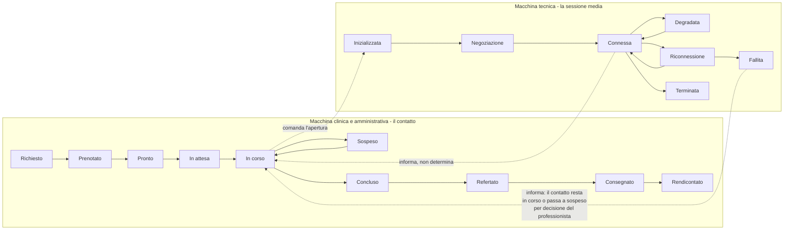

Le frecce tratteggiate sono l'intero punto: la sessione media **informa** lo stato clinico, non lo
**determina**. Un contatto passa da «in corso» a «sospeso» solo se la sospensione supera la finestra
configurata, e **non viene mai chiuso automaticamente con un esito clinico**: la chiusura con esito è
sempre un atto del professionista.

---

## 1. Il ciclo della prestazione sincrona, dall'inizio alla fine

È il flusso principale del prodotto e attraversa sette fasi. Vale la pena guardarlo intero prima di
smontarlo, perché la maggior parte degli errori di progettazione nasce dal considerare una fase
isolatamente.

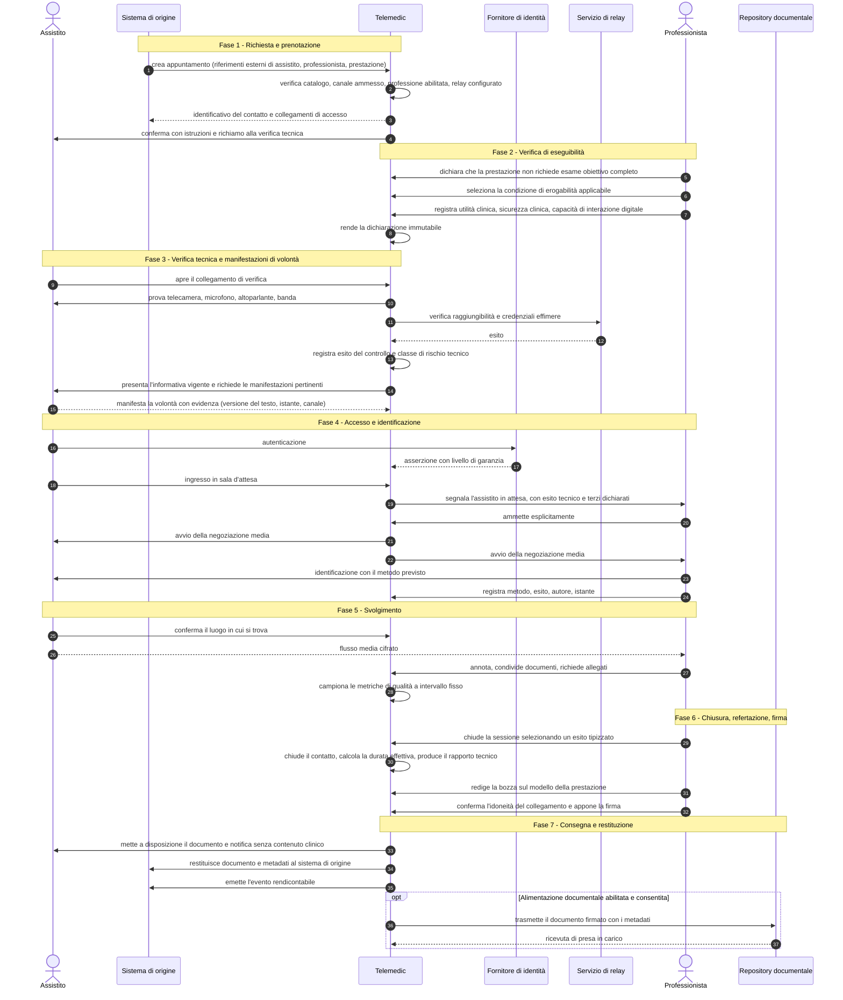

### 1.1 Sette osservazioni su questo diagramma

**La verifica tecnica precede il consenso, non il contrario.** Chiedere una manifestazione di volontà
a una persona che poi scopre di non poter partecipare produce un trattamento di dati inutile e
un'esperienza pessima. L'ordine è: verifica tecnica → informativa → consenso.

**La verifica di eseguibilità precede tutto il resto.** È la fase 2, non un adempimento di fine
percorso. La prestazione a distanza è ammessa a condizioni precise, e la dichiarazione che quelle
condizioni ricorrono è un atto del professionista, tracciato e immutabile. Chi la sposta a valle
scopre a sessione avviata che l'atto non era erogabile.

**L'autenticazione precede la sala d'attesa, l'identificazione precede l'atto.** Sono due controlli
distinti, in due momenti distinti, con due evidenze distinte. L'autenticazione certifica **chi
possiede la credenziale**; l'identificazione certifica **chi è davanti alla telecamera**. Il caso in
cui un caregiver accede con le proprie credenziali per conto di una persona anziana è normale, non
eccezionale, e un sistema che tratta l'autenticazione come identificazione non riesce a
rappresentarlo.

**L'ammissione è sempre esplicita.** Non esiste ingresso automatico in sessione. Sembra un dettaglio
di interfaccia; è la differenza fra un atto sanitario e una stanza aperta.

**Il luogo di svolgimento è chiesto all'inizio di ogni sessione.** Non è ridondanza rispetto
all'anagrafica: la persona potrebbe non essere a casa, e un indirizzo di residenza è inutile in
emergenza.

**La chiusura del contatto e la refertazione sono disaccoppiate.** Il professionista può chiudere e
refertare dopo, entro la finestra prevista. Legarle costringe a redigere il documento con l'assistito
collegato, degradandone la qualità.

**La restituzione al sistema di origine è parte del processo, non un'appendice.** Il contenuto clinico
deve confluire dove il curante lo cercherà. Il fallimento della restituzione è un incidente visibile
con coda di riconciliazione, non un errore silenzioso: è il punto in cui più spesso il valore
prodotto va perduto.

### 1.2 Dove il flusso può fermarsi, fase per fase

| Fase | Che cosa può fermare il flusso | Esito | Chi ne risponde |
|---|---|---|---|
| 1 - Prenotazione | canale non ammesso, professione non abilitata, relay non configurato, contesto di urgenza | rifiuto motivato, nessuna risorsa parziale | sistema, con messaggio al richiedente |
| 2 - Eseguibilità | esame obiettivo necessario, nessuna condizione applicabile, capacità digitale insufficiente | instradamento verso la prestazione in presenza o verso il supporto | professionista |
| 3 - Verifica tecnica | permesso non concesso, dispositivo non supportato, banda insufficiente, relay irraggiungibile | esito tecnico registrato, contatto nella vista dei rischi | front-office, in modo proattivo |
| 3 - Consensi | manifestazione obbligatoria mancante, rappresentante privo di poteri | raccolta immediata prima dell'atto, oppure sospensione | professionista e front-office |
| 4 - Sala d'attesa | accesso fuori finestra, abbandono, mancata connessione | messaggio esplicativo, oppure esito di abbandono o di mancata presentazione | sistema, con distinzione fra chi ha tentato e chi no |
| 4 - Identificazione | documento non leggibile, discordanza sostanziale | metodo alternativo, oppure contatto annullato senza addebito | professionista |
| 5 - Svolgimento | degrado, caduta, emergenza clinica, decisione clinica di interrompere | ripiego, riconnessione, procedura di emergenza, esito tipizzato | professionista, con supporto del sistema |
| 6 - Refertazione | sezione obbligatoria mancante, certificato non valido, termine superato | firma impedita, sollecito, segnalazione al responsabile | professionista, con sorveglianza del sistema |
| 7 - Consegna | consenso alla trasmissione assente, destinatario irraggiungibile | condizione nota comunicata, oppure coda di riconciliazione | sistema, con visibilità al front-office |

---

## 2. Prenotazione e verifica tecnica, in dettaglio

Le due fasi che decidono se la prestazione avverrà. È qui che il servizio si gioca la reputazione:
il fallimento tipico non avviene durante la videochiamata, avviene **prima**.

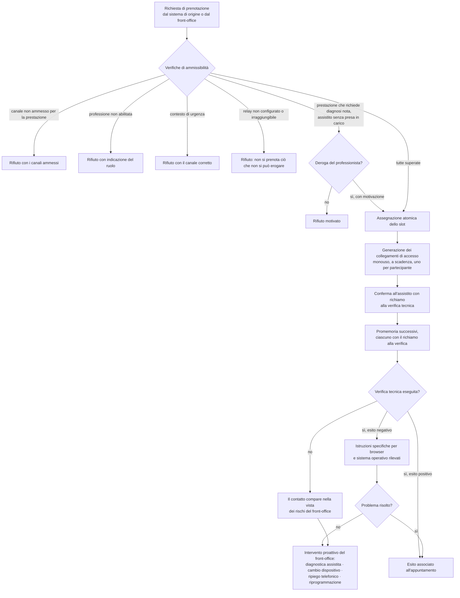

**Perché la verifica tecnica è dentro il percorso e non è un'opzione.** Chi non sa di dover verificare
non verificherà mai. La verifica preventiva è la singola misura che riduce di più il fallimento, e va
richiamata in **ogni** promemoria, con l'indicazione del tempo necessario a eseguirla.

**Perché il collegamento è di fatto una credenziale.** È monouso rispetto alla creazione della
sessione, ha entropia sufficiente a non essere indovinabile, scade con la finestra della sala
d'attesa ed è invalidato e rigenerato quando l'appuntamento viene riprogrammato. Trattarlo come un
semplice indirizzo web è l'errore che espone la sessione di un'altra persona.

**Perché il ripiego telefonico va dichiarato in anticipo.** Sapere che, se non funziona, la struttura
richiama a un certo numero a una certa ora elimina l'ansia e trasforma un fallimento totale in una
prestazione degradata. Il ripiego non è però la stessa prestazione: il cambio di canale è registrato
con la motivazione e riportato nel documento, perché un atto svolto senza componente visiva può non
soddisfare i requisiti della prestazione prevista.

---

## 3. Identificazione: un atto, non un controllo automatico

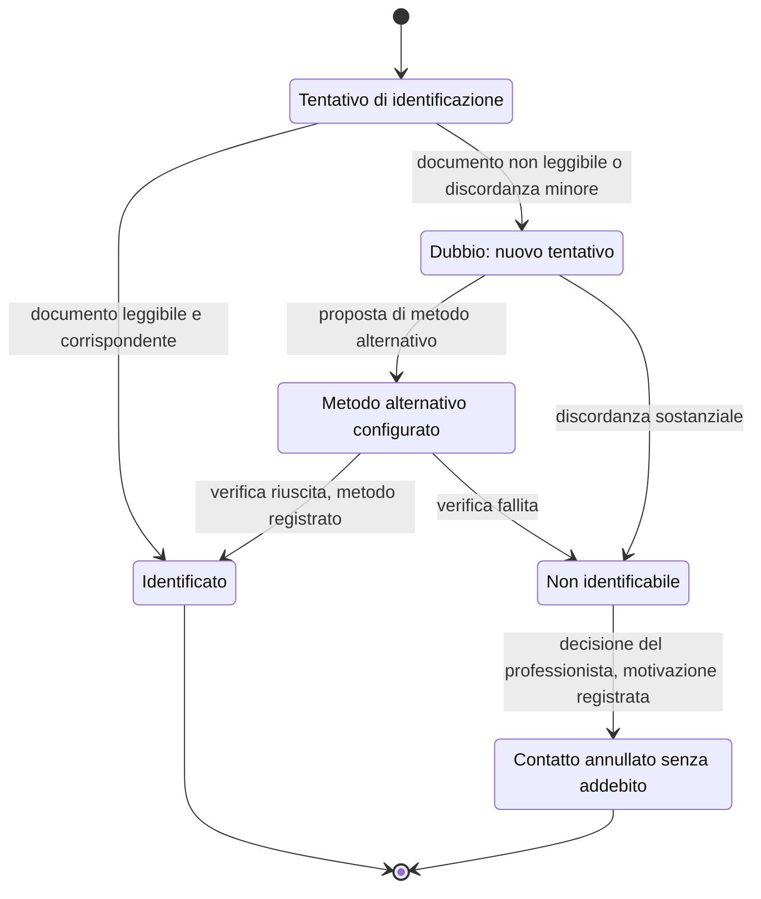

I metodi alternativi ammissibili sono **configurati dal tenant** e possono comprendere il
riconoscimento da parte del curante che conosce la persona, l'accesso con identità digitale di
livello elevato, la presenza di un operatore presso il punto di erogazione. Ciò che conta, e che i
sistemi reali sbagliano, è che venga registrato **quale metodo è stato effettivamente usato**, non un
valore booleano: il metodo confluisce nel documento e ne determina l'opponibilità.

Il sistema **non esegue riconoscimento biometrico automatico** e non rileva automaticamente la
presenza di terzi. Il professionista ha l'onere della domanda; il sistema fornisce il campo per
registrare la risposta. È una scelta che cambia il profilo di rischio sui dati e mantiene
l'identificazione dove deve stare: fra le decisioni del professionista.

---

## 4. Teleconsulto fra professionisti

Il teleconsulto **non è una televisita con un partecipante in più**. Cambiano il soggetto della
prestazione, la responsabilità, la sincronia ammessa, i documenti prodotti e il regime di
remunerazione. La differenza operativa che pesa di più sul codice è però un'altra: **il consulente non
riceve accesso al dossier della persona, ma soltanto al materiale che il richiedente ha selezionato,
per il tempo necessario alla risposta.**

### 4.1 Teleconsulto asincrono, senza l'assistito

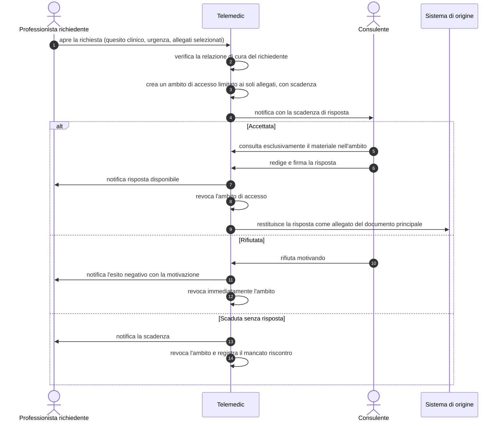

**Tre punti che non sono ovvi.**

L'**ambito effimero** è la differenza sostanziale rispetto a un normale accesso clinico. Non è una
restrizione di comodo: è la traduzione del principio per cui il consulente non ha titolo sull'intero
dossier. Va implementato come relazione abilitante con scadenza, non come filtro applicativo.

I **due documenti restano distinti**. La relazione del consulente e il documento del curante hanno
autori diversi e responsabilità professionali separate: il sistema non li fonde. La relazione
collaborativa è conferita al fascicolo come **allegato del documento principale**, correlata alla
richiesta.

Il **mancato riscontro del consulente è un fatto da registrare**, non un silenzio. Alimenta la
misura dei tempi di risposta e, nei percorsi che lo prevedono, l'instradamento verso un consulente
alternativo.

### 4.2 Teleconsulto sincrono con l'assistito presente

Lo scenario a tre introduce quattro complessità che nella televisita non esistono: chi è l'erogante,
chi referta, chi conduce la sessione, e come l'assistito sa chi c'è.

```mermaid
sequenceDiagram
    autonumber
    actor P as Assistito
    actor R as Curante (conduttore)
    actor C as Consulente
    participant TM as Telemedic

    R->>TM: pianifica il contatto e invita il consulente
    TM->>P: informa della presenza di un terzo professionista e ne richiede il consenso
    P-->>TM: consenso alla partecipazione del terzo
    P->>TM: ingresso in sala d'attesa
    C->>TM: ingresso in area di attesa professionale, non visibile all'assistito
    R->>TM: ammette entrambi
    TM->>P: mostra l'elenco dei partecipanti con nome e qualifica
    R->>P: identificazione dell'assistito
    R->>C: espone il caso; il consulente accede agli allegati nell'ambito consentito
    opt Colloquio riservato fra professionisti
        R->>TM: attiva la stanza laterale
        TM->>P: comunica esplicitamente la sospensione temporanea e il motivo
        R->>TM: rientro nella stanza principale
    end
    R->>TM: chiude la sessione con esito
    C->>TM: redige la propria relazione e firma
    R->>TM: redige il documento della prestazione e firma
    TM->>P: mette a disposizione i documenti a lui destinati
```

La **stanza laterale** è clinicamente necessaria ed eticamente delicata: la sua attivazione è sempre
annunciata, mai silenziosa. E l'**elenco dei partecipanti con nome e qualifica resta visibile per
tutta la durata**, senza possibilità di occultamento: nessuna presenza invisibile a un atto sanitario.

---

## 5. Arruolamento in telemonitoraggio

Qui cambia la scala temporale. La televisita è una transazione: apri, esegui, chiudi. Il
telemonitoraggio è un percorso che resta aperto per mesi, in cui il soggetto principale è la persona
assistita e l'unità di lavoro è il piano, non il contatto.

Il presupposto che regge l'intero flusso è la distinzione fra **modello** e **istanza**: il percorso
di popolazione descrive che cosa l'organizzazione fa per una condizione, il piano individuale descrive
che cosa si fa per *questa* persona, e le soglie stanno nel secondo, mai nel primo.

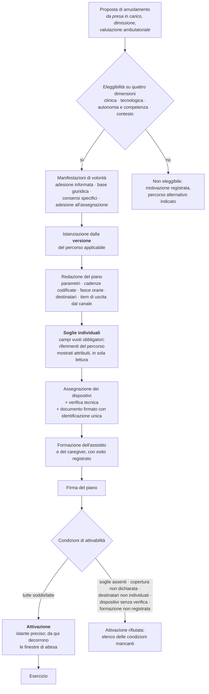

### 5.1 Perché ciascun gate esiste

**Le quattro dimensioni dell'eleggibilità.** La dimensione clinica è ovvia ed è l'unica che il
software non deve mai valutare da sé. Le altre tre decidono se il percorso a distanza è
*realizzabile* per quella persona, indipendentemente dal fatto che sia clinicamente indicato:
connettività e dispositivi al domicilio; capacità di eseguire la misura, riconoscere i sintomi, usare
l'interfaccia, rispondere a una chiamata; presenza di un caregiver, condizione abitativa, distanza
dai servizi. La quarta è quella che i progetti sottovalutano, ed è quella che decide se il servizio
funziona.

**L'arruolamento è un atto professionale.** Non esiste auto-attivazione da parte dell'assistito, in
nessuna interfaccia. Un servizio attivato senza un professionista responsabile produce dati senza
destinatario, cioè sorveglianza apparente.

**Il campo soglia parte vuoto.** Un valore proposto dal sistema viene confermato dalla maggior parte
degli utenti, specialmente sotto pressione di tempo: proporre una soglia equivale a stabilirla, con
l'aggravante che la responsabilità appare di chi ha confermato. I riferimenti del percorso si mostrano
accanto, attribuiti con fonte e versione, con un'azione esplicita di copia. La differenza fra
«mostrare un riferimento attribuito» e «precompilare un campo» è invisibile a chi scrive il codice e
decisiva per chi ne risponde.

**L'attivazione è un istante, non uno stato implicito.** Da lì decorrono le finestre di attesa, e
quindi la possibilità di rilevare un'assenza. Un piano creato ma non attivato non genera assenze; un
piano attivato senza dispositivi consegnati genera un'onda di falsi allarmi già dal primo giorno.

**La copertura è una condizione di attivabilità.** Non è un parametro commerciale: è ciò che dice
all'assistito quando qualcuno guarderà i suoi dati. Il perché è nel modulo
[10, § 4.5](10-percorsi-di-cura-e-sicurezza.md), e vale la pena rileggerlo prima di considerarla un
campo di configurazione fra gli altri.

---

## 6. Rilevazione, valutazione, segnalazione, escalation, esito

È il ciclo quotidiano del telemonitoraggio e il cuore di sicurezza del sistema.

```mermaid
sequenceDiagram
    autonumber
    actor P as Assistito o caregiver
    participant GW as Gateway di misure
    participant TM as Telemedic
    actor CM as Case manager
    actor MR as Professionista responsabile
    actor RS as Responsabile del servizio

    alt Misura da dispositivo
        GW->>TM: trasmette il lotto con istante di misura e stato del dispositivo
    else Inserimento manuale
        P->>TM: inserisce il valore con unità visibile e conferma di plausibilità
    end
    TM->>TM: valida (unità · plausibilità · attendibilità · idempotenza)
    alt Non valida tecnicamente
        TM->>TM: genera allarme tecnico, la misura non entra nella serie clinica
    else Valida
        TM->>TM: registra la misura immutabile con provenienza e doppio istante
        TM->>TM: valuta contro le regole del piano vigente all'istante di misura
        alt Nessuna condizione soddisfatta
            TM->>TM: chiude la valutazione registrandone l'esito
        else Condizione soddisfatta
            TM->>TM: genera evento immutabile con natura, severità,<br/>destinatario, scadenza, versione della regola,<br/>riferimenti puntuali ai dati
            TM->>CM: consegna sui canali configurati
            CM-->>TM: conferma di consegna per canale
            alt Presa in carico entro la scadenza
                CM->>TM: presa in carico come atto deliberato attribuito
                CM->>TM: registra la valutazione clinica
                CM->>TM: chiude con esito tipizzato e azione intrapresa
            else Scadenza decorsa
                TM->>TM: genera l'evento di mancato riscontro
                TM->>MR: escalation all'anello successivo coperto in questa fascia
                alt Presa in carico
                    MR->>TM: assume e gestisce
                else Catena esaurita
                    TM->>TM: <b>fallimento dichiarato della gestione</b>
                    TM->>RS: notifica; l'allarme resta aperto
                end
            end
        end
    end
    opt L'esito comporta una modifica del percorso
        MR->>TM: emette una nuova versione del piano con motivazione
    end
```

### 6.1 I sei punti in cui questo flusso si rompe nelle implementazioni reali

1. **Fra generazione e consegna.** La consegna fallisce in silenzio - recapito non più valido,
   dispositivo spento, servizio esterno indisponibile. Senza conferma per canale il sistema crede di
   aver avvisato e non ha avvisato.
2. **Fra consegna e riscontro.** Nessuna scadenza definita, quindi nessun modo di sapere che il
   riscontro non è arrivato. È il difetto strutturale più comune.
3. **Nella presa in carico.** Coincide con l'apertura della schermata. Un allarme «visto» non è un
   allarme assunto: la conferma deve essere un atto deliberato attribuito a una persona identificata.
4. **Nell'escalation.** La catena punta a un ruolo che in quella fascia non è coperto, oppure allo
   stesso destinatario che non ha risposto. Una catena che non termina in un fallimento dichiarato è
   una catena che gira a vuoto.
5. **Nella chiusura.** L'esito non è registrato: senza esito tipizzato non si può calcolare quanti
   allarmi di quella regola hanno prodotto un'azione, e quindi non si può migliorare la
   configurazione.
6. **Ovunque.** L'allarme è mutabile: se lo stato è una colonna aggiornata sul posto, la sequenza
   degli eventi è perduta. L'allarme è una **serie di eventi immutabili**; lo stato corrente è una
   proiezione.

### 6.2 Perché la catena non può chiudersi da sola

Un sistema che chiude gli allarmi non riscontrati «per scadenza» **cancella l'unica traccia del fatto
che nessuno ha risposto**. È il comportamento più comodo da implementare e il più difficile da
difendere: rende invisibile precisamente ciò che il servizio deve misurare. Il fallimento dichiarato
non è un fallimento del software, è un'informazione preziosa - dice che il servizio, in quel momento
e in quella fascia, non è stato in grado di gestire un allarme.

E la catena va **provata a freddo**, periodicamente, senza generare un allarme clinico reale. Una
catena mai provata è, statisticamente, una catena rotta: i recapiti cambiano, i turni cambiano, i
servizi di notifica cambiano condizioni, e l'unico momento in cui ci si accorge che non funziona è
quello sbagliato.

---

## 7. Il silenzio e il guasto sistemico

Questo è il flusso che i sistemi costruiti con una mentalità infrastrutturale non hanno affatto. Un
sistema di monitoraggio tecnico, di fronte a una serie che si interrompe, conclude che non ci sono
anomalie: nessuna misura, nessun superamento, nessun allarme. In un servizio clinico questo
comportamento è un difetto di sicurezza, perché fra le cause dell'assenza c'è, con probabilità non
trascurabile, **esattamente ciò che il servizio esiste per intercettare**.

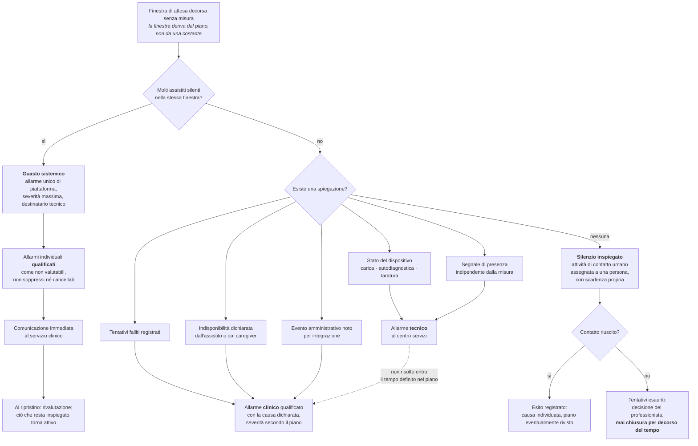

### 7.1 La strategia: eliminare le cause note

L'ultima categoria di cause del silenzio - la persona che non riesce più a eseguire la misura perché
sta peggiorando - **non è distinguibile con mezzi tecnici**. La strategia corretta non è indovinarla:
è **eliminare tutte le altre**, così che il silenzio residuo sia informativo. Ogni causa tecnica che
il sistema non sa riconoscere diluisce il segnale clinico e produce contatti a vuoto, che a loro volta
generano affaticamento nell'operatore.

Da qui l'ordine di priorità delle tecniche: segnale di presenza indipendente dalla misura; telemetria
di stato del dispositivo; registrazione dei tentativi falliti; azione a un tocco per dichiarare
un'indisponibilità; correlazione con eventi amministrativi noti. Quando tutte sono esaurite e il
silenzio resta inspiegato, l'unica risposta è **chiamare la persona**. È il motivo per cui un servizio
di telemonitoraggio richiede persone e non solo software, e va detto con chiarezza a chi lo acquista.

### 7.2 Perché il guasto collettivo va rilevato per primo

Il silenzio simultaneo di molti assistiti causato da un guasto della catena di ingestione è il caso
peggiore per tre ragioni: riguarda tutti insieme, quindi il danno potenziale è moltiplicato; è
invisibile per costruzione se il sistema non lo cerca attivamente; e genera, se non rilevato, un'onda
di allarmi individuali che satura il servizio e ne distrugge la capacità di risposta **proprio nel
momento in cui i dati mancano**.

La rilevazione avviene per **sorveglianza del volume atteso**: il sistema sa quante misure attende in
una finestra, per tenant e per sorgente, e rileva lo scostamento aggregato. Deve accorgersene
**prima** che scadano le finestre individuali. E deve dirlo al servizio clinico mentre accade, non
solo al gruppo tecnico: è il clinico che deve decidere se attivare un canale alternativo per gli
assistiti più instabili, e può farlo solo se sa.

---

## 8. Il ciclo del consenso

Le manifestazioni di volontà sono più d'una, hanno basi giuridiche diverse, revocabilità diverse ed
effetti diversi. Unificarle in un solo campo è l'errore più costoso del dominio: rende il consenso al
trattamento revocabile con effetto di blocco della cura, e rende l'adesione clinica indimostrabile.

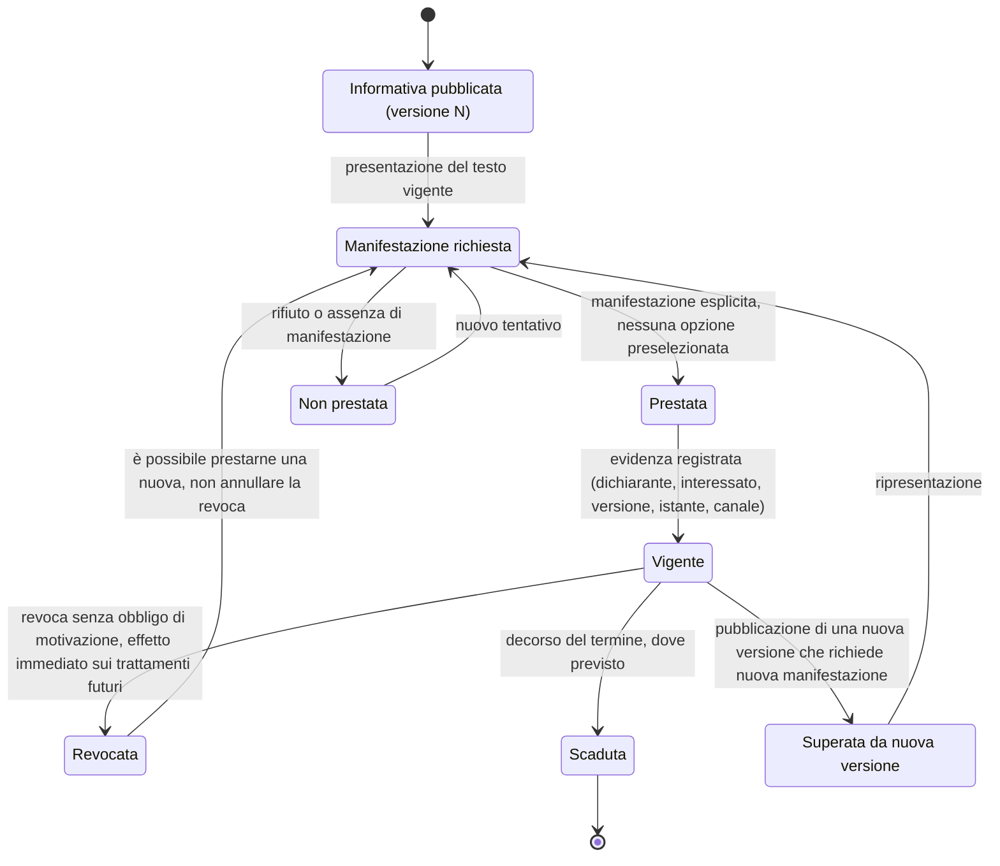

### 8.1 Le manifestazioni distinte, e che cosa succede se si revocano

| Manifestazione | Natura | Effetto della revoca |
|---|---|---|
| Adesione informata alla prestazione a distanza | atto clinico: si accetta di ricevere *quella* prestazione attraverso *quel* canale | il percorso a distanza si interrompe e va riorganizzato in presenza |
| Base giuridica del trattamento dei dati | atto di protezione dei dati, con basi proprie; per la finalità di cura tipicamente **non è il consenso** | se fosse consenso, la revoca bloccherebbe la cura: è precisamente il motivo per cui non lo si usa dove non serve |
| Consenso alla registrazione della sessione | ulteriore, specifico, **per sessione**, revocabile | la registrazione si interrompe immediatamente e l'evento è tracciato |
| Consenso alla presenza di terzi | specifico per sessione e per soggetto | il terzo non è ammesso, senza conseguenze sull'erogazione |
| Adesione all'assegnazione del dispositivo | riconoscimento della consegna, degli obblighi di custodia e delle istruzioni ricevute | si apre il percorso di restituzione; le altre manifestazioni restano vigenti |
| Consenso alla trasmissione verso repository esterni | specifico | la trasmissione non parte: è una **condizione nota gestita**, non un errore tecnico |

### 8.2 Tre regole che il diagramma implica

**Ogni manifestazione è riferita alla versione esatta del testo presentato.** Un consenso non riferito
a un testo versionato è indimostrabile. Da qui l'obbligo di versionare le informative e di conservare
integralmente le versioni precedenti: il consenso raccolto sulla versione 3 resta associato alla
versione 3, che deve restare consultabile per anni.

**La revoca è un atto autonomo e irreversibile come atto.** Se ne può prestare una nuova, non
annullare la revoca. Ha effetto immediato sui trattamenti futuri e non richiede motivazione; gli
effetti sui dati già raccolti seguono le regole di conservazione, non l'arbitrio dell'operatore.

**La verifica precede l'atto, non lo segue.** Prima dell'avvio della sessione il sistema verifica la
presenza delle manifestazioni obbligatorie per quel tipo di prestazione e ne segnala l'assenza al
professionista, proponendo la raccolta immediata. Scoprire a sessione avviata che manca un consenso
è un fallimento organizzativo prevedibile e prevenibile.

---

## 9. Il ciclo del documento, con la rettifica

Il documento sanitario firmato è **immutabile**. Non si modifica: si emette una versione successiva
che annulla e sostituisce la precedente, mantenendo la catena. È una delle poche regole del dominio
che non ammette eccezioni, e la ragione è che il documento deve restare opponibile: se il contenuto
può cambiare dopo la firma, la firma non certifica nulla.

```mermaid
stateDiagram-v2
    direction TB
    state "Bozza" as Bozza
    state "Bozza completa" as Completa
    state "Firmato" as Firmato
    state "Messo a disposizione" as Disponibile
    state "Consegna differita" as Differita
    state "Trasmesso al sistema di origine" as Trasmesso
    state "In coda di riconciliazione" as Coda
    state "Conferito al fascicolo" as Fascicolo
    state "Annullato e sostituito" as Sostituito
    state "Versione successiva" as Nuova

    [*] --> Bozza : apertura sul modello della prestazione
    Bozza --> Bozza : salvataggi successivi; non visibile all'assistito, non trasmissibile
    Bozza --> Completa : sezioni obbligatorie compilate
    Completa --> Firmato : firma con il livello richiesto, certificato valido
    Completa --> Bozza : certificato scaduto o revocato, sezione mancante
    Firmato --> Disponibile : messa a disposizione in area autenticata
    Firmato --> Differita : differimento motivato, con data prevista
    Differita --> Disponibile : colloquio effettuato o data raggiunta
    Firmato --> Trasmesso : restituzione al sistema di origine
    Trasmesso --> Coda : fallimento della trasmissione
    Coda --> Trasmesso : ritentativo riuscito o rilancio manuale
    Disponibile --> Fascicolo : conferimento, se abilitato e consentito
    Firmato --> Sostituito : emissione di una rettifica
    Sostituito --> Nuova : la nuova versione riporta riferimento e motivazione
    Nuova --> Firmato : la nuova versione segue lo stesso ciclo
    Fascicolo --> [*]
```

### 9.1 Che cosa il diagramma vieta

**Una bozza non è un documento.** Non è visibile all'assistito, non è trasmissibile, non è conservata
come documento sanitario. Non compare nemmeno come «documento in lavorazione»: un documento
incompleto che acquisisce visibilità acquisisce anche, di fatto, valore.

**Non esiste una transizione da «firmato» a «bozza».** La correzione passa sempre per la rettifica,
che conserva entrambe le versioni. La precedente resta consultabile e marcata come annullata; la
nuova riporta il riferimento e la motivazione.

**Il fallimento della trasmissione non è uno stato terminale.** È una coda di riconciliazione
visibile, con causa, numero di tentativi e possibilità di rilancio manuale, visibile anche al
front-office che dovrà rispondere a chi telefona. Un errore silenzioso in questo punto significa che
il contenuto clinico non arriva dove il curante lo cercherà, e nessuno se ne accorge finché non serve.

**La consegna differita è una funzione, non un'eccezione.** Esiste una casistica clinica in cui la
consegna automatica dell'esito è dannosa e la comunicazione richiede un colloquio. Il differimento è
registrato con la motivazione, la data prevista e l'identità di chi lo ha disposto; l'assistito vede
che il documento sarà illustrato, non un vuoto inspiegato.

### 9.2 Che cosa il documento deve dire dell'atto

Il documento prodotto da una prestazione a distanza riporta, oltre al contenuto clinico redatto dal
professionista, alcuni elementi che nella prestazione in presenza non esistono: il canale
effettivamente usato, l'eventuale degrado o cambio di canale occorso, il metodo con cui l'assistito è
stato identificato, l'indicazione degli eventuali collaboratori partecipanti e l'**attestazione della
qualità del collegamento e della sua idoneità** all'esecuzione della prestazione.

Quest'ultima merita una nota, perché è il punto in cui la norma clinica incontra l'ingegneria del
trasporto. La norma impone al professionista di attestare che il collegamento fosse idoneo, **senza
fissare alcuna soglia numerica**: il giudizio è del medico, sul singolo atto. L'attestazione però
richiede evidenza oggettiva, altrimenti è un'affermazione nuda - e le metriche di sessione sono quella
evidenza. Le soglie con cui il prodotto avvisa del degrado sono quindi **specifica di prodotto**,
configurabile per tenant, non conformità normativa. Il dettaglio è nel modulo
[02, § 4.1.7](02-prestazioni-di-telemedicina.md).

---

## 10. I flussi di errore e di ripiego

Sono la metà che tutti dimenticano, e sono la metà che determina la percezione di affidabilità. Ne
seguono cinque, scelti perché ciascuno insegna una lezione diversa.

### 10.1 Caduta della connessione durante la prestazione

```mermaid
sequenceDiagram
    autonumber
    actor P as Assistito
    participant TM as Telemedic
    actor M as Professionista
    participant TURN as Relay

    Note over P,M: Sessione in corso, metriche campionate a intervallo fisso
    TM->>TM: rileva il superamento della soglia per la durata configurata
    TM->>M: avviso di degrado con causa probabile
    TM->>P: avviso di degrado con azione suggerita
    TM->>TM: riduce il profilo video preservando l'audio
    alt Degrado rientrato
        TM->>M: ripristino della qualità nominale, cambio registrato
    else Degrado persistente
        TM->>TURN: commuta il flusso su relay
        alt Commutazione riuscita
            TM->>M: sessione proseguita via relay
        else Connettività persa
            TM->>TM: la sessione media passa a riconnessione;<br/><b>il contatto resta in corso</b>
            TM->>P: schermata di riconnessione con conto alla rovescia e azioni
            TM->>M: notifica della caduta e tempo residuo di attesa
            loop Tentativi entro la finestra configurata
                P->>TM: tentativo di riconnessione automatico
            end
            alt Riconnesso entro la finestra
                TM->>M: rientro nella stessa sessione clinica
                TM->>TM: annota interruzione e durata nel contatto
            else Non riconnesso
                TM->>M: propone ripiego in fonia o riprogrammazione
                alt Ripiego in fonia accettato
                    TM->>P: istruzioni per il canale alternativo
                    TM->>TM: registra cambio di canale e motivazione
                else Riprogrammazione
                    TM->>TM: chiude il contatto con esito tipizzato di fallimento tecnico
                    TM->>P: propone nuovi appuntamenti con priorità
                end
            end
        end
    end
```

**L'invariante da non violare.** Durante l'intera procedura il contatto clinico **non cambia stato**.
Passa a sospeso solo se la sospensione supera la finestra configurata, e non viene mai chiuso
automaticamente senza decisione del professionista. È l'applicazione diretta del principio del § 0.

**La lezione.** Il ripiego non è un fallimento del servizio: è il servizio che continua in modo
degradato. Ciò che va evitato è il fallimento *silenzioso* - la schermata bloccata, il messaggio
generico, la disconnessione senza spiegazione. La differenza fra un ripiego riuscito e un abbandono è
quasi tutta nella qualità delle informazioni fornite nei trenta secondi successivi alla caduta.

### 10.2 Fallimento della prestazione e ripiego in presenza

Il fallimento tecnico non è una gestione dell'errore: è un **requisito funzionale con obbligo di
risultato**. Quando lo strumento a distanza non consente di mantenere inalterato il contenuto
sostanziale della prestazione, questa va completata o riprogrammata in presenza, senza oneri
ulteriori.

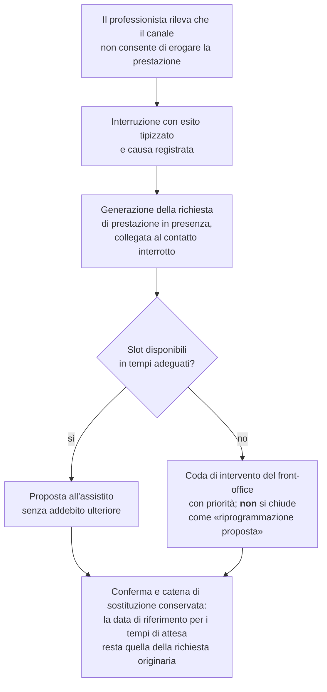

**La lezione.** Un `catch` che registra e mostra «connessione persa» non soddisfa l'obbligo. Servono
tre cose: un esito tipizzato con la causa, un evento di riprogrammazione agganciato alla
prenotazione, e la garanzia che l'assistito non paghi due volte né perda la propria posizione nei
tempi di attesa.

### 10.3 Emergenza clinica durante la prestazione

È lo scenario di rischio più alto: il professionista è a distanza da una persona che potrebbe avere
un evento acuto, senza possibilità di intervento diretto.

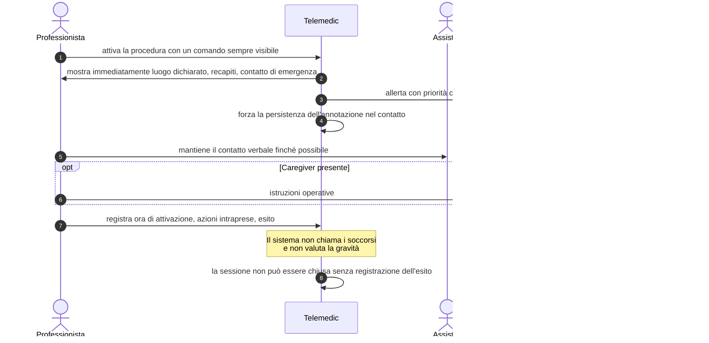

**Il confine, e perché sta lì.** Il sistema **non** valuta la gravità e **non** suggerisce condotte
cliniche. Rende immediatamente disponibili al professionista le informazioni logistiche che non ha
perché la persona non è nella stessa stanza: dove si trova, a che numero è raggiungibile, chi
contattare. È supporto logistico, non supporto decisionale clinico - ed è la ragione per cui il luogo
di svolgimento va chiesto **all'inizio di ogni sessione**: un indirizzo di residenza anagrafico, in
emergenza, è inutile.

### 10.4 L'allarme che non raggiunge nessuno

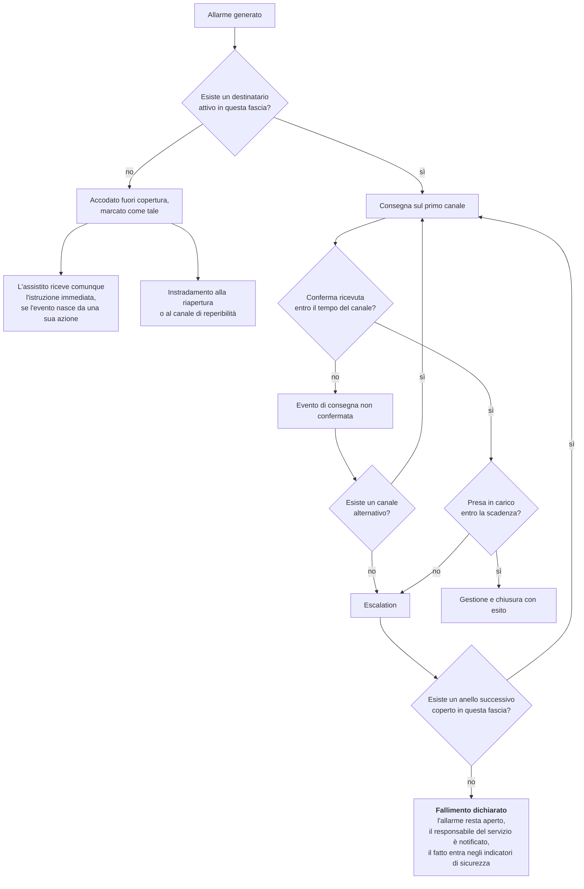

**La lezione.** Ci sono due modi diversi di non raggiungere nessuno, e vanno distinti: **la consegna
non riesce** (canale guasto, recapito non valido) e **la consegna riesce ma nessuno risponde**. Il
primo è un problema tecnico e si risolve cambiando canale; il secondo è un problema di servizio e si
risolve cambiando destinatario. Confonderli produce una catena che ritenta all'infinito sullo stesso
canale verso una persona che non c'è.

### 10.5 Fuori copertura

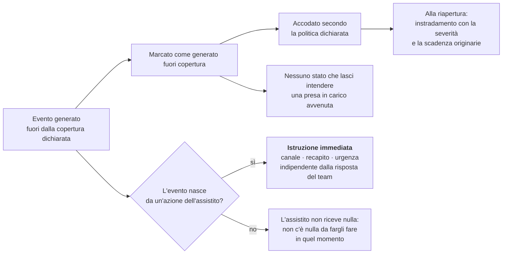

**La lezione, e vale per tutto il modulo.** Fuori copertura il sistema non smette di funzionare:
smette di **promettere una valutazione professionale**. Continua a raccogliere, a registrare, a
informare sul canale corretto e a rendere disponibile il quadro alla riapertura. Ciò che non deve
fare è comportarsi come se qualcuno stesse guardando.

### 10.6 Disdetta, riprogrammazione e mancata presentazione

È il flusso che genera più contenzioso e più malcontento, e la ragione è che assegna
responsabilità e produce effetti amministrativi. In telemedicina ha una complicazione in più: la
**mancata presentazione è ambigua**, perché la persona può aver tentato senza riuscire tecnicamente.

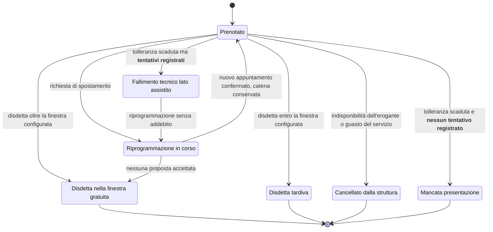

**L'asimmetria è deliberata.** La cancellazione da parte della struttura genera sempre un obbligo di
proposta alternativa e non produce mai effetti a carico dell'assistito. La disdetta tardiva può
produrre effetti amministrativi **solo** se il tenant li ha configurati, **solo** se sono stati
comunicati al momento della prenotazione, e **mai** in caso di cancellazione da parte della struttura
o di guasto documentato del servizio. Chi subisce una regola deve averla conosciuta prima di poterla
violare.

**La distinzione fra mancata presentazione e fallimento tecnico è la parte che conta.** Un
appuntamento non può essere marcato come mancata presentazione se la telemetria registra almeno un
tentativo di connessione nella finestra di apertura: in quel caso l'esito è un fallimento tecnico
lato assistito, non produce effetti amministrativi e apre la riprogrammazione. Addebitare una mancata
presentazione a chi ha provato senza riuscire è un danno ingiustificato e, in un servizio pubblico, un
problema di equità di accesso. È anche il motivo per cui la telemetria di sala d'attesa non è
osservabilità tecnica: è **evidenza a tutela della persona**.

**La catena di sostituzione va conservata.** La riprogrammazione non è «cancella e riprenota»: il
nuovo appuntamento resta collegato a quello sostituito e la data di riferimento per il calcolo dei
tempi di attesa resta quella della richiesta originaria. Altrimenti la riprogrammazione azzera
artificiosamente le liste d'attesa, e il dato di monitoraggio dell'accesso alle cure diventa falso.

### 10.7 Il ciclo di vita di una misura: ritardo, fuori ordine, duplicato, correzione

Quattro condizioni che il dominio produce **normalmente** e che vanno progettate, non subite. Ognuna
ha un effetto sugli allarmi, ed è lì che i sistemi reali si rompono.

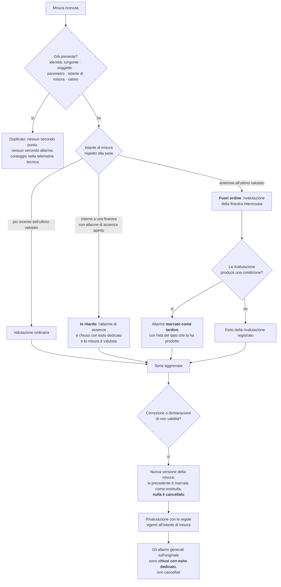

**Perché i due istanti devono essere due.** Una misura eseguita ieri e trasmessa oggi appartiene alla
serie di ieri. Confondere l'istante di misura con quello di ricezione produce serie temporali sbagliate
e allarmi generati sul giorno sbagliato - e, nel caso peggiore, un allarme di assenza che resta aperto
mentre il dato è arrivato.

**Perché il duplicato è un problema di fiducia.** Un duplicato che genera un secondo allarme identico
è, per chi lo riceve, un difetto di affidabilità: alla terza volta l'operatore smette di considerare
attendibile la coda. Il criterio di identità va dichiarato, non dedotto, e va verificato al confine.

**Perché la correzione non cancella.** Serve sapere che cosa il sistema ha valutato **quando** lo ha
valutato. Se sull'originale era stato generato un allarme, quell'allarme non scompare: viene chiuso
con un esito che dice «dato corretto», e resta nella storia. È l'unico modo di rispondere, sei mesi
dopo, alla domanda «perché non è successo nulla quel giorno?».

**Perché la rivalutazione tardiva va dichiarata.** Un allarme generato oggi su un fatto di tre giorni
fa ha valore clinico limitato e va segnalato come tale. Nasconderlo fra gli allarmi correnti degrada
la qualità della coda; sopprimerlo perde un'informazione.

### 10.8 Come un evento arriva a destinazione senza perdersi e senza duplicarsi

Tutti i flussi di questo modulo producono eventi che altri contesti e altri sistemi devono consumare:
appuntamento creato, sessione avviata, contatto concluso, documento firmato, consenso revocato,
allarme generato, misura acquisita. Il modo in cui questi eventi vengono pubblicati non è un dettaglio
infrastrutturale: determina se un documento firmato può risultare «mai emesso» per il sistema di
origine, o se un allarme può essere consegnato due volte.

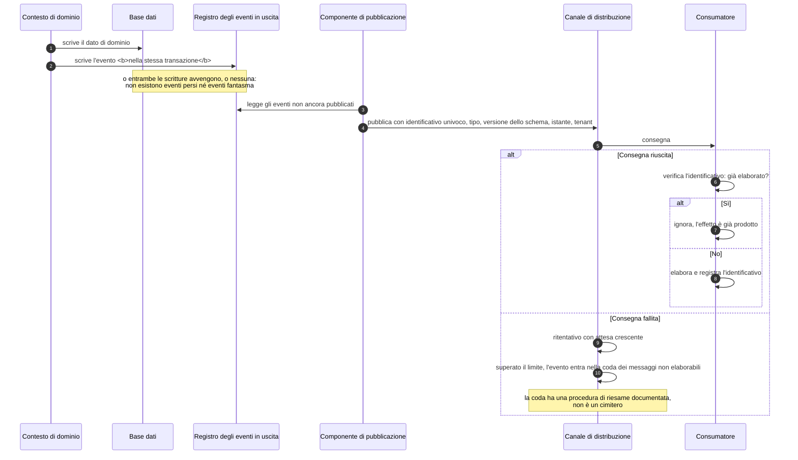

**Le tre proprietà che chi implementa deve dare per acquisite.**

La consegna è **almeno una volta**, non esattamente una volta: ogni consumatore è **idempotente per
costruzione**, con una chiave di deduplicazione esplicita. Un consumatore che non lo è produce
duplicati sotto carico, e il carico arriva sempre nel momento peggiore.

L'ordine è garantito **solo** all'interno della partizione scelta per chiave - tipicamente il
contatto o il soggetto - e **solo se valgono insieme le tre condizioni** enunciate in
[`06-eventi-e-integrazione-interna.md`](../02_architecture/06-eventi-e-integrazione-interna.md#41-ciò-che-si-garantisce-e-ciò-che-non-si-garantisce) §4.1: un solo lavoratore per volta, il produttore idempotente verso il canale, il numero di partizioni stabile. Fuori da quelle condizioni l'ordine **non è garantito**.
Nessun requisito funzionale può dipendere da un ordine globale: se un flusso richiede che due eventi
arrivino in un certo ordine, quell'ordine va imposto dentro la chiave, non sperato.

La **coda dei messaggi non elaborabili non è un cimitero**: ha una procedura di riesame documentata,
un responsabile e un tempo. Un evento che finisce lì e non viene mai guardato è esattamente
equivalente a un evento perso, con in più l'illusione di averlo conservato.

---

## 11. Mappa dei punti di fallimento

Riepilogo di dove le cose vanno realmente storte, con la mitigazione che il progetto adotta. È
ordinata per frequenza attesa, non per gravità.

| # | Punto di fallimento | Momento | Mitigazione |
|---|---|---|---|
| F1 | Il collegamento non si trova: perso nella posta, cancellato, filtrato | prima | promemoria multipli su canali diversi, recupero dall'area autenticata, ripubblicazione dal front-office |
| F2 | Il browser non ha i permessi per telecamera e microfono | ingresso | verifica preventiva con istruzioni specifiche per il browser e il sistema operativo rilevati |
| F3 | Dispositivo o browser non supportati | ingresso | rilevazione precoce con alternativa concreta e tempo utile per cambiare |
| F4 | Banda insufficiente o rete instabile | in sessione | profilo adattivo, priorità all'audio, ripiego in fonia, avvisi comprensibili |
| F5 | L'assistito non sa se è nel posto giusto e attende in silenzio | sala d'attesa | conferma esplicita dell'appuntamento, nome del professionista, attesa stimata, messaggi proattivi |
| F6 | Il professionista è in ritardo e sembra un guasto | sala d'attesa | comunicazione automatica del ritardo, aggiornata periodicamente |
| F7 | Documenti o questionari non completati prima della prestazione | preparazione | lista di attività preliminari con stato visibile a entrambi e sollecito automatico |
| F8 | Consensi mancanti, scoperti a prestazione iniziata | inizio | verifica preventiva e raccolta in sala d'attesa |
| F9 | Identificazione non registrata | inizio | vincolo procedurale prima dell'apertura della bozza |
| F10 | Caduta a metà prestazione e perdita del contesto | in sessione | separazione fra contatto e sessione, riconnessione, annotazione dell'interruzione |
| F11 | Il documento va redatto con l'assistito collegato | fine | bozza salvabile, ripresa successiva, sollecito prima della scadenza |
| F12 | Il documento non arriva nel sistema di origine | dopo | coda di riconciliazione visibile, non errore silenzioso |
| F13 | L'assistito non capisce il documento e richiama | dopo | canale asincrono limitato o appuntamento di lettura, testo comprensibile |
| F14 | Nessuno sa dire che cosa è tecnicamente successo in una prestazione contestata | dopo | rapporto tecnico di sessione ricostruibile |
| F15 | La misura attesa non arriva e nessuno se ne accorge | telemonitoraggio | finestra di attesa per parametro, evento di assenza con destinatario e scadenza |
| F16 | Il gateway smette di consegnare per tutti insieme | telemonitoraggio | sorveglianza del volume atteso, allarme di piattaforma, comunicazione al servizio clinico |
| F17 | L'allarme arriva a chi in quel momento non c'è | telemonitoraggio | catena consapevole delle fasce, fallimento dichiarato |
| F18 | La soglia proposta viene confermata senza essere valutata | arruolamento | campo vuoto obbligatorio, riferimenti attribuiti in sola lettura |
| F19 | La misura viene attribuita alla persona sbagliata | telemonitoraggio | contesto del soggetto permanente, conferma esplicita al cambio |
| F20 | Il quadro «tutto verde» viene letto come stabilità su dati vecchi | telemonitoraggio | età dell'ultimo dato sempre visibile ed evidenziata, perimetro del piano dichiarato |

> **Il principio riassuntivo.** Il fallimento tipico di una prestazione a distanza non avviene durante
> la videochiamata: avviene **prima** - prerequisiti non verificati, collegamento non trovato,
> consensi mancanti - o **dopo** - documento che non arriva dove serve. Investire nella qualità video
> oltre la soglia clinicamente necessaria, trascurando la catena di prerequisiti e la restituzione del
> contenuto, è l'errore di priorità più comune in questo dominio. Nel telemonitoraggio l'equivalente
> è investire nell'ingestione e trascurare che cosa accade quando i dati **non** arrivano.

---

## 12. Che cosa devi ricordare

1. **Il percorso nominale è la minoranza dei casi.** Ogni flusso va progettato insieme ai suoi rami di
   errore e di ripiego, e ogni ramo deve terminare in un esito registrabile con un responsabile.
2. **Stato clinico e stato tecnico sono due macchine distinte.** Una caduta di rete non chiude un atto
   sanitario; la sessione media informa il contatto, non lo determina.
3. **La verifica tecnica precede il consenso; l'autenticazione precede la sala d'attesa;
   l'identificazione precede l'atto.** Tre ordini che non si invertono, ciascuno con una ragione
   precisa.
4. **L'identificazione è un atto del professionista**, con un metodo registrato, non una deduzione dal
   fatto che qualcuno abbia effettuato l'accesso.
5. **Il teleconsulto non è una televisita con un partecipante in più.** L'ambito di accesso del
   consulente è limitato al materiale del quesito e decade; i documenti restano distinti.
6. **Nel telemonitoraggio il modello e l'istanza sono entità diverse**, collegate per versione, e le
   soglie stanno nell'istanza. Il campo soglia parte vuoto e obbligatorio.
7. **L'attivazione del piano è un istante preciso**, e da lì decorrono le finestre di attesa. Un piano
   attivato senza dispositivi consegnati produce falsi allarmi dal primo giorno.
8. **Un allarme senza destinatario, scadenza ed escalation non è un allarme.** E la catena termina in
   un fallimento dichiarato, mai in una chiusura automatica.
9. **L'assenza di dato è un dato.** La strategia non è indovinare la causa del silenzio ma eliminare
   tutte le cause tecniche riconoscibili, perché il silenzio residuo è ciò che il servizio esiste per
   intercettare.
10. **Il silenzio collettivo è un guasto di piattaforma fino a prova contraria**, e va rilevato prima
    che diventi un'onda di allarmi individuali.
11. **Fuori copertura il sistema non smette di funzionare: smette di promettere.** Continua a
    raccogliere e a informare, e non si comporta come se qualcuno stesse guardando.
12. **Le manifestazioni di volontà sono più d'una**, con basi ed effetti diversi, ciascuna riferita
    alla versione esatta del testo presentato.
13. **Un documento firmato è immutabile**: la correzione è una rettifica che conserva entrambe le
    versioni e la motivazione.
14. **La restituzione del contenuto clinico al sistema di origine è parte del processo**, e il suo
    fallimento è un incidente visibile con coda di riconciliazione.
15. **Il fallimento tecnico della prestazione a distanza comporta un obbligo di risultato**: completare
    o riprogrammare in presenza, senza oneri ulteriori, con la catena di sostituzione conservata.

---

## 13. Dove approfondire

| Che cosa | Dove |
|---|---|
| Definizioni normative delle prestazioni, condizioni di erogabilità, documenti prodotti | [02 - Le prestazioni di telemedicina](02-prestazioni-di-telemedicina.md) |
| Dato clinico, consensi, basi giuridiche, conservazione | [03 - Il dato clinico](03-il-dato-clinico.md) |
| Identità digitale, anagrafiche, identificativi | [04 - Identità e anagrafiche](04-identita-e-anagrafiche.md) |
| Rappresentazione delle risorse cliniche | [06 - FHIR da zero](06-fhir-da-zero.md) |
| Fascicolo e infrastrutture nazionali | [07 - FSE e infrastrutture nazionali](07-fse-e-infrastrutture-nazionali.md) |
| Trasporto in tempo reale, degrado, relay | [08 - WebRTC da zero](08-webrtc-da-zero.md) |
| Parametri, misure, limiti della misura a domicilio | [09 - Fondamenti clinici](09-fondamenti-clinici.md) |
| Cronicità, percorsi, allarmi, silenzio, sicurezza del paziente | [10 - Percorsi di cura e sicurezza del paziente](10-percorsi-di-cura-e-sicurezza.md) |
| Requisiti, casi d'uso, regole, esiti tipizzati | area funzionale, `docs/03_functional/` |

---

## 14. Termini introdotti in questo modulo

| Termine | Definizione breve |
|---|---|
| **Ambito di accesso effimero** | Insieme di risorse accessibili a un consulente per il tempo necessario alla risposta, distinto dall'accesso al dossier |
| **Catena di sostituzione** | Collegamento fra appuntamenti riprogrammati che conserva la data della richiesta originaria ai fini dei tempi di attesa |
| **Coda di riconciliazione** | Elenco visibile delle trasmissioni fallite verso sistemi esterni, con causa, tentativi e possibilità di rilancio |
| **Contatto** | L'atto sanitario come entità clinica e amministrativa, distinto dalla sessione media |
| **Esito tipizzato** | Valore da un'enumerazione di dominio con cui si chiude un contatto o un allarme, mai testo libero |
| **Fallimento dichiarato** | Esito che il sistema produce quando la catena di escalation si esaurisce senza che nessuno abbia preso in carico l'allarme |
| **Finestra di attesa** | Intervallo, derivato dal piano, entro cui una misura è attesa; il suo decorso senza misura è un evento clinico |
| **Gate di appropriatezza** | Registrazione, precedente all'atto, della dichiarazione che ricorrono le condizioni di erogabilità della prestazione a distanza |
| **Rapporto tecnico di sessione** | Sintesi ricostruibile di qualità, interruzioni, ripieghi e cambi di canale di una prestazione, utilizzabile nel documento e nella gestione dei reclami |
| **Ripiego** | Prosecuzione della prestazione su un canale degradato, registrata con motivazione e riportata nel documento; non è la stessa prestazione |
| **Sala d'attesa virtuale** | Stato del contatto in cui la persona è connessa, verificata tecnicamente e in attesa di ammissione, più la coda relativa |
| **Sorveglianza del volume atteso** | Confronto fra le misure attese e quelle ricevute in una finestra, per rilevare il silenzio collettivo prima delle assenze individuali |
| **Stanza laterale** | Colloquio riservato fra professionisti durante un contatto con l'assistito presente, sempre annunciato e registrato |
