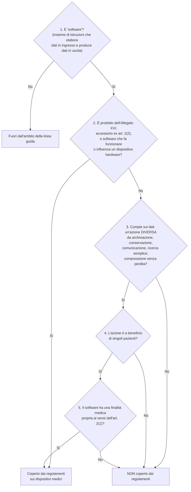
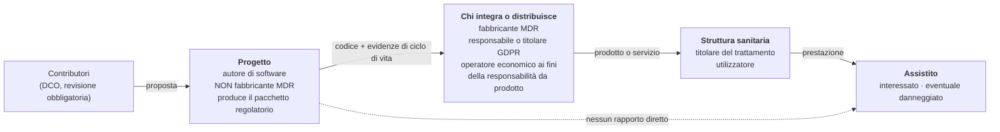
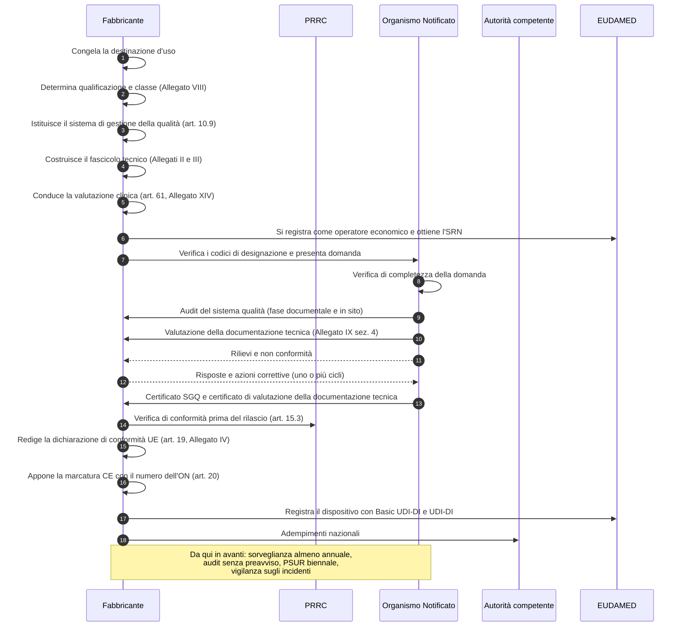
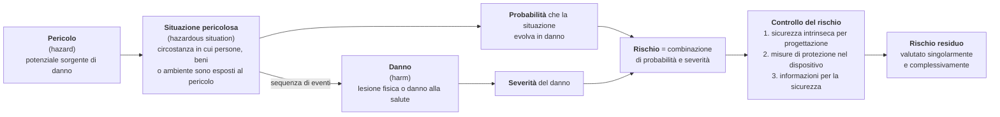
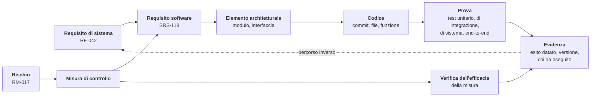

# Il quadro regolatorio da zero

> **Questo è un documento tecnico, non una consulenza legale né regolatoria.**
> Serve a far capire a chi scrive codice perché certe regole esistono e cosa cambia in
> pratica. Non sostituisce il parere di un consulente di *regulatory affairs*, non costituisce
> una determinazione di qualificazione o di classificazione, e non impegna nessuno. Le
> decisioni regolatorie appartengono al soggetto fabbricante, da costituire (sezione 3) e vanno
> confermate sui testi normativi originali. Dove un dato è stimato, incerto o proveniente da
> fonte secondaria, è dichiarato tale; ciò che non è stato verificato su fonte primaria è
> marcato **[NV]**.

Ci sono progetti in cui una funzionalità nasce da una conversazione, si scrive in un
pomeriggio e si rilascia il giorno dopo. Questo non è uno di quelli, e non per pignoleria
organizzativa.

La differenza non è culturale, è giuridica. Esiste un corpo di norme che, quando un software
ha una certa destinazione dichiarata, lo colloca nella stessa categoria di un pacemaker o di
una siringa: quella dei **dispositivi medici**. In quella categoria non si può rilasciare
software senza dimostrare come è stato progettato, quali rischi sono stati considerati, chi ha
verificato cosa, e perché ogni riga corrisponde a un requisito scritto prima. Non è un processo
ricostruibile a posteriori: o si costruisce mentre si lavora, o non esiste.

Questo modulo spiega quel corpo di norme partendo da zero, per chi non ha mai sentito parlare
di dispositivi medici. Non presuppone nozioni di diritto: ogni istituto è spiegato dalla
definizione. Presuppone invece il modulo [02](02-prestazioni-di-telemedicina.md) per il
vocabolario delle prestazioni e il modulo [03](03-il-dato-clinico.md) per il dato sanitario e
la protezione dei dati, che qui sono richiamati ma non ripetuti.

Alla fine dovresti poter rispondere a tre domande: *perché questo progetto è vincolato in
questo modo*, *quali di questi vincoli toccano il codice che sto per scrivere*, e *cosa succede
se li ignoro*.

---

## 1. Cos'è un dispositivo medico, e perché un software può esserlo

### 1.1 La definizione, letta parola per parola

La norma di riferimento nell'Unione europea è il **Regolamento (UE) 2017/745**, comunemente
**MDR** (*Medical Device Regulation*, regolamento sui dispositivi medici), che dal 26 maggio
2021 ha sostituito la Direttiva 93/42/CEE. L'**art. 2, punto 1**, definisce dispositivo medico:

> «qualunque strumento, apparecchio, apparecchiatura, **software**, impianto, reagente,
> materiale o altro articolo, destinato dal fabbricante a essere impiegato sull'uomo, da solo o
> in combinazione, per una o più delle seguenti destinazioni d'uso mediche specifiche:
> - diagnosi, prevenzione, monitoraggio, previsione, prognosi, trattamento o attenuazione di
> malattie,
> - diagnosi, monitoraggio, trattamento, attenuazione o compensazione di una lesione o di una
> disabilità,
> - studio, sostituzione o modifica dell'anatomia oppure di un processo o stato fisiologico o
> patologico,
> - fornire informazioni attraverso l'esame in vitro di campioni provenienti dal corpo umano
> […]
> e che non esercita nel o sul corpo umano l'azione principale cui è destinato mediante mezzi
> farmacologici, immunologici o metabolici, ma la cui funzione può essere coadiuvata da tali
> mezzi.»

Quattro elementi vanno isolati, perché ciascuno smonta un'intuizione comune.

**Primo: il software è nominato esplicitamente.** Non è un'estensione interpretativa: la parola
«software» compare nell'elenco degli oggetti che possono essere dispositivi, accanto a
«strumento» e «apparecchio». Non esiste alcuna soglia di complessità tecnologica. Un foglio di
calcolo con tre formule può essere un dispositivo medico; un sistema distribuito con dieci
milioni di righe può non esserlo affatto.

**Secondo: «destinato dal fabbricante».** È il perno di tutto ed è il tema della sezione 1.3.

**Terzo: le finalità sono tassative.** Diagnosi, prevenzione, monitoraggio, previsione,
prognosi, trattamento, attenuazione - riferite a malattie, lesioni o disabilità - più lo studio,
la sostituzione o la modifica dell'anatomia o di un processo fisiologico. Fuori da questo elenco
non c'è finalità medica ai sensi dell'MDR, per quanto il prodotto sia sanitario nel senso
comune. La fatturazione di uno studio medico è attività sanitaria e non è finalità medica. La
pianificazione dei turni di un reparto lo stesso.

**Quarto: il criterio di esclusione farmacologica** serve a separare i dispositivi dai
medicinali e non ha rilevanza per il software.

### 1.2 Il vocabolario minimo prima di proseguire

| Termine | Significato operativo |
|---|---|
| **MDR** | Regolamento (UE) 2017/745 sui dispositivi medici |
| **IVDR** | Regolamento (UE) 2017/746 sui dispositivi medico-diagnostici *in vitro*: riguarda l'esame di campioni biologici, non ci riguarda |
| **MDSW** | *Medical Device Software*, software che è esso stesso un dispositivo medico |
| **MDCG** | *Medical Device Coordination Group*, gruppo di coordinamento istituito dall'art. 103 MDR; pubblica linee guida non vincolanti ma seguite di fatto da autorità e organismi notificati |
| **Destinazione d'uso** | *Intended purpose*: l'uso al quale il fabbricante destina il dispositivo, art. 2, punto 12 |
| **GSPR** | *General Safety and Performance Requirements*, requisiti generali di sicurezza e prestazione dell'Allegato I MDR |
| **Organismo Notificato** | Ente terzo indipendente, designato da uno Stato membro e notificato alla Commissione, che valuta la conformità dei dispositivi delle classi superiori |
| **EUDAMED** | Banca dati europea dei dispositivi medici |

### 1.3 Il salto concettuale: è la destinazione d'uso dichiarata a qualificare, non la tecnologia

Questo è il punto che quasi tutti faticano a fare, e va detto nel modo più netto possibile.

**Non è ciò che il software fa tecnicamente a determinare se è un dispositivo medico. È ciò che
il fabbricante dichiara che serve a fare.**

L'**art. 2, punto 12**, MDR definisce la destinazione d'uso come

> «l'utilizzo al quale è destinato un dispositivo secondo le indicazioni fornite dal fabbricante
> sull'etichetta, nelle istruzioni per l'uso o **nel materiale o nelle dichiarazioni di
> promozione o vendita** e come specificato dal fabbricante nella valutazione clinica».

Leggi di nuovo l'espressione evidenziata. **Il materiale promozionale è materiale regolatorio.**
Una frase in home page, una riga nel `README`, un titolo di sezione nella documentazione delle
API, il testo di un annuncio: sono tutte fonti da cui si ricava giuridicamente la destinazione
d'uso, e concorrono a stabilire se il prodotto è un dispositivo e in quale classe.

Le conseguenze sono controintuitive e vanno interiorizzate:

1. **Due prodotti tecnicamente identici possono avere qualificazioni opposte.** Un software che
   mostra una serie storica di valori di pressione arteriosa è un dispositivo medico se dichiara
   di servire al monitoraggio di un paziente iperteso, e non lo è se dichiara di essere un
   diario personale per il benessere. Il codice è lo stesso, il regime giuridico no.
2. **Aggiungere una frase può cambiare regime, senza toccare una riga di codice.** È il motivo
   per cui, in questo progetto, la revisione dei testi pubblici è un'attività di conformità e non
   di comunicazione.
3. **Togliere una frase non cancella una funzionalità.** Se il software *fa* qualcosa e la
   destinazione d'uso dichiarata lo nega, la dichiarazione è falsa. L'art. 7 MDR vieta testi,
   denominazioni, marchi, immagini e segni che possano indurre in errore l'utilizzatore o il
   paziente riguardo alla destinazione d'uso, alla sicurezza e alle prestazioni, «in particolare
   attribuendo funzioni e proprietà che il dispositivo non possiede».

La regola operativa che ne discende, e che governa questo progetto, è una sola: **dichiarare
esattamente ciò che il prodotto fa, e progettare il prodotto perché faccia esattamente ciò che
si vuole dichiarare.** Ogni scostamento fra le due cose è un difetto, in una direzione o
nell'altra.

### 1.4 Il rischio non è un criterio di qualificazione

Secondo malinteso frequente: «il nostro software non può fare danni gravi, quindi non è un
dispositivo». La linea guida **MDCG 2019-11** (*Qualification and classification of software in
Regulation (EU) 2017/745 and Regulation (EU) 2017/746*), nella revisione 1 del giugno 2025,
§ 3.1, è esplicita:

> «It must be highlighted that the risk of harm to patients, users of the software, or any other
> person, related to the use of the software within healthcare, including a possible malfunction
> is **not a criterion** on whether the software qualifies as a medical device.»

Il rischio determina la **classe** (sezione 2), non la **qualificazione**. Sono due domande in
sequenza, non una sola: *è un dispositivo?* e poi, solo se la risposta è sì, *di quale classe?*

### 1.5 L'albero di qualificazione

MDCG 2019-11 Rev.1 fornisce, alle pagine 12–13, un albero decisionale in cinque passi. È lo
strumento che chiunque debba motivare una qualificazione percorre passo per passo, per iscritto,
con una motivazione per ciascun nodo. Un Organismo Notificato o un'autorità competente verifica
che l'albero sia stato percorso, non soltanto la conclusione.



Tre nodi meritano una lettura attenta.

**Il passo 3 è quello che decide quasi tutto.** L'elenco delle azioni «neutre» - archiviare,
conservare, comunicare, cercare in modo semplice, comprimere senza perdita - descrive
esattamente ciò che fa un sistema informativo. La nota che accompagna il passo definisce
«comunicazione» richiamando la norma IEEE 610.10-1994: «the flow of information from one point,
known as the source, to another, the receiver». Instradare messaggi di segnalazione, trasportare
un flusso multimediale cifrato, serializzare una risorsa e trasmetterla: tutto questo è
comunicazione e non supera il passo 3.

Attenzione però alla parola **«lossless»**: l'esclusione riguarda la compressione *senza
perdita*, cioè quella che consente la ricostruzione esatta dei dati originali. L'aggettivo è
intenzionale e ha funzione normativa. Una compressione con perdita che alteri l'informazione
clinicamente rilevante è un'azione sui dati che supera il passo 3. La difesa, per un sistema di
videocomunicazione, sta nel fatto che la compressione ha finalità di **compatibilità e
trasmissibilità**, non finalità medica: la stessa § 3.1 della Rev.1 precisa che «altering the
representation of data for embellishment/cosmetic or compatibility purposes does not readily
qualify the software as MDSW». È una difesa solida, ma non priva di attrito, e l'attrito cresce
quanto più la comunicazione pubblica enfatizza l'adeguatezza diagnostica del canale.

**Il passo 4 esclude ciò che non riguarda il singolo paziente.** Aggregazioni di popolazione,
percorsi generici, letteratura, atlanti, registri epidemiologici, e - caso rilevante per noi -
**le metriche di qualità della rete**: tempo di andata e ritorno, perdita di pacchetti, *jitter*,
*bitrate*. Sono a beneficio della gestione dell'infrastruttura, non del paziente individuale.
Vanno documentate con questa motivazione esplicita, non lasciate implicite.

**Il passo 5 è la domanda vera:** il software ha una finalità medica *propria*? La linea guida lo
enuncia come principio: «Software must have a medical purpose on its own to be qualified as a
MDSW» (§ 3.1). E specifica che «software only intended for non-medical purposes […] such as
invoicing, staff planning, **e-mailing, web or voice messaging**, data parsing, word processing,
and back-up, wellness or fitness apps, do not qualify as MDSW». La menzione espressa della
**messaggistica web e vocale** fra le attività *non* mediche è direttamente pertinente al livello
di segnalazione e trasporto di questo progetto.

### 1.6 Cosa la linea guida dice espressamente dei sistemi come questo

L'Allegato I di MDCG 2019-11 Rev.1 contiene una casistica. Quattro voci ci riguardano.

**c) Sistemi informativi** (p. 25): «Information Systems that are intended only to transfer,
store, convert, format, archive data are not qualified as medical devices in themselves.
However, they may be used with additional modules which may be qualified in their own right as
medical devices (MDSW).»

**c.1) Sistemi di cartella clinica elettronica** (pp. 25–26): i sistemi di *Electronic Health
Record* «when used solely to replace traditional paper-based patient files, do not meet the
definition of a medical device». È l'equivalente digitale della carta intestata.

**d) Sistemi di comunicazione** (p. 27): «The healthcare sector uses communication systems (e.g.
email systems, mobile telecommunication systems, **video communication systems**, paging,
speech-to-text systems etc.) […] **Communication systems are normally based on software for
general purposes, and do not fall within the definition of a medical device.**» E subito dopo
l'avvertimento: «*A software module generating alarms based on the monitoring and analysis of
patient specific physiological parameters is qualified as a medical device (MDSW).*»

**d.1) Sistemi di telemedicina** (p. 27) - il passaggio decisivo, riscritto proprio con la
revisione 1:

> «Telemedicine that solely transfers and displays information for monitoring purposes **without
> interpreting data** does not qualify as a medical device. Additional modules such as
> **thresholds alerts** may qualify as a medical device if they are intended for medical
> purposes.»

Tieni a mente l'espressione «without interpreting data»: è il criterio che nella sezione 2.6
diventa la linea di demarcazione operativa dell'intera architettura.

### 1.7 Le due trappole che spostano la qualificazione senza che nessuno se ne accorga

**La trappola dell'accessorio.** L'art. 2, punto 2, MDR definisce «accessorio» un articolo che,
pur non essendo un dispositivo, è destinato dal fabbricante a essere usato **con** uno o più
dispositivi medici specifici, per abilitarne l'uso conforme alla destinazione o per assisterne
direttamente la funzionalità medica. Un accessorio è soggetto al regolamento.

Applicato a noi: finché la documentazione di integrazione resta *agnostica rispetto al
dispositivo*, non siamo accessorio di nulla. Nel momento in cui un documento dichiarasse
«compatibile con il dermatoscopio X per la teledermatologia» o «abilita l'uso remoto dello
stetoscopio digitale Y», il prodotto diventerebbe accessorio di quel dispositivo. E la regola di
applicazione 3.3 dell'Allegato VIII trascina il software che fa funzionare o influenza un
dispositivo **nella stessa classe del dispositivo pilotato**. Una frase in un documento di
integrazione può quindi importare la classe di un apparecchio di terzi.

**La trappola dei moduli.** La sezione 7 di MDCG 2019-11 Rev.1, riscritta nel 2025, impone di
delimitare in modo esplicito confini e interfacce dei moduli e di comunicare «exactly which
modules constitute the product» e «whether the product or any of its modules are subject to the
MDR/IVDR or under other applicable legislation». Ma aggiunge due passaggi che riguardano
direttamente un componente pensato per essere incorporato:

> «Where not all modules serve a direct medical purpose (e.g., patient record management,
> scheduling, or communications), but these non-medical functionalities are essential to the
> medical purpose of an MDSW, the following applies: **Non-medical functionalities should not be
> excluded from the MDSW description if they are necessary for the operation of the MDSW**.»

> «For example, a manufacturer develops an MDSW extension that operates through the user
> interface of a host module or platform that itself does not meet the definition of a medical
> device. […] **Therefore, the manufacturer must assess the host module's interface as part of
> the MDSW's usability and clinical performance evaluations.**»

Tradotto: se un giorno qualcuno - un integratore, un terzo, un *fork* - costruisce sopra questa
piattaforma un modulo con finalità medica, **la nostra interfaccia utente e la nostra pipeline
multimediale entrano nel perimetro di valutazione dell'usabilità e delle prestazioni cliniche di
quel modulo**, pur restando esse stesse non-dispositivo. Ecco perché il vincolo architetturale
**V2** - separazione esplicita fra «veicolo di comunicazione» e «supporto alla decisione
clinica» - non è una preferenza di design: è un requisito documentale imposto dalla linea guida,
ed è ciò che rende il nostro lavoro utilizzabile dal fabbricante nel percorso di conformità.

---

## 2. Le classi di rischio, e la regola che si applica al software

### 2.1 Quattro classi, un solo criterio

L'**art. 51 MDR** stabilisce che i dispositivi sono suddivisi nelle classi **I, IIa, IIb e III**,
tenendo conto della destinazione d'uso e dei rischi, e che la classificazione avviene secondo le
regole dell'**Allegato VIII**. La classe non è un'etichetta di qualità: è un indicatore di quanto
rigore procedurale l'ordinamento pretende prima che il prodotto arrivi a un paziente.

Il capo II dell'Allegato VIII contiene le **regole di applicazione**, cioè le meta-regole che
dicono come si usano le regole di classificazione. Quattro sono decisive per il software:

- **3.1** - «L'applicazione delle regole di classificazione si basa sulla destinazione d'uso dei
  dispositivi.» Di nuovo la destinazione d'uso, non la tecnologia.
- **3.3** - «Il software destinato a far funzionare un dispositivo o a influenzarne l'uso rientra
  nella stessa classe del dispositivo. **Se il software non è connesso con nessun altro
  dispositivo, è classificato separatamente.**»
- **3.5** - «Se diverse regole o, nell'ambito della stessa regola, più sottoregole si applicano
  allo stesso dispositivo in base alla sua destinazione d'uso, **si applicano la regola e
  sottoregola più rigorose che comportano la classificazione più elevata**.»
- **3.7** - «Si ritiene che un dispositivo consenta una diagnosi diretta quando fornisce esso
  stesso la diagnosi della malattia o della condizione clinica in questione **o quando fornisce
  informazioni decisive per la diagnosi**.»

La regola 3.5 è la ragione strutturale per cui **non si sceglie** la propria classe: se anche una
sola sotto-regola più severa è applicabile, prevale quella. La regola 3.7 è quella che rende
insidiosa la telemedicina nelle specialità visive: se il flusso video è la fonte
dell'osservazione clinica, la domanda «il software fornisce informazioni decisive per la
diagnosi?» non ha una risposta ovviamente negativa.

Una precisazione utile: il software è per definizione un **dispositivo attivo**. L'art. 2, punto
4, MDR, dopo aver definito il dispositivo attivo come quello il cui funzionamento dipende da una
fonte di energia diversa da quella generata dal corpo umano, chiude con «**Il software è
considerato un dispositivo attivo**». Ne discende che, se qualificato, un software ricade nelle
regole 9–13, 15 e 22 dell'Allegato VIII.

### 2.2 La Regola 11, testo integrale

Allegato VIII, capo III, punto 6.3:

> **6.3. Regola 11**
>
> Il software destinato a fornire informazioni utilizzate per prendere decisioni a fini
> diagnostici o terapeutici rientra nella classe IIa, a meno che tali decisioni abbiano effetti
> tali da poter causare:
>
> - il decesso o un deterioramento irreversibile delle condizioni di salute di una persona, nel
> qual caso rientra nella classe III, o
>
> - un grave deterioramento delle condizioni di salute di una persona o un intervento chirurgico,
> nel qual caso rientra nella classe IIb.
>
> Il software destinato a monitorare i processi fisiologici rientra nella classe IIa, a meno che
> sia destinato a monitorare i parametri fisiologici vitali, ove la natura delle variazioni di
> detti parametri sia tale da poter creare un pericolo immediato per il paziente, nel qual caso
> rientra nella classe IIb.
>
> **Tutti gli altri software rientrano nella classe I.**

MDCG 2019-11 Rev.1, § 4.2.1, scompone la regola in tre sotto-regole:

| Sotto-regola | Contenuto | Esito base |
|---|---|---|
| **11a** | Software destinato a fornire informazioni usate per decisioni diagnostiche o terapeutiche | IIa, salvo IIb o III secondo la gravità |
| **11b** | Software destinato a monitorare processi fisiologici | IIa, salvo IIb per i parametri vitali con pericolo immediato |
| **11c** | Tutti gli altri usi | I |

Due chiarimenti della linea guida cambiano il peso della regola.

Sulla **11a**, la Rev.1 avverte che la formulazione «descrive, in termini molto generali, il
"modo d'azione" caratteristico di **tutti** i MDSW» e che quindi «questa sotto-regola è
generalmente applicabile a tutti i MDSW (esclusi quelli che non hanno finalità medica)» (p. 17).
Inoltre le deroghe verso l'alto si valutano sull'impatto di una decisione presa **su informazione
errata** fornita dal software: «where such decisions, if based on incorrect information from the
MDSW, are reasonably likely to have an impact that may cause…» (p. 18).

Sulla **11b**, la linea guida chiarisce che si applica al monitoraggio di *qualunque* processo
fisiologico, non solo di quelli vitali, e che i parametri vitali di riferimento sono
«respiration, heart rate, cerebral functions, blood gases, blood pressure and body temperature»
(p. 18).

### 2.3 Perché, per un software di telemedicina, la classe più bassa in pratica non esiste

Qui arriviamo al fatto normativo più importante dell'intero modulo, e va detto senza attenuazioni.

L'Allegato III di MDCG 2019-11 Rev.1 (p. 33) riporta la matrice di orientamento derivata dal
lavoro dell'*International Medical Device Regulators Forum* (**IMDRF**), che incrocia la
significatività dell'informazione con la criticità della situazione clinica:

| | Informazione: **tratta o diagnostica** | **guida la gestione clinica** | **informa la gestione clinica** |
|---|---|---|---|
| Situazione **critica** | Classe III | Classe IIb | Classe IIa |
| Situazione **grave** | Classe IIb | Classe IIa | Classe IIa |
| Situazione **non grave** | Classe IIa | Classe IIa | Classe IIa |

E sotto la tabella, in nota, la frase che chiude il discorso:

> «**This table does not take into account MDSW which is Class I.**»

Cioè: nella matrice applicata alla Regola 11a, **la Classe I non compare in nessuna cella**. Ogni
software che sia stato qualificato come dispositivo medico e che fornisca informazione usata per
decisioni cliniche - per quanto marginale l'informazione, per quanto non grave la condizione - è
**almeno IIa**.

La catena logica che ne discende è ineludibile:

1. per essere in Classe I bisogna prima **essere un dispositivo medico**: le classi sono un
   attributo dei dispositivi, non delle categorie di software;
2. per essere un dispositivo serve una **finalità medica propria**;
3. se c'è finalità medica propria, la sotto-regola 11a «si applica generalmente a tutti i MDSW» e
   la matrice non contiene celle di Classe I: risultato minimo **IIa, con Organismo Notificato**;
4. se non c'è finalità medica propria, il prodotto **non è un dispositivo affatto** e non esiste
   alcuna Classe I da autocertificare.

**Non esiste, in mezzo, una casella comoda di Classe I per una piattaforma di telemedicina.** La
Classe I per Regola 11c esiste, ma è popolata da software con finalità medica *non decisionale e
non di monitoraggio*. I due unici esempi che la linea guida offre (Allegato IV, p. 35) sono
un'applicazione che calcola lo stato di fertilità da temperatura basale e giorni di mestruazione
restituendolo con un semaforo, e un'applicazione che assiste persone con disturbi della
comunicazione convertendo simboli in linguaggio parlato. Entrambe hanno una finalità medica
riconducibile all'art. 2(1) - rispettivamente controllo o supporto della concezione e
compensazione di una disabilità - **senza** produrre informazione usata per una decisione
diagnostica o terapeutica. Un canale audio-video sicuro non appartiene a quella famiglia.

Questa constatazione ha una conseguenza che il progetto ha recepito formalmente (decisione
**D26**): dichiarare una finalità medica propria e accettare il percorso di **Classe IIa con
Organismo Notificato**, invece di rincorrere una Classe I che, per il telemonitoraggio, non è
disponibile.

### 2.4 Il rischio speculare: marcare CE ciò che non è un dispositivo

L'errore opposto è altrettanto reale e meno discusso. Apporre una marcatura CE ai sensi dell'MDR
su un prodotto che, correttamente qualificato, non è un dispositivo, **non è un eccesso di
prudenza innocuo**: è una falsa rappresentazione dello stato regolatorio.

- l'**art. 20** disciplina la marcatura CE dei *dispositivi* e vieta l'apposizione di marchi o
  iscrizioni idonei a indurre in errore i terzi riguardo alla marcatura CE;
- l'**art. 7** vieta le dichiarazioni fuorvianti su destinazione d'uso, sicurezza e prestazioni;
- l'**art. 10, paragrafo 6**, subordina la dichiarazione di conformità all'avvenuta dimostrazione
  di conformità *di un dispositivo* mediante la procedura applicabile;
- la registrazione in EUDAMED e l'attribuzione dell'identificativo unico presuppongono
  l'esistenza di un dispositivo.

Un integratore potrebbe fondare la propria conformità su una marcatura non dovuta. È uno dei
motivi per cui questo progetto non appone marcature e non sottoscrive dichiarazioni (sezione 3.6).

### 2.5 Cosa distingue davvero le classi: percorso, tempi, costi

| | **Classe I** | **Classe IIa** | **Classe IIb** | **Classe III** |
|---|---|---|---|---|
| Chi valuta la conformità | Solo il fabbricante, salvo le sottoclassi Is, Im, Ir | **Organismo Notificato** | Organismo Notificato | Organismo Notificato, procedure rinforzate |
| Base giuridica | Art. 52, par. 7 | Art. 52, par. 6: Allegato IX capi I e III più valutazione della documentazione tecnica sez. 4, oppure Allegato XI | Art. 52, par. 4 | Art. 52, par. 3, con consultazione di esperti nei casi previsti |
| Documentazione tecnica | Allegati II e III | Allegati II e III | Allegati II e III | Allegati II e III |
| Valutazione clinica | Art. 61 e Allegato XIV | Art. 61 e Allegato XIV | Idem, evidenza più stringente | Idem, indagine clinica di norma richiesta |
| Rapporto periodico di sicurezza (**PSUR**, art. 86) | Non dovuto: si redige il rapporto PMS dell'art. 85 | Almeno **ogni due anni** | Annuale | Annuale, trasmesso all'Organismo Notificato |
| Sorveglianza | Nessun audit di terza parte | Audit almeno annuali dell'ON, più audit senza preavviso | Idem | Idem |
| Durata tipica del percorso | Mesi, dominata dalla redazione documentale | **Anni** (sezione 10) | Più lunga | Molto più lunga |
| Classe di sicurezza software attesa | Variabile | Tipicamente B | Tipicamente B o C | Tipicamente C |

Le ultime due righe fanno la differenza economica e temporale. Il salto da IIa a IIb non aggiunge
un adempimento: **aggiunge un ordine di grandezza**, perché fa scattare insieme evidenza clinica
più stringente, classe di sicurezza software superiore con obbligo di progettazione dettagliata a
livello di unità, e cicli di valutazione più lunghi.

### 2.6 Il criterio che sposta di classe: trasmettere senza alterare, oppure interpretare

La linea di demarcazione è questa: **il dato attraversa il sistema conservando il proprio
contenuto informativo, oppure il sistema aggiunge significato**. Nel primo caso il software è un
condotto; nel secondo produce informazione clinica nuova, e chi produce informazione clinica
fornisce informazione per decisioni cliniche.

Ecco la linea applicata funzione per funzione a questo progetto. La colonna «esito» indica se la
funzione, da sola, supererebbe il passo 3 dell'albero di qualificazione.

| Funzione | Che azione compie sui dati | Esito |
|---|---|---|
| Segnalazione della sessione, scambio dei candidati di connettività, ripiego su relay | Instradamento di messaggi: **comunicazione** | Non supera |
| Trasporto multimediale cifrato punto-punto | Trasporto: **comunicazione**. La cifratura non interpreta il contenuto clinico | Non supera |
| Persistenza dell'incontro, del professionista, dell'assistito, dell'appuntamento | **Archiviazione** e conversione di formato | Non supera |
| Persistenza del documento clinico redatto dal professionista | **Archiviazione** di contenuto autoriale umano, con serializzazione come conversione di formato | Non supera, **a condizione** che nessun campo clinico sia derivato, dedotto, precompilato o completato dal sistema |
| Registro degli accessi immutabile | Registrazione tecnica, nessuna finalità clinica | Non supera |
| Registrazione della sessione cifrata, con consenso | **Archiviazione** | Non supera; la *riproduzione con strumenti di miglioramento dell'immagine* sarebbe altra cosa |
| Metriche di qualità della rete e soglie tecniche | Elaborazione su parametri **di rete**, non fisiologici | Supera il passo 3 come azione, ma cade al passo 4: non è a beneficio del singolo paziente |
| Acquisizione di parametri misurati da dispositivi di terzi e loro presentazione in tabella e grafico | Presentazione senza alterazione del contenuto | Non supera **finché** non si aggiunge interpretazione |
| **Evidenziazione del superamento di una soglia configurata dal professionista** | Confronto deterministico fra un valore e un intervallo definito da un umano per quel singolo paziente | **È il punto di frontiera**: è la funzione che, nel perimetro dichiarato, costituisce interpretazione e fonda la qualificazione come dispositivo |

L'ultima riga merita una spiegazione, perché è la ragione per cui questo progetto è dove è.
Confrontare un numero con un intervallo è banale sul piano informatico. Sul piano regolatorio è
il momento in cui il sistema smette di limitarsi a mostrare un dato e comincia a **qualificarlo**
come dentro o fuori norma per quel paziente. La linea guida lo dice espressamente: «additional
modules such as thresholds alerts may qualify as a medical device if they are intended for
medical purposes».

Il progetto ha scelto di riconoscere questo fatto invece di aggirarlo, e ha costruito attorno a
esso una serie di vincoli che mantengono la classe a **IIa** anziché farla salire a IIb. Sono
tutti vincoli di codice, non di prosa:

- **nessuna soglia clinica è cablata nel codice**: le soglie sono configurazione a cura del
  professionista, per il singolo assistito (vincolo **V2**);
- **nessun punteggio, indice prognostico o classificazione di rischio è calcolato dal sistema**;
- **la raccolta è differita**, destinata alla revisione periodica del professionista, non al
  monitoraggio continuo in tempo reale;
- **il superamento di una soglia genera una segnalazione, non un allarme di emergenza**: il
  sistema non è un canale di soccorso e lo dichiara;
- **nessun contenuto clinico è generato dal sistema**: ogni campo clinicamente significativo ha
  un'origine tracciabile a un input umano.

### 2.7 La destinazione d'uso è il documento più costoso da sbagliare

Il progetto ha registrato questa constatazione come decisione formale (**D46**).

| Formulazione della destinazione d'uso | Classe MDR | Classe di sicurezza software | Differenza |
|---|---|---|---|
| «monitoraggio **in tempo reale** dei parametri vitali» | **IIb** (Regola 11, secondo comma) | **C** | 12–18 mesi e un ordine di grandezza di costo in più - **stima, non listino** |
| «raccolta **differita** di parametri per la **revisione periodica** del professionista» | **IIa** | **B** | - |

Due parole. La differenza fra «in tempo reale» e «differita», e fra «parametri vitali» e
«parametri», vale più di qualunque scelta tecnologica presa in tutto il progetto. Ecco perché la
destinazione d'uso va **congelata e sottoposta a revisione esterna prima** di ingaggiare
chiunque, e perché cambiarla dopo comporta una rivalutazione integrale.

### 2.8 Le funzioni che sono a una singola *user story* dalla riclassificazione

| # | Funzionalità | Base normativa | Classe che ne deriva |
|---|---|---|---|
| C1 | Triage, punteggio sintomatologico, questionario che restituisce un esito | Regola 11a | IIa, fino a IIb secondo la gravità |
| C2 | Allerta su parametri **fisiologici**, anche solo autodichiarati | Regola 11b; Allegato I d) della linea guida | IIa; **IIb** se parametri vitali con pericolo immediato |
| C3 | Miglioramento dell'immagine per la lettura clinica: contrasto, nitidezza, zoom diagnostico, filtri, in diretta o in riproduzione | MDCG 2019-11 Rev.1 § 3.1 | IIa, fino a III per patologie critiche |
| C4 | Misurazione su immagine: dimensione di una lesione, angolo articolare | Regola 11a e regola di applicazione 3.7; possibile «funzione di misura» ai fini dell'art. 52 | IIa |
| C5 | Codifica o derivazione semantica automatica del documento clinico | Regola 11a | IIa |
| C6 | Supporto alla decisione, suggerimento terapeutico, ordinamento di opzioni | Regola 11a | IIa o superiore |
| C7 | Pilotaggio o attivazione remota di un dispositivo | Regola di applicazione 3.3 | Classe del dispositivo pilotato |
| C8 | Erogazione diretta di terapia | Allegato I d.1) della linea guida | Almeno IIa |
| C9 | Dichiarazione di idoneità del canale a fini di telepatologia o teleradiologia | DM 21 settembre 2022, Allegato A | Certificazione come dispositivo, classe da valutare |

Tre di queste nove voci sono, letteralmente, a una singola *user story* dal nostro elenco di
funzionalità: **C2** (allerta su soglia), **C3** (riproduzione della registrazione con controlli
di immagine) e **C5** (refertazione assistita, richiesta ricorrente degli integratori). Sono
governate con controllo delle modifiche: una *pull request* che le introducesse non viene
respinta per merito tecnico, ma per **politica di perimetro**.

Nemmeno l'introduzione di un componente di intelligenza artificiale è una scelta tecnica.
Trascrizione automatica, sintesi del documento clinico, traduzione automatica, riconoscimento del
parlato: ciascuna farebbe entrare il prodotto nel perimetro del **Regolamento (UE) 2024/1689**
(*AI Act*), con un regime di obblighi proprio che si somma a quello dell'MDR. Nessuna funzione
dichiarata oggi è un sistema di IA ai sensi dell'art. 3, punto 1, di quel regolamento.
Introdurne una «per comodità» in una *pull request* è un cambio di regime normativo.

---

## 3. Chi è il fabbricante, e perché questo repository non lo è

### 3.1 La definizione, e cosa comporta

L'**art. 2, punto 30**, MDR definisce fabbricante

> «la persona fisica o giuridica che fabbrica o rimette a nuovo un dispositivo oppure lo fa
> progettare, fabbricare o rimettere a nuovo, **e lo commercializza apponendovi il suo nome o
> marchio**».

Due elementi cumulativi: *fare fare* il dispositivo, e *commercializzarlo col proprio nome*. Non
esiste nell'MDR una figura di «co-fabbricante per contribuzione»: chi apre una *pull request* non
commercializza nulla e non appone alcun marchio.

Essere fabbricante significa assumere l'elenco di obblighi dell'**art. 10**. Vale la pena
leggerlo, perché rende concreto ciò che altrimenti resta astratto.

| Paragrafo | Obbligo | Traduzione per un software |
|---|---|---|
| 10(2) | Sistema di **gestione del rischio** ai sensi dell'Allegato I, sezione 3 | ISO 14971 (sezione 5.4) |
| 10(3) | **Valutazione clinica** ai sensi dell'art. 61 e dell'Allegato XIV, incluso il *follow-up* post-commercializzazione | Sezione 4.5 |
| 10(4) | **Documentazione tecnica** ai sensi degli Allegati II e III, mantenuta aggiornata | Sezione 4.4 |
| 10(6) | **Dichiarazione di conformità UE** e **marcatura CE** | Sezioni 4.6 e 4.7 |
| 10(7) | Obblighi **UDI** e di **registrazione** | Sezione 4.8 |
| 10(8) | Conservazione della documentazione per almeno **10 anni** dall'immissione dell'ultimo dispositivo | Politica di conservazione documentale |
| 10(9) | **Sistema di gestione della qualità** proporzionato alla classe, con gli elementi (a)–(m) | Sezione 5.3 |
| 10(10) | **Sorveglianza post-commercializzazione** | Sezione 4.9 |
| 10(11) | Informazioni che accompagnano il dispositivo nelle **lingue ufficiali** determinate dallo Stato membro | Istruzioni per l'uso in italiano |
| 10(12) | Azioni correttive immediate in caso di non conformità | Procedura di azione correttiva di sicurezza sul campo |
| 10(13) | Registrazione e segnalazione degli **incidenti** | Sezione 4.9 |
| 10(14) | Fornitura all'autorità di ogni informazione utile a dimostrare la conformità | - |
| 10(16) | **Copertura finanziaria sufficiente** per la potenziale responsabilità da prodotto | Sezione 8.4 |

Fra gli elementi del sistema qualità elencati al paragrafo 9, la lettera **(d)** merita una
sottolineatura: «la gestione delle risorse, **compresa la selezione e il controllo dei fornitori
e dei subfornitori**». Un contributore esterno non è formalmente un fornitore, ma il codice che
propone entra nel prodotto: il fabbricante deve poter rispondere della progettazione e della
verifica di codice scritto da persone che non controlla. È il nodo che la sezione 3.8 scioglie.

### 3.2 Il responsabile del rispetto della normativa

L'**art. 15 MDR** impone al fabbricante di disporre di almeno una **persona responsabile del
rispetto della normativa** (in sigla **PRRC**, *Person Responsible for Regulatory Compliance*),
con competenza comprovata da:

- (a) diploma o laurea in giurisprudenza, medicina, farmacia, ingegneria o altra disciplina
  scientifica pertinente, **più** un anno di esperienza professionale in materia regolatoria o in
  sistemi di gestione della qualità; **oppure**
- (b) quattro anni di esperienza professionale in materia regolatoria o in sistemi qualità.

Le micro e piccole imprese - secondo la Raccomandazione 2003/361/CE, micro sotto i 10 addetti e
2 milioni di euro, piccola sotto i 50 addetti e 10 milioni - **non sono tenute ad avere la PRRC
all'interno dell'organizzazione, ma devono averla a disposizione in modo permanente e
continuativo**, tipicamente per contratto.

I compiti (paragrafo 3) sono precisi: verificare la conformità del dispositivo prima del rilascio,
predisporre e aggiornare la documentazione tecnica e la dichiarazione di conformità, adempiere
agli obblighi di sorveglianza post-commercializzazione, curare le segnalazioni degli artt. 87–91.
Il paragrafo 5 vieta che la PRRC subisca svantaggi nell'organizzazione per il corretto
adempimento dei propri compiti: è una garanzia di indipendenza, non un dettaglio contrattuale.

Nota pratica, spesso ignorata: una persona fisica non può essere PRRC di sé stessa in modo
formalmente ineccepibile senza dimostrare i requisiti del paragrafo 1. La PRRC va
contrattualizzata, e i profili qualificati sono una risorsa scarsa con liste d'attesa.

### 3.3 Le altre figure: distributore, importatore, mandatario

L'MDR distribuisce obblighi lungo tutta la catena.

| Figura | Chi è | Obblighi principali |
|---|---|---|
| **Mandatario** (art. 11) | Persona stabilita nell'Unione che un fabbricante extra-UE incarica per iscritto | Verifica della dichiarazione di conformità e della documentazione tecnica, registrazione, cooperazione con le autorità; risponde in solido per i dispositivi difettosi in caso di inadempimento del fabbricante |
| **Importatore** (art. 13) | Chi immette sul mercato dell'Unione un dispositivo proveniente da un paese terzo | Verifica di marcatura, dichiarazione, UDI, mandatario; indicazione del proprio nome sul dispositivo o sull'imballaggio; conservazione dei registri |
| **Distributore** (art. 14) | Chi mette a disposizione un dispositivo senza esserne fabbricante o importatore | Verifica documentale prima della messa a disposizione, condizioni di conservazione e trasporto, obbligo di informare in caso di sospetta non conformità |

E poi c'è la figura che riguarda direttamente il modello di integrazione di questo progetto:
l'**art. 16, paragrafo 1, lettera a)**, per cui

> «Un distributore, un importatore o un'altra persona fisica o giuridica assume gli obblighi che
> incombono ai fabbricanti se mette a disposizione sul mercato un dispositivo **con il proprio
> nome, la propria denominazione commerciale o il proprio marchio registrato**».

È esattamente la fattispecie del *white-label*. Il paragrafo 2 prevede l'esimente: gli obblighi
non si applicano quando esiste un accordo in forza del quale il fabbricante è indicato come tale
sull'etichetta ed è responsabile del rispetto degli obblighi. Chi incorpora questo software nel
proprio prodotto con il proprio marchio deve sapere che questo articolo esiste, perché è
l'articolo che gli attribuisce il ruolo.

### 3.4 Immissione sul mercato, messa a disposizione, messa in servizio: tre cose diverse

Le definizioni contano, perché ciascuna fa scattare obblighi diversi.

- **art. 2(27) - «messa a disposizione sul mercato»**: qualsiasi fornitura di un dispositivo per
  la distribuzione, il consumo o l'uso sul mercato dell'Unione **nel corso di un'attività
  commerciale**, a titolo oneroso **o gratuito**;
- **art. 2(28) - «immissione sul mercato»**: la prima messa a disposizione;
- **art. 2(29) - «messa in servizio»**: lo stadio in cui il dispositivo è reso disponibile
  all'utilizzatore finale **come pronto per l'uso** per la sua destinazione d'uso.

Tre conseguenze operative, distinte e non intercambiabili:

1. **La gratuità non protegge.** «a titolo oneroso o gratuito» è testuale. L'argomento «è open
   source, quindi non è immissione sul mercato» è giuridicamente infondato.
2. **Il criterio discriminante è «nel corso di un'attività commerciale».** Un repository di codice
   sorgente mantenuto senza corrispettivo, senza offerta di servizi, senza supporto commerciale e
   senza modello di monetizzazione è argomentabilmente fuori dall'attività commerciale. Il confine
   però si sposta appena il progetto genera ricavi: supporto a pagamento, servizio gestito,
   consulenza sull'integrazione, sponsorizzazioni ricorrenti.
3. **La forma della distribuzione conta.** C'è una differenza sostanziale, ai fini dell'art.
   2(29), fra pubblicare sorgenti che richiedono compilazione, configurazione e integrazione, e
   pubblicare un artefatto «pronto per l'uso» che un'organizzazione sanitaria può mettere in
   produzione senza ulteriore lavoro. Il secondo caso è molto più vicino alla messa in servizio.
   **[NV]** Non risultano linee guida MDCG dedicate specificamente alla distribuzione open source
   di software sanitario: è una lacuna reale del quadro europeo.

### 3.5 La posizione di questo progetto

Le decisioni **D28**, **D49** e **D51** definiscono una posizione che va compresa nella sua
logica, non memorizzata come formula. La spiega il documento
[`NOT-A-MEDICAL-DEVICE.md`](https://github.com/fedcal/Telemedic/blob/main/NOT-A-MEDICAL-DEVICE.md), che va letto: qui si spiega **perché**
dice quello che dice.

**Il repository contiene codice sorgente e documentazione. Nient'altro.** Non è un prodotto
immesso sul mercato, non reca marcatura CE, non è coperto da alcuna dichiarazione di conformità,
non è stato sottoposto alla valutazione di un Organismo Notificato.

Il ragionamento che sorregge questa affermazione si articola in quattro passaggi.

**Primo - il codice sorgente non è un dispositivo pronto per l'uso.** Un dispositivo si mette in
servizio quando è «reso disponibile all'utilizzatore finale come pronto per l'uso per la sua
destinazione d'uso» (art. 2(29)). Un repository che richiede compilazione, configurazione,
integrazione con sistemi di identità e anagrafiche, scelta dell'infrastruttura di rete e
definizione delle soglie cliniche non è pronto per l'uso: è materiale da cui qualcuno costruirà
un prodotto.

**Secondo - non c'è attività commerciale.** Il progetto non vende, non offre servizi gestiti, non
fattura supporto. È la condizione che tiene il repository fuori dalla nozione di «messa a
disposizione sul mercato» dell'art. 2(27), ed è una condizione **fattuale e revocabile**: se un
giorno il progetto monetizzasse, il confine si sposterebbe e la posizione andrebbe rivista. Per
questo la dichiarazione va tenuta aggiornata e non è un testo scritto una volta.

**Terzo - non c'è fabbricante.** Nessuno appone il proprio nome o marchio su un dispositivo
commercializzato. Manca il secondo elemento cumulativo della definizione dell'art. 2(30).

**Quarto - il progetto produce comunque il materiale regolatorio.** È il punto che distingue
questa posizione da una scappatoia. Fascicolo tecnico, documentazione di ciclo di vita, gestione
del rischio, ingegneria dell'usabilità, distinta dei materiali software sono prodotti e
pubblicati - **per rendere praticabile il percorso di conformità del fabbricante, non per
sostituirlo**. In linguaggio tecnico: il progetto si rende utilizzabile come **SOUP documentato** (sezione 5.5)
invece che come codice di provenienza ignota.

C'è un'ultima ragione, meno ovvia, per cui questa dichiarazione deve essere presente **in ogni
momento in cui il repository è accessibile** (decisione **D51**), e non «pubblicata più avanti».
La destinazione d'uso si ricava anche dal materiale pubblico (art. 2(12)). Un repository pubblico
privo di dichiarazione di stato regolatorio è un repository la cui destinazione d'uso viene
ricavata da chiunque legga il titolo del progetto. La dichiarazione non è una cautela: è
l'esercizio del diritto del progetto di dire cosa il proprio lavoro è e cosa non è.

### 3.6 Cosa cambia nel momento in cui qualcuno lo mette in servizio

Tutto. Ed è il senso della sezione «Cosa deve fare chi lo mette in servizio» del documento di
dichiarazione.

Chi installa, integra, distribuisce o mette in servizio questo software in un contesto sanitario
reale:

1. **deve verificare il codice** - non è una formula di stile: è la condizione a cui il progetto
   rende disponibile il proprio lavoro;
2. **assume il ruolo di fabbricante** ai sensi dell'MDR, con qualificazione, classificazione,
   valutazione della conformità, valutazione clinica, sorveglianza post-commercializzazione e
   vigilanza;
3. **assume il ruolo di titolare del trattamento** dei dati sanitari, con valutazione d'impatto,
   basi giuridiche, informative e obblighi di notifica (modulo [03](03-il-dato-clinico.md));
4. **assume gli obblighi di sicurezza** applicabili alla propria organizzazione (sezione 8.2).



### 3.7 L'esenzione per le istituzioni sanitarie non è una via d'uscita

L'**art. 5, paragrafo 5**, MDR esclude dall'applicazione della maggior parte del regolamento i
dispositivi **fabbricati e utilizzati esclusivamente all'interno di istituzioni sanitarie
dell'Unione**, a condizione, fra le altre, che i dispositivi non siano ceduti ad altra persona
giuridica, che fabbricazione e uso avvengano nell'ambito di sistemi di gestione della qualità
appropriati, e che l'istituzione **giustifichi che le esigenze specifiche del gruppo di pazienti
non possono essere soddisfatte da un dispositivo equivalente disponibile sul mercato**.

Va menzionata solo per escluderla, perché è una via d'uscita apparente che i clienti pubblici
invocano impropriamente. L'esenzione richiede che il dispositivo sia *fabbricato* dall'istituzione
che lo usa: un'azienda sanitaria che installa un prodotto sviluppato da terzi non lo ha
fabbricato. E la condizione sull'assenza di dispositivi equivalenti sul mercato è difficilmente
sostenibile per la telemedicina.

### 3.8 I contributori non sono fabbricanti, ma il controllo della progettazione deve restare da
qualche parte

Il problema simmetrico è reale: il fabbricante deve poter rispondere di codice scritto da
persone che non controlla. La soluzione non è giuridica, è di processo, e vive interamente nel repository:

| Meccanismo | Funzione regolatoria |
|---|---|
| **DCO** obbligatoria con `Signed-off-by` verificata in CI | Catena di provenienza dei diritti e tracciabilità nominativa dell'autore, dentro l'elemento di configurazione |
| **CODEOWNERS** e revisione obbligatoria dei responsabili | Il *design control* resta in capo a chi rilascia: il contributo è una **proposta**, l'accettazione è un atto di progettazione |
| **Protezione dei rami**, firma dei commit, unione solo tramite *pull request* | Integrità e non ripudio del ciclo di vita |
| **Tracciabilità obbligatoria** su ogni *pull request* che tocchi codice di prodotto | IEC 62304, sezione 6 di questo modulo |
| **Distinta dei materiali software** generata in CI e archiviata per ogni rilascio | Gestione dei SOUP e obblighi di cibersicurezza |
| **Separazione fra ciò che è nel perimetro valutato e ciò che non lo è** (moduli opzionali, interruttori di funzionalità) | Delimitazione dei moduli richiesta da MDCG 2019-11 Rev.1 § 7 |

---

## 4. Il percorso di conformità

Questa sezione descrive il percorso di conformità che il progetto intende percorrere. Con la
decisione **D63** del 26 agosto 2026 il committente ha deciso che il sistema deve essere adatto
all'erogazione di prestazioni su pazienti reali: il soggetto fabbricante, da costituire, dovrà
seguire questo percorso. Capirne la sequenza serve a comprendere perché certi artefatti devono
avere quella forma e quale sia l'ordine di dipendenza dei lavori.

### 4.1 La sequenza



### 4.2 La valutazione della conformità: cosa significa e chi la fa

«Valutazione della conformità» è il procedimento con cui si dimostra che il dispositivo rispetta
i requisiti applicabili. Per la Classe IIa l'**art. 52, paragrafo 6**, offre due strade
alternative:

- **Strada 1** - valutazione basata sul **sistema di gestione della qualità**: Allegato IX,
  **capo I** (valutazione del SGQ) e **capo III** (disposizioni amministrative), **più** la
  valutazione della documentazione tecnica di cui alla **sezione 4** dell'Allegato IX per almeno
  un dispositivo rappresentativo per ciascuna categoria.
- **Strada 2** - documentazione tecnica degli Allegati II e III unita a una valutazione ai sensi
  dell'**Allegato XI**, nella variante «garanzia di qualità della produzione» (parte A) o
  «verifica del prodotto» (parte B). **[NV]** i numeri di sezione dell'Allegato XI applicabili
  alla Classe IIa vanno riletti sul testo consolidato prima di essere citati in un documento di
  progetto.

Per il software si sceglie la Strada 1, e la ragione è semplice: la verifica del prodotto è
concepita per manufatti fabbricati in lotti, con esame di campioni statistici. Applicata a un
software distribuito per download produce un onere ricorrente insensato, e la garanzia di qualità
della produzione lascerebbe comunque scoperta la progettazione, che per un software **è tutto il
prodotto**.

Una correzione ricorrente: la combinazione «Allegato X più Allegato XI» (esame del tipo più
verifica della conformità) è la procedura della Classe IIb e della Classe III, non della IIa.

### 4.3 L'Organismo Notificato

Un **Organismo Notificato** è un soggetto privato o pubblico, designato dall'autorità competente
di uno Stato membro secondo i requisiti dell'**Allegato VII** MDR e notificato alla Commissione,
che valuta la conformità per conto del sistema, non del fabbricante. La designazione non è
generica: copre **procedure** specifiche (per esempio l'Allegato IX capi I e III) e **codici**
che identificano i tipi di dispositivo, stabiliti dal **Regolamento di esecuzione (UE) 2017/2185**.
Le famiglie di codici sono `MDA` (dispositivi attivi), `MDN` (non attivi), `MDT` (tecnologie e
processi) e `MDS` (codici orizzontali). Un software autonomo è un dispositivo attivo e ricade in
un codice `MDA` corrispondente alla funzione clinica, affiancato da un codice orizzontale `MDS`
relativo ai dispositivi che incorporano software. **[NV]** i numeri esatti dei codici applicabili
a un software di telemedicina e telemonitoraggio non sono stati confermati su fonte primaria: la
verifica affidabile consiste nel chiedere a ciascun organismo candidato di dichiarare per iscritto
sotto quali codici tratterebbe il dispositivo.

L'elenco degli organismi designati è pubblico ed è consultabile nella banca dati **NANDO**
(*New Approach Notified and Designated Organisations*), confluita nel portale **SMCS**
(*Single Market Compliance Space*).

Nella Strada 1, l'Organismo Notificato svolge **quattro** attività distinte:

1. **valutazione del sistema di gestione della qualità** (Allegato IX, sez. 2), con esame
   documentale e **audit in sito**. Per un fabbricante di software «i locali» sono l'ambiente di
   sviluppo e l'infrastruttura di compilazione e rilascio: si verificano *in loco* la pipeline, il
   controllo degli accessi al repository, la firma degli artefatti, la tracciabilità e la
   corrispondenza fra procedura scritta e prassi reale;
2. **valutazione della documentazione tecnica** (Allegato IX, sez. 4);
3. **sorveglianza** (Allegato IX, sez. 3), con audit almeno annuali per tutta la validità del
   certificato e possibilità di **audit senza preavviso**;
4. **approvazione preventiva delle modifiche sostanziali** al sistema qualità e al dispositivo
   approvato (sezione 7 di questo modulo).

Il certificato dura al massimo **cinque anni**, rinnovabile su nuova valutazione.

Cosa l'Organismo Notificato **non** fa: non redige né corregge la documentazione. I requisiti di
imparzialità dell'Allegato VII vietano che valuti chi ha consigliato. Consulenza e valutazione
sono soggetti diversi, sempre.

### 4.4 Il fascicolo tecnico

Il fascicolo tecnico è la ricostruzione documentale completa del dispositivo. La struttura è
fissata dall'**Allegato II**:

1. **Descrizione e specifica**: denominazione, destinazione d'uso, **Basic UDI-DI**, popolazione
   di pazienti e condizioni cliniche con indicazioni e controindicazioni, principio di
   funzionamento, **motivazione della qualificazione come dispositivo**, **classe di rischio e
   giustificazione della regola applicata**, accessori e prodotti destinati all'uso in
   combinazione, configurazioni e varianti, elementi funzionali chiave, specifiche tecniche.
2. **Informazioni fornite dal fabbricante**: etichette e istruzioni per l'uso, nelle lingue degli
   Stati membri interessati. Per un software l'«etichetta» è tipicamente una schermata di
   informazioni sul dispositivo, con simboli normalizzati, identificativo unico, nome e indirizzo
   del fabbricante, versione, marcatura CE e numero dell'Organismo Notificato.
3. **Informazioni su progettazione e fabbricazione**, con identificazione di **tutti i siti**,
   compresi fornitori e subfornitori. Per un progetto software questo include gli esecutori della
   CI, il registro delle immagini e i servizi di firma.
4. **Requisiti generali di sicurezza e prestazione**: la lista di controllo dei GSPR
   dell'Allegato I, con per ciascuno l'applicabilità motivata, il metodo di dimostrazione, le
   norme applicate e **l'identificazione precisa dei documenti controllati** che offrono la prova.
   È il documento da cui si naviga tutto il resto: va costruito come tabella con collegamenti a
   documenti versionati alla revisione esatta, non come prosa.
5. **Analisi benefici-rischi e gestione del rischio.**
6. **Verifica e convalida del prodotto**, con - per il software - la sintesi dei risultati di
   tutte le verifiche e convalide eseguite prima del rilascio definitivo, su tutte le
   configurazioni hardware e i sistemi operativi dichiarati.

L'**Allegato III** aggiunge la documentazione sulla sorveglianza post-commercializzazione: il
piano dell'art. 84 e, a seconda della classe, il rapporto dell'art. 85 o il PSUR dell'art. 86.

Un'osservazione di metodo che conta più di quanto sembri: **il fascicolo tecnico si gestisce come
codice**. Versionato nel repository, con revisione tramite *pull request* e revisori nominati,
protezione dei rami e firma dei commit. In questo modo l'identificatore di configurazione della
documentazione è l'hash del commit, e la corrispondenza fra documento, revisione e approvazione è
verificabile meccanicamente.

### 4.5 La valutazione clinica

È l'attività che dimostra, su dati clinici, che il dispositivo raggiunge le prestazioni previste e
i benefici dichiarati, e che i rischi sono accettabili rispetto ai benefici. L'**art. 61** e
l'**Allegato XIV, parte A**, ne fissano il percorso: **piano di valutazione clinica**, ricerca
sistematica della letteratura, valutazione critica dei dati, eventuale generazione di nuovi dati,
**rapporto di valutazione clinica**. La parte B disciplina il *follow-up* clinico
post-commercializzazione.

Due precisazioni che risparmiano errori costosi.

**La Classe IIa non richiede necessariamente un'indagine clinica**, ma richiede comunque un
percorso documentale autonomo. L'art. 61, paragrafo 10, consente di dimostrare la conformità sui
soli metodi di prova non clinici quando la dimostrazione su dati clinici non è appropriata, ma
richiede una **giustificazione adeguata** fondata sui risultati della gestione dei rischi.

**Ogni beneficio clinico dichiarato va dimostrato individualmente.** La linea guida
**MDCG 2020-1** sulla valutazione clinica del software articola l'evidenza in tre elementi -
validità dell'associazione scientifica, prestazione tecnica o analitica, prestazione clinica - e
richiede che ogni indicazione e ogni beneficio dichiarato nella destinazione d'uso sia valutato e
supportato. Conseguenza pratica: **ogni parola aggiunta al beneficio clinico è evidenza in più da
produrre.** Dichiarare «migliora l'aderenza» o «equivalenza diagnostica rispetto alla visita in
presenza» significa doverlo dimostrare.

### 4.6 La dichiarazione di conformità UE

L'**art. 19** impone al fabbricante di redigere la dichiarazione di conformità UE, con la quale
**assume la responsabilità** della conformità del dispositivo, e di tenerla aggiornata. Il
contenuto minimo è fissato dall'**Allegato IV**: nome e indirizzo del fabbricante ed eventuale
mandatario, **Basic UDI-DI**, identificazione del dispositivo, classe di rischio, dichiarazione di
conformità al regolamento e all'eventuale altra legislazione applicabile, riferimenti alle
specifiche comuni utilizzate, ove pertinente nome e numero dell'Organismo Notificato e certificato
emesso, luogo e data, nome e funzione del firmatario. **[NV]** l'elenco letterale dei punti
dell'Allegato IV non è stato verificato su testo primario.

È un atto **del fabbricante**, non dell'Organismo Notificato. Nessun ente «certifica il prodotto»
al posto di chi lo mette sul mercato: l'Organismo Notificato certifica il sistema qualità e valuta
la documentazione, poi il fabbricante dichiara e se ne assume la responsabilità.

### 4.7 La marcatura CE

L'**art. 20** disciplina l'apposizione della marcatura: visibile, leggibile, indelebile. Per un
software si appone tipicamente nella schermata di informazioni, nella schermata di avvio o nel
pacchetto elettronico. Per i dispositivi che richiedono l'intervento di un Organismo Notificato,
la marcatura è **seguita dal numero identificativo dell'organismo**.

La marcatura CE non è un bollino di qualità e non significa «approvato da un ente pubblico».
Significa: *il fabbricante dichiara che questo prodotto è conforme alla legislazione dell'Unione
applicabile, e ha seguito la procedura prevista per dimostrarlo.*

### 4.8 Identificativo unico e registrazione

Il sistema **UDI** (*Unique Device Identification*, art. 27) si articola su tre livelli:

- il **Basic UDI-DI** identifica il *modello* di dispositivo ed è la chiave di accesso alla
  documentazione tecnica, alla dichiarazione di conformità e alle registrazioni; non compare
  sull'etichetta;
- lo **UDI-DI** identifica la versione o il modello specifico;
- lo **UDI-PI** identifica l'unità di produzione: per il software, la **versione**.

La linea guida **MDCG 2018-5** stabilisce il criterio: una **revisione maggiore** - modifica delle
prestazioni originali, della sicurezza o dell'interpretazione dei dati, oppure modifica di nome,
versione, numero di modello, avvertenze critiche, controindicazioni, lingua dell'interfaccia -
richiede un **nuovo UDI-DI**; una **revisione minore** - correzione di difetti, miglioramenti di
usabilità non legati alla sicurezza, patch di sicurezza, efficienza operativa - richiede solo un
nuovo UDI-PI.

Nota per chi gestisce il versionamento: la corrispondenza con il versionamento semantico **non è
automatica**. Una patch di sicurezza è «minore» secondo questo criterio anche se cambia il
comportamento. La politica di versionamento va mappata esplicitamente su questa dicotomia.

Gli **artt. 29 e 31** disciplinano la registrazione: il fabbricante si registra come operatore
economico in **EUDAMED** e ottiene un **numero di registrazione unico** (*Single Registration
Number*, SRN) **prima** di immettere un dispositivo sul mercato; poi registra il dispositivo. I
primi moduli di EUDAMED sono diventati obbligatori nel 2026. **[NV]** il riferimento normativo
puntuale che ha attivato l'obbligo va confermato su fonte primaria prima di citarlo in un
documento ufficiale.

### 4.9 Dopo il rilascio: sorveglianza e vigilanza

Il percorso non finisce con la marcatura. Sono due sistemi distinti che vanno tenuti separati.

**Sorveglianza post-commercializzazione** (artt. 83–86): raccolta, registrazione e analisi attiva
e sistematica dei dati su qualità, prestazione e sicurezza per tutta la vita del dispositivo,
sulla base di un **piano** che fa parte della documentazione tecnica. Per la Classe I si redige un
**rapporto** (art. 85); dalla Classe IIa in su un **PSUR** (art. 86), aggiornato almeno ogni due
anni per la IIa.

**Vigilanza** (artt. 87–92): la segnalazione degli incidenti gravi e delle azioni correttive di
sicurezza, con termini graduati sulla gravità - **15 giorni** dalla conoscenza dell'incidente
grave in via ordinaria, **10 giorni** in caso di decesso o grave deterioramento imprevisto,
**2 giorni** in caso di grave minaccia per la salute pubblica.

### 4.10 Chi fa cosa

| Attività | Fabbricante | PRRC | Organismo Notificato | Autorità competente |
|---|---|---|---|---|
| Destinazione d'uso, qualificazione, classificazione | Decide e motiva | Firma | Verifica | Può contestare, anche in via preventiva |
| Sistema di gestione della qualità | Istituisce e mantiene | Sorveglia | Certifica (Allegato IX capo I) | Vigilanza del mercato |
| Fascicolo tecnico | Redige e aggiorna | Predispone e aggiorna (art. 15.3) | Valuta (Allegato IX sez. 4) | Può richiederlo |
| Valutazione clinica | Pianifica e conduce | Verifica | Valuta | - |
| Dichiarazione di conformità | **Redige e firma** | Predispone | - | Può richiederla |
| Marcatura CE | **Appone** | Verifica prima del rilascio | Fornisce il proprio numero | - |
| Registrazione EUDAMED | Esegue | Cura gli adempimenti | Registra i certificati | Convalida gli attori |
| Vigilanza sugli incidenti | Segnala | Cura le segnalazioni | Ne tiene conto in sorveglianza | Riceve e valuta |

---

## 5. Le norme tecniche che governano il lavoro quotidiano

### 5.1 Cos'è una norma tecnica e cosa vuol dire «armonizzata»

Una **norma tecnica** è un documento consensuale prodotto da un organismo di normazione, che
descrive lo stato dell'arte per un processo o un prodotto. Non è legge: la sua applicazione è di
regola volontaria.

Diventa però giuridicamente rilevante quando è **armonizzata**, cioè quando il suo riferimento è
pubblicato nella *Gazzetta ufficiale dell'Unione europea* a sostegno di una specifica
legislazione. In quel caso la conformità alla norma conferisce **presunzione di conformità** ai
requisiti coperti (art. 8 MDR): chi la applica non deve dimostrare autonomamente di soddisfare
quei requisiti. Le norme non armonizzate restano utilizzabili e restano «stato dell'arte», ma non
conferiscono presunzione: la copertura dei requisiti va dimostrata caso per caso.

**[NV]** Lo stato di armonizzazione sotto MDR di EN IEC 62304, EN IEC 62366-1, EN IEC 82304-1 ed
EN ISO/IEC 81001-5-1 non è univocamente accertato: le fonti secondarie sono discordanti. Risultano
invece pacificamente armonizzate **EN ISO 13485:2016** ed **EN ISO 14971:2019**. Prima di
dichiarare l'applicazione di una norma armonizzata in un documento tecnico va consultata la lista
consolidata più recente pubblicata dalla Commissione; nel frattempo la formulazione corretta è
«applicata come stato dell'arte».

Ultima avvertenza pratica: **i testi ISO e IEC sono a pagamento e non sono riproducibili.** Le
descrizioni che seguono sono sintesi funzionali basate su fonti pubbliche; per lavorare
seriamente su una di queste norme bisogna acquistarne il testo.

### 5.2 Panoramica: chi fa cosa

| Norma | Oggetto | Domanda a cui risponde |
|---|---|---|
| **ISO 13485:2016** | Sistema di gestione della qualità | *Come è organizzata l'azienda che produce il software?* |
| **IEC 62304:2006+A1:2015** | Ciclo di vita del software | *Come è stato costruito e verificato il software?* |
| **ISO 14971:2019** | Gestione del rischio | *Quali danni può causare e cosa si è fatto per evitarli?* |
| **IEC 62366-1:2015+A1:2020** | Ingegneria dell'usabilità | *Come è stato progettato perché non lo si usi male?* |
| **IEC 82304-1:2016** | Prodotto software sanitario | *In quale ambiente funziona e con quali limiti?* |
| **ISO/IEC 81001-5-1:2021** | Sicurezza nel ciclo di vita | *Come si difende, e come si gestiscono le vulnerabilità?* |

### 5.3 ISO 13485 - il sistema di gestione della qualità

**Cosa richiede.** Un sistema di gestione della qualità specifico dei dispositivi medici,
costruito sull'impianto della ISO 9001 ma con enfasi sull'efficacia regolatoria anziché sul
miglioramento continuo generico, e con requisiti aggiuntivi di documentazione, tracciabilità e
controllo del rischio lungo tutti i processi.

Le clausole che toccano un progetto software:

| Clausola | Contenuto | Come si realizza qui |
|---|---|---|
| **4.1.6** | Validazione del software usato *nel* sistema qualità (non del prodotto) | Serve una procedura di validazione degli strumenti: integrazione continua, tracciatore delle issue, gestione documentale, strumenti di analisi statica |
| **4.2.3** | *Medical Device File*: fascicolo per ciascun tipo di dispositivo | La directory di conformità come fascicolo versionato |
| **4.2.4 / 4.2.5** | Controllo dei documenti e delle registrazioni | Documentazione come codice, protezione dei rami, firma dei commit |
| **6.2** | Competenza del personale | Registro delle competenze dei responsabili; per i contributori esterni il controllo è la revisione |
| **7.3** | Progettazione e sviluppo: pianificazione, input, output, riesame, verifica, validazione, trasferimento, **controllo delle modifiche**, file di progettazione | È il cuore, e mappa uno a uno sui processi IEC 62304 |
| **7.4** | **Controllo degli acquisti**: valutazione e selezione dei fornitori proporzionata al rischio | È qui che si aggancia la gestione delle dipendenze: **la selezione di una libreria è un atto di controllo degli acquisti** |
| **7.5.8 / 7.5.9** | Identificazione e tracciabilità | Da requisito a prova, e da rilascio ad artefatto firmato |
| **8.2.1 / 8.2.2** | Feedback e gestione dei reclami | Il tracciatore pubblico come fonte formalizzata di feedback, con procedura di reclamo distinta dal normale triage |
| **8.5.2 / 8.5.3** | Azioni correttive e preventive | Registro collegato agli incidenti |

**Cosa cambia in una *pull request*.** Che il tuo contributo è un **output di progettazione**, non
una modifica a un file. Ne discende che: deve esistere un input a monte (un requisito
identificato); l'accettazione deve essere un atto tracciabile di una persona designata, non un
`merge` qualunque; una modifica che tocca la progettazione richiede un riesame documentato; e
l'aggiunta di una dipendenza non è una riga in un file di configurazione ma una decisione di
approvvigionamento che va motivata.

**Nota di realismo.** ISO 13485 ha valore verso terzi solo se **certificata** da un organismo
accreditato - in Italia l'accreditamento è affidato all'ente unico nazionale designato ai sensi
del Regolamento (CE) n. 765/2008. La sola conformità dichiarata ha valore commerciale limitato.
Il certificato ISO 13485 **non sostituisce** il certificato dell'Organismo Notificato: quest'ultimo
valuta il sistema qualità contro l'art. 10(9) MDR e l'Allegato IX, non contro la ISO 13485. Riduce
però l'attrito e può accorciare l'audit.

### 5.4 IEC 62304 - il ciclo di vita del software

**Cosa richiede.** Un processo di ciclo di vita per il software dei dispositivi medici, con
attività obbligatorie che dipendono dalla **classe di sicurezza** dell'elemento software.

Le classi (clausola 4.3, come emendata nel 2015):

- **Classe A** - il sistema software **non può contribuire a una situazione pericolosa**, oppure
  può contribuirvi ma il rischio risultante è accettabile **dopo** misure di controllo **esterne
  al sistema software**;
- **Classe B** - può portare a una situazione pericolosa anche dopo le misure di controllo, ma il
  danno possibile **non è grave**;
- **Classe C** - può portare a una situazione pericolosa anche dopo le misure di controllo, e il
  danno possibile **è grave o mortale**.

Due cose che quasi tutti fraintendono:

1. **La classe IEC 62304 è indipendente dalla classe MDR.** Discende dal file di rischio, non
   dalle regole dell'Allegato VIII. Un dispositivo di Classe I può contenere software di classe C.
2. **Le misure esterne abbassano la classe.** «Esterno» significa esterno *al sistema software*,
   non necessariamente al prodotto: procedure organizzative e **verifica da parte di un operatore
   umano** contano. Per questo progetto le misure esterne decisive sono la presenza di un
   professionista sanitario che valuta autonomamente l'adeguatezza del canale e la
   significatività dei dati, la revisione periodica programmata prevista dal piano assistenziale,
   e l'esclusione dalla destinazione d'uso del monitoraggio in tempo reale e degli allarmi di
   emergenza.

I processi obbligatori per classe:

| Processo | A | B | C |
|---|---|---|---|
| 5.1 Pianificazione dello sviluppo | ✔ | ✔ | ✔ |
| 5.2 Analisi dei requisiti software | ✔ | ✔ | ✔ |
| 5.3 Progettazione architetturale | - | ✔ | ✔ |
| 5.4 Progettazione dettagliata (a livello di unità) | - | - | ✔ |
| 5.5 Implementazione e verifica delle unità | - | ✔ | ✔ |
| 5.6 Integrazione e test di integrazione | - | ✔ | ✔ |
| 5.7 Test del sistema software | - | ✔ | ✔ |
| 5.8 Rilascio | ✔ | ✔ | ✔ |
| 6 Manutenzione | ridotto | ✔ | ✔ |
| 7 Gestione del rischio software | ridotto | ✔ | ✔ |
| 8 Gestione della configurazione | ✔ | ✔ | ✔ |
| 9 Risoluzione dei problemi | ridotto | ✔ | ✔ |

La classe dichiarata per questo sistema è **B**, con elementi di classe A isolati e
**segregazione documentata**: l'architettura deve *dimostrare* l'efficacia della segregazione, non
soltanto affermarla. La classificazione B è **condizionata** alle esclusioni della destinazione
d'uso: introdurre una funzione di allarme, un punteggio di rischio calcolato, una soglia definita
dal sistema anziché dal professionista, o l'estensione a pazienti instabili, riporta la
determinazione a **C** e attiva l'obbligo della progettazione dettagliata a livello di unità.

**I SOUP: il punto centrale per un progetto open source.** La sigla sta per *Software Of Unknown
Provenance*: la clausola 3.29 definisce SOUP un elemento software già sviluppato e generalmente
disponibile, non sviluppato per essere integrato in quel dispositivo, oppure un elemento
precedentemente sviluppato per il quale non sono disponibili registrazioni adeguate dei processi
di sviluppo.

**Ogni dipendenza è SOUP.** Ogni libreria, ogni immagine di base, ogni runtime, ogni componente
di infrastruttura. Errore frequente: un componente open source **non smette di essere SOUP**
perché il codice è visibile. La clausola guarda alla disponibilità di **registrazioni dei processi
di sviluppo** - piano, requisiti, evidenze di verifica - non alla visibilità del sorgente.

I requisiti applicabili: specificare i requisiti funzionali e prestazionali di ciascun SOUP
(5.3.3) e i requisiti dell'ambiente di esecuzione (5.3.4); identificare le **anomalie pubblicate**
e valutarne l'impatto sulla sicurezza (7.1.2–7.1.3); identificare titolo, produttore e designatore
univoco di versione di ciascun SOUP nella gestione della configurazione (8.1.2); trattare i
problemi dei SOUP nella manutenzione (6).

Il metodo praticabile è a tre livelli, perché trattare migliaia di dipendenze transitive con lo
stesso rigore è impossibile e non è richiesto:

| Livello | Chi ci rientra | Trattamento |
|---|---|---|
| **L1 - critici** | Il componente realizza o supporta una misura di controllo del rischio, o un suo guasto può contribuire a una situazione pericolosa: crittografia, stack di trasporto multimediale, relay, gestione delle identità, motore della base dati, libreria di interoperabilità clinica, libreria di firma | Scheda completa: requisiti funzionali e prestazionali attesi, requisiti dell'ambiente, valutazione delle anomalie pubblicate, feed di vulnerabilità sorvegliato, criterio di aggiornamento, valutazione dell'impatto di ogni aggiornamento |
| **L2 - piattaforma** | Framework e infrastruttura non coinvolti in misure di controllo | Scheda ridotta: identificazione, versione, funzione, feed di vulnerabilità, politica di aggiornamento |
| **L3 - transitive** | Tutto il resto | Copertura tramite **distinta dei materiali software** generata dalla compilazione, firmata, allegata al rilascio, con controllo automatico sulle vulnerabilità note |

**Cosa cambia in una *pull request*.** Quattro cose concrete:

1. **cambiare una dipendenza di livello L1 o L2 senza aggiornare la relativa scheda fa fallire la
   CI.** Non è pedanteria: è la clausola 8.1.2;
2. **`latest` è vietato.** Un SOUP non identificabile univocamente per versione viola la 8.1.2, e
   una compilazione non riproducibile rende impossibile dimostrare che l'artefatto certificato
   corrisponde a un sorgente controllato;
3. **ogni test dichiara i requisiti che copre**, perché senza quel legame la matrice di
   tracciabilità non si genera (sezione 6);
4. **una modifica al codice di prodotto senza un requisito a monte non è accettabile**: è un
   output senza input.

### 5.5 ISO 14971 - la gestione del rischio, e la catena che va imparata

**Cosa richiede.** Un processo, non un documento: analisi del rischio, ponderazione, controllo,
valutazione del rischio residuo complessivo, riesame, e attività di produzione e post-produzione
che retroagiscono sul file di rischio.

Il vocabolario è preciso e non va usato a orecchio. La catena è questa:



Un esempio preso da questo sistema, per rendere concreta la catena:

- **pericolo**: informazione clinica associata alla persona sbagliata;
- **situazione pericolosa**: il professionista visualizza, in una sessione, i parametri di un altro
  assistito, senza segnali che glielo facciano sospettare;
- **sequenza di eventi**: identificatore esterno riusato fra due integratori, assenza di verifica
  dell'appartenenza al *tenant*, interfaccia che non mostra un secondo elemento identificativo;
- **danno**: decisione clinica presa su dati non pertinenti, con ritardo o inappropriatezza della
  terapia;
- **controllo del rischio**, nell'ordine gerarchico obbligatorio della clausola 7: *prima* la
  sicurezza intrinseca per progettazione (identificatore composito con ambito di *tenant*,
  impossibilità strutturale di risolvere un identificatore fuori dal proprio ambito), *poi* le
  misure di protezione (doppio identificativo mostrato, conferma esplicita in apertura di
  sessione), *infine* le informazioni per la sicurezza (istruzioni per l'uso). **La gerarchia non
  è un suggerimento**: non si può risolvere con un avviso nel manuale ciò che si poteva risolvere
  con una scelta architetturale.

Due precisazioni tecniche importanti.

**ISO 14971 riguarda il danno a persone**, non il rischio per i diritti e le libertà degli
interessati ai sensi dell'art. 35 GDPR. Sono due valutazioni distinte, con metodi e criteri
diversi, che **non vanno fuse** - è l'errore più comune nei progetti di sanità digitale. Vanno
però **collegate**: una violazione di riservatezza può produrre un danno alla persona, e alcuni
scenari compaiono legittimamente in entrambi i file.

**La norma non prescrive una matrice di rischio.** I criteri di accettabilità li definisce il
fabbricante nel piano di gestione del rischio. Il che significa che sono una scelta motivata e
documentata, non un dato oggettivo.

**Cosa cambia in una *pull request*.** Che se il tuo contributo implementa o modifica una misura di
controllo del rischio, l'implementazione da sola non basta: serve la **verifica dell'attuazione**
e la **verifica dell'efficacia**, entrambe registrate. E che se introduci una nuova situazione
pericolosa - anche solo cambiando l'ordine di due schermate - il file di rischio va aggiornato
prima dell'accettazione, non dopo.

### 5.6 IEC 62366-1 - l'ingegneria dell'usabilità e l'errore d'uso

**Cosa richiede.** Un processo che identifichi e mitighi i rischi legati all'uso. La norma
distingue due nozioni che vanno tenute separate:

- **errore d'uso** (*use error*): azione o omissione dell'utilizzatore che produce un risultato
  diverso da quello inteso dal fabbricante o atteso dall'utilizzatore. **Non è colpa
  dell'utente**: è un difetto di progettazione dell'interfaccia. Questa riformulazione è il cuore
  della norma;
- **uso anomalo** (*abnormal use*): comportamento intenzionalmente contrario all'uso previsto,
  escluso dal perimetro della norma ma non dalla gestione del rischio.

Il processo (clausola 5): specifica d'uso - profili degli utilizzatori, ambiente d'uso,
caratteristiche del paziente; identificazione delle **funzioni correlate alla sicurezza**;
identificazione dei pericoli e delle situazioni pericolose legate all'uso; descrizione degli
**scenari d'uso pericolosi**; selezione degli scenari da validare; specifica dell'interfaccia;
piano di validazione; **valutazione formativa** durante lo sviluppo; **validazione sommativa** con
utenti rappresentativi prima del rilascio. L'output è il **fascicolo di ingegneria dell'usabilità**.

Scenari d'uso pericolosi tipici di questo sistema:

| # | Scenario | Perché è pericoloso |
|---|---|---|
| U1 | Il professionista avvia la sessione credendo di essere collegato all'assistito A mentre è collegato a B | Decisione clinica su persona sbagliata |
| U2 | Uno dei due partecipanti crede che la registrazione sia attiva quando non lo è, o viceversa | Violazione del consenso, oppure perdita di documentazione attesa |
| U3 | Il professionista non percepisce che la qualità del video è degradata sotto la soglia utile a ciò che sta osservando | Osservazione clinica su un'immagine inadeguata |
| U4 | Il documento clinico resta in bozza e il professionista crede sia stato trasmesso | Il dato non arriva a destinazione e nessuno se ne accorge |
| U5 | L'assistito, utente laico, non riesce ad autenticarsi e la sessione decade senza che il professionista lo sappia | Prestazione mancata, presa in carico interrotta |
| U6 | Un utente con lettore di schermo non individua il controllo di consenso o di fine sessione | Impossibilità di esercitare una scelta, più non conformità di accessibilità |

Due punti che il progetto ha assunto come vincolo trasversale (decisione **D25**):

**L'accessibilità è una misura di controllo del rischio d'uso**, non solo un adempimento. Un
controllo che un utente non può percepire è un controllo che non esiste. Va documentata come tale
nel fascicolo di usabilità, con rinvio incrociato al file di rischio.

**Gli utenti rappresentativi comprendono persone anziane e persone con disabilità.** Non sono un
caso limite da testare alla fine: sono la popolazione di riferimento. Il criterio di accettazione
operativo del progetto è che ogni requisito funzionale deve poter essere completato da un
assistito anziano su smartphone in rete mobile, e da un professionista con la sola tastiera e un
lettore di schermo. Se non è possibile, il requisito non è soddisfatto.

**Cosa cambia in una *pull request*.** Che una modifica all'interfaccia non è una modifica
estetica. Se tocca una funzione correlata alla sicurezza - conferma dell'identità, indicatore di
registrazione, indicatore di qualità del collegamento, conferma di trasmissione del documento -
richiede la valutazione dell'impatto sugli scenari d'uso pericolosi, e può richiedere una nuova
validazione. E che «l'ho provato e funziona» non è una valutazione di usabilità: la valutazione si
fa con utenti rappresentativi secondo un protocollo definito prima.

**Il punto debole atteso, dichiarato in anticipo:** la validazione sommativa richiede tempo,
partecipanti reali e un protocollo approvato. È l'attività che, sotto pressione di scadenza, viene
sacrificata per prima. Va pianificata subito oppure dichiarata esplicitamente come non svolta -
mai lasciata implicita.

### 5.7 IEC 82304-1 - il prodotto e il suo ambiente

Mentre IEC 62304 è una norma «di processo», IEC 82304-1 è una norma «di prodotto» per il software
sanitario autonomo. Copre i requisiti del prodotto, la validazione, l'**identificazione e
l'accompagnamento** (informazioni per l'utente, istruzioni per l'installazione, requisiti
dell'ambiente operativo e di rete) e la messa a disposizione con la manutenzione post-vendita.

Si applica al **software sanitario**, non solo ai dispositivi medici: è la norma che consente di
costruire un impianto coerente anche per artefatti che restano fuori dal perimetro MDR.

Il deliverable che ne discende, e che è più importante di quanto sembri, è un documento di
**requisiti dell'ambiente operativo e limiti d'uso**: browser e sistemi operativi supportati,
banda minima, latenza massima, perdita di pacchetti e *jitter* accettabili, configurazione del
relay, e soglie misurabili sotto le quali il sistema **segnala la degradazione e sconsiglia la
prosecuzione**. Quel documento è simultaneamente: conformità alla clausola 7 di IEC 82304-1,
misura di controllo del rischio per lo scenario U3, e - come si vedrà nella sezione 8.4 - la
prova su cui poggia l'unica esenzione di responsabilità realisticamente invocabile da chi fornisce
un componente.

### 5.8 ISO/IEC 81001-5-1 - la sicurezza nel ciclo di vita

**Cosa richiede.** È il complemento «sicurezza informatica» di IEC 62304: mantiene la stessa
struttura di processi e vi innesta attività di sicurezza - modellazione delle minacce, requisiti
di sicurezza, progettazione sicura, revisione del codice orientata alla sicurezza, test di
sicurezza compresi *fuzzing* e test di penetrazione, gestione delle vulnerabilità dei componenti
di terze parti **inclusi i SOUP**, divulgazione coordinata delle vulnerabilità, gestione degli
aggiornamenti e comunicazione con gli utilizzatori. Include il concetto di **fine del supporto
alla sicurezza**, che va dichiarato all'utente.

La guida **MDCG 2019-16 Rev.1** spiega come soddisfare i requisiti dell'Allegato I MDR in materia
di sicurezza informatica: gestione del rischio di sicurezza, sicurezza fin dalla progettazione e
per impostazione predefinita, sicurezza lungo tutto il ciclo di vita, sorveglianza
post-commercializzazione e risposta agli incidenti.

**Cosa cambia in una *pull request*.** Che il modello delle minacce è un artefatto vivo: una
modifica che introduce una nuova superficie - un nuovo endpoint, un nuovo confine di fiducia, un
nuovo formato di ingresso - richiede l'aggiornamento del modello prima dell'accettazione. Che il
**file di rischio di sicurezza è distinto** dal file di rischio ISO 14971, ma collegato a esso.
Che ogni rilascio dichiara una data di fine supporto. E che l'aggiornamento di un SOUP di livello
L1 richiede la valutazione dell'impatto sulla sicurezza *prima* dell'inclusione nel rilascio: è il
punto su cui gli audit di sorveglianza insistono di più.

### 5.9 Riepilogo: norma → artefatto → controllo automatico

| Norma | Artefatto principale | Cosa può verificare la CI |
|---|---|---|
| ISO 13485 | Procedure, fascicolo di progettazione, registro delle competenze | Che ogni documento sia approvato da revisori designati; che i rami protetti siano rispettati |
| IEC 62304 | Piano di sviluppo, specifica dei requisiti, architettura, registro dei SOUP, matrice di tracciabilità | Requisiti senza test → fallimento; SOUP L1/L2 modificato senza scheda → fallimento; distinta dei materiali generata e firmata |
| ISO 14971 | Piano, registro dei rischi, rapporto benefici-rischi | Rischio senza misura di controllo verificata → fallimento |
| IEC 62366-1 | Specifica d'uso, scenari pericolosi, valutazioni formative e sommative, fascicolo di usabilità | Verifiche automatiche di accessibilità; presenza degli indicatori persistenti obbligatori |
| IEC 82304-1 | Requisiti dell'ambiente operativo e limiti d'uso | Che le soglie dichiarate corrispondano a quelle configurate nel codice |
| ISO/IEC 81001-5-1 | Modello delle minacce, file di rischio di sicurezza, politica di divulgazione, dichiarazione di fine supporto | Analisi statica, scansione delle dipendenze, soglie di severità con finestre di rimedio |

---

## 6. La tracciabilità: la cosa che si perde per sempre

### 6.1 Cos'è

**Tracciabilità** significa che esiste una catena esplicita e percorribile che collega ogni
requisito alla sua realizzazione e alla prova che funziona - e che la si può percorrere **in
entrambe le direzioni**.



### 6.2 Perché in entrambe le direzioni

Le due direzioni rispondono a domande diverse, ed entrambe vengono poste.

**In avanti - dal requisito alla prova.** *Questo requisito è realizzato? È verificato? Da quale
prova? Con quale esito, su quale versione?* Serve a dimostrare la **completezza**: nessun
requisito è rimasto senza realizzazione, nessuna misura di controllo del rischio è rimasta senza
verifica dell'efficacia.

**All'indietro - dal codice al requisito.** *Perché esiste questa funzione? Da quale requisito
discende? Quale rischio mitiga?* Serve a dimostrare l'assenza di **funzionalità non richieste**.
È la domanda che intercetta il codice che nessuno ha chiesto, la funzione aggiunta «già che
c'ero», la scorciatoia diagnostica lasciata in produzione. In un dispositivo medico, una
funzionalità non tracciabile a un requisito è per definizione una funzionalità non valutata: non
è stata analizzata sul piano del rischio, non è stata considerata nella valutazione clinica, non
compare nella destinazione d'uso.

C'è una terza direzione, trasversale, ed è quella che le norme richiedono con più insistenza: dal
**rischio** alla **misura di controllo**, dalla misura al **requisito** che la implementa, dal
requisito alla **verifica dell'attuazione**, e da questa alla **verifica dell'efficacia**. Sono
quattro anelli, e la mancanza di uno solo invalida l'intera dimostrazione.

### 6.3 Perché si perde per sempre se non la si costruisce dall'inizio

Questo è il punto, ed è il motivo per cui il progetto ha formalizzato la questione come decisione
**D45**.

La tracciabilità non è un documento: è una **proprietà emergente** di come si è lavorato. Si può
scrivere a posteriori un documento che *afferma* la tracciabilità, ma non si può ricostruire il
fatto che quel test sia stato scritto per quel requisito, che quella misura sia stata introdotta
per quel rischio, che quella decisione architetturale sia stata presa in quel momento per quella
ragione.

Nel dettaglio, ecco cosa diventa irrecuperabile e perché:

1. **Gli identificativi di requisito.** Se gli identificatori `RF-*`, `RNF-*`, `BR-*` vengono
   rinumerati, riordinati o riusati, ogni riferimento pregresso - nei commit, nei test, nei
   verbali, nei documenti di rischio - punta al posto sbagliato. Non esiste un modo automatico di
   ricostruire l'associazione corretta: va rifatta a mano, elemento per elemento, con la memoria
   di chi c'era. Per questo gli identificativi sono **congelati e non si rinumerano mai**, nemmeno
   quando un requisito viene abbandonato: si marca come ritirato, non si riusa il numero.
2. **L'inventario dei SOUP.** Censire le dipendenze a posteriori su un progetto maturo costa,
   secondo le stime di settore, **tre-cinque volte** tanto rispetto a farlo dal primo giorno
   *(ordine di grandezza, non dato di listino)*. E per le versioni storiche già distribuite, senza
   una distinta dei materiali generata al momento della compilazione, la ricostruzione è
   semplicemente impossibile: le risoluzioni transitive di due anni fa non sono riproducibili.
3. **Il controllo dei documenti.** Un documento prodotto fuori dal controllo documentale va
   riemesso. Se si producono cinquanta documenti prima di istituire il controllo, si riemettono
   cinquanta documenti. Per questo il controllo dei documenti è la **prima** procedura da
   istituire, prima di produrre altri documenti.
4. **Il collegamento fra rischio e codice.** Se una misura di controllo viene implementata senza
   che nessuno annoti *quale* rischio mitiga, l'informazione vive nella testa di chi l'ha scritta
   e sparisce con il primo cambio di persona. Dopodiché nessuno sa più se quella verifica
   apparentemente ridondante si può togliere.

### 6.4 Come si costruisce, concretamente

- ogni requisito ha un **identificatore stabile** in un file sotto controllo di versione;
- ogni test **dichiara i requisiti che copre** tramite annotazione strutturata, non tramite
  convenzione di nome;
- ogni misura di controllo del rischio è collegata al rischio che mitiga e al requisito che la
  realizza;
- un lavoro di integrazione continua **genera** la matrice di tracciabilità e **fallisce** se
  esiste un requisito senza prova o un rischio senza misura verificata;
- la matrice è pubblicata come artefatto del rilascio.

L'ultimo punto è quello che fa la differenza fra una regola scritta e una regola viva:
**trasformare un requisito documentale in un cancello automatico** è l'unico modo per mantenerlo
nel tempo. Una matrice compilata a mano diverge dalla realtà nel giro di settimane.

### 6.5 Perché questo giustifica le regole apparentemente burocratiche di `CONTRIBUTING.md`

Ora le richieste del documento di contribuzione dovrebbero apparire diverse.

| Regola | Cosa sembra | Cosa è |
|---|---|---|
| «Indica il requisito coperto» | Compilazione di un campo | L'anello che rende dimostrabile la completezza e l'assenza di funzionalità non richieste |
| «Dichiara l'impatto sulla qualificazione regolatoria» | Domanda burocratica | Il controllo che intercetta le voci C1–C9 prima che entrino nel prodotto |
| «Aggiorna la scheda del SOUP» | Adempimento noioso | La clausola 8.1.2 di IEC 62304 e la base della gestione delle vulnerabilità |
| «Firma il commit e aggiungi `Signed-off-by`» | Formalità | La catena di provenienza e la tracciabilità nominativa dentro l'elemento di configurazione |
| «Aggiungi i test prima» | Preferenza metodologica | Il legame requisito-prova, che a posteriori non si ricostruisce |
| «Non rinumerare gli identificativi» | Pignoleria | Vedi sopra: è irreversibile |

Nessuna di queste regole è lì per rallentare. Sono lì perché **la loro assenza renderebbe
impossibile a chiunque, in futuro, certificare questo software** - e quindi renderebbe inutile
tutto il resto del lavoro.

---

## 7. Le modifiche: il punto in cui il software e il quadro regolatorio litigano

### 7.1 Il controllo delle modifiche

ISO 13485 § 7.3.9 richiede che le modifiche di progettazione siano identificate, riesaminate,
verificate, validate ove appropriato e **approvate prima dell'attuazione**, con valutazione
dell'effetto sulle parti costituenti e sul prodotto già consegnato. IEC 62304, clausola 6,
struttura la manutenzione come un processo che riceve segnalazioni, ne analizza l'impatto sulla
sicurezza, e riapplica i processi di sviluppo alle modifiche.

La conseguenza: **ogni modifica ha un costo procedurale fisso**, indipendente dalla sua dimensione
tecnica. Correggere un difetto di una riga richiede la stessa catena di analisi d'impatto,
verifica, aggiornamento della tracciabilità e registrazione di una modifica di mille righe.

### 7.2 Cos'è una modifica sostanziale

Le modifiche non sono tutte uguali. L'Allegato IX richiede che il fabbricante informi l'Organismo
Notificato di ogni progetto di modifica sostanziale del sistema qualità e delle modifiche al
dispositivo approvato che possano incidere su sicurezza, prestazioni o condizioni d'uso, e che tali
modifiche siano **approvate preventivamente**.

Per il software, il criterio operativo più utile è quello della linea guida **MDCG 2018-5** sugli
identificativi unici, che distingue:

| Tipo di revisione | Esempi | Conseguenza |
|---|---|---|
| **Maggiore** | Modifica delle prestazioni originali, della sicurezza o dell'**interpretazione dei dati**; modifica della destinazione d'uso; modifica di nome, versione, numero di modello, avvertenze critiche, controindicazioni, lingua dell'interfaccia | **Nuovo UDI-DI**; probabile notifica all'Organismo Notificato |
| **Minore** | Correzione di difetti, miglioramenti di usabilità non legati alla sicurezza, patch di sicurezza, efficienza operativa | Nuovo UDI-PI |

E poi c'è la categoria che non è una modifica al dispositivo ma un cambio di regime: qualunque
modifica che tocchi la **destinazione d'uso** o che introduca una delle funzioni C1–C9 della
sezione 2.8. Quella non si «notifica»: obbliga a rifare la qualificazione, la classificazione e -
a cascata - la valutazione clinica, il file di rischio e gli scenari di usabilità.

### 7.3 Perché il software cambia più spesso di quanto il quadro presupponga

Il quadro regolatorio dei dispositivi è stato costruito su oggetti fisici. Un ventilatore
polmonare non cambia due volte a settimana. Un software sì, e per tre ragioni che non sono
capricci:

1. **le vulnerabilità dei componenti di terze parti non aspettano.** Una vulnerabilità
   attivamente sfruttata in una libreria crittografica richiede una patch in giorni. La finestra
   di rimedio dichiarata per una vulnerabilità critica è tipicamente di 72 ore: non è compatibile
   con l'attesa di un'approvazione preventiva;
2. **l'ambiente cambia sotto i piedi.** Browser, sistemi operativi, versioni di runtime,
   protocolli di rete evolvono indipendentemente dal fabbricante. Non aggiornare non è
   «mantenere lo stato approvato»: è degradare;
3. **la sorveglianza post-commercializzazione genera modifiche per costruzione.** Il sistema è
   progettato per raccogliere segnalazioni e reagire. Se reagisse solo una volta all'anno, non
   sarebbe sorveglianza.

C'è poi il rovescio, che la sezione 8.4 approfondisce: **non aggiornare è a sua volta un
rischio giuridico**, perché la disciplina della responsabilità da prodotto considera la mancanza
di aggiornamenti di sicurezza necessari come possibile fonte di difettosità.

### 7.4 Come si governa la tensione

Non esiste una soluzione elegante. Esistono quattro pratiche che la rendono gestibile.

**Classificare le modifiche prima di farle.** Un albero di decisione applicato in fase di
*pull request* - la modifica tocca la destinazione d'uso? tocca una funzione correlata alla
sicurezza? tocca l'interpretazione dei dati? tocca solo un SOUP di livello L3? - instrada verso
percorsi diversi. La maggior parte delle modifiche non è sostanziale, ma va dimostrato che non lo
è, e la dimostrazione va registrata.

**Separare ciò che è nel perimetro valutato da ciò che non lo è.** Moduli opzionali, interruttori
di funzionalità, componenti dichiarati esplicitamente *non parte della configurazione valutata*.
È l'attuazione concreta della delimitazione dei moduli richiesta dalla sezione 7 di
MDCG 2019-11 Rev.1, ed è ciò che consente di far evolvere le parti periferiche senza toccare il
nucleo.

**Definire in anticipo le finestre di rimedio per severità**, e concordarle con l'Organismo Notificato invece
di improvvisarle durante un incidente.

**Tenere due cicli di vita distinti.** Il repository e la distribuzione identificata hanno nomi,
numerazioni e cadenze diverse (decisione **D17**). Il repository si muove alla velocità dello
sviluppo; la distribuzione si muove alla velocità che il regime regolatorio consente. Confonderli
significa o paralizzare lo sviluppo o falsificare lo stato regolatorio.

---

## 8. Il resto del quadro

L'MDR non è l'unica normativa applicabile, e non è nemmeno l'unica che genera vincoli di codice.

### 8.1 Protezione dei dati

Trattata per intero nel modulo [03](03-il-dato-clinico.md), a cui si rinvia per basi giuridiche,
ruoli, consenso, diritti dell'interessato, conservazione e violazioni. Qui basta fissare i tre
punti di raccordo con questo modulo.

**Primo: valutazione del rischio ISO 14971 e valutazione d'impatto GDPR sono due esercizi diversi.**
La prima riguarda il danno alla persona, la seconda i rischi per i diritti e le libertà. Non si
fondono, ma si collegano.

**Secondo: la protezione fin dalla progettazione (art. 25) si rivolge al titolare, non al
produttore** - ma il considerando 78 incoraggia i produttori a tenerne conto, e le impostazioni
predefinite protettive sono un requisito di prodotto che nessun titolare può ricostruire dopo. Da
qui: registrazione disattivata per impostazione predefinita, conservazione minima predefinita,
registri senza contenuto clinico per impostazione predefinita.

**Terzo: la valutazione d'impatto è obbligatoria** per un trattamento come questo, e chi la deve
fare è il cliente. Fornire il novanta per cento del materiale - descrizione del trattamento,
diagrammi dei flussi, catalogo dei rischi, elenco delle misure con il test automatico che le
verifica - è simultaneamente un servizio e un vantaggio competitivo.

### 8.2 Sicurezza delle reti e dei sistemi informativi

La **Direttiva (UE) 2022/2555** (*NIS2*), recepita in Italia con il **d.lgs. 4 settembre 2024,
n. 138**, impone misure di gestione del rischio e obblighi di notifica ai soggetti «essenziali» e
«importanti» di settori individuati, fra cui la sanità e la fabbricazione di dispositivi medici.

Due precisazioni che il progetto ha dovuto correggere rispetto alle prime analisi (decisione
**D39**):

**Il termine non è una data unica.** La regola è di **diciotto mesi dalla ricezione della
comunicazione di inserimento** (Determinazione ACN n. 379907 del 19 dicembre 2025, art. 3, c. 1),
quindi un termine **diverso per ciascun soggetto**. Ne discende un vincolo di prodotto: la
conformità va **parametrizzata sul termine del singolo utilizzatore**, non cablata su una data.

**Il catalogo delle misure è pubblico e ha una dimensione precisa**: 37 misure e 87 requisiti per
i soggetti importanti, 43 misure e 116 requisiti per gli essenziali.

C'è poi un effetto che riguarda direttamente chi scrive codice, e viene dalla decisione **D40**:
la Determinazione ACN n. 127437/2026, art. 18, obbliga il soggetto NIS a **dichiarare
nominativamente all'autorità i «fornitori rilevanti»**, con ragione sociale, codice fiscale,
**Paese della sede legale**, codici di classificazione e criterio di rilevanza. Il vincolo **V1**
del progetto - nessun componente obbligatorio ospitato fuori dall'Unione, nessuna dipendenza di
esecuzione da servizi extra-UE - cessa quindi di essere un argomento di posizionamento e diventa
**un dato che il cliente è tenuto a comunicare a un'autorità**. Introdurre una dipendenza di
runtime da un servizio extra-UE non è una scelta tecnica: è un dato che finisce in una
dichiarazione ufficiale di qualcun altro.

Va segnalato anche un conflitto riconosciuto dall'autorità: installare protezioni di endpoint su
un dispositivo medico «ne potrebbe invalidare la certificazione». La deroga esiste ma richiede
**misure compensative documentate, che deve fornire il fornitore** (decisione **D43**). È un
deliverable, non un problema del cliente.

### 8.3 Resilienza informatica dei prodotti, e l'esclusione per prodotto e non per progetto

Il **Regolamento (UE) 2024/2847** (*Cyber Resilience Act*, CRA) impone requisiti essenziali di
cibersicurezza ai «prodotti con elementi digitali»: assenza di vulnerabilità note sfruttabili al
momento dell'immissione, configurazione sicura per impostazione predefinita, protezione da accessi
non autorizzati, riservatezza e integrità dei dati, minimizzazione, riduzione della superficie di
attacco, registrazione delle attività rilevanti per la sicurezza, aggiornamenti sicuri; e, sul
versante della gestione delle vulnerabilità, **distinta dei materiali software in formato leggibile
da macchina**, rimedio tempestivo, test periodici, politica di divulgazione coordinata, canale di
contatto, aggiornamenti di sicurezza gratuiti e tempestivi.

Applicazione scaglionata: obblighi di segnalazione delle vulnerabilità attivamente sfruttate e
degli incidenti gravi dall'**11 settembre 2026**; applicazione generale, inclusi i requisiti
essenziali e la marcatura CE, dall'**11 dicembre 2027**.

**Il punto da capire è l'esclusione dell'art. 2, paragrafo 2.** Il CRA esclude dal proprio ambito
i prodotti con elementi digitali già coperti dall'MDR e dall'IVDR, perché i requisiti di
cibersicurezza sono già imposti dalla legislazione settoriale.

**L'esclusione opera per prodotto, non per progetto** (decisione **D41**). Questa è la formulazione
da tenere a mente, perché la conseguenza è controintuitiva:

| Artefatto | Regime |
|---|---|
| La distribuzione identificata marcata CE ai sensi dell'MDR | **Fuori** dal CRA, per l'art. 2, par. 2 |
| Kit di sviluppo, componente incorporabile, immagini e pacchetti di distribuzione non coperti dalla marcatura | **Dentro** il CRA |
| Il repository di codice sorgente, finché è mantenuto al di fuori di un'attività commerciale | Fuori dagli obblighi di fabbricante; possibile posizione di *custode di software open source* (art. 24), con obblighi alleggeriti e senza sanzioni amministrative |

Non esiste quindi una risposta unica alla domanda «il CRA si applica a noi?». Esiste una **tabella
artefatto → regime**, ed è un documento che va prodotto e mantenuto. Il progetto ha scelto
(decisione **D27**) di adottare l'intero impianto senza invocare esenzioni, perché costruire il
materiale una volta soddisfa contemporaneamente CRA, ISO/IEC 81001-5-1 e i questionari di
sicurezza dei clienti sanitari. Ma la tabella serve comunque.

### 8.4 Responsabilità da prodotto difettoso - e l'avvertenza che conta di più

La **Direttiva (UE) 2024/2853**, che abroga la Direttiva 85/374/CEE, ha un termine di recepimento
al **9 dicembre 2026** e si applica ai prodotti immessi sul mercato o messi in servizio **dopo**
tale data. In pratica, questo progetto nasce dentro il nuovo regime.

**Il software è un prodotto.** La direttiva lo include espressamente nella definizione,
indipendentemente dalla modalità di fornitura: autonomo, incorporato, in cloud, come servizio. Il
file sorgente in quanto tale è invece considerato informazione e non prodotto. **[NV]** la
formulazione letterale dell'art. 4 e dei considerando 12–17 non è stata verificata su fonte
primaria.

**Esiste un'esenzione per il software libero e open source**, ma vale solo per il software
«sviluppato o fornito al di fuori di un'attività commerciale». Il criterio è l'attività
commerciale, non la licenza: nessuna licenza conferisce immunità. E l'esenzione cade quando il
software è fornito a fronte di un prezzo o in cambio di dati personali usati per finalità diverse
dal miglioramento della sicurezza, compatibilità o interoperabilità.

**La nozione di difettosità include ora elementi specificamente digitali.** Fra le circostanze da
considerare: l'effetto di altri prodotti ragionevolmente usati insieme al prodotto - rilevante per
un componente destinato all'integrazione; i requisiti di cibersicurezza; e **il momento in cui il
prodotto ha lasciato il controllo del fabbricante, quando questi mantiene il controllo**. Da cui la
conseguenza che va detta chiaramente: **un prodotto sicuro alla data del rilascio può diventare
difettoso in seguito** se chi ne mantiene il controllo non fornisce gli aggiornamenti di sicurezza
necessari. Per un servizio gestito il controllo è permanente. **La mancata correzione di una
vulnerabilità nota è, in questo regime, difettosità.**

**Le presunzioni sono l'aspetto più insidioso.** L'attore deve provare difettosità, danno e nesso
causale, ma la direttiva introduce presunzioni a suo favore. La difettosità **si presume** quando
il convenuto non ottempera a un ordine di divulgazione delle prove; quando è dimostrato che il
prodotto **non è conforme a requisiti obbligatori di sicurezza previsti dal diritto dell'Unione**
destinati a proteggere dal rischio verificatosi; e in caso di malfunzionamento manifesto in
condizioni d'uso ragionevolmente prevedibili. Il nesso causale si presume quando è accertata la
difettosità e il danno è di tipo tipicamente compatibile con quel difetto.

Leggi ancora il secondo punto: **una non conformità regolatoria diventa una presunzione di
difettosità in sede civile**. I «requisiti obbligatori di sicurezza previsti dal diritto
dell'Unione» comprendono, a seconda dei casi, i requisiti dell'Allegato I MDR, i requisiti
essenziali del CRA e l'art. 32 GDPR. È l'anello che collega tutto quello che si è letto finora a
una conseguenza patrimoniale concreta.

**E ora l'avvertenza, che è il punto su cui questo modulo non ammette ambiguità.**

La licenza Apache-2.0 esclude garanzie (§ 7) e limita la responsabilità (§ 8). Entrambe le clausole
sono espressamente subordinate al diritto imperativo («unless required by applicable law»): non
sono clausole assolute, cedono davanti a qualunque norma inderogabile.

**L'esclusione contrattuale di responsabilità non opera verso il danneggiato.** L'**art. 15 della
Direttiva (UE) 2024/2853** stabilisce che gli Stati membri assicurano che la responsabilità di un
operatore economico non sia, **nei confronti della persona danneggiata**, limitata o esclusa da una
disposizione contrattuale o dal diritto nazionale. Nel diritto italiano vigente la regola
equivalente è la nullità di ogni patto di esclusione o limitazione preventiva della responsabilità
verso il danneggiato prevista dal Codice del consumo. **[NV]** la numerazione applicabile dopo il
recepimento della nuova direttiva è da verificare.

La ragione è strutturale, prima ancora che testuale: la responsabilità da prodotto è
extracontrattuale e opera **verso il danneggiato**, che nella telemedicina è tipicamente
**l'assistito** - un soggetto che non ha mai accettato alcuna licenza. Una clausola di licenza non
può, per definizione, opporsi a chi non è parte del rapporto.

Le clausole §§ 7–8 restano efficaci **fra le parti della licenza**, per la responsabilità
contrattuale e per il danno economico puro. Non proteggono da: azioni della persona danneggiata,
responsabilità regolatoria, responsabilità per dolo o colpa grave - che nel diritto italiano non è
preventivamente limitabile.

C'è però un'esenzione realisticamente invocabile da chi fornisce un componente, ed è quella
dell'art. 11: il fabbricante di un componente non risponde se dimostra che il difetto è imputabile
alla progettazione del prodotto in cui il componente è stato integrato **o alle istruzioni del
fabbricante di quel prodotto**. Opera solo se le istruzioni del componente erano **corrette e
complete**. Ecco perché il documento sui requisiti dell'ambiente operativo e i limiti d'uso
(sezione 5.7), la documentazione di integrazione e la dichiarazione di stato regolatorio non sono
adempimenti formali: **sono la prova su cui poggia l'unica difesa disponibile**.

E c'è un rovescio positivo che vale la pena dire. La direttiva costruisce presunzioni contro chi
**non è in grado di esibire evidenze**. Un progetto con distinta dei materiali firmata,
tracciabilità requisito-prova, file di rischio pubblico, cronologia dei commit firmata e processo
di gestione delle vulnerabilità documentato è, sul piano probatorio, in una posizione
**strutturalmente migliore** di un prodotto chiuso che deve ricostruire le proprie evidenze in
giudizio. In questo regime, **la trasparenza è una difesa**.

### 8.5 Accessibilità: è un obbligo, non una buona pratica

Va detto perché è l'equivoco più comune fra gli sviluppatori: l'accessibilità qui non è una
attenzione, è una norma con sanzione.

La catena normativa:

```
Direttiva (UE) 2016/2102 (settore pubblico) ─┐
Direttiva (UE) 2019/882 (Accessibility Act)  ─┼→ EN 301 549 → WCAG 2.1 livello AA
d.lgs. 82/2022 · legge 4/2004 (Italia)       ─┘   (clausole 9, 10, 11 di EN 301 549)
```

- la **Direttiva (UE) 2019/882** (*European Accessibility Act*), recepita in Italia con il
  **d.lgs. 27 maggio 2022, n. 82**, si applica ai prodotti e servizi immessi sul mercato dal
  **28 giugno 2025**;
- la **Direttiva (UE) 2016/2102** copre siti e applicazioni mobili degli enti pubblici, recepita in
  Italia dalla **legge 9 gennaio 2004, n. 4** e dalle linee guida dell'agenzia nazionale. Quando il
  cliente è una pubblica amministrazione, l'obbligo è diretto;
- **EN 301 549** è la norma europea sui requisiti di accessibilità per prodotti e servizi ICT e
  incorpora **WCAG 2.1 livello AA**. **[NV]** la versione citata in *Gazzetta ufficiale
  dell'Unione europea* a supporto dell'Accessibility Act va verificata: fino a quel momento il
  riferimento giuridicamente efficace resta la versione effettivamente citata.

**Perché il requisito del progetto va oltre WCAG.** EN 301 549 contiene requisiti che non derivano
da WCAG e che riguardano proprio una piattaforma di videocomunicazione: la **clausola 6**
(comunicazione bidirezionale vocale) impone qualità audio, **comunicazione in tempo reale con
testo** quando è supportata la voce, identificazione del chiamante, e - per la videocomunicazione -
**risoluzione, frequenza dei fotogrammi e sincronizzazione labiale sufficienti per la lingua dei
segni**. Un'analisi limitata a WCAG non intercetta nessuno di questi requisiti, e sono cruciali per
un servizio sanitario destinato anche a persone sorde.

Il progetto ha assunto (decisione **D24**) l'obiettivo di **WCAG 2.1 AA integrale con una sola non
conformità dichiarata** sul criterio 1.2.4 (sottotitoli in tempo reale), con l'interprete come
misura alternativa e il canale dati dei sottotitoli comunque definito e versionato nel protocollo.
La dichiarazione di accessibilità segue il modello dell'agenzia nazionale ed è formulata secondo
EN 301 549. Dichiarare una non conformità è legittimo; averla senza dichiararla non lo è.

E si ricordi il raccordo della sezione 5.6: **l'accessibilità è anche una misura di controllo del
rischio d'uso**. Un controllo di consenso che un lettore di schermo non annuncia non è un
controllo accessibile con qualche difficoltà: è un controllo che, per quell'utente, non esiste.

### 8.6 Le altre normative da conoscere di nome

| Norma | Cosa disciplina | Perché ci riguarda |
|---|---|---|
| **Regolamento (UE) 2025/327** (*EHDS*, spazio europeo dei dati sanitari) | Uso primario e secondario dei dati sanitari; regime di conformità per i **sistemi di cartella clinica elettronica** con documentazione tecnica, dichiarazione di conformità e marcatura CE, di regola senza organismo notificato | Un sistema che archivia, esporta, importa e converte dati sanitari delle categorie prioritarie potrebbe ricadere nel capo III **pur non essendo un dispositivo medico**. Orizzonte 2029–2031. **[NV]** definizioni e date esatte da verificare sul testo |
| **Regolamento (UE) 2024/1689** (*AI Act*) | Sistemi di intelligenza artificiale | Nessuna funzione attuale vi rientra; una sola aggiunta cambierebbe regime (sezione 2.8) |
| **Regolamento (UE) 2023/2854** (*Data Act*) | Dati generati da prodotti connessi; **cambio di fornitore di servizi cloud**; interoperabilità | Il capo sul cambio di fornitore premia esattamente ciò che il progetto già offre: installazione presso il cliente come alternativa al servizio gestito, formati standard, esportazione completa via API |

### 8.7 I quattro orologi di un incidente

Un singolo incidente su una piattaforma sanitaria può far scattare contemporaneamente termini di
notifica diversi, con decorrenze e destinatari diversi. Vanno orchestrati da un unico manuale
operativo, perché nel mezzo di un incidente nessuno ha il tempo di ricostruirli.

| Regime | Termine | A chi |
|---|---|---|
| GDPR, art. 33 | **72 ore** dalla conoscenza (per il titolare); «senza ingiustificato ritardo» per il responsabile | Autorità di controllo |
| NIS2 | **24 ore** preallarme, **72 ore** notifica, **un mese** relazione finale | Autorità nazionale competente |
| MDR, art. 87 (se il prodotto è un dispositivo) | **2 giorni** per grave minaccia alla salute pubblica, **10** per decesso o grave deterioramento imprevisto, **15** in via ordinaria | Autorità competente |
| CRA, art. 14 (dall'11 settembre 2026) | **24 ore** per vulnerabilità attivamente sfruttata | ENISA e CSIRT |

---

## 9. Il quadro italiano, in sintesi

Il dettaglio sta nei moduli [01](01-sistema-sanitario-italiano.md),
[02](02-prestazioni-di-telemedicina.md) e [07](07-fse-e-infrastrutture-nazionali.md). Qui servono
i tre punti che incidono sul quadro regolatorio.

**Il decreto che definisce le prestazioni e i requisiti di servizio.** Il **DM 21 settembre 2022**,
«Approvazione delle linee guida per i servizi di telemedicina - Requisiti funzionali e livelli di
servizio», pubblicato in *Gazzetta Ufficiale* n. 256 del 2 novembre 2022, contiene affermazioni che
incidono direttamente sulla strategia regolatoria italiana: l'infrastruttura regionale per il
servizio minimo di **telemonitoraggio** deve essere **certificata come dispositivo medico**; ove
nella **televisita** siano usati dispositivi medici, anche il software e l'hardware per
l'erogazione del servizio devono essere certificati con adeguata classe di rischio; per il
**teleconsulto** in specialità quali istologia e radiologia vale la stessa prescrizione.
**[NV]** la formulazione letterale va verificata sul testo ufficiale in *Gazzetta Ufficiale* prima
di qualunque uso contrattuale, perché la formulazione esatta ha valore determinante.

La conseguenza pratica: nel mercato pubblico italiano **la richiesta di certificazione come
dispositivo medico può arrivare dal capitolato di gara**, indipendentemente dall'esito
dell'analisi di qualificazione. Il decreto impone inoltre alle infrastrutture regionali il
paradigma *mobile first*, il multilingua, la conformità alle linee guida di design dei servizi
digitali della pubblica amministrazione, e la presenza organizzativa di un **Centro servizi**
tecnico e di un **Centro erogatore** sanitario: quest'ultima è, sul piano della gestione del
rischio, una **misura di controllo esterna** che concorre a mantenere la classe di sicurezza
software a B anziché C (sezione 5.4).

**Il fascicolo sanitario elettronico.** Il **DM 7 settembre 2023** definisce il quadro del FSE 2.0.
Il **DM 19 novembre 2025**, art. 7, crea **dieci nuove tipologie documentali dedicate alla
telemedicina**, con set informativo definito in *Gazzetta Ufficiale*: il modello dati del referto
di televisita si costruisce su quel set (decisione **D30**). Va inoltre ricordato il limite
dell'art. 15, c. 4, del DM 7 settembre 2023, che **esclude sempre le compagnie di assicurazione**,
insieme a periti e datori di lavoro, dall'accesso al fascicolo (decisione **D48**): nessuna
funzionalità del progetto può mediare quell'accesso, né direttamente né tramite un professionista.

**Gli adempimenti nazionali sui dispositivi.** Il **d.lgs. 5 agosto 2022, n. 137** adegua la
normativa nazionale all'MDR e disciplina gli adempimenti verso il Ministero della salute e
l'obbligo di **lingua italiana** per le informazioni fornite dal fabbricante. **[NV]** i riferimenti
puntuali di articolo non sono stati verificati su fonte primaria.

---

## 10. Quando ottenere le certificazioni, e come

Questa sezione descrive il percorso operativo di conformità e i tempi che lo governano. Il
progetto intende percorrerlo: il soggetto fabbricante, una volta costituito, dovrà
percorrerlo. Capire la sequenza e i tempi serve a comprendere quali scelte sono
retroattivamente irrecuperabili, qual è l'ordine strutturale dei lavori e perché certe cose vanno
fatte adesso e non «quando serviranno».

### 10.1 Il fattore limitante non è lo sviluppo software

È il messaggio più importante della sezione, e contraddice l'intuizione di ogni team tecnico.

I dati disponibili - tutti da **fonte secondaria**, riportati come tali:

| Dato | Valore |
|---|---|
| Tempo dall'accordo scritto con l'Organismo Notificato al certificato: 51% degli organismi | **13–18 mesi** |
| Idem, 31% degli organismi | **19–24 mesi** |
| Valutazione «solo sistema qualità» | in prevalenza 6–12 mesi |
| Valutazione «sistema qualità più prodotto» (il caso di un software) | in prevalenza **13–18 mesi** |
| Tempo dal primo contatto alla firma del contratto | inferiore a 2 mesi nel 66% dei casi **quando l'organismo accetta** |
| Divario fra domande MDR e certificati emessi a fine 2025 | 25.978 domande contro 13.953 certificati |
| Andamento dell'organico degli organismi notificati 2024→2025 | **−8%** personale interno, **−21%** subappaltatori |

L'ultima riga è la più significativa: è la prima contrazione in oltre un decennio. E il tempo più
pericoloso è quello **non misurato**: l'attesa prima di essere accettati come cliente. Un
fabbricante nuovo, di micro dimensione, alla prima certificazione, con un dispositivo software,
**non è un cliente prioritario**. Va messo in conto nella pianificazione e nella negoziazione.

**La conseguenza è aritmetica.** Anche firmando un contratto entro dicembre 2026, il certificato
non arriva prima di **gennaio 2028** nell'ipotesi più favorevole, e realisticamente fra
**giugno 2028 e giugno 2029**. Nessuna quantità di lavoro sul codice modifica questi numeri.

### 10.2 Cosa va fatto per primo, e perché

Le attività di apertura non sono documentazione: sono **atti giuridici e organizzativi** con tempi
di attraversamento lunghi e non comprimibili. Ogni giorno di ritardo qui è un giorno di ritardo
sulla marcatura, senza possibilità di recupero a valle.

| # | Attività | Perché per prima |
|---|---|---|
| 1 | **Costituire il soggetto fabbricante** | Nessun Organismo Notificato apre un fascicolo senza un fabbricante identificato con sede nell'Unione. Costituzione: 4–8 settimane |
| 2 | **Congelare la destinazione d'uso** e sottoporla a revisione esterna | Da essa discendono classe MDR, classe di sicurezza software, perimetro della valutazione clinica, codici da cercare. Cambiarla dopo costa una rivalutazione |
| 3 | **Redigere la determinazione di qualificazione e classificazione** | È il primo documento che l'Organismo Notificato chiede |
| 4 | **Identificare il responsabile del rispetto della normativa** e verificarne la qualifica | I profili qualificati sono una risorsa scarsa con liste d'attesa |
| 5 | **Verificare i codici di designazione e contattare 5–6 organismi** | Il tempo fra primo contatto e offerta è di settimane; chi contatta a gennaio firma in estate |
| 6 | **Avviare il piano di valutazione clinica** | La ricerca sistematica della letteratura richiede 8–12 settimane, il rapporto altre 8: partire a marzo significa non avere il rapporto prima dell'autunno successivo |
| 7 | **Istituire il controllo dei documenti prima di produrre altri documenti** | Un documento prodotto fuori dal controllo va riemesso |
| 8 | **Formalizzare la separazione fra repository e distribuzione** e pubblicare la dichiarazione | Ogni artefatto pubblicato senza dichiarazione è un rischio di *claim* non lecito |
| 9 | **Congelare gli identificativi di requisito** e istituirne il registro | La tracciabilità è retroattivamente irrecuperabile (sezione 6.3) |
| 10 | **Avviare l'inventario dei SOUP con la prima compilazione** | Censirli a posteriori costa 3–5 volte tanto |

Le attività **8, 9, 10** e **7** sono le uniche che il progetto assume in proprio (decisione
**D45**), perché **la loro assenza renderebbe impossibile a chiunque certificare in seguito**. Le
altre gravano su chi intende certificare, e il progetto le documenta senza assumerle.

### 10.3 Cosa ha tempi non comprimibili

| Attività | Durata tipica | Perché non si comprime |
|---|---|---|
| Sistema di gestione della qualità, dalla partenza al certificato | **12–16 mesi** | Serve un **ciclo completo di esercizio** prima dell'audit: registrazioni reali, almeno un riesame di progettazione, almeno un'azione correttiva, un rilascio controllato, un audit interno su tutti i processi, un riesame della direzione. Senza questi la seconda fase dell'audit non è superabile |
| Valutazione clinica | **6–9 mesi** | Ricerca sistematica della letteratura 8–12 settimane, stesura del rapporto altre 8, più i riesami |
| Validazione sommativa di usabilità | **12–14 settimane** | Richiede interfaccia congelata, protocollo approvato, reclutamento di utenti rappresentativi |
| Valutazione dell'Organismo Notificato | **13–24 mesi** dall'accordo | Vedi 10.1 |

Un dettaglio organizzativo che sorprende sempre: **l'audit interno non può essere svolto da chi ha
eseguito l'attività auditata**. In una struttura piccola questo significa, in pratica, che l'audit
interno va commissionato all'esterno.

### 10.4 I punti di decisione irreversibili

Sono i momenti in cui una decisione non presa chiude una possibilità. Le date sono quelle del
piano di riferimento e vanno lette come **struttura logica**, non come impegni.

| Momento | Decisione | Se non presa |
|---|---|---|
| Fine settembre 2026 | Richiesta di informazioni inviata agli organismi | Lo scenario compresso decade automaticamente |
| Fine ottobre 2026 | Destinazione d'uso congelata | Piano di valutazione clinica e file di rischio ripartono da capo |
| Fine dicembre 2026 | Contratto con l'organismo firmato | Lo scenario realistico slitta a quello conservativo |
| Fine marzo 2027 | Protocollo di validazione sommativa approvato | La validazione non chiude entro giugno 2027 |
| Fine giugno 2027 | Fascicolo tecnico sottomesso | Ogni mese di ritardo è un mese sul certificato, senza recupero |

### 10.5 I tre scenari, senza spacciare per certo ciò che è stimato

**Nessuna delle date che seguono è un impegno.** Sono ricostruzioni all'indietro a partire da dati
di fonte secondaria sui tempi degli organismi notificati. Vanno lette come ordini di grandezza e
come struttura di dipendenze.

**Scenario A - compresso.** Contratto firmato a novembre 2026, fascicolo completo a febbraio 2027,
audit a maggio, certificati a dicembre 2027. Richiede simultaneamente: fascicolo *completo* - non
«avviato» - a febbraio, in tensione diretta con la consegna del software; rapporto di valutazione
clinica chiuso a febbraio; un ciclo di audit interno e riesame già completato ad aprile; e un
organismo che si collochi nel decile più veloce senza sollevare non conformità maggiori.
**Probabilità stimata: bassa.** Va trattato come obiettivo di tensione, non come piano.

**Scenario B - realistico, piano di riferimento (decisione D44).** Contratto a fine dicembre 2026,
certificato del sistema qualità a luglio 2027, fascicolo sottomesso a giugno 2027, audit fra
settembre e ottobre 2027, valutazione della documentazione tecnica fino a dicembre 2027, cicli di
risposta alle non conformità fino ad aprile 2028, **certificati a giugno 2028**, dichiarazione di
conformità e marcatura CE fra **luglio e agosto 2028**. Sono 18 mesi dalla firma al certificato,
cioè il limite superiore della fascia maggioritaria.

**Scenario C - conservativo.** Contratto a marzo 2027 perché il fabbricante non è ancora costituito
o perché i primi organismi contattati non accettano nuovi clienti; 22 mesi di valutazione; due
cicli di non conformità maggiori sulla valutazione clinica: certificati a gennaio 2029, marcatura
nel primo trimestre 2029.

Una nota che vale per tutti e tre: la consegna della versione 1.0 del software e la marcatura CE
sono **due traguardi indipendenti**. Il primo dipende dal lavoro di sviluppo; il secondo no.
Confonderli produce piani che non reggono e comunicazioni che non sono vere.

### 10.6 I costi: dove si trovano davvero i numeri

Qui c'è una regola che vale la pena imparare, perché è meno nota di quanto dovrebbe.

**L'Allegato VII, sezione 1.2.8, MDR obbliga gli organismi notificati a rendere pubblicamente
disponibile l'elenco delle proprie tariffe standard.** La Commissione mantiene un documento con i
collegamenti alle tariffe pubblicate da ciascun organismo. Esiste quindi una **fonte primaria
pubblica**: le tariffe non si stimano, si consultano.

Questo modulo non stima le tariffe degli organismi notificati. Quello che si può dire è la
**struttura** del costo, perché serve a leggere un'offerta:

| Voce | Natura |
|---|---|
| Riesame della domanda e apertura del fascicolo | Forfait |
| Valutazione della documentazione tecnica | A giornate uomo o a forfait |
| Audit iniziale del sistema qualità (due fasi) | A giornate uomo secondo tabella, più trasferte |
| Cicli di riesame delle risposte alle non conformità | A giornate uomo, **variabile e sistematicamente sottostimato** |
| Rilascio e mantenimento del certificato | Canone annuo |
| Audit di sorveglianza annuale | A giornate uomo, più trasferte |
| Audit senza preavviso | A giornate uomo, **da mettere a bilancio anche se non pianificabile** |
| Valutazione delle modifiche sostanziali | A giornate uomo, ricorrente per un software (sezione 7) |

**Avvertenza sul confronto delle offerte, ed è la parte che si sbaglia più spesso:** confrontare le
tariffe orarie è fuorviante. L'organismo più economico per giornata può risultare il più costoso in
totale se genera più cicli di non conformità o se ha code più lunghe. Il confronto si fa su totale
stimato, numero di giornate previste, impegni contrattuali sui tempi delle singole fasi, e
disponibilità dichiarata.

Due ottimizzazioni pratiche note: molti organismi notificati sono anche organismi di certificazione
per il sistema qualità, e chiedere un **audit combinato** riduce le giornate e il rischio di
interpretazioni divergenti; e chiedere se l'organismo offre un servizio a pagamento di **riesame
preliminare** prima della sottomissione, che riduce drasticamente i cicli di non conformità.

### 10.7 Cosa fa questo progetto, e cosa non fa

| Il progetto | Non fa |
|---|---|
| Produce e pubblica fascicolo tecnico, documentazione di ciclo di vita, gestione del rischio, fascicolo di ingegneria dell'usabilità, distinta dei materiali software | Non costituisce un soggetto fabbricante |
| Mantiene tracciabilità, registro dei SOUP, matrice di conformità | Non ingaggia Organismi Notificati |
| Documenta il percorso operativo del fabbricante | Il soggetto fabbricante, da costituire, condurrà la valutazione clinica |
| Pubblica e mantiene la dichiarazione di stato regolatorio, la destinazione d'uso e i limiti d'uso | **Non appone la marcatura CE e non sottoscrive dichiarazioni di conformità** |
| Esegue le attività retroattivamente irrecuperabili (sezione 10.2, punti 7–10) | Non assume responsabilità verso terzi |

Fino a quando esiste questa condizione, **ogni artefatto distribuito dichiara esplicitamente che
non è marcato CE e non è utilizzabile per l'erogazione di prestazioni sanitarie su pazienti reali**
(decisione **D16**). Nessun documento, pagina o messaggio può lasciare intendere il contrario.

---

## 11. Cosa significa tutto questo per chi contribuisce

Area per area, le conseguenze pratiche.

**Se tocchi la destinazione d'uso, i testi pubblici o la documentazione**

- ogni frase è materiale regolatorio: il `README`, la descrizione del progetto, i titoli delle
  sezioni API, i messaggi di commit visibili;
- evita o qualifica formule come «qualità clinica», «diagnostica a distanza», «refertazione» quando
  riferite alle *capacità del software* anziché al contesto d'impiego del professionista;
- le specialità cliniche sono **contesti d'uso organizzativi**, non destinazioni d'uso cliniche;
- un controllo automatico sui termini a rischio nei testi pubblici è un cancello di CI, non un
  suggerimento;
- il testo italiano e il testo inglese devono restare allineati: una *pull request* che tocca il
  contenuto italiano non è completa finché non aggiorna l'inglese (decisione **D50**).

**Se tocchi il perimetro funzionale**

- verifica se ciò che stai aggiungendo appartiene alle categorie **C1–C9** della sezione 2.8; se
  sì, la risposta è no per politica, non per merito tecnico;
- nessuna soglia clinica cablata nel codice, mai, nemmeno come valore predefinito «di comodo»;
- nessun campo clinico derivato, dedotto, precompilato o completato dal sistema: ogni campo
  clinicamente significativo ha origine in un input umano tracciabile;
- nessun componente di intelligenza artificiale senza revisione regolatoria preventiva;
- dichiara nella *pull request* l'impatto sulla qualificazione: è un campo obbligatorio, non
  cortesia.

**Se tocchi il codice di prodotto**

- parti da un requisito identificato: un output senza input non è accettabile;
- dichiara nei test i requisiti coperti, con annotazione strutturata;
- non rinumerare mai un identificativo di requisito; un requisito abbandonato si marca come
  ritirato;
- se implementi o modifichi una misura di controllo del rischio, servono la verifica
  dell'attuazione **e** la verifica dell'efficacia, entrambe registrate.

**Se tocchi le dipendenze**

- una nuova dipendenza è un **SOUP** e un atto di approvvigionamento: va motivata;
- se è di livello L1 o L2, la scheda va aggiornata nella stessa *pull request*;
- versioni fissate, compilazione riproducibile, `latest` vietato;
- verifica la licenza: le licenze copyleft forti e quelle con clausola di uso in rete sono bloccate
  dal cancello di licenza, e la violazione più comune non è deliberata - è una dipendenza
  transitiva di quarto livello che cambia licenza in una versione minore.

**Se tocchi l'interfaccia**

- una modifica a una funzione correlata alla sicurezza non è una modifica estetica: richiede la
  valutazione dell'impatto sugli scenari d'uso pericolosi;
- gli indicatori persistenti obbligatori - stato di registrazione, identità dell'interlocutore,
  qualità del collegamento - non sono occultabili né rimovibili per esigenze di layout;
- accessibilità e *mobile first* sono criteri di accettazione di ogni schermata, non una rifinitura
  finale: ogni requisito deve poter essere completato da un assistito anziano su smartphone in rete
  mobile e da un professionista con la sola tastiera e un lettore di schermo;
- la verifica automatica di accessibilità intercetta una parte minoritaria dei difetti: serve anche
  la verifica manuale con tecnologie assistive reali.

**Se tocchi la sicurezza**

- una nuova superficie - endpoint, confine di fiducia, formato di ingresso - richiede
  l'aggiornamento del modello delle minacce prima dell'accettazione;
- il file di rischio di sicurezza è distinto da quello di sicurezza clinica, ma collegato;
- ogni rilascio dichiara una data di fine supporto;
- l'aggiornamento di un SOUP di livello L1 richiede la valutazione dell'impatto sulla sicurezza
  prima dell'inclusione.

**Se tocchi il trattamento dei dati**

- impostazioni predefinite protettive: registrazione disattivata, conservazione minima, registri
  senza contenuto clinico;
- ogni artefatto ha un identificativo dell'interessato e uno stato del ciclo di vita, perché i
  diritti dell'interessato devono essere eseguibili via API;
- nessuna dipendenza di esecuzione da servizi fuori dall'Unione: non è un posizionamento, è un dato
  che il cliente deve dichiarare a un'autorità (sezione 8.2);
- nessun dato reale, mai, da nessuna parte: nel codice, nei test, negli esempi, negli allegati alle
  issue.

**Se tocchi i documenti di conformità**

- il controllo dei documenti viene prima: un documento prodotto fuori controllo va riemesso;
- la documentazione tecnica si gestisce come codice, versionata, con revisori designati;
- non dichiarare mai una norma come «armonizzata» senza aver verificato la lista consolidata: la
  formulazione prudente è «applicata come stato dell'arte»;
- marca `[NV]` ciò che non hai verificato su fonte primaria. È una pratica di onestà, ma è anche la
  cosa che rende il documento utilizzabile da chi dovrà verificarlo.

---

## Cosa devi ricordare

1. **È la destinazione d'uso dichiarata a qualificare, non la tecnologia.** Due prodotti
   tecnicamente identici possono avere regimi giuridici opposti. Il materiale promozionale è
   materiale regolatorio (art. 2, punto 12, MDR).
2. **Il rischio non qualifica: classifica.** Prima si stabilisce se è un dispositivo, poi di quale
   classe.
3. **Per un software di telemedicina la classe più bassa in pratica non esiste.** La matrice IMDRF
   applicata alla Regola 11a non contiene celle di Classe I, e la linea guida lo dice
   espressamente. Il risultato minimo è **IIa con Organismo Notificato**.
4. **Il criterio che sposta di classe è: trasmettere senza alterare, oppure interpretare.** La
   valutazione di una soglia è il punto di frontiera, e le soglie in questo sistema sono
   configurate dal professionista, mai dedotte dal sistema.
5. **Una singola frase vale 12–18 mesi.** «Monitoraggio in tempo reale di parametri vitali» invece
   di «raccolta differita per la revisione periodica» sposta da IIa a IIb e da classe di sicurezza
   B a C.
6. **Un repository di codice sorgente non è un dispositivo immesso sul mercato**, perché non è
   pronto per l'uso, perché non c'è attività commerciale e perché nessuno vi appone il proprio nome
   commercializzandolo. La posizione è fattuale e revocabile, e per questo va dichiarata e
   mantenuta.
7. **Chi mette in servizio assume tutto**: fabbricante ai sensi dell'MDR, titolare del trattamento,
   obblighi di sicurezza. Il progetto pubblica il materiale regolatorio per rendere quel percorso
   praticabile, non per sostituirlo.
8. **La tracciabilità si perde per sempre se non la si costruisce dall'inizio.** Identificativi
   congelati, inventario dei SOUP dalla prima compilazione, controllo dei documenti prima di
   produrre documenti. È il motivo delle regole di `CONTRIBUTING.md`.
9. **La catena del rischio è pericolo → situazione pericolosa → danno**, e la gerarchia dei
   controlli è obbligatoria: prima la progettazione, poi le protezioni, solo in ultimo le
   informazioni per la sicurezza.
10. **L'errore d'uso non è colpa dell'utente**: è un difetto di progettazione dell'interfaccia. E
    l'accessibilità è una misura di controllo del rischio d'uso, non un adempimento a parte.
11. **Il fattore limitante non è lo sviluppo: è l'Organismo Notificato.** 13–24 mesi dall'accordo
    al certificato, con capacità in contrazione. Nessuna quantità di lavoro sul codice cambia
    questi numeri.
12. **L'esclusione contrattuale di responsabilità non opera verso il danneggiato.** L'art. 15 della
    Direttiva (UE) 2024/2853 lo vieta, e l'art. 10 presume la difettosità in caso di non conformità
    a requisiti obbligatori di sicurezza dell'Unione. Le clausole di licenza valgono fra le parti,
    non verso l'assistito.
13. **L'esclusione dal Cyber Resilience Act opera per prodotto, non per progetto.** Serve una
    tabella artefatto → regime, non una risposta unica.
14. **Le tariffe degli Organismi Notificati sono pubblicate per obbligo normativo** (Allegato VII,
    sez. 1.2.8): si consultano alla fonte, non si stimano. E si confrontano su totale e giornate,
    non su tariffa oraria.
15. **La versione 1.0 del software e la marcatura CE sono due traguardi indipendenti.** Confonderli
    produce piani che non reggono e comunicazioni che non sono vere.

---

## Termini introdotti in questo modulo

| Termine | Definizione breve |
|---|---|
| **Accessorio** | Articolo che, pur non essendo un dispositivo, è destinato a essere usato con dispositivi medici specifici per abilitarne l'uso o assisterne la funzionalità medica (art. 2, punto 2, MDR) |
| **Basic UDI-DI** | Identificativo primario di un modello di dispositivo; chiave di accesso a documentazione tecnica, dichiarazione di conformità e registrazioni; non compare sull'etichetta |
| **Classe di sicurezza software (A/B/C)** | Classificazione IEC 62304 fondata sul danno possibile dopo le misure di controllo esterne al sistema software; determina quali processi sono obbligatori |
| **Classi di rischio (I, IIa, IIb, III)** | Classificazione MDR dei dispositivi secondo l'Allegato VIII; determina la procedura di valutazione della conformità |
| **CRA** | *Cyber Resilience Act*, Regolamento (UE) 2024/2847 sui requisiti di cibersicurezza dei prodotti con elementi digitali |
| **Destinazione d'uso** | Uso al quale il fabbricante destina il dispositivo secondo etichetta, istruzioni, materiale promozionale e valutazione clinica (art. 2, punto 12, MDR) |
| **Dichiarazione di conformità UE** | Atto con cui il fabbricante assume la responsabilità della conformità del dispositivo (art. 19 e Allegato IV MDR) |
| **Dispositivo attivo** | Dispositivo il cui funzionamento dipende da una fonte di energia diversa da quella del corpo umano; il software è per definizione dispositivo attivo (art. 2, punto 4) |
| **Dispositivo medico** | Oggetto - software compreso - destinato dal fabbricante a una delle finalità mediche tassative dell'art. 2, punto 1, MDR |
| **EHDS** | Regolamento (UE) 2025/327 sullo spazio europeo dei dati sanitari |
| **Errore d'uso** | Azione o omissione dell'utilizzatore che produce un risultato diverso da quello inteso; è un difetto di progettazione dell'interfaccia, non colpa dell'utente (IEC 62366-1) |
| **EUDAMED** | Banca dati europea dei dispositivi medici: registrazione degli attori, dei dispositivi, dei certificati, vigilanza e sorveglianza |
| **Fascicolo tecnico** | Documentazione completa del dispositivo secondo gli Allegati II e III MDR |
| **Fabbricante** | Chi fabbrica o fa fabbricare un dispositivo **e** lo commercializza apponendovi il proprio nome o marchio (art. 2, punto 30, MDR) |
| **GSPR** | Requisiti generali di sicurezza e prestazione dell'Allegato I MDR |
| **Immissione sul mercato** | Prima messa a disposizione di un dispositivo sul mercato dell'Unione (art. 2, punto 28) |
| **Marcatura CE** | Marchio con cui il fabbricante dichiara la conformità alla legislazione dell'Unione applicabile; per i dispositivi che richiedono un Organismo Notificato è seguita dal numero dell'organismo (art. 20) |
| **Mandatario** | Persona stabilita nell'Unione incaricata per iscritto da un fabbricante extra-UE (art. 11) |
| **MDCG** | Gruppo di coordinamento per i dispositivi medici; pubblica linee guida non vincolanti ma seguite di fatto |
| **MDSW** | *Medical Device Software*: software che è esso stesso un dispositivo medico |
| **Messa in servizio** | Stadio in cui il dispositivo è reso disponibile all'utilizzatore finale come **pronto per l'uso** (art. 2, punto 29) |
| **Modifica sostanziale** | Modifica al sistema qualità o al dispositivo approvato che incide su sicurezza, prestazioni o condizioni d'uso; richiede approvazione preventiva dell'Organismo Notificato |
| **NANDO / SMCS** | Banca dati e portale della Commissione che elencano gli organismi notificati per legislazione, Stato membro e ambito di designazione |
| **Norma armonizzata** | Norma tecnica il cui riferimento è pubblicato in GUUE a sostegno di una legislazione; la sua applicazione conferisce presunzione di conformità (art. 8 MDR) |
| **Organismo Notificato** | Ente terzo designato secondo l'Allegato VII MDR che valuta la conformità dei dispositivi delle classi superiori; non può fornire consulenza a chi valuta |
| **Pericolo / situazione pericolosa / danno** | Catena della gestione del rischio ISO 14971: potenziale sorgente di danno → circostanza di esposizione → lesione fisica o danno alla salute |
| **PRRC** | Persona responsabile del rispetto della normativa; requisiti di qualifica e compiti fissati dall'art. 15 MDR |
| **PSUR** | Rapporto periodico di aggiornamento sulla sicurezza (art. 86 MDR); dalla Classe IIa in su, biennale per la IIa |
| **Regola 11** | Regola di classificazione del software dell'Allegato VIII, capo III, punto 6.3, scomposta in sotto-regole 11a, 11b, 11c |
| **Rischio residuo** | Rischio che permane dopo l'applicazione delle misure di controllo; valutato singolarmente e complessivamente (ISO 14971) |
| **SOUP** | *Software Of Unknown Provenance*: componente software già disponibile, non sviluppato per quel dispositivo, o privo di registrazioni adeguate dei processi di sviluppo (IEC 62304 § 3.29) |
| **Sorveglianza post-commercializzazione** | Raccolta e analisi sistematica dei dati su qualità, prestazione e sicurezza per tutta la vita del dispositivo (artt. 83–86 MDR) |
| **SRN** | *Single Registration Number*: numero di registrazione unico dell'operatore economico in EUDAMED |
| **Tracciabilità** | Catena percorribile in entrambe le direzioni fra requisito, progettazione, codice, prova, rischio e misura di controllo |
| **UDI / UDI-DI / UDI-PI** | Sistema di identificazione unica del dispositivo; per il software lo UDI-PI corrisponde alla versione |
| **Uso anomalo** | Comportamento intenzionalmente contrario all'uso previsto; escluso dal perimetro di IEC 62366-1 ma non dalla gestione del rischio |
| **Validazione formativa / sommativa** | Valutazioni di usabilità rispettivamente durante lo sviluppo e prima del rilascio, quest'ultima con utenti rappresentativi secondo protocollo |
| **Valutazione clinica** | Processo che dimostra prestazioni e benefici su dati clinici (art. 61 e Allegato XIV MDR) |
| **Valutazione della conformità** | Procedimento con cui si dimostra il rispetto dei requisiti applicabili; per la Classe IIa, Allegato IX capi I e III più sezione 4, oppure Allegato XI |
| **Vigilanza** | Segnalazione di incidenti gravi e azioni correttive di sicurezza, con termini di 2, 10 o 15 giorni (artt. 87–92 MDR) |
