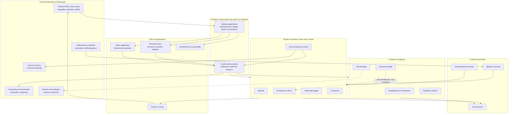
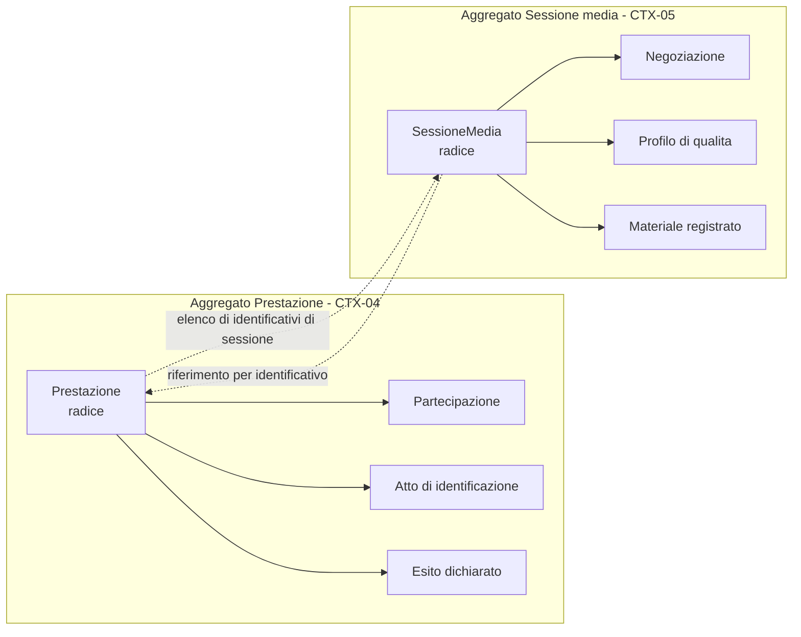
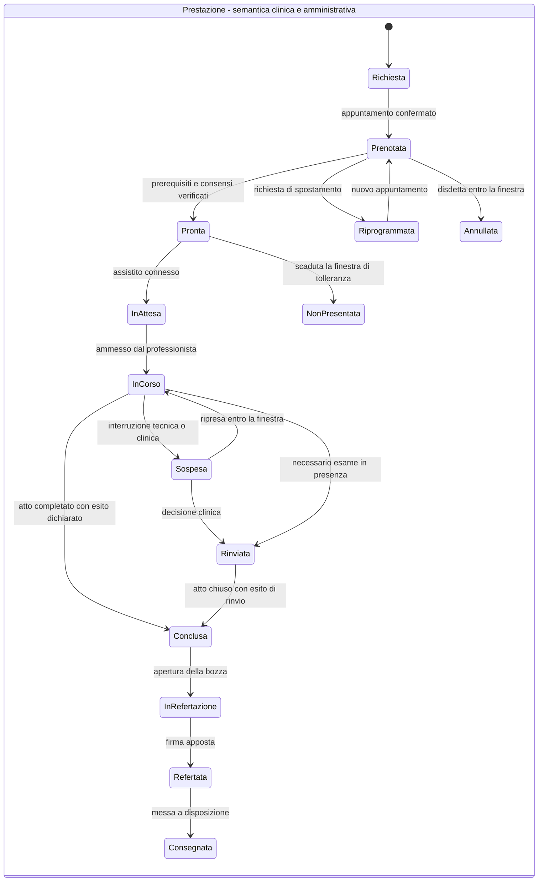
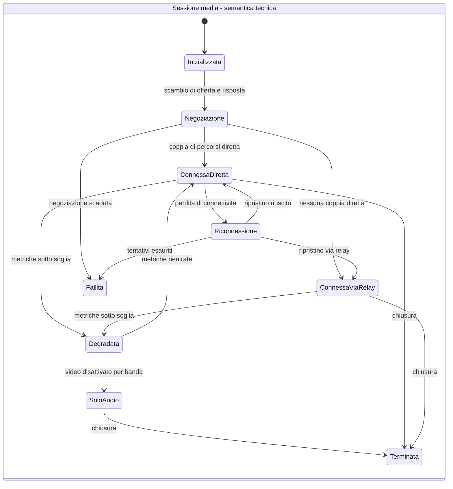
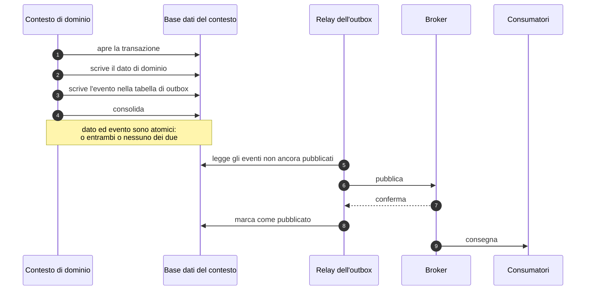
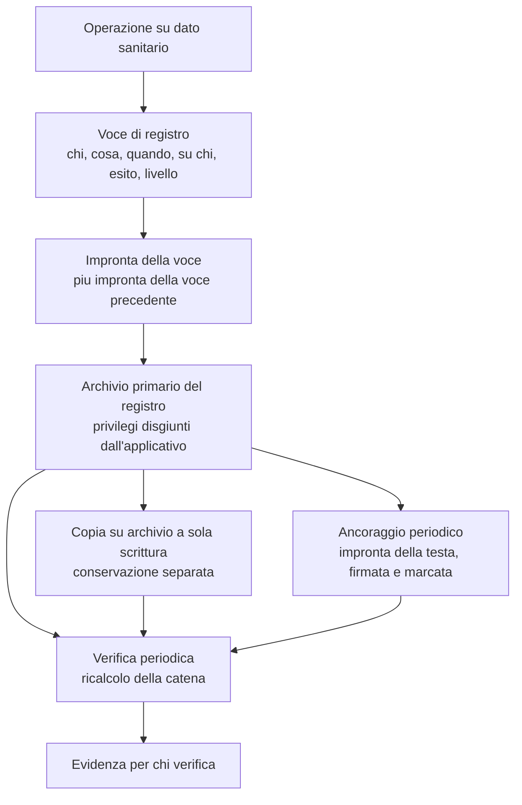
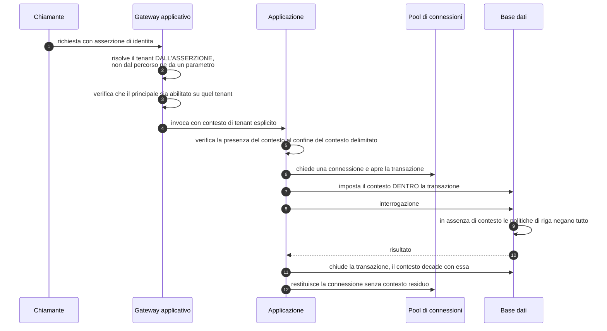

# L'architettura del progetto

Questo modulo serve a una cosa sola: darti **la forma del sistema in testa** prima che tu apra
un file di codice o un documento di specifica. Non ti insegna a progettare architetture - quella
è materia del [modulo 11](11-fondamenti-informatici.md) - e non sostituisce l'area
architetturale del progetto, che sta in [`docs/02_architecture/`](../02_architecture/00-indice.md)
ed è dieci volte più dettagliata di quanto leggerai qui.

Fa una cosa che quell'area non fa: **ricostruisce il ragionamento**. L'area architetturale
enuncia una decisione, la argomenta contro le alternative e ne dichiara il prezzo, ma presuppone
che tu sappia già perché quella domanda si poneva. Qui si parte da prima della domanda.

> **Nessun dato reale compare in questo modulo.** Tutti gli esempi sono sintetici e i nomi di
> persona, quando servono, sono di fantasia. Nessuna azienda, prodotto commerciale o marchio di
> terzi è nominato: si dice sempre «l'integratore», «un gestionale sanitario cloud», «un sistema
> EHR di terze parti», «un'infrastruttura documentale».

---

## 0. Come si legge questo modulo

### 0.1 Che cosa presuppone

Questo modulo **non ripete** i moduli che lo precedono, e alcuni di essi sono prerequisiti reali,
non consigliati.

| Presuppone | Dove sta | Che cosa te ne serve qui |
|---|---|---|
| Sistemi distribuiti, consistenza, transazioni, saga | [11 - Fondamenti informatici](11-fondamenti-informatici.md) | Sapere che cosa significa «il guasto è parziale» e perché non esiste una transazione che comprende due sistemi |
| Aggregato, invariante, contesto delimitato, linguaggio ubiquo | [11 §7](11-fondamenti-informatici.md#7-domain-driven-design) | Il vocabolario. Qui si spiega **quali sono** in Telemedic, non che cosa siano in generale |
| Doppia scrittura, outbox, idempotenza, consegna | [11 §5](11-fondamenti-informatici.md#5-la-doppia-scrittura-e-loutbox-transazionale) e [11 §6](11-fondamenti-informatici.md#6-consegna-e-idempotenza) | Il meccanismo. Qui si spiega **perché il progetto lo ha adottato** e che cosa costa |
| Impronte crittografiche, firma, catene di hash | [12 §5](12-crittografia-e-sicurezza.md#5-funzioni-di-hash) | Perché una catena di impronte rende rilevabile una manomissione |
| Ogni protocollo che il sistema parla | [13 - I protocolli, uno per uno](13-protocolli.md) | Qui i protocolli non si spiegano: si dice **dove** stanno nell'architettura |
| Che cos'è un dato sanitario e perché ha un regime proprio | [03 - Il dato clinico](03-il-dato-clinico.md) | Metà delle scelte architetturali di questo sistema discende da lì |
| Che cos'è una televisita e in che cosa differisce da un teleconsulto | [02 - Le prestazioni di telemedicina](02-prestazioni-di-telemedicina.md) | Il dominio che l'architettura deve reggere |
| Perché questo software ha vincoli che altrove non esistono | [15 - Il quadro regolatorio da zero](15-regolatorio-da-zero.md) | Le forze normative di §2 |

Se non hai letto il modulo 11, **leggilo prima di questo**. Non è una raccomandazione di
cortesia: da §6 in avanti questo modulo usa «outbox», «idempotente», «aggregato» e «coerenza
finale» come termini noti, e senza di essi le sezioni diventano un elenco di scelte
inspiegabili.

### 0.2 Che cosa non troverai qui

| Non c'è | Sta in |
|---|---|
| L'elenco dei requisiti funzionali | `docs/03_functional/` |
| La specifica del protocollo di segnalamento e dei formati di messaggio | `docs/04_protocols/` |
| Il modello delle minacce, le misure crittografiche, la configurazione del relay | `docs/06_security/` |
| I contratti verso i sistemi terzi, l'SDK, il componente incorporabile | `docs/07_integration/` |
| Le scelte di libreria, i moduli di build, le convenzioni di codice | `docs/01_technical/` |
| Il fascicolo tecnico, la gestione del rischio, l'ingegneria dell'usabilità | `docs/08_compliance/` |
| Le date | `docs/09_roadmap/` |

E soprattutto: **non c'è il dettaglio**. Ogni sezione di questo modulo ha un capitolo
corrispondente nell'area architetturale che la sviluppa fino in fondo, e il rinvio è sempre
esplicito. Se stai per scrivere codice, questo modulo non ti basta.

### 0.3 Il patto di lettura

Ogni scelta descritta qui è presentata in tre tempi, sempre nello stesso ordine:

1. **Il problema**, formulato prima che si sappia come si risolve.
2. **La scelta**, con le alternative che sono state scartate.
3. **Il prezzo**, cioè che cosa si è accettato di pagare.

Il terzo tempo non è una concessione all'onestà: è il modo in cui si capisce se una scelta è
stata compresa. Un'architettura descritta senza ciò che costa non è stata capita, è stata
memorizzata - e chi l'ha memorizzata la aggira alla prima occasione in cui il costo si presenta.

---

## 1. Che cosa è Telemedic, in una frase

Prima di parlare di forma, serve sapere che cosa la forma deve reggere.

> **Telemedic è un componente di telemedicina destinato a vivere dentro il sistema informativo
> di qualcun altro.**

Non è un portale. Non è una cartella clinica. Non è il punto di ingresso dell'utente. Non è il
detentore dell'anagrafica dei pazienti. È il pezzo che manca a un gestionale sanitario, a una
struttura pubblica o a un'infrastruttura regionale quando la prestazione va erogata a distanza -
e che deve inserirsi **senza chiedere a nessuno di cambiare ciò che ha già**.

Questa frase, e non lo stack tecnologico, è ciò che determina l'architettura. Vale la pena
soffermarsi su quanto è insolita. La maggior parte dei sistemi che tratta dati sanitari è
progettata per essere **il** sistema: possiede l'anagrafica, possiede l'identità, possiede il
percorso dell'utente, e chi si integra si adatta. Telemedic è progettato per essere
l'**ospite**. Da questa inversione discendono tre conseguenze che nessuna scelta successiva può
contraddire, e che è utile fissare subito perché ricorrono in ogni sezione di questo modulo.

**Prima: il sistema non possiede l'identità.** La persona davanti allo schermo è già stata
autenticata altrove - dal fornitore di identità dell'integratore, oppure dalla federazione
nazionale delle identità digitali. Telemedic riceve un'affermazione («questo è il dottor Rossi,
di questa organizzazione, autenticato a questo livello») e la trasforma in un contesto
autorizzativo interno. Non emette credenziali primarie per il cittadino e non impone un secondo
accesso. Il problema dell'identità, qui, è un problema di **propagazione fidata** e di
**rappresentazione della delega**, non di gestione degli utenti. Chi arriva da un prodotto che
ha una propria schermata di accesso trova questa la differenza più spiazzante.

**Seconda: il sistema non possiede il dato anagrafico.** Il paziente, il professionista e
l'appuntamento esistono già nel sistema di origine, con i loro identificativi. Telemedic lavora
**per riferimento**: conserva ciò che serve a riconoscere e a contattare, non ciò che serve a
curare, e non costruisce un indice che riconcilia le identità provenienti da sistemi diversi. Ne
discende una regola che troverai ovunque nel modello dati: **nessun identificatore esterno è
chiave primaria**, e la stessa persona fisica presente in due organizzazioni diverse è, per
costruzione, due entità distinte e non collegate.

**Terza: il contenuto clinico deve tornare indietro.** Il referto redatto durante la prestazione
non può restare confinato in Telemedic: deve confluire nella cartella del sistema di origine e,
dove previsto e consentito, nell'infrastruttura documentale nazionale o regionale. La
restituzione non è quindi un dettaglio di infrastruttura da nascondere in un adattatore: è un
**processo di dominio con esito osservabile**, che può fallire, che va ritentato, e il cui
fallimento definitivo deve finire davanti a un essere umano.

A queste tre se ne aggiunge una quarta, di natura diversa e più pesante: il sistema tratta
**dati relativi alla salute** e opera in un perimetro in cui la **dimostrabilità** conta quanto
la funzione.

- Non basta che un accesso sia lecito: deve essere dimostrabile a distanza di anni, davanti a
  qualcuno che non si fida della parola dell'operatore.
- Non basta che un documento sia corretto: deve essere immodificabile una volta firmato, e la
  sua eventuale correzione deve lasciare traccia della versione superata.
- Non basta che i dati di due clienti siano separati: la separazione deve reggere **all'errore
  di programmazione**, non solo all'intenzione del programmatore.

Tienile a mente. Ogni volta che in questo modulo una scelta sembra sproporzionata rispetto al
problema, la ragione sta quasi sempre in una di queste quattro.

---

## 2. La forma del sistema, e le forze che gliel'hanno data

### 2.1 Perché non si parte dallo stile architetturale

C'è un modo diffuso e sbagliato di raccontare un'architettura: si annuncia lo stile - «è a
microservizi», «è esagonale», «è a eventi» - e da lì si deduce tutto il resto. È sbagliato
perché lo stile è un **effetto**, non una causa. Uno stile scelto prima di conoscere le forze in
gioco produce un sistema che ha la forma giusta per i problemi di qualcun altro.

L'area architetturale di Telemedic parte dal verso opposto: elenca **sette forze**, dichiara
l'ordine in cui si risolvono quando confliggono, e ricava la forma da lì. Quelle sette forze
sono riassunte in [`01 - Visione architetturale`](../02_architecture/01-visione-architetturale.md);
qui vengono spiegate una per una a chi non le ha mai incontrate, perché è la parte del sistema
che più spesso viene saltata e più spesso serve.

### 2.2 Prima forza - La dimostrabilità viene prima di tutto

**Il problema.** Immagina che fra tre anni una persona chieda alla struttura sanitaria che l'ha
in cura: «chi ha letto il mio referto?». Oppure che un'autorità di controllo chieda di
dimostrare che a un certo accesso corrispondeva una finalità legittima. Oppure che un
professionista contesti di aver mai aperto una cartella. In tutti e tre i casi la risposta è una
riga in un registro, e in tutti e tre i casi la domanda vera non è «che cosa dice il registro»
ma **«perché dovrei credere al registro»**.

La differenza fra le due domande è enorme e viene sistematicamente sottovalutata. Un registro a
cui si crede sulla parola dell'operatore non serve nel momento in cui serve davvero, che è
precisamente il momento in cui qualcuno sospetta dell'operatore.

**Il fraintendimento da cui bisogna liberarsi.** Quasi tutti i sistemi che trattano dati
sanitari risolvono il problema con il **versionamento automatico delle entità**: il livello di
persistenza mantiene, accanto a ogni tabella, una tabella gemella che conserva la storia delle
modifiche. È comodo, costa quasi nulla e sembra rispondere al requisito.

Non risponde. Le tabelle di storico **sono tabelle come le altre**: chi ha accesso in scrittura
alla base dati le modifica esattamente come modifica le altre. Il versionamento **versiona, non
rende immutabile**. È il fraintendimento più diffuso dell'industria e in questo progetto è
vietato attenuarlo in qualunque documento.

**Che cosa ne discende.** Serve una **catena di impronte crittografiche** e una **conservazione
separata dal sistema che genera gli eventi**. Non è configurazione: è un componente, ed è per
ammissione della decisione stessa che lo impone lo sforzo maggiore dell'intero catalogo di
sicurezza. Il meccanismo è spiegato in §7 di questo modulo e sviluppato in
[`07 - Tracciamento e registro immutabile`](../02_architecture/07-tracciamento-e-registro-immutabile.md).

**Perché è la prima forza.** Perché è **retroattiva**. Un registro costruito male non si ripara
a posteriori: gli eventi già scritti non acquistano integrità dimostrabile dopo il fatto. Puoi
correggere un'interfaccia utente sbagliata; non puoi rendere dimostrabili accessi avvenuti in un
periodo in cui il meccanismo non c'era.

**Il prezzo.** La scrittura del registro sta sul **percorso critico** di ogni operazione su dato
clinico: la sua latenza si somma a quella dell'operazione, e se il registro non è scrivibile
l'operazione clinica fallisce. È una scelta severa e deliberata, e §7.5 spiega perché
l'alternativa è peggiore.

### 2.3 Seconda forza - Il confine fra veicolo e interpretazione

**Il problema.** Il [modulo 15](15-regolatorio-da-zero.md) spiega che la qualificazione di un
software come dispositivo medico, e la sua classe di rischio, dipendono dalla **destinazione
d'uso dichiarata** e dal fatto che il software si limiti a trasmettere informazioni oppure le
**interpreti**. Un sistema che registra ciò che un medico scrive è una cosa; un sistema che
produce esso stesso informazione clinica è un'altra, con un percorso di conformità di ordini di
grandezza più pesante.

Questo confine è la seconda forza, e la sua caratteristica è che **non è una postura
comunicativa: è una proprietà strutturale che deve essere leggibile nel codice**. Non si difende
scrivendo in un documento «il sistema non interpreta»: si difende facendo in modo che
interpretare sia impossibile.

**Che cosa ne discende, senza margine di discrezionalità.**

- **Nessuna soglia clinica è cablata nel codice.** Non esiste un valore numerico scritto da un
  programmatore che decida quando una misura è anomala. Le soglie sono configurazione **per
  assistito**, sempre attribuite a un professionista identificato, con una validità temporale.
  È il vincolo **V-02** del progetto.
- **Nessun campo di documento clinico è popolato da testo prodotto dal sistema.** Nessun
  riepilogo automatico, nessuna conclusione, nessun codice diagnostico dedotto. Il sistema
  struttura e conserva ciò che il professionista scrive.
- **Il telemonitoraggio produce allerte da configurazione, mai giudizi**, e ogni allerta è
  sottoposta a revisione umana senza alcun effetto automatico sul percorso di cura.
- **Le metriche di qualità del canale non sono osservazioni cliniche.** Il ritardo di
  trasmissione di un pacchetto non è un dato sanitario e non entra nella cartella di nessuno.

**Il caso limite che spiega tutto.** Sarebbe utilissimo, per l'esperienza d'uso, che il sistema
proponesse soglie predefinite «ragionevoli» quando un professionista configura un piano di
monitoraggio: risparmierebbe tempo e ridurrebbe gli errori di digitazione. È stato **rifiutato**.
Nel momento in cui il sistema propone un valore clinico, ha smesso di registrare una decisione
professionale e ha cominciato a produrre un giudizio proprio. Il campo della soglia, nel
prodotto, parte **vuoto e obbligatorio**, e non viene precompilato nemmeno con il valore
dell'ultimo piano dello stesso assistito.

**Il prezzo.** Attrito d'uso reale, riconosciuto e accettato. Un professionista che configura
dieci piani simili li configura dieci volte. Il progetto lo compensa mostrando **riferimenti
attribuiti, in sola lettura, con un'azione esplicita di copia** - che è una cosa diversa dalla
precompilazione, perché la decisione resta un atto.

### 2.4 Terza forza - Integrabilità totale

**Il problema.** Se il sistema è un ospite, ogni sua capacità deve essere raggiungibile da chi
lo ospita. Un integratore che ha già la propria interfaccia non userà la nostra; un integratore
che deve automatizzare un flusso non può farlo cliccando.

**La regola.** **Nessuna capacità del sistema è raggiungibile solo dall'interfaccia utente.** È
il vincolo **V3** del progetto.

**Che cosa ne discende, e non è ovvio.** La conseguenza non è «esporre tutto in REST». È che il
**livello applicativo non può contenere logica di dominio**. Se contenesse una regola - poniamo,
«un documento non si firma se il consenso non è vigente» - quella regola esisterebbe nel percorso
dell'interfaccia utente e andrebbe riscritta nel percorso dell'interfaccia applicativa. Due
implementazioni della stessa regola divergono sempre, e la divergenza si scopre quando qualcuno
usa il percorso meno provato.

Il modello di dominio è quindi **l'unico luogo in cui vivono le invarianti**, e ogni piano di
esposizione è un adattatore sottile sopra di esso.

**Il prezzo.** Ogni capacità nuova costa il doppio: la funzione e il suo contratto pubblico. Il
progetto lo ha formalizzato con una regola operativa: *l'area che introduce una capacità
introduce anche il contratto; non è lavoro rinviabile*.

### 2.5 Quarta forza - Sovranità e sostituibilità

**Il problema.** Il progetto dichiara che i dati clinici non transitano per servizi stabiliti
fuori dall'Unione europea, e supporta tre profili di collocazione: Unione europea, territorio
italiano, cloud qualificato. Fin qui suona come un argomento di posizionamento commerciale.

**Perché non lo è più.** La normativa italiana sulla sicurezza delle reti obbliga il soggetto
che installa a **dichiarare nominativamente a un'autorità i propri fornitori rilevanti**, con
ragione sociale, codice fiscale e **Paese della sede legale**. La sovranità cessa quindi di
essere un argomento e diventa **un dato che il cliente deve comunicare a un'autorità**, e che il
progetto deve mettere il cliente in condizione di produrre.

**Che cosa ne discende.** Una regola sola, e vale ovunque: **ogni dipendenza esterna sta dietro
un'interfaccia di progetto e ha un ripiego dichiarato**. Vale per il servizio terminologico, per
il servizio di firma, per il recapito delle notifiche, per il broker di eventi. E il corollario,
che è la parte affilata: **dove il ripiego non esiste, il percorso non è principale**.

**Il caso che illustra il principio meglio di ogni altro.** Il servizio terminologico - il
componente che risolve e valida i codici clinici - potrebbe essere ospitato fuori dall'Unione.
La soluzione adottata non è collocarlo altrove: è **non trasportare il dato**. Le interrogazioni
verso quel servizio non portano identificativi dell'assistito, non portano contesto clinico e
non sono correlabili a una persona. **La sovranità di questa dipendenza si soddisfa per assenza
di dato, non per collocazione.** È un modo di ragionare che vale la pena interiorizzare, perché
si applica molto più spesso di quanto sembri.

**Il prezzo.** Ogni interfaccia di astrazione è codice in più, e ogni ripiego è un secondo
comportamento da provare. Un sistema che chiama direttamente ciò che gli serve è più corto.

### 2.6 Quinta forza - Isolamento fra titolari autonomi

**Il problema.** Il progetto esiste in due assetti: **servizio gestito** multi-organizzazione e
**installazione presso il cliente**, con lo stesso codice. Nel servizio gestito le organizzazioni
ospitate non sono divisioni della stessa azienda: sono **titolari del trattamento giuridicamente
autonomi**.

**Perché la distinzione cambia tutto.** In un prodotto multi-cliente ordinario, una fuga di dati
fra clienti è un difetto: spiacevole, correggibile, imbarazzante. Qui è una **comunicazione di
dati relativi alla salute fra soggetti giuridici distinti**, cioè un evento con conseguenze
proprie per chi la subisce, per chi la riceve e per chi gestisce l'infrastruttura.

Il livello di garanzia richiesto non è quindi «assenza di difetti noti»: è **separazione
strutturale**, che regge anche all'errore di programmazione. La differenza fra le due cose è il
contenuto di §8.

**Una proprietà del dominio che rende tutto più severo.** In questo sistema **non esiste una
categoria di dati neutri**. Il fatto che una persona abbia un appuntamento con una determinata
branca specialistica è già un dato relativo alla salute: rivela che si sta curando, e di che
cosa. Non c'è quindi un sottoinsieme di tabelle «amministrative» da isolare con meno rigore.

### 2.7 Sesta forza - Il tempo reale non tollera il percorso lungo

**Il problema.** Una videochiamata clinica ha un budget di latenza che si misura in decine di
millisecondi. Lo scambio di messaggi che stabilisce la connessione - la **segnalazione**,
spiegata nel [modulo 08](08-webrtc-da-zero.md) - ha inoltre un requisito che gli altri messaggi
del sistema non hanno: i candidati di rete devono arrivare **esattamente una volta e nell'ordine
in cui sono stati emessi**, altrimenti la negoziazione fallisce in modo intermittente e non
diagnosticabile.

**Che cosa ne discende.** Un confine netto: **il piano del tempo reale e il piano dei fatti
persistenti sono separati**, hanno meccanismi diversi, e ciò che nasce nell'uno entra nell'altro
**solo come fatto già accaduto**. Il traffico di negoziazione resta dov'è; «la sessione è stata
avviata» attraversa il confine.

**Il prezzo.** Il sistema ha **due meccanismi di comunicazione** invece di uno: quello generale a
eventi e quello del tempo reale, con una propria macchina a stati e una propria strategia di
distribuzione del carico. È un secondo sistema da capire e da provare, ed è dichiarato come tale
invece di essere nascosto sotto un'astrazione unificante che non reggerebbe.

### 2.8 Settima forza - Accessibilità e uso reale come requisiti funzionali

**Il problema.** Il paziente tipico di una televisita è una persona anziana, su uno smartphone,
su rete mobile, spesso senza assistenza. Il professionista tipico è sotto pressione di tempo.
Un'interfaccia progettata per un utente competente su un buon collegamento non è
«ottimizzabile in seguito»: è **inutilizzabile dalla popolazione di riferimento**.

Nel progetto l'accessibilità non è una rifinitura: è un **criterio di accettazione di ogni
schermata**, e - per effetto della disciplina sui dispositivi medici - è anche una misura di
controllo del rischio, perché un errore d'uso è un difetto di progettazione e non colpa
dell'utente.

**L'impatto architetturale, che è meno ovvio di quanto sembri.** Riguarda tre punti, e nessuno
dei tre è un problema di fogli di stile:

1. **La degradazione comprensibile è comportamento di dominio.** «Audio prima del video,
   sempre», la ripresa della sessione, il ripiego dichiarato: sono transizioni di stato
   modellate, non ottimizzazioni opportunistiche del livello di trasporto.
2. **Il componente incorporabile eredita i vincoli.** Un integratore che incorpora Telemedic
   nella propria interfaccia **non deve poterne degradare l'accessibilità**: le proprietà di
   tema sono un insieme chiuso e versionato, validate con verifica del contrasto, e una
   configurazione che degrada l'accessibilità **viene rifiutata al salvataggio**. Alcuni
   elementi non sono tematizzabili né occultabili in nessun caso: l'indicatore di registrazione
   in corso, i testi di consenso, l'esito della verifica delle chiavi, i messaggi di errore
   clinico, l'indicatore dello stato di cifratura.
3. **L'internazionalizzazione è strutturale.** In particolare, le stringhe di interfaccia del
   progetto sono separate **per costruzione** dalle etichette ufficiali delle terminologie
   cliniche - e la ragione, sorprendentemente, non è di ordine ma di licenza: §9.4 lo spiega.

### 2.9 L'ordine fra le forze

Le sette forze confliggono, e un'architettura che non dichiara come si risolvono i conflitti li
risolve caso per caso, cioè in modo incoerente. L'ordine adottato è quello in cui le hai appena
lette: **la dimostrabilità precede il confine regolatorio, che precede l'integrabilità, che
precede la sovranità, e così via**.

Un esempio concreto di che cosa significhi: la scrittura del registro degli accessi è bloccante
e aggiunge latenza a ogni operazione clinica. Se l'ordine fosse invertito, e la prontezza
precedesse la dimostrabilità, la scelta sarebbe stata di scrivere il registro in modo asincrono
e di accettare una piccola finestra di accessi non tracciati. Sarebbe stato più veloce. E la
finestra di accessi non tracciati avrebbe coinciso, statisticamente, con i momenti di maggiore
carico - cioè con gli incidenti, cioè con l'unico momento in cui il registro serve.

### 2.10 La forma che ne risulta

Quattro letture di questo disegno meritano di essere esplicitate, perché sono quattro proprietà
del sistema e non quattro dettagli grafici.

**Il nucleo non parla con l'esterno.** Ogni traduzione da e verso un formato di terzi avviene
nel **livello anticorruzione** della frontiera - il nome tecnico per «il codice che traduce fra
due linguaggi al confine, in modo che nessuno dei due contamini l'altro». È la condizione che
consente due cose insieme: sostenere più integratori contemporaneamente senza avere logica
specifica per partner dentro il dominio, e sopravvivere al cambio di versione di uno standard
esterno senza toccare le invarianti.

**La sessione media non tocca il contenuto clinico.** Il collegamento fra il contesto della
sessione media e quello della prestazione passa per **soli identificativi ed eventi di stato**.
È la traduzione strutturale del confine fra veicolo e interpretazione, e insieme la condizione
che rende la sessione media sostituibile con un'altra tecnologia di trasporto senza toccare il
dominio clinico.

**Il tracciamento riceve da tutti e non alimenta nessuno.** Nessun percorso applicativo legge
dal registro per prendere una decisione. Il registro è **una destinazione, non una sorgente**:
questa è precisamente la proprietà che consente di conservarlo separatamente e di renderlo
append-only senza compromessi. Se un percorso applicativo dovesse leggerlo, la conservazione
separata diventerebbe una dipendenza di runtime e la separazione dei privilegi diventerebbe
impossibile.

**Il servizio terminologico è tratteggiato.** È l'unica dipendenza esterna del disegno che il
sistema deve poter **perdere restando pienamente operativo**. Non è una gentilezza verso chi
installa: è il vincolo **V-03** del progetto, e §9.4 spiega perché è così importante.

### 2.11 Che cosa questa forma costa

Un'architettura di questo tipo non è gratis, e le sue tre voci di costo principali sono:

| Costo | In che cosa consiste |
|---|---|
| **Uno strato di traduzione in più** | Nulla di ciò che arriva dall'esterno entra nel dominio nella sua forma originale. Ogni formato esterno ha un mappatore, con le sue prove. Chi vuole «solo salvare la risorsa così com'è» trova questa la regola più fastidiosa del progetto |
| **Coerenza finale fra i contesti** | Le operazioni che attraversano più contesti sono realizzate con eventi e compensazioni, non con transazioni distribuite. Esistono finestre in cui due contesti hanno una visione diversa dello stesso fatto: per esempio la prestazione è conclusa e il sistema di origine non lo sa ancora |
| **Due piani di esposizione** | Il piano clinico e il piano applicativo espongono lo stesso dominio con due grammatiche diverse: due contratti da mantenere, due insiemi di prove, il rischio di divergenza semantica |

Nessuno dei tre è nascosto. Il secondo, in particolare, va compreso bene: **la coerenza immediata
esiste dentro un aggregato, non fra contesti**. I confini degli aggregati sono scelti in modo
che ogni invariante clinicamente rilevante sia interna a un solo aggregato - e ogni finestra di
divergenza ha una durata dichiarata e un meccanismo di riconciliazione visibile a un operatore.

---

## 3. Che cos'è un contesto delimitato, spiegato da zero

### 3.1 Il problema, prima della soluzione

Immagina di dover modellare «il paziente» in un sistema sanitario. Sembra facile: una persona,
un nome, una data di nascita, un identificativo. Cominci a scrivere.

Poi arriva il modulo dell'agenda e ti chiede di aggiungere le preferenze di contatto e i canali
su cui la persona accetta i promemoria. Poi arriva la fatturazione e chiede l'esenzione, il
regime di compartecipazione alla spesa, l'indirizzo di fatturazione. Poi arriva la
documentazione clinica e chiede la lista dei problemi attivi, le allergie, le terapie in corso.
Poi arriva l'autorizzazione e chiede chi può accedere alla persona, con quali deleghe, con quali
oscuramenti. Poi arriva l'integrazione e chiede di conservare gli identificativi che ciascun
sistema esterno usa per la stessa persona.

Dopo sei mesi hai un'entità `Paziente` con ottanta campi, di cui **ogni consumatore usa dieci e
ignora settanta**. Ogni modifica a quell'entità tocca tutti i moduli. Ogni caricamento la porta
in memoria per intero. Ogni discussione su «che cosa significa questo campo» ha risposte diverse
a seconda di chi la fa. E soprattutto: il campo *esenzione per patologia* - che ti sembrava
amministrativo - **rivela la patologia**, è un dato particolare a tutti gli effetti, e sta
nella stessa entità che il modulo dell'agenda carica per mandare un promemoria via SMS.

Questo è l'esito prevedibile del **modello unico**, ed è l'errore più costoso che si possa
commettere in questo dominio. Non è costoso perché è brutto: è costoso perché **non è
correggibile con una modifica locale**. Quando l'entità unica esiste, ogni modulo vi ha
costruito sopra, e separarla richiede di toccare tutto contemporaneamente.

Il punto da cui bisogna partire è questo:

> **«Paziente» non è un concetto. Sono almeno cinque concetti diversi che condividono il nome.**
>
> Per l'agenda è un **titolare di appuntamento**: serve sapere come contattarlo e quali canali
> accetta. Per l'autorizzazione è un **soggetto interessato**: serve sapere chi può vederlo e chi
> l'ha delegato. Per la documentazione clinica è il **soggetto dell'atto**: serve la sua storia.
> Per la rendicontazione è un **assistito con una copertura**: serve il regime. Per
> l'integrazione è **una collezione di identificativi altrui**.
>
> Costringere questi cinque a essere lo stesso oggetto significa costruire un oggetto che non
> serve bene a nessuno dei cinque.

### 3.2 La definizione

Un **contesto delimitato** (in inglese *bounded context*) è un confine esplicito dentro il quale
**un termine ha un solo significato** e un modello è coerente.

Tre proprietà lo definiscono, e vale la pena enunciarle in negativo perché è così che si
riconosce quando un confine è stato violato:

1. **Dentro il confine il linguaggio è univoco.** Se dentro lo stesso contesto la parola
   «sessione» significa due cose a seconda della classe, il confine è nel posto sbagliato.
2. **Il modello è privato.** Nessun altro contesto legge le tabelle di questo, nessun altro
   contesto conosce la forma interna dei suoi tipi. Ciò che esce è un **contratto**.
3. **La traduzione avviene al confine, esplicitamente.** Quando due contesti devono parlarsi e i
   loro linguaggi divergono - ed è il caso normale, perché la divergenza è la **ragione** del
   confine - la traduzione è codice dedicato, provato, collocato nel contesto che ne ha bisogno.

La conseguenza pratica è che nel sistema esistono **più modelli del paziente**, uno per contesto,
ciascuno con i soli attributi che servono a quel contesto, collegati fra loro da un
identificativo. Non è duplicazione: è **specializzazione**. La duplicazione sarebbe avere due
copie dello stesso modello; qui si hanno modelli **diversi** dello stesso soggetto reale.

> La teoria generale - che cos'è un aggregato, che cos'è un linguaggio ubiquo, quali sono i
> modelli di relazione fra contesti - è nel
> [modulo 11 §7](11-fondamenti-informatici.md#7-domain-driven-design). Questo modulo dice quali
> sono i contesti di Telemedic e perché passano di lì.

### 3.3 Perché in questo dominio i confini non sono opzionali

In molti sistemi i contesti delimitati sono una buona pratica: aiutano, ma un modello unico ben
tenuto potrebbe reggere. Qui non è così, e la ragione ha tre nomi.

**La frattura di linguaggio.** In questo dominio le parole chiave cambiano significato
attraversando il sistema, e non in modo sottile:

| Parola | Significato A | Significato B | Significato C |
|---|---|---|---|
| **Sessione** | L'atto clinico (per il professionista) | La connessione audio-video (per l'infrastruttura) | L'unità rendicontabile (per l'amministrazione) |
| **Consenso** | L'adesione all'atto sanitario | La base del trattamento dei dati | L'autorizzazione alla registrazione |
| **Prestazione** | La richiesta | L'esecuzione | L'addebito |
| **Registrazione** | La cattura audiovisiva | L'atto di registrare un fatto nel sistema | - |
| **Disponibile** | Pubblicato | Prenotabile da un dato canale | Non ancora occupato |
| **Esito** | Dove si trova il contatto (stato) | Che cosa è successo (esito) | - |

Ognuna di queste ambiguità ha già prodotto difetti in sistemi reali. La più insidiosa è
l'ultima: **stato ed esito non sono la stessa cosa**, e due esiti diversi possono condividere lo
stato terminale avendo effetti amministrativi **opposti** - la mancata presentazione
dell'assistito e il fallimento tecnico a lui attribuibile finiscono entrambi in «terminato» e si
rendicontano in modo diverso. Collassarli in un unico campo è vietato dal progetto.

**La frattura di ritmo.** Le parti del sistema cambiano per ragioni diverse e con frequenze
diverse:

- la documentazione clinica cambia quando cambia **la normativa sanitaria**;
- il trasporto media cambia quando cambiano **i protocolli di rete e i motori dei browser**;
- la federazione di identità cambia quando cambiano **le regole tecniche nazionali**;
- il telemonitoraggio cambia quando cambia **la pratica clinica**.

Componenti che cambiano insieme devono stare insieme; componenti che cambiano per ragioni
diverse devono poter essere rilasciati separatamente. Metterli nello stesso contesto significa
che un aggiornamento del trasporto media obbliga a riverificare la documentazione clinica -
cioè, in un percorso regolatorio, a rifare prove che non c'era ragione di rifare.

**La frattura di regime di protezione.** Questa è la frattura che chi arriva da un dominio non
sanitario non si aspetta. Il contenuto clinico, l'evidenza di consenso, la registrazione
audiovisiva e il registro degli accessi hanno regimi di accesso, di conservazione e di
cancellazione **incompatibili fra loro**:

- il registro degli accessi **non si cancella** e non si modifica, per definizione;
- il contenuto clinico **si cancella** in presenza dei presupposti di legge;
- la registrazione audiovisiva ha una scadenza propria, configurata dal titolare;
- l'evidenza di consenso sopravvive al dato a cui si riferisce, perché serve a dimostrarne la
  liceità.

Tenerli nello stesso contesto costringerebbe ad applicare a tutti il regime più severo -
rendendo il sistema inutilizzabile, perché nulla sarebbe mai cancellabile - oppure il più
permissivo, rendendolo illecito. Non esiste una via di mezzo: **è una frattura, non un
compromesso**.

### 3.4 Che cosa un contesto delimitato non è

Tre confusioni ricorrenti, tutte e tre presenti nel progetto come avvertenze esplicite.

**Non è un microservizio.** Il contesto delimitato è un confine **di modello e di linguaggio**;
la scelta di distribuire o meno i contesti in processi separati è di dispiegamento e appartiene
a un'altra decisione. Telemedic sostiene esplicitamente **un assetto a processo unico** per
l'installazione presso il cliente e **un assetto distribuito** per il servizio gestito, con lo
stesso codice. È possibile solo perché i confini sono di modello e non di rete. Se i confini
fossero definiti dalle chiamate di rete, i due assetti sarebbero due prodotti.

**Non è un archivio dati separato.** La regola è che nessun contesto legga i dati di un altro.
Che gli schemi stiano nella stessa istanza di base dati o in istanze diverse è una scelta
operativa, purché la separazione degli accessi sia **imposta dai privilegi** e non affidata alla
disciplina di chi scrive le interrogazioni.

**Non è un'organizzazione del codice per strato.** Al contrario: l'organizzazione dei moduli
segue i contesti, non i tipi di componente. Le classi che servono la prestazione clinica stanno
insieme, non divise fra un pacchetto di controllori, uno di servizi e uno di entità. È una
scelta di struttura del codice, ma discende direttamente da qui.

### 3.5 Come si dicono le relazioni fra contesti

Quando due contesti devono parlarsi, il **verso della dipendenza** e il grado di negoziabilità
non sono gli stessi in tutti i casi. Il vocabolario che il progetto usa è quello standard della
progettazione guidata dal dominio, e ti servirà per leggere la mappa di §4.

| Relazione | Che cosa significa | Esempio in Telemedic |
|---|---|---|
| **Conformista** | Un contesto si adegua al modello dell'altro senza poterlo negoziare | Identità e accessi verso la federazione nazionale: lo schema dell'asserzione è imposto dall'esterno |
| **Cliente-fornitore** | Il cliente ha bisogno del fornitore; il fornitore non conosce il cliente e può evolvere | La prestazione consuma l'appuntamento dall'agenda |
| **Partnership** | I due evolvono insieme e ogni cambiamento è concordato. È la relazione **più costosa** | Prestazione clinica e consenso: il secondo condiziona l'esistenza del primo |
| **Livello anticorruzione** | Uno strato di traduzione che impedisce al modello esterno di penetrare | Interoperabilità in uscita verso tutti i contesti di dominio |
| **Linguaggio pubblicato** | Un contratto versionato e stabile, pensato per essere consumato da molti | Gli eventi che tutti i contesti pubblicano al tracciamento |
| **Servizio ospitante aperto** | Un contratto unico e stabile offerto a molti consumatori, che nasconde la diversità delle fonti | Il gateway terminologico verso i contesti clinici |

Due note che nel progetto sono vincolanti.

**La partnership si dichiara di rado, e per una ragione.** Un servizio consumato in relazione
cliente-fornitore può essere saltato quando è lento o indisponibile; una partnership no. Il
consenso è in partnership con la prestazione perché è **condizione di esistenza dell'atto**: se
la sua verifica non è possibile, l'atto non si svolge. **Nessun percorso «degradato senza
verifica del consenso» è ammesso**, in nessuna circostanza.

**Il linguaggio pubblicato verso il tracciamento ha un'esigenza probatoria, non di comodità.**
Gli eventi di tracciamento devono essere leggibili **a distanza di anni**, da chi verifica, con
strumenti che oggi non esistono. È l'unico contesto in cui la retrocompatibilità è un obbligo di
prova.

### 3.6 Il prezzo dei confini

I confini costano, e il costo è concreto:

| Costo | In pratica |
|---|---|
| **Nessun join fra contesti** | Non esiste un'interrogazione che unisca la tabella degli appuntamenti e quella delle prestazioni. Il collegamento è per identificativo, risolto attraverso l'interfaccia del contesto proprietario |
| **Traduzione esplicita a ogni confine** | Codice di mappatura, con le sue prove, per ogni attraversamento |
| **Coerenza finale** | Due contesti possono avere, per un intervallo dichiarato, visioni diverse dello stesso fatto |
| **Più modelli dello stesso soggetto** | Chi legge il codice per la prima volta trova tre rappresentazioni dell'assistito e deve capire perché |
| **Disciplina permanente** | I confini **si erodono per accumulo di eccezioni ragionevoli**. Il momento pericoloso non è la progettazione: è quando qualcuno propone di aggiungere «solo un campo» |

L'ultima riga è la ragione per cui la tabella di §4 ha una colonna che sembra strana - **«che
cosa non è affar suo»** - e per cui il progetto verifica automaticamente che nessun contesto
acceda alle tabelle di un altro. Una regola di confine affidata alla buona volontà ha una vita
media di pochi mesi.

---

## 4. I tredici contesti

### 4.1 La mappa

I contesti di Telemedic sono **tredici**, fissati dalla base architetturale del progetto e
sviluppati uno per uno in
[`02 - Contesti delimitati`](../02_architecture/02-contesti-delimitati.md). Si dividono in
quattro famiglie, e la famiglia dice quanta cura merita ciascuno.

```mermaid
flowchart TB
    subgraph NUCLEO["Nucleo del dominio - dove vive il valore distintivo"]
        C03["CTX-03 Agenda"]
        C04["CTX-04 Prestazione clinica"]
        C06["CTX-06 Documentazione clinica"]
        C07["CTX-07 Telemonitoraggio"]
        C09["CTX-09 Consenso"]
    end

    subgraph SUPPORTO["Supporto - necessari, non distintivi"]
        C02["CTX-02 Anagrafiche"]
        C05["CTX-05 Sessione media"]
        C08["CTX-08 Notifiche e allarmi"]
        C10["CTX-10 Terminologie"]
    end

    subgraph TRASV["Trasversali - servono tutti"]
        C01["CTX-01 Identita e accessi"]
        C12["CTX-12 Tracciamento"]
        C13["CTX-13 Amministrazione tenant"]
    end

    subgraph FRONT["Frontiera - l'unico che parla con l'esterno"]
        C11["CTX-11 Interoperabilita in uscita"]
    end

    EXT1["Sistema EHR di terze parti"]
    EXT2["Infrastruttura documentale"]
    EXT3["Federazione di identita"]
    EXT4["Firma e marca temporale"]
    EXT5["Servizio terminologico, opzionale"]

    C01 -->|"conformista: la decisione di accesso non si negozia"| C04
    C13 -->|"linguaggio pubblicato: la configurazione e un contratto"| C04
    C02 -->|"cliente-fornitore: riferimenti anagrafici"| C04
    C03 -->|"cliente-fornitore: la prestazione consuma l'appuntamento"| C04
    C09 -->|"partnership: verifica bloccante prima dell'atto"| C04
    C09 -->|"partnership: consenso alla registrazione"| C05
    C09 -->|"partnership: oscuramento e visibilita"| C06
    C04 -->|"partnership: la prestazione contiene il documento"| C06
    C04 -->|"cliente-fornitore: comanda la sessione, soli identificativi"| C05
    C07 -->|"cliente-fornitore: la misura fuori soglia genera l'allerta"| C08
    C06 -->|"cliente-fornitore: messa a disposizione"| C08
    C10 -->|"servizio ospitante aperto"| C06
    C10 -->|"servizio ospitante aperto"| C07
    C04 -->|"linguaggio pubblicato: eventi di dominio"| C12
    C06 -->|"linguaggio pubblicato"| C12
    C09 -->|"linguaggio pubblicato"| C12
    C01 -->|"linguaggio pubblicato"| C12
    C11 -->|"livello anticorruzione verso il nucleo"| C04
    C11 -->|"livello anticorruzione"| C06
    C11 -->|"livello anticorruzione"| C02
    EXT1 -->|"conformista: il sistema di origine e il master"| C11
    C11 -->|"servizio ospitante aperto: un contratto per tutti"| EXT1
    C11 -->|"conformista: profili documentali imposti"| EXT2
    EXT3 -->|"conformista: schema di identita imposto"| C01
    EXT4 -->|"conformista: formato di firma imposto"| C06
    EXT5 -.->|"conformista, opzionale, disattivabile"| C10
```

Due osservazioni sulla mappa, prima dei dettagli.

**Il nucleo è ciò su cui il progetto investe di più.** Agenda, prestazione, documentazione,
telemonitoraggio e consenso sono i contesti in cui vive il valore distintivo e in cui la
modellazione va fatta con cura **sproporzionata rispetto alla dimensione del codice**. La
ragione è economica: un errore in un contesto di supporto costa una riscrittura; un errore nel
nucleo costa **una migrazione di dati clinici**, che è un'operazione con approvazione del
titolare del trattamento, prova di equivalenza su dati sintetici e finestra di sicurezza.

**Il contesto di frontiera è uno solo, e non è un caso.** Se ogni contesto potesse parlare con
l'esterno, la logica specifica per ciascun integratore si spargerebbe nel dominio, e il cambio
di versione di uno standard esterno diventerebbe una modifica diffusa. Con un solo punto di
contatto, sostenere il decimo integratore costa quanto sostenere il secondo.

### 4.2 La tabella, con la colonna che conta

| Codice | Contesto | Che cosa custodisce | Che cosa decide | **Che cosa non è affar suo** |
|---|---|---|---|---|
| **CTX-01** | Identità e accessi | Identità interne, ruoli, deleghe, livelli di garanzia | Se un soggetto può compiere un'operazione su una risorsa | L'anagrafica clinica dell'assistito; le basi giuridiche del trattamento |
| **CTX-02** | Anagrafiche | Riferimenti a assistiti, professionisti, organizzazioni, sedi, vesti | Nulla di autorizzativo: fornisce riferimenti | **Chi può fare cosa**; la riconciliazione delle identità fra sistemi; i dati clinici |
| **CTX-03** | Agenda | Disponibilità, appuntamenti, liste di attesa, promemoria | Se un intervallo è prenotabile da un canale | **Che cosa accade durante la prestazione**; gli esiti clinici |
| **CTX-04** | Prestazione clinica | Il ciclo di vita dell'atto sanitario a distanza | Chi è ammesso, quando l'atto inizia e finisce, con quale esito | **Il trasporto audio-video**; la redazione del documento; il calcolo di priorità cliniche |
| **CTX-05** | Sessione media | Stato della connessione, negoziazione, qualità, materiale registrato | Se la connessione è stabilita, degradata, terminata | **Il significato clinico** di ciò che accade; se la qualità è sufficiente per l'atto |
| **CTX-06** | Documentazione clinica | Bozze, versioni, firme, rettifiche, riservatezza | Se un documento è firmabile, visibile, rettificabile | **L'invio alle infrastrutture esterne**; chi può leggere; **il contenuto** |
| **CTX-07** | Telemonitoraggio | Piani, misure, aderenza, allerte, attese di rilevazione | Se una misura supera una soglia **configurata** | **La decisione clinica**; la deduzione delle soglie; il recapito dell'allerta |
| **CTX-08** | Notifiche e allarmi | Recapiti, preferenze, catene di inoltro, prese in carico | Su quale canale e a chi recapitare, e quando inoltrare | **La definizione delle soglie**; chi è il destinatario clinico (lo riceve dalla configurazione) |
| **CTX-09** | Consenso | Informative versionate, manifestazioni di volontà, revoche, oscuramenti | Se una volontà è vigente e copre un determinato atto | **Le basi giuridiche del titolare**; chi accede (fornisce solo la componente negativa) |
| **CTX-10** | Terminologie | Politiche di abilitazione, esiti di validazione | Se un codice è valido in un insieme di valori | **Il contenuto delle terminologie**; le traduzioni di interfaccia |
| **CTX-11** | Interoperabilità in uscita | Configurazioni di fiducia, consegne, riconciliazioni | Come e quando ritentare, quando disattivare una destinazione | **Il modello canonico**; qualunque decisione clinica o amministrativa |
| **CTX-12** | Tracciamento | Il registro append-only, gli ancoraggi, gli esiti di verifica | Nulla: registra | **La logica applicativa.** Non è mai letto per prendere una decisione |
| **CTX-13** | Amministrazione tenant | Ciclo di vita del tenant, configurazione, quote, temi | Che cosa è abilitato e con quali limiti | **I dati clinici**; il valore delle soglie cliniche (può fissarne solo i limiti) |

La colonna «che cosa non è affar suo» è quella che ti servirà di più. È scritta in negativo
perché è in quella forma che si usa: quando qualcuno propone di aggiungere una responsabilità a
un contesto, la domanda non è «ci sta bene?», ma **«questa riga dice che non ci sta»**.

### 4.3 I tredici, uno per uno

Quello che segue è il minimo necessario a orientarsi. Il dettaglio - invarianti, linguaggio
proprio, relazioni - è in
[`02 - Contesti delimitati`](../02_architecture/02-contesti-delimitati.md), e chi sta per
lavorare su un contesto deve leggere la scheda corrispondente per intero.

**CTX-01 · Identità e accessi.** Trasforma un'affermazione di identità che viene da fuori in un
contesto autorizzativo interno. Nel suo linguaggio la parola «utente» **è deliberatamente
evitata**, perché nasconde tre cose diverse: la persona, la sua **veste** professionale (la
coppia persona-organizzazione con validità temporale) e il **principale applicativo** che agisce
per suo conto. L'accesso è consentito solo se **quattro condizioni congiunte** sono vere - il
permesso appartiene ai ruoli, esiste una relazione abilitante, nessuna volontà negativa copre la
risorsa, il tenant coincide - e il valore predefinito è il diniego. *Non è affar suo* sapere chi
è clinicamente l'assistito: sa che esiste un soggetto, non che cosa ha.

**CTX-02 · Anagrafiche.** Custodisce **riferimenti**, non anagrafiche. La parola chiave è quella:
conserva ciò che serve a riconoscere e a contattare, non ciò che serve a curare. *Non è affar
suo*, in particolare, costruire un indice che riconcili la stessa persona proveniente da due
sistemi diversi: sarebbe la risposta ovvia al problema «lo stesso paziente arriva da due
gestionali», e renderebbe Telemedic il detentore dell'anagrafica, in contraddizione diretta con
la frase di §1. E *non è affar suo* conservare l'esenzione per patologia, che sembra
amministrativa e **rivela la patologia**.

**CTX-03 · Agenda.** Un contesto del nucleo, non di supporto, perché l'ammissibilità della
prestazione a distanza si decide **qui**, prima che l'atto esista. Custodisce una distinzione
che sfugge sempre: l'**intervallo** di disponibilità non è l'**appuntamento**; uno slot occupato
è la *proiezione* di un appuntamento sull'agenda. E una invariante che sembra minore e non lo è:
la catena di riprogrammazione conserva **la data della richiesta originaria**, perché senza di
essa i tempi di attesa non sono ricostruibili e riprogrammare diventa un modo per azzerarli.
*Non è affar suo* sapere che cosa accade durante la prestazione. E il promemoria che invia **non
contiene dato clinico**: data, ora, struttura, collegamento - mai la branca specialistica, che è
essa stessa un dato sulla salute.

**CTX-04 · Prestazione clinica.** Il contesto centrale, ed è **documentale**: ciò che vi accade
resta. Custodisce due distinzioni che il resto del sistema deve rispettare.
La prima è fra **identificazione** e **autenticazione**: la credenziale certifica chi possiede la
credenziale, non chi sta davanti alla telecamera. Sono due evidenze distinte, in due momenti
distinti, con due registrazioni distinte. La seconda è fra **stato** ed **esito**. Custodisce
inoltre l'invariante più importante del sistema - *lo stato del contatto non dipende dallo stato
della sessione media* - che è l'oggetto di §5. *Non è affar suo* trasportare audio e video, e non
conosce candidati di rete né cifrari negoziati. E non redige il documento: apre la finestra di
refertazione e ne osserva lo stato.

**CTX-05 · Sessione media.** Qui «sessione» significa **connessione**, non atto. Custodisce la
negoziazione, la qualità misurata, il materiale registrato e l'esito della **verifica breve delle
chiavi** - il codice che i due interlocutori si confrontano a voce all'inizio, che è insieme ciò
che rende *dimostrabile* la cifratura fino agli estremi e un controllo di rischio tracciabile.
*Non è affar suo* attribuire significato clinico a ciò che accade, e in particolare **non decide
se la qualità è sufficiente per l'atto**: misura, confronta con soglie configurate, informa il
professionista, che decide. È una distinzione da tenere ben ferma, perché la scorciatoia
opposta - «se la qualità scende sotto X, chiudi la prestazione» - sposta il sistema oltre il
confine regolatorio di §2.3.

**CTX-06 · Documentazione clinica.** Il contesto in cui il confine fra registrazione e
interpretazione è più delicato. Custodisce tre distinzioni: una **bozza non firmata non è un
referto** (non è visibile all'assistito, non è trasmissibile); una **rettifica non è una
modifica**, è l'emissione di una versione successiva che sostituisce la precedente mantenendo la
catena; la **firma** ha livelli, e livelli diversi hanno effetti giuridici diversi. L'invariante
capitale è che **il documento firmato è immutabile**. *Non è affar suo* inviare alcunché
all'esterno: la trasmissione al sistema di origine e alle infrastrutture documentali è del
contesto di frontiera. E *non è affar suo* produrre contenuto: nessun campo del documento è
popolato da testo prodotto automaticamente.

**CTX-07 · Telemonitoraggio.** Il contesto scritto interamente sulla formulazione «**raccolta
differita di parametri per la revisione periodica del professionista**». La formulazione non è
uno stile: «monitoraggio in tempo reale» o «sorveglianza continua» sposterebbero il prodotto in
una classe di rischio superiore, e nessun artefatto del progetto - documentazione, interfaccia,
nome di classe, nome di evento - può usarle. Custodisce piani **versionati**, misure
**immutabili** con il proprio contesto di produzione, l'aderenza, e una entità che sorprende chi
la incontra per la prima volta: l'**attesa di rilevazione**. Il silenzio non è l'assenza di una
riga: è **una riga che dichiara l'assenza**, con finestra attesa, istante di scadenza e causa
quando nota. Senza di essa, «non pervenuta» e «mai prevista» sarebbero indistinguibili e
l'aderenza non sarebbe una grandezza definita. *Non è affar suo* decidere clinicamente, dedurre
soglie da serie storiche, calcolare prognosi o verificare interazioni fra terapie.

**CTX-08 · Notifiche e allarmi.** Distingue la **notifica** (informativa) dall'**allarme**
(richiede una presa in carico entro una finestra). Custodisce la catena di **inoltro** e la
**presa in carico**, che è l'atto con cui un essere umano dichiara di aver ricevuto e assunto
l'allarme. Tre invarianti da ricordare: **nessun contenuto clinico su canali non autenticati**
(il messaggio su canale aperto dice che c'è qualcosa da vedere, mai che cosa); le comunicazioni
essenziali restano **sempre disponibili in area autenticata**, perché il canale è un acceleratore
e non la sede del messaggio; il **fallimento dell'inoltro è dichiarato**, mai assorbito. *Non è
affar suo* definire le soglie che generano gli allarmi: le riceve.

**CTX-09 · Consenso.** Nel modello **non esiste un «consenso alla piattaforma»**. Esistono
**cinque oggetti distinti**, con cicli di vita indipendenti: adesione all'atto sanitario,
trattamento dei dati ove il consenso sia la base applicabile, registrazione della sessione,
presenza di terzi in sessione, trasmissione a sistemi esterni. **La revoca di uno non tocca gli
altri**: aggregarli renderebbe la revoca dell'uno una revoca di tutti, che è insieme scorretto e
dannoso per la cura. Il consenso è **un fatto con validità temporale**, mai un valore booleano su
un'entità, ed è sempre riferito a una **versione immutabile** dell'informativa: senza
versionamento dell'informativa, il consenso è indimostrabile. Custodisce anche l'**oscuramento**,
con una proprietà che va enunciata perché è controintuitiva: *l'oscuramento è anche oscuramento
dell'oscuramento*. L'esistenza del documento oscurato non deve essere inferibile, e i canali da
cui si inferisce sono sei - numerazione, conteggi, paginazione, notifiche, differenze fra
interrogazioni successive, messaggi d'errore - e vanno chiusi **tutti**, in un unico punto.

**CTX-10 · Terminologie.** Punto **unico** di risoluzione e validazione dei codici clinici:
nessun altro contesto interroga direttamente una fonte terminologica. Custodisce la politica di
abilitazione **per sistema di codifica**, non globale. Tre proprietà che sembrano tecniche e sono
di licenza o di sovranità: **nessuna cache persistita su disco** per i sistemi la cui licenza non
consente derivati; **nessun identificativo dell'assistito** lascia il perimetro verso un servizio
esterno; il sistema è **pienamente funzionale** con i sistemi a licenza onerosa disattivati.
*Non è affar suo* possedere il contenuto delle terminologie, e *non è affar suo* tradurre: le
stringhe di interfaccia del progetto sono un archivio separato (§9.4).

**CTX-11 · Interoperabilità in uscita.** L'unico contesto in cui compaiono i nomi degli standard
esterni. Traduce nelle due direzioni, recapita, riconcilia ciò che non è andato a buon fine.
Custodisce il **modello di fiducia** verso ciascun integratore, che è **per tenant** ed è
**unico**: emittente ammesso, indirizzo delle chiavi pubbliche, algoritmi ammessi, destinatario
atteso, mappatura dei claim, origini ammesse, destinazioni ammesse. La ragione dell'unicità è
netta: registri separati divergono, e **la divergenza è sempre a favore di chi attacca**.
Tre invarianti: nessuna struttura di formato esterno entra nei contesti di dominio; ogni
messaggio in uscita è identificato e idempotente; **il fallimento definitivo di una consegna non
è silenzioso** - entra in una coda di riconciliazione visibile a un operatore, con un'azione
possibile. *Non è affar suo* definire il modello canonico: lo riceve.

**CTX-12 · Tracciamento.** Registra chi ha fatto che cosa, quando, su quale soggetto, con quale
esito e con quale livello di garanzia. È l'unico contesto **senza comportamento di mutazione**:
la voce di registro non ha metodi che la modifichino. Tre invarianti che vanno sapute subito: è
**append-only** per ogni ruolo, senza eccezioni; **il fallimento della scrittura fa fallire
l'operazione applicativa**; **la lettura del registro è a sua volta registrata** - chi guarda chi
ha guardato lascia traccia, ed è la proprietà che rende sorvegliabile il ruolo più privilegiato
del sistema. *Non è affar suo* contenere logica applicativa, e non è **mai** letto da un percorso
applicativo per prendere una decisione.

**CTX-13 · Amministrazione tenant.** Custodisce il ciclo di vita del tenant, la configurazione
versionata, le quote, i limiti di traffico e le personalizzazioni di aspetto. Nel suo linguaggio
c'è una distinzione da non perdere: **tenant** non coincide con **organizzazione**, né con
**struttura erogante**, né con **integratore** - quattro concetti che coincidono nei casi
semplici e divergono in quelli reali. L'invariante centrale è che **nessuna configurazione può
rimuovere un'invariante di dominio**, creare un permesso nuovo o abilitare una combinazione di
professione e atto che il dominio vieta. *Non è affar suo* accedere ai dati clinici: il ruolo di
amministratore del tenant non conferisce accesso al contenuto clinico per il solo fatto di
amministrare, e ogni assegnazione a sé stessi di un ruolo clinico genera un evento di
tracciamento ad alta severità.

### 4.4 Il quattordicesimo contesto che non c'è

C'è un punto in cui l'architettura del progetto dichiara di **non aver deciso**, ed è istruttivo
perché mostra come si comporta il progetto quando una domanda eccede il proprio mandato.

Quando una prestazione si conclude, nasce un **fatto rendicontabile**: qualcosa è stato erogato,
e va comunicato a chi lo liquida. Il fatto di dominio è verificato: la prestazione erogata a
distanza si rendiconta con **il codice della corrispondente prestazione in presenza**, con un
attributo di canale che ne qualifica la modalità. Non esiste - e non deve esistere - un codice di
prestazione «televisita» separato. Confondere l'asse «che cosa è stato erogato» con l'asse «come
è stato erogato» rende un sistema di telemedicina **non rendicontabile**, e la correzione a
posteriori richiede di ricodificare tutto lo storico.

Esiste inoltre un vincolo severo: il profilo di integrazione del **pagatore** è
**amministrativo per costruzione** - identificativo della prestazione, esito amministrativo,
importo - e non può in alcun modo costituire un percorso verso il contenuto clinico, nemmeno
mediato da un professionista.

La domanda aperta è **dove si forma** quell'evento. Le opzioni sono tre:

| Opzione | Conseguenza |
|---|---|
| Un quattordicesimo contesto dedicato | Il vincolo sul pagatore diventa **un confine**, verificabile automaticamente. Costo: un contesto in più da governare |
| Responsabilità distribuita fra prestazione e frontiera | Nessun contesto nuovo, ma l'evento amministrativo si forma dentro il contesto clinico e il vincolo diventa **una convenzione di codice** |
| Tutto nella frontiera | Coerente con «tutto ciò che esce passa dalla frontiera», ma carica il livello di traduzione di una responsabilità di dominio che non gli appartiene |

L'area architetturale **propone la prima e non la adotta d'ufficio**, perché modificare l'elenco
dei contesti eccede il mandato di un'area. Fino alla decisione, la responsabilità resta
distribuita **con l'avvertenza esplicita** che in quella collocazione il vincolo è una
convenzione e non un confine, e va verificato con una prova dedicata.

Questo è il modo corretto di lasciare aperta una questione: dichiarando lo stato provvisorio, il
suo prezzo, e chi decide. §11 torna sull'argomento.

---

## 5. Perché prestazione e sessione media non si uniscono mai

Questa sezione è più lunga delle altre in proporzione alla sua complessità tecnica, e la ragione
è che descrive **una decisione che verrà messa in discussione**. Non «potrebbe essere»: verrà.
Ogni persona che arriva sul progetto la incontra, la trova inutilmente complicata, e propone in
buona fede di semplificarla. È il vincolo **V-01** del progetto, e nessuna area può violarlo.

Una decisione imposta e non compresa viene aggirata alla prima occasione. Quindi qui la si
ricostruisce dall'inizio.

### 5.1 La tentazione, che è legittima

Dal punto di vista di chi usa il sistema c'è **un solo evento**: il medico e l'assistito si
collegano, si vedono, parlano, la visita finisce. Modellare due oggetti per una cosa sola sembra
complessità gratuita, e chi lo propone non è distratto: sta applicando il principio giusto, che
è modellare la realtà come la vedono gli utenti.

Il codice più semplice è quello in cui l'entità della prestazione porta anche i campi della
connessione - stato del collegamento, tipo di percorso di rete, istante di avvio del flusso - e
in cui la fine della connessione chiude la prestazione. Nel caso felice le due entità hanno la
stessa durata, gli stessi partecipanti, lo stesso identificativo logico.

> **Il modello unificato funziona perfettamente finché la rete funziona perfettamente.**

Questa è la frase su cui gira tutto. In un sistema di telemedicina il caso in cui la rete non
funziona **non è un'eccezione**: è una parte consistente del volume - il paziente è su rete
mobile, in casa, con un dispositivo modesto - ed è il caso su cui il sistema si giudica.

### 5.2 Le sei conseguenze dell'unione

Ognuna di queste è un difetto reale, non un'ipotesi accademica.

**Prima - la prestazione fantasma.** Una caduta di rete e una riconnessione producono due
connessioni. Se la connessione **è** la prestazione, il sistema registra due atti sanitari dove
ce n'è stato uno. Il conteggio delle prestazioni erogate - che alimenta la rendicontazione -
diventa il conteggio delle connessioni riuscite, che è una grandezza diversa e serve ad altro.
La parte irreparabile è questa: nessun aggiustamento successivo recupera l'informazione, perché
**il sistema non ha mai saputo che le due connessioni erano lo stesso atto**. L'informazione non
è stata persa: non è mai esistita.

**Seconda - l'atto sanitario inesistente.** La verifica tecnica che precede l'appuntamento -
«prova microfono e telecamera prima della visita», che è una funzione richiesta e sensata - è una
connessione **senza** atto clinico. Con il modello unificato hai due strade: creare una
prestazione fittizia, che finisce nei conteggi e potenzialmente nella cartella di una persona;
oppure introdurre un ramo speciale che crea una connessione senza prestazione - cioè ammettere
che le due cose sono separate, ma **facendolo di nascosto**, in un caso particolare, senza che il
modello lo dica.

**Terza - la prestazione erogata che risulta non erogata.** Il video fallisce, il professionista
prosegue e conclude in fonia, dichiara l'esito, referta. È **una prestazione erogata**, con un
esito clinico e un referto, in cui la connessione video è fallita. Con il modello unificato
l'atto risulta fallito, e il fallimento entra nella rendicontazione e negli indicatori di
qualità del servizio.

**Quarta - la prestazione con più sessioni legittime.** Ci sono atti in cui le connessioni sono
più di una **per progetto, non per guasto**: l'ingresso di un interprete a metà seduta, la
ripresa dopo una pausa concordata, il passaggio di consegne fra due professionisti. Il modello
unificato le rappresenta come atti distinti, oppure costringe a nascondere le successive.

**Quinta - l'inquinamento del regime di conservazione.** La connessione produce metadati tecnici
con un regime di conservazione **breve**; la prestazione è documentazione sanitaria con un regime
**lungo**. Unendoli hai due esiti, entrambi sbagliati: conservare i metadati tecnici per il tempo
della documentazione sanitaria - costruendo un archivio di dati di traffico sanitario che nessuno
ha chiesto e che qualcuno dovrà proteggere per anni - oppure cancellare la documentazione insieme
ai metadati.

**Sesta - l'accoppiamento dei ritmi di rilascio.** Il trasporto in tempo reale cambia quando
cambiano i motori dei browser e i protocolli di rete, cioè spesso. La documentazione dell'atto
cambia quando cambia la normativa sanitaria, cioè di rado. Nel modello unificato **ogni
aggiornamento dell'uno tocca l'altro**, e in un percorso regolatorio «toccare» significa
riverificare.

### 5.3 La decisione

**Prestazione clinica e sessione media sono due aggregati distinti, radici di due contesti
delimitati distinti, collegati solo per identificativo.** Fu valutata anche una via di mezzo -
due tipi dentro lo stesso aggregato - e fu scartata perché la consistenza immediata fra i due è
**esattamente ciò che non si vuole**: metterli nello stesso confine transazionale significa che
ogni cambio di stato della connessione (decine, in una prestazione) è una scrittura
sull'aggregato dell'atto, con contesa, e con il rischio permanente che qualcuno colleghi i due
stati «perché tanto sono lì».

Il collegamento **non è una chiave esterna** a livello di base dati: i due aggregati stanno in
contesti diversi, e la regola di attraversamento dei confini lo vieta. È un riferimento risolto
attraverso l'interfaccia del contesto proprietario.

### 5.4 La regola operativa, che è la sostanza della decisione

> **Nessun fatto della sessione media produce un cambio di stato dell'atto clinico.**
> La sessione può **informare**, mai **decidere**. Il verso inverso è di **comando**: l'atto
> chiede l'apertura della sessione, ne chiede la chiusura, autorizza o revoca la registrazione.

| Fatto nella sessione media | Effetto sulla prestazione |
|---|---|
| Flusso stabilito fra i partecipanti | **Nessun cambio di stato.** Il professionista ammette e l'atto inizia per decisione, non per connessione |
| Perdita di connettività | **Nessun effetto.** L'evento è annotato nel registro tecnico dell'atto |
| Riconnessione riuscita | Nessun effetto. Un identificativo di sessione in più nell'elenco |
| Degradazione oltre la soglia configurata | **Nessun cambio di stato.** Il professionista è informato e decide il ripiego o il rinvio |
| Fallimento definitivo della sessione | **Nessun cambio di stato automatico.** La prestazione resta aperta e il professionista dichiara l'esito - che può essere il ripiego in fonia, il rinvio, o il fallimento tecnico |
| Terminazione ordinata | Nessun effetto: la chiusura dell'atto è un atto del professionista |

**Nessuna riga di questa tabella produce un cambio di stato automatico.** Se stai scrivendo
codice e ti trovi a far sì che una riga di questa tabella cambi lo stato della prestazione, ti
sei imbattuto in V-01: fermati e chiedi.

### 5.5 Le due macchine a stati

Il modo più rapido di convincersi che sono due cose diverse è guardarle accanto. Hanno
**cardinalità diversa** (una prestazione, da zero a molte sessioni), **durata diversa**,
**granularità diversa** e **ritmo diverso**: la seconda cambia stato decine di volte in una
prestazione, la prima poche volte in ore o giorni.

Due precisazioni che il progetto impone e che è utile conoscere subito.

**La macchina rappresentata è quella della televisita.** Ogni **tipo** di prestazione è la
propria macchina a stati, selezionata dal tipo. Attori ammessi, obbligo di presenza
dell'assistito, asincronia, artefatti obbligatori, esiti ammessi, registrabilità e finestre sono
**attributi del catalogo delle prestazioni**, non condizioni sparse nel codice. Aggiungere una
prestazione è una riga di catalogo più una macchina a stati, **mai** una modifica del dominio.

**Stato ed esito sono attributi distinti.** Lo stato dice dove si trova il contatto, l'esito che
cosa è successo. La mancata presentazione dell'assistito e il fallimento tecnico a lui
attribuibile condividono lo stato terminale e hanno effetti amministrativi opposti. Collassarli
è vietato.

### 5.6 Come si riconosce il tentativo di unirli

La violazione di V-01 non si presenta quasi mai nella forma «uniamo le due entità». Si presenta
in queste forme, tutte apparentemente innocue:

- «Aggiungiamo alla prestazione un campo *connessa*, così l'interfaccia sa se mostrare il
  pulsante.»
- «Quando la sessione fallisce definitivamente, chiudiamo automaticamente la prestazione: tanto
  il medico se n'è andato.»
- «Facciamo una vista che unisce le due tabelle, è solo per il cruscotto.»
- «Contiamo le prestazioni erogate come il numero di sessioni terminate con successo.»
- «Mettiamo la durata della connessione nel referto: è un'informazione utile.»

Le prime due sono violazioni dirette. La terza è una violazione della regola sui confini (nessun
join fra contesti). La quarta è **la prestazione fantasma** che rientra dalla porta della
reportistica. La quinta porta un metadato tecnico dentro un documento sanitario con conservazione
lunga, cioè la quinta conseguenza di §5.2.

Il progetto verifica automaticamente le prime tre: nessuna chiave esterna fra le tabelle dei due
contesti, nessun percorso in cui un evento della sessione media invochi una transizione di stato
dell'atto, e una prova che dopo caduta e riconnessione esista **una sola** prestazione.

### 5.7 Il prezzo della separazione

Va detto per intero, perché è reale.

| Costo | In pratica |
|---|---|
| **Il modello non corrisponde alla percezione ingenua** | Va spiegato a ogni nuovo contributore - è il motivo per cui questa sezione esiste |
| **Due identificativi da correlare** | La risoluzione passa dall'interfaccia del contesto proprietario, non da un join |
| **Sincronizzazione esplicita da progettare** | La tabella di §5.4 è codice, non documentazione |
| **Finestre in cui la connessione è terminata e l'atto è ancora aperto** | È **corretto**, ma richiede che l'interfaccia lo rappresenti in modo comprensibile al professionista, altrimenti sembra un difetto |
| **Nessuna invariante può coinvolgere entrambi in una transazione** | Anche questo è corretto: nessuna invariante clinica **deve** coinvolgerli entrambi |

Il ragionamento completo, con le tre alternative e i loro compromessi, è in
[ADR-0001](../adr/0001-separazione-prestazione-sessione-media.md).

---

## 6. Come comunicano le parti

I confini di §3 e §4 hanno un effetto collaterale: **se nessun contesto legge i dati di un
altro, i contesti devono parlarsi**. Questa sezione dice come.

### 6.1 Due modi soltanto

| Modo | Quando si usa | Proprietà |
|---|---|---|
| **Interfaccia sincrona di contesto** | Quando il chiamante ha bisogno di una risposta per proseguire: risolvere un riferimento anagrafico, verificare un consenso, validare un codice | Il chiamante attende; il fallimento del chiamato è un fallimento del chiamante |
| **Evento** | Quando un fatto è accaduto e altri contesti possono volerlo sapere | Il produttore non conosce i consumatori e **non dipende dal loro esito**: se un consumatore fallisce, il fatto è avvenuto lo stesso |

Non esiste un terzo modo. In particolare **non esiste la tabella condivisa fra due contesti**,
neanche per comodità, neanche per un cruscotto.

Un evento di dominio, qui, è **un fatto già accaduto, immutabile, nominato al passato**.
`PrestazioneConclusa`, non `ConcludiPrestazione`: un evento nominato all'imperativo è un comando
travestito e produce accoppiamento fra produttore e consumatore. Gli eventi si dividono in due
categorie con regimi molto diversi, e **la distinzione deve essere esplicita nel codice**, non
affidata alla memoria:

- gli **eventi interni**, visti solo dai contesti di Telemedic, possono cambiare fra due versioni
  con la sola disciplina interna;
- gli **eventi pubblicati**, visti anche dagli integratori, sono **contratto pubblico**:
  cambiarli è una rottura soggetta a un processo di dismissione annunciata.

Un evento interno promosso per comodità a evento pubblicato diventa un vincolo permanente senza
che nessuno lo abbia deciso.

### 6.2 Il problema che sta sotto: la doppia scrittura

Prendiamo un fatto concreto. Un professionista firma un referto. Questo singolo atto ha almeno
sei conseguenze in contesti diversi: il documento diventa immutabile, l'assistito va avvisato, il
sistema di origine va alimentato, l'infrastruttura documentale va alimentata quando previsto e
consentito, il fatto rendicontabile va emesso, il registro va scritto.

Nessuna di queste conseguenze può essere rinunciata. Nessuna può far fallire la firma. Nessuna
può bloccare il professionista in attesa.

La soluzione istintiva è: salvo il documento, poi pubblico un evento. Sono **due scritture su due
sistemi diversi**, e la teoria di questo problema è nel
[modulo 11 §5](11-fondamenti-informatici.md#5-la-doppia-scrittura-e-loutbox-transazionale). Qui
basta sapere che produce due difetti simmetrici, entrambi reali:

**L'evento perso.** La transazione si consolida, il processo termina prima della pubblicazione.
Il documento è firmato, ma il sistema di origine non lo saprà mai, l'assistito non riceve la
notifica, il fatto rendicontabile non è emesso. **E nessuno se ne accorge**, perché non c'è nulla
che segnali l'assenza di un evento che non è mai esistito. In un dominio in cui il silenzio non è
mai normalità, questo è particolarmente grave.

**L'evento fantasma.** L'ordine inverso - pubblicare prima di consolidare - produce il caso
opposto: l'evento è consegnato, la transazione fallisce. Un sistema di terze parti riceve la
notifica di un documento firmato **che non esiste**. È il peggiore dei due, perché produce dati
errati nella cartella clinica di qualcun altro.

### 6.3 L'outbox transazionale

> **L'outbox transazionale su base dati relazionale è l'unica sorgente degli eventi in uscita.**
> Nessun percorso applicativo scrive direttamente sul broker.

Il meccanismo elimina entrambi i difetti **per costruzione**, non per attenzione: l'evento è
scritto **nella stessa transazione del dato**, quindi esiste esattamente quando il dato esiste, e
la pubblicazione è ritentabile indefinitamente perché la sorgente è persistita.

Tre dettagli che sembrano minori e non lo sono.

**La tabella di outbox sta nello schema del contesto che produce l'evento**, non in uno schema
comune. La ragione è l'atomicità: dato ed evento devono stare nella stessa transazione, quindi
nella stessa base dati. Con il modello a uno schema per organizzazione (§8), ne discende che
**l'outbox è per organizzazione**: il relay itera esplicitamente, un'organizzazione con molti
eventi non allunga la coda delle altre, e la dismissione di un'organizzazione porta con sé la sua
outbox.

**Il relay legge per interrogazione periodica**, non catturando le modifiche dal registro di
replica dell'archivio. La seconda tecnica ha latenza minore, e **è stata scartata per una ragione
di perimetro, non di prestazioni**: introdurrebbe un componente di terze parti da censire,
aggiornare e sorvegliare per l'intera vita del prodotto, e richiederebbe privilegi di replica in
un'installazione presso un cliente che non è un fornitore di servizi informatici. Resta come
opzione dichiarata per assetti ad alto volume, e **il contratto degli eventi non cambia fra le
due modalità** - che è precisamente la proprietà che consente di cambiare idea senza toccare i
consumatori.

**Non tutto passa dall'outbox.** Non vi passano: le interrogazioni sincrone fra contesti (che non
sono eventi); le metriche di esercizio; le voci del registro immutabile, che hanno un percorso
proprio con garanzie **più forti**; e il segnalamento della sessione in tempo reale, che è
l'argomento di §6.7.

**La busta è standard, non inventata.** Il formato con cui l'evento viaggia - attributi comuni
come identificativo, sorgente, tipo, istante, più il dato - è quello di una specifica di settore,
descritta nel [modulo 13 §6.2](13-protocolli.md#62-cloudevents), con alcune estensioni di
progetto obbligatorie: **l'identificativo dell'organizzazione, senza eccezioni**, un numero di
sequenza per aggregato e un identificativo di correlazione che collega gli eventi originati dalla
stessa azione. Due dettagli hanno conseguenze pratiche: **la versione sta nel nome del tipo**, non
in un attributo separato - così un consumatore può sottoscrivere la versione che sa trattare e
ignorare le altre, mentre con la versione in un attributo riceverebbe comunque tutto; e per la
durata del preavviso di dismissione **entrambe le versioni sono emesse**, il che comporta che il
produttore debba poter ricostruire la vecchia forma dal nuovo stato. Se non è possibile, la
modifica non è una nuova versione dell'evento: è **un evento nuovo, con un nome nuovo**.

### 6.4 Consegna almeno una volta, e perché comporta l'idempotenza

Questa è la parte che genera più malintesi, e vale la pena essere espliciti su che cosa il
sistema promette e che cosa non promette.

| Garanzia | Stato |
|---|---|
| Un evento prodotto viene consegnato | **Sì**, con ritentativo fino all'esaurimento della politica |
| Consegnato **almeno una volta** | **Sì** |
| Consegnato **esattamente una volta** | **No** |
| Ordine **globale** fra eventi | **No.** Nessun requisito funzionale può dipendervi |
| Ordine fra eventi con la stessa chiave di partizionamento | **Sì**, dentro la partizione |
| Dato ed evento sono atomici | **Sì**, per costruzione dell'outbox |

**Perché «esattamente una volta» non si promette.** Immagina il relay che pubblica un evento e
poi cade **prima** di aver marcato la riga come pubblicata. Al riavvio, la riga è ancora da
pubblicare, e l'evento parte una seconda volta. L'unico modo di evitarlo sarebbe rendere atomici
la pubblicazione sul broker e l'aggiornamento della riga - cioè una transazione che comprende due
sistemi, che è precisamente ciò che non esiste. Lo stesso vale, moltiplicato, quando il
destinatario è il sistema di un terzo: nessuna garanzia attraversa quel confine.

Si potrebbe fingere. Sarebbe la scelta peggiore, perché produrrebbe **integratori che non
deduplicano** - e il duplicato arriverebbe comunque, un giorno, sotto carico.

**Che cosa ne discende, ed è un obbligo.** **Ogni consumatore è idempotente, senza eccezioni.**
Non è una raccomandazione: è una condizione di accettazione, verificata con una prova che consegna
lo stesso evento due volte e verifica che lo stato risultante sia identico. Tre forme, in ordine
di preferenza:

| Forma | Quando | Nota |
|---|---|---|
| **Operazione naturalmente idempotente** | «Imposta lo stato a concluso» | Preferibile: non richiede alcun archivio ausiliario |
| **Chiave di deduplicazione persistita** | Quando l'operazione ha effetti cumulativi | Va conservata **più a lungo della finestra massima di ritentativo**, altrimenti un ritentativo tardivo trova la chiave scaduta e duplica |
| **Verifica di stato prima dell'effetto** | Quando l'effetto è esterno e non ritrattabile | «Il messaggio per questo evento è già stato recapitato?» prima di recapitare |

**Due effetti, in questo sistema, non sono ritrattabili** e vanno protetti con la terza forma: il
**recapito di un messaggio a una persona** e il **deposito di un documento in un'infrastruttura
documentale esterna**. Un messaggio inviato due volte a un assistito non è un difetto tecnico
invisibile: è un'esperienza che genera dubbio su un contenuto sanitario - «ho due referti?», «me
ne hanno mandato uno sbagliato?» - e in questo dominio il dubbio ha un costo.

**Sull'ordine.** Un evento di conclusione **può arrivare prima** dell'evento di avvio. È una
conseguenza inevitabile dei ritentativi e della consegna concorrente, ed è **documentata nel
contratto pubblico**, non nascosta. L'ordine si ricostruisce con due meccanismi complementari:
la chiave di partizionamento è **l'identificativo dell'aggregato** (la prestazione, il documento,
il piano) e non il tenant - partizionare per tenant sembra naturale, produce partizioni
gravemente sbilanciate e non dà la garanzia che serve; e ogni evento porta un **numero di
sequenza per aggregato**, così che il consumatore che ha già applicato il numero `n` scarti ciò
che arriva con un numero inferiore. È questo secondo meccanismo che rende l'ordine di arrivo
**irrilevante** senza costringere a code ordinate, che sono costose e fragili - in una coda
ordinata un evento bloccato blocca tutti quelli che lo seguono.

### 6.5 Perché gli eventi non trasportano contenuto clinico

Un evento che notifica la firma di un referto può portare con sé il referto, oppure portare solo
l'informazione che esiste. Sembra un'ottimizzazione - una chiamata in meno - ed è invece **una
decisione sul modello di autorizzazione**.

> **Il dato è magro.** L'evento trasporta identificativi, riferimenti e i pochi attributi che
> servono a decidere se interessa. **Non trasporta contenuto clinico** verso sistemi terzi. Chi
> riceve e ha bisogno del contenuto **lo rilegge con una chiamata autenticata, sotto la propria
> autorizzazione.**

Le tre ragioni, in ordine di importanza.

**Prima - l'autorizzazione è valutata al momento della lettura, non della produzione.** Se il
contenuto viaggia nella busta, è stato autorizzato quando l'evento è stato prodotto. Se fra la
produzione e la lettura l'assistito **revoca un consenso** o **oscura un documento**, la busta
già consegnata non lo sa e non può saperlo. La rilettura, invece, sposta la decisione al momento
dell'accesso, con gli attributi vigenti **allora**: una revoca sopravvenuta è rispettata. In un
sistema in cui la revoca ha effetto immediato su ciò che è in corso, questa è la ragione
decisiva.

**Seconda - la superficie di esposizione.** Una busta con contenuto clinico attraversa code,
registri di diagnostica, sistemi di sorveglianza, archivi di ritentativo e **la coda dei messaggi
non elaborabili**, che è ispezionabile da un amministratore. Ogni transito è una copia di un
dato sanitario in un luogo con un regime di protezione diverso, spesso più permissivo, quasi
sempre non censito.

**Terza - la stabilità del contratto.** Una busta magra cambia meno spesso, perché non segue
l'evoluzione della forma del contenuto.

**Il prezzo, che è reale.** Il destinatario deve saper richiamare, quindi deve avere credenziali
e autorizzazioni proprie: è un requisito di integrazione in più, e **per un integratore piccolo è
attrito vero**. In caso di indisponibilità temporanea al momento della rilettura, la
responsabilità del ritentativo si sposta in parte su di lui. Il ragionamento completo è in
[ADR-0011](../adr/0011-eventi-magri-senza-contenuto-clinico.md).

Per gli eventi **interni** fra contesti la regola è più permissiva ma non assente: si trasporta
ciò che serve al consumatore per decidere, **non l'aggregato intero**. Un evento che trasporta
l'intero stato del produttore accoppia il consumatore alla sua forma interna, che è precisamente
ciò che i confini dovevano evitare.

### 6.6 Che cosa accade quando la consegna fallisce

Tre meccanismi, in cascata, e tutti e tre hanno una proprietà comune che vale la pena isolare:
**nessun fallimento è silenzioso**.

1. **Ritentativi con attesa esponenziale e variazione casuale.** La variazione casuale non è
   ornamentale: senza, un'indisponibilità di pochi minuti di un destinatario produce, alla
   riattivazione, una **raffica sincronizzata** di tutti gli eventi accumulati - cioè un attacco
   involontario di negazione del servizio contro il proprio integratore. I valori di base, tetto
   e numero di tentativi sono **parametri dichiarati nel contratto pubblico**, non costanti nel
   codice: l'integratore deve poter sapere per quanto tempo il sistema riproverà, perché da quel
   dato dipende il dimensionamento della propria finestra di manutenzione.
2. **Interruttore automatico.** Dopo un numero dichiarato di fallimenti consecutivi la
   destinazione passa in stato degradato e l'amministratore è avvisato; dopo una durata
   dichiarata di fallimento totale viene disattivata. **Interruttori e quote sono per
   organizzazione e per destinazione, mai globali**: è l'isolamento di §8 applicato alla
   capacità, ed è la ragione per cui un integratore indisponibile non degrada il servizio degli
   altri.
3. **Coda dei messaggi non elaborabili**, per organizzazione, con quattro proprietà obbligatorie:
   conservazione dichiarata; **ispezionabile** attraverso l'interfaccia applicativa, perché chi ha
   subito il fallimento deve poter vedere che cosa non è stato consegnato senza aprire una
   richiesta di assistenza; **rieseguibile riusando lo stesso identificativo di evento**, così che
   la deduplicazione del ricevente continui a funzionare; **visibile a un essere umano**.

Sull'ultimo punto il progetto è categorico. Se il fallimento riguarda contenuto clinico che
doveva raggiungere il sistema di origine, entra in una **coda di riconciliazione presidiata da un
operatore**, con un'azione possibile - non in un registro di diagnostica. E la sorveglianza della
profondità di quella coda è un requisito di esercizio con soglia dichiarata, perché *una coda dei
messaggi non elaborabili che nessuno guarda è peggio dell'assenza della coda*: produce la
convinzione che il problema sia gestito.

### 6.7 Il confine con il tempo reale

> **Il segnalamento della sessione media non transita per l'outbox né per il broker.**

Le ragioni sono due, entrambe dirimenti.

**La latenza.** L'outbox aggiunge la latenza dell'intervallo di interrogazione del relay più
quella del broker. Il percorso di negoziazione della sessione ha un budget di frazioni di secondo
**misurate**: aggiungere il percorso lungo significa mancare il requisito per costruzione.

**L'ordinamento e la consegna.** Lo scambio dei candidati di rete richiede consegna **esattamente
una volta e nello stesso ordine** in cui sono stati emessi - è un requisito della specifica del
protocollo, non una preferenza; il [modulo 13 §7](13-protocolli.md#7-tempo-reale---scheda-sintetica)
elenca la pila che lo produce e il [modulo 08](08-webrtc-da-zero.md) spiega perché quei candidati
esistono. Un canale di pubblicazione generico non garantisce quella proprietà, e un candidato
duplicato o fuori ordine produce fallimenti di negoziazione **intermittenti, dipendenti dal
carico e non diagnosticabili**: la peggiore categoria di difetto.

Il confine separa quindi **il traffico** dai **fatti**:

| Attraversa il confine (entra nel piano degli eventi) | Non attraversa (resta nel contesto della sessione) |
|---|---|
| «La sessione è stata avviata» | Le offerte e le risposte di negoziazione |
| «La sessione è terminata, con questo esito tecnico» | I candidati di rete |
| «La qualità è scesa sotto la soglia configurata» | I campioni di misura, che vanno nell'archivio di serie temporali |
| «La modalità operativa è cambiata» | Lo stato istantaneo della connessione |
| «La registrazione è iniziata» o «è terminata» | I flussi audio e video, in nessuna forma |

**Il prezzo**, dichiarato: poiché il segnalamento non passa da un canale condiviso, la macchina a
stati di una sessione deve vivere **in un solo processo**, determinato in modo deterministico
dall'identificativo della sessione. È un vincolo architetturale, non un dettaglio: la
distribuzione del carico su questo percorso è per identificativo di sessione e non casuale, e la
caduta di un nodo **termina le sessioni che ospitava**, che si ristabiliscono con una
rinegoziazione. Il sistema ha quindi due meccanismi di comunicazione da capire e da provare
invece di uno, ed è stato preferito a un meccanismo unico che avrebbe mancato il requisito.

Il dettaglio completo è in
[`06 - Eventi e integrazione interna`](../02_architecture/06-eventi-e-integrazione-interna.md);
le decisioni corrispondenti sono [ADR-0008](../adr/0008-outbox-transazionale-unica-sorgente.md),
[ADR-0009](../adr/0009-relay-outbox-per-interrogazione-periodica.md),
[ADR-0010](../adr/0010-buste-cloudevents-consegna-e-idempotenza.md),
[ADR-0011](../adr/0011-eventi-magri-senza-contenuto-clinico.md) e
[ADR-0012](../adr/0012-segnalamento-fuori-dal-piano-degli-eventi.md).

---

## 7. Il registro immutabile

### 7.1 Due parole che non sono sinonimi

Il requisito si enuncia in una riga: ogni accesso a dato sanitario è tracciato in modo **non
ripudiabile e non alterabile**. Le due parole sembrano dire la stessa cosa e dicono cose molto
diverse.

**Non ripudiabile** significa che chi ha compiuto l'operazione non può sostenere di non averla
compiuta. Richiede che l'identità sia stata accertata **al momento dell'operazione**, che sia
registrata insieme al **livello di garanzia** con cui è stata accertata, e che la registrazione
sia opponibile.

**Non alterabile** significa che nessuno - **incluso chi amministra il sistema** - può modificare
o cancellare una voce senza che l'alterazione sia rilevabile.

La seconda è quella difficile, e la difficoltà ha un nome preciso: **il modello di minaccia
comprende l'operatore stesso**. Non stiamo proteggendo il registro da un attaccante esterno.
Stiamo proteggendolo da chi ha le chiavi.

### 7.2 Perché il versionamento delle entità non basta

Quasi tutti i sistemi sanitari rispondono a questo requisito con il **versionamento automatico
delle entità**: una libreria di persistenza mantiene, accanto a ogni tabella, una tabella gemella
con lo storico delle modifiche. Costa poco, si attiva con un'annotazione, e sembra sufficiente.

Non lo è, e la ragione sta in una frase:

> **Le tabelle di storico sono tabelle come le altre.**

Chi ha accesso in scrittura alla base dati modifica anche quelle. Il versionamento **versiona,
non rende immutabile**. Nel modello di minaccia dichiarato - che comprende l'amministratore - non
copre nulla.

Un esempio concreto per fissarlo. Supponiamo che un operatore acceda impropriamente al referto
di una persona nota. Con il solo versionamento delle entità, l'operatore che ha privilegi di
amministrazione sull'archivio applicativo cancella la riga di storico corrispondente. Nessuna
verifica lo rileva, perché non esiste nulla che affermi quante righe **avrebbero dovuto**
esserci. Il registro torna positivo, e la sua positività non significa niente.

Nel progetto questa distinzione **non va attenuata in nessun documento**: è il vincolo **V-04**.
Il versionamento delle entità resta utile - per ricostruire lo stato applicativo passato - e non
è, e non viene mai presentato come, il registro degli accessi.

### 7.3 Quattro strati, non quattro alternative

La domanda «quale tecnica si usa per rendere immutabile un registro?» ha quattro risposte
possibili, e **la risposta giusta è che non sono alternative**: coprono minacce diverse, e
nessuna, da sola, copre il modello dichiarato.

| Tecnica | Copre | **Non copre** |
|---|---|---|
| **Catena di impronte applicativa** | Modifica o cancellazione di una voce, riordino, inserimento retroattivo | La riscrittura dell'**intera** catena da parte di chi controlla l'applicazione |
| **Archivio a sola scrittura sull'oggetto** | Modifica e cancellazione entro il periodo di ritenzione imposto dall'archivio | La mancata scrittura di una voce che non è mai stata prodotta |
| **Conservazione separata con privilegi disgiunti** | La riscrittura dell'intera catena da parte dell'amministratore dell'archivio applicativo | La **collusione** fra gli amministratori dei due sistemi |
| **Ancoraggio periodico firmato e marcato temporalmente** | La collusione, per tutto ciò che precede l'ultimo ancoraggio | Le voci comprese fra l'ultimo ancoraggio e il momento dell'attacco |

Scegliere una sola tecnica significa accettare la colonna di destra corrispondente. Con la sola
catena applicativa, chi controlla l'applicazione **riscrive tutto e la verifica torna positiva**:
la garanzia si riduce alla fiducia nell'operatore, che è esattamente ciò che il requisito
esclude.

**Il progetto adotta tutti e quattro gli strati.**

**Come funziona la catena.** Ogni voce porta l'impronta crittografica del proprio contenuto **e**
l'impronta della voce precedente nella sequenza. La modifica di una voce qualsiasi invalida
tutte le impronte successive: non si altera una voce senza riscrivere tutta la coda. La teoria
delle funzioni di impronta è nel
[modulo 12 §5](12-crittografia-e-sicurezza.md#5-funzioni-di-hash).

**La catena è per organizzazione, non globale.** Una catena globale creerebbe una dipendenza fra
organizzazioni - verificare l'integrità dell'una richiederebbe le voci dell'altra - che
contraddice l'isolamento di §8 e renderebbe impossibile consegnare a un titolare l'evidenza dei
propri accessi **senza esporgli l'esistenza degli altri**.

**A che cosa serve l'ancoraggio.** A intervalli regolari, l'impronta della testa della catena
viene firmata, marcata temporalmente e conservata separatamente. Da quel momento riscrivere la
storia significa **contraddire un'attestazione già emessa e datata**. La misura più forte a costo
quasi nullo è consegnare l'attestazione al titolare del trattamento insieme al rapporto
periodico: da quel momento **una copia dell'impronta è in mano a un soggetto che l'operatore non
controlla**.

**La finestra residua è dichiarata, non nascosta.** Restano vulnerabili le voci comprese fra due
ancoraggi consecutivi, e solo nell'ipotesi di collusione fra chi amministra l'applicazione e chi
amministra la conservazione. L'ampiezza di quella finestra è il parametro con cui si regola il
rapporto fra costo e garanzia. Il ragionamento completo è in
[ADR-0013](../adr/0013-registro-immutabile-a-quattro-strati.md).

### 7.4 Che cosa si registra, e che cosa non si registra mai

**Che cosa contiene una voce**: chi (il soggetto **e** il principale applicativo che ha agito per
suo conto), che cosa, quando, su quale soggetto, su quale risorsa, con quale esito, con quale
livello di garanzia e sua provenienza, con quale finalità, da dove, e sempre l'organizzazione.

Due righe di quell'elenco meritano attenzione perché sono quelle che mancano quasi sempre.

- **L'esito comprende il diniego.** Un accesso negato si registra, ed è **l'informazione più
  interessante per chi verifica**: dice che qualcuno ha provato.
- **La finalità** - cura, deroga, esercizio, amministrazione, verifica - è l'attributo che rende
  una decisione di accesso **spiegabile a posteriori**. Senza, si sa che l'accesso è avvenuto e
  non si sa perché era legittimo.

**Che cosa si registra**: ogni **singola lettura** di dato clinico; ogni scrittura, modifica,
cancellazione; ogni accesso negato; autenticazioni riuscite e fallite; assegnazioni e revoche di
ruolo; l'invocazione dell'accesso in deroga e il suo riesame; consensi, revoche e oscuramenti;
firme, rettifiche e ritiri di documenti; avvio, arresto, riproduzione e cancellazione del
materiale registrato; ogni esportazione; ripristini e dismissioni; **e la lettura del registro
stesso**.

Quest'ultima riga merita enfasi: **chi guarda chi ha guardato lascia traccia**. È la proprietà
che rende sorvegliabile il ruolo più privilegiato del sistema.

**Che cosa non si registra mai.** Il registro **non contiene contenuto clinico**. Tre ragioni,
e la terza è quella che chiude la discussione:

1. **Un registro con contenuto clinico è una seconda cartella clinica**, con un regime di accesso
   diverso e più permissivo, e con una conservazione più lunga di quella del dato originale.
2. **Il contenuto lo renderebbe non consegnabile** a chi verifica: un revisore deve poter
   ricevere l'evidenza degli accessi **senza ricevere i dati sanitari**.
3. **Il diritto di cancellazione diventerebbe irrisolvibile.** Il registro è per definizione
   inalterabile; il contenuto clinico è per definizione cancellabile in presenza dei presupposti.
   Le due proprietà **non possono convivere sullo stesso archivio**.

L'elenco di ciò che non compare è **chiuso e verificato automaticamente**, non affidato al buon
senso. Comprende anche un elemento inatteso: **l'identificativo esterno dell'assistito**, quello
con cui l'integratore lo identifica nel proprio sistema, non compare - si registra
l'identificativo interno opaco. La ragione è che il registro è consegnabile a soggetti diversi
dal titolare, e l'identificativo esterno è **una chiave verso un altro archivio**.

### 7.5 La scrittura è bloccante

> **Il fallimento della scrittura di registro fa fallire l'operazione applicativa.**

Non è una scelta di robustezza: è la traduzione operativa del requisito. Se l'operazione
riuscisse senza traccia, esisterebbe un accesso a dato sanitario non dimostrabile - che è
esattamente ciò che il registro esiste per impedire.

Le conseguenze vanno accettate consapevolmente, e sono tre.

**Il registro è sul percorso critico.** La sua latenza si somma a quella di ogni operazione su
dato clinico, e il budget di latenza delle operazioni la comprende esplicitamente.

**L'indisponibilità del registro è indisponibilità del sistema** per le operazioni su dato
clinico. È severo. L'alternativa - proseguire senza traccia e riconciliare dopo - produrrebbe una
finestra di accessi non dimostrabili, e **la finestra coinciderebbe con l'incidente**, cioè con
il momento in cui la dimostrabilità serve di più.

**La copia sull'archivio a sola scrittura è invece asincrona**, con ritardo sorvegliato. È la
scrittura sull'archivio primario a essere bloccante, non la replica: bloccare anche la replica
sposterebbe la disponibilità del sistema clinico **sotto** quella del sistema di conservazione,
che è un rapporto sbagliato.

### 7.6 Che cosa il registro non è

| Non è | Perché |
|---|---|
| **Il registro di diagnostica applicativa** | Sono due archivi con scopi, contenuti, regimi di accesso e conservazione diversi. In italiano la collisione terminologica è reale e va presidiata: «registro degli accessi» per l'uno, «registro di diagnostica» per l'altro |
| **Il versionamento delle entità** | Ricostruisce lo stato applicativo passato; non è immutabile e non è opponibile |
| **Una sorgente per le decisioni applicative** | Nessun percorso legge dal registro per decidere. È una destinazione, non una sorgente: è **questa** la proprietà che ne consente la conservazione separata |
| **Un archivio di ricerca** | Le interrogazioni sono per perimetro definito e sono a loro volta registrate. Non è uno strumento esplorativo |
| **Un sostituto della conservazione a norma dei documenti** | Il registro attesta gli accessi, non conserva i documenti. Sono due obblighi distinti |

### 7.7 Due conseguenze che sorprendono

**La catena non si ripara.** Se una verifica rileva una rottura, non si «aggiusta» la catena: si
apre una **nuova generazione** ancorata alla precedente, e la rottura è essa stessa registrata.
Riparare significherebbe riscrivere, che è l'operazione che il registro deve rendere impossibile.

**Dopo un ripristino, il registro e lo stato applicativo divergono.** Se un'organizzazione chiede
di riportare i propri dati a un istante precedente, il registro **non torna indietro**: un
accesso avvenuto resta avvenuto. Ne discende che il registro contiene voci relative a operazioni
che, nello stato applicativo, non risultano più. **È corretto così**, e va spiegato a chi
verifica: la divergenza è documentata dalla voce di registro del ripristino stesso.

### 7.8 Il prezzo, in sintesi

| Costo | In pratica |
|---|---|
| **Un componente in più** | Non è configurazione. È l'onere maggiore del catalogo di sicurezza del progetto |
| **Latenza su ogni operazione clinica** | Il registro sta sul percorso critico |
| **Il sistema si ferma se il registro non scrive** | Deliberato, e più sicuro dell'alternativa |
| **Nell'installazione presso il cliente la separazione dei privilegi non è imponibile** | Il progetto la rende predefinita, **rileva e segnala** la configurazione in cui i due archivi condividono le credenziali, e dichiara che in quel caso la garanzia si riduce a quella della sola catena applicativa |

L'ultima riga è un esempio di onestà architetturale che vale la pena notare: il progetto
**fornisce il meccanismo, non può imporre la separazione dei ruoli in un'organizzazione che non
controlla**. Ciò che può fare è renderla predefinita, rilevarne l'assenza e dichiararne la
conseguenza.

Il dettaglio è in
[`07 - Tracciamento e registro immutabile`](../02_architecture/07-tracciamento-e-registro-immutabile.md).

---

## 8. Più organizzazioni sullo stesso impianto

### 8.1 Il problema, per chi non l'ha mai affrontato

Immagina di aver scritto un sistema per una clinica. Funziona. Arriva una seconda clinica e
chiede lo stesso sistema. Hai due strade: installare una seconda copia, oppure far convivere le
due cliniche sulla stessa installazione.

La seconda strada si chiama **multi-tenancy**, e la parola *tenant* - «inquilino» - dice bene la
cosa: più inquilini nello stesso edificio, ciascuno con le proprie stanze, senza che nessuno
possa entrare in quelle degli altri.

Se non l'hai mai affrontata, il problema sembra semplice: si aggiunge a ogni tabella una colonna
`organizzazione` e si filtra. Funziona nel primo pomeriggio e comincia a sgretolarsi il giorno
dopo, perché quella soluzione ha una proprietà che non è visibile all'inizio: **la correttezza
dipende dal fatto che ogni singola interrogazione, in tutto il sistema, per sempre, ricordi di
filtrare**. È un requisito di disciplina permanente, e la disciplina permanente non esiste.

### 8.2 Perché qui è più grave che altrove

In un prodotto multi-cliente ordinario, una fuga di dati fra clienti è **un difetto**:
spiacevole, correggibile, imbarazzante.

Qui non è un difetto. I tenant di Telemedic sono, nel servizio gestito, **titolari del
trattamento giuridicamente autonomi** - organizzazioni sanitarie distinte, che rispondono
ciascuna per proprio conto. Una fuga fra tenant è una **comunicazione di dati relativi alla
salute fra soggetti distinti**: un evento con conseguenze proprie per chi la subisce, per chi la
riceve e per chi gestisce l'infrastruttura.

La formulazione corretta del problema, quindi, non è «servire più clienti con la stessa
installazione». È:

> **Tenere separati dati che appartengono a titolari del trattamento giuridicamente autonomi, su
> un'infrastruttura condivisa, in modo dimostrabile.**

Il livello di garanzia richiesto non è «assenza di difetti noti»: è **separazione strutturale**,
che regge anche all'errore di programmazione. E c'è un aggravante specifico di questo dominio,
già incontrato in §3.1: **non esiste una categoria di dati neutri**. Il fatto che una persona
abbia un appuntamento con una determinata branca specialistica è già un dato sulla salute. Non
c'è un sottoinsieme di tabelle da isolare con meno rigore.

### 8.3 I tre modelli, e la scelta

| Modello | Come funziona | Costo | Garanzia |
|---|---|---|---|
| **Righe condivise** | Una sola tabella, una colonna che distingue il tenant | Minimo | Dipende dalla **disciplina del codice** |
| **Uno schema per tenant** | Ogni tenant ha il proprio insieme di tabelle in uno spazio di nomi proprio, sulla stessa base dati | Migrazioni moltiplicate, più oggetti nell'archivio | Dipende dai **privilegi** |
| **Una base dati per tenant** | Istanza separata per ciascuno | Sproporzionato per il profilo di utenza atteso | Massima, ma non sostanzialmente superiore alla precedente se questa è imposta correttamente |

**Il progetto adotta il secondo, con il primo mantenuto come seconda barriera.** La formulazione
esatta è:

> **Uno schema per tenant su una base dati condivisa, con sicurezza a livello di riga come difesa
> in profondità e non come unico meccanismo.**

Le tabelle portano **comunque** l'identificativo di tenant e sono protette da politiche di riga.
È ridondante rispetto alla separazione degli schemi, ed è **deliberato**: è la seconda barriera
che regge quando la prima è stata aggirata da un errore.

> **Tre affermazioni sulla sicurezza a livello di riga, che vanno lette insieme.** Sono sparse
> in tre moduli, sono cumulative e nessuna delle tre da sola dà il quadro - motivo per cui vale
> la pena riunirle qui.
>
> 1. È un **filtro applicato dal motore della base dati**, non dal codice applicativo, e questo
>    è il suo valore: agisce anche su una query che il codice non avrebbe dovuto scrivere
>    ([11 - Fondamenti informatici](./11-fondamenti-informatici.md)).
> 2. È la **seconda barriera e non il meccanismo unico**: la separazione degli schemi resta la
>    prima, e chi tratta le politiche di riga come unica difesa ha un solo strato dove ne
>    servono due (questo paragrafo).
> 3. **In assenza di contesto nega tutto**, e in fase di sviluppo il sintomo è un elenco vuoto
>    senza alcun errore. È il guasto più disorientante dell'ambiente locale, perché somiglia a
>    un problema di dati e non lo è
>    ([17 - Ambiente di sviluppo](./17-ambiente-di-sviluppo.md)).
>
> La terza è conseguenza voluta della prima: un filtro che, non sapendo per chi filtrare,
> lasciasse passare tutto sarebbe peggio che inutile.

**Perché non le righe condivise**, in tre ragioni concrete:

1. **Il ripristino selettivo diventa difficile.** Un cliente che chiede di riportare i propri dati
   a un istante precedente, dopo un proprio errore operativo, con righe condivise costringe a
   estrarre e reinserire selettivamente righe da tabelle che contengono anche i dati altrui:
   lungo, rischioso, difficile da provare. Con schemi separati è il ripristino di un insieme di
   tabelle. **È un requisito, non un desiderio.**
2. **La dimostrazione della separazione diventa argomentativa.** Alla domanda «come sapete che il
   cliente A non vede i dati di B?», con righe condivise la risposta è *«perché ogni
   interrogazione filtra per tenant»* - una risposta sulla **disciplina del codice**. Con schemi
   separati la risposta è *«perché il ruolo applicativo che serve A non ha alcun privilegio sullo
   schema di B»* - una risposta sulla **struttura**. Davanti a chi verifica, sono due risposte di
   natura diversa.
3. **La dismissione diventa una cancellazione selettiva.** Portare a termine la cessazione di un
   cliente con righe condivise significa cancellare righe sparse in decine di tabelle, sperando
   di non averne dimenticata nessuna. Con schemi separati è la rimozione di uno spazio di nomi.

Il ragionamento completo è in
[ADR-0007](../adr/0007-schema-per-tenant-con-sicurezza-di-riga.md).

### 8.4 Il principio, formulato in negativo

> **Nessuna operazione sui dati avviene senza un tenant risolto.** Non esiste un valore
> predefinito, non esiste un tenant «di sistema» a cui ricadere, non esiste un percorso che, in
> assenza di contesto, restituisca l'insieme completo. **In assenza di contesto, l'operazione
> fallisce.**

La formulazione negativa è deliberata, ed è il punto più importante di questa sezione. La
formulazione positiva - «ogni operazione imposta il tenant» - è una regola di disciplina che
qualcuno prima o poi dimentica, e la sua violazione non produce sintomi: produce **dati altrui in
una schermata**.

La formulazione negativa è invece **verificabile**: si può provare che un percorso senza contesto
fallisce. Non si può provare che qualcuno si è ricordato.

### 8.5 I tre errori tipici

Sono tre, sono quelli che accadono davvero, e nel progetto ciascuno ha una contromisura
strutturale.

**Errore 1 - il tenant preso dalla richiesta.** È il più grave e il più comune. Se il tenant
arriva da un parametro del percorso, da un campo del corpo o da un'intestazione, allora è **un
tenant che il chiamante può scegliere**: è la definizione di una fuga di dati. La contromisura è
categorica: **il tenant si risolve dall'asserzione di identità, mai dalla richiesta**. Il gateway
lo ricava dal principale autenticato e verifica che quel principale sia abilitato su quel tenant;
il valore eventualmente presente nella richiesta può solo essere **confrontato** con quello
risolto, mai sostituirlo.

**Errore 2 - il contesto che sopravvive alla richiesta.** Le connessioni alla base dati sono
costose e vengono riusate attraverso un *pool*. Se il contesto di tenant viene impostato sulla
connessione in una forma che **persiste**, la connessione restituita al pool porta con sé il
tenant della richiesta precedente - e la richiesta successiva, di un'altra organizzazione, lo
eredita. È un difetto che **non dà sintomi visibili** in sviluppo, si manifesta solo sotto
concorrenza, e si presenta come dato altrui in una schermata. La contromisura: **il contesto si
imposta dentro la transazione, con la forma che decade alla sua chiusura**, e una prova dedicata
verifica che la connessione restituita al pool non conservi nulla.

**Errore 3 - i processi che non nascono da una richiesta.** Sono la sede tipica dei difetti di
isolamento, perché non hanno un chiamante da cui ricavare il tenant. Sono tre famiglie:

| Famiglia | Come si risolve il tenant |
|---|---|
| **Lavori pianificati** (scadenze, solleciti, politiche di conservazione) | Il lavoro è eseguito **per tenant**, iterando esplicitamente sul registro dei tenant attivi. **Non esiste** una versione del lavoro che opera su tutti in una sola interrogazione |
| **Consumatori di eventi** | Il tenant è nella busta ed è impostato prima di qualunque accesso. Un evento senza tenant è **scartato** nella coda dei messaggi non elaborabili, non processato con un valore predefinito |
| **Relay dell'outbox** | Legge la propria tabella nello schema del tenant, con contesto impostato. Non esiste un relay che legge da tutti gli schemi in una sola interrogazione |

La regola comune: **l'iterazione sui tenant è esplicita e sequenziale, mai implicita in
un'interrogazione**. Costa più cicli e rende impossibile la classe di difetti in cui
un'operazione pensata per un tenant tocca gli altri.

### 8.6 La prova negativa fra organizzazioni

Questa è la parte che spesso manca, ed è quella che trasforma l'isolamento da promessa a
proprietà.

Le prove ordinarie sono **positive**: verificano che ciò che deve funzionare funzioni. La prova
positiva dell'isolamento sarebbe «il cliente A vede i propri dati», e non dimostra nulla di
utile: li vedrebbe anche se vedesse pure quelli di B.

Serve la **prova negativa**: un principale abilitato sull'organizzazione A tenta di accedere a
un dato dell'organizzazione B - **per ogni percorso**, incluse la ricerca e l'esportazione - e la
prova **passa solo se il tentativo fallisce**.

Tre precisazioni la rendono efficace, e senza di esse è teatro.

**Deve verificare l'effetto, non la configurazione.** La sicurezza a livello di riga può essere
**silenziosamente inefficace**: se il ruolo applicativo possiede l'attributo che consente di
superare le politiche, oppure se le politiche non sono imposte anche al proprietario delle
tabelle, il meccanismo risulta **attivo nella configurazione e inattivo nei fatti**. Una prova
che accerta l'esistenza delle politiche passerebbe. Una prova che tenta l'accesso e verifica che
fallisce, no.

**Il tentativo deve essere fatto sotto le condizioni reali**, cioè con il ruolo applicativo
effettivo e non con un ruolo di amministrazione, e deve fallire **nell'archivio**, non essere
semplicemente evitato dal codice. Se fallisce perché il codice ha filtrato, la prova sta
verificando la disciplina - che è ciò che si era deciso di non fare.

**La suite di integrazione esercita sempre almeno due organizzazioni e due integratori
distinti**, con configurazioni deliberatamente divergenti: domini di attribuzione degli
identificativi diversi, profili di uscita diversi, modalità di recapito degli eventi diverse. Una
prova che passa **con un solo tenant configurato non dimostra nulla**, perché non c'è nessun
altro da cui isolarsi.

Le verifiche automatiche che il progetto dichiara bloccanti su questo tema sono dodici, e
comprendono - oltre alla prova negativa - che un'interrogazione senza contesto fallisca, che le
politiche di riga non siano superabili dal ruolo applicativo, che la connessione restituita al
pool non conservi il contesto, che ogni tabella, ogni evento e ogni voce di registro portino
l'identificativo di tenant.

### 8.7 Il caso a un'organizzazione sola

L'installazione presso il cliente è il **caso degenere con un solo tenant**: stesso codice,
stessa struttura, nessun ramo separato, **nessuna configurazione che disattivi la tenancy**.

**Perché non si semplifica.** La tentazione - «in installazione singola il tenant non serve»
- produrrebbe due percorsi di codice, quindi due comportamenti, quindi difetti che si manifestano
in un solo assetto. E sarebbe **irreversibile**: il cliente che oggi ha un'installazione singola
e domani vuole servire due strutture giuridicamente distinte si troverebbe davanti a una
migrazione impossibile.

C'è anche una ragione di dominio, che è meno ovvia: **un'installazione presso il cliente non ha
necessariamente un solo titolare del trattamento**. Un'azienda sanitaria che ospita anche
l'attività di professionisti convenzionati, o un poliambulatorio che eroga per conto di più
soggetti giuridici, ha bisogno della separazione **anche senza essere un servizio gestito**.

Fra i due assetti cambiano solo cardinalità e responsabilità giuridiche. **Nessuna differenza
funzionale è ammessa**: le funzioni disponibili nel servizio gestito devono esserlo anche
nell'installazione presso il cliente, e viceversa. Le uniche differenze ammesse sono
**dimensionali o di responsabilità**, dichiarate in una matrice, ciascuna con una motivazione
scritta.

### 8.8 Il prezzo

| Costo | Come si governa |
|---|---|
| Una migrazione diventa N migrazioni | Automatizzate, idempotenti, **reversibili con reversione provata**, con esito registrato per schema |
| Il numero di oggetti nella base dati cresce con i clienti | Dimensionamento dichiarato, sorveglianza dei limiti dell'archivio |
| Il pool di connessioni va azzerato a ogni prestito | Impostazione e azzeramento del contesto, con prova dedicata |
| Le operazioni che attraversano i tenant richiedono un percorso dedicato | Codice distinto, ruolo distinto, **nessun accesso al contenuto**, soglia minima di aggregazione, tracciamento rafforzato, e **nessun percorso interattivo**: non esiste una schermata che consenta a una persona di interrogare più organizzazioni insieme |
| Lo schema deve reggere due versioni durante la migrazione | Metodo in due tempi obbligatorio: si espande prima, si contrae molto dopo. **Nessun rilascio è insieme distruttivo e funzionale** |

Sull'ultima riga vale un'osservazione. Poiché durante la finestra di migrazione alcuni schemi
sono migrati e altri no, l'applicazione **deve funzionare con entrambe le forme dello schema**.
Ne discende una regola che vale anche fuori dalla multi-tenancy: due versioni consecutive
dell'applicazione devono poter convivere sulla stessa base dati. È la condizione necessaria
all'aggiornamento senza interruzione **e al ritorno a una versione precedente**, e una
funzionalità che richieda una migrazione distruttiva nello stesso rilascio **va riprogettata**,
non autorizzata in deroga.

Il dettaglio è in [`05 - Multi-tenancy`](../02_architecture/05-multi-tenancy.md).

---

## 9. Dove finisce l'architettura e comincia la configurazione

### 9.1 Perché la domanda conta

C'è una domanda che si presenta a ogni richiesta di funzionalità e che, se non ha una risposta
scritta, viene decisa caso per caso da chi implementa: **questa cosa è decisa nel codice o è
configurabile?**

Rispondere «configurabile» sembra sempre più gentile: accontenta il cliente, evita un rilascio,
sposta la responsabilità. Ma ogni parametro reso configurabile è un parametro che qualcuno
imposterà male, ed è un comportamento in più da provare. E in un sistema che ricade nella
disciplina dei dispositivi medici c'è di più: **ciò che è configurabile può portare il sistema
fuori dalle condizioni in cui è stato verificato**.

Il progetto ha quindi un criterio unico, e vale la pena impararlo alla lettera.

### 9.2 Il criterio

> **La configurazione non può rimuovere un'invariante.**
>
> Un'organizzazione può disattivare funzioni, cambiare soglie entro limiti, definire ruoli propri
> **componendo permessi esistenti**. Non può creare permessi nuovi, non può abilitare una
> combinazione di professione e atto che il dominio vieta, non può disattivare la registrazione
> degli accessi.

Il corollario operativo è che **ogni configurazione è validata contro limiti codificati**, e una
configurazione che violi un limite **viene rifiutata al salvataggio** - non accettata con un
avviso. La differenza fra rifiuto e avviso è la differenza fra un vincolo e un suggerimento.

C'è poi un principio di progettazione che governa **dove** si colloca un punto di estensione:

> **L'estensione si spinge il più in alto possibile.** Ciò che si può ottenere con la
> configurazione non richiede un evento; ciò che si può ottenere con un evento non richiede
> codice in processo; ciò che si può ottenere con codice in processo non richiede una
> biforcazione del progetto.

Ogni gradino sceso aumenta il costo per chi installa e - in un percorso regolatorio - **sposta il
perimetro della documentazione tecnica**, perché il codice aggiunto da chi installa entra nel
prodotto che verrà valutato.

### 9.3 I quattro piani

Non esistono due categorie («codice» e «configurazione») ma quattro, e confonderle è l'errore
frequente.

| Piano | Che cosa vi appartiene | Chi lo decide | Esempi |
|---|---|---|---|
| **Deciso nel codice** | Le invarianti di dominio, i confini fra contesti, il modello di consegna, la struttura del registro | Il progetto, con un ADR | Il documento firmato è immutabile; l'outbox è l'unica sorgente degli eventi; la delega è sempre esplicita |
| **Configurazione di installazione** | Ciò che dipende dall'ambiente in cui il sistema gira | Chi installa | Quali sistemi di codifica sono abilitati; collocazione degli archivi; presenza del servizio di firma; profili di rete |
| **Configurazione di organizzazione** | Ciò che dipende dall'organizzazione ospitata | L'amministratore dell'organizzazione | Catalogo delle prestazioni abilitato; canali di recapito; politiche di conservazione; tema entro i limiti; copertura oraria; quote |
| **Configurazione per assistito** | Ciò che dipende dalla singola persona in cura | **Il professionista**, sempre identificato | Le soglie cliniche del piano di monitoraggio; il piano stesso; le preferenze di contatto |

Due letture di questa tabella meritano attenzione.

**La riga più importante è l'ultima.** Le **soglie cliniche non sono configurazione di
organizzazione**: sono per assistito, e attribuite a un professionista identificato con una
validità temporale. La configurazione dell'organizzazione può definire **i limiti entro cui** una
soglia può essere impostata - impedendo l'errore grossolano - ma **non il suo valore**.

**La seconda riga più importante è la prima.** Ciò che è deciso nel codice non è deciso «perché
non abbiamo avuto tempo di renderlo configurabile»: è deciso perché **renderlo configurabile
significherebbe consentire di costruire un sistema che non ha le proprietà dichiarate**.

### 9.4 I due vincoli che fanno da esempio

Due vincoli del progetto illustrano il criterio meglio di qualunque spiegazione, e non a caso
sono i due che ricorrono più spesso in questo modulo.

**Nessuna soglia clinica cablata.** Non c'è nessun numero, in nessun file del progetto, che
dichiari quando una misura è anomala. Non perché non si sappia - i valori di riferimento sono
pubblici - ma perché il momento in cui il sistema fornisce un valore clinico è il momento in cui
smette di registrare una decisione professionale e comincia a produrre un giudizio proprio, con
le conseguenze di qualificazione descritte nel [modulo 15](15-regolatorio-da-zero.md). La forma
operativa è severa: il campo parte **vuoto e obbligatorio**, e non si precompila nemmeno con i
valori dell'ultimo piano dello stesso assistito. Ciò che si può fare - e si fa - è mostrare
**riferimenti attribuiti, in sola lettura, con un'azione esplicita di copia**: la decisione resta
un atto, e l'atto ha un autore.

La verifica automatica corrispondente è netta: **nessun letterale numerico usato come soglia
clinica nel codice**.

**Il sistema è pienamente funzionale senza SNOMED CT.** Alcune terminologie cliniche hanno
licenze onerose e condizioni incompatibili con la distribuzione di un progetto open source. Il
progetto ha scelto di **non scaricarle mai** e di costruire il sistema in modo che tutti i
percorsi principali restino percorribili senza di esse, appoggiandosi alle terminologie che non
costano nulla.

Questo **non è un ripiego**: è un vincolo di prodotto, ed è verificato. La verifica automatica
corrispondente è che **la suite funzionale completa passi con il sistema di codifica a licenza
onerosa disattivato**. Se una prova fallisce, quella dipendenza non era facoltativa - ed è così
che una promessa diventa una proprietà.

Il costo è **dichiarato, non nascosto**: senza quella terminologia, alcune migliaia di codici
usati per la motivazione dell'atto non si validano. È una perdita di funzionalità reale, ed è
scritta.

Nello stesso ambito si colloca una separazione che sembra un dettaglio di ordine e non lo è:
**l'etichetta ufficiale di un codice e la stringa che l'interfaccia mostra sono due archivi
distinti, per costruzione**. La ragione non è estetica ma di licenza: le traduzioni delle
etichette di alcune terminologie sono **opere derivate i cui diritti appartengono al proprietario
della terminologia**. Se il progetto scrivesse le proprie traduzioni nel campo dell'etichetta
ufficiale, produrrebbe e distribuirebbe un derivato. Ne discendono tre regole verificabili:
solo il gateway terminologico scrive nel campo dell'etichetta ufficiale; l'interfaccia chiede
sempre la stringa all'archivio di internazionalizzazione e ricade sull'etichetta ufficiale solo
**dichiarando** di farlo; verso un sistema terzo si emette **l'etichetta ufficiale, mai la
traduzione del progetto**.

### 9.5 Che cosa non è configurabile da nessuno

Un elenco breve e utile, perché è quello che risponde alla richiesta ricorrente «si può
disattivare?».

| Non configurabile | Perché |
|---|---|
| La registrazione degli accessi | È il requisito, non una funzione |
| La multi-tenancy | Il caso a un'organizzazione è il caso degenere, non una modalità |
| La verifica del consenso prima dell'atto | È condizione di esistenza dell'atto, non un controllo |
| L'immutabilità del documento firmato | È l'invariante che dà valore probatorio alla documentazione |
| L'indicatore di registrazione in corso, i testi di consenso, l'esito della verifica delle chiavi, i messaggi di errore clinico, l'indicatore dello stato di cifratura | Non sono tematizzabili né occultabili **da alcun integratore**: sono ciò che rende informata la volontà dell'assistito |
| La creazione di permessi nuovi | I permessi atomici sono un insieme chiuso; i ruoli si compongono, non si inventano |
| La combinazione di professione e atto che il dominio vieta | Il vincolo professionale non è una preferenza organizzativa |

L'ultima riga contiene una trappola che vale la pena esplicitare, perché è controintuitiva: il
vincolo professionale si applica **all'attività**, non al servizio in cui l'attività è
classificata. Teleconsulto e teleconsulenza appartengono allo stesso servizio e hanno attori
ammessi **diversi**. Autorizzare sul servizio significa autorizzare troppo.

### 9.6 Il prezzo della configurabilità

Anche la configurabilità costa, e il progetto lo dichiara:

- **ogni parametro configurabile è un comportamento in più da provare**, e la matrice delle
  combinazioni cresce più in fretta del numero di parametri;
- **ogni configurazione è un'ipotesi su chi la imposterà**, e le verifiche di configurazione
  bloccanti all'avvio esistono precisamente perché quell'ipotesi è spesso ottimistica: il sistema
  **si rifiuta di avviarsi** in configurazioni che comprometterebbero silenziosamente una
  garanzia - politiche di riga inattive, archivio del registro raggiungibile con le credenziali
  applicative, relay raggiungibile dalle reti interne, segreti ai valori predefiniti, categorie
  di dati senza politica di conservazione;
- **una configurazione mal fatta è indistinguibile da un difetto** per chi la subisce, e ciò
  sposta il costo del supporto sul progetto anche quando la responsabilità non è sua.

La regola che ne discende, e che è una delle più utili di tutto il progetto: **un sistema che si
avvia in una configurazione insicura è peggiore di un sistema che non si avvia**, perché il primo
produce una falsa rassicurazione.

---

## 10. Le decisioni registrate, e il ragionamento che le ha prodotte

### 10.1 Che cos'è un ADR e perché il progetto ne ha trenta

Un **ADR** - *Architecture Decision Record*, registro di decisione architetturale - è un
documento breve che fissa una scelta strutturale. La sua caratteristica non è dire **che cosa** si
è deciso: quello lo dice il codice. È dire **perché**, quali alternative sono state scartate e a
quale prezzo.

La ragione per cui il progetto ne ha trenta, in
[`docs/adr/`](../adr/README.md), è enunciata nel registro stesso ed è di natura pratica:

> Un registro che elenca decisioni senza ricostruirne la motivazione non è utile a nessuno fra
> sei mesi, quando qualcuno proporrà in buona fede l'alternativa già scartata e nessuno saprà più
> perché lo fu.

Ogni ADR ha cinque parti obbligatorie: **contesto**, **alternative valutate** (ciascuna con i
propri vantaggi *e* i propri compromessi - un'alternativa presentata senza vantaggi non è stata
valutata, è stata usata come contrasto), **decisione**, **conseguenze** positive e negative, e
**stato**. Le decisioni **non si cancellano e non si riscrivono**: una decisione superata cambia
stato e rinvia a quella che la sostituisce, perché la cronologia delle decisioni è parte della
tracciabilità richiesta dal percorso regolatorio.

Il criterio per stabilire se una scelta merita un ADR è operativo: *se può essere cambiata da una
sola squadra, in una sola proposta di modifica, senza coordinamento, non è un ADR*.

### 10.2 Nove decisioni che vale la pena conoscere subito

Le prime tre - separazione fra prestazione e sessione media, outbox come unica sorgente, registro
a quattro strati - sono già state ricostruite nelle sezioni precedenti. Quelle che seguono sono
le altre che incontrerai per prime, ciascuna in tre righe: la domanda, la scorciatoia disponibile,
la ragione per cui è stata scartata.

**Il dominio non conosce lo standard di interoperabilità**
([ADR-0003](../adr/0003-dominio-indipendente-dallo-standard.md)).
*La scorciatoia*: conservare le risorse dello standard sanitario così come sono, in un campo
documentale, eliminando uno strato di mappatura.
*Perché è stata scartata*: sposterebbe ogni invariante di dominio dentro una verifica su un albero
JSON che è opzionale in quasi ogni ramo; renderebbe la migrazione di versione dello standard una
**migrazione di dati**; e legherebbe il modello a una revisione specifica di una guida che è oggi
in stato preliminare. Le risorse sono quindi **proiezioni costruite da mappatori provati**, e il
dominio non conosce lo standard. Esiste una verifica automatica che fa fallire la costruzione se
un tipo di dominio importa un tipo dello standard.

**Il documento clinico si modella sul contenuto, non sulla forma**
([ADR-0004](../adr/0004-composizione-documentale-artefatto-primario.md) e
[ADR-0005](../adr/0005-dataset-canonico-serializzazioni-sostituibili.md)).
*Il problema*: le rappresentazioni tecniche dei documenti destinati all'infrastruttura
documentale nazionale - i modelli strutturati, i codici documentali, i metadati di indicizzazione
- **non sono pubblicamente disponibili** alla data di stesura.
*La scelta*: modellare il **contenuto informativo** come *dataset canonico* versionato, e trattare
ogni serializzazione come sostituibile.
*Perché paga*: quando i modelli tecnici diventeranno disponibili, per il progetto sarà **la
scrittura di un mappatore e di una suite di prove**. Nel modello alternativo - contenuto
modellato sulla forma - sarebbe stata una migrazione del modello di dominio e dei dati già
prodotti. Ne discende anche che **la versione leggibile da una persona e quella leggibile da una
macchina derivano dallo stesso dataset**, il che elimina alla radice la divergenza fra ciò che il
professionista ha firmato e ciò che il sistema ha trasmesso.

**Due piani di esposizione sopra un solo modello di dominio**
([ADR-0006](../adr/0006-due-piani-di-esposizione.md)).
*Il problema*: due pubblici con esigenze incompatibili. I sistemi sanitari terzi hanno bisogno di
una grammatica clinica che conoscono già; chi realizza l'integrazione ha bisogno di esprimere
**azioni** - avviare una sessione, ruotare una chiave, configurare una destinazione.
*La scorciatoia scartata*: modellare tutto come risorsa clinica. Costringerebbe a rappresentare la
stanza virtuale e le metriche del canale come risorse cliniche - e **una metrica del canale
modellata come osservazione finisce nella cartella clinica di una persona**.
*La regola che ne risulta*, senza eccezioni: se il concetto ha un equivalente clinico riconosciuto
e deve poter essere consumato da un sistema sanitario terzo, è **piano clinico**; se è una
capacità del prodotto, è **piano applicativo**.

**Delega esplicita, mai impersonificazione**
([ADR-0015](../adr/0015-delega-esplicita-mai-impersonificazione.md)).
*La scorciatoia*: quando un gestionale chiama Telemedic per conto di un professionista, emettere
un contesto che rappresenta il solo professionista. Il codice di autorizzazione tratterebbe un
soggetto solo.
*Perché è stata scartata*: cancella l'informazione **«quale sistema ha agito per conto di quale
persona»**, che è precisamente la domanda a cui il registro deve poter rispondere. E il difetto
**si scopre nel momento in cui serve**: davanti a un accesso contestato, la risposta non esiste e
non è ricostruibile, perché non è mai stata registrata.
*Che cosa comporta*: il contesto autorizzativo porta **entrambe le identità**, distinte, e sopporta
l'annidamento quando la catena ha più anelli. L'identità interna è **derivata
deterministicamente** dalla coppia emittente più soggetto originale, così che due omonimi
provenienti da integratori diversi non collidano. Il codice che realizza lo scambio è **codice di
sicurezza critico**: revisione esterna indipendente e prove di abuso dedicate.

**Due modalità di sessione media, con proprietà di sicurezza diverse**
([ADR-0014](../adr/0014-due-modalita-di-sessione-media.md)).
*Il conflitto*: il media è cifrato fino agli estremi; la registrazione avviene lato server per
essere affidabile indipendentemente dal dispositivo dell'assistito. Sono **incompatibili per
costruzione**: un componente che registra deve poter decifrare, e un flusso decifrato in un punto
intermedio non è cifrato fino agli estremi.
*L'alternativa scartata senza discussione*: registrare lato server dichiarando comunque la
cifratura fino agli estremi. Sarebbe **falso**, e un claim di sicurezza non veritiero distrugge la
credibilità di tutto il sistema.
*La decisione*: **due modalità distinte e dichiarate**. Predefinita, cifrata fino agli estremi, con
verifica breve delle chiavi obbligatoria; con registrazione, attivabile solo con manifestazione
di volontà esplicita e specifica, e in quel caso **la sessione non è cifrata fino agli estremi e
l'informativa lo dichiara**.
*Il prezzo*: il sistema ha due profili di sicurezza invece di uno, e la comunicazione pubblica
deve rinunciare alla formula semplice e uniforme.

**Gateway terminologico unico, disattivabile, senza cache su disco**
([ADR-0016](../adr/0016-gateway-terminologico-unico-e-disattivabile.md)).
*Tre vincoli in uno*. Il gateway è **unico** perché con più punti di accesso la politica di
abilitazione diverge; è **disattivabile per sistema di codifica** perché il sistema deve restare
pienamente funzionale senza le terminologie a licenza onerosa; **non persiste cache su disco** per
i sistemi la cui licenza non consente derivati, perché una cache persistente di risposte è a tutti
gli effetti un sottoinsieme derivato. E **nessun identificativo dell'assistito lo attraversa**:
è il caso in cui la sovranità si soddisfa **per assenza di dato** invece che per collocazione.

**Le metriche del canale non sono osservazioni cliniche**
([ADR-0020](../adr/0020-serie-temporali-in-archivio-dedicato.md)).
*Il fatto*: il sistema produce due famiglie di serie temporali con **regimi giuridici opposti** -
i parametri clinici del telemonitoraggio (dato sulla salute, conservazione lunga, ogni lettura
tracciata) e le metriche del canale (non clinico, conservazione breve, nessun identificativo
diretto).
*Perché non si mescolano*: se le metriche tecniche ereditano il regime clinico si costruisce un
archivio di dati di traffico sanitario che nessuno ha chiesto; se i parametri clinici ereditano
il regime tecnico **si perde documentazione sanitaria**.
*Una conseguenza operativa che tutti sbagliano*: i contatori grezzi - pacchetti persi, byte,
durata dei congelamenti - crescono in modo **monotono**, e **nessuno di essi può essere citato
come indicatore di qualità**. Vanno differenziati fra campioni consecutivi, e le medie corrette
sono rapporti fra differenze.

**Orchestrazione esplicita per i processi clinici critici**
([ADR-0022](../adr/0022-orchestrazione-dei-processi-clinici.md)).
*Il problema*: chiudere una prestazione, aprire la refertazione, firmare, mettere a disposizione,
restituire al sistema di origine, alimentare l'infrastruttura documentale, emettere il fatto
rendicontabile. Nessuna transazione li comprende, e alcuni fallimenti richiedono di compensare i
passi precedenti.
*L'alternativa*: la **coreografia**, in cui ogni contesto reagisce agli eventi altrui e nessuno
conosce il processo nel suo insieme. Ha accoppiamento minimo, e ha un difetto che qui è
disqualificante: **il processo non esiste da nessuna parte**.
*La ragione decisiva, che è di dimostrabilità e non di eleganza*: in questo dominio deve essere
possibile rispondere alla domanda *«il referto firmato ieri alle undici è stato trasmesso?»*
**senza ricostruire a mano una sequenza di eventi**. Con la coreografia, quella domanda non ha un
luogo dove essere posta.
*Un vincolo sull'orchestratore*: **non contiene invarianti di dominio**. Conosce l'ordine dei passi
e le compensazioni, non le regole. Un orchestratore che decide se un documento può essere firmato
ha assorbito il dominio. E **le compensazioni sono atti di dominio**: la correzione di un
documento già trasmesso è una **rettifica documentale con la sua evidenza**, non una cancellazione
tecnica.

**I punteggi delle scale cliniche sono esclusi in via cautelativa**
([ADR-0024](../adr/0024-punteggi-di-scale-cliniche-esclusi-in-via-cautelativa.md)).
*Il problema*: le scale e i questionari clinici validati hanno licenze proprie, distinte da quelle
delle terminologie, e la questione non è chiusa.
*La scelta*: il modello **non rappresenta punteggi di scale cliniche** e il contesto di
telemonitoraggio non li calcola. La risposta a un questionario strutturato è rappresentata e
conservata; il punteggio no.
*Perché la cautela viene prima*: la questione va chiusa **prima** che venga scritto il primo motore
di calcolo. Scriverlo e poi scoprire che lo strumento non è utilizzabile significherebbe rimuovere
una funzione già promessa - che è la peggiore delle sequenze.

### 10.3 Come si legge un ADR, e come si propone di cambiarlo

Quando incontri una scelta che ti sembra sbagliata, la sequenza corretta è questa:

1. **Verifica se l'oggetto è già trattato.** Una decisione presa **si sostituisce, non si
   aggira**.
2. **Verifica se rientra fra le decisioni deliberatamente rinviate** (§12). In tal caso **non si
   decide in una proposta di modifica**: si apre una voce sul canale di coordinamento.
3. **Scrivi un ADR nuovo con stato `proposta`**, che rinvia a quello che intende sostituire, e che
   argomenta le alternative **con i loro vantaggi**, non solo con i loro difetti.
4. **Dichiaralo**, indicando le aree che ne sarebbero vincolate.
5. All'approvazione, l'ADR sostituito **cambia stato e rinvia al nuovo**. Non si cancella.

C'è un motivo per cui la procedura è così formale, e non è burocratico. In un sistema che ricade
nella disciplina dei dispositivi medici, **la tracciabilità fra requisito, progettazione, codice e
prova è condizione di certificabilità**, e non si ricostruisce a posteriori. Una decisione
architetturale non registrata è una discontinuità in quella catena.

---

## 11. L'architettura che si difende da sola

### 11.1 Perché una regola enunciata non basta

Ogni regola di questo modulo - «nessun contesto legge le tabelle di un altro», «nessuna soglia
clinica cablata», «ogni evento porta il tenant» - ha una proprietà scomoda: **è vera il giorno in
cui viene scritta e diventa progressivamente falsa**.

Non per malafede. Per accumulo di eccezioni ragionevoli, sotto pressione di consegna, da parte di
persone che non erano presenti quando la regola fu decisa e che non hanno letto il documento in
cui è scritta. Un'architettura enunciata e non verificata **degrada silenziosamente**, e il
degrado si scopre quando è costoso.

La risposta del progetto è che **le regole architetturali sono verifiche automatiche bloccanti**.
Non revisioni manuali: controlli che fanno fallire la costruzione.

### 11.2 Le famiglie di verifiche

L'elenco completo sta nell'area architetturale; qui interessa la **forma** delle verifiche,
perché è ciò che si impara.

| Famiglia | Esempio di verifica | Che cosa impedisce |
|---|---|---|
| **Confini fra contesti** | Nessun pacchetto di dominio importa tipi dello standard di interoperabilità, del livello di persistenza o del framework applicativo | Che le invarianti diventino dipendenti dall'infrastruttura o da una revisione di uno standard |
| **Confini fra contesti** | Nessun contesto accede alle tabelle di un altro; nessuna chiave esterna attraversa un confine | L'erosione silenziosa dei confini |
| **Isolamento** | Un'interrogazione senza contesto di tenant **fallisce**; un principale abilitato su A non ottiene alcun dato di B **per nessun percorso** | La fuga di dati fra titolari autonomi |
| **Isolamento** | La connessione restituita al pool non conserva il tenant della richiesta precedente | La contaminazione per riuso di connessione |
| **Eventi** | Dato ed evento sono scritti nella stessa transazione; interrompendo il processo fra il consolidamento e la pubblicazione, l'evento parte al ripristino | Eventi persi ed eventi fantasma |
| **Eventi** | Consegnando due volte lo stesso evento, lo stato del consumatore è identico | Idempotenza effettiva, non dichiarata |
| **Eventi** | Nessun evento verso l'esterno contiene contenuto clinico; il segnalamento non attraversa il broker | I vincoli di §6.5 e §6.7 |
| **Confine regolatorio** | Nessun letterale numerico usato come soglia clinica; nessun campo di documento popolato da testo generato dal sistema | Lo scivolamento oltre il confine fra registrazione e interpretazione |
| **Registro** | La modifica, la cancellazione o l'inserimento retroattivo di una voce sono **rilevati**; la lettura del registro produce una voce; il diniego produce una voce | La dimostrabilità |
| **Sovranità** | La suite funzionale completa passa con il sistema di codifica a licenza onerosa **disattivato** | Una dipendenza di fatto da una licenza che il progetto non può imporre |
| **Modello dati** | Nessun identificatore esterno compare come chiave primaria | L'irreversibilità della dipendenza da un'anagrafica altrui |
| **Configurazione** | Il sistema **si rifiuta di avviarsi** con politiche di riga inattive, relay raggiungibile dalle reti interne, segreti predefiniti, categorie di dati senza politica di conservazione | Un impianto che sembra sano e non lo è |

### 11.3 Tre proprietà che rendono una verifica utile

**Verifica l'effetto, non la configurazione.** Il caso canonico è quello di §8.6: accertare che le
politiche di riga *esistano* è inutile, perché possono essere attive e inefficaci. Va accertato
che **producano l'effetto**, cioè che un tentativo di accesso fallisca davvero.

**Fallisce in modo comprensibile.** Una verifica che fa fallire la costruzione con un messaggio
incomprensibile viene disattivata da qualcuno, prima o poi, con la motivazione «non capivo cosa
volesse». Il messaggio deve dire quale regola è stata violata e dove.

**Non è aggirabile per convenienza locale.** Questo è un punto su cui il progetto è categorico:
**nessuna procedura documentata può contenere l'aggiramento di un controllo obbligatorio**. I
controlli sono **condizioni di ammissibilità**, non giudizi di qualità: aggirarne uno produce un
artefatto che non avrebbe potuto essere prodotto e che porta con sé una dichiarazione falsa - con
la catena di costruzione verde e la proprietà insussistente. Se un controllo blocca legittimamente
uno sviluppo legittimo, **si corregge il controllo con la procedura di revisione prevista**, non
lo si disattiva per la propria proposta.

---

## 12. Ciò che non è deciso, e perché è scritto

### 12.1 Un'architettura che ha deciso tutto sta nascondendo qualcosa

L'area architetturale ha un capitolo che elenca **ciò che deliberatamente non è deciso**:
[`09 - Decisioni rinviate`](../02_architecture/09-decisioni-rinviate.md). È una scelta insolita e
vale la pena capire perché è stata fatta.

Le decisioni prese senza informazioni sufficienti **hanno lo stesso aspetto** di quelle prese con
cognizione. La differenza si manifesta quando è costoso correggere. Scrivere che una domanda è
aperta, con il criterio con cui verrà decisa, produce due effetti: chi la incontra sa di essere
in territorio non deciso, e chi decide sa già che cosa serve per decidere.

### 12.2 Come sono organizzate

Per ciascuna questione aperta il progetto dichiara **sette cose**: la domanda, le opzioni con i
loro compromessi, il criterio di decisione, che cosa serve per poter decidere, **chi decide**,
entro quale momento, e che cosa accade se non viene presa.

Le famiglie sono tre:

| Famiglia | Chi decide | Che cosa serve |
|---|---|---|
| **A - Rinviate a una verifica** | L'area architetturale, dopo la verifica | Una misura o una prova empirica |
| **B - Rinviate ad altra area** | L'area competente | La competenza specifica |
| **C - Rinviate al committente** | Il committente | Una scelta di prodotto o di rischio |

Qualche esempio, per capire di che natura sono. Il **meccanismo** con cui si realizza
l'orchestrazione dei processi (la *strategia* è decisa; il meccanismo no, perché dipende da una
misura). Il **numero massimo di partecipanti a una sessione** (il limite è deciso, dichiarato e
applicato dal codice; il numero dipende dal budget di banda del partecipante peggio connesso, e
va **misurato, non stimato**). Le **licenze delle scale cliniche**, che sono bloccanti prima del
primo motore di calcolo. Il **contenitore del materiale registrato**, che è materia del
committente perché tocca una comunicazione pubblica già fatta.

### 12.3 La regola operativa

> **Una decisione elencata come rinviata non può essere presa d'ufficio in una proposta di
> modifica.** Chi si imbatte in una di queste questioni durante la realizzazione apre una voce
> sul canale di coordinamento; non sceglie l'opzione più comoda per proseguire.

C'è un motivo pratico. Una decisione presa d'ufficio in una proposta di modifica **non è
distinguibile, sei mesi dopo, da una decisione presa con cognizione**. Se è sbagliata, nessuno
sa che è stata presa in fretta, e nessuno sa quali informazioni mancavano.

### 12.4 Il marcatore `[NV]`

Nella documentazione del progetto incontrerai spesso la sigla **`[NV]`**: marca un'affermazione
**non verificata su fonte primaria**. Ogni marcatura indica **chi deve chiuderla**, e nessun
`[NV]` può sopravvivere al passaggio in produzione del componente che ne dipende.

È l'applicazione di una delle cinque regole di questa guida: *ciò che non è verificato è
dichiarato tale*. «La norma stabilisce», «è prassi diffusa» e «è una proposta del progetto» sono
affermazioni di natura diversa, e confonderle è il modo più rapido di produrre documentazione che
invecchia male.

---

## 13. Come si legge il resto della documentazione architetturale

Arrivato qui hai la forma del sistema. Il passo successivo dipende da che cosa devi fare.

### 13.1 I nove documenti dell'area

| # | Documento | Che cosa risolve |
|---|---|---|
| 01 | [Visione architetturale](../02_architecture/01-visione-architetturale.md) | Le sette forze, gli scenari di qualità con cui l'architettura si verifica, i compromessi accettati e **quelli rifiutati** |
| 02 | [Contesti delimitati](../02_architecture/02-contesti-delimitati.md) | I tredici confini: responsabilità, linguaggio, invarianti, ciò che ciascuno **non** fa, relazioni |
| 03 | [Modello di dominio](../02_architecture/03-modello-di-dominio.md) | Aggregati, entità, oggetti valore, invarianti, eventi; la separazione di §5 argomentata fino in fondo |
| 04 | [Modello dati](../02_architecture/04-modello-dati.md) | I quattro modelli distinti, il rapporto con lo standard clinico, il dataset canonico, le serie temporali, gli identificatori |
| 05 | [Multi-tenancy](../02_architecture/05-multi-tenancy.md) | Isolamento, propagazione del contesto, migrazioni, ripristino selettivo, ciclo di vita del tenant |
| 06 | [Eventi e integrazione interna](../02_architecture/06-eventi-e-integrazione-interna.md) | Outbox, buste, consegna, idempotenza, ordinamento, ritentativi, processi a più passi |
| 07 | [Tracciamento e registro immutabile](../02_architecture/07-tracciamento-e-registro-immutabile.md) | Catena, ancoraggio, conservazione separata, che cosa si registra, dimostrabilità |
| 08 | [Viste di deployment](../02_architecture/08-viste-di-deployment.md) | I due assetti, i componenti, le reti, l'isolamento del relay, i profili di collocazione |
| 09 | [Decisioni rinviate](../02_architecture/09-decisioni-rinviate.md) | Ciò che **non** è deciso, con i criteri e chi decide |

Sopra tutti sta il registro delle decisioni in [`docs/adr/`](../adr/README.md). **Un'affermazione
architetturale senza ADR è un difetto di documentazione**, non una scorciatoia ammessa.

### 13.2 Quattro percorsi

**Se devi implementare una funzione.** 01 → 02, ma solo il contesto che ti riguarda e i suoi
confinanti → 03 → il documento specifico secondo il caso (04 per la persistenza, 05 se scrivi
un'interrogazione o una migrazione, 06 se pubblichi o consumi un evento, 07 se tocchi un percorso
che accede a dato sanitario) → gli ADR citati nel testo. **Prima di aprire una proposta di
modifica**: il documento 09, per verificare di non stare decidendo d'ufficio qualcosa che è
deliberatamente aperto.

**Se valuti il progetto per un'installazione.** 01 → 08 → 05 → 07. Sono i quattro documenti che
determinano che cosa il soggetto che installa **deve garantire per proprio conto** e che cosa
eredita dal progetto. In particolare il documento 08 contiene l'elenco di ciò che il cliente deve
fornire, che non è un'appendice: è ciò che determina se un'installazione è possibile.

**Se verifichi la conformità.** 07 e 05 per le evidenze di tracciabilità e isolamento; 03 per il
confine fra registrazione di contenuto redatto dal professionista e produzione autonoma di
informazione clinica; poi `docs/08_compliance/`. L'area architetturale **non contiene** la
determinazione di qualificazione e classificazione: la presuppone e ne descrive le conseguenze
strutturali.

**Se sei un clinico e vuoi verificare che non stiamo sbagliando il dominio.** Leggi 02 - solo la
tabella di sintesi e le schede dei contesti del nucleo - e 03. Il contributo più prezioso che puoi
dare è sulla colonna «che cosa non è affar suo» e sul linguaggio: se una parola è usata in un
senso che in clinica non ha, segnalalo. Vale più di dieci righe di codice.

### 13.3 Tre regole di lettura che valgono ovunque

**La precedenza.** In caso di divergenza fra un documento dell'area architetturale e un documento
di un'altra area **su un fatto architetturale**, prevale l'area architetturale. Chi rileva la
divergenza **non la risolve d'ufficio**: la segnala. Sopra l'area architetturale stanno solo la
base architetturale vincolante del progetto e le decisioni approvate dal committente.

**I registri linguistici.** «La norma stabilisce» introduce un obbligo con fonte citata; «è
prassi» un uso diffuso senza obbligo; «è una scelta del progetto» una decisione di Telemedic -
che in quanto tale ha un ADR e **può essere cambiata**. Non sono sinonimi.

**I diagrammi non sostituiscono il testo.** Se un vincolo esiste solo nel diagramma, **non
esiste**. I diagrammi di questo modulo e dell'area architetturale servono a rendere visibile una
struttura già descritta, non a definirla.

---

## 14. Dieci errori che questa architettura esiste per impedire

Un modo alternativo di ripassare tutto il modulo: la lista delle scorciatoie che erano
disponibili, che qualcuno proporrà, e che sono state rifiutate. Per ciascuna, che cosa sarebbe
successo.

**1. Unire prestazione clinica e sessione media.** Ogni disconnessione avrebbe creato una
prestazione fantasma; una prova tecnica avrebbe creato un atto sanitario inesistente; una
prestazione conclusa in fonia dopo il fallimento del video sarebbe risultata non erogata. §5.

**2. Trattare il versionamento delle entità come registro immutabile.** Sarebbe stato economico e
falso, e la falsità sarebbe emersa nel momento peggiore: davanti a una contestazione. §7.2.

**3. Persistere direttamente le risorse dello standard di interoperabilità.** Ogni invariante di
dominio sarebbe diventata una verifica su un albero opzionale in quasi ogni ramo, e la migrazione
di versione dello standard sarebbe diventata una migrazione di dati. §10.2.

**4. Modellare le metriche del canale come osservazioni cliniche.** Il ritardo di trasmissione di
un pacchetto sarebbe finito nella cartella clinica di una persona. §10.2.

**5. Impersonificazione al posto della delega.** Avrebbe cancellato l'informazione «quale sistema
ha agito per conto di quale persona», che è precisamente ciò che il registro deve poter
rispondere. §10.2.

**6. Costruire un indice di riconciliazione delle identità dei pazienti.** Sarebbe stata la
risposta ovvia a «lo stesso paziente arriva da due sistemi», e avrebbe reso Telemedic il
detentore dell'anagrafica, in contraddizione con la ragione per cui esiste. §1, §4.3.

**7. Un secondo accesso per l'utente già autenticato altrove.** Avrebbe reso banale
l'autorizzazione, e prodotto in pratica credenziali condivise fra colleghi: un peggioramento
della sicurezza ottenuto in nome della sicurezza. §1.

**8. Soglie cliniche predefinite «ragionevoli» fornite dal progetto.** Avrebbe spostato il sistema
dalla registrazione di una decisione professionale alla produzione di un giudizio proprio. §2.3,
§9.4.

**9. Aggiornare sul posto lo stato di allarmi, misure e piani.** Una colonna di stato aggiornata a
ogni transizione è la rappresentazione più economica e **cancella la storia ogni volta che la
scrive**. In un contesto in cui la domanda non è «in che stato è» ma «che cosa è successo, in
quale ordine, e chi ha fatto che cosa», è una perdita irreversibile. Lo stato è una proiezione di
una sequenza di eventi immutabili.

**10. Rimandare la multi-tenancy a dopo il primo cliente.** È la decisione che sembra più
razionale all'inizio e che non è mai recuperabile dopo: la tenancy non è uno strato che si
aggiunge, è **una proprietà di ogni chiave, ogni indice, ogni migrazione, ogni evento e ogni riga
di registro**. §8.7.

Se una di queste dieci ti sembra ragionevole, la sezione corrispondente di questo modulo spiega
perché non lo è. Se dopo averla letta continua a sembrarti ragionevole, **apri una questione**:
può darsi che il ragionamento abbia un difetto, ed è esattamente così che si scopre.

---

## Cosa devi ricordare

1. **Telemedic è un ospite, non un padrone di casa.** Non possiede l'identità, non possiede
   l'anagrafica, e il contenuto clinico che produce deve tornare al sistema di origine. Ogni
   scelta architetturale che sembra strana discende quasi sempre da qui.
2. **La dimostrabilità viene prima della funzione.** Non basta che un accesso sia lecito: deve
   essere dimostrabile a distanza di anni davanti a qualcuno che non si fida della parola
   dell'operatore.
3. **Il confine fra veicolo e interpretazione è strutturale, non comunicativo.** Nessuna soglia
   clinica cablata, nessun campo di documento generato dal sistema, nessun giudizio prodotto
   automaticamente. È una proprietà che deve essere leggibile nel codice, e infatti è verificata.
4. **«Paziente» non è un concetto: sono almeno cinque.** Il contesto delimitato serve a evitare
   il modello unico, che finisce per non servire bene a nessuno dei cinque.
5. **La colonna «che cosa non è affar suo» è la più utile della mappa dei contesti.** I confini si
   erodono per accumulo di eccezioni ragionevoli, e il momento pericoloso è quando qualcuno
   propone di aggiungere «solo un campo».
6. **Prestazione clinica e sessione media non si uniscono mai.** È il vincolo V-01. La sessione
   può informare, mai decidere; il verso inverso è di comando.
7. **L'outbox transazionale è l'unica sorgente degli eventi in uscita.** Elimina per costruzione
   l'evento perso e l'evento fantasma. Nessun percorso applicativo scrive direttamente sul broker.
8. **Consegna almeno una volta significa che ogni consumatore è idempotente.** «Esattamente una
   volta» non attraversa il confine di un sistema esterno, e prometterlo produrrebbe integratori
   che non deduplicano.
9. **Gli eventi non trasportano contenuto clinico verso sistemi terzi.** La ragione principale non
   è la dimensione della busta: è che l'autorizzazione va valutata **al momento della lettura**,
   con gli attributi vigenti allora, perché una revoca sopravvenuta deve essere rispettata.
10. **Il segnalamento del tempo reale non passa dagli eventi.** Il traffico di negoziazione resta
    dov'è; solo i fatti già accaduti attraversano il confine.
11. **Il versionamento delle entità versiona, non rende immutabile.** Servono quattro strati -
    catena di impronte, archivio a sola scrittura, privilegi disgiunti, ancoraggio firmato -
    perché nessuno dei quattro, da solo, copre il modello di minaccia, che comprende
    l'amministratore.
12. **Il registro non contiene contenuto clinico**, ed è una destinazione e mai una sorgente. Chi
    guarda chi ha guardato lascia traccia.
13. **La multi-tenancy qui separa titolari del trattamento autonomi**, non clienti. Uno schema per
    organizzazione, con la sicurezza a livello di riga come seconda barriera deliberata.
14. **Il principio dell'isolamento è formulato in negativo**: in assenza di contesto l'operazione
    **fallisce**. La formulazione positiva è una regola di disciplina, e la disciplina permanente
    non esiste.
15. **La prova negativa fra organizzazioni è indispensabile e deve verificare l'effetto**, non la
    configurazione: la sicurezza a livello di riga può essere attiva e inefficace insieme.
16. **La configurazione non può rimuovere un'invariante.** E le soglie cliniche non sono
    configurazione di organizzazione: sono per assistito, attribuite a un professionista
    identificato.
17. **Il sistema è pienamente funzionale senza le terminologie a licenza onerosa**, e lo dimostra
    facendo passare l'intera suite funzionale con quelle disattivate. Il costo è dichiarato, non
    nascosto.
18. **Ogni scelta ha un prezzo, ed è scritto.** Un'architettura descritta senza ciò che costa non
    è stata capita.
19. **Le regole architetturali sono verifiche automatiche bloccanti.** Una regola affidata alla
    revisione manuale ha una vita media di pochi mesi, e nessun controllo obbligatorio si aggira:
    si corregge.
20. **Ciò che non è deciso è scritto come tale**, con il criterio, chi decide ed entro quando. Una
    decisione rinviata **non si prende d'ufficio in una proposta di modifica**.

---

## Termini introdotti in questo modulo

| Termine | Definizione breve |
|---|---|
| **Aggregato** | Insieme di oggetti che devono cambiare insieme in una sola transazione per mantenere vera una regola; ha una **radice** che è l'unico punto di accesso |
| **Ancoraggio** | Impronta della testa di una catena di registro, firmata e marcata temporalmente e conservata separatamente; rende contraddittoria la riscrittura successiva della storia |
| **Append-only** | Archivio in cui si può solo aggiungere: nessuna modifica, nessuna cancellazione, per nessun ruolo |
| **Attesa di rilevazione** | Entità che dichiara che una misura era attesa e non è arrivata; è la forma operativa del principio secondo cui il silenzio è informazione |
| **Catena di impronte** | Sequenza in cui ogni voce porta l'impronta del proprio contenuto e quella della voce precedente; la modifica di una voce invalida tutte le successive |
| **Chiave di deduplicazione** | Identificativo con cui un consumatore riconosce di aver già trattato un messaggio; va conservata più a lungo della finestra massima di ritentativo |
| **Coerenza finale** | Proprietà per cui due parti del sistema convergono sullo stesso fatto dopo un intervallo, invece che istantaneamente |
| **Consegna almeno una volta** | Garanzia per cui un messaggio prodotto viene consegnato, eventualmente più volte; comporta l'idempotenza del consumatore |
| **Contesto delimitato** | Confine esplicito dentro il quale un termine ha un solo significato e il modello è coerente; il modello è privato e la traduzione avviene al confine |
| **Coreografia** | Coordinamento in cui ogni componente reagisce agli eventi altrui e nessuno conosce il processo nel suo insieme |
| **Dataset canonico** | Definizione versionata del contenuto informativo di un documento, indipendente dalla forma in cui viaggia |
| **Delega esplicita** | Rappresentazione in cui il contesto autorizzativo porta insieme il soggetto per conto del quale si agisce e l'attore che agisce; l'opposto dell'impersonificazione |
| **Evento di dominio** | Fatto già accaduto, immutabile, nominato al passato, che altri contesti possono osservare |
| **Evento fantasma** | Messaggio consegnato che si riferisce a un fatto la cui transazione è poi fallita |
| **Evento perso** | Fatto avvenuto per cui il messaggio corrispondente non è mai stato pubblicato, senza che nulla lo segnali |
| **Idempotenza** | Proprietà per cui applicare due volte la stessa operazione produce lo stesso stato di applicarla una volta |
| **Invariante** | Regola che deve essere sempre vera; nel modello di dominio è resa **impossibile da violare**, non semplicemente sconsigliata |
| **Linguaggio ubiquo** | Vocabolario condiviso fra chi conosce il dominio e chi scrive il codice, usato senza traduzione dentro un contesto |
| **Livello anticorruzione** | Strato di traduzione al confine che impedisce a un modello esterno di penetrare in quello interno |
| **Modello canonico di scambio** | Rappresentazione con cui i fatti clinici escono ed entrano; è una **proiezione**, mai una fonte |
| **Non alterabile** | Proprietà per cui nessuno, incluso chi amministra il sistema, può modificare una voce senza che l'alterazione sia rilevabile |
| **Non ripudiabile** | Proprietà per cui chi ha compiuto un'operazione non può sostenere di non averla compiuta |
| **Orchestrazione** | Coordinamento in cui un componente conosce la sequenza dei passi, gestisce le compensazioni e conserva lo stato del processo, che diventa interrogabile |
| **Outbox transazionale** | Tabella in cui l'evento è scritto nella stessa transazione del dato, e da cui un relay lo pubblica; elimina evento perso ed evento fantasma |
| **Piano applicativo** | Superficie di esposizione che rappresenta le capacità del prodotto, con una grammatica di azioni |
| **Piano clinico** | Superficie di esposizione che rappresenta gli stati clinici nella grammatica dello standard sanitario |
| **Prestazione fantasma** | Atto sanitario registrato due volte perché la connessione è caduta ed è stata ristabilita |
| **Principale applicativo** | Il sistema che agisce per conto di una persona; distinto dalla persona in ogni voce di registro |
| **Prova negativa** | Prova che passa **solo se un tentativo fallisce**; è la forma con cui si dimostra l'isolamento fra organizzazioni |
| **Ripristino selettivo** | Riportare i dati di una sola organizzazione a un istante precedente senza toccare le altre |
| **Sicurezza a livello di riga** | Meccanismo dell'archivio che filtra le righe visibili in base a un contesto; qui è **seconda barriera**, non meccanismo unico |
| **Tenant** | Confine di isolamento; non coincide con l'organizzazione, né con la struttura erogante, né con l'integratore |
| **Veste professionale** | Relazione fra persona, organizzazione e branca, con validità temporale; i permessi seguono la veste, non la persona |

---

## Dove continuare

**Se hai finito la guida dei fondamenti e vuoi il dettaglio.** L'area architetturale al completo,
a partire da [`00 - Indice`](../02_architecture/00-indice.md), poi i trenta
[ADR](../adr/README.md).

**Se vuoi mettere in piedi l'ambiente e provare.** Il modulo
[17 - L'ambiente di sviluppo](17-ambiente-di-sviluppo.md) porta dal clone al sistema funzionante,
dati sintetici compresi.

**Se vuoi sapere che cosa serve sapere per toccare una specifica area del codice.** Il modulo 18,
che contiene la matrice area del codice → conoscenze richieste.

**Se una sigla o un termine ti è sfuggito.** Il glossario della guida, che si consulta e non si
legge.

**Prima di aprire la tua prima proposta di modifica.**
[`CONTRIBUTING.md`](https://github.com/fedcal/Telemedic/blob/main/CONTRIBUTING.md), che dichiara
questa guida come prerequisito, e
[`NOT-A-MEDICAL-DEVICE.md`](https://github.com/fedcal/Telemedic/blob/main/NOT-A-MEDICAL-DEVICE.md),
che spiega perché il repository è codice sorgente e non un dispositivo medico immesso sul mercato.
