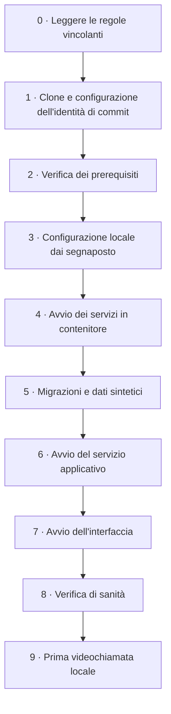
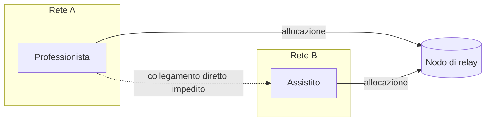
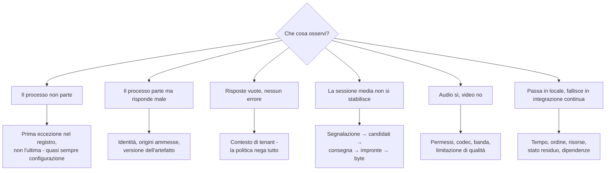

# L'ambiente di sviluppo

> **Che cosa è questo modulo e che cosa non è.**
> È la versione **didattica e operativa** di ciò che l'area tecnica descrive per intero in
> [`docs/01_technical/`](../01_technical/00-indice.md). Serve a chi si siede la prima volta e
> non ha mai visto questo insieme di tecnologie: spiega **che cosa si installa, in che ordine
> si accendono le cose, che cosa si deve vedere a ogni passo e che cosa si fa quando non si
> vede**. Non ripete le motivazioni delle scelte tecniche - quelle stanno in
> [`01-stack-e-motivazioni.md`](../01_technical/01-stack-e-motivazioni.md) - e non sostituisce
> il manuale di installazione destinato a chi mette in esercizio il sistema, che è un
> documento diverso, con destinatari diversi e obblighi diversi.

> **Avvertenza sullo stato del progetto.** Alla data di redazione il repository contiene la
> documentazione e i documenti di governo; la catena di costruzione e il codice sono in corso
> di realizzazione. Ne discende una regola redazionale che questo modulo applica senza
> eccezioni: **dove il nome esatto di un comando, di uno script, di una variabile o di un
> servizio non è ancora stato fissato, il modulo lo dichiara `[NV]` e indica a chi spetta
> fissarlo, invece di inventarlo.** Un modulo che promettesse comandi inesistenti sarebbe
> peggio di un modulo incompleto: farebbe perdere un pomeriggio a ogni lettore, e il primo
> pomeriggio perso è quello in cui la maggior parte delle persone abbandona. I nomi degli
> strumenti generali - il sistema di controllo di versione, il motore di contenitori, il
> client della base dati, la disciplina di coda del kernel - sono invece reali, perché non
> dipendono da una decisione del progetto.

Ci sono due modi di scrivere una guida all'ambiente di sviluppo. Il primo elenca i comandi in
sequenza e presume che funzionino; è quello che si trova quasi ovunque, e funziona finché la
macchina di chi legge somiglia a quella di chi ha scritto. Il secondo dichiara, per ogni passo,
**che cosa si deve osservare se è andato bene, che cosa si osserva se è andato male, e che cosa
si fa in quel caso**. Costa cinque volte tanto da scrivere ed è l'unico che regge il contatto
con persone reali su macchine reali.

Questo modulo adotta il secondo. Ha un obiettivo dichiarato e misurabile: **una persona che non
ha mai visto questo insieme di tecnologie deve poter arrivare, da sola, a un sistema che gira in
locale e a una videochiamata provata su una rete simulata degradata.** Se non ci riesce, il
difetto è di questo modulo, e va segnalato come si segnala un difetto del codice.

Alla fine dovresti saper rispondere a quattro domande: *che cosa devo installare e perché*,
*che cosa deve succedere quando avvio il sistema*, *come faccio a provare che funziona davvero
e non solo che si accende*, e *cosa faccio quando non funziona*.

---

## 1. Prerequisiti, dichiarati per intero

### 1.1 Il criterio che governa questo elenco

Ogni prerequisito di questo elenco esiste per una ragione tecnica scritta accanto. Un elenco di
installazioni senza ragioni produce due effetti indesiderati: chi legge installa cose che non
gli servono, e - molto peggio - quando qualcosa non funziona non ha modo di capire **quale**
pezzo manca, perché non sa a che cosa serviva ciascun pezzo.

C'è poi un criterio che vale specificamente per questo progetto e che va enunciato prima di
tutto il resto. Il criterio **C7** di
[`01-stack-e-motivazioni.md`](../01_technical/01-stack-e-motivazioni.md) §2 stabilisce:
**nessun dato reale e nessun servizio esterno obbligatorio in sviluppo**. In pratica significa
che l'ambiente di sviluppo di Telemedic deve poter essere avviato **su una macchina disconnessa
da tutto**, senza un account, senza una chiave di un fornitore, senza un servizio remoto che
risponda. Un ambiente che per funzionare richiede un servizio di terzi è un ambiente che impone
dati di prova sul sistema di qualcun altro - cioè un ambiente che viola la regola più importante
del progetto (§5.1) senza che nessuno se ne accorga.

Da questo criterio discende una conseguenza pratica utile a chi legge: **se una procedura di
questo modulo ti chiede di registrarti da qualche parte, la procedura è sbagliata.** Segnalalo.
Questo modulo lo pone come vincolo esplicito verso tutte le aree (**V-190** in bacheca): una
procedura di avvio che richieda una registrazione presso un fornitore è un difetto, non una
configurazione.

### 1.2 Che cosa si installa, e perché

| Componente | Versione minima | A che cosa serve, in una riga | Se manca |
|---|---|---|---|
| **Sistema di controllo di versione** | Recente e mantenuta | Clone del repository, rami, firma di origine del contributo | Non parte nulla |
| **Piattaforma Java, versione a supporto esteso 21** | **21** | È la piattaforma del servizio. La soglia non è estetica: i thread virtuali e il pattern matching esaustivo sono finalizzati nella 21 e sono usati dal dominio clinico | Il servizio non compila |
| **Costruttore del progetto** | Quella dichiarata dal file di blocco | Compilazione, esecuzione delle prove, produzione degli artefatti. Il progetto usa il **costruttore incapsulato nel repository** (*wrapper*), quindi non va installato a parte: si usa quello versionato | La costruzione non è riproducibile |
| **Ambiente di esecuzione dell'interfaccia** | Quella dichiarata nel file di blocco del quadro di lavoro dell'interfaccia `[NV]` | Costruzione e servizio di sviluppo dell'applicazione web | L'interfaccia non parte |
| **Motore di contenitori con orchestrazione locale** | Specifica di composizione v2 | Avvia base dati, prodotto di federazione, broker, nodo di relay senza installarli sulla macchina | Bisogna installare a mano quattro servizi: praticamente impossibile |
| **Client della base dati a riga di comando** | Corrispondente alla versione maggiore del motore | Ispezione, diagnosi, verifica delle politiche di sicurezza a livello di riga | Si diagnostica alla cieca |
| **Due motori di navigazione distinti** | Versioni correnti | Le prove media **devono** girare su più di un motore: il comportamento diverge, ed è la fonte di difetti più costosa di quest'area | Si scoprono i difetti dagli utenti |
| **Disciplina di coda del kernel per l'emulazione di rete** | Presente nel sistema | Simulazione di banda, ritardo, jitter e perdita. Su Linux fa parte della configurazione di rete di sistema | Non si può provare il degrado, cioè il caso che conta |
| **Editor con supporto alle convenzioni del repository** | - | Il repository contiene un file di configurazione dell'editor versionato: rispettarlo evita differenze inutili nelle proposte di modifica | Differenze di sole fini riga in ogni modifica |

Tre precisazioni che evitano tre errori frequenti.

**Il costruttore non si installa.** Il progetto versiona nel repository lo *strumento di
avvio del costruttore*: si invoca quello, e scarica ed esegue la versione esatta dichiarata. È
la stessa ragione per cui esiste il file di blocco delle dipendenze - **la costruzione deve
essere riproducibile**, e una costruzione che dipende da quale versione dello strumento hai
installato tu non lo è. Il dettaglio sta in
[`09-integrazione-continua-e-rilascio.md`](../01_technical/09-integrazione-continua-e-rilascio.md)
§6.2, dove la riproducibilità è un requisito e non una preferenza.

**La versione della piattaforma è fissata nella catena di costruzione, non nel tuo ambiente.**
Se hai installato una versione maggiore diversa da quella dichiarata, la costruzione deve
fallire con un messaggio chiaro, non compilare producendo un artefatto diverso. Se ti capita di
compilare con successo su una versione diversa da quella dichiarata, **è un difetto della catena
di costruzione**: segnalalo.

**Il motore di contenitori serve a non installare i servizi.** È il punto che chi arriva da un
altro mondo tende a saltare, per poi passare due giorni a installare a mano una base dati, un
prodotto di federazione delle identità, un broker di eventi e un nodo di relay. Non si fa: si
avviano come contenitori effimeri, e quando sono in uno stato incomprensibile si buttano e si
ricreano (§4.5). Questa possibilità di **buttare via lo stato** è metà del valore dello
strumento.

### 1.3 Che cosa non serve installare, e conviene dirlo

- **Non serve un cluster di orchestrazione dei contenitori.** Il profilo locale è quello a
  tenant unico su composizione, che è il minimo comune denominatore. Il chart per orchestratore
  esiste, serve al profilo a servizio gestito e **non è l'ambiente di sviluppo**.
- **Non serve un archivio di serie temporali separato.** Le serie temporali stanno dentro la
  base dati relazionale, per estensione o per partizionamento nativo: è la scelta descritta in
  [`01-stack-e-motivazioni.md`](../01_technical/01-stack-e-motivazioni.md) §7.
- **Non serve alcun servizio remoto di terzi.** Vedi C7, §1.1.
- **Non serve alcun contenuto terminologico a licenza vincolata**, e soprattutto **non va
  scaricato** (§7.2 e [`THIRD-PARTY-TERMINOLOGY.md`](https://github.com/fedcal/Telemedic/blob/main/THIRD-PARTY-TERMINOLOGY.md)). Il
  sistema è progettato per funzionare senza, e la configurazione predefinita delle prove è
  proprio quella senza (vincolo **V-03**).
- **Non serve un dispositivo medico, un lettore di tessera sanitaria o un certificato di firma
  reale.** Tutto ciò che riguarda quelle catene si prova con doppi di prova costruiti sulla
  specifica pubblicata.

### 1.4 Memoria e disco: il metodo, non un numero inventato

`[NV]` - **il progetto non ha misurato il consumo di risorse dell'ambiente locale, e questo
modulo non pubblica cifre non misurate.** Ciò che pubblica è il **metodo per calcolarle sulla
propria macchina**, che è più utile di una cifra sbagliata e resta valido quando il numero dei
servizi cambia.

Il consumo si compone di quattro voci, che vanno stimate separatamente perché crescono per
ragioni diverse:

1. **I servizi in contenitore.** Base dati, prodotto di federazione, broker di eventi, nodo di
   relay. Sono processi con un consumo a riposo relativamente stabile: si misurano una volta,
   con lo strumento di statistiche del motore di contenitori, e il numero resta valido finché
   non cambia la composizione.
2. **Il servizio applicativo in esecuzione sulla macchina virtuale della piattaforma.** Il
   consumo dipende dalla dimensione dell'heap configurata, non dal codice: è una scelta, non un
   dato di fatto. In sviluppo si configura piccolo.
3. **La catena dell'interfaccia.** Il servizio di sviluppo con ricostruzione incrementale è
   tipicamente la voce più affamata di memoria dell'intero insieme, e quella che sorprende chi
   viene dal mondo dei servizi.
4. **Le prove che avviano contenitori effimeri.** Girano **in aggiunta** all'ambiente già
   acceso, e sono il momento in cui una macchina al limite si arrende. È il caso da tenere
   presente quando si dimensiona.

Sul disco valgono tre voci: le immagini dei contenitori, che si accumulano silenziosamente a
ogni aggiornamento e vanno potate (§11.3); le cache delle dipendenze dei due ecosistemi, che
crescono e non si riducono da sole; i volumi della base dati locale, che crescono con i dati
sintetici generati e in particolare con i profili di dataset grandi (§5.8).

**Regola pratica onesta**: misura una volta, sulla tua macchina, con l'ambiente completo acceso
e una suite di integrazione in esecuzione, e annota il risultato. È il solo numero che ti
riguarda. Se vuoi contribuire a questo modulo, quel numero, insieme al modello della macchina,
è un contributo prezioso: la questione è aperta in bacheca all'area tecnica (**Q-191**).

### 1.5 Se la macchina è modesta

È la situazione più comune fra i contributori esterni, e va trattata come caso di riferimento e
non come eccezione. Cinque strategie, in ordine di efficacia.

**Non accendere ciò che non ti serve.** Il primo errore è avviare tutto per lavorare su una
funzionalità che tocca un contesto solo. Il profilo di avvio dovrebbe essere **selettivo per
gruppi di servizi** - base dati sola; base dati più servizio applicativo; insieme completo con
media e federazione - e ogni gruppo dovrebbe essere avviabile in autonomia. `[NV]` - la
definizione esatta dei gruppi e i loro nomi spettano all'area tecnica insieme alla stesura del
file di composizione: la questione è aperta in bacheca (**Q-190**).

**Lavora sul dominio senza accendere niente.** È il beneficio pratico più sottovalutato della
regola di dipendenza n. 5 di [`02-backend.md`](../01_technical/02-backend.md) §1: il dominio non
dipende dall'infrastruttura, quindi **le prove unitarie di dominio girano in memoria, in
secondi, senza base dati e senza contenitori**. Se stai lavorando su invarianti, macchine a
stati, politiche o calcoli, puoi passare un'intera giornata senza avviare un solo servizio. È
anche il modo in cui il progetto vuole che si lavori: le prove di dominio sono la base larga
della piramide ([`08-qualita-e-test.md`](../01_technical/08-qualita-e-test.md) §1).

**Riduci il dataset sintetico.** Il generatore ha profili di dimensione (§5.8): il profilo
minimo serve a far girare i percorsi, quello dimostrativo a vedere un'interfaccia popolata,
quello grande alle prove di capacità. Il terzo non ha niente a che fare con il lavoro
quotidiano e non va tenuto acceso per abitudine.

**Non tenere acceso il servizio di sviluppo dell'interfaccia se stai lavorando sul servizio.**
E viceversa. Sono le due voci più costose e raramente servono insieme.

**Usa una macchina remota per le prove pesanti.** Le prove media su rete degradata e le prove di
carico non sono attività da portatile. Le prime si possono eseguire in locale ma consumano;
le seconde, per costruzione, richiedono un ambiente dedicato
([`08-qualita-e-test.md`](../01_technical/08-qualita-e-test.md) §1) e **non vanno eseguite sulla
macchina di sviluppo**, perché il risultato sarebbe privo di significato e la macchina inservibile.

### 1.6 Differenze fra sistemi operativi, dove esistono davvero

La maggior parte delle differenze fra sistemi operativi in un progetto come questo è
irrilevante. Quelle che seguono **non** lo sono, e ignorarle costa tempo.

#### Emulazione della rete

**È la differenza che conta di più.** La simulazione di banda, ritardo, jitter e perdita che
serve alle prove media (§6.4) si realizza con la disciplina di coda del kernel, che è una
funzionalità **di Linux**. Su altri sistemi operativi:

- l'equivalente nativo esiste in forma diversa e con sintassi diversa, e **i profili non sono
  trasferibili numero per numero**;
- la strada praticabile e riproducibile è **eseguire la simulazione dentro un ambiente Linux** -
  contenitore con privilegi di rete, oppure macchina virtuale - e collocarvi almeno uno dei due
  estremi della sessione.

La conseguenza operativa da accettare subito: **i profili di rete sono costanti condivise della
suite** ([`05-media-e-tempo-reale.md`](../01_technical/05-media-e-tempo-reale.md) §9.2) e i
risultati sono confrontabili solo se ottenuti con lo stesso meccanismo. Una misura ottenuta con
un emulatore diverso non si confronta con le altre: si annota come tale.

#### Architettura del processore

Sulle macchine con processore ad architettura ARM - comuni fra i portatili recenti - non tutte
le immagini di contenitore esistono per quell'architettura. Quando manca, il motore le esegue in
emulazione, con due conseguenze da conoscere: **rallentamento sensibile**, che si manifesta come
prove di integrazione che scadono per timeout, e **differenze di comportamento** in casi limite.
La regola del progetto è preferire immagini disponibili per entrambe le architetture; dove non è
possibile, il fatto va dichiarato nella documentazione della composizione.

#### Fini riga e permessi dei file

Su Windows la conversione automatica delle fini riga produce differenze enormi e prive di
contenuto nelle proposte di modifica, e - peggio - può rendere non eseguibili gli script del
repository. Il file di configurazione dell'editor versionato nel repository serve esattamente a
questo. Verifica che il tuo editor lo rispetti **prima** della prima modifica, non dopo la prima
proposta illeggibile.

#### Il sottosistema Linux su Windows

È la strada raccomandata su Windows, ma va conosciuta in tre punti: le prestazioni del
filesystem attraversando il confine fra i due mondi sono sensibilmente peggiori, quindi **il
repository va clonato dentro il filesystem del sottosistema**, non su quello dell'ospite;
l'indirizzo con cui i contenitori raggiungono un servizio in ascolto sull'ospite ha una forma
propria e non è `localhost`; l'emulazione di rete funziona, perché si tratta di un kernel Linux
vero.

#### Contesto sicuro e loopback

Vale per tutti i sistemi operativi, ed è la trappola numero uno di chi prova per la prima volta
una videochiamata: **l'accesso a telecamera e microfono richiede un contesto sicuro**. In
sviluppo locale l'unica origine trattata come sicura senza certificato è quella di **loopback**.
Se apri l'interfaccia con l'indirizzo di rete della macchina invece che con l'indirizzo di
loopback, l'acquisizione fallisce silenziosamente o con un errore che sembra un difetto
dell'applicazione, e non lo è. È spiegato per esteso nel modulo
[08 §13.5](08-webrtc-da-zero.md); qui basti sapere che è il **primo** controllo da fare.

Ne discende anche il problema, reale, di provare fra **due dispositivi diversi** sulla stessa
rete locale - il portatile e un telefono, che è lo scenario del prodotto: in quel caso
l'indirizzo di loopback non serve, e serve un certificato per l'origine locale, ottenuto da
un'autorità di certificazione locale creata a posteriori sulla macchina di sviluppo. `[NV]` - la
procedura esatta adottata dal progetto non è ancora fissata, ed è aperta in bacheca all'area
tecnica insieme al resto della composizione locale (**Q-190**).

---

## 2. Il primo avvio, passo per passo

### 2.1 La forma del percorso



Il percorso è **sequenziale e non riordinabile**: ogni passo produce lo stato di ingresso del
successivo. Se un passo non produce l'esito atteso, si risolve prima di proseguire. Proseguire
con un passo fallito è la causa numero uno delle sessioni di diagnosi lunghe e infruttuose,
perché il sintomo si manifesta tre passi più avanti, lontano dalla causa.

### 2.2 Passo 0 - Leggere le regole vincolanti

Non è un passo di cortesia. Tre documenti del repository contengono regole che, se violate,
producono conseguenze **non annullabili con una modifica successiva**:

| Documento | Che cosa stabilisce | Perché prima e non dopo |
|---|---|---|
| [`CONTRIBUTING.md`](https://github.com/fedcal/Telemedic/blob/main/CONTRIBUTING.md) | Le cinque regole non negoziabili: nessun dato reale, nessun contenuto terminologico a licenza vincolata, nessun segreto nel codice, tracciabilità sulle modifiche a rischio clinico, accessibilità come requisito | Le prime tre sono violabili **al primo commit**, e la cronologia di un repository pubblico non si ripulisce (§11.4) |
| [`THIRD-PARTY-TERMINOLOGY.md`](https://github.com/fedcal/Telemedic/blob/main/THIRD-PARTY-TERMINOLOGY.md) | Che cosa il progetto non distribuisce e non scarica, e perché | La licenza di alcuni sistemi di codifica **si perfeziona scaricando**: basta un download «solo per provare» |
| [`NOT-A-MEDICAL-DEVICE.md`](https://github.com/fedcal/Telemedic/blob/main/NOT-A-MEDICAL-DEVICE.md) | Che il repository è codice sorgente e non un dispositivo medico, e che cosa se ne può e non se ne può fare | Determina che cosa puoi affermare del sistema che stai per avviare |

Se hai poco tempo, leggi almeno le cinque regole di `CONTRIBUTING.md`. Sono meno di due pagine
e sono le uniche il cui costo di violazione non è recuperabile.

### 2.3 Passo 1 - Clone e identità del contributo

```bash
git clone git@github.com:fedcal/Telemedic.git
cd Telemedic
```

Prima di qualunque altra cosa, configura **la firma di origine del contributo**. Il progetto
richiede che ogni commit porti l'attestazione prevista dal *Developer Certificate of Origin*:
non è una cessione di diritti d'autore, è la dichiarazione che hai il diritto di conferire quel
contributo sotto la licenza del progetto.

```bash
git config user.name "Nome Cognome"
git config user.email "indirizzo@esempio.invalid"
# poi, su ogni commit:
git commit -s -m "docs: correggere il refuso nel modulo sui prerequisiti"
```

**Esito atteso**: il messaggio di commit contiene una riga `Signed-off-by:` con il tuo nome e il
tuo indirizzo. Un commit senza quella riga verrà rifiutato in fase di verifica, e correggerlo a
posteriori su una serie di commit è noioso: si configura subito.

Il dominio `.invalid` usato nell'esempio è riservato dalla specifica dei nomi a dominio proprio
per gli esempi che non devono risolvere: in questo modulo, come in tutto il progetto, **anche i
dati degli esempi sono sintetici** (§5).

### 2.4 Passo 2 - Verifica dei prerequisiti

`[NV]` - il progetto prevede uno **script di verifica dei prerequisiti** che controlli, in un
colpo solo, presenza e versione di ciascun componente di §1.2 e dichiari che cosa manca in
linguaggio comprensibile. Nome, collocazione e forma spettano all'area tecnica (**Q-190**).

La ragione per cui vale la pena averlo, e per cui va invocato **prima** di ogni altra cosa, è
che quasi tutti i fallimenti dei passi successivi si riducono a un prerequisito mancante o alla
versione sbagliata, e il messaggio d'errore che se ne ottiene tre passi più avanti **non
somiglia affatto** alla causa. Un controllo dichiarativo all'inizio trasforma dieci diagnosi
diverse in un unico messaggio.

Nel frattempo, la verifica manuale è la lettura delle versioni dei componenti della tabella di
§1.2, confrontate con la colonna «versione minima».

### 2.5 Passo 3 - Configurazione locale

Il repository non contiene segreti, e non ne conterrà mai. Contiene invece un file di **esempio
della configurazione locale**, esplicitamente escluso dalle regole di esclusione del sistema di
controllo di versione - è il motivo per cui il file di esclusione del progetto elenca `.env` fra
i file mai versionati e `.env.example` fra le eccezioni.

```bash
cp .env.example .env
```

Poi si compila. Le regole sono tre, e sono le stesse che varranno per l'intero progetto:

1. **I valori nel file di esempio sono segnaposto, non valori.** Non devono mai somigliare a
   valori reali: un segnaposto che sembra una chiave vera finisce, prima o poi, in un commit.
2. **I segreti locali si generano sul momento**, con un generatore di numeri casuali del
   sistema, e restano sulla macchina. Non si condividono in chat, non si incollano in una
   segnalazione, non si riusano fra ambienti.
3. **Nessun valore del file locale è un segreto reale di un ambiente reale.** Se ti trovi a
   copiare in `.env` una credenziale presa da un'installazione vera, stai commettendo l'errore
   che questo progetto considera più grave (§11.1).

```bash
# Esempio di generazione di un segreto locale - solo per l'ambiente di sviluppo.
openssl rand -base64 32
```

`[NV]` - l'elenco esatto delle variabili, i loro nomi e i valori predefiniti sono definiti dal
file di esempio quando la composizione sarà scritta. Questo modulo **non li anticipa** e non ne
inventa i nomi.

### 2.6 Passo 4 - Avvio dei servizi in contenitore

```bash
docker compose up -d
docker compose ps
```

**Esito atteso**: tutti i servizi risultano in esecuzione e, dove è definito un controllo di
salute, in stato sano. Uno stato di riavvio ciclico è un fallimento, non un'attesa: si guardano
subito i registri di quel servizio.

```bash
docker compose logs -f <servizio>
```

Che cosa gira, e a che cosa serve:

| Servizio | Ruolo nell'ambiente locale | Se non parte |
|---|---|---|
| Base dati relazionale | Perno di tutto: dati, outbox, registro delle migrazioni | Non parte nient'altro |
| Prodotto di federazione delle identità | Emissione dei token, realm distinti, ruoli | Nessun accesso autenticato: l'interfaccia si ferma al primo passo |
| Broker di eventi | Consegna degli eventi prodotti dall'outbox | Il percorso principale funziona, la consegna verso terzi no |
| Nodo di relay | Attraversamento del NAT nelle prove media | Le sessioni fra due schede dello stesso computer funzionano lo stesso: è precisamente la trappola di §6.1 |

L'ultima riga della tabella merita una sottolineatura, perché è il malinteso più costoso di
tutto il modulo: **in locale la videochiamata funziona anche se il nodo di relay è spento.** Non
è una buona notizia: è il motivo per cui una prova locale ingenua non dimostra quasi nulla.

### 2.7 Passo 5 - Migrazioni e dati sintetici

Due operazioni distinte, che vanno tenute distinte anche mentalmente:

1. **Le migrazioni** portano lo schema alla versione corrente. Sono versionate, ordinate,
   immutabili e con impronta verificata
   ([`03-persistenza.md`](../01_technical/03-persistenza.md) §3.1). Girano prima su `platform`
   e `reference`, poi sugli schemi di ciascun tenant.
2. **La generazione dei dati sintetici** popola l'ambiente. Non fa parte delle migrazioni e non
   deve mai farne parte: una migrazione che inserisca dati di esempio finirebbe in esercizio.

`[NV]` - i comandi esatti dipendono dallo strumento di migrazione scelto dall'area tecnica e dal
nome del generatore, entrambi non ancora fissati (**Q-190**). Ciò che è già deciso e non cambia
è la **semantica**: migrazioni solo in avanti, mai modificate a posteriori, con lo stato
registrato per tenant in `platform.migration_state`.

**Esito atteso**: il registro delle migrazioni riporta tutte le versioni applicate senza
fallimenti, e una interrogazione di controllo sulla base dati mostra gli schemi attesi.

```sql
-- Verifica manuale, in attesa del comando di progetto.
\dn
-- Ci si aspetta: platform, reference, e sei schemi per ciascun tenant sintetico,
-- nella forma t0001_identity, t0001_registry, t0001_encounter, …
```

### 2.8 Passo 6 - Avvio del servizio applicativo

```bash
./mvnw spring-boot:run
```

Il comando riflette la **proposta di progetto** di adottare un costruttore dichiarativo a
modello, motivata in [`01-stack-e-motivazioni.md`](../01_technical/01-stack-e-motivazioni.md)
§12; `[NV]` sulla forma definitiva dell'invocazione e sul profilo attivato per l'ambiente
locale.

**Esito atteso**: il servizio raggiunge lo stato di prontezza e i due endpoint distinti di
**vivacità** e **prontezza** rispondono in modo coerente. La distinzione fra i due non è un
formalismo: la vivacità dice «il processo è vivo», la prontezza dice «il processo può ricevere
traffico». Un processo vivo ma non pronto è la condizione normale durante l'avvio e durante una
migrazione, ed è il motivo per cui esistono due indirizzi e non uno.

```bash
curl -s http://localhost:<porta>/actuator/health/liveness
curl -s http://localhost:<porta>/actuator/health/readiness
```

`[NV]` - porta e percorsi esatti sono definiti dalla configurazione dell'applicazione, non
ancora scritta.

### 2.9 Passo 7 - Avvio dell'interfaccia

```bash
npm ci      # installazione riproducibile dal file di blocco, non "install"
npm start   # servizio di sviluppo con ricostruzione incrementale
```

Due note che valgono più del comando.

**L'installazione riproducibile non è l'installazione normale.** Il comando che risolve le
versioni al momento produce un albero di dipendenze potenzialmente diverso dal tuo collega e
dall'integrazione continua, e rende non riproducibile la costruzione - che è un requisito, non
una preferenza. Si usa sempre la forma che **installa esattamente il file di blocco** e fallisce
se il file di blocco e il manifesto divergono.

**Il servizio di sviluppo non è il modo in cui l'applicazione viene distribuita.** Serve alla
ricostruzione incrementale mentre si scrive; la costruzione per l'esercizio ha altre proprietà. Un
difetto che si manifesta solo nella costruzione per l'esercizio esiste e va cercato lì, non nel
servizio di sviluppo.

### 2.10 Passo 8 - Verifica di sanità

Non «l'interfaccia si apre». Quattro verifiche osservabili, in ordine:

| # | Verifica | Che cosa dimostra |
|---|---|---|
| 1 | I due endpoint di stato rispondono e la prontezza è positiva | Il servizio è avviato e ha completato le migrazioni |
| 2 | L'accesso con un'utenza sintetica del prodotto di federazione riesce | La catena di identità è configurata: realm, client, ruoli |
| 3 | Una lettura autenticata restituisce dati sintetici **non vuoti** | Il contesto di tenant è risolto e la sicurezza a livello di riga **non sta negando tutto** (§4.7) |
| 4 | Una scrittura produce una riga nella tabella dell'outbox del contesto | Il percorso transazionale del dominio e dell'outbox è integro |

La terza riga è quella che intercetta il malinteso più insidioso dell'intero ambiente: un elenco
vuoto **non è** un ambiente senza dati, quasi sempre è un contesto di tenant non risolto. La
politica di sicurezza a livello di riga, in assenza di contesto, **nega tutto**: è il
comportamento voluto ([`03-persistenza.md`](../01_technical/03-persistenza.md) §2.3), e produce
esattamente lo stesso sintomo di una base dati vuota.

### 2.11 Passo 9 - La prima videochiamata locale

Si tratta in §6, perché richiede una premessa che merita una sezione a sé: **il caso locale è
ingannevolmente facile**, e una videochiamata che funziona fra due schede dello stesso browser
non dimostra quasi nulla di ciò che il prodotto deve garantire.

### 2.12 Dove ci si blocca di solito

Questa è la sezione che manca in tutte le guide e che decide se una persona continua o
abbandona. Le voci sono ordinate per frequenza attesa, non per gravità.

| # | Sintomo osservato | Causa reale più frequente | Come se ne esce |
|---|---|---|---|
| 1 | La telecamera non parte, o l'offerta non contiene sezioni media | L'interfaccia è aperta su un'origine **non sicura**: indirizzo di rete della macchina invece dell'indirizzo di loopback | Aprire l'origine di loopback; per la prova fra dispositivi diversi serve un certificato locale (§1.6) |
| 2 | Ogni lettura restituisce un elenco vuoto, senza errori | Contesto di tenant non risolto: la politica di sicurezza a livello di riga **nega tutto** in assenza di contesto | Verificare che la richiesta porti il tenant e che la transazione imposti la variabile con `SET LOCAL` (§4.7) |
| 3 | La base dati «non risponde» al primo avvio | Il servizio è in esecuzione ma non ha finito l'inizializzazione; oppure il volume contiene lo stato di un tentativo precedente fallito | Attendere il controllo di salute; se persiste, azzerare volume e ricreare (§4.5) |
| 4 | Le migrazioni falliscono con un errore di impronta | Una migrazione già applicata è stata **modificata** - è vietato: si scrive la successiva | Azzerare la base dati locale e riapplicare; in un ambiente reale sarebbe un incidente |
| 5 | Il servizio parte e si spegne subito | Configurazione locale incompleta: una proprietà obbligatoria non ha valore. Il collegamento tipizzato della configurazione fallisce all'avvio **di proposito** | Leggere la prima eccezione, non l'ultima: indica la proprietà mancante |
| 6 | L'accesso fallisce con un errore di identità | Realm, client o utenze sintetiche non importati; oppure l'emittente atteso dal servizio non coincide con quello del prodotto di federazione | Verificare che l'emittente configurato nel servizio e quello del token coincidano **carattere per carattere**, incluso lo schema e la porta |
| 7 | L'interfaccia mostra errori di origine incrociata | Origine dell'interfaccia non ammessa dalla configurazione del servizio, o porta diversa da quella attesa | Allineare le origini ammesse; **non** disattivare i controlli: è una scorciatoia che il controllo di profilo di esercizio deve impedire (§9) |
| 8 | Le prove di integrazione scadono per timeout | Contenitori effimeri in emulazione su architettura non nativa (§1.6), oppure macchina satura perché l'ambiente completo è acceso | Spegnere ciò che non serve; verificare l'architettura delle immagini |
| 9 | La videochiamata «funziona» ma non prova nulla | Entrambi gli estremi sulla stessa macchina: candidati di tipo locale, nessun NAT, banda praticamente infinita | §6: forzare il percorso di relay e simulare la rete |
| 10 | Nessun candidato oltre quelli locali | Nodo di relay non raggiungibile, credenziali scadute o segreto condiviso diverso fra servizio e nodo | Verificare che il segreto del nodo di relay e quello con cui il servizio firma le credenziali siano lo stesso valore |
| 11 | Il file audio sintetico si sente distorto | L'elaborazione audio (eco, rumore, guadagno) è attiva: va disattivata quando si riproduce un file | Vedi modulo [08 §13.1](08-webrtc-da-zero.md): è un vincolo dichiarato a monte, non un difetto |
| 12 | Il flusso di condivisione dello schermo passa senza che nessuno abbia acconsentito | È stato usato il flag che accetta automaticamente **anche** la cattura dello schermo | Usare il flag che accetta solo camera e microfono: la distinzione è verificata e documentata (§6.7) |
| 13 | La limitazione di banda impostata negli strumenti di sviluppo del navigatore non ha effetto | Agisce sul livello applicativo e **non tocca il traffico della sessione media** | Simulare a livello di rete (§6.4). È l'equivoco che fa perdere una giornata intera |
| 14 | Il controllo sui segreti blocca la proposta di modifica | C'è una credenziale nei sorgenti **o nella cronologia** | §9: non si aggira. Si rimuove **e si ruota** il segreto |
| 15 | Il controllo sulle terminologie blocca la proposta di modifica | È entrato contenuto di un sistema di codifica a licenza vincolata, spesso dentro una risorsa di esempio copiata da Internet | §7.2 e §9. Non è un falso positivo da disattivare |
| 16 | Un elenco di codici clinici non si valida | Il sistema di codifica non è abilitato in questa configurazione: **è il comportamento previsto** | §7.3: il sistema resta pienamente funzionante, la validazione di quei codici no. È dichiarato |
| 17 | La costruzione fallisce citando un componente assente da un file di annotazioni | È il controllo che impedisce l'ingresso di una dipendenza non valutata | §9, controllo **G5**: si compila la scheda del componente. Non si aggiunge un'esclusione |

Se il tuo caso non è in questa tabella e ti è costato più di mezz'ora, **aggiungilo**: una riga
in questa tabella vale più di un rifacimento di dieci righe di codice, perché evita lo stesso
mezz'ora a chiunque arrivi dopo.

---

## 3. Come è fatto l'albero del repository

### 3.1 Il criterio: si separa per dominio, non per natura tecnica

Prima dell'albero, la regola che lo spiega. Il progetto **non** organizza il codice per natura
tecnica - tutti i controllori insieme, tutti i servizi insieme, tutti i repositori insieme -
perché quella disposizione sparpaglia ogni funzionalità in cinque punti e non consente di
vietare alcuna dipendenza: tutto sta allo stesso livello di tutto. Si organizza invece per
**contesto delimitato**, secondo la tabella della base architetturale, e ogni contesto è un
modulo con un confine reale, verificato da prove che fanno fallire la costruzione. La
motivazione completa è in [`02-backend.md`](../01_technical/02-backend.md) §1.

La conseguenza pratica per chi cerca un file: **si parte dal dominio, non dal tipo di file**. La
domanda giusta non è «dove stanno i controllori», è «quale contesto è responsabile di questa
cosa».

### 3.2 Il primo livello

```
Telemedic/
├─ README.md                      destinazione d'uso, limiti, avvio rapido
├─ LICENSE / NOTICE               licenza permissiva e attribuzioni
├─ NOT-A-MEDICAL-DEVICE.md        il repository non è un dispositivo medico
├─ DISTRIBUTION-POLICY.md         che cosa distingue il repository dalla distribuzione
├─ CONTRIBUTING.md                le cinque regole non negoziabili
├─ THIRD-PARTY-TERMINOLOGY.md     regimi di licenza delle terminologie cliniche
├─ SECURITY.md                    segnalazione riservata delle vulnerabilità
├─ GOVERNANCE.md                  chi decide che cosa
├─ CODE_OF_CONDUCT.md             codice di condotta
├─ .editorconfig                  convenzioni dell'editor, versionate
├─ .gitignore                     ciò che non entra mai nel repository
├─ .github/                       modelli di segnalazione e di proposta, definizioni di pipeline
├─ docs/                          l'intera documentazione, in italiano
└─ .telemedic/                    materiale di lavoro dell'orchestrazione, non pubblicato nel sito
```

I quattro documenti in testa - destinazione d'uso, non-dispositivo, politica di distribuzione,
regole di contribuzione - **non sono formalità**. La decisione **D51** impone che la
dichiarazione «questo repository non è un dispositivo medico», la destinazione d'uso e i limiti
d'uso siano presenti e visibili **in ogni momento in cui il repository è accessibile**: non
pubblicabili più avanti. Sono, letteralmente, la prima cosa che è stata scritta.

### 3.3 La documentazione

```
docs/
├─ 00_overview/       visione, sintesi, glossario generale
├─ 01_technical/      stack, backend, persistenza, frontend, media, osservabilità,
│                     prestazioni, qualità e test, integrazione continua e rilascio
├─ 02_architecture/   contesti, dominio, modello dati, multi-tenancy, eventi, deployment
├─ 03_functional/     attori, requisiti, casi d'uso, regole, allarmi, accessibilità
├─ 04_protocols/      interoperabilità, FHIR, documenti clinici, messaggistica, IHE,
│                     interfaccia di progetto, eventi, identità, tempo reale, conformità
├─ 05_domain/         linguaggio ubiquo, prestazioni modellate, documenti, parametri,
│                     consenso, terminologie, percorsi di cura
├─ 06_security/       minacce, identità, protezione dei dati, tracciamento, tempo reale,
│                     catena di fornitura, misure, responsabilità, incidenti
├─ 07_integration/    modalità di integrazione, primo avvio dell'integratore, API, eventi
├─ 08_compliance/     dispositivi medici, qualità, normativa, percorso di certificazione
├─ 09_roadmap/        piano tecnico
├─ 10_fondamenti/     questa guida
└─ adr/               decisioni architetturali registrate
```

Due indicazioni di orientamento che risparmiano ricerche inutili:

- **`docs/10_fondamenti/` spiega, `docs/01_technical/` decide.** Se cerchi *perché* una cosa
  funziona così, parti dai fondamenti; se cerchi *quale versione, quale vincolo, quale limite*,
  vai all'area tecnica. Questo modulo è l'unico dei fondamenti che dà comandi, e li dà per
  metterti in condizione di leggere gli altri.
- **`docs/07_integration/02-primo-avvio.md` non è questo modulo.** Quello descrive il primo
  avvio di **chi integra Telemedic in un altro sistema**; questo descrive il primo avvio di
  **chi sviluppa Telemedic**. Sono due percorsi con destinatari, prerequisiti e obiettivi
  diversi, e confonderli è una perdita di tempo evitabile.

### 3.4 Il codice

La struttura che segue è quella dichiarata dall'area tecnica ed è **la mappa per cercare un
file**. Alla data di redazione le directory sono in corso di realizzazione: qui interessa la
disposizione, che è decisa, non lo stato di avanzamento, che cambia ogni settimana.

```
telemedic/                        il servizio
├─ platform/                      componenti trasversali, nessuna logica di dominio
│  ├─ tenancy/                    risoluzione, propagazione e verifica del tenant
│  ├─ security/                   confine di autorizzazione, scambio di token, livello di garanzia
│  ├─ outbox/                     tabella, relay, buste degli eventi
│  ├─ problem/                    catalogo degli errori e loro rappresentazione
│  └─ observability/              correlazione, redazione, misure
├─ contexts/                      un modulo per contesto delimitato, tredici in tutto
│  ├─ identity/  registry/  scheduling/  encounter/  media-session/
│  ├─ clinical-document/  monitoring/  alerting/  consent/
│  ├─ outbound/  audit/  tenant-admin/
│  └─ terminology/                punto unico di risoluzione e validazione dei
│                                 codici clinici (CTX-10), disattivabile per
│                                 sistema di codifica
├─ interfaces/
│  ├─ rest-api/                   interfaccia applicativa di progetto
│  ├─ fhir-facade/                facciata di interoperabilità
│  ├─ signaling/                  segnalazione della sessione media
│  └─ webhooks/                   consegna verso sistemi terzi
└─ app/                           assemblaggio, configurazione, avvio

web/                              l'interfaccia
├─ core/                          sessione, rete, internazionalizzazione, accessibilità,
│                                 configurazione di tenant, misure di interfaccia
├─ design-system/                 componenti di base, accessibili per costruzione
├─ features/                      sala d'attesa, consulto, consenso, refertazione,
│                                 monitoraggio, amministrazione
├─ embeddable/                    elemento personalizzato per l'integratore
└─ app/                           assemblaggio, instradamento, avvio
```

**Ogni contesto ha la stessa forma interna** - `api`, `domain`, `application`,
`infrastructure` - e la ripetizione è voluta: chi apre un contesto che non conosce sa già dove
guardare. `api` è il contratto verso gli altri contesti; `domain` non ha effetti collaterali e
si prova senza infrastruttura; `application` è l'unico livello con la transazione;
`infrastructure` è sostituibile per definizione.

### 3.5 Dove cerco che cosa

| Se cerchi… | Guarda in… |
|---|---|
| La regola che decide se una sessione può iniziare | `contexts/media-session/domain/policy/` |
| Il punto in cui si apre la transazione di un caso d'uso | `contexts/<contesto>/application/` |
| La forma di un errore restituito a un chiamante | `platform/problem/` |
| Come si risolve e si propaga il tenant | `platform/tenancy/` |
| Perché una chiamata verso l'esterno viene rifiutata | Il componente unico delle chiamate uscenti, in `platform/` |
| Le migrazioni dello schema | La directory delle migrazioni, ordinata per versione `[NV]` |
| Le fabbriche dei dati di prova | Il modulo del generatore sintetico `[NV]` |
| I profili di rete delle prove media | Le costanti condivise della suite media |
| La configurazione del nodo di relay | Il file di esempio versionato, mai quello reale |
| Il catalogo dei codici di errore | Il file versionato da cui il catalogo è **generato** |
| Il registro dei componenti di terze parti | Il file di annotazioni versionato accanto alla distinta generata |

### 3.6 Le due directory che sorprendono

**`third-party/`** - non esiste per comodità. Esiste perché la policy terminologica del progetto
colloca alcuni contenuti in un **regime B**: riusabili, ma con licenza propria che va tenuta
separata da quella del progetto. Ciò che sta lì dentro **non è sotto la licenza del repository**
e ha un file di licenza proprio. Non è il posto dove mettere una libreria comoda.

**`.telemedic/`** - materiale di lavoro dell'orchestrazione: contesto condiviso fra chi scrive,
bacheca inter-agenti, ricerche. Non è documentazione pubblicata e non finisce nel sito. È utile
leggerla quando ci si chiede *perché una decisione è quella e non un'altra*: la risposta è quasi
sempre in una riga della bacheca o in un documento di ricerca.

---

## 4. La base dati

### 4.1 Che cosa gira in locale

Una sola base dati relazionale, che contiene tutto: i dati di dominio, l'outbox degli eventi, il
registro delle migrazioni e - in locale - anche il registro immutabile, che **in esercizio è
invece conservato separatamente**, con credenziali e salvataggio distinti
([`03-persistenza.md`](../01_technical/03-persistenza.md) §8.2).

Questa differenza fra locale ed esercizio va conosciuta, perché è una delle poche in cui
l'ambiente di sviluppo **non** riproduce la struttura reale. La ragione è di sostenibilità
dell'ambiente locale; la conseguenza è che la separazione fisica del registro **non è provata
dal solo avvio locale**, e va verificata dove è reale.

### 4.2 Come è organizzato lo schema, e perché ti riguarda subito

```
telemedic (base dati)
├─ platform            catalogo dei tenant, registro delle migrazioni, chiavi
├─ reference           dati di riferimento non clinici e non specifici di tenant
├─ t0001_identity      ── un tenant sintetico
├─ t0001_registry
├─ t0001_encounter
├─ t0001_media_session
├─ t0001_clinical_document     (contiene outbox per i documenti clinici)
├─ t0001_monitoring
└─ t0002_…             ── un secondo tenant sintetico
```

Tre proprietà che si incontrano il primo giorno:

1. **Uno schema per coppia tenant × contesto.** Serve a due separazioni insieme: fra tenant, e
   fra contesti. Nessun contesto accede alla base dati di un altro, e la regola è applicata dal
   motore attraverso i privilegi, non dalla disciplina di chi scrive.
2. **Il nome dello schema usa un ordinale opaco**, non il nome del tenant. Il nome di un tenant
   può essere il nome di uno studio medico individuale, cioè un dato personale, e i nomi degli
   schemi compaiono nei messaggi d'errore, nei piani di esecuzione e negli strumenti di
   amministrazione.
3. **Almeno due tenant sintetici, sempre.** Un ambiente locale con un tenant solo non fa emergere
   i difetti di isolamento, che sono la classe di difetti più grave di questo sistema. La
   generazione dei dati sintetici ne crea **due o più** per costruzione (§5.8).

### 4.3 Migrazioni: le regole prima dei comandi

| Regola | Che cosa significa in pratica | Perché |
|---|---|---|
| **Versionate e ordinate** | Ogni modifica dello schema è un file numerato | Lo stato dello schema è ricostruibile e verificabile |
| **Immutabili** | Una migrazione già applicata **non si modifica mai**: si scrive la successiva | L'impronta verificata rende impossibile la modifica retroattiva, che è la causa classica delle divergenze fra ambienti |
| **Solo in avanti** | Non esistono migrazioni di annullamento | L'annullamento di una modifica che ha già distrutto dati non è possibile, e la sua esistenza crea l'illusione contraria |
| **Struttura e dati separati** | Una migrazione cambia la forma, un'altra il contenuto | Una migrazione di dati su una tabella clinica reale che gira in un'unica transazione blocca il sistema per tutta la sua durata |
| **Espandi e contrai** | Nessun rilascio è insieme distruttivo e funzionale | Due versioni consecutive devono poter convivere sulla stessa base dati: è la condizione dell'aggiornamento senza interruzione e del ritorno indietro |
| **Non bloccanti** | Indici creati in modalità concorrente, vincoli aggiunti come non validati e validati dopo | Su dati reali la forma bloccante ferma il sistema |

La regola «espandi e contrai» è quella che un contributore alle prime armi viola per prima,
perché è controintuitiva: rinominare una colonna sembra una modifica innocua, ed è invece la
modifica che rompe la convivenza fra due versioni. La forma corretta è: **aggiungi la nuova
colonna, scrivi su entrambe, leggi dalla vecchia; poi leggi dalla nuova; solo in un terzo
rilascio rimuovi la vecchia.**

### 4.4 Migrazioni su più tenant

Con lo schema per tenant, ogni migrazione strutturale va applicata a ogni tenant. In locale, con
due o tre tenant sintetici, il processo dura secondi; in esercizio, con centinaia, è
un'operazione lunga di cui **va osservato l'avanzamento**. La proprietà che conta anche in
locale è che **il fallimento su un tenant non blocca gli altri**: quel tenant viene marcato come
non allineato e non riceve traffico dalla versione nuova. È il motivo per cui la verifica di
compatibilità fra versioni consecutive non è opzionale - durante una migrazione lunga, tenant su
versioni di schema diverse **coesistono per costruzione**.

### 4.5 Ripartire da zero

Va fatto spesso, e senza esitazione. Un ambiente locale sporco è la causa di un'intera famiglia
di diagnosi inutili: prove che passano per residui di uno stato precedente, prove che falliscono
per una riga rimasta, comportamenti che nessun altro riesce a riprodurre.

```bash
docker compose down -v      # ferma i servizi ED ELIMINA i volumi
docker compose up -d        # ricrea da zero
# poi: migrazioni, poi generazione dei dati sintetici
```

L'opzione che elimina i volumi è quella che distingue «riavviare» da «ripartire». Senza di
essa, la base dati mantiene lo stato precedente - comprese le migrazioni parzialmente applicate
del tentativo fallito, che sono precisamente il residuo che produce l'errore di impronta della
riga 4 di §2.12.

**Regola pratica**: se stai per scrivere un messaggio che comincia con «da me non funziona ma
non capisco perché», prima ricrea l'ambiente. Nella metà dei casi la conversazione finisce lì.

### 4.6 Ispezionare

```bash
docker compose exec <servizio-base-dati> psql -U <utente> -d telemedic
```

Le interrogazioni che servono davvero il primo giorno:

```sql
-- Quali schemi esistono: si vedono i tenant sintetici e i due schemi trasversali.
\dn

-- La coda dell'outbox del contesto di documentazione clinica del tenant t0001: righe non ancora pubblicate.
SELECT tipo, chiave, creato_il, tentativi, ultimo_errore
FROM t0001_clinical_document.outbox
WHERE pubblicato_il IS NULL
ORDER BY creato_il
LIMIT 20;

-- Le politiche di sicurezza a livello di riga sono attive sulla tabella?
SELECT relname, relrowsecurity, relforcerowsecurity
FROM pg_class
WHERE relname = 'prestazione';

-- Le misure di telemonitoraggio di un soggetto sintetico, in ordine di rilevazione.
SET LOCAL app.tenant_id = '<uuid-del-tenant-sintetico>';
SELECT occurred_at, recorded_at, parametro_code, valore, unita_ucum, stato, origine
FROM t0001_monitoring.misura
WHERE soggetto_id = '<uuid-sintetico>'
ORDER BY occurred_at DESC
LIMIT 50;
```

Tre cose da notare in queste righe, perché sono l'intero modello mentale della persistenza del
progetto in miniatura:

- **`occurred_at` e `recorded_at` sono due colonne diverse.** Quando il fatto è accaduto e
  quando il sistema lo ha appreso non sono la stessa cosa: una misura rilevata alle 8:00 e
  sincronizzata alle 19:00 è un dato normale nel telemonitoraggio, e confonderle produce una
  valutazione clinicamente errata.
- **Lo stato può valere «attesa, non pervenuta».** L'assenza di dato è informazione clinica
  (vincolo **V-09**): il silenzio non è mai trattato come normalità, e nello schema questa
  regola diventa una **riga che esiste** invece di una riga che manca.
- **L'unità di misura sta accanto al valore.** Un numero senza unità, in un contesto clinico,
  non è un dato: è un rischio.

Le due colonne di controllo della sicurezza a livello di riga vanno lette insieme:
`relrowsecurity` dice che la politica esiste, `relforcerowsecurity` dice che **si applica anche
al proprietario della tabella**. Senza la seconda, il proprietario è esente e la politica non
protegge nulla: è l'errore di configurazione che vanifica silenziosamente l'intero modello di
isolamento, e va verificato interrogando il catalogo di sistema, non fidandosi.

### 4.7 Gli errori tipici in locale, e come si riconoscono

| Sintomo | Causa | Verifica immediata |
|---|---|---|
| Ogni lettura restituisce zero righe | Contesto di tenant non impostato: la politica **nega tutto** | `SELECT current_setting('app.tenant_id', true);` dentro la stessa transazione |
| Le letture funzionano ma «vedono troppo» | La politica non è forzata sul proprietario, oppure il ruolo applicativo **è** il proprietario | Le due colonne di §4.6, più la verifica del proprietario degli oggetti |
| I dati di un tenant compaiono in un altro | Contesto impostato con `SET` invece di `SET LOCAL`: resta attaccato alla connessione e la connessione successiva lo eredita | È la fuga più insidiosa che esista, perché **non produce errori**: produce risultati sbagliati. La prova che esaurisce il pool esiste apposta |
| Migrazione bloccata | Creazione di un indice in modalità concorrente eseguita dentro una transazione, cosa che il motore non consente | La migrazione va marcata come non transazionale |
| Errore di impronta sulle migrazioni | Una migrazione già applicata è stata modificata | Si azzera l'ambiente locale (§4.5). In esercizio sarebbe un incidente, non un fastidio |
| L'outbox cresce e non si svuota | Il relay non gira, o il broker non è raggiungibile | La sorgente di verità è la tabella: gli eventi **non sono persi**, sono in ritardo |

---

## 5. I dati sintetici

### 5.1 La regola, che è assoluta

**Nel repository, nelle segnalazioni, nelle proposte di modifica, nei registri, nelle immagini
di schermata, nei dataset di prova, negli ambienti di sviluppo e di collaudo, nella
documentazione e negli esempi compaiono esclusivamente dati sintetici.**

È l'unica regola di questa guida formulata in termini assoluti. Il modulo
[03 §10](03-il-dato-clinico.md) ne spiega la ragione giuridica e smonta una per una le forme
attenuate - «è un solo paziente», «ho tolto il nome», «è solo un ambiente di prova», «è uno
screenshot» - e **non si ripete qui**. Qui si sta sul piano operativo: **come si generano dati
che siano insieme sintetici e utili**, che è il problema vero.

Una precisazione che chiude in anticipo la discussione ricorrente: la regola del progetto è
**si genera, non si anonimizza**. L'anonimizzazione di dati clinici longitudinali è, nella
pratica, molto meno efficace di quanto si creda, e la reidentificazione a partire da
combinazioni di attributi è un risultato consolidato. Popolare un ambiente di collaudo con
un'esportazione di produzione «anonimizzata» è, nella casistica reale, **una delle modalità di
violazione più frequenti in assoluto**, perché il collaudo ha controlli di accesso più deboli,
meno registrazione e più persone con privilegi. La regola generativa è più semplice, più
verificabile e non richiede di fidarsi di una valutazione statistica.

### 5.2 Che cosa vuol dire «realistico»

L'obiezione seria all'uso dei dati sintetici è che non siano realistici, e che quindi le prove
non intercettino i difetti veri. La risposta non è rinunciare alla regola: è **investire nel
generatore**. Sei proprietà, ciascuna con la ragione tecnica per cui esiste.

| Proprietà | Che cosa significa | Che difetto fa emergere se c'è, o nasconde se manca |
|---|---|---|
| **Deterministico** | A parità di seme, stesso dataset | Senza, un difetto intermittente non si riproduce e una prova instabile non si diagnostica |
| **Referenzialmente coerente** | Il referto riferisce una prestazione che esiste, la cui data lo precede, firmata da un professionista che ha il ruolo per farlo | Senza, le prove falliscono per incoerenze del generatore e si smette di credere ai fallimenti |
| **Clinicamente plausibile** | Distribuzioni realistiche di età, prestazioni, valori, andamenti | Senza, non emergono i difetti di grafici, soglie, aggregati e allarmi |
| **Localizzato** | Nomi, comuni, indirizzi e formati italiani | Senza, non emergono i difetti di collazione, ordinamento, resa dei caratteri accentati e larghezza dei campi |
| **Non attribuibile** | Nessun identificativo generato può appartenere a una persona reale | Senza, si produce **un dato personale involontario**, in buona fede |
| **Marcato** | Ogni record porta un attributo esplicito di sinteticità, persistito nel dato | Senza, non si può dimostrare con una sola interrogazione che un ambiente non contiene dati reali |

L'ultima proprietà è quella che si dimentica sempre e che vale di più il giorno in cui serve.
Un attributo di sinteticità persistito trasforma la domanda «questo ambiente contiene dati
reali?» da un'indagine in una interrogazione. Il progetto la pone come **vincolo verso le aree
che definiscono il modello dati** (bacheca, **V-192**).

### 5.3 Anagrafiche coerenti

Un'anagrafica sintetica utile non è un elenco di stringhe casuali. Le proprietà da riprodurre
sono quelle che il sistema incontrerà davvero:

- **Nomi e cognomi italiani con la distribuzione reale delle forme difficili.** Apostrofi,
  spazi interni, doppi cognomi, accenti, cognomi molto corti e molto lunghi, caratteri non
  presenti nell'alfabeto di base. Un dataset di nomi anglosassoni non fa emergere alcun difetto
  di ordinamento, di confronto o di resa tipografica.
- **Nessun nome di persona reale, nemmeno di fantasia comune.** Il criterio è dichiarato in
  [`08-qualita-e-test.md`](../01_technical/08-qualita-e-test.md) §4.2 e vale anche per i nomi
  «ovviamente inventati»: un nome ovvio per chi scrive può essere il nome di qualcuno.
- **Coerenza fra gli attributi.** Se l'anagrafica dichiara una data di nascita, l'età derivata
  deve essere coerente con la prestazione, con i parametri e con il piano di monitoraggio. Un
  ottantenne con una serie di parametri da atleta ventenne non è un caso limite utile: è
  rumore che nasconde i casi limite veri.
- **Le popolazioni particolari vanno rappresentate, non evitate.** Assistiti stranieri
  temporaneamente presenti, minori con delega al genitore, persone con amministratore di
  sostegno, persone senza identità digitale. Sono i casi che il sistema deve gestire e che
  nessun dataset «pulito» contiene.
- **Professionisti con ruoli a validità temporale.** Il ruolo è una relazione fra persona e
  organizzazione con validità nel tempo, non un attributo della persona. Un generatore che
  assegni ruoli permanenti non fa mai emergere i difetti sulla scadenza dell'abilitazione, che
  sono quelli che contano.

### 5.4 Identificativi sintatticamente validi ma non attribuibili

È il punto delicato dell'intero capitolo, e va capito esattamente.

**Il problema.** Il codice fiscale italiano è derivato in modo deterministico da nome, cognome,
data e luogo di nascita. Generare codici fiscali «validi» a partire da nomi verosimili
significa, con probabilità non trascurabile, **generare il codice fiscale di una persona
esistente**. Non è un rischio teorico ed è un errore che si commette in buona fede,
tipicamente usando una libreria che «genera codici fiscali validi» perché serviva superare la
validazione del formato.

**Le tecniche per evitarlo**, in ordine di robustezza:

1. **Codice del comune non assegnato** nella posizione del codice catastale. Il codice risulta
   formalmente ben strutturato e supera la validazione sintattica, ma **non corrisponde ad
   alcun luogo reale**, quindi non può coincidere con quello di una persona.
2. **Date di nascita impossibili per una persona vivente registrata**, quando il sistema sotto
   prova lo consente.
3. **Uso degli intervalli riservati alle anagrafiche temporanee** - i codici per stranieri
   temporaneamente presenti e per europei non iscritti - che hanno formati propri e che il
   sistema **deve comunque saper trattare**. È anzi l'occasione per provare un caso reale
   spesso trascurato, invece di un caso finto.
4. **Marcatore di sinteticità persistito** accanto all'identificativo, come da §5.2.

**Che cosa non si fa mai**: usare il proprio codice fiscale, quello di un collega o quello
trovato in un documento pubblico. Vale anche per il numero di tessera sanitaria, per gli
identificativi dell'integratore e per gli indirizzi di posta elettronica: gli esempi usano i
domini riservati agli esempi, che non risolvono e non recapitano.

**Il vincolo di ritorno sul generatore.** Il controllo di pipeline **G10** cerca forme
riconoscibili di identificativo reale nei sorgenti, nelle fixture e negli esempi. Il generatore
deve quindi produrre identificativi che siano insieme **sintatticamente validi** e
**riconoscibilmente sintetici**, il che non è una contraddizione ma un requisito preciso: è
esattamente ciò che ottiene la tecnica del codice di comune non assegnato. La verifica che le
due esigenze siano compatibili nella realizzazione è aperta in bacheca (**Q-194**).

### 5.5 Serie di parametri con andamento plausibile

È la parte in cui i generatori ingenui falliscono più vistosamente, ed è anche quella che
determina se il telemonitoraggio è provato davvero.

**Il difetto tipico**: estrarre ogni valore da una distribuzione uniforme entro l'intervallo di
riferimento. Produce rumore bianco. Su rumore bianco **non si vede nulla** di ciò che deve
funzionare: un grafico che non mostra andamenti, soglie che scattano a caso, aggregati privi di
significato, allarmi che non hanno nulla da rilevare.

**La forma corretta** compone quattro contributi, e ciascuno serve a provare qualcosa di
diverso:

| Contributo | Che cosa rappresenta | Che cosa fa emergere |
|---|---|---|
| **Valore di base per soggetto** | Ogni persona ha il proprio livello abituale | Che il sistema confronti con la storia del soggetto e non con una tabella generica |
| **Ritmo circadiano** | Molti parametri variano con l'ora del giorno in modo prevedibile | Difetti di fuso orario, di aggregazione oraria e di soglie applicate all'ora sbagliata |
| **Deriva lenta** | Un peggioramento o un miglioramento nel tempo | La rilevazione dell'andamento, che è ciò che conta clinicamente più del valore singolo |
| **Rumore e artefatti di misura** | Errori dello strumento, misure fatte male | La robustezza degli aggregati e la gestione degli scarti |

A questi vanno aggiunti gli **eventi**, che sono la parte più preziosa del dataset perché sono
la ragione per cui il telemonitoraggio esiste: un peggioramento acuto sovrapposto alla deriva,
un episodio isolato che rientra, una misura fuori scala per errore d'uso.

**E soprattutto vanno generate le assenze.** Una serie completa, con tutte le misure attese
puntualmente arrivate, è la serie meno realistica che esista e non fa emergere il
comportamento che il vincolo **V-09** impone: *l'assenza di dato è informazione*. Il generatore
deve produrre aderenza incompleta, buchi di più giorni, riprese, misure inserite in blocco a
posteriori. Nello schema, ricordiamolo, la misura attesa e non pervenuta **è una riga con quello
stato**, non una riga mancante.

Infine, **il ritardo di sincronizzazione**. Le due colonne temporali della §4.6 esistono per
questo: il generatore deve produrre casi in cui l'istante della rilevazione e l'istante in cui
il sistema apprende il dato distano ore o giorni, e casi in cui i dati arrivano **fuori ordine**.
È il comportamento normale di un gateway domestico che si riconnette, ed è la condizione in cui
si rompono le valutazioni di soglia scritte assumendo l'arrivo cronologico.

Le proprietà cliniche dei singoli parametri - che cosa misurano, in quali unità, quali
trappole hanno, che cosa deve accompagnare ogni misura per renderla utilizzabile - sono nel
modulo [09 §3](09-fondamenti-clinici.md) e non si ripetono. Chi scrive un generatore di serie
**deve** leggere quella sezione prima: senza, produrrà numeri corretti e clinicamente insensati.

### 5.6 Documenti e allegati di esempio

Servono, e sono la categoria in cui il dato reale entra più facilmente perché «è solo un
allegato».

- **Documenti clinici sintetici**: generati dal generatore, con struttura conforme al modello e
  contenuto testuale sintetico. Il testo deve contenere le forme difficili che il sistema
  incontrerà: testi molto lunghi, elenchi, caratteri accentati, righe vuote, apici tipografici.
- **Allegati binari sintetici**: prodotti sul momento e di dimensione dichiarata, per provare
  limiti di caricamento, tipi non ammessi e comportamento su file corrotto. Il caso del file
  corrotto va generato **di proposito**: i componenti che trattano contenuto proveniente
  dall'esterno sono una delle tre classi a maggiore attenzione del registro dei componenti di
  terze parti.
- **Nessuna immagine clinica reale.** Mai, in nessuna forma, nemmeno «trovata su Internet»:
  un'immagine trovata su Internet ha un titolare dei diritti e, se è un'immagine clinica, ha
  anche un interessato.
- **Nessun marchio, nessun logo, nessun nome di organizzazione reale.** La regola di
  riservatezza **R0** vale anche nei dati di prova, e il controllo **G11** la verifica in
  automatico.

### 5.7 Perché i dati troppo puliti sono un problema

Questa è la sezione che giustifica tutte le precedenti. **Un sistema provato solo su dati
perfetti fallisce sul primo caso reale**, e fallisce in modo tanto più costoso quanto più il
dominio è delicato.

Un dataset «pulito» - nomi brevi e senza accenti, un identificativo per persona, misure
puntuali e complete, documenti brevi, un solo indirizzo, date lontane dai confini - nasconde
tutta la seguente classe di difetti:

| Difetto che resta nascosto | Che cosa lo fa emergere |
|---|---|
| Ordinamento e confronto errati sui caratteri accentati | Cognomi con accenti, apostrofi e maiuscole accentate |
| Campi troncati nell'interfaccia e nei documenti | Nomi lunghi, denominazioni di organizzazioni lunghe, referti di migliaia di caratteri |
| Riconciliazione che duplica invece di riconoscere | Stessa persona con identificativi da domini diversi, e con l'identificativo assente |
| Valutazione di soglia errata | Misure fuori ordine, arrivate in ritardo, con unità diverse fra loro |
| Aggregati privi di senso | Serie con buchi, con valori duplicati, con più misure nello stesso minuto |
| Comportamento sbagliato sul silenzio | Aderenza incompleta: se non la generi, il sistema tratterà il silenzio come normalità |
| Difetti di fuso orario | Misure a cavallo del cambio dell'ora legale, e assistiti in fuso diverso da quello del server |
| Errori di paginazione e di prestazione | Elenchi lunghi, non elenchi di dieci elementi |
| Difetti di accessibilità | Testi lunghi, elenchi vuoti, stati di errore, stati di caricamento: gli stati che nessuno guarda |
| Difetti di isolamento fra tenant | Più tenant con dati **simili**: se i dati sono ovviamente diversi, una fuga si nota; se sono simili, no |

L'ultima riga merita una considerazione a parte. Le prove di isolamento fra tenant sono le più
importanti dell'intera suite, perché una fuga fra tenant in un sistema sanitario non è un
difetto: è una violazione notificabile. Un dataset in cui il tenant `t0001` contiene «Mario» e
il tenant `t0002` contiene «Anna» rende ovvia qualunque fuga; un dataset in cui i due tenant
contengono anagrafiche **statisticamente indistinguibili** rende la fuga visibile solo a chi la
cerca con una prova deliberata. La seconda forma è quella corretta.

**La conclusione operativa**: il generatore deve avere, accanto ai profili ordinari, un profilo
di **dati avversi** - la raccolta sistematica dei casi difficili - e quel profilo va usato nelle
prove, non tenuto come curiosità. Un caso difficile che non entra mai in una prova non è
coperto.

### 5.8 Come si usa il generatore

`[NV]` - nome del comando, forma degli argomenti e nomi dei profili spettano all'area tecnica
(**Q-190**). Ciò che questo modulo fissa è **la semantica che il generatore deve avere**, perché
è quella che riguarda chi lo usa:

| Elemento | Comportamento richiesto |
|---|---|
| **Seme** | Esplicito e registrato. Lo stesso seme produce lo stesso dataset, su qualunque macchina |
| **Profilo di dimensione** | Almeno tre: minimo per far girare i percorsi, dimostrativo per vedere un'interfaccia popolata, esteso per le prove di capacità |
| **Profilo avverso** | I casi difficili di §5.7, attivabili in aggiunta a qualunque profilo |
| **Numero di tenant** | Almeno due, con anagrafiche indistinguibili fra loro |
| **Idempotenza** | Eseguirlo due volte non deve produrre un ambiente incoerente: o è riavviabile, o rifiuta di girare su un ambiente già popolato |
| **Marcatura** | Ogni record porta il marcatore di sinteticità (§5.2) |

Il seme registrato è ciò che rende utilizzabile una segnalazione: «con il seme *X* e il profilo
*Y*, al terzo giorno della serie, l'allarme non parte» è riproducibile da chiunque. «Con i miei
dati non funziona» non lo è.

### 5.9 Che cosa il generatore non deve fare

- **Non deve produrre contenuto di sistemi di codifica a licenza vincolata.** Vale per le
  denominazioni, le gerarchie, le relazioni e gli insiemi di valori espansi. Codice e
  identificatore di sistema sono ammessi perché sono identificatori, non contenuto (§7.2).
- **Non deve scaricare nulla per funzionare.** Un generatore che a runtime scarica un elenco di
  comuni, di nomi o di codici viola il criterio C7 e, a seconda di che cosa scarica, anche la
  policy terminologica.
- **Non deve produrre valori clinicamente scorretti presentati come corretti.** Un generatore
  che produca una saturazione del 250 per cento è utile **solo** se il caso è etichettato come
  avverso: un valore impossibile non etichettato entra nelle prove come se fosse normale, e
  qualcuno finirà per scrivere una soglia che lo accomodi.
- **Non deve creare l'impressione di un caso clinico reale.** I dati sono sintetici e vanno
  scritti in modo che sia evidente: è anche una tutela per chi guarda l'ambiente da fuori.

---

## 6. Provare una videochiamata in locale

### 6.1 Perché il caso locale è ingannevolmente facile

Apri due schede dello stesso navigatore sulla stessa macchina, avvii una sessione, e funziona.
Al primo colpo. Senza nodo di relay acceso, senza configurazione, senza sorprese.

**Non è una buona notizia.** È la situazione più fuorviante dell'intero ambiente di sviluppo,
perché ogni condizione difficile del mondo reale è stata eliminata:

| Condizione reale | Che cosa succede in locale |
|---|---|
| I due estremi sono dietro traduzioni di indirizzo diverse | Sono lo stesso host: i candidati di tipo locale si accoppiano immediatamente |
| La banda è limitata e asimmetrica | La banda è quella dell'interfaccia di loopback, cioè praticamente illimitata |
| Il ritardo esiste | Il ritardo è dell'ordine di frazioni di millisecondo |
| Ci sono perdita e jitter | Non c'è nessuna delle due |
| I due estremi usano navigatori e sistemi diversi | Sono lo stesso navigatore, la stessa versione, la stessa piattaforma |
| Un apparato di rete filtra il traffico | Nessun apparato |
| Il dispositivo dell'assistito è modesto | È la tua macchina di sviluppo |

Ne discende la regola che governa tutta questa sezione: **una sessione che funziona in locale
dimostra che il codice di segnalazione non è rotto. Non dimostra nient'altro.** Tutto ciò che
il prodotto promette - che il collegamento si stabilisca dietro NAT, che degradi in modo
comprensibile su rete scarsa, che avvisi quando le condizioni non sono adatte - si prova
**solo** rendendo il caso locale artificialmente difficile.

I fondamenti di ciò che segue - che cos'è un candidato, perché serve un relay, come si negozia
la sicurezza del flusso, che cosa dicono le statistiche - stanno nel modulo
[08 - WebRTC da zero](08-webrtc-da-zero.md), che va letto prima. Qui si sta sull'operatività.

### 6.2 Che cosa serve

1. **Un contesto sicuro.** L'origine di loopback in sviluppo; un certificato locale se provi fra
   due dispositivi (§1.6). È il controllo numero uno.
2. **Due contesti di navigazione indipendenti nella stessa esecuzione**, uno per il
   professionista e uno per l'assistito, con **verifica della convergenza leggendo le
   statistiche da entrambi i lati**. Leggere da un lato solo è il modo più comune di dichiarare
   funzionante una sessione che l'altro lato non riceve.
3. **Sorgenti audio e video sintetiche deterministiche**, perché la webcam vera rende la prova
   irriproducibile: l'inquadratura cambia, la luce cambia, il risultato non si confronta con
   niente.
4. **Il nodo di relay acceso e configurato**, altrimenti non si può provare nulla di ciò che
   conta.
5. **Un modo per degradare la rete**, che è il punto seguente.

### 6.3 Sorgenti sintetiche

Le opzioni verificate motore per motore, con i formati accettati e i vincoli, sono nel modulo
[08 §13.1](08-webrtc-da-zero.md) e **non si ripetono**. Qui si registrano i tre fatti che
cambiano il modo in cui si scrive la suite, e che l'area tecnica ha recepito come vincoli:

**Il flag corretto non è quello più usato.** Esiste un'opzione che accetta automaticamente i
permessi di camera e microfono **senza** accettare la cattura dello schermo, e un'opzione più
nota che accetta anche quella. Il progetto usa la prima, perché il flusso di consenso alla
condivisione dello schermo - «mostro il referto all'assistito» - è un caso d'uso reale del
prodotto e va provato, non aggirato. Usare la seconda produce **falsi positivi proprio sul
consenso**.

**Formati e vincoli non sono intercambiabili.** Il video sintetico da file e l'audio sintetico
da file accettano formati non compressi specifici e diversi fra loro; la riproduzione dell'audio
richiede la disattivazione dell'elaborazione audio, altrimenti il file si sente distorto, e va
combinata con l'attivazione dei dispositivi sintetici. Esiste una forma che riproduce il file
una sola volta invece che in ciclo, ed è quella che serve quando il file contiene un riferimento
temporale.

**L'asimmetria fra motori va dichiarata, non aggirata.** Uno dei tre motori non ha alcun
equivalente della riproduzione da file: produce un flusso generato dal motore stesso. La
conseguenza è concreta e non piacevole: **la misura automatica della latenza da obiettivo a
schermo, basata su un file con un contatore temporale impresso, è realizzabile su un solo
motore.** Sugli altri serve una strategia diversa oppure la copertura va limitata **e
dichiarata**, invece di lasciar credere che sia uniforme
([`08-qualita-e-test.md`](../01_technical/08-qualita-e-test.md) §5).

### 6.4 Simulare reti degradate

**L'equivoco da smontare prima di tutto**: la limitazione di banda offerta dagli strumenti di
sviluppo del navigatore agisce sul livello applicativo e **non tocca il traffico della sessione
media**. Non è utilizzabile per queste prove. È scritto qui, nell'area tecnica e nel modulo 08
perché è l'errore che fa perdere una giornata intera a chiunque lo commetta, e la ripetizione è
deliberata.

La simulazione corretta avviene **a livello di rete**, con la disciplina di coda del kernel,
applicabile anche dentro un contenitore. Il modulo [08 §13.2](08-webrtc-da-zero.md) contiene i
comandi e i valori dei profili; qui interessano tre regole d'uso.

**I profili sono costanti condivise, non numeri scelti al momento.** Se ogni prova sceglie i
propri valori, i risultati non sono confrontabili né fra prove né fra esecuzioni, e la suite
smette di dire qualcosa sull'andamento nel tempo. L'insieme dei profili è dichiarato una volta e
riusato: fibra domestica, accesso asimmetrico su rame, mobile in movimento, cella congestionata,
rete di struttura affollata, e il profilo **degradato limite**.

**Il profilo limite non serve a verificare che il sistema funzioni bene.** Serve a verificare
che **degradi con grazia e lo dica all'utente**: che l'audio venga preservato prima del video,
che l'avviso di condizioni non adatte venga emesso, che il controllo di rischio corrispondente
venga registrato. È il profilo che dà il valore maggiore e quello che viene saltato per primo.

**Dove si applica la degradazione conta.** Applicarla sull'interfaccia sbagliata - per esempio
su quella di loopback quando il traffico passa da un'altra - produce una prova che non degrada
nulla e che passa sempre. Vale la pena verificare, la prima volta, che la degradazione abbia
effetto: si guarda una statistica che deve peggiorare, non si dà per scontato.

Su sistemi diversi da Linux vale quanto detto in §1.6: la strada riproducibile è eseguire almeno
un estremo dentro un ambiente Linux.

### 6.5 Il caso difficile: il NAT

Il caso che il prodotto deve garantire è quello in cui i due estremi sono dietro traduzioni di
indirizzo che non consentono un collegamento diretto - la condizione ordinaria di un assistito
su rete mobile e di un professionista dentro la rete di una struttura. In locale non si presenta
mai spontaneamente, e va costruito. Due approcci, **complementari e non alternativi**.

**Il primo, veloce: forzare il percorso di relay.** Si configura la politica di trasporto della
negoziazione in modo che il navigatore scarti tutti i candidati che non siano di relay. Se la
sessione si stabilisce lo stesso, il percorso attraverso il relay funziona. **Verifica
obbligatoria**: entrambi i tipi di candidato della coppia selezionata devono risultare di relay
- controllarne uno solo è la scorciatoia che lascia passare una prova falsa. È abbastanza veloce
da girare su ogni proposta di modifica.

**Il secondo, realistico: reti separate.** In un ambiente a contenitori si collocano i due
estremi in reti distinte e si blocca il traffico diretto fra loro, lasciando aperto solo il
percorso verso il relay. Questo verifica il comportamento **reale** della negoziazione - che
provi, fallisca e ripieghi - e non un percorso forzato a monte. È una prova di integrazione da
fascia pianificata, non da eseguire a ogni modifica.

**Servono entrambi**, e per ragioni diverse: il primo dice che il relay è raggiungibile e
configurato correttamente; **solo il secondo dice che la negoziazione si comporta come atteso
quando non ha scelta**.



### 6.6 Verificare che il relay venga effettivamente usato

«Il relay è configurato» e «il flusso è passato dal relay» sono due affermazioni diverse, e la
prima non implica la seconda. Le verifiche, in ordine di forza crescente:

| # | Verifica | Che cosa dimostra |
|---|---|---|
| 1 | La credenziale effimera emessa dal servizio consente **un'allocazione reale** sul nodo | Che il segreto condiviso, l'algoritmo e la scadenza siano coerenti fra i due lati. Fa fallire la costruzione se non lo sono |
| 2 | Nella coppia di candidati selezionata **entrambi** i tipi sono di relay | Che il percorso instradato funzioni end-to-end |
| 3 | I byte in ingresso sul lato ricevente **crescono** | Che passi traffico vero e non solo il controllo. È il caso del collegamento che risulta stabilito ma resta a zero byte |
| 4 | La sessione risulta marcata come instradata **nel tracciamento del progetto** | Che la misura arrivi fino a dove serve, cioè al dimensionamento e alla diagnosi |
| 5 | Con una credenziale valida, i tentativi di raggiungere indirizzi interni **falliscono tutti** | Che il nodo sia confinato. È una prova di sicurezza collegata al file di gestione del rischio, non una prova come le altre |

L'ultima riga merita di essere presa sul serio anche in locale. La famiglia di vulnerabilità che
storicamente affligge i nodi di relay è sempre la stessa - inoltro verso indirizzi interni
ottenuto aggirando le liste di indirizzi vietati con forme alternative o non normalizzate - e ha
prodotto **sei vulnerabilità distinte in otto anni**, quattro delle quali negli ultimi otto
mesi. Ne discende il vincolo del progetto, che va conosciuto perché condiziona anche la
configurazione locale: **la lista di indirizzi vietati è difesa in profondità; la difesa primaria
è l'isolamento di rete in uscita del nodo**, applicato dall'infrastruttura e non dal file di
configurazione. In locale questo significa che il nodo di relay **non va lasciato libero di
raggiungere la rete interna della tua macchina**. Gli intervalli esatti da vietare sono
competenza dell'area sicurezza (**Q-196** in bacheca).

C'è poi un fatto della configurazione che sorprende chi la legge per la prima volta e che vale
la pena sapere prima di sbagliare: **il comportamento predefinito delle liste è consentire**, e
una regola di ammissione **prevale sempre** su una di diniego. Non esiste un interruttore
globale di diniego: la configurazione di riferimento del progetto **non usa affatto regole di
ammissione**, perché una singola riga permissiva annullerebbe qualunque diniego.

### 6.7 Le trappole verificate

**Il contenitore di registrazione si negozia a runtime, non si assume.** È il vincolo **V-11**,
esteso dal vincolo **V-115** anche alla registrazione lato server. Il contenitore risultante
dipende dai **codec effettivamente negoziati nella sessione**, che variano per navigatore, per
piattaforma e per condizioni: un contenitore assunto a priori è un'affermazione che sarà falsa
per una parte del parco installato. La realizzazione corretta legge i codec negoziati, sceglie
il contenitore compatibile **senza ricodifica**, e **registra contenitore e codec effettivi nei
metadati**. La conseguenza per chi prova in locale è diretta: **non scrivere una prova che
asserisca un formato fisso.** Asserisci che il formato registrato nei metadati corrisponda ai
codec negoziati in quella sessione. Una prova che asserisce un formato fisso passa sulla tua
macchina e fallisce sul motore del collega, e ci si perde un pomeriggio a cercare la causa
sbagliata.

**La cattura dello schermo non si comporta come il flusso da telecamera.** Due differenze
pratiche nei test automatici. La prima è quella di §6.3: esistono due flag di accettazione
automatica dei permessi, e solo uno **non** tocca la cattura dello schermo - usare l'altro
falsifica proprio la prova del consenso. La seconda riguarda il flusso in sé: la sorgente da
cattura schermo ha caratteristiche diverse da quella da telecamera - frequenza di aggiornamento
variabile e spesso bassa, risoluzione legata alla superficie catturata, contenuto statico per
lunghi tratti - e il controllore di qualità del navigatore reagisce di conseguenza. Le
asserzioni sui fotogrammi al secondo e sui congelamenti tarate sul flusso da telecamera **non
valgono** sulla condivisione dello schermo, e una prova che le riusa fallisce in modo
apparentemente casuale.

**La verifica delle chiavi va provata, non saltata.** La stringa breve di verifica derivata
dalle impronte è obbligatoria per impostazione predefinita (**D22**) ed è, insieme, ciò che rende
dimostrabile la proprietà di cifratura fino agli estremi e un controllo di rischio tracciabile.
In locale è tentante saltarla; non va saltata, perché è uno dei pochi punti in cui una regressione
silenziosa cambia una proprietà di sicurezza dichiarata pubblicamente.

**La suite di cifratura si osserva, non si dichiara.** Esistono profili di protezione che
autenticano senza cifrare, e la negoziazione avviene nel navigatore, non nell'applicazione. La
difesa corretta è leggere a runtime dalle statistiche la suite effettivamente negoziata e **far
fallire la prova se non cifra**. È un controllo a costo praticamente nullo che trasforma
un'affermazione di sicurezza in un fatto verificato a ogni esecuzione.

### 6.8 Che cosa una prova locale non può dimostrare

Va scritto, perché la tentazione di concludere troppo è forte:

- **non dimostra la latenza reale**, che dipende da telecamera, calcolo, schermo, rete e stato
  del buffer di jitter - fattori quasi tutti fuori dal controllo del progetto. Il sistema la
  **misura** e la registra, non la garantisce;
- **non dimostra la quota di sessioni che finiranno sul relay**, che dipende dal parco reti dei
  clienti e che il progetto misura sul proprio traffico invece di citare stime altrui;
- **non dimostra il comportamento su un dispositivo modesto**, che è il dispositivo di
  riferimento della popolazione del prodotto e non la macchina di sviluppo;
- **non dimostra l'accessibilità**, di cui la parte automatizzabile è minoritaria (§8.6).

---

## 7. Provare l'interoperabilità

### 7.1 Validare le risorse in locale

Il modello dati canonico del progetto è profilato secondo le guide di implementazione italiane,
che **prevalgono** in caso di divergenza con il modello generico. «Validare una risorsa» significa
quindi due cose distinte, e confonderle è la fonte del malinteso più comune di quest'area:

1. **Conformità allo standard di base** - la risorsa è ben formata e rispetta le regole generali
   del tipo;
2. **Conformità al profilo** - la risorsa rispetta i vincoli aggiuntivi della guida di
   implementazione dichiarata: cardinalità, insiemi di valori, estensioni, obbligatorietà.

Una risorsa può superare la prima e fallire la seconda, ed è precisamente il caso che conta,
perché è ciò che accade quando un integratore invia dati «validi» che il sistema regionale
rifiuta.

Due regole di progetto governano la validazione locale:

- **I profili sono fissati per versione come artefatto di costruzione**
  ([`09-integrazione-continua-e-rilascio.md`](../01_technical/09-integrazione-continua-e-rilascio.md)
  §5.1). Un cambiamento a monte **non può** cambiare l'esito di una validazione già eseguita: è
  un requisito di tracciabilità, non una comodità. In pratica: la validazione locale usa i
  profili fissati nel repository, non li scarica al momento.
- **Lo strumento di validazione è a sua volta un componente da qualificare.** Uno strumento che
  valida artefatti regolatori entra nell'inventario dei componenti di terze parti con versione
  esatta. `[NV]` - nome, versione e modalità di invocazione **non sono ancora fissati** e questo
  modulo non li inventa: la questione è aperta dall'area protocolli (**Q-163**) e ripresa qui
  come necessità del contributore (**Q-193**).

### 7.2 Un server terminologico per lo sviluppo

Serve a risolvere codici, validare che un codice appartenga a un insieme di valori ed espandere
un insieme di valori. In locale si usa un'istanza propria, e valgono **tre divieti non
negoziabili**, seguiti da ciò che invece si può usare senza alcun problema.

**Nessun contenuto a licenza vincolata viene scaricato.** È il punto su cui l'intera posizione
del progetto poggia: la licenza di alcuni sistemi di codifica **si perfeziona scaricando o
accedendo** al contenuto. Finché nessuno lo scarica, il progetto non ne è vincolato. Non esiste
un «solo per provare in locale»: è la formula esatta che
[`THIRD-PARTY-TERMINOLOGY.md`](https://github.com/fedcal/Telemedic/blob/main/THIRD-PARTY-TERMINOLOGY.md) vieta parola per parola. Il
controllo **G3** in pipeline verifica il repository; la disciplina personale verifica la tua
macchina, e il controllo non può farlo al posto tuo.

**Nessuna cache persistita su disco** per i sistemi la cui licenza non consente derivati. Una
cache persistente di risposte è, in quel regime, un sottoinsieme, cioè un derivato. Il gateway
delle terminologie è progettato di conseguenza: punto unico di accesso, disattivazione per
sistema di codifica, cache non persistita.

**Nessun identificativo dell'assistito nelle interrogazioni.** Il server terminologico è un
componente di terze parti a runtime; se è stabilito fuori dall'Unione, un'interrogazione che
portasse un identificativo riferibile a una persona sarebbe un trasferimento. La sovranità, qui,
**si soddisfa per assenza di dato**, non per collocazione: si chiede «questo codice appartiene a
questo insieme», non «questo codice del paziente *X*».

**Ciò che si può usare in locale senza problemi** è il contenuto in regime di coesistenza piena
- i sistemi di codifica del nucleo dello standard e quelli riusabili con attribuzione - più i
contenuti in regime di riuso con licenza propria che il progetto colloca in `third-party/`. Il
quadro completo, terminologia per terminologia, è nel documento di policy.

### 7.3 Il comportamento con le terminologie disattivate

**È la configurazione predefinita delle prove, e non è un ripiego.**

Il vincolo **V-03** stabilisce che il sistema è pienamente funzionale senza i sistemi di codifica
a licenza vincolata: nessun percorso principale può richiederli. Non è una dichiarazione di
principio, è una proprietà che va **mantenuta viva**, e il modo in cui il progetto la mantiene
viva è semplice ed efficace: **la suite gira, a ogni esecuzione, con il gateway in modalità
degradata per i sistemi non abilitati**. Una modalità degradata che gira in ogni esecuzione è
una modalità che funziona davvero; una modalità degradata provata una volta l'anno è una
speranza.

Che cosa deve accadere, in concreto, quando un sistema di codifica è disattivato:

| Aspetto | Comportamento richiesto |
|---|---|
| Percorsi principali | **Funzionano tutti.** Prenotazione, sessione, refertazione, monitoraggio, invio |
| Risoluzione del codice | Restituisce il codice con il proprio identificatore di sistema |
| Etichetta ufficiale del codice | **Non disponibile.** Si mostra il codice con il suo sistema, **mai** una traduzione di comodo scritta dal progetto: sarebbe un derivato non autorizzato e un'affermazione clinica non tracciabile |
| Validazione di appartenenza a un insieme di valori | **Non eseguita** per quel sistema, e il fatto è **dichiarato**, non silenzioso |
| Costo dichiarato | Un insieme di alcune migliaia di codici di un binding specifico non si valida. È il conto della scelta, ed è scritto |

L'ultima riga è la parte onesta della faccenda e va conosciuta da chi sviluppa: il progetto non
sostiene che disattivare le terminologie a licenza vincolata sia gratuito. Sostiene che il costo
è **dichiarato, limitato e preferibile** all'alternativa, che comporterebbe obblighi di licenza
incompatibili con un repository pubblico e con la licenza scelta.

**Come si prova.** Con due esecuzioni della suite: una nella configurazione predefinita - senza
i sistemi vincolati - e una con un sistema abilitato contro un'istanza locale, per verificare che
il percorso completo funzioni quando il contenuto c'è. La prima è quella che gira sempre.

### 7.4 Il resto dell'interoperabilità in locale

Verso i sistemi esterni - prodotto di federazione, gateway delle terminologie, sistemi
regionali - le prove usano **doppi di prova costruiti sulla specifica pubblicata, non
sull'osservazione empirica**. La differenza non è filosofica: un doppio costruito osservando ciò
che il sistema reale faceva quel giorno codifica anche i suoi difetti e le sue tolleranze, e
quando il sistema reale cambia il doppio continua a passare. Un doppio costruito sulla specifica
**fallisce quando la specifica cambia**, che è esattamente ciò che serve sapere.

Una conseguenza pratica per chi sviluppa in locale: se ti accorgi che il tuo doppio di prova
accetta qualcosa che la specifica non prevede, **non è una comodità: è un difetto della prova**.

---

## 8. Eseguire i test

### 8.1 Il quadro d'insieme

In un progetto ordinario la suite serve a non rompere ciò che funziona. Qui serve anche a
**dimostrare**: la tracciabilità dal requisito alla prova è condizione di certificabilità e non
è ricostruibile a posteriori. È il motivo per cui questa sezione ha regole che altrove
sembrerebbero eccessive.

| Livello | Che cosa prova | Dove gira | Quanto ci mette | Quando lo esegui |
|---|---|---|---|---|
| **Unitarie di dominio** | Invarianti, macchine a stati, politiche, calcoli | In memoria, senza contenitori | Secondi per l'intera suite | **In continuazione**, mentre scrivi |
| **Di componente** | Un caso d'uso con le sue porte simulate | In memoria | Secondi | Mentre scrivi |
| **Di integrazione** | Persistenza, migrazioni, isolamento fra tenant, outbox, sicurezza a livello di riga | Contenitori effimeri | Minuti | Prima di proporre la modifica |
| **A contratto** | Compatibilità delle interfacce pubbliche | Contro schemi versionati | Secondi | Se tocchi un'interfaccia pubblica |
| **Da estremo a estremo** | Percorsi utente completi | Navigatore reale, ambiente completo | Minuti | Se tocchi un percorso utente |
| **Media** | Sessione, qualità, degrado, relay | Navigatori reali, rete simulata | Minuti | Se tocchi l'area media |
| **Accessibilità** | Criteri automatizzabili | Sul DOM renderizzato | Secondi | Se tocchi l'interfaccia |
| **Sicurezza** | Analisi statica e dinamica, dipendenze, segreti, abuso | Pipeline | Minuti | Automatico, e localmente prima della proposta |
| **Carico e resistenza** | Capacità e degradazione | **Ambiente dedicato** | Ore | Mai sulla macchina di sviluppo |

**La forma della piramide non è un'estetica: è un vincolo di tempo di ciclo.** Se le prove che
girano a ogni modifica impiegano più di pochi minuti, smettono di girare a ogni modifica, e la
suite diventa un rito di fine giornata invece di uno strumento di lavoro. È la ragione per cui
le prove lente esistono ma stanno in fasce diverse: rapida a ogni invio, completa a ogni
proposta di modifica, estesa su pianificazione, di rilascio su procedura esplicita.

### 8.2 Il ciclo quotidiano che conviene adottare

1. **Prove di dominio in esecuzione continua** mentre scrivi. Girano in secondi perché il
   dominio non dipende da nulla: è precisamente il beneficio della regola di dipendenza che
   vieta al dominio ogni annotazione infrastrutturale.
2. **Prove di integrazione del contesto che stai toccando**, non l'intera suite, prima di
   fermarti.
3. **Suite completa più controlli obbligatori** prima di aprire la proposta di modifica (§9).
4. **Prove media e da estremo a estremo** solo se hai toccato quelle aree - sono le più lente e
   le più fragili all'ambiente.

Eseguire sempre tutto è un modo elegante di non eseguire mai niente: il ciclo diventa così lungo
che si smette di eseguirlo.

### 8.3 Prove di integrazione: come funzionano davvero

Girano contro **contenitori effimeri**, avviati dalla suite e distrutti alla fine. Tre proprietà
che vanno capite perché determinano tutta la diagnosi dei fallimenti:

- **Il contenitore è per classe di prove e lo schema è ricreato.** Ogni prova parte da uno stato
  noto e non lascia residui. Una prova che dipenda dallo stato lasciato da un'altra è una prova
  che fallirà appena cambia l'ordine di esecuzione.
- **Sono le prove che verificano ciò che il motore applica**, non ciò che il codice crede: le
  migrazioni, l'isolamento fra tenant, le politiche di sicurezza a livello di riga, l'outbox.
  Sono l'unico livello in cui questi comportamenti si possono verificare, perché in memoria non
  esistono.
- **Sono le prime a soffrire di una macchina satura** (§1.5): un fallimento per scadenza del
  tempo massimo, in locale, è più spesso un problema di risorse che un difetto.

### 8.4 Prove a contratto: due direzioni, non una

Il perimetro di ciò che è «contratto pubblico» è definito e chiuso: percorsi, metodi, parametri
e schemi dell'interfaccia applicativa; profili clinici pubblicati e documento di capacità; tipi
di evento e relativi schemi; ambiti di autorizzazione; identificativi di tipo di problema e
codici di esito; interfacce dei moduli sostituibili; protocollo di messaggistica del componente
incorporabile e insieme chiuso delle proprietà di tema. **Ciò che è contratto ha una prova a
contratto; ciò che non lo è, non ce l'ha e può cambiare.** Estendere le prove a contratto oltre
il perimetro significa congelare per sbaglio dettagli interni, ed è un errore costoso perché
irreversibile in pratica.

**Come fornitore**, la suite verifica che l'interfaccia esposta corrisponda al documento
versionato e che le modifiche siano **additive**. Una differenza non additiva - rimozione di un
campo, restringimento di un tipo, aggiunta di un obbligo, rimozione di un valore da
un'enumerazione - **fa fallire la costruzione**, a meno che la modifica non dichiari
esplicitamente una nuova versione maggiore. Se ti capita, la domanda giusta non è «come
disattivo il controllo»: è «questa modifica rompe qualcuno?». Quasi sempre la risposta è sì.

**Come consumatore**, le prove verificano che le **assunzioni** del progetto sui sistemi esterni
siano esplicite e provate contro doppi costruiti sulla specifica (§7.4).

### 8.5 Prove media

L'organizzazione è in §6 e in [`05-media-e-tempo-reale.md`](../01_technical/05-media-e-tempo-reale.md)
§9. Ciò che qui conta è **che cosa si asserisce**, perché è il punto in cui una prova diventa
utile o inutile.

Non si asserisce «la chiamata funziona». Si asserisce su fatti osservabili: stato della
connessione raggiunto entro il limite dichiarato; tipo dei candidati della coppia selezionata
coerente con lo scenario di rete simulato; **suite di cifratura presente e non degenere**; byte
video in ingresso crescenti; avviso di qualità emesso **quando e solo quando** la soglia è
superata; riga corrispondente presente nel tracciamento.

La formula «quando e solo quando» merita attenzione: metà del valore di quella prova sta nel
verificare che l'avviso **non** venga emesso quando non serve. Un sistema che avvisa sempre è
esattamente inutile quanto un sistema che non avvisa mai, e in ambito clinico è peggio, perché
produce assuefazione all'allarme.

### 8.6 Accessibilità

Tre livelli, e il primo non basta.

**Automatico.** Regole applicate al DOM renderizzato di ogni schermata **e di ogni stato
significativo** - non solo lo stato iniziale: modale aperta, errore mostrato, elenco vuoto,
elenco lungo, caricamento in corso. Gira su ogni proposta di modifica e **blocca**.

**Manuale strutturato.** Percorsi completi con la sola tastiera; percorsi completi con lettore di
schermo reale; verifica a ingrandimento; verifica con le preferenze di sistema attive. Ha una
lista di controllo versionata e un esito registrato per rilascio.

**Con utenti rappresentativi.** È l'ingegneria dell'usabilità richiesta dalla norma applicabile e
resa obbligatoria dalla classificazione del prodotto: valutazione formativa durante lo sviluppo
e sommativa prima del rilascio. Gli utenti rappresentativi **comprendono assistiti anziani e
persone con disabilità**: non sono un caso limite, sono la popolazione di riferimento.

**Che cosa l'automazione non intercetta**, e che va scritto perché è la ragione per cui i tre
livelli esistono: un ordine di attraversamento tecnicamente corretto ma incomprensibile; un
testo alternativo presente ma inutile; un annuncio dinamico che arriva nel momento sbagliato;
un'etichetta corretta ma con un linguaggio che l'utente non capisce; una sequenza formalmente
accessibile ma cognitivamente insostenibile; un errore che dice **che cosa** è sbagliato ma non
**come** si corregge. Sono esattamente i difetti che rendono inutilizzabile un servizio a chi ne
ha più bisogno.

### 8.7 Carico e resistenza

Non si eseguono sulla macchina di sviluppo. Il risultato sarebbe privo di significato - la
macchina è satura, condivisa con l'ambiente di sviluppo, e i numeri non sono confrontabili - e
la macchina risulterebbe inutilizzabile per ore. Girano in ambiente dedicato, su pianificazione,
e servono a determinare limiti che il progetto poi **dichiara**, come il numero di tenant per
installazione o l'intervallo di partizionamento delle serie temporali, entrambi oggi `[NV]`
perché non ancora misurati.

### 8.8 Come si scrive un test che serva davvero

Le sei regole di scrittura del progetto, con il perché di ciascuna:

1. **Deterministico.** Nessuna dipendenza dall'ora del sistema, dall'ordine di esecuzione, da uno
   stato condiviso, da una risorsa esterna, da un numero casuale non seminato. **Una prova che
   fallisce a intermittenza va riparata o rimossa nella stessa giornata**, non annotata: una
   prova instabile insegna a ignorare i fallimenti, e questo costa più di quanto valga la prova.
2. **Orologio iniettato.** Nessuna chiamata diretta all'ora corrente nel codice di produzione. È
   ciò che rende provabili scadenze, finestre di attesa, validità temporali dei consensi e dei
   ruoli - cioè gran parte del dominio di questo progetto.
3. **Nessuna attesa a tempo fisso.** Si attende una **condizione**, con un limite. Un'attesa a
   tempo fisso è instabilità garantita su una macchina più lenta della tua, e la macchina
   dell'integrazione continua è quasi sempre più lenta della tua.
4. **Isolamento reale.** Si parte da uno stato noto e non si lasciano residui.
5. **Il nome descrive il comportamento**, non il metodo invocato. È la documentazione che si
   legge quando la prova fallisce, spesso mesi dopo, spesso da un'altra persona.
6. **Una prova, un'asserzione concettuale.** Una prova che verifica cinque cose fallisce sulla
   prima e nasconde le altre quattro.

A queste si aggiungono tre cose specifiche di questo progetto.

**La tracciabilità è parte della prova.** Ogni prova che verifica un requisito ne porta
l'identificativo come annotazione strutturata; la matrice di tracciabilità è **generata**
dall'esecuzione della suite, non compilata a mano. E c'è un controllo che vale la pena
conoscere prima di incontrarlo: **un identificativo di requisito citato in una prova ma
inesistente nel registro fa fallire la costruzione.**

```java
// Illustrativo.
@Test
@Requisito({"RF-0142", "RNF-0031"})
@ControlloDiRischio("RC-0007")
void avvisa_il_professionista_quando_la_qualita_scende_sotto_la_soglia_di_inidoneita() {
    // ...
}
```

**Le prove che verificano un divieto valgono quanto quelle che verificano una capacità.** Due
esempi reali del progetto: la prova che **tenta di occultare l'indicatore di registrazione** con
ogni mezzo previsto dalla configurazione, e deve fallire in tutti; e la prova che **tenta di
salvare una configurazione di tema che degrada il contrasto**, e deve essere **rifiutata al
salvataggio**, non accettata con un avviso. Sono prove che asseriscono che qualcosa **non** si
può fare, e sono quelle che proteggono le proprietà dichiarate pubblicamente.

**La copertura è una condizione necessaria, non sufficiente.** Misura quali righe sono state
eseguite, non se il comportamento è stato verificato: una suite che esegue tutto il codice senza
asserire nulla raggiunge una copertura eccellente e non prova niente. La soglia del progetto è
**differenziata**, non uniforme - sostanzialmente totale sul percorso di decisione del confine di
autorizzazione, alta con copertura dei rami sul dominio clinico, generale altrove - e sui moduli
critici si aggiunge la **copertura per mutazione**, che introduce modifiche automatiche al codice
e verifica che le prove le rilevino. È la sola misura che distingua una suite che verifica da una
suite che esegue.

---

## 9. I controlli che devono passare

### 9.1 Che cos'è un controllo obbligatorio

**Un controllo obbligatorio blocca.** Non produce un avviso, non apre un'attività, non finisce in
un rapporto che qualcuno leggerà: impedisce l'integrazione. Un controllo che si può ignorare non
è un controllo, è una statistica.

La distinzione da tenere a mente: i controlli obbligatori sono **condizioni di ammissibilità**,
non verifiche di qualità. Per questo restano nella fascia che gira a ogni proposta di modifica
**a prescindere dal loro costo**, mentre le verifiche di qualità che costano troppo scendono di
fascia.

### 9.2 I controlli, con la ragione e la via d'uscita

| # | Controllo | Che cosa verifica | Perché esiste | Che cosa fai se fallisce |
|---|---|---|---|---|
| **G1** | **Segreti** | Credenziali, chiavi o token nei sorgenti **e nella cronologia** | Un segreto in un repository pubblico è compromesso dal momento in cui è stato spinto | Rimuovi **e ruota** il segreto. La rimozione da sola non basta: §11.4 |
| **G2** | **Licenze** | Dipendenze con licenza incompatibile o indeterminabile | Una licenza incompatibile trasferisce il problema all'integratore, che è ciò che la scelta di licenza voleva evitare | Sostituisci il componente o apri la valutazione. Non è una decisione da configurazione: è una valutazione legale |
| **G3** | **Terminologie** | Contenuto di sistemi di codifica a licenza vincolata | La licenza si perfeziona **accedendo** al contenuto, e la clausola di riservatezza è incompatibile con un repository pubblico | Rimuovi il contenuto; codice e identificatore di sistema restano ammessi. Se credi sia un falso positivo, **discutilo nella proposta**, non aggirarlo |
| **G4** | **Accessibilità** | Violazione delle regole automatizzabili su qualunque schermata **e stato** | L'accessibilità è un requisito funzionale del prodotto, non una rifinitura | Correggi la schermata. La correzione è quasi sempre più semplice della discussione |
| **G5** | **Distinta dei materiali** | Un componente presente nella distinta e assente dalle annotazioni | È il meccanismo che impedisce a una dipendenza di entrare **senza essere stata valutata** | Compila la scheda del componente: funzione nel sistema, alternativa nota, canale di avvisi, impatto sul rischio |
| **G6** | **Compatibilità di contratto** | Modifica non additiva a un elemento del perimetro contrattuale | Una modifica che rompe un consumatore va dichiarata, non scoperta da lui | Rendi la modifica additiva, oppure dichiara la nuova versione maggiore |
| **G7** | **Copertura** | Sotto la soglia dell'ambito | Vedi §8.8: necessaria, non sufficiente | Scrivi le prove mancanti. Non abbassare la soglia |
| **G8** | **Divergenza linguistica** | Documento italiano modificato senza il corrispondente inglese | Non è un rischio di traduzione: è **contenuto normativo diverso in due lingue**, che in un dispositivo medico è un difetto documentale | Aggiorna anche l'inglese. Una proposta che tocca il contenuto italiano non è completa senza |
| **G9** | **Riferimenti interni** | Collegamento interno rotto | Un sito di documentazione con collegamenti rotti non è navigabile, e la navigabilità è condizione di chiusura di un'area | Correggi il collegamento o rimuovilo |
| **G10** | **Dati non sintetici** | Forme riconoscibili di identificativo reale nei sorgenti, nelle fixture e negli esempi | È l'ultima rete prima che un dato personale entri nella cronologia | Sostituisci con dati generati (§5). Se è un falso positivo del generatore, è il generatore da correggere |
| **G11** | **Regola di riservatezza** | Nomi di aziende, marchi, prodotti commerciali o domini nell'elenco vietato | Traduzione automatizzata della regola **R0**: esistono ragioni di riservatezza che non sono tue da valutare | Riformula in categoria generica: «un gestionale sanitario cloud», «l'integratore» |
| **G12** | **Profilo di esercizio** | Configurazione dell'immagine che attivi una scorciatoia di sviluppo | Una scorciatoia comoda in locale è una vulnerabilità in esercizio | Rendi la scorciatoia condizionata al profilo di sviluppo, mai attiva altrove |
| **G13** | **Regole di dipendenza** | Violazione dei confini fra moduli del servizio e dell'interfaccia | I confini fra contesti sono la struttura del sistema: se si erodono, si erodono in silenzio | Comunica per interfaccia o per evento, non per accesso diretto |

### 9.3 Le tre note che valgono più della tabella

**G1 controlla la cronologia, non solo lo stato corrente.** Un segreto rimosso con una modifica
successiva **resta nella cronologia** di un repository pubblico, ed è lì che viene trovato - da
strumenti automatici, in pochi minuti dalla pubblicazione. La conseguenza operativa è che il
rilevamento non basta: serve la **rotazione** del segreto esposto, ed è una procedura
documentata, non una decisione del momento.

**G3 non è un controllo di stile.** Se blocca la tua proposta, significa che il contributo
introduce contenuto la cui provenienza contraddice la licenza dichiarata dal progetto - la cosa
esatta che un integratore commerciale verifica prima di adottare, e che se trovata fa saltare
l'adozione. Il costo di rimuoverlo ora è una modifica; il costo di rimuoverlo dopo è una
riscrittura della cronologia e una comunicazione a chi ha già installato.

**G5 è ciò che rende reale l'inventario dei componenti.** Censire i componenti di terze parti a
posteriori costa diverse volte tanto, e in un percorso regolatorio è una delle attività
**retroattivamente irrecuperabili**: non si ricostruisce. Per questo la distinta dei materiali è
generata **dalla prima pipeline**, e per questo un componente non annotato ferma la costruzione.

### 9.4 Perché non si aggirano

Tre ragioni, in ordine di forza.

**Perché sono condizioni di ammissibilità, non giudizi.** Aggirare un controllo di qualità
produce codice peggiore; aggirare una condizione di ammissibilità produce un artefatto che **non
avrebbe potuto essere prodotto**, e che porta con sé una dichiarazione falsa.

**Perché il costo cresce nel tempo in modo non lineare.** Un segreto rimosso oggi è una
modifica; fra un mese è una rotazione, una comunicazione e un incidente. Un componente non
valutato oggi è una scheda da compilare; fra un anno è un'analisi retrospettiva su una
dipendenza di cui nessuno ricorda perché c'è.

**Perché il controllo aggirato non protegge nessuno, ma continua a sembrare che lo faccia.** È
la forma peggiore: la pipeline è verde, la dichiarazione è pubblicata, e la proprietà non
sussiste.

**Che cosa si fa invece.** Se un controllo blocca legittimamente uno sviluppo legittimo, **il
controllo va corretto con la procedura di revisione prevista**, non disattivato per la propria
proposta. La lista di ammissione del controllo sulle terminologie, per esempio, è versionata e la
sua modifica richiede la revisione prevista per il materiale di conformità: non è un file che si
aggiorna per far passare la propria modifica. Questo modulo pone come vincolo esplicito, in
bacheca, che **nessuna procedura documentata dell'ambiente di sviluppo può contenere
l'aggiramento di un controllo obbligatorio** (**V-191**).

### 9.5 Eseguirli in locale, prima di proporre

La regola pratica è semplice: **tutto ciò che blocca in pipeline deve poter essere eseguito
prima**. Scoprire un blocco dopo aver aperto la proposta costa un ciclo di attesa a te e una
notifica a chi rivede.

`[NV]` - il comando aggregato che esegue in locale l'insieme dei controlli obbligatori è previsto
ma non ancora fissato (**Q-190**). Nel frattempo, la sequenza minima prima di proporre è:
costruzione completa, suite di prove del perimetro toccato, controllo dei segreti, controllo
delle terminologie, verifica automatica di accessibilità se hai toccato l'interfaccia, e - se
hai toccato un documento italiano - **l'aggiornamento del corrispondente inglese**.

---

## 10. Diagnosticare quando non funziona

### 10.1 Il metodo, prima dei casi

Quattro regole che valgono per ogni guasto e che riducono il tempo di diagnosi più di qualunque
strumento.

1. **Parti dall'esito osservabile, non dall'ipotesi.** «Non funziona» non è un esito osservabile;
   «la richiesta risponde con un errore di autorizzazione», «l'elenco è vuoto senza errori», «lo
   stato della connessione resta in verifica» lo sono.
2. **Cambia una cosa per volta.** Due modifiche insieme rendono inutilizzabile il risultato,
   perché non si sa quale delle due ha agito, ed è il modo più efficace di trasformare venti
   minuti in tre ore.
3. **Guarda l'identificativo di costruzione e quello di correlazione.** Ogni artefatto porta un
   identificativo che comprende la versione, la revisione esatta del codice e l'istante di
   costruzione, ed è esposto dall'applicazione e presente in ogni riga di registro. Collegare un
   comportamento osservato a un artefatto preciso è **la prima domanda di ogni indagine**, non
   l'ultima.
4. **Ricrea l'ambiente prima di chiedere aiuto** (§4.5). Nella metà dei casi la conversazione
   finisce lì, e nell'altra metà la segnalazione è molto più utile.



### 10.2 Il sistema non parte

In ordine di probabilità:

1. **Configurazione incompleta.** Il collegamento tipizzato della configurazione fallisce
   all'avvio **di proposito**: è meglio non partire che partire con metà configurazione. Leggi
   **la prima** eccezione della catena, non l'ultima: la prima nomina la proprietà mancante,
   l'ultima è un involucro generico.
2. **La base dati non è ancora pronta.** Il servizio applicativo parte prima; l'ordine di avvio
   e i controlli di salute della composizione servono a questo. Un fallimento al primo tentativo
   con successo al secondo è quasi sempre questo.
3. **Le migrazioni falliscono.** Vedi §4.7. L'errore di impronta significa che una migrazione
   applicata è stata modificata.
4. **Una porta è già occupata** da un'esecuzione precedente non terminata. Verifica che non ci
   siano processi residui prima di concludere che «non parte».
5. **Versione della piattaforma diversa da quella dichiarata.** Se la costruzione riesce con una
   versione maggiore diversa, è un difetto della catena di costruzione: segnalalo.

### 10.3 La base dati non risponde, o risponde vuoto

**Sono due guasti diversi con lo stesso sintomo apparente, e la distinzione va fatta subito.**

*Non risponde*: il servizio non è avviato, il volume è in uno stato incoerente da un tentativo
precedente, oppure il pool di connessioni è esaurito da un'esecuzione che non le ha rilasciate.
Nell'ultimo caso il sintomo tipico è un'attesa lunga seguita da un errore di timeout, non un
rifiuto immediato.

*Risponde vuoto*: quasi sempre **il contesto di tenant non è risolto**, e la politica di
sicurezza a livello di riga **nega tutto** - che è il comportamento voluto. La verifica è quella
di §4.7: leggere la variabile di contesto dentro la stessa transazione. Se è nulla, il problema
non è nei dati: è nel percorso che avrebbe dovuto impostarla.

Un terzo caso, più raro e più insidioso: **i dati ci sono ma appartengono a un altro tenant**.
Se compaiono in una lettura, il difetto è di isolamento, ed è la classe di difetti più grave del
sistema: si segnala per canale riservato, non con una segnalazione pubblica.

### 10.4 La videochiamata non si stabilisce

L'ordine di indagine, dal più probabile al meno probabile, è quello del modulo
[08 §13.5](08-webrtc-da-zero.md) e va seguito **in ordine**, perché ogni passo presuppone il
precedente:

1. **La segnalazione arriva?** Se i messaggi non transitano, non c'è nulla da negoziare. Si
   guarda il canale di segnalazione prima di ogni altra cosa.
2. **L'offerta contiene sezioni media?** Se non le contiene, l'acquisizione da camera e
   microfono è fallita: permessi negati, dispositivo occupato, oppure - il caso più frequente in
   sviluppo - **contesto non sicuro** (§1.6).
3. **I candidati vengono prodotti?** Se compare solo il tipo locale, il nodo di relay non è
   raggiungibile o le credenziali sono scadute o firmate con un segreto diverso.
4. **I candidati arrivano all'altro lato, una volta sola e nell'ordine?** È il requisito di
   consegna esattamente una volta e nello stesso ordine, e un difetto qui produce sessioni che
   «a volte» non si stabiliscono - il tipo di difetto più costoso da diagnosticare, perché
   dipende dal carico.
5. **Le impronte corrispondono?** Un handshake che fallisce per impronte discordi significa che
   qualcosa ha alterato la descrizione lungo il percorso o - molto più spesso - che il codice ha
   applicato due descrizioni appartenenti a **negoziazioni diverse**. Vedi anche la regola sulle
   generazioni: dopo la fine della raccolta non si inviano altri candidati per quella
   generazione, e i candidati di generazioni diverse non si mescolano.
6. **Lo stato arriva a collegato ma i byte restano a zero?** Un filtro di rete che lascia passare
   il controllo e blocca i dati. È il caso in cui la verifica «byte in ingresso crescenti» di
   §6.6 dimostra il proprio valore.

### 10.5 L'audio c'è e il video no

È un caso a sé perché ha cause proprie e perché, in questo prodotto, **è anche un comportamento
voluto in certe condizioni**.

| Causa | Come si riconosce | Che cosa significa |
|---|---|---|
| **Degradazione voluta** | La banda stimata è bassa, la limitazione di qualità è attiva, l'interfaccia mostra l'avviso | **Non è un difetto**: la regola del progetto è *audio prima del video*, sempre. Se accade senza avviso, il difetto è l'avviso mancante |
| Permesso video negato, audio concesso | L'acquisizione ha una traccia sola | Errore d'uso o profilo del navigatore con permessi persistenti da una prova precedente |
| Codec video non negoziato | Le descrizioni non contengono una scelta comune | Tipico fra motori diversi o versioni molto distanti |
| Sorgente sintetica configurata male | Traccia video presente ma nessun fotogramma | Formato del file errato, oppure opzione dei dispositivi sintetici non attivata insieme alla riproduzione da file |
| Traccia sostituita e non rinegoziata | Il flusso si interrompe al momento del cambio sorgente | La sostituzione della traccia è preferibile all'aggiunta, ma **solo** quando la codifica è compatibile |
| Cattura schermo scambiata per camera | I fotogrammi al secondo sono bassissimi e il contenuto è statico | §6.7: le asserzioni tarate sulla camera non valgono qui |

La prima riga è la più importante da interiorizzare: **in questo prodotto, perdere il video e
tenere l'audio è la degradazione corretta.** Ciò che va verificato non è che non accada, ma che
accada in modo comprensibile e annunciato.

### 10.6 Passa in locale e fallisce in integrazione continua

La famiglia di guasti più frustrante, e quasi sempre riconducibile a otto cause.

| Causa | Come si manifesta | Rimedio |
|---|---|---|
| **Dipendenza dall'ora o dal fuso** | Fallisce a certe ore, o solo su una macchina configurata con un fuso diverso | Orologio iniettato, mai l'ora corrente nel codice di produzione |
| **Dipendenza dall'ordine di esecuzione** | Fallisce solo quando la suite gira intera, o in parallelo | Isolamento reale: stato noto in ingresso, nessun residuo in uscita |
| **Attesa a tempo fisso** | Fallisce su macchina più lenta | Attendere una condizione con un limite, mai una durata |
| **Stato residuo in locale** | Passa da te perché i dati di ieri ci sono ancora | Ricreare l'ambiente (§4.5) e riprovare **prima** di aprire la proposta |
| **Risorse insufficienti** | Scadenze di tempo massimo, contenitori effimeri che non partono | Meno servizi accesi; verificare l'architettura delle immagini (§1.6) |
| **Dipendenze non fissate** | La costruzione risolve versioni diverse | File di blocco versionato e installazione riproducibile (§2.9) |
| **Differenze di ambiente grafico** | Le prove d'interfaccia falliscono solo in esecuzione senza finestra | Rendere il modo senza finestra la modalità normale anche in locale |
| **Fini riga e permessi** | Script non eseguibili, differenze enormi e vuote | Rispettare il file di configurazione dell'editor versionato (§1.6) |

### 10.7 Che cosa allegare a una segnalazione, e che cosa non allegare mai

**Allega**: che cosa ti aspettavi, che cosa è successo, come riprodurlo, **il seme e il profilo
del generatore** (§5.8), la versione e l'identificativo di costruzione, il sistema operativo e
il navigatore, e - per i problemi di comunicazione audio-video - il tipo di rete e le statistiche
della sessione.

**Non allegare mai**: dati di persone reali, nemmeno parziali, nemmeno tuoi; registri non
ripuliti che possano contenerne; immagini di schermata di un'installazione reale; credenziali di
qualunque ambiente; esportazioni di base dati. Se ti accorgi di averlo fatto, **non limitarti a
modificare il messaggio**: la cronologia resta, e la procedura da seguire è quella degli
incidenti di sicurezza, non quella dei refusi.

---

## 11. Igiene di sviluppo

### 11.1 Segreti

**Mai nel codice. Mai.** Chiavi, certificati, password, token, credenziali del nodo di relay:
solo variabili d'ambiente o gestore di segreti. Il file di esclusione del repository elenca le
estensioni più comuni, ma **non è una rete di sicurezza**: è un promemoria. La rete di sicurezza
è il controllo **G1**, e anche quello arriva dopo che hai scritto il file.

Quattro regole operative:

1. **Negli esempi si usano segnaposto espliciti**, mai valori che sembrino reali. La
   configurazione di esempio del nodo di relay del progetto lo fa in modo dichiarato: ogni
   valore sensibile è un riferimento risolto dal gestore dei segreti, non un valore.
2. **I segreti locali si generano sulla macchina** e non si condividono. Un segreto condiviso in
   una chat è un segreto pubblico.
3. **Nessun segreto è riusato fra ambienti.** Il segreto di sviluppo non è il segreto di
   collaudo, che non è quello di esercizio.
4. **Un segreto esposto si ruota**, anche se «era solo di sviluppo» e anche se «l'ho rimosso
   subito». La rimozione non annulla l'esposizione.

### 11.2 Ambienti separati

| Ambiente | Scopo | Dati |
|---|---|---|
| Sviluppo | Lavoro quotidiano | **Sintetici generati** |
| Integrazione | Fascia completa delle prove | **Sintetici generati** |
| Collaudo | Fascia estesa, verifica manuale di accessibilità, verifica a cura di chi installa | **Sintetici. Mai esportazioni di produzione** |
| Esercizio | Erogazione | Reali |

**L'ambiente di erogazione ha un nome solo, ed è «esercizio».** Il modulo non usa «produzione»
come sinonimo: non esiste un «profilo di produzione» distinto dal profilo di esercizio, né una
«costruzione di produzione» distinta dalla costruzione per l'esercizio. Le due sole locuzioni in
cui la parola sopravvive - «codice di produzione», che si contrappone al codice di prova e non
nomina un ambiente, e «mai esportazioni di produzione» - sono riportate alla lettera da
[`08-qualita-e-test.md`](../01_technical/08-qualita-e-test.md) §2 e da
[`09-integrazione-continua-e-rilascio.md`](../01_technical/09-integrazione-continua-e-rilascio.md)
§9, dove la stessa regola è scritta con quelle parole: cambiarle qui e non lì aprirebbe fra due
aree la divergenza che questa uniformazione serve a chiudere.

**La riga del collaudo è quella che viene violata**, ed è per questo che va ripetuta ovunque. Il
collaudo popolato con un'esportazione «anonimizzata» dell'esercizio è, statisticamente, uno dei
modi più comuni con cui i dati sanitari escono da un perimetro controllato: il collaudo ha
controlli di accesso più deboli, meno registrazione e più persone con privilegi.

Vale inoltre il principio della promozione: **si promuove l'artefatto, non si ricostruisce**. Ciò
che è stato provato è esattamente ciò che va avanti, byte per byte. Ricostruire per l'ambiente
successivo significa mettere in esercizio un artefatto che nessuno ha provato.

E vale il controllo **G12**: **nessuna scorciatoia di sviluppo può sopravvivere al profilo di
esercizio**. Le scorciatoie sono legittime in locale - un'utenza precaricata, un controllo
allentato, un servizio simulato - a condizione che siano condizionate al profilo e che una
verifica lo accerti all'avvio e in pipeline.

### 11.3 Come si ripulisce

```bash
# Ambiente applicativo: si butta lo stato, si ricrea.
docker compose down -v

# Immagini e volumi non più riferiti: crescono in silenzio.
docker system prune

# Artefatti di costruzione dei due ecosistemi: si rigenerano.
rm -rf target/ dist/ node_modules/
```

Tre osservazioni:

- **Ripulire è un'operazione ordinaria, non un'ammissione di sconfitta.** Un ambiente ricreato
  periodicamente è un ambiente in cui i difetti sono riproducibili.
- **Le cache delle dipendenze crescono e non si riducono da sole.** Sono spesso la voce di disco
  più grossa dopo qualche mese.
- **Prima di ripulire, verifica di non avere lavoro non salvato in un volume.** È l'unico modo
  in cui una pulizia può fare danno.

### 11.4 Che cosa non committare mai, e perché la cronologia non si ripulisce

| Non committare | Perché |
|---|---|
| Segreti in qualunque forma | §11.1. Compromessi dal momento della pubblicazione |
| Dati di persone reali, anche parziali | Violazione, potenzialmente notificabile |
| Esportazioni di base dati | Contengono quasi sempre entrambe le cose precedenti |
| Registrazioni di sessioni con persone reali | Dati sanitari in forma audiovisiva |
| Contenuto di sistemi di codifica a licenza vincolata | §7.2 e controllo G3 |
| Nomi di aziende, marchi o domini di potenziali partner | Regola **R0** e controllo G11 |
| File di configurazione locale con valori reali | Il file di esclusione li copre, ma solo se rispetti i nomi previsti |
| Artefatti di costruzione e cache | Rumore, conflitti, e distinte dei materiali inattendibili |
| File di blocco **non** aggiornato insieme al manifesto | Rende non riproducibile la costruzione |

**Perché la cronologia non si ripulisce facilmente.** Un commit spinto su un repository pubblico
è, in pratica, permanente: viene replicato dai cloni, indicizzato, archiviato da terzi e
conservato dalle copie di chiunque abbia sincronizzato. La riscrittura della cronologia è
possibile ma:

- **non elimina le copie già distribuite**, che sono il problema vero;
- **invalida i riferimenti** di chiunque abbia lavorato sopra, con un costo di coordinamento
  reale;
- **non annulla l'esposizione** di un segreto, che va comunque ruotato, né la violazione
  eventualmente prodotta da un dato personale, che va comunque gestita come incidente.

La conclusione operativa è semplice e vale la pena tenerla a mente ogni volta che si scrive un
comando che scrive: **l'unico momento in cui questo problema è gratuito è prima del commit.**

### 11.5 Igiene del lavoro quotidiano

- **Un ramo per modifica**, partendo dal ramo principale.
- **Prove prima dell'implementazione.** La soglia di copertura non è l'obiettivo: l'obiettivo è
  che il comportamento sia specificato.
- **Commit firmati con l'attestazione di origine** (§2.3), messaggio nel formato convenzionale, e
  il corpo che spiega **perché** e non **cosa**: il cosa si legge nella differenza.
- **Una proposta che tocca contenuto italiano non è completa finché non aggiorna l'inglese**
  (controllo G8).
- **Se tocchi un'area a rischio clinico** - soglie e allarmi, contenuto dei documenti clinici,
  consenso e identificazione, tracciamento, cifratura del media e verifica della sessione - il
  modello di proposta te lo chiederà esplicitamente. Non significa che il contributo sia
  sgradito: significa che serve una descrizione dell'impatto e che la revisione coinvolgerà anche
  il fronte regolatorio.
- **Se qualcosa non ti torna, chiedi prima di aggirare.** In questo progetto, un aggiramento
  silenzioso costa più di una domanda.

---

## 12. Punti non verificati di questo modulo

Riepilogo dei `[NV]`, per non doverli cercare nel testo. Ciascuno indica a chi spetta la
decisione.

| Riferimento | Che cosa non è fissato | A chi spetta |
|---|---|---|
| §1.2, §2.4–§2.9 | Nomi e forma dei comandi di verifica dei prerequisiti, di migrazione, di generazione dei dati e di avvio selettivo dei servizi | Area tecnica (**Q-190**) |
| §1.4 | Consumo reale di memoria e disco dell'ambiente locale: **non misurato** | Area tecnica (**Q-191**) |
| §1.6 | Procedura adottata per il certificato locale nella prova fra due dispositivi | Area tecnica (**Q-190**) |
| §2.5 | Elenco e nomi delle variabili della configurazione locale | Definiti dal file di esempio, non ancora scritto |
| §2.8 | Porte e percorsi esatti degli endpoint di stato | Configurazione dell'applicazione |
| §5.4 | Compatibilità fra identificativi sintatticamente validi e controllo sui dati non sintetici | Aperta in bacheca (**Q-194**) |
| §6.6 | Intervalli di indirizzi vietati per la prova di confinamento del nodo di relay | Area sicurezza (**Q-196**) |
| §7.1 | Nome, versione e invocazione degli strumenti di validazione dei profili clinici | Aperta da area protocolli (**Q-163**), ripresa qui (**Q-193**) |
| §8.7 | Limiti da misurare: numero di tenant per installazione, intervallo di partizionamento delle serie temporali | Prove di capacità, non ancora eseguite |
| §9.5 | Comando aggregato per eseguire in locale i controlli obbligatori | Area tecnica (**Q-190**) |

---

## Cosa devi ricordare

1. **L'ambiente di sviluppo deve funzionare su una macchina disconnessa da tutto.** Nessun
   account, nessuna chiave di terzi, nessun servizio remoto. Se una procedura ti chiede di
   registrarti da qualche parte, la procedura è sbagliata: segnalala.
2. **Il primo controllo, sempre, è il contesto sicuro.** Camera e microfono non funzionano fuori
   da un'origine sicura, e in locale l'unica sicura senza certificato è quella di loopback. È la
   causa numero uno dei «non funziona» del primo giorno.
3. **Un elenco vuoto non è un ambiente senza dati: è quasi sempre un tenant non risolto.** La
   politica di sicurezza a livello di riga nega tutto in assenza di contesto, e lo fa di
   proposito.
4. **`SET LOCAL`, non `SET`.** Il contesto impostato senza `LOCAL` resta attaccato alla
   connessione e la connessione successiva - di un altro tenant - lo eredita. È la fuga più
   insidiosa che esista, perché non produce errori: produce risultati sbagliati.
5. **Una migrazione applicata non si modifica mai.** Si scrive la successiva. E nessun rilascio è
   insieme distruttivo e funzionale: due versioni consecutive devono poter convivere sulla stessa
   base dati.
6. **Ripartire da zero è un'operazione ordinaria.** Prima di scrivere «da me non funziona»,
   ricrea l'ambiente: nella metà dei casi la conversazione finisce lì.
7. **Non si anonimizza: si genera.** E il generatore vale quanto le sue proprietà: deterministico,
   referenzialmente coerente, clinicamente plausibile, localizzato, non attribuibile, marcato.
8. **Un codice fiscale «valido» generato da un nome verosimile può essere quello di una persona
   reale.** Si usano codici di comune non assegnati, anagrafiche temporanee e marcatori di
   sinteticità. È un errore che si commette in buona fede, ed è comunque un dato personale
   involontario.
9. **I dati troppo puliti sono un problema.** Un sistema provato solo su dati perfetti fallisce
   sul primo caso reale: servono aderenza incompleta, misure fuori ordine, nomi difficili,
   documenti lunghi, e due tenant con anagrafiche indistinguibili.
10. **In locale la videochiamata funziona anche con il relay spento, e non dimostra nulla.** Il
    caso locale è ingannevolmente facile: va reso artificialmente difficile con rete simulata e
    NAT costruito.
11. **La limitazione di banda del navigatore non tocca il traffico della sessione media.** Si
    simula a livello di rete. È l'errore che fa perdere una giornata a chiunque lo commetta.
12. **Il contenitore della registrazione si negozia a runtime, non si assume**, e la cattura
    dello schermo non si comporta come il flusso da telecamera: due trappole verificate, non
    opinioni.
13. **Il sistema deve funzionare con le terminologie a licenza vincolata disattivate**, e la
    suite gira in quella configurazione a ogni esecuzione: è così che la modalità degradata
    resta viva invece di essere una dichiarazione.
14. **Un controllo obbligatorio blocca e non si aggira.** Se blocca legittimamente uno sviluppo
    legittimo, si corregge il controllo con la revisione prevista; non lo si disattiva per la
    propria proposta.
15. **Un segreto rimosso resta nella cronologia, e va ruotato.** L'unico momento in cui il
    problema è gratuito è prima del commit.

---

## Termini introdotti in questo modulo

| Termine | Definizione breve |
|---|---|
| **Ambiente effimero** | Servizio avviato in contenitore per la durata di una suite di prove e distrutto alla fine, con stato ricreato da zero |
| **Attestazione di origine del contributo** | Dichiarazione allegata a ogni commit con cui chi contribuisce afferma di avere il diritto di conferirlo sotto la licenza del progetto; non è cessione di diritti d'autore |
| **Cache non persistita** | Memoria di lavoro che non scrive su disco; requisito per i sistemi di codifica la cui licenza non consente derivati |
| **Contesto sicuro** | Condizione richiesta dal navigatore per l'accesso a camera, microfono e schermo; in sviluppo locale è soddisfatta dall'origine di loopback |
| **Contenitori effimeri** | Vedi *ambiente effimero* |
| **Controllo obbligatorio (di pipeline)** | Verifica che **blocca** l'integrazione invece di emettere un avviso; è condizione di ammissibilità, non giudizio di qualità |
| **Copertura per mutazione** | Misura che introduce modifiche automatiche al codice e verifica che le prove le rilevino; distingue una suite che verifica da una che esegue |
| **Costruzione riproducibile** | Proprietà per cui due costruzioni della stessa revisione, su macchine e in momenti diversi, producono artefatti identici byte per byte |
| **Dati avversi (profilo)** | Insieme di dati sintetici deliberatamente difficili - nomi con accenti, serie con buchi, misure fuori ordine - usato nelle prove e non tenuto come curiosità |
| **Dato sintetico** | Dato generato dal progetto, non derivato da persone reali; l'unico ammesso in ogni artefatto e in ogni ambiente non di esercizio |
| **Determinismo del generatore** | Proprietà per cui, a parità di seme, il dataset prodotto è identico; è ciò che rende riproducibile una segnalazione |
| **Disciplina di coda (emulazione di rete)** | Meccanismo del kernel che introduce ritardo, variabilità, perdita e limite di banda; strumento con cui si simulano le reti degradate |
| **Distinta dei materiali** | Elenco leggibile da macchina di tutti i componenti di un artefatto, con versione, licenza e impronta; generata a ogni costruzione |
| **Doppio di prova** | Sostituto di un sistema esterno usato nelle prove; nel progetto è costruito **sulla specifica pubblicata**, non sull'osservazione empirica |
| **Espandi e contrai** | Regola di evoluzione dello schema in tre rilasci - aggiungi, migra la lettura, rimuovi - che consente la convivenza di due versioni dell'applicazione |
| **Fabbrica di dati di prova** | Componente versionato che costruisce oggetti di prova con valori predefiniti sensati e sostituzione esplicita di ciò che la prova verifica |
| **Fascia della pipeline** | Raggruppamento delle verifiche per tempo di esecuzione: rapida a ogni invio, completa a ogni proposta, estesa su pianificazione, di rilascio su procedura |
| **File di blocco delle dipendenze** | File versionato che fissa le versioni esatte, dirette e transitive; senza, la costruzione non è riproducibile |
| **Identificativo di costruzione** | Marcatura che comprende versione, revisione esatta del codice e istante normalizzato; collega un comportamento osservato a un artefatto preciso |
| **Impronta della migrazione** | Somma di controllo di una migrazione applicata, verificata a ogni esecuzione; rende impossibile la modifica retroattiva |
| **Isolamento fra tenant (prove di)** | Prove che tentano **attivamente** l'accesso illegittimo ai dati di un altro tenant, per ogni contesto e per ogni interfaccia |
| **Lista di ammissione (del controllo terminologico)** | Elenco versionato di ciò che il controllo consente; la sua modifica richiede la revisione prevista per il materiale di conformità |
| **Loopback** | Interfaccia di rete locale della macchina; unica origine trattata come sicura in sviluppo senza certificato |
| **Marcatore di sinteticità** | Attributo persistito nel dato che dichiara il record come generato; consente di verificare con una sola interrogazione che un ambiente non contenga dati reali |
| **Modalità degradata (del gateway terminologico)** | Comportamento del sistema quando un sistema di codifica è disattivato: percorsi principali funzionanti, validazione di quei codici non eseguita e dichiarata |
| **Ordinale opaco di tenant** | Numero progressivo usato nei nomi degli schemi al posto del nome del tenant, che può essere un dato personale |
| **Outbox transazionale** | Tabella in cui l'evento è scritto nella stessa transazione del dato; unica sorgente degli eventi in uscita |
| **Politica di trasporto forzata al relay** | Configurazione della negoziazione che scarta i candidati non di relay; prova rapida che il percorso instradato funziona |
| **Profilo di dimensione del dataset** | Selezione della quantità di dati generati: minimo per i percorsi, dimostrativo per l'interfaccia, esteso per le prove di capacità |
| **Prontezza e vivacità** | Due indicatori distinti dello stato di un servizio: *vivo* significa che il processo esiste, *pronto* che può ricevere traffico |
| **Prova a contratto** | Verifica che un'interfaccia pubblica corrisponda al proprio documento versionato e che le modifiche siano additive |
| **Prova che verifica un divieto** | Prova il cui esito atteso è il **fallimento di un tentativo**, per esempio occultare l'indicatore di registrazione o salvare un tema che degrada il contrasto |
| **Rotazione del segreto** | Sostituzione di una credenziale esposta; necessaria anche dopo la rimozione, perché la cronologia e le copie restano |
| **Seme del generatore** | Valore che determina il dataset prodotto; va registrato in ogni segnalazione perché rende il caso riproducibile |
| **Sicurezza a livello di riga** | Politica applicata dal motore della base dati che filtra le righe visibili; in assenza di contesto **nega tutto**, di proposito |
| **Sorgente sintetica di media** | Flusso audio o video deterministico che sostituisce camera e microfono nelle prove automatiche |
| **Stringa breve di verifica delle chiavi** | Codice derivato dalle impronte dei certificati, confrontato a voce dai due interlocutori; obbligatorio per impostazione predefinita |
| **Tracciabilità requisito → prova** | Collegamento fra identificativo di requisito e prove che lo verificano, generato dall'esecuzione della suite e non compilato a mano |

---

**Prosegue in**: [18 - Contribuire, area per area](18-contribuire-per-area.md), che dice,
area per area, quali conoscenze servono prima di toccarla. Per il dettaglio tecnico di ciò che
questo modulo mette in pratica: [`docs/01_technical/08-qualita-e-test.md`](../01_technical/08-qualita-e-test.md)
e [`docs/01_technical/09-integrazione-continua-e-rilascio.md`](../01_technical/09-integrazione-continua-e-rilascio.md).
