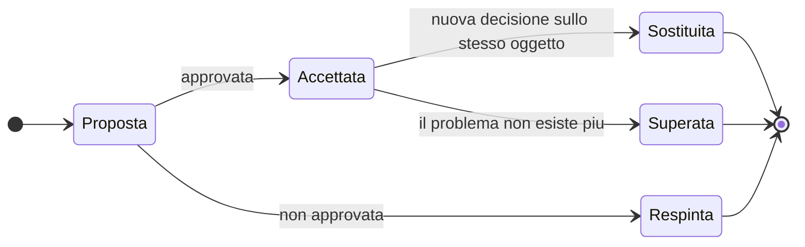

# Registro delle decisioni architetturali

Questo registro contiene le decisioni strutturali di Telemedic: quelle che è costoso cambiare
dopo, quelle che vincolano più di un'area, quelle la cui violazione non produce un difetto locale ma
un difetto sistemico.

Un ADR non serve a dire che cosa si è deciso: serve a dire **perché**, quali alternative sono state
scartate e a quale prezzo. Un registro che elenca decisioni senza ricostruirne la motivazione non
è utile a nessuno fra sei mesi, quando qualcuno proporrà in buona fede l'alternativa già scartata e
nessuno saprà più perché lo fu.

## Formato

Ogni ADR ha cinque parti obbligatorie.

| Parte | Contenuto |
|---|---|
| **Contesto** | Il problema, le forze in gioco, i vincoli che restringono lo spazio delle soluzioni |
| **Alternative valutate** | Ciascuna con i propri vantaggi **e** i propri compromessi. Un'alternativa presentata senza vantaggi non è stata valutata: è stata usata come contrasto |
| **Decisione** | Che cosa si è scelto, in forma verificabile |
| **Conseguenze** | Positive **e** negative. Le negative sono la parte più importante: sono ciò che si è accettato di pagare |
| **Stato** | `proposta` · `accettata` · `sostituita da ADR-NNNN` · `superata` |

Regole di scrittura:

- **Le decisioni non si cancellano e non si riscrivono.** Una decisione superata cambia stato e
  rinvia a quella che la sostituisce. La cronologia delle decisioni è parte della tracciabilità.
- **Ogni affermazione normativa cita la fonte** e ogni affermazione non verificata è marcata `[NV]`
  con il destinatario della richiesta.
- **Regola di riservatezza**: nessun nome di azienda, marchio, prodotto commerciale o dominio di
  potenziali partner. Si dice sempre «l'integratore», «un gestionale sanitario di terze parti», «un
  sistema EHR di terze parti».

## Ciclo di vita

Una decisione in stato `proposta` **non è vincolante**, e il documento che la contiene lo dichiara
insieme allo stato provvisorio in vigore nel frattempo. È il caso di ADR-0023.

## Indice

### Modello e confini

| # | Decisione | Stato |
|---|---|---|
| [0001](0001-separazione-prestazione-sessione-media.md) | Separazione fra prestazione clinica e sessione media | accettata |
| [0003](0003-dominio-indipendente-dallo-standard.md) | Il modello di dominio non conosce lo standard di interoperabilità | accettata |
| [0023](0023-contesto-della-rendicontazione.md) | Il contesto della rendicontazione: proposta di scostamento dalla base | **proposta** |

### Modello dati e interoperabilità

| # | Decisione | Stato |
|---|---|---|
| [0002](0002-fhir-r4-profilato-guide-italiane.md) | FHIR R4 profilato sulle guide italiane come modello canonico di scambio | accettata |
| [0004](0004-composizione-documentale-artefatto-primario.md) | Composizione documentale come artefatto primario del referto | accettata |
| [0005](0005-dataset-canonico-serializzazioni-sostituibili.md) | Dataset canonico dei documenti e serializzazioni sostituibili | accettata |
| [0017](0017-uri-del-codice-fiscale.md) | Identificatore del sistema del codice fiscale e traduzione al confine | accettata |
| [0018](0018-catalogo-prestazioni-struttura-nel-prodotto.md) | Catalogo delle prestazioni: struttura nel prodotto, contenuto per tenant | accettata |
| [0020](0020-serie-temporali-in-archivio-dedicato.md) | Serie temporali in archivio dedicato; le metriche del canale non sono osservazioni cliniche | accettata |

### Terminologie

| # | Decisione | Stato |
|---|---|---|
| [0016](0016-gateway-terminologico-unico-e-disattivabile.md) | Gateway terminologico unico, disattivabile, senza cache persistita e senza identificativi | accettata |
| [0019](0019-separazione-stringhe-di-interfaccia-ed-etichette-ufficiali.md) | Separazione fra stringhe di interfaccia ed etichette ufficiali | accettata |

### Interfacce ed esposizione

| # | Decisione | Stato |
|---|---|---|
| [0006](0006-due-piani-di-esposizione.md) | Due piani di esposizione sopra un unico modello di dominio | accettata |
| [0021](0021-convenzioni-delle-interfacce-pubbliche.md) | Convenzioni delle interfacce pubbliche | accettata |
| [0025](0025-formato-dei-token-verso-l-esterno.md) | Formato dei token verso l'esterno | accettata |

### Eventi e processi

| # | Decisione | Stato |
|---|---|---|
| [0008](0008-outbox-transazionale-unica-sorgente.md) | Outbox transazionale come unica sorgente degli eventi | accettata |
| [0009](0009-relay-outbox-per-interrogazione-periodica.md) | Il relay dell'outbox legge per interrogazione periodica | accettata |
| [0010](0010-buste-cloudevents-consegna-e-idempotenza.md) | Buste CloudEvents, consegna almeno una volta, idempotenza per costruzione | accettata |
| [0011](0011-eventi-magri-senza-contenuto-clinico.md) | Eventi magri: nessun contenuto clinico nei messaggi verso l'esterno | accettata |
| [0012](0012-segnalamento-fuori-dal-piano-degli-eventi.md) | Il segnalamento della sessione non transita per l'outbox né per il broker | accettata |
| [0022](0022-orchestrazione-dei-processi-clinici.md) | Orchestrazione esplicita dei processi clinici critici | accettata |

### Isolamento, identità, dimostrabilità

| # | Decisione | Stato |
|---|---|---|
| [0007](0007-schema-per-tenant-con-sicurezza-di-riga.md) | Uno schema per tenant con sicurezza a livello di riga come difesa in profondità | accettata |
| [0013](0013-registro-immutabile-a-quattro-strati.md) | Registro immutabile a quattro strati | accettata |
| [0015](0015-delega-esplicita-mai-impersonificazione.md) | Delega esplicita, mai impersonificazione | accettata |
| [0029](0029-registro-di-fiducia-unico-per-tenant.md) | Registro di fiducia unico per tenant | accettata |
| [0027](0027-modalita-a-non-conservazione-del-contenuto-clinico.md) | Modalità di esercizio a non conservazione del contenuto clinico | accettata |

### Media in tempo reale

| # | Decisione | Stato |
|---|---|---|
| [0014](0014-due-modalita-di-sessione-media.md) | Due modalità di sessione media e i loro effetti sul modello | accettata |
| [0028](0028-limite-dichiarato-di-partecipanti.md) | Limite dichiarato di partecipanti alla sessione media | **parzialmente accettata**: il numero resta rinviato a una misura |

### Telemonitoraggio

| # | Decisione | Stato |
|---|---|---|
| [0026](0026-regole-del-piano-di-telemonitoraggio.md) | Rappresentazione ed esecuzione delle regole del piano | accettata |
| [0030](0030-due-proiezioni-del-piano-da-una-sola-fonte.md) | Le due proiezioni del piano derivano da un'unica fonte | accettata |
| [0024](0024-punteggi-di-scale-cliniche-esclusi-in-via-cautelativa.md) | Punteggi di scale e questionari esclusi in via cautelativa | accettata, provvisoria |

## Mappa fra decisioni e vincoli di progetto

| Vincolo | ADR che lo realizzano |
|---|---|
| **[V1](../11_registri/03-vincoli-fondanti.md#v1)** - Sovranità del dato | 0016 (sovranità per assenza di dato) · 0009 (nessun componente aggiuntivo) |
| **[V2](../11_registri/03-vincoli-fondanti.md#v2)** - Separazione fra veicolo e interpretazione | 0004 · 0020 · 0024 |
| **[V3](../11_registri/03-vincoli-fondanti.md#v3)** - Integrabilità totale | 0006 · 0021 |
| **[V4](../11_registri/03-vincoli-fondanti.md#v4)** - Tenant-awareness | 0007 · 0008 (outbox per tenant) · 0010 (tenant obbligatorio nella busta) · 0013 (catena per tenant) |
| **[V5](../11_registri/03-vincoli-fondanti.md#v5)** - Auditabilità immutabile | 0013 · 0015 |
| **[V6](../11_registri/03-vincoli-fondanti.md#v6)** - Usabilità, accessibilità, mobile first | 0014 (indicatore non occultabile) · 0019 (stringhe adattabili) · 0028 (limite dichiarato invece di degrado silenzioso) |

## Vincoli di altre aree recepiti negli ADR

| Vincolo | Da | Recepito in |
|---|---|---|
| [V-111](../11_registri/01-vincoli-in-vigore.md#v-111) espandi e contrai su ogni migrazione | `TECH` | 0007 |
| [V-112](../11_registri/01-vincoli-in-vigore.md#v-112) contesto di tenant dentro la transazione | `TECH` | 0007 |
| [V-113](../11_registri/01-vincoli-in-vigore.md#v-113) nessun contatore cumulativo grezzo come indicatore | `TECH` | 0020 |
| [V-121](../11_registri/01-vincoli-in-vigore.md#v-121) l'allarme è una sequenza di eventi immutabili | `FUNZ` | 0026 |
| [V-123](../11_registri/01-vincoli-in-vigore.md#v-123) il campo soglia parte vuoto e obbligatorio | `FUNZ` | 0026 |
| [V-124](../11_registri/01-vincoli-in-vigore.md#v-124) istante di misura e di ricezione distinti | `FUNZ` | 0020 · 0026 |
| [V-126](../11_registri/01-vincoli-in-vigore.md#v-126) gli esiti tipizzati non sono codici di errore | `FUNZ` | 0021 |
| [V-131](../11_registri/01-vincoli-in-vigore.md#v-131) consegna dei candidati esattamente una volta e in ordine | `PROTO` | 0012 |
| [V-134](../11_registri/01-vincoli-in-vigore.md#v-134) nessuna intestazione dedicata per il tipo di contenuto | `PROTO` | 0010 |
| [V-135](../11_registri/01-vincoli-in-vigore.md#v-135) carico degli eventi con soli riferimenti | `PROTO` | 0011 |
| [V-136](../11_registri/01-vincoli-in-vigore.md#v-136) nessun modello documentale cablato | `PROTO` | 0005 |
| [V-137](../11_registri/01-vincoli-in-vigore.md#v-137) chiave di sessione e indirizzo della stanza sono credenziali | `PROTO` | 0025 |
| [V-142](../11_registri/01-vincoli-in-vigore.md#v-142) normalizzazione degli identificatori al confine | `DOM` | 0017 |
| [V-144](../11_registri/01-vincoli-in-vigore.md#v-144) formulazione della destinazione d'uso del telemonitoraggio | `DOM` | 0026 |
| [V-146](../11_registri/01-vincoli-in-vigore.md#v-146) cinque oggetti di consenso distinti | `DOM` | 0014 |
| [V-147](../11_registri/01-vincoli-in-vigore.md#v-147) nessun percorso di cura nel codice | `DOM` | 0026 |
| [V-149](../11_registri/01-vincoli-in-vigore.md#v-149) oscuramento applicato dal motore di autorizzazione | `DOM` | 0027 |
| [V-151](../11_registri/01-vincoli-in-vigore.md#v-151) nessun identificativo dell'assistito al servizio terminologico | `SEC` | 0016 |
| [V-156](../11_registri/01-vincoli-in-vigore.md#v-156) nessuna dichiarazione statica di suite negoziate | `SEC` | 0014 |
| [V-157](../11_registri/01-vincoli-in-vigore.md#v-157) mediatore unico di uscita | `SEC` | 0029 |
| [V-161](../11_registri/01-vincoli-in-vigore.md#v-161) nessun contenuto clinico nei messaggi in uscita | `INTEG` | 0011 |
| [V-166](../11_registri/01-vincoli-in-vigore.md#v-166) profilo del pagatore amministrativo per costruzione | `INTEG` | 0023 |

## Mappa fra decisioni e questioni di bacheca

| Questione | Risolta da |
|---|---|
| Catalogo delle prestazioni incluso o riferito | 0018 |
| Separazione fra internazionalizzazione ed etichette ufficiali | 0019 |
| Terminology server come componente di terze parti, parte residua | 0016 |
| Divergenza degli URI del codice fiscale | 0017 |
| Registrazione lato server e cifratura fino agli estremi | 0014 |
| Licenze di scale e questionari, misura cautelativa | 0024 |
| Dieci convenzioni delle interfacce pubbliche | 0021 |
| Tecnica del registro immutabile | 0013 |
| Orchestrazione contro coreografia | 0022 |
| Modalità del relay dell'outbox | 0009 |
| Il segnalamento non deve passare dall'outbox | 0012 |
| Interruttori e quote per tenant, non globali | 0008 · 0021 |
| Isolamento: schema per tenant o sicurezza di riga | 0007 |
| Topologia del segnale su più istanze | 0012 |
| Distribuzione dello stato di sessione con consegna ordinata | 0012 |
| Limite dichiarato di partecipanti | 0028 |
| Formato dei token verso l'esterno | 0025 |
| Rappresentazione ed esecuzione delle regole del piano | 0026 |
| Dove vive la storia degli allarmi senza conservazione del contenuto | 0027 |
| Modalità a non conservazione del contenuto clinico | 0027 |
| Registro di fiducia unico per tenant | 0029 |
| Le due proiezioni del piano di telemonitoraggio | 0030 |
| Punto e periodicità dell'ancoraggio del registro | 0013 |

## Come si propone una modifica

1. Si verifica se l'oggetto è già trattato: una decisione presa si **sostituisce**, non si aggira.
2. Si verifica se rientra fra le
   [decisioni rinviate](../02_architecture/09-decisioni-rinviate.md): in tal caso non si decide in
   una pull request, si apre una voce sulla bacheca inter-agenti.
3. Si scrive un ADR nuovo con stato `proposta`, che rinvia a quello che intende sostituire.
4. Si dichiara sulla bacheca, indicando le aree vincolate.
5. All'approvazione, l'ADR sostituito cambia stato e rinvia al nuovo. **Non si cancella.**

## Che cosa non entra in questo registro

Le scelte di libreria, di struttura dei moduli di build e di convenzione di codice appartengono
all'area tecnica; le misure di sicurezza e la loro configurazione all'area di sicurezza; i
contratti verso i sistemi terzi all'`INTEG`. Entrano qui solo le decisioni che
**vincolano più di un'area** o che **sono costose da cambiare**.

Il criterio operativo: se la decisione può essere cambiata da una sola squadra in una sola pull
request senza coordinamento, non è un ADR.
