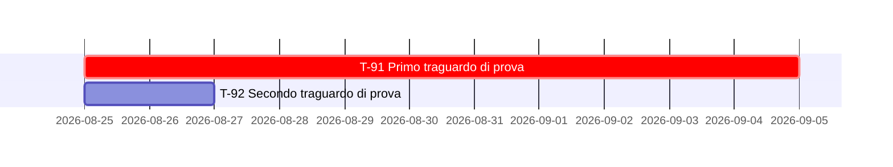

# Test fixture - milestones chapter, English, consistent

This fixture does not describe traguardi reali del progetto: contiene la sola struttura che
`scripts/verifica-coerenza-delle-date.sh` esamina, cioe' le tre rappresentazioni della stessa
data. Le sigle e le date sono fittizie e scelte perche' un errore di parsing si veda.

### `T-91` - Primo traguardo di prova
*Class `A`* · `[COMMITMENT]` · **26 September 2026**

### `T-92` - Secondo traguardo di prova
*Class `D`* · `[COMMITMENT]` · **CLOSED on 27 August 2026**, planned for 12 September

### `T-93` - Traguardo senza data di calendario
*Class `D`* · `[INTENTION]` · **2027, in parallel to development**

## 7. Quadro d'insieme

### 7.1 Tabella di sintesi

| # | Traguardo | Classe | Enunciato | Data | Innesco | Titolare |
|---|---|:-:|:-:|---|---|---|
| `T-91` | Primo traguardo di prova | `A` | `[COMMITMENT]` | 5 Sep 2026 | Immediato | Contributore unico |
| `T-92` | Secondo traguardo di prova | `D` | `[COMMITMENT]` | **closed on 27 Aug 2026** | Immediato | Contributore unico |
| `T-93` | Traguardo senza data di calendario | `D` | `[INTENTION]` | 2027 | `T-91` | Contributore unico |
