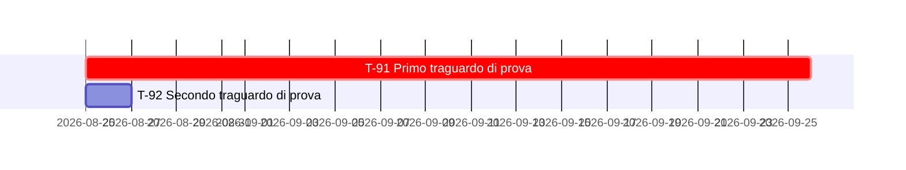

# Tenuta di prova - capitolo dei traguardi, italiano, coerente

Questa tenuta non descrive traguardi reali del progetto: contiene la sola struttura che
`scripts/verifica-coerenza-delle-date.sh` esamina, cioe' le tre rappresentazioni della stessa
data. Le sigle e le date sono fittizie e scelte perche' un errore di parsing si veda.

### `T-91` - Primo traguardo di prova
*Classe `A`* · `[IMPEGNO]` · **5 settembre 2026**

### `T-92` - Secondo traguardo di prova
*Classe `D`* · `[IMPEGNO]` · **CHIUSO il 27 agosto 2026**, previsto per il 12 settembre

### `T-93` - Traguardo senza data di calendario
*Classe `D`* · `[INTENZIONE]` · **2027, in parallelo allo sviluppo**

## 7. Quadro d'insieme

### 7.1 Tabella di sintesi

| # | Traguardo | Classe | Enunciato | Data | Innesco | Titolare |
|---|---|:-:|:-:|---|---|---|
| `T-91` | Primo traguardo di prova | `A` | `[IMPEGNO]` | 5 set. 2026 | Immediato | Contributore unico |
| `T-92` | Secondo traguardo di prova | `D` | `[IMPEGNO]` | **chiuso il 27 ago. 2026** | Immediato | Contributore unico |
| `T-93` | Traguardo senza data di calendario | `D` | `[INTENZIONE]` | 2027 | `T-91` | Contributore unico |
