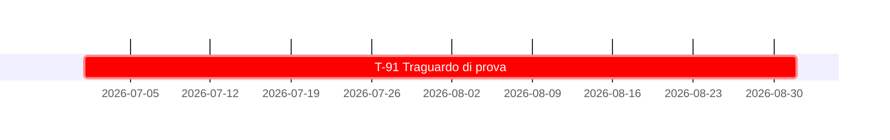

# Tenuta di prova - la scheda usa il mese abbreviato, come la tabella di sintesi

Il controllo deve leggerlo come data e vedere la divergenza, non saltarlo in silenzio.

### `T-91` - Traguardo con data abbreviata nella scheda
*Classe `A`* · `[IMPEGNO]` · **1 ago. 2026**

## 7. Quadro d'insieme

### 7.1 Tabella di sintesi

| # | Traguardo | Classe | Enunciato | Data | Innesco | Titolare |
|---|---|:-:|:-:|---|---|---|
| `T-91` | Traguardo di prova | `A` | `[IMPEGNO]` | 1 set. 2026 | Immediato | Contributore unico |
