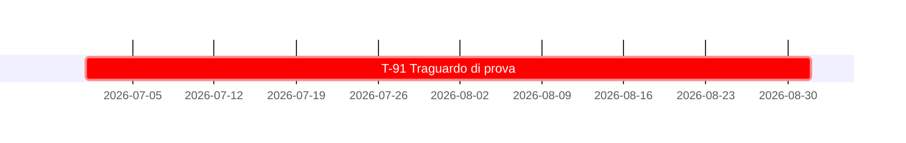

# Tenuta di prova - la scheda porta una data di forma completa con un mese non riconoscibile

### `T-91` - Traguardo con mese illeggibile
*Classe `A`* · `[IMPEGNO]` · **1 brumaio 2026**

## 7. Quadro d'insieme

### 7.1 Tabella di sintesi

| # | Traguardo | Classe | Enunciato | Data | Innesco | Titolare |
|---|---|:-:|:-:|---|---|---|
| `T-91` | Traguardo di prova | `A` | `[IMPEGNO]` | 1 set. 2026 | Immediato | Contributore unico |
