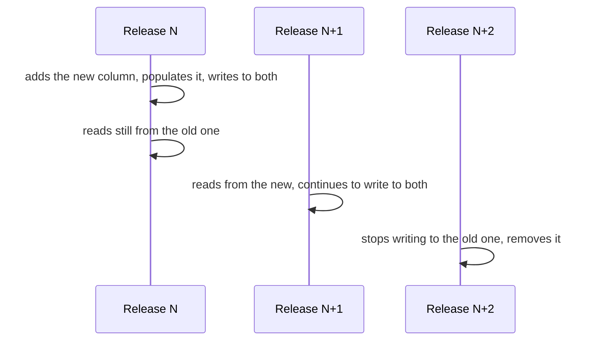

# Persistence

The database is the point where architectural decisions become irreversible. An error in the web layer is corrected with a release; an error in the schema is corrected with a migration on existing data, which in clinical context means touching information that has evidentiary value. This chapter describes the structure, the rules of evolution and the known limits.

The foundations - what is a transaction, what is isolation, why time must be modelled on two axes - are in [`docs/10_fondamenti/11-fondamenti-informatici.md`](../10_fondamenti/11-fondamenti-informatici.md). The conceptual model of aggregates is in the architectural baseline §2 and in `docs/02_architecture/`.

---

## 1. The five principles

1. **No external identifier is a primary key.** The fiscal code, the patient identifier in the integrator's system, the regional booking number are *identifiers with explicit attribution domain*, not keys. It follows that every external identifier lives in an identifier table with `system`, `value`, `use` and temporal validity, never in a column of the main table. It is the architectural baseline §3, and is the sole structure that survives the day an identifier changes or is reattributed.
2. **What is clinical is not updated: it is superseded.** The signed document, the measurement of a parameter, the consent given are facts. A correction is a new fact that rectifies the previous one, with the chain maintained and the reason recorded.
3. **Time has two axes.** The instant the fact happened and the instant the system learned of it are different columns and not interchangeable. A measurement recorded at 8:00 and synchronised at 19:00 is normal data in telemonitoring, and confusing it with a measurement recorded at 19:00 produces a clinically wrong evaluation.
4. **The tenant context is applied by the engine.** Not by code, not by discipline, not by reviews. See §3.
5. **The absence of data is data.** A measurement expected and not received is not a missing row: it is a row that says "expected, not received". It is constraint V-09, and has direct consequences on the schema of the observation plan.

---

## 2. Organisation of schemas

### 2.1 The structure

One **schema per tenant × context pair**, on shared database, with two cross-cutting schemas.

```
telemedic (database)
├─ platform            tenant catalogue, migration register, keys
├─ reference           non-clinical and non-tenant-specific reference data
├─ t0001_identity
├─ t0001_registry
├─ t0001_encounter
├─ t0001_media_session
├─ t0001_clinical_document
├─ t0001_monitoring
├─ …
├─ t0002_identity
└─ …
```

The choice combines the two separations that matter: that **between tenants**, imposed by D8 and the architectural baseline §4, and that **between contexts**, imposed by the rule that no context accesses the database of another. The schema name uses an **opaque ordinal**, not the tenant name: the name is personal data at the moment the tenant is an individual medical practice, and schema names appear in error messages, execution plans and administration tools.

The tenant → ordinal mapping lives in `platform.tenant_directory`, and is the only point the code consults. It is also what makes possible, some day, to move a tenant to a separate database without touching a line of domain: the resolution changes, not the access.

**The outbox is not in `platform`.** The outgoing events table lives in the schema of the tenant × context pair that produces the event, as point 1 of [ADR-0008](/adr/0008-outbox-transazionale-unica-sorgente.md) and [06 - Events and internal integration](/02_architecture/06-eventi-e-integrazione-interna.md#23-where-the-table-lives) §2.3 provide. The reason is atomicity - data and event are written in the same transaction, thus in the same transactional scope - and the consequences a common schema would not give are three: dismissing a tenant carries its own outbox with it instead of leaving its rows in a shared table; the row policies of the tenant schema also cover outgoing events; and the relay iterates explicitly over tenants, as [05 - Multi-tenancy](/02_architecture/05-multi-tenancy.md#33-processes-that-do-not-originate-from-a-request) §3.3 requires, instead of reading all schemas in a single query. See §7.

### 2.2 Roles and privileges

Each context has its **own application role**, with privileges only on its own schemas. It is not a refinement: it is what makes the first backend dependency rule verifiable by the engine instead of by code review.

| Role | Privileges |
|---|---|
| `app_<context>` | `SELECT, INSERT, UPDATE, DELETE` on own schemas, according to the nature of tables |
| `app_audit` | `INSERT` and `SELECT` on immutable register tables. **No `UPDATE`, no `DELETE`, ever** |
| `app_migrator` | Structure modification. Used only by the migration process, never by the application in live operation |
| `app_readonly` | `SELECT` for reporting and diagnostics, excluding columns of clinical content |

The owner of objects **is not** the application role: if it were, the application role could alter the structure and, above all, could bypass row-level security, because the owner of a table is exempt from it by default. It is the configuration error that silently voids the entire isolation model, and must be verified by a test that queries the system catalogue.

### 2.3 Row-level security as defence in depth

With schema per tenant, primary isolation is already given by object separation. Row-level security adds the second layer, and serves to cover the real case: a code path that resolves the schema poorly, a dynamically constructed query, a scheduled job that runs without context.

```sql
-- Illustrative.
ALTER TABLE t0001_encounter.prestazione ENABLE ROW LEVEL SECURITY;
ALTER TABLE t0001_encounter.prestazione FORCE ROW LEVEL SECURITY;

CREATE POLICY prestazione_tenant ON t0001_encounter.prestazione
  USING (tenant_id = current_setting('app.tenant_id', true)::uuid);
```

Two details that decide if this really works.

`FORCE ROW LEVEL SECURITY` is necessary because without it the table owner is not subject to the policy. Omitting it is the most common way to have a policy that protects nothing.

The third argument of `current_setting` at `true` makes it return `NULL` instead of raising an exception when the variable is not set: `tenant_id = NULL` is false, so the policy **denies everything** in the absence of context. It is the wanted behaviour: access without resolved tenant must see nothing, not everything.

**The connection pool trap.** The variable must be set with `SET LOCAL` **inside the transaction**, because `SET LOCAL` is cancelled at the end of the transaction and cannot survive return to the pool. A `SET` without `LOCAL` leaves the context attached to the connection, and the next connection - of another tenant - inherits it. It is the most insidious data leak between tenants, because it does not produce errors: it produces wrong results. The mechanism is realised once only, in `platform/tenancy`, and is tested with a test that deliberately exhausts the pool and verifies isolation.

### 2.4 The declared limit of the model

The schema-per-tenant model **does not scale indefinitely**. The number of objects in the system catalogue grows with the product tenant × contexts × tables; above a certain threshold planning of queries degrades, logical export times degrade and maintenance operations, and memory consumption per connection increases.

`[NV]` - **the threshold has not been measured by the project and is not invented here.** It must be determined with a capacity test on a representative installation, and the result must be published as a product limit, not as generic figure taken elsewhere. Until then the documentation declares: the model is designed for an order of magnitude of **hundreds** of tenants per installation; beyond that, the correct structure is partitioning across multiple databases, made possible without domain modifications by the tenant register of §2.1.

Declaring the limit is part of the product. An undeclared limit is discovered in live operation.

---

## 3. Migrations

### 3.1 Rules

**Versioned, ordered, immutable, with fingerprint verified.** A migration already applied is never modified: the next one is written. Fingerprint verification exists precisely to make retroactive modification impossible, which is the classic cause of divergences between environments.

**Only forward.** Rollback migrations do not exist. A wrong migration is corrected with a subsequent one. The reason is practical before it is philosophical: rollback of a structural modification that has already destroyed data is impossible, and its existence in the repository creates the illusion otherwise.

**Structure and data are separate.** A structural migration changes the form; a data migration changes the content. The latter are idempotent, restartable, executed in blocks with advancement recorded, and do not run inside the transaction of the first. A data migration on a real-world clinical table that runs in a single transaction blocks the system for its entire duration.

**Expand and contract, always.** No release is together destructive and functional:



It follows that two consecutive versions of the application must be able to coexist on the same database - a necessary condition for update without interruption, and a necessary condition to be able to roll back one release without data loss. It is the constraint that this area imposes on others on the noticeboard.

**Non-blocking.** The addition of a column with default, the creation of an index, the addition of a constraint all have both a blocking form and a non-blocking one. The latter is always used: index creation in concurrent mode - which however **cannot run inside a transaction**, and so must be marked as such in the migration - and constraints added as unvalidated and then validated in a separate step, which takes a weaker lock.

### 3.2 Migrating N schemas

With schema per tenant, every structural migration must be applied to every tenant. The process:

1. Migrations of `platform` and `reference` run first, once.
2. For each tenant in the register, migrations of the context run in its schema, with status recorded **per tenant** in `platform.migration_state`.
3. Failure on one tenant **does not block the others** but marks that tenant as unaligned, and an unaligned tenant does not receive traffic from the new application version.
4. Advancement is observable: how many tenants migrated, how many in progress, how many failed, with what error. On hundreds of tenants, a migration without visible advancement is an operation conducted blind.

Point 3 is the reason why the compatibility verification of §3.1 is not optional: during a long migration, tenants on different schema versions coexist by construction.

---

## 4. The data model

### 4.1 Keys

Primary technical key, generated by the application, **sortable by creation time**. Application-side generation allows knowing the identifier before writing - necessary to build the outbox event in the same transaction; temporal sortability avoids the index fragmentation that a completely random identifier produces, which on clinical tables at high insertion rate is a real and growing cost.

No natural key. No composite key that includes the tenant, because the tenant is already in the schema and repetition would create two sources of truth.

### 4.2 Time, concretely

| Column | Meaning | Who writes it |
|---|---|---|
| `occurred_at` | When the fact happened in the world | The source of the fact |
| `recorded_at` | When the system learned of it | The system, with server clock |
| `valid_from` / `valid_to` | Window of validity of the statement | The domain |
| `superseded_by` | Reference to the fact that supersedes this one | The domain, at rectification |

The timezone is always explicit and storage is in absolute instant. Display in local hour is responsibility of the interface. Storing a local hour without timezone in a system operating over a territory with daylight saving time means having, twice a year, an ambiguous hour - and an ambiguous hour on a monitoring trace is a clinical defect.

### 4.3 Immutability applied

For tables hosting immutable facts - measurements, signed documents, consents, register rows - immutability is not a convention:

```sql
-- Illustrative.
REVOKE UPDATE, DELETE ON t0001_monitoring.misura FROM app_monitoring;

CREATE RULE misura_no_update AS ON UPDATE TO t0001_monitoring.misura DO INSTEAD NOTHING;
```

The privilege revocation is the defence that counts; the rest is redundancy useful to make intent clear to whoever reads the schema.

---

## 5. Time series

### 5.1 Two families that must not be confused

**Clinical measurements** - telemonitoring parameters, structured questionnaires. They are **healthcare data**: immutable, with complete capture context, subject to regulated retention, to right of access, to access tracing. They are not sampled, not destructively aggregated, not discarded for age without a declared retention rule.

**Media session quality samples** - network and flow indicators. They are **technical data** with a component of personal data (who talked to whom, when, for how long). They are aggregated, thinned, have short retention.

Treating them the same way is the error that leads either to discarding clinical data or to keeping millions of technical samples for years. The two families sit in different schemas, with different policies and different roles.

### 5.2 Form of the tables

```sql
-- Illustrative. Only synthetic data in every example of the project.
CREATE TABLE t0001_monitoring.misura (
    id                uuid        PRIMARY KEY,
    tenant_id         uuid        NOT NULL,
    soggetto_id       uuid        NOT NULL,
    piano_id          uuid        NOT NULL,
    parametro_system  text        NOT NULL,   -- system explicit, always
    parametro_code    text        NOT NULL,
    valore            numeric,
    unita_ucum        text,
    stato             text        NOT NULL,   -- rilevata | attesa_non_pervenuta | annullata
    origine           text        NOT NULL,   -- gateway | inserimento_manuale | questionario
    occurred_at       timestamptz NOT NULL,
    recorded_at       timestamptz NOT NULL DEFAULT now(),
    contesto          jsonb       NOT NULL,   -- strumento, metodo, soggetto rilevatore
    CONSTRAINT misura_valore_o_assenza
        CHECK ((stato = 'rilevata' AND valore IS NOT NULL)
            OR (stato <> 'rilevata' AND valore IS NULL))
);

CREATE INDEX ON t0001_monitoring.misura (soggetto_id, parametro_code, occurred_at DESC);
```

Three choices worth noting. The `attesa_non_pervenuta` (expected not received) state **exists as a row**: it is the schematic translation of constraint V-09, and without it patient silence would be indistinguishable from normality. The `system` of the parameter is a column, not an assumption: it is architectural baseline §7. The unit of measurement is kept next to the value, because a number without unit in a clinical context is not data: it is a risk.

### 5.3 Hyper-tables or native partitioning

As established in [`01-stack-e-motivazioni.md`](./01-stack-e-motivazioni.md) §7.3, there are two implementations behind the same interface.

| Aspect | Time-series extension | Native declarative partitioning |
|---|---|---|
| Partition creation | Automatic | Scheduled, with declared advance |
| Retention | Declarative policy | Detach and discard of partition |
| Compression | Available (verify licence regime) | Absent |
| Continuous aggregates | Available (ditto) | Summary tables updated by application |
| Query | Identical | Identical |

**The partition interval must be chosen on volume, not by habit.** Partitions too small multiply objects in the system catalogue - which, summed to the multiplier of tenants from §2.4, is the fastest way to reach the limit of the model. Partitions too large make retention coarse. `[NV]` - the reference interval must be determined with a capacity test, not assumed.

### 5.4 Retention

Retention **is not automatic deletion**. Every policy has three declared elements: which family of data, for how long, and under which rule. For traceability data and for access and authentication data the terms are fixed by constraint V-15 of `SEC` and this area adopts them without reinterpretation. For clinical data the term is determined by the data controller and configured per tenant: it is not a product constant, and hard-coding it would be a regulatory error in addition to a technical one.

What the product guarantees is **the mechanism**: the policy is declared, execution is traced, outcome is verifiable, and there are no unrecorded deletions.

---

## 6. Indices

### 6.1 The rule

Every index has a write cost, a space cost and a maintenance cost, and an index is added **only with the query that justifies it**. The repository contains, alongside the migration that creates an index, the execution plan before and after, on a set of synthetic data of declared size. Without this, indices accumulate for fear and no one removes them anymore, because no one knows anymore what each served for.

### 6.2 The families that matter

| Family | Form | Reason |
|---|---|---|
| Access by subject and time | `(soggetto_id, occurred_at DESC)` | It is the dominant read pattern of all clinical domain |
| Resolution of external identifier | `(sistema, valore)` with partial uniqueness on `uso = 'ufficiale'` | Ingress from the integrator's system |
| Outbox queue | **Partial** index on `pubblicato_il IS NULL` | See §7 |
| Active state | Partial index on open state | Closed services are the vast majority and must not be indexed for the same access |
| Textual search on documents | Generalised inverted index | Only where the feature really exists, not "for the future" |

**Partial indices are the most undervalued lever.** An index on the outbox queue that covers only not-yet-published rows stays small forever, while the table grows. The same goes for active states in all the domain's state machines.

**No index on `tenant_id`** inside schemas per tenant: the column has a single value per schema and the index would be useless. The column remains because it serves row-level security policy and future partitioning.

### 6.3 Query patterns that must be avoided

- **Offset-based paginat query.** Cost grows with depth and results are inconsistent under concurrent writes. Cursor-based pagination on a stable ordered key is used, and is exposed as such in the interface.
- **Lazy loading in loops.** The classic defect of object-relational mapping layer. Loads of lists use explicit projections, not complete entities: a projection declares what is needed, and what is not needed is not read - which is also a minimisation requirement, not just a performance one.
- **Queries built by concatenation.** Forbidden. Every parameter is bound, always. The rule is verified by static analysis.
- **`SELECT *` to a clinical table.** Reads columns of content that often are not needed and that, once read, end up in memory, in diagnostics logs and in traces.

---

## 7. The outbox

**The table lives in the schema of the tenant × context pair that produces the event**, not in a common schema: point 1 of [ADR-0008](/adr/0008-outbox-transazionale-unica-sorgente.md) provides it, and the architecture chapter repeats it in [06](/02_architecture/06-eventi-e-integrazione-interna.md#23-where-the-table-lives) §2.3. The example below therefore shows a pair schema, not `platform`.

```sql
-- Illustrative. One table for every tenant × context pair that produces events.
CREATE TABLE t0001_clinical_document.outbox (
    id             uuid        PRIMARY KEY,
    tipo           text        NOT NULL,        -- event type, versioned in name
    chiave         text        NOT NULL,        -- partitioning key
    busta          jsonb       NOT NULL,        -- references, never clinical content
    creato_il      timestamptz NOT NULL DEFAULT now(),
    pubblicato_il  timestamptz,
    tentativi      int         NOT NULL DEFAULT 0,
    ultimo_errore  text
);

CREATE INDEX outbox_da_pubblicare
    ON t0001_clinical_document.outbox (creato_il)
    WHERE pubblicato_il IS NULL;
```

**There is no tenant column.** The schema that contains the table already determines it, and a column that repeats information implicit in the placement is a place where the two values can diverge: a row with the wrong tenant in a common schema is indistinguishable from a correct row. The tenant appears instead in the envelope, in opaque form, because the envelope leaves the perimeter and its recipient does not know the originating schema (§2.1 and [06](/02_architecture/06-eventi-e-integrazione-interna.md#32-rules-on-the-envelope) §3.2).

The relay picks up with `SELECT ... FOR UPDATE SKIP LOCKED`, which allows multiple instances to work in parallel without coordinator and without two instances taking the same row. Publishing happens in batches; marking is in the same transaction as reading.

**The relay iterates over tenants, one table at a time.** There is no single query reading the events of all schemas: it would be a path crossing the boundary between tenants, and [05 - Multi-tenancy](/02_architecture/05-multi-tenancy.md#33-processes-that-do-not-originate-from-a-request) §3.3 forbids it explicitly for the outbox relay. The declared cost is that the idle polling load is not constant but **proportional to the number of active tenants**, and it is the quantity to be sized before multiplying per-tenant installations.

Parallel pick-up that skips already locked rows has a consequence on ordering that must be read together with this page: two instances can publish two events of the same aggregate in inverted order. The conditions under which per-key order holds, and those under which it does not, are declared in [06 - Events and internal integration](/02_architecture/06-eventi-e-integrazione-interna.md#41-what-is-guaranteed-and-what-is-not) §4.1.

**The envelope contains no clinical content.** It is constraint V-14 of `INTEG`, and is adopted here at schema level: the `busta` column carries identifiers and references, content is re-read with an authenticated call under the receiver's authorisation. The check that no envelope contains clinical fields is a test, not a convention.

**Published rows are pruned.** They remain the time necessary for diagnostics - the horizon is configured - then are removed. Long-term traceability of what was sent lives in the immutable register, not in the outbox, which is a delivery mechanism and not an archive.

---

## 8. The immutable register

### 8.1 What it is not

Entity versioning offered by the persistence layer **is not an immutable register**. It produces revision tables that are tables like any other: whoever has write access to the database can alter them. D42 says so, constraint V-04 imposes it on all areas, and this area adopts it without mitigation.

Versioning remains, and serves: it gives the application history of entities, useful to understand *how we got* to a state. But it is not what demonstrates who accessed what.

### 8.2 What it is

A structure append-only, with hash chain, kept separate from the system that generates events.

```sql
-- Illustrative.
CREATE TABLE audit_store.evento (
    seq           bigserial   PRIMARY KEY,
    tenant_id     uuid        NOT NULL,
    occurred_at   timestamptz NOT NULL,
    attore        text        NOT NULL,   -- pseudonym per tenant, not direct identifier
    per_conto_di  text,                   -- delegation, never impersonation
    azione        text        NOT NULL,
    oggetto_tipo  text        NOT NULL,
    oggetto_id    text        NOT NULL,   -- pseudonym per tenant
    esito         text        NOT NULL,
    livello_garanzia text     NOT NULL,   -- qualified: eseguito or riferito
    prev_hash     bytea       NOT NULL,
    hash          bytea       NOT NULL
);
```

The properties that make it a register and not a table:

1. **`INSERT` is the only privilege** granted to the role that writes to it. No `UPDATE`, no `DELETE`, in any circumstance, including migrations.
2. **Every row contains the fingerprint of the previous one.** Altering a row requires recalculating all subsequent ones, which makes tampering detectable with a linear verification.
3. **Retention is separate**: separate database, separate credentials, separate backup. Separation is what makes alteration an operation on two systems instead of one.
4. **The chain endpoint is periodically anchored** on a support that the system cannot rewrite. The form of anchoring and its frequency are decision of `SEC`; this area provides the hook point and the format.
5. **No clinical content.** The register says who, what, when, on which subject, with which outcome and with which assurance level - not what was written. Constraint V-13 of `SEC`.
6. **Identifiers are pseudonyms per tenant.** The register is the system with the longest retention and the broadest readership: it is the last place where direct identifiers must appear.

The verification of chain integrity is a periodically scheduled operation **and** an operation available on request, with outcome recorded. A chain that no one verifies is a chain that protects nothing.

---

## 9. Backup and restore

### 9.1 What is declared and in what form

Recovery point objectives and recovery time objectives are **product specification and installation capability, never compliance**. Constraint V-12 is explicit: no technical threshold is imposed by Italian regulation. The project declares which mechanisms it has and which objectives are achievable with which configuration; the actual objective is set by the data controller in their own analysis.

### 9.2 The mechanisms

| Mechanism | Covers | Does not cover |
|---|---|---|
| Physical copy of base plus continuous transaction log archiving | Failure of storage, corruption, human error with recovery to precise instant | Logically propagated deletion |
| Logical export per schema | Restore of single tenant, migration between installations | Large volumes in short times |
| Continuous replication to secondary node | Failure of primary node | Logical error: it replicates that too, at that instant |
| Separate copy of immutable register | Integrity of traceability | - |

**Single tenant restore is the main reason for the schema-per-tenant model.** On shared database without separation, restoring a tenant means restoring everything in a separate environment and extracting; with the schema, it is a logical export of a known set of schemas. It is an operation that really serves: accidental deletion by a tenant administrator, dispute, migration to own installation.

### 9.3 The rules that make restore real

1. **Backup is encrypted at rest with per-tenant keys.** It follows the wanted consequence: destroying the key makes the content irrecoverable even from copies - cryptographic deletion, which is the only practicable way to honour a deletion request without rewriting the history of copies.
2. **Restore is tested, with declared frequency, on a separate environment, with outcome recorded.** A backup never restored has unknown probability of working. The test includes verification of the immutable register chain: a restore that produces an unverifiable chain is a failed restore, not a successful restore with a warning.
3. **The encryption key for backups does not reside in the system that produces them.** Otherwise system compromise comprises backups, which is precisely the scenario backups exist for.
4. **The restore procedure is written as an executable sequence**, with commands, order, intermediate checks and completion criteria, and sits in the operations manual. A procedure that must be reconstructed during the incident is not a procedure.

### 9.4 The tension that must be declared

The right to deletion and the obligation to keep coherent copies are in tension, and the tension is not resolved with a technical choice: it is governed. The project adopts cryptographic deletion for content and maintains in the immutable register the **trace of the deletion** - who requested it, who performed it, when, on which perimeter - because deleting without leaving a trace of the act would make it impossible to prove that the obligation was fulfilled. The determination of legal bases and perimeters is not this area's: it is of the data controller and of `COMP`.

---

## 10. Declared limits

Summary, because a persistence chapter without declared limits is incomplete.

| Limit | Nature | Status |
|---|---|---|
| Number of tenants per installation in the schema model | Structural, due to catalogue growth | `[NV]` to be measured; declared order of magnitude: hundreds |
| Event delivery latency | Equal to relay polling interval | Declared in [`07-prestazioni-e-capacita.md`](./07-prestazioni-e-capacita.md) |
| Compression and continuous aggregates of time series | Absent in fallback implementation | Declared, with replacement via summary tables |
| Duration of migrations on many tenants | Grows linearly with number of tenants | Mitigated by per-tenant execution and advancement observability |
| Restore to precise instant | Granularity equal to transaction log archiving frequency | Configurable by whoever installs, declared in manual |

---

**Continues in**: [`04-frontend.md`](./04-frontend.md) for the interface side, [`06-osservabilita.md`](./06-osservabilita.md) for what can and cannot be logged.
