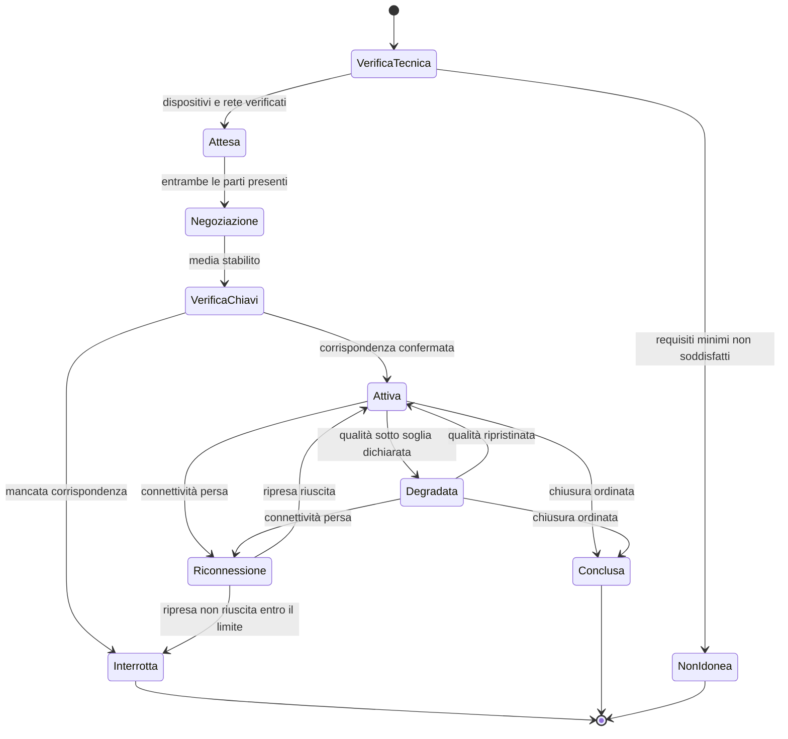

# Frontend

The Telemedic interface is not the "visible" part of the system: it is the part where clinical risk manifests. An elderly patient who cannot find the button to enter the consultation, a professional who does not notice the session is being recorded, a quality alert that passes unnoticed are product defects, not aesthetic flaws. D25 establishes this as a cross-cutting constraint and this chapter translates it into requirements that can **be tested to fail**.

The foundations of component architecture are not repeated. The functional behaviour of screens is in `docs/03_functional/`; the model of interaction with media is in [`05-media-e-tempo-reale.md`](./05-media-e-tempo-reale.md).

---

## 1. The criterion that governs everything

D25, point 9, fixes the operational acceptance criterion: **every functional requirement must be completable by an elderly patient on a smartphone on mobile network, and by a professional with only keyboard and screen reader. If it is not possible, the requirement is not satisfied.**

It follows a consequence on the working method worth making explicit: there is no "mobile adaptation phase" and there is no "accessibility pass phase". A screen that does not satisfy the criterion is not a screen to finish: it is an unfinished screen. The verifiable criteria that make this principle operational are at §§6 and 7.

---

## 2. Structure of the application

### 2.1 Organisation

Like the backend, it separates by functionality and not by technical nature.

```
web/
├─ core/                    cross-cutting, no feature logic
│  ├─ auth/                 session, token, renewal, disconnection
│  ├─ http/                 interceptors, retries, correlation, errors
│  ├─ i18n/                 internationalisation, formatting
│  ├─ a11y/                 announcement services, focus management, preferences
│  ├─ config/              runtime configuration per tenant
│  └─ telemetry/            interface measures, without content
├─ design-system/           base components, accessible by construction
├─ features/
│  ├─ waiting-room/         technical verification and waiting
│  ├─ consultation/         session: media, chat, sharing, key verification
│  ├─ consent/              collection and revocation of consent
│  ├─ documentation/        reporting and signature
│  ├─ monitoring/           plans, measurement input, questionnaires
│  └─ admin/                tenant administration
├─ embeddable/              custom element for the integrator
└─ app/                     assembly, routing, startup
```

**Dependency rules, verified in continuous integration.** `features` does not depend on `features`: two features that need to communicate do so through `core` or through routing. `design-system` does not depend on anything but itself and the platform: it is the condition for it to be reusable in the embeddable component without dragging the entire application. `embeddable` depends on `design-system` and `core`, never on whole `features`.

### 2.2 Autonomous components and lazy loading

No modules, autonomous components everywhere. The relevant consequence is not stylistic: the dependency graph becomes real and lazy loading becomes exact. Every routing boundary is a load boundary, and the first load comprises **only** what is needed for the first useful screen.

This matters because the reference use case is a patient on mobile network opening the link received minutes before the consultation. The time passing between touch and the ability to press "enter" is the first real accessibility requirement, before any formal criterion.

### 2.3 The embeddable component

The artefact that the integrator embeds in their interface is a **custom element conforming to the web components standard**, not an application mounted inside another. The reasons are contractual: not imposing a framework (project implication n. 1 of the archetype integrator profile) and not letting the container's styles alter the component.

Implementation constraints, which adopt constraint V-16 of `INTEG`:

- **Style isolation** with shadow root. No injection of external stylesheets, in any form.
- **Closed and versioned set of theme properties**, exposed as platform custom properties. The proposed value is **validated server-side with contrast verification**, and configuration that degrades accessibility is **rejected on save**, not accepted with a warning.
- **Non-themable and non-hideable elements**: recording indicator, alerts and consent texts, key verification result, encryption state indicator. It is not configuration: it is a component rule, and a test verifies it by attempting to violate it.
- **Communication with the container by messages**, with origin verified against an allow-list per tenant and versioned message schema. A message from an unexpected origin is ignored and logged.

---

## 3. State

### 3.1 Three categories, three treatments

Confusing the three is the origin of most accidental complexity in applications of this type.

| Category | Examples | Where it lives | How it is updated |
|---|---|---|---|
| **Server state** | Demographics, agenda, measurements, documents | Not in the client: read when needed, with declared cache and explicit invalidation | Request, event, user action |
| **Interface state** | Panel open, form step, filter | In the component, with signals | Interaction |
| **Media session state** | Negotiation, connectivity, quality, recording | Explicit single state machine | Engine connection events and signalling channel |

**There is no single global store.** A global store in a clinical application becomes, within months, the place where clinical content also ends up - and therefore the place it ends up in diagnostic logs and in development tools. The rule is: clinical content does not reside in global structures and does not survive the screen that shows it.

### 3.2 The media session state machine

The media session has an **explicit, single and testable state machine without browser**. It is not a collection of scattered boolean variables between components: it is a type with declared transitions, in which an unexpected state is an error.



Two states deserve attention because they are the ones that in hurried implementations do not exist. `VerificaChiavi` is a **blocking state**: the session is not "active" until verification is confronted, because it is what makes demonstrable the property of encryption to the endpoints and is a risk control, not a courtesy step. `Degradata` is a **visible state** to the user: a session that works poorly and does not say so is more dangerous than one that stops, because it produces a clinical evaluation on an image the professional believes faithful.

---

## 4. Network resilience

The reference case is not fibre: it is mobile network in motion, residential Wi-Fi, hospital network with client isolation. Resilience here is an accessibility requirement (D25, point 7), not an optimisation.

### 4.1 Signalling channel

- **Reconnection with exponential backoff and jitter**, with declared ceiling and declared number of attempts. Jitter is not a detail: without it, all sessions dropped for the same fault retry at the same instant.
- **Session resumption, not reconstruction.** On reconnection the client declares the session, the last message received and the current negotiation generation; the server sends back what is missing. Recreating the session from zero means redoing negotiation and, for the user, starting again.
- **Loss of the signalling channel does not interrupt already-established media.** It is a property of the protocol that the interface must respect instead of fight: audio and video flow continue, whilst renegotiation and orderly closure are lost. The interface communicates this with precision - "connection with the service lost, the call continues" - because the generic error message, at that moment, pushes the user to close a call that works.

### 4.2 Outgoing operations

Actions that modify state - accepting consent, closing a session, entering a measurement - pass through a **queue with retries and idempotency key**. The key is generated by the client and reused on every retry: it is what makes retry on a lost response harmless, which is the most frequent case on mobile network.

The header the key travels in must be documented for what it is: **a consolidated convention between implementations, not a standard**. The draft that defined it has expired and been archived (correction C-02 on the noticeboard), and citing it as a standard would be an error that shows.

The queue is **limited and visible**. If an operation does not succeed after the foreseen attempts, the user knows and knows what to do; an icon does not spin silently. Constraint V-09 applies here too: an operation in unknown clinical state is a risk, not a detail of user experience.

### 4.3 Degradation

**Audio before video, always.** It is the architectural baseline §9 and translates into explicit behaviour: when conditions do not allow both, audio is kept, the choice is declared to the user and is recorded in the session outcome. Video that freezes without explanation is the worst mode of failure, because the professional continues to observe an image they believe is current.

Declared degradation sequence: resolution reduction, then frame rate reduction according to set preference, then video suspension with audio kept, then adequacy alert with proposal to reschedule or alternate channel. Every transition is announced in a way perceptible even without sight and without hearing.

### 4.4 What is not done offline

The project **does not** offer an offline mode for clinical content. The motivation is of risk: clinical content stored on the device is clinical content on a device the data controller does not control, with an unsolvable problem of deletion. What remains available without network is only the application shell and the messages that explain the state. It is a declared choice, not a shortcoming.

---

## 5. Perceived performance

The balance is a project constraint, verified in continuous integration, not an objective.

| Measure | Project constraint | Verification |
|---|---|---|
| Transfer weight of the first load of the session entry path | Declared threshold in repository, not to be exceeded | Artefact size check in continuous integration, with build failure |
| Time to first useful interaction on reference device and simulated mobile network | Declared threshold | Synthetic test on declared network and CPU profile |
| Number of blocking requests before first useful screen | The minimum necessary, declared per path | Test |

`[NV]` - **the numeric values of the thresholds are not fixed in this document.** They must be determined on a chosen and declared reference device, with a measurement, and published as product specification. Fixing them here a priori would produce unverified figures, and constraint V-12 applies also in the opposite sense: an invented threshold does not become true because it is written.

The **reference device must be chosen and declared**: not the developer's device, but a mid-range device of a few years ago, which is what the reference population has in hand. The choice is a product decision and is open on the noticeboard.

---

## 6. Mobile first as a verifiable requirement

"Mobile first" without criteria is a statement of intent. These are the criteria, and each is associated with a way of proving its violation.

| # | Criterion | How to prove it is violated |
|---|---|---|
| M1 | Every functional path is completed at a viewport width equal to that of the reference device, without horizontal scroll | End-to-end test at declared viewport; failure is the appearance of horizontal scroll |
| M2 | No interactive target has active area below the declared threshold, nor distance from adjacent target below the threshold | Automatic rule on the rendered DOM |
| M3 | No functionality requires complex gesture - long press, multi-finger gesture, drag - without single-touch alternative | Automated inspection of event handlers plus manual review on critical paths |
| M4 | Appearance of virtual keyboard never covers the active field nor the confirmation button | Test on real device, not emulated: emulators do not reproduce the behaviour |
| M5 | Content respects safe areas of the device, including system gesture zones | Visual test on device with non-rectangular area |
| M6 | Application works in both orientations; no path is blocked in one only | End-to-end test in both orientations |
| M7 | No path requires more than a declared number of touches from opening the link to entering the session | End-to-end test that counts interactions |
| M8 | Session bandwidth consumption is adapted to network and does not exceed a ceiling without explicit consent | Measurement in degraded network test |

M4 and M5 require **real devices**, and this has a consequence on test organisation: part of mobile verification is not automatable on emulator and must be planned as activity on hardware. Declaring it is more useful than pretending the emulator suffices.

---

## 7. Accessibility as a verifiable requirement

### 7.1 The perimeter

WCAG 2.1 level AA and EN 301 549 in full, with **a single declared non-conformity on criterion 1.2.4** - real-time subtitles - according to D24, with interpreter as an alternative measure. The subtitles data channel **is nonetheless defined and versioned in the protocol**: it is the technical choice that allows future attachment of a transcription engine without redesign, and is documented in `docs/04_protocols/`.

The accessibility statement follows the national model and is formulated according to EN 301 549. Its redaction is responsibility of `COMP`; this area provides the technical evidence.

### 7.2 The operational criteria

| # | Criterion | Verification |
|---|---|---|
| A1 | Every screen is navigable and completable with keyboard only, with focus order matching visual order | Automated keyboard path test plus manual review |
| A2 | Focus is always visible, with indicator satisfying contrast requirement and not suppressed by reset styles | Automatic rule and inspection |
| A3 | On every path change focus is deliberately moved and screen is announced | Test with assistive technology |
| A4 | Every modal window traps focus, closes with escape key and returns focus to opening element | Automated test |
| A5 | No information is conveyed by colour alone. Holds absolutely for recording state, encryption state, key verification result, quality alerts | Automatic inspection of signal-to-text ratio, plus manual review |
| A6 | Important state changes are announced with appropriate courtesy live region, without overlap | Test with assistive technology |
| A7 | System preferences - reduced motion, high contrast, text size - are respected and **are not disableable by tenant configuration** | Test with preferences set; attempt to violate via configuration, which must fail |
| A8 | Content remains usable at text magnification up to the level required by the criterion, without loss of functionality | Test at magnification |
| A9 | Every field has a programmatically associated label; no label is realised with placeholder text only | Automatic rule |
| A10 | Every error message is textual, associated with the field, and says how to fix it | Inspection plus editorial review |

### 7.3 Key verification, which is the most difficult case

D22 imposes the short authentication string as the default: a short code derived from cryptographic fingerprints, which the two interlocutors compare verbally. It is at once what makes demonstrable the encryption to the endpoints and a traceable risk control.

The accessibility requirements that follow are binding and must be designed, not added:

- **readable by screen reader**, meaning character by character and not as entire word, with explicit announcement that it is a code to compare;
- **never conveyed by colour alone**, in any of its parts, including the outcome of the comparison;
- **comprehensible to an elderly patient or one with limited digital literacy**: reduced alphabet free of ambiguous characters, grouping in short blocks, instruction formulation in plain language;
- **procedure defined in case of mismatch**, presented in the interface with the same evidence as the positive case. It is the point where most implementations fail: they handle the case where codes match and leave the user without instructions in the case where they do not, which is exactly the case where the user needs instructions.

### 7.4 The recording indicator

When recording is active, the indicator is **persistent and non-hideable** for the entire duration, for both participants. On the technical plane this means: always in the document flow, never in an element that can leave the viewport, announced on activation and deactivation, present even in full-screen views and in the embeddable component, and not themable (V-16 of `INTEG`). Verification is a test that attempts to hide it by every means the configuration provides and must fail in all.

### 7.5 Automated and manual

**Automation intercepts a minority part of accessibility defects.** D25 declares it and this area adopts it in test organisation: automatic rules run on every modification request and block, but **they are not the verification**. Verification includes sessions with real assistive technologies and with representative users, including elderly patients and people with disabilities - who are not an edge case, they are the reference population. Planning is in [`08-qualita-e-test.md`](./08-qualita-e-test.md) §6.

---

## 8. Internationalisation

### 8.1 Architecture

Italian primary language, full English translation (D3, D50). Architecture is set up for further languages, as required by decree for regional infrastructures.

Technical elements:

- **No strings in code.** Every visible text is a catalogue entry with stable key. A test verifies that no literal strings exist in templates and components.
- **Keys with namespace per feature**, not per screen: the same label used in two places is the same entry, not two entries that will diverge.
- **No concatenation of translated fragments.** Sentences with variable parts are whole entries with placeholders, because the order of parts changes from language to language.
- **Pluralisation and gender** handled by catalogue format, not by conditionals in code.
- **Numbers, dates, times and units of measure** formatted with the platform's internationalisation API and never by hand. Clinical dates are always shown with timezone indication when the timezone can differ from the observer's.
- **Divergence between languages detected in continuous integration**: a key present in Italian and absent in English causes build to fail. It is the technical measure that D50 requires to govern the real risk, which is divergence.

### 8.2 The separation that is not optional

**Project interface strings are architecturally separate from official labels of coding systems.** Architectural baseline §7 imposes it and D34 gives the reason: terminology translations are derivative works assigned to their respective holders, and mixing them into the project's internationalisation catalogue means incorporating them into the repository under the wrong licence.

Implementation:

| Channel | Content | Origin | Licence |
|---|---|---|---|
| Internationalisation catalogue | Labels, messages, product instructions | Project repository | Project's |
| Coding label | Official name of a code | Terminology gateway, at runtime | Coding system's |

They are never mixed, never substitute for each other and their origin is distinguishable in the interface. When the official label is not available - coding system not enabled for that tenant, gateway in degraded mode - the code is shown with its own system, never by a convenient translation written by the project: it would be an unauthorised derivative and, worse, a clinically untraceable statement.

Question Q-03 on the noticeboard asks exactly "how is this separation realised concretely" and is addressed to `ARCH`. What this area can state without overstepping is the **technical form**: two separate channels, two licences, no substitution, and declared behaviour in the absence of official label. The data model that follows is from `ARCH`.

---

## 9. Interface-side security

The threat model is in `docs/06_security/`; here stand the implementation constraints.

- **No token in browser persistent storage.** The access token lives in memory; renewal passes through a channel that is not readable by script. Local storage is readable by any script executed in the origin, and the origin of a healthcare application also hosts the embeddable component.
- **No clinical content in persistent storage**, in any form, including service worker cache. It follows from §4.4.
- **Restrictive content security policy**, without permissive directives for inline scripts, with list of allowed origins generated from tenant configuration and not written by hand.
- **No direct identifier in addresses.** An address ends up in history, in proxy logs and in referrer headers to third parties. Identifiers in addresses are opaque and have limited lifetime.
- **Explicit cleanup on session closure**: revocation of media traces, closure of the connection engine, zeroing of clinical state in memory. A browser tab left open on a shared workstation is a real scenario in outpatient context.

---

## 10. What the interface does not do

- **Does not decide.** No clinical evaluation happens in the client. A threshold evaluated in the client would be an untraceable and manipulable threshold.
- **Does not retain.** See §9.
- **Is not the sole way to do things.** Constraint V3 and constraint V-17 of `INTEG` impose that every capability be reachable by a third-party system through documented interface. The interface is a consumer of the same application interfaces offered to integrators, without privileged paths: it is also the most effective way to notice if a contract is awkward.
- **Does not hide technical state when technical state has clinical consequences.** Inadequate quality, active recording, key verification not performed, operation not confirmed: they are user information, not system details.

---

**Continues in**: [`05-media-e-tempo-reale.md`](./05-media-e-tempo-reale.md) for the session engine, [`08-qualita-e-test.md`](./08-qualita-e-test.md) for the way the criteria of this chapter are tested.
