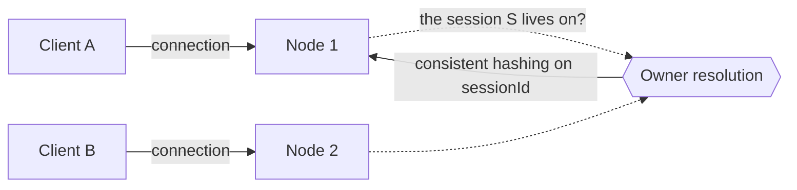
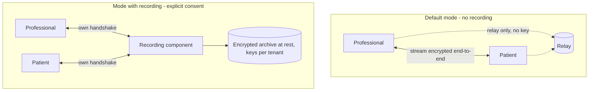

# Media and Real Time

This is the part of the system where errors are most costly and where unverified assertions are most visible. The foundations - NAT, candidates, stream encryption, codecs, congestion control, topologies - are in [`docs/10_fondamenti/08-webrtc-da-zero.md`](../10_fondamenti/08-webrtc-da-zero.md) §12 and are **not repeated here**. This section describes what Telemedic implements, under which constraints, and with which limitations.

---

## 1. The preliminary distinction: what the project actually delivers

This must be at the head of the chapter because it conditions every statement that follows, and because public communication of the project depends on it.

| Capability | Who implements it |
|---|---|
| Fallback to relay when direct connection does not establish | **The connectivity negotiation protocol.** Assigns the relay candidate the lowest type preference and uses it only if nothing else works |
| Adaptive bitrate | **The congestion controller inside the browser** |
| Stream encryption and key derivation | **The browser**, according to the standard stack |
| Packet loss concealment, adaptive jitter buffer, retransmission | **The browser** |
| Signalling and session state machine | **Telemedic** |
| Emission of relay credentials and their scope | **Telemedic** |
| Configuration and securing of the relay node | **Telemedic** (and whoever installs it) |
| Verification of keys by the interlocutors | **Telemedic** |
| Measurement, recording and clinical consequence of quality | **Telemedic** |
| Session recording and its lifecycle | **Telemedic** |

Claiming the rows in the first half is a defect of technical honesty that shows up during verification. The rows in the second half are real work, and are what distinguishes a clinical implementation from a manual example.

---

## 2. Signalling

### 2.1 Transport

**Bidirectional channel on persistent connection, with a project-specific application protocol in JSON, versioned and described by a schema.** No layered messaging protocol, no fallback library on multi-request transports.

The three reasons, in order of weight:

1. Signalling of a consultation is **point-to-point for session**, not multicast to many. A destinations-and-subscriptions model adds nothing and inserts an intermediary into the critical path of negotiation.
2. Fallback libraries on multi-request transports **impose session affinity on the load balancer**, which is precisely the scalability constraint you want to avoid.
3. A proprietary protocol, versioned and described by a schema, is **validatable at the boundary** - a validation requirement of the input of [`02-backend.md`](./02-backend.md) §6.

If in the future traversal of hostile corporate networks turns out to be a **measured** problem, the correct fallback is bidirectional transport over HTTP of later version, not a transport emulation library.

### 2.2 The ordering requirement, which is not negotiable

Incremental collection of candidates requires that signalling transport deliver every candidate **exactly once and in the same order as transmitted**. It is not a performance recommendation: a duplicate or out-of-order candidate produces incorrect pairings and convergence delays.

Two implementation consequences follow:

- **the queue per session is ordered and reliable**, and every message carries a sequence number per session, which the receiver uses to detect gaps and to resume after reconnection;
- **a broadcast mechanism without persistence is excluded** as a distributor between instances, because it guarantees neither uniqueness nor order under reconnection.

### 2.3 Roles and collisions

Collision of two simultaneous proposals is resolved with the **courteous** and **discourteous** role model, and the role **is assigned by the signalling server, never negotiated between clients**. Project assignment: **courteous to the patient, discourteous to the healthcare professional**. The motivation is clinical: in case of collision, the proposal from whoever is conducting the consultation wins and the session converges on the configuration desired by whoever has responsibility for the act.

For the three-participant session the rule generalises in a deterministic and unambiguous way: lexicographic ordering of participant identifiers, and in the pair the smaller one is discourteous.

### 2.4 End of collection and generations

The indication of end of collection **must specify the generation** to which it refers, that is the pair of current session credentials. After sending it, no further candidates are sent for that generation. A restart of negotiation opens a new generation, and candidates from the two generations do not mix. It is the error that produces sessions that "sometimes don't connect after a network change".

As a fallback for interoperability with agents that do not support incremental collection, the mixed form is adopted: the initiator collects a complete generation before the initial proposal, the responder can proceed incrementally.

### 2.5 Scalability across multiple instances

Signalling is **stateful by construction**: the session is a state machine shared between two connections that can land on different nodes.



The options are three - balancer affinity, distributor between instances, deterministic routing of the session to the owner node - and **the choice is structural, with effects on rolling update, scaling and failure modes**. This area **does not decide it**: it is open on the noticeboard at `ARCH` and will be registered as an architectural decision. What this area states is the technical constraint that any choice must satisfy: **delivery exactly once and in order, per session**, and **gradual drain sufficient to not truncate a session in progress during an update**.

### 2.6 What the fall of signalling **does not** interrupt

The already established stream continues. Renegotiation, collection of new candidates and ordered closure are lost. It is a property to respect, not to fight: the interface communicates it with precision (see [`04-frontend.md`](./04-frontend.md) §4.1) and the server, on reconnection, resumes the session instead of recreating it.

---

## 3. Negotiation

### 3.1 Single transport for everything

Aggregation of flows on a single transport, with control multiplexing on the same port, brings **a single port, a single security handshake, a single allocation on the relay** for audio, video and data channel together. It is not a detail: it is the basis on which relay sizing relies on §4.5 and is the reason why the number of relay ports is not the bottleneck.

### 3.2 Renegotiation

It is triggered in clinically real scenarios: screen sharing to show a recording or report, replacement of video source, entry of a third participant.

Implementation rule: **replacement of track on an existing transmitter is preferable to addition of transmitters**, because it does not trigger renegotiation when coding is compatible. Every renegotiation avoided is one fewer collision window and one fewer source of perceptible interruption.

### 3.3 Session topology

From two to three participants in mesh topology, without central component treating the stream. The limit **must be declared**: an explicit limit is preferable to silent degradation.

The exact number and the way in which the limit is declared is **a decision of `ARCH`**, open on the noticeboard; this area provides the technical analysis. At three participants the mesh requires two connections per client, the transmission budget is divided among recipients, and session quality becomes the **minimum** of the link qualities, not the average. Beyond that, any solution introduces a component that terminates encryption, which is a security decision before an engineering one and must be taken as such.

---

## 4. Relay

### 4.1 Ephemeral credentials: how it works and what it is not

The relay node does not use static credentials. A static credential must be delivered to the browser, then to the user, then it is public by construction: anyone who opens development tools reads it and reuses it to route arbitrary traffic, with transfer cost and traffic responsibility charged to the operator.

The time-limited credential mechanism is used: the username is the expiry time joined with an identifier, the credential is the authenticated fingerprint of that username with a secret shared with the relay node.

**It must be said for what it is: it is not a standard.** It derives from an expired individual draft and is a convention consolidated between implementations. The standard exists and is third-party authorisation by token, but has no support in browsers. The convention is adopted because it is the only one that works, and it is documented as a convention. The same honesty applies to the algorithm: the fingerprint function used is imposed by the long-term authentication mechanism of the protocol, not chosen by the project, and must be declared explicitly in every document discussing cryptographic suites - because it contradicts any narrative of "only modern algorithms". It is not a vulnerability; it is a fact.

### 4.2 The three constraints on emission

1. **The identifier inside the username is opaque and non-correlatable.** It ends in cleartext in the logs of the relay node. **It is never an identifier of the patient nor of the professional**: it is a session identifier resolvable only with access to the Telemedic database. It is minimisation, and it is verifiable with a test.
2. **The endpoint that emits is authenticated, verifies that the requester is part of that session, and is subject to rate limiting.** Without these three conditions it is an automatic distributor of relay access.
3. **The life of the credential is brief and declared.** Sufficient to open and maintain the allocation for the expected duration of the consultation, no more.

### 4.3 Configuration of the relay node

Minimum version **4.17.2**, for constraint [V-10](../11_registri/01-vincoli-in-vigore.md#v-10) and for architectural foundation §9. The complete configuration verified on primary source is in [`.telemedic/research/B3-verifica-coturn-webrtc.md`](https://github.com/fedcal/Telemedic/blob/main/.telemedic/research/B3-verifica-coturn-webrtc.md); here are reported the points that have architectural consequences, not the entire file.

```ini
# Illustrative - annotated extract. Minimum version 4.17.2.
# No secrets in cleartext: only references resolved by the secrets manager.

# Listeners are bound explicitly. Never the generic address: it would also bind
# management and internal network interfaces.
listening-ip=<PUBLIC_ADDRESS>
relay-ip=<RELAY_ADDRESS>
external-ip=<PUBLIC>/<PRIVATE>

# Ephemeral credentials. No static user, no user database.
use-auth-secret
static-auth-secret=<PLACEHOLDER_RESOLVED_BY_SECRETS_MANAGER>

# From 4.17.0 the stateless nonce is active by default and the
# signing key is generated PER PROCESS. In a multi-node architecture
# this shared secret is MANDATORY: without it, every restart and
# every request that lands on a different node costs the client an extra
# re-authentication round trip.
stateless-nonce-secret=<PLACEHOLDER_RESOLVED_BY_SECRETS_MANAGER>

# From 4.17.0 the transport listeners protected over datagrams are opt-in.
# For Telemedic this is the desired configuration: browsers use transport
# protected over stream, and not activating them eliminates an entire attack surface.
# DO NOT activate without a measured requirement.

# Relay hardening - defence IN DEPTH, not primary defence (see 4.4)
no-tcp-relay
no-multicast-peers
unauthorized-ratelimit
# allow-loopback-peers: NEVER set.

# Quotas. NOTE THE UNIT: despite the name, these are BYTES per second,
# and the limit applies per direction, not to the aggregate.
max-bps=<BYTES_PER_SECOND_PER_SESSION>
bps-capacity=<BYTES_PER_SECOND_AGGREGATE>
```

Three verified facts that change the configuration from what is commonly written, and that must be repeated because they are real operational traps: the shared secret for the stateless nonce is **mandatory** in multi-node architecture; the listeners for transport protected over datagrams are **opt-in** from 4.17.0 and must not be activated without a requirement; quota directives are expressed in **bytes** per second despite the acronym in the name, which means that naïve configuration grants eight times the bandwidth you think you have granted.

### 4.4 The defence that counts

The family of vulnerabilities that has historically afflicted relay nodes is always the same: relaying to internal or loopback addresses, obtained by circumventing blocked address lists with alternative or non-normalised address forms. **Six distinct vulnerabilities in eight years, four in the last eight months.**

The constraint [V-10](../11_registri/01-vincoli-in-vigore.md#v-10) follows and the formulation that this area adopts without mitigation:

> **The list of forbidden peer addresses is defence in depth. Primary defence is egress network isolation of the relay node**, applied by infrastructure and not by the process: the node can reach public Internet and nothing else. It is the only defence that has stood up to all six vulnerabilities in the family.

One fact must be added about the semantics of lists that surprises whoever configures them: **the default behaviour is to allow**, and an allow rule **always prevails** over a deny rule. There is no global deny switch set by default: the default deny is constructed by enumerating ranges. For this reason the project's reference configuration **uses no allow rules at all**: a single permissive row nullifies any deny.

### 4.5 Sizing

For a two-person session with **a single** relay allocation and bitrate `B` per direction, the node moves `2B` ingress and `2B` egress: **`4B` total**. If both participants use an allocation, it doubles again, to `8B`.

Operational consequences:

- **The bottleneck is bandwidth, not number of ports.** With flow aggregation on a single transport, one port per allocation: the default port range is overabundant by orders of magnitude.
- **Peak must be dimensioned on the adverse case, not the average.** The quota of sessions routed by relay depends on the client network landscape and **is not known in advance**: Telemedic **measures it** on its own traffic (§6.4) and does not cite third-party estimates. `[NV]` - no percentage is declared in this document because none has been measured by the project.
- **The node is limited by ingress and egress, not by compute**, save for transport protected over stream, which adds tunnel encryption **in addition to** stream encryption.

The derived sizing is in [`07-prestazioni-e-capacita.md`](./07-prestazioni-e-capacita.md).

---

## 5. Stream security

### 5.1 What the project verifies instead of declaring

The protection profiles that **authenticate without encrypting** exist in the protocol and must be rejected. Since negotiation happens in the browser and is not directly controllable by the application, the correct defence is **to observe and verify at runtime**: the protection suite actually negotiated, the handshake channel suite and the protocol version are readable from connection statistics.

The project **records them for every session in the trace**, and an automatic test **fails** if the negotiated suite does not encrypt. It is a concrete risk control, at practically zero cost, and transforms a security assertion into a verifiable fact.

The same logic applies to the handshake protocol version: **it is not declared, it is measured**. The landscape of implementations is heterogeneous and in flux; any static assertion in documentation would be false for part of the installed base.

### 5.2 Cryptographic material: the correct formulation

> Every session uses cryptographic material generated afresh via handshake, with ephemeral certificates per connection. **There is no reuse of keys between sessions.**

This formulation is adopted verbatim and replaces every reference to a "key rotation". The reason is verified on primary source: **there is no intra-session rotation of flow keys**. The key update mechanism at record level in the recent version of the handshake protocol **does not update the secret from which flow keys are derived**; the mechanism that would make this possible is subject to work in progress at the standards body and is not implemented in any browser.

To add, for completeness and honesty, that **this is not a cryptographic weakness**: the key material lifetime limits provided by the protocol are orders of magnitude greater than the traffic of a consultation. It is a functionality that does not exist, and therefore is not claimed.

### 5.3 The threat model, in five cases

| Case | Who can read the content | Note |
|---|---|---|
| Direct connection | Only the two endpoints | The assertion of end-to-end encryption is correct, **conditional on signalling integrity** |
| Through the relay | Only the two endpoints | The relay node **relays without interpreting**: it does not participate in handshake, does not possess key material. Passing through relay **does not** break end-to-end encryption |
| With server-side recording | The two endpoints **and the recording component** | See §8. The session **is not** end-to-end encrypted |
| Compromised endpoint | Whoever controls the device | Outside the scope of any protocol. Goes in the threat model, not hidden |
| Compromised signalling | An intermediary that substitutes the fingerprints | **The highest residual risk**, and has the most economical mitigation: key verification |

The relay node sees however **metadata**: addresses, volumes, timing, duration. In healthcare the mere fact that a patient had a consultation with a specialist from a particular organisation **is already health-related data**. The relay node must therefore be treated as a system that processes personal data: minimised logs, brief retention, location in the Union. It is not a formal nicety: it is the reason why the relay node cannot be a third-party managed service.

A favourable side effect deserves valuation in impact assessment: browsers replace private addresses of local candidates with ephemeral names, so **the internal addresses of clinical devices do not end up in the logs of the signalling server**. It reduces the quantity of personal data processed. It has a cost though, which must be declared: in the scenario of consultation on the same local network - professional and patient in the same facility - if resolution of those names is blocked by appliances, the local direct connection does not form and you end up on relay for a session that could have stayed on a switch.

### 5.4 Key verification

Mandatory by default (D22). Short code derived from certificate fingerprints, compared verbally by the two interlocutors at startup.

Server-side implementation constraints: the derivation is deterministic, documented and reproducible; the code never transits via the signalling server already formed (it would be pointless: the server is precisely the actor you are defending against); the outcome of the comparison is **recorded in the trace** with its own outcome, because it is a risk control and as such must be demonstrable. Accessibility requirements, which are binding, are in [`04-frontend.md`](./04-frontend.md) §7.3.

---

## 6. Quality: measurement and consequence

### 6.1 Where the numbers come from

The metrics are read from connection statistics. The point that resolves the confusion most widespread in this area:

> **Round-trip time is not among transmission statistics.** It is in the dictionary that reports what the **remote participant** observed receiving our stream. It is therefore the true indicator of quality **perceived by the other side** - the only one that matters in a consultation.

The families used by the project: inbound flow statistics (loss, jitter, frames per second, freezes and their duration, delay and jitter buffer count); outbound flow statistics (reason and durations of quality limitation, retransmissions, encoded frames); statistics reported by remote (round-trip time, loss fraction); statistics of the selected candidate pair (current round-trip time, estimated available bandwidth, bytes, packets discarded on transmission); transport statistics (handshake state and role, version, flow and channel encryption suites).

### 6.2 The three sampling rules

1. **One sample per second is sufficient.** Below you lose transients, above the cost grows without information gain: report construction has a cost that grows with the number of flows.
2. **Counters are cumulative and must be differentiated.** Loss, bytes, duration of freezes, buffer delay grow monotonically. Reporting the raw value and concluding that quality degrades always is the classic error. Correct averages are ratios between differences: average buffer delay is the difference in cumulative delay divided by the difference in sample count.
3. **Aggregate before sending.** Not one sample per second to the server, but a synthesis per window - minimum, average, high percentile, maximum - with the exception of **events**, which depart immediately: change of limitation reason, threshold crossing, freeze.

This rule is a constraint that this area places on others and that is written on the noticeboard: **no area may cite a raw cumulative counter as an indicator of quality.**

### 6.3 The quality index

The project publishes a **proprietary, transparent and documented session index**, with the formula published and the explicit declaration that **it is not an average opinion score according to any international recommendation**.

The reason is technical and must be written: the classic models for estimating voice quality are models for **planning** narrow-band telephone networks, not models for measuring a session in real time; the degradation factors for modern audio coding are not standardised in classic tables `[NV]`; and for video nothing comparable exists applicable in real time, because existing models assume buffering and segments that do not exist here. Whoever publishes an average opinion score for this type of session is using a factor from another codec, or an invented value.

Index structure:

```
index = min(S_latency, S_loss, S_jitter, S_continuity)
```

**The minimum, not the average**, because perceived quality is dominated by the worst dimension: perfect audio does not compensate for frozen video. The four components derive respectively from round-trip time reported by remote, from the ratio between differences of lost and received packets, from jitter and average buffer delay, from the fraction of window occupied by freezes.

The **concentration of loss** must also be captured: five per cent distributed uniformly and five per cent concentrated in two bursts have completely different perceptual effects - the first is almost imperceptible with forward error correction, the second produces two audible interruptions. It is approximated with the variance of loss between consecutive samples, without needing reportage extensions that browsers do not support.

### 6.4 Thresholds and clinical consequence

Thresholds are **product specification, never compliance**: constraint [V-12](../11_registri/01-vincoli-in-vigore.md#v-12) is explicit and no technical threshold in this area is imposed by Italian regulation. The values are configurable, have a documented default value, and their calibration occurs on data measured by the project, not on tables taken elsewhere.

**The consequence must be designed, not only measured.** Upon crossing the threshold of inadequacy the system **informs the professional** that technical conditions may not be suitable for the assessment underway and offers the option to defer. It is a **risk control** and must be treated as such: recorded, traceable, with the professional's decision outcome conserved. The issue is open on the noticeboard at `COMP` for insertion in the risk management file.

Also recorded, for every session, **whether the stream was routed via relay** - readable from the type of candidates in the selected pair. It feeds two decisions: sizing of the relay node and diagnosis, because a routed session has a different latency profile and must be compared with its own group, not with direct sessions.

---

## 7. The actual available levers

Honest list, with the regulatory status of each.

| Lever | What it does | Status |
|---|---|---|
| Bitrate ceiling on transmitter | Limits transmission bandwidth | Stable |
| **Degradation preference** | Chooses whether to sacrifice resolution or fluidity | **Defined by a working draft specification**, not the main recommendation. Treat as "best effort": set it, reread the parameter to verify acceptance, do not assume |
| **Jitter buffer target** | **The only lever of the application on the dominant contribution to latency** | In the main recommendation, wide support in all three engines |
| Forward error correction of audio | Recovers isolated losses without extra round trip | Recommended by reference specification. **Enabled**: intelligibility of the patient's voice is functionally critical |
| Discontinuous transmission | Suspends transmission in silence | **Disabled by default for clinical reason**: introduces artefacts on word attack and background noise can have semiological value - breathing, cough, wheeze, vocal tremor |
| Temporal scalability on single layer | Resilience to freezing at marginal cost | To evaluate and **measure**, not to adopt on faith |
| Coding preference | Orders codecs | **Not forced in v1.0.** Left to negotiate and **measured** which codec is actually used in the installed base: decisions are taken on data, not on theoretical efficiency tables |

Two notes that belong in this section and not in public communication.

**Degradation preference is a choice with clinical implications.** Preserving resolution at the expense of fluidity is correct for evaluating a skin lesion or reading a recording shown on video; preserving fluidity at the expense of resolution is correct for assessing movement and facial microexpression. There is also a value that requests degradation of neither, discarding frames instead: semantically it is the most interesting for this domain and also the least likely to be implemented, being the most recent. **It must be verified at runtime by rereading the parameter, not assumed.**

**Exposure of this choice has a regulatory constraint**, declared by constraint [V2](../11_registri/03-vincoli-fondanti.md#v2): the defensible formulation is that it is a **rendering preference chosen by the user**, not automatic adaptation guided by clinical content. A system that adapted quality based on a declared diagnostic purpose would approach the classification rule threshold. The issue is forwarded to `COMP`.

---

## 8. Recording

### 8.1 The decision and its consequence

D23 establishes **server-side recording**, to guarantee its reliability independently of the device and patient load. This area receives the principal's decision and **declares its consequence without mitigation**:

> **When recording is active, encryption is terminated on the server and the session is NOT end-to-end encrypted.**

An architecture of **two modes** follows, not an optional functionality within a single mode:



Obligations that follow, all verifiable:

1. **The consent notice explicitly declares** that the session is no longer end-to-end encrypted, in plain language. Consent to recording is consent to a **different security model**, not just a copy.
2. **The interface signals the status persistently and not concealably** for the entire duration, for both participants (see [`04-frontend.md`](./04-frontend.md) §7.4).
3. **Transition between the two modes is traced** in the immutable audit trail, with who requested it, who accepted, when.
4. **The file is encrypted at rest with keys per tenant**, with configurable retention and cryptographic deletion as the deletion mechanism.
5. **The recording component is a distinct service**, with its own scope, credentials, logs and monitoring. It is not a function of the application service.

The issue [Q-08](../11_registri/02-questioni-aperte.md#q-08) on the noticeboard - the incompatibility between server-side recording and end-to-end encryption, and its effects on the data model - is directed to `ARCH` and remains open. This area **does not anticipate it**: receives D23 and describes the technical consequences.

### 8.2 The container is negotiated, not assumed

Constraint [V-11](../11_registri/01-vincoli-in-vigore.md#v-11) is explicit and this area applies it even to server-side recording, where it is not obvious.

The resulting container **depends on the codecs actually negotiated in the session**, which vary by browser, platform and conditions. An assumed container a priori - "the file is in a certain format" - is an assertion that will be false for part of the installed base. The correct implementation:

1. the recording component **reads the codecs actually negotiated** from the session;
2. **chooses the container at runtime** compatible, without transcoding, because transcoding would cost computation, latency and quality for zero benefit;
3. **records the actual container and codecs in the recording metadata**, exactly as encryption suites are recorded in §5.1;
4. the interface and application interfaces **expose the real format**, not a declared format.

The correct public assertion becomes: *"recording in standard container, chosen based on negotiated codecs and recorded in metadata, encrypted at rest"*. It is verifiable, unlike the assertion of a single format.

The same discipline applies to any local recording as fallback: container support is verified by querying the browser, not by consulting a table. The landscape of support is heterogeneous between engines and changes; **no container is universal**.

---

## 9. Testing on degraded networks

### 9.1 Synthetic sources

Media testing automation requires deterministic sources. The verified facts that determine the configuration:

- the correct flag to automatically accept camera and microphone permissions **is not** the most commonly used one, which also accepts screen capture: it would produce a false positive precisely on the screen sharing consent flow, which Telemedic has as a real use case (showing a report to the patient);
- the video source from file accepts a specific uncompressed format; the audio source from file accepts a specific uncompressed format, **requires disabling audio processing** - otherwise the file is played distorted - and **must be combined** with activation of synthetic devices. There is a form that plays the file only once instead of in a loop, and that is the one needed when the file contains a time reference;
- **asymmetry to declare**: one of the three engines **has no equivalent** of file playback. Its preferences produce a synthetic stream generated by the engine, not a file from the user.

**Operational consequence**: automatic latency measurement from objective to screen based on a file with visible time reference **is achievable on one engine only**. On the others a different strategy must be used, or coverage must be limited by declaring it. It is a design constraint of the test suite, not a detail.

### 9.2 Network profiles

Simulation occurs at network level, with operating system queue discipline, not with browser limitation: the latter acts at application level and **does not touch media session traffic**. It is a widespread equivocation and must be written to prevent someone wasting a day on it.

The profiles are test constants shared by the entire suite:

| Profile | Scenario represented |
|---|---|
| Home fibre | Favourable case |
| Asymmetric copper access | Limited transmission: more common than you might think |
| Mobile in motion | Reference scenario for patient |
| Congested cell | Ordinary adverse case |
| Crowded facility network | High jitter with high nominal bandwidth |
| Worst-case degraded | **Serves to verify that the system degrades gracefully and warns**, not that it works well |

The last profile delivers the greatest value: it verifies the degradation sequence of [`04-frontend.md`](./04-frontend.md) §4.3, emission of the inadequacy warning and recording of the related risk control.

### 9.3 What is asserted

Not "the call works". The assertions are on observable facts: connection state reached within the declared limit; type of candidates in selected pair coherent with simulated network scenario; flow encryption suite **present and not degenerate**; incoming video bytes growing; inadequacy warning issued when and only when threshold is crossed; corresponding row present in the trace.

The detail of the test suite organisation is in [`08-qualita-e-test.md`](./08-qualita-e-test.md).

---

## 10. Declared limitations

| Limit | Nature |
|---|---|
| Number of session participants | To declare; structural decision open to `ARCH` |
| Latency from objective to screen | **Not guaranteeable**: depends on camera, compute, screen, network and jitter buffer state, i.e. on factors almost all outside project control. The system **measures it**, records it and informs. See [`07-prestazioni-e-capacita.md`](./07-prestazioni-e-capacita.md) §2 |
| Key rotation during session | **Does not exist** in the technology. Not claimed |
| End-to-end encryption in recording mode | **Does not exist**, by construction. Declared in consent and interface |
| Automatic latency measurement from objective to screen | Achievable on one browser engine only |
| Quota of sessions routed by relay | `[NV]` - to be measured on own traffic, never cited from third-party estimates |
| Real-time subtitles | Non-compliance declared on an accessibility criterion (D24), with alternative measure and data channel nonetheless defined in protocol |

---

**Continues in**: [`06-osservabilita.md`](./06-osservabilita.md) for how these measurements become logs, metrics and traces without violating healthcare data boundaries.
