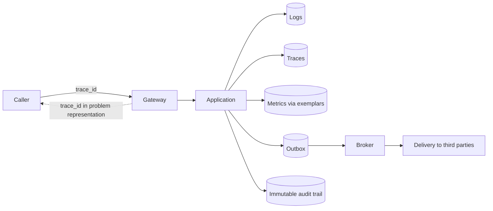
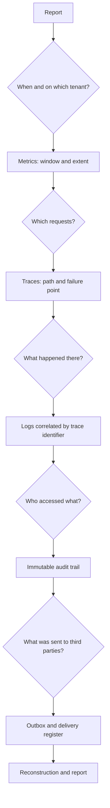

# Observability

Observability of a healthcare system has a constraint that other systems do not have: **most of the information that would make diagnosis easy cannot be recorded**. This chapter starts there, because it is the constraint that determines everything else. Then it describes what is recorded, how it correlates and how to investigate when something goes wrong.

The foundations of the three signals are in [`docs/10_fondamenti/11-fondamenti-informatici.md`](../10_fondamenti/11-fondamenti-informatici.md) §12 and are not repeated.

---

## 1. The constraint, before everything else

### 1.1 What never enters a log, a metric or a trace

The list is exhaustive and its violation is a defect, not an imprecision.

| Category | Examples | Why |
|---|---|---|
| **Clinical content** | Report text, history, value of a measurement, outcome of assessment, reason for consultation | Constraint V-13 of `SEC`. A diagnostic log is replicated, exported, read by operations staff and retained with criteria different from clinical data |
| **Direct patient identifiers** | Tax ID, name, date of birth, contact details, identifier from system of origin | Idem. Pseudonyms per tenant are used in logs (§1.2) |
| **Request and response bodies** | Document sent, clinical resource received | They contain both previous categories by definition |
| **Addresses with identifiers** | Paths containing a patient or document identifier | Addresses end up in access logs, in proxies, in origin headers and in history |
| **Credentials and security material** | Tokens, authorisation headers, secrets, keys, relay credentials | Obvious, and it is the most frequent leak because it comes from a request logging written "for debug" |
| **Queries with associated parameters** | Query form with values substituted | The form without values is useful for diagnosis; with values it is clinical content |
| **Unfiltered exception messages** | Text of a persistence layer exception that reports values of the violated constraint | This is the classic way an identifier ends up in a log without anyone having written it |
| **Correlatable session metadata** | Professional–patient pair in cleartext in a metric or label | The mere fact that two people had a consultation is health-related data |

The case of metadata deserves an extra line, because it is the one that escapes. The relay node sees addresses, volumes, timing and duration; the signalling server sees who connects to which session and when. Neither sees content, but both process personal data in healthcare context. **Minimised logs and brief retention are not best practices: they are requirements.**

### 1.2 Pseudonymisation

Every identifier that must appear in an observability signal appears as a **pseudonym per tenant**, derived deterministically with a key that **is not available to observability systems**. Two properties follow that are necessary:

- **correlation possible** - two rows concerning the same subject are recognisable as such within the same tenant, which is what is needed for investigation;
- **reidentification impossible** without deliberate access to the application boundary, which is itself an operation traced in the immutable audit trail.

The derivation is **per tenant**: the same subject in two tenants produces different pseudonyms, to prevent correlations between distinct data controllers.

### 1.3 Redaction is at two levels, and the second is the one that saves

**First level - do not produce.** The code does not write what must not be written. It is the correct defence and must be pursued with reviews and static analysis.

**Second level - do not pass.** A filter in the output path of logs recognises and obscures known forms of sensitive data before persistence: tax ID structures, document identifier structures, authorisation headers, fields with known names. It is a safety net, not the defence: a filter based on known forms does not recognise free text clinical content. But it intercepts the class of incidents most frequent, which is accidental logging of an entire object.

The second level is verified by tests that deliberately attempt to pass sensitive data and fail if they succeed.

### 1.4 Detailed diagnostics is a procedure, not a log level

The detailed diagnostics level on clinical contexts **cannot be activated by modifying a property in live operation**. It is a procedure with four conditions: activation motivated and approved, **scope limited** to one tenant and one context, **automatic expiry** after a brief window, and **activation recorded in the immutable audit trail**. A detailed diagnostics level left active on a clinical context is a continuous data leak that nobody notices.

---

## 2. Logs

### 2.1 Form

Structured, one row per event, machine-readable format. Free text form is not correlatable and is not filterable.

Mandatory fields on every row:

```json
{
  "ts": "2026-11-30T09:14:22.481Z",
  "level": "WARN",
  "service": "telemedic-app",
  "version": "1.0.0+b1f4c2a",
  "env": "prod",
  "tenant": "t0007",
  "context": "media-session",
  "trace_id": "4bf92f3577b34da6a3ce929d0e0e4736",
  "span_id": "00f067aa0ba902b7",
  "event": "qualita.soglia.superata",
  "subject_ref": "psd_9f3c1a2b",
  "outcome": "avviso_emesso",
  "msg": "Inadequacy threshold crossed on continuity dimension"
}
```

Three choices to notice. `event` is a **stable identifier**, not a phrase: it is what allows searching, counting and alerting without depending on text, which changes with translations and reformulations. `subject_ref` is a pseudonym. `version` carries the exact identifier of the build, which is what allows linking an observed behaviour to an artefact - a traceability requirement, beyond operational convenience.

### 2.2 Severity levels, with operational criteria

Levels are useless if each person uses them at their own judgment. These are the criteria.

| Level | Operational criterion | Consequence |
|---|---|---|
| `ERROR` | **A human must do something.** A requested operation has failed in a non-recoverable way, or an invariant has been violated | Contributes to alert indicators. An `ERROR` for which there is no action is a classification defect, and must be corrected |
| `WARN` | The system has handled an anomalous situation **automatically**, but recurrence is a signal | Does not wake anyone; feeds trends. A successful retry, an applied degradation, a threshold crossed with warning issued |
| `INFO` | Relevant lifecycle fact: startup, shutdown, migration applied, configuration loaded, session started or ended | Low volume and predictable. An `INFO` per request is an `INFO` nobody will read |
| `DEBUG` | Detail useful for investigation | See §1.4. Not active in ordinary live operation |

**The rule that holds the system together**: an `ERROR` is **actionable**. If a condition recurs regularly and there is nothing to do, it is not an error: it is a feature of reality, and must be downgraded and measured. Proliferation of non-actionable errors is how an alert system stops being read, and an alert system nobody reads is worse than no alert system, because it produces false reassurance - the same reasoning that constraint V-14 of `GUIDA` applies to declared service hours coverage.

### 2.3 Retention

Terms for traceability data and for access and authentication data are fixed by constraint V-15 of `SEC` and this area receives them without reinterpreting them. For application diagnostics logs, which are neither one nor the other, retention is **brief and declared**, dimensioned on incident investigation time and no more. A log retained longer than necessary is an archive of personal data without a justifying basis.

---

## 3. Metrics

### 3.1 The four families

| Family | What it measures | Examples |
|---|---|---|
| **Interfaces** | Rate, errors, duration per route and per operation class | Requests per second, error quota by problem type, duration distribution |
| **Resources** | Usage, saturation, component errors | Database connections in use and **time waiting for acquisition**, outbox depth, consumption delay, memory |
| **Domain** | Facts of the system, not the machine | Sessions started, sessions ended by outcome, key verifications with negative outcome, alerts generated, alerts acknowledged, alerts **not** acknowledged within window |
| **Media quality** | Synthesis of session measurements | Quality index distribution, quota of sessions routed by relay, quota of sessions with inadequacy warning |

The domain family is the one most often missing and most valuable. "The service responds in 40 milliseconds" does not say whether clinical alerts are being acknowledged. Constraint V-09 - the absence of data is information - translates here to a concrete rule: **events expected and not occurring are measured**, not only events occurring. A measurement expected and not received, an unconfirmed notification, a scheduled session never started are first-class metrics.

### 3.2 Cardinality

Labels with unlimited cardinality destroy a metrics system. Rules:

- **Permitted**: tenant, context, route as pattern (not as concrete path), outcome, problem type, version.
- **Forbidden**: session identifier, subject identifier, pseudonym, network address, error text.
- Detail per single case is obtained with **exemplars**, which connect a point of the distribution to a trace, without creating a series per case.

The tenant as label is permitted, but must be monitored: with hundreds of tenants and dozens of metrics, multiplication is real. Domain metrics carry the tenant; resource metrics do not.

### 3.3 Naming

Project prefix, name that describes the fact and not its implementation, unit in the name, suffix coherent with the nature of the metric. A name that describes the implementation - rather than the fact - becomes false at the first internal change, and nobody updates the dashboards.

---

## 4. Traces

### 4.1 Propagation

Context propagated according to the web consortium's tracing standard, across **every** boundary: inbound requests, outbound calls, outbox messages, signalling messages, scheduled jobs. The context crosses the event queue as an attribute of the envelope: without it, the chain breaks precisely where it is hardest to investigate, in the asynchronous part.

The virtual threads technical constraint applies here: propagation across asynchronous boundaries is not automatic and must be verified by a test. A broken trace is worse than no trace, because it induces concluding that the flow stopped there.

### 4.2 Sampling

**Sampling in the queue**, not at the head, where infrastructure permits: you decide whether to keep the trace **after** seeing how it went, meaning retain one hundred per cent of traces with error and a fraction of those that succeeded. It is the only strategy that gives real utility in a medium-volume, high-criticality system like this. Head sampling at fixed percentage, applied to a system with few incidents, loses almost all of them.

Additional rule: **traces of critical clinical operations are not sampled**. Session start and end, alert emission, document signature, emergency access. There are few and they are very valuable.

### 4.3 Attributes

Permitted: route as pattern, outcome, problem type, tenant, context, size of result, number of retries, name of external component queried.
Forbidden: the same as §1.1, without exceptions. **Trace attributes are the point where the prohibition is most often violated**, because they seem internal while they end up in an external system.

---

## 5. Correlation

A trace identifier links everything:



The relevant point is the dotted return: **the trace identifier is returned to the caller inside the problem representation** (see [`02-backend.md`](./02-backend.md) §7). It is what makes possible, when an integrator reports a problem, to find the exact request without asking them for data they must not send us.

The immutable audit trail carries the trace identifier **as an attribute**, but does not depend on it: it is a separate system with its own lifecycle, and its integrity cannot depend on observability system availability.

---

## 6. The distinction that must not be confused

| | Application log | Immutable audit trail |
|---|---|---|
| Purpose | Technical diagnosis | Proof of who did what |
| Recipient | Whoever operates the system | Whoever investigates, whoever supervises, the subject |
| Mutability | Rotates, is pruned, is lost | Append-only, hash-chained |
| Location | Observability system | Separate archive with own credentials |
| Retention | Brief | Fixed by constraint V-15 of `SEC` |
| Content | No clinical data, pseudonyms | No clinical data, pseudonyms, plus higher level of assurance and outcome |
| Loss | Inconvenient | **Incident** |

They are two systems. An access event to healthcare data that ended only in the application log would be an unmet requirement; a technical event that ended in the immutable audit trail would dilute its probative value.

---

## 7. Alerting

### 7.1 What to alert on

Not on resources. High memory occupancy is not a problem; a clinical performance that cannot be delivered is. Alerts are built on **service indicators**, and the families are four:

1. **Capacity to deliver**: quota of sessions that do not reach active state within the declared limit.
2. **Integrity of the clinical pathway**: alerts generated and not acknowledged within the declared window; documents signed and not delivered; measurements expected and not received beyond the configured threshold.
3. **Integrity of traceability**: verification of the immutable audit trail chain failed. **This is the only alert with unconditional maximum severity**: it means the system can no longer demonstrate what has occurred.
4. **Security posture**: authentication attempts rejected beyond threshold, emergency access, key verifications with negative outcome, security configurations divergent from the live profile.

### 7.2 The rules

- **An alert without a response procedure does not exist.** If there is no document saying what to do, the alert must be removed or the procedure must be written. There are no other options.
- **An alert that does not require immediate intervention wakes nobody.** It becomes an item for periodic review.
- **Alerts are counted.** The number of alerts per shift is a metric of health of the alert system itself: beyond a threshold, the system is no longer read.
- **Clinical alerts do not pass through the observability system.** An alert on a parameter out of range for a patient is a product function, with recipients, escalation and acknowledgement defined in the domain (notification and alarms context of the architectural foundation §1). Confusing it with an operational alert would mean making it depend on the availability of a technical monitoring system. **It must not.**

---

## 8. Post-incident investigation

### 8.1 What is available

The real sequence of an investigation, with the source for each step:



### 8.2 What is not available, and how to cope

**Content is not available.** By design. When investigation requires knowing what a document contained, the way forward is deliberate access to the data in the application boundary, with authorisation, motivation and **recording in the immutable audit trail**. It is the same mechanism as emergency access (constraint V-16 of `SEC`): free motivation mandatory, limited scope and window, notification, review with recorded outcome.

**This makes some investigations slower.** It must be declared instead of being discovered: it is the price of minimisation, and it is a price that has been chosen to pay. What can be done to reduce it is to design the signals to be **sufficient to localise** the problem even without the content: stable event identifier, explicit outcome, point in the pathway, artefact version, and - where needed - a **form** of the data instead of the data: length, presence, structure, validation outcome. Knowing that a document was rejected because a mandatory element was absent, and which one, does not require knowing its content.

### 8.3 The report

The incident report is **blame-free** and has a fixed structure: chronology with instants, measured impact - how many tenants, how many patients, which performances compromised -, proximate cause, contributing causes, what worked in detecting, what did not, actions with responsible party and deadline.

Two mandatory insertions, which do not belong to this area but which this area must feed:

- **Medical device surveillance.** An incident with potential clinical consequences is not just an IT incident. Evaluation of reportability and timelines are in `COMP`; this area provides technical evidence in usable form and in useful time, which means that reconstruction must be possible **within hours, not weeks**.
- **Information security notification obligations.** Idem: the timelines are entity-specific for each user (D39) and this area provides the data, not interprets it.

A technical consequence follows from both: **retention of observability signals must be at least equal to the time within which a report can arise**. If an incident can emerge thirty days later and logs last seven, reconstruction is impossible. Determination of the term is in `COMP`; the technical constraint that follows is declared here.

---

## 9. Dashboards

Three, and not twenty.

1. **Service health** - capacity to deliver, per tenant: sessions started and their outcome, errors by type, queue latencies, saturation of critical resources.
2. **Media quality** - distribution of the index, quota routed by relay, inadequacy warnings, dominant limitation reasons, with the ability to compare direct and routed sessions **separately**, because comparing them together produces incorrect conclusions.
3. **Integrity and security** - chain verification, emergency access, negative key verification outcomes, rejected authentications, live profile divergences.

Dashboards are **versioned in the repository** along with the code that produces the metrics. A dashboard constructed by hand in the tool interface is an artefact that nobody can recreate and that is lost at the first migration.

---

**Continues in**: [`07-prestazioni-e-capacita.md`](./07-prestazioni-e-capacita.md), where the same measurements become balances, percentiles and declared limits.
