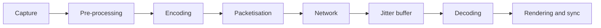

# Performance and Capacity

## 0. Warning that applies to the entire chapter

**No threshold contained in this document is a regulatory requirement.** Constraint V-12 is explicit: no technical threshold in this area is imposed by Italian regulation, and the project's values are **product specification**, never compliance. Whoever reads this chapter looking for a table to cite in a compliance declaration is looking for the wrong thing in the wrong place.

Three categories must be kept distinct, and confusion between them is the error this chapter exists to prevent:

| Category | What it is | How it is formulated |
|---|---|---|
| **Service objective** | A commitment that whoever installs assumes toward their own users | "The ninety-fifth percentile of session entry duration is within X" |
| **Declared limit** | A boundary beyond which the product is not designed to operate | "The model is designed for an order of magnitude of N tenants per installation" |
| **Measurement** | A fact observed on an installation, with its date and its conditions | "On this test set, with this profile, the observed value was Y" |

The project produces **declared limits** and **measurement capacity**. **Service objectives** are set by whoever installs, because they depend on their infrastructure, their network and their organisation.

---

## 1. What is declared instead of a number

Public communication of the project reports a latency objective expressed as a single figure. That figure, as it is, **is not verifiable**, and the reason is that it admits at least four readings with different orders of magnitude.

| Reading | What it measures | Order of magnitude between two national extremes on fixed network |
|---|---|---|
| Network round-trip time | The full round of a packet | Tens of milliseconds |
| One-direction network latency | Half the previous | Some tens of milliseconds |
| Mouth-to-ear latency | What recommendations on conversation discuss | See §2 |
| **Objective to screen latency** | From camera objective to pixel on remote screen | **The only one with clinical significance**, and the highest |

A two-hundred-millisecond objective on the first reading is trivially satisfied and communicating it amounts to saying nothing. On the fourth it is a serious objective and **not guaranteeable**.

**Formulation adopted by the project**, which replaces the bare figure:

> Telemedic aims for audio latency in one direction within the threshold that the international recommendation on transmission time indicates as acceptable for most interactive applications, and in any case within the threshold beyond which the same recommendation considers conversation compromised. In direct connection on national fixed network, the objective-to-screen latency measured typically falls below the declared threshold. When traffic is routed via relay, or when network instability requires a wider jitter buffer, the value grows: **the system measures the latency of every session, records it and informs the professional upon crossing the configured thresholds**.

This version is longer and more defensible. Above all, it transforms an undemonstrable number into a **measurement capability**, which is a real and verifiable functionality.

---

## 2. Media latency balance

### 2.1 The stages

Objective-to-screen delay is the sum of independent stages, and knowing them is what allows knowing where to intervene.

| Stage | Who controls it | Note |
|---|---|---|
| Capture | User device | Cheap cameras are at the high end. Outside project control |
| Pre-processing | Browser | Echo cancellation, noise suppression and gain control introduce algorithmic delay |
| Encoding | Browser, hardware | Hardware acceleration is faster than software coding and uses less battery |
| Network | Network | **The relay adds a leg**, and with it a contribution |
| **Jitter buffer** | Partially the project | **Typically the largest contribution** and expands on purpose when network is unstable |
| Decoding | Browser | |
| Rendering | Device, refresh rate | At thirty frames per second, one frame is already a measurable contribution |

`[NV]` - **the numerical values of each stage are not reported.** The project has not measured them, and reporting orders of magnitude taken from elsewhere in a technical document of a medical device means putting into circulation figures that someone will later cite as their own. Measurement is done with the automatic test described in [`05-media-e-tempo-reale.md`](./05-media-e-tempo-reale.md) §9.1, and results are published with the conditions under which they were obtained.

### 2.2 The tension that does not resolve

**The jitter buffer expands on purpose when network degrades**: it substitutes latency for packet loss. It is the mechanism that makes voice intelligible on an unstable network.

It follows that **a rigid latency objective is in direct tension with audio quality**. Reducing jitter buffer target - which is the only application lever on this stage - lowers latency **at the cost of increased audible loss under high jitter**.

This is a clinical choice, not a technical setting, and must be treated as such: exposed as a motivated decision in the risk management file, not hidden in a constant. Determination of the trade-off is forwarded to `COMP` along with degradation preference.

### 2.3 Honest conclusions

- Objective-to-screen latency within the declared threshold **is achievable** on fixed network, with decent hardware, in direct connection.
- **It is not guaranteeable**: depends on camera, compute, screen, network and buffer state, i.e. on factors almost all outside project control.
- **Across relay, and with buffer expanded for instability, exceeding it is normal and does not indicate malfunction.** The system must know how to distinguish this, otherwise it generates alerts on correct behaviour.
- The jitter buffer, not the network, is the dominant lever.

---

## 3. Application latency balance

For the synchronous path, a **per-stage balance**, declared and measured, is adopted instead of a single objective on the extreme.

| Stage | What happens | Why it is a balance by itself |
|---|---|---|
| Ingress | Termination, routing | Fixed cost, independent of use case |
| Authorisation | Token validation, tenant resolution, decision | **Cache with declared lifetime on key verification material**: without it, every request pays for remote resolution |
| Data access | Connection acquisition, transaction, queries | Includes **time waiting for connection acquisition**, which is the first indicator of saturation and is what nobody looks at |
| Domain | Decision | Must be negligible: if not, there is data access hidden in the domain |
| Egress | Serialisation, compression | Grows with result size: this is why explicit projections are worth more than an index |

The operational rule: **every stage has a budget, and an overrun is attributed to one stage, not to the system**. A single objective on the extreme says something is slow; a per-stage balance says what.

**Calls to external systems do not belong in the synchronous path balance.** It is rule R2 of [`02-backend.md`](./02-backend.md) §4.2: an operation that depends on an external system is asynchronous, with observable outcome, not a wait inside a request.

---

## 4. Percentiles

### 4.1 The average is not published

The average of a latency distribution with a long tail describes a case that happens to nobody. In a system where the rare event is the one that matters - the consultation that does not start, the signature that does not pass - the average is actively misleading.

Published and alerted: **median** (the typical case), **ninety-fifth percentile** (the experience of the unlucky ordinary user), **ninety-ninth** (the tail), **and the maximum observed in the window**, which is the only way to notice an anomalous value that percentiles smooth.

### 4.2 Tail amplification

If a request generates N at downstream and waits for all, the probability that at least one falls into the tail grows rapidly with N. It is the technical reason why pages composed of many calls have a much worse tail than the individual services that compose them, and why **N is reduced** before optimising the individual ones.

Project consequence: clinical screens load what is needed for the first interaction, not everything that might be needed.

### 4.3 Where to measure

**Server-side and client-side, and the two numbers are different.** The server measures its own work; the client measures what the user lives, which includes network, browser queue, rendering. On mobile network the difference is substantial.

The declared objective **is the one client-side**, because it describes actual experience; diagnosis is done on the server-side one. Publishing only the latter is the classic way to have green dashboards and unhappy users.

### 4.4 Aggregating percentiles is wrong

Percentiles cannot be averaged and cannot be summed. The average of two ninety-fifth percentiles is not the ninety-fifth percentile of the set. Correct aggregation requires structures that preserve the distribution, and the metrics system must be configured accordingly. It is a frequent, silent error that produces wrong numbers for years.

---

## 5. Sizing

### 5.1 The units of capacity

The system does not have a single capacity magnitude: it has four, with different bottlenecks.

| Unit | Resource exhausted first | Note |
|---|---|---|
| **Average concurrent media session** | Relay node bandwidth, for the routed quota | Relay compute is marginal: it is limited by ingress and egress |
| **Concurrent signalling session** | Persistent connections and memory per session | Sessions are long-lived and mostly inactive: it is the use case of virtual threads |
| **Application request per second** | **Database connections**, not threads | See §5.3 |
| **Measurement and event per second** | Writes on time series and outbox depth | Outbox relay is the point to monitor |

### 5.2 The relay

The factor is that established in [`05-media-e-tempo-reale.md`](./05-media-e-tempo-reale.md) §4.5: for a session with a single allocation, the node moves four times the bitrate per direction; with two allocations, eight times.

Sizing is built on three parameters, **all to be measured and none to be assumed**: average bitrate per direction in your own installed base, quota of routed sessions, and peak of concurrent sessions. `[NV]` - none of the three is declared here, because the project has not measured them and third-party estimates are not citable as one's own.

What can be affirmed as a rule: **peak is dimensioned on the adverse case, not the average**, because the routed quota is not a product constant but a property of client network landscape, and can vary by an order of magnitude between an installation with home users and one with hospital users behind operator address translation.

### 5.3 The bottleneck that displaces the problem

With virtual threads, the number of requests in flight is no longer limited by threads. **The limit moves to the database connection pool**, and the symptom changes nature: instead of requests refused, requests accepted that wait, with an invisible queue and a latency queue that lengthens.

Three rules follow:

1. **Time waiting for connection acquisition is measured**, not only number of active connections. It is the first saturation indicator and the one missing from most configurations.
2. **Each use case has a time limit**, and the limit includes connection acquisition wait. Without it, momentary saturation becomes accumulation that does not resorb.
3. **The pool is dimensioned on actual work**, which depends on transaction duration and not on number of users. Increasing it beyond database capacity moves the queue, not eliminates it - and moves it to a point where it costs more.

### 5.4 The tenant multiplier

In the schema-per-tenant model, some magnitudes grow with the number of tenants and not with load: objects in database catalogue, migration duration, metrics series labelled per tenant, number of configurations to load at startup. It is the declared limit of [`03-persistenza.md`](./03-persistenza.md) §2.4 and must be monitored as its own magnitude, with a dedicated metric.

---

## 6. Backpressure

### 6.1 Four levels

| Level | Mechanism | What it protects |
|---|---|---|
| **Ingress** | Rate limit per tenant and per credential, with window and quota declared in contract | System from a single caller |
| **Admission** | Semaphore per operation class, with places declared | Critical operations from voluminous operations |
| **Queue** | Queue **limited**, with rejection declared when full | System from accumulation |
| **Egress** | Time limit, circuit breaker and retries with exponential backoff and jitter for each external dependency | System from slowness of others |

### 6.2 The rules

**Rejection is a correct response; indefinite wait is not.** An explicit rejection, with indication of when to retry, lets the caller behave well. Indefinite wait produces retries that multiply load precisely when the system is already struggling.

**Operation classes are not equal.** Entry to a clinical session, alert emission and document signature do not compete with list export or archive reindexing. Separation of admission places is what prevents voluminous work from failing a consultation.

**Degradation has a declared order**, and the first row is not negotiable:

1. **Never sacrificed**: recording of access in the immutable audit trail, key verification, warning of inadequate quality, alert emission and delivery, consent collection. If these cannot be guaranteed, **the system refuses to deliver the performance** instead of delivering it without them. A device that silently degrades its security controls is more dangerous than an unavailable device.
2. Sacrificed first: deferrable processing, exports, projection reconstruction, reporting.
3. Then: session accessory functions - document sharing, chat - keeping audio and video.
4. Then: video, keeping audio. It is the architectural foundation §9.

**The delay is declared to the caller**, not hidden. An event delivered with delay is different from an event lost, and the recipient must be able to distinguish: the envelope carries the production instant, not only the delivery one.

---

## 7. Declared limits

Cross-cutting summary. Each row is a project boundary, not a promise.

| # | Limit | Nature | Status |
|---|---|---|---|
| L1 | Participants in a media session | Mesh topology without central component | To declare; decision open to `ARCH` |
| L2 | Objective-to-screen latency | Not guaranteeable, measured and declared per session | Defined |
| L3 | Tenants per installation in schema-per-tenant model | Database catalogue growth | `[NV]` to measure; order of magnitude: hundreds |
| L4 | Event delivery latency | Equal to outbox relay interrogation interval | Configurable, declared in contract |
| L5 | Event ordering | **Conditional** within the partition chosen by key, never global | Architectural foundation §5. The three conditions under which per-key order holds, and the declaration that outside them it does not, are in [`02_architecture/06`](/02_architecture/06-eventi-e-integrazione-interna.md#41-what-is-guaranteed-and-what-is-not) §4.1. No functional requirement can depend on global order |
| L6 | Delivery semantics | **At least once**; consumers are idempotent by construction | Architectural foundation §5 |
| L7 | Recovery to exact instant | Granularity equal to transaction log archive frequency | Configurable by whoever installs |
| L8 | Offline mode for clinical content | **Absent by choice** | Declared in [`04-frontend.md`](./04-frontend.md) §4.4 |
| L9 | End-to-end encryption with active recording | **Does not exist** | Declared in consent and interface |
| L10 | Automatic objective-to-screen latency measurement | On one browser engine only | Test suite constraint |
| L11 | Key rotation during session | **Does not exist** in the technology | Not claimed |
| L12 | Real-time subtitles | Non-compliance declared, with alternative measure | D24 |

A declared limit is a product functionality. A limit discovered in live operation is an incident.

---

## 8. Capacity tests

### 8.1 What is tested

Four distinct campaigns, because bottlenecks are different.

| Campaign | Object | Tool |
|---|---|---|
| **Application load** | Synchronous paths under realistic traffic profile | HTTP load tool |
| **Ingestion load** | Measurements and questionnaires in volume, outbox depth, delivery delay | Own generator |
| **Media load** | Concurrent sessions, relay occupancy, behaviour under degradation | **Not coverable with HTTP tool**: requires dedicated equipment with synthetic endpoints |
| **Prolonged endurance** | Memory leaks, queue growth, index degradation, partition accumulation | Long run with continuous observation |

The third row is the one that is always underestimated: HTTP load tools do not generate media session traffic, and testing the application part says nothing about relay capacity.

### 8.2 The rules

- **Synthetic data only.** Transverse rule of the architectural foundation §11.2, without exceptions, including load tests, where the temptation to use a production export is strongest.
- **Traffic profile is declared** and derives from actual expected behaviour - concentration of appointments in time bands, not uniform distribution. Uniform load tests a system that does not exist.
- **Degradation is also measured**, not just the breaking point: how the system behaves at ninety per cent of capacity is more useful than knowing where it breaks.
- **Results are published with conditions**: hardware, version, profile, data set, date. A number without conditions is not a result.

---

**Continues in**: [`08-qualita-e-test.md`](./08-qualita-e-test.md), where these campaigns find their place in the overall pyramid of tests.
