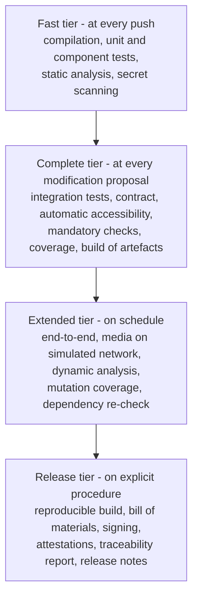

# Continuous Integration and Release

The build chain is not a support service to development: it is **part of the device**. IEC 62304 does not verify only the code, it verifies the process that produces it; D17 requires a distribution produced from **reproducible build** and subjected to quality control; D45 establishes that the bill of materials must be generated **from the first pipeline**, because inventorying components after the fact costs orders of magnitude more.

This chapter describes the technical structure. Formal commitments - support period, incident notification, surveillance - belong to `docs/08_compliance/` and are recalled here for the part realised in pipeline.

---

## 1. The two lifecycles, before everything else

D17 establishes a distinction that has effects on every line of this chapter:

| | Repository | Distribution |
|---|---|---|
| What it is | **Source code under permissive licence. It is not a medical device**, and declares it | **Identified artefact**, produced from reproducible build, with quality control |
| Name | The name of the project | Distinct name |
| Version | Semantic, on code | Own numbering, with its own lifecycle |
| Who answers | Nobody, by licence terms | The manufacturer, with its own compliance manager |
| Marking | **None** | That of whoever puts it on the market |

**The two artefacts have distinct names, version numbers and lifecycles.** The pipeline reflects the distinction: produces repository artefacts continuously and distribution artefacts only on an explicit procedure, with additional controls.

Until marking exists, every distributed artefact explicitly declares it is not marked and is not usable for delivery of healthcare performances on real patients (D16). **It is a pipeline control**: an artefact without the declaration is not published.

---

## 2. Pipeline structure

Four tiers, with clear membership criteria.

The tier placement criterion is time: the fast tier runs in minutes, otherwise it stops being executed at every push; the complete tier runs within the attention span of whoever proposed the modification. What does not fit descends a tier - **except the mandatory controls of §3, which stay in the complete tier regardless of cost**, because they are admissibility conditions and not quality verifications.

---

## 3. The mandatory controls

A mandatory control **blocks**. It does not produce a warning, does not open an issue, does not end in a report someone will read: it prevents integration. A control that can be ignored is not a control.

| # | Control | Blocks on |
|---|---|---|
| G1 | **Secrets** | Any credential, key or token in sources **or in history** |
| G2 | **Licences** | Dependency with licence incompatible with project's, or with no determinable licence |
| G3 | **Terminologies** | Content from licensed coding systems. See §4 |
| G4 | **Accessibility** | Violation of automatable rules on any screen or state |
| G5 | **Bill of materials** | Component in bill of materials and absent from register annotations |
| G6 | **Contract compatibility** | Non-additive modification to a contract scope element without new major version |
| G7 | **Coverage** | Below the scope threshold, per differentiated table |
| G8 | **Language divergence** | Italian document modified without corresponding English |
| G9 | **Internal references** | Broken internal link - **blocking before first website release**, per D52 |
| G10 | **Non-synthetic data** | Recognisable forms of real identifier in sources, fixtures and examples |
| G11 | **Confidentiality rule** | Company names, brands, commercial products or domains in prohibited list |
| G12 | **Live profile** | Configuration of image that activates a development shortcut |
| G13 | **Dependency rules** | Violation of rules in §1 of [`02-backend.md`](./02-backend.md) and §2.1 of [`04-frontend.md`](./04-frontend.md) |

Three notes worth more than the table.

**G1 checks history, not just current state.** A secret removed by a later modification remains in the history of a public repository, and is found there. The operational consequence is that detection is not enough: the **rotation** of the exposed secret is required, and it is a documented procedure, not a moment decision.

**G8 is the technical measure governing the actual risk of D50.** Divergence between the two versions is not a translation risk: it is a **different regulatory content in two languages**, which in a medical device is a document defect.

**G11 is the automated translation of rule R0.** It is a list of prohibited terms, versioned, with update procedure. It does not cover everything - automatic checking does not replace review - but it covers the case where a name ends up in a comment or in a sample configuration file.

---

## 4. The terminology control

Deserves its own section because it is the most specific control of this project and the most misunderstood.

**The problem.** D32 establishes that the licence of some clinical coding systems is perfected **by downloading or accessing** the content: if the project never downloads it, it is never bound by it. The confidentiality clause of those licences is moreover **incompatible with a public repository**, and the sub-licence chain is incompatible by construction with the project's licence.

**The mechanism.** A pipeline control with **versioned allow list**:

- searches, throughout the repository, for presence of system identifiers, known code forms and contents traceable to systems in exclusive regime (D31, regime D) or acquisition at installer cost (regime C);
- **permits** the system identifier and bare code - which are identifiers, not content - when permission is explicit in the list;
- **blocks** anything resembling a denomination, a hierarchy, a relationship or an expanded set of values;
- **blocks** addition of a dependency that downloads content at build time.

**The allow list is versioned and its modification requires the review provided for compliance material.** It is not a file updated to make your modification pass.

**The runtime complement.** The pipeline control protects the repository; the terminology gateway protects live operation, with per-system deactivation, absence of persistent disk cache (constraint [V-151](../11_registri/01-vincoli-in-vigore.md#v-151) of `SEC`) and degraded mode that makes constraint [V-03](../11_registri/01-vincoli-in-vigore.md#v-03) true. Tests run in the configuration without licensed systems, which is exactly what makes that mode really functioning (see [`08-qualita-e-test.md`](./08-qualita-e-test.md) §4.3).

**The two warnings that the project must document without mitigation** - that interrogating an external service does not exempt whoever installs, and that whoever distributes Telemedic distributes a product subject to the licence even without containing a single concept - are in `COMP`'s remit and go in material for the integrator, not hidden in a technical note.

---

## 5. Versioning

### 5.1 The levels

| What | Schema | Rule |
|---|---|---|
| **Repository code** | Semantic versioning | Major changes on breaking of a contract scope element |
| **Application interface** | Major version in path, plus optional dated version for additions | A client stays pinned to the version of first call: **never experiences a change it did not request** |
| **Interoperability interface** | **Not versioned with project number**: declares the standard version in capability statement and content type | Any later version support side-by-side would use distinct base paths |
| **Event schemas** | Version in type name | A consumer declares the types it understands |
| **Clinical profiles** | Fixed per version as build artefact | Upstream change cannot change the outcome of validation already executed |
| **Distribution** | Own numbering | See §1 |

### 5.2 Dismissal

The policy is declared in the public contract: announcement with **twelve months** advance on major version dismissal, standard dismissal and termination headers, link to migration guide, at least two major versions active simultaneously, and telemetry by version - because without knowing who still uses the old version, you cannot contact anyone.

The regulatory status of one of the two headers `[NV]` must be verified by the protocols area before
citing it as standard: one is defined by a published specification, the other is subject to work in progress.

### 5.3 Build identifier

Every artefact carries an identifier that includes the version, the exact code revision identifier and the normalised build instant. It is exposed by the application, appears in every log row (see [`06-osservabilita.md`](./06-osservabilita.md) §2.1) and appears in attestations. It is what links an observed behaviour to a specific artefact, which is the first question of any investigation.

---

## 6. Reproducible build

### 6.1 What it means

That two builds of the same revision, on different machines and at different times, produce artefacts **identical byte for byte**. It is not an exercise: it is what enables a third party - a verifier, an integrator, an organism - to **verify that the distributed artefact matches the published source**. Without it, the repository-distribution separation of §1 is an unverifiable assertion.

### 6.2 How to achieve it

- **Exact versions, never ranges.** Every dependency, direct and transitive, is fixed by a lock file versioned in the repository.
- **Normalised instants.** Archive timestamp derives from the revision, not from build machine clock.
- **Deterministic ordering** of archive entries.
- **Build environment declared as artefact**: base image fixed by fingerprint, not by mobile tag. A mobile tag renders the build non-reproducible by construction.
- **No content downloaded during build** that is not fixed and verified by fingerprint.

### 6.3 How to verify

A scheduled job rebuilds the latest distribution on a different runner and **compares fingerprints**. A divergence is a build chain defect and must be investigated as such. Verification is itself an artefact, with its outcome conserved.

---

## 7. Signed artefacts and provenance

### 7.1 What is signed

Everything that goes out: container images, distributable archives, interface packages, bill of materials, traceability reports, release notes.

Signed **with keys not residing in the pipeline**: signing material is held in a dedicated service and the signing operation is traced. A signing key available as an environment variable in a runner is a compromised key.

### 7.2 Provenance and attestations

Beyond signature, every artefact carries a **provenance attestation**: which source, which revision, which pipeline definition, which runner, which inputs. It is what lets an integrator answer "where does this artefact come from" without trusting an assertion.

Attestations produced at every release:

| Attestation | Content |
|---|---|
| Provenance | Source, revision, pipeline definition, inputs |
| Bill of materials | See §8 |
| Test results | Which suites, with which outcome, on which revision |
| Traceability | Requirement → tests, uncovered requirements, risk controls → tests |
| Reproducibility | Outcome of latest rebuild verification |
| Profile conformance | Verification that image does not activate development shortcuts |

### 7.3 Verification by whoever installs

Verification is **documented as an executable procedure** in the installation manual, with the commands. A signed artefact that nobody verifies adds no security: it adds a declaration.

---

## 8. Bill of materials

**Generated at every build**, in a standard machine-readable format, for **every** artefact - service, interface, images, charts - not just the main service. Base images contain system components that are third-party components in all respects, and a bill that ignores them is incomplete.

Minimum content: identifier, exact version, licence, fingerprint, dependency relationship (direct or transitive). The link with the third-party component register described in [`01-stack-e-motivazioni.md`](./01-stack-e-motivazioni.md) §14 occurs by identifier, and it is the G5 control: **a component in the bill and absent from annotations makes the build fail**. It is the mechanism that prevents a dependency from entering without having been evaluated.

### The component register, generated from the bill of materials

The bill says what entered the artefact; the versioned annotations say what the project has assessed
about each component. **The third-party component register is their join**, generated at every build
by
[`scripts/genera-registro-componenti.py`](https://github.com/fedcal/Telemedic/blob/main/scripts/genera-registro-componenti.py),
and it is not written by hand: a manual edit would be lost at the next build.

The distinction between the three objects is not terminological, and it is the reason the register
exists as an artefact of its own. The register is the only one of the three that answers the
question whoever installs actually asks: **what am I installing, under which licence, and who put
it there.** That last part is the least obvious and the most useful: of the one thousand two
hundred and thirty-six components of the documentation site, **nine** are dependencies the project
chose and **one thousand two hundred and twenty-seven** are transitive, pulled in by those. The
register declares, for each transitive one, **who pulls it**, because a dependency nobody chose
still has to be assessed by someone, and knowing where it enters from is the first step in deciding
its fate.

The register comes out in two forms, and the reason for the second is that one thousand two hundred
table rows are not readable: a tab-separated file with the **complete** list, one row per component,
which accompanies the distribution and is the object automated questions are asked of; and a
readable document carrying the aggregates by licence, the direct dependencies in full with the
inclusion reason written by a person, and **in full every component whose compatibility is not
ascertained** - which is the part the register exists for, and which would disappear in a list of
one thousand two hundred rows.

The generator **reports and does not judge**: compatibility comes from the annotations, which in
turn derive it from the declared licence identifier and not from the text of the licence. Whatever
is not in the reference list comes out "indeterminable" and stays indeterminable in the register, in
plain view. A generator that guessed would produce a reassuring and false register.

### Publication

The bill is **published** along with the artefact. It serves whoever installs to meet their own obligations - including the supplier declaration provided for in D40, for which the project provides the sheet with the data the customer is required to communicate - and serves the project to correlate a security advisory to a released artefact in minutes instead of days.

---

## 9. Environments and promotion

| Environment | Purpose | Data | Promotion |
|---|---|---|---|
| Development | Daily work | Synthetics generated | Automatic |
| Integration | Complete tier | Synthetics generated | Automatic |
| Test | Extended tier, manual accessibility verification, verification by installer | **Synthetics. Never production exports** | Automatic from main revision |
| Live | Delivery | Real | **Manual, with recorded approval** |

**The artefact is promoted, not rebuilt.** What was tested in test environment is exactly what goes to live, byte for byte. Rebuilding for the next environment means putting in live an artefact nobody tested.

The row "never production exports" is the same rule of [`08-qualita-e-test.md`](./08-qualita-e-test.md) §4.1 and must be repeated here because it is in this phase it is violated.

---

## 10. Release

### 10.1 The procedure

1. Revision freeze and release branch opening.
2. Execution of the complete release tier.
3. Production of artefacts, attestations and traceability report.
4. **Document review**: release notes, list of changes with clinical or security impact, update of third-party component register, verification that the non-marking declaration is present.
5. Signing, publication, revision tagging.
6. Recording of approval with responsible party and date.

Step 4 is the one skipped when in a hurry, and it is what makes the release traceable. Under document control (D45) **what is born outside control must be re-issued**, which costs more than doing it right the first time.

### 10.2 Release notes

Not a list of changes generated from revision messages. Fixed structure: changes with clinical or security impact up front and prominent; vulnerability corrections with severity and component; contract scope changes with version; actions required of the installer; known limits; updated third-party components.

### 10.3 Rollback to a previous version

It is a documented and **tested** procedure, not a hypothesis. The constraint that makes it possible is the expansion and contraction rule of [`03-persistenza.md`](./03-persistenza.md) §3.1: two consecutive versions must be able to coexist on the same database. A migration that breaks that property renders rollback impossible and must be treated as a high-risk change with a dedicated plan.

---

## 11. Support period

### 11.1 What it is

The regulation on digital resilience, which D27 establishes to adopt entirely without invoking exemptions, requires a **declared support period** with update obligations for its duration. D41 adds the clarification that the exemption is **per product and not per project**: artefacts not covered by marking still fall under the regulation, which directly concerns development kits, the embeddable component, images and charts.

**The duration of the period and the formal commitment are not this area's**: they are a manufacturer declaration and belong to `COMP`. This area describes **what support comprises on the technical side** and how it is realised in pipeline.

### 11.2 What it includes

| Element | Content |
|---|---|
| Security corrections | On the supported branch, with differentiated service level by severity |
| Third-party component update | Per service level of the register |
| Security advisories | Published with the vulnerability, impact, corrected version and mitigation |
| Updated bill of materials | For every supported version |
| Migration guide | To the next supported version |

**Service level is expressed in days from advisory publication, per severity, and is measured.** An commitment expressed in months is meaningless for components with the release cadence observed on the relay node - fourteen versions in a little over seven months, five in August alone. The technical proposal is open on the noticeboard at `COMP` and `ROAD` for formalisation.

### 11.3 End of support

Announced with declared advance, with the date, the next supported version and the migration path. **The project does not remove published artefacts** at support end: it marks them as unsupported. Removing them would make impossible for whoever installs to rebuild an environment for an investigation of an incident that occurred when they were in use - which is precisely what surveillance requires to be possible.

---

## 12. What the pipeline does not do

- **It does not replace human review.** Mandatory controls are admissibility conditions, not a quality judgment. Critical security code has in addition an independent external review (D18).
- **It does not decide on licences.** G2 blocks on a list; compatibility determination is a legal evaluation, not a configuration rule. D34 says it definitively: a permissive declaration appended to a container **does not dispose of third-party rights** on the content comprised, and verification must be done artefact by artefact on the primary licence.
- **It does not produce marking.** It produces the material for our conformity assessment path (D49), with the two lifecycles of §1 kept distinct.
- **It does not retain real data**, in any environment and in any phase.

---

**Returns to**: [`00-indice.md`](./00-indice.md).
