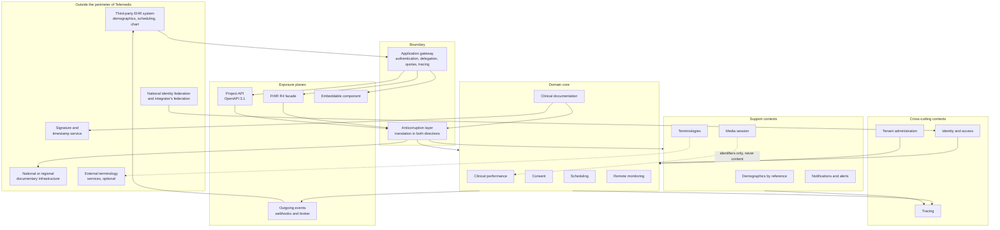

# Architectural vision

## 1. What this architecture must sustain

Telemedic is a **telemedicine component intended to live inside someone else's information system**. It is not a portal, not an electronic health record, not the user's entry point and not the holder of demographics. It is the missing piece in a healthcare management system, in a public facility or in a regional infrastructure when performance must be delivered at a distance - and it must fit without asking anyone to change what they already have.

This sentence, and not the technology stack, is what determines the architecture. Three consequences follow that no subsequent choice can contradict.

**First consequence: the system does not own identity.** The human being in front of the screen has been authenticated elsewhere, by the integrator's identity provider or by the national federation. Telemedic receives an assertion and transforms it into its own authorisation context; it does not issue primary credentials and does not impose a second login. The identity architecture is therefore a problem of **trusted propagation** and **representation of delegation**, not of user management.

**Second consequence: the system does not own demographic data.** The patient, the professional and the appointment already exist in the source system. Telemedic works by reference, with external identifiers qualified by their own domain of attribution, and does not build a reconciliation index of identities. From this follows a data model in which **no external identifier is a primary key** and in which the same physical person is, by construction, a distinct entity in distinct tenants.

**Third consequence: clinical content must return.** The report drafted during the performance cannot remain confined: it must flow into the chart of the source system and, where provided and permitted, into the national or regional documentary infrastructure. Return is therefore a **process of domain with observable outcome**, not an infrastructure detail hidden in an adapter.

A fourth force is added to these three, of a different nature: the system handles **data relating to health** and operates in a perimeter in which demonstrability matters as much as function. It is not enough that an access be lawful: it must be demonstrable years later, before someone who does not trust the operator's word. It is not enough that a document be correct: it must be immutable once signed, and its eventual correction must leave a trace of the superseded version. It is not enough that the data of two clients be separate: separation must withstand programming error, not just programmer intention.

## 2. The structuring forces

The decisions approved by the client and the derived constraints condense into seven forces. Every choice in this area is traceable to at least one of them, and conflicts between forces are resolved in the order they appear.

### F1 - Demonstrability before everything else

Constraint **V5** and decision **D42** impose a register of accesses **non-repudiable and non-alterable**. The decision is categorical on a point the industry systematically confuses: the versioning of application entities - the history table that the persistence layer maintains automatically - **versions but does not render immutable**, because whoever has write access to the database also alters the history. Demonstrability requires a chain of cryptographic fingerprints and **separate storage from the system that generates events**.

This force has a real architectural cost and is first because it is **retroactive**: a register built badly cannot be repaired after the fact, because events already written do not acquire demonstrable integrity after the fact. Document
[07 - Tracing and immutable register](07-tracciamento-e-registro-immutabile.md) is its full consequence.

### F2 - The boundary between vehicle and interpretation

Constraint **V2** and decisions **D26** and **D46** place the project on a precise ridge: the system **records clinical content drafted by a professional** and **applies thresholds defined by a professional**, but does not generate its own clinical information and does not deduce thresholds. The boundary is not a communicative stance: it is a structural property that must be readable in the code. From this follow, without margin of discretion:

- no clinical threshold hardcoded (transverse constraint of the binding architectural baseline, point 1);
- no field of a document populated by system-generated text;
- the monitoring context produces **alerts from configuration**, always subject to human review, never judgements;
- channel quality metrics **are not clinical observations** and do not enter the chart.

### F3 - Sovereignty and replaceability

Constraint **V1**, decision **D24** and decision **D40** transform what arose as a positioning argument into a verifiable requirement: **no obligatory component of the main path can depend on a non-replaceable service or one established outside the European Union**, and the three distribution profiles - European Union, Italian territory, qualified cloud - must all be traversable. Decision **D40** adds that the installing party must be able to declare to an authority the nominative list of relevant suppliers: sovereignty becomes therefore a datum to produce, not a promise to display.

Architecturally this force translates into a single rule: **every external dependency stands behind a project interface and has a stated fallback**. This applies to the terminology gateway, to the signature service, to notification delivery, to the event broker. Where the fallback does not exist, the path is not principal.

### F4 - Total integrability

Constraint **V3** establishes that **no capability of the system is reachable only through the user interface**. The consequence is not "expose everything in REST": it is that the application level cannot contain domain logic, otherwise the same capability would have two divergent implementations - one for the interface and one for the application interface. The domain model is therefore the only place where invariants live, and every exposure plane is a thin adapter above it.

### F5 - Isolation between independent controllers

Constraint **V4** imposes that every entity, every event and every row of register carry the tenant identifier. Decision **D8** imposes the dual model: managed multi-tenant service and installation at customer site with a single tenant, **with the same code**. The structuring force is not the multiplicity of clients: it is that in the managed service tenants are typically **autonomous controllers of processing**, not divisions of the same organisation. A data leak between tenants is not a product defect: it is a violation between distinct legal entities.

### F6 - Real-time does not tolerate the long path

The media session has a latency budget that does not allow transit through infrastructures designed for reliability rather than promptness. Session signalling has a requirement of ordering and delivery exactly once along a critical path that a generic publication channel does not guarantee. The force translates into a clear boundary: **the real-time plane and the plane of persistent facts are separate**, they have different mechanisms, and what originates in one enters the other only as a fact already occurred.

### F7 - Accessibility and real use as functional requirements

Constraint **V6** and decision **D25** render accessibility, design method starting from the small screen and usability engineering acceptance criteria for every screen, not finishing touches. The architectural impact is less obvious than it seems and concerns three points: **understandable degradation** (audio before video, session resumption, stated fallback) is domain behaviour and not optimisation; the **embeddable component inherits the constraints** and must not be able to be degraded by the host; **internationalisation is structural**, and in particular the interface strings of the project are separated by construction from official labels of terminologies.

## 3. The form that results

Three readings of this diagram merit explicit statement.

**The core does not speak with the outside.** Every translation to and from a third-party format occurs in the anticorruption layer of the boundary. This is the condition that allows supporting multiple integrators simultaneously without partner-specific logic in the domain, and surviving a version change of an external standard without touching invariants.

**The media session does not touch clinical content.** The connection between the media session context and the performance context passes through identifiers and state events alone. It is the structural translation of constraint **V2** and at the same time the condition that makes the media session replaceable.

**Tracing receives from everyone and feeds no one.** No application path reads from the register to make a decision. The register is a destination, not a source: this is what allows storing it separately and rendering it append-only without compromise.

## 4. Quality scenarios

An attribute of quality stated as an adjective is not verifiable. Those that follow are the scenarios with which Telemedic's architecture declares itself verifiable: source of stimulus, stimulus, environment, expected response, measure of response. These are **architectural scenarios**, not product requirements: the catalogue of requirements stands in the functional area and the two sets must remain traceable to one another.

### SQ-01 - The register withstands tampering

| Element | Content |
|---|---|
| Source | A subject with administrative privileges on the application database |
| Stimulus | Direct modification or deletion of a row of the access register |
| Environment | Normal operation, managed service |
| Response | Periodic verification of the fingerprint chain detects the break, identifies the affected interval and produces evidence; the copy kept separately remains intact and allows determining the original content |
| Measure | Detection occurs within the declared verification cycle; the interval of uncertainty is limited to records between two consecutive anchors |

### SQ-02 - No query without resolved tenant

| Element | Content |
|---|---|
| Source | New application code |
| Stimulus | Database query executed without tenant context set |
| Environment | Automated integration test and, secondly, operation |
| Response | The operation fails; it never returns a partial result or the complete set |
| Measure | No code path reaches the database with null context; the test that demonstrates this is mandatory and fails the build |

### SQ-03 - The event survives failure

| Element | Content |
|---|---|
| Source | The application process |
| Stimulus | Process interruption between writing the clinical datum and publishing the corresponding event |
| Environment | Operation, under load |
| Response | No events are lost nor events referring to facts never occurred; the event is published at restart |
| Measure | Integration test that verifies atomicity of datum and event writing in the same transaction |

### SQ-04 - Network loss does not alter clinical state

| Element | Content |
|---|---|
| Source | The patient's network |
| Stimulus | Complete loss of connectivity during performance |
| Environment | Performance in progress, with content already annotated |
| Response | The media session transits through its reconnection states and, if necessary, fails; the performance state **does not change** as an effect of the loss; resumption does not create a second performance |
| Measure | Number of performances created per performance delivered, independent of the number of media sessions; must always be one |

### SQ-05 - One tenant's noise does not degrade others

| Element | Content |
|---|---|
| Source | An integrator whose event receiver is unavailable |
| Stimulus | Continued delivery failure for hours, with event accumulation |
| Environment | Managed service with multiple active tenants |
| Response | Delivery frequency to that destination decreases and then suspends; events end in a queue dedicated to the tenant; delivery capacity to other tenants remains unchanged; upon reactivation no synchronised burst is produced |
| Measure | The ninetieth percentile delivery latency for other tenants does not vary beyond the stated threshold |

### SQ-06 - The domain model survives standard version change

| Element | Content |
|---|---|
| Source | The standards body |
| Stimulus | Publication of a revision of the national implementation guide that modifies an adopted profile |
| Environment | Evolution, with active installations |
| Response | Changes concentrate in mappers and profiles; no domain invariant changes; the two versions of profile can coexist for migration time |
| Measure | Number of files modified outside mapping and profiling packages; the goal is zero |

### SQ-07 - The system works without cost terminology

| Element | Content |
|---|---|
| Source | The installing party |
| Stimulus | Disabling of the coding system subject to affiliate licensing |
| Environment | First installation, without terminology licence contract |
| Response | All principal paths remain traversable; the only stated loss is validation of codes belonging to that system; no function is blocked |
| Measure | Full execution of the functional test suite with the system disabled |

### SQ-08 - Restoring a single tenant does not touch others

| Element | Content |
|---|---|
| Source | A managed service customer |
| Stimulus | Request to restore their data to an earlier instant, following their own operational error |
| Environment | Managed service, other tenants in operation |
| Response | Restoration occurs without interrupting or altering other tenants' data and without global downtime window |
| Measure | Restoration time measured; downtime of other tenants equal to zero |

### SQ-09 - Distance performance degrades understandably

| Element | Content |
|---|---|
| Source | The patient's mobile network |
| Stimulus | Progressive bandwidth reduction until video becomes unusable |
| Environment | Performance in progress, patient on telephone |
| Response | Audio channel is preserved before video; both participants receive understandable notice and not one based on colour alone; the professional can declare fallback and the event is registered |
| Measure | Conversation remains intelligible up to the stated threshold; the degradation event appears in the technical register of the performance |

### SQ-10 - Clinical content returns to the source system or failure is visible

| Element | Content |
|---|---|
| Source | The source system |
| Stimulus | Unavailability when the signed report must be returned |
| Environment | Operation |
| Response | The document remains available in Telemedic; return is retried according to stated policy; definitive failure appears in a reconciliation queue **visible to an operator**, not in a technical register |
| Measure | No return failure is silent; every queue item has a responsible party and a possible action |

## 5. Architectural principles of the project

General principles of engineering - separation of concerns, inversion of dependencies, simplicity - hold here as everywhere and are not repeated. Those that follow are the **specific principles of this system**, those whose violation produces a defect that generic good sense does not intercept.

**P1 - What is volatile does not condition what is documentary.** The media session, telemetry, connectivity are volatile; performance, consent, document are documentary. The first set never determines the state of the second.

**P2 - The absence of data is information.** The silence of a device, the non-completion of a questionnaire, the absence of an expected measurement are not normality: they are facts that the system must represent and, where provided by the configured plan, signal. A model that represents only what has arrived is an incomplete model.

**P3 - Every fact carries its own production context.** Who, when, with what tool, with what method, with what level of guarantee of identity, on behalf of whom. A value without context is not reconstructible and, in this domain, is not usable.

**P4 - Time is at least bidimensional.** The instant when a fact occurred and the instant when the system learned of it are distinct quantities and must both be preserved. The measurement taken in the morning and transmitted in the afternoon, consent revoked with effect on what already happened, the tariff effective at the time of performance are all cases where overlaying the two axes produces an unrecoverable error.

**P5 - Configuration cannot remove an invariant.** A tenant can disable functions, change thresholds, define its own roles by composing existing permissions. It cannot create new permissions, cannot enable a combination of profession and act that the domain forbids, cannot disable access logging.

**P6 - Fallback is designed, not improvised.** Every external dependency has a stated behaviour in case of unavailability, and that behaviour is part of the contract. "It was not foreseen" is the description of a defect.

**P7 - Extension reaches as high as possible.** What can be obtained through configuration does not require an event; what can be obtained through an event does not require in-process code; what can be obtained through in-process code does not require a fork of the project. Every step down increases the cost for whoever installs and, in a regulatory path, shifts the perimeter of technical documentation.

**P8 - No structural decision without register.** An architectural choice not written in an ADR will be contradicted, and the contradiction will not be detected until it is costly.

## 6. Accepted trade-offs

An honest architecture declares what it has bartered. These are the conscious trade-offs of Telemedic, with the price that has been accepted to pay.

### C1 - Final consistency between contexts, immediate consistency within the aggregate

Operations spanning multiple contexts are realised with events and compensations, not distributed transactions. **Price accepted**: there exist windows in which two contexts have a different view of the same fact - for example the performance is concluded but the source system does not know it yet. **Why accepted**: distributed transaction would require coordinating components that are not coordinable (an external signature service, a documentary repository, an identity provider) and would produce a system that blocks when any of them is slow. **Mitigation**: aggregate boundaries are chosen so that every clinically relevant invariant is internal to a single aggregate, and every divergence window has a stated duration and a visible reconciliation mechanism.

### C2 - Delivery at least once, not exactly once

**Price accepted**: every consumer must be idempotent and every integrator must be informed they will receive duplicates. **Why accepted**: guarantee of delivery exactly once does not cross the boundary of an external system, and promising it would produce integrators that do not dedup. **Mitigation**: explicit deduplication key in every envelope, documented in the public contract and verified in contract tests.

### C3 - Two interface planes instead of one

The clinical plane in FHIR and the application plane in OpenAPI expose the same domain with different grammars. **Price accepted**: two contracts to maintain, two test sets, risk of semantic divergence. **Why accepted**: FHIR is indispensable for interoperability and unsuitable for expressing product actions; a single interface would force either modelling the virtual room as a clinical resource - polluting the chart - or abandoning interoperability. **Mitigation**: a single domain model under both planes, written and verifiable partition rule, equivalence tests on semantic concepts exposed by both.

### C4 - One schema per tenant, with the operational cost it entails

**Price accepted**: the number of schemas grows with clients; migrations must be applied to each; database management tools must be dimensioned accordingly. **Why accepted**: selective restoration of a single client and demonstrability of separation between autonomous controllers are requirements, not wishes, and with shared rows the first is difficult and the second is argumentative rather than structural. **Mitigation**: automated and reversible migration, tenant creation without manual steps, row-level security as additional defence not alternative.

### C5 - Signalling does not pass through the broker

**Price accepted**: the real-time path has its own mechanism, with its own load distribution strategy and its own state machine; it is a second system to understand and test. **Why accepted**: routing signalling through outbox and broker would introduce relay latency into a path that does not tolerate it, and the generic publication channel does not guarantee the ordering required by candidate exchange. **Mitigation**: explicit and declared boundary; the **facts** produced by the session enter the persistent plane as ordinary events, the **negotiation traffic** does not.

### C6 - Conformance to implementation guides still in draft state

The national guides adopted are in preliminary version. **Price accepted**: maintenance facing non-retrocompatible revisions, and the possibility of having to reissue profiles. **Why accepted**: the alternative - a proprietary model - would produce a system not interoperable in its reference market, which is precisely the defect the project exists not to have. **Mitigation**: explicit versioning fixation, periodic review procedure, and canonical dataset independent of serialisation, so that a profile revision does not touch informational content.

### C7 - Two session modes with different security properties

The server-side recording mode **is not encrypted end-to-end**. **Price accepted**: the system has two security profiles instead of one, and this is harder to explain than a uniform promise. **Why accepted**: client-side recording would preserve encryption but is unreliable on the patient's device and risks degrading precisely the session it must protect; the client chose the reliability of recording. **Mitigation**: the mode is distinct in the data model, declared in the consent notice, signalled persistently and not concealable, and transition between the two modes is a traced event.

## 7. Rejected trade-offs

More instructive than the preceding list is the list of shortcuts that were available and were discarded. Each would have saved work; each would have produced an uncorrectable defect.

### R1 - Merging clinical performance and media session into a single object

It is the most natural shortcut - there is only one consultation, why two entities? - and it is the most costly modelling error in this domain. The consequences are all real: every disconnection would create a phantom performance; a technical test before the appointment would create a non-existent health act; a performance concluded in audio after video failure would appear not delivered; the count of performances delivered would coincide with the count of successful connections, which is a different quantity and serves something else. **Rejected without exception**; it is constraint V-01 of the inter-agent noticeboard.

### R2 - Treating entity versioning as an immutable register

It would have been economical: the persistence layer offers history almost for free. It would also have been false, and the falsity would emerge at the worst moment, i.e. before a challenge. **Rejected**: versioning remains useful for application reconstruction, it is not and is not presented as the access register.

### R3 - Persisting standard interoperability resources directly

Preserving the resource tree as-is, in a documentary field, seems to eliminate a mapping layer. In reality it shifts every domain invariant inside a check on an optional JSON tree in nearly every branch, makes standard version migration a data migration, and ties the model to a specific revision of a guide in draft state.
**Rejected**: resources are projections built by tested mappers, the domain does not know the standard.

### R4 - Modelling channel metrics as clinical observations

Technically possible, semantically wrong and regulatorily risky: an observation ends up in the patient's chart, and packet transmission delay is not clinical data. **Rejected**: metrics live in the application plane and in a dedicated time series archive.

### R5 - Impersonation instead of delegation

Accepting an identity assertion and acting as if you were the user simplifies authorisation code. It erases however the information "which system acted on behalf of which person", which is precisely what the register must be able to answer. **Rejected**: delegation is represented explicitly and chains of nested delegations are preserved.

### R6 - Building a patient identity reconciliation index

It would have been the obvious answer to the problem "the same patient arrives from two different systems". It would have made Telemedic the holder of demographics, in direct contradiction with the integration model, and would have created an archive of health identities that no integrator has asked for and that nobody wants to hold. **Rejected**: the source system's identity is consumed, work is by reference, reconciliation remains with whoever already owns it.

### R7 - A second login for the user already authenticated elsewhere

It would have made authorisation trivial. It would have been rejected by the reference market and would have produced, in practice, shared credentials between colleagues - i.e. a security worsening achieved in the name of security. **Rejected**.

### R8 - Pre-defined "reasonable" clinical thresholds provided by the project

It would have been useful to user experience and would have moved the system from registration of a professional decision to production of its own judgement, with resulting qualification consequences. **Rejected**: thresholds are per-patient configuration, always attributed to an identified professional, never provided as clinical default.

### R9 - A function reachable only through the interface

It occurs in every project as "this is only an administration screen". It produces a non-automatable and non-verifiable system, and violates V3. **Rejected**: if a capability exists, it exists also as a documented application interface.

### R10 - Updating in-place the state of alarms, measures and plans

A state column updated at every transition is the most economical representation and erases history every time it writes it. In a context where the question to answer is not "in what state is it" but "what happened, in what order, and who did what", it is an irreversible loss. **Rejected**: state is a projection of a sequence of immutable events.

### R11 - Deferring multi-tenancy to after the first client

It is the decision that seems most rational at the beginning and that is never recoverable after: tenancy is not a layer you add, it is a property of every key, every index, every migration, every event and every row of register. **Rejected**: the system originates multi-tenant and installation at customer site is the degenerate case with a single tenant, not a separate branch.

## 8. How to verify the architecture holds

An architecture stated and not verified degrades silently. The project adopts a set of checks executed automatically and considered blocking, which translate principles into controls. The list is architectural; their realisation belongs to the technical area.

| Verification | What it prevents |
|---|---|
| No domain package imports types from the interoperability standard | The domain binding itself to a revision of FHIR |
| No domain package imports types from the persistence level or application framework | Invariants becoming dependent on infrastructure |
| No query reaches the database without tenant context | Data leak between autonomous controllers |
| No context accesses tables of another context | Silent erosion of boundaries |
| Every write of data producing an event writes it in the same transaction | Lost events and phantom events |
| No numeric literal used as a clinical threshold in code | Sliding beyond the boundary of V2 |
| No field of a document populated by system-generated text | Idem |
| Every published event has a versioned and registered schema | Unannounced public contract breaks |
| The connection returned to the pool does not preserve the tenant of the previous request | Contamination between tenants through connection reuse |
| No external identifier appears as a primary key | Irreversibility of another's demographics |
| The full functional suite passes with the cost-licensed coding system disabled | Actual dependency on a licence the project cannot impose |

## 9. What this vision does not decide

Deliberately left open, and treated in [09 - Deferred decisions](09-decisioni-rinviate.md),
are questions that at this stage cannot be decided with available information: among the principal ones, the concrete mechanism for executing multi-step processes, the method for reading the outbox in high-volume configurations, the topology of the session beyond two participants, the container of recording and the strategy for coexistence with a future revision of the interoperability standard. They are open with stated decision criteria, not forgotten.
