# Bounded contexts

## 1. Why the boundaries stand where they stand

The decomposition of Telemedic does not arise from a technical subdivision - presentation, logic, data - nor from a division by resource type. It arises from **three observable fractures in the domain**, and each produces boundaries that would be costly to move.

**The language fracture.** The same word changes meaning crossing the system. "Session" for the professional is the clinical act, for the infrastructure it is the media connection, for administration it is the billable unit. "Consent" is, in three legally distinct senses, adhesion to the health act, the basis of data processing and authorisation for recording. "Performance" is together the request, the execution and the charge. Where a word changes meaning, a boundary passes: within a context language must be univocal, and translation occurs explicitly at the boundary.

**The rhythm fracture.** Clinical documentation changes when healthcare regulation changes; media transport changes when network protocols and browser engines change; identity federation changes when national technical rules change. Different rhythms require different release cycles, and components that change together must stay together.

**The protection regime fracture.** Clinical content, evidence of consent, audiovisual recording and the access register have access regimes, conservation regimes and deletion regimes incompatible with each other. Keeping them in the same context would force applying to all the most severe regime - rendering the system unusable - or the most permissive, rendering it unlawful.

## 2. Listing and summary

The contexts are thirteen. The listing and responsibilities are those of the binding architectural baseline; here they are identified with a stable code and developed one by one.

| Code | Context | Type | Is responsible for | Is **not** responsible for |
|---|---|---|---|---|
| **CTX-01** | Identity and access | cross-cutting | Authentication, federation, guarantee levels, roles, delegations | Clinical demographics of the patient |
| **CTX-02** | Demographics | support | Patients, professionals, organisations, sites, role relationships | Who can do what |
| **CTX-03** | Scheduling | core | Availability, booking, rescheduling, cancellation, reminders | What happens during the performance |
| **CTX-04** | Clinical performance | core | Engagement, progression, outcomes, state of the health act | Audio-video transport |
| **CTX-05** | Media session | support | Signalling, negotiation, quality, recording, session verification | Clinical meaning of what happens |
| **CTX-06** | Clinical documentation | core | Drafting, validation, signing, versioning, correction of documents | Sending to external infrastructures |
| **CTX-07** | Remote monitoring | core | Monitoring plans, parameter acquisition, adherence, threshold evaluation | Clinical decision |
| **CTX-08** | Notifications and alarms | support | Delivery, escalation, engagement, non-response | Threshold definition |
| **CTX-09** | Consent | core | Consents, revocations, obscurings, access delegations | Legal bases of the controller |
| **CTX-10** | Terminologies | support | Resolution, validation, code expansion | Terminology content |
| **CTX-11** | Interoperability outbound | boundary | FSE, third systems, transformations, retries and fallback | Canonical model |
| **CTX-12** | Tracing | cross-cutting | Immutable register of accesses and operations | Application logic |
| **CTX-13** | Tenant administration | cross-cutting | Configuration, customisation, quotas, life cycles | Clinical data |

The "is not responsible for" column is not ornamental. In a growing system, boundaries erode through accumulation of reasonable exceptions: it is the moment when someone proposes to add "just one field" that this column serves.

## 3. Map of contexts

```mermaid
flowchart TB
    subgraph NUCLEO["Domain core"]
        C03["CTX-03 Scheduling"]
        C04["CTX-04 Clinical performance"]
        C06["CTX-06 Clinical documentation"]
        C07["CTX-07 Remote monitoring"]
        C09["CTX-09 Consent"]
    end

    subgraph SUPPORTO["Support contexts"]
        C02["CTX-02 Demographics"]
        C05["CTX-05 Media session"]
        C08["CTX-08 Notifications and alarms"]
        C10["CTX-10 Terminologies"]
    end

    subgraph TRASV["Cross-cutting contexts"]
        C01["CTX-01 Identity and access"]
        C12["CTX-12 Tracing"]
        C13["CTX-13 Tenant administration"]
    end

    subgraph FRONT["Boundary"]
        C11["CTX-11 Interoperability outbound"]
    end

    EXT1["Third-party EHR system"]
    EXT2["National or regional documentary infrastructure"]
    EXT3["Identity federation"]
    EXT4["Signature and timestamp service"]
    EXT5["External terminology service, optional"]

    C01 -->|"Conformist: the access decision is not negotiated"| C03
    C01 -->|"Conformist"| C04
    C01 -->|"Conformist"| C06
    C01 -->|"Conformist"| C07
    C13 -->|"Published language: configuration as versioned contract"| C03
    C13 -->|"Published language"| C04
    C13 -->|"Published language"| C07
    C13 -->|"Published language"| C08
    C02 -->|"Customer-supplier: demographic references"| C03
    C02 -->|"Customer-supplier"| C04
    C03 -->|"Customer-supplier: the performance consumes the appointment"| C04
    C09 -->|"Partnership: blocking verification before the act"| C04
    C09 -->|"Partnership: consent to recording"| C05
    C09 -->|"Partnership: obscuring and visibility"| C06
    C04 -->|"Partnership: the performance contains the document"| C06
    C04 -->|"Customer-supplier: commands the session, for identifiers only"| C05
    C07 -->|"Customer-supplier: out-of-threshold measure generates alert"| C08
    C04 -->|"Customer-supplier: events that generate notifications"| C08
    C06 -->|"Customer-supplier: document made available"| C08
    C10 -->|"Open hosting service: resolution and validation"| C04
    C10 -->|"Open hosting service"| C06
    C10 -->|"Open hosting service"| C07
    C04 -->|"Published language: domain events"| C12
    C06 -->|"Published language"| C12
    C09 -->|"Published language"| C12
    C01 -->|"Published language"| C12
    C07 -->|"Published language"| C12
    C11 -->|"Anticorruption layer towards the core"| C02
    C11 -->|"Anticorruption layer"| C03
    C11 -->|"Anticorruption layer"| C04
    C11 -->|"Anticorruption layer"| C06
    C11 -->|"Anticorruption layer"| C07
    EXT1 -->|"Conformist: the source system is the master"| C11
    C11 -->|"Open hosting service: single contract for all"| EXT1
    C11 -->|"Conformist: imposed document profiles"| EXT2
    EXT3 -->|"Conformist: imposed identity schema"| C01
    EXT4 -->|"Conformist: imposed signature format"| C06
    EXT5 -.->|"Conformist, optional and disableable"| C10
```

### 3.1 How to read the map

**The core is what the project invests most in.** Scheduling, performance, documentation, remote monitoring and consent are the contexts where distinctive value lives and where modelling must be done with disproportionate care compared to code size. An error in a support context costs a rewrite; an error in the core costs a clinical data migration.

**CTX-11 is the only point of contact with the outside.** No other context knows the format of a third-party system. This is the condition that allows supporting multiple integrators without partner-specific logic in the domain, and absorbing the revision of an external standard by changing a mapper.

**Consent is in partnership, not customer-supplier.** The distinction is substantial: a service consumed opportunistically can be skipped when it is slow or unavailable; a partnership cannot. Consent is **a condition of existence of the act**: if its verification is not possible, the act does not proceed. No "degraded path without consent verification" is allowed.

**Tracing receives published language.** Tracing events have a versioned and backward-compatible schema because they must be readable years later by whoever verifies, with tools that do not yet exist. It is the only context where backward-compatibility is a probative need and not a convenience.

**The external terminology service is dashed.** It is not on the main path and is disableable per coding system: it is the only external dependency in the diagram that the system must be able to lose while remaining fully operational.

### 3.2 Relationship with domain research decomposition

The domain research (`R6` §8.2) had proposed thirteen contexts with partly different names. The binding architectural baseline fixed thirteen of its own, which are adopted here. The correspondence is necessary because the functional requirements catalogue cites the codes of the research.

| Context in this area | Research context | Note on correspondence |
|---|---|---|
| CTX-01 Identity and access | BC-01 Identity & Access | Coincident |
| CTX-02 Demographics | BC-03 Patient & Practitioner Directory | Coincident |
| CTX-03 Scheduling | BC-04 Scheduling | Coincident |
| CTX-04 Clinical performance | BC-05, clinical part | Research held together the encounter and session in a single context with two roots; baseline separates them into two contexts |
| CTX-05 Media session | BC-05 technical part + BC-08 Media & Recording + BC-09 Quality Telemetry | Quality telemetry is internal to the session context, not an autonomous context |
| CTX-06 Clinical documentation | BC-07 Clinical Documentation | Coincident |
| CTX-07 Remote monitoring | *(none)* | Perimeter of remote monitoring introduced by **D21** after domain research: new context |
| CTX-08 Notifications and alarms | BC-10 Notification | Research did not cover remote monitoring alarms, which here belong to the context |
| CTX-09 Consent | BC-06 Consent | Coincident |
| CTX-10 Terminologies | *(none)* | Derives from **D31**-**D34**: new context |
| CTX-11 Interoperability outbound | BC-11 Integration & Interoperability | Coincident |
| CTX-12 Tracing | BC-12 Audit & Compliance | Coincident |
| CTX-13 Tenant administration | BC-02 Tenant & Configuration | Coincident |
| *(none)* | BC-13 Billing & Reporting | **Stated departure**, treated in §5 |

## 4. The thirteen contexts

For each context: what is entrusted to it, which language it speaks, which invariants it guards, what it deliberately does not do and how it relates to others.

### CTX-01 - Identity and access

**Responsibilities.** Transform an external identity assertion into an internal authorisation context; preserve role assignments and application delegations; decide if a subject can perform an operation on a resource.

**Language.** Subject, application principal, capacity (the person-organisation pair with temporal validity), role, atomic permission, enabling relationship, access purpose, guarantee level, delegation, derogation access. The term "user" is deliberately avoided: it hides the difference between the person, their professional capacity and the application principal acting on their behalf.

**Invariants.**

1. The access decision is **deterministic and reproducible** with matching attributes: given the same attributes of subject, resource, relationship and context, the decision is always the same.
   It is the condition that renders the decision explicable afterwards.
2. Access is permitted **only if** the atomic permission belongs to the roles **and** there exists at least
   one enabling relationship **and** no manifestation of will in the negative covers the
   resource **and** the subject's tenant coincides with the resource's tenant. The four conditions
   are conjunctive; the default value is denial.
3. No role can contain together clinical permissions and tenant administration permissions.
   The separation between **service centre and delivery centre** is an authorisation constraint and not
   an organisational convention: whoever manages technical alarms does not access clinical content,
   and composing a role that violates the separation is **rejected with a validation error**
   (constraint [V-125](../11_registri/01-vincoli-in-vigore.md#v-125) of the functional area).
4. Derogation access has finite duration, is not automatically renewable, requires a free motivation
   and produces an obligation of review with registered outcome.
5. The guarantee level of identity is always qualified by the source: **executed** by
   the system or **reported** by an integrator. A reported level does not satisfy a requirement of
   strong authentication (constraint [V-154](../11_registri/01-vincoli-in-vigore.md#v-154) of the security area, [V-165](../11_registri/01-vincoli-in-vigore.md#v-165) of the integration area).
6. The representation of delegation is explicit: it always registers **which system acted on
   behalf of which person**. Impersonation is not allowed.

**What it does not do.** It does not preserve the clinical demographics of the patient: it knows a subject exists, not who they are clinically. It does not decide the legal bases of processing, which belong to the controller and live in CTX-09 as registered facts. It does not issue primary credentials for the citizen: the service provider towards the national federation is the installing party
(constraint [V-05](../11_registri/01-vincoli-in-vigore.md#v-05)), not the project.

**Relationships.** It is **conformist** towards the identity federation: the assertion schema is imposed from outside and is not negotiated. It is **conformist in reverse** towards other contexts, in that they accept the access decision without renegotiating it: no context implements its own authorisation logic. It publishes to tracing a versioned language of events of authentication, role assignment, derogation and denial.

### CTX-02 - Demographics

**Responsibilities.** Hold the **references** to subjects and organisations with which the system works: patients, professionals, organisations, sites, role relationships, representation links. The key word is references: the context preserves what serves to recognise and contact, not what serves to cure.

**Language.** Patient (administrative qualification) and patient (clinical qualification) are distinct and non-interchangeable terms. External identifier is the pair attribution domain plus value. Professional capacity is the relationship between person, organisation and branch, with temporal validity. Representation is the title, with its own sphere of powers; delegation is the voluntary act of the capable subject, with mandatory expiry.

**Invariants.**

1. **No external identifier is a primary key.** The internal identity is an opaque identifier generated by the system; external identifiers are attributes qualified by their own attribution domain.
2. The pair attribution domain plus value is **unique per tenant**, not globally.
3. **No correlation between tenants**: the same physical person present in two tenants is, by construction, two distinct entities and not linked. There is no query that crosses tenants on a demographic basis.
4. Professional capacity is a relationship with temporal validity, never an attribute of the person.
   The same professional has multiple capacities - branch per structure per regime - and permissions follow the capacity, not the person.
5. Every voluntary delegation has an expiry. A delegation without term is permanent unpoliced access and is not representable.
6. The sphere of powers of a representation is registered and verified **per act**, not presumed
   from the legal figure.

**What it does not do.** It does not decide who can do what: that is CTX-01. It does not build and does not maintain a reconciliation index of identities between systems: it consumes the identity of the source system and does not become its holder. It does not preserve clinical data: condition, disease exemption and history belong to the clinical contexts, not to demographics - also because a disease exemption reveals the disease and is special data in all respects.

**Relationships.** It provides references to CTX-03 and CTX-04 in a customer-supplier relationship. It receives from CTX-11 the data from the source system, already translated by the anticorruption layer: no external structure enters here in its original form.

### CTX-03 - Scheduling

**Responsibilities.** Delivery availability, booking, rescheduling, cancellation, waiting lists, reminders. It is a core context because the admissibility of distant performance is decided here, before the act exists.

**Language.** Scheduling belongs to the delivering resource - the professional capacity, the surgery, the equipment - not to the person of the professional. Interval is the elementary unit of availability and does not coincide with the appointment: one occupied slot is the projection of an appointment onto the schedule, not the appointment. Available has three meanings that must be kept separate: published, bookable by a given channel, not yet occupied.

**Invariants.**

1. The sum of bookings on an interval does not exceed the stated capacity. Overbooking exists only if
   **authorised by configuration**; if it emerges as an effect of a race condition it is a defect.
2. The chain of rescheduling preserves the **date of the original request**: without it, waiting times
   are not reconstructible and rescheduling becomes a way to erase them.
3. A distant appointment exists only if the performance is enabled on that channel for that
   tenant. The enablement is configuration, not inference.
4. A blocked interval is not bookable for any channel.
5. The reminder does not contain clinical data: date, time, facility, access link. The specialist branch is itself health data and does not appear.

**What it does not do.** It does not know what happens during the performance. It does not register clinical outcomes. It is not the holder of the appointment when the appointment originates in the source system: in that case it preserves a reference and reflects the state, without claiming to govern it.

**Relationships.** Customer-supplier towards CTX-04: the performance consumes the appointment, not the reverse. It receives from CTX-13 the configuration - enabled catalogue, windows, cancellation policies - as versioned published language. It produces events consumed by CTX-08 for reminders and by CTX-11 for return to the source system.

### CTX-04 - Clinical performance

**Responsibilities.** The life cycle of the distant health act: engagement, prerequisites, admission, progression, subject identification, outcome, closure. It is the central context of the system and is **documentary**: what happens in it persists.

**Language.** Encounter is the interaction between patient and delivery system, with a beginning and an end. Episode is the temporal container of multiple encounters on the same problem.
Participant is the subject admitted with a role - provider, patient, carer, interpreter, observer. Identification is the verification that the person connected is effectively the expected patient, and **does not coincide with authentication**: the credential certifies who holds the credential, not who is in front of the camera. Outcome is the professional's declaration of the result of the act, and includes legitimate outcomes such as referral in person.

**Invariants.**

1. **The state of the encounter does not depend on the state of the media session.** It is the most important invariant of the system and the reason for the separation between CTX-04 and CTX-05.
1-bis. **Every type of performance is its own state machine**, selected by type; allowed actors, obligatory presence of the patient, asynchrony, obligatory artefacts, allowed outcomes, recordability and windows are **attributes of the catalogue**, not conditions scattered in the code (constraint [V-140](../11_registri/01-vincoli-in-vigore.md#v-140) of the domain area).
1-ter. **State and outcome are distinct attributes** and not collapsible: two outcomes can share the terminal state and have opposite administrative effects (constraint [V-141](../11_registri/01-vincoli-in-vigore.md#v-141)).
1-quater. **The setting discriminates the rules**: the obligation of report is not unconditional and must not be hardcoded - there exist settings in which the performance produces a digital note in place of the report (constraint [V-145](../11_registri/01-vincoli-in-vigore.md#v-145) of the domain area).
2. The encounter does not pass to concluded without an **outcome declared by a professional**. No automatic closure by timeout produces a clinical outcome.
3. The session is not started if obligatory manifestations of will are not verified. Verification is blocking and not degradable.
4. Every participant is **visible to all** the others. No silent presence, for any role, not even technical support.
5. Identification and authentication are two distinct pieces of evidence, at two distinct moments, with two distinct registrations.
6. The change of channel - from video to audio alone - is a registered fact with the time and the reason,
   because it can change the admissibility and reportability of the act.

**What it does not do.** It does not transport audio and video. It does not know network candidates, relay fallbacks, negotiated ciphers. It does not draft the document: it opens the reporting window and observes its state, but the document lives in CTX-06. It does not calculate clinical priorities nor outcomes: it registers them.

**Relationships.** It consumes the appointment from CTX-03 and references from CTX-02. It is in partnership with CTX-09, which conditions its existence, and with CTX-06, of which it is the container. It commands CTX-05 in a customer-supplier relationship, exchanging **identifiers and states only**. It publishes to tracing a versioned language.

### CTX-05 - Media session

**Responsibilities.** Establish and maintain real-time connection: signalling, negotiation, ephemeral credentials for relay, independent verification of keys by participants, quality measurement, recording when activated, encrypted storage and expiry of recorded material.

**Language.** Session here means connection, not act. Negotiation, candidate, relay fallback, degradation, reconnection, audio fallback are technical terms that have no clinical meaning. Short key verification is the comparison, by voice, between the two speakers, of a code derived from cryptographic fingerprints: it is together what makes demonstrable encryption to the endpoints and a traceable risk control.

**Invariants.**

1. **No recording without reference to a current and specific manifestation of will.** General consent to the platform does not cover recording of the single session.
2. Encryption keys at rest of recorded material are **per tenant** and never shared.
3. Every piece of recorded material has a set and applied conservation expiry. No recording without term exists.
4. The cryptographic material of the session is **generated fresh for every session**, without reuse. The project **does not declare protocol versions nor negotiated suites**: it measures them per session, registers them among metadata and renders them exportable; a value below the minimum threshold configured for tenant produces an event (constraint [V-156](../11_registri/01-vincoli-in-vigore.md#v-156) of the security area).
4-bis. **The session key and the room address are not metadata: they are credentials.**
   They are not persisted in queryable resources nor transported in fields that transit through third-party systems; they are obtained with an authenticated call, are single-use and have very short life (constraint [V-137](../11_registri/01-vincoli-in-vigore.md#v-137) of the protocols area).
5. Degradation preserves **audio before video**, always.
6. Quality samples do not contain direct identifiers of the patient, and no relay infrastructure metric is labelled with the session identifier (constraint [V-155](../11_registri/01-vincoli-in-vigore.md#v-155) of the security area).
7. The two operational modes - encrypted end-to-end without recording, and with server-side recording - are **distinct states and mutually exclusive** of the session, with traced transition.

**What it does not do.** It does not attribute clinical meaning to what happens. It does not decide if quality is sufficient for the act: it measures, compares with configured thresholds and informs the professional, who decides. It does not conserve clinical content: recorded material is an artefact of its own, with its own access regime, and is not clinical documentation.

**Relationships.** Customer of CTX-04, which commands its opening and closing. In partnership with CTX-09 for consent to recording, whose revocation has immediate effect on ongoing recording. It provides CTX-08 with degradation events. It has no direct relationship with CTX-06: no fragment of media enters the clinical document except through an explicit professional decision, registered as acquisition.

### CTX-06 - Clinical documentation

**Responsibilities.** The life cycle of the health document: draft, validation, signing, versioning, correction, making available. It is the context where the constraint on the boundary between registration and interpretation is most delicate.

**Language.** Draft and report are not the same thing: an unsigned draft **is not a report**, is not visible and is not transmissible. Clinical narrative, diary and report have different recipients, formats and access regimes and are not interchangeable. Correction is not modification: it is the issuance of a subsequent version that replaces the previous one maintaining the chain. Signature indicates a precise level, and different levels have different legal effects.

**Invariants.**

1. **The signed document is immutable.** It is not modified: a subsequent version is issued that replaces or corrects it, and the chain of versions is fully preserved.
2. A draft is not visible to the patient nor transmissible outside.
3. Signature requires the configured level and a valid certificate at the moment of signature;
   validity must be verified and registered, not assumed.
4. **No clinical content is generated by the system.** No field of a document is populated by system-produced text; no summary, no conclusion, no inferred diagnostic code. The system structures and preserves what the professional writes.
5. The confidentiality level is an attribute of the document and governs visibility and notifications.
6. Closure of the encounter and reporting are **decoupled**: the professional can close the session and report within the provided window. Tying them would force drafting the document with the patient waiting.

7. The **report of a telehealth visit has its own document typology** of the fascicle: the hypothesis of
   tracing it back to outpatient specialised medicine is **incorrect** and must not be used in any document,
   example, profile or public material (constraint [V-143](../11_registri/01-vincoli-in-vigore.md#v-143) of the domain area).
8. **No document model is hardcoded**: the serialisation adapter exists as an extension point with declared contract (constraint [V-136](../11_registri/01-vincoli-in-vigore.md#v-136) of the protocols area).

**What it does not do.** It does not send anything outside: transmission to the source system and documentary infrastructures is CTX-11. It does not decide who can read: it applies the decision of CTX-01 and the obscurings of CTX-09. It does not produce content.

**Relationships.** In partnership with CTX-04, of which it is the documentary product. Conformist towards the signature and timestamp service, whose format is imposed. It receives from CTX-09 the obscurings, which condition its visibility. It delivers to CTX-11 the signed document and its metadata.

### CTX-07 - Remote monitoring

**Responsibilities.** Monitoring plans configured by the professional, parameter acquisition from a third-party gateway, manual entry by the patient or carer, structured questionnaires, adherence verification, evaluation of measures against configured thresholds, generation of alerts for clinical review.

**Language.** Monitoring plan is a **versioned** artefact with temporal validity, not a modifiable configuration. Measure is an immutable fact with its own production context. Adherence is the ratio between what the plan foresaw and what was detected.
Alert is a signal requesting human review; it is not a diagnosis and not a prescription.
Silence is the absence of an expected measure, and is information in its own right.

**Invariants.**

0. **The context is written on the formulation "deferred collection of parameters for the professional's periodic review".** No artefact - documentation, interface, public material, class name or event name - can use "real-time monitoring", "continuous surveillance" or equivalent formulas (constraint [V-144](../11_registri/01-vincoli-in-vigore.md#v-144) of the domain area): the difference between the two formulations is worth a risk class.
1. **No threshold is hardcoded.** Thresholds are per-patient configuration, attributed to an identified professional, with temporal validity. The field starts **empty and mandatory**: no pre-filling, not even with values from the path or the last plan (constraint [V-123](../11_registri/01-vincoli-in-vigore.md#v-123) of the functional area).
2. The measure is **immutable** and carries with it instrument, method, instant of detection, instant of receipt and subject who inserted it. A correction produces a new measure that replaces the previous one, not an overwrite.
3. **The absence of data is information.** The plan declares the expected volume of detections and
   the system watches the variance; silence is never treated as normality.
4. The alert is **always subject to clinical review** and produces no automatic effect
   on the care pathway.
5. The calculation that produced an alert is **reconstructible**: which version of the plan, which
   threshold, which measures, at which instant.
6. The window within which an alarm must be engaged and the behaviour in case of non-engagement are
   **declared and configured**, and inoltro failure is explicit, never silent.
6-bis. **The alarm is a sequence of immutable events** and the current state is a projection:
   no state column updated in place, neither for the alarm nor for the measure nor for the plan (constraint [V-121](../11_registri/01-vincoli-in-vigore.md#v-121) of the functional area).
6-ter. **Measurement expectation is an entity**: the absence of a measure is a row that declares
   the absence, with expected window, expiry instant and cause when known (constraint [V-148](../11_registri/01-vincoli-in-vigore.md#v-148)
   of the domain area).
6-quater. **No care pathway is codified in the software**: adding a pathway requires
   definition drafting, loading validation, publication with version and scope, associated document and consent models, coverage configuration - **never a release or a schema migration** (constraint [V-147](../11_registri/01-vincoli-in-vigore.md#v-147) of the domain area).
7. The system **does not dialogue directly with medical devices**: it acquires from a third-party gateway and does not assume responsibility for the accuracy of the hardware measurement chain.

**What it does not do.** It does not decide clinically. It does not infer thresholds from historical series. It does not produce prognosis, does not verify therapy interactions, does not formulate interpretive judgements in notices. It does not calculate clinical scale scores while the question of scale licence is unresolved
(see [09 - Deferred decisions](09-decisioni-rinviate.md)).

**Relationships.** It receives from CTX-13 the configuration of the parameter catalogue and from CTX-01 the access decision. It provides CTX-08 with alerts, in a customer-supplier relationship: threshold definition is here, delivery is there. It publishes to tracing. It receives from CTX-11 measures from outside, already translated.

### CTX-08 - Notifications and alarms

**Responsibilities.** Deliver a message to a recipient on a channel, verify the outcome, forward when the first attempt does not produce engagement, make failure visible.

**Language.** Notification is informative; alarm requires engagement and has a window.
Delivery is the channel plus the address; preference is the recipient's choice, within the limits security allows. Engagement is the act by which a human declares having received and assumed the alarm. Forwarding is the sequence of successive recipients when engagement does not occur.

**Invariants.**

1. **No clinical content on unauthenticated channels.** The message on an open channel contains the fact that there is something to see, never what.
2. No sending to unverified recipients.
3. Essential communications always remain **available in authenticated area**, independent of delivery outcome: the channel is an accelerator, not the seat of the message.
4. Delivery failure is **declared**: when the escalation chain is exhausted without engagement, the system renders it visible and does not absorb it.
5. The **declared service hours are a runtime datum versioned** and condition the recipient's validity in the forwarding chain: **a recipient outside service hours is not a valid recipient** and is skipped with registered reason (constraint [V-122](../11_registri/01-vincoli-in-vigore.md#v-122) of the functional area). It is not a commercial parameter nor a contractual clause. An alarm generated outside service hours is marked as such and never assumes a state suggesting engagement has occurred.

**What it does not do.** It does not define the thresholds that generate alarms: it receives them. It does not decide who is the recipient of a clinical alarm: it applies the configuration. It does not preserve clinical content beyond the time necessary for delivery.

**Relationships.** Customer of CTX-04, CTX-06 and CTX-07, which provide it events. It receives from CTX-13
the message models and forwarding policies. It has no read access to clinical contexts: it receives what is passed in the event and nothing else.

### CTX-09 - Consent

**Responsibilities.** Versioned notices, manifestations of will, revocations, obscurings, access delegations, verification at moment of act.

**Language.** The three senses of consent - to the health act, to data processing where applicable, to recording - are **three distinct concepts** with different legal bases, revocability, effects and retention. Notice is the document that precedes and founds; it is versioned, and consent is valid against the version in force at the moment. Obscuring is the right to make specific documents invisible to specific subjects. Revocation is an irreversible act as an act: a new one can be given, but revocation cannot be cancelled.

**Invariants.**

0. **Consents are five distinct objects** with independent life cycles: health act, data processing where applicable, recording, presence of third parties, transmission to external systems. **No "consent to the platform" exists in the model** (constraint [V-146](../11_registri/01-vincoli-in-vigore.md#v-146) of the domain area).
1. **Consent is a fact with temporal validity**, never a boolean value on an entity.
2. Every consent is referred to an **immutable version** of an informational text. Without versioning the notice, consent is undemonstrable.
3. Consent types are **independent**: the presence of one does not imply the other and revocation of one does not sweep the others away.
4. Revocation has **immediate effect** on what is in progress: recording is interrupted, transmission is blocked.
5. **Obscuring is also obscuring of the obscuring**: the existence of the obscured document must not be inferable. The channels of inference to close are **six and must all be closed**: numbering, counts, pagination, notifications, differences between successive queries,
   error messages. **Application belongs to the authorisation engine in a single point**, which filters and calculates totals on the filtered set, never to consumers (constraint [V-149](../11_registri/01-vincoli-in-vigore.md#v-149) of the domain area). Test data for acceptance include obscured documents, otherwise no test path exercises the route.
6. The manifestation of will bears its own evidence: declarant, instant, channel, presented text, and - where relevant - the representation title by which it was given.

**What it does not do.** It does not establish the legal bases of processing: those belong to the controller and the context registers them as configured facts. It does not decide who accesses: it provides CTX-01 the negative component of the decision.

**Relationships.** In partnership with CTX-04, CTX-05 and CTX-06, all conditioned by its verifications. It publishes to tracing. It receives from CTX-13 the notice models and the policies of the tenant, which are versioned configuration.

### CTX-10 - Terminologies

**Responsibilities.** Single point of resolution, validation and code expansion; application of enablement policy per coding system; management of degradation when a system is disabled or unreachable.

**Language.** Coding system, code, official label, value set, association between element and value set, licensing regime. Official label and the project's interface string are two different things and must not be confused: the first belongs to the owner of the terminology, the second to the project.

**Invariants.**

1. **Single gateway**: no context queries a terminology source directly.
2. **No persistent cache on disk** for systems whose licence does not permit derivatives.
3. **No patient identifier** leaves the perimeter towards an external terminology service (constraint [V-151](../11_registri/01-vincoli-in-vigore.md#v-151) of the security area). The sovereignty of this dependency is satisfied by
   **absence of data**, not by location.
4. The system is **fully functional** with cost-licensed systems disabled: no main path requires them.
5. Every codified concept carries its own coding system explicit. A code without system is ambiguous and is not representable.
6. Disabling occurs **per coding system**, not globally, and is installation configuration.
7. The version of the terminology source used for a validation is registered alongside the outcome:
   a non-repeatable validation is not evidence.

**What it does not do.** It does not own the content of terminologies and does not redistribute it beyond what licence permits. It does not translate: the interface strings of the project are a separate archive, managed by the product's internationalisation.

**Relationships.** Open hosting service towards CTX-04, CTX-06 and CTX-07: publishes a single stable contract that hides the diversity of sources. Conformist, optional and disableable towards an external terminology service.

### CTX-11 - Interoperability outbound

**Responsibilities.** Translate to and from external formats; deliver events to third-party systems; transmit documents to documentary infrastructures; receive resources from outside; hold configurations of trust of integrators; reconcile what did not succeed.

**Language.** Anticorruption layer, mapping, envelope, delivery, reconciliation, source system, destination. It is the only context where names of external standards appear.

**Invariants.**

1. **No structure of an external format enters the domain contexts.** Translation is complete and occurs here, in both directions.
2. Every message outbound is **identified and idempotent**, with explicit deduplication key.
3. **No clinical content in messages outbound towards third-party systems** (constraint [V-161](../11_registri/01-vincoli-in-vigore.md#v-161) of the integration area): the event transports identifiers and references; content is reread with an authenticated call under the recipient's authorisation.
4. No clinical operation occurs without context of delegation of the user on whose behalf the application principal acts.
5. Definite delivery failure **is not silent**: it enters a visible reconciliation queue, with a possible action.
6. One integrator's noise does not degrade the others: automatic switches and quotas are per tenant and per destination, never global.
7. The model of trust towards an integrator is **per tenant** and is **single**: allowed sender, address of public keys in allowlist, allowed algorithms, expected recipient,
   claim mapping, allowed sources for embedding and for sharing between sources,
   allowed destinations outbound. Separate registers diverge, and divergence always favours whoever attacks.
8. **Every outgoing call towards a destination derived from an input datum passes through the
   single outbound mediator**, and to application components output is **denied at the network level**
   (constraint [V-157](../11_registri/01-vincoli-in-vigore.md#v-157) of the security area). The relay **does not flow into it**: for it dedicated network isolation applies.

**What it does not do.** It does not define the canonical model: it receives it. It does not make clinical or administrative decisions: it applies transformations and delivery policies.

**Relationships.** Anticorruption layer towards all domain contexts. Conformist towards the source system - which is the holder of demographics and scheduling - and towards documentary infrastructures, whose profiles are imposed. Open hosting service outbound: publishes a single contract for all integrators, without partner-specific logic.

### CTX-12 - Tracing

**Responsibilities.** Register non-repudiably and non-alterably who did what, when, on which subject, with what outcome and with what guarantee level of authentication; verify chain integrity periodically; store separately; produce evidence for review of derogation accesses.

**Language.** Register is the append-only sequence of accesses and operations; it is something different from the diagnostic application log and the terminological collision must be policed.
Anchor is the point at which the chain becomes opposable outside. Verification is the periodic check of integrity.

**Invariants.**

1. **Append-only**: no modification, no deletion, for any role.
2. **Tracing write failure makes the application operation fail.** There is no operation on health data executed without a trace.
3. Register read is itself registered.
4. The register **does not contain clinical content** (constraint [V-150](../11_registri/01-vincoli-in-vigore.md#v-150) of the security area): it contains who, what, when, on which subject, with what outcome.
5. Storage occurs **separately from the system that generates events**: a database administrator of the application database must not be able to alter the evidence.
6. The fingerprint chain is verifiable independently from whoever produced the records.

**What it does not do.** It does not contain application logic. It is never read by an application path to make a decision. It does not substitute entity versioning and is not substituted by it.

**Relationships.** It receives from all contexts a versioned published language. It provides nothing to any domain context: its only outputs are towards review, conformance verification and the interested party exercising their right.

### CTX-13 - Tenant administration

**Responsibilities.** Tenant life cycle, configuration, enabled catalogues, customisation of appearance within verified limits, quotas and traffic limits, conservation policies, enablement of functions.

**Language.** Tenant is the isolation boundary; does not coincide with the organisation, nor with the delivering structure, nor with the integrator - four concepts that coincide in simple cases and diverge in real ones. Configuration is versioned and has temporal validity. Function enablement is an installation choice, not a code branch.

**Invariants.**

1. Every configuration is **validated against codified limits**: no configuration can
   remove a domain invariant, create a new permission or enable a combination of
   profession and act that the domain forbids.
2. The geographic location of a tenant is not modifiable without an explicit migration.
3. Tenant creation and disposal occur **without manual steps**.
4. Customisation of appearance is a **closed and versioned** set of properties, validated
   with contrast verification: a configuration that degrades accessibility is **rejected at save**. Registration indicator, notices, consent texts, key verification outcome, clinical error messages and encryption status indicator are not themeable nor concealable (constraint [V-163](../11_registri/01-vincoli-in-vigore.md#v-163) of the integration area).
5. **Clinical** thresholds are not tenant configuration: they are per-patient and belong to
   CTX-07. Tenant configuration can define the limits within which a per-patient threshold can be set, not its value.

**What it does not do.** It does not access clinical data. The role of tenant administrator does not confer access to clinical content by the sole fact of administering, and every self-assignment of a clinical role generates a high-severity tracing event.

**Relationships.** Publishes to other contexts a versioned language: configuration is a contract, not a shared table. No context reads configuration tables directly.

## 5. A stated departure: billing

Domain research had identified a thirteenth support context - the production of billable events and aggregations towards the administrative system - which **does not appear among the thirteen contexts of the binding architectural baseline**.

The fact of the domain that motivates it is real and verified: the performance delivered at distance is billed with the code of the corresponding performance in person, with the channel attribute that qualifies the mode; confusing the axis "what was delivered" with the axis "how it was delivered" renders a telemedicine system not billable. There is moreover an explicit constraint, [V-166](../11_registri/01-vincoli-in-vigore.md#v-166) of the integration area, according to which the payer integration profile is **administrative by construction**: identifier of the performance, administrative outcome, amount, never references to clinical documents. That constraint presupposes a place where the billable event is formed and where it is guaranteed not to transport anything else.

The options are three and are not equivalent:

| Option | Consequence |
|---|---|
| A fourteenth support context dedicated | Clear boundary, making the separation between the clinical plane and the administrative plane structural and making [V-166](../11_registri/01-vincoli-in-vigore.md#v-166) verifiable. Cost: one more context to govern |
| Responsibility distributed between CTX-04 and CTX-11 | No new context, but the administrative event is formed inside the clinical context, and guarantee of [V-166](../11_registri/01-vincoli-in-vigore.md#v-166) becomes a code convention instead of a boundary |
| Responsibility entirely in CTX-11 | Consistent with the idea that everything exiting passes the boundary, but loads the anticorruption layer with a domain responsibility - which event is billable and with which code - that does not belong to it |

**This area proposes the first option**, argued in the corresponding ADR, but **does not adopt it on its own**: modifying the list of contexts of the binding architectural baseline exceeds the mandate of an area. The question is brought to the orchestrator. Until it is decided, responsibility remains where the baseline leaves it implicitly - that is in CTX-04 for the determination of the billable fact and in CTX-11 for delivery - **with the explicit notice that this placement makes [V-166](../11_registri/01-vincoli-in-vigore.md#v-166) a convention and not a boundary**, and must be verified with a dedicated test.

## 6. Rules for crossing boundaries

The relationships of the map translate into five operational rules, verifiable automatically.

**Rule 1 - No context accesses the database of another.** There is no join between tables of different contexts, no foreign key that crosses a boundary. Connection between contexts occurs by **identifier**, and identifier resolution passes through an interface of the owning context.

**Rule 2 - What crosses a boundary is a contract.** A synchronous interface of a context or
a published event have a versioned schema and contract tests. A data structure
shared between two contexts is a violation, however convenient.

**Rule 3 - Translation is explicit and stands at the boundary.** The caller does not know the model of the called. When the two languages diverge - and it is the normal case, because divergence is the reason for the boundary - translation is dedicated code, tested, and collocated in the context that needs the translation.

**Rule 4 - The direction of dependency follows the type of relationship.** In a customer-supplier relationship, the supplier does not know the customer. In a conformist relationship, the conformist adapts and does not ask for changes. In a partnership, the two contexts evolve together and every change is agreed: it is the most expensive relationship and this is why only three are declared.

**Rule 5 - Real-time does not cross boundaries in the same way as facts.** Session negotiation traffic stays internal to CTX-05 and does not transit through the event publication mechanism; what enters the plane of persistent facts are **facts already occurred** - session started, session ended, degradation detected - not the traffic that produced them. The motivation is in [06 - Events and internal integration](06-eventi-e-integrazione-interna.md).

## 7. What this decomposition does not imply

**It does not imply a microservice per context.** The bounded context is a model and language boundary; the choice of whether to distribute contexts across separate processes is a deployment choice and belongs to [08 - Deployment views](08-viste-di-deployment.md). The project explicitly supports both a single-process configuration for installation at customer site and a distributed configuration for managed service, **with the same code**: this is possible only if boundaries are model boundaries, not network boundaries.

**It does not imply a data archive per context.** It implies that no context reads the data of another. Whether the schemas are in the same database instance or in separate instances is an operational choice, provided that separation of access is enforced and not entrusted to discipline.

**It does not imply that code is organised by layer.** Code organisation follows contexts, not component types: the classes serving clinical performance stand together, not divided between a controller package, a service package and an entity package. It is a choice of code structure that belongs to the technical area but follows from here.
