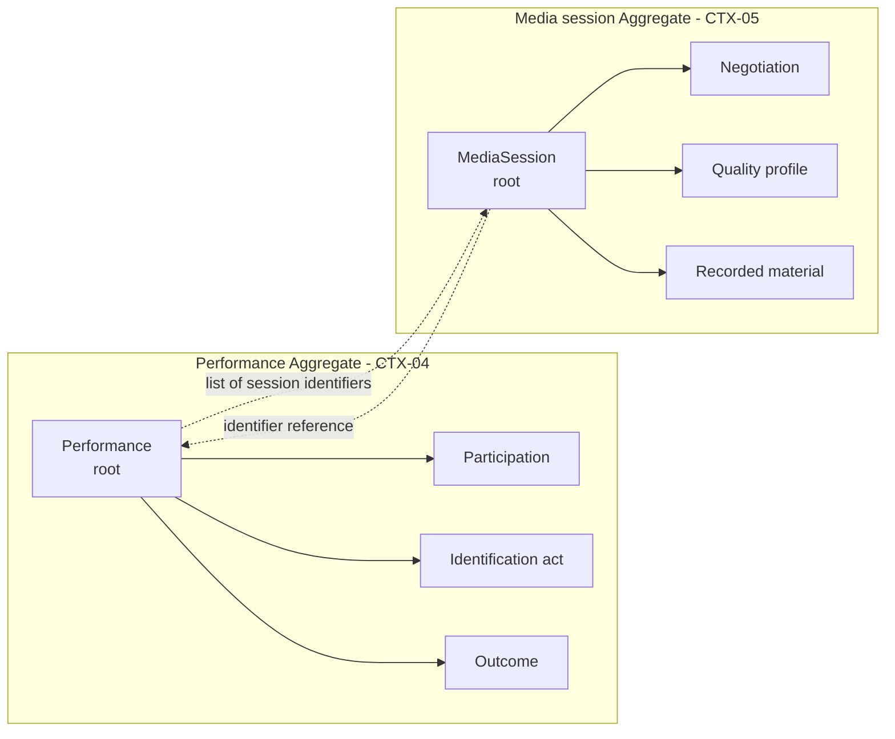
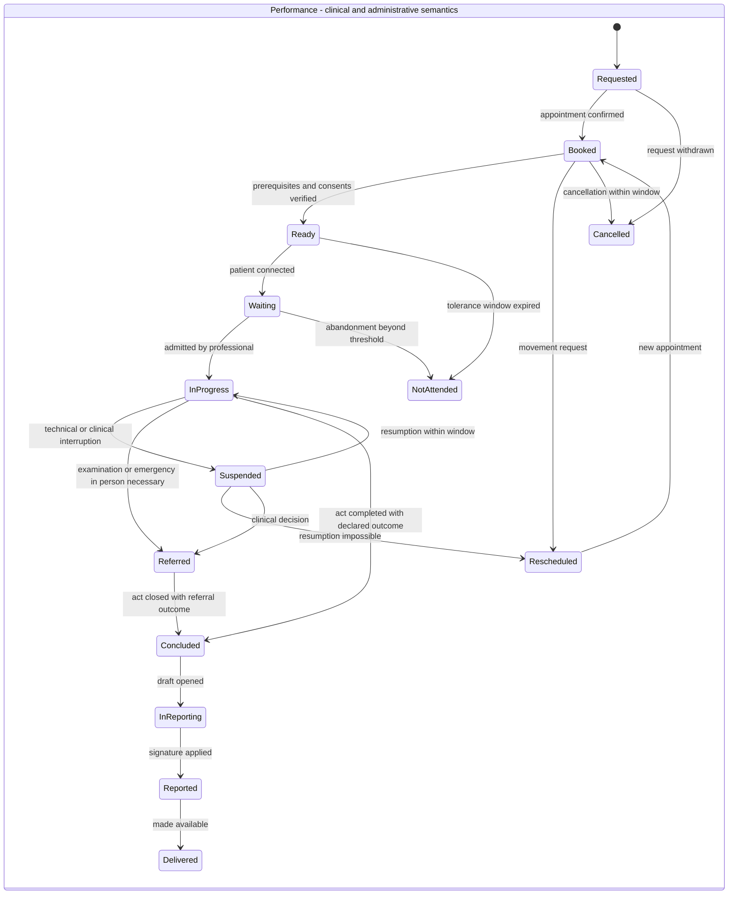
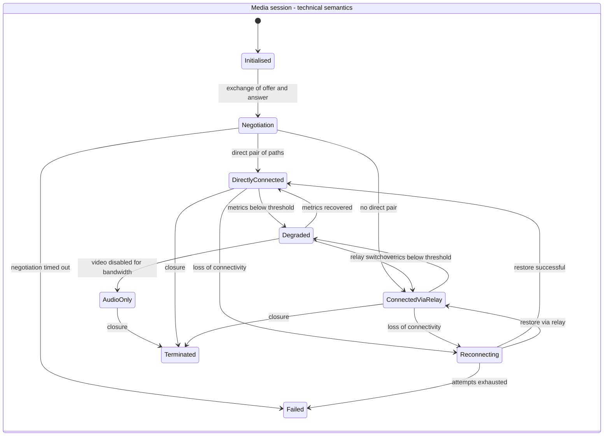

# Domain model

## 1. What is a domain model in this system

Telemedic's domain model is the set of types that **guard the invariants**. It is not the data model, which is its projection onto persistence; it is not the interoperability model, which is its projection onto external formats. It is the level at which a rule like "a signed document is not modified" is **impossible to violate**, not merely discouraged.

From this definition flow three properties, which are also three blocking automatic verifications:

1. **The domain does not know the interoperability standard.** No type in the domain imports types from the standard. Resources are built by mappers that stand outside.
2. **The domain does not know persistence nor the application framework.** No type in the domain imports relational mapping annotations or types from the dependency inversion container. If the invariant depends on infrastructure, the infrastructure can violate it.
3. **The domain does not know the interface.** No capability exists in one form for the screen and another for the application interface. It is the structural translation of the total integrability constraint.

The general concepts - aggregate, root, entity, value object, invariant, domain event - are explained in [module 11 of the fundamentals guide](../10_fondamenti/11-fondamenti-informatici.md#7-domain-driven-design)
and are not repeated here. What follows is **which ones** are in Telemedic and **why they are so**.

## 2. The ubiquitous language and its traps

The language of the domain is defined in the domain research with over a hundred entries; this section does not duplicate it but fixes the six disambiguations that have direct consequences on the model, because they are where modelling error is most likely.

| Ambiguous word | The senses that must be separated | Consequence on the model |
|---|---|---|
| **Session** | Health act · real-time connection · billable unit | Three distinct types: `Performance`, `MediaSession`, billable event |
| **Consent** | **Five distinct objects**: health act · data processing where applicable · recording · presence of third parties · transmission to external systems | A single `Consent` aggregate with an explicit type and **five independent instances** with separate life cycles, never a boolean value. **No "consent to the platform" exists in the model** (constraint V-146 of the domain area) |
| **Performance** | Request · execution · charge | Three concepts: request is an external reference, execution is `Performance`, charge is an event |
| **Patient** | Clinical qualification · administrative qualification (patient) | A single demographic reference, with administrative coverage as a separate and temporal attribute |
| **Recording** | Audiovisual capture · act of registering a fact in the system | In code, `SessionRecording` for the first, `trace` or `event` for the second: the collision is real and produces defects |
| **Outcome** | Where the encounter is (state) · what happened (outcome) | **Two distinct attributes**, never collapsible: two outcomes can share the terminal state and have **opposite** administrative effects (constraint V-141 of the domain area). Outcome is **domain value, not error code**: an unfavourable outcome is a **successful** operation that registers a fact (constraint V-126 of the functional area) |
| **Available** | Published · bookable by a channel · not yet occupied | Three distinct attributes of the interval, never a single boolean value |

A rule that flows from this and holds for all code: **no type in the domain is named with an ambiguous word without qualification**. `Session` alone is not an admitted name.

## 3. The separation between clinical performance and media session

It is the most important modelling decision of the system. The architectural baseline imposes it as a constraint, the inter-agent noticeboard registers it as V-01, and domain research defines it as "the most costly modelling error in this domain" when violated. This section reconstructs its full motivation, because an imposed decision not understood is skirted at the first opportunity.

### 3.1 Why the temptation exists

From the user's point of view there is **a single event**: the doctor and the patient see each other, talk, the visit concludes. Modelling two objects for one thing seems gratuitous complexity. The simplest code is that in which `Performance` has the fields of the connection - state of the link, type of network path, instant of flow start - and the end of the connection closes the performance.

The temptation is reinforced by the fact that in the happy case the two entities have the same duration,
the same participants and the same logical identifier. The unified model **works perfectly as long as the network works perfectly**.

### 3.2 The six consequences of merging

Each of these is a real defect, not a hypothesis.

**First - the phantom performance.** A network drop and reconnection produce two connections. If the connection is the performance, the system registers two health acts where there has been one. The count of performances delivered, which feeds billing, becomes the count of successful connections, which is a different quantity. No subsequent adjustment recovers the information, because the system never knew that the two connections were the same act.

**Second - the non-existent health act.** The technical verification before the appointment is a connection without a clinical act. With the unified model, either a dummy performance is created - ending up in counts and potentially in the chart - or a special branch is introduced that creates a connection without a performance, i.e. it admits that the two are separate but does it silently.

**Third - the delivered performance that appears not delivered.** Video fails, the professional continues and concludes in audio. It is a delivered performance, with a clinical outcome and a report, in which the video connection failed. With the unified model the act appears failed.

**Fourth - performance with multiple legitimate sessions.** In the complex act - the interpreter's entrance midway, resumption after a break, handover between two professionals - connections are more than one by design, not by fault. The unified model represents them as distinct acts or forces hiding the subsequent ones.

**Fifth - pollution of the conservation regime.** The connection produces technical metadata with a brief conservation regime; the performance is health documentation with a long regime. Merging them, either technical metadata is conserved for the time of health documentation - producing an archive of traffic data that nobody asked for - or documentation is deleted with the metadata.

**Sixth - coupling of release rhythms.** Real-time transport changes when browser engines and network protocols change; documentation of the act changes when healthcare regulation changes. In the unified model every update of one touches the other.

### 3.3 How they are linked

The two aggregates are linked **by identifier only**, in one direction only: the media session knows the performance for which it was opened; the performance knows the set of identifiers of the sessions that refer to it, and nothing else about them.

The link is not a foreign key at the database level, because the two aggregates belong to different contexts and rule 1 of boundary crossing forbids it. It is a reference resolved through the owning context's interface.

### 3.4 How they synchronise

Synchronisation occurs by **events, in one direction only**, and is never automatic on clinical state.

| Fact in media session | Effect on performance |
|---|---|
| Flow established between participants | No automatic state change. The professional admits and the act begins by decision, not by connection |
| Loss of connectivity | **No effect on performance state.** The event is annotated in the technical register of the act |
| Successful reconnection | No effect. One more session identifier in the list |
| Degradation beyond configured threshold | No state change. The professional is informed and can decide fallback or referral |
| Definite session failure | No automatic state change. The performance remains open and the professional declares the outcome, which can be audio fallback, referral or technical failure |
| Orderly termination | No effect: closure of the act is an act of the professional |

**No row in this table produces an automatic state change of the clinical act.** This is the substance of the separation: the media session can inform, never decide. The inverse direction instead exists and is command: the performance requests opening of a session, requests its closure, authorises or revokes recording.

### 3.5 The two state machines

> **Two clarifications imposed by domain constraints.** The machine represented is that of telehealth: **every performance type is its own state machine**, selected by type, and allowed actors, obligatory presence of the patient, asynchrony, obligatory artefacts, allowed outcomes, recordability and windows are **attributes of the performance catalogue**, not conditions scattered in the code (constraint V-140 of the domain area). Adding a performance is a catalogue row plus a state machine, never a domain modification.
> Furthermore **state and outcome are distinct attributes**: state says where the encounter is,
> outcome what happened. Two outcomes can share the terminal state and have opposite administrative effects - non-attendance and technical failure attributable to the patient are the canonical case - and collapsing them into a single field is forbidden
> (constraint V-141).

The two machines have different cardinality - one performance, from zero to many sessions - different duration, different granularity and different rhythm. The second changes state dozens of times in one performance; the first a few times in hours or days. They are the same thing only in the happy case, and the happy case is not what you design for.

### 3.6 Consequences on the data model

The separation has measurable effects on persistence, developed in
[04 - Data model](04-modello-dati.md): separate tables in schemas of different contexts, no foreign key that crosses the boundary, independent conservation policies - long for documentation of the act, short for technical metadata of the connection - and different archives, since quality samples belong to a time series and not to a relational table.

## 4. Catalogue of aggregates

For each aggregate: the root, what it contains, what invariants it guards, what it explicitly does not contain. The criterion with which boundaries are drawn is a single one: **an aggregate contains everything and only what must change together in a single transaction to keep a rule true**. Everything else is a reference.

### 4.1 Identity and access context

| Aggregate | Root | Contains | Guarded invariant |
|---|---|---|---|
| **Subject** | `Subject` | Internal identity, links to federated identities, state | A federated identity is linked to only one subject per tenant |
| **RoleAssignment** | `RoleAssignment` | Roles with temporal validity, reference capacity, organisational scope | No assignment mixes clinical and administrative permissions |
| **ApplicationPrincipal** | `ApplicationPrincipal` | Public keys, granted scopes, tenant, quotas | Every clinical operation requires a delegation context |
| **DerogationAccess** | `DerogationAccess` | Motivation, window, perimeter, review state | Finite duration, not automatically renewable, mandatory review |

The **role is not an aggregate**: it is a composition of permissions defined in configuration, and atomic permissions are a closed set that no tenant can expand.

### 4.2 Demographics context

| Aggregate | Root | Contains | Guarded invariant |
|---|---|---|---|
| **PatientReference** | `PatientReference` | Qualified external identifiers, addresses, capacity state, representation links | Uniqueness of domain plus value per tenant; no correlation between tenants |
| **ProfessionalReference** | `ProfessionalReference` | External identifiers, professional capacities with validity | Capacity is a temporal relationship, not an attribute |
| **Organisation** | `Organisation` | Identifiers, sites, internal hierarchy | A site belongs to a single organisation |
| **Delegation** | `Delegation` | Delegator, delegatee, scope, start date, expiry | Mandatory expiry |

**Legal representation is not a delegation** and does not share the aggregate: it has a title, a scope of powers delimited by the appointment act and rules of verification per act. Treating it as a delegation is the error that leads to recognising to the administrator support powers that the decree does not grant them.

### 4.3 Scheduling context

| Aggregate | Root | Contains | Guarded invariant |
|---|---|---|---|
| **Scheduling** | `Scheduling` | Intervals, publication horizon, enabled channels | The sum of bookings on an interval does not exceed the stated capacity |
| **Appointment** | `Appointment` | References to subject and capacity, performance, channel, substitution chain | The rescheduling chain preserves the date of the original request |
| **WaitListPosition** | `WaitListPosition` | Criteria, priority, offers made | A position is offered to only one recipient at a time |

The **interval is inside the scheduling aggregate**, not outside: it is the only way to guarantee the capacity constraint in a transaction. The appointment is instead an autonomous aggregate, because its life cycle is longer and crosses multiple intervals.

### 4.4 Clinical performance context

| Aggregate | Root | Contains | Guarded invariant |
|---|---|---|---|
| **Performance** | `Performance` | Participations, identification acts, channel changes, outcome, technical notes | State does not depend on media session; no closure without declared outcome |
| **Episode** | `Episode` | References to performances, reference problem, team | An episode belongs to a single patient at a single organisation |
| **WaitingQueue** | `WaitingQueue` | Presences, order, verification outcomes | No presence invisible to other participants |

### 4.5 Media session context

| Aggregate | Root | Contains | Guarded invariant |
|---|---|---|---|
| **MediaSession** | `MediaSession` | State, operational mode, technical participants, key verification outcome, quality profile | Recording mode and end-to-end encryption mode are distinct states; transition is traced |
| **RecordedMaterial** | `RecordedMaterial` | Reference to consent, reference to key, expiry, conservation state | No existence without current consent; expiry always valorised |
| **RelayCredential** | `RelayCredential` | Opaque identifier, brief expiry | The subject of the credential is opaque, never a patient identifier |

The **quality sample is not an entity of the aggregate**: it is a point of a time series, conserved in a dedicated archive and referred to the session by identifier. Putting it inside the aggregate would produce an aggregate that grows without limit during its life, which is the definition of a wrong boundary.

### 4.6 Clinical documentation context

| Aggregate | Root | Contains | Guarded invariant |
|---|---|---|---|
| **ClinicalDocument** | `ClinicalDocument` | Chain of versions, signature evidence, confidentiality level, references to attachments | Signed document is immutable; correction is a subsequent version |
| **DocumentModel** | `DocumentModel` | Structure, foreseen sections, version, validity | A document is always referred to an immutable version of the model |

The **chain of versions is inside the aggregate** because the invariant "at most one vigent version exists" must be guaranteed in a transaction. The attachment instead is outside: it has its own life cycle and can be shared.

### 4.7 Remote monitoring context

| Aggregate | Root | Contains | Guarded invariant |
|---|---|---|---|
| **MonitoringPlan** | `MonitoringPlan` | Monitored parameters, expected frequency, per-patient thresholds, validity, attribution to professional | No threshold without attributed professional and temporal validity; plan is versioned |
| **Measurement** | `Measurement` | Value, unit, tool, method, instant of detection, instant of receipt, inserter subject | Immutable; correction by substitution, never overwrite |
| **Alarm** | `Alarm` | **Sequence of immutable events**: generation, deliveries, engagements, forwards, outcomes | Always subject to human review; the calculation that produced it is reconstructible |
| **MeasurementExpectation** | `MeasurementExpectation` | Expected window, expiry instant, cause of absence when known | The absence of measure is **a row that declares absence**, not the absence of a row |
| **QuestionnaireResponse** | `QuestionnaireResponse` | Responses, version of the tool, instant | Referred to an immutable version of the tool |

The **measurement is an autonomous aggregate**, not an entity of the plan. They are two different rhythms - the plan changes rarely, measures arrive continuously - and tying them would produce contention in writing on the same root at every detection.

Three constraints placed by the domain and functional areas govern this context and must be stated here because they condition the shape of the types.

**The alarm is a sequence of immutable events; current state is a projection.** No state column updated in place, neither for the alarm nor for the measure nor for the plan (constraint V-121 of the functional area). The reason is probative: the question the system must answer is not "in what state is the alarm", but "what happened, in which order, and who did what". A column updated in place erases the answer every time it writes it.

**The identity of the measure, for idempotence purposes, is the quintuple** source, subject,
parameter, instant of measure, value; **instant of measure and instant of receipt are two distinct mandatory fields** and evaluation rules operate **on the instant of measure** (constraint V-124). Evaluating on receipt instant would produce alarms with the wrong time and adherences calculated on a window that is not the one prescribed.

**Measurement expectation is an entity**, not the absence of a row (constraint V-148 of the domain area). It is the operative form of the principle that silence is never normality, and is the condition for adherence to be a defined quantity: without a row declaring that a measurement was expected, "not received" and "never foreseen" are indistinguishable.

### 4.8 Consent context

| Aggregate | Root | Contains | Guarded invariant |
|---|---|---|---|
| **Consent** | `Consent` | Type, scope, evidence, start date, revocation, representation title | Referred to an immutable version of notice; the **five types are independent** and have separate life cycles |
| **Notice** | `Notice` | Text, version, validity, languages | Immutable once published |
| **Obscuring** | `Obscuring` | Scope, recipients, start date | The existence of the obscured is not inferable; **application belongs to the authorisation engine**, not to consumers |

The **five consent objects** are, with independent life cycles (constraint V-146 of the domain area): adhesion to the health act; data processing where the consent is the applicable legal basis; session recording; presence of third parties in session; transmission to external systems. **Revocation of one does not touch the others**, and **no "consent to the platform" exists in the model**: an object that aggregated them would make revocation of one a revocation of all, which is both incorrect and harmful to care.

The **obscuring is applied by the authorisation engine in a single point**, which filters and calculates totals on the filtered set (constraint V-149 of the domain area). Applying it in consumers would mean closing it in some and leaving it open in others. The channels of inference to close are six and must all be closed: numbering, counts, pagination, notifications, differences between successive queries, error messages. **Test data for acceptance must include obscured documents**, otherwise no test path exercises the route.

### 4.9 Remaining contexts

| Context | Aggregates | Note |
|---|---|---|
| Notifications and alarms | `DeliveryRequest`, `MessageModel`, `ChannelPreference` | The forwarding chain is inside the request: its exhaustion is a transactional invariant |
| Terminologies | `TerminologyPolicy`, `ValidationResult` | The content of terminologies is not an aggregate: it is not the project's |
| Interoperability outbound | `IntegratorConfiguration`, `EventSubscription`, `OutboundDelivery`, `InboundMessage` | Delivery is an aggregate because its retry policy is an invariant |
| Tracing | `RegisterEntry`, `ChainAnchor`, `DerogationReview` | The entry is append-only and has no mutation methods: it is the only aggregate without mutation behaviour |
| Tenant administration | `Tenant`, `TenantConfiguration`, `AppearanceProfile`, `Quota` | Configuration is versioned: a change produces a version, not an overwrite |

## 5. Value objects that cross the system

Some value objects cross contexts and must be defined once only, in a minimal shared language, otherwise every context produces a variant and translation at the boundary becomes a source of defects.

| Value object | Content | Why it is a value object and not a primitive type |
|---|---|---|
| `TenantIdentifier` | Opaque value | A tenant identifier confused with another is the most banal and most serious data leak |
| `ExternalIdentifier` | Domain of attribution plus value | A value without domain is ambiguous by construction and produces collisions between source systems |
| `CodedConcept` | Coding system, code, label, source version | A code without system is uninterpretable; without version it is not reproducible |
| `Quantity` | Value, unit, unit system | A number without unit in a clinical context is dangerous, not merely incorrect |
| `BiTemporalInstant` | Instant of occurrence plus instant of apprehension | Overlaying the two axes produces unrecoverable errors |
| `ValidityPeriod` | Start date plus end date, with open end allowed | Consent, role, threshold, tariff: everything that is "from when to when" |
| `GuaranteeLevel` | Level plus source (executed or reported) | A level reported by an integrator does not satisfy a strong authentication requirement |
| `AccessPurpose` | Care, derogation, operation, administration, verification | It is the attribute that renders an access decision explicable afterwards |
| `ConfidentialityLevel` | Ordinary, restricted, very restricted | Governs visibility and notifications; is not deducible from document type |
| `ManifestationOfWill` | Declarant, instant, channel, presented text, title | Without it, consent is undemonstrable |

Transverse rule: **no external identifier is ever a primitive type in the domain**. A tax code represented as a string ends up, sooner or later, compared with a regional identifier.

## 6. Time in the model

Time is **at least bidimensional** in this domain, and conflation of the two axes produces errors that do not recover. The theory is in
[module 11 of the guide](../10_fondamenti/11-fondamenti-informatici.md#8-modelling-time-and-data);
here is fixed where it applies.

| Fact | Instant of occurrence | Instant of apprehension | Why both are needed |
|---|---|---|---|
| Remote monitoring measurement | When it was detected | When it arrived at the system | A morning measurement transmitted in the afternoon is not an afternoon measurement; adherence is calculated on the first axis, silence surveillance on the second |
| Revocation of consent | When the subject manifested it | When the system registered it | Determines the lawfulness of what happened in the interval |
| Performance delivered | When it took place | When it was billed | The applicable tariff is that in force at the time of delivery |
| Role assignment | From when it is effective | When it was entered | An access decision is re-evaluated with the attributes in force at the time, not the current ones |
| Clinical threshold | From when the professional established it | When it was configured | Reconstruction of the calculation that produced an alert requires the threshold in force at that moment |

Three operational consequences:

1. **No fact of the domain is represented with a single instant.** Where the second axis coincides
   with the first it is declared, not omitted.
2. **What is valid "from when to when" is not overwritten.** Role, consent, threshold, tariff,
   configuration: the change produces a new version with a new start date.
3. **Instants are preserved with absolute temporal reference.** Local time with timezone identifier
   serves where human readability matters - the recurrence of the schedule at two-thirty in the night in the two daylight-saving Sundays is the canonical example - but the fact is
   preserved in absolute form.

## 7. Domain events

### 7.1 What a domain event is here

A domain event is **a fact already occurred, immutable, named in the past**, that other contexts can observe. It is not a command, not a notification, not a request. The distinction has a practical consequence: **the producer of an event does not know its consumers and does not depend on their outcome**. If a consumer fails, the fact occurred anyway.

Events are divided into two categories with different regimes:

| Category | Who sees them | Regime |
|---|---|---|
| **Internal events** | Only Telemedic contexts | Can change between versions with internal discipline alone |
| **Published events** | Also integrators | Are **public contract**: changing them is a breaking change subject to the deprecation process |

The distinction must be **explicit in code**, not entrusted to memory: an internal event promoted for convenience to a published event becomes a permanent constraint without anyone deciding it.

### 7.2 Catalogue of main events

| Event | Producer context | Consumers | Category | Relevant effect |
|---|---|---|---|---|
| `AppointmentCreated` | CTX-03 | CTX-04, CTX-08, CTX-11 | published | Act preparation, reminder, notification to source system |
| `AppointmentRescheduled` | CTX-03 | CTX-04, CTX-08, CTX-11 | published | Preserves substitution chain |
| `PatientWaiting` | CTX-04 | CTX-08 | internal | Notice to professional |
| `PerformanceStarted` | CTX-04 | CTX-05, CTX-11, CTX-12 | published | Session opening, tracing |
| `PatientIdentified` | CTX-04 | CTX-06, CTX-12 | internal | Unblocks reporting |
| `ChannelDegraded` | CTX-05 | CTX-04, CTX-08 | internal | Notice to participants and technical annotation |
| `SessionModeChanged` | CTX-05 | CTX-04, CTX-12 | internal | Registers transition between operational modes |
| `PerformanceConcluded` | CTX-04 | CTX-06, CTX-11, CTX-12 | published | Opens reporting window, billable fact |
| `DocumentSigned` | CTX-06 | CTX-08, CTX-11, CTX-12 | published | Making available, transmission |
| `DocumentCorrected` | CTX-06 | CTX-08, CTX-11, CTX-12 | published | Documentary compensation of an already-transmitted document |
| `ConsentRevoked` | CTX-09 | CTX-04, CTX-05, CTX-11 | published | Recording interruption, transmission block |
| `MeasurementAcquired` | CTX-07 | CTX-07, CTX-12 | published | Evaluation against configured thresholds |
| `ThresholdExceeded` | CTX-07 | CTX-08, CTX-12 | internal | Generates alert for review |
| `ExpectedMeasurementNotReceived` | CTX-07 | CTX-08, CTX-12 | internal | Silence as information |
| `AlertNotEngaged` | CTX-08 | CTX-08, CTX-12 | internal | Exhaustion of forwarding chain, declared |
| `ReportingDeadlineExceeded` | CTX-06 | CTX-08 | internal | Reminder and escalation to responsible |
| `DerogationAccessInvoked` | CTX-01 | CTX-12, CTX-08 | internal | Review queue, notification to data protection officer |
| `DeliveryFailed` | CTX-11 | CTX-08 | internal | Visible reconciliation queue |

### 7.3 Rules on events

1. **Immutable and versioned.** Every event carries the version of its schema. An event modified without version increment is a defect.
2. **No clinical content in events exiting towards third-party systems** (constraint V-161
   of the integration area): identifiers and references; content is reread with an authenticated call under the recipient's authorisation.
3. **Named in the past.** `PerformanceConcluded`, not `ConcludePerformance`. An event named in the imperative is a command in disguise and produces coupling between producer and consumer.
4. **Emitted after transaction consolidation**, never before. A consumer that fails does not make the clinical act fail: the failure goes into a retry queue, not propagated to the user.
5. **Always carry the tenant.** No exception, not even for configuration events.
6. **Carry the attribution.** Who caused the fact, and on behalf of whom, in form coherent with the representation of delegation.

## 8. Cross-cutting invariants

The invariants of individual aggregates are listed in §4. These hold for **the entire** model and do not belong to a specific aggregate. Their violation is detected by blocking automatic verifications, not by manual review.

| # | Invariant | What it prevents |
|---|---|---|
| I-1 | No clinical threshold is a literal in the code | Sliding of the system beyond the boundary between registration and interpretation |
| I-2 | No field of clinical document is populated by system-produced text | Same |
| I-3 | Every entity, event and register entry carries the tenant identifier | Data leak between autonomous controllers |
| I-4 | No external identifier is a primary key | Irreversibility of dependence on another's demographics |
| I-5 | Every coded concept carries its own coding system | Ambiguous and uninterpretable codes |
| I-6 | Every fact carries its own production context | Data not reconstructible and therefore unusable |
| I-7 | Absence of expected data is represented as fact | Silence treated as normality |
| I-8 | Clinical state is not modified by a technical fact | Phantom performances and acts appearing not delivered |
| I-9 | No signed document is modifiable | Loss of the probative value of documentation |
| I-10 | Every operation on health data produces a register entry, and its failure makes the operation fail | Non-demonstrable accesses |
| I-11 | Configuration does not remove an invariant | Circumvention of domain rules via administration |
| I-12 | No real data in code, tests, examples, logs or documentation | Unlawful processing hidden in a development environment |
| I-13 | No state column of alarm, measure or plan is updated in place: state is a projection of immutable events | History erasure at every state change |
| I-14 | State and outcome of the encounter are distinct attributes | Collapse of outcomes with opposite administrative effects |
| I-15 | No care pathway is codified in software: it is added with definition, validation, publication and configuration | That adding a pathway requires a release or a migration |
| I-16 | Obscuring is applied in a single point by the authorisation engine, and totals are calculated on the filtered set | Six channels of inference opened inconsistently |
| I-17 | A typed outcome is a domain value and does not enter the catalogue of error codes | Disappearance from clinical registers of what must remain |

## 9. The boundary between registration and interpretation, in the model

The constraint that separates the vehicle of communication from support to clinical decision is not a documentary posture: it is a property of the model, and this section says **where** it shows.

**In the clinical document.** The type `ClinicalDocument` exposes no operation that produces content. The operations are of structure - open a draft, insert drafted content, attach, sign, correct - and the content is always a parameter supplied by the author, never a computed result. No methods generate conclusions, summaries or inferred codes.

**In the threshold.** The type `MonitoringPlan` has no constructor that produces a pre-set threshold. Every threshold requires attribution to an identified professional and temporal validity: **a threshold without attribution is not representable**. The system offers no suggested values, not even as interface convenience.

**In the alert.** The alert is a type that carries the reference to the measure, to the version of the plan and to the applied threshold, and an engagement state. It carries no judgement, no calculated clinical severity, no indication of action. The text that accompanies it is a configured model, not a statement produced by the system.

**In telemetry.** Quality samples are not clinical observations and have no path that leads them into documentation. The type that represents them lives in a different context and is not convertible to a clinical type.

**In triage.** Where the system registers a priority, it registers it as **decision declared by the professional**, with attribution. There is no path in which the system calculates a priority and proposes it.

Three functionalities have been identified as standing at minimum distance from the boundary and are governed with explicit control of changes: alert on threshold, playback of recorded material with image enhancement and reporting assistance. Every proposal to modify them requires formal re-evaluation before
implementation, not after.

## 10. What the model does not represent

A model is also defined by what it decides not to know.

| Concept | Why it is not in the model |
|---|---|
| Reconciliation index of identities between systems | The system consumes the source system's identity; building one would make it the holder of demographics |
| Complete chart of the patient | It remains in the source system; the model preserves what it produces, not what others hold |
| Content of terminologies | It is not the project's, and for some sources the licence forbids preserving it |
| Scores of validated clinical scales | Suspended while the question of scale licences is unresolved |
| Model of connected medical device | The system acquires from a third-party gateway and does not dialogue with devices |
| Tariff structure and billing rules | The system produces the billable fact; calculation belongs to the administrative system |
| Diagnostic-therapeutic pathway as executable protocol | The model preserves the configured plan and its observed execution, not a rules engine |
