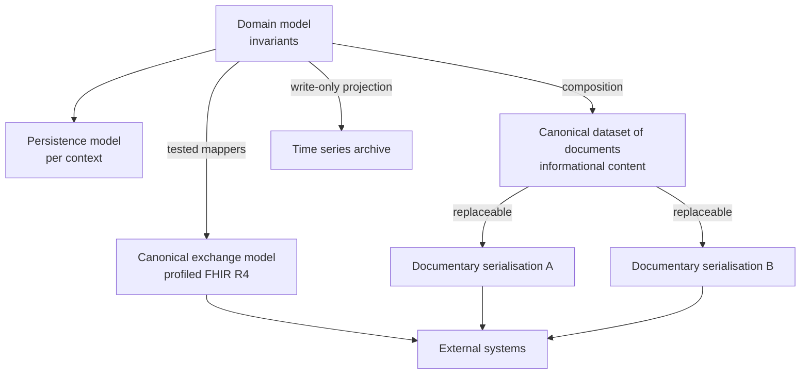
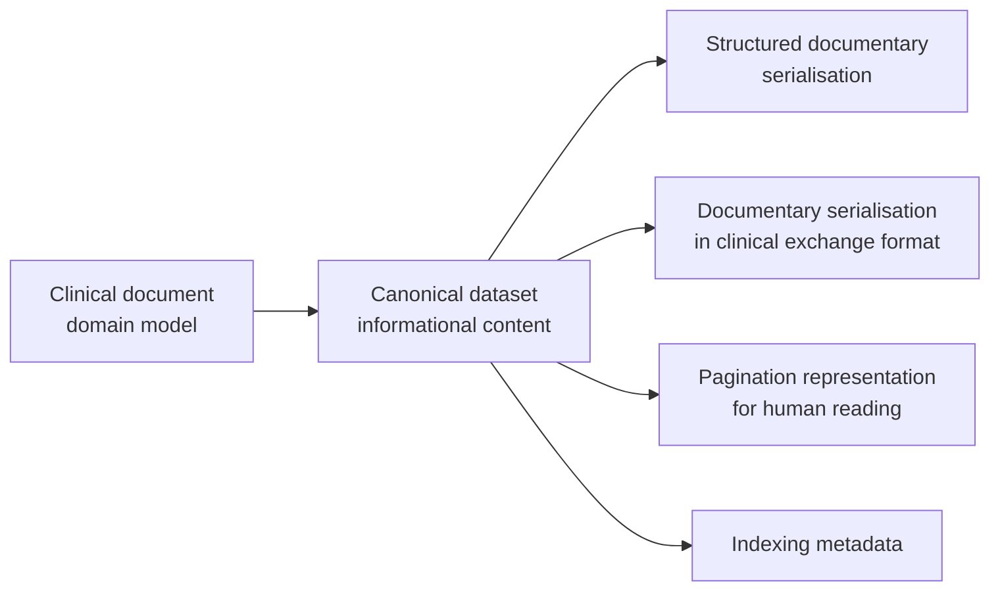
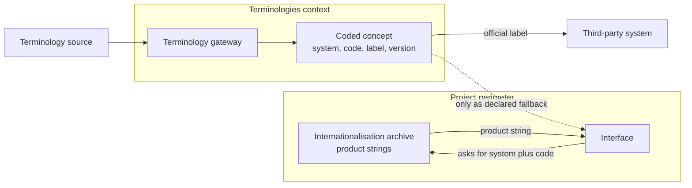

# Data model

## 1. Four models, not one

In current debate "data model" indifferently indicates four different things. In Telemedic they are four distinct artefacts, with different owners, rates of change and rules, and their confusion is the origin of a considerable part of defects of this kind of system.

| # | Model | What it is | Who owns it | How fast it changes |
|---|---|---|---|---|
| 1 | **Domain model** | Types that guard invariants | Domain contexts | Slowly, with domain understanding |
| 2 | **Persistence model** | Tables, indices, constraints, schemas | Persistence layer of each context | With access and volume needs |
| 3 | **Canonical exchange model** | Representation with which clinical facts exit and enter | Interoperability context | With revisions of standards and national guides |
| 4 | **Canonical dataset of documents** | Informational content a health document must carry | Clinical documentation context | With healthcare regulation |

The rules of relationship between the four are few and absolute:

- **The domain model does not know the other three.** It is the condition of survival to a standard revision or a change of archive.
- **The canonical exchange model is a projection, never a source.** Standard resources are built by mappers and are never persisted as such.
- **The canonical dataset is independent of serialisation.** The informational content of a report is defined by regulation; the form in which it travels - document type or another - is replaceable and must not be hardcoded.
- **The persistence model is private to the context.** No other context reads it, no public interface exposes it.



## 2. The canonical exchange model

### 2.1 Version and profile

The canonical model is **FHIR R4, version 4.0.1**, profiled according to Italian implementation guides for telemedicine, which **prevail** in case of divergence with the generic model.
The adopted guides - telehealth, teleconsult, teleassistance, remote monitoring and the national base profile - are all on FHIR 4.0.1 and are, at the time of writing, in preliminary state.

Preliminary state is a fact, not a surmountable obstacle. Three obligations follow:

1. **Explicit versioning fixation.** Profiling packages are declared with exact version, never with reference to a moving version or continuous build. The build fails if the resolved package does not match the declared one.
2. **Periodic review procedure.** Guides change with infra-annual cadence. Review is a planned activity with registered outcome, not an occasional inspection.
3. **Impact isolation.** A profile revision must be absorbable by modifying mappers and profiling packages, without touching domain invariants. It is quality scenario SQ-06.

### 2.2 What passes through FHIR and what does not

The rule of partition between clinical plane and application plane is single and applies without exception:

> If the concept has a recognised clinical equivalent and must be consumable by a third-party healthcare system that does not know Telemedic, then it is **FHIR**.
> If the concept is a capability of the product, then it is **application plane**.

| Concept | Plane | Motivation |
|---|---|---|
| The distant health act | FHIR | It is the clinical concept and feeds the source system's chart |
| The health document | FHIR | Clinical content drafted by the professional |
| Consent as legal state | FHIR | Has a recognised clinical representation |
| Remote monitoring measurement | FHIR | It is a clinical observation in all respects |
| Demographic reference | FHIR | Must be resolvable by external identifier |
| Media session, its states, its negotiation | application | It is a technical artefact: does not exist in FHIR and must not |
| Channel quality metrics | application | **Are not clinical observations** and must not enter the chart |
| Consent gathering flow | application | State is clinical-legal, interface flow is product |
| Configuration, appearance, quotas, keys | application | Product configuration |
| Recorded material | application, with documentary reference in FHIR | Content is its own artefact; indexing can be exposed |

The exclusion of quality metrics from the clinical plane merits emphasis because the opposite temptation is strong and the shortcut seems elegant: a transmission delay value modelled as an observation enters a person's clinical chart. It is a data quality problem and, given the sensitivity of the boundary between registration and interpretation, also a qualification one.
**Rejected without exception.**

### 2.3 The health document: composition, not diagnostic report

The original public content of the project announced production of a diagnostic report at session end. The Italian realm models differently: the report of a telehealth visit is a **composition inside a documentary container**, with document type coding and sections constrained by a national profile.

The two resources are not interchangeable and the choice is not stylistic:

| Situation | Correct resource | Why |
|---|---|---|
| Structured report with atomic outcomes and interpretation, produced by a diagnostic service | diagnostic report | Designed for the mix between atomic results and interpretation |
| Narrative report organised in sections, immutable and signable | **composition inside a documentary container** | Less workflow, more narrative; immutability and signature are properties of the documentary paradigm |
| Indexing a pre-existing document | documentary reference | Metadata on an already-formed document, bridge to sharing profiles |

The report of a distant performance is by nature **narrative and drafted by the professional**. The adopted pattern is therefore: composition with coded sections, serialised in a documentary container, signed, indexed by a documentary reference, exposed to the source system.

**The diagnostic report remains as a read-only projection**, for integrators who know how to consume only that. It is a view: its conclusion field carries the text drafted by the professional, never system-produced text, and its attached form carries the signed document. It is never the primary artefact and never the seat of truth.

The documentary paradigm brings with it a property the model exploits: once assembled, **the document is immutable and its identifier is never reused**. It is the translation, in the exchange format, of the domain invariant on immutability of the signed document.

### 2.4 The representation of the distant act

The standard in the adopted version offers **a single semantic element** for the virtual mode: a value of class of act. It offers no element for the session address, does not distinguish synchronous and asynchronous, has no code for channel type. The subsequent revision of the standard fills the gap with a dedicated type, whose mandatory value set is however composed of names of commercial third-party platforms - a set that describes no in-house platform.

There are three ways out, and the choice is declared:

| Option | Evaluation |
|---|---|
| Use the official cross-version extension package | Exposes the type of the subsequent revision inside the adopted version. **The available package is in preliminary state**: it is not material to build a production version on without explicit fixation and validation tests |
| Define a project coding system | Under project control, replaceable, but not recognised by third parties |
| Do not expose the session endpoint in FHIR | Coherent with the partition rule: the room address is a product artefact |

**Decision adopted**: the session address **is not exposed in the clinical plane**. The clinical plane carries the class of the virtual act and nothing more; access to the session is a capability of the application plane, with a single-use reference and very brief life. Where an integrator requires representation of the endpoint in FHIR, a project coding system is used, declared as such and never presented as standard. The cross-version extension package remains observed, not adopted, while in preliminary state.

A verified fact that must be reported and not hidden: the national profile of the telehealth act **does not fix a value for the class of the act**, despite having an extensible constraint on the value set. The project adopts the value that represents the virtual mode and declares it in its own interface profile. `[NV]` - the confirmation that the Italian realm expects precisely that value must be requested of the national standards body; the recipient of the request is the conformance area, which already has charge of the interlocution on documentary types.

### 2.5 The code of the performance and the delivery channel

The fact of the domain is verified and has a direct consequence on the model: **there does not exist and must not exist a performance code "telehealth" distinct from the clinical performance**. Performances already in the catalogue, if delivered remotely, maintain the same coding and the same tariff as the corresponding performance in person. The remote mode is a **channel modifier**, not a performance in itself.

The model translates this into **two orthogonal axes**:

- **what** is delivered → the catalogue code, on the type element of the act or on the
  request;
- **how** it is delivered → the class of the act, plus the channel attribute that accompanies the
  billable fact.

Confusing the two axes is the error that renders a telemedicine system not billable, and its correction afterwards requires recoding the history.

## 3. The canonical dataset of documents

### 3.1 Why content is not modelled on serialisation

Documents destined for the national documentary infrastructure have an **informational set defined by regulatory source**. The technical representations - structured document models, document codes, indexing metadata - **are not publicly available** at the time of writing, and their acquisition is an open question addressed to the conformance area.

Building the model on serialisation would mean waiting for that material to start, and then tying the model to a technical form that can change. The project does the opposite: **models informational content as canonical dataset** and treats every serialisation as replaceable.



### 3.2 What this entails in practice

1. **The canonical dataset is a versioned project artefact**, with a definition of every
   element, its obligatoriness, its type, its terminology constraint and the regulatory source that requires it. It is the only place where informational content is defined.
2. **Every serialisation is a mapper** from the canonical dataset towards a form, with tests that start from the dataset, produce the form, validate it and reread it verifying semantic equivalence.
3. **No document model is hardcoded.** Adding a serialisation form is adding a mapper, not modifying the domain.
4. **The pagination representation is a serialisation like the others**, not a special case: the form readable by a person and the form readable by a machine derive from the same dataset, eliminating at the root the divergence between what the professional signed and what the system transmitted.
5. **Indexing metadata derive from the dataset**, not compiled separately.

### 3.3 The point at which this choice pays

The moment when technical models become available will be, for the project, the writing of a mapper and a test suite. In the alternative model - content modelled on the form - it would have been a migration of the domain model and data already produced.

## 4. Time series

### 4.1 Two series, not one

The system produces two families of time series data, with **opposite legal regimes** that do not allow being conserved **under the same regime**: same duration, same title of access, same treatment of resolution reduction. They must therefore be kept in **distinct structures**, each with its own regime.

| Series | What it contains | Nature | Regime |
|---|---|---|---|
| **Clinical parameters** | Remote monitoring measurements, responses to structured questionnaires | Health-related data | Long conservation, clinical access, tracing of every read |
| **Channel metrics** | Delay, loss, delay variation, transmission rate, path type | **Not clinical** | Brief conservation, technical access, no direct patient identifier |

Confusing them produces two symmetric defects: if technical metrics inherit the clinical regime a data archive of sanitary traffic is built that nobody asked for; if clinical parameters inherit the technical regime health documentation is lost.

**The separation is one of regime and structure, not of installed component**, and the distinction must be held firm because it has already been read both ways. [ADR-0020](/adr/0020-serie-temporali-in-archivio-dedicato.md) adopts alternative 3 - "two series with distinct regimes, **both** in dedicated time series structures" - and discards alternative 2 not because it put the two series together, but because it applied **a single regime** to them. Among the accepted negative consequences the ADR counts "**one** archive more to install", in the singular, and the deployment view is consistent with that count: a single time-series archive ([08 - Deployment views](/02_architecture/08-viste-di-deployment.md#21-list-and-role) §2.1), hosting two structures with distinct conservation, access and resolution reduction. Nothing prevents an installation from separating them physically as well; what the project does not allow is **confusing the two regimes**, which is the defect the decision was taken against.

### 4.2 Why a dedicated archive

The representation in the clinical exchange format is **a projection, not the storage instrument**. The reasons are of form and volume:

- a time series has cardinality that grows linearly in time and per subject, and its typical accesses are by interval and by aggregation, not by single identifier;
- aggregation over moving windows, reduction of resolution of historical data and automatic expiry are native functions of a time series archive and costly to simulate elsewhere;
- the representation of a single measurement in the exchange format is one or two orders of magnitude more voluminous than the data it transports.

**Adopted rule**: series are preserved in dedicated time series structures; the representation in the exchange format is built on request, for the requested interval, and is never the persisted form.

### 4.3 Invariants on series

1. The measurement is **immutable**. A correction produces a new measurement that replaces the previous one, with reference to the one replaced.
2. Every point carries the **two instants**: detection and receipt.
3. Every point carries its own production context: tool, method, inserter subject.
4. Channel samples **do not carry direct patient identifiers**, and no relay infrastructure metric is labelled with the session identifier.
5. **The absence of an expected point is representable.** A series containing only what arrived does not allow distinguishing "all normal" from "no data".
6. Reduction of resolution of historical data is allowed for channel metrics and **forbidden** for clinical parameters, which are documentation.

## 5. Identifiers and attribution domains

### 5.1 The principle

**No external identifier is a primary key.** The internal identity of every entity is an opaque identifier generated by the system. External identifiers are attributes, always qualified by their own **domain of attribution** - the authority that assigned that value in that namespace.

The reasons are three and are all irreversible if ignored:

1. **External identifiers are not universal.** The tax code does not cover all assisted persons: there are temporary codes for foreigners, situations of newborns not yet coded, tax code duplicates. A model that assumes it as key does not represent part of the population.
2. **External identifiers change.** A demographic correction changes the tax code. With the code as key, the correction is a migration of all rows that reference it.
3. **External identifiers are not secret.** A tax code is knowable: using it as key encourages using it as an authentication factor, which is a security defect.

It follows that every external identifier in the model is the pair **domain plus value**, and that a value without domain is not representable.

### 5.2 The verified divergence of tax code URIs

There is a divergence **verified against primary source** between Italian implementation guides on the identifier of the tax code system:

| Guide | Value of the identifier system |
|---|---|
| National base profile | `http://hl7.it/sid/codiceFiscale` |
| Telehealth family | `http://hl7.it/sid/codiceFiscale` |
| National core profile | `http://hl7.it/fhir/itcore/CodeSystem/cs-codicefiscale` |

It is not a transcription error: the two values appear in distinct published artefacts. A consumer aligned with the core profile **does not recognise** the identifier issued according to the telehealth family, and vice versa.

**Adopted decision.** Since the project declares conformance to the telehealth family, the canonical internal value is **`http://hl7.it/sid/codiceFiscale`**. The divergence is managed at four points, all inside the anticorruption layer of the interoperability context and **never in the domain**.

1. **On ingress, all known forms are accepted** and normalised to the canonical internal value.
2. **On egress a single form is emitted**, and which one is **configuration per tenant and per
   destination**, not code constant. **Both identifiers are never emitted in the same resource**: redundant emission worsens downstream deduplication instead of improving it, because a consumer finding two can read them as two distinct identities. The projection towards the other URI occurs therefore **at the boundary with the consumer**, by configuration, without touching the internal model.
3. **An inventory of identifiers of system exists and is versioned** that declares, for each recognised identifier, whether it is accepted on ingress, whether it is emitted on egress and with what precedence. It is the only place where the divergence is known, and with it the choice becomes a configuration value instead of a migration.
4. **In integration documentation the divergence is declared openly**: whoever integrates must know it exists, because they will encounter it with other systems. The translation is an operation of conformance registered, not a silent rewrite.

The same inventory manages other national identifiers for which multiple representations exist. **Distinct but related point**, which this decision does not resolve: the code of identifier type in the legacy channel remains contractual with the integrator. `[NV]` - the question must be raised with the national standards body; the recipient of the request is the conformance area, which already has charge of the interlocution.

### 5.3 Structure of an identifier in the model

```json
{
  "attributionDomain": "http://hl7.it/sid/codiceFiscale",
  "value": "AAABBB00A00A000A",
  "assignedBy": "national-authority",
  "validFrom": "2020-01-01",
  "validUntil": null,
  "reliability": "certified"
}
```

*Values are synthetic.* The reliability attribute distinguishes an identifier verified at the authority that assigns it from one merely declared and not verified: it is information that serves the clinical decision of identification and that is lost if the identifier is a string.

### 5.4 The identifiers of the source system

The identifiers with which the integrator identifies its subjects are **first-class citizens** and not a fallback. They are preserved with the same mechanism, with the integrator's attribution domain, and are the working key of the reference model. Resolution by external identifier is a first-class capability of both exposure planes: in the clinical plane with standard identifier search, in the application plane with a dedicated resolution operation.

## 6. Terminologies in the data model

### 6.1 Every coded concept carries its own system

A code without its own coding system is ambiguous by construction. The domain type that represents a coded concept carries four elements: system, code, label and **version of the source used for validation**. The last is the one that usually misses and that renders a validation non-repeatable, therefore not usable as evidence.

### 6.2 The separation between official label and interface string

It is an issue with licence consequences, not merely ordering. Translations of labels of some terminologies are **derivative works whose rights are assigned to the terminology owner**. If the project preserved its translations in the official label field, it would produce and distribute a derivative of that terminology.

**Adopted decision: two separate archives, by construction.**

| Archive | Content | Owner | Where it lives |
|---|---|---|---|
| **Official label** | The string provided by the terminology source, in the language the source provides it | Terminology owner | The label field of the coded concept, populated **only** by the terminology gateway |
| **Interface string** | The text the product shows the user | The project | The internationalisation archive of the product, indexed by the pair system plus code |

The three rules that follow are automatically verifiable:

1. **No code path writes to the official label field except the terminology gateway.** An automatic check enforces it.
2. **The interface never shows the official label field directly.** It asks for the string
   from the internationalisation archive for the pair system plus code; if missing, it falls back
   to the official label **declaring** it is the original form.
3. **On egress towards a third-party system the official label is emitted, never the interface string.** Emitting the project's translation would mean distributing a derivative.



### 6.3 The catalogue of performances

The catalogue of performances poses a model question that has no obvious answer: is it data of reference **included** in the product or **exclusively referenced** by the tenant? Regional catalogues are numerous, independent, with their own update cycles and with extensions and renames relative to the national catalogue.

The options and their consequences:

| Option | Consequence |
|---|---|
| Catalogue included in the product | Every regional update becomes a product release. The project assumes editorial responsibility for someone else's normative content. Unsustainable with multiple independent cycles |
| Exclusively referenced, no structure in the product | The product cannot validate, cannot search, cannot render a performance selectable. Every tenant reimplements |
| **Structure in the product, content per tenant** | The product defines the form of a catalogue entry and operations on it; content is configuration data loaded per tenant |

**Adopted decision: the third.** The product defines the structure of a catalogue entry -
code, domain of attribution of the catalogue, description, branch, enabled channels, temporal validity, reference to the corresponding national code - and the operations of loading, validation, search and disabling. **Content is tenant data**, loaded by documented application interface and versioned with temporal validity, never included in the distribution.

Three consequences:

1. **Double coding is native.** An entry carries together the code of the tenant's catalogue and the corresponding national code, because billing requires both.
2. **Temporal validity is not optional.** A catalogue table without validity renders historical billing unrecoverable: the performance delivered last year must be billed with the coding in force then.
3. **The project distributes no catalogue**, not even as example with real data.
   Demonstration material uses a synthetic catalogue, explicitly marked as such.

This choice extends by analogy to every datum of reference with external life cycle and territorially differentiated.

## 7. Persistence: the few architectural rules

The persistence model is private to each context and its form belongs to the technical area. This area fixes only the constraints that cross contexts.

| # | Constraint | Motivation |
|---|---|---|
| PD-1 | Every table containing domain data carries the tenant identifier | Constraint [V4](../11_registri/03-vincoli-fondanti.md#v4), defence in depth of isolation |
| PD-2 | No foreign key crosses the boundary of a context | Rule 1 of boundary crossing |
| PD-3 | No external identifier is a primary key or part of one | §5.1 |
| PD-4 | Resources of the exchange format are not persisted as such | §1, rule on projection |
| PD-5 | The outbox table is in the schema of the context that produces the event | Atomicity between datum and event |
| PD-6 | Time series are in dedicated structures, not in generic relational tables | §4.2 |
| PD-7 | The immutable register shares no archive with application data | Separate storage, constraint [V-04](../11_registri/01-vincoli-in-vigore.md#v-04) |
| PD-8 | What has temporal validity is not overwritten: it is versioned | §6 of domain model |
| PD-9 | Migrations are reversible and tested on every tenant schema | Selective restore, scenario SQ-08 |
| PD-10 | No real data in any environment, including development | Cross-cutting constraint of architectural baseline |

The **automatic versioning of entities** offered by the persistence level is useful for application reconstruction of history and is adopted where needed. **It is not the access register and does not substitute for it**: whoever has write access to the database also alters history tables. The distinction is developed in
[07 - Tracing and immutable register](07-tracciamento-e-registro-immutabile.md) and must not be attenuated in any project document.

## 8. Conservation and deletion

Specific policies belong to the conformance area and the security area; here is fixed the structure that makes them applicable.

**Every category of data has a stated conservation policy.** There is no data without policy: the absence of a policy is a defect detectable automatically by comparing the list of categories with the list of configured policies.

**Categories have incompatible regimes and must be kept separate also physically.**

| Category | Note on regime |
|---|---|
| Signed clinical documentation | Long conservation, target restore point of zero |
| Access and operation register | Twenty-four months, separate conservation, append-only |
| Access and authentication data | Twelve months |
| Recorded material of session | Configurable per tenant, always valorised, encrypted at rest with keys per tenant |
| Clinical parameters | Health documentation regime |
| Channel metrics | Brief, with resolution reduction allowed |
| Evidence of consent | Own regime, typically longer than the data it refers to, because it serves to demonstrate its lawfulness |
| Configuration data | Versioned, conserved for the time in which they can serve to reconstruct a past decision |

**Deletion is not revocation.** Revocation of consent stops future processing and has immediate effect on what is in progress; it does not delete what already happened, and in particular does not delete the evidence that consent was there. A model that deletes the evidence renders revocation itself undemonstrable.

**Deletion leaves a trace of deletion.** Exercise of a right to deletion produces a register entry; the evidence that the data was deleted, when and on request of whom, survives the data.

## 9. Unverified points of this section

| Reference | What is not verified | To ask |
|---|---|---|
| §2.4 | If the Italian realm expects for the telehealth act the value of class representing the virtual mode, given that the profile does not fix it | Conformance area, in the interlocution with the national standards body |
| §2.4 | State of publication of the cross-version extension package at the time of realisation | Technical area, before adopting it |
| §3 | Models of structured document, documentary codes and indexing metadata of documentary types of telemedicine | Conformance area, already open question in noticeboard |
| §5.2 | Position of the national standards body on the divergence of tax code URIs | Conformance area |
| §6.3 | Number, form and update cadence of regional performance catalogues | Domain area; does not affect the decision, affects documentation for whoever installs |
