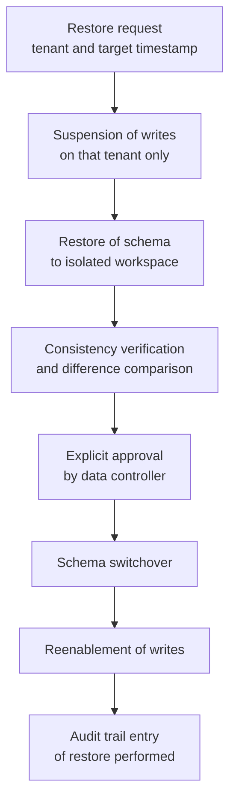
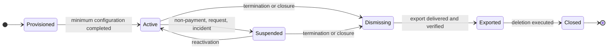

# Multi-tenancy

## 1. The problem, correctly formulated

Telemedic's multi-tenancy is not the problem of "serving multiple customers with the same installation". It is the problem of **keeping data separate that belongs to legally autonomous data controllers**, on shared infrastructure, in a demonstrable way.

The difference between the two formulations is substantial. In the first, a data breach between customers is a product defect, regrettable and fixable. In the second, it is communication of health-related data between distinct parties - that is, an event with consequences of its own for the customer experiencing it, for the one receiving it and for whoever manages the infrastructure. The level of assurance required is not the absence of known defects: it is **structural separation**, which holds even against programming errors.

To this is added a property of the domain: in this system **even apparently administrative data are sensitive**. The fact that a person has an appointment with a particular medical speciality is health-related data. There exists no category of "neutral" data in the model that can be isolated with less rigour.

General concepts of multi-tenancy are in the [module 11 of the guide](../10_fondamenti/11-fondamenti-informatici.md#9-multi-tenancy); this section establishes which model Telemedic adopts, how it enforces it and what follows from it.

## 2. The model adopted

**One schema per tenant on a shared database, with row-level security as defence in depth and not as the sole mechanism.**

The formulation has three parts and none is redundant.

**One schema per tenant.** Each tenant has its own set of tables in its own namespace. There is no tenant column that discriminates rows of a common table: rows of different tenants do not reside in the same table.

**On a shared database.** Not one instance per tenant. The operational cost of one instance per customer is disproportionate to the expected user profile, and separation at the instance level adds no substantial guarantees over separation at the schema level, when the latter is enforced correctly.

**Row-level security as defence in depth.** The tables nonetheless carry the tenant identifier and are protected by row policies. It is redundant compared to schema separation and deliberate: it is the second barrier that holds when the first has been circumvented by an error.

### 2.1 Why not shared rows

The shared-row model - a single table, a column distinguishing the tenant - is cheaper to implement and costlier to defend. Three reasons for rejection:

**Selective restore becomes difficult.** A customer asking to restore their data to a previous point following an operational error, with shared rows, forces extraction and reinsertion of selected rows from a table containing others' data: a long, risky and hard-to-prove operation. With separate schemas it is the restore of a set of tables. This is scenario SQ-08, and it is a requirement, not a wish.

**Demonstrating separation becomes argumentative.** With shared rows, to the question "how do you know customer A does not see customer B's data?" the answer is "because every query filters by tenant". This is an answer about code discipline. With separate schemas the answer is "because the application role serving A has no privilege whatsoever on schema B": this is an answer about structure.

**Tenant dismissal becomes selective deletion.** With shared rows, concluding a customer's termination means deleting rows scattered across dozens of tables, hoping none was forgotten. With separate schemas it is removal of a namespace.

### 2.2 The cost that is accepted

| Cost | How it is governed |
|---|---|
| Migrations must be applied to every schema | Automated, idempotent, reversible, with outcome recorded per schema |
| The number of objects in the database grows with customers | Sizing declared, surveillance of archive limits |
| The connection pool cannot be partitioned per tenant without waste | Shared pool with context setup and zeroing on each loan, §3 |
| Queries that cross tenants for operational purposes require a dedicated path | Separate path, with its own privileges and its own tracing, §6 |
| Schema evolution must be backward-compatible during the migration window | Two-phase migrations, §4 |

None of these costs is hidden: they are the consideration for structural separation, and have been weighed against the three reasons in §2.1.

### 2.3 What is not per tenant

Not everything is per tenant, and distinguishing is as important as isolating.

| Scope | Colocation |
|---|---|
| Clinical, demographic, documentary, consent, configuration and audit data | **Per tenant**, in the tenant's schema |
| Definition of atomic permissions | **Shared**: it is a closed set that no tenant expands |
| Service catalogue structure | **Shared**; content is per tenant |
| Installation terminological policies | **Shared** to the installation, with possibility of restriction per tenant |
| Tenant registry and their status | **Shared**, in an administration schema with its own privileges |
| Immutable audit trail | Per tenant in content, **held separately** from the application archive |
| Encryption keys for recorded material | **Per tenant**, never shared |
| Infrastructure technical metrics | **Shared** and not attributed to tenants, where possible: they are operational data |

## 3. Context propagation

### 3.1 The principle

**No operation on data occurs without a resolved tenant.** There is no default value, no "system" tenant to fall back to, no path that in the absence of context returns the complete set. In the absence of context, the operation **fails**.

The negative formulation is deliberate. The positive formulation - "every operation enforces the tenant" - is a discipline rule someone will eventually forget. The negative formulation is verifiable: one can prove that a path without context fails; one cannot prove that someone remembered.

### 3.2 The context path

```mermaid
sequenceDiagram
    autonumber
    participant EXT as Caller
    participant GW as Application gateway
    participant APP as Application
    participant POOL as Connection pool
    participant DB as Database

    EXT->>GW: request with identity assertion
    GW->>GW: resolves tenant from assertion,<br/>not from path nor from parameter
    GW->>GW: verifies that principal is enabled on that tenant
    GW->>APP: invokes with explicit tenant context
    APP->>APP: verifies context presence at bounded context boundary
    APP->>POOL: requests connection and opens transaction
    APP->>DB: sets tenant context **inside the transaction**
    APP->>DB: query
    DB->>DB: row policies evaluate context; in its absence deny all
    DB-->>APP: result
    APP->>DB: transaction closure, context lapses with it
    APP->>POOL: returns connection without residual context
```

**The tenant is resolved from the identity assertion, never from the request.** A tenant taken from a path parameter or header is a tenant the caller can choose: this is the definition of a data breach. The gateway derives the tenant from the authenticated principal and verifies that principal is enabled on that tenant; a value possibly present in the request can only be **compared** against the resolved value, never replace it.

**The context is verified at the boundary of each bounded context**, not only at the gateway. A context receiving an internal call without tenant context rejects it: this is the barrier that holds when a call originates from an internal process not from an external request.

**The context is set inside the transaction, in the form that lapses at its closure, not in the form that persists on the connection.** This is the point at which this architecture incorporates constraint V-112 placed by the technical area, and the difference between the two forms is not stylistic: the persistent form leaves the tenant on the connection returned to the pool, and on the next request produces contamination between autonomous data controllers. This is a defect that produces no visible symptoms and manifests as someone else's data in a screen.

Three conditions flow from this, all verified together:

- **in the absence of context row policies deny all**, they do not let through;
- **the tables enforce policy even against the owner**;
- **the application role is not the owner of objects** and does not possess the attribute that permits bypassing policies.

No access to data occurs outside a transaction with resolved tenant.

### 3.3 Processes that do not originate from a request

The path in §3.2 covers requests. Three families of operations remain that have no caller and are the typical seat of isolation defects.

| Family | How tenant is resolved |
|---|---|
| **Scheduled jobs** - deadlines, reminders, retention policy application | The job is executed **per tenant**, iterating over the active tenant registry, with context set at each iteration. There is no version of the job that operates on all tenants in a single query |
| **Event consumers** | The tenant is in the event envelope and set before any access. An event without tenant is discarded into the unprocessable message queue, not processed with a default value |
| **Outbox relay** | Reads from its own table in the tenant's schema, with context set. There is no relay that reads from all schemas in a single query |

The common rule: **iteration over tenants is explicit and sequential, never implicit in a query**. It costs more cycles and makes impossible the class of defects in which an operation intended for one tenant touches others.

### 3.4 Isolation of noise

Data isolation is not enough: resource isolation is also needed, otherwise one tenant degrades service for others without seeing their data. This is scenario SQ-05.

**Quotas, traffic limits and circuit-breakers are per tenant and per destination, never global.** The case motivating them is concrete: an integrator whose event sink is unavailable accumulates failed deliveries; without isolation, retries toward that destination consume the delivery capacity of all. With isolation, the frequency toward that destination decreases, then suspends, and the others do not notice.

The same applies to shared compute resources: a large export requested by one tenant must not be able to exhaust the connection pool and block entry to the waiting room of another. Separation of pools by operation class - interactive, background, export - is an architectural requirement, not an optimisation.

## 4. Migrations

### 4.1 The constraint

With one schema per tenant, one migration is N migrations. Four properties are required and non-negotiable:

1. **Automated.** No manual step for any schema. One manual step across one hundred schemas is an error that happens.
2. **Idempotent.** Reapplying an already-applied migration produces no effect.
3. **Reversible.** Each migration has a rollback procedure **tested**, not described. An irreversible migration on a health data archive is an operational risk not taken.
4. **With outcome recorded per schema.** The migration status is known for every tenant. A set of schemas in different states is a normal condition during the migration window and must be represented, not avoided.

### 4.2 Two-phase migration

Since during the window some schemas are migrated and others are not, **the application must work with both forms of the schema**. The mandatory method for any non-backward-compatible change follows:

| Phase | Content |
|---|---|
| **Expansion** | The new form is added without removing the old. The schema accommodates both. Code is released that knows how to write to both and read from both |

> **The method applies to every migration, not only non-backward-compatible ones** (constraint V-111 placed by the technical area). No release is both destructive and functional, and **two consecutive versions of the application must be able to coexist on the same database**: this is the condition necessary for zero-downtime updates and rollback to a previous version. A feature requiring a destructive migration in the same release **must be redesigned**, not approved as a waiver.

| **Data migration** | The new form is populated from the old, per tenant, with suspension and resumption possible |
| **Switchover** | Code reads from the new form. The old remains populated |
| **Contraction** | Only after all schemas have switched over and the safety period has elapsed is the old form removed |

The period between switchover and contraction **is not a formality**: it is the window in which restore to a previous point remains possible without data loss. Contracting immediately means making restore destructive.

### 4.3 Migrations touching clinical data

A migration transforming clinical data has additional requirements:

- **No lossy transformation** without explicit approval and without complete copy of the prior state preserved for the declared period.
- **Proof of equivalence** on a representative set of synthetic data before application, and consistency verification after, with outcome recorded.
- **The immutable trail is not migrated.** Its entries are immutable: a schema change produces a new generation of trail, with the anchor linking the new to the previous. Rewriting existing entries breaks the integrity chain and destroys precisely what the trail exists to demonstrate.

## 5. Restore

### 5.1 Selective tenant restore

This is scenario SQ-08 and the primary reason for the choice of separate schemas.



Four properties of the procedure:

1. **Other tenants suffer no downtime.** This is the measure of the scenario.
2. **Restore occurs first to an isolated workspace**, not in place. Direct restore to the active schema destroys current state before anyone could verify that the restored state is the expected one.
3. **Approval is by the data controller**, not the technical operator. Restore deletes health data produced after the target timestamp: this is a data controller's decision.
4. **The restore is itself a recorded fact**, with the target timestamp, requester, approver and scope.

### 5.2 What is not restored backward

Three categories of data do not follow the restore of the application schema, and the reason is the same for all: **they represent facts that occurred, not state**.

| Category | Why |
|---|---|
| Immutable audit trail | An access that occurred remains occurred. Restoring it backward would erase evidence of accesses within the window, which is precisely what the trail exists to preserve |
| Evidence of consent and revocation | A revocation manifested is a fact; a restore annulling it would reactivate treatment the subject refused |
| Events already delivered to third-party systems | They are gone. Restore may require a compensating event - a correction event - not retroactive deletion of what the recipient has already received |

It follows that after a restore the trail contains entries related to operations that no longer appear in application state. **This is correct** and must be explained to whoever verifies: the divergence is documented by the restore's own trail entry.

### 5.3 Differentiated objectives

Not all data categories have the same restore point objective, and treating them uniformly means either over-sizing or losing data that must not be lost.

| Category | Restore point objective | Architectural consequence |
|---|---|---|
| Signed clinical documentation | **Zero**: no loss permitted | Synchronous replica for this category, with the latency cost on the signing operation accepted and declared |
| Consents and revocations | Zero | As above |
| Immutable audit trail | Zero | Write confirmed before response to application operation |
| Services and appointments | Brief, declared | Asynchronous replica with monitored delay |
| Channel metrics | Loss tolerated | No special requirement |
| Recorded material | Declared per tenant | Depends on data controller policy |

The row on signed documentation is the one with a real cost: synchronous replica adds latency to the signing operation. **The cost is accepted and must be declared to the professional** in the user experience - signing is not instantaneous - instead of being hidden with an optimistic confirmation that could prove false.

## 6. Operations that cross tenants

There are legitimate operations concerning multiple tenants: operational inventory, limit surveillance, retention policy application, periodic integrity verification of chains. They are the most dangerous surface of the system, because by definition they have privileges no application path has.

Five rules, all necessary:

1. **Separate path.** Not a conditional branch of the application path. Distinct code, with a distinct database role, in a distinct package.
2. **No access to content.** Operations crossing tenants work on **metadata and counts**, never clinical content. Inventory knows how many services there are, not whose.
3. **Minimum aggregation threshold.** No aggregate value is exposed below the declared cardinality threshold: with small numbers, an aggregate is an identifier.
4. **Enhanced tracing.** Each execution produces a trail entry with the actual scope, not the requested scope.
5. **No interactive path.** There is no screen permitting a human to query multiple tenants simultaneously. Operations crossing them are processes with a defined mandate, not exploratory tools.

## 7. Tenant lifecycle



| State | Operational meaning |
|---|---|
| **Provisioned** | Schema created, migrations applied, no data. Creation is **entirely automated**: no manual step |
| **Active** | Normal operation |
| **Suspended** | Application access blocked, data intact, scheduled jobs suspended except retention and integrity verification. **The trail remains writable**: an access attempt on suspended tenant is a fact to record |
| **Dismissing** | Reads only for export. No application write |
| **Exported** | The complete export has been delivered to the data controller in open format and delivery has been verified |
| **Closed** | Schema removed. Surviving: the dismissal trail entry, evidence of export delivery and - separately and for the prescribed time - the immutable trail of the tenant |

Two points frequently mistaken:

**Export precedes deletion and is verified, not presumed.** "Delivered" means the recipient confirmed receipt and content was verified for completeness. Deleting after sending, without confirmation, produces the case where a data controller loses their health documentation permanently.

**The trail survives the tenant.** It has its own retention obligation, independent of the relationship's duration, and its separate preservation is what makes it possible. The fact that the trail survives must be declared to the data controller in the contract, not discovered afterward.

## 8. The single-tenant case

Customer-premises installation is the **degenerate case with a single tenant**: same code, same structure, no separate branch, no configuration disabling tenancy.

### 8.1 Why not simplify

The temptation - "in single installation tenancy is not needed, let's simplify" - would produce two code paths, hence two behaviours, hence defects that appear only in one configuration. Worse: it would be **irreversible**, because the customer with a single installation today who tomorrow wants to serve two legally distinct structures would face an impossible migration.

There is also a domain reason: **a customer-premises installation does not necessarily have a single data controller.** A healthcare company hosting also the activity of contracted professionals, or a polyclinic providing on behalf of multiple legal entities, needs separation even without being a managed service.

### 8.2 What actually changes

| Aspect | Managed service | Customer premises |
|---|---|---|
| Number of schemas | Many | One, or few |
| Who creates tenants | The operator, through application interface | Whoever installs, with the same application interface |
| Who is data controller | Each tenant | The subject installing |
| Who is data processor | The operator | None, or the technical service provider |
| Noise isolation between tenants | Determinant | Marginally relevant, but active nonetheless |
| Migrations | Many schemas, with window | One schema, immediate |
| Selective restore | Central requirement | Coincides with installation restore |
| Integrity verification of chains | Per tenant | Same, with one tenant |

**The code is identical in both columns.** What changes is cardinality and allocation of legal responsibility, which is matter of the compliance area.

### 8.3 The constraint flowing from it

A frequently overlooked corollary: **functions available in the managed service must be available in customer-premises installation**, and vice versa. A function existing only in the managed service produces divergent documentation, tests covering one configuration only and customers discovering a difference after choosing. The only permitted differences are those **declared in the deployment views matrix** in [08 - Deployment views](08-viste-di-deployment.md), and each has a written justification.

## 9. Mandatory automatic verifications

The following verifications are blocking. Their absence renders tenancy a promise.

| # | Verification | What it demonstrates |
|---|---|---|
| MT-1 | A query without tenant context fails | The negative formulation of §3.1 |
| MT-2 | A principal enabled on tenant A obtains no data from tenant B for any path, including search and export operations | Actual isolation |
| MT-3 | Row policies are active and not bypassable by the application role | Defence in depth works |
| MT-4 | The connection returned to the pool does not retain the context of the previous request | Absence of contamination from reuse |
| MT-5 | Every domain table carries the tenant identifier | Constraint V4 |
| MT-6 | Every published event carries the tenant identifier | Constraint V4 on events |
| MT-7 | Every trail entry carries the tenant identifier | Constraint V4 on trail |
| MT-8 | Every migration is reversible and reversal is tested | §4.1 |
| MT-9 | Tenant creation requires no manual steps | §7 |
| MT-10 | No scheduled job operates on multiple tenants in a single query | §3.3 |
| MT-11 | An event without tenant lands in the unprocessable message queue, is not processed | §3.3 |
| MT-12 | No aggregate crossing tenants is exposed below the cardinality threshold | §6 |

Verifications MT-3 and MT-4 merit a note. Row-level security can be **silently ineffective**: if the application role possesses the attribute permitting bypass of policies, or if policies are not enforced against the table owner, the mechanism is active in configuration and inactive in fact. The verification must confirm that policies **have the effect**: an attempt to access a row of another tenant must fail in the test, not merely be avoided by code.

## 10. Unverified points of this section

| Reference | What is unverified | Who to ask |
|---|---|---|
| §2.2 | The practical limit of manageable schemas in the adopted archive before metadata cost becomes significant | Technical area, with measurement on synthetic data before first multi-tenant deployment |
| §5.3 | Actual latency cost of synchronous replica on the signing operation in the adopted configuration | Technical area, with measurement |
| §4.2 | Duration of safety period between switchover and contraction | Technical area in agreement with compliance area, which determines the minimum based on retention obligations |
