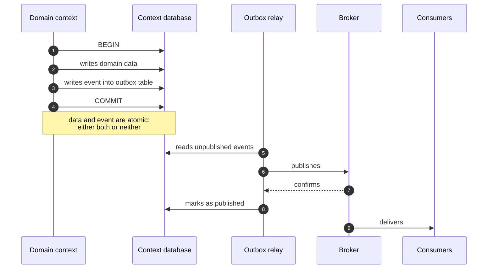

# Events and internal integration

## 1. What problem this chapter solves

Every significant fact in Telemedic has consequences across multiple contexts. A document signature has at least six: the document becomes immutable, the patient must be notified, the source system must be fed, the documentary infrastructure must be fed when foreseen and permitted, the billable fact is emitted, the trail is written. None of these consequences can be foregone; none can cause signing to fail; none can block the professional waiting.

The theory - event-driven architecture, dual write, outbox, idempotence, at-least-once delivery - is in [module 11 of the guide](../10_fondamenti/11-fondamenti-informatici.md#5-dual-write-and-the-transactional-outbox) and will not be repeated. This chapter establishes **how the mechanism works in Telemedic**, what guarantees it offers, what it deliberately does not offer, and where the boundary with the real-time plane passes.

## 2. The transactional outbox

### 2.1 The decision

**The transactional outbox on relational database is the sole source of outgoing events.** The broker is fed by a relay reading the outbox; no application path writes directly to the broker.



### 2.2 Why not direct write

Direct write to the broker after transaction consolidation produces two symmetric defects, both real and neither tolerable in this domain.

**The lost event.** The transaction consolidates, the process terminates before publishing. The document is signed, but the source system will never know, the patient receives no notification, the billable fact is not emitted. No one notices, because there is nothing signalling the absence of an event that never existed.

**The phantom event.** The reverse order - publish before consolidate - produces the opposite case: the event is delivered, the transaction fails. The source system receives notification of a signed document that does not exist. This is the worse of the two defects, because it produces wrong data in a third-party system.

The outbox eliminates both by construction: the event is written **in the same transaction as the data**, hence exists exactly when the data exists, and publishing is indefinitely retryable because the source is persisted.

### 2.3 Where the table lives

**In the schema of the context that produces the event.** Not in a common schema, not in a separate database, not in a dedicated instance. The reason is atomicity: writing the data and writing the event must be in the same transaction, hence the same database and the same transactional scope.

With the one-schema-per-tenant model, it follows that **the outbox is per tenant**. Three useful consequences follow: the relay iterates over tenants explicitly, as does every other process not originating from a request; a tenant with many events does not lengthen the queue of others; dismissal of a tenant carries away its outbox.

### 2.4 How the relay reads

The two available modes are not equivalent and the choice has consequences on the inventory of third-party components.

| Mode | Mechanism | Advantages | Costs |
|---|---|---|---|
| **Periodic query** | The relay queries the table at brief intervals, takes a batch with locking that skips already-taken rows, publishes, marks | No additional component; no special privilege on archive; intelligible and reproducible anywhere | Latency equal to the interval; constant load on archive even in absence of events |
| **Capture from replica register** | A component reads the archive's change log and publishes | Minimal latency; no interrogation load | Introduces a third-party component to inventory; requires replica privilege; complicates customer-premises installation; its progress becomes an additional element to surveil |

**Decision adopted: periodic query as default mode**, in both configurations. The decisive reason is not technical but scope: the customer-premises installation must remain lightweight and installable without special privileges, and every third-party component added enters the inventory that must be surveilled for the product's entire life.

Change capture remains **a declared option** for high-volume configurations, with two conditions: the component is inventoried before adoption, and periodic query remains functional as fallback. The event contract does not change between the two modes: it is the property that permits changing idea without touching consumers.

### 2.5 What does not pass through the outbox

**Real-time session signalling does not pass through the outbox nor the broker.** This is the boundary of §8 and is stated here because the temptation to send everything through the general mechanism is strong and the error is costly.

Also do not pass through the outbox: synchronous queries between contexts, which are not events; operational metrics, which have their own path; entries in the immutable trail, which have their own path with stronger guarantees - failure of trail write fails the application operation, failure of an event consumer does not.

## 3. The envelope

### 3.1 The format

Envelopes adopt **CloudEvents in structured mode**: the entire event, attributes and data, in a single JSON body. The binary mode - attributes in protocol headers, data in body - is not adopted as default.

```json
{
  "specversion": "1.0",
  "id": "01J8ZK4Q0000000000000000",
  "source": "/tenants/t0001/contexts/clinical-documentation",
  "type": "telemedic.document.signed.v1",
  "subject": "document/doc-000042",
  "time": "2026-08-25T09:14:07.412Z",
  "datacontenttype": "application/json",
  "dataschema": "https://example.invalid/schemas/document-signed/1.json",
  "tenantid": "t0001",
  "sequence": "184",
  "correlationid": "01J8ZK4M0000000000000000",
  "data": {
    "documentId": "doc-000042",
    "serviceId": "prest-000117",
    "version": 1,
    "documentType": "televisit-report",
    "signedAt": "2026-08-25T09:14:06.980Z"
  }
}
```

*All values are synthetic and domains are deliberately non-resolvable. `t0001` is the tenant's opaque identifier, not its name: see §3.2.*

### 3.2 Rules on the envelope

| Attribute | Rule |
|---|---|
| `id` | Identifier ordered in time. The pair `source` plus `id` is unique by construction: it is the foundation of deduplication |
| `source` | Identifies the tenant and producing context. Not a reachable address. **The tenant appears there in opaque form**, never by name |
| `type` | Inverted namespace with **version explicit in name**. Version in the type is what permits a new version of an event to coexist with the previous during consumer migration |
| `subject` | Reference to the affected aggregate, in application plane form |
| `time` | Instant of occurrence in absolute form with milliseconds |
| `datacontenttype` | Envelope attribute. **No dedicated protocol header exists for this attribute**: in structured mode the message content type is that of the envelope itself; in binary mode the attribute maps to the message content type, not to a dedicated header with its own prefix. An implementation emitting a dedicated header is not conformant |
| `dataschema` | Reference to data schema, **versioned**. Makes the envelope self-describing and validatable, feeds type generation in tools for integrators |
| `tenantid` | Project extension. **Mandatory, without exception**, and carries the tenant's **opaque identifier**, never the name |
| `sequence` | Project extension. Monotone increasing number **per aggregate**, not global |
| `correlationid` | Project extension. Links events originating from the same action, for path reconstruction |

**The tenant name does not appear in the envelope.** Neither in `source` nor in `tenantid` nor anywhere else: the opaque identifier is used, the same ordinal with which [`03-persistenza.md`](/01_technical/03-persistenza.md#21-the-structure) §2.1 names the schemas, and the mapping between name and ordinal remains the only point where the link is known.

The reason is already written for the schemas - "the name is personal data at the moment the tenant is an individual medical practice, and schema names appear in error messages, execution plans and administration tools" - and it holds **all the more** for the envelope, because the envelope does not stay in the archive: it travels to third-party systems and settles in diagnostics logs, monitoring systems, retry stores and the unprocessable message queue. It is the same list of places §3.3 gives as the reason why the data is lean: lean content inside an envelope that names the medical practice does not reduce exposure, it moves it.

There is also a contract reason, worth stating because it is the only one with a deadline: `tenantid` is an attribute **of the public contract**. Changing its form today costs nothing; changing it after the first integrator is a non-backward-compatible change, with the deprecation notice that follows.

### 3.3 The content of data

**The data is lean.** The event carries identifiers, references and the few attributes needed to decide whether it is relevant; **does not carry clinical content** to third-party systems. A recipient needing the content rereads it with an authenticated call, under their own authorisation.

Three reasons, in order of importance:

1. **Authorisation at moment of reading.** If content travels in the envelope, it was authorised at moment of production. Rereading shifts the decision to moment of access, with attributes in force then: if the subject has revoked or obscured in the meantime, rereading respects it, the already-delivered envelope does not.
2. **Exposure surface.** An envelope with clinical content crosses queues, diagnostic logs, surveillance systems and retry archives. Each transit is a copy in a place with a different protection regime.
3. **Contract stability.** A lean envelope changes less frequently, because it does not follow the evolution of content form.

For events **internal** between contexts the rule is more permissive but not absent: transport what the consumer needs to decide, not the aggregate entire. An event carrying the entire aggregate state couples the consumer to the producer's internal form, which is precisely what boundaries should avoid.

### 3.4 Type versioning

Version is **in the type name**, not a separate attribute. The choice is deliberate: a consumer filters by type, and with version in the type it can subscribe to the version it knows how to handle, ignoring others. With version in an attribute, the consumer receives everything and must discard, meaning a new version reaches it anyway.

Evolution rule:

| Kind of change | Effect |
|---|---|
| Addition of an optional field | No new version. Consumers ignore what they do not know |
| Addition of mandatory field, removal, rename, type change or change of meaning | **New version**, with parallel emission of both versions for duration of deprecation notice |
| Change of fact semantics at equal form | **New version.** The trickiest case: form is compatible but consumer draws wrong conclusions |

For the duration of the deprecation notice **both versions are emitted**. It follows that the producer must be able to construct the old form from new state: if this is not possible, the change is not a new event version but a new event, with a new name.

## 4. Delivery semantics

### 4.1 What is guaranteed and what is not

| Guarantee | Status |
|---|---|
| An event produced is delivered | **Yes**, with retry until policy exhaustion |
| Delivered **at least once** | **Yes** |
| Delivered **exactly once** | **No.** Not guarantable across the boundary of an external system |
| Global order between events | **No.** No functional requirement can depend on it |
| Order between events with the same partitioning key | **Conditional.** It holds only if the three conditions listed below hold together; outside them, **no** |
| Data and event are atomic | **Yes**, by outbox construction |

The row on global order produces the most misunderstanding among integrators. **A completion event can arrive before the start event.** It is an inevitable consequence of retries and concurrent delivery, and is documented in the public contract, not hidden.

**Per-key order is conditional, and the conditions must be declared because the implementation alone does not produce them.** Stating it without conditions would promise a property the mechanism does not have, and a deviation of this kind does not show up in testing: it shows up in operation, intermittently, at an integrator's site. Order between events carrying the same partitioning key holds **if and only if** the following three conditions hold together.

1. **A single worker at a time holds the rows of a given key.** The relay picks up outbox rows with a lock that **skips those already taken** (`03-persistenza.md` §7): it is what allows multiple instances to work in parallel without coordinator, and it is also what allows two instances to take two batches containing events of the same aggregate and publish them in inverted order. It is not an implementation defect: it is a property of the mechanism, and it is removed by assigning the key to the worker, not by hoping it does not happen.
2. **The producer toward the channel is idempotent and limits in-flight requests toward the same destination.** With multiple requests in flight, a failed and repeated attempt can slot in after a later successful one, and this happens **even with a single relay**.
3. **The number of partitions does not change.** Increasing partitions in operation can break per-aggregate order during rebalancing: it is the `[NV]` point already declared in [ADR-0010](/adr/0010-buste-cloudevents-consegna-e-idempotenza.md) and in §4.2, and verification is the technical area's responsibility **before** any dimensioning.

Outside these conditions order is **not guaranteed**, and the public contract declares it as not guaranteed. It is the same discipline the ADR imposes on itself when it writes that the contract is explicit about what it does not guarantee: a guarantee stated and not produced is worse than an absent guarantee, because the integrator relies on it.

There is a comforting reading of all this, and it must be rejected: that the per-aggregate sequence number makes order irrelevant. It makes **reordering** irrelevant, not the **gap**. A consumer that receives number 7 after 9 knows it received two events in inverted order and reorders them; a consumer that never receives 7 has, from the sequence number alone, no way to distinguish waiting from loss. The two are guarded in different places: reordering here, the gap in §5.4.

### 4.2 How order is reconstructed

Two mechanisms, complementary.

**Partitioning key.** The key is **the aggregate identifier** - the service, document, monitoring plan - not the tenant. Partitioning by tenant seems natural and produces two defects: severely imbalanced partitions, because tenants have vastly different sizes; and no useful guarantee, because the order that matters is that of facts relating to the same aggregate, not the same customer.

**Sequence number per aggregate.** Each event carries a monotone increasing number per aggregate. The consumer that has already applied number `n` discards what arrives with a number less than or equal. It is the mechanism that makes arrival order **irrelevant** without forcing ordered queues, which are expensive and brittle - a blocked event blocks the entire key.

A prudence note: `[NV]` - increasing the number of partitions of a topic in operation can change the assignment function and thus break per-aggregate order during rebalancing. Verification on the adopted broker is the technical area's responsibility **before** any dimensioning in operation.

### 4.3 Idempotence by construction

**Every consumer is idempotent, without exception.** Not a recommendation: it is an acceptance condition for every consumer, verified with a test delivering the same event twice and verifying outcome state identity.

Three forms, in order of preference:

| Form | When to use | Note |
|---|---|---|
| **Naturally idempotent operation** | "Set state to concluded" | Preferable: requires no auxiliary archive |
| **Deduplication key persisted** | When the operation has cumulative effects | The key is `source` plus `id`. Must be preserved for a time **exceeding the maximum retry window**, else a late retry finds the key expired and duplicates |
| **State verification before effect** | When the effect is external and non-retractable | "Has this event's message already been delivered?" before delivering |

Two effects in this system **are non-retractable** and must be protected by the third form: delivery of a message to a person, and deposit of a document in external documentary infrastructure. A message sent twice to a patient is not an invisible technical defect: it is an experience generating doubt about clinical content. `[NV]` - the preservation window for deduplication keys must be set by the technical area in coherence with the maximum retry window of §5.1 and cannot be shorter than it.

## 5. Retries and failure

### 5.1 The policy

Exponential backoff **with mandatory random variation**:

```
wait(n) = min( base * 2^(n-1), ceiling ) * (0.5 + random(0; 0.5))
```

Random variation is not ornamental. Without it, a few-minute unavailability of a destination produces, on reactivation, a synchronised burst of all accumulated events: an involuntary denial-of-service attack on one's own integrator.

Base, ceiling and retry count values are **configuration parameters with defaults declared in the public contract**, not code constants. The integrator must be able to know how long the system will retry, because that determines their maintenance window sizing.

### 5.2 What triggers retry

| Condition | Retry |
|---|---|
| Network error, timeout | Yes |
| Response indicating saturation or temporary unavailability | Yes, respecting any wait indication if greater than calculated |
| Recipient error response | Yes |
| Acceptance response | No |
| Response indicating definitive destination dismissal | No, and the destination is **deactivated** |
| Other caller error responses | No: it is permanent error and recipient's responsibility |

### 5.3 Circuit-breaker

After a declared number of consecutive failures the destination enters degraded state: delivery frequency reduces and the tenant administrator is notified. After a declared duration of total failure the destination enters disabled state and events go into the unprocessable message queue.

**Circuit-breakers and quotas are per tenant and per destination, never global.** It is the corollary of the isolation constraint applied to capacity, and is scenario SQ-05.

### 5.4 Unprocessable messages

An event exhausting retries lands in a dedicated queue **per tenant**, with four mandatory properties:

1. **Declared preservation**, not indefinite nor implicit.
2. **Inspectable** through the application interface: whoever experienced the failure must be able to see what was not delivered and why, without opening a support request.
3. **Re-executable**, and re-execution **reuses the same event identifier**, so the recipient's deduplication continues working and re-execution produces no duplicates.
4. **Visible to a human.** A definitive failure landing only in a diagnostic log is silent failure, and is forbidden by the principle that silence is never normalcy. If failure concerns clinical content that should have reached the source system, it enters a reconciliation queue manned by an operator, with possible action.

An unprocessable message queue nobody watches is worse than no queue, because it produces the belief the problem is managed. **Queue depth surveillance is an operational requirement**, with declared threshold.

## 6. Multi-step processes

### 6.1 The problem

Some clinical facts trigger sequences crossing contexts and non-transactionable systems: an external signing service, a documentary infrastructure, an identity provider, the source system. No transaction comprises them; a sequence of steps exists, each of which can fail, and for some steps failure requires compensating the previous ones.

The canonical case is service closure with signing and transmission: close the act, open reporting, sign, make available, return to the source system, feed the documentary infrastructure, emit the billable fact. If feeding the infrastructure fails definitively, one cannot "undo the signature": one compensates with a **documentary correction**, which is a domain act not a technical annulment.

### 6.2 Orchestration, not choreography

Two strategies and why the choice:

| Strategy | How it works | Pro | Con |
|---|---|---|---|
| **Choreography** | Each context reacts to others' events; none knows the process as a whole | Minimal coupling; no central component | **The process does not exist anywhere.** One cannot ask the system where it stands; partial failure is diagnostic only by hand-reconstructing events; adding a step requires modifying multiple contexts |
| **Orchestration** | A component knows the sequence, invokes steps, manages compensations and preserves process state | Process state is **queryable**; partial failure is visible; the process is a documentable and provable artefact | One more component; risk that the orchestrator accumulates domain logic |

**Decision adopted: explicit orchestration for critical clinical processes, choreography for simple propagations.**

The decisive reason is demonstrability, not elegance. In this domain it must be possible to answer the question "was the report signed yesterday at 11 am delivered?" **without reconstructing a sequence of events**. With choreography that question has no place to be asked.

The partitioning criterion:

| The process is orchestrated if | The process is choreographed if |
|---|---|
| Has more than two steps that can fail independently | Is a propagation to a single consumer |
| Requires compensation on partial failure | Consumer failure requires no undo |
| Its state must be queryable by an operator | No one will ever ask "where is it" |
| Crosses a non-transactionable external system | Remains internal |

Orchestrated processes identified: closure, reporting and transmission; enrolment in a monitoring plan with consent acquisition; tenant dismissal with export and deletion; correction of an already-transmitted document.

### 6.3 Constraints on the orchestrator

1. **Contains no domain invariants.** Knows step order and compensations, not rules. An orchestrator deciding whether a document can be signed has absorbed the domain.
2. **Process state is persisted and queryable**, with the outcome of each step and the reason for each failure.
3. **Each step is idempotent**, because the process can be resumed.
4. **Compensations are domain acts**, not technical annulments: correction of a transmitted document is a documentary correction with its evidence, not deletion.
5. **The process has a deadline.** A process remaining indefinitely at an intermediate step is silent failure: after the declared duration it enters a manned queue.

`[NV]` - The **mechanism** of orchestration realisation - dedicated workflow engine, state machine persisted in table with an application component, application component with time-based rescheduling - is not decided in this area: the decision is deferred with criteria in [09 - Deferred decisions](09-decisioni-rinviate.md). What is decided is the **strategy**, because it constrains other areas.

## 7. Events to the outside

Delivery to integrators belongs to the boundary context and its contract to the integration area. This area fixes the architectural constraints flowing from it.

1. **Same source.** Events to the outside derive from the same domain events, not from a second production. Two sources diverge.
2. **Selection, not rewriting.** What exits is a filtered and projected subset; the boundary context does not enrich the event with information the producer did not put in.
3. **Clinical content excluded** from messages to third-party systems.
4. **Asymmetric signature** of outgoing messages, with key identifier resolvable from the project's public material. Shared secret is not the default mode: it provides no non-repudiation and its rotation requires coordination with each integrator.
5. **Destinations are per tenant**, with their own keys, their own quotas and their own circuit-breakers.
6. **The destination is an address supplied by a third party**, and as such an outgoing request toward an untrusted address. Protection is realised **once only in the sole exit mediator**, and is an **architectural requirement not a code rule**: application components have outgoing access **denied at network level**, so the defence does not depend on code correctness (constraint V-157 from the security area). Five exit points flow into it: terminological gateway, interoperability with infrastructures, messages to integrator, resolution of absolute references in resources, retrieval of key material. **The relay does not flow into it and must not**: separate network isolation applies to it. A single test suite of abuse tests, executed against the mediator.

## 8. The boundary with the real-time plane

### 8.1 The rule

**Session signalling does not transit the outbox nor the broker.**

Two reasons, both decisive.

**Latency.** The outbox adds the latency of the relay's query interval plus that of the broker. The session negotiation path has a budget in fractions of second: adding the long path means missing the requirement by construction.

**Ordering and delivery.** Network candidate exchange requires **exactly once delivery and in order** to the destination. A generic publish channel does not guarantee it: a duplicate or out-of-order candidate produces intermittent negotiation failures not diagnosticable.

### 8.2 What crosses the boundary anyway

The boundary separates **traffic** from **facts**. Negotiation traffic remains internal to the session context; already-occurred facts enter the persistent plane as ordinary events.

| Crosses the boundary | Does not cross |
|---|---|
| "Session was initiated" | Negotiation offers and responses |
| "Session terminated with this technical outcome" | Network candidates |
| "Quality dropped below configured threshold" | Measurement samples, going to time-series archive |
| "Operating mode changed" | Instant connection state |
| "Recording started" or "ended" | Audio and video flows, in no form |

### 8.3 The consequence on load distribution

Since signalling does not pass through a shared channel, the state machine of a session must live **in a single process**, determined deterministically by the session identifier. It is an architectural constraint, not an implementation detail: it means load distribution on this path is by session identifier not randomly, and node failure causes termination of hosted sessions, which reestablish with renegotiation.

The alternative - random routing with session affinity - is admitted only as declared technical debt, with a written exit strategy, because it shifts the problem to load-balancer affinity without solving ordering.

## 9. Mandatory automatic verifications

| # | Verification | What it demonstrates |
|---|---|---|
| EV-1 | Writing data and writing the event are in the same transaction: if transaction fails, no event exists | Absence of phantom events |
| EV-2 | Interrupting the process between consolidation and publishing, the event is published on restore | Absence of lost events |
| EV-3 | Delivering the same event twice, consumer state is identical | Actual idempotence |
| EV-4 | Every published event carries the tenant | Constraint V4 |
| EV-5 | An event without tenant lands in the unprocessable message queue | §3.2 |
| EV-6 | No event to the outside contains clinical content | Constraint V-161 from integration area |
| EV-7 | Every event type has a registered and versioned schema | Public contract |
| EV-8 | A non-backward-compatible schema change fails the build if not accompanied by a new type version | Governed evolution |
| EV-9 | Re-execution of an unprocessable message reuses the same event identifier | Deduplication preserved |
| EV-10 | No application path writes directly to the broker | Uniqueness of source |
| EV-11 | Session signalling does not cross the broker | §8.1 |
| EV-12 | Circuit-breakers act per tenant and per destination, not globally | SQ-05 |
| EV-13 | No published envelope contains the **name** of a tenant: `source` and `tenantid` carry the opaque identifier, and the check compares the value against the catalogue of names | §3.2 |

## 10. Unverified points of this section

| Reference | What is unverified | Who to ask |
|---|---|---|
| §4.2 | Effect of increasing partition count on per-aggregate order during rebalancing | Technical area, before any dimensioning |
| §4.3 | Preservation window for deduplication keys, in coherence with maximum retry window | Technical area |
| §2.4 | Effective limits of broker guarantees in the single-node configuration planned for customer-premises | Technical area |
| §6.3 | Mechanism of orchestration realisation | Deferred decision, criteria in `09-decisioni-rinviate.md` |
