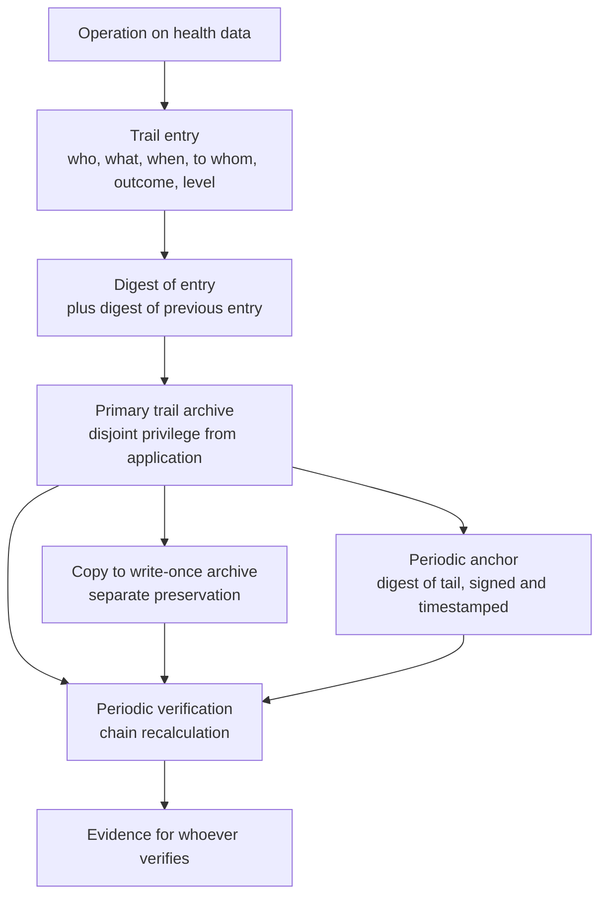

# Audit trail and immutable record

## 1. The requirement, and why it is harder than it seems

The requirement is that every access to health data be recorded **in non-repudiable and unalterable form**. The two words are not synonymous and neither is satisfied by a history table.

**Non-repudiable** means whoever performed the operation cannot claim not to have performed it. It requires that identity be verified at the moment of operation and recorded with the assurance level at which it was verified, and that the recording be enforceable.

**Unalterable** means no one - **including system administrators** - can modify or delete an entry without the alteration being detectable. This is the hard requirement, because the threat model includes the operator themselves.

The systematic industry misunderstanding is believing that automatic versioning of entities offered by the persistence layer satisfies the second requirement. **It does not**: history tables are tables like any other, and whoever has write access to the database modifies them exactly as they modify any other. Versioning **versions, does not make immutable**. The distinction must not be attenuated in any document of this project, and is a noticeboard constraint.

It follows a structural consequence that is, by the very decision imposing it, **the greatest effort of the entire security catalogue**: a chain of cryptographic hashes and **preservation separate from the system generating events** is needed. Not configuration: a component.

The theory of hash functions and chains is in [module 12 of the guide](../10_fondamenti/12-crittografia-e-sicurezza.md#5-hash-functions) and will not be repeated.

## 2. The model adopted

**Application-layer hash chain, with periodic signed and timestamped anchor, and copy on write-once archive held separately.**

The four available techniques are not alternatives to choose among but **layers covering different threats**, and their combination is the decision.

| Technique | Covers | Does not cover |
|---|---|---|
| **Application-layer hash chain** | Entry modification or deletion, reordering, retroactive insertion | Entire-chain rewrite by whoever controls the application |
| **Archive with single-object write** | Modification and deletion within the archive's imposed retention period | Omission of an entry that was never produced |
| **Separate preservation with disjoint privilege** | Entire-chain rewrite by the administrator of the application archive | Collusion between the two administrators |
| **Periodic signed and timestamped anchor** | Collusion, within the interval between anchors: the previous chain is no longer rewritable without contradicting an already-issued attestation | Entries between the last anchor and the moment of attack |

The combination of four layers leaves a single residual vulnerability window: **entries between two consecutive anchors**, and only under the hypothesis of collusion between who administers the application and who administers preservation. The window is **declared**, not hidden, and its breadth is the parameter regulating the cost-to-guarantee ratio.

### 2.1 The chain

Each entry carries the digest of its own content **and** the digest of the previous entry in the sequence. Modification of any entry invalidates all subsequent digests: one does not alter an entry without rewriting the entire tail.

Two format decisions:

**The chain is per tenant, not global.** A global chain would create a dependency between tenants - verifying tenant A's integrity would require tenant B's entries - that contradicts separation between autonomous data controllers and would make it impossible to deliver evidence of one's own accesses to a verifier without exposing the existence of others.

**The sequence is determined at write time, not at subsequent ordering.** The sequence number is assigned in strictly increasing order per tenant, and concurrent write serialises on that point. It is a deliberate contention point: the guarantee of sequentiality is worth the cost, and the trail write volume is dominated by health data reads, not contention.

### 2.2 Anchoring

At regular intervals, the digest of the chain tail is **signed and timestamped**, and the attestation is held separately from the chain itself. Anchoring is what makes rewriting history contradictory with an already-issued and dated attestation.

`[NV]` - Anchoring interval, the choice between timestamping from a qualified service and other attestation forms, and preservation of anchors are decisions belonging to the security area and compliance area: this area fixes the necessity and architectural placement, not the parameters. The question is open on the noticeboard.

### 2.3 Separate preservation

"Separate" means **with disjoint privilege**: whoever administers the application archive has no write privilege on the trail archive, and vice versa. In the managed service this is realisable with distinct credentials, roles and archives; in customer-premises installation it depends on the customer's organisation and is a **requirement the project documents and the customer satisfies**.

This point must be said with honesty in documentation for whoever installs: **the project provides the mechanism, cannot enforce separation of roles in an organisation it does not control**. What it can do, and does, is: make separation the default configuration, detect and report the configuration in which the two archives share credentials, and document the consequence - in that configuration, the guarantee reduces to that of the application chain alone.

## 3. What is recorded

### 3.1 Entry content

| Element | Content | Note |
|---|---|---|
| **Who** | Subject performing the operation, **and** application principal acting on their behalf | Representing delegation is what permits answering "which system acted for which person" |
| **What** | Type of operation and type of resource | From a closed and versioned vocabulary |
| **When** | Instant in absolute form | With indication of the time source used |
| **To whom** | Subject concerned by the data | Reference, never content |
| **What** | Reference to resource | Identifier, never content |
| **With what outcome** | Succeeded, denied, failed | **Denial is recorded**: the most interesting information for whoever verifies |
| **With what assurance level** | Level of authentication **and** its provenance, performed or claimed | A level claimed by an integrator is marked as such |
| **With what purpose** | Care, override, operation, administration, verification | The attribute that makes the decision explainable after the fact |
| **From where** | Origin of request, in minimum necessary form | See §3.3 |
| **Tenant** | Always | No exception |

### 3.2 Which operations

| Category | Recorded |
|---|---|
| Reading health data | **Yes**, every single read |
| Writing, modifying, deleting health data | Yes |
| Denied access to health data | **Yes** |
| Successful and failed authentication | Yes |
| Role assignment, modification, revocation | Yes |
| Override access invocation and its review | Yes, with high severity |
| Manifestation of will, revocation, obscuring | Yes |
| Signing, correction, retraction of a document | Yes |
| Start, stop, playback, deletion of recorded material | Yes |
| Change of session operating mode | Yes |
| Data export, in any form | Yes |
| Configuration change affecting access, preservation or thresholds | Yes |
| Restore, migration, tenant dismissal | Yes |
| **Reading the trail itself** | **Yes** |
| Application of retention policy with deletion | Yes |
| Query to a terminological service | No: not access to patient data, and by construction carries none |
| Channel metric sampling | No: not clinical data |

The row on trail reading merits emphasis: **whoever watches who watched leaves a trace.** It is the property that makes the system's most privileged role surveilable.

### 3.3 What is never recorded

The trail **contains no clinical content**. It contains who, what, when, to which subject, with what outcome. Three reasons:

1. **A trail with clinical content is a second clinical record**, with a different access regime and more permissive, and longer preservation than the original data.
2. **Content would make the trail non-deliverable** to whoever verifies: an auditor must receive evidence of accesses without receiving health data.
3. **The right to erasure becomes insoluble**: the trail is by definition unalterable, and clinical content is by definition erasable when grounds exist. The two properties are incompatible on the same archive.

The list of what does not appear is **closed and automatically verified**, not entrusted to good sense. It includes in particular: clinical values, document texts, message contents, authorisation references for messaging channels with the hosting party, external identifiers of the subject assigned by the integrator, and every secret.

The last point merits a note. The external identifier of the patient, the one with which the integrator identifies them in their own system, **does not appear in the trail**: the opaque internal identifier is recorded. The reason is that the trail is deliverable to subjects other than the data controller, and the external identifier is a key to another archive.

On recording the origin of the request there exists a genuine tension: on one hand it is useful surveillance information, on the other a patient's network address is personal data and, in context, health-related data - because its very presence attests a healthcare contact. The minimum form adopted and its possible reductions belong to the security area; this area records that the tension exists and must be resolved explicitly, not ignored.

## 4. Trail writing is blocking

**Failure of trail write fails the application operation.** It is not a robustness choice: it is the operational translation of the requirement. If the operation succeeded without a record, there would be an access to health data not demonstrable, and that is precisely what the trail exists to prevent.

Consequences flowing from this must be accepted consciously:

**The trail is on the critical path.** Its latency adds to that of every operation on health data. Sizing accounts for it and the operation latency budget explicitly includes it.

**Trail unavailability is system unavailability.** If the trail is not writable, operations on health data are not executable. It is a severe deliberate choice: the alternative - proceed without a record and reconcile after - produces a window of undemonstrable accesses, and the window coincides with the incident, that is when demonstrability is most needed.

**Copy to the write-once archive is instead asynchronous**, with monitored delay. It is writing to the primary archive that is blocking, not the replica: blocking the replica would move clinical system availability below preservation system availability, a wrong ratio.

## 5. Integrity verification

### 5.1 How verification is done

Verification recalculates the chain from a known anchor and compares. It has three levels of depth:

| Level | What it does | Frequency |
|---|---|---|
| **Incremental** | Verifies entries written since last verification | Frequent |
| **From anchor** | Recalculates from last anchor to tail and verifies attestation | At each anchor |
| **Integral** | Recalculates a tenant's entire chain and compares with all anchors and with the separate copy | Periodic, and on request of whoever verifies |

Every verification produces **a recorded outcome**, positive or negative. A verification whose outcome is not preserved is not evidence: whoever verifies must be able to see that verifications were done, not just that they could be.

### 5.2 What happens when verification fails

Verification failure is a **security incident**, not a technical defect to fix silently. The architectural procedure provides four steps:

1. **Delimitation**: the interval is identified between the last verifiable entry and the first coherent subsequent entry. It is the interval of uncertainty, and is the measure of scenario SQ-01.
2. **Comparison with the separate copy**, which permits determining the original content of altered entries when the copy is intact.
3. **Notification** to the subjects provided, according to security area procedures.
4. **No correction of the chain.** The chain is not "repaired": a new generation opens, anchored to the previous, and the event of the break is itself recorded. Repairing would mean rewriting, which is the operation the trail must make impossible.

### 5.3 Evidence for whoever verifies

The system produces, on request and for a defined scope, a **signed extract** containing: the entries of the requested scope, the anchors comprising them, the outcomes of verifications done in the period and a description of the method. The extract is independently verifiable by whoever receives it: without needing access to the system that produced it, one can recalculate the chain and compare anchors.

Independent verifiability is the property distinguishing evidence from assertion. The method of calculating digests and chain structure is therefore **publicly documented**: method secrecy adds no security and subtracts verifiability.

## 6. What the trail is not

| Not | Why |
|---|---|
| **The application diagnostic log** | Two archives with different purposes, contents, access regimes and preservation. The terminological collision in Italian is real and must be guarded: "access trail" for one, "diagnostic log" for the other |
| **Entity versioning** | Reconstructs past application state; is not immutable and not enforceable |
| **A source for application decisions** | No application path reads from the trail to decide. It is a destination, not a source: the property permitting its separate preservation |
| **A search archive** | Queries are for defined scope and are themselves recorded. Not an exploratory tool |
| **A substitute for compliant document preservation** | The trail attests accesses, does not preserve documents. Two distinct obligations with two distinct mechanisms |

## 7. Preservation

Durations are set by the security area on the basis of applicable law and bind this area: **twenty-four months** for traceability trails, **twelve months** for access and authentication data.

Three architectural consequences:

**The trail survives the tenant.** Tenant dismissal removes the application schema; the trail remains for the prescribed time, in separate preservation. Must be declared to the data controller in the contract, not discovered after.

**Trail expiry is itself a recorded operation.** Applying retention policy, with the scope of removed entries, produces an entry in the current generation. Otherwise expiry would be indistinguishable from deletion.

**Removal for expiry occurs in segments delimited by anchors**, not single entry. Removing single entries would break the chain pointlessly; removing a segment between two anchors preserves the verifiability of the remaining part, because the closing anchor of the removed segment remains and attests what was there.

## 8. Mandatory automatic verifications

| # | Verification | What it demonstrates |
|---|---|---|
| TR-1 | An operation on health data with trail not writable fails | §4 |
| TR-2 | Every path accessing health data produces an entry | Coverage |
| TR-3 | Direct modification of an entry is detected by chain verification | §2.1, scenario SQ-01 |
| TR-4 | Direct deletion of an entry is detected | Idem |
| TR-5 | Retroactive insertion of an entry is detected | Idem |
| TR-6 | No entry contains elements from the closed list of §3.3 | Absence of clinical content and secrets |
| TR-7 | Reading the trail produces an entry | §3.2 |
| TR-8 | Denial of access produces an entry | §3.2 |
| TR-9 | Every entry carries the tenant and the chain is per tenant | §2.1 |
| TR-10 | The signed extract is verifiable without access to the system that produced it | §5.3 |
| TR-11 | No application path reads from the trail to take a decision | §6 |
| TR-12 | The configuration in which application archive and trail archive share credentials is detected and reported | §2.3 |

## 9. Unverified points of this section

| Reference | What is not decided or verified | Who is responsible |
|---|---|---|
| §2.2 | Anchoring interval, form of temporal attestation, preservation of anchors | Security area with compliance area; open question on noticeboard |
| §2.3 | Minimum separation requirements of privilege exigible in customer-premises installation | Security area, for documentation destined for those installing |
| §3.3 | Minimum form of request origin compatible with minimisation | Security area |
| §5.1 | Frequency of the three verification depths | Security area, in coherence with surveillance objectives |
| §7 | Behaviour of separate preservation on expiry, when the archive's imposed retention period exceeds the prescribed duration | Security area: two constraints that may conflict and the conflict must be resolved before configuration |
