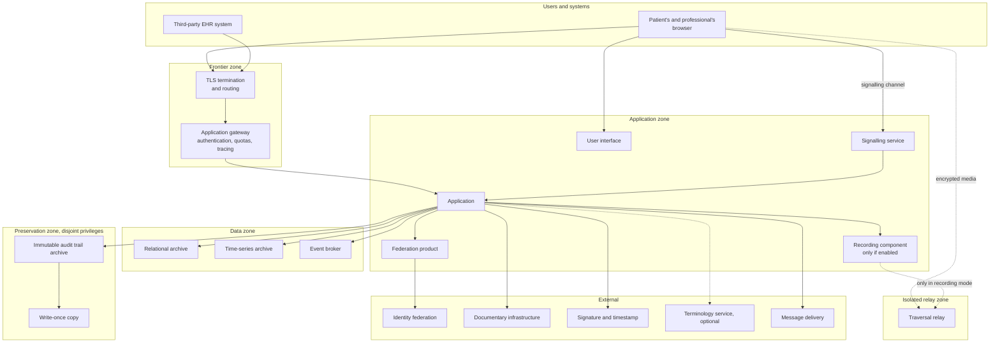

# Deployment views

## 1. Two configurations, a single code

Telemedic exists in two deployment configurations: **installation at customer premises** and
**managed service**. They are not two products nor two branches: they are two configurations of
the same code, and this constraint determines the whole deployment view.

The most stringent consequence is that **no function may depend on a component available only in
one of the two configurations**. A component present only in the managed service would produce a
function absent from installation at customer premises, hence divergent documentation, tests
covering only one configuration and customers discovering a difference after having chosen. The
only permitted differences are those declared in the matrix in §7, and each has a written
justification.

The second consequence is that **the operational weight of installation at customer premises is a
project constraint**. Every added component must be installed, updated, surveilled and secured by
an organisation that is not a computing services provider. One more component does not cost only
its own complexity: it costs the probability of being misconfigured.

## 2. The components

### 2.1 List and role

| Component | Role | Mandatory | Replaceable |
|---|---|---|---|
| **Application** | Contains the domain contexts, the exposure planes, the anti-corruption layer | Yes | No: it is the product |
| **User interface** | Single-page application, also in embeddable form | Yes | Replaceable by the integrator, who can use only the application interfaces |
| **Relational archive** | Persistence of the contexts, outbox, configuration | Yes | No, for the current version |
| **Time-series archive** | Clinical parameters and channel metrics, in **distinct structures with distinct regimes** | Yes | Yes, behind the context's interface |
| **Immutable audit trail archive** | Access trail, with disjoint privileges | Yes | Yes, provided it satisfies the properties in §2 of the audit trail chapter |
| **Event broker** | Distribution of events to consumers | Yes | Yes, behind the publication interface |
| **Identity federation product** | Federation, issuance of internal tokens, realm management | Yes | No, for the current version |
| **Signalling service** | Negotiation of the media session | Yes for synchronous services | No |
| **Relay for network traversal** | Media routing when the direct connection is not possible | Yes for synchronous services | Yes, it is a standard component |
| **Recording component** | Server-side recording of the session | Only if the function is enabled | Yes |
| **Terminology service** | Resolution and expansion of codes | **No** | Yes, and it is disableable per coding system |
| **Signature and timestamp service** | Signing of documents | Depends on the tenant's configuration | Yes, behind the context's interface |
| **Message delivery** | Channels towards patients and professionals | Depends on the enabled channels | Yes, behind the context's interface |
| **Surveillance and metrics collection** | Operation | Yes | Yes |

Two rows merit attention. The **terminology service is not mandatory**: it is the only external
dependency that the system must be able to lose while remaining fully operational, and it is
quality scenario SQ-07. The **identity federation product** and the **relational archive** are
instead declared non-replaceable in the current version: it is a choice, and it is declared as
such instead of being presented as a necessity.

A third row must be read carefully so as not to be misunderstood. The **time-series archive** is
**a single component** - it is the count that
[ADR-0020](/adr/0020-serie-temporali-in-archivio-dedicato.md) accepts among its own negative
consequences, "one archive more to install" - and it hosts **two distinct structures**, clinical
parameters and channel metrics, with different conservation, title of access and resolution
reduction. A single component does not mean a single regime: the separation that
[04 - Data model](/02_architecture/04-modello-dati.md#41-two-series-not-one) §4.1 imposes is that
of the regimes, and it remains whole even when the installed component is one.

### 2.2 View of the components

Three readings of the diagram:

**The media does not cross the application.** In the default mode the flow goes from one
participant to another, directly when the network allows it and through the relay when it does
not. The application knows the session's state, not its content. In recording mode the flow
crosses the recording component, and this is precisely the difference that makes that mode not
encrypted end-to-end.

**The relay zone is isolated and has no routes towards the interior.** It is the point addressed
in §5 and is not a reinforcement recommendation: it is the primary defence against the most
serious risk of the media architecture.

**The preservation zone has disjoint privileges.** It is not a different network zone for
performance reasons: it is a separation of administrative privileges, and the diagram represents
it as a zone to make visible that the path is unidirectional.

## 3. Configuration: installation at customer premises

### 3.1 Form

Components on a limited number of nodes, orchestrated with the composition definition supplied by
the project or with the package for a container orchestrator, according to the customer's
capabilities. Tenancy active with a single tenant, or a few.

The **broker in a single-node configuration** is the choice adopted to contain the operational
weight. It is a conscious choice with a declared consequence: the actual limits of the broker's guarantees
in that configuration `[NV]` must be verified by the technical area, and every guarantee that depends on
replication is not available. No functional requirement may depend on guarantees unavailable in the minimal
configuration.

### 3.2 What the customer must provide

This list is a deliverable, not an appendix: it is what determines whether an installation is
possible.

| Element | Note |
|---|---|
| Domain name and certificates | With automatic renewal procedure |
| Reachable addresses for the relay | The relay must be reachable from outside; it is the only component that requires this, together with the frontier |
| Separation of privileges between the application archive and the trail archive | **Requirement, not recommendation.** In its absence the guarantee is reduced to that of the application chain alone, and the reduction must be declared |
| Backups and verification of their restore | An unverified backup is not a backup |
| Location of backups consistent with the chosen profile | A backup outside the perimeter is less visible than a runtime dependency and just as significant |
| Identity or federation provider | The provider of services towards the national federation is the customer, not the project |
| Message delivery channel | With its own contract and its own chain of responsibility |
| Signature service, if reporting is enabled | |
| Surveillance and incident management | |
| Update cadence for exposed components | In particular for the relay, which is exposed and for which updating is an obligation, not a good practice |

### 3.3 What the project provides

Reproducible deployment definitions; automated and reversible migrations; blocking configuration
checks at startup; bill of materials of third-party components generated by the build; the sheet
of data the customer must be able to declare to an authority on relevant suppliers; documented
procedures for restore, trail integrity verification and dismissal.

**Blocking configuration checks at startup** are an architectural instrument that is underrated
and, here, central: the system refuses to start in configurations that would silently compromise
a guarantee. These include at least: row policies not active or bypassable by the application
role; the trail archive reachable with application credentials; the relay reachable from internal
networks; secrets at default values; absence of a retention policy for a data category.

## 4. Configuration: managed service

### 4.1 Form

Replicated components, with separation between interactive paths, background paths and export
paths; many tenants; relational archive with replica; relay across several independent nodes.

### 4.2 Four substantial differences

**Separation of pools by operation class.** A voluminous export by one tenant must not be able to
exhaust connections and block entry to another's waiting room. The separation is an architectural
requirement, not an optimisation, and is the corollary of noise isolation.

**Relay across several independent nodes, with no shared state.** The adopted relay component has
no native clustering: the fall of a node terminates the allocations it hosted. Redundancy is
obtained by offering the participant several independent nodes and letting the negotiation
mechanism choose. No shared allocation store, no load balancer with affinity, no address shared
between nodes. Recovery from a node's fall is a renegotiation, not a state migration.

**Deterministic distribution of signalling.** A session's state machine lives in a single process,
determined by the session identifier. The consequence is declared: the fall of a node terminates
the sessions it hosted, which re-establish themselves through renegotiation.

**Synchronous replica for the category with zero restore point objective.** Signed documentation,
consents and the trail admit no loss. Synchronous replica for this category adds latency to the
signing operation: a cost accepted and declared in the user experience.

## 5. Isolation of the relay

### 5.1 The risk

The relay is the most exposed component of the architecture and hosts the most serious risk. The
mechanism: every authenticated participant receives, **by design**, a credential valid for using
the relay. Without restrictions, that credential is a router towards an arbitrary destination: the
relay's own loopback address, the organisation's internal network, the metadata services of the
hosting infrastructure.

This is not a hypothesis: the protocol specification **explicitly delegates the defence to the
operator** and imposes no countermeasures, and there are documented precedents of evasion of
destination controls based on lists of forbidden addresses, in particular through alternative
forms of representation of the same address.

### 5.2 The defence

**Outbound network isolation is the primary defence; lists of forbidden addresses are defence in
depth.** The order is not indifferent and is a noticeboard constraint: the address list is
precisely what historical evasions have circumvented, because it depends on address
canonicalisation, which is a problem of syntactic analysis and not of policy.

The four layers:

| Layer | Content |
|---|---|
| **1. Network isolation** | The relay node sits in a zone **with no routes towards internal networks** and no access to the infrastructure's metadata services. It is the only layer that does not depend on the correctness of a syntactic analysis |
| **2. No co-located service** | The node hosts nothing else. A co-located service is reachable through the loopback address, which is the destination hardest to forbid correctly |
| **3. Restrictive configuration** | Default denial on destinations, with explicit coverage of alternative forms of address representation; no multicast routing; quotas |
| **4. Automatic verification in continuous integration** | A test attempts routing towards the loopback address, towards private addresses and towards metadata services, and **fails the build if any request succeeds** |

The fourth layer is what distinguishes a documented measure from an effective one. A configuration
correct today does not remain correct after a component update or a network change: only a test
executed at every build ascertains it.

### 5.3 The relay processes health-related data

The relay does not see the content - it does not possess the keys - but it sees **who spoke to
whom, when, for how long and from which address**. In the healthcare context, the mere fact of
contact with a specialist is health-related data.

Architectural consequences: logging reduced to the minimum necessary for operation; the
credential's subject is an **opaque session identifier**, never a person identifier; short and
declared retention; no infrastructural metric labelled with the session identifier; the relay
enters the record of processing activities and the impact assessment.

### 5.4 The version is a requirement

The relay is exposed to the Internet and the update cadence is an obligation. The project declares
a **minimum version** and verifies it at startup; the component is inventoried among third-party
components with a tracked update channel and a declared service level for the application of
fixes.

## 6. Placement profiles

Three profiles are documented and supported: **European Union**, **Italian territory**,
**qualified cloud**. The constraint governing them is single and categorical: **no runtime
dependency may prevent the most restrictive profile**.

### 6.1 How it is verified

Verification is not declarative. It is performed in three steps:

1. **Inventory of runtime dependencies**, generated by the build, not compiled by hand.
2. **Classification of each one**: mandatory or optional; on the main path or not; replaceable or
   not; location of the supplier.
3. **Feasibility verification**: a test that runs the functional suite with all optional
   dependencies disabled. If something fails, that dependency was not optional.

The third step is what transforms sovereignty from an argument into a verified property. It
coincides largely with quality scenario SQ-07.

### 6.2 The case of the terminology service

It is the case that illustrates the principle better than any other, because sovereignty here
**is not satisfied by location**. The terminology service is a third-party component at runtime,
not a build dependency. If it is established outside the Union, the query constitutes a transfer
**the moment it carries data referable to a patient**.

The solution adopted is not to locate the service: it is **not to transport the data**. Queries to
the terminology gateway carry no patient identifiers, carry no clinical context and are not
correlatable to a person. The sovereignty of this dependency is satisfied **by absence of data**.
The prohibition on disk-persisted cache and the system's full functionality with costly coding
systems disabled remain firm.

The terminology service is nonetheless a **relevant second-level supplier** that the customer may
be required to declare nominally to an authority, with the country of the registered office: the
project provides the sheet with the necessary data.

### 6.3 The case of backups

A backup located outside the perimeter is **less visible** than a runtime dependency and just as
significant: it does not appear in the dependency inventory and does not emerge from functional
tests. The location of backups falls within the declared profile and is part of the list of what
the customer must provide.

## 7. Matrix of permitted differences

| Aspect | Installation at customer premises | Managed service | Difference permitted? |
|---|---|---|---|
| Available functions | All | All | **No**, no difference |
| Application interfaces | All | All | **No** |
| Tenancy model | Active, one tenant or a few | Active, many | No: same mechanism |
| Broker configuration | Single node | Replicated | **Yes**, with the guarantees declared per configuration |
| Relay nodes | One or a few | Several independent nodes | **Yes**, of sizing |
| Archive replica | Optional, at the customer's choice | Active, synchronous for the category with zero restore point objective | **Yes**, with the consequence on objectives declared |
| Separation of pools by class | Recommended | Mandatory | **Yes** |
| Separate preservation of the trail | Requirement borne by the customer | Realised by the operator | **Yes**, of responsibility |
| Distribution of signalling | Single process | Deterministic by identifier | **Yes**, of sizing |
| Who is data controller | The customer | Each tenant | Of responsibility, not of product |

Every row marked as a permitted difference is **dimensional or of responsibility**, never
functional. A request for a functional difference must be brought to the noticeboard, not resolved
with a configuration setting.

## 8. Observability and startup checks

**Startup configuration checks are blocking.** A system that starts in an insecure configuration
is worse than a system that does not start, because the former produces false reassurance.

The minimum list, derived from the constraints of the preceding sections:

| Check | Consequence if it fails |
|---|---|
| Row policies active and not bypassable by the application role | Startup refused |
| Archive of the audit trail not reachable with application credentials | Startup refused in the managed service; blocking warning with explicit confirmation in installation at customer premises |
| Relay not reachable from internal networks | Startup refused |
| Minimum version of the relay | Startup refused |
| No secrets at default values | Startup refused |
| Outgoing network access denied to application components, permitted only to the sole exit mediator | Startup refused |
| Row policies enforced even against the owner, and the application role not the owner of the objects | Startup refused |
| Retention policy present for every data category | Startup refused |
| Migrations applied to all active schemas | Startup refused |
| No mandatory dependency left unconfigured | Startup refused |
| Terminology service unreachable | **Startup permitted**, with the declared degradation policy |

On the operational side, three quantities are architecturally relevant because their absence makes
silent failures invisible: the **depth of the unprocessable message queue**, the **outbox relay's
delay** and the **outcome of the trail's integrity verifications**. A system that does not expose
them can be severely faulty and appear healthy.

Two warnings on the exposed quantities. **No raw cumulative counter may be cited as a quality
indicator**: packet loss, bytes, freeze duration and jitter-buffer delay grow monotonically and
must be differentiated between consecutive samples; correct averages are ratios between
differences (constraint [V-113](../11_registri/01-vincoli-in-vigore.md#v-113) of the technical area). And **the session's synthetic quality index
is proprietary and must be declared as such**: it is not a mean opinion score under any
international recommendation (constraint [V-114](../11_registri/01-vincoli-in-vigore.md#v-114)).

The expected service levels for operational surveillance `[NV]`, distinct from those provided
for by legislation on regional infrastructures, **must be decided by the security area and the roadmap**
according to an open question on the noticeboard. This area fixes **what** must be surveilled, not **at
what threshold**.

> **Binding terminological note.** Throughout the documentation, «surveillance» referring to
> components indicates operational observability. Referring to the patient, the formulas
> «real-time monitoring» and «continuous surveillance» **are forbidden** (constraint [V-144](../11_registri/01-vincoli-in-vigore.md#v-144) of the
> domain area): the perimeter of telemonitoring is the deferred collection of parameters for the
> professional's periodic review, and the difference between the two formulations is worth a risk
> class.

## 9. Unverified points of this section

| Reference | What is unverified | Who to ask |
|---|---|---|
| §3.1 | The broker's actual guarantees in the single-node configuration | Technical area |
| §5.2 | Configuration directives of the relay and their effectiveness on the adopted version | Security area; no directive may be published without verification on the installed version |
| §5.4 | Current minimum version and applicable security fixes | Security area, on primary source |
| §8 | Surveillance thresholds and service levels | Security area and roadmap |
| §2.1 | Whether the trail archive can be the same engine as the application archive with disjoint credentials, or whether it must be a different engine | Security area; affects the weight of installation at customer premises |
