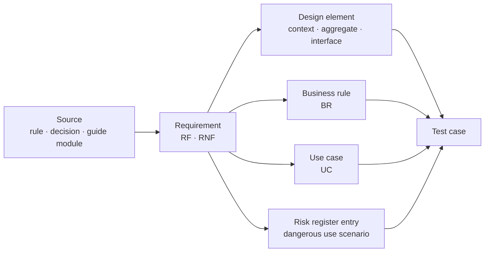

# Requirements catalogue

## 1. Reading conventions

Every functional requirement is expressed in this form:

> **RF-nnn · Title** - *Actor* · *Priority* · *Dep.: dependencies*
> Verifiable statement.
> › **Given** initial state · **When** event · **Then** observable outcome.

The line starting with `›` **is the acceptance criterion**, not a gloss. There must exist a test capable of making it fail: if it is not possible to write it, the statement does not enter the catalogue. This is the criterion that has excluded from this document every formulation of the type "the system must be reliable", "the interface must be intuitive", "data must be protected".

**Priority (MoSCoW).** `M` release 1.0 is not possible without; `S` release 1.0 is possible with a declared degradation; `C` opportunistic; `W` out of scope for 1.0, recorded so as not to lose it. Priority is a product decision, not a measure of clinical importance: a requirement `S` may be clinically more relevant than an `M` and have an acceptable organisational mitigation.

**Numbering.** The ranges have intentional gaps. A new requirement is inserted in a gap in its own block; **nothing is ever renumbered**, and a retired identifier remains retired and is not reused (§ 14).

Every non-functional requirement is expressed with **metric, threshold, measurement condition and verification method**. A non-functional requirement lacking a verification method is an aspiration and does not enter the catalogue.

## 2. What was already frozen

The catalogue produced in the research phase covers the cycle of synchronous service delivery and the platform that supports it. It remains entirely in force and is not rewritten here:

| Block | Range | Subject |
|---|---|---|
| 5.A | `RF-001` … `RF-019` | identity, federation, guarantee levels, sessions, access in derogation |
| 5.B | `RF-020` … `RF-032` | demographics by external reference, delegations, service catalogue |
| 5.C | `RF-035` … `RF-052` | schedules, slots, booking, rescheduling, cancellation, access links |
| 5.D | `RF-055` … `RF-064` | virtual waiting room, admission, abandonment |
| 5.E | `RF-067` … `RF-086` | media session, identification, degradation, emergency, closure with outcome |
| 5.F | `RF-089` … `RF-097` | screen sharing, documents, attachments, revocation |
| 5.G | `RF-100` … `RF-107` | session chat and asynchronous messaging |
| 5.H | `RF-110` … `RF-121` | distinct consents, versioned information notices, revocation, suppression |
| 5.I | `RF-124` … `RF-136` | draft, signature, immutability, corrective reissue, delivery, confidentiality |
| 5.J | `RF-139` … `RF-147` | session recording |
| 5.K | `RF-150` … `RF-158` | multi-channel notifications and minimum content |
| 5.L | `RF-161` … `RF-172` | technical check, telemetry, quality thresholds, technical report |
| 5.M | `RF-175` … `RF-183` | configuration, customisation, relay, maintenance |
| 5.N | `RF-186` … `RF-193` | isolation, keys, data residency, export, tenant closure |
| 5.O | `RF-196` … `RF-205` | access register, immutability, reporting, traceability |
| 5.P | `RF-208` … `RF-223` | application interfaces, interoperability resources, webhooks, embedding |
| RNF | `RNF-001` … `RNF-083` | performance, capacity, availability, security, privacy, accessibility, usability, internationalisation, portability, maintainability, observability, process |

This area **extends** the catalogue on eight new blocks, all related to the care pathway, remote monitoring and patient safety. These are the areas on which the foundations guide had produced design consequences lacking an identifier: the detailed mapping is in § 13.

## 3. Block 5.Q - Care pathway, enrolment and remote monitoring plan (`RF-230` … `RF-248`)

The presupposition of the entire block is the distinction between **model** and **instance**: the population pathway describes what the organisation does for a condition, the individual plan describes what is done for *this* person. Merging them makes it impossible to version the protocol and reconstruct, months later, what was intended at the moment of a decision. The clinical-organisational foundation is in module [10, §§ 3–4](../10_fondamenti/10-percorsi-di-cura-e-sicurezza.md).

> **RF-230 · Care pathway as versioned data** - *Pathway drafter* · *M* · *Dep.: -*
> The system must represent the care pathway as data that is uploadable, validatable and publishable, with identifier, version, organisational scope, effective date and status; no pathway is represented in application code.
> › **Given** an installation with two published pathways for the same condition in different scopes · **When** the source code is inspected · **Then** there exists no class, constant or branch that names a clinical condition or a pathway phase, and automatic architectural verification fails if one is introduced.

> **RF-231 · Pathway validation at publication** - *Pathway drafter* · *M* · *Dep.: RF-230*
> The system must refuse publication of an incoherent pathway, indicating the invalid element in a form comprehensible to whoever drafted it.
> › **Given** a pathway with an unreachable node, a cadence lacking units and a rule that references an undeclared parameter · **When** publication is requested · **Then** publication is refused with three distinct notifications indicating node, cadence and rule, and no partial version is created.

> **RF-232 · Immutability of published version** - *System* · *M* · *Dep.: RF-231*
> A published version of a pathway is not modifiable: it is superseded by a later version. Active instances remain attached to the version with which they were born.
> › **Given** twenty active plans instantiated on version 2 · **When** version 3 is published · **Then** the twenty plans remain referred to version 2, the migration of each requires an explicit act by a professional, and the act is recorded with author and instant.

> **RF-233 · Plan instantiation with reference to version** - *Responsible professional* · *M* · *Dep.: RF-232*
> Every individual plan carries the reference to the **version** of the pathway from which it was born, not to the pathway itself.
> › **Given** a plan created today · **When** it is consulted at a distance of two years, after five revisions of the pathway · **Then** the content of the pathway version in effect at the moment of instantiation is fully reconstructible.

> **RF-234 · Reasoned deviation from pathway** - *Responsible professional* · *M* · *Dep.: RF-233*
> The individual plan may depart from the pathway; the departure is recorded with the motivation and is not a validation error.
> › **Given** a pathway that provides for a weekly cadence · **When** the professional sets a different cadence in the plan · **Then** the system accepts, requires a textual motivation, preserves it and makes it visible to whoever will consult the plan, without blocking the operation.

> **RF-235 · Eligibility assessment on four dimensions** - *Responsible professional* · *M* · *Dep.: -*
> Before enrolment the system must request and record the outcome of assessment on four distinct dimensions: clinical, technological, autonomy and literacy, context.
> › **Given** a proposal for enrolment · **When** the professional attempts to proceed with plan drafting with one of the four dimensions not assessed · **Then** the operation is prevented with indication of the missing dimension, and negative outcome on any dimension nevertheless allows proceeding only with explicit recorded motivation.

> **RF-236 · Prohibition of self-enrolment** - *System* · *M* · *Dep.: RF-235*
> The system must not permit activation of a remote monitoring service without a professional act upstream, in any interface and for any application interface.
> › **Given** an authenticated patient · **When** they search for a function to activate remote monitoring, or an application client invokes the operation with only patient context · **Then** the function does not exist in the interface and the call is refused with indication of the required role.

> **RF-237 · Enrolment manifestations of will** - *Patient, Legal representative* · *M* · *Dep.: RF-110, RF-111*
> Enrolment requires distinct and separately revocable manifestations: informed acceptance of remote service; legal basis for data processing; consent to presence of third parties where provided; acceptance of device assignment. Each is referred to the version of the information text in effect.
> › **Given** a patient who revokes acceptance of device assignment · **When** the revocation is recorded · **Then** the other manifestations remain in effect, the system opens the device return pathway and does not block access to already-produced documents.

> **RF-238 · Device assignment with signed document** - *Responsible professional, Service centre* · *M* · *Dep.: RF-237*
> The system must produce, for every assigned device, a document digitally signed by the professional assigning it, containing unique identification of the device in machine-readable and human-readable form, serial or batch number, manufacturer data, connection and power supply type, outcome of technical check and connectivity, configuration and calibration parameters.
> › **Given** a device assigned without outcome of technical check · **When** document generation is requested · **Then** generation is refused with indication of the missing field, and the plan is not activatable until the document exists in signed version.
> *Source of information content: DM 19 November 2025, Annex 1, § 2.23.*

> **RF-239 · Remote monitoring plan drafting** - *Responsible professional* · *M* · *Dep.: RF-233*
> The system must permit drafting of a plan containing at least: number of cycles, cycle duration, number of activities per cycle, frequency in coded form, time window, expected duration, type of measurement, monitored parameters, alarm thresholds and descriptive rules of behaviour in case of violation.
> › **Given** a plan in drafting lacking the coded frequency of a parameter · **When** signature is requested · **Then** signing is prevented with indication of the incomplete parameter, and the plan remains in non-activatable draft state.
> *Source of information content: DM 19 November 2025, Annex 1, § 2.24.*

> **RF-240 · Individual threshold as mandatory empty field** - *System* · *M* · *Dep.: RF-239*
> No clinical threshold field is prefilled, in any form: neither with preset values, nor with values from the last plan, nor with pathway values. Values indicated by the pathway are shown beside the field, in read-only, with citation of source and version, and with an explicit copy action.
> › **Given** a new plan for a condition whose pathway indicates reference values · **When** the professional opens the thresholds screen · **Then** all threshold fields are empty, references appear in a separate area with source and version, and their adoption requires a user action that is recorded as such.

> **RF-241 · Threshold admissibility limits** - *System* · *M* · *Dep.: RF-240*
> Every parameter has coded admissibility limits, which do not establish the threshold but prevent material error; the out-of-limit attempt is refused with indication of the allowed range and is recorded.
> › **Given** a professional entering a threshold value two orders of magnitude above the limit allowed for that parameter · **When** they save · **Then** saving is refused with a message indicating the range, the refused value is not preserved as a threshold and the attempt is recorded as a near-miss.

> **RF-242 · Plan activation as precise instant** - *Responsible professional* · *M* · *Dep.: RF-239, RF-238*
> Plan activation is an explicit act with a recorded instant; from that instant measurement expectation windows commence.
> › **Given** a signed but not activated plan · **When** the first scheduled cadence passes without measurements arriving · **Then** no absence event is generated, and the plan appears in the queue of signed and not activated plans with indication of elapsed time.

> **RF-243 · Plan activatability conditions** - *System* · *M* · *Dep.: RF-242*
> A plan is not activatable in the absence of: thresholds configured for all parameters that generate alarms, service coverage declared and vigent, alarm recipients identified, devices assigned with successful technical check, patient or carer training registered.
> › **Given** a complete plan but with service coverage not declared · **When** activation is attempted · **Then** activation is refused listing the unsatisfied conditions, and there exists no configuration that permits bypassing the control.

> **RF-244 · Plan revision as new version** - *Responsible professional* · *M* · *Dep.: RF-242*
> Every plan modification produces a new version with author, motivation, effective date and state of the previous; no plan value is modifiable in place.
> › **Given** an active plan whose threshold on a parameter is modified · **When** the plan is interrogated with reference to a date before the modification · **Then** the system returns the values vigent on that date, and it is reconstructible why an alarm did not trigger on that day.

> **RF-245 · Version effectiveness visible to both parties** - *Patient, Professional* · *M* · *Dep.: RF-244*
> The state of effectiveness of the plan version must be visible to both the professional and the patient or carer, with confirmation of the version actually active on the measurement device or on the patient's interface.
> › **Given** a new plan version published that changes the measurement cadence · **When** the patient has not yet received the new version · **Then** the professional sees the state "awaiting uptake" with the instant of the last attempt, and not a state that implies the modification is already operational.

> **RF-246 · Pathway conclusion as motivated act** - *Responsible professional* · *M* · *Dep.: RF-242*
> Conclusion requires selection of a motivation from a coded list and produces the final report, communication to patient and carer and initiation of device return.
> › **Given** an active plan · **When** the professional concludes it · **Then** the system requires motivation, generates the final report in draft, notifies patient and primary care physician and opens the device return activity.

> **RF-247 · Prohibition of extinction for inactivity** - *System* · *M* · *Dep.: RF-246*
> No plan may pass to a conclusive state by passage of time or absence of data.
> › **Given** an active plan that receives no measurements for a prolonged period · **When** its state is inspected · **Then** the plan shows as active with a persistent absence anomaly in evidence, not concluded, and its closure nonetheless requires a motivated professional act.

> **RF-248 · Periodic reports and final report** - *System, Responsible professional* · *M* · *Dep.: RF-239*
> The system must produce the measurement report, the periodic summary report and the final report according to the provided information set, with explicit indication of the monitored scope and periods lacking data.
> › **Given** a period with four days without measurements · **When** the periodic report is generated · **Then** the four days appear as **declared absence** with the recorded cause if known, and not as graphic interruption of the series nor as interpolated continuity.
> *Source of information content: DM 19 November 2025, Annex 1, §§ 2.25–2.27.*

## 4. Block 5.R - Measurement acquisition and quality (`RF-251` … `RF-266`)

The scope is that fixed by decision D21: ingestion from a third-party gateway, manual entry by patient or carer, structured questionnaires. The project **does not communicate with medical devices** and does not answer for the accuracy of the hardware measurement chain. It follows that all requirements in this block are **defences of the receiving system**, not obligations negotiated with the gateway supplier.

> **RF-251 · Ingestion from third-party gateway** - *Gateway* · *M* · *Dep.: -*
> The system must accept measurements from gateways registered for the tenant, with verification of principal authentication, subject membership of the tenant and conformity to the declared schema; refusal is explicit and reports the non-conforming element.
> › **Given** a batch of measurements of which one lacks measurement unit · **When** it is received · **Then** conforming measurements are acquired, the non-conforming one is refused with specific reason, the refusal is returned to the gateway and generated as a technical alarm.

> **RF-252 · Manual entry by patient or carer** - *Patient, Carer* · *M* · *Dep.: -*
> The system must permit manual entry of measurements provided for in the plan, with measurement unit always visible, appropriate numeric keyboard, decimal separator conforming to locale settings and plausibility check.
> › **Given** a patient typing a value compatible with a decimal point positioning error · **When** they confirm · **Then** the system shows an explicit confirmation request that repeats the value in narrative form with the unit, and records both any correction and the confirmation.

> **RF-253 · Structured questionnaires** - *Patient, Carer, Professional* · *M* · *Dep.: RF-239*
> The system must administer questionnaires provided for in the plan, recording for every response the item, the value, who responded and with which administration mode.
> › **Given** a response to a symptom questionnaire · **When** it is consulted · **Then** the response provided by the patient and that provided by the carer are distinguishable, and the distinction is available to whoever evaluates the data without additional operations.

> **RF-254 · Measurement instant and reception instant** - *System* · *M* · *Dep.: -*
> Every measurement carries two distinct and mandatory instants: that in which the measurement was taken and that in which the system received it. Evaluation rules operate on the measurement instant.
> › **Given** a measurement taken on day *g* and received on day *g+1* · **When** it is evaluated · **Then** it contributes to the series for day *g*, any absence event for day *g* is reconciled, and transmission delay is available as technical data.

> **RF-255 · Mandatory provenance** - *System* · *M* · *Dep.: RF-254*
> Every measurement carries its provenance from at least: device via gateway, patient entry, carer entry, professional entry, import from laboratory system, questionnaire response. Provenance is not modifiable.
> › **Given** a series containing measurements of different provenance · **When** it is presented to the professional · **Then** the provenance of each point is distinguishable without interaction, and no view aggregates different provenances without declaring it.

> **RF-256 · Explicit measurement unit verified at boundary** - *System* · *M* · *Dep.: RF-251*
> No measurement is acquired without explicit unit; conversion occurs at the system boundary, is declared and recorded, and there exists no presumed unit by default.
> › **Given** a gateway transmitting a parameter in a unit different from that expected by the plan · **When** the measurement is acquired · **Then** conversion is executed, the original unit and the converted unit are both preserved, and if conversion is not defined the measurement is refused rather than acquired with the presumed unit.

> **RF-257 · Measurement conditions as part of measurement** - *System* · *M* · *Dep.: RF-255*
> The conditions provided for in the plan for that parameter - time of day, position, fasting state, side of measurement, device used, order of measurement in the series - are part of the measurement and not text notes.
> › **Given** a parameter whose plan provides for two mandatory conditions · **When** a measurement is entered without one of the two · **Then** the measurement is acquired but marked as incomplete against protocol, and the incompleteness is visible to whoever evaluates it.

> **RF-258 · Declared reliability and invalid measurement** - *Patient, Carer, Professional* · *M* · *Dep.: RF-255*
> Every measurement carries a reliability indicator, and there must exist an action by which whoever executed the measurement declares it invalid.
> › **Given** a patient who realises they performed a measurement poorly · **When** they declare it invalid · **Then** the measurement remains in history with the declared state, is excluded from rule evaluation, and any alarms already generated on it are reconciled.

> **RF-259 · Non-blocking plausibility validation for clinical data** - *System* · *M* · *Dep.: RF-252*
> Plausibility check distinguishes the value **technically impossible**, which generates a technical alarm and does not enter the series, from the value **clinically anomalous**, which enters the series and is evaluated.
> › **Given** a value outside the technically possible range for the instrument · **When** it is received · **Then** it generates a technical alarm and is excluded from the clinical series; **given** instead an extreme but possible value · **then** it enters the series and is evaluated like any other measurement, without silent filtering.

> **RF-260 · Ingestion idempotence** - *Gateway* · *M* · *Dep.: RF-254*
> The identity of a measurement is the combination of source, subject, parameter, measurement instant and value; a retransmission does not produce a second point in the series nor a second alarm.
> › **Given** a gateway retransmitting the same batch three times · **When** the batches are processed · **Then** the series contains one occurrence only of each measurement, the number of generated alarms is unchanged and duplicates are counted as such in technical telemetry.

> **RF-261 · Measurement immutability and correction by version** - *System* · *M* · *Dep.: RF-260*
> A measurement is never overwritten or deleted: correction produces a new version with the state of the previous marked as superseded.
> › **Given** a measurement corrected by the patient · **When** history is consulted · **Then** the original value, the corrected value, the author and the instant of correction are available, and what the system had evaluated when it evaluated it is available.

> **RF-262 · Out-of-order data and re-evaluation** - *System* · *M* · *Dep.: RF-254*
> Receipt of a measurement anterior to the last already evaluated must trigger re-evaluation of the affected window.
> › **Given** the arrival of a measurement from three days before · **When** it is acquired · **Then** the rules depending on that window are re-evaluated and the outcome of the re-evaluation is recorded with reference to the measurement that triggered it.

> **RF-263 · Late re-evaluation declared** - *System* · *M* · *Dep.: RF-262*
> An alarm generated from re-evaluation on non-recent data is marked as late, with indication of the age of the data that produced it.
> › **Given** an alarm generated today from a measurement of three days ago · **When** it is presented to the recipient · **Then** it reports the age of the data in evidence, and the recipient can close it with a dedicated outcome without altering statistics for timely alarm response.

> **RF-264 · Subject context for multi-assisted carer** - *Carer* · *M* · *Dep.: RF-252*
> When a user can enter measurements for multiple subjects, the current subject is indicated permanently and unambiguously, and changing subjects requires explicit confirmation.
> › **Given** a carer who assists two people · **When** they move from one to the other · **Then** the system requires confirmation naming the destination subject, and the subsequent entry shows the subject name on the same screen as the value field.

> **RF-265 · Device status telemetry** - *Gateway* · *S* · *Dep.: RF-251*
> The system must acquire and preserve, when available, charge level, connection status, self-diagnostic outcome and last calibration date, as technical data with own purposes and retention, distinct from those of clinical data.
> › **Given** a device reporting insufficient charge · **When** the data is acquired · **Then** it generates a technical alarm before measurement interruption occurs, and the data does not appear in any clinical view.

> **RF-266 · Registration of failed attempts** - *System* · *S* · *Dep.: RF-252*
> A measurement initiated and not completed is recorded as a failed attempt, with the phase at which it was interrupted.
> › **Given** a patient who opens the entry screen three times without completing · **When** their silence is evaluated · **Then** the three attempts are available and the cause of absence is qualifiable as use error rather than absence of the person.

## 5. Block 5.S - Evaluation, alarms and escalation (`RF-269` … `RF-290`)

This block is, together with 5.T, the safety core of the system. The theory that governs it - sensitivity and specificity, predictive value, alarm fatigue, hierarchy of control measures - is in module [10, §§ 7 and 9](../10_fondamenti/10-percorsi-di-cura-e-sicurezza.md) and is not repeated. Here it translates into requirements.

> **RF-269 · Plan rule evaluation engine** - *System* · *M* · *Dep.: RF-239*
> The system must evaluate acquired measurements against the rules of the individual plan vigent at the instant of measurement, and not against global, pathway or application rules.
> › **Given** a measurement on day *g* and a plan revision on day *g+2* · **When** the measurement arrives late after the revision · **Then** it is evaluated with the rules vigent on day *g*, and the outcome indicates which plan version was applied.

> **RF-270 · Rule version recorded on alarm** - *System* · *M* · *Dep.: RF-269*
> Every alarm records the identifier and version of the rule that produced it.
> › **Given** an alarm from six months ago · **When** it is examined · **Then** it is possible to reconstruct the exact rule that generated it, even if in the meantime it has been replaced.

> **RF-271 · Alarm as sequence of immutable events** - *System* · *M* · *Dep.: RF-270*
> The state of an alarm is a projection of a sequence of immutable events; no state is represented as a value updated in place.
> › **Given** an alarm generated, delivered on two channels, not acknowledged, escalated, taken charge of and closed · **When** its history is reconstructed · **Then** all steps are available with their respective instants, and no step is deducible only from final state.

> **RF-272 · Technical or clinical classification at generation** - *System* · *M* · *Dep.: RF-271*
> The technical or clinical nature of the alarm is determined at the moment of generation and persisted; it is not deduced at the moment of delivery nor recalculated.
> › **Given** a technical alarm · **When** it is delivered to two different channels by two different components · **Then** both classify it the same way because they read the attribute, and automatic verification fails if a component introduces a derived classification.

> **RF-273 · Severity and recipient at generation** - *System* · *M* · *Dep.: RF-272*
> Severity and recipient are determined at generation according to the plan and coverage vigent at that instant, and persisted.
> › **Given** an alarm generated during a reduced coverage window · **When** it is routed · **Then** the recipient is the one actually active in that window, and the chain contains no roles uncovered at that time.

> **RF-274 · Response deadline as alarm attribute** - *System* · *M* · *Dep.: RF-273*
> Every alarm carries a response deadline derived from severity and plan; there exists no global system timeout in its place.
> › **Given** two alarms of different severity generated at the same instant · **When** their deadlines are examined · **Then** they are different and consistent with severity, and none derives from a single application parameter.

> **RF-275 · Data that produced alarm referenced pointually** - *System* · *M* · *Dep.: RF-271*
> The alarm refers pointually to the measurements and responses that produced it, not to a time interval to be re-read afterwards.
> › **Given** an alarm produced by three consecutive measurements · **When** the recipient opens it · **Then** they see exactly those three measurements with their identifiers, and the view remains correct even if in the meantime one of them has been corrected or declared invalid.

> **RF-276 · Delivery with confirmation per channel** - *System* · *M* · *Dep.: RF-273*
> Every delivery attempt records channel, recipient, instant and outcome confirmed by the channel.
> › **Given** a notification sent on two channels of which one fails · **When** the alarm is consulted · **Then** one positive outcome and one negative outcome appear with the reason, and not a single "notified" state.

> **RF-277 · Absence of delivery confirmation as event** - *System* · *M* · *Dep.: RF-276*
> Failure to receive confirmation within the time expected for the channel is itself an event that triggers the next channel or escalation, and not silence.
> › **Given** a channel that does not return confirmation within the expected time · **When** the time expires · **Then** the unconfirmed delivery event is generated, the next channel is attempted and the episode is visible in the alarm history.

> **RF-278 · Taking charge as deliberate act** - *Case manager, Professional* · *M* · *Dep.: RF-274*
> Taking charge is an explicit action, distinct from viewing, attributed to an identified person and dated.
> › **Given** an operator opening the alarm list · **When** an alarm enters their view · **Then** it does not show as taken charge, and taking charge requires a further action that records its author and instant.

> **RF-279 · Taking charge distinct from resolution** - *System* · *M* · *Dep.: RF-278*
> Taking charge and resolution are two distinct transitions; the first does not close the alarm.
> › **Given** an alarm taken charge and not resolved · **When** the maximum configured time passes · **Then** the alarm appears in a dedicated queue of alarms assumed and not closed, and the fact is visible to the service manager.

> **RF-280 · Surveillance of alarms taken charge and not resolved** - *Service management* · *S* · *Dep.: RF-279*
> The system must expose the list and time distribution of alarms taken charge and not resolved, with the age of each.
> › **Given** a service with alarms assumed for beyond the expected time · **When** the periodic report is generated · **Then** the data appears as a safety indicator, with distribution by recipient and by severity.

> **RF-281 · Escalation chain aware of coverage** - *System* · *M* · *Dep.: RF-273, RF-309*
> The escalation chain is configured for tenant, pathway and severity, and is aware of time windows: a recipient outside coverage is not a valid recipient and is skipped or replaced by the active channel.
> › **Given** an alarm generated in a window in which the first recipient of the chain is not covered · **When** the chain is traversed · **Then** that recipient is skipped with recording of the reason, and the next step is toward a recipient actually active.

> **RF-282 · Chain ended with declared failure** - *System* · *M* · *Dep.: RF-281*
> The chain is finite and terminates in a **declared failure**, never in automatic closure nor indefinite deferral.
> › **Given** an alarm not acknowledged by any link in the chain · **When** the chain is exhausted · **Then** a management failure event is generated with its own severity, the alarm remains open, the fact is notified to the service manager and appears among safety indicators; it is **not** marked as closed by deadline.

> **RF-283 · Persistence of every escalation step** - *System* · *M* · *Dep.: RF-282*
> Every step records instant, recipient, channel, delivery outcome and reason for stepping.
> › **Given** an alarm escalated three times · **When** its history is reconstructed · **Then** the three steps are available with their respective reasons, distinguishing failure to acknowledge from failure to deliver.

> **RF-284 · Cold test of chain** - *Structure administrator, Service management* · *M* · *Dep.: RF-283*
> There must exist a way to test the escalation chain without generating a real clinical alarm, with recorded and distinguishable outcome.
> › **Given** a test initiated · **When** it concludes · **Then** it produces a report with the outcome of every link and every channel, generated events are marked as test, do not appear in clinical statistics and no recipient can confuse them with a real alarm.

> **RF-285 · Noise reduction techniques configured and traced** - *Responsible professional* · *M* · *Dep.: RF-239*
> Hysteresis, persistence, grouping, duplicate suppression, temporary suspension and silence window are configured in the plan by a professional, declared with the delay they introduce, and traced. None is an application constant.
> › **Given** a rule with persistence over multiple measurements · **When** the professional configures it · **Then** the system shows the maximum delay it introduces, preserves it as a rule attribute and reports it alongside alarms derived from it.

> **RF-286 · Grouping with maximum severity** - *System* · *M* · *Dep.: RF-285*
> A group of alarms inherits the maximum severity of its components; never the average, never that of the first.
> › **Given** a group composed of low-severity alarms and one of high severity · **When** it is notified · **Then** the group has high severity, the response deadline is that of the most severe alarm and the severe alarm is in evidence within the group.

> **RF-287 · Temporary suspension with maximum duration** - *Case manager, Professional* · *M* · *Dep.: RF-285*
> Suspension of an alarm category has coded maximum duration, is attributed to a person, requires motivation and reactivates automatically at deadline.
> › **Given** an active suspension · **When** it expires · **Then** evaluation resumes without any action, the reactivation event is recorded, and any persisting condition is re-presented rather than considered already known.

> **RF-288 · Conversion of unresolved technical alarm** - *System* · *M* · *Dep.: RF-272*
> A technical alarm unresolved within the time defined in the plan generates a **clinical** alarm of surveillance absence, with clinical recipient.
> › **Given** a device failure unresolved beyond the expected time · **When** the time expires · **Then** a clinical alarm is generated for the same patient, with the motivation that the patient is not monitored, and the two alarms remain linked.

> **RF-289 · Closure with typed outcome** - *Case manager, Professional* · *M* · *Dep.: RF-279*
> Closure requires an outcome from a coded list and indication of the action taken; the outcome feeds the measurement of the rule's predictive value.
> › **Given** an alarm resolved without any clinical action · **When** it is closed · **Then** the system requires outcome selection, which becomes available for calculating the quota of alarms for that rule that did not produce action.

> **RF-290 · Alarm load per recipient and predictive value per rule** - *Service management* · *M* · *Dep.: RF-289*
> The system must measure the number of alarms per recipient and per shift, permit configuration of a ceiling with declared behaviour on breach, and calculate for each rule the quota of alarms that produced action.
> › **Given** a rule whose alarms almost always close without action · **When** the periodic report is generated · **Then** the rule appears among those to be reviewed, with its own data, and revision is proposed to the responsible professional of the plan.

## 6. Block 5.T - Silence, adherence and expected volume surveillance (`RF-293` … `RF-306`)

The principle ordering the block is constraint **[V-09](../11_registri/01-vincoli-in-vigore.md#v-09)**: absence of data is clinical information and silence is never treated as normality. In a remote monitoring service the failure to transmit an expected measurement has the same informational status as an out-of-threshold measurement, because among its causes is, with non-negligible probability, exactly what the service exists to intercept.

> **RF-293 · Measurement expectation window** - *System* · *M* · *Dep.: RF-242*
> Every parameter of the plan has an expectation window derived from the coded frequency and the plan's time window; no window derives from an application constant.
> › **Given** two patients with different frequencies for the same parameter · **When** both fail to transmit for a day · **Then** for one the window has expired and for the other not, and the difference is attributable solely to their respective plans.

> **RF-294 · Measurement not received event** - *System* · *M* · *Dep.: RF-293*
> Expiry of the window without measurement generates an event that enters the alarm chain with recipient, deadline and escalation, exactly like an alarm from a value.
> › **Given** an expired window · **When** it expires · **Then** an absence alarm is generated with its own recipient and deadline, and its history is reconstructible like that of any other alarm.

> **RF-295 · Distinction between measurement not expected and not received** - *System* · *M* · *Dep.: RF-293*
> The system distinguishes the subject who is not required to transmit at a given time from one who should have and did not.
> › **Given** a plan with two weekly measurements · **When** an unscheduled day is evaluated · **Then** no absence event is generated, and the clinical view indicates that on that day measurement was not expected rather than leaving an ambiguous gap.

> **RF-296 · Presence signal independent of measurement** - *Gateway, System* · *S* · *Dep.: RF-251*
> The system must acquire, when the source exposes it, a periodic vitality signal independent of measurement, and use it to distinguish technical absence from absence of the person.
> › **Given** a gateway reporting its own vitality but not transmitting measurements · **When** the window expires · **Then** the absence alarm is qualified as absence with functioning technical chain, and its routing privileges the clinical channel over the technical one.

> **RF-297 · Scheduled unavailability declaration in one tap** - *Patient, Carer* · *M* · *Dep.: RF-293*
> The patient or carer must be able to declare scheduled unavailability with a brief action, indicating the period; the declaration qualifies the absences of that period without suppressing surveillance.
> › **Given** a declaration of absence for a period · **When** windows expire in that period · **Then** absence events are generated with declared cause and reduced severity according to plan, not suppressed, and at the end of the period severity returns to ordinary without any action.

> **RF-298 · Correlation with events that explain absence** - *System* · *S* · *Dep.: RF-294*
> When information is available for integration, the system must be able to qualify absence with the event that explains it, for example an ongoing hospital admission.
> › **Given** a patient for whom an ongoing hospital contact is known · **When** the window expires · **Then** the absence alarm reports the presumed cause and its source, and the recipient can confirm or dispute it by recording the outcome.

> **RF-299 · Human contact for unexplained silence** - *Case manager* · *M* · *Dep.: RF-294*
> When absence is not explained by any technical cause or declaration, the system must request human contact and record its outcome; it must not limit itself to further automatic attempts.
> › **Given** persistent absence without technical cause or declaration · **When** the plan's threshold is exceeded · **Then** the system opens a contact activity assigned to a person, with its own deadline, and its closure with outcome resolves the alarm.

> **RF-300 · Expected volume surveillance** - *System* · *M* · *Dep.: RF-293*
> The system must know the expected volume of measurements per window, per tenant and per source, and detect aggregate deviation.
> › **Given** a drop in received volume beyond the configured deviation threshold from expected · **When** the observation window closes · **Then** a platform alarm with maximum severity and technical recipient is generated, before the individual windows of individual patients expire.

> **RF-301 · Platform alarm for systemic failure** - *System administrator* · *M* · *Dep.: RF-300*
> The systemic failure alarm has technical recipient, maximum severity, its own escalation chain and its own closure condition, distinct from those of individual alarms.
> › **Given** failure of the ingestion chain · **When** it is detected · **Then** there exists a single platform alarm with the list of involved sources and the number of affected subjects, and not thousands of individual alarms.

> **RF-302 · Qualification of individual alarms during failure** - *System* · *M* · *Dep.: RF-301*
> During a recognised systemic failure individual absence alarms are not suppressed or deleted: they are qualified as **not evaluable due to source unavailability** and are to be re-evaluated at restoration.
> › **Given** a failure recognised and one hundred absence alarms in the period · **When** service is restored · **Then** the one hundred alarms show as qualified with cause, re-evaluation is executed on data arrived in the meantime and those remaining unexplained return to active.

> **RF-303 · Communication of failure to clinical service** - *System* · *M* · *Dep.: RF-301*
> Systemic failure is communicated to the clinical service **whilst it occurs**, not only to the technical group, with indication of affected subjects and the perimeter of suspended surveillance.
> › **Given** an ongoing failure · **When** a professional opens the clinical view of an involved patient · **Then** they see in evidence that surveillance is suspended and since when, and not a picture that implies stability.

> **RF-304 · Reconciliation of absence on data return** - *System* · *M* · *Dep.: RF-294, RF-254*
> Late arrival of a measurement relating to a window for which an absence alarm was generated closes the alarm with dedicated outcome, without deleting it.
> › **Given** an open absence alarm · **When** the missing measurement arrives with measurement instant within the window · **Then** the alarm is closed with outcome "data received late", remains in history and the measurement is evaluated against the rules.

> **RF-305 · Adherence recording** - *Patient, Case manager* · *S* · *Dep.: RF-239*
> The system must permit recording of adherence to planned activities - therapy assumption, measurement execution, participation in scheduled contacts - and represent it alongside parameters.
> › **Given** parameter worsening in a period of recorded low adherence · **When** the professional consults the series · **Then** the two data are visible together on the same timeline, without the professional needing to query two separate views.

> **RF-306 · No blame language in adherence interface** - *Patient* · *M* · *Dep.: RF-305*
> Patient-facing views relating to adherence do not use evaluative language or punitive elements; absence is represented as fact, not as failure.
> › **Given** a series with days without measurement · **When** the patient consults it · **Then** the days appear as "not recorded" with the action to recover or declare an absence, and text review verifies the absence of evaluative terms in the message catalogue.

## 7. Block 5.U - Service coverage and routing (`RF-309` … `RF-320`)

This block answers a question that the foundations guide posed in explicit terms: **declared service coverage hours are a safety requirement, not a commercial parameter**. A patient enrolled attributes to the service a surveillance function and, to an extent, ceases to be their own sole observer. If coverage is declared correctly, the patient knows that at night they must go elsewhere and does; if it is ambiguous or absent, they wait for a response that will not come. **In that case the service has increased risk compared to the situation where it did not exist.** This is a danger introduced by the device under ISO 14971, and the control measure is informational: it belongs to the weakest level of the hierarchy, and for this reason must be designed with more rigour, not less.

> **RF-309 · Coverage as configured and versioned data** - *Structure administrator, Service management* · *M* · *Dep.: -*
> Service coverage is system data, for tenant and for pathway, with time windows, days, holidays, expected response times for severity and active recipients per window; it is versioned with author, effective date and motivation.
> › **Given** a coverage modification · **When** the system is interrogated with reference to a date before · **Then** it returns coverage vigent on that date, and it is possible to establish whether a failure to respond that occurred in the past was expected or anomalous.

> **RF-310 · Current coverage status visible to patient** - *Patient, Carer* · *M* · *Dep.: RF-309*
> The patient and carer interface exposes persistently the current status of the service - active or not active - and the reopening time, not only the theoretical time.
> › **Given** a patient accessing outside the coverage window · **When** they open any monitoring service screen · **Then** they see "not active" status with reopening time and the alternative channel, without needing to search for the information and without being able to hide it.

> **RF-311 · Alternative channel declared for territory and time** - *Structure administrator* · *M* · *Dep.: RF-310*
> The channel toward which to route outside coverage is configuration for territory and for time, not a constant; comprises the distinction between the emergency channel and that for non-urgent care.
> › **Given** two tenants in different territories · **When** a patient from each consults the alternative channel · **Then** each sees the channel configured for their own territory and for the current time window, and no reference is hardcoded.

> **RF-312 · Declared behaviour outside coverage** - *System* · *M* · *Dep.: RF-309*
> Outside coverage the system continues to acquire, evaluate and record, but does not declare managed an alarm that no one can take charge of: the alarm is queued with a declared policy and routed at reopening or to the standby channel configured.
> › **Given** a measurement out of threshold received outside coverage · **When** it is evaluated · **Then** the alarm is generated, marked as generated outside coverage, queued according to configured policy, and does not show in any state that implies professional management occurred.

> **RF-313 · Immediate response to patient outside coverage** - *Patient* · *M* · *Dep.: RF-312*
> When the event generating the alarm originates from patient interaction, the patient receives immediately an instruction on what to do now, regardless of whether the service is covered.
> › **Given** a patient entering outside coverage a value that triggers a rule · **When** they confirm the entry · **Then** they receive immediately the instruction configured with the correct channel, and the instruction is not conditioned on any operator response.

> **RF-314 · Coverage modification as traced act with notification** - *Service management* · *M* · *Dep.: RF-309*
> Reduction of coverage of an active service requires motivation, produces a traced event and notifies enrolees with indication of the new coverage and effective date.
> › **Given** a coverage reduction with future effectiveness · **When** it is saved · **Then** the system lists the involved active plans, requires explicit confirmation, notifies patients and records the whole as a safety event.

> **RF-315 · Recognition of exit items from channel** - *System* · *M* · *Dep.: RF-253*
> Items indicating that the remote channel is not adequate are **marked in the plan by a clinician**; the system recognises them by comparison on the structured item and does not infer them.
> › **Given** a questionnaire containing an item marked as exit from channel · **When** the patient responds correspondingly · **Then** the system reacts by comparison on the marker, and automatic verification fails if a component introduces its own inferential rule on text or on undeclared combinations.

> **RF-316 · Flow interruption and routing instruction** - *Patient, Carer* · *M* · *Dep.: RF-315*
> On recognition of an exit item the system interrupts the ongoing flow and shows the configured routing instruction - which channel, with which contact details, with which urgency - before any other interaction.
> › **Given** an ongoing completion · **When** the response triggering exit is provided · **Then** the completion is interrupted, the instruction is the first and only information presented, and it is not possible to proceed without having seen it.

> **RF-317 · Registration of routing event** - *System* · *M* · *Dep.: RF-316*
> The system records what was shown, when, to whom, and what the user did afterwards.
> › **Given** an instruction shown · **When** the episode file is consulted · **Then** the exact text and version shown, the instant, the recipient and the subsequent action registered by the user or its absence are available.

> **RF-318 · Team notification independent of instruction** - *System* · *M* · *Dep.: RF-316*
> Team notification provided for in the plan occurs, but patient instruction does not depend in any way on whether the team responds.
> › **Given** an exit from channel detected while the service is outside coverage · **When** the event occurs · **Then** the patient receives the complete instruction anyway, and team notification is queued according to coverage policy.

> **RF-319 · Prohibition of substituting instruction with promise of callback** - *System* · *M* · *Dep.: RF-316*
> The system must not substitute routing instruction with announcement of a future contact.
> › **Given** the catalogue of routing messages · **When** it is submitted to automatic verification · **Then** no exit message contains solely an announcement of callback, and each contains the channel, the contact details and the urgency.

> **RF-320 · Persistent declaration of service limits** - *Patient, Carer* · *M* · *Dep.: RF-310*
> The patient-facing interface declares persistently and non-hidably that the service does not substitute the emergency system and that outside the indicated hours data are not evaluated by a professional.
> › **Given** any monitoring service screen · **When** it is inspected with automatic verification of accessibility and content · **Then** the declaration is present, reachable by keyboard, exposed to assistive reading tools and not removable by customisation configuration.

## 8. Block 5.V - Scores and scales (`RF-323` … `RF-332`)

Calculating a score from clinical data is the act that qualifies the software as a medical device and determines its risk class: this is project decision D26, and the guide explains the mechanism in module [10, § 5.7](../10_fondamenti/10-percorsi-di-cura-e-sicurezza.md). From this the severity of the requirements in this block, which are largely requirements for **documentation of an act**, not calculation.

> **RF-323 · Scale register** - *Structure administrator* · *M* · *Dep.: -*
> Every scale used is registered with identifier, version, reference population, administration mode, calculation rule, treatment of missing values, interpretative rule and reference to use licence.
> › **Given** a scale lacking reference to licence · **When** its enablement is attempted · **Then** enablement is refused, with referral to project policy on third-party content.

> **RF-324 · Complete calculation traceability** - *System* · *M* · *Dep.: RF-323*
> For every persisted score the following must be reconstructible: scale identifier and version, value and provenance of each item, missing items and treatment applied, calculation rule and its version, instant of calculation, agent who executed it, interpretative rule applied.
> › **Given** a score calculated a year before · **When** it is examined · **Then** all eight elements are available, and their absence even partially makes the automatic completeness check fail on the test sample.

> **RF-325 · Determinism and reproducibility** - *System* · *M* · *Dep.: RF-324*
> Given the same inputs and the same rule version, the result is identical; no dependency on clock, arrival order or process state.
> › **Given** the set of versioned test vectors · **When** they are executed in different order, on different instances and at different times · **Then** they produce identical results, and the verification in continuous integration is blocking.

> **RF-326 · Prohibition of treating missing item as neutral value** - *System* · *M* · *Dep.: RF-324*
> An unretrieved item does not enter the calculation as a normality value; the treatment is that declared by the scale.
> › **Given** a scale declaring the score non-calculable in the presence of missing items · **When** an item is missing · **Then** the system produces no score and shows which items are missing, rather than producing a reassuring value built on ignorance.

> **RF-327 · Partial score marked** - *System* · *M* · *Dep.: RF-326*
> When the scale admits calculation with imputation, the resulting score is marked as partial and is never presented as a full score.
> › **Given** a score calculated with imputation · **When** it appears in any view, list or export · **Then** the marking is present, and no view compares it with full scores without declaring the difference.

> **RF-328 · Exact arithmetic** - *System* · *M* · *Dep.: RF-325*
> Integer-value scores are calculated with integer arithmetic; no rounding is applied at different points with different rules.
> › **Given** the same score shown on two screens and in an export · **When** they are compared · **Then** the three values coincide exactly.

> **RF-329 · Prohibition of retroactive recalculation** - *System* · *M* · *Dep.: RF-324*
> The recorded score is the one the professional saw when deciding; a rule modification does not recalculate history.
> › **Given** the introduction of a new version of the calculation rule · **When** it is published · **Then** historical scores remain unchanged with their version, and new calculations use the new version with its own marking.

> **RF-330 · Interpretative bands as configuration** - *Responsible professional* · *M* · *Dep.: RF-323*
> Interpretative bands for the score are configuration of the pathway or plan, not application constants.
> › **Given** two organisations with different interpretative bands for the same scale · **When** both use the system · **Then** each sees its own interpretation, and no band appears in code.

> **RF-331 · Attribution to whoever validates** - *Professional* · *M* · *Dep.: RF-324*
> The score is attributed to the person who validated it, never to the system that calculated it, and the attribution is visible in the document and register.
> › **Given** a calculated and not yet validated score · **When** it appears in the clinical view · **Then** it is presented as a proposal to validate, not as conclusion, and is not reportable in a signed document until validated.

> **RF-332 · Test vectors and change control** - *Quality manager* · *M* · *Dep.: RF-325*
> Every scale is verified with versioned test vectors derived from the original publication, and introduction or modification of a score requires an impact assessment on classification, intended purpose and risk management before modification acceptance.
> › **Given** a proposal to introduce a new scale · **When** it is submitted · **Then** continuous integration verification fails in the absence of test vectors and reference to the recorded impact assessment.

## 9. Block 5.W - Reporting, near-misses and surveillance (`RF-335` … `RF-340`)

> **RF-335 · Reporting channel within product** - *All human actors* · *M* · *Dep.: -*
> There must exist a reporting channel for events and near-misses reachable from the point where the problem manifests, in no more than two actions, with technical context pre-filled and clinical content excluded.
> › **Given** an operator who detects anomalous behaviour on a clinical screen · **When** they open reporting · **Then** they reach the module in two actions, technical context is already present, and no clinical content is included automatically.

> **RF-336 · Separation from technical support channel** - *System* · *M* · *Dep.: RF-335*
> The safety reporting channel is distinct from the technical support channel, with different recipients and flows, even when the event originates from a technical defect.
> › **Given** a safety report · **When** it is forwarded · **Then** it reaches the recipient of the safety flow, and its possible duplication toward technical support is an explicit and traced action.

> **RF-337 · Reporting without file on reporter** - *System* · *M* · *Dep.: RF-335*
> The data collected is sufficient for analysis and does not build an individual position on the reporter; it must be possible to report with identity known to the organisation but not exposed in the analysis queue.
> › **Given** a queue of reports · **When** it is consulted by whoever analyses · **Then** the identity of the reporter is not visible except in cases provided for by configuration, and every access to identity is traced.

> **RF-338 · Reporter acknowledgement within declared time** - *System* · *M* · *Dep.: RF-335*
> The system declares and measures the time of acknowledgement to the reporter.
> › **Given** a report lacking acknowledgement beyond the declared time · **When** the periodic report is generated · **Then** it appears among overdue items, with its own recipient.

> **RF-339 · Conservation and analysis of near-misses** - *System* · *M* · *Dep.: -*
> Attempts blocked by the system - refused signature, refused out-of-limit threshold, alarm redelivered for escalation, subject change interrupted, implausible measurement refused - are preserved as near-misses and analysable in aggregated form.
> › **Given** a month of operation · **When** the near-miss register is interrogated · **Then** the distribution by type, by screen and by role is available, and absence of recording of a category makes the coverage verification fail.

> **RF-340 · Feeding the post-release surveillance process** - *Quality manager* · *S* · *Dep.: RF-339*
> The register of reports and near-misses is exportable in structured form to support the surveillance process following release by the product distributor.
> › **Given** a defined period · **When** export is requested · **Then** an archive is obtained with classification, outcomes and actions taken, in documented format and without clinical content.

## 10. Block 5.X - Service executability and fallback to in-person (`RF-343` … `RF-352`)

This block translates into requirements the normative obligations governing the admissibility of remote service delivery. The foundation is in module [02, §§ 4.1.3–4.1.10](../10_fondamenti/02-prestazioni-di-telemedicina.md); here it matters that **technical failure is not error handling but a functional requirement**.

> **RF-343 · Verification of delivery conditions** - *Physician* · *M* · *Dep.: RF-041*
> Before video consultation delivery the system must request and record the declaration that the service does not require completeness of physical examination and the selection of at least one of the provided delivery conditions; the recording is attributed to the physician and not modifiable afterwards.
> › **Given** a video consultation contact · **When** the physician attempts to start the act without having recorded the declaration · **Then** startup is prevented with indication of missing recording, and recording once made is immutable.
> *Source: State-Regions Agreement 17 December 2020, rep. acts no. 215/CSR; DM 30 September 2022, Annex B.*

> **RF-344 · Executability verification on three dimensions** - *Physician, Front-office* · *S* · *Dep.: RF-343*
> The system must permit recording the outcome of executability verification on clinical utility, clinical safety and patient capacity to interact with digital systems, as distinct dimensions.
> › **Given** a verification with negative outcome on the digital dimension · **When** it is recorded · **Then** the contact is routed toward the provided alternative pathway and the negative dimension remains consultable, without confusion with clinical refusal.
> *Source: AGENAS, "Oriented model for Video Consultation delivery", v. 1.0.25 of 16 April 2026. Methodological document, `[RECOMMENDED]`.*

> **RF-345 · Digital readiness as distinct phase** - *Front-office, Nurse* · *S* · *Dep.: RF-344*
> Verification of capacity to interact digitally is a distinct phase from informed acceptance and consent to treatment, with its own outcome and its own date.
> › **Given** an assisted person with consent provided and digital verification not passed · **When** their status is consulted · **Then** the two outcomes are distinct, and the second activates the support pathway or carer involvement without invalidating the first.

> **RF-346 · Stratified derogation from first contact limit** - *Physician* · *M* · *Dep.: BR-002*
> The national rule operates as a restrictive default setting; any local opening provided for is explicit and traced tenant configuration; final decision is by the physician and is recorded with motivation.
> › **Given** a tenant without local opening configuration · **When** a video consultation is attempted for a service marked as requiring an already-formulated diagnosis, for a patient lacking active episode · **Then** the operation requires motivated derogation by the professional, and the derogation generates an audit event of high severity.

> **RF-347 · Prohibition of video consultation pathways in urgency context** - *System* · *M* · *Dep.: -*
> The system must not offer video consultation booking or delivery pathways in contexts qualified as urgency or emergency.
> › **Given** a request marked as urgent according to tenant configuration · **When** it is attempted to route to video consultation · **Then** the operation is refused with indication of the correct channel, and the same verification applies to application interfaces.
> *Source: DM 30 September 2022, Annex B.*

> **RF-348 · In-person rescheduling as typed outcome** - *Physician* · *M* · *Dep.: RF-084*
> When the remote tool does not permit maintaining the substantial content of the service unaltered, the system must record the interruption as a typed outcome with cause, generate the in-person rescheduling event and attach it to the booking, without further charge.
> › **Given** an interruption due to inadequate communication · **When** the physician closes the contact with that outcome · **Then** the in-person service request is created linked to the interrupted contact, the patient receives the appointment proposal and no negative administrative effect is recorded against them.
> *Source: Agreement 215/CSR 2020; AGENAS, Oriented model Video Consultation v. 1.0.25.*

> **RF-349 · Delivery setting as discriminant of rules** - *System* · *M* · *Dep.: RF-030*
> The system must apply different rules based on *setting*: video consultation in specialist ambulatory with prescription necessary and report mandatory; video consultation by primary care physician or freelance paediatrician with prescription unnecessary and digital annotation in place of report.
> › **Given** two contacts identical in content but with different *setting* · **When** they are closed · **Then** the first requires signed report to be completed, the second accepts digital annotation, and neither rule is configurable at tenant discretion.
> *Source: DM 30 September 2022, Annex B, section "Delivery modalities".*

> **RF-350 · Attestation of connection quality in report** - *System, Physician* · *M* · *Dep.: RF-129, RF-172*
> The report must include the attestation of connection quality and suitability for service delivery, and the indication of any collaborating participants present, in structured and repeatable form, fed by the session technical report.
> › **Given** a contact with a degradation episode and a channel fallback · **When** the report is generated · **Then** the attestation is present with summary technical evidence, the channel actually used is reported, and the physician must confirm suitability with an explicit action before signature.
> *The ministerial format does not provide a dedicated field: placement is the subject of documented architectural decision.* *The choice of final destination field remains an uncertainty* `[NV]` *that* `COMP` *must resolve when regional templates become available.*

> **RF-351 · Safe alternative channel for report delivery** - *Patient* · *S* · *Dep.: RF-131*
> When the patient declares difficulty accessing their own dossier, the system must permit report delivery on a safe channel with dual authentication, on request and with request recording.
> › **Given** a recorded request · **When** the report is made available · **Then** delivery occurs on the alternative channel with dual factor, and the event is traced with indication of the request that originated it.
> *Source: DM 30 September 2022, Annex B.*

> **RF-352 · Typed outcomes of remote service** - *Physician* · *M* · *Dep.: RF-084*
> The outcome of the video consultation is selected from a domain enumeration that includes at least: confirmation of clinical stability in the known picture; need for urgent access with case taking; request for diagnostic investigation with priority code; therapy prescription or renewal; rescheduling in ordinary mode for unsatisfactory outcome.
> › **Given** the closure of a contact · **When** the physician selects the outcome · **Then** they choose from a coded list extensible by tenant but not reducible below the domain set, and the outcome is available in structured form for reporting.
> *Source: Agreement 215/CSR 2020.*

## 11. Additional non-functional requirements (`RNF-090` … `RNF-110`)

The ranges `RNF-001` … `RNF-083` remain in force. Those that follow cover what blocks 5.Q-5.X make measurable and which before had no metric. Where a value depends on the individual plan, the requirement fixes the **method**, not the number: the number is clinical configuration.

### 11.1 Timeliness of safety chain

| ID | Requirement | Metric and threshold | Verification method |
|---|---|---|---|
| **RNF-090** | Alarm chain latency | from measurement reception instant to first notification delivery attempt: p95 < 30 s, p99 < 120 s for highest severity | temporal markers on alarm events in operation, plus periodic synthetic probe |
| **RNF-091** | Absence detection latency | from expectation window expiry to event generation: p95 < 5 min | test with synthetic plans at various cadences, executed in continuous integration |
| **RNF-092** | Systemic failure detection latency | from volume deviation beyond configured threshold to platform alarm: p95 < 15 min, and in any case **before** the first individual plan's tightest window expiry in operation | test with controlled source interruption |
| **RNF-093** | End-to-end ingestion delay | from boundary reception to insertion in evaluable series: p95 < 10 s for single event; p95 < 5 min for batches up to 10,000 measurements | load test with synthetic data |
| **RNF-102** | Alarm chain availability in coverage | 99.95 % within configured coverage windows, on functional probe traversing generation, delivery and confirmation every 5 min | continuous synthetic monitoring, with window aligned to tenant coverage |

### 11.2 Surveillance quality

| ID | Requirement | Metric and threshold | Verification method |
|---|---|---|---|
| **RNF-094** | Alarm load per recipient | number of alarms delivered per recipient and per shift, exposed and compared with configured ceiling; on ceiling breach declared behaviour activates and is recorded | periodic report, plus test with synthetic generation beyond threshold |
| **RNF-095** | Quota of alarms producing action | calculated per rule on typed closure outcomes and exposed to service management; the product imposes no numerical objective | correctness check of calculation on synthetic data with known outcomes |
| **RNF-096** | Failure to respond rate | alarms not taken charge within deadline on total delivered, by severity and recipient; exposed as safety indicator | periodic report verified on synthetic scenarios |
| **RNF-097** | Periodic escalation chain test | every configured chain is cold-tested within the periodicidade declared by the service; chain not tested within the term is flagged as such | test register and automatic deadline verification |
| **RNF-109** | Post hoc coverage verifiability | for every alarm it is determinable, without reconstruction, whether it fell in coverage and which recipient was active at that instant | verification query on sample, executed in continuous integration on synthetic data |

### 11.3 Integrity of calculation and configuration

| ID | Requirement | Metric and threshold | Verification method |
|---|---|---|---|
| **RNF-098** | Alarm register immutability | zero events modified or deleted; chain integrity verifiable over the entire retention period | periodic verification with recorded outcome, plus test of direct alteration on storage |
| **RNF-099** | Evaluation engine determinism | 100 % of test vectors with identical outcome on repeated executions, different orders and different instances | blocking execution in continuous integration |
| **RNF-103** | Absence of clinical thresholds in code | zero clinical threshold values in constants, application configuration, schema migrations, column default values | blocking automatic verification with versioned search rules and motivated allowlist |
| **RNF-104** | Absence of threshold prefilling | zero clinical threshold fields valued on new plan opening, on interface and on application interfaces | automatic test on interface and published contract |
| **RNF-108** | Near-miss registration coverage | 100 % of declared categories produces verifiable registration | test per category in continuous integration |
| **RNF-110** | Separation of technical and clinical role | zero role compositions associating technical alarm management and clinical content read; every attempt refused and recorded | automated negative test on all declared combinations |

### 11.4 Accessibility and comprehensibility of safety functions

| ID | Requirement | Metric and threshold | Verification method |
|---|---|---|---|
| **RNF-105** | Routing instruction comprehensibility | every exit message contains channel, contact details and urgency; reading level corresponding to lower secondary school; comprehension verified with representative users | automatic verification of three elements and level, plus test with users in usability assessment |
| **RNF-106** | Manual entry by representative user | ≥ 90 % of participants complete measurement entry at first attempt without assistance, on mid-range mobile device and limited network | usability test documented with participants including elderly people and people with disabilities |
| **RNF-107** | Manual entry resilience | a measurement entered without connectivity is not lost: preserved locally and transmitted at restoration, with measurement instant preserved and reception instant own | test with controlled network interruption during entry |

## 12. Traceability

Traceability is a condition of certifiability under IEC 62304 §5.1.1 and §5.7 and the technical file. It is not reconstructed afterwards: either it is maintained from the first requirement, or it does not exist.

**Chain maintenance rules.**

1. Every requirement is connected to at least one design element and at least one test case; coverage verification is automatic and blocking (`RF-205`, `RNF-069`).
2. Every business rule is connected to at least one requirement that makes it observable and to a **negative** test case that, violating the rule, must fail.
3. Every risk control measure is connected to the requirement that implements it and to the test that verifies its **effectiveness**, distinct from the test that verifies its presence.
4. Every dangerous use scenario is connected to the requirements that mitigate it and to the risk that the mitigation introduces (§ 13.5).

| Block | Main use cases | Prevalent rules | End-to-end flow |
|---|---|---|---|
| 5.Q `RF-230` … `RF-248` | `UC-13`, `UC-14`, `UC-15`, `UC-23` | `BR-100` … `BR-109` | [Functional flows, enrolment](../10_fondamenti/14-flussi-funzionali.md) |
| 5.R `RF-251` … `RF-266` | `UC-16`, `UC-17`, `UC-24` | `BR-110` … `BR-119` | [measurement and evaluation](../10_fondamenti/14-flussi-funzionali.md) |
| 5.S `RF-269` … `RF-290` | `UC-18`, `UC-19`, `UC-20` | `BR-130` … `BR-145` | [signalling and escalation](../10_fondamenti/14-flussi-funzionali.md) |
| 5.T `RF-293` … `RF-306` | `UC-19`, `UC-21`, `UC-22` | `BR-150` … `BR-158` | [silence and systemic failure](../10_fondamenti/14-flussi-funzionali.md) |
| 5.U `RF-309` … `RF-320` | `UC-20`, `UC-22` | `BR-160` … `BR-168` | [coverage and routing](../10_fondamenti/14-flussi-funzionali.md) |
| 5.V `RF-323` … `RF-332` | `UC-17` | `BR-120` … `BR-127` | [measurement and evaluation](../10_fondamenti/14-flussi-funzionali.md) |
| 5.W `RF-335` … `RF-340` | cross-cutting | `BR-176`, `BR-177` | - |
| 5.X `RF-343` … `RF-352` | `UC-02`, `UC-04`, `UC-08`, `UC-09` | `BR-180` … `BR-185` | [booking, service, fallback](../10_fondamenti/14-flussi-funzionali.md) |

## 13. Mapping of design consequences to identifiers

Module [10 of the guide](../10_fondamenti/10-percorsi-di-cura-e-sicurezza.md) closes with fifty-eight design consequences formulated in verifiable manner and lacking an identifier. This table assigns them: from now on they are no longer prose, they are traced requirements. Six areas were declared uncovered and are now fully covered - versioned plan, expectation window, escalation with declared failure, expected volume surveillance, declared service coverage hours, calculation traceability.

### 13.1 Pathways, plans, case taking and service (consequences 1–12)

| # | Consequence | Identifiers |
|---|---|---|
| 1 | No care pathway in code | `RF-230`, `BR-100` |
| 2 | Model and instance distinct, linked by version | `RF-232`, `RF-233`, `BR-101` |
| 3 | Plan immutable by version | `RF-244`, `BR-102` |
| 4 | Deviation representable and motivatable | `RF-234`, `BR-103` |
| 5 | Pathway catalogue per tenant and scope | `RF-230`, `BR-104` |
| 6 | Incoherent pathway refused at publication | `RF-231`, `BR-105` |
| 7 | Enrolment as professional act; no self-activation | `RF-235`, `RF-236`, `BR-106` |
| 8 | Activation as precise instant | `RF-242`, `BR-107` |
| 9 | Conclusion as motivated act; no extinction for inactivity | `RF-246`, `RF-247`, `BR-108` |
| 10 | Coverage configured, versioned and visible | `RF-309`, `RF-310`, `RNF-109`, `BR-160`, `BR-161` |
| 11 | Consents referred to text version; no boolean consent | `RF-237`, `RF-111`, `BR-061` |
| 12 | Separation of technical and clinical roles in authorisation | `RNF-110`, `BR-166` |

### 13.2 Measurements, series, scores (consequences 13–25)

| # | Consequence | Identifiers |
|---|---|---|
| 13 | No measurement overwrite; corrections as new versions | `RF-261`, `BR-110` |
| 14 | Measurement instant and reception instant distinct and mandatory | `RF-254`, `BR-111` |
| 15 | Provenance, device, unit and conditions as part of measurement | `RF-255`, `RF-256`, `RF-257`, `BR-112` |
| 16 | Reliability indicator and measurement invalid declaration | `RF-258`, `BR-113` |
| 17 | Idempotent ingestion on declared criterion | `RF-260`, `BR-114` |
| 18 | Out-of-order data triggering re-evaluation; lateness declared | `RF-262`, `RF-263`, `BR-115` |
| 19 | No score without complete calculation traceability | `RF-324`, `BR-120` |
| 20 | No missing item as neutral value; partial score marked | `RF-326`, `RF-327`, `BR-121` |
| 21 | Exact arithmetic and explicit units at every boundary | `RF-328`, `RF-256`, `BR-122` |
| 22 | No silent retroactive recalculation | `RF-329`, `BR-123` |
| 23 | Interpretative bands as configuration | `RF-330`, `BR-124` |
| 24 | Score attributed to whoever validates it | `RF-331`, `BR-125` |
| 25 | Impact assessment before introducing a score | `RF-332`, `BR-126` |

### 13.3 Thresholds, alarms, silence (consequences 26–44)

| # | Consequence | Identifiers |
|---|---|---|
| 26 | No clinical threshold hardcoded, in any form | `RNF-103`, `BR-130` |
| 27 | No threshold field prefilled; references attributed read-only | `RF-240`, `RNF-104`, `BR-131` |
| 28 | Admissibility limits coded; out-of-limit refusal traced | `RF-241`, `BR-132` |
| 29 | No alarm without recipient, deadline and escalation | `RF-273`, `RF-274`, `RF-281`, `BR-133` |
| 30 | No infinite chain: declared failure | `RF-282`, `BR-134` |
| 31 | Delivery confirmed per channel; absence of confirmation as event | `RF-276`, `RF-277`, `BR-135` |
| 32 | Taking charge and resolution distinct, attributed to person | `RF-278`, `RF-279`, `BR-136` |
| 33 | Classification, severity and recipient determined at generation | `RF-272`, `RF-273`, `BR-137` |
| 34 | Conversion of unresolved technical alarm to clinical alarm | `RF-288`, `BR-138` |
| 35 | Noise reduction configured, declared, traced | `RF-285`, `BR-139` |
| 36 | Grouping with maximum severity | `RF-286`, `BR-140` |
| 37 | Chain testable cold, with periodic test | `RF-284`, `RNF-097`, `BR-141` |
| 38 | Failure to respond and alarm outcomes as safety indicators | `RF-280`, `RF-290`, `RNF-095`, `RNF-096`, `BR-142` |
| 39 | No silence as normality; expectation window per parameter | `RF-293`, `RF-294`, `BR-150` |
| 40 | Distinction between measurement not expected and not received | `RF-295`, `BR-151` |
| 41 | Presence signal, device telemetry, failed attempts | `RF-296`, `RF-265`, `RF-266`, `BR-152` |
| 42 | Scheduled unavailability declaration in one tap | `RF-297`, `BR-153` |
| 43 | Collective silence as platform failure until proven otherwise | `RF-300` … `RF-303`, `RNF-092`, `BR-155` |
| 44 | Unexplained silence producing human contact | `RF-299`, `BR-154` |

### 13.4 Clinical and regulatory boundary, safety, process (consequences 45–58)

| # | Consequence | Identifiers |
|---|---|---|
| 45 | No diagnosis, no probability estimate, no priority code assigned by system | `OUT-01`, `OUT-02`, `OUT-03`, `RF-083`, `BR-162` |
| 46 | Routing permitted, evaluation reserved | `RF-315`, `RF-316`, `BR-163` |
| 47 | Routing texts, channels and contacts as configuration | `RF-311`, `BR-164` |
| 48 | Exit items drafted by clinician and recognised, not inferred | `RF-315`, `BR-165` |
| 49 | Change control on three boundary functions | `RF-332`, `BR-127`, `OUT-21` |
| 50 | Immutable events; state as projection | `RF-271`, `RNF-098`, `BR-143` |
| 51 | Tenant identifier on every entity, event and register entry | `BR-091` (already in force), `BR-156` |
| 52 | Reporting channel in product, distinct from support | `RF-335`, `RF-336`, `BR-176` |
| 53 | Near-misses preserved and analysed | `RF-339`, `RNF-108`, `BR-177` |
| 54 | Stable identifiers, never renumbered | § 14, `BR-178` |
| 55 | Control measures verified for effectiveness and examined for introduced risks | `RNF-095`, `RNF-097`, `BR-179` |
| 56 | Hierarchy of controls: design, protection, information | `BR-179`, [06 § 7](06-accessibilita-e-usabilita.md) |
| 57 | Summative validation with real representative users | `RNF-053`, `RNF-106`, [06 § 6](06-accessibilita-e-usabilita.md) |
| 58 | Every capability reachable from documented application interface | `RF-208`, `BR-175` |

### 13.5 Dangerous use scenarios and risk introduced by mitigation

Every control measure must be examined also for what worsens. The third column is the part that is always forgotten, and is mandatory in the risk management file.

| Scenario | Mitigation | Risk introduced by mitigation |
|---|---|---|
| "All green" picture read as stability while data are old | `RF-294`, `RF-303`, `RF-248` | increased alarm load: contained by `RF-290`, `RNF-094` |
| Threshold prefilled confirmed by inertia | `RF-240`, `RNF-104` | increased friction in drafting: mitigated by copy action of attributed references |
| Relevant alarm drowned in unactionable alarms | `RF-290`, `RF-286`, `RNF-095` | ceiling per recipient may delay legitimate alarms: behaviour on breach declared and traced |
| Patient believing they are continuously monitored | `RF-310`, `RF-313`, `RF-320` | insistent messaging that generates anxiety: verified by `RNF-105` |
| Value entered in unexpected unit or format | `RF-252`, `RF-256`, `RF-259` | confirmations that lengthen the pathway: limited to implausible values only |
| Measurement attributed to wrong subject | `RF-264` | friction on subject change: deliberately accepted |
| Correction that leaves already-evaluated value in circulation | `RF-258`, `RF-261`, `RF-304` | late re-evaluations: declared by `RF-263` |
| Plan revision believed effective before it is | `RF-245` | further state to safeguard: made visible to both parties |
| Alarm taken charge and never resolved | `RF-279`, `RF-280` | further queue: assigned to service manager |
| Ingestion failure unnoticed for days | `RF-300`, `RF-301`, `RNF-092` | false platform alarms on physiological volume variation: deviation threshold and observation window configurable and declared |

## 14. Identifier governance

Identifiers are the connection key of the entire matrix. From this five rules, binding for every project area.

1. **Do not renumber.** An assigned identifier remains associated forever with the same functional object.
2. **Do not reuse.** A retired requirement is marked as such with motivation and date; its identifier does not become available again.
3. **Insert in gaps.** Every block has unassigned ranges; a new requirement enters the gap in its own block, never at the end of the catalogue.
4. **Extend with new blocks.** A new area opens a block with its own range, declared on the noticeboard **before** being used, so that two areas cannot assign the same identifier working in parallel.
5. **Substantial modification is a new requirement.** If the acceptance criterion changes so as to invalidate existing tests, a new identifier is issued and the previous one retired indicating the replacement. Silently changing the meaning of an identifier is the most effective way to render a traceability matrix unusable.

**Ranges assigned to this area, frozen**: `RF-230` … `RF-352`, `RNF-090` … `RNF-110`, `BR-100` … `BR-185`, `ATT-20` … `ATT-26`, `UC-01` … `UC-24`, `OUT-01` … `OUT-24`, outcome codes `EX-TM-*`. Remain **free** and must be requested on the noticeboard before use: `RF-353` and following, `RNF-111` and following, `BR-186` and following.
